# Opinion Poll by GESOP for CEO, 10 February–9 March 2020

<a href="#voting-intentions">Voting Intentions</a> | <a href="#seats">Seats</a> | <a href="#coalitions">Coalitions</a> | <a href="#technical-information">Technical Information</a>

## Voting Intentions

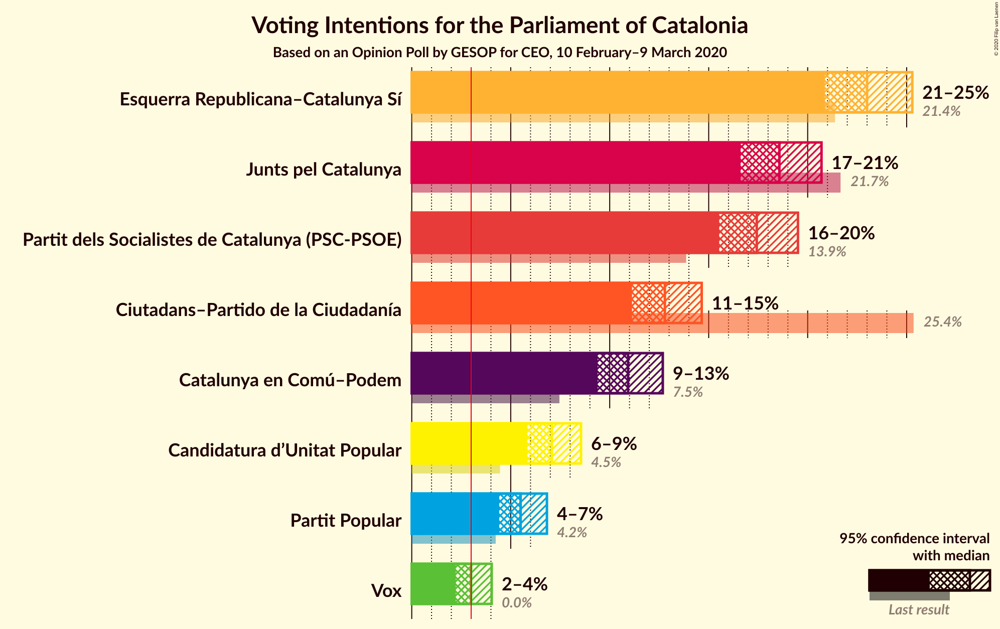

### Confidence Intervals

| Party | Last Result | Poll Result | 80% Confidence Interval | 90% Confidence Interval | 95% Confidence Interval | 99% Confidence Interval |
|:-----:|:-----------:|:-----------:|:-----------------------:|:-----------------------:|:-----------------------:|:-----------------------:|
| Esquerra Republicana–Catalunya Sí | 21.4% | 23.0% | 21.6–24.5% |21.2–24.9% |20.9–25.3% |20.2–26.0% |
| Junts per Catalunya | 21.7% | 18.6% | 17.3–20.0% |16.9–20.4% |16.6–20.7% |16.0–21.4% |
| Partit dels Socialistes de Catalunya (PSC-PSOE) | 13.9% | 17.4% | 16.2–18.8% |15.8–19.2% |15.5–19.5% |15.0–20.2% |
| Ciutadans–Partido de la Ciudadanía | 25.4% | 12.8% | 11.7–14.0% |11.4–14.3% |11.1–14.6% |10.6–15.2% |
| Catalunya en Comú–Podem | 7.5% | 10.9% | 9.9–12.1% |9.6–12.4% |9.4–12.7% |8.9–13.2% |
| Candidatura d’Unitat Popular | 4.5% | 7.1% | 6.3–8.0% |6.0–8.3% |5.8–8.6% |5.5–9.0% |
| Partit Popular | 4.2% | 5.5% | 4.8–6.4% |4.6–6.6% |4.4–6.8% |4.1–7.3% |
| Vox | 0.0% | 3.0% | 2.5–3.7% |2.3–3.9% |2.2–4.0% |2.0–4.4% |

*Note:* The poll result column reflects the actual value used in the calculations. Published results may vary slightly, and in addition be rounded to fewer digits.

## Seats

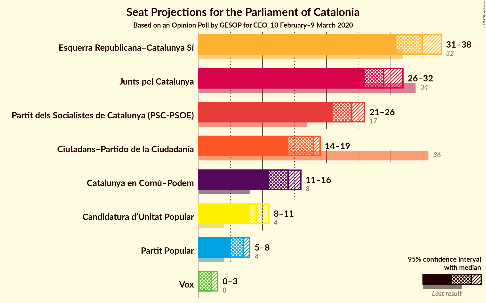

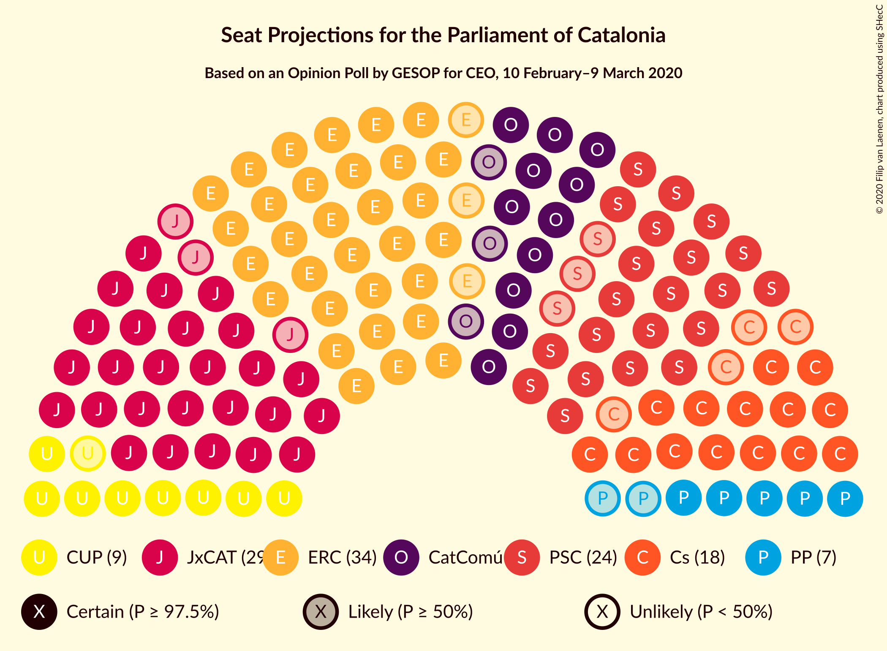

### Confidence Intervals

| Party | Last Result | Median | 80% Confidence Interval | 90% Confidence Interval | 95% Confidence Interval | 99% Confidence Interval |
|:-----:|:-----------:|:------:|:-----------------------:|:-----------------------:|:-----------------------:|:-----------------------:|
| <a href="#esquerra-republicana–catalunya-sí">Esquerra Republicana–Catalunya Sí</a> | 32 | 35 | 32–37 |31–37 |31–38 |30–39 |
| <a href="#junts-per-catalunya">Junts per Catalunya</a> | 34 | 29 | 27–31 |26–32 |26–32 |24–33 |
| <a href="#partit-dels-socialistes-de-catalunya-(psc-psoe)">Partit dels Socialistes de Catalunya (PSC-PSOE)</a> | 17 | 24 | 22–25 |21–26 |21–26 |19–27 |
| <a href="#ciutadans–partido-de-la-ciudadanía">Ciutadans–Partido de la Ciudadanía</a> | 36 | 18 | 15–19 |14–19 |14–19 |14–20 |
| <a href="#catalunya-en-comú–podem">Catalunya en Comú–Podem</a> | 8 | 14 | 12–15 |11–16 |11–16 |11–17 |
| <a href="#candidatura-d’unitat-popular">Candidatura d’Unitat Popular</a> | 4 | 9 | 8–11 |8–11 |8–11 |7–12 |
| <a href="#partit-popular">Partit Popular</a> | 4 | 7 | 5–7 |5–8 |5–8 |4–9 |
| <a href="#vox">Vox</a> | 0 | 2 | 0–3 |0–3 |0–3 |0–4 |

### Esquerra Republicana–Catalunya Sí

*For a full overview of the results for this party, see the [Esquerra Republicana–Catalunya Sí](party-esquerrarepublicana–catalunyasí.html) page.*

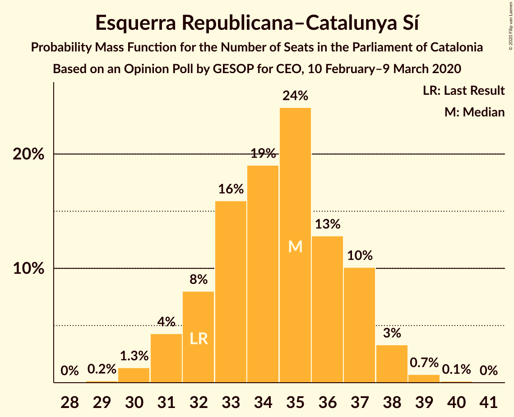

| Number of Seats | Probability | Accumulated | Special Marks |
|:---------------:|:-----------:|:-----------:|:-------------:|
| 29 | 0.2% | 100% |  |
| 30 | 1.3% | 99.8% |  |
| 31 | 4% | 98% |  |
| 32 | 8% | 94% | Last Result |
| 33 | 16% | 86% |  |
| 34 | 19% | 70% |  |
| 35 | 24% | 51% | Median |
| 36 | 13% | 27% |  |
| 37 | 10% | 14% |  |
| 38 | 3% | 4% |  |
| 39 | 0.7% | 0.9% |  |
| 40 | 0.1% | 0.2% |  |
| 41 | 0% | 0% |  |

### Junts per Catalunya

*For a full overview of the results for this party, see the [Junts per Catalunya](party-juntspercatalunya.html) page.*

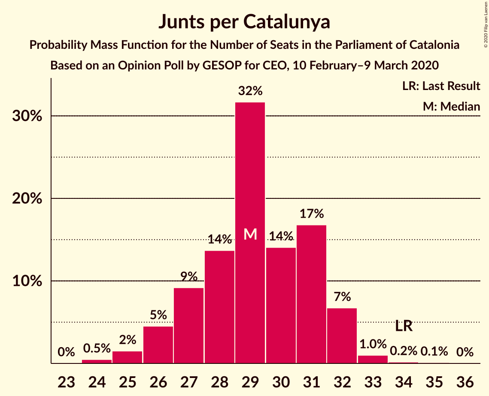

| Number of Seats | Probability | Accumulated | Special Marks |
|:---------------:|:-----------:|:-----------:|:-------------:|
| 24 | 0.5% | 100% |  |
| 25 | 2% | 99.5% |  |
| 26 | 5% | 98% |  |
| 27 | 9% | 93% |  |
| 28 | 14% | 84% |  |
| 29 | 32% | 71% | Median |
| 30 | 14% | 39% |  |
| 31 | 17% | 25% |  |
| 32 | 7% | 8% |  |
| 33 | 1.0% | 1.3% |  |
| 34 | 0.2% | 0.3% | Last Result |
| 35 | 0.1% | 0.1% |  |
| 36 | 0% | 0% |  |

### Partit dels Socialistes de Catalunya (PSC-PSOE)

*For a full overview of the results for this party, see the [Partit dels Socialistes de Catalunya (PSC-PSOE)](party-partitdelssocialistesdecatalunyapsc-psoe.html) page.*

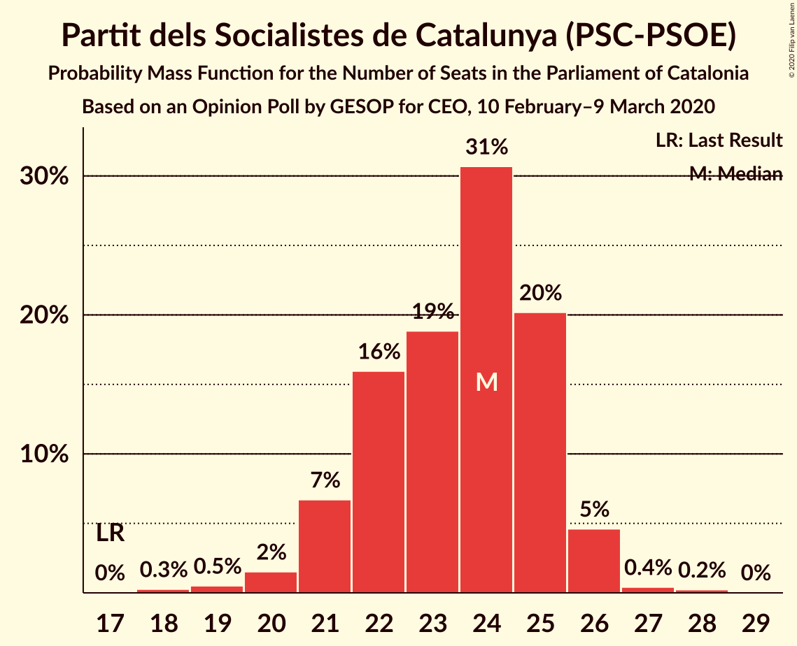

| Number of Seats | Probability | Accumulated | Special Marks |
|:---------------:|:-----------:|:-----------:|:-------------:|
| 17 | 0% | 100% | Last Result |
| 18 | 0.3% | 100% |  |
| 19 | 0.5% | 99.7% |  |
| 20 | 2% | 99.2% |  |
| 21 | 7% | 98% |  |
| 22 | 16% | 91% |  |
| 23 | 19% | 75% |  |
| 24 | 31% | 56% | Median |
| 25 | 20% | 25% |  |
| 26 | 5% | 5% |  |
| 27 | 0.4% | 0.7% |  |
| 28 | 0.2% | 0.3% |  |
| 29 | 0% | 0% |  |

### Ciutadans–Partido de la Ciudadanía

*For a full overview of the results for this party, see the [Ciutadans–Partido de la Ciudadanía](party-ciutadans–partidodelaciudadanía.html) page.*

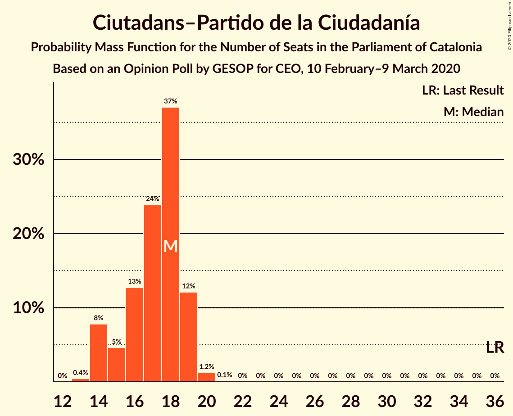

| Number of Seats | Probability | Accumulated | Special Marks |
|:---------------:|:-----------:|:-----------:|:-------------:|
| 13 | 0.4% | 100% |  |
| 14 | 8% | 99.6% |  |
| 15 | 5% | 92% |  |
| 16 | 13% | 87% |  |
| 17 | 24% | 74% |  |
| 18 | 37% | 51% | Median |
| 19 | 12% | 13% |  |
| 20 | 1.2% | 1.4% |  |
| 21 | 0.1% | 0.2% |  |
| 22 | 0% | 0% |  |
| 23 | 0% | 0% |  |
| 24 | 0% | 0% |  |
| 25 | 0% | 0% |  |
| 26 | 0% | 0% |  |
| 27 | 0% | 0% |  |
| 28 | 0% | 0% |  |
| 29 | 0% | 0% |  |
| 30 | 0% | 0% |  |
| 31 | 0% | 0% |  |
| 32 | 0% | 0% |  |
| 33 | 0% | 0% |  |
| 34 | 0% | 0% |  |
| 35 | 0% | 0% |  |
| 36 | 0% | 0% | Last Result |

### Catalunya en Comú–Podem

*For a full overview of the results for this party, see the [Catalunya en Comú–Podem](party-catalunyaencomú–podem.html) page.*

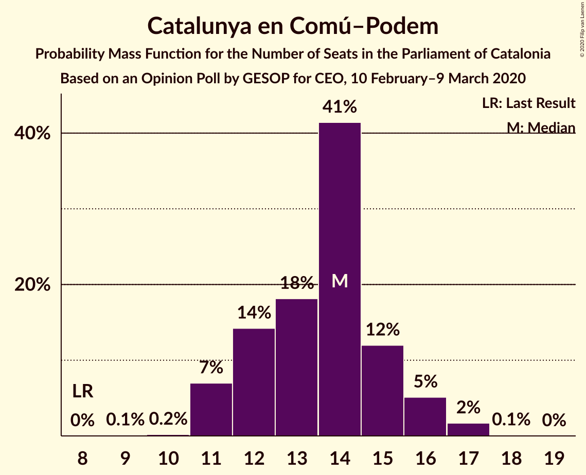

| Number of Seats | Probability | Accumulated | Special Marks |
|:---------------:|:-----------:|:-----------:|:-------------:|
| 8 | 0% | 100% | Last Result |
| 9 | 0.1% | 100% |  |
| 10 | 0.2% | 99.9% |  |
| 11 | 7% | 99.7% |  |
| 12 | 14% | 93% |  |
| 13 | 18% | 78% |  |
| 14 | 41% | 60% | Median |
| 15 | 12% | 19% |  |
| 16 | 5% | 7% |  |
| 17 | 2% | 2% |  |
| 18 | 0.1% | 0.1% |  |
| 19 | 0% | 0% |  |

### Candidatura d’Unitat Popular

*For a full overview of the results for this party, see the [Candidatura d’Unitat Popular](party-candidaturad’unitatpopular.html) page.*

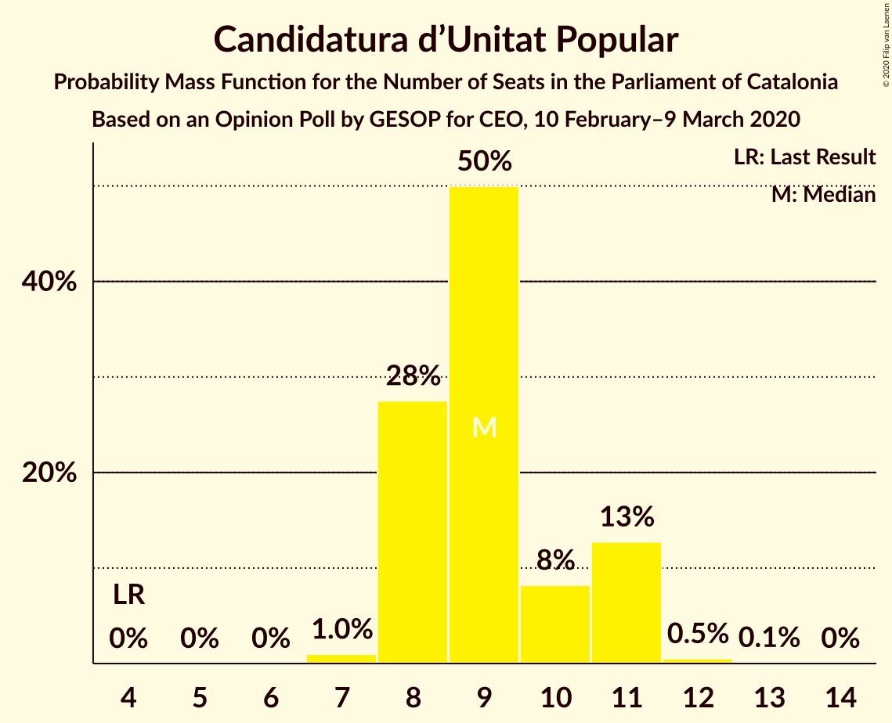

| Number of Seats | Probability | Accumulated | Special Marks |
|:---------------:|:-----------:|:-----------:|:-------------:|
| 4 | 0% | 100% | Last Result |
| 5 | 0% | 100% |  |
| 6 | 0% | 100% |  |
| 7 | 1.0% | 100% |  |
| 8 | 28% | 99.0% |  |
| 9 | 50% | 72% | Median |
| 10 | 8% | 22% |  |
| 11 | 13% | 13% |  |
| 12 | 0.5% | 0.6% |  |
| 13 | 0.1% | 0.1% |  |
| 14 | 0% | 0% |  |

### Partit Popular

*For a full overview of the results for this party, see the [Partit Popular](party-partitpopular.html) page.*

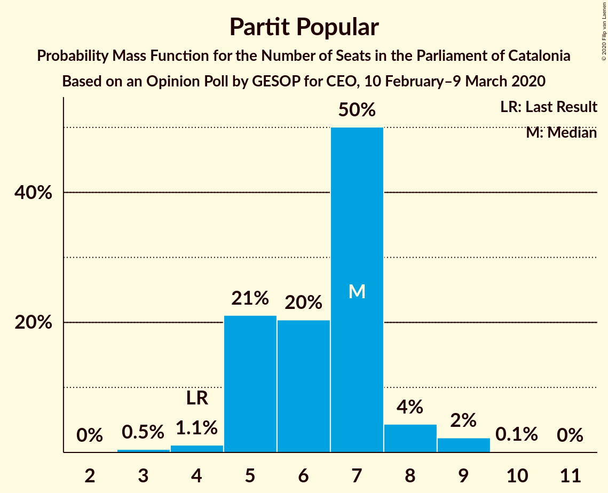

| Number of Seats | Probability | Accumulated | Special Marks |
|:---------------:|:-----------:|:-----------:|:-------------:|
| 3 | 0.4% | 100% |  |
| 4 | 1.1% | 99.6% | Last Result |
| 5 | 18% | 98% |  |
| 6 | 22% | 80% |  |
| 7 | 51% | 58% | Median |
| 8 | 5% | 7% |  |
| 9 | 2% | 2% |  |
| 10 | 0.2% | 0.2% |  |
| 11 | 0% | 0% |  |

### Vox

*For a full overview of the results for this party, see the [Vox](party-vox.html) page.*

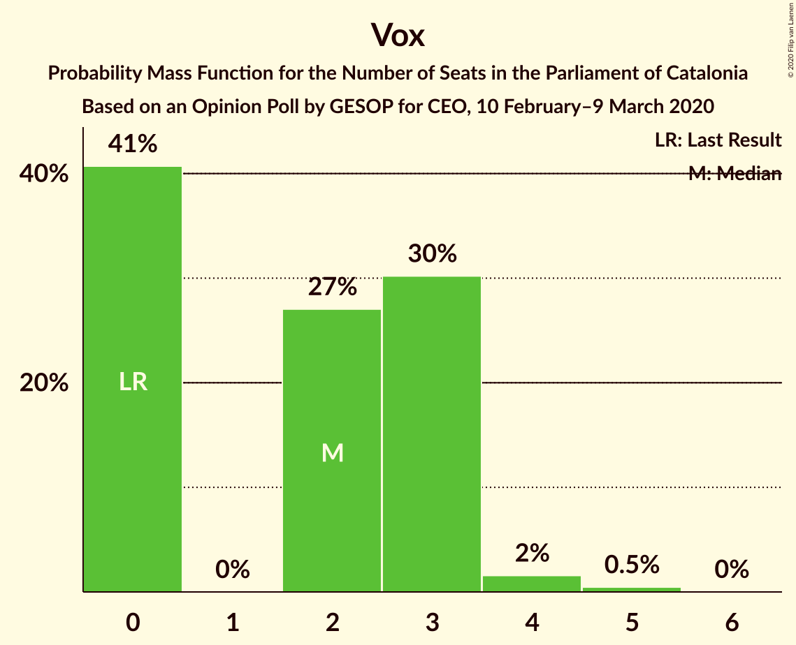

| Number of Seats | Probability | Accumulated | Special Marks |
|:---------------:|:-----------:|:-----------:|:-------------:|
| 0 | 41% | 100% | Last Result |
| 1 | 0% | 59% |  |
| 2 | 27% | 59% | Median |
| 3 | 30% | 32% |  |
| 4 | 2% | 2% |  |
| 5 | 0.5% | 0.5% |  |
| 6 | 0% | 0% |  |

## Coalitions

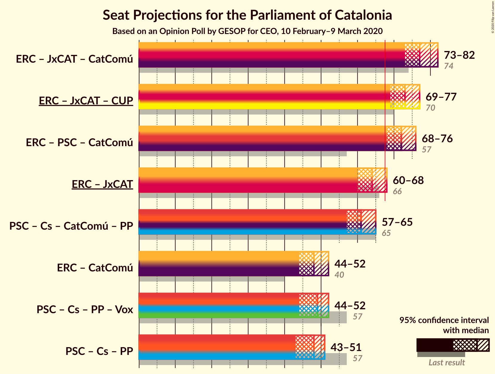

### Confidence Intervals

| Coalition | Last Result | Median | Majority? | 80% Confidence Interval | 90% Confidence Interval | 95% Confidence Interval | 99% Confidence Interval |
|:---------:|:-----------:|:------:|:---------:|:-----------------------:|:-----------------------:|:-----------------------:|:-----------------------:|
| Esquerra Republicana–Catalunya Sí – Junts per Catalunya – Catalunya en Comú–Podem | 74 | 77 | 100% | 75–80 | 74–81 | 73–82 | 72–83 |
| Esquerra Republicana–Catalunya Sí – Junts per Catalunya – Candidatura d’Unitat Popular | 70 | 73 | 99.5% | 70–75 | 70–76 | 69–77 | 68–78 |
| Esquerra Republicana–Catalunya Sí – Partit dels Socialistes de Catalunya (PSC-PSOE) – Catalunya en Comú–Podem | 57 | 72 | 98% | 68–74 | 68–75 | 68–76 | 66–78 |
| Esquerra Republicana–Catalunya Sí – Junts per Catalunya | 66 | 64 | 3% | 61–66 | 60–67 | 60–68 | 59–69 |
| Partit dels Socialistes de Catalunya (PSC-PSOE) – Ciutadans–Partido de la Ciudadanía – Catalunya en Comú–Podem – Partit Popular | 65 | 61 | 0.1% | 58–63 | 57–64 | 57–65 | 55–66 |
| Esquerra Republicana–Catalunya Sí – Catalunya en Comú–Podem | 40 | 48 | 0% | 45–51 | 45–51 | 44–52 | 43–53 |
| Partit dels Socialistes de Catalunya (PSC-PSOE) – Ciutadans–Partido de la Ciudadanía – Partit Popular – Vox | 57 | 49 | 0% | 45–51 | 45–52 | 44–52 | 43–54 |
| Partit dels Socialistes de Catalunya (PSC-PSOE) – Ciutadans–Partido de la Ciudadanía – Partit Popular | 57 | 48 | 0% | 44–49 | 43–50 | 43–51 | 42–52 |

### Esquerra Republicana–Catalunya Sí – Junts per Catalunya – Catalunya en Comú–Podem

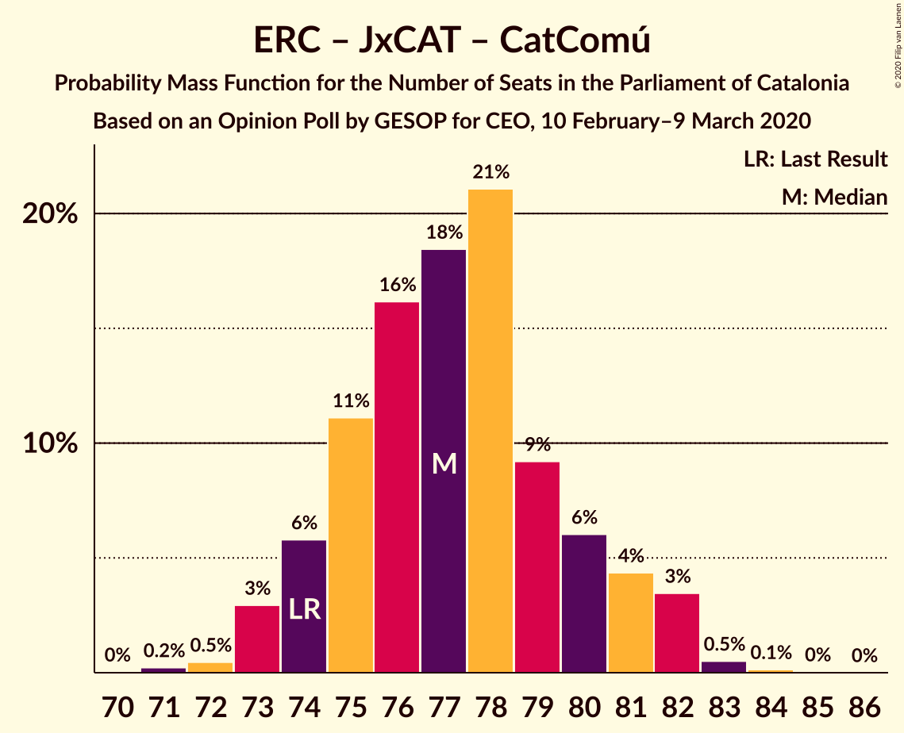

| Number of Seats | Probability | Accumulated | Special Marks |
|:---------------:|:-----------:|:-----------:|:-------------:|
| 71 | 0.2% | 100% |  |
| 72 | 0.5% | 99.7% |  |
| 73 | 3% | 99.3% |  |
| 74 | 6% | 96% | Last Result |
| 75 | 11% | 91% |  |
| 76 | 16% | 79% |  |
| 77 | 18% | 63% |  |
| 78 | 21% | 45% | Median |
| 79 | 9% | 24% |  |
| 80 | 6% | 15% |  |
| 81 | 4% | 9% |  |
| 82 | 3% | 4% |  |
| 83 | 0.5% | 0.7% |  |
| 84 | 0.1% | 0.2% |  |
| 85 | 0% | 0.1% |  |
| 86 | 0% | 0% |  |

### Esquerra Republicana–Catalunya Sí – Junts per Catalunya – Candidatura d’Unitat Popular

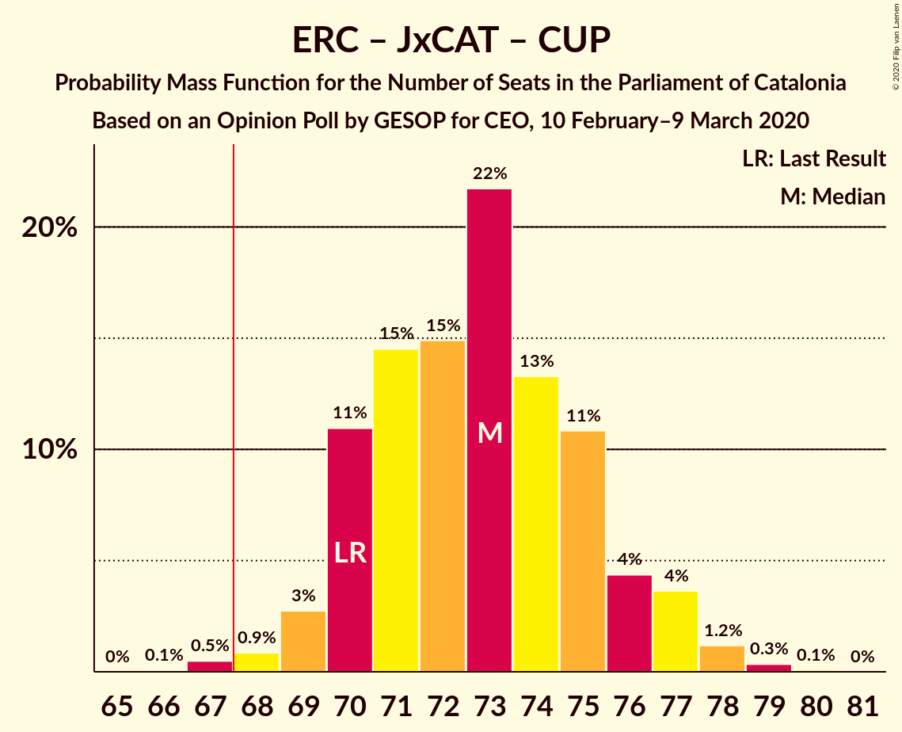

| Number of Seats | Probability | Accumulated | Special Marks |
|:---------------:|:-----------:|:-----------:|:-------------:|
| 66 | 0.1% | 100% |  |
| 67 | 0.4% | 99.9% |  |
| 68 | 1.2% | 99.5% | Majority |
| 69 | 3% | 98% |  |
| 70 | 10% | 96% | Last Result |
| 71 | 14% | 86% |  |
| 72 | 18% | 72% |  |
| 73 | 21% | 54% | Median |
| 74 | 13% | 33% |  |
| 75 | 10% | 20% |  |
| 76 | 6% | 10% |  |
| 77 | 3% | 4% |  |
| 78 | 1.0% | 1.3% |  |
| 79 | 0.2% | 0.3% |  |
| 80 | 0.1% | 0.1% |  |
| 81 | 0% | 0% |  |

### Esquerra Republicana–Catalunya Sí – Partit dels Socialistes de Catalunya (PSC-PSOE) – Catalunya en Comú–Podem

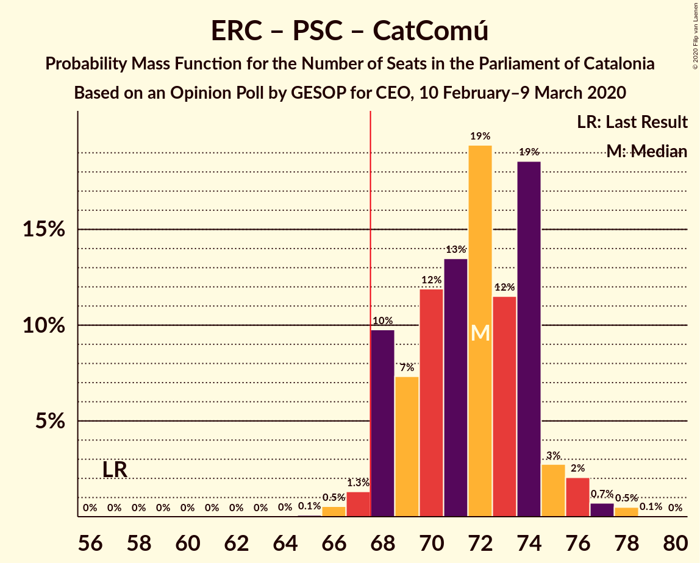

| Number of Seats | Probability | Accumulated | Special Marks |
|:---------------:|:-----------:|:-----------:|:-------------:|
| 57 | 0% | 100% | Last Result |
| 58 | 0% | 100% |  |
| 59 | 0% | 100% |  |
| 60 | 0% | 100% |  |
| 61 | 0% | 100% |  |
| 62 | 0% | 100% |  |
| 63 | 0% | 100% |  |
| 64 | 0% | 100% |  |
| 65 | 0.1% | 100% |  |
| 66 | 0.5% | 99.9% |  |
| 67 | 2% | 99.4% |  |
| 68 | 8% | 98% | Majority |
| 69 | 9% | 90% |  |
| 70 | 15% | 81% |  |
| 71 | 16% | 66% |  |
| 72 | 14% | 50% |  |
| 73 | 13% | 36% | Median |
| 74 | 16% | 23% |  |
| 75 | 4% | 7% |  |
| 76 | 2% | 3% |  |
| 77 | 0.7% | 1.3% |  |
| 78 | 0.6% | 0.6% |  |
| 79 | 0% | 0.1% |  |
| 80 | 0% | 0% |  |

### Esquerra Republicana–Catalunya Sí – Junts per Catalunya

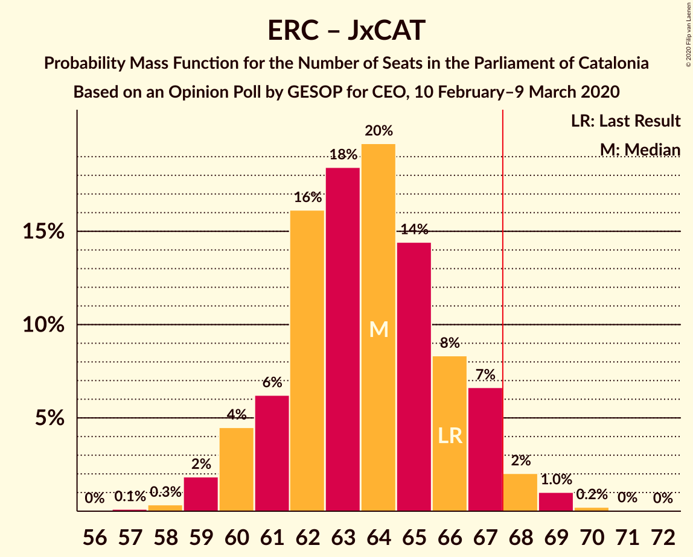

| Number of Seats | Probability | Accumulated | Special Marks |
|:---------------:|:-----------:|:-----------:|:-------------:|
| 57 | 0.1% | 100% |  |
| 58 | 0.3% | 99.9% |  |
| 59 | 2% | 99.5% |  |
| 60 | 4% | 98% |  |
| 61 | 6% | 93% |  |
| 62 | 16% | 87% |  |
| 63 | 18% | 71% |  |
| 64 | 20% | 52% | Median |
| 65 | 14% | 33% |  |
| 66 | 8% | 18% | Last Result |
| 67 | 7% | 10% |  |
| 68 | 2% | 3% | Majority |
| 69 | 1.0% | 1.3% |  |
| 70 | 0.2% | 0.3% |  |
| 71 | 0% | 0.1% |  |
| 72 | 0% | 0% |  |

### Partit dels Socialistes de Catalunya (PSC-PSOE) – Ciutadans–Partido de la Ciudadanía – Catalunya en Comú–Podem – Partit Popular

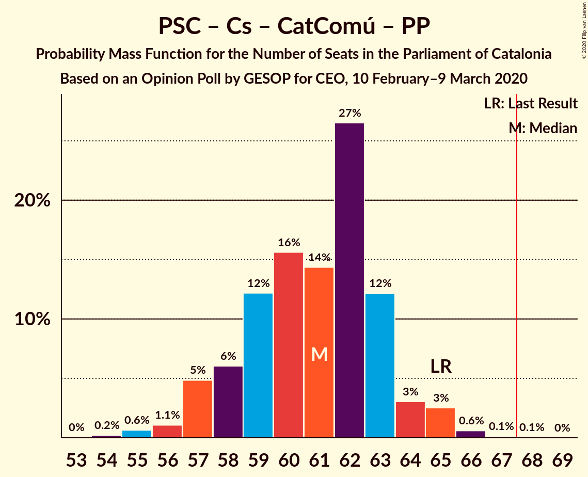

| Number of Seats | Probability | Accumulated | Special Marks |
|:---------------:|:-----------:|:-----------:|:-------------:|
| 54 | 0.2% | 100% |  |
| 55 | 0.8% | 99.8% |  |
| 56 | 1.0% | 99.0% |  |
| 57 | 5% | 98% |  |
| 58 | 9% | 93% |  |
| 59 | 12% | 84% |  |
| 60 | 16% | 73% |  |
| 61 | 16% | 57% |  |
| 62 | 23% | 41% |  |
| 63 | 11% | 18% | Median |
| 64 | 4% | 7% |  |
| 65 | 3% | 3% | Last Result |
| 66 | 0.5% | 0.7% |  |
| 67 | 0.2% | 0.2% |  |
| 68 | 0% | 0.1% | Majority |
| 69 | 0% | 0% |  |

### Esquerra Republicana–Catalunya Sí – Catalunya en Comú–Podem

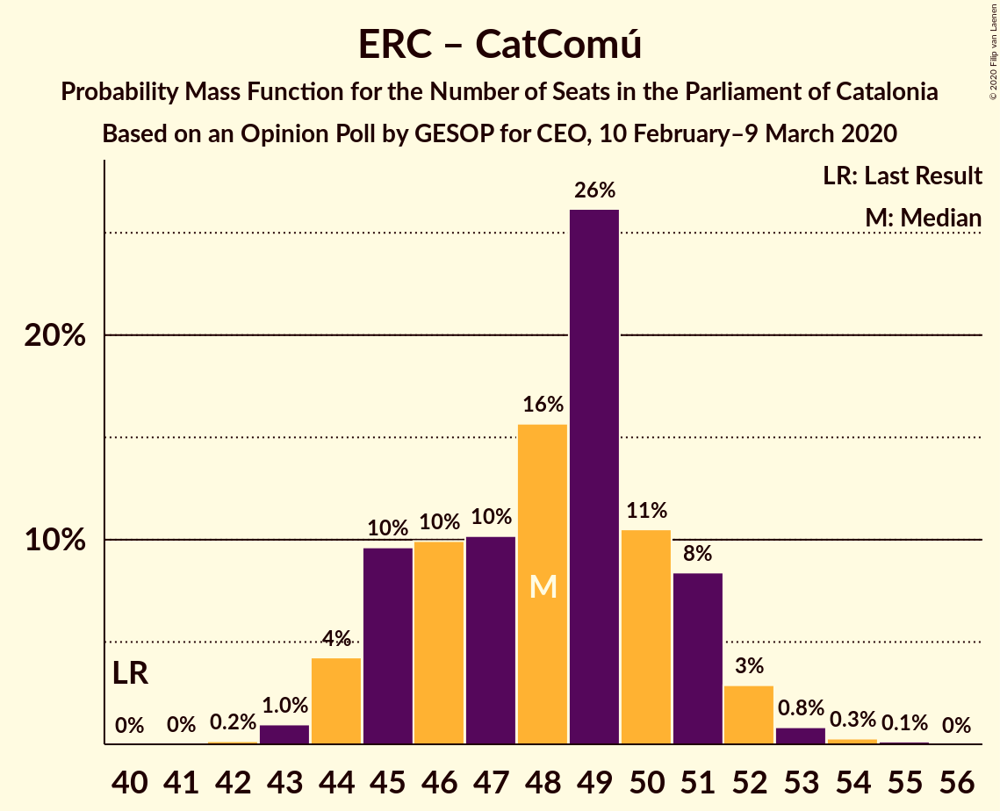

| Number of Seats | Probability | Accumulated | Special Marks |
|:---------------:|:-----------:|:-----------:|:-------------:|
| 40 | 0% | 100% | Last Result |
| 41 | 0% | 100% |  |
| 42 | 0.1% | 100% |  |
| 43 | 0.8% | 99.9% |  |
| 44 | 4% | 99.1% |  |
| 45 | 9% | 95% |  |
| 46 | 12% | 86% |  |
| 47 | 12% | 75% |  |
| 48 | 16% | 63% |  |
| 49 | 25% | 47% | Median |
| 50 | 9% | 22% |  |
| 51 | 9% | 13% |  |
| 52 | 3% | 4% |  |
| 53 | 1.0% | 1.4% |  |
| 54 | 0.2% | 0.3% |  |
| 55 | 0.1% | 0.1% |  |
| 56 | 0% | 0% |  |

### Partit dels Socialistes de Catalunya (PSC-PSOE) – Ciutadans–Partido de la Ciudadanía – Partit Popular – Vox

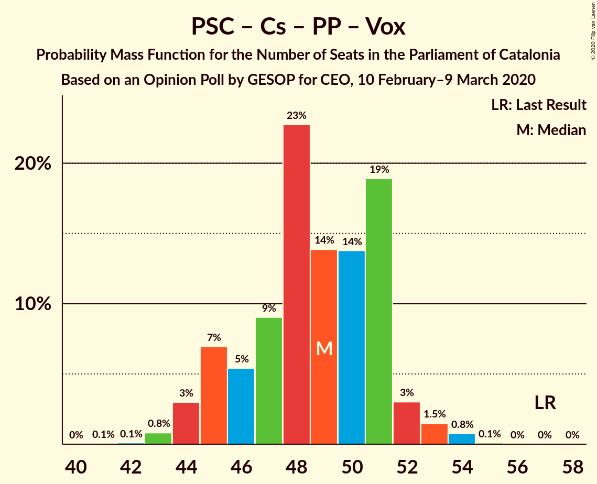

| Number of Seats | Probability | Accumulated | Special Marks |
|:---------------:|:-----------:|:-----------:|:-------------:|
| 41 | 0% | 100% |  |
| 42 | 0.1% | 99.9% |  |
| 43 | 0.6% | 99.8% |  |
| 44 | 2% | 99.3% |  |
| 45 | 7% | 97% |  |
| 46 | 5% | 90% |  |
| 47 | 9% | 85% |  |
| 48 | 23% | 76% |  |
| 49 | 16% | 53% |  |
| 50 | 14% | 37% |  |
| 51 | 18% | 23% | Median |
| 52 | 3% | 5% |  |
| 53 | 1.3% | 2% |  |
| 54 | 0.7% | 0.8% |  |
| 55 | 0.1% | 0.1% |  |
| 56 | 0% | 0% |  |
| 57 | 0% | 0% | Last Result |

### Partit dels Socialistes de Catalunya (PSC-PSOE) – Ciutadans–Partido de la Ciudadanía – Partit Popular

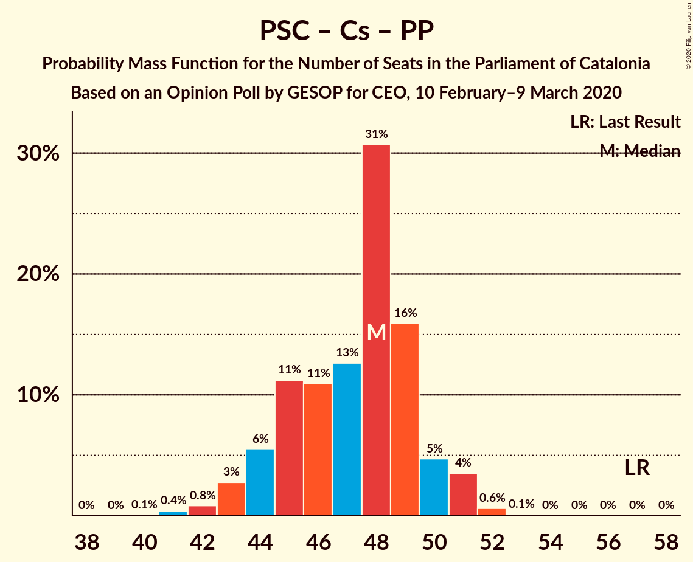

| Number of Seats | Probability | Accumulated | Special Marks |
|:---------------:|:-----------:|:-----------:|:-------------:|
| 40 | 0% | 100% |  |
| 41 | 0.3% | 99.9% |  |
| 42 | 0.8% | 99.6% |  |
| 43 | 4% | 98.7% |  |
| 44 | 5% | 94% |  |
| 45 | 11% | 89% |  |
| 46 | 14% | 78% |  |
| 47 | 12% | 64% |  |
| 48 | 27% | 52% |  |
| 49 | 15% | 25% | Median |
| 50 | 6% | 10% |  |
| 51 | 3% | 4% |  |
| 52 | 0.6% | 0.8% |  |
| 53 | 0.1% | 0.2% |  |
| 54 | 0% | 0% |  |
| 55 | 0% | 0% |  |
| 56 | 0% | 0% |  |
| 57 | 0% | 0% | Last Result |

## Technical Information

### Opinion Poll

+ **Polling firm:** GESOP
+ **Commissioner(s):** CEO
+ **Fieldwork period:** 10 February–9 March 2020

### Calculations

+ **Sample size:** 1400
+ **Simulations done:** 1,048,576
+ **Error estimate:** 1.08%

