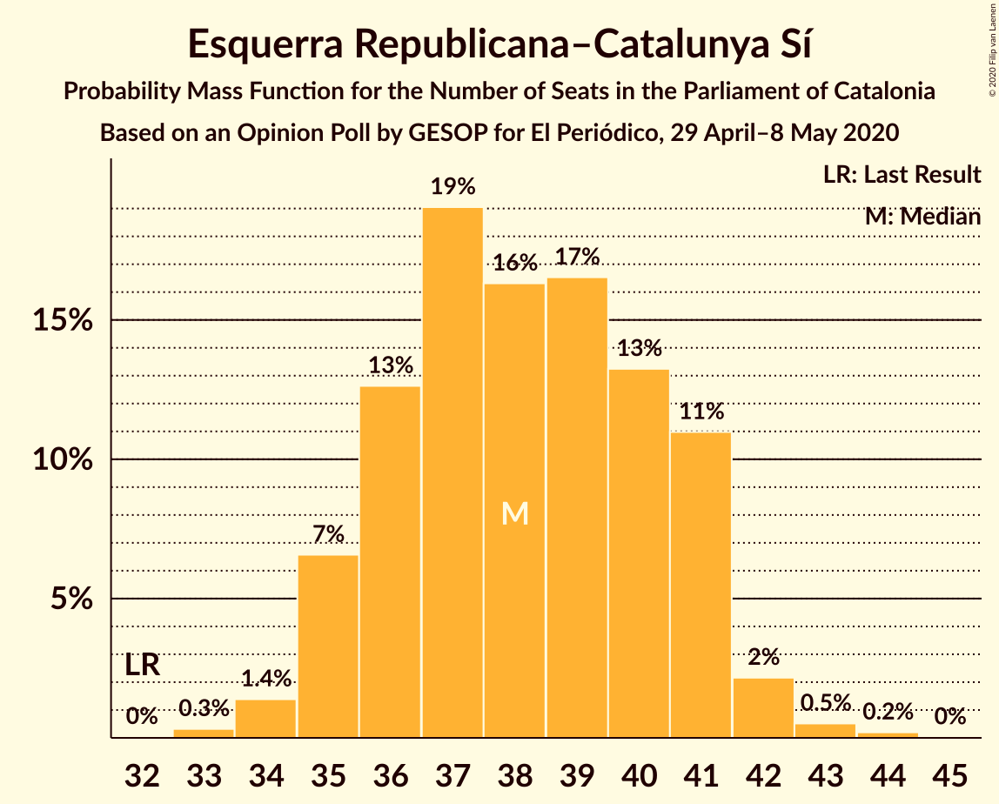
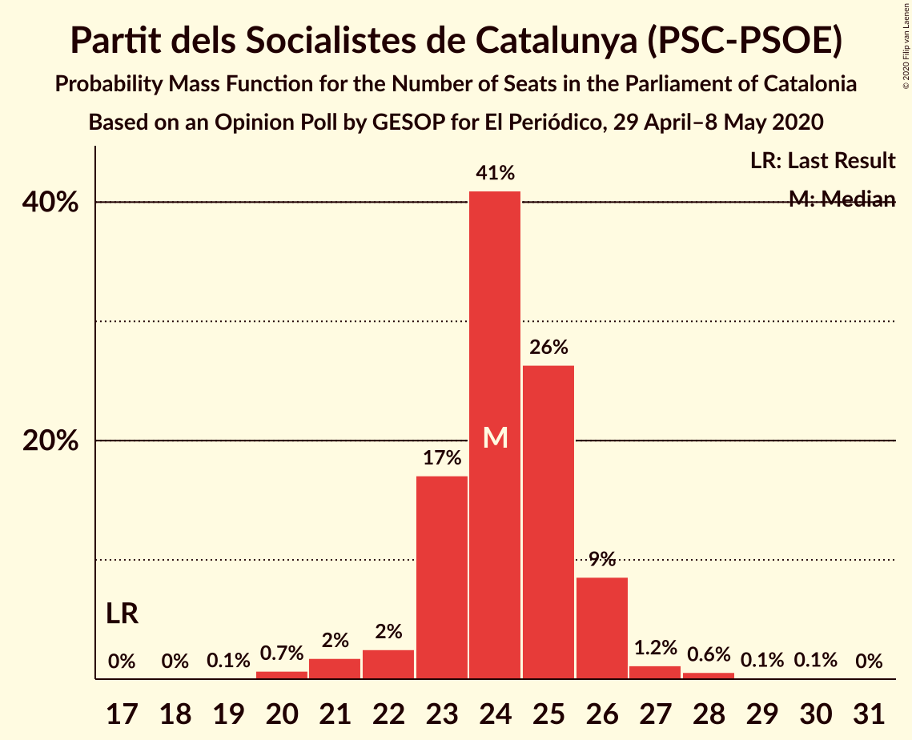
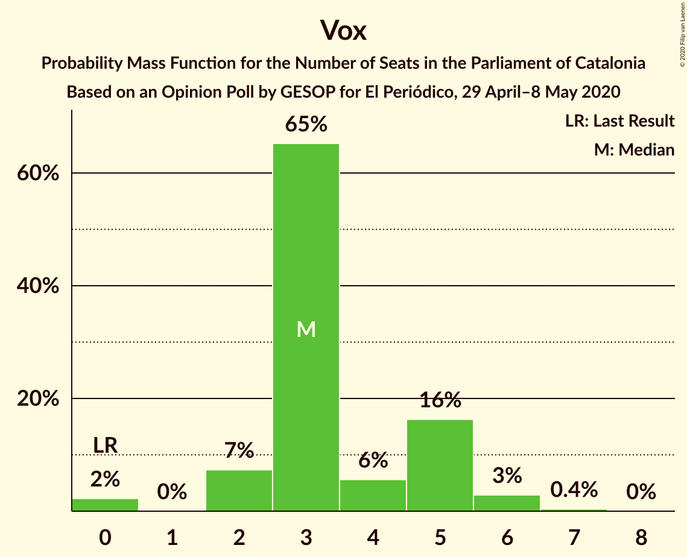
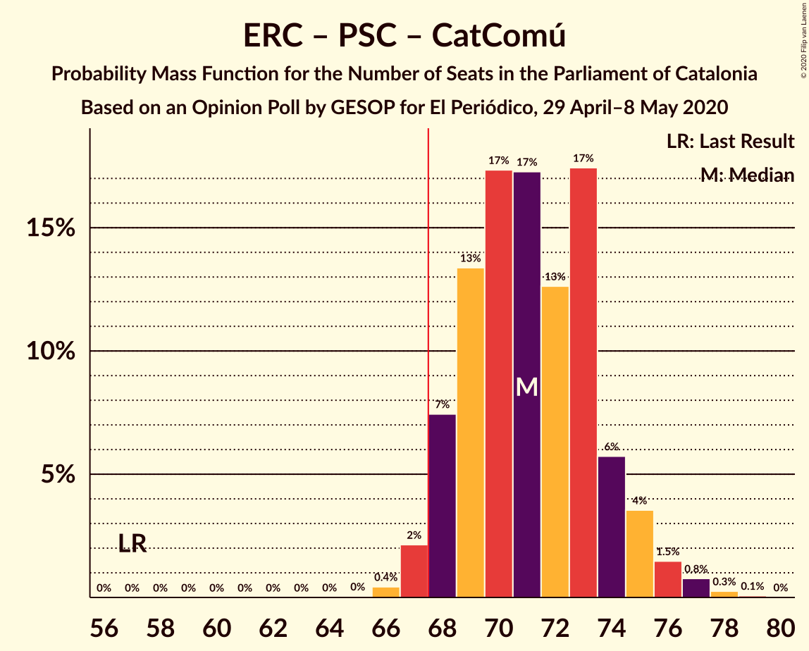

# Opinion Poll by GESOP for El Periódico, 29 April–8 May 2020

<a href="#voting-intentions">Voting Intentions</a> | <a href="#seats">Seats</a> | <a href="#coalitions">Coalitions</a> | <a href="#technical-information">Technical Information</a>

## Voting Intentions

### Confidence Intervals

| Party | Last Result | Poll Result | 80% Confidence Interval | 90% Confidence Interval | 95% Confidence Interval | 99% Confidence Interval |
|:-----:|:-----------:|:-----------:|:-----------------------:|:-----------------------:|:-----------------------:|:-----------------------:|
| Esquerra Republicana–Catalunya Sí | 21.4% | 25.2% | 23.8–26.7% |23.4–27.2% |23.0–27.5% |22.4–28.3% |
| Partit dels Socialistes de Catalunya (PSC-PSOE) | 13.9% | 18.0% | 16.8–19.4% |16.4–19.7% |16.1–20.1% |15.5–20.7% |
| Junts pel Catalunya | 21.7% | 16.8% | 15.6–18.1% |15.2–18.5% |14.9–18.8% |14.4–19.4% |
| Ciutadans–Partido de la Ciudadanía | 25.4% | 12.9% | 11.8–14.1% |11.6–14.4% |11.3–14.8% |10.8–15.3% |
| Catalunya en Comú–Podem | 7.5% | 7.7% | 6.9–8.7% |6.6–8.9% |6.4–9.2% |6.1–9.7% |
| Partit Popular | 4.2% | 6.3% | 5.6–7.2% |5.4–7.5% |5.2–7.7% |4.8–8.2% |
| Candidatura d’Unitat Popular | 4.5% | 6.1% | 5.4–7.0% |5.2–7.3% |5.0–7.5% |4.7–7.9% |
| Vox | 0.0% | 3.8% | 3.2–4.5% |3.0–4.7% |2.9–4.9% |2.7–5.3% |

*Note:* The poll result column reflects the actual value used in the calculations. Published results may vary slightly, and in addition be rounded to fewer digits.

## Seats

### Confidence Intervals

| Party | Last Result | Median | 80% Confidence Interval | 90% Confidence Interval | 95% Confidence Interval | 99% Confidence Interval |
|:-----:|:-----------:|:------:|:-----------------------:|:-----------------------:|:-----------------------:|:-----------------------:|
| <a href="#esquerra-republicana–catalunya-sí">Esquerra Republicana–Catalunya Sí</a> | 32 | 39 | 35–41 |35–42 |35–42 |34–43 |
| <a href="#partit-dels-socialistes-de-catalunya-(psc-psoe)">Partit dels Socialistes de Catalunya (PSC-PSOE)</a> | 17 | 24 | 23–26 |22–27 |20–27 |20–28 |
| <a href="#junts-pel-catalunya">Junts pel Catalunya</a> | 34 | 26 | 24–30 |23–31 |23–31 |23–31 |
| <a href="#ciutadans–partido-de-la-ciudadanía">Ciutadans–Partido de la Ciudadanía</a> | 36 | 18 | 16–19 |15–19 |14–20 |14–20 |
| <a href="#catalunya-en-comú–podem">Catalunya en Comú–Podem</a> | 8 | 8 | 8–10 |7–11 |7–11 |6–11 |
| <a href="#partit-popular">Partit Popular</a> | 4 | 8 | 7–9 |6–10 |6–10 |6–10 |
| <a href="#candidatura-d’unitat-popular">Candidatura d’Unitat Popular</a> | 4 | 8 | 7–9 |7–9 |6–10 |5–11 |
| <a href="#vox">Vox</a> | 0 | 3 | 2–5 |2–5 |0–6 |0–6 |

### Esquerra Republicana–Catalunya Sí

*For a full overview of the results for this party, see the [Esquerra Republicana–Catalunya Sí](party-esquerrarepublicana–catalunyasí.html) page.*

| Number of Seats | Probability | Accumulated | Special Marks |
|:---------------:|:-----------:|:-----------:|:-------------:|
| 32 | 0.1% | 100% | Last Result |
| 33 | 0.3% | 99.9% |  |
| 34 | 1.2% | 99.7% |  |
| 35 | 12% | 98% |  |
| 36 | 7% | 87% |  |
| 37 | 17% | 80% |  |
| 38 | 12% | 63% |  |
| 39 | 14% | 51% | Median |
| 40 | 18% | 37% |  |
| 41 | 13% | 19% |  |
| 42 | 4% | 6% |  |
| 43 | 2% | 2% |  |
| 44 | 0.4% | 0.5% |  |
| 45 | 0.1% | 0.1% |  |
| 46 | 0% | 0% |  |

### Partit dels Socialistes de Catalunya (PSC-PSOE)

*For a full overview of the results for this party, see the [Partit dels Socialistes de Catalunya (PSC-PSOE)](party-partitdelssocialistesdecatalunyapsc-psoe.html) page.*

| Number of Seats | Probability | Accumulated | Special Marks |
|:---------------:|:-----------:|:-----------:|:-------------:|
| 17 | 0% | 100% | Last Result |
| 18 | 0% | 100% |  |
| 19 | 0.4% | 100% |  |
| 20 | 3% | 99.5% |  |
| 21 | 1.2% | 97% |  |
| 22 | 4% | 95% |  |
| 23 | 18% | 91% |  |
| 24 | 29% | 73% | Median |
| 25 | 27% | 44% |  |
| 26 | 10% | 17% |  |
| 27 | 5% | 7% |  |
| 28 | 2% | 2% |  |
| 29 | 0.1% | 0.3% |  |
| 30 | 0.2% | 0.2% |  |
| 31 | 0% | 0% |  |

### Junts pel Catalunya

*For a full overview of the results for this party, see the [Junts pel Catalunya](party-juntspelcatalunya.html) page.*

| Number of Seats | Probability | Accumulated | Special Marks |
|:---------------:|:-----------:|:-----------:|:-------------:|
| 21 | 0.1% | 100% |  |
| 22 | 0.1% | 99.9% |  |
| 23 | 8% | 99.8% |  |
| 24 | 13% | 92% |  |
| 25 | 13% | 79% |  |
| 26 | 20% | 66% | Median |
| 27 | 8% | 46% |  |
| 28 | 11% | 37% |  |
| 29 | 14% | 26% |  |
| 30 | 4% | 12% |  |
| 31 | 8% | 8% |  |
| 32 | 0.1% | 0.1% |  |
| 33 | 0% | 0% |  |
| 34 | 0% | 0% | Last Result |

### Ciutadans–Partido de la Ciudadanía

*For a full overview of the results for this party, see the [Ciutadans–Partido de la Ciudadanía](party-ciutadans–partidodelaciudadanía.html) page.*

| Number of Seats | Probability | Accumulated | Special Marks |
|:---------------:|:-----------:|:-----------:|:-------------:|
| 13 | 0.2% | 100% |  |
| 14 | 3% | 99.8% |  |
| 15 | 2% | 97% |  |
| 16 | 7% | 95% |  |
| 17 | 16% | 87% |  |
| 18 | 44% | 71% | Median |
| 19 | 24% | 28% |  |
| 20 | 3% | 3% |  |
| 21 | 0.4% | 0.5% |  |
| 22 | 0.1% | 0.1% |  |
| 23 | 0% | 0% |  |
| 24 | 0% | 0% |  |
| 25 | 0% | 0% |  |
| 26 | 0% | 0% |  |
| 27 | 0% | 0% |  |
| 28 | 0% | 0% |  |
| 29 | 0% | 0% |  |
| 30 | 0% | 0% |  |
| 31 | 0% | 0% |  |
| 32 | 0% | 0% |  |
| 33 | 0% | 0% |  |
| 34 | 0% | 0% |  |
| 35 | 0% | 0% |  |
| 36 | 0% | 0% | Last Result |

### Catalunya en Comú–Podem

*For a full overview of the results for this party, see the [Catalunya en Comú–Podem](party-catalunyaencomú–podem.html) page.*

| Number of Seats | Probability | Accumulated | Special Marks |
|:---------------:|:-----------:|:-----------:|:-------------:|
| 5 | 0.2% | 100% |  |
| 6 | 0.8% | 99.8% |  |
| 7 | 7% | 99.0% |  |
| 8 | 54% | 92% | Last Result, Median |
| 9 | 18% | 38% |  |
| 10 | 11% | 20% |  |
| 11 | 9% | 10% |  |
| 12 | 0.3% | 0.4% |  |
| 13 | 0.1% | 0.1% |  |
| 14 | 0% | 0% |  |

### Partit Popular

*For a full overview of the results for this party, see the [Partit Popular](party-partitpopular.html) page.*

| Number of Seats | Probability | Accumulated | Special Marks |
|:---------------:|:-----------:|:-----------:|:-------------:|
| 4 | 0% | 100% | Last Result |
| 5 | 0.4% | 100% |  |
| 6 | 5% | 99.6% |  |
| 7 | 44% | 95% |  |
| 8 | 8% | 51% | Median |
| 9 | 34% | 43% |  |
| 10 | 8% | 9% |  |
| 11 | 0.4% | 0.5% |  |
| 12 | 0.1% | 0.1% |  |
| 13 | 0% | 0% |  |

### Candidatura d’Unitat Popular

*For a full overview of the results for this party, see the [Candidatura d’Unitat Popular](party-candidaturad’unitatpopular.html) page.*

| Number of Seats | Probability | Accumulated | Special Marks |
|:---------------:|:-----------:|:-----------:|:-------------:|
| 4 | 0.4% | 100% | Last Result |
| 5 | 0.1% | 99.6% |  |
| 6 | 3% | 99.5% |  |
| 7 | 18% | 97% |  |
| 8 | 63% | 78% | Median |
| 9 | 11% | 15% |  |
| 10 | 3% | 4% |  |
| 11 | 0.7% | 0.7% |  |
| 12 | 0% | 0% |  |

### Vox

*For a full overview of the results for this party, see the [Vox](party-vox.html) page.*

| Number of Seats | Probability | Accumulated | Special Marks |
|:---------------:|:-----------:|:-----------:|:-------------:|
| 0 | 3% | 100% | Last Result |
| 1 | 0% | 97% |  |
| 2 | 9% | 97% |  |
| 3 | 65% | 89% | Median |
| 4 | 3% | 24% |  |
| 5 | 17% | 20% |  |
| 6 | 3% | 3% |  |
| 7 | 0.4% | 0.4% |  |
| 8 | 0% | 0% |  |

## Coalitions

### Confidence Intervals

| Coalition | Last Result | Median | Majority? | 80% Confidence Interval | 90% Confidence Interval | 95% Confidence Interval | 99% Confidence Interval |
|:---------:|:-----------:|:------:|:---------:|:-----------------------:|:-----------------------:|:-----------------------:|:-----------------------:|
| Esquerra Republicana–Catalunya Sí – Junts pel Catalunya – Catalunya en Comú–Podem | 74 | 73 | 99.9% | 72–77 | 71–78 | 70–78 | 68–79 |
| Esquerra Republicana–Catalunya Sí – Junts pel Catalunya – Candidatura d’Unitat Popular | 70 | 73 | 99.4% | 71–76 | 70–77 | 69–77 | 67–79 |
| Esquerra Republicana–Catalunya Sí – Partit dels Socialistes de Catalunya (PSC-PSOE) – Catalunya en Comú–Podem | 57 | 72 | 91% | 68–75 | 67–76 | 67–77 | 66–78 |
| Esquerra Republicana–Catalunya Sí – Junts pel Catalunya | 66 | 65 | 13% | 63–68 | 62–69 | 61–69 | 59–71 |
| Partit dels Socialistes de Catalunya (PSC-PSOE) – Ciutadans–Partido de la Ciudadanía – Catalunya en Comú–Podem – Partit Popular | 65 | 59 | 0% | 56–61 | 55–62 | 54–62 | 53–64 |
| Partit dels Socialistes de Catalunya (PSC-PSOE) – Ciutadans–Partido de la Ciudadanía – Partit Popular – Vox | 57 | 54 | 0% | 50–55 | 49–56 | 49–57 | 48–59 |
| Partit dels Socialistes de Catalunya (PSC-PSOE) – Ciutadans–Partido de la Ciudadanía – Partit Popular | 57 | 50 | 0% | 47–52 | 46–53 | 46–53 | 45–55 |
| Esquerra Republicana–Catalunya Sí – Catalunya en Comú–Podem | 40 | 47 | 0% | 44–50 | 43–51 | 43–52 | 42–53 |

### Esquerra Republicana–Catalunya Sí – Junts pel Catalunya – Catalunya en Comú–Podem

| Number of Seats | Probability | Accumulated | Special Marks |
|:---------------:|:-----------:|:-----------:|:-------------:|
| 67 | 0.1% | 100% |  |
| 68 | 0.5% | 99.9% | Majority |
| 69 | 1.1% | 99.3% |  |
| 70 | 2% | 98% |  |
| 71 | 3% | 96% |  |
| 72 | 17% | 93% |  |
| 73 | 29% | 76% | Median |
| 74 | 22% | 47% | Last Result |
| 75 | 9% | 25% |  |
| 76 | 4% | 16% |  |
| 77 | 7% | 12% |  |
| 78 | 3% | 5% |  |
| 79 | 2% | 2% |  |
| 80 | 0.2% | 0.2% |  |
| 81 | 0% | 0% |  |

### Esquerra Republicana–Catalunya Sí – Junts pel Catalunya – Candidatura d’Unitat Popular

| Number of Seats | Probability | Accumulated | Special Marks |
|:---------------:|:-----------:|:-----------:|:-------------:|
| 66 | 0.1% | 100% |  |
| 67 | 0.5% | 99.9% |  |
| 68 | 1.4% | 99.4% | Majority |
| 69 | 1.3% | 98% |  |
| 70 | 3% | 97% | Last Result |
| 71 | 9% | 93% |  |
| 72 | 26% | 84% |  |
| 73 | 23% | 58% | Median |
| 74 | 18% | 35% |  |
| 75 | 5% | 17% |  |
| 76 | 5% | 12% |  |
| 77 | 5% | 7% |  |
| 78 | 1.2% | 2% |  |
| 79 | 0.5% | 0.8% |  |
| 80 | 0.3% | 0.3% |  |
| 81 | 0% | 0% |  |

### Esquerra Republicana–Catalunya Sí – Partit dels Socialistes de Catalunya (PSC-PSOE) – Catalunya en Comú–Podem

| Number of Seats | Probability | Accumulated | Special Marks |
|:---------------:|:-----------:|:-----------:|:-------------:|
| 57 | 0% | 100% | Last Result |
| 58 | 0% | 100% |  |
| 59 | 0% | 100% |  |
| 60 | 0% | 100% |  |
| 61 | 0% | 100% |  |
| 62 | 0% | 100% |  |
| 63 | 0% | 100% |  |
| 64 | 0% | 100% |  |
| 65 | 0.4% | 100% |  |
| 66 | 2% | 99.6% |  |
| 67 | 7% | 98% |  |
| 68 | 19% | 91% | Majority |
| 69 | 5% | 71% |  |
| 70 | 8% | 66% |  |
| 71 | 5% | 58% | Median |
| 72 | 9% | 54% |  |
| 73 | 20% | 44% |  |
| 74 | 11% | 25% |  |
| 75 | 6% | 14% |  |
| 76 | 5% | 8% |  |
| 77 | 1.4% | 3% |  |
| 78 | 0.9% | 1.1% |  |
| 79 | 0.1% | 0.1% |  |
| 80 | 0% | 0% |  |

### Esquerra Republicana–Catalunya Sí – Junts pel Catalunya

| Number of Seats | Probability | Accumulated | Special Marks |
|:---------------:|:-----------:|:-----------:|:-------------:|
| 58 | 0.1% | 100% |  |
| 59 | 0.5% | 99.9% |  |
| 60 | 1.3% | 99.4% |  |
| 61 | 2% | 98% |  |
| 62 | 4% | 96% |  |
| 63 | 6% | 93% |  |
| 64 | 27% | 87% |  |
| 65 | 25% | 60% | Median |
| 66 | 17% | 35% | Last Result |
| 67 | 5% | 18% |  |
| 68 | 6% | 13% | Majority |
| 69 | 5% | 7% |  |
| 70 | 1.2% | 2% |  |
| 71 | 0.6% | 0.7% |  |
| 72 | 0.1% | 0.1% |  |
| 73 | 0% | 0% |  |

### Partit dels Socialistes de Catalunya (PSC-PSOE) – Ciutadans–Partido de la Ciudadanía – Catalunya en Comú–Podem – Partit Popular

| Number of Seats | Probability | Accumulated | Special Marks |
|:---------------:|:-----------:|:-----------:|:-------------:|
| 52 | 0.2% | 100% |  |
| 53 | 0.7% | 99.8% |  |
| 54 | 2% | 99.0% |  |
| 55 | 7% | 97% |  |
| 56 | 7% | 91% |  |
| 57 | 6% | 84% |  |
| 58 | 21% | 77% | Median |
| 59 | 19% | 56% |  |
| 60 | 23% | 37% |  |
| 61 | 9% | 15% |  |
| 62 | 3% | 5% |  |
| 63 | 1.3% | 2% |  |
| 64 | 0.8% | 1.1% |  |
| 65 | 0.3% | 0.4% | Last Result |
| 66 | 0% | 0% |  |

### Partit dels Socialistes de Catalunya (PSC-PSOE) – Ciutadans–Partido de la Ciudadanía – Partit Popular – Vox

| Number of Seats | Probability | Accumulated | Special Marks |
|:---------------:|:-----------:|:-----------:|:-------------:|
| 47 | 0.2% | 100% |  |
| 48 | 2% | 99.7% |  |
| 49 | 3% | 98% |  |
| 50 | 7% | 95% |  |
| 51 | 5% | 88% |  |
| 52 | 7% | 83% |  |
| 53 | 21% | 76% | Median |
| 54 | 29% | 55% |  |
| 55 | 19% | 27% |  |
| 56 | 3% | 7% |  |
| 57 | 3% | 4% | Last Result |
| 58 | 0.7% | 1.4% |  |
| 59 | 0.6% | 0.7% |  |
| 60 | 0.1% | 0.1% |  |
| 61 | 0% | 0% |  |

### Partit dels Socialistes de Catalunya (PSC-PSOE) – Ciutadans–Partido de la Ciudadanía – Partit Popular

| Number of Seats | Probability | Accumulated | Special Marks |
|:---------------:|:-----------:|:-----------:|:-------------:|
| 43 | 0% | 100% |  |
| 44 | 0.2% | 99.9% |  |
| 45 | 2% | 99.7% |  |
| 46 | 3% | 98% |  |
| 47 | 8% | 95% |  |
| 48 | 10% | 87% |  |
| 49 | 11% | 77% |  |
| 50 | 19% | 66% | Median |
| 51 | 22% | 47% |  |
| 52 | 18% | 25% |  |
| 53 | 5% | 7% |  |
| 54 | 2% | 2% |  |
| 55 | 0.4% | 0.8% |  |
| 56 | 0.4% | 0.4% |  |
| 57 | 0% | 0.1% | Last Result |
| 58 | 0% | 0% |  |

### Esquerra Republicana–Catalunya Sí – Catalunya en Comú–Podem

| Number of Seats | Probability | Accumulated | Special Marks |
|:---------------:|:-----------:|:-----------:|:-------------:|
| 40 | 0% | 100% | Last Result |
| 41 | 0.2% | 100% |  |
| 42 | 0.6% | 99.7% |  |
| 43 | 8% | 99.1% |  |
| 44 | 7% | 91% |  |
| 45 | 13% | 85% |  |
| 46 | 14% | 72% |  |
| 47 | 11% | 57% | Median |
| 48 | 18% | 46% |  |
| 49 | 13% | 28% |  |
| 50 | 9% | 15% |  |
| 51 | 3% | 7% |  |
| 52 | 2% | 4% |  |
| 53 | 0.8% | 1.2% |  |
| 54 | 0.4% | 0.4% |  |
| 55 | 0% | 0% |  |

## Technical Information

### Opinion Poll

+ **Polling firm:** GESOP
+ **Commissioner(s):** El Periódico
+ **Fieldwork period:** 29 April–8 May 2020

### Calculations

+ **Sample size:** 1455
+ **Simulations done:** 131,072
+ **Error estimate:** 2.21%

