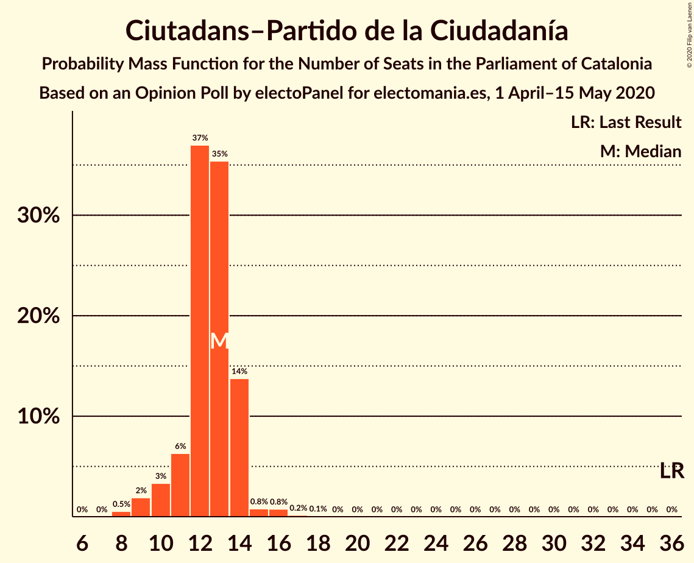
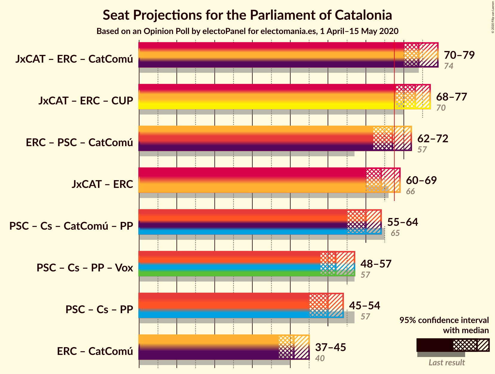
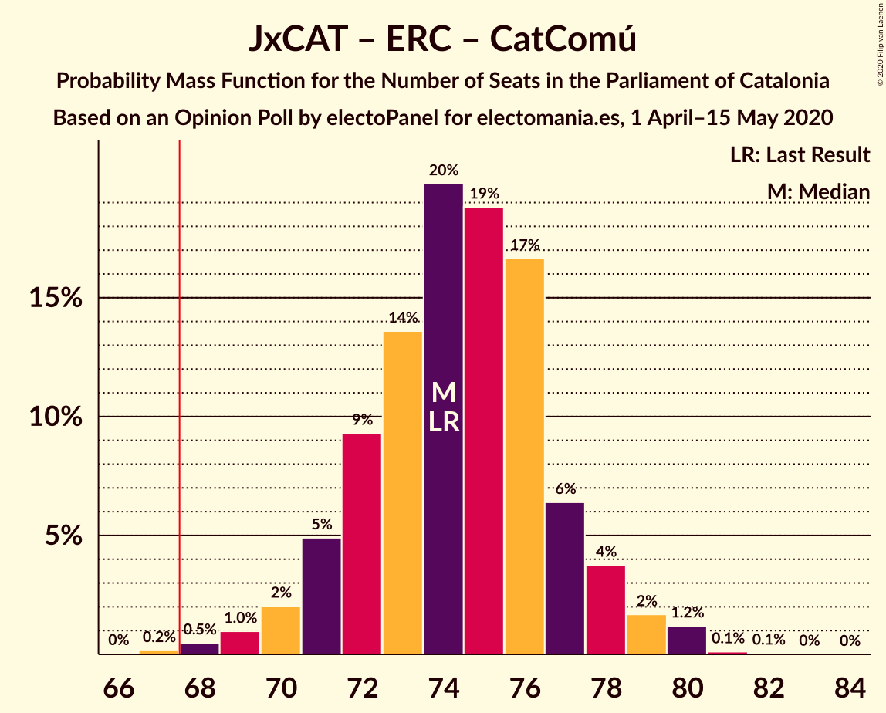
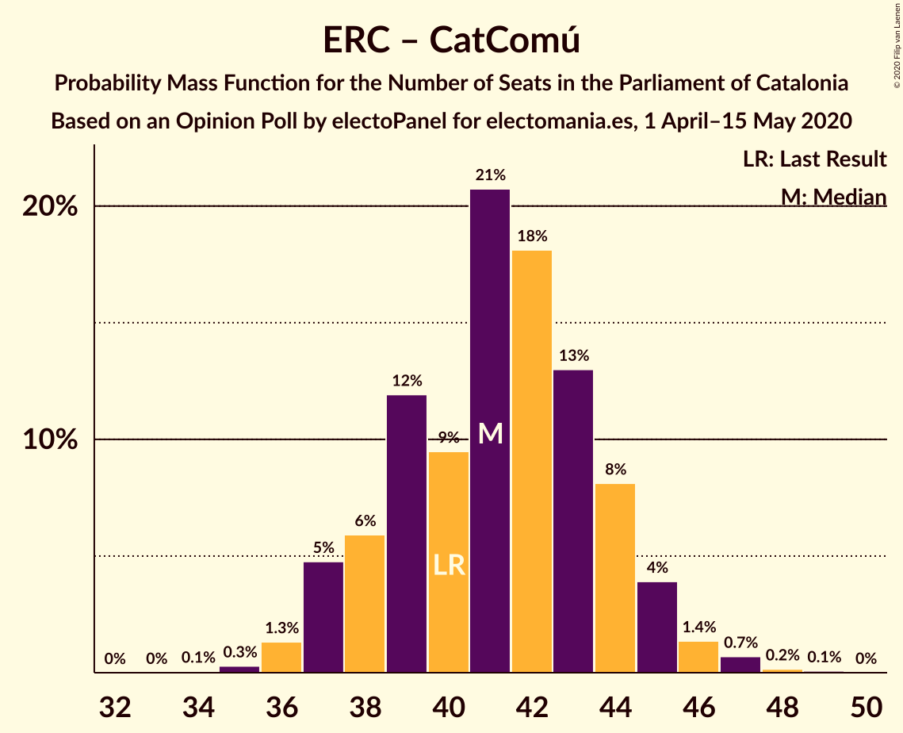

# Opinion Poll by electoPanel for electomania.es, 1 April–15 May 2020

<a href="#voting-intentions">Voting Intentions</a> | <a href="#seats">Seats</a> | <a href="#coalitions">Coalitions</a> | <a href="#technical-information">Technical Information</a>

## Voting Intentions

### Confidence Intervals

| Party | Last Result | Poll Result | 80% Confidence Interval | 90% Confidence Interval | 95% Confidence Interval | 99% Confidence Interval |
|:-----:|:-----------:|:-----------:|:-----------------------:|:-----------------------:|:-----------------------:|:-----------------------:|
| Junts pel Catalunya | 21.7% | 21.2% | 19.6–22.9% |19.2–23.4% |18.8–23.9% |18.0–24.7% |
| Esquerra Republicana–Catalunya Sí | 21.4% | 21.1% | 19.5–22.8% |19.1–23.3% |18.7–23.7% |17.9–24.6% |
| Partit dels Socialistes de Catalunya (PSC-PSOE) | 13.9% | 19.5% | 18.0–21.2% |17.5–21.7% |17.2–22.1% |16.4–22.9% |
| Ciutadans–Partido de la Ciudadanía | 25.4% | 9.6% | 8.5–10.9% |8.2–11.3% |7.9–11.6% |7.4–12.2% |
| Catalunya en Comú–Podem | 7.5% | 8.7% | 7.7–10.0% |7.3–10.3% |7.1–10.6% |6.6–11.2% |
| Partit Popular | 4.2% | 8.7% | 7.7–10.0% |7.3–10.3% |7.1–10.6% |6.6–11.2% |
| Candidatura d’Unitat Popular | 4.5% | 6.5% | 5.6–7.6% |5.3–7.9% |5.1–8.2% |4.7–8.8% |
| Vox | 0.0% | 3.5% | 2.9–4.4% |2.7–4.6% |2.5–4.8% |2.2–5.3% |

*Note:* The poll result column reflects the actual value used in the calculations. Published results may vary slightly, and in addition be rounded to fewer digits.

## Seats

### Confidence Intervals

| Party | Last Result | Median | 80% Confidence Interval | 90% Confidence Interval | 95% Confidence Interval | 99% Confidence Interval |
|:-----:|:-----------:|:------:|:-----------------------:|:-----------------------:|:-----------------------:|:-----------------------:|
| <a href="#junts-pel-catalunya">Junts pel Catalunya</a> | 34 | 33 | 31–37 |30–37 |30–37 |28–38 |
| <a href="#esquerra-republicana–catalunya-sí">Esquerra Republicana–Catalunya Sí</a> | 32 | 31 | 29–33 |28–34 |27–35 |26–36 |
| <a href="#partit-dels-socialistes-de-catalunya-(psc-psoe)">Partit dels Socialistes de Catalunya (PSC-PSOE)</a> | 17 | 26 | 24–28 |24–28 |23–29 |22–30 |
| <a href="#ciutadans–partido-de-la-ciudadanía">Ciutadans–Partido de la Ciudadanía</a> | 36 | 13 | 11–14 |10–14 |10–14 |9–16 |
| <a href="#catalunya-en-comú–podem">Catalunya en Comú–Podem</a> | 8 | 11 | 9–11 |8–12 |8–12 |7–14 |
| <a href="#partit-popular">Partit Popular</a> | 4 | 12 | 10–13 |10–13 |9–14 |8–15 |
| <a href="#candidatura-d’unitat-popular">Candidatura d’Unitat Popular</a> | 4 | 8 | 8–9 |7–10 |7–11 |6–11 |
| <a href="#vox">Vox</a> | 0 | 3 | 2–5 |0–5 |0–5 |0–6 |

### Junts pel Catalunya

*For a full overview of the results for this party, see the [Junts pel Catalunya](party-juntspelcatalunya.html) page.*

| Number of Seats | Probability | Accumulated | Special Marks |
|:---------------:|:-----------:|:-----------:|:-------------:|
| 26 | 0.1% | 100% |  |
| 27 | 0.1% | 99.9% |  |
| 28 | 0.3% | 99.7% |  |
| 29 | 1.3% | 99.5% |  |
| 30 | 3% | 98% |  |
| 31 | 23% | 95% |  |
| 32 | 13% | 72% |  |
| 33 | 20% | 59% | Median |
| 34 | 10% | 39% | Last Result |
| 35 | 13% | 29% |  |
| 36 | 6% | 16% |  |
| 37 | 9% | 11% |  |
| 38 | 1.3% | 1.5% |  |
| 39 | 0.1% | 0.2% |  |
| 40 | 0% | 0% |  |

### Esquerra Republicana–Catalunya Sí

*For a full overview of the results for this party, see the [Esquerra Republicana–Catalunya Sí](party-esquerrarepublicana–catalunyasí.html) page.*

| Number of Seats | Probability | Accumulated | Special Marks |
|:---------------:|:-----------:|:-----------:|:-------------:|
| 25 | 0.1% | 100% |  |
| 26 | 0.7% | 99.9% |  |
| 27 | 2% | 99.2% |  |
| 28 | 6% | 97% |  |
| 29 | 14% | 91% |  |
| 30 | 16% | 77% |  |
| 31 | 31% | 61% | Median |
| 32 | 14% | 30% | Last Result |
| 33 | 8% | 17% |  |
| 34 | 5% | 8% |  |
| 35 | 2% | 3% |  |
| 36 | 0.7% | 1.0% |  |
| 37 | 0.3% | 0.3% |  |
| 38 | 0% | 0% |  |

### Partit dels Socialistes de Catalunya (PSC-PSOE)

*For a full overview of the results for this party, see the [Partit dels Socialistes de Catalunya (PSC-PSOE)](party-partitdelssocialistesdecatalunyapsc-psoe.html) page.*

| Number of Seats | Probability | Accumulated | Special Marks |
|:---------------:|:-----------:|:-----------:|:-------------:|
| 17 | 0% | 100% | Last Result |
| 18 | 0% | 100% |  |
| 19 | 0% | 100% |  |
| 20 | 0% | 100% |  |
| 21 | 0.3% | 99.9% |  |
| 22 | 0.3% | 99.7% |  |
| 23 | 4% | 99.4% |  |
| 24 | 17% | 95% |  |
| 25 | 21% | 78% |  |
| 26 | 36% | 57% | Median |
| 27 | 6% | 21% |  |
| 28 | 11% | 15% |  |
| 29 | 3% | 4% |  |
| 30 | 1.0% | 1.5% |  |
| 31 | 0.4% | 0.5% |  |
| 32 | 0% | 0.1% |  |
| 33 | 0.1% | 0.1% |  |
| 34 | 0% | 0% |  |

### Ciutadans–Partido de la Ciudadanía

*For a full overview of the results for this party, see the [Ciutadans–Partido de la Ciudadanía](party-ciutadans–partidodelaciudadanía.html) page.*

| Number of Seats | Probability | Accumulated | Special Marks |
|:---------------:|:-----------:|:-----------:|:-------------:|
| 8 | 0.4% | 100% |  |
| 9 | 2% | 99.6% |  |
| 10 | 3% | 98% |  |
| 11 | 11% | 95% |  |
| 12 | 28% | 84% |  |
| 13 | 41% | 56% | Median |
| 14 | 13% | 14% |  |
| 15 | 0.3% | 1.2% |  |
| 16 | 0.8% | 0.9% |  |
| 17 | 0.1% | 0.1% |  |
| 18 | 0.1% | 0.1% |  |
| 19 | 0% | 0% |  |
| 20 | 0% | 0% |  |
| 21 | 0% | 0% |  |
| 22 | 0% | 0% |  |
| 23 | 0% | 0% |  |
| 24 | 0% | 0% |  |
| 25 | 0% | 0% |  |
| 26 | 0% | 0% |  |
| 27 | 0% | 0% |  |
| 28 | 0% | 0% |  |
| 29 | 0% | 0% |  |
| 30 | 0% | 0% |  |
| 31 | 0% | 0% |  |
| 32 | 0% | 0% |  |
| 33 | 0% | 0% |  |
| 34 | 0% | 0% |  |
| 35 | 0% | 0% |  |
| 36 | 0% | 0% | Last Result |

### Catalunya en Comú–Podem

*For a full overview of the results for this party, see the [Catalunya en Comú–Podem](party-catalunyaencomú–podem.html) page.*

| Number of Seats | Probability | Accumulated | Special Marks |
|:---------------:|:-----------:|:-----------:|:-------------:|
| 6 | 0.1% | 100% |  |
| 7 | 0.7% | 99.9% |  |
| 8 | 9% | 99.2% | Last Result |
| 9 | 19% | 90% |  |
| 10 | 17% | 71% |  |
| 11 | 48% | 55% | Median |
| 12 | 4% | 7% |  |
| 13 | 1.5% | 2% |  |
| 14 | 0.7% | 0.8% |  |
| 15 | 0% | 0.1% |  |
| 16 | 0% | 0% |  |

### Partit Popular

*For a full overview of the results for this party, see the [Partit Popular](party-partitpopular.html) page.*

| Number of Seats | Probability | Accumulated | Special Marks |
|:---------------:|:-----------:|:-----------:|:-------------:|
| 4 | 0% | 100% | Last Result |
| 5 | 0% | 100% |  |
| 6 | 0% | 100% |  |
| 7 | 0.3% | 100% |  |
| 8 | 0.9% | 99.7% |  |
| 9 | 3% | 98.8% |  |
| 10 | 30% | 96% |  |
| 11 | 11% | 66% |  |
| 12 | 41% | 55% | Median |
| 13 | 10% | 14% |  |
| 14 | 3% | 4% |  |
| 15 | 1.5% | 2% |  |
| 16 | 0% | 0.1% |  |
| 17 | 0% | 0% |  |

### Candidatura d’Unitat Popular

*For a full overview of the results for this party, see the [Candidatura d’Unitat Popular](party-candidaturad’unitatpopular.html) page.*

| Number of Seats | Probability | Accumulated | Special Marks |
|:---------------:|:-----------:|:-----------:|:-------------:|
| 4 | 0.1% | 100% | Last Result |
| 5 | 0.2% | 99.9% |  |
| 6 | 0.5% | 99.7% |  |
| 7 | 6% | 99.2% |  |
| 8 | 60% | 93% | Median |
| 9 | 26% | 33% |  |
| 10 | 4% | 7% |  |
| 11 | 3% | 3% |  |
| 12 | 0.1% | 0.1% |  |
| 13 | 0% | 0.1% |  |
| 14 | 0% | 0% |  |

### Vox

*For a full overview of the results for this party, see the [Vox](party-vox.html) page.*

| Number of Seats | Probability | Accumulated | Special Marks |
|:---------------:|:-----------:|:-----------:|:-------------:|
| 0 | 10% | 100% | Last Result |
| 1 | 0% | 90% |  |
| 2 | 22% | 90% |  |
| 3 | 50% | 68% | Median |
| 4 | 5% | 18% |  |
| 5 | 11% | 13% |  |
| 6 | 0.9% | 1.1% |  |
| 7 | 0.2% | 0.2% |  |
| 8 | 0% | 0% |  |

## Coalitions

### Confidence Intervals

| Coalition | Last Result | Median | Majority? | 80% Confidence Interval | 90% Confidence Interval | 95% Confidence Interval | 99% Confidence Interval |
|:---------:|:-----------:|:------:|:---------:|:-----------------------:|:-----------------------:|:-----------------------:|:-----------------------:|
| Junts pel Catalunya – Esquerra Republicana–Catalunya Sí – Catalunya en Comú–Podem | 74 | 75 | 99.8% | 72–77 | 71–77 | 70–78 | 68–80 |
| Junts pel Catalunya – Esquerra Republicana–Catalunya Sí – Candidatura d’Unitat Popular | 70 | 73 | 98.8% | 70–75 | 69–76 | 69–77 | 66–78 |
| Esquerra Republicana–Catalunya Sí – Partit dels Socialistes de Catalunya (PSC-PSOE) – Catalunya en Comú–Podem | 57 | 67 | 38% | 64–71 | 63–71 | 62–71 | 61–73 |
| Junts pel Catalunya – Esquerra Republicana–Catalunya Sí | 66 | 64 | 7% | 62–67 | 61–68 | 60–69 | 58–70 |
| Partit dels Socialistes de Catalunya (PSC-PSOE) – Ciutadans–Partido de la Ciudadanía – Catalunya en Comú–Podem – Partit Popular | 65 | 60 | 0.1% | 57–62 | 56–63 | 56–64 | 54–66 |
| Partit dels Socialistes de Catalunya (PSC-PSOE) – Ciutadans–Partido de la Ciudadanía – Partit Popular – Vox | 57 | 52 | 0% | 51–55 | 49–55 | 48–56 | 47–59 |
| Partit dels Socialistes de Catalunya (PSC-PSOE) – Ciutadans–Partido de la Ciudadanía – Partit Popular | 57 | 49 | 0% | 48–52 | 46–52 | 46–53 | 45–55 |
| Esquerra Republicana–Catalunya Sí – Catalunya en Comú–Podem | 40 | 42 | 0% | 39–43 | 38–44 | 37–45 | 35–46 |

### Junts pel Catalunya – Esquerra Republicana–Catalunya Sí – Catalunya en Comú–Podem

| Number of Seats | Probability | Accumulated | Special Marks |
|:---------------:|:-----------:|:-----------:|:-------------:|
| 66 | 0.1% | 100% |  |
| 67 | 0.1% | 99.9% |  |
| 68 | 0.6% | 99.8% | Majority |
| 69 | 1.0% | 99.2% |  |
| 70 | 1.2% | 98% |  |
| 71 | 2% | 97% |  |
| 72 | 16% | 95% |  |
| 73 | 16% | 78% |  |
| 74 | 9% | 62% | Last Result |
| 75 | 22% | 53% | Median |
| 76 | 20% | 30% |  |
| 77 | 6% | 10% |  |
| 78 | 3% | 5% |  |
| 79 | 1.1% | 2% |  |
| 80 | 0.6% | 0.8% |  |
| 81 | 0.1% | 0.2% |  |
| 82 | 0% | 0.1% |  |
| 83 | 0% | 0% |  |

### Junts pel Catalunya – Esquerra Republicana–Catalunya Sí – Candidatura d’Unitat Popular

| Number of Seats | Probability | Accumulated | Special Marks |
|:---------------:|:-----------:|:-----------:|:-------------:|
| 65 | 0.1% | 100% |  |
| 66 | 0.6% | 99.9% |  |
| 67 | 0.5% | 99.3% |  |
| 68 | 0.7% | 98.8% | Majority |
| 69 | 3% | 98% |  |
| 70 | 21% | 95% | Last Result |
| 71 | 11% | 74% |  |
| 72 | 11% | 63% | Median |
| 73 | 22% | 51% |  |
| 74 | 9% | 29% |  |
| 75 | 13% | 20% |  |
| 76 | 4% | 7% |  |
| 77 | 1.0% | 3% |  |
| 78 | 2% | 2% |  |
| 79 | 0.1% | 0.3% |  |
| 80 | 0.2% | 0.2% |  |
| 81 | 0% | 0% |  |

### Esquerra Republicana–Catalunya Sí – Partit dels Socialistes de Catalunya (PSC-PSOE) – Catalunya en Comú–Podem

| Number of Seats | Probability | Accumulated | Special Marks |
|:---------------:|:-----------:|:-----------:|:-------------:|
| 57 | 0% | 100% | Last Result |
| 58 | 0% | 100% |  |
| 59 | 0.1% | 100% |  |
| 60 | 0.3% | 99.9% |  |
| 61 | 0.4% | 99.7% |  |
| 62 | 3% | 99.3% |  |
| 63 | 3% | 97% |  |
| 64 | 8% | 93% |  |
| 65 | 17% | 86% |  |
| 66 | 16% | 68% |  |
| 67 | 14% | 52% |  |
| 68 | 17% | 38% | Median, Majority |
| 69 | 7% | 21% |  |
| 70 | 2% | 14% |  |
| 71 | 10% | 12% |  |
| 72 | 0.9% | 2% |  |
| 73 | 0.6% | 0.8% |  |
| 74 | 0.2% | 0.2% |  |
| 75 | 0% | 0% |  |

### Junts pel Catalunya – Esquerra Republicana–Catalunya Sí

| Number of Seats | Probability | Accumulated | Special Marks |
|:---------------:|:-----------:|:-----------:|:-------------:|
| 57 | 0.1% | 100% |  |
| 58 | 0.4% | 99.9% |  |
| 59 | 0.7% | 99.5% |  |
| 60 | 2% | 98.8% |  |
| 61 | 2% | 97% |  |
| 62 | 26% | 95% |  |
| 63 | 9% | 69% |  |
| 64 | 21% | 60% | Median |
| 65 | 17% | 38% |  |
| 66 | 5% | 21% | Last Result |
| 67 | 10% | 17% |  |
| 68 | 4% | 7% | Majority |
| 69 | 2% | 3% |  |
| 70 | 1.0% | 1.2% |  |
| 71 | 0.2% | 0.2% |  |
| 72 | 0% | 0% |  |

### Partit dels Socialistes de Catalunya (PSC-PSOE) – Ciutadans–Partido de la Ciudadanía – Catalunya en Comú–Podem – Partit Popular

| Number of Seats | Probability | Accumulated | Special Marks |
|:---------------:|:-----------:|:-----------:|:-------------:|
| 52 | 0.2% | 100% |  |
| 53 | 0.1% | 99.8% |  |
| 54 | 0.3% | 99.8% |  |
| 55 | 0.8% | 99.4% |  |
| 56 | 4% | 98.6% |  |
| 57 | 12% | 95% |  |
| 58 | 6% | 82% |  |
| 59 | 9% | 76% |  |
| 60 | 40% | 67% |  |
| 61 | 6% | 27% |  |
| 62 | 14% | 21% | Median |
| 63 | 4% | 8% |  |
| 64 | 2% | 4% |  |
| 65 | 0.8% | 1.4% | Last Result |
| 66 | 0.5% | 0.6% |  |
| 67 | 0.1% | 0.2% |  |
| 68 | 0.1% | 0.1% | Majority |
| 69 | 0% | 0% |  |

### Partit dels Socialistes de Catalunya (PSC-PSOE) – Ciutadans–Partido de la Ciudadanía – Partit Popular – Vox

| Number of Seats | Probability | Accumulated | Special Marks |
|:---------------:|:-----------:|:-----------:|:-------------:|
| 45 | 0% | 100% |  |
| 46 | 0.3% | 99.9% |  |
| 47 | 0.7% | 99.6% |  |
| 48 | 2% | 98.9% |  |
| 49 | 5% | 97% |  |
| 50 | 2% | 92% |  |
| 51 | 31% | 90% |  |
| 52 | 21% | 60% |  |
| 53 | 6% | 39% |  |
| 54 | 16% | 33% | Median |
| 55 | 13% | 17% |  |
| 56 | 2% | 4% |  |
| 57 | 0.8% | 2% | Last Result |
| 58 | 0.5% | 1.1% |  |
| 59 | 0.5% | 0.6% |  |
| 60 | 0.1% | 0.1% |  |
| 61 | 0% | 0% |  |

### Partit dels Socialistes de Catalunya (PSC-PSOE) – Ciutadans–Partido de la Ciudadanía – Partit Popular

| Number of Seats | Probability | Accumulated | Special Marks |
|:---------------:|:-----------:|:-----------:|:-------------:|
| 43 | 0.1% | 100% |  |
| 44 | 0.2% | 99.9% |  |
| 45 | 0.7% | 99.7% |  |
| 46 | 5% | 98.9% |  |
| 47 | 1.4% | 94% |  |
| 48 | 17% | 92% |  |
| 49 | 30% | 75% |  |
| 50 | 19% | 46% |  |
| 51 | 14% | 27% | Median |
| 52 | 8% | 13% |  |
| 53 | 3% | 5% |  |
| 54 | 1.1% | 2% |  |
| 55 | 0.5% | 1.0% |  |
| 56 | 0.3% | 0.5% |  |
| 57 | 0.1% | 0.1% | Last Result |
| 58 | 0% | 0% |  |

### Esquerra Republicana–Catalunya Sí – Catalunya en Comú–Podem

| Number of Seats | Probability | Accumulated | Special Marks |
|:---------------:|:-----------:|:-----------:|:-------------:|
| 34 | 0.1% | 100% |  |
| 35 | 0.6% | 99.9% |  |
| 36 | 0.9% | 99.3% |  |
| 37 | 3% | 98% |  |
| 38 | 4% | 95% |  |
| 39 | 17% | 91% |  |
| 40 | 7% | 75% | Last Result |
| 41 | 16% | 67% |  |
| 42 | 31% | 52% | Median |
| 43 | 14% | 21% |  |
| 44 | 4% | 7% |  |
| 45 | 0.9% | 3% |  |
| 46 | 1.3% | 2% |  |
| 47 | 0.3% | 0.5% |  |
| 48 | 0.1% | 0.2% |  |
| 49 | 0.1% | 0.1% |  |
| 50 | 0% | 0% |  |

## Technical Information

### Opinion Poll

+ **Polling firm:** electoPanel
+ **Commissioner(s):** electomania.es
+ **Fieldwork period:** 1 April–15 May 2020

### Calculations

+ **Sample size:** 1000
+ **Simulations done:** 131,072
+ **Error estimate:** 1.46%

