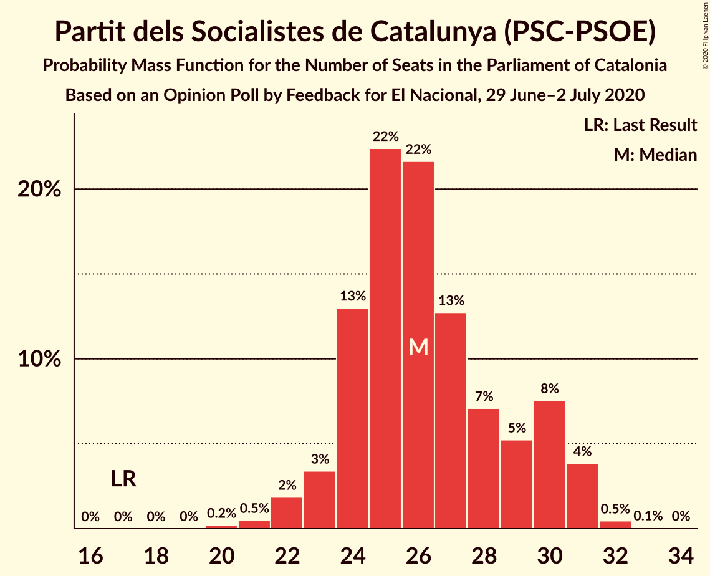
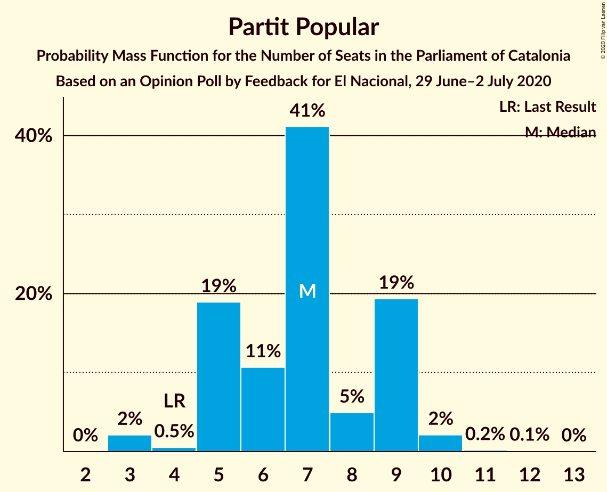
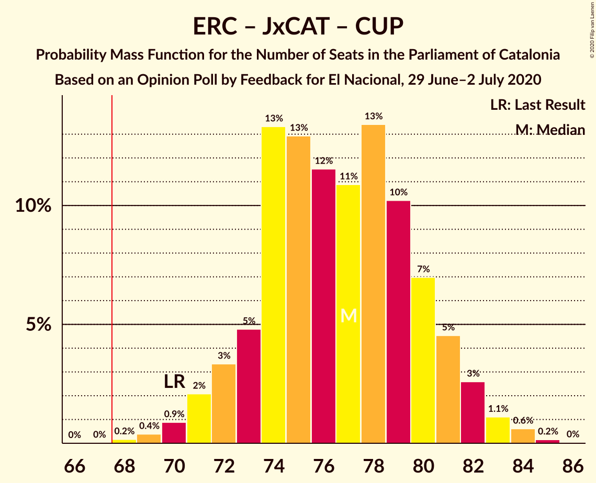

# Opinion Poll by Feedback for El Nacional, 29 June–2 July 2020

<a href="#voting-intentions">Voting Intentions</a> | <a href="#seats">Seats</a> | <a href="#coalitions">Coalitions</a> | <a href="#technical-information">Technical Information</a>

## Voting Intentions

### Confidence Intervals

| Party | Last Result | Poll Result | 80% Confidence Interval | 90% Confidence Interval | 95% Confidence Interval | 99% Confidence Interval |
|:-----:|:-----------:|:-----------:|:-----------------------:|:-----------------------:|:-----------------------:|:-----------------------:|
| Esquerra Republicana–Catalunya Sí | 21.4% | 27.4% | 25.4–29.5% |24.9–30.1% |24.4–30.6% |23.5–31.6% |
| Partit dels Socialistes de Catalunya (PSC-PSOE) | 13.9% | 19.8% | 18.0–21.7% |17.5–22.2% |17.1–22.7% |16.3–23.6% |
| Junts pel Catalunya | 21.7% | 17.8% | 16.1–19.6% |15.7–20.1% |15.3–20.6% |14.5–21.5% |
| Ciutadans–Partido de la Ciudadanía | 25.4% | 9.5% | 8.3–11.0% |7.9–11.4% |7.7–11.7% |7.1–12.5% |
| Catalunya en Comú–Podem | 7.5% | 6.6% | 5.6–7.9% |5.3–8.3% |5.1–8.6% |4.6–9.2% |
| Candidatura d’Unitat Popular | 4.5% | 6.2% | 5.3–7.5% |5.0–7.8% |4.8–8.2% |4.3–8.8% |
| Partit Popular | 4.2% | 5.8% | 4.8–7.0% |4.6–7.3% |4.3–7.6% |3.9–8.2% |
| Vox | 0.0% | 5.1% | 4.3–6.3% |4.0–6.6% |3.8–6.9% |3.4–7.5% |

*Note:* The poll result column reflects the actual value used in the calculations. Published results may vary slightly, and in addition be rounded to fewer digits.

## Seats

### Confidence Intervals

| Party | Last Result | Median | 80% Confidence Interval | 90% Confidence Interval | 95% Confidence Interval | 99% Confidence Interval |
|:-----:|:-----------:|:------:|:-----------------------:|:-----------------------:|:-----------------------:|:-----------------------:|
| <a href="#esquerra-republicana–catalunya-sí">Esquerra Republicana–Catalunya Sí</a> | 32 | 41 | 38–44 |36–47 |36–47 |35–48 |
| <a href="#partit-dels-socialistes-de-catalunya-(psc-psoe)">Partit dels Socialistes de Catalunya (PSC-PSOE)</a> | 17 | 26 | 24–30 |24–30 |24–31 |22–32 |
| <a href="#junts-pel-catalunya">Junts pel Catalunya</a> | 34 | 27 | 25–31 |24–31 |24–32 |22–33 |
| <a href="#ciutadans–partido-de-la-ciudadanía">Ciutadans–Partido de la Ciudadanía</a> | 36 | 12 | 10–14 |9–15 |9–16 |8–16 |
| <a href="#catalunya-en-comú–podem">Catalunya en Comú–Podem</a> | 8 | 7 | 5–9 |5–10 |5–10 |4–11 |
| <a href="#candidatura-d’unitat-popular">Candidatura d’Unitat Popular</a> | 4 | 8 | 7–10 |6–10 |6–11 |4–11 |
| <a href="#partit-popular">Partit Popular</a> | 4 | 7 | 5–9 |5–9 |5–9 |3–10 |
| <a href="#vox">Vox</a> | 0 | 6 | 5–7 |3–8 |3–9 |3–10 |

### Esquerra Republicana–Catalunya Sí

*For a full overview of the results for this party, see the [Esquerra Republicana–Catalunya Sí](party-esquerrarepublicana–catalunyasí.html) page.*

| Number of Seats | Probability | Accumulated | Special Marks |
|:---------------:|:-----------:|:-----------:|:-------------:|
| 32 | 0% | 100% | Last Result |
| 33 | 0% | 100% |  |
| 34 | 0.2% | 100% |  |
| 35 | 0.9% | 99.8% |  |
| 36 | 4% | 98.9% |  |
| 37 | 3% | 95% |  |
| 38 | 4% | 91% |  |
| 39 | 14% | 87% |  |
| 40 | 18% | 73% |  |
| 41 | 14% | 55% | Median |
| 42 | 20% | 41% |  |
| 43 | 5% | 21% |  |
| 44 | 7% | 16% |  |
| 45 | 0.7% | 9% |  |
| 46 | 3% | 9% |  |
| 47 | 5% | 6% |  |
| 48 | 0.4% | 0.5% |  |
| 49 | 0.1% | 0.1% |  |
| 50 | 0% | 0% |  |

### Partit dels Socialistes de Catalunya (PSC-PSOE)

*For a full overview of the results for this party, see the [Partit dels Socialistes de Catalunya (PSC-PSOE)](party-partitdelssocialistesdecatalunyapsc-psoe.html) page.*

| Number of Seats | Probability | Accumulated | Special Marks |
|:---------------:|:-----------:|:-----------:|:-------------:|
| 17 | 0% | 100% | Last Result |
| 18 | 0% | 100% |  |
| 19 | 0% | 100% |  |
| 20 | 0.3% | 100% |  |
| 21 | 0.1% | 99.7% |  |
| 22 | 0.3% | 99.6% |  |
| 23 | 2% | 99.3% |  |
| 24 | 18% | 98% |  |
| 25 | 21% | 80% |  |
| 26 | 38% | 59% | Median |
| 27 | 4% | 21% |  |
| 28 | 1.5% | 17% |  |
| 29 | 2% | 15% |  |
| 30 | 10% | 13% |  |
| 31 | 2% | 3% |  |
| 32 | 1.2% | 1.3% |  |
| 33 | 0.1% | 0.1% |  |
| 34 | 0% | 0% |  |

### Junts pel Catalunya

*For a full overview of the results for this party, see the [Junts pel Catalunya](party-juntspelcatalunya.html) page.*

| Number of Seats | Probability | Accumulated | Special Marks |
|:---------------:|:-----------:|:-----------:|:-------------:|
| 21 | 0.1% | 100% |  |
| 22 | 0.5% | 99.8% |  |
| 23 | 0.5% | 99.4% |  |
| 24 | 4% | 98.9% |  |
| 25 | 9% | 95% |  |
| 26 | 23% | 86% |  |
| 27 | 28% | 62% | Median |
| 28 | 15% | 35% |  |
| 29 | 3% | 20% |  |
| 30 | 5% | 17% |  |
| 31 | 8% | 12% |  |
| 32 | 3% | 4% |  |
| 33 | 0.6% | 0.9% |  |
| 34 | 0.2% | 0.4% | Last Result |
| 35 | 0.1% | 0.1% |  |
| 36 | 0% | 0% |  |

### Ciutadans–Partido de la Ciudadanía

*For a full overview of the results for this party, see the [Ciutadans–Partido de la Ciudadanía](party-ciutadans–partidodelaciudadanía.html) page.*

| Number of Seats | Probability | Accumulated | Special Marks |
|:---------------:|:-----------:|:-----------:|:-------------:|
| 7 | 0.1% | 100% |  |
| 8 | 0.9% | 99.9% |  |
| 9 | 5% | 99.1% |  |
| 10 | 13% | 94% |  |
| 11 | 8% | 82% |  |
| 12 | 29% | 74% | Median |
| 13 | 33% | 45% |  |
| 14 | 5% | 12% |  |
| 15 | 2% | 7% |  |
| 16 | 4% | 5% |  |
| 17 | 0.3% | 0.4% |  |
| 18 | 0.1% | 0.1% |  |
| 19 | 0% | 0% |  |
| 20 | 0% | 0% |  |
| 21 | 0% | 0% |  |
| 22 | 0% | 0% |  |
| 23 | 0% | 0% |  |
| 24 | 0% | 0% |  |
| 25 | 0% | 0% |  |
| 26 | 0% | 0% |  |
| 27 | 0% | 0% |  |
| 28 | 0% | 0% |  |
| 29 | 0% | 0% |  |
| 30 | 0% | 0% |  |
| 31 | 0% | 0% |  |
| 32 | 0% | 0% |  |
| 33 | 0% | 0% |  |
| 34 | 0% | 0% |  |
| 35 | 0% | 0% |  |
| 36 | 0% | 0% | Last Result |

### Catalunya en Comú–Podem

*For a full overview of the results for this party, see the [Catalunya en Comú–Podem](party-catalunyaencomú–podem.html) page.*

| Number of Seats | Probability | Accumulated | Special Marks |
|:---------------:|:-----------:|:-----------:|:-------------:|
| 4 | 2% | 100% |  |
| 5 | 15% | 98% |  |
| 6 | 12% | 84% |  |
| 7 | 32% | 72% | Median |
| 8 | 28% | 40% | Last Result |
| 9 | 5% | 13% |  |
| 10 | 6% | 8% |  |
| 11 | 1.2% | 1.2% |  |
| 12 | 0% | 0% |  |

### Candidatura d’Unitat Popular

*For a full overview of the results for this party, see the [Candidatura d’Unitat Popular](party-candidaturad’unitatpopular.html) page.*

| Number of Seats | Probability | Accumulated | Special Marks |
|:---------------:|:-----------:|:-----------:|:-------------:|
| 4 | 1.1% | 100% | Last Result |
| 5 | 1.2% | 98.8% |  |
| 6 | 3% | 98% |  |
| 7 | 13% | 95% |  |
| 8 | 44% | 82% | Median |
| 9 | 26% | 38% |  |
| 10 | 8% | 12% |  |
| 11 | 4% | 4% |  |
| 12 | 0.1% | 0.1% |  |
| 13 | 0% | 0% |  |

### Partit Popular

*For a full overview of the results for this party, see the [Partit Popular](party-partitpopular.html) page.*

| Number of Seats | Probability | Accumulated | Special Marks |
|:---------------:|:-----------:|:-----------:|:-------------:|
| 3 | 2% | 100% |  |
| 4 | 0.7% | 98% | Last Result |
| 5 | 20% | 98% |  |
| 6 | 10% | 78% |  |
| 7 | 33% | 67% | Median |
| 8 | 11% | 34% |  |
| 9 | 22% | 23% |  |
| 10 | 1.0% | 1.3% |  |
| 11 | 0.2% | 0.3% |  |
| 12 | 0.1% | 0.1% |  |
| 13 | 0% | 0% |  |

### Vox

*For a full overview of the results for this party, see the [Vox](party-vox.html) page.*

| Number of Seats | Probability | Accumulated | Special Marks |
|:---------------:|:-----------:|:-----------:|:-------------:|
| 0 | 0% | 100% | Last Result |
| 1 | 0% | 100% |  |
| 2 | 0.2% | 100% |  |
| 3 | 6% | 99.8% |  |
| 4 | 3% | 94% |  |
| 5 | 34% | 92% |  |
| 6 | 12% | 57% | Median |
| 7 | 39% | 46% |  |
| 8 | 3% | 6% |  |
| 9 | 3% | 4% |  |
| 10 | 0.6% | 0.6% |  |
| 11 | 0% | 0% |  |

## Coalitions

### Confidence Intervals

| Coalition | Last Result | Median | Majority? | 80% Confidence Interval | 90% Confidence Interval | 95% Confidence Interval | 99% Confidence Interval |
|:---------:|:-----------:|:------:|:---------:|:-----------------------:|:-----------------------:|:-----------------------:|:-----------------------:|
| Esquerra Republicana–Catalunya Sí – Junts pel Catalunya – Candidatura d’Unitat Popular | 70 | 77 | 100% | 73–81 | 72–81 | 70–82 | 69–83 |
| Esquerra Republicana–Catalunya Sí – Junts pel Catalunya – Catalunya en Comú–Podem | 74 | 76 | 99.9% | 72–79 | 71–80 | 70–81 | 68–82 |
| Esquerra Republicana–Catalunya Sí – Partit dels Socialistes de Catalunya (PSC-PSOE) – Catalunya en Comú–Podem | 57 | 74 | 99.6% | 70–79 | 69–80 | 69–80 | 68–81 |
| Esquerra Republicana–Catalunya Sí – Junts pel Catalunya | 66 | 68 | 61% | 65–72 | 64–73 | 62–74 | 61–75 |
| Partit dels Socialistes de Catalunya (PSC-PSOE) – Ciutadans–Partido de la Ciudadanía – Catalunya en Comú–Podem – Partit Popular | 65 | 53 | 0% | 49–56 | 48–57 | 47–59 | 46–59 |
| Partit dels Socialistes de Catalunya (PSC-PSOE) – Ciutadans–Partido de la Ciudadanía – Partit Popular – Vox | 57 | 51 | 0% | 47–55 | 46–56 | 46–57 | 45–59 |
| Esquerra Republicana–Catalunya Sí – Catalunya en Comú–Podem | 40 | 49 | 0% | 45–52 | 44–54 | 43–54 | 41–54 |
| Partit dels Socialistes de Catalunya (PSC-PSOE) – Ciutadans–Partido de la Ciudadanía – Partit Popular | 57 | 45 | 0% | 42–49 | 41–50 | 40–51 | 39–53 |

### Esquerra Republicana–Catalunya Sí – Junts pel Catalunya – Candidatura d’Unitat Popular

| Number of Seats | Probability | Accumulated | Special Marks |
|:---------------:|:-----------:|:-----------:|:-------------:|
| 68 | 0.2% | 100% | Majority |
| 69 | 0.4% | 99.8% |  |
| 70 | 2% | 99.4% | Last Result |
| 71 | 1.0% | 97% |  |
| 72 | 2% | 96% |  |
| 73 | 5% | 94% |  |
| 74 | 17% | 89% |  |
| 75 | 6% | 72% |  |
| 76 | 12% | 65% | Median |
| 77 | 19% | 53% |  |
| 78 | 7% | 34% |  |
| 79 | 10% | 27% |  |
| 80 | 6% | 17% |  |
| 81 | 6% | 11% |  |
| 82 | 2% | 5% |  |
| 83 | 2% | 2% |  |
| 84 | 0.2% | 0.3% |  |
| 85 | 0.1% | 0.1% |  |
| 86 | 0% | 0% |  |

### Esquerra Republicana–Catalunya Sí – Junts pel Catalunya – Catalunya en Comú–Podem

| Number of Seats | Probability | Accumulated | Special Marks |
|:---------------:|:-----------:|:-----------:|:-------------:|
| 66 | 0.1% | 100% |  |
| 67 | 0% | 99.9% |  |
| 68 | 1.1% | 99.9% | Majority |
| 69 | 1.1% | 98.8% |  |
| 70 | 2% | 98% |  |
| 71 | 4% | 96% |  |
| 72 | 6% | 92% |  |
| 73 | 18% | 86% |  |
| 74 | 6% | 68% | Last Result |
| 75 | 5% | 61% | Median |
| 76 | 17% | 57% |  |
| 77 | 16% | 40% |  |
| 78 | 7% | 23% |  |
| 79 | 8% | 17% |  |
| 80 | 5% | 8% |  |
| 81 | 1.3% | 3% |  |
| 82 | 2% | 2% |  |
| 83 | 0.3% | 0.4% |  |
| 84 | 0% | 0.1% |  |
| 85 | 0% | 0% |  |

### Esquerra Republicana–Catalunya Sí – Partit dels Socialistes de Catalunya (PSC-PSOE) – Catalunya en Comú–Podem

| Number of Seats | Probability | Accumulated | Special Marks |
|:---------------:|:-----------:|:-----------:|:-------------:|
| 57 | 0% | 100% | Last Result |
| 58 | 0% | 100% |  |
| 59 | 0% | 100% |  |
| 60 | 0% | 100% |  |
| 61 | 0% | 100% |  |
| 62 | 0% | 100% |  |
| 63 | 0% | 100% |  |
| 64 | 0% | 100% |  |
| 65 | 0.1% | 100% |  |
| 66 | 0.1% | 99.9% |  |
| 67 | 0.3% | 99.8% |  |
| 68 | 0.9% | 99.6% | Majority |
| 69 | 4% | 98.6% |  |
| 70 | 5% | 94% |  |
| 71 | 4% | 89% |  |
| 72 | 13% | 85% |  |
| 73 | 12% | 73% |  |
| 74 | 13% | 61% | Median |
| 75 | 23% | 48% |  |
| 76 | 7% | 24% |  |
| 77 | 2% | 18% |  |
| 78 | 4% | 16% |  |
| 79 | 4% | 12% |  |
| 80 | 6% | 7% |  |
| 81 | 0.7% | 1.0% |  |
| 82 | 0.2% | 0.3% |  |
| 83 | 0% | 0.1% |  |
| 84 | 0% | 0% |  |

### Esquerra Republicana–Catalunya Sí – Junts pel Catalunya

| Number of Seats | Probability | Accumulated | Special Marks |
|:---------------:|:-----------:|:-----------:|:-------------:|
| 60 | 0% | 100% |  |
| 61 | 0.6% | 99.9% |  |
| 62 | 2% | 99.3% |  |
| 63 | 2% | 97% |  |
| 64 | 3% | 95% |  |
| 65 | 3% | 92% |  |
| 66 | 15% | 89% | Last Result |
| 67 | 13% | 74% |  |
| 68 | 21% | 61% | Median, Majority |
| 69 | 7% | 40% |  |
| 70 | 10% | 33% |  |
| 71 | 8% | 23% |  |
| 72 | 7% | 15% |  |
| 73 | 5% | 8% |  |
| 74 | 1.2% | 3% |  |
| 75 | 2% | 2% |  |
| 76 | 0.3% | 0.4% |  |
| 77 | 0.1% | 0.1% |  |
| 78 | 0% | 0% |  |

### Partit dels Socialistes de Catalunya (PSC-PSOE) – Ciutadans–Partido de la Ciudadanía – Catalunya en Comú–Podem – Partit Popular

| Number of Seats | Probability | Accumulated | Special Marks |
|:---------------:|:-----------:|:-----------:|:-------------:|
| 44 | 0.1% | 100% |  |
| 45 | 0.2% | 99.9% |  |
| 46 | 2% | 99.7% |  |
| 47 | 2% | 98% |  |
| 48 | 4% | 96% |  |
| 49 | 9% | 92% |  |
| 50 | 9% | 83% |  |
| 51 | 10% | 73% |  |
| 52 | 8% | 63% | Median |
| 53 | 15% | 55% |  |
| 54 | 24% | 40% |  |
| 55 | 4% | 16% |  |
| 56 | 7% | 12% |  |
| 57 | 1.0% | 5% |  |
| 58 | 1.4% | 4% |  |
| 59 | 2% | 3% |  |
| 60 | 0.4% | 0.4% |  |
| 61 | 0.1% | 0.1% |  |
| 62 | 0% | 0% |  |
| 63 | 0% | 0% |  |
| 64 | 0% | 0% |  |
| 65 | 0% | 0% | Last Result |

### Partit dels Socialistes de Catalunya (PSC-PSOE) – Ciutadans–Partido de la Ciudadanía – Partit Popular – Vox

| Number of Seats | Probability | Accumulated | Special Marks |
|:---------------:|:-----------:|:-----------:|:-------------:|
| 43 | 0.1% | 100% |  |
| 44 | 0.1% | 99.9% |  |
| 45 | 2% | 99.8% |  |
| 46 | 4% | 98% |  |
| 47 | 6% | 95% |  |
| 48 | 4% | 89% |  |
| 49 | 12% | 84% |  |
| 50 | 17% | 73% |  |
| 51 | 13% | 55% | Median |
| 52 | 4% | 42% |  |
| 53 | 11% | 37% |  |
| 54 | 16% | 27% |  |
| 55 | 5% | 11% |  |
| 56 | 3% | 6% |  |
| 57 | 1.5% | 3% | Last Result |
| 58 | 0.8% | 2% |  |
| 59 | 1.1% | 1.2% |  |
| 60 | 0.1% | 0.1% |  |
| 61 | 0% | 0% |  |

### Esquerra Republicana–Catalunya Sí – Catalunya en Comú–Podem

| Number of Seats | Probability | Accumulated | Special Marks |
|:---------------:|:-----------:|:-----------:|:-------------:|
| 40 | 0.2% | 100% | Last Result |
| 41 | 0.3% | 99.8% |  |
| 42 | 2% | 99.5% |  |
| 43 | 2% | 98% |  |
| 44 | 3% | 95% |  |
| 45 | 8% | 93% |  |
| 46 | 17% | 85% |  |
| 47 | 7% | 68% |  |
| 48 | 10% | 61% | Median |
| 49 | 20% | 50% |  |
| 50 | 17% | 31% |  |
| 51 | 2% | 14% |  |
| 52 | 3% | 12% |  |
| 53 | 3% | 9% |  |
| 54 | 6% | 7% |  |
| 55 | 0.3% | 0.4% |  |
| 56 | 0.1% | 0.2% |  |
| 57 | 0% | 0.1% |  |
| 58 | 0% | 0% |  |

### Partit dels Socialistes de Catalunya (PSC-PSOE) – Ciutadans–Partido de la Ciudadanía – Partit Popular

| Number of Seats | Probability | Accumulated | Special Marks |
|:---------------:|:-----------:|:-----------:|:-------------:|
| 38 | 0.3% | 100% |  |
| 39 | 2% | 99.6% |  |
| 40 | 2% | 98% |  |
| 41 | 3% | 96% |  |
| 42 | 8% | 93% |  |
| 43 | 13% | 84% |  |
| 44 | 10% | 72% |  |
| 45 | 16% | 61% | Median |
| 46 | 10% | 45% |  |
| 47 | 17% | 35% |  |
| 48 | 9% | 19% |  |
| 49 | 4% | 10% |  |
| 50 | 3% | 6% |  |
| 51 | 2% | 3% |  |
| 52 | 0.6% | 1.3% |  |
| 53 | 0.6% | 0.7% |  |
| 54 | 0.1% | 0.2% |  |
| 55 | 0% | 0% |  |
| 56 | 0% | 0% |  |
| 57 | 0% | 0% | Last Result |

## Technical Information

### Opinion Poll

+ **Polling firm:** Feedback
+ **Commissioner(s):** El Nacional
+ **Fieldwork period:** 29 June–2 July 2020

### Calculations

+ **Sample size:** 800
+ **Simulations done:** 131,072
+ **Error estimate:** 1.66%

