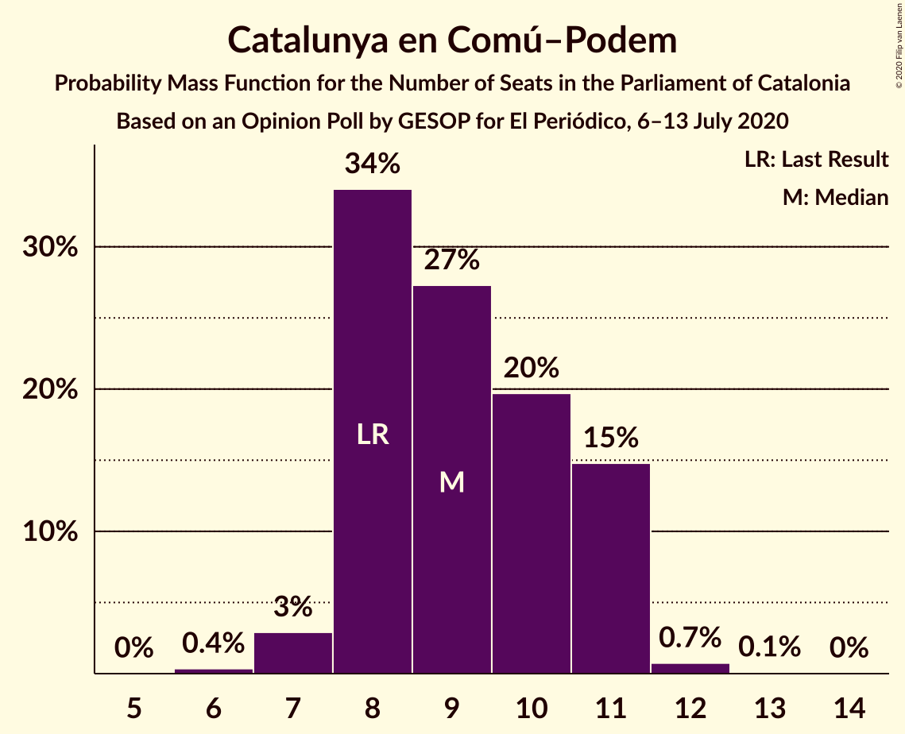

# Opinion Poll by GESOP for El Periódico, 6–13 July 2020

<a href="#voting-intentions">Voting Intentions</a> | <a href="#seats">Seats</a> | <a href="#coalitions">Coalitions</a> | <a href="#technical-information">Technical Information</a>

## Voting Intentions

### Confidence Intervals

| Party | Last Result | Poll Result | 80% Confidence Interval | 90% Confidence Interval | 95% Confidence Interval | 99% Confidence Interval |
|:-----:|:-----------:|:-----------:|:-----------------------:|:-----------------------:|:-----------------------:|:-----------------------:|
| Esquerra Republicana–Catalunya Sí | 21.4% | 22.5% | 21.2–24.0% |20.8–24.4% |20.5–24.7% |19.8–25.4% |
| Junts pel Catalunya | 21.7% | 19.3% | 18.0–20.6% |17.6–21.0% |17.3–21.4% |16.7–22.0% |
| Partit dels Socialistes de Catalunya (PSC-PSOE) | 13.9% | 17.9% | 16.7–19.3% |16.3–19.6% |16.0–20.0% |15.5–20.6% |
| Ciutadans–Partido de la Ciudadanía | 25.4% | 11.9% | 10.9–13.0% |10.6–13.4% |10.3–13.7% |9.9–14.2% |
| Catalunya en Comú–Podem | 7.5% | 7.9% | 7.1–8.9% |6.8–9.2% |6.6–9.4% |6.2–9.9% |
| Partit Popular | 4.2% | 6.1% | 5.3–7.0% |5.2–7.2% |5.0–7.4% |4.6–7.9% |
| Candidatura d’Unitat Popular | 4.5% | 5.4% | 4.7–6.2% |4.5–6.5% |4.4–6.7% |4.1–7.1% |
| Vox | 0.0% | 5.4% | 4.7–6.2% |4.5–6.5% |4.4–6.7% |4.1–7.1% |

*Note:* The poll result column reflects the actual value used in the calculations. Published results may vary slightly, and in addition be rounded to fewer digits.

## Seats

### Confidence Intervals

| Party | Last Result | Median | 80% Confidence Interval | 90% Confidence Interval | 95% Confidence Interval | 99% Confidence Interval |
|:-----:|:-----------:|:------:|:-----------------------:|:-----------------------:|:-----------------------:|:-----------------------:|
| <a href="#esquerra-republicana–catalunya-sí">Esquerra Republicana–Catalunya Sí</a> | 32 | 34 | 31–36 |31–36 |30–37 |29–38 |
| <a href="#junts-pel-catalunya">Junts pel Catalunya</a> | 34 | 31 | 28–32 |27–33 |27–34 |26–35 |
| <a href="#partit-dels-socialistes-de-catalunya-(psc-psoe)">Partit dels Socialistes de Catalunya (PSC-PSOE)</a> | 17 | 24 | 23–26 |22–26 |22–26 |20–28 |
| <a href="#ciutadans–partido-de-la-ciudadanía">Ciutadans–Partido de la Ciudadanía</a> | 36 | 16 | 14–18 |14–18 |13–18 |13–19 |
| <a href="#catalunya-en-comú–podem">Catalunya en Comú–Podem</a> | 8 | 9 | 8–11 |8–11 |7–11 |7–12 |
| <a href="#partit-popular">Partit Popular</a> | 4 | 7 | 6–9 |5–9 |5–9 |5–10 |
| <a href="#candidatura-d’unitat-popular">Candidatura d’Unitat Popular</a> | 4 | 8 | 6–8 |4–8 |4–9 |4–9 |
| <a href="#vox">Vox</a> | 0 | 7 | 5–7 |5–8 |5–9 |3–9 |

### Esquerra Republicana–Catalunya Sí

*For a full overview of the results for this party, see the [Esquerra Republicana–Catalunya Sí](party-esquerrarepublicana–catalunyasí.html) page.*

| Number of Seats | Probability | Accumulated | Special Marks |
|:---------------:|:-----------:|:-----------:|:-------------:|
| 28 | 0.1% | 100% |  |
| 29 | 1.0% | 99.9% |  |
| 30 | 2% | 98.9% |  |
| 31 | 9% | 97% |  |
| 32 | 5% | 88% | Last Result |
| 33 | 25% | 83% |  |
| 34 | 15% | 58% | Median |
| 35 | 28% | 43% |  |
| 36 | 10% | 15% |  |
| 37 | 2% | 5% |  |
| 38 | 2% | 2% |  |
| 39 | 0.3% | 0.4% |  |
| 40 | 0.1% | 0.1% |  |
| 41 | 0% | 0% |  |

### Junts pel Catalunya

*For a full overview of the results for this party, see the [Junts pel Catalunya](party-juntspelcatalunya.html) page.*

| Number of Seats | Probability | Accumulated | Special Marks |
|:---------------:|:-----------:|:-----------:|:-------------:|
| 25 | 0.1% | 100% |  |
| 26 | 2% | 99.9% |  |
| 27 | 3% | 98% |  |
| 28 | 6% | 95% |  |
| 29 | 10% | 89% |  |
| 30 | 9% | 79% |  |
| 31 | 42% | 70% | Median |
| 32 | 21% | 29% |  |
| 33 | 5% | 8% |  |
| 34 | 2% | 3% | Last Result |
| 35 | 0.7% | 1.1% |  |
| 36 | 0.2% | 0.4% |  |
| 37 | 0.1% | 0.1% |  |
| 38 | 0% | 0% |  |

### Partit dels Socialistes de Catalunya (PSC-PSOE)

*For a full overview of the results for this party, see the [Partit dels Socialistes de Catalunya (PSC-PSOE)](party-partitdelssocialistesdecatalunyapsc-psoe.html) page.*

| Number of Seats | Probability | Accumulated | Special Marks |
|:---------------:|:-----------:|:-----------:|:-------------:|
| 17 | 0% | 100% | Last Result |
| 18 | 0% | 100% |  |
| 19 | 0% | 100% |  |
| 20 | 0.9% | 99.9% |  |
| 21 | 1.2% | 99.0% |  |
| 22 | 6% | 98% |  |
| 23 | 11% | 91% |  |
| 24 | 34% | 81% | Median |
| 25 | 33% | 47% |  |
| 26 | 12% | 14% |  |
| 27 | 2% | 2% |  |
| 28 | 0.4% | 0.6% |  |
| 29 | 0.1% | 0.2% |  |
| 30 | 0.1% | 0.1% |  |
| 31 | 0% | 0% |  |

### Ciutadans–Partido de la Ciudadanía

*For a full overview of the results for this party, see the [Ciutadans–Partido de la Ciudadanía](party-ciutadans–partidodelaciudadanía.html) page.*

| Number of Seats | Probability | Accumulated | Special Marks |
|:---------------:|:-----------:|:-----------:|:-------------:|
| 12 | 0.1% | 100% |  |
| 13 | 3% | 99.9% |  |
| 14 | 19% | 97% |  |
| 15 | 10% | 78% |  |
| 16 | 40% | 68% | Median |
| 17 | 10% | 28% |  |
| 18 | 15% | 18% |  |
| 19 | 2% | 2% |  |
| 20 | 0.1% | 0.1% |  |
| 21 | 0% | 0% |  |
| 22 | 0% | 0% |  |
| 23 | 0% | 0% |  |
| 24 | 0% | 0% |  |
| 25 | 0% | 0% |  |
| 26 | 0% | 0% |  |
| 27 | 0% | 0% |  |
| 28 | 0% | 0% |  |
| 29 | 0% | 0% |  |
| 30 | 0% | 0% |  |
| 31 | 0% | 0% |  |
| 32 | 0% | 0% |  |
| 33 | 0% | 0% |  |
| 34 | 0% | 0% |  |
| 35 | 0% | 0% |  |
| 36 | 0% | 0% | Last Result |

### Catalunya en Comú–Podem

*For a full overview of the results for this party, see the [Catalunya en Comú–Podem](party-catalunyaencomú–podem.html) page.*

| Number of Seats | Probability | Accumulated | Special Marks |
|:---------------:|:-----------:|:-----------:|:-------------:|
| 6 | 0.4% | 100% |  |
| 7 | 3% | 99.6% |  |
| 8 | 34% | 97% | Last Result |
| 9 | 27% | 63% | Median |
| 10 | 20% | 35% |  |
| 11 | 15% | 16% |  |
| 12 | 0.7% | 0.9% |  |
| 13 | 0.1% | 0.1% |  |
| 14 | 0% | 0% |  |

### Partit Popular

*For a full overview of the results for this party, see the [Partit Popular](party-partitpopular.html) page.*

| Number of Seats | Probability | Accumulated | Special Marks |
|:---------------:|:-----------:|:-----------:|:-------------:|
| 4 | 0% | 100% | Last Result |
| 5 | 5% | 100% |  |
| 6 | 6% | 95% |  |
| 7 | 57% | 89% | Median |
| 8 | 11% | 31% |  |
| 9 | 18% | 21% |  |
| 10 | 2% | 2% |  |
| 11 | 0.1% | 0.1% |  |
| 12 | 0% | 0% |  |

### Candidatura d’Unitat Popular

*For a full overview of the results for this party, see the [Candidatura d’Unitat Popular](party-candidaturad’unitatpopular.html) page.*

| Number of Seats | Probability | Accumulated | Special Marks |
|:---------------:|:-----------:|:-----------:|:-------------:|
| 4 | 5% | 100% | Last Result |
| 5 | 0.2% | 95% |  |
| 6 | 12% | 95% |  |
| 7 | 32% | 83% |  |
| 8 | 47% | 51% | Median |
| 9 | 4% | 4% |  |
| 10 | 0.2% | 0.2% |  |
| 11 | 0% | 0% |  |

### Vox

*For a full overview of the results for this party, see the [Vox](party-vox.html) page.*

| Number of Seats | Probability | Accumulated | Special Marks |
|:---------------:|:-----------:|:-----------:|:-------------:|
| 0 | 0% | 100% | Last Result |
| 1 | 0% | 100% |  |
| 2 | 0% | 100% |  |
| 3 | 0.8% | 100% |  |
| 4 | 0.8% | 99.2% |  |
| 5 | 27% | 98% |  |
| 6 | 12% | 71% |  |
| 7 | 53% | 60% | Median |
| 8 | 3% | 6% |  |
| 9 | 3% | 3% |  |
| 10 | 0.1% | 0.1% |  |
| 11 | 0% | 0% |  |

## Coalitions

### Confidence Intervals

| Coalition | Last Result | Median | Majority? | 80% Confidence Interval | 90% Confidence Interval | 95% Confidence Interval | 99% Confidence Interval |
|:---------:|:-----------:|:------:|:---------:|:-----------------------:|:-----------------------:|:-----------------------:|:-----------------------:|
| Esquerra Republicana–Catalunya Sí – Junts pel Catalunya – Catalunya en Comú–Podem | 74 | 74 | 99.9% | 71–76 | 70–77 | 70–78 | 69–79 |
| Esquerra Republicana–Catalunya Sí – Junts pel Catalunya – Candidatura d’Unitat Popular | 70 | 72 | 98% | 69–74 | 68–75 | 68–76 | 66–77 |
| Esquerra Republicana–Catalunya Sí – Partit dels Socialistes de Catalunya (PSC-PSOE) – Catalunya en Comú–Podem | 57 | 67 | 41% | 65–70 | 64–71 | 64–72 | 62–73 |
| Esquerra Republicana–Catalunya Sí – Junts pel Catalunya | 66 | 65 | 7% | 62–67 | 61–68 | 60–69 | 59–70 |
| Partit dels Socialistes de Catalunya (PSC-PSOE) – Ciutadans–Partido de la Ciudadanía – Catalunya en Comú–Podem – Partit Popular | 65 | 57 | 0% | 54–59 | 53–60 | 53–61 | 52–62 |
| Partit dels Socialistes de Catalunya (PSC-PSOE) – Ciutadans–Partido de la Ciudadanía – Partit Popular – Vox | 57 | 54 | 0% | 51–57 | 51–58 | 50–58 | 49–59 |
| Partit dels Socialistes de Catalunya (PSC-PSOE) – Ciutadans–Partido de la Ciudadanía – Partit Popular | 57 | 48 | 0% | 45–50 | 44–51 | 44–51 | 43–53 |
| Esquerra Republicana–Catalunya Sí – Catalunya en Comú–Podem | 40 | 43 | 0% | 41–46 | 39–46 | 39–47 | 38–48 |

### Esquerra Republicana–Catalunya Sí – Junts pel Catalunya – Catalunya en Comú–Podem

| Number of Seats | Probability | Accumulated | Special Marks |
|:---------------:|:-----------:|:-----------:|:-------------:|
| 67 | 0.1% | 100% |  |
| 68 | 0.3% | 99.9% | Majority |
| 69 | 2% | 99.6% |  |
| 70 | 5% | 98% |  |
| 71 | 7% | 93% |  |
| 72 | 12% | 87% |  |
| 73 | 20% | 75% |  |
| 74 | 18% | 54% | Last Result, Median |
| 75 | 19% | 36% |  |
| 76 | 8% | 17% |  |
| 77 | 6% | 9% |  |
| 78 | 2% | 3% |  |
| 79 | 0.8% | 1.2% |  |
| 80 | 0.3% | 0.4% |  |
| 81 | 0% | 0% |  |

### Esquerra Republicana–Catalunya Sí – Junts pel Catalunya – Candidatura d’Unitat Popular

| Number of Seats | Probability | Accumulated | Special Marks |
|:---------------:|:-----------:|:-----------:|:-------------:|
| 65 | 0.1% | 100% |  |
| 66 | 0.4% | 99.9% |  |
| 67 | 1.3% | 99.5% |  |
| 68 | 4% | 98% | Majority |
| 69 | 8% | 94% |  |
| 70 | 12% | 86% | Last Result |
| 71 | 14% | 74% |  |
| 72 | 21% | 60% |  |
| 73 | 15% | 39% | Median |
| 74 | 15% | 24% |  |
| 75 | 6% | 10% |  |
| 76 | 2% | 3% |  |
| 77 | 0.8% | 1.1% |  |
| 78 | 0.2% | 0.3% |  |
| 79 | 0.1% | 0.1% |  |
| 80 | 0% | 0% |  |

### Esquerra Republicana–Catalunya Sí – Partit dels Socialistes de Catalunya (PSC-PSOE) – Catalunya en Comú–Podem

| Number of Seats | Probability | Accumulated | Special Marks |
|:---------------:|:-----------:|:-----------:|:-------------:|
| 57 | 0% | 100% | Last Result |
| 58 | 0% | 100% |  |
| 59 | 0% | 100% |  |
| 60 | 0% | 100% |  |
| 61 | 0.2% | 100% |  |
| 62 | 0.8% | 99.8% |  |
| 63 | 1.4% | 99.0% |  |
| 64 | 7% | 98% |  |
| 65 | 7% | 91% |  |
| 66 | 18% | 84% |  |
| 67 | 25% | 66% | Median |
| 68 | 13% | 41% | Majority |
| 69 | 11% | 28% |  |
| 70 | 9% | 16% |  |
| 71 | 5% | 8% |  |
| 72 | 2% | 3% |  |
| 73 | 0.5% | 0.6% |  |
| 74 | 0.1% | 0.1% |  |
| 75 | 0% | 0% |  |

### Esquerra Republicana–Catalunya Sí – Junts pel Catalunya

| Number of Seats | Probability | Accumulated | Special Marks |
|:---------------:|:-----------:|:-----------:|:-------------:|
| 58 | 0.1% | 100% |  |
| 59 | 0.5% | 99.9% |  |
| 60 | 2% | 99.4% |  |
| 61 | 5% | 97% |  |
| 62 | 9% | 93% |  |
| 63 | 12% | 84% |  |
| 64 | 20% | 72% |  |
| 65 | 15% | 52% | Median |
| 66 | 19% | 37% | Last Result |
| 67 | 11% | 18% |  |
| 68 | 5% | 7% | Majority |
| 69 | 2% | 3% |  |
| 70 | 0.5% | 0.8% |  |
| 71 | 0.2% | 0.3% |  |
| 72 | 0.1% | 0.1% |  |
| 73 | 0% | 0% |  |

### Partit dels Socialistes de Catalunya (PSC-PSOE) – Ciutadans–Partido de la Ciudadanía – Catalunya en Comú–Podem – Partit Popular

| Number of Seats | Probability | Accumulated | Special Marks |
|:---------------:|:-----------:|:-----------:|:-------------:|
| 50 | 0.1% | 100% |  |
| 51 | 0.4% | 99.9% |  |
| 52 | 0.8% | 99.6% |  |
| 53 | 4% | 98.7% |  |
| 54 | 9% | 95% |  |
| 55 | 10% | 86% |  |
| 56 | 24% | 76% | Median |
| 57 | 19% | 52% |  |
| 58 | 15% | 33% |  |
| 59 | 9% | 18% |  |
| 60 | 7% | 10% |  |
| 61 | 2% | 3% |  |
| 62 | 1.0% | 1.2% |  |
| 63 | 0.2% | 0.2% |  |
| 64 | 0% | 0% |  |
| 65 | 0% | 0% | Last Result |

### Partit dels Socialistes de Catalunya (PSC-PSOE) – Ciutadans–Partido de la Ciudadanía – Partit Popular – Vox

| Number of Seats | Probability | Accumulated | Special Marks |
|:---------------:|:-----------:|:-----------:|:-------------:|
| 47 | 0.1% | 100% |  |
| 48 | 0.3% | 99.9% |  |
| 49 | 0.7% | 99.7% |  |
| 50 | 4% | 99.0% |  |
| 51 | 6% | 95% |  |
| 52 | 13% | 89% |  |
| 53 | 18% | 76% |  |
| 54 | 19% | 58% | Median |
| 55 | 18% | 40% |  |
| 56 | 10% | 22% |  |
| 57 | 6% | 12% | Last Result |
| 58 | 4% | 6% |  |
| 59 | 1.1% | 1.4% |  |
| 60 | 0.3% | 0.3% |  |
| 61 | 0.1% | 0.1% |  |
| 62 | 0% | 0% |  |

### Partit dels Socialistes de Catalunya (PSC-PSOE) – Ciutadans–Partido de la Ciudadanía – Partit Popular

| Number of Seats | Probability | Accumulated | Special Marks |
|:---------------:|:-----------:|:-----------:|:-------------:|
| 41 | 0.1% | 100% |  |
| 42 | 0.3% | 99.9% |  |
| 43 | 2% | 99.6% |  |
| 44 | 3% | 98% |  |
| 45 | 9% | 95% |  |
| 46 | 12% | 86% |  |
| 47 | 21% | 74% | Median |
| 48 | 23% | 53% |  |
| 49 | 13% | 29% |  |
| 50 | 8% | 16% |  |
| 51 | 6% | 8% |  |
| 52 | 2% | 2% |  |
| 53 | 0.6% | 0.7% |  |
| 54 | 0.1% | 0.1% |  |
| 55 | 0% | 0% |  |
| 56 | 0% | 0% |  |
| 57 | 0% | 0% | Last Result |

### Esquerra Republicana–Catalunya Sí – Catalunya en Comú–Podem

| Number of Seats | Probability | Accumulated | Special Marks |
|:---------------:|:-----------:|:-----------:|:-------------:|
| 37 | 0.2% | 100% |  |
| 38 | 0.8% | 99.7% |  |
| 39 | 4% | 98.9% |  |
| 40 | 4% | 95% | Last Result |
| 41 | 12% | 91% |  |
| 42 | 20% | 79% |  |
| 43 | 19% | 59% | Median |
| 44 | 19% | 40% |  |
| 45 | 10% | 21% |  |
| 46 | 8% | 11% |  |
| 47 | 2% | 3% |  |
| 48 | 1.4% | 2% |  |
| 49 | 0.2% | 0.2% |  |
| 50 | 0.1% | 0.1% |  |
| 51 | 0% | 0% |  |

## Technical Information

### Opinion Poll

+ **Polling firm:** GESOP
+ **Commissioner(s):** El Periódico
+ **Fieldwork period:** 6–13 July 2020

### Calculations

+ **Sample size:** 1479
+ **Simulations done:** 1,048,576
+ **Error estimate:** 0.87%

