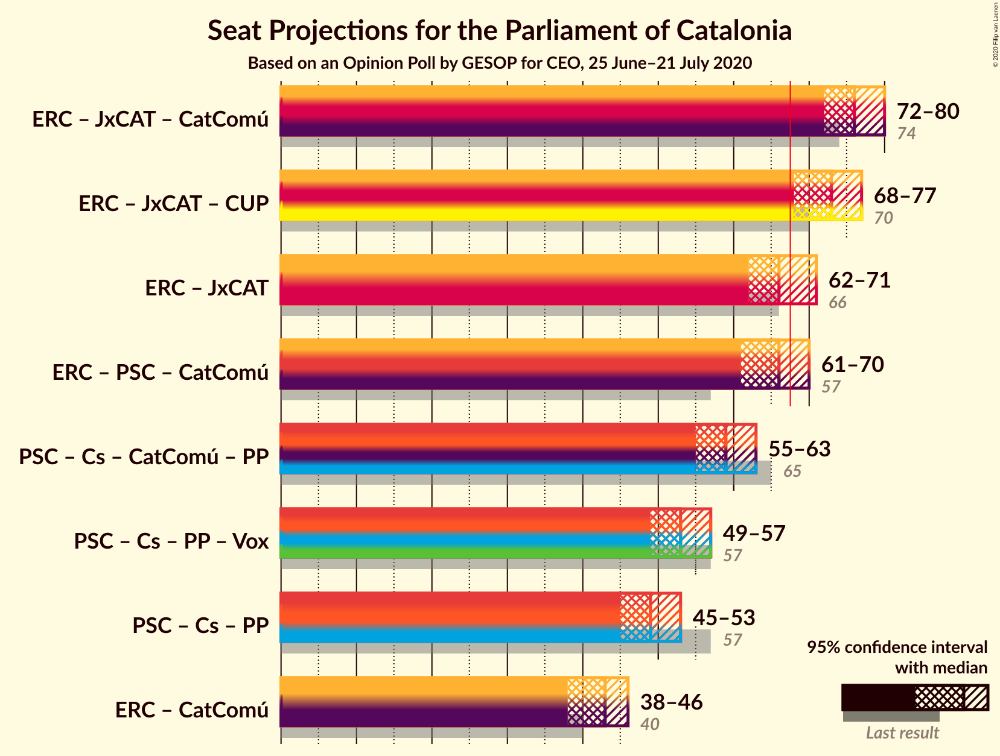

# Opinion Poll by GESOP for CEO, 25 June–21 July 2020

<a href="#voting-intentions">Voting Intentions</a> | <a href="#seats">Seats</a> | <a href="#coalitions">Coalitions</a> | <a href="#technical-information">Technical Information</a>

## Voting Intentions

### Confidence Intervals

| Party | Last Result | Poll Result | 80% Confidence Interval | 90% Confidence Interval | 95% Confidence Interval | 99% Confidence Interval |
|:-----:|:-----------:|:-----------:|:-----------------------:|:-----------------------:|:-----------------------:|:-----------------------:|
| Esquerra Republicana–Catalunya Sí | 21.4% | 22.1% | 20.7–23.5% |20.3–24.0% |20.0–24.3% |19.3–25.0% |
| Junts pel Catalunya | 21.7% | 20.9% | 19.6–22.4% |19.2–22.8% |18.9–23.2% |18.2–23.9% |
| Partit dels Socialistes de Catalunya (PSC-PSOE) | 13.9% | 17.0% | 15.8–18.4% |15.4–18.7% |15.1–19.1% |14.5–19.7% |
| Ciutadans–Partido de la Ciudadanía | 25.4% | 14.4% | 13.3–15.7% |13.0–16.1% |12.7–16.4% |12.1–17.0% |
| Catalunya en Comú–Podem | 7.5% | 8.2% | 7.3–9.2% |7.1–9.5% |6.9–9.8% |6.5–10.3% |
| Partit Popular | 4.2% | 5.5% | 4.8–6.4% |4.6–6.6% |4.4–6.8% |4.1–7.3% |
| Candidatura d’Unitat Popular | 4.5% | 4.9% | 4.3–5.8% |4.1–6.0% |3.9–6.2% |3.6–6.6% |
| Vox | 0.0% | 4.0% | 3.4–4.8% |3.2–5.0% |3.1–5.2% |2.8–5.5% |

*Note:* The poll result column reflects the actual value used in the calculations. Published results may vary slightly, and in addition be rounded to fewer digits.

## Seats

### Confidence Intervals

| Party | Last Result | Median | 80% Confidence Interval | 90% Confidence Interval | 95% Confidence Interval | 99% Confidence Interval |
|:-----:|:-----------:|:------:|:-----------------------:|:-----------------------:|:-----------------------:|:-----------------------:|
| <a href="#esquerra-republicana–catalunya-sí">Esquerra Republicana–Catalunya Sí</a> | 32 | 33 | 30–36 |30–37 |30–37 |29–38 |
| <a href="#junts-pel-catalunya">Junts pel Catalunya</a> | 34 | 34 | 31–36 |31–36 |30–37 |29–38 |
| <a href="#partit-dels-socialistes-de-catalunya-(psc-psoe)">Partit dels Socialistes de Catalunya (PSC-PSOE)</a> | 17 | 23 | 22–24 |20–25 |20–26 |18–26 |
| <a href="#ciutadans–partido-de-la-ciudadanía">Ciutadans–Partido de la Ciudadanía</a> | 36 | 19 | 18–21 |18–23 |18–23 |16–23 |
| <a href="#catalunya-en-comú–podem">Catalunya en Comú–Podem</a> | 8 | 9 | 8–11 |8–11 |8–11 |7–13 |
| <a href="#partit-popular">Partit Popular</a> | 4 | 7 | 5–7 |5–8 |4–9 |4–9 |
| <a href="#candidatura-d’unitat-popular">Candidatura d’Unitat Popular</a> | 4 | 6 | 4–8 |4–8 |4–8 |3–8 |
| <a href="#vox">Vox</a> | 0 | 3 | 3–5 |3–5 |3–6 |2–7 |

### Esquerra Republicana–Catalunya Sí

*For a full overview of the results for this party, see the [Esquerra Republicana–Catalunya Sí](party-esquerrarepublicana–catalunyasí.html) page.*

| Number of Seats | Probability | Accumulated | Special Marks |
|:---------------:|:-----------:|:-----------:|:-------------:|
| 28 | 0.4% | 100% |  |
| 29 | 2% | 99.6% |  |
| 30 | 11% | 98% |  |
| 31 | 8% | 87% |  |
| 32 | 22% | 79% | Last Result |
| 33 | 33% | 57% | Median |
| 34 | 4% | 24% |  |
| 35 | 8% | 19% |  |
| 36 | 6% | 11% |  |
| 37 | 4% | 5% |  |
| 38 | 0.9% | 1.3% |  |
| 39 | 0.3% | 0.3% |  |
| 40 | 0% | 0% |  |

### Junts pel Catalunya

*For a full overview of the results for this party, see the [Junts pel Catalunya](party-juntspelcatalunya.html) page.*

| Number of Seats | Probability | Accumulated | Special Marks |
|:---------------:|:-----------:|:-----------:|:-------------:|
| 28 | 0.1% | 100% |  |
| 29 | 0.8% | 99.9% |  |
| 30 | 3% | 99.1% |  |
| 31 | 12% | 96% |  |
| 32 | 19% | 85% |  |
| 33 | 12% | 66% |  |
| 34 | 13% | 54% | Last Result, Median |
| 35 | 19% | 41% |  |
| 36 | 19% | 22% |  |
| 37 | 3% | 3% |  |
| 38 | 0.6% | 0.8% |  |
| 39 | 0.1% | 0.1% |  |
| 40 | 0% | 0% |  |

### Partit dels Socialistes de Catalunya (PSC-PSOE)

*For a full overview of the results for this party, see the [Partit dels Socialistes de Catalunya (PSC-PSOE)](party-partitdelssocialistesdecatalunyapsc-psoe.html) page.*

| Number of Seats | Probability | Accumulated | Special Marks |
|:---------------:|:-----------:|:-----------:|:-------------:|
| 17 | 0.1% | 100% | Last Result |
| 18 | 0.6% | 99.9% |  |
| 19 | 2% | 99.3% |  |
| 20 | 3% | 98% |  |
| 21 | 3% | 95% |  |
| 22 | 8% | 92% |  |
| 23 | 41% | 84% | Median |
| 24 | 33% | 43% |  |
| 25 | 6% | 10% |  |
| 26 | 3% | 4% |  |
| 27 | 0.1% | 0.2% |  |
| 28 | 0.1% | 0.1% |  |
| 29 | 0% | 0% |  |

### Ciutadans–Partido de la Ciudadanía

*For a full overview of the results for this party, see the [Ciutadans–Partido de la Ciudadanía](party-ciutadans–partidodelaciudadanía.html) page.*

| Number of Seats | Probability | Accumulated | Special Marks |
|:---------------:|:-----------:|:-----------:|:-------------:|
| 15 | 0.2% | 100% |  |
| 16 | 0.6% | 99.8% |  |
| 17 | 0.5% | 99.1% |  |
| 18 | 10% | 98.6% |  |
| 19 | 44% | 88% | Median |
| 20 | 26% | 44% |  |
| 21 | 10% | 18% |  |
| 22 | 3% | 8% |  |
| 23 | 5% | 5% |  |
| 24 | 0.3% | 0.4% |  |
| 25 | 0.1% | 0.1% |  |
| 26 | 0% | 0% |  |
| 27 | 0% | 0% |  |
| 28 | 0% | 0% |  |
| 29 | 0% | 0% |  |
| 30 | 0% | 0% |  |
| 31 | 0% | 0% |  |
| 32 | 0% | 0% |  |
| 33 | 0% | 0% |  |
| 34 | 0% | 0% |  |
| 35 | 0% | 0% |  |
| 36 | 0% | 0% | Last Result |

### Catalunya en Comú–Podem

*For a full overview of the results for this party, see the [Catalunya en Comú–Podem](party-catalunyaencomú–podem.html) page.*

| Number of Seats | Probability | Accumulated | Special Marks |
|:---------------:|:-----------:|:-----------:|:-------------:|
| 6 | 0.2% | 100% |  |
| 7 | 0.6% | 99.8% |  |
| 8 | 19% | 99.2% | Last Result |
| 9 | 40% | 80% | Median |
| 10 | 13% | 39% |  |
| 11 | 24% | 26% |  |
| 12 | 1.1% | 2% |  |
| 13 | 1.2% | 1.3% |  |
| 14 | 0.1% | 0.1% |  |
| 15 | 0% | 0% |  |

### Partit Popular

*For a full overview of the results for this party, see the [Partit Popular](party-partitpopular.html) page.*

| Number of Seats | Probability | Accumulated | Special Marks |
|:---------------:|:-----------:|:-----------:|:-------------:|
| 3 | 0.5% | 100% |  |
| 4 | 2% | 99.5% | Last Result |
| 5 | 10% | 97% |  |
| 6 | 28% | 87% |  |
| 7 | 52% | 59% | Median |
| 8 | 4% | 7% |  |
| 9 | 3% | 3% |  |
| 10 | 0.2% | 0.2% |  |
| 11 | 0% | 0% |  |

### Candidatura d’Unitat Popular

*For a full overview of the results for this party, see the [Candidatura d’Unitat Popular](party-candidaturad’unitatpopular.html) page.*

| Number of Seats | Probability | Accumulated | Special Marks |
|:---------------:|:-----------:|:-----------:|:-------------:|
| 2 | 0.1% | 100% |  |
| 3 | 0.7% | 99.9% |  |
| 4 | 10% | 99.3% | Last Result |
| 5 | 30% | 89% |  |
| 6 | 10% | 59% | Median |
| 7 | 38% | 49% |  |
| 8 | 11% | 11% |  |
| 9 | 0.2% | 0.2% |  |
| 10 | 0% | 0% |  |

### Vox

*For a full overview of the results for this party, see the [Vox](party-vox.html) page.*

| Number of Seats | Probability | Accumulated | Special Marks |
|:---------------:|:-----------:|:-----------:|:-------------:|
| 0 | 0.4% | 100% | Last Result |
| 1 | 0% | 99.6% |  |
| 2 | 1.1% | 99.6% |  |
| 3 | 66% | 98% | Median |
| 4 | 9% | 33% |  |
| 5 | 20% | 24% |  |
| 6 | 3% | 4% |  |
| 7 | 1.3% | 1.3% |  |
| 8 | 0% | 0% |  |

## Coalitions

### Confidence Intervals

| Coalition | Last Result | Median | Majority? | 80% Confidence Interval | 90% Confidence Interval | 95% Confidence Interval | 99% Confidence Interval |
|:---------:|:-----------:|:------:|:---------:|:-----------------------:|:-----------------------:|:-----------------------:|:-----------------------:|
| Esquerra Republicana–Catalunya Sí – Junts pel Catalunya – Catalunya en Comú–Podem | 74 | 77 | 100% | 73–78 | 72–79 | 71–80 | 71–81 |
| Esquerra Republicana–Catalunya Sí – Junts pel Catalunya – Candidatura d’Unitat Popular | 70 | 73 | 99.4% | 69–76 | 69–77 | 68–77 | 67–78 |
| Esquerra Republicana–Catalunya Sí – Partit dels Socialistes de Catalunya (PSC-PSOE) – Catalunya en Comú–Podem | 57 | 66 | 18% | 63–68 | 63–69 | 62–70 | 60–71 |
| Esquerra Republicana–Catalunya Sí – Junts pel Catalunya | 66 | 67 | 35% | 64–69 | 62–70 | 62–70 | 61–72 |
| Partit dels Socialistes de Catalunya (PSC-PSOE) – Ciutadans–Partido de la Ciudadanía – Catalunya en Comú–Podem – Partit Popular | 65 | 59 | 0% | 56–61 | 55–63 | 55–63 | 53–64 |
| Partit dels Socialistes de Catalunya (PSC-PSOE) – Ciutadans–Partido de la Ciudadanía – Partit Popular – Vox | 57 | 52 | 0% | 50–56 | 50–57 | 49–57 | 47–58 |
| Partit dels Socialistes de Catalunya (PSC-PSOE) – Ciutadans–Partido de la Ciudadanía – Partit Popular | 57 | 49 | 0% | 47–52 | 46–53 | 45–53 | 44–54 |
| Esquerra Republicana–Catalunya Sí – Catalunya en Comú–Podem | 40 | 42 | 0% | 39–44 | 39–46 | 39–47 | 37–48 |

### Esquerra Republicana–Catalunya Sí – Junts pel Catalunya – Catalunya en Comú–Podem

| Number of Seats | Probability | Accumulated | Special Marks |
|:---------------:|:-----------:|:-----------:|:-------------:|
| 69 | 0.1% | 100% |  |
| 70 | 0.2% | 99.8% |  |
| 71 | 4% | 99.6% |  |
| 72 | 1.0% | 95% |  |
| 73 | 12% | 94% |  |
| 74 | 15% | 83% | Last Result |
| 75 | 11% | 68% |  |
| 76 | 6% | 57% | Median |
| 77 | 13% | 50% |  |
| 78 | 30% | 37% |  |
| 79 | 4% | 7% |  |
| 80 | 1.3% | 3% |  |
| 81 | 1.4% | 2% |  |
| 82 | 0.2% | 0.3% |  |
| 83 | 0.1% | 0.1% |  |
| 84 | 0% | 0% |  |

### Esquerra Republicana–Catalunya Sí – Junts pel Catalunya – Candidatura d’Unitat Popular

| Number of Seats | Probability | Accumulated | Special Marks |
|:---------------:|:-----------:|:-----------:|:-------------:|
| 65 | 0.1% | 100% |  |
| 66 | 0.1% | 99.9% |  |
| 67 | 0.5% | 99.8% |  |
| 68 | 2% | 99.4% | Majority |
| 69 | 11% | 97% |  |
| 70 | 4% | 87% | Last Result |
| 71 | 14% | 82% |  |
| 72 | 17% | 69% |  |
| 73 | 15% | 52% | Median |
| 74 | 23% | 36% |  |
| 75 | 3% | 13% |  |
| 76 | 4% | 11% |  |
| 77 | 6% | 7% |  |
| 78 | 0.2% | 0.5% |  |
| 79 | 0.2% | 0.3% |  |
| 80 | 0.1% | 0.2% |  |
| 81 | 0% | 0% |  |

### Esquerra Republicana–Catalunya Sí – Partit dels Socialistes de Catalunya (PSC-PSOE) – Catalunya en Comú–Podem

| Number of Seats | Probability | Accumulated | Special Marks |
|:---------------:|:-----------:|:-----------:|:-------------:|
| 57 | 0% | 100% | Last Result |
| 58 | 0.1% | 100% |  |
| 59 | 0.1% | 99.9% |  |
| 60 | 0.7% | 99.8% |  |
| 61 | 1.3% | 99.1% |  |
| 62 | 2% | 98% |  |
| 63 | 18% | 96% |  |
| 64 | 4% | 78% |  |
| 65 | 24% | 74% | Median |
| 66 | 24% | 50% |  |
| 67 | 8% | 26% |  |
| 68 | 11% | 18% | Majority |
| 69 | 2% | 7% |  |
| 70 | 4% | 5% |  |
| 71 | 0.9% | 1.1% |  |
| 72 | 0.2% | 0.2% |  |
| 73 | 0% | 0.1% |  |
| 74 | 0% | 0% |  |

### Esquerra Republicana–Catalunya Sí – Junts pel Catalunya

| Number of Seats | Probability | Accumulated | Special Marks |
|:---------------:|:-----------:|:-----------:|:-------------:|
| 60 | 0.2% | 100% |  |
| 61 | 0.6% | 99.8% |  |
| 62 | 5% | 99.2% |  |
| 63 | 4% | 95% |  |
| 64 | 15% | 90% |  |
| 65 | 11% | 76% |  |
| 66 | 14% | 65% | Last Result |
| 67 | 15% | 50% | Median |
| 68 | 8% | 35% | Majority |
| 69 | 18% | 27% |  |
| 70 | 7% | 9% |  |
| 71 | 1.0% | 2% |  |
| 72 | 0.6% | 0.9% |  |
| 73 | 0.2% | 0.3% |  |
| 74 | 0% | 0.1% |  |
| 75 | 0% | 0% |  |

### Partit dels Socialistes de Catalunya (PSC-PSOE) – Ciutadans–Partido de la Ciudadanía – Catalunya en Comú–Podem – Partit Popular

| Number of Seats | Probability | Accumulated | Special Marks |
|:---------------:|:-----------:|:-----------:|:-------------:|
| 51 | 0% | 100% |  |
| 52 | 0.2% | 99.9% |  |
| 53 | 0.3% | 99.8% |  |
| 54 | 0.5% | 99.5% |  |
| 55 | 7% | 98.9% |  |
| 56 | 5% | 92% |  |
| 57 | 6% | 87% |  |
| 58 | 27% | 81% | Median |
| 59 | 15% | 54% |  |
| 60 | 17% | 38% |  |
| 61 | 13% | 21% |  |
| 62 | 3% | 8% |  |
| 63 | 5% | 6% |  |
| 64 | 0.3% | 0.6% |  |
| 65 | 0.3% | 0.3% | Last Result |
| 66 | 0% | 0% |  |

### Partit dels Socialistes de Catalunya (PSC-PSOE) – Ciutadans–Partido de la Ciudadanía – Partit Popular – Vox

| Number of Seats | Probability | Accumulated | Special Marks |
|:---------------:|:-----------:|:-----------:|:-------------:|
| 46 | 0.1% | 100% |  |
| 47 | 0.6% | 99.8% |  |
| 48 | 0.6% | 99.2% |  |
| 49 | 3% | 98.6% |  |
| 50 | 7% | 96% |  |
| 51 | 9% | 89% |  |
| 52 | 31% | 80% | Median |
| 53 | 12% | 49% |  |
| 54 | 12% | 36% |  |
| 55 | 9% | 25% |  |
| 56 | 7% | 16% |  |
| 57 | 7% | 8% | Last Result |
| 58 | 1.0% | 1.3% |  |
| 59 | 0.1% | 0.2% |  |
| 60 | 0.2% | 0.2% |  |
| 61 | 0% | 0% |  |

### Partit dels Socialistes de Catalunya (PSC-PSOE) – Ciutadans–Partido de la Ciudadanía – Partit Popular

| Number of Seats | Probability | Accumulated | Special Marks |
|:---------------:|:-----------:|:-----------:|:-------------:|
| 43 | 0.3% | 100% |  |
| 44 | 1.1% | 99.7% |  |
| 45 | 1.3% | 98.6% |  |
| 46 | 3% | 97% |  |
| 47 | 8% | 94% |  |
| 48 | 12% | 86% |  |
| 49 | 31% | 74% | Median |
| 50 | 22% | 43% |  |
| 51 | 6% | 21% |  |
| 52 | 6% | 15% |  |
| 53 | 8% | 8% |  |
| 54 | 0.2% | 0.6% |  |
| 55 | 0.4% | 0.4% |  |
| 56 | 0% | 0% |  |
| 57 | 0% | 0% | Last Result |

### Esquerra Republicana–Catalunya Sí – Catalunya en Comú–Podem

| Number of Seats | Probability | Accumulated | Special Marks |
|:---------------:|:-----------:|:-----------:|:-------------:|
| 37 | 1.0% | 100% |  |
| 38 | 0.7% | 98.9% |  |
| 39 | 14% | 98% |  |
| 40 | 4% | 84% | Last Result |
| 41 | 5% | 80% |  |
| 42 | 28% | 75% | Median |
| 43 | 23% | 48% |  |
| 44 | 15% | 24% |  |
| 45 | 2% | 10% |  |
| 46 | 5% | 7% |  |
| 47 | 2% | 3% |  |
| 48 | 0.4% | 0.7% |  |
| 49 | 0.2% | 0.3% |  |
| 50 | 0% | 0.1% |  |
| 51 | 0% | 0% |  |

## Technical Information

### Opinion Poll

+ **Polling firm:** GESOP
+ **Commissioner(s):** CEO
+ **Fieldwork period:** 25 June–21 July 2020

### Calculations

+ **Sample size:** 1400
+ **Simulations done:** 131,072
+ **Error estimate:** 1.02%

