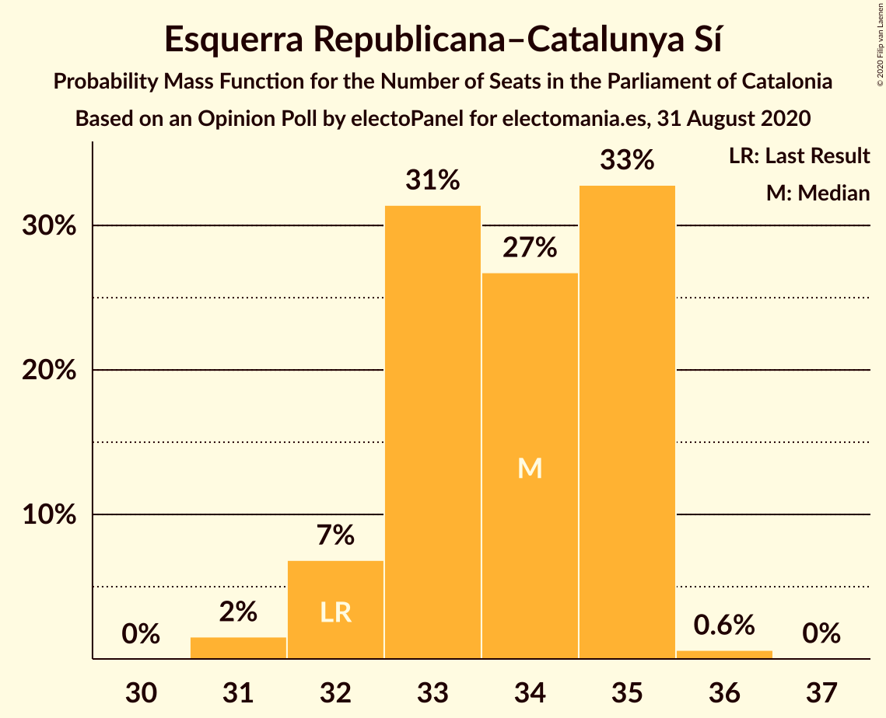
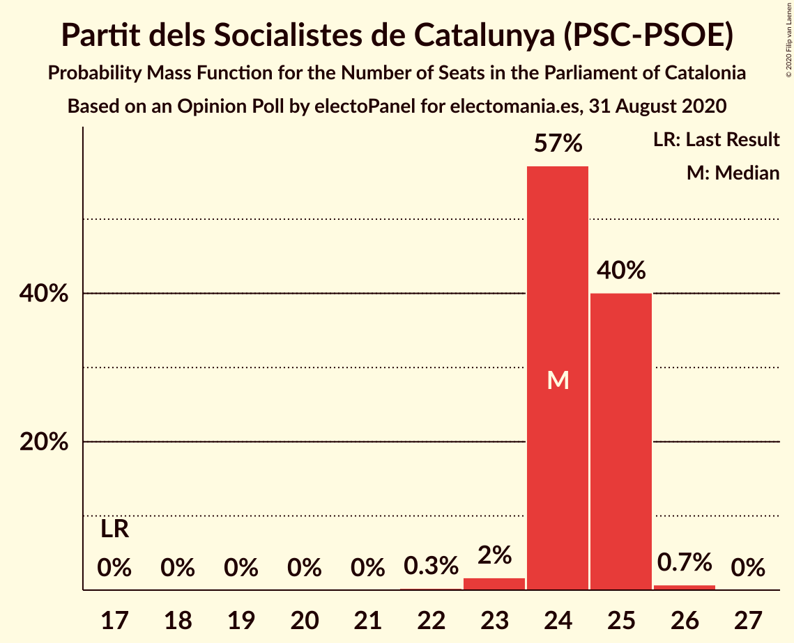
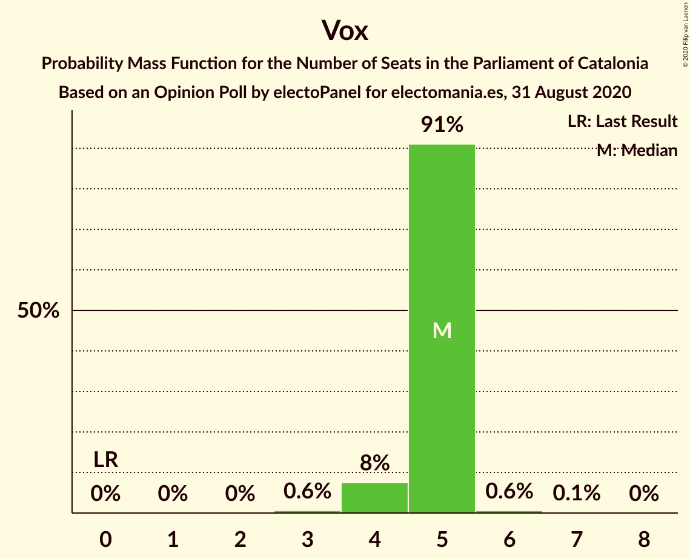
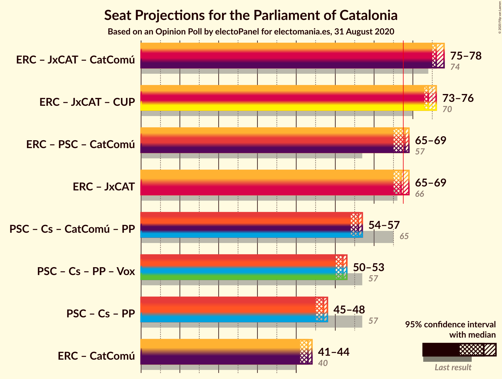
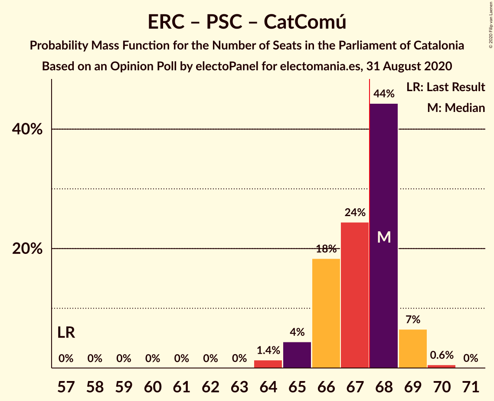
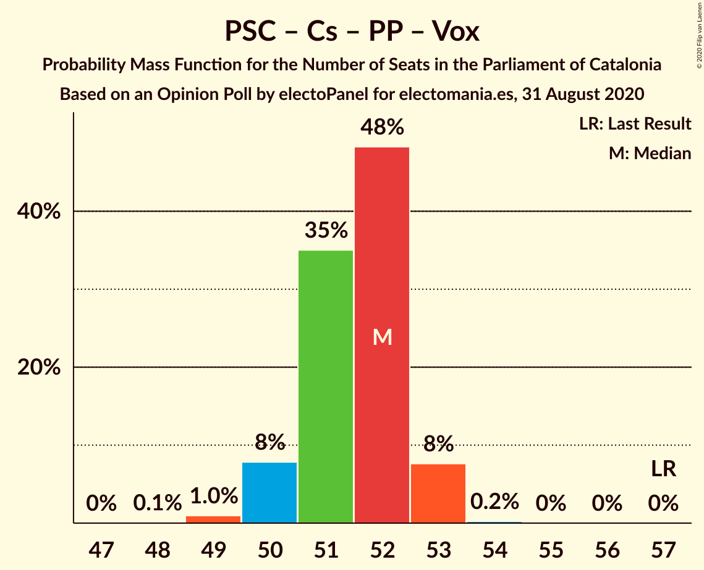
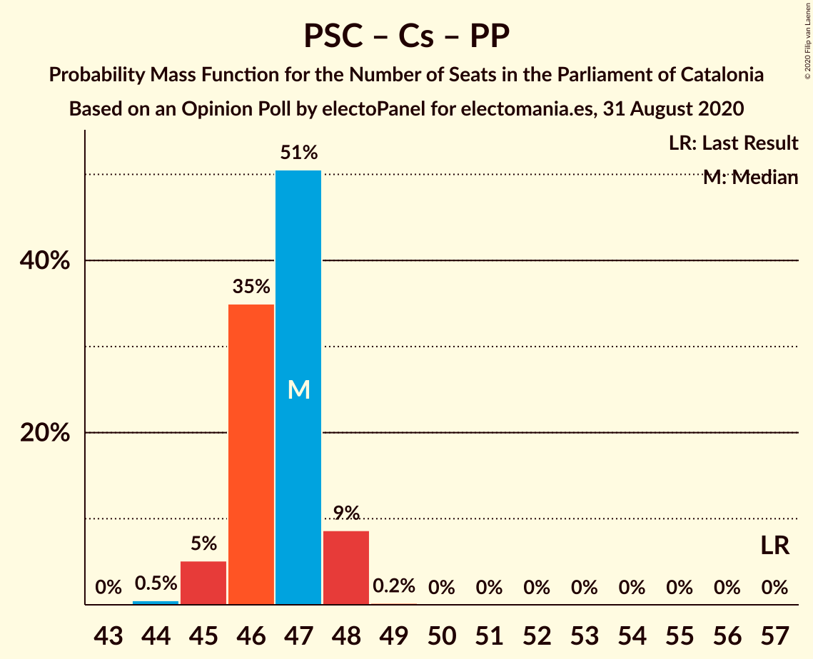
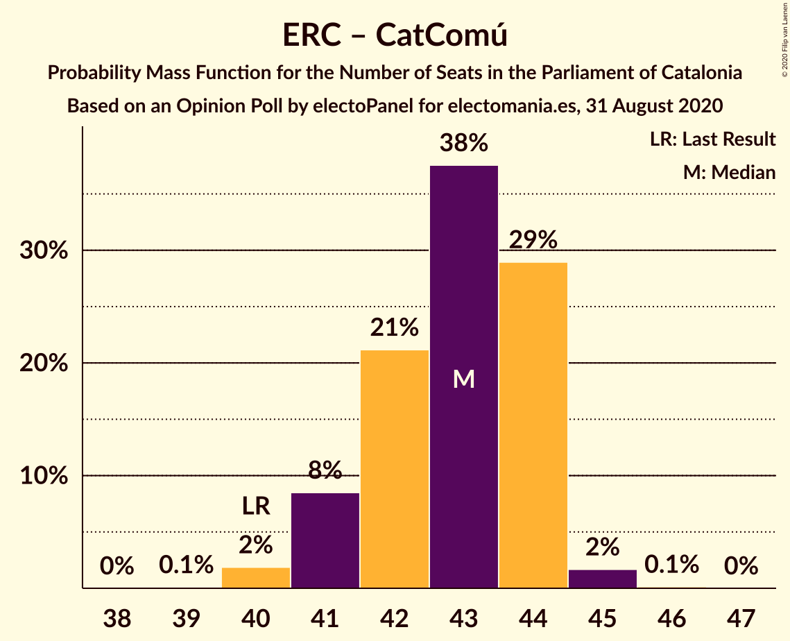

# Opinion Poll by electoPanel for electomania.es, 31 August 2020

<a href="#voting-intentions">Voting Intentions</a> | <a href="#seats">Seats</a> | <a href="#coalitions">Coalitions</a> | <a href="#technical-information">Technical Information</a>

## Voting Intentions

### Confidence Intervals

| Party | Last Result | Poll Result | 80% Confidence Interval | 90% Confidence Interval | 95% Confidence Interval | 99% Confidence Interval |
|:-----:|:-----------:|:-----------:|:-----------------------:|:-----------------------:|:-----------------------:|:-----------------------:|
| Esquerra Republicana–Catalunya Sí | 21.4% | 22.4% | 21.8–23.0% |21.6–23.2% |21.5–23.3% |21.2–23.6% |
| Junts pel Catalunya | 21.7% | 21.4% | 20.8–22.0% |20.7–22.2% |20.5–22.3% |20.2–22.6% |
| Partit dels Socialistes de Catalunya (PSC-PSOE) | 13.9% | 17.9% | 17.4–18.5% |17.2–18.6% |17.1–18.8% |16.8–19.0% |
| Ciutadans–Partido de la Ciudadanía | 25.4% | 10.1% | 9.7–10.5% |9.6–10.7% |9.4–10.8% |9.3–11.0% |
| Catalunya en Comú–Podem | 7.5% | 8.1% | 7.7–8.5% |7.6–8.6% |7.5–8.7% |7.3–8.9% |
| Partit Popular | 4.2% | 7.1% | 6.7–7.5% |6.6–7.6% |6.6–7.7% |6.4–7.9% |
| Candidatura d’Unitat Popular | 4.5% | 5.5% | 5.2–5.9% |5.1–5.9% |5.0–6.0% |4.9–6.2% |
| Vox | 0.0% | 4.6% | 4.3–4.9% |4.2–5.0% |4.2–5.1% |4.0–5.2% |

*Note:* The poll result column reflects the actual value used in the calculations. Published results may vary slightly, and in addition be rounded to fewer digits.

## Seats

### Confidence Intervals

| Party | Last Result | Median | 80% Confidence Interval | 90% Confidence Interval | 95% Confidence Interval | 99% Confidence Interval |
|:-----:|:-----------:|:------:|:-----------------------:|:-----------------------:|:-----------------------:|:-----------------------:|
| <a href="#esquerra-republicana–catalunya-sí">Esquerra Republicana–Catalunya Sí</a> | 32 | 33 | 32–35 |32–35 |32–35 |31–36 |
| <a href="#junts-pel-catalunya">Junts pel Catalunya</a> | 34 | 33 | 32–34 |32–35 |32–36 |32–36 |
| <a href="#partit-dels-socialistes-de-catalunya-(psc-psoe)">Partit dels Socialistes de Catalunya (PSC-PSOE)</a> | 17 | 24 | 24–25 |24–25 |23–25 |23–26 |
| <a href="#ciutadans–partido-de-la-ciudadanía">Ciutadans–Partido de la Ciudadanía</a> | 36 | 13 | 13–14 |13–14 |13–14 |12–14 |
| <a href="#catalunya-en-comú–podem">Catalunya en Comú–Podem</a> | 8 | 9 | 8–10 |8–10 |8–11 |8–11 |
| <a href="#partit-popular">Partit Popular</a> | 4 | 9 | 9–10 |8–10 |8–10 |8–10 |
| <a href="#candidatura-d’unitat-popular">Candidatura d’Unitat Popular</a> | 4 | 8 | 7–8 |7–8 |7–8 |5–8 |
| <a href="#vox">Vox</a> | 0 | 5 | 5 |4–5 |4–5 |3–6 |

### Esquerra Republicana–Catalunya Sí

*For a full overview of the results for this party, see the [Esquerra Republicana–Catalunya Sí](party-esquerrarepublicana–catalunyasí.html) page.*

| Number of Seats | Probability | Accumulated | Special Marks |
|:---------------:|:-----------:|:-----------:|:-------------:|
| 31 | 2% | 100% |  |
| 32 | 10% | 98% | Last Result |
| 33 | 38% | 88% | Median |
| 34 | 16% | 50% |  |
| 35 | 33% | 34% |  |
| 36 | 0.6% | 0.6% |  |
| 37 | 0% | 0% |  |

### Junts pel Catalunya

*For a full overview of the results for this party, see the [Junts pel Catalunya](party-juntspelcatalunya.html) page.*

| Number of Seats | Probability | Accumulated | Special Marks |
|:---------------:|:-----------:|:-----------:|:-------------:|
| 31 | 0.1% | 100% |  |
| 32 | 35% | 99.9% |  |
| 33 | 28% | 65% | Median |
| 34 | 27% | 37% | Last Result |
| 35 | 7% | 10% |  |
| 36 | 2% | 3% |  |
| 37 | 0.2% | 0.2% |  |
| 38 | 0% | 0% |  |

### Partit dels Socialistes de Catalunya (PSC-PSOE)

*For a full overview of the results for this party, see the [Partit dels Socialistes de Catalunya (PSC-PSOE)](party-partitdelssocialistesdecatalunyapsc-psoe.html) page.*

| Number of Seats | Probability | Accumulated | Special Marks |
|:---------------:|:-----------:|:-----------:|:-------------:|
| 17 | 0% | 100% | Last Result |
| 18 | 0% | 100% |  |
| 19 | 0% | 100% |  |
| 20 | 0% | 100% |  |
| 21 | 0% | 100% |  |
| 22 | 0.2% | 100% |  |
| 23 | 3% | 99.8% |  |
| 24 | 52% | 97% | Median |
| 25 | 44% | 45% |  |
| 26 | 0.8% | 0.8% |  |
| 27 | 0% | 0% |  |

### Ciutadans–Partido de la Ciudadanía

*For a full overview of the results for this party, see the [Ciutadans–Partido de la Ciudadanía](party-ciutadans–partidodelaciudadanía.html) page.*

| Number of Seats | Probability | Accumulated | Special Marks |
|:---------------:|:-----------:|:-----------:|:-------------:|
| 12 | 2% | 100% |  |
| 13 | 80% | 98% | Median |
| 14 | 19% | 19% |  |
| 15 | 0% | 0% |  |
| 16 | 0% | 0% |  |
| 17 | 0% | 0% |  |
| 18 | 0% | 0% |  |
| 19 | 0% | 0% |  |
| 20 | 0% | 0% |  |
| 21 | 0% | 0% |  |
| 22 | 0% | 0% |  |
| 23 | 0% | 0% |  |
| 24 | 0% | 0% |  |
| 25 | 0% | 0% |  |
| 26 | 0% | 0% |  |
| 27 | 0% | 0% |  |
| 28 | 0% | 0% |  |
| 29 | 0% | 0% |  |
| 30 | 0% | 0% |  |
| 31 | 0% | 0% |  |
| 32 | 0% | 0% |  |
| 33 | 0% | 0% |  |
| 34 | 0% | 0% |  |
| 35 | 0% | 0% |  |
| 36 | 0% | 0% | Last Result |

### Catalunya en Comú–Podem

*For a full overview of the results for this party, see the [Catalunya en Comú–Podem](party-catalunyaencomú–podem.html) page.*

| Number of Seats | Probability | Accumulated | Special Marks |
|:---------------:|:-----------:|:-----------:|:-------------:|
| 8 | 15% | 100% | Last Result |
| 9 | 69% | 85% | Median |
| 10 | 13% | 16% |  |
| 11 | 4% | 4% |  |
| 12 | 0% | 0% |  |

### Partit Popular

*For a full overview of the results for this party, see the [Partit Popular](party-partitpopular.html) page.*

| Number of Seats | Probability | Accumulated | Special Marks |
|:---------------:|:-----------:|:-----------:|:-------------:|
| 4 | 0% | 100% | Last Result |
| 5 | 0% | 100% |  |
| 6 | 0% | 100% |  |
| 7 | 0.3% | 100% |  |
| 8 | 9% | 99.7% |  |
| 9 | 75% | 90% | Median |
| 10 | 15% | 15% |  |
| 11 | 0% | 0% |  |

### Candidatura d’Unitat Popular

*For a full overview of the results for this party, see the [Candidatura d’Unitat Popular](party-candidaturad’unitatpopular.html) page.*

| Number of Seats | Probability | Accumulated | Special Marks |
|:---------------:|:-----------:|:-----------:|:-------------:|
| 4 | 0% | 100% | Last Result |
| 5 | 0.9% | 100% |  |
| 6 | 0.4% | 99.1% |  |
| 7 | 46% | 98.8% |  |
| 8 | 53% | 53% | Median |
| 9 | 0% | 0% |  |

### Vox

*For a full overview of the results for this party, see the [Vox](party-vox.html) page.*

| Number of Seats | Probability | Accumulated | Special Marks |
|:---------------:|:-----------:|:-----------:|:-------------:|
| 0 | 0% | 100% | Last Result |
| 1 | 0% | 100% |  |
| 2 | 0% | 100% |  |
| 3 | 0.5% | 100% |  |
| 4 | 6% | 99.5% |  |
| 5 | 92% | 94% | Median |
| 6 | 1.0% | 1.1% |  |
| 7 | 0.1% | 0.1% |  |
| 8 | 0% | 0% |  |

## Coalitions

### Confidence Intervals

| Coalition | Last Result | Median | Majority? | 80% Confidence Interval | 90% Confidence Interval | 95% Confidence Interval | 99% Confidence Interval |
|:---------:|:-----------:|:------:|:---------:|:-----------------------:|:-----------------------:|:-----------------------:|:-----------------------:|
| Esquerra Republicana–Catalunya Sí – Junts pel Catalunya – Catalunya en Comú–Podem | 74 | 76 | 100% | 75–77 | 74–78 | 74–78 | 74–78 |
| Esquerra Republicana–Catalunya Sí – Junts pel Catalunya – Candidatura d’Unitat Popular | 70 | 74 | 100% | 73–75 | 73–76 | 73–76 | 72–77 |
| Esquerra Republicana–Catalunya Sí – Partit dels Socialistes de Catalunya (PSC-PSOE) – Catalunya en Comú–Podem | 57 | 67 | 46% | 66–69 | 65–69 | 65–69 | 64–70 |
| Esquerra Republicana–Catalunya Sí – Junts pel Catalunya | 66 | 67 | 21% | 66–68 | 65–68 | 65–69 | 65–69 |
| Partit dels Socialistes de Catalunya (PSC-PSOE) – Ciutadans–Partido de la Ciudadanía – Catalunya en Comú–Podem – Partit Popular | 65 | 56 | 0% | 55–57 | 54–57 | 54–57 | 53–58 |
| Partit dels Socialistes de Catalunya (PSC-PSOE) – Ciutadans–Partido de la Ciudadanía – Partit Popular – Vox | 57 | 52 | 0% | 51–53 | 50–53 | 50–53 | 49–53 |
| Partit dels Socialistes de Catalunya (PSC-PSOE) – Ciutadans–Partido de la Ciudadanía – Partit Popular | 57 | 47 | 0% | 46–48 | 45–48 | 45–48 | 44–48 |
| Esquerra Republicana–Catalunya Sí – Catalunya en Comú–Podem | 40 | 43 | 0% | 41–44 | 41–44 | 41–44 | 40–45 |

### Esquerra Republicana–Catalunya Sí – Junts pel Catalunya – Catalunya en Comú–Podem

| Number of Seats | Probability | Accumulated | Special Marks |
|:---------------:|:-----------:|:-----------:|:-------------:|
| 73 | 0.2% | 100% |  |
| 74 | 5% | 99.8% | Last Result |
| 75 | 21% | 95% | Median |
| 76 | 57% | 73% |  |
| 77 | 10% | 16% |  |
| 78 | 6% | 6% |  |
| 79 | 0.2% | 0.4% |  |
| 80 | 0.2% | 0.2% |  |
| 81 | 0% | 0% |  |

### Esquerra Republicana–Catalunya Sí – Junts pel Catalunya – Candidatura d’Unitat Popular

| Number of Seats | Probability | Accumulated | Special Marks |
|:---------------:|:-----------:|:-----------:|:-------------:|
| 70 | 0% | 100% | Last Result |
| 71 | 0% | 100% |  |
| 72 | 1.4% | 100% |  |
| 73 | 18% | 98.6% |  |
| 74 | 33% | 80% | Median |
| 75 | 39% | 47% |  |
| 76 | 6% | 8% |  |
| 77 | 2% | 2% |  |
| 78 | 0.1% | 0.1% |  |
| 79 | 0% | 0% |  |

### Esquerra Republicana–Catalunya Sí – Partit dels Socialistes de Catalunya (PSC-PSOE) – Catalunya en Comú–Podem

| Number of Seats | Probability | Accumulated | Special Marks |
|:---------------:|:-----------:|:-----------:|:-------------:|
| 57 | 0% | 100% | Last Result |
| 58 | 0% | 100% |  |
| 59 | 0% | 100% |  |
| 60 | 0% | 100% |  |
| 61 | 0% | 100% |  |
| 62 | 0% | 100% |  |
| 63 | 0% | 100% |  |
| 64 | 1.0% | 100% |  |
| 65 | 8% | 99.0% |  |
| 66 | 21% | 91% | Median |
| 67 | 24% | 70% |  |
| 68 | 35% | 46% | Majority |
| 69 | 11% | 11% |  |
| 70 | 0.5% | 0.5% |  |
| 71 | 0% | 0% |  |

### Esquerra Republicana–Catalunya Sí – Junts pel Catalunya

| Number of Seats | Probability | Accumulated | Special Marks |
|:---------------:|:-----------:|:-----------:|:-------------:|
| 64 | 0.2% | 100% |  |
| 65 | 10% | 99.7% |  |
| 66 | 20% | 90% | Last Result, Median |
| 67 | 49% | 70% |  |
| 68 | 17% | 21% | Majority |
| 69 | 4% | 4% |  |
| 70 | 0.3% | 0.4% |  |
| 71 | 0.1% | 0.1% |  |
| 72 | 0% | 0% |  |

### Partit dels Socialistes de Catalunya (PSC-PSOE) – Ciutadans–Partido de la Ciudadanía – Catalunya en Comú–Podem – Partit Popular

| Number of Seats | Probability | Accumulated | Special Marks |
|:---------------:|:-----------:|:-----------:|:-------------:|
| 53 | 2% | 100% |  |
| 54 | 6% | 98% |  |
| 55 | 36% | 93% | Median |
| 56 | 36% | 56% |  |
| 57 | 19% | 21% |  |
| 58 | 2% | 2% |  |
| 59 | 0% | 0% |  |
| 60 | 0% | 0% |  |
| 61 | 0% | 0% |  |
| 62 | 0% | 0% |  |
| 63 | 0% | 0% |  |
| 64 | 0% | 0% |  |
| 65 | 0% | 0% | Last Result |

### Partit dels Socialistes de Catalunya (PSC-PSOE) – Ciutadans–Partido de la Ciudadanía – Partit Popular – Vox

| Number of Seats | Probability | Accumulated | Special Marks |
|:---------------:|:-----------:|:-----------:|:-------------:|
| 48 | 0.1% | 100% |  |
| 49 | 2% | 99.9% |  |
| 50 | 7% | 98% |  |
| 51 | 34% | 91% | Median |
| 52 | 45% | 57% |  |
| 53 | 12% | 12% |  |
| 54 | 0.3% | 0.3% |  |
| 55 | 0% | 0% |  |
| 56 | 0% | 0% |  |
| 57 | 0% | 0% | Last Result |

### Partit dels Socialistes de Catalunya (PSC-PSOE) – Ciutadans–Partido de la Ciudadanía – Partit Popular

| Number of Seats | Probability | Accumulated | Special Marks |
|:---------------:|:-----------:|:-----------:|:-------------:|
| 44 | 1.5% | 100% |  |
| 45 | 6% | 98% |  |
| 46 | 32% | 92% | Median |
| 47 | 47% | 60% |  |
| 48 | 14% | 14% |  |
| 49 | 0.1% | 0.1% |  |
| 50 | 0% | 0% |  |
| 51 | 0% | 0% |  |
| 52 | 0% | 0% |  |
| 53 | 0% | 0% |  |
| 54 | 0% | 0% |  |
| 55 | 0% | 0% |  |
| 56 | 0% | 0% |  |
| 57 | 0% | 0% | Last Result |

### Esquerra Republicana–Catalunya Sí – Catalunya en Comú–Podem

| Number of Seats | Probability | Accumulated | Special Marks |
|:---------------:|:-----------:|:-----------:|:-------------:|
| 40 | 1.4% | 100% | Last Result |
| 41 | 16% | 98.5% |  |
| 42 | 22% | 83% | Median |
| 43 | 30% | 61% |  |
| 44 | 29% | 31% |  |
| 45 | 2% | 2% |  |
| 46 | 0.2% | 0.2% |  |
| 47 | 0% | 0% |  |

## Technical Information

### Opinion Poll

+ **Polling firm:** electoPanel
+ **Commissioner(s):** electomania.es
+ **Fieldwork period:** 31 August 2020

### Calculations

+ **Sample size:** 8000
+ **Simulations done:** 131,072
+ **Error estimate:** 0.93%

