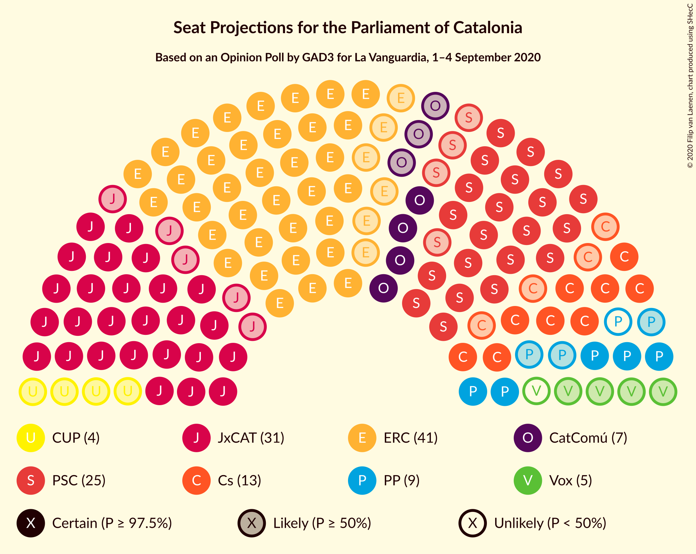
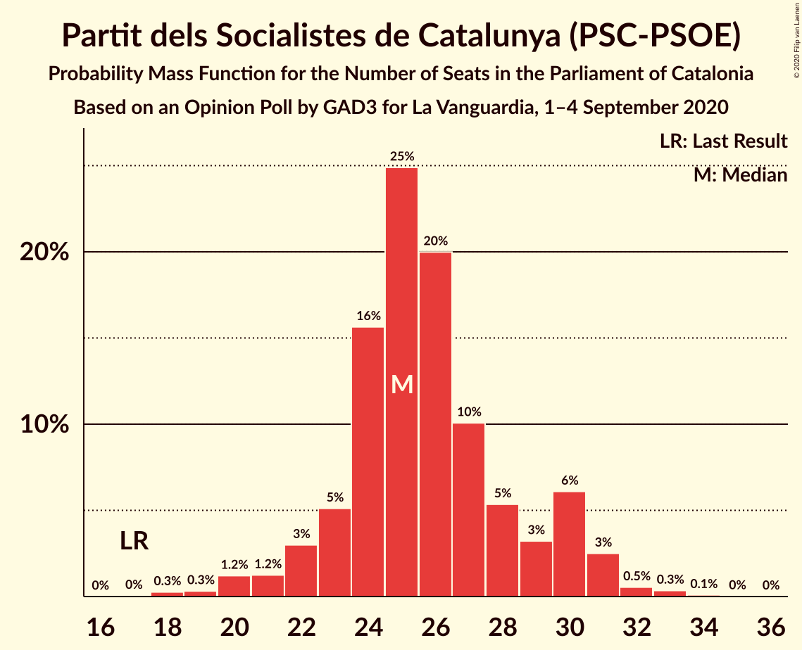
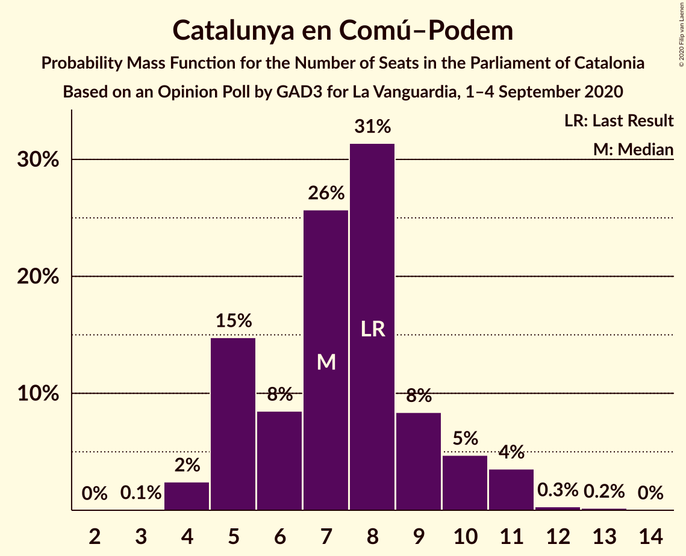
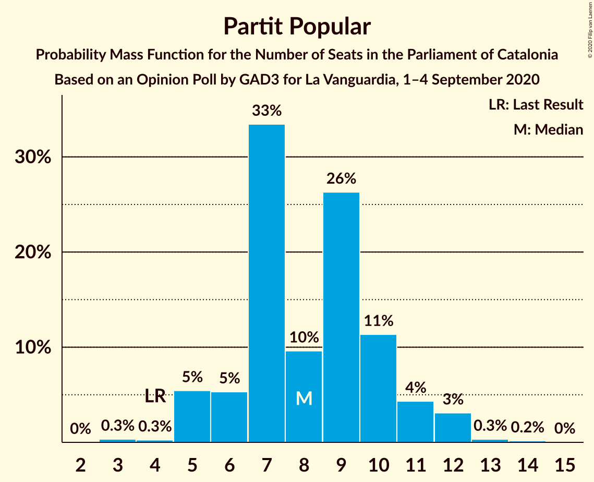
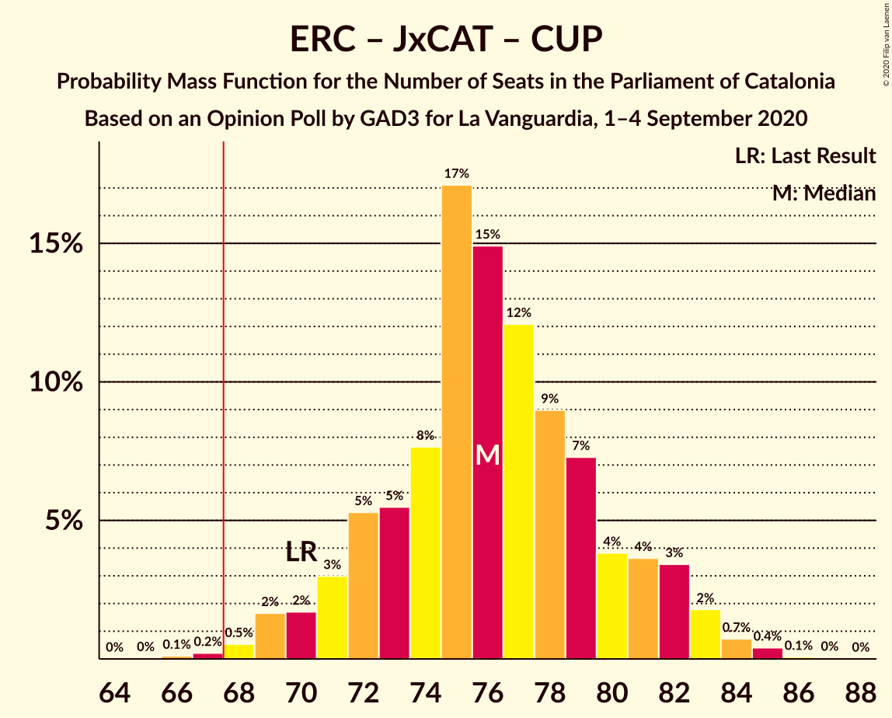
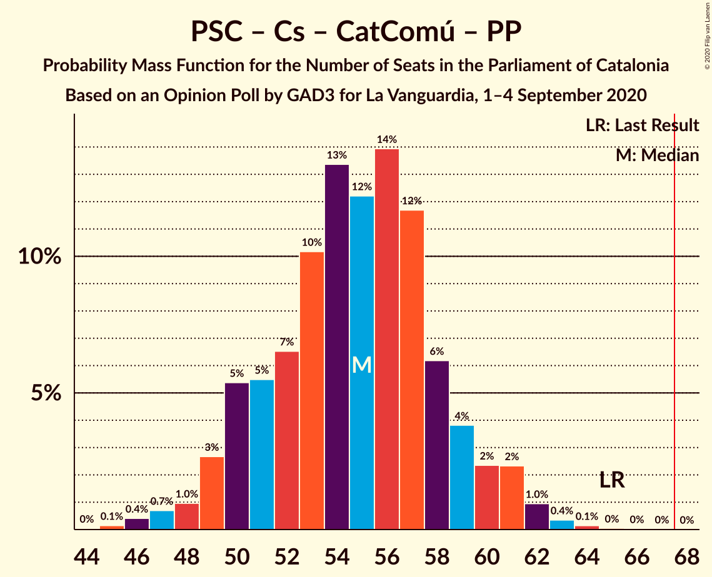
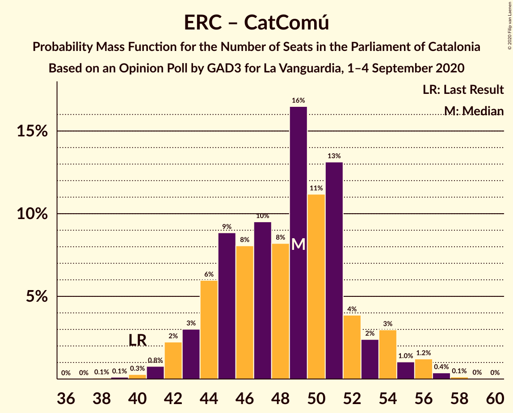

# Opinion Poll by GAD3 for La Vanguardia, 1–4 September 2020

<a href="#voting-intentions">Voting Intentions</a> | <a href="#seats">Seats</a> | <a href="#coalitions">Coalitions</a> | <a href="#technical-information">Technical Information</a>

## Voting Intentions

### Confidence Intervals

| Party | Last Result | Poll Result | 80% Confidence Interval | 90% Confidence Interval | 95% Confidence Interval | 99% Confidence Interval |
|:-----:|:-----------:|:-----------:|:-----------------------:|:-----------------------:|:-----------------------:|:-----------------------:|
| Esquerra Republicana–Catalunya Sí | 21.4% | 27.2% | 24.9–29.7% |24.2–30.4% |23.7–31.1% |22.6–32.3% |
| Junts per Catalunya | 21.7% | 19.8% | 17.8–22.1% |17.2–22.8% |16.7–23.4% |15.8–24.5% |
| Partit dels Socialistes de Catalunya (PSC-PSOE) | 13.9% | 19.1% | 17.1–21.4% |16.5–22.0% |16.0–22.6% |15.1–23.7% |
| Ciutadans–Partido de la Ciudadanía | 25.4% | 10.3% | 8.8–12.1% |8.4–12.6% |8.0–13.1% |7.3–14.0% |
| Catalunya en Comú–Podem | 7.5% | 6.7% | 5.5–8.2% |5.2–8.7% |4.9–9.1% |4.4–9.9% |
| Partit Popular | 4.2% | 6.5% | 5.3–8.0% |5.0–8.5% |4.7–8.9% |4.2–9.6% |
| Vox | 0.0% | 4.1% | 3.2–5.4% |3.0–5.8% |2.8–6.2% |2.4–6.8% |
| Candidatura d’Unitat Popular | 4.5% | 4.0% | 3.1–5.2% |2.8–5.6% |2.6–5.9% |2.3–6.6% |

*Note:* The poll result column reflects the actual value used in the calculations. Published results may vary slightly, and in addition be rounded to fewer digits.

## Seats

### Confidence Intervals

| Party | Last Result | Median | 80% Confidence Interval | 90% Confidence Interval | 95% Confidence Interval | 99% Confidence Interval |
|:-----:|:-----------:|:------:|:-----------------------:|:-----------------------:|:-----------------------:|:-----------------------:|
| <a href="#esquerra-republicana–catalunya-sí">Esquerra Republicana–Catalunya Sí</a> | 32 | 41 | 37–44 |36–46 |35–47 |33–49 |
| <a href="#junts-per-catalunya">Junts per Catalunya</a> | 34 | 31 | 28–35 |26–37 |26–37 |25–38 |
| <a href="#partit-dels-socialistes-de-catalunya-(psc-psoe)">Partit dels Socialistes de Catalunya (PSC-PSOE)</a> | 17 | 25 | 23–29 |22–30 |21–31 |19–32 |
| <a href="#ciutadans–partido-de-la-ciudadanía">Ciutadans–Partido de la Ciudadanía</a> | 36 | 13 | 12–16 |11–17 |9–18 |8–19 |
| <a href="#catalunya-en-comú–podem">Catalunya en Comú–Podem</a> | 8 | 7 | 5–9 |5–10 |4–11 |4–12 |
| <a href="#partit-popular">Partit Popular</a> | 4 | 8 | 6–10 |5–11 |5–12 |4–13 |
| <a href="#vox">Vox</a> | 0 | 4 | 3–7 |2–7 |0–7 |0–9 |
| <a href="#candidatura-d’unitat-popular">Candidatura d’Unitat Popular</a> | 4 | 4 | 0–7 |0–8 |0–8 |0–8 |

### Esquerra Republicana–Catalunya Sí

*For a full overview of the results for this party, see the [Esquerra Republicana–Catalunya Sí](party-esquerrarepublicana–catalunyasí.html) page.*

| Number of Seats | Probability | Accumulated | Special Marks |
|:---------------:|:-----------:|:-----------:|:-------------:|
| 32 | 0.1% | 100% | Last Result |
| 33 | 0.3% | 99.8% |  |
| 34 | 0.6% | 99.5% |  |
| 35 | 2% | 98.9% |  |
| 36 | 2% | 97% |  |
| 37 | 8% | 95% |  |
| 38 | 8% | 86% |  |
| 39 | 11% | 78% |  |
| 40 | 7% | 66% |  |
| 41 | 14% | 59% | Median |
| 42 | 13% | 45% |  |
| 43 | 11% | 32% |  |
| 44 | 11% | 21% |  |
| 45 | 4% | 10% |  |
| 46 | 2% | 5% |  |
| 47 | 1.5% | 3% |  |
| 48 | 1.1% | 2% |  |
| 49 | 0.4% | 0.8% |  |
| 50 | 0.2% | 0.4% |  |
| 51 | 0.1% | 0.2% |  |
| 52 | 0% | 0% |  |

### Junts per Catalunya

*For a full overview of the results for this party, see the [Junts per Catalunya](party-juntspercatalunya.html) page.*

| Number of Seats | Probability | Accumulated | Special Marks |
|:---------------:|:-----------:|:-----------:|:-------------:|
| 23 | 0.1% | 100% |  |
| 24 | 0.3% | 99.8% |  |
| 25 | 2% | 99.5% |  |
| 26 | 4% | 98% |  |
| 27 | 3% | 94% |  |
| 28 | 6% | 91% |  |
| 29 | 12% | 86% |  |
| 30 | 8% | 73% |  |
| 31 | 20% | 66% | Median |
| 32 | 20% | 45% |  |
| 33 | 9% | 25% |  |
| 34 | 4% | 16% | Last Result |
| 35 | 4% | 12% |  |
| 36 | 3% | 8% |  |
| 37 | 3% | 5% |  |
| 38 | 1.3% | 2% |  |
| 39 | 0.3% | 0.4% |  |
| 40 | 0.1% | 0.2% |  |
| 41 | 0% | 0.1% |  |
| 42 | 0% | 0% |  |

### Partit dels Socialistes de Catalunya (PSC-PSOE)

*For a full overview of the results for this party, see the [Partit dels Socialistes de Catalunya (PSC-PSOE)](party-partitdelssocialistesdecatalunyapsc-psoe.html) page.*

| Number of Seats | Probability | Accumulated | Special Marks |
|:---------------:|:-----------:|:-----------:|:-------------:|
| 17 | 0% | 100% | Last Result |
| 18 | 0.3% | 99.9% |  |
| 19 | 0.3% | 99.7% |  |
| 20 | 1.2% | 99.4% |  |
| 21 | 1.2% | 98% |  |
| 22 | 3% | 97% |  |
| 23 | 5% | 94% |  |
| 24 | 16% | 89% |  |
| 25 | 25% | 73% | Median |
| 26 | 20% | 48% |  |
| 27 | 10% | 28% |  |
| 28 | 5% | 18% |  |
| 29 | 3% | 13% |  |
| 30 | 6% | 10% |  |
| 31 | 3% | 4% |  |
| 32 | 0.5% | 1.0% |  |
| 33 | 0.3% | 0.5% |  |
| 34 | 0.1% | 0.1% |  |
| 35 | 0% | 0% |  |

### Ciutadans–Partido de la Ciudadanía

*For a full overview of the results for this party, see the [Ciutadans–Partido de la Ciudadanía](party-ciutadans–partidodelaciudadanía.html) page.*

| Number of Seats | Probability | Accumulated | Special Marks |
|:---------------:|:-----------:|:-----------:|:-------------:|
| 8 | 0.6% | 100% |  |
| 9 | 2% | 99.4% |  |
| 10 | 1.3% | 97% |  |
| 11 | 2% | 96% |  |
| 12 | 21% | 94% |  |
| 13 | 29% | 73% | Median |
| 14 | 22% | 43% |  |
| 15 | 6% | 22% |  |
| 16 | 8% | 15% |  |
| 17 | 4% | 8% |  |
| 18 | 3% | 4% |  |
| 19 | 0.7% | 0.8% |  |
| 20 | 0.1% | 0.1% |  |
| 21 | 0% | 0% |  |
| 22 | 0% | 0% |  |
| 23 | 0% | 0% |  |
| 24 | 0% | 0% |  |
| 25 | 0% | 0% |  |
| 26 | 0% | 0% |  |
| 27 | 0% | 0% |  |
| 28 | 0% | 0% |  |
| 29 | 0% | 0% |  |
| 30 | 0% | 0% |  |
| 31 | 0% | 0% |  |
| 32 | 0% | 0% |  |
| 33 | 0% | 0% |  |
| 34 | 0% | 0% |  |
| 35 | 0% | 0% |  |
| 36 | 0% | 0% | Last Result |

### Catalunya en Comú–Podem

*For a full overview of the results for this party, see the [Catalunya en Comú–Podem](party-catalunyaencomú–podem.html) page.*

| Number of Seats | Probability | Accumulated | Special Marks |
|:---------------:|:-----------:|:-----------:|:-------------:|
| 3 | 0.1% | 100% |  |
| 4 | 2% | 99.9% |  |
| 5 | 15% | 97% |  |
| 6 | 8% | 83% |  |
| 7 | 26% | 74% | Median |
| 8 | 31% | 49% | Last Result |
| 9 | 8% | 17% |  |
| 10 | 5% | 9% |  |
| 11 | 4% | 4% |  |
| 12 | 0.3% | 0.5% |  |
| 13 | 0.2% | 0.2% |  |
| 14 | 0% | 0% |  |

### Partit Popular

*For a full overview of the results for this party, see the [Partit Popular](party-partitpopular.html) page.*

| Number of Seats | Probability | Accumulated | Special Marks |
|:---------------:|:-----------:|:-----------:|:-------------:|
| 3 | 0.3% | 100% |  |
| 4 | 0.3% | 99.7% | Last Result |
| 5 | 5% | 99.4% |  |
| 6 | 5% | 94% |  |
| 7 | 33% | 89% |  |
| 8 | 10% | 55% | Median |
| 9 | 26% | 46% |  |
| 10 | 11% | 19% |  |
| 11 | 4% | 8% |  |
| 12 | 3% | 4% |  |
| 13 | 0.3% | 0.5% |  |
| 14 | 0.2% | 0.2% |  |
| 15 | 0% | 0% |  |

### Vox

*For a full overview of the results for this party, see the [Vox](party-vox.html) page.*

| Number of Seats | Probability | Accumulated | Special Marks |
|:---------------:|:-----------:|:-----------:|:-------------:|
| 0 | 3% | 100% | Last Result |
| 1 | 0% | 97% |  |
| 2 | 5% | 97% |  |
| 3 | 38% | 92% |  |
| 4 | 10% | 53% | Median |
| 5 | 25% | 43% |  |
| 6 | 6% | 18% |  |
| 7 | 11% | 12% |  |
| 8 | 0.6% | 1.3% |  |
| 9 | 0.6% | 0.6% |  |
| 10 | 0.1% | 0.1% |  |
| 11 | 0% | 0% |  |

### Candidatura d’Unitat Popular

*For a full overview of the results for this party, see the [Candidatura d’Unitat Popular](party-candidaturad’unitatpopular.html) page.*

| Number of Seats | Probability | Accumulated | Special Marks |
|:---------------:|:-----------:|:-----------:|:-------------:|
| 0 | 10% | 100% |  |
| 1 | 0% | 90% |  |
| 2 | 9% | 90% |  |
| 3 | 19% | 81% |  |
| 4 | 32% | 63% | Last Result, Median |
| 5 | 11% | 31% |  |
| 6 | 6% | 20% |  |
| 7 | 9% | 14% |  |
| 8 | 5% | 5% |  |
| 9 | 0.3% | 0.3% |  |
| 10 | 0% | 0% |  |

## Coalitions

### Confidence Intervals

| Coalition | Last Result | Median | Majority? | 80% Confidence Interval | 90% Confidence Interval | 95% Confidence Interval | 99% Confidence Interval |
|:---------:|:-----------:|:------:|:---------:|:-----------------------:|:-----------------------:|:-----------------------:|:-----------------------:|
| Esquerra Republicana–Catalunya Sí – Junts per Catalunya – Catalunya en Comú–Podem | 74 | 79 | 100% | 75–83 | 74–85 | 73–86 | 71–88 |
| Esquerra Republicana–Catalunya Sí – Junts per Catalunya – Candidatura d’Unitat Popular | 70 | 76 | 99.6% | 72–81 | 71–82 | 69–83 | 68–85 |
| Esquerra Republicana–Catalunya Sí – Partit dels Socialistes de Catalunya (PSC-PSOE) – Catalunya en Comú–Podem | 57 | 74 | 98% | 70–78 | 68–80 | 68–80 | 66–83 |
| Esquerra Republicana–Catalunya Sí – Junts per Catalunya | 66 | 72 | 92% | 68–76 | 67–78 | 66–79 | 64–81 |
| Partit dels Socialistes de Catalunya (PSC-PSOE) – Ciutadans–Partido de la Ciudadanía – Catalunya en Comú–Podem – Partit Popular | 65 | 55 | 0% | 50–59 | 50–60 | 49–61 | 46–63 |
| Partit dels Socialistes de Catalunya (PSC-PSOE) – Ciutadans–Partido de la Ciudadanía – Partit Popular – Vox | 57 | 52 | 0% | 47–56 | 46–57 | 45–58 | 43–60 |
| Esquerra Republicana–Catalunya Sí – Catalunya en Comú–Podem | 40 | 49 | 0% | 44–52 | 43–54 | 42–55 | 41–57 |
| Partit dels Socialistes de Catalunya (PSC-PSOE) – Ciutadans–Partido de la Ciudadanía – Partit Popular | 57 | 47 | 0% | 43–51 | 43–52 | 41–53 | 40–56 |

### Esquerra Republicana–Catalunya Sí – Junts per Catalunya – Catalunya en Comú–Podem

| Number of Seats | Probability | Accumulated | Special Marks |
|:---------------:|:-----------:|:-----------:|:-------------:|
| 69 | 0.1% | 100% |  |
| 70 | 0.2% | 99.9% |  |
| 71 | 0.6% | 99.6% |  |
| 72 | 1.0% | 99.0% |  |
| 73 | 2% | 98% |  |
| 74 | 3% | 96% | Last Result |
| 75 | 4% | 93% |  |
| 76 | 6% | 89% |  |
| 77 | 9% | 83% |  |
| 78 | 15% | 74% |  |
| 79 | 10% | 59% | Median |
| 80 | 9% | 49% |  |
| 81 | 10% | 40% |  |
| 82 | 11% | 30% |  |
| 83 | 10% | 19% |  |
| 84 | 3% | 9% |  |
| 85 | 2% | 6% |  |
| 86 | 2% | 4% |  |
| 87 | 1.1% | 2% |  |
| 88 | 0.5% | 0.9% |  |
| 89 | 0.2% | 0.3% |  |
| 90 | 0.1% | 0.1% |  |
| 91 | 0% | 0.1% |  |
| 92 | 0% | 0% |  |

### Esquerra Republicana–Catalunya Sí – Junts per Catalunya – Candidatura d’Unitat Popular

| Number of Seats | Probability | Accumulated | Special Marks |
|:---------------:|:-----------:|:-----------:|:-------------:|
| 66 | 0.1% | 100% |  |
| 67 | 0.2% | 99.8% |  |
| 68 | 0.5% | 99.6% | Majority |
| 69 | 2% | 99.1% |  |
| 70 | 2% | 97% | Last Result |
| 71 | 3% | 96% |  |
| 72 | 5% | 93% |  |
| 73 | 5% | 87% |  |
| 74 | 8% | 82% |  |
| 75 | 17% | 74% |  |
| 76 | 15% | 57% | Median |
| 77 | 12% | 42% |  |
| 78 | 9% | 30% |  |
| 79 | 7% | 21% |  |
| 80 | 4% | 14% |  |
| 81 | 4% | 10% |  |
| 82 | 3% | 6% |  |
| 83 | 2% | 3% |  |
| 84 | 0.7% | 1.3% |  |
| 85 | 0.4% | 0.5% |  |
| 86 | 0.1% | 0.1% |  |
| 87 | 0% | 0.1% |  |
| 88 | 0% | 0% |  |

### Esquerra Republicana–Catalunya Sí – Partit dels Socialistes de Catalunya (PSC-PSOE) – Catalunya en Comú–Podem

| Number of Seats | Probability | Accumulated | Special Marks |
|:---------------:|:-----------:|:-----------:|:-------------:|
| 57 | 0% | 100% | Last Result |
| 58 | 0% | 100% |  |
| 59 | 0% | 100% |  |
| 60 | 0% | 100% |  |
| 61 | 0% | 100% |  |
| 62 | 0% | 100% |  |
| 63 | 0.1% | 100% |  |
| 64 | 0.1% | 99.9% |  |
| 65 | 0.2% | 99.8% |  |
| 66 | 0.5% | 99.6% |  |
| 67 | 2% | 99.1% |  |
| 68 | 3% | 98% | Majority |
| 69 | 3% | 95% |  |
| 70 | 7% | 91% |  |
| 71 | 8% | 85% |  |
| 72 | 10% | 76% |  |
| 73 | 9% | 67% | Median |
| 74 | 11% | 58% |  |
| 75 | 13% | 47% |  |
| 76 | 12% | 34% |  |
| 77 | 8% | 22% |  |
| 78 | 5% | 15% |  |
| 79 | 4% | 9% |  |
| 80 | 3% | 5% |  |
| 81 | 1.1% | 2% |  |
| 82 | 0.6% | 1.4% |  |
| 83 | 0.5% | 0.8% |  |
| 84 | 0.2% | 0.3% |  |
| 85 | 0.1% | 0.1% |  |
| 86 | 0.1% | 0.1% |  |
| 87 | 0% | 0% |  |

### Esquerra Republicana–Catalunya Sí – Junts per Catalunya

| Number of Seats | Probability | Accumulated | Special Marks |
|:---------------:|:-----------:|:-----------:|:-------------:|
| 61 | 0% | 100% |  |
| 62 | 0.1% | 99.9% |  |
| 63 | 0.2% | 99.8% |  |
| 64 | 0.5% | 99.6% |  |
| 65 | 1.2% | 99.1% |  |
| 66 | 2% | 98% | Last Result |
| 67 | 4% | 96% |  |
| 68 | 5% | 92% | Majority |
| 69 | 7% | 87% |  |
| 70 | 10% | 80% |  |
| 71 | 13% | 70% |  |
| 72 | 12% | 57% | Median |
| 73 | 12% | 45% |  |
| 74 | 8% | 33% |  |
| 75 | 9% | 26% |  |
| 76 | 8% | 17% |  |
| 77 | 4% | 9% |  |
| 78 | 2% | 5% |  |
| 79 | 2% | 3% |  |
| 80 | 0.6% | 1.5% |  |
| 81 | 0.5% | 0.8% |  |
| 82 | 0.2% | 0.4% |  |
| 83 | 0.2% | 0.2% |  |
| 84 | 0% | 0% |  |

### Partit dels Socialistes de Catalunya (PSC-PSOE) – Ciutadans–Partido de la Ciudadanía – Catalunya en Comú–Podem – Partit Popular

| Number of Seats | Probability | Accumulated | Special Marks |
|:---------------:|:-----------:|:-----------:|:-------------:|
| 44 | 0% | 100% |  |
| 45 | 0.1% | 99.9% |  |
| 46 | 0.4% | 99.8% |  |
| 47 | 0.7% | 99.4% |  |
| 48 | 1.0% | 98.7% |  |
| 49 | 3% | 98% |  |
| 50 | 5% | 95% |  |
| 51 | 5% | 90% |  |
| 52 | 7% | 84% |  |
| 53 | 10% | 78% | Median |
| 54 | 13% | 67% |  |
| 55 | 12% | 54% |  |
| 56 | 14% | 42% |  |
| 57 | 12% | 28% |  |
| 58 | 6% | 16% |  |
| 59 | 4% | 10% |  |
| 60 | 2% | 6% |  |
| 61 | 2% | 4% |  |
| 62 | 1.0% | 2% |  |
| 63 | 0.4% | 0.6% |  |
| 64 | 0.1% | 0.2% |  |
| 65 | 0% | 0.1% | Last Result |
| 66 | 0% | 0.1% |  |
| 67 | 0% | 0% |  |

### Partit dels Socialistes de Catalunya (PSC-PSOE) – Ciutadans–Partido de la Ciudadanía – Partit Popular – Vox

| Number of Seats | Probability | Accumulated | Special Marks |
|:---------------:|:-----------:|:-----------:|:-------------:|
| 41 | 0.1% | 100% |  |
| 42 | 0.2% | 99.9% |  |
| 43 | 0.5% | 99.8% |  |
| 44 | 0.7% | 99.3% |  |
| 45 | 1.1% | 98.6% |  |
| 46 | 3% | 97% |  |
| 47 | 4% | 94% |  |
| 48 | 8% | 90% |  |
| 49 | 7% | 82% |  |
| 50 | 10% | 75% | Median |
| 51 | 14% | 64% |  |
| 52 | 12% | 50% |  |
| 53 | 13% | 38% |  |
| 54 | 8% | 25% |  |
| 55 | 7% | 17% |  |
| 56 | 5% | 10% |  |
| 57 | 2% | 5% | Last Result |
| 58 | 2% | 3% |  |
| 59 | 0.7% | 1.3% |  |
| 60 | 0.3% | 0.6% |  |
| 61 | 0.1% | 0.3% |  |
| 62 | 0.1% | 0.2% |  |
| 63 | 0% | 0.1% |  |
| 64 | 0% | 0% |  |

### Esquerra Republicana–Catalunya Sí – Catalunya en Comú–Podem

| Number of Seats | Probability | Accumulated | Special Marks |
|:---------------:|:-----------:|:-----------:|:-------------:|
| 38 | 0.1% | 100% |  |
| 39 | 0.1% | 99.9% |  |
| 40 | 0.3% | 99.8% | Last Result |
| 41 | 0.8% | 99.5% |  |
| 42 | 2% | 98.8% |  |
| 43 | 3% | 97% |  |
| 44 | 6% | 93% |  |
| 45 | 9% | 88% |  |
| 46 | 8% | 79% |  |
| 47 | 10% | 71% |  |
| 48 | 8% | 61% | Median |
| 49 | 16% | 53% |  |
| 50 | 11% | 36% |  |
| 51 | 13% | 25% |  |
| 52 | 4% | 12% |  |
| 53 | 2% | 8% |  |
| 54 | 3% | 6% |  |
| 55 | 1.0% | 3% |  |
| 56 | 1.2% | 2% |  |
| 57 | 0.4% | 0.6% |  |
| 58 | 0.1% | 0.2% |  |
| 59 | 0% | 0.1% |  |
| 60 | 0% | 0% |  |

### Partit dels Socialistes de Catalunya (PSC-PSOE) – Ciutadans–Partido de la Ciudadanía – Partit Popular

| Number of Seats | Probability | Accumulated | Special Marks |
|:---------------:|:-----------:|:-----------:|:-------------:|
| 37 | 0.1% | 100% |  |
| 38 | 0.1% | 99.9% |  |
| 39 | 0.3% | 99.8% |  |
| 40 | 0.8% | 99.5% |  |
| 41 | 1.4% | 98.7% |  |
| 42 | 2% | 97% |  |
| 43 | 6% | 95% |  |
| 44 | 6% | 90% |  |
| 45 | 10% | 84% |  |
| 46 | 12% | 73% | Median |
| 47 | 13% | 61% |  |
| 48 | 13% | 48% |  |
| 49 | 12% | 35% |  |
| 50 | 8% | 23% |  |
| 51 | 7% | 15% |  |
| 52 | 3% | 8% |  |
| 53 | 3% | 5% |  |
| 54 | 1.1% | 2% |  |
| 55 | 0.4% | 1.0% |  |
| 56 | 0.3% | 0.6% |  |
| 57 | 0.2% | 0.2% | Last Result |
| 58 | 0% | 0.1% |  |
| 59 | 0% | 0% |  |

## Technical Information

### Opinion Poll

+ **Polling firm:** GAD3
+ **Commissioner(s):** La Vanguardia
+ **Fieldwork period:** 1–4 September 2020

### Calculations

+ **Sample size:** 555
+ **Simulations done:** 1,048,576
+ **Error estimate:** 2.36%

