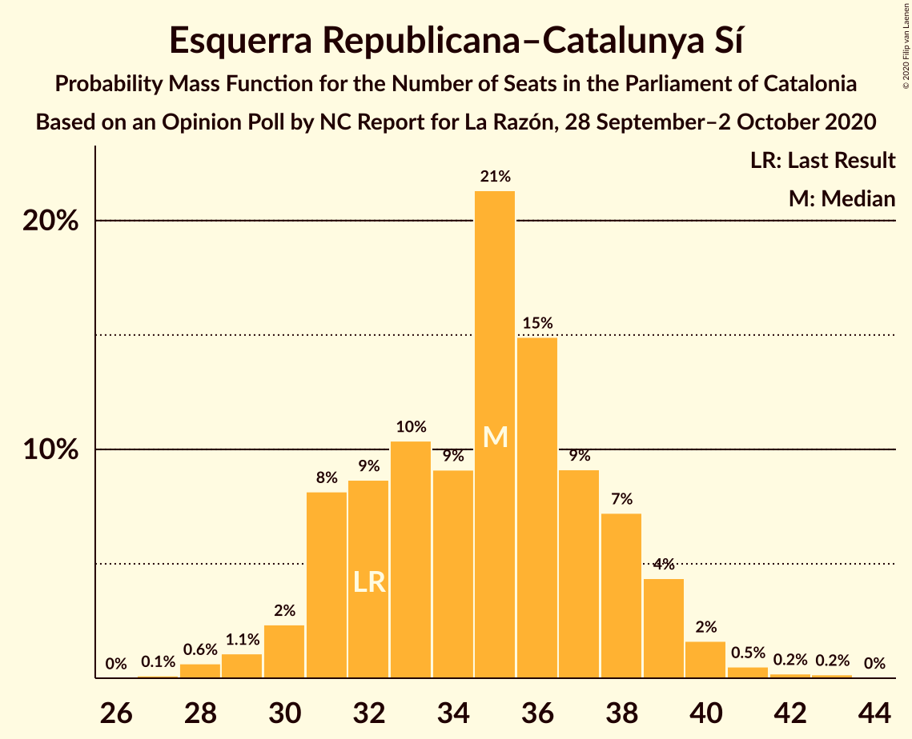

# Opinion Poll by NC Report for La Razón, 28 September–2 October 2020

<a href="#voting-intentions">Voting Intentions</a> | <a href="#seats">Seats</a> | <a href="#coalitions">Coalitions</a> | <a href="#technical-information">Technical Information</a>

## Voting Intentions

### Confidence Intervals

| Party | Last Result | Poll Result | 80% Confidence Interval | 90% Confidence Interval | 95% Confidence Interval | 99% Confidence Interval |
|:-----:|:-----------:|:-----------:|:-----------------------:|:-----------------------:|:-----------------------:|:-----------------------:|
| Esquerra Republicana–Catalunya Sí | 21.4% | 23.2% | 21.3–25.3% |20.8–25.9% |20.3–26.5% |19.4–27.5% |
| Junts per Catalunya | 21.7% | 19.9% | 18.1–21.9% |17.6–22.5% |17.2–23.0% |16.4–24.0% |
| Partit dels Socialistes de Catalunya (PSC-PSOE) | 13.9% | 17.7% | 16.0–19.7% |15.5–20.2% |15.1–20.7% |14.3–21.6% |
| Ciutadans–Partido de la Ciudadanía | 25.4% | 12.0% | 10.5–13.6% |10.1–14.1% |9.8–14.5% |9.2–15.4% |
| Catalunya en Comú–Podem | 7.5% | 7.8% | 6.7–9.3% |6.4–9.7% |6.1–10.0% |5.6–10.8% |
| Partit Popular | 4.2% | 7.6% | 6.4–9.0% |6.1–9.4% |5.9–9.7% |5.3–10.4% |
| Vox | 0.0% | 5.0% | 4.1–6.1% |3.8–6.5% |3.6–6.8% |3.2–7.4% |
| Candidatura d’Unitat Popular | 4.5% | 4.5% | 3.7–5.7% |3.4–6.0% |3.2–6.3% |2.9–6.9% |

*Note:* The poll result column reflects the actual value used in the calculations. Published results may vary slightly, and in addition be rounded to fewer digits.

## Seats

### Confidence Intervals

| Party | Last Result | Median | 80% Confidence Interval | 90% Confidence Interval | 95% Confidence Interval | 99% Confidence Interval |
|:-----:|:-----------:|:------:|:-----------------------:|:-----------------------:|:-----------------------:|:-----------------------:|
| <a href="#esquerra-republicana–catalunya-sí">Esquerra Republicana–Catalunya Sí</a> | 32 | 35 | 31–38 |31–39 |30–40 |28–41 |
| <a href="#junts-per-catalunya">Junts per Catalunya</a> | 34 | 31 | 28–34 |27–36 |26–37 |25–38 |
| <a href="#partit-dels-socialistes-de-catalunya-(psc-psoe)">Partit dels Socialistes de Catalunya (PSC-PSOE)</a> | 17 | 24 | 21–26 |20–26 |19–28 |18–29 |
| <a href="#ciutadans–partido-de-la-ciudadanía">Ciutadans–Partido de la Ciudadanía</a> | 36 | 15 | 13–18 |13–19 |13–19 |12–20 |
| <a href="#catalunya-en-comú–podem">Catalunya en Comú–Podem</a> | 8 | 9 | 7–11 |7–11 |6–12 |5–13 |
| <a href="#partit-popular">Partit Popular</a> | 4 | 10 | 7–12 |7–12 |7–13 |6–14 |
| <a href="#vox">Vox</a> | 0 | 6 | 3–7 |3–8 |3–8 |2–9 |
| <a href="#candidatura-d’unitat-popular">Candidatura d’Unitat Popular</a> | 4 | 5 | 3–7 |3–8 |2–8 |0–9 |

### Esquerra Republicana–Catalunya Sí

*For a full overview of the results for this party, see the [Esquerra Republicana–Catalunya Sí](party-esquerrarepublicana–catalunyasí.html) page.*

| Number of Seats | Probability | Accumulated | Special Marks |
|:---------------:|:-----------:|:-----------:|:-------------:|
| 27 | 0.1% | 100% |  |
| 28 | 0.6% | 99.9% |  |
| 29 | 1.1% | 99.2% |  |
| 30 | 2% | 98% |  |
| 31 | 8% | 96% |  |
| 32 | 9% | 88% | Last Result |
| 33 | 10% | 79% |  |
| 34 | 9% | 69% |  |
| 35 | 21% | 59% | Median |
| 36 | 15% | 38% |  |
| 37 | 9% | 23% |  |
| 38 | 7% | 14% |  |
| 39 | 4% | 7% |  |
| 40 | 2% | 3% |  |
| 41 | 0.5% | 0.9% |  |
| 42 | 0.2% | 0.4% |  |
| 43 | 0.2% | 0.2% |  |
| 44 | 0% | 0% |  |

### Junts per Catalunya

*For a full overview of the results for this party, see the [Junts per Catalunya](party-juntspercatalunya.html) page.*

| Number of Seats | Probability | Accumulated | Special Marks |
|:---------------:|:-----------:|:-----------:|:-------------:|
| 24 | 0.2% | 100% |  |
| 25 | 0.5% | 99.8% |  |
| 26 | 3% | 99.2% |  |
| 27 | 3% | 96% |  |
| 28 | 4% | 93% |  |
| 29 | 9% | 89% |  |
| 30 | 11% | 81% |  |
| 31 | 23% | 70% | Median |
| 32 | 18% | 46% |  |
| 33 | 10% | 29% |  |
| 34 | 9% | 18% | Last Result |
| 35 | 4% | 9% |  |
| 36 | 2% | 5% |  |
| 37 | 2% | 3% |  |
| 38 | 0.6% | 0.7% |  |
| 39 | 0.1% | 0.1% |  |
| 40 | 0% | 0% |  |

### Partit dels Socialistes de Catalunya (PSC-PSOE)

*For a full overview of the results for this party, see the [Partit dels Socialistes de Catalunya (PSC-PSOE)](party-partitdelssocialistesdecatalunyapsc-psoe.html) page.*

| Number of Seats | Probability | Accumulated | Special Marks |
|:---------------:|:-----------:|:-----------:|:-------------:|
| 17 | 0.4% | 100% | Last Result |
| 18 | 2% | 99.6% |  |
| 19 | 2% | 98% |  |
| 20 | 3% | 96% |  |
| 21 | 5% | 93% |  |
| 22 | 5% | 88% |  |
| 23 | 20% | 83% |  |
| 24 | 29% | 63% | Median |
| 25 | 18% | 34% |  |
| 26 | 11% | 16% |  |
| 27 | 2% | 4% |  |
| 28 | 2% | 3% |  |
| 29 | 0.5% | 1.0% |  |
| 30 | 0.4% | 0.5% |  |
| 31 | 0.1% | 0.1% |  |
| 32 | 0% | 0% |  |

### Ciutadans–Partido de la Ciudadanía

*For a full overview of the results for this party, see the [Ciutadans–Partido de la Ciudadanía](party-ciutadans–partidodelaciudadanía.html) page.*

| Number of Seats | Probability | Accumulated | Special Marks |
|:---------------:|:-----------:|:-----------:|:-------------:|
| 11 | 0% | 100% |  |
| 12 | 2% | 99.9% |  |
| 13 | 10% | 98% |  |
| 14 | 25% | 88% |  |
| 15 | 14% | 64% | Median |
| 16 | 15% | 49% |  |
| 17 | 10% | 34% |  |
| 18 | 16% | 24% |  |
| 19 | 6% | 8% |  |
| 20 | 1.1% | 2% |  |
| 21 | 0.3% | 0.4% |  |
| 22 | 0.1% | 0.1% |  |
| 23 | 0% | 0% |  |
| 24 | 0% | 0% |  |
| 25 | 0% | 0% |  |
| 26 | 0% | 0% |  |
| 27 | 0% | 0% |  |
| 28 | 0% | 0% |  |
| 29 | 0% | 0% |  |
| 30 | 0% | 0% |  |
| 31 | 0% | 0% |  |
| 32 | 0% | 0% |  |
| 33 | 0% | 0% |  |
| 34 | 0% | 0% |  |
| 35 | 0% | 0% |  |
| 36 | 0% | 0% | Last Result |

### Catalunya en Comú–Podem

*For a full overview of the results for this party, see the [Catalunya en Comú–Podem](party-catalunyaencomú–podem.html) page.*

| Number of Seats | Probability | Accumulated | Special Marks |
|:---------------:|:-----------:|:-----------:|:-------------:|
| 5 | 1.4% | 100% |  |
| 6 | 3% | 98.6% |  |
| 7 | 10% | 96% |  |
| 8 | 34% | 85% | Last Result |
| 9 | 25% | 52% | Median |
| 10 | 10% | 27% |  |
| 11 | 14% | 17% |  |
| 12 | 1.4% | 4% |  |
| 13 | 2% | 2% |  |
| 14 | 0.5% | 0.5% |  |
| 15 | 0% | 0% |  |

### Partit Popular

*For a full overview of the results for this party, see the [Partit Popular](party-partitpopular.html) page.*

| Number of Seats | Probability | Accumulated | Special Marks |
|:---------------:|:-----------:|:-----------:|:-------------:|
| 4 | 0% | 100% | Last Result |
| 5 | 0.1% | 100% |  |
| 6 | 0.6% | 99.9% |  |
| 7 | 10% | 99.2% |  |
| 8 | 10% | 90% |  |
| 9 | 28% | 80% |  |
| 10 | 26% | 52% | Median |
| 11 | 10% | 26% |  |
| 12 | 13% | 16% |  |
| 13 | 1.0% | 3% |  |
| 14 | 2% | 2% |  |
| 15 | 0.2% | 0.2% |  |
| 16 | 0% | 0% |  |

### Vox

*For a full overview of the results for this party, see the [Vox](party-vox.html) page.*

| Number of Seats | Probability | Accumulated | Special Marks |
|:---------------:|:-----------:|:-----------:|:-------------:|
| 0 | 0.1% | 100% | Last Result |
| 1 | 0% | 99.9% |  |
| 2 | 0.5% | 99.9% |  |
| 3 | 11% | 99.4% |  |
| 4 | 7% | 88% |  |
| 5 | 28% | 81% |  |
| 6 | 18% | 52% | Median |
| 7 | 30% | 35% |  |
| 8 | 3% | 5% |  |
| 9 | 2% | 2% |  |
| 10 | 0.2% | 0.3% |  |
| 11 | 0.1% | 0.1% |  |
| 12 | 0% | 0% |  |

### Candidatura d’Unitat Popular

*For a full overview of the results for this party, see the [Candidatura d’Unitat Popular](party-candidaturad’unitatpopular.html) page.*

| Number of Seats | Probability | Accumulated | Special Marks |
|:---------------:|:-----------:|:-----------:|:-------------:|
| 0 | 1.2% | 100% |  |
| 1 | 0% | 98.8% |  |
| 2 | 2% | 98.8% |  |
| 3 | 9% | 97% |  |
| 4 | 32% | 88% | Last Result |
| 5 | 11% | 56% | Median |
| 6 | 14% | 45% |  |
| 7 | 20% | 30% |  |
| 8 | 9% | 10% |  |
| 9 | 0.7% | 0.8% |  |
| 10 | 0% | 0.1% |  |
| 11 | 0% | 0% |  |

## Coalitions

### Confidence Intervals

| Coalition | Last Result | Median | Majority? | 80% Confidence Interval | 90% Confidence Interval | 95% Confidence Interval | 99% Confidence Interval |
|:---------:|:-----------:|:------:|:---------:|:-----------------------:|:-----------------------:|:-----------------------:|:-----------------------:|
| Esquerra Republicana–Catalunya Sí – Junts per Catalunya – Catalunya en Comú–Podem | 74 | 75 | 99.5% | 71–79 | 70–80 | 69–81 | 67–83 |
| Esquerra Republicana–Catalunya Sí – Junts per Catalunya – Candidatura d’Unitat Popular | 70 | 71 | 92% | 68–75 | 67–76 | 66–77 | 64–79 |
| Esquerra Republicana–Catalunya Sí – Partit dels Socialistes de Catalunya (PSC-PSOE) – Catalunya en Comú–Podem | 57 | 67 | 50% | 63–71 | 62–72 | 61–73 | 60–75 |
| Esquerra Republicana–Catalunya Sí – Junts per Catalunya | 66 | 66 | 32% | 62–70 | 61–71 | 60–72 | 59–74 |
| Partit dels Socialistes de Catalunya (PSC-PSOE) – Ciutadans–Partido de la Ciudadanía – Catalunya en Comú–Podem – Partit Popular | 65 | 58 | 0.1% | 54–61 | 53–63 | 52–64 | 51–66 |
| Partit dels Socialistes de Catalunya (PSC-PSOE) – Ciutadans–Partido de la Ciudadanía – Partit Popular – Vox | 57 | 55 | 0% | 51–59 | 50–59 | 49–60 | 47–62 |
| Partit dels Socialistes de Catalunya (PSC-PSOE) – Ciutadans–Partido de la Ciudadanía – Partit Popular | 57 | 49 | 0% | 46–53 | 45–53 | 44–54 | 42–56 |
| Esquerra Republicana–Catalunya Sí – Catalunya en Comú–Podem | 40 | 44 | 0% | 40–47 | 39–48 | 38–49 | 36–51 |

### Esquerra Republicana–Catalunya Sí – Junts per Catalunya – Catalunya en Comú–Podem

| Number of Seats | Probability | Accumulated | Special Marks |
|:---------------:|:-----------:|:-----------:|:-------------:|
| 65 | 0% | 100% |  |
| 66 | 0.1% | 99.9% |  |
| 67 | 0.4% | 99.8% |  |
| 68 | 0.9% | 99.5% | Majority |
| 69 | 2% | 98.6% |  |
| 70 | 4% | 97% |  |
| 71 | 4% | 93% |  |
| 72 | 10% | 88% |  |
| 73 | 9% | 79% |  |
| 74 | 14% | 70% | Last Result |
| 75 | 13% | 56% | Median |
| 76 | 14% | 43% |  |
| 77 | 8% | 29% |  |
| 78 | 9% | 21% |  |
| 79 | 5% | 12% |  |
| 80 | 4% | 7% |  |
| 81 | 1.5% | 3% |  |
| 82 | 0.9% | 1.4% |  |
| 83 | 0.4% | 0.5% |  |
| 84 | 0.1% | 0.2% |  |
| 85 | 0.1% | 0.1% |  |
| 86 | 0% | 0% |  |

### Esquerra Republicana–Catalunya Sí – Junts per Catalunya – Candidatura d’Unitat Popular

| Number of Seats | Probability | Accumulated | Special Marks |
|:---------------:|:-----------:|:-----------:|:-------------:|
| 61 | 0.1% | 100% |  |
| 62 | 0.1% | 99.9% |  |
| 63 | 0.2% | 99.9% |  |
| 64 | 0.5% | 99.7% |  |
| 65 | 2% | 99.2% |  |
| 66 | 2% | 98% |  |
| 67 | 4% | 96% |  |
| 68 | 9% | 92% | Majority |
| 69 | 9% | 83% |  |
| 70 | 13% | 74% | Last Result |
| 71 | 11% | 61% | Median |
| 72 | 15% | 50% |  |
| 73 | 9% | 34% |  |
| 74 | 13% | 25% |  |
| 75 | 4% | 12% |  |
| 76 | 3% | 8% |  |
| 77 | 3% | 5% |  |
| 78 | 1.1% | 2% |  |
| 79 | 0.5% | 0.8% |  |
| 80 | 0.2% | 0.3% |  |
| 81 | 0% | 0.1% |  |
| 82 | 0% | 0% |  |

### Esquerra Republicana–Catalunya Sí – Partit dels Socialistes de Catalunya (PSC-PSOE) – Catalunya en Comú–Podem

| Number of Seats | Probability | Accumulated | Special Marks |
|:---------------:|:-----------:|:-----------:|:-------------:|
| 57 | 0% | 100% | Last Result |
| 58 | 0.1% | 100% |  |
| 59 | 0.2% | 99.9% |  |
| 60 | 0.7% | 99.6% |  |
| 61 | 2% | 99.0% |  |
| 62 | 3% | 97% |  |
| 63 | 6% | 94% |  |
| 64 | 6% | 88% |  |
| 65 | 7% | 82% |  |
| 66 | 12% | 75% |  |
| 67 | 13% | 63% |  |
| 68 | 15% | 50% | Median, Majority |
| 69 | 11% | 34% |  |
| 70 | 8% | 23% |  |
| 71 | 6% | 15% |  |
| 72 | 4% | 9% |  |
| 73 | 2% | 5% |  |
| 74 | 2% | 2% |  |
| 75 | 0.4% | 0.7% |  |
| 76 | 0.2% | 0.3% |  |
| 77 | 0.1% | 0.1% |  |
| 78 | 0% | 0% |  |

### Esquerra Republicana–Catalunya Sí – Junts per Catalunya

| Number of Seats | Probability | Accumulated | Special Marks |
|:---------------:|:-----------:|:-----------:|:-------------:|
| 56 | 0% | 100% |  |
| 57 | 0.1% | 99.9% |  |
| 58 | 0.3% | 99.8% |  |
| 59 | 0.7% | 99.5% |  |
| 60 | 1.4% | 98.9% |  |
| 61 | 3% | 97% |  |
| 62 | 5% | 94% |  |
| 63 | 8% | 90% |  |
| 64 | 12% | 82% |  |
| 65 | 14% | 71% |  |
| 66 | 16% | 57% | Last Result, Median |
| 67 | 9% | 41% |  |
| 68 | 8% | 32% | Majority |
| 69 | 9% | 24% |  |
| 70 | 8% | 15% |  |
| 71 | 4% | 7% |  |
| 72 | 2% | 3% |  |
| 73 | 0.8% | 1.3% |  |
| 74 | 0.3% | 0.5% |  |
| 75 | 0.1% | 0.2% |  |
| 76 | 0% | 0.1% |  |
| 77 | 0% | 0% |  |

### Partit dels Socialistes de Catalunya (PSC-PSOE) – Ciutadans–Partido de la Ciudadanía – Catalunya en Comú–Podem – Partit Popular

| Number of Seats | Probability | Accumulated | Special Marks |
|:---------------:|:-----------:|:-----------:|:-------------:|
| 49 | 0.1% | 100% |  |
| 50 | 0.3% | 99.9% |  |
| 51 | 0.7% | 99.6% |  |
| 52 | 1.5% | 98.9% |  |
| 53 | 4% | 97% |  |
| 54 | 4% | 94% |  |
| 55 | 7% | 90% |  |
| 56 | 13% | 82% |  |
| 57 | 11% | 69% |  |
| 58 | 15% | 57% | Median |
| 59 | 14% | 43% |  |
| 60 | 10% | 29% |  |
| 61 | 10% | 19% |  |
| 62 | 4% | 9% |  |
| 63 | 3% | 6% |  |
| 64 | 2% | 3% |  |
| 65 | 0.6% | 1.2% | Last Result |
| 66 | 0.3% | 0.5% |  |
| 67 | 0.2% | 0.2% |  |
| 68 | 0% | 0.1% | Majority |
| 69 | 0% | 0% |  |

### Partit dels Socialistes de Catalunya (PSC-PSOE) – Ciutadans–Partido de la Ciudadanía – Partit Popular – Vox

| Number of Seats | Probability | Accumulated | Special Marks |
|:---------------:|:-----------:|:-----------:|:-------------:|
| 45 | 0% | 100% |  |
| 46 | 0.1% | 99.9% |  |
| 47 | 0.4% | 99.8% |  |
| 48 | 0.8% | 99.4% |  |
| 49 | 2% | 98.6% |  |
| 50 | 4% | 96% |  |
| 51 | 4% | 92% |  |
| 52 | 8% | 88% |  |
| 53 | 12% | 81% |  |
| 54 | 18% | 69% |  |
| 55 | 10% | 51% | Median |
| 56 | 12% | 40% |  |
| 57 | 11% | 28% | Last Result |
| 58 | 7% | 17% |  |
| 59 | 6% | 10% |  |
| 60 | 3% | 5% |  |
| 61 | 1.2% | 2% |  |
| 62 | 0.6% | 0.9% |  |
| 63 | 0.2% | 0.3% |  |
| 64 | 0.1% | 0.1% |  |
| 65 | 0% | 0% |  |

### Partit dels Socialistes de Catalunya (PSC-PSOE) – Ciutadans–Partido de la Ciudadanía – Partit Popular

| Number of Seats | Probability | Accumulated | Special Marks |
|:---------------:|:-----------:|:-----------:|:-------------:|
| 40 | 0.1% | 100% |  |
| 41 | 0.3% | 99.9% |  |
| 42 | 0.5% | 99.6% |  |
| 43 | 1.3% | 99.1% |  |
| 44 | 3% | 98% |  |
| 45 | 4% | 95% |  |
| 46 | 6% | 91% |  |
| 47 | 13% | 86% |  |
| 48 | 15% | 73% |  |
| 49 | 13% | 58% | Median |
| 50 | 14% | 45% |  |
| 51 | 13% | 32% |  |
| 52 | 8% | 19% |  |
| 53 | 7% | 11% |  |
| 54 | 2% | 5% |  |
| 55 | 1.2% | 2% |  |
| 56 | 0.7% | 1.1% |  |
| 57 | 0.2% | 0.4% | Last Result |
| 58 | 0.1% | 0.2% |  |
| 59 | 0% | 0.1% |  |
| 60 | 0% | 0% |  |

### Esquerra Republicana–Catalunya Sí – Catalunya en Comú–Podem

| Number of Seats | Probability | Accumulated | Special Marks |
|:---------------:|:-----------:|:-----------:|:-------------:|
| 35 | 0.1% | 100% |  |
| 36 | 0.5% | 99.9% |  |
| 37 | 1.0% | 99.4% |  |
| 38 | 3% | 98% |  |
| 39 | 3% | 96% |  |
| 40 | 7% | 93% | Last Result |
| 41 | 9% | 85% |  |
| 42 | 10% | 77% |  |
| 43 | 14% | 67% |  |
| 44 | 20% | 53% | Median |
| 45 | 9% | 33% |  |
| 46 | 11% | 25% |  |
| 47 | 5% | 14% |  |
| 48 | 4% | 9% |  |
| 49 | 3% | 4% |  |
| 50 | 1.0% | 2% |  |
| 51 | 0.4% | 0.7% |  |
| 52 | 0.2% | 0.3% |  |
| 53 | 0% | 0.1% |  |
| 54 | 0% | 0% |  |

## Technical Information

### Opinion Poll

+ **Polling firm:** NC Report
+ **Commissioner(s):** La Razón
+ **Fieldwork period:** 28 September–2 October 2020

### Calculations

+ **Sample size:** 727
+ **Simulations done:** 1,048,576
+ **Error estimate:** 2.10%

