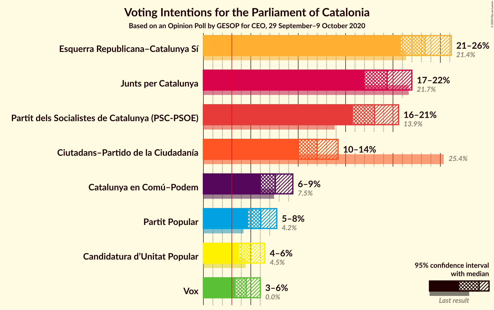

# Opinion Poll by GESOP for CEO, 29 September–9 October 2020

<a href="#voting-intentions">Voting Intentions</a> | <a href="#seats">Seats</a> | <a href="#coalitions">Coalitions</a> | <a href="#technical-information">Technical Information</a>

## Voting Intentions

### Confidence Intervals

| Party | Last Result | Poll Result | 80% Confidence Interval | 90% Confidence Interval | 95% Confidence Interval | 99% Confidence Interval |
|:-----:|:-----------:|:-----------:|:-----------------------:|:-----------------------:|:-----------------------:|:-----------------------:|
| Esquerra Republicana–Catalunya Sí | 21.4% | 23.4% | 21.7–25.2% |21.2–25.7% |20.8–26.2% |20.0–27.0% |
| Junts per Catalunya | 21.7% | 19.4% | 17.8–21.1% |17.4–21.6% |17.0–22.0% |16.3–22.8% |
| Partit dels Socialistes de Catalunya (PSC-PSOE) | 13.9% | 18.1% | 16.6–19.7% |16.1–20.2% |15.8–20.6% |15.1–21.4% |
| Ciutadans–Partido de la Ciudadanía | 25.4% | 12.0% | 10.7–13.4% |10.4–13.8% |10.1–14.2% |9.5–14.9% |
| Catalunya en Comú–Podem | 7.5% | 7.6% | 6.6–8.8% |6.3–9.1% |6.1–9.4% |5.6–10.0% |
| Partit Popular | 4.2% | 6.1% | 5.2–7.1% |4.9–7.5% |4.7–7.7% |4.3–8.3% |
| Candidatura d’Unitat Popular | 4.5% | 4.9% | 4.1–5.9% |3.9–6.2% |3.7–6.5% |3.4–7.0% |
| Vox | 0.0% | 4.5% | 3.8–5.5% |3.6–5.8% |3.4–6.0% |3.0–6.5% |

*Note:* The poll result column reflects the actual value used in the calculations. Published results may vary slightly, and in addition be rounded to fewer digits.

## Seats

### Confidence Intervals

| Party | Last Result | Median | 80% Confidence Interval | 90% Confidence Interval | 95% Confidence Interval | 99% Confidence Interval |
|:-----:|:-----------:|:------:|:-----------------------:|:-----------------------:|:-----------------------:|:-----------------------:|
| <a href="#esquerra-republicana–catalunya-sí">Esquerra Republicana–Catalunya Sí</a> | 32 | 35 | 33–38 |32–39 |31–40 |30–42 |
| <a href="#junts-per-catalunya">Junts per Catalunya</a> | 34 | 31 | 29–34 |27–35 |27–36 |26–37 |
| <a href="#partit-dels-socialistes-de-catalunya-(psc-psoe)">Partit dels Socialistes de Catalunya (PSC-PSOE)</a> | 17 | 25 | 23–26 |22–27 |21–28 |20–30 |
| <a href="#ciutadans–partido-de-la-ciudadanía">Ciutadans–Partido de la Ciudadanía</a> | 36 | 16 | 14–19 |14–19 |13–19 |13–20 |
| <a href="#catalunya-en-comú–podem">Catalunya en Comú–Podem</a> | 8 | 9 | 7–11 |7–11 |6–11 |5–13 |
| <a href="#partit-popular">Partit Popular</a> | 4 | 7 | 6–9 |6–9 |5–10 |5–11 |
| <a href="#candidatura-d’unitat-popular">Candidatura d’Unitat Popular</a> | 4 | 7 | 4–8 |4–8 |3–8 |3–9 |
| <a href="#vox">Vox</a> | 0 | 5 | 3–7 |3–7 |3–7 |2–8 |

### Esquerra Republicana–Catalunya Sí

*For a full overview of the results for this party, see the [Esquerra Republicana–Catalunya Sí](party-esquerrarepublicana–catalunyasí.html) page.*

| Number of Seats | Probability | Accumulated | Special Marks |
|:---------------:|:-----------:|:-----------:|:-------------:|
| 29 | 0.2% | 100% |  |
| 30 | 0.7% | 99.8% |  |
| 31 | 2% | 99.1% |  |
| 32 | 4% | 97% | Last Result |
| 33 | 5% | 92% |  |
| 34 | 17% | 87% |  |
| 35 | 23% | 70% | Median |
| 36 | 14% | 46% |  |
| 37 | 14% | 32% |  |
| 38 | 10% | 18% |  |
| 39 | 4% | 8% |  |
| 40 | 2% | 4% |  |
| 41 | 1.1% | 2% |  |
| 42 | 0.4% | 0.7% |  |
| 43 | 0.2% | 0.3% |  |
| 44 | 0% | 0% |  |

### Junts per Catalunya

*For a full overview of the results for this party, see the [Junts per Catalunya](party-juntspercatalunya.html) page.*

| Number of Seats | Probability | Accumulated | Special Marks |
|:---------------:|:-----------:|:-----------:|:-------------:|
| 25 | 0.3% | 100% |  |
| 26 | 2% | 99.7% |  |
| 27 | 3% | 98% |  |
| 28 | 3% | 95% |  |
| 29 | 11% | 92% |  |
| 30 | 9% | 81% |  |
| 31 | 27% | 72% | Median |
| 32 | 21% | 45% |  |
| 33 | 11% | 23% |  |
| 34 | 6% | 12% | Last Result |
| 35 | 3% | 6% |  |
| 36 | 2% | 4% |  |
| 37 | 1.3% | 1.5% |  |
| 38 | 0.1% | 0.2% |  |
| 39 | 0% | 0% |  |

### Partit dels Socialistes de Catalunya (PSC-PSOE)

*For a full overview of the results for this party, see the [Partit dels Socialistes de Catalunya (PSC-PSOE)](party-partitdelssocialistesdecatalunyapsc-psoe.html) page.*

| Number of Seats | Probability | Accumulated | Special Marks |
|:---------------:|:-----------:|:-----------:|:-------------:|
| 17 | 0% | 100% | Last Result |
| 18 | 0.1% | 100% |  |
| 19 | 0.2% | 99.9% |  |
| 20 | 2% | 99.6% |  |
| 21 | 2% | 98% |  |
| 22 | 3% | 96% |  |
| 23 | 10% | 94% |  |
| 24 | 23% | 84% |  |
| 25 | 33% | 61% | Median |
| 26 | 19% | 28% |  |
| 27 | 5% | 8% |  |
| 28 | 2% | 4% |  |
| 29 | 0.5% | 1.2% |  |
| 30 | 0.6% | 0.7% |  |
| 31 | 0.2% | 0.2% |  |
| 32 | 0% | 0% |  |

### Ciutadans–Partido de la Ciudadanía

*For a full overview of the results for this party, see the [Ciutadans–Partido de la Ciudadanía](party-ciutadans–partidodelaciudadanía.html) page.*

| Number of Seats | Probability | Accumulated | Special Marks |
|:---------------:|:-----------:|:-----------:|:-------------:|
| 12 | 0.2% | 100% |  |
| 13 | 4% | 99.8% |  |
| 14 | 25% | 96% |  |
| 15 | 12% | 70% |  |
| 16 | 18% | 59% | Median |
| 17 | 13% | 40% |  |
| 18 | 16% | 27% |  |
| 19 | 10% | 11% |  |
| 20 | 0.7% | 0.9% |  |
| 21 | 0.2% | 0.2% |  |
| 22 | 0% | 0% |  |
| 23 | 0% | 0% |  |
| 24 | 0% | 0% |  |
| 25 | 0% | 0% |  |
| 26 | 0% | 0% |  |
| 27 | 0% | 0% |  |
| 28 | 0% | 0% |  |
| 29 | 0% | 0% |  |
| 30 | 0% | 0% |  |
| 31 | 0% | 0% |  |
| 32 | 0% | 0% |  |
| 33 | 0% | 0% |  |
| 34 | 0% | 0% |  |
| 35 | 0% | 0% |  |
| 36 | 0% | 0% | Last Result |

### Catalunya en Comú–Podem

*For a full overview of the results for this party, see the [Catalunya en Comú–Podem](party-catalunyaencomú–podem.html) page.*

| Number of Seats | Probability | Accumulated | Special Marks |
|:---------------:|:-----------:|:-----------:|:-------------:|
| 5 | 0.9% | 100% |  |
| 6 | 2% | 99.1% |  |
| 7 | 8% | 97% |  |
| 8 | 38% | 88% | Last Result |
| 9 | 25% | 51% | Median |
| 10 | 13% | 26% |  |
| 11 | 12% | 13% |  |
| 12 | 0.7% | 1.3% |  |
| 13 | 0.4% | 0.5% |  |
| 14 | 0.1% | 0.1% |  |
| 15 | 0% | 0% |  |

### Partit Popular

*For a full overview of the results for this party, see the [Partit Popular](party-partitpopular.html) page.*

| Number of Seats | Probability | Accumulated | Special Marks |
|:---------------:|:-----------:|:-----------:|:-------------:|
| 3 | 0.2% | 100% |  |
| 4 | 0.1% | 99.8% | Last Result |
| 5 | 4% | 99.7% |  |
| 6 | 9% | 95% |  |
| 7 | 50% | 86% | Median |
| 8 | 10% | 37% |  |
| 9 | 22% | 26% |  |
| 10 | 4% | 5% |  |
| 11 | 0.5% | 0.7% |  |
| 12 | 0.2% | 0.2% |  |
| 13 | 0% | 0% |  |

### Candidatura d’Unitat Popular

*For a full overview of the results for this party, see the [Candidatura d’Unitat Popular](party-candidaturad’unitatpopular.html) page.*

| Number of Seats | Probability | Accumulated | Special Marks |
|:---------------:|:-----------:|:-----------:|:-------------:|
| 2 | 0.4% | 100% |  |
| 3 | 3% | 99.6% |  |
| 4 | 20% | 97% | Last Result |
| 5 | 9% | 77% |  |
| 6 | 15% | 68% |  |
| 7 | 33% | 53% | Median |
| 8 | 19% | 20% |  |
| 9 | 1.1% | 1.2% |  |
| 10 | 0.1% | 0.1% |  |
| 11 | 0% | 0% |  |

### Vox

*For a full overview of the results for this party, see the [Vox](party-vox.html) page.*

| Number of Seats | Probability | Accumulated | Special Marks |
|:---------------:|:-----------:|:-----------:|:-------------:|
| 0 | 0.1% | 100% | Last Result |
| 1 | 0% | 99.9% |  |
| 2 | 0.8% | 99.9% |  |
| 3 | 19% | 99.0% |  |
| 4 | 11% | 80% |  |
| 5 | 40% | 69% | Median |
| 6 | 13% | 29% |  |
| 7 | 15% | 16% |  |
| 8 | 0.5% | 0.9% |  |
| 9 | 0.5% | 0.5% |  |
| 10 | 0% | 0% |  |

## Coalitions

### Confidence Intervals

| Coalition | Last Result | Median | Majority? | 80% Confidence Interval | 90% Confidence Interval | 95% Confidence Interval | 99% Confidence Interval |
|:---------:|:-----------:|:------:|:---------:|:-----------------------:|:-----------------------:|:-----------------------:|:-----------------------:|
| Esquerra Republicana–Catalunya Sí – Junts per Catalunya – Catalunya en Comú–Podem | 74 | 76 | 99.9% | 72–79 | 71–80 | 70–81 | 69–82 |
| Esquerra Republicana–Catalunya Sí – Junts per Catalunya – Candidatura d’Unitat Popular | 70 | 73 | 98.9% | 70–76 | 69–77 | 68–78 | 67–80 |
| Esquerra Republicana–Catalunya Sí – Partit dels Socialistes de Catalunya (PSC-PSOE) – Catalunya en Comú–Podem | 57 | 69 | 74% | 66–72 | 65–73 | 64–74 | 62–76 |
| Esquerra Republicana–Catalunya Sí – Junts per Catalunya | 66 | 67 | 41% | 64–70 | 63–71 | 62–72 | 60–74 |
| Partit dels Socialistes de Catalunya (PSC-PSOE) – Ciutadans–Partido de la Ciudadanía – Catalunya en Comú–Podem – Partit Popular | 65 | 57 | 0% | 54–60 | 53–61 | 52–62 | 51–63 |
| Partit dels Socialistes de Catalunya (PSC-PSOE) – Ciutadans–Partido de la Ciudadanía – Partit Popular – Vox | 57 | 53 | 0% | 50–57 | 49–58 | 48–58 | 46–59 |
| Partit dels Socialistes de Catalunya (PSC-PSOE) – Ciutadans–Partido de la Ciudadanía – Partit Popular | 57 | 48 | 0% | 45–51 | 44–52 | 44–53 | 42–54 |
| Esquerra Republicana–Catalunya Sí – Catalunya en Comú–Podem | 40 | 44 | 0% | 42–48 | 41–49 | 40–49 | 38–51 |

### Esquerra Republicana–Catalunya Sí – Junts per Catalunya – Catalunya en Comú–Podem

| Number of Seats | Probability | Accumulated | Special Marks |
|:---------------:|:-----------:|:-----------:|:-------------:|
| 67 | 0.1% | 100% |  |
| 68 | 0.2% | 99.9% | Majority |
| 69 | 0.7% | 99.7% |  |
| 70 | 2% | 99.0% |  |
| 71 | 3% | 97% |  |
| 72 | 6% | 94% |  |
| 73 | 7% | 88% |  |
| 74 | 13% | 81% | Last Result |
| 75 | 16% | 68% | Median |
| 76 | 15% | 51% |  |
| 77 | 13% | 36% |  |
| 78 | 10% | 23% |  |
| 79 | 6% | 13% |  |
| 80 | 4% | 7% |  |
| 81 | 2% | 3% |  |
| 82 | 0.8% | 1.2% |  |
| 83 | 0.4% | 0.4% |  |
| 84 | 0.1% | 0.1% |  |
| 85 | 0% | 0% |  |

### Esquerra Republicana–Catalunya Sí – Junts per Catalunya – Candidatura d’Unitat Popular

| Number of Seats | Probability | Accumulated | Special Marks |
|:---------------:|:-----------:|:-----------:|:-------------:|
| 65 | 0.1% | 100% |  |
| 66 | 0.2% | 99.9% |  |
| 67 | 0.8% | 99.7% |  |
| 68 | 2% | 98.9% | Majority |
| 69 | 5% | 96% |  |
| 70 | 6% | 91% | Last Result |
| 71 | 11% | 85% |  |
| 72 | 15% | 74% |  |
| 73 | 18% | 59% | Median |
| 74 | 13% | 41% |  |
| 75 | 12% | 28% |  |
| 76 | 8% | 16% |  |
| 77 | 4% | 8% |  |
| 78 | 2% | 4% |  |
| 79 | 1.3% | 2% |  |
| 80 | 0.3% | 0.6% |  |
| 81 | 0.2% | 0.3% |  |
| 82 | 0% | 0% |  |

### Esquerra Republicana–Catalunya Sí – Partit dels Socialistes de Catalunya (PSC-PSOE) – Catalunya en Comú–Podem

| Number of Seats | Probability | Accumulated | Special Marks |
|:---------------:|:-----------:|:-----------:|:-------------:|
| 57 | 0% | 100% | Last Result |
| 58 | 0% | 100% |  |
| 59 | 0% | 100% |  |
| 60 | 0% | 100% |  |
| 61 | 0.1% | 100% |  |
| 62 | 0.5% | 99.8% |  |
| 63 | 1.0% | 99.3% |  |
| 64 | 2% | 98% |  |
| 65 | 3% | 96% |  |
| 66 | 6% | 93% |  |
| 67 | 13% | 87% |  |
| 68 | 15% | 74% | Majority |
| 69 | 20% | 59% | Median |
| 70 | 11% | 39% |  |
| 71 | 12% | 28% |  |
| 72 | 7% | 17% |  |
| 73 | 6% | 10% |  |
| 74 | 2% | 4% |  |
| 75 | 1.1% | 2% |  |
| 76 | 0.5% | 0.8% |  |
| 77 | 0.2% | 0.2% |  |
| 78 | 0% | 0% |  |

### Esquerra Republicana–Catalunya Sí – Junts per Catalunya

| Number of Seats | Probability | Accumulated | Special Marks |
|:---------------:|:-----------:|:-----------:|:-------------:|
| 59 | 0.1% | 100% |  |
| 60 | 0.3% | 99.8% |  |
| 61 | 1.1% | 99.5% |  |
| 62 | 3% | 98% |  |
| 63 | 4% | 95% |  |
| 64 | 9% | 92% |  |
| 65 | 12% | 83% |  |
| 66 | 17% | 71% | Last Result, Median |
| 67 | 13% | 54% |  |
| 68 | 15% | 41% | Majority |
| 69 | 11% | 25% |  |
| 70 | 7% | 14% |  |
| 71 | 4% | 8% |  |
| 72 | 2% | 4% |  |
| 73 | 1.0% | 2% |  |
| 74 | 0.5% | 0.6% |  |
| 75 | 0.1% | 0.1% |  |
| 76 | 0.1% | 0.1% |  |
| 77 | 0% | 0% |  |

### Partit dels Socialistes de Catalunya (PSC-PSOE) – Ciutadans–Partido de la Ciudadanía – Catalunya en Comú–Podem – Partit Popular

| Number of Seats | Probability | Accumulated | Special Marks |
|:---------------:|:-----------:|:-----------:|:-------------:|
| 49 | 0.1% | 100% |  |
| 50 | 0.4% | 99.9% |  |
| 51 | 0.9% | 99.5% |  |
| 52 | 2% | 98.6% |  |
| 53 | 4% | 97% |  |
| 54 | 7% | 93% |  |
| 55 | 12% | 86% |  |
| 56 | 15% | 74% |  |
| 57 | 15% | 60% | Median |
| 58 | 19% | 45% |  |
| 59 | 11% | 26% |  |
| 60 | 7% | 14% |  |
| 61 | 4% | 7% |  |
| 62 | 2% | 3% |  |
| 63 | 0.5% | 0.8% |  |
| 64 | 0.2% | 0.3% |  |
| 65 | 0.1% | 0.1% | Last Result |
| 66 | 0% | 0% |  |

### Partit dels Socialistes de Catalunya (PSC-PSOE) – Ciutadans–Partido de la Ciudadanía – Partit Popular – Vox

| Number of Seats | Probability | Accumulated | Special Marks |
|:---------------:|:-----------:|:-----------:|:-------------:|
| 45 | 0.1% | 100% |  |
| 46 | 0.5% | 99.9% |  |
| 47 | 0.9% | 99.4% |  |
| 48 | 2% | 98% |  |
| 49 | 4% | 96% |  |
| 50 | 6% | 92% |  |
| 51 | 8% | 86% |  |
| 52 | 15% | 78% |  |
| 53 | 19% | 64% | Median |
| 54 | 16% | 45% |  |
| 55 | 12% | 29% |  |
| 56 | 6% | 17% |  |
| 57 | 5% | 11% | Last Result |
| 58 | 4% | 6% |  |
| 59 | 1.4% | 2% |  |
| 60 | 0.3% | 0.4% |  |
| 61 | 0.1% | 0.1% |  |
| 62 | 0% | 0% |  |

### Partit dels Socialistes de Catalunya (PSC-PSOE) – Ciutadans–Partido de la Ciudadanía – Partit Popular

| Number of Seats | Probability | Accumulated | Special Marks |
|:---------------:|:-----------:|:-----------:|:-------------:|
| 41 | 0.3% | 100% |  |
| 42 | 0.6% | 99.6% |  |
| 43 | 1.3% | 99.0% |  |
| 44 | 5% | 98% |  |
| 45 | 6% | 93% |  |
| 46 | 8% | 88% |  |
| 47 | 15% | 80% |  |
| 48 | 16% | 65% | Median |
| 49 | 20% | 48% |  |
| 50 | 13% | 28% |  |
| 51 | 5% | 15% |  |
| 52 | 5% | 10% |  |
| 53 | 3% | 4% |  |
| 54 | 0.8% | 1.1% |  |
| 55 | 0.2% | 0.3% |  |
| 56 | 0.1% | 0.1% |  |
| 57 | 0% | 0% | Last Result |

### Esquerra Republicana–Catalunya Sí – Catalunya en Comú–Podem

| Number of Seats | Probability | Accumulated | Special Marks |
|:---------------:|:-----------:|:-----------:|:-------------:|
| 36 | 0.1% | 100% |  |
| 37 | 0.2% | 99.9% |  |
| 38 | 0.5% | 99.7% |  |
| 39 | 1.3% | 99.2% |  |
| 40 | 2% | 98% | Last Result |
| 41 | 5% | 95% |  |
| 42 | 11% | 91% |  |
| 43 | 21% | 80% |  |
| 44 | 18% | 59% | Median |
| 45 | 9% | 41% |  |
| 46 | 14% | 32% |  |
| 47 | 7% | 17% |  |
| 48 | 5% | 10% |  |
| 49 | 3% | 5% |  |
| 50 | 1.0% | 2% |  |
| 51 | 0.6% | 0.9% |  |
| 52 | 0.2% | 0.3% |  |
| 53 | 0.1% | 0.1% |  |
| 54 | 0% | 0% |  |

## Technical Information

### Opinion Poll

+ **Polling firm:** GESOP
+ **Commissioner(s):** CEO
+ **Fieldwork period:** 29 September–9 October 2020

### Calculations

+ **Sample size:** 975
+ **Simulations done:** 1,048,576
+ **Error estimate:** 1.14%

