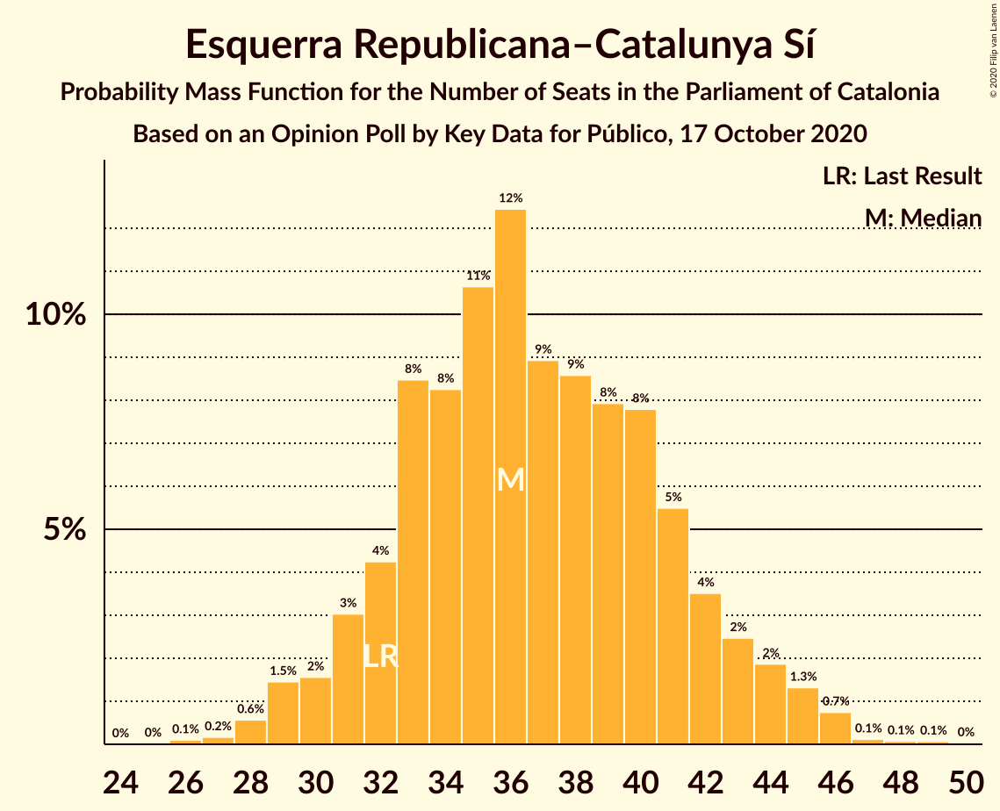

# Opinion Poll by Key Data for Público, 17 October 2020

<a href="#voting-intentions">Voting Intentions</a> | <a href="#seats">Seats</a> | <a href="#coalitions">Coalitions</a> | <a href="#technical-information">Technical Information</a>

## Voting Intentions

### Confidence Intervals

| Party | Last Result | Poll Result | 80% Confidence Interval | 90% Confidence Interval | 95% Confidence Interval | 99% Confidence Interval |
|:-----:|:-----------:|:-----------:|:-----------------------:|:-----------------------:|:-----------------------:|:-----------------------:|
| Esquerra Republicana–Catalunya Sí | 21.4% | 24.2% | 21.4–27.2% |20.7–28.1% |20.0–28.9% |18.8–30.4% |
| Junts per Catalunya | 21.7% | 19.7% | 17.2–22.6% |16.5–23.4% |15.9–24.2% |14.8–25.6% |
| Partit dels Socialistes de Catalunya (PSC-PSOE) | 13.9% | 16.9% | 14.6–19.7% |14.0–20.5% |13.4–21.2% |12.4–22.6% |
| Ciutadans–Partido de la Ciudadanía | 25.4% | 12.2% | 10.3–14.7% |9.7–15.4% |9.2–16.0% |8.4–17.3% |
| Catalunya en Comú–Podem | 7.5% | 7.5% | 6.0–9.6% |5.6–10.2% |5.2–10.7% |4.6–11.8% |
| Partit Popular | 4.2% | 6.4% | 5.0–8.4% |4.6–8.9% |4.3–9.4% |3.7–10.4% |
| Candidatura d’Unitat Popular | 4.5% | 4.7% | 3.6–6.5% |3.2–7.0% |3.0–7.4% |2.5–8.4% |
| Vox | 0.0% | 4.2% | 3.1–5.9% |2.8–6.3% |2.5–6.8% |2.1–7.7% |

*Note:* The poll result column reflects the actual value used in the calculations. Published results may vary slightly, and in addition be rounded to fewer digits.

## Seats

### Confidence Intervals

| Party | Last Result | Median | 80% Confidence Interval | 90% Confidence Interval | 95% Confidence Interval | 99% Confidence Interval |
|:-----:|:-----------:|:------:|:-----------------------:|:-----------------------:|:-----------------------:|:-----------------------:|
| <a href="#esquerra-republicana–catalunya-sí">Esquerra Republicana–Catalunya Sí</a> | 32 | 36 | 32–42 |31–43 |30–44 |28–46 |
| <a href="#junts-per-catalunya">Junts per Catalunya</a> | 34 | 31 | 27–37 |26–37 |25–38 |23–41 |
| <a href="#partit-dels-socialistes-de-catalunya-(psc-psoe)">Partit dels Socialistes de Catalunya (PSC-PSOE)</a> | 17 | 23 | 19–26 |18–28 |17–29 |16–31 |
| <a href="#ciutadans–partido-de-la-ciudadanía">Ciutadans–Partido de la Ciudadanía</a> | 36 | 17 | 13–20 |13–20 |12–22 |11–24 |
| <a href="#catalunya-en-comú–podem">Catalunya en Comú–Podem</a> | 8 | 8 | 6–11 |5–13 |5–14 |4–15 |
| <a href="#partit-popular">Partit Popular</a> | 4 | 8 | 6–11 |5–12 |5–12 |3–14 |
| <a href="#candidatura-d’unitat-popular">Candidatura d’Unitat Popular</a> | 4 | 6 | 3–8 |2–9 |0–9 |0–11 |
| <a href="#vox">Vox</a> | 0 | 5 | 2–7 |0–7 |0–9 |0–10 |

### Esquerra Republicana–Catalunya Sí

*For a full overview of the results for this party, see the [Esquerra Republicana–Catalunya Sí](party-esquerrarepublicana–catalunyasí.html) page.*

| Number of Seats | Probability | Accumulated | Special Marks |
|:---------------:|:-----------:|:-----------:|:-------------:|
| 26 | 0.1% | 100% |  |
| 27 | 0.2% | 99.9% |  |
| 28 | 0.6% | 99.7% |  |
| 29 | 1.5% | 99.1% |  |
| 30 | 2% | 98% |  |
| 31 | 3% | 96% |  |
| 32 | 4% | 93% | Last Result |
| 33 | 8% | 89% |  |
| 34 | 8% | 80% |  |
| 35 | 11% | 72% |  |
| 36 | 12% | 61% | Median |
| 37 | 9% | 49% |  |
| 38 | 9% | 40% |  |
| 39 | 8% | 31% |  |
| 40 | 8% | 24% |  |
| 41 | 5% | 16% |  |
| 42 | 4% | 10% |  |
| 43 | 2% | 7% |  |
| 44 | 2% | 4% |  |
| 45 | 1.3% | 2% |  |
| 46 | 0.7% | 1.1% |  |
| 47 | 0.1% | 0.3% |  |
| 48 | 0.1% | 0.2% |  |
| 49 | 0.1% | 0.1% |  |
| 50 | 0% | 0% |  |

### Junts per Catalunya

*For a full overview of the results for this party, see the [Junts per Catalunya](party-juntspercatalunya.html) page.*

| Number of Seats | Probability | Accumulated | Special Marks |
|:---------------:|:-----------:|:-----------:|:-------------:|
| 21 | 0% | 100% |  |
| 22 | 0.1% | 99.9% |  |
| 23 | 0.5% | 99.9% |  |
| 24 | 1.4% | 99.4% |  |
| 25 | 3% | 98% |  |
| 26 | 5% | 95% |  |
| 27 | 4% | 91% |  |
| 28 | 5% | 87% |  |
| 29 | 9% | 82% |  |
| 30 | 8% | 74% |  |
| 31 | 17% | 66% | Median |
| 32 | 13% | 49% |  |
| 33 | 10% | 36% |  |
| 34 | 7% | 26% | Last Result |
| 35 | 4% | 19% |  |
| 36 | 4% | 15% |  |
| 37 | 6% | 11% |  |
| 38 | 3% | 5% |  |
| 39 | 1.1% | 2% |  |
| 40 | 0.5% | 1.1% |  |
| 41 | 0.3% | 0.6% |  |
| 42 | 0.1% | 0.3% |  |
| 43 | 0.1% | 0.2% |  |
| 44 | 0% | 0.1% |  |
| 45 | 0% | 0% |  |

### Partit dels Socialistes de Catalunya (PSC-PSOE)

*For a full overview of the results for this party, see the [Partit dels Socialistes de Catalunya (PSC-PSOE)](party-partitdelssocialistesdecatalunyapsc-psoe.html) page.*

| Number of Seats | Probability | Accumulated | Special Marks |
|:---------------:|:-----------:|:-----------:|:-------------:|
| 15 | 0.2% | 100% |  |
| 16 | 1.1% | 99.8% |  |
| 17 | 3% | 98.7% | Last Result |
| 18 | 5% | 95% |  |
| 19 | 4% | 90% |  |
| 20 | 7% | 86% |  |
| 21 | 7% | 79% |  |
| 22 | 11% | 72% |  |
| 23 | 11% | 61% | Median |
| 24 | 19% | 50% |  |
| 25 | 15% | 30% |  |
| 26 | 8% | 16% |  |
| 27 | 2% | 8% |  |
| 28 | 3% | 5% |  |
| 29 | 0.8% | 3% |  |
| 30 | 1.4% | 2% |  |
| 31 | 0.5% | 0.8% |  |
| 32 | 0.2% | 0.3% |  |
| 33 | 0.1% | 0.1% |  |
| 34 | 0% | 0% |  |

### Ciutadans–Partido de la Ciudadanía

*For a full overview of the results for this party, see the [Ciutadans–Partido de la Ciudadanía](party-ciutadans–partidodelaciudadanía.html) page.*

| Number of Seats | Probability | Accumulated | Special Marks |
|:---------------:|:-----------:|:-----------:|:-------------:|
| 9 | 0.2% | 100% |  |
| 10 | 0.2% | 99.8% |  |
| 11 | 0.2% | 99.6% |  |
| 12 | 3% | 99.4% |  |
| 13 | 10% | 97% |  |
| 14 | 16% | 86% |  |
| 15 | 8% | 70% |  |
| 16 | 11% | 62% |  |
| 17 | 8% | 51% | Median |
| 18 | 20% | 43% |  |
| 19 | 12% | 23% |  |
| 20 | 6% | 11% |  |
| 21 | 2% | 5% |  |
| 22 | 1.2% | 3% |  |
| 23 | 0.8% | 2% |  |
| 24 | 0.4% | 0.9% |  |
| 25 | 0.2% | 0.4% |  |
| 26 | 0.1% | 0.2% |  |
| 27 | 0% | 0% |  |
| 28 | 0% | 0% |  |
| 29 | 0% | 0% |  |
| 30 | 0% | 0% |  |
| 31 | 0% | 0% |  |
| 32 | 0% | 0% |  |
| 33 | 0% | 0% |  |
| 34 | 0% | 0% |  |
| 35 | 0% | 0% |  |
| 36 | 0% | 0% | Last Result |

### Catalunya en Comú–Podem

*For a full overview of the results for this party, see the [Catalunya en Comú–Podem](party-catalunyaencomú–podem.html) page.*

| Number of Seats | Probability | Accumulated | Special Marks |
|:---------------:|:-----------:|:-----------:|:-------------:|
| 4 | 0.9% | 100% |  |
| 5 | 6% | 99.1% |  |
| 6 | 6% | 93% |  |
| 7 | 12% | 87% |  |
| 8 | 29% | 75% | Last Result, Median |
| 9 | 16% | 46% |  |
| 10 | 8% | 30% |  |
| 11 | 13% | 23% |  |
| 12 | 3% | 9% |  |
| 13 | 3% | 6% |  |
| 14 | 2% | 3% |  |
| 15 | 0.3% | 0.7% |  |
| 16 | 0.3% | 0.4% |  |
| 17 | 0.1% | 0.1% |  |
| 18 | 0% | 0% |  |

### Partit Popular

*For a full overview of the results for this party, see the [Partit Popular](party-partitpopular.html) page.*

| Number of Seats | Probability | Accumulated | Special Marks |
|:---------------:|:-----------:|:-----------:|:-------------:|
| 2 | 0.1% | 100% |  |
| 3 | 1.3% | 99.9% |  |
| 4 | 0.8% | 98.6% | Last Result |
| 5 | 7% | 98% |  |
| 6 | 7% | 91% |  |
| 7 | 27% | 83% |  |
| 8 | 13% | 56% | Median |
| 9 | 17% | 43% |  |
| 10 | 13% | 26% |  |
| 11 | 5% | 13% |  |
| 12 | 6% | 8% |  |
| 13 | 0.6% | 2% |  |
| 14 | 1.0% | 1.3% |  |
| 15 | 0.3% | 0.3% |  |
| 16 | 0% | 0% |  |

### Candidatura d’Unitat Popular

*For a full overview of the results for this party, see the [Candidatura d’Unitat Popular](party-candidaturad’unitatpopular.html) page.*

| Number of Seats | Probability | Accumulated | Special Marks |
|:---------------:|:-----------:|:-----------:|:-------------:|
| 0 | 3% | 100% |  |
| 1 | 0% | 97% |  |
| 2 | 4% | 97% |  |
| 3 | 9% | 94% |  |
| 4 | 18% | 84% | Last Result |
| 5 | 9% | 66% |  |
| 6 | 9% | 57% | Median |
| 7 | 18% | 48% |  |
| 8 | 22% | 30% |  |
| 9 | 6% | 8% |  |
| 10 | 0.8% | 2% |  |
| 11 | 1.2% | 1.4% |  |
| 12 | 0.1% | 0.2% |  |
| 13 | 0.1% | 0.1% |  |
| 14 | 0% | 0% |  |

### Vox

*For a full overview of the results for this party, see the [Vox](party-vox.html) page.*

| Number of Seats | Probability | Accumulated | Special Marks |
|:---------------:|:-----------:|:-----------:|:-------------:|
| 0 | 6% | 100% | Last Result |
| 1 | 0% | 94% |  |
| 2 | 6% | 94% |  |
| 3 | 29% | 88% |  |
| 4 | 6% | 59% |  |
| 5 | 25% | 54% | Median |
| 6 | 10% | 28% |  |
| 7 | 14% | 18% |  |
| 8 | 1.3% | 4% |  |
| 9 | 2% | 3% |  |
| 10 | 0.5% | 0.7% |  |
| 11 | 0.1% | 0.2% |  |
| 12 | 0.1% | 0.1% |  |
| 13 | 0% | 0% |  |

## Coalitions

### Confidence Intervals

| Coalition | Last Result | Median | Majority? | 80% Confidence Interval | 90% Confidence Interval | 95% Confidence Interval | 99% Confidence Interval |
|:---------:|:-----------:|:------:|:---------:|:-----------------------:|:-----------------------:|:-----------------------:|:-----------------------:|
| Esquerra Republicana–Catalunya Sí – Junts per Catalunya – Catalunya en Comú–Podem | 74 | 77 | 99.1% | 72–82 | 70–84 | 69–85 | 67–88 |
| Esquerra Republicana–Catalunya Sí – Junts per Catalunya – Candidatura d’Unitat Popular | 70 | 74 | 94% | 69–79 | 67–81 | 66–82 | 64–85 |
| Esquerra Republicana–Catalunya Sí – Partit dels Socialistes de Catalunya (PSC-PSOE) – Catalunya en Comú–Podem | 57 | 68 | 57% | 63–74 | 62–75 | 60–77 | 58–79 |
| Esquerra Republicana–Catalunya Sí – Junts per Catalunya | 66 | 68 | 58% | 63–74 | 61–75 | 60–77 | 58–79 |
| Partit dels Socialistes de Catalunya (PSC-PSOE) – Ciutadans–Partido de la Ciudadanía – Catalunya en Comú–Podem – Partit Popular | 65 | 56 | 0.4% | 51–62 | 50–63 | 49–65 | 46–67 |
| Partit dels Socialistes de Catalunya (PSC-PSOE) – Ciutadans–Partido de la Ciudadanía – Partit Popular – Vox | 57 | 52 | 0% | 47–58 | 45–59 | 44–60 | 42–63 |
| Partit dels Socialistes de Catalunya (PSC-PSOE) – Ciutadans–Partido de la Ciudadanía – Partit Popular | 57 | 48 | 0% | 42–53 | 41–54 | 40–55 | 37–58 |
| Esquerra Republicana–Catalunya Sí – Catalunya en Comú–Podem | 40 | 45 | 0% | 40–50 | 39–52 | 38–54 | 36–56 |

### Esquerra Republicana–Catalunya Sí – Junts per Catalunya – Catalunya en Comú–Podem

| Number of Seats | Probability | Accumulated | Special Marks |
|:---------------:|:-----------:|:-----------:|:-------------:|
| 64 | 0.1% | 100% |  |
| 65 | 0.1% | 99.9% |  |
| 66 | 0.3% | 99.8% |  |
| 67 | 0.4% | 99.5% |  |
| 68 | 1.0% | 99.1% | Majority |
| 69 | 2% | 98% |  |
| 70 | 2% | 96% |  |
| 71 | 3% | 94% |  |
| 72 | 5% | 91% |  |
| 73 | 7% | 86% |  |
| 74 | 7% | 79% | Last Result |
| 75 | 8% | 72% | Median |
| 76 | 9% | 64% |  |
| 77 | 10% | 55% |  |
| 78 | 8% | 45% |  |
| 79 | 10% | 37% |  |
| 80 | 7% | 27% |  |
| 81 | 5% | 20% |  |
| 82 | 5% | 15% |  |
| 83 | 4% | 10% |  |
| 84 | 2% | 6% |  |
| 85 | 2% | 4% |  |
| 86 | 0.7% | 2% |  |
| 87 | 0.7% | 1.4% |  |
| 88 | 0.3% | 0.7% |  |
| 89 | 0.2% | 0.4% |  |
| 90 | 0.1% | 0.1% |  |
| 91 | 0% | 0.1% |  |
| 92 | 0% | 0% |  |

### Esquerra Republicana–Catalunya Sí – Junts per Catalunya – Candidatura d’Unitat Popular

| Number of Seats | Probability | Accumulated | Special Marks |
|:---------------:|:-----------:|:-----------:|:-------------:|
| 60 | 0% | 100% |  |
| 61 | 0.1% | 99.9% |  |
| 62 | 0.1% | 99.9% |  |
| 63 | 0.2% | 99.7% |  |
| 64 | 0.5% | 99.6% |  |
| 65 | 1.1% | 99.1% |  |
| 66 | 2% | 98% |  |
| 67 | 2% | 96% |  |
| 68 | 4% | 94% | Majority |
| 69 | 4% | 91% |  |
| 70 | 5% | 86% | Last Result |
| 71 | 6% | 82% |  |
| 72 | 9% | 75% |  |
| 73 | 8% | 66% | Median |
| 74 | 11% | 58% |  |
| 75 | 9% | 47% |  |
| 76 | 11% | 38% |  |
| 77 | 6% | 27% |  |
| 78 | 6% | 21% |  |
| 79 | 5% | 15% |  |
| 80 | 3% | 10% |  |
| 81 | 3% | 7% |  |
| 82 | 1.5% | 3% |  |
| 83 | 1.0% | 2% |  |
| 84 | 0.5% | 1.0% |  |
| 85 | 0.3% | 0.5% |  |
| 86 | 0.1% | 0.2% |  |
| 87 | 0.1% | 0.1% |  |
| 88 | 0% | 0.1% |  |
| 89 | 0% | 0% |  |

### Esquerra Republicana–Catalunya Sí – Partit dels Socialistes de Catalunya (PSC-PSOE) – Catalunya en Comú–Podem

| Number of Seats | Probability | Accumulated | Special Marks |
|:---------------:|:-----------:|:-----------:|:-------------:|
| 55 | 0% | 100% |  |
| 56 | 0.1% | 99.9% |  |
| 57 | 0.2% | 99.8% | Last Result |
| 58 | 0.3% | 99.5% |  |
| 59 | 0.8% | 99.2% |  |
| 60 | 2% | 98% |  |
| 61 | 2% | 97% |  |
| 62 | 3% | 95% |  |
| 63 | 4% | 92% |  |
| 64 | 7% | 88% |  |
| 65 | 6% | 81% |  |
| 66 | 8% | 76% |  |
| 67 | 11% | 68% | Median |
| 68 | 7% | 57% | Majority |
| 69 | 10% | 49% |  |
| 70 | 8% | 39% |  |
| 71 | 7% | 31% |  |
| 72 | 7% | 25% |  |
| 73 | 5% | 17% |  |
| 74 | 4% | 12% |  |
| 75 | 3% | 8% |  |
| 76 | 2% | 5% |  |
| 77 | 1.2% | 3% |  |
| 78 | 0.7% | 2% |  |
| 79 | 0.6% | 1.0% |  |
| 80 | 0.2% | 0.4% |  |
| 81 | 0.1% | 0.2% |  |
| 82 | 0% | 0.1% |  |
| 83 | 0% | 0% |  |

### Esquerra Republicana–Catalunya Sí – Junts per Catalunya

| Number of Seats | Probability | Accumulated | Special Marks |
|:---------------:|:-----------:|:-----------:|:-------------:|
| 55 | 0% | 100% |  |
| 56 | 0.1% | 99.9% |  |
| 57 | 0.2% | 99.8% |  |
| 58 | 0.5% | 99.7% |  |
| 59 | 0.7% | 99.1% |  |
| 60 | 1.1% | 98% |  |
| 61 | 2% | 97% |  |
| 62 | 3% | 95% |  |
| 63 | 4% | 92% |  |
| 64 | 6% | 87% |  |
| 65 | 7% | 81% |  |
| 66 | 9% | 75% | Last Result |
| 67 | 8% | 66% | Median |
| 68 | 10% | 58% | Majority |
| 69 | 9% | 48% |  |
| 70 | 9% | 40% |  |
| 71 | 8% | 30% |  |
| 72 | 6% | 22% |  |
| 73 | 5% | 16% |  |
| 74 | 5% | 11% |  |
| 75 | 2% | 6% |  |
| 76 | 2% | 4% |  |
| 77 | 1.3% | 3% |  |
| 78 | 0.5% | 1.3% |  |
| 79 | 0.3% | 0.8% |  |
| 80 | 0.2% | 0.4% |  |
| 81 | 0.1% | 0.2% |  |
| 82 | 0.1% | 0.1% |  |
| 83 | 0% | 0% |  |

### Partit dels Socialistes de Catalunya (PSC-PSOE) – Ciutadans–Partido de la Ciudadanía – Catalunya en Comú–Podem – Partit Popular

| Number of Seats | Probability | Accumulated | Special Marks |
|:---------------:|:-----------:|:-----------:|:-------------:|
| 43 | 0% | 100% |  |
| 44 | 0.1% | 99.9% |  |
| 45 | 0.2% | 99.9% |  |
| 46 | 0.3% | 99.7% |  |
| 47 | 0.6% | 99.4% |  |
| 48 | 1.2% | 98.8% |  |
| 49 | 2% | 98% |  |
| 50 | 3% | 96% |  |
| 51 | 4% | 93% |  |
| 52 | 6% | 89% |  |
| 53 | 8% | 83% |  |
| 54 | 8% | 75% |  |
| 55 | 7% | 67% |  |
| 56 | 10% | 59% | Median |
| 57 | 10% | 50% |  |
| 58 | 9% | 40% |  |
| 59 | 7% | 30% |  |
| 60 | 7% | 23% |  |
| 61 | 6% | 16% |  |
| 62 | 4% | 10% |  |
| 63 | 3% | 7% |  |
| 64 | 1.3% | 4% |  |
| 65 | 1.4% | 3% | Last Result |
| 66 | 0.5% | 1.3% |  |
| 67 | 0.4% | 0.8% |  |
| 68 | 0.2% | 0.4% | Majority |
| 69 | 0.1% | 0.2% |  |
| 70 | 0% | 0.1% |  |
| 71 | 0% | 0% |  |

### Partit dels Socialistes de Catalunya (PSC-PSOE) – Ciutadans–Partido de la Ciudadanía – Partit Popular – Vox

| Number of Seats | Probability | Accumulated | Special Marks |
|:---------------:|:-----------:|:-----------:|:-------------:|
| 39 | 0.1% | 100% |  |
| 40 | 0.1% | 99.9% |  |
| 41 | 0.2% | 99.8% |  |
| 42 | 0.3% | 99.6% |  |
| 43 | 1.2% | 99.3% |  |
| 44 | 1.0% | 98% |  |
| 45 | 3% | 97% |  |
| 46 | 2% | 94% |  |
| 47 | 4% | 92% |  |
| 48 | 6% | 87% |  |
| 49 | 7% | 81% |  |
| 50 | 9% | 74% |  |
| 51 | 8% | 66% |  |
| 52 | 12% | 58% |  |
| 53 | 10% | 46% | Median |
| 54 | 8% | 36% |  |
| 55 | 8% | 28% |  |
| 56 | 5% | 19% |  |
| 57 | 4% | 14% | Last Result |
| 58 | 4% | 10% |  |
| 59 | 3% | 6% |  |
| 60 | 1.5% | 4% |  |
| 61 | 1.0% | 2% |  |
| 62 | 0.6% | 1.1% |  |
| 63 | 0.2% | 0.5% |  |
| 64 | 0.2% | 0.3% |  |
| 65 | 0.1% | 0.1% |  |
| 66 | 0% | 0.1% |  |
| 67 | 0% | 0% |  |

### Partit dels Socialistes de Catalunya (PSC-PSOE) – Ciutadans–Partido de la Ciudadanía – Partit Popular

| Number of Seats | Probability | Accumulated | Special Marks |
|:---------------:|:-----------:|:-----------:|:-------------:|
| 35 | 0% | 100% |  |
| 36 | 0.1% | 99.9% |  |
| 37 | 0.3% | 99.8% |  |
| 38 | 0.4% | 99.5% |  |
| 39 | 0.7% | 99.1% |  |
| 40 | 2% | 98% |  |
| 41 | 2% | 97% |  |
| 42 | 5% | 95% |  |
| 43 | 4% | 90% |  |
| 44 | 6% | 86% |  |
| 45 | 9% | 80% |  |
| 46 | 11% | 71% |  |
| 47 | 10% | 61% |  |
| 48 | 7% | 50% | Median |
| 49 | 9% | 43% |  |
| 50 | 11% | 34% |  |
| 51 | 6% | 22% |  |
| 52 | 6% | 17% |  |
| 53 | 4% | 11% |  |
| 54 | 3% | 7% |  |
| 55 | 2% | 4% |  |
| 56 | 1.1% | 2% |  |
| 57 | 0.7% | 1.3% | Last Result |
| 58 | 0.3% | 0.6% |  |
| 59 | 0.1% | 0.4% |  |
| 60 | 0.1% | 0.2% |  |
| 61 | 0.1% | 0.1% |  |
| 62 | 0% | 0% |  |

### Esquerra Republicana–Catalunya Sí – Catalunya en Comú–Podem

| Number of Seats | Probability | Accumulated | Special Marks |
|:---------------:|:-----------:|:-----------:|:-------------:|
| 34 | 0.1% | 100% |  |
| 35 | 0.2% | 99.8% |  |
| 36 | 0.4% | 99.6% |  |
| 37 | 1.4% | 99.2% |  |
| 38 | 2% | 98% |  |
| 39 | 2% | 96% |  |
| 40 | 4% | 94% | Last Result |
| 41 | 4% | 89% |  |
| 42 | 7% | 85% |  |
| 43 | 11% | 78% |  |
| 44 | 10% | 68% | Median |
| 45 | 12% | 58% |  |
| 46 | 8% | 46% |  |
| 47 | 7% | 38% |  |
| 48 | 8% | 31% |  |
| 49 | 7% | 23% |  |
| 50 | 6% | 16% |  |
| 51 | 4% | 10% |  |
| 52 | 2% | 6% |  |
| 53 | 2% | 5% |  |
| 54 | 1.2% | 3% |  |
| 55 | 0.7% | 1.4% |  |
| 56 | 0.4% | 0.7% |  |
| 57 | 0.2% | 0.3% |  |
| 58 | 0.1% | 0.2% |  |
| 59 | 0% | 0.1% |  |
| 60 | 0% | 0% |  |

## Technical Information

### Opinion Poll

+ **Polling firm:** Key Data
+ **Commissioner(s):** Público
+ **Fieldwork period:** 17 October 2020

### Calculations

+ **Sample size:** 360
+ **Simulations done:** 1,048,576
+ **Error estimate:** 2.65%

