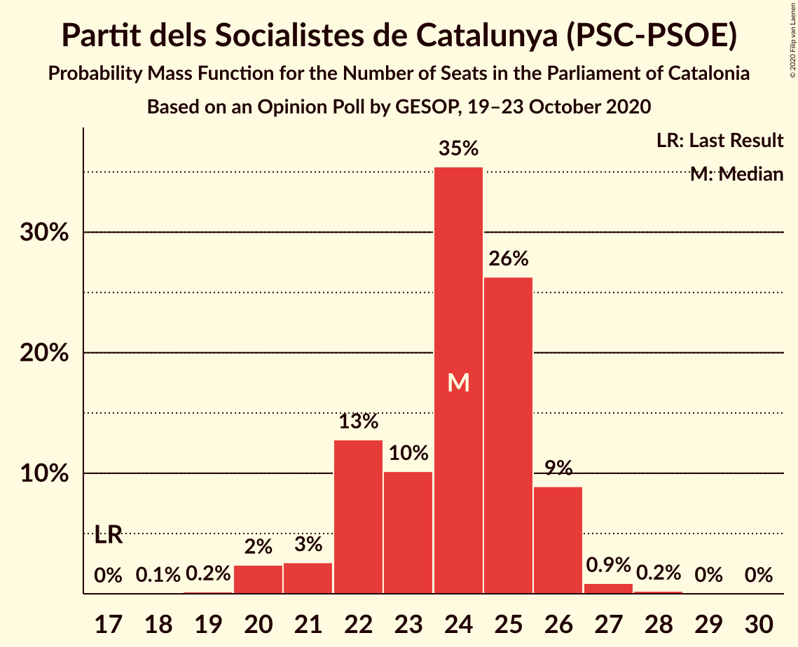
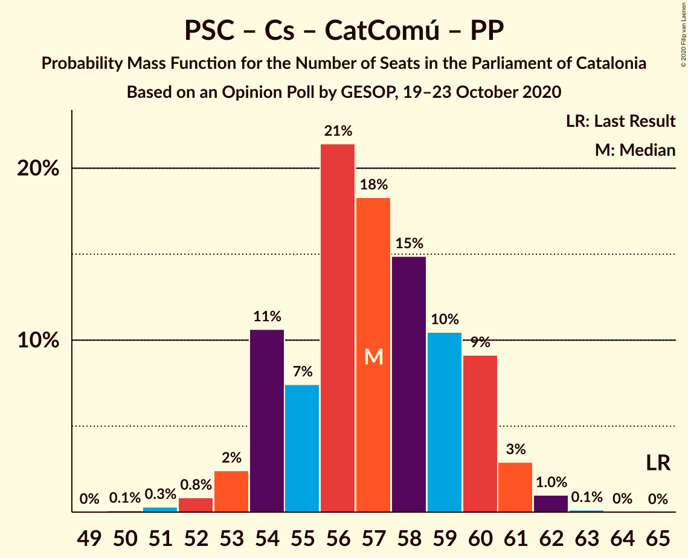

# Opinion Poll by GESOP, 19–23 October 2020

<a href="#voting-intentions">Voting Intentions</a> | <a href="#seats">Seats</a> | <a href="#coalitions">Coalitions</a> | <a href="#technical-information">Technical Information</a>

## Voting Intentions

### Confidence Intervals

| Party | Last Result | Poll Result | 80% Confidence Interval | 90% Confidence Interval | 95% Confidence Interval | 99% Confidence Interval |
|:-----:|:-----------:|:-----------:|:-----------------------:|:-----------------------:|:-----------------------:|:-----------------------:|
| Esquerra Republicana–Catalunya Sí | 21.4% | 22.9% | 21.5–24.4% |21.1–24.8% |20.8–25.1% |20.2–25.8% |
| Junts per Catalunya | 21.7% | 18.3% | 17.1–19.7% |16.7–20.1% |16.4–20.4% |15.8–21.0% |
| Partit dels Socialistes de Catalunya (PSC-PSOE) | 13.9% | 17.5% | 16.3–18.8% |15.9–19.2% |15.6–19.5% |15.1–20.2% |
| Ciutadans–Partido de la Ciudadanía | 25.4% | 12.5% | 11.5–13.7% |11.2–14.0% |10.9–14.3% |10.4–14.9% |
| Catalunya en Comú–Podem | 7.5% | 7.3% | 6.5–8.3% |6.3–8.5% |6.1–8.8% |5.7–9.3% |
| Partit Popular | 4.2% | 6.2% | 5.5–7.1% |5.3–7.4% |5.1–7.6% |4.8–8.0% |
| Candidatura d’Unitat Popular | 4.5% | 5.8% | 5.1–6.7% |4.9–6.9% |4.7–7.1% |4.4–7.6% |
| Vox | 0.0% | 5.1% | 4.5–5.9% |4.3–6.2% |4.1–6.4% |3.8–6.8% |

*Note:* The poll result column reflects the actual value used in the calculations. Published results may vary slightly, and in addition be rounded to fewer digits.

## Seats

### Confidence Intervals

| Party | Last Result | Median | 80% Confidence Interval | 90% Confidence Interval | 95% Confidence Interval | 99% Confidence Interval |
|:-----:|:-----------:|:------:|:-----------------------:|:-----------------------:|:-----------------------:|:-----------------------:|
| <a href="#esquerra-republicana–catalunya-sí">Esquerra Republicana–Catalunya Sí</a> | 32 | 35 | 33–37 |32–38 |31–39 |30–40 |
| <a href="#junts-per-catalunya">Junts per Catalunya</a> | 34 | 30 | 26–31 |26–32 |26–32 |25–34 |
| <a href="#partit-dels-socialistes-de-catalunya-(psc-psoe)">Partit dels Socialistes de Catalunya (PSC-PSOE)</a> | 17 | 24 | 22–26 |21–26 |20–26 |20–27 |
| <a href="#ciutadans–partido-de-la-ciudadanía">Ciutadans–Partido de la Ciudadanía</a> | 36 | 17 | 15–19 |14–19 |14–19 |14–20 |
| <a href="#catalunya-en-comú–podem">Catalunya en Comú–Podem</a> | 8 | 8 | 7–10 |7–10 |6–11 |6–11 |
| <a href="#partit-popular">Partit Popular</a> | 4 | 7 | 7–9 |7–9 |6–10 |5–10 |
| <a href="#candidatura-d’unitat-popular">Candidatura d’Unitat Popular</a> | 4 | 8 | 7–8 |6–9 |5–9 |4–10 |
| <a href="#vox">Vox</a> | 0 | 6 | 5–7 |5–7 |4–8 |3–9 |

### Esquerra Republicana–Catalunya Sí

*For a full overview of the results for this party, see the [Esquerra Republicana–Catalunya Sí](party-esquerrarepublicana–catalunyasí.html) page.*

| Number of Seats | Probability | Accumulated | Special Marks |
|:---------------:|:-----------:|:-----------:|:-------------:|
| 29 | 0.4% | 100% |  |
| 30 | 0.4% | 99.6% |  |
| 31 | 4% | 99.1% |  |
| 32 | 4% | 95% | Last Result |
| 33 | 10% | 91% |  |
| 34 | 20% | 81% |  |
| 35 | 33% | 61% | Median |
| 36 | 17% | 29% |  |
| 37 | 5% | 11% |  |
| 38 | 3% | 6% |  |
| 39 | 2% | 3% |  |
| 40 | 0.5% | 0.7% |  |
| 41 | 0.2% | 0.2% |  |
| 42 | 0% | 0% |  |

### Junts per Catalunya

*For a full overview of the results for this party, see the [Junts per Catalunya](party-juntspercatalunya.html) page.*

| Number of Seats | Probability | Accumulated | Special Marks |
|:---------------:|:-----------:|:-----------:|:-------------:|
| 24 | 0.1% | 100% |  |
| 25 | 1.0% | 99.9% |  |
| 26 | 10% | 99.0% |  |
| 27 | 7% | 89% |  |
| 28 | 9% | 82% |  |
| 29 | 17% | 73% |  |
| 30 | 15% | 56% | Median |
| 31 | 31% | 41% |  |
| 32 | 8% | 10% |  |
| 33 | 0.9% | 2% |  |
| 34 | 0.6% | 0.7% | Last Result |
| 35 | 0.1% | 0.1% |  |
| 36 | 0% | 0% |  |

### Partit dels Socialistes de Catalunya (PSC-PSOE)

*For a full overview of the results for this party, see the [Partit dels Socialistes de Catalunya (PSC-PSOE)](party-partitdelssocialistesdecatalunyapsc-psoe.html) page.*

| Number of Seats | Probability | Accumulated | Special Marks |
|:---------------:|:-----------:|:-----------:|:-------------:|
| 17 | 0% | 100% | Last Result |
| 18 | 0.1% | 100% |  |
| 19 | 0.2% | 99.9% |  |
| 20 | 2% | 99.8% |  |
| 21 | 3% | 97% |  |
| 22 | 13% | 95% |  |
| 23 | 10% | 82% |  |
| 24 | 35% | 72% | Median |
| 25 | 26% | 36% |  |
| 26 | 9% | 10% |  |
| 27 | 0.9% | 1.2% |  |
| 28 | 0.2% | 0.3% |  |
| 29 | 0% | 0.1% |  |
| 30 | 0% | 0% |  |

### Ciutadans–Partido de la Ciudadanía

*For a full overview of the results for this party, see the [Ciutadans–Partido de la Ciudadanía](party-ciutadans–partidodelaciudadanía.html) page.*

| Number of Seats | Probability | Accumulated | Special Marks |
|:---------------:|:-----------:|:-----------:|:-------------:|
| 13 | 0.4% | 100% |  |
| 14 | 5% | 99.6% |  |
| 15 | 5% | 94% |  |
| 16 | 31% | 89% |  |
| 17 | 18% | 58% | Median |
| 18 | 28% | 40% |  |
| 19 | 12% | 13% |  |
| 20 | 1.0% | 1.1% |  |
| 21 | 0.1% | 0.1% |  |
| 22 | 0% | 0% |  |
| 23 | 0% | 0% |  |
| 24 | 0% | 0% |  |
| 25 | 0% | 0% |  |
| 26 | 0% | 0% |  |
| 27 | 0% | 0% |  |
| 28 | 0% | 0% |  |
| 29 | 0% | 0% |  |
| 30 | 0% | 0% |  |
| 31 | 0% | 0% |  |
| 32 | 0% | 0% |  |
| 33 | 0% | 0% |  |
| 34 | 0% | 0% |  |
| 35 | 0% | 0% |  |
| 36 | 0% | 0% | Last Result |

### Catalunya en Comú–Podem

*For a full overview of the results for this party, see the [Catalunya en Comú–Podem](party-catalunyaencomú–podem.html) page.*

| Number of Seats | Probability | Accumulated | Special Marks |
|:---------------:|:-----------:|:-----------:|:-------------:|
| 5 | 0.4% | 100% |  |
| 6 | 4% | 99.6% |  |
| 7 | 14% | 96% |  |
| 8 | 47% | 82% | Last Result, Median |
| 9 | 19% | 35% |  |
| 10 | 13% | 16% |  |
| 11 | 3% | 3% |  |
| 12 | 0.1% | 0.1% |  |
| 13 | 0% | 0% |  |

### Partit Popular

*For a full overview of the results for this party, see the [Partit Popular](party-partitpopular.html) page.*

| Number of Seats | Probability | Accumulated | Special Marks |
|:---------------:|:-----------:|:-----------:|:-------------:|
| 4 | 0% | 100% | Last Result |
| 5 | 2% | 100% |  |
| 6 | 3% | 98% |  |
| 7 | 48% | 95% | Median |
| 8 | 17% | 47% |  |
| 9 | 25% | 30% |  |
| 10 | 5% | 5% |  |
| 11 | 0.1% | 0.2% |  |
| 12 | 0.1% | 0.1% |  |
| 13 | 0% | 0% |  |

### Candidatura d’Unitat Popular

*For a full overview of the results for this party, see the [Candidatura d’Unitat Popular](party-candidaturad’unitatpopular.html) page.*

| Number of Seats | Probability | Accumulated | Special Marks |
|:---------------:|:-----------:|:-----------:|:-------------:|
| 4 | 0.5% | 100% | Last Result |
| 5 | 2% | 99.4% |  |
| 6 | 5% | 97% |  |
| 7 | 21% | 93% |  |
| 8 | 62% | 72% | Median |
| 9 | 8% | 10% |  |
| 10 | 1.3% | 1.5% |  |
| 11 | 0.2% | 0.2% |  |
| 12 | 0% | 0% |  |

### Vox

*For a full overview of the results for this party, see the [Vox](party-vox.html) page.*

| Number of Seats | Probability | Accumulated | Special Marks |
|:---------------:|:-----------:|:-----------:|:-------------:|
| 0 | 0% | 100% | Last Result |
| 1 | 0% | 100% |  |
| 2 | 0% | 100% |  |
| 3 | 2% | 100% |  |
| 4 | 1.3% | 98% |  |
| 5 | 37% | 96% |  |
| 6 | 16% | 60% | Median |
| 7 | 41% | 44% |  |
| 8 | 1.3% | 3% |  |
| 9 | 1.5% | 2% |  |
| 10 | 0% | 0% |  |

## Coalitions

### Confidence Intervals

| Coalition | Last Result | Median | Majority? | 80% Confidence Interval | 90% Confidence Interval | 95% Confidence Interval | 99% Confidence Interval |
|:---------:|:-----------:|:------:|:---------:|:-----------------------:|:-----------------------:|:-----------------------:|:-----------------------:|
| Esquerra Republicana–Catalunya Sí – Junts per Catalunya – Catalunya en Comú–Podem | 74 | 73 | 99.4% | 70–75 | 69–76 | 68–77 | 67–78 |
| Esquerra Republicana–Catalunya Sí – Junts per Catalunya – Candidatura d’Unitat Popular | 70 | 72 | 98% | 69–75 | 68–75 | 68–76 | 67–77 |
| Esquerra Republicana–Catalunya Sí – Partit dels Socialistes de Catalunya (PSC-PSOE) – Catalunya en Comú–Podem | 57 | 67 | 41% | 64–70 | 64–71 | 63–71 | 61–73 |
| Esquerra Republicana–Catalunya Sí – Junts per Catalunya | 66 | 64 | 5% | 61–67 | 60–68 | 60–68 | 59–69 |
| Partit dels Socialistes de Catalunya (PSC-PSOE) – Ciutadans–Partido de la Ciudadanía – Catalunya en Comú–Podem – Partit Popular | 65 | 57 | 0% | 54–60 | 54–60 | 53–61 | 52–62 |
| Partit dels Socialistes de Catalunya (PSC-PSOE) – Ciutadans–Partido de la Ciudadanía – Partit Popular – Vox | 57 | 55 | 0% | 52–57 | 52–58 | 51–59 | 50–60 |
| Partit dels Socialistes de Catalunya (PSC-PSOE) – Ciutadans–Partido de la Ciudadanía – Partit Popular | 57 | 49 | 0% | 46–51 | 45–52 | 45–52 | 44–53 |
| Esquerra Republicana–Catalunya Sí – Catalunya en Comú–Podem | 40 | 43 | 0% | 41–46 | 40–46 | 39–47 | 38–48 |

### Esquerra Republicana–Catalunya Sí – Junts per Catalunya – Catalunya en Comú–Podem

| Number of Seats | Probability | Accumulated | Special Marks |
|:---------------:|:-----------:|:-----------:|:-------------:|
| 66 | 0.1% | 100% |  |
| 67 | 0.4% | 99.9% |  |
| 68 | 2% | 99.4% | Majority |
| 69 | 5% | 97% |  |
| 70 | 10% | 92% |  |
| 71 | 13% | 83% |  |
| 72 | 15% | 70% |  |
| 73 | 20% | 55% | Median |
| 74 | 17% | 35% | Last Result |
| 75 | 12% | 18% |  |
| 76 | 3% | 6% |  |
| 77 | 2% | 3% |  |
| 78 | 0.9% | 1.1% |  |
| 79 | 0.1% | 0.2% |  |
| 80 | 0.1% | 0.1% |  |
| 81 | 0% | 0% |  |

### Esquerra Republicana–Catalunya Sí – Junts per Catalunya – Candidatura d’Unitat Popular

| Number of Seats | Probability | Accumulated | Special Marks |
|:---------------:|:-----------:|:-----------:|:-------------:|
| 65 | 0% | 100% |  |
| 66 | 0.2% | 99.9% |  |
| 67 | 1.4% | 99.7% |  |
| 68 | 6% | 98% | Majority |
| 69 | 7% | 92% |  |
| 70 | 9% | 85% | Last Result |
| 71 | 14% | 76% |  |
| 72 | 20% | 62% |  |
| 73 | 13% | 42% | Median |
| 74 | 18% | 29% |  |
| 75 | 7% | 11% |  |
| 76 | 2% | 4% |  |
| 77 | 0.9% | 1.2% |  |
| 78 | 0.2% | 0.3% |  |
| 79 | 0.1% | 0.1% |  |
| 80 | 0% | 0% |  |

### Esquerra Republicana–Catalunya Sí – Partit dels Socialistes de Catalunya (PSC-PSOE) – Catalunya en Comú–Podem

| Number of Seats | Probability | Accumulated | Special Marks |
|:---------------:|:-----------:|:-----------:|:-------------:|
| 57 | 0% | 100% | Last Result |
| 58 | 0% | 100% |  |
| 59 | 0% | 100% |  |
| 60 | 0.1% | 100% |  |
| 61 | 0.4% | 99.9% |  |
| 62 | 0.7% | 99.5% |  |
| 63 | 4% | 98.8% |  |
| 64 | 7% | 95% |  |
| 65 | 13% | 89% |  |
| 66 | 16% | 76% |  |
| 67 | 19% | 60% | Median |
| 68 | 19% | 41% | Majority |
| 69 | 10% | 22% |  |
| 70 | 8% | 13% |  |
| 71 | 4% | 5% |  |
| 72 | 0.9% | 1.5% |  |
| 73 | 0.4% | 0.6% |  |
| 74 | 0.1% | 0.2% |  |
| 75 | 0% | 0% |  |

### Esquerra Republicana–Catalunya Sí – Junts per Catalunya

| Number of Seats | Probability | Accumulated | Special Marks |
|:---------------:|:-----------:|:-----------:|:-------------:|
| 58 | 0.2% | 100% |  |
| 59 | 0.7% | 99.8% |  |
| 60 | 5% | 99.1% |  |
| 61 | 5% | 94% |  |
| 62 | 10% | 89% |  |
| 63 | 13% | 79% |  |
| 64 | 19% | 66% |  |
| 65 | 13% | 48% | Median |
| 66 | 22% | 34% | Last Result |
| 67 | 7% | 12% |  |
| 68 | 3% | 5% | Majority |
| 69 | 2% | 2% |  |
| 70 | 0.3% | 0.5% |  |
| 71 | 0.1% | 0.2% |  |
| 72 | 0% | 0% |  |

### Partit dels Socialistes de Catalunya (PSC-PSOE) – Ciutadans–Partido de la Ciudadanía – Catalunya en Comú–Podem – Partit Popular

| Number of Seats | Probability | Accumulated | Special Marks |
|:---------------:|:-----------:|:-----------:|:-------------:|
| 50 | 0.1% | 100% |  |
| 51 | 0.3% | 99.9% |  |
| 52 | 0.8% | 99.6% |  |
| 53 | 2% | 98.7% |  |
| 54 | 11% | 96% |  |
| 55 | 7% | 86% |  |
| 56 | 21% | 78% | Median |
| 57 | 18% | 57% |  |
| 58 | 15% | 39% |  |
| 59 | 10% | 24% |  |
| 60 | 9% | 13% |  |
| 61 | 3% | 4% |  |
| 62 | 1.0% | 1.2% |  |
| 63 | 0.1% | 0.2% |  |
| 64 | 0% | 0% |  |
| 65 | 0% | 0% | Last Result |

### Partit dels Socialistes de Catalunya (PSC-PSOE) – Ciutadans–Partido de la Ciudadanía – Partit Popular – Vox

| Number of Seats | Probability | Accumulated | Special Marks |
|:---------------:|:-----------:|:-----------:|:-------------:|
| 48 | 0.1% | 100% |  |
| 49 | 0.3% | 99.9% |  |
| 50 | 1.4% | 99.5% |  |
| 51 | 3% | 98% |  |
| 52 | 10% | 95% |  |
| 53 | 16% | 85% |  |
| 54 | 18% | 69% | Median |
| 55 | 17% | 51% |  |
| 56 | 13% | 34% |  |
| 57 | 11% | 21% | Last Result |
| 58 | 6% | 10% |  |
| 59 | 2% | 4% |  |
| 60 | 0.9% | 1.1% |  |
| 61 | 0.1% | 0.2% |  |
| 62 | 0% | 0% |  |

### Partit dels Socialistes de Catalunya (PSC-PSOE) – Ciutadans–Partido de la Ciudadanía – Partit Popular

| Number of Seats | Probability | Accumulated | Special Marks |
|:---------------:|:-----------:|:-----------:|:-------------:|
| 42 | 0.1% | 100% |  |
| 43 | 0.4% | 99.9% |  |
| 44 | 1.0% | 99.5% |  |
| 45 | 5% | 98.5% |  |
| 46 | 8% | 94% |  |
| 47 | 12% | 86% |  |
| 48 | 21% | 73% | Median |
| 49 | 19% | 53% |  |
| 50 | 15% | 33% |  |
| 51 | 10% | 18% |  |
| 52 | 5% | 8% |  |
| 53 | 2% | 2% |  |
| 54 | 0.3% | 0.4% |  |
| 55 | 0% | 0.1% |  |
| 56 | 0% | 0% |  |
| 57 | 0% | 0% | Last Result |

### Esquerra Republicana–Catalunya Sí – Catalunya en Comú–Podem

| Number of Seats | Probability | Accumulated | Special Marks |
|:---------------:|:-----------:|:-----------:|:-------------:|
| 37 | 0.4% | 100% |  |
| 38 | 0.6% | 99.6% |  |
| 39 | 3% | 99.0% |  |
| 40 | 4% | 96% | Last Result |
| 41 | 9% | 93% |  |
| 42 | 19% | 84% |  |
| 43 | 29% | 65% | Median |
| 44 | 16% | 36% |  |
| 45 | 9% | 19% |  |
| 46 | 6% | 10% |  |
| 47 | 3% | 4% |  |
| 48 | 1.3% | 2% |  |
| 49 | 0.3% | 0.4% |  |
| 50 | 0.1% | 0.1% |  |
| 51 | 0% | 0% |  |

## Technical Information

### Opinion Poll

+ **Polling firm:** GESOP
+ **Commissioner(s):** —
+ **Fieldwork period:** 19–23 October 2020

### Calculations

+ **Sample size:** 1463
+ **Simulations done:** 1,048,576
+ **Error estimate:** 0.58%

