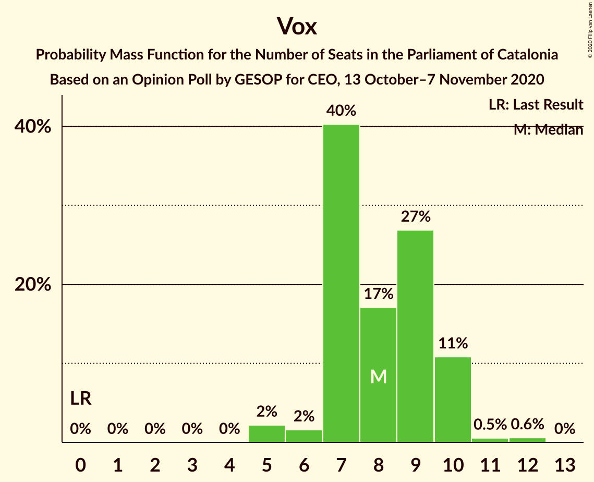
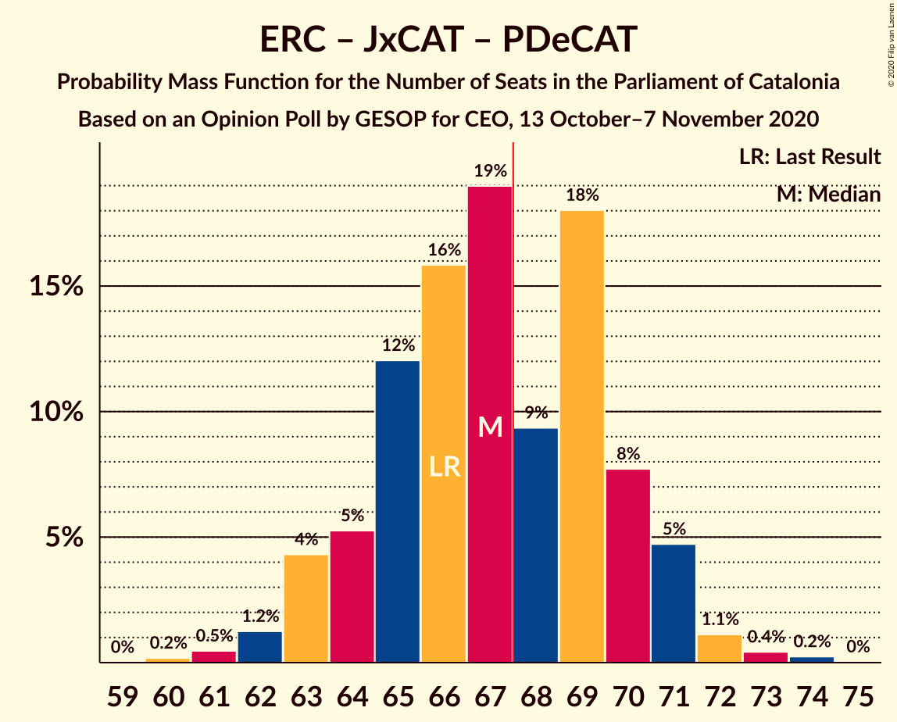

# Opinion Poll by GESOP for CEO, 13 October–7 November 2020

<a href="#voting-intentions">Voting Intentions</a> | <a href="#seats">Seats</a> | <a href="#coalitions">Coalitions</a> | <a href="#technical-information">Technical Information</a>

## Voting Intentions

### Confidence Intervals

| Party | Last Result | Poll Result | 80% Confidence Interval | 90% Confidence Interval | 95% Confidence Interval | 99% Confidence Interval |
|:-----:|:-----------:|:-----------:|:-----------------------:|:-----------------------:|:-----------------------:|:-----------------------:|
| Esquerra Republicana–Catalunya Sí | 21.4% | 24.4% | 22.9–26.0% |22.5–26.4% |22.1–26.8% |21.4–27.6% |
| Junts per Catalunya | 21.7% | 18.7% | 17.4–20.1% |17.0–20.5% |16.7–20.9% |16.0–21.6% |
| Partit dels Socialistes de Catalunya (PSC-PSOE) | 13.9% | 16.8% | 15.5–18.2% |15.1–18.6% |14.8–18.9% |14.2–19.6% |
| Ciutadans–Partido de la Ciudadanía | 25.4% | 10.0% | 9.0–11.2% |8.7–11.5% |8.5–11.8% |8.0–12.3% |
| Catalunya en Comú–Podem | 7.5% | 7.2% | 6.4–8.2% |6.1–8.5% |5.9–8.8% |5.6–9.3% |
| Partit Popular | 4.2% | 7.0% | 6.2–8.0% |5.9–8.3% |5.7–8.5% |5.3–9.0% |
| Vox | 0.0% | 6.4% | 5.6–7.3% |5.4–7.6% |5.2–7.8% |4.8–8.3% |
| Candidatura d’Unitat Popular | 4.5% | 5.3% | 4.6–6.2% |4.4–6.4% |4.2–6.7% |3.9–7.1% |
| Partit Demòcrata Europeu Català | 0.0% | 2.4% | 1.9–3.0% |1.8–3.2% |1.7–3.4% |1.5–3.7% |

*Note:* The poll result column reflects the actual value used in the calculations. Published results may vary slightly, and in addition be rounded to fewer digits.

## Seats

### Confidence Intervals

| Party | Last Result | Median | 80% Confidence Interval | 90% Confidence Interval | 95% Confidence Interval | 99% Confidence Interval |
|:-----:|:-----------:|:------:|:-----------------------:|:-----------------------:|:-----------------------:|:-----------------------:|
| <a href="#esquerra-republicana–catalunya-sí">Esquerra Republicana–Catalunya Sí</a> | 32 | 37 | 34–40 |34–40 |33–41 |32–42 |
| <a href="#junts-per-catalunya">Junts per Catalunya</a> | 34 | 30 | 27–32 |26–32 |26–33 |25–34 |
| <a href="#partit-dels-socialistes-de-catalunya-(psc-psoe)">Partit dels Socialistes de Catalunya (PSC-PSOE)</a> | 17 | 23 | 20–25 |20–25 |19–25 |18–26 |
| <a href="#ciutadans–partido-de-la-ciudadanía">Ciutadans–Partido de la Ciudadanía</a> | 36 | 13 | 12–14 |12–15 |11–15 |10–17 |
| <a href="#catalunya-en-comú–podem">Catalunya en Comú–Podem</a> | 8 | 8 | 7–9 |6–11 |6–11 |5–11 |
| <a href="#partit-popular">Partit Popular</a> | 4 | 9 | 7–10 |7–11 |7–12 |7–12 |
| <a href="#vox">Vox</a> | 0 | 8 | 7–10 |7–10 |6–10 |5–12 |
| <a href="#candidatura-d’unitat-popular">Candidatura d’Unitat Popular</a> | 4 | 7 | 5–8 |5–8 |4–9 |3–9 |
| <a href="#partit-demòcrata-europeu-català">Partit Demòcrata Europeu Català</a> | 0 | 0 | 0–1 |0–1 |0–1 |0–4 |

### Esquerra Republicana–Catalunya Sí

*For a full overview of the results for this party, see the [Esquerra Republicana–Catalunya Sí](party-esquerrarepublicana–catalunyasí.html) page.*

| Number of Seats | Probability | Accumulated | Special Marks |
|:---------------:|:-----------:|:-----------:|:-------------:|
| 31 | 0.4% | 100% |  |
| 32 | 1.2% | 99.6% | Last Result |
| 33 | 1.2% | 98% |  |
| 34 | 8% | 97% |  |
| 35 | 7% | 89% |  |
| 36 | 17% | 83% |  |
| 37 | 16% | 65% | Median |
| 38 | 26% | 49% |  |
| 39 | 13% | 23% |  |
| 40 | 5% | 10% |  |
| 41 | 4% | 5% |  |
| 42 | 0.9% | 1.1% |  |
| 43 | 0.1% | 0.2% |  |
| 44 | 0.1% | 0.1% |  |
| 45 | 0% | 0% |  |

### Junts per Catalunya

*For a full overview of the results for this party, see the [Junts per Catalunya](party-juntspercatalunya.html) page.*

| Number of Seats | Probability | Accumulated | Special Marks |
|:---------------:|:-----------:|:-----------:|:-------------:|
| 24 | 0.2% | 100% |  |
| 25 | 1.2% | 99.8% |  |
| 26 | 7% | 98.5% |  |
| 27 | 10% | 91% |  |
| 28 | 10% | 81% |  |
| 29 | 17% | 71% |  |
| 30 | 14% | 55% | Median |
| 31 | 25% | 40% |  |
| 32 | 12% | 15% |  |
| 33 | 2% | 3% |  |
| 34 | 0.8% | 1.1% | Last Result |
| 35 | 0.1% | 0.3% |  |
| 36 | 0.2% | 0.2% |  |
| 37 | 0% | 0% |  |

### Partit dels Socialistes de Catalunya (PSC-PSOE)

*For a full overview of the results for this party, see the [Partit dels Socialistes de Catalunya (PSC-PSOE)](party-partitdelssocialistesdecatalunyapsc-psoe.html) page.*

| Number of Seats | Probability | Accumulated | Special Marks |
|:---------------:|:-----------:|:-----------:|:-------------:|
| 17 | 0.1% | 100% | Last Result |
| 18 | 1.2% | 99.9% |  |
| 19 | 3% | 98.7% |  |
| 20 | 8% | 96% |  |
| 21 | 9% | 88% |  |
| 22 | 23% | 79% |  |
| 23 | 16% | 56% | Median |
| 24 | 26% | 40% |  |
| 25 | 12% | 15% |  |
| 26 | 2% | 2% |  |
| 27 | 0.1% | 0.1% |  |
| 28 | 0% | 0.1% |  |
| 29 | 0% | 0% |  |

### Ciutadans–Partido de la Ciudadanía

*For a full overview of the results for this party, see the [Ciutadans–Partido de la Ciudadanía](party-ciutadans–partidodelaciudadanía.html) page.*

| Number of Seats | Probability | Accumulated | Special Marks |
|:---------------:|:-----------:|:-----------:|:-------------:|
| 9 | 0.4% | 100% |  |
| 10 | 0.6% | 99.6% |  |
| 11 | 2% | 99.0% |  |
| 12 | 23% | 97% |  |
| 13 | 38% | 75% | Median |
| 14 | 31% | 37% |  |
| 15 | 4% | 6% |  |
| 16 | 1.4% | 2% |  |
| 17 | 0.3% | 0.6% |  |
| 18 | 0.3% | 0.3% |  |
| 19 | 0% | 0% |  |
| 20 | 0% | 0% |  |
| 21 | 0% | 0% |  |
| 22 | 0% | 0% |  |
| 23 | 0% | 0% |  |
| 24 | 0% | 0% |  |
| 25 | 0% | 0% |  |
| 26 | 0% | 0% |  |
| 27 | 0% | 0% |  |
| 28 | 0% | 0% |  |
| 29 | 0% | 0% |  |
| 30 | 0% | 0% |  |
| 31 | 0% | 0% |  |
| 32 | 0% | 0% |  |
| 33 | 0% | 0% |  |
| 34 | 0% | 0% |  |
| 35 | 0% | 0% |  |
| 36 | 0% | 0% | Last Result |

### Catalunya en Comú–Podem

*For a full overview of the results for this party, see the [Catalunya en Comú–Podem](party-catalunyaencomú–podem.html) page.*

| Number of Seats | Probability | Accumulated | Special Marks |
|:---------------:|:-----------:|:-----------:|:-------------:|
| 5 | 1.1% | 100% |  |
| 6 | 5% | 98.9% |  |
| 7 | 17% | 94% |  |
| 8 | 51% | 77% | Last Result, Median |
| 9 | 17% | 26% |  |
| 10 | 3% | 9% |  |
| 11 | 6% | 6% |  |
| 12 | 0.1% | 0.1% |  |
| 13 | 0% | 0% |  |

### Partit Popular

*For a full overview of the results for this party, see the [Partit Popular](party-partitpopular.html) page.*

| Number of Seats | Probability | Accumulated | Special Marks |
|:---------------:|:-----------:|:-----------:|:-------------:|
| 4 | 0% | 100% | Last Result |
| 5 | 0.2% | 100% |  |
| 6 | 0.2% | 99.8% |  |
| 7 | 13% | 99.6% |  |
| 8 | 15% | 86% |  |
| 9 | 39% | 71% | Median |
| 10 | 25% | 32% |  |
| 11 | 4% | 7% |  |
| 12 | 3% | 3% |  |
| 13 | 0.1% | 0.1% |  |
| 14 | 0% | 0% |  |

### Vox

*For a full overview of the results for this party, see the [Vox](party-vox.html) page.*

| Number of Seats | Probability | Accumulated | Special Marks |
|:---------------:|:-----------:|:-----------:|:-------------:|
| 0 | 0% | 100% | Last Result |
| 1 | 0% | 100% |  |
| 2 | 0% | 100% |  |
| 3 | 0% | 100% |  |
| 4 | 0% | 100% |  |
| 5 | 2% | 100% |  |
| 6 | 2% | 98% |  |
| 7 | 40% | 96% |  |
| 8 | 17% | 56% | Median |
| 9 | 27% | 39% |  |
| 10 | 11% | 12% |  |
| 11 | 0.5% | 1.1% |  |
| 12 | 0.6% | 0.6% |  |
| 13 | 0% | 0% |  |

### Candidatura d’Unitat Popular

*For a full overview of the results for this party, see the [Candidatura d’Unitat Popular](party-candidaturad’unitatpopular.html) page.*

| Number of Seats | Probability | Accumulated | Special Marks |
|:---------------:|:-----------:|:-----------:|:-------------:|
| 3 | 0.7% | 100% |  |
| 4 | 3% | 99.3% | Last Result |
| 5 | 20% | 96% |  |
| 6 | 8% | 76% |  |
| 7 | 29% | 68% | Median |
| 8 | 36% | 39% |  |
| 9 | 3% | 3% |  |
| 10 | 0.1% | 0.1% |  |
| 11 | 0% | 0% |  |

### Partit Demòcrata Europeu Català

*For a full overview of the results for this party, see the [Partit Demòcrata Europeu Català](party-partitdemòcrataeuropeucatalà.html) page.*

| Number of Seats | Probability | Accumulated | Special Marks |
|:---------------:|:-----------:|:-----------:|:-------------:|
| 0 | 68% | 100% | Last Result, Median |
| 1 | 30% | 32% |  |
| 2 | 0% | 2% |  |
| 3 | 1.0% | 2% |  |
| 4 | 0.5% | 0.9% |  |
| 5 | 0.4% | 0.4% |  |
| 6 | 0% | 0% |  |

## Coalitions

### Confidence Intervals

| Coalition | Last Result | Median | Majority? | 80% Confidence Interval | 90% Confidence Interval | 95% Confidence Interval | 99% Confidence Interval |
|:---------:|:-----------:|:------:|:---------:|:-----------------------:|:-----------------------:|:-----------------------:|:-----------------------:|
| Esquerra Republicana–Catalunya Sí – Junts per Catalunya – Catalunya en Comú–Podem | 74 | 75 | 100% | 72–78 | 71–79 | 71–79 | 69–81 |
| Esquerra Republicana–Catalunya Sí – Junts per Catalunya – Candidatura d’Unitat Popular – Partit Demòcrata Europeu Català | 70 | 74 | 99.9% | 71–77 | 71–78 | 70–79 | 69–79 |
| Esquerra Republicana–Catalunya Sí – Junts per Catalunya – Candidatura d’Unitat Popular | 70 | 73 | 99.7% | 71–77 | 70–78 | 69–78 | 68–79 |
| Esquerra Republicana–Catalunya Sí – Partit dels Socialistes de Catalunya (PSC-PSOE) – Catalunya en Comú–Podem | 57 | 68 | 60% | 65–71 | 64–72 | 63–72 | 62–74 |
| Esquerra Republicana–Catalunya Sí – Junts per Catalunya – Partit Demòcrata Europeu Català | 66 | 67 | 42% | 64–70 | 63–71 | 63–71 | 61–73 |
| Esquerra Republicana–Catalunya Sí – Junts per Catalunya | 66 | 67 | 37% | 64–70 | 63–70 | 62–71 | 61–73 |
| Partit dels Socialistes de Catalunya (PSC-PSOE) – Ciutadans–Partido de la Ciudadanía – Catalunya en Comú–Podem – Partit Popular | 65 | 53 | 0% | 50–56 | 49–57 | 49–57 | 48–58 |
| Partit dels Socialistes de Catalunya (PSC-PSOE) – Ciutadans–Partido de la Ciudadanía – Partit Popular – Vox | 57 | 53 | 0% | 50–56 | 49–56 | 48–57 | 47–58 |
| Esquerra Republicana–Catalunya Sí – Catalunya en Comú–Podem | 40 | 45 | 0% | 42–48 | 42–49 | 41–50 | 39–50 |
| Partit dels Socialistes de Catalunya (PSC-PSOE) – Ciutadans–Partido de la Ciudadanía – Partit Popular | 57 | 45 | 0% | 42–47 | 41–48 | 41–49 | 40–50 |

### Esquerra Republicana–Catalunya Sí – Junts per Catalunya – Catalunya en Comú–Podem

| Number of Seats | Probability | Accumulated | Special Marks |
|:---------------:|:-----------:|:-----------:|:-------------:|
| 68 | 0.2% | 100% | Majority |
| 69 | 0.7% | 99.7% |  |
| 70 | 1.2% | 99.0% |  |
| 71 | 5% | 98% |  |
| 72 | 6% | 92% |  |
| 73 | 17% | 86% |  |
| 74 | 18% | 69% | Last Result |
| 75 | 12% | 51% | Median |
| 76 | 10% | 39% |  |
| 77 | 13% | 29% |  |
| 78 | 9% | 15% |  |
| 79 | 5% | 7% |  |
| 80 | 1.0% | 2% |  |
| 81 | 0.4% | 0.5% |  |
| 82 | 0.1% | 0.2% |  |
| 83 | 0% | 0% |  |

### Esquerra Republicana–Catalunya Sí – Junts per Catalunya – Candidatura d’Unitat Popular – Partit Demòcrata Europeu Català

| Number of Seats | Probability | Accumulated | Special Marks |
|:---------------:|:-----------:|:-----------:|:-------------:|
| 67 | 0.1% | 100% |  |
| 68 | 0.3% | 99.9% | Majority |
| 69 | 2% | 99.5% |  |
| 70 | 2% | 98% | Last Result |
| 71 | 11% | 95% |  |
| 72 | 12% | 84% |  |
| 73 | 14% | 72% |  |
| 74 | 18% | 58% | Median |
| 75 | 16% | 40% |  |
| 76 | 13% | 25% |  |
| 77 | 5% | 12% |  |
| 78 | 4% | 7% |  |
| 79 | 3% | 3% |  |
| 80 | 0.2% | 0.4% |  |
| 81 | 0.2% | 0.2% |  |
| 82 | 0% | 0% |  |

### Esquerra Republicana–Catalunya Sí – Junts per Catalunya – Candidatura d’Unitat Popular

| Number of Seats | Probability | Accumulated | Special Marks |
|:---------------:|:-----------:|:-----------:|:-------------:|
| 67 | 0.2% | 100% |  |
| 68 | 0.6% | 99.7% | Majority |
| 69 | 2% | 99.2% |  |
| 70 | 4% | 97% | Last Result |
| 71 | 14% | 93% |  |
| 72 | 12% | 79% |  |
| 73 | 20% | 67% |  |
| 74 | 11% | 47% | Median |
| 75 | 16% | 36% |  |
| 76 | 11% | 21% |  |
| 77 | 4% | 10% |  |
| 78 | 5% | 6% |  |
| 79 | 0.9% | 1.2% |  |
| 80 | 0.2% | 0.3% |  |
| 81 | 0.1% | 0.1% |  |
| 82 | 0% | 0% |  |

### Esquerra Republicana–Catalunya Sí – Partit dels Socialistes de Catalunya (PSC-PSOE) – Catalunya en Comú–Podem

| Number of Seats | Probability | Accumulated | Special Marks |
|:---------------:|:-----------:|:-----------:|:-------------:|
| 57 | 0% | 100% | Last Result |
| 58 | 0% | 100% |  |
| 59 | 0% | 100% |  |
| 60 | 0% | 100% |  |
| 61 | 0.2% | 100% |  |
| 62 | 0.5% | 99.8% |  |
| 63 | 3% | 99.3% |  |
| 64 | 5% | 96% |  |
| 65 | 9% | 91% |  |
| 66 | 9% | 82% |  |
| 67 | 13% | 73% |  |
| 68 | 11% | 60% | Median, Majority |
| 69 | 22% | 50% |  |
| 70 | 11% | 28% |  |
| 71 | 8% | 17% |  |
| 72 | 6% | 8% |  |
| 73 | 2% | 2% |  |
| 74 | 0.4% | 0.5% |  |
| 75 | 0.1% | 0.1% |  |
| 76 | 0% | 0% |  |

### Esquerra Republicana–Catalunya Sí – Junts per Catalunya – Partit Demòcrata Europeu Català

| Number of Seats | Probability | Accumulated | Special Marks |
|:---------------:|:-----------:|:-----------:|:-------------:|
| 60 | 0.2% | 100% |  |
| 61 | 0.5% | 99.8% |  |
| 62 | 1.2% | 99.3% |  |
| 63 | 4% | 98% |  |
| 64 | 5% | 94% |  |
| 65 | 12% | 89% |  |
| 66 | 16% | 76% | Last Result |
| 67 | 19% | 61% | Median |
| 68 | 9% | 42% | Majority |
| 69 | 18% | 32% |  |
| 70 | 8% | 14% |  |
| 71 | 5% | 7% |  |
| 72 | 1.1% | 2% |  |
| 73 | 0.4% | 0.7% |  |
| 74 | 0.2% | 0.3% |  |
| 75 | 0% | 0% |  |

### Esquerra Republicana–Catalunya Sí – Junts per Catalunya

| Number of Seats | Probability | Accumulated | Special Marks |
|:---------------:|:-----------:|:-----------:|:-------------:|
| 60 | 0.3% | 100% |  |
| 61 | 0.7% | 99.7% |  |
| 62 | 2% | 99.0% |  |
| 63 | 5% | 97% |  |
| 64 | 8% | 92% |  |
| 65 | 15% | 85% |  |
| 66 | 16% | 70% | Last Result |
| 67 | 16% | 53% | Median |
| 68 | 12% | 37% | Majority |
| 69 | 12% | 25% |  |
| 70 | 8% | 13% |  |
| 71 | 3% | 5% |  |
| 72 | 0.7% | 1.2% |  |
| 73 | 0.3% | 0.5% |  |
| 74 | 0.1% | 0.2% |  |
| 75 | 0% | 0% |  |

### Partit dels Socialistes de Catalunya (PSC-PSOE) – Ciutadans–Partido de la Ciudadanía – Catalunya en Comú–Podem – Partit Popular

| Number of Seats | Probability | Accumulated | Special Marks |
|:---------------:|:-----------:|:-----------:|:-------------:|
| 46 | 0.1% | 100% |  |
| 47 | 0.3% | 99.9% |  |
| 48 | 2% | 99.6% |  |
| 49 | 6% | 98% |  |
| 50 | 6% | 92% |  |
| 51 | 11% | 86% |  |
| 52 | 12% | 75% |  |
| 53 | 22% | 64% | Median |
| 54 | 15% | 42% |  |
| 55 | 15% | 27% |  |
| 56 | 5% | 11% |  |
| 57 | 5% | 6% |  |
| 58 | 0.8% | 1.2% |  |
| 59 | 0.2% | 0.4% |  |
| 60 | 0.2% | 0.2% |  |
| 61 | 0% | 0% |  |
| 62 | 0% | 0% |  |
| 63 | 0% | 0% |  |
| 64 | 0% | 0% |  |
| 65 | 0% | 0% | Last Result |

### Partit dels Socialistes de Catalunya (PSC-PSOE) – Ciutadans–Partido de la Ciudadanía – Partit Popular – Vox

| Number of Seats | Probability | Accumulated | Special Marks |
|:---------------:|:-----------:|:-----------:|:-------------:|
| 46 | 0.2% | 100% |  |
| 47 | 0.3% | 99.8% |  |
| 48 | 2% | 99.4% |  |
| 49 | 4% | 97% |  |
| 50 | 8% | 93% |  |
| 51 | 12% | 85% |  |
| 52 | 13% | 73% |  |
| 53 | 18% | 60% | Median |
| 54 | 16% | 41% |  |
| 55 | 10% | 25% |  |
| 56 | 11% | 15% |  |
| 57 | 3% | 4% | Last Result |
| 58 | 1.1% | 1.5% |  |
| 59 | 0.3% | 0.4% |  |
| 60 | 0.1% | 0.1% |  |
| 61 | 0% | 0% |  |

### Esquerra Republicana–Catalunya Sí – Catalunya en Comú–Podem

| Number of Seats | Probability | Accumulated | Special Marks |
|:---------------:|:-----------:|:-----------:|:-------------:|
| 38 | 0.1% | 100% |  |
| 39 | 0.4% | 99.9% |  |
| 40 | 0.7% | 99.5% | Last Result |
| 41 | 3% | 98.7% |  |
| 42 | 6% | 95% |  |
| 43 | 9% | 89% |  |
| 44 | 14% | 80% |  |
| 45 | 18% | 67% | Median |
| 46 | 20% | 49% |  |
| 47 | 17% | 28% |  |
| 48 | 4% | 12% |  |
| 49 | 4% | 8% |  |
| 50 | 3% | 4% |  |
| 51 | 0.4% | 0.5% |  |
| 52 | 0.1% | 0.1% |  |
| 53 | 0% | 0% |  |

### Partit dels Socialistes de Catalunya (PSC-PSOE) – Ciutadans–Partido de la Ciudadanía – Partit Popular

| Number of Seats | Probability | Accumulated | Special Marks |
|:---------------:|:-----------:|:-----------:|:-------------:|
| 38 | 0.1% | 100% |  |
| 39 | 0.3% | 99.9% |  |
| 40 | 2% | 99.6% |  |
| 41 | 6% | 98% |  |
| 42 | 8% | 92% |  |
| 43 | 9% | 84% |  |
| 44 | 13% | 75% |  |
| 45 | 21% | 62% | Median |
| 46 | 15% | 41% |  |
| 47 | 17% | 26% |  |
| 48 | 5% | 10% |  |
| 49 | 4% | 5% |  |
| 50 | 0.6% | 0.9% |  |
| 51 | 0.2% | 0.2% |  |
| 52 | 0% | 0.1% |  |
| 53 | 0% | 0% |  |
| 54 | 0% | 0% |  |
| 55 | 0% | 0% |  |
| 56 | 0% | 0% |  |
| 57 | 0% | 0% | Last Result |

## Technical Information

### Opinion Poll

+ **Polling firm:** GESOP
+ **Commissioner(s):** CEO
+ **Fieldwork period:** 13 October–7 November 2020

### Calculations

+ **Sample size:** 1300
+ **Simulations done:** 1,048,576
+ **Error estimate:** 1.68%

