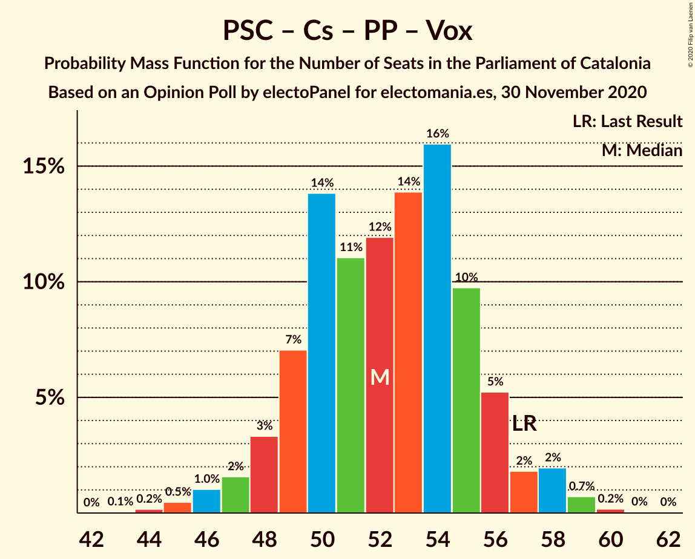

# Opinion Poll by electoPanel for electomania.es, 30 November 2020

<a href="#voting-intentions">Voting Intentions</a> | <a href="#seats">Seats</a> | <a href="#coalitions">Coalitions</a> | <a href="#technical-information">Technical Information</a>

## Voting Intentions

### Confidence Intervals

| Party | Last Result | Poll Result | 80% Confidence Interval | 90% Confidence Interval | 95% Confidence Interval | 99% Confidence Interval |
|:-----:|:-----------:|:-----------:|:-----------------------:|:-----------------------:|:-----------------------:|:-----------------------:|
| Esquerra Republicana–Catalunya Sí | 21.4% | 23.2% | 21.4–25.2% |20.9–25.7% |20.4–26.2% |19.6–27.2% |
| Junts per Catalunya | 21.7% | 20.2% | 18.5–22.1% |18.0–22.7% |17.6–23.2% |16.8–24.1% |
| Partit dels Socialistes de Catalunya (PSC-PSOE) | 13.9% | 18.2% | 16.5–20.0% |16.0–20.5% |15.7–21.0% |14.9–21.9% |
| Ciutadans–Partido de la Ciudadanía | 25.4% | 9.8% | 8.6–11.3% |8.2–11.7% |8.0–12.1% |7.4–12.8% |
| Catalunya en Comú–Podem | 7.5% | 7.7% | 6.6–9.1% |6.3–9.4% |6.1–9.8% |5.6–10.5% |
| Partit Popular | 4.2% | 6.7% | 5.7–8.0% |5.5–8.4% |5.2–8.7% |4.8–9.3% |
| Vox | 0.0% | 5.3% | 4.4–6.4% |4.1–6.8% |3.9–7.0% |3.6–7.6% |
| Candidatura d’Unitat Popular | 4.5% | 5.2% | 4.3–6.3% |4.0–6.6% |3.8–6.9% |3.5–7.5% |
| Partit Demòcrata Europeu Català | 0.0% | 1.7% | 1.3–2.5% |1.1–2.7% |1.0–2.9% |0.8–3.3% |

*Note:* The poll result column reflects the actual value used in the calculations. Published results may vary slightly, and in addition be rounded to fewer digits.

## Seats

### Confidence Intervals

| Party | Last Result | Median | 80% Confidence Interval | 90% Confidence Interval | 95% Confidence Interval | 99% Confidence Interval |
|:-----:|:-----------:|:------:|:-----------------------:|:-----------------------:|:-----------------------:|:-----------------------:|
| <a href="#esquerra-republicana–catalunya-sí">Esquerra Republicana–Catalunya Sí</a> | 32 | 35 | 32–38 |31–39 |31–40 |29–42 |
| <a href="#junts-per-catalunya">Junts per Catalunya</a> | 34 | 32 | 29–35 |28–37 |28–37 |26–38 |
| <a href="#partit-dels-socialistes-de-catalunya-(psc-psoe)">Partit dels Socialistes de Catalunya (PSC-PSOE)</a> | 17 | 24 | 22–26 |22–28 |21–28 |19–30 |
| <a href="#ciutadans–partido-de-la-ciudadanía">Ciutadans–Partido de la Ciudadanía</a> | 36 | 13 | 12–14 |11–16 |10–16 |9–18 |
| <a href="#catalunya-en-comú–podem">Catalunya en Comú–Podem</a> | 8 | 9 | 7–11 |7–11 |6–12 |5–13 |
| <a href="#partit-popular">Partit Popular</a> | 4 | 9 | 7–10 |7–11 |6–12 |5–12 |
| <a href="#vox">Vox</a> | 0 | 7 | 5–8 |4–8 |3–9 |3–10 |
| <a href="#candidatura-d’unitat-popular">Candidatura d’Unitat Popular</a> | 4 | 7 | 4–8 |4–8 |4–9 |3–9 |
| <a href="#partit-demòcrata-europeu-català">Partit Demòcrata Europeu Català</a> | 0 | 0 | 0 |0 |0–1 |0–1 |

### Esquerra Republicana–Catalunya Sí

*For a full overview of the results for this party, see the [Esquerra Republicana–Catalunya Sí](party-esquerrarepublicana–catalunyasí.html) page.*

| Number of Seats | Probability | Accumulated | Special Marks |
|:---------------:|:-----------:|:-----------:|:-------------:|
| 28 | 0.1% | 100% |  |
| 29 | 0.5% | 99.8% |  |
| 30 | 2% | 99.3% |  |
| 31 | 5% | 98% |  |
| 32 | 9% | 92% | Last Result |
| 33 | 8% | 83% |  |
| 34 | 13% | 75% |  |
| 35 | 25% | 62% | Median |
| 36 | 11% | 37% |  |
| 37 | 11% | 26% |  |
| 38 | 10% | 15% |  |
| 39 | 2% | 5% |  |
| 40 | 2% | 3% |  |
| 41 | 0.8% | 1.4% |  |
| 42 | 0.5% | 0.6% |  |
| 43 | 0.1% | 0.1% |  |
| 44 | 0% | 0% |  |

### Junts per Catalunya

*For a full overview of the results for this party, see the [Junts per Catalunya](party-juntspercatalunya.html) page.*

| Number of Seats | Probability | Accumulated | Special Marks |
|:---------------:|:-----------:|:-----------:|:-------------:|
| 25 | 0.1% | 100% |  |
| 26 | 1.4% | 99.8% |  |
| 27 | 0.7% | 98% |  |
| 28 | 4% | 98% |  |
| 29 | 4% | 94% |  |
| 30 | 5% | 90% |  |
| 31 | 23% | 85% |  |
| 32 | 27% | 62% | Median |
| 33 | 10% | 35% |  |
| 34 | 7% | 24% | Last Result |
| 35 | 9% | 18% |  |
| 36 | 3% | 9% |  |
| 37 | 5% | 6% |  |
| 38 | 0.8% | 1.2% |  |
| 39 | 0.3% | 0.4% |  |
| 40 | 0.1% | 0.1% |  |
| 41 | 0% | 0% |  |

### Partit dels Socialistes de Catalunya (PSC-PSOE)

*For a full overview of the results for this party, see the [Partit dels Socialistes de Catalunya (PSC-PSOE)](party-partitdelssocialistesdecatalunyapsc-psoe.html) page.*

| Number of Seats | Probability | Accumulated | Special Marks |
|:---------------:|:-----------:|:-----------:|:-------------:|
| 17 | 0% | 100% | Last Result |
| 18 | 0.3% | 100% |  |
| 19 | 0.3% | 99.7% |  |
| 20 | 2% | 99.4% |  |
| 21 | 2% | 98% |  |
| 22 | 15% | 96% |  |
| 23 | 8% | 81% |  |
| 24 | 26% | 73% | Median |
| 25 | 21% | 47% |  |
| 26 | 17% | 26% |  |
| 27 | 3% | 9% |  |
| 28 | 5% | 6% |  |
| 29 | 0.9% | 2% |  |
| 30 | 0.5% | 0.8% |  |
| 31 | 0.3% | 0.3% |  |
| 32 | 0% | 0% |  |

### Ciutadans–Partido de la Ciudadanía

*For a full overview of the results for this party, see the [Ciutadans–Partido de la Ciudadanía](party-ciutadans–partidodelaciudadanía.html) page.*

| Number of Seats | Probability | Accumulated | Special Marks |
|:---------------:|:-----------:|:-----------:|:-------------:|
| 8 | 0.4% | 100% |  |
| 9 | 2% | 99.6% |  |
| 10 | 2% | 98% |  |
| 11 | 2% | 96% |  |
| 12 | 19% | 94% |  |
| 13 | 50% | 75% | Median |
| 14 | 17% | 26% |  |
| 15 | 4% | 9% |  |
| 16 | 4% | 6% |  |
| 17 | 0.8% | 1.4% |  |
| 18 | 0.6% | 0.6% |  |
| 19 | 0% | 0.1% |  |
| 20 | 0% | 0% |  |
| 21 | 0% | 0% |  |
| 22 | 0% | 0% |  |
| 23 | 0% | 0% |  |
| 24 | 0% | 0% |  |
| 25 | 0% | 0% |  |
| 26 | 0% | 0% |  |
| 27 | 0% | 0% |  |
| 28 | 0% | 0% |  |
| 29 | 0% | 0% |  |
| 30 | 0% | 0% |  |
| 31 | 0% | 0% |  |
| 32 | 0% | 0% |  |
| 33 | 0% | 0% |  |
| 34 | 0% | 0% |  |
| 35 | 0% | 0% |  |
| 36 | 0% | 0% | Last Result |

### Catalunya en Comú–Podem

*For a full overview of the results for this party, see the [Catalunya en Comú–Podem](party-catalunyaencomú–podem.html) page.*

| Number of Seats | Probability | Accumulated | Special Marks |
|:---------------:|:-----------:|:-----------:|:-------------:|
| 5 | 0.8% | 100% |  |
| 6 | 2% | 99.2% |  |
| 7 | 9% | 97% |  |
| 8 | 31% | 88% | Last Result |
| 9 | 25% | 57% | Median |
| 10 | 19% | 32% |  |
| 11 | 10% | 13% |  |
| 12 | 2% | 3% |  |
| 13 | 0.3% | 0.6% |  |
| 14 | 0.2% | 0.2% |  |
| 15 | 0% | 0% |  |

### Partit Popular

*For a full overview of the results for this party, see the [Partit Popular](party-partitpopular.html) page.*

| Number of Seats | Probability | Accumulated | Special Marks |
|:---------------:|:-----------:|:-----------:|:-------------:|
| 4 | 0% | 100% | Last Result |
| 5 | 2% | 100% |  |
| 6 | 1.5% | 98% |  |
| 7 | 24% | 97% |  |
| 8 | 19% | 73% |  |
| 9 | 27% | 54% | Median |
| 10 | 21% | 28% |  |
| 11 | 2% | 6% |  |
| 12 | 4% | 4% |  |
| 13 | 0.2% | 0.3% |  |
| 14 | 0.1% | 0.1% |  |
| 15 | 0% | 0% |  |

### Vox

*For a full overview of the results for this party, see the [Vox](party-vox.html) page.*

| Number of Seats | Probability | Accumulated | Special Marks |
|:---------------:|:-----------:|:-----------:|:-------------:|
| 0 | 0% | 100% | Last Result |
| 1 | 0% | 100% |  |
| 2 | 0.1% | 100% |  |
| 3 | 3% | 99.9% |  |
| 4 | 3% | 97% |  |
| 5 | 28% | 93% |  |
| 6 | 11% | 65% |  |
| 7 | 43% | 55% | Median |
| 8 | 7% | 12% |  |
| 9 | 4% | 5% |  |
| 10 | 0.7% | 0.8% |  |
| 11 | 0.1% | 0.1% |  |
| 12 | 0% | 0% |  |

### Candidatura d’Unitat Popular

*For a full overview of the results for this party, see the [Candidatura d’Unitat Popular](party-candidaturad’unitatpopular.html) page.*

| Number of Seats | Probability | Accumulated | Special Marks |
|:---------------:|:-----------:|:-----------:|:-------------:|
| 2 | 0.2% | 100% |  |
| 3 | 2% | 99.8% |  |
| 4 | 14% | 98% | Last Result |
| 5 | 14% | 85% |  |
| 6 | 10% | 70% |  |
| 7 | 22% | 60% | Median |
| 8 | 35% | 39% |  |
| 9 | 3% | 3% |  |
| 10 | 0.2% | 0.4% |  |
| 11 | 0.2% | 0.2% |  |
| 12 | 0% | 0% |  |

### Partit Demòcrata Europeu Català

*For a full overview of the results for this party, see the [Partit Demòcrata Europeu Català](party-partitdemòcrataeuropeucatalà.html) page.*

| Number of Seats | Probability | Accumulated | Special Marks |
|:---------------:|:-----------:|:-----------:|:-------------:|
| 0 | 95% | 100% | Last Result, Median |
| 1 | 5% | 5% |  |
| 2 | 0% | 0.3% |  |
| 3 | 0.2% | 0.3% |  |
| 4 | 0% | 0.1% |  |
| 5 | 0% | 0% |  |

## Coalitions

### Confidence Intervals

| Coalition | Last Result | Median | Majority? | 80% Confidence Interval | 90% Confidence Interval | 95% Confidence Interval | 99% Confidence Interval |
|:---------:|:-----------:|:------:|:---------:|:-----------------------:|:-----------------------:|:-----------------------:|:-----------------------:|
| Esquerra Republicana–Catalunya Sí – Junts per Catalunya – Catalunya en Comú–Podem | 74 | 76 | 99.9% | 73–80 | 72–81 | 71–81 | 69–83 |
| Esquerra Republicana–Catalunya Sí – Junts per Catalunya – Candidatura d’Unitat Popular | 70 | 74 | 99.2% | 70–77 | 70–78 | 69–79 | 67–81 |
| Esquerra Republicana–Catalunya Sí – Junts per Catalunya – Candidatura d’Unitat Popular – Partit Demòcrata Europeu Català | 70 | 74 | 99.2% | 71–77 | 70–78 | 69–79 | 67–81 |
| Esquerra Republicana–Catalunya Sí – Partit dels Socialistes de Catalunya (PSC-PSOE) – Catalunya en Comú–Podem | 57 | 68 | 56% | 65–71 | 64–73 | 63–74 | 62–75 |
| Esquerra Republicana–Catalunya Sí – Junts per Catalunya | 66 | 67 | 42% | 64–71 | 63–72 | 62–73 | 60–74 |
| Esquerra Republicana–Catalunya Sí – Junts per Catalunya – Partit Demòcrata Europeu Català | 66 | 67 | 43% | 64–71 | 63–72 | 62–73 | 60–74 |
| Partit dels Socialistes de Catalunya (PSC-PSOE) – Ciutadans–Partido de la Ciudadanía – Catalunya en Comú–Podem – Partit Popular | 65 | 55 | 0% | 52–58 | 51–59 | 50–60 | 48–62 |
| Partit dels Socialistes de Catalunya (PSC-PSOE) – Ciutadans–Partido de la Ciudadanía – Partit Popular – Vox | 57 | 52 | 0% | 49–55 | 48–56 | 47–58 | 45–59 |
| Partit dels Socialistes de Catalunya (PSC-PSOE) – Ciutadans–Partido de la Ciudadanía – Partit Popular | 57 | 46 | 0% | 43–49 | 42–50 | 41–51 | 40–52 |
| Esquerra Republicana–Catalunya Sí – Catalunya en Comú–Podem | 40 | 44 | 0% | 41–47 | 40–48 | 39–49 | 37–51 |

### Esquerra Republicana–Catalunya Sí – Junts per Catalunya – Catalunya en Comú–Podem

| Number of Seats | Probability | Accumulated | Special Marks |
|:---------------:|:-----------:|:-----------:|:-------------:|
| 67 | 0% | 100% |  |
| 68 | 0.2% | 99.9% | Majority |
| 69 | 0.6% | 99.7% |  |
| 70 | 0.9% | 99.2% |  |
| 71 | 2% | 98% |  |
| 72 | 3% | 96% |  |
| 73 | 10% | 93% |  |
| 74 | 14% | 83% | Last Result |
| 75 | 11% | 69% |  |
| 76 | 10% | 58% | Median |
| 77 | 21% | 48% |  |
| 78 | 11% | 27% |  |
| 79 | 6% | 16% |  |
| 80 | 5% | 10% |  |
| 81 | 3% | 5% |  |
| 82 | 1.4% | 2% |  |
| 83 | 0.4% | 0.7% |  |
| 84 | 0.2% | 0.3% |  |
| 85 | 0.1% | 0.1% |  |
| 86 | 0% | 0% |  |

### Esquerra Republicana–Catalunya Sí – Junts per Catalunya – Candidatura d’Unitat Popular

| Number of Seats | Probability | Accumulated | Special Marks |
|:---------------:|:-----------:|:-----------:|:-------------:|
| 65 | 0.1% | 100% |  |
| 66 | 0.2% | 99.9% |  |
| 67 | 0.5% | 99.7% |  |
| 68 | 1.3% | 99.2% | Majority |
| 69 | 2% | 98% |  |
| 70 | 5% | 95% | Last Result |
| 71 | 13% | 90% |  |
| 72 | 7% | 77% |  |
| 73 | 16% | 70% |  |
| 74 | 16% | 54% | Median |
| 75 | 15% | 38% |  |
| 76 | 8% | 23% |  |
| 77 | 6% | 14% |  |
| 78 | 5% | 8% |  |
| 79 | 2% | 4% |  |
| 80 | 0.9% | 2% |  |
| 81 | 0.7% | 0.9% |  |
| 82 | 0.1% | 0.2% |  |
| 83 | 0.1% | 0.1% |  |
| 84 | 0% | 0% |  |

### Esquerra Republicana–Catalunya Sí – Junts per Catalunya – Candidatura d’Unitat Popular – Partit Demòcrata Europeu Català

| Number of Seats | Probability | Accumulated | Special Marks |
|:---------------:|:-----------:|:-----------:|:-------------:|
| 65 | 0.1% | 100% |  |
| 66 | 0.2% | 99.9% |  |
| 67 | 0.5% | 99.7% |  |
| 68 | 1.3% | 99.2% | Majority |
| 69 | 2% | 98% |  |
| 70 | 5% | 96% | Last Result |
| 71 | 13% | 90% |  |
| 72 | 7% | 77% |  |
| 73 | 16% | 70% |  |
| 74 | 16% | 55% | Median |
| 75 | 15% | 39% |  |
| 76 | 9% | 24% |  |
| 77 | 6% | 15% |  |
| 78 | 5% | 9% |  |
| 79 | 2% | 4% |  |
| 80 | 1.0% | 2% |  |
| 81 | 0.7% | 0.9% |  |
| 82 | 0.1% | 0.2% |  |
| 83 | 0.1% | 0.1% |  |
| 84 | 0% | 0% |  |

### Esquerra Republicana–Catalunya Sí – Partit dels Socialistes de Catalunya (PSC-PSOE) – Catalunya en Comú–Podem

| Number of Seats | Probability | Accumulated | Special Marks |
|:---------------:|:-----------:|:-----------:|:-------------:|
| 57 | 0% | 100% | Last Result |
| 58 | 0% | 100% |  |
| 59 | 0% | 100% |  |
| 60 | 0.2% | 100% |  |
| 61 | 0.3% | 99.8% |  |
| 62 | 0.7% | 99.5% |  |
| 63 | 1.4% | 98.9% |  |
| 64 | 3% | 97% |  |
| 65 | 7% | 94% |  |
| 66 | 8% | 87% |  |
| 67 | 23% | 79% |  |
| 68 | 11% | 56% | Median, Majority |
| 69 | 12% | 45% |  |
| 70 | 16% | 33% |  |
| 71 | 7% | 17% |  |
| 72 | 4% | 9% |  |
| 73 | 3% | 6% |  |
| 74 | 2% | 3% |  |
| 75 | 0.6% | 1.0% |  |
| 76 | 0.3% | 0.4% |  |
| 77 | 0.1% | 0.2% |  |
| 78 | 0% | 0% |  |

### Esquerra Republicana–Catalunya Sí – Junts per Catalunya

| Number of Seats | Probability | Accumulated | Special Marks |
|:---------------:|:-----------:|:-----------:|:-------------:|
| 58 | 0% | 100% |  |
| 59 | 0.1% | 99.9% |  |
| 60 | 0.5% | 99.9% |  |
| 61 | 1.1% | 99.3% |  |
| 62 | 1.5% | 98% |  |
| 63 | 6% | 97% |  |
| 64 | 6% | 91% |  |
| 65 | 14% | 85% |  |
| 66 | 13% | 71% | Last Result |
| 67 | 16% | 58% | Median |
| 68 | 9% | 42% | Majority |
| 69 | 17% | 34% |  |
| 70 | 4% | 16% |  |
| 71 | 3% | 12% |  |
| 72 | 5% | 8% |  |
| 73 | 3% | 4% |  |
| 74 | 0.5% | 0.8% |  |
| 75 | 0.2% | 0.4% |  |
| 76 | 0.1% | 0.1% |  |
| 77 | 0% | 0% |  |

### Esquerra Republicana–Catalunya Sí – Junts per Catalunya – Partit Demòcrata Europeu Català

| Number of Seats | Probability | Accumulated | Special Marks |
|:---------------:|:-----------:|:-----------:|:-------------:|
| 58 | 0% | 100% |  |
| 59 | 0.1% | 99.9% |  |
| 60 | 0.5% | 99.9% |  |
| 61 | 1.1% | 99.4% |  |
| 62 | 1.2% | 98% |  |
| 63 | 6% | 97% |  |
| 64 | 5% | 91% |  |
| 65 | 13% | 86% |  |
| 66 | 13% | 72% | Last Result |
| 67 | 17% | 60% | Median |
| 68 | 9% | 43% | Majority |
| 69 | 17% | 34% |  |
| 70 | 5% | 17% |  |
| 71 | 4% | 12% |  |
| 72 | 5% | 8% |  |
| 73 | 3% | 4% |  |
| 74 | 0.5% | 0.9% |  |
| 75 | 0.3% | 0.4% |  |
| 76 | 0.1% | 0.1% |  |
| 77 | 0% | 0% |  |

### Partit dels Socialistes de Catalunya (PSC-PSOE) – Ciutadans–Partido de la Ciudadanía – Catalunya en Comú–Podem – Partit Popular

| Number of Seats | Probability | Accumulated | Special Marks |
|:---------------:|:-----------:|:-----------:|:-------------:|
| 47 | 0.2% | 100% |  |
| 48 | 0.5% | 99.7% |  |
| 49 | 2% | 99.2% |  |
| 50 | 1.4% | 98% |  |
| 51 | 4% | 96% |  |
| 52 | 10% | 92% |  |
| 53 | 12% | 82% |  |
| 54 | 14% | 70% |  |
| 55 | 15% | 56% | Median |
| 56 | 13% | 42% |  |
| 57 | 11% | 29% |  |
| 58 | 10% | 18% |  |
| 59 | 6% | 8% |  |
| 60 | 1.4% | 3% |  |
| 61 | 0.6% | 1.1% |  |
| 62 | 0.2% | 0.5% |  |
| 63 | 0.3% | 0.3% |  |
| 64 | 0% | 0% |  |
| 65 | 0% | 0% | Last Result |

### Partit dels Socialistes de Catalunya (PSC-PSOE) – Ciutadans–Partido de la Ciudadanía – Partit Popular – Vox

| Number of Seats | Probability | Accumulated | Special Marks |
|:---------------:|:-----------:|:-----------:|:-------------:|
| 43 | 0.1% | 100% |  |
| 44 | 0.2% | 99.9% |  |
| 45 | 0.5% | 99.8% |  |
| 46 | 1.0% | 99.3% |  |
| 47 | 2% | 98% |  |
| 48 | 3% | 97% |  |
| 49 | 7% | 93% |  |
| 50 | 14% | 86% |  |
| 51 | 11% | 73% |  |
| 52 | 12% | 61% |  |
| 53 | 14% | 50% | Median |
| 54 | 16% | 36% |  |
| 55 | 10% | 20% |  |
| 56 | 5% | 10% |  |
| 57 | 2% | 5% | Last Result |
| 58 | 2% | 3% |  |
| 59 | 0.7% | 1.0% |  |
| 60 | 0.2% | 0.3% |  |
| 61 | 0% | 0.1% |  |
| 62 | 0% | 0% |  |

### Partit dels Socialistes de Catalunya (PSC-PSOE) – Ciutadans–Partido de la Ciudadanía – Partit Popular

| Number of Seats | Probability | Accumulated | Special Marks |
|:---------------:|:-----------:|:-----------:|:-------------:|
| 38 | 0.1% | 100% |  |
| 39 | 0.3% | 99.9% |  |
| 40 | 1.2% | 99.5% |  |
| 41 | 2% | 98% |  |
| 42 | 2% | 96% |  |
| 43 | 13% | 95% |  |
| 44 | 14% | 82% |  |
| 45 | 7% | 68% |  |
| 46 | 15% | 62% | Median |
| 47 | 20% | 47% |  |
| 48 | 8% | 26% |  |
| 49 | 10% | 18% |  |
| 50 | 6% | 8% |  |
| 51 | 1.2% | 3% |  |
| 52 | 0.9% | 1.4% |  |
| 53 | 0.3% | 0.4% |  |
| 54 | 0.1% | 0.1% |  |
| 55 | 0% | 0% |  |
| 56 | 0% | 0% |  |
| 57 | 0% | 0% | Last Result |

### Esquerra Republicana–Catalunya Sí – Catalunya en Comú–Podem

| Number of Seats | Probability | Accumulated | Special Marks |
|:---------------:|:-----------:|:-----------:|:-------------:|
| 36 | 0.1% | 100% |  |
| 37 | 0.4% | 99.9% |  |
| 38 | 1.2% | 99.4% |  |
| 39 | 2% | 98% |  |
| 40 | 4% | 96% | Last Result |
| 41 | 11% | 92% |  |
| 42 | 12% | 81% |  |
| 43 | 11% | 70% |  |
| 44 | 12% | 58% | Median |
| 45 | 21% | 46% |  |
| 46 | 15% | 25% |  |
| 47 | 4% | 10% |  |
| 48 | 2% | 6% |  |
| 49 | 2% | 4% |  |
| 50 | 1.2% | 2% |  |
| 51 | 0.5% | 0.7% |  |
| 52 | 0.1% | 0.2% |  |
| 53 | 0% | 0% |  |

## Technical Information

### Opinion Poll

+ **Polling firm:** electoPanel
+ **Commissioner(s):** electomania.es
+ **Fieldwork period:** 30 November 2020

### Calculations

+ **Sample size:** 815
+ **Simulations done:** 1,048,576
+ **Error estimate:** 2.58%

