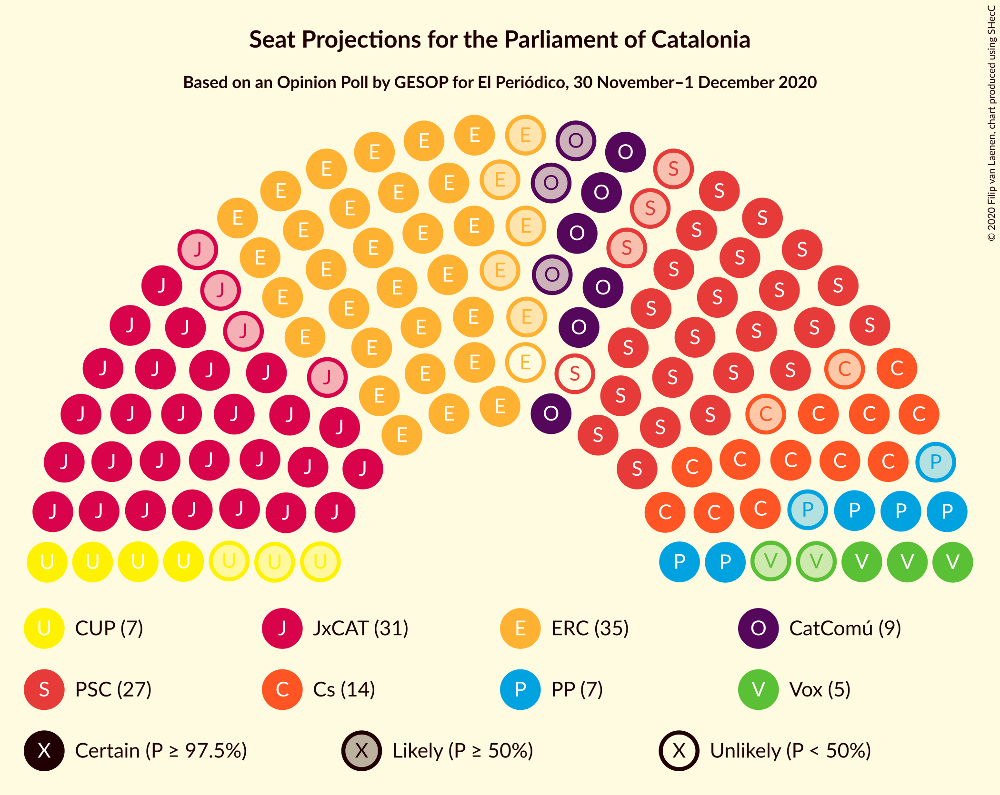
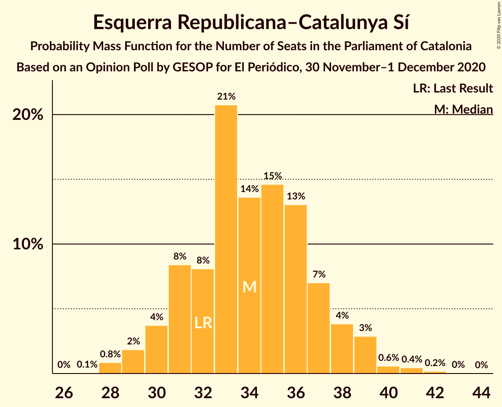

# Opinion Poll by GESOP for El Periódico, 30 November–1 December 2020

<a href="#voting-intentions">Voting Intentions</a> | <a href="#seats">Seats</a> | <a href="#coalitions">Coalitions</a> | <a href="#technical-information">Technical Information</a>

## Voting Intentions

### Confidence Intervals

| Party | Last Result | Poll Result | 80% Confidence Interval | 90% Confidence Interval | 95% Confidence Interval | 99% Confidence Interval |
|:-----:|:-----------:|:-----------:|:-----------------------:|:-----------------------:|:-----------------------:|:-----------------------:|
| Esquerra Republicana–Catalunya Sí | 21.4% | 22.0% | 20.2–23.9% |19.7–24.5% |19.2–25.0% |18.4–25.9% |
| Junts per Catalunya | 21.7% | 19.4% | 17.6–21.2% |17.2–21.8% |16.8–22.2% |16.0–23.2% |
| Partit dels Socialistes de Catalunya (PSC-PSOE) | 13.9% | 18.9% | 17.2–20.7% |16.7–21.2% |16.3–21.7% |15.5–22.6% |
| Ciutadans–Partido de la Ciudadanía | 25.4% | 10.6% | 9.3–12.1% |9.0–12.6% |8.7–12.9% |8.1–13.7% |
| Catalunya en Comú–Podem | 7.5% | 7.5% | 6.4–8.8% |6.1–9.2% |5.9–9.5% |5.4–10.2% |
| Partit Popular | 4.2% | 5.9% | 4.9–7.1% |4.7–7.4% |4.4–7.7% |4.0–8.3% |
| Candidatura d’Unitat Popular | 4.5% | 5.0% | 4.1–6.1% |3.9–6.4% |3.7–6.7% |3.3–7.3% |
| Vox | 0.0% | 4.5% | 3.7–5.6% |3.4–5.9% |3.3–6.2% |2.9–6.7% |
| Partit Demòcrata Europeu Català | 0.0% | 2.4% | 1.8–3.2% |1.6–3.5% |1.5–3.7% |1.3–4.1% |

*Note:* The poll result column reflects the actual value used in the calculations. Published results may vary slightly, and in addition be rounded to fewer digits.

## Seats

### Confidence Intervals

| Party | Last Result | Median | 80% Confidence Interval | 90% Confidence Interval | 95% Confidence Interval | 99% Confidence Interval |
|:-----:|:-----------:|:------:|:-----------------------:|:-----------------------:|:-----------------------:|:-----------------------:|
| <a href="#esquerra-republicana–catalunya-sí">Esquerra Republicana–Catalunya Sí</a> | 32 | 34 | 31–37 |30–38 |29–39 |28–41 |
| <a href="#junts-per-catalunya">Junts per Catalunya</a> | 34 | 31 | 29–35 |28–36 |27–37 |26–38 |
| <a href="#partit-dels-socialistes-de-catalunya-(psc-psoe)">Partit dels Socialistes de Catalunya (PSC-PSOE)</a> | 17 | 26 | 24–29 |24–30 |23–30 |21–31 |
| <a href="#ciutadans–partido-de-la-ciudadanía">Ciutadans–Partido de la Ciudadanía</a> | 36 | 14 | 13–17 |12–18 |12–18 |11–19 |
| <a href="#catalunya-en-comú–podem">Catalunya en Comú–Podem</a> | 8 | 9 | 7–11 |7–11 |6–11 |5–13 |
| <a href="#partit-popular">Partit Popular</a> | 4 | 7 | 6–9 |5–10 |5–10 |3–12 |
| <a href="#candidatura-d’unitat-popular">Candidatura d’Unitat Popular</a> | 4 | 7 | 4–8 |4–8 |4–9 |3–9 |
| <a href="#vox">Vox</a> | 0 | 5 | 3–7 |3–7 |3–7 |2–9 |
| <a href="#partit-demòcrata-europeu-català">Partit Demòcrata Europeu Català</a> | 0 | 0 | 0–1 |0–2 |0–4 |0–5 |

### Esquerra Republicana–Catalunya Sí

*For a full overview of the results for this party, see the [Esquerra Republicana–Catalunya Sí](party-esquerrarepublicana–catalunyasí.html) page.*

| Number of Seats | Probability | Accumulated | Special Marks |
|:---------------:|:-----------:|:-----------:|:-------------:|
| 27 | 0.1% | 100% |  |
| 28 | 0.8% | 99.9% |  |
| 29 | 2% | 99.1% |  |
| 30 | 4% | 97% |  |
| 31 | 8% | 93% |  |
| 32 | 8% | 85% | Last Result |
| 33 | 21% | 77% |  |
| 34 | 14% | 56% | Median |
| 35 | 15% | 43% |  |
| 36 | 13% | 28% |  |
| 37 | 7% | 15% |  |
| 38 | 4% | 8% |  |
| 39 | 3% | 4% |  |
| 40 | 0.6% | 1.2% |  |
| 41 | 0.4% | 0.7% |  |
| 42 | 0.2% | 0.2% |  |
| 43 | 0% | 0% |  |

### Junts per Catalunya

*For a full overview of the results for this party, see the [Junts per Catalunya](party-juntspercatalunya.html) page.*

| Number of Seats | Probability | Accumulated | Special Marks |
|:---------------:|:-----------:|:-----------:|:-------------:|
| 24 | 0.1% | 100% |  |
| 25 | 0.3% | 99.9% |  |
| 26 | 2% | 99.6% |  |
| 27 | 2% | 98% |  |
| 28 | 2% | 96% |  |
| 29 | 7% | 94% |  |
| 30 | 7% | 87% |  |
| 31 | 34% | 80% | Median |
| 32 | 19% | 46% |  |
| 33 | 10% | 26% |  |
| 34 | 5% | 16% | Last Result |
| 35 | 6% | 11% |  |
| 36 | 3% | 6% |  |
| 37 | 2% | 3% |  |
| 38 | 0.5% | 0.7% |  |
| 39 | 0.1% | 0.2% |  |
| 40 | 0.1% | 0.1% |  |
| 41 | 0% | 0% |  |

### Partit dels Socialistes de Catalunya (PSC-PSOE)

*For a full overview of the results for this party, see the [Partit dels Socialistes de Catalunya (PSC-PSOE)](party-partitdelssocialistesdecatalunyapsc-psoe.html) page.*

| Number of Seats | Probability | Accumulated | Special Marks |
|:---------------:|:-----------:|:-----------:|:-------------:|
| 17 | 0% | 100% | Last Result |
| 18 | 0% | 100% |  |
| 19 | 0% | 100% |  |
| 20 | 0.2% | 99.9% |  |
| 21 | 0.2% | 99.7% |  |
| 22 | 1.1% | 99.5% |  |
| 23 | 1.3% | 98% |  |
| 24 | 8% | 97% |  |
| 25 | 24% | 89% |  |
| 26 | 22% | 66% | Median |
| 27 | 23% | 44% |  |
| 28 | 8% | 21% |  |
| 29 | 6% | 13% |  |
| 30 | 4% | 6% |  |
| 31 | 1.3% | 2% |  |
| 32 | 0.3% | 0.5% |  |
| 33 | 0.1% | 0.2% |  |
| 34 | 0% | 0% |  |

### Ciutadans–Partido de la Ciudadanía

*For a full overview of the results for this party, see the [Ciutadans–Partido de la Ciudadanía](party-ciutadans–partidodelaciudadanía.html) page.*

| Number of Seats | Probability | Accumulated | Special Marks |
|:---------------:|:-----------:|:-----------:|:-------------:|
| 9 | 0.1% | 100% |  |
| 10 | 0.2% | 99.9% |  |
| 11 | 0.4% | 99.7% |  |
| 12 | 6% | 99.3% |  |
| 13 | 30% | 93% |  |
| 14 | 34% | 63% | Median |
| 15 | 6% | 29% |  |
| 16 | 12% | 23% |  |
| 17 | 4% | 11% |  |
| 18 | 6% | 7% |  |
| 19 | 0.8% | 1.0% |  |
| 20 | 0.1% | 0.1% |  |
| 21 | 0% | 0% |  |
| 22 | 0% | 0% |  |
| 23 | 0% | 0% |  |
| 24 | 0% | 0% |  |
| 25 | 0% | 0% |  |
| 26 | 0% | 0% |  |
| 27 | 0% | 0% |  |
| 28 | 0% | 0% |  |
| 29 | 0% | 0% |  |
| 30 | 0% | 0% |  |
| 31 | 0% | 0% |  |
| 32 | 0% | 0% |  |
| 33 | 0% | 0% |  |
| 34 | 0% | 0% |  |
| 35 | 0% | 0% |  |
| 36 | 0% | 0% | Last Result |

### Catalunya en Comú–Podem

*For a full overview of the results for this party, see the [Catalunya en Comú–Podem](party-catalunyaencomú–podem.html) page.*

| Number of Seats | Probability | Accumulated | Special Marks |
|:---------------:|:-----------:|:-----------:|:-------------:|
| 5 | 1.0% | 100% |  |
| 6 | 2% | 99.0% |  |
| 7 | 9% | 97% |  |
| 8 | 28% | 89% | Last Result |
| 9 | 25% | 60% | Median |
| 10 | 18% | 35% |  |
| 11 | 14% | 17% |  |
| 12 | 1.2% | 2% |  |
| 13 | 0.6% | 0.9% |  |
| 14 | 0.2% | 0.3% |  |
| 15 | 0% | 0% |  |

### Partit Popular

*For a full overview of the results for this party, see the [Partit Popular](party-partitpopular.html) page.*

| Number of Seats | Probability | Accumulated | Special Marks |
|:---------------:|:-----------:|:-----------:|:-------------:|
| 3 | 0.6% | 100% |  |
| 4 | 0.2% | 99.4% | Last Result |
| 5 | 7% | 99.1% |  |
| 6 | 9% | 92% |  |
| 7 | 48% | 83% | Median |
| 8 | 14% | 35% |  |
| 9 | 16% | 22% |  |
| 10 | 4% | 5% |  |
| 11 | 1.2% | 2% |  |
| 12 | 0.5% | 0.6% |  |
| 13 | 0% | 0% |  |

### Candidatura d’Unitat Popular

*For a full overview of the results for this party, see the [Candidatura d’Unitat Popular](party-candidaturad’unitatpopular.html) page.*

| Number of Seats | Probability | Accumulated | Special Marks |
|:---------------:|:-----------:|:-----------:|:-------------:|
| 0 | 0.1% | 100% |  |
| 1 | 0% | 99.9% |  |
| 2 | 0.3% | 99.9% |  |
| 3 | 2% | 99.6% |  |
| 4 | 14% | 98% | Last Result |
| 5 | 7% | 83% |  |
| 6 | 10% | 76% |  |
| 7 | 36% | 66% | Median |
| 8 | 27% | 30% |  |
| 9 | 2% | 3% |  |
| 10 | 0.3% | 0.5% |  |
| 11 | 0.1% | 0.1% |  |
| 12 | 0% | 0% |  |

### Vox

*For a full overview of the results for this party, see the [Vox](party-vox.html) page.*

| Number of Seats | Probability | Accumulated | Special Marks |
|:---------------:|:-----------:|:-----------:|:-------------:|
| 0 | 0.3% | 100% | Last Result |
| 1 | 0% | 99.7% |  |
| 2 | 0.8% | 99.7% |  |
| 3 | 17% | 98.8% |  |
| 4 | 10% | 82% |  |
| 5 | 40% | 72% | Median |
| 6 | 14% | 33% |  |
| 7 | 16% | 18% |  |
| 8 | 0.8% | 2% |  |
| 9 | 0.8% | 0.9% |  |
| 10 | 0.1% | 0.1% |  |
| 11 | 0% | 0% |  |

### Partit Demòcrata Europeu Català

*For a full overview of the results for this party, see the [Partit Demòcrata Europeu Català](party-partitdemòcrataeuropeucatalà.html) page.*

| Number of Seats | Probability | Accumulated | Special Marks |
|:---------------:|:-----------:|:-----------:|:-------------:|
| 0 | 52% | 100% | Last Result, Median |
| 1 | 41% | 48% |  |
| 2 | 2% | 7% |  |
| 3 | 1.0% | 5% |  |
| 4 | 2% | 4% |  |
| 5 | 2% | 2% |  |
| 6 | 0.3% | 0.3% |  |
| 7 | 0% | 0% |  |

## Coalitions

### Confidence Intervals

| Coalition | Last Result | Median | Majority? | 80% Confidence Interval | 90% Confidence Interval | 95% Confidence Interval | 99% Confidence Interval |
|:---------:|:-----------:|:------:|:---------:|:-----------------------:|:-----------------------:|:-----------------------:|:-----------------------:|
| Esquerra Republicana–Catalunya Sí – Junts per Catalunya – Catalunya en Comú–Podem | 74 | 74 | 99.4% | 71–79 | 70–80 | 69–80 | 67–82 |
| Esquerra Republicana–Catalunya Sí – Junts per Catalunya – Candidatura d’Unitat Popular – Partit Demòcrata Europeu Català | 70 | 73 | 98% | 70–76 | 69–77 | 68–78 | 66–80 |
| Esquerra Republicana–Catalunya Sí – Junts per Catalunya – Candidatura d’Unitat Popular | 70 | 72 | 96% | 69–75 | 68–77 | 67–77 | 65–79 |
| Esquerra Republicana–Catalunya Sí – Partit dels Socialistes de Catalunya (PSC-PSOE) – Catalunya en Comú–Podem | 57 | 70 | 78% | 66–72 | 65–73 | 64–74 | 62–76 |
| Esquerra Republicana–Catalunya Sí – Junts per Catalunya – Partit Demòcrata Europeu Català | 66 | 66 | 32% | 63–70 | 62–71 | 61–72 | 59–74 |
| Esquerra Republicana–Catalunya Sí – Junts per Catalunya | 66 | 66 | 26% | 62–69 | 62–71 | 60–71 | 59–73 |
| Partit dels Socialistes de Catalunya (PSC-PSOE) – Ciutadans–Partido de la Ciudadanía – Catalunya en Comú–Podem – Partit Popular | 65 | 57 | 0% | 54–60 | 53–61 | 52–62 | 50–64 |
| Partit dels Socialistes de Catalunya (PSC-PSOE) – Ciutadans–Partido de la Ciudadanía – Partit Popular – Vox | 57 | 53 | 0% | 50–57 | 49–58 | 48–58 | 47–60 |
| Partit dels Socialistes de Catalunya (PSC-PSOE) – Ciutadans–Partido de la Ciudadanía – Partit Popular | 57 | 48 | 0% | 45–51 | 44–52 | 43–53 | 42–55 |
| Esquerra Republicana–Catalunya Sí – Catalunya en Comú–Podem | 40 | 43 | 0% | 40–46 | 39–48 | 38–49 | 36–50 |

### Esquerra Republicana–Catalunya Sí – Junts per Catalunya – Catalunya en Comú–Podem

| Number of Seats | Probability | Accumulated | Special Marks |
|:---------------:|:-----------:|:-----------:|:-------------:|
| 65 | 0% | 100% |  |
| 66 | 0.1% | 99.9% |  |
| 67 | 0.4% | 99.8% |  |
| 68 | 1.5% | 99.4% | Majority |
| 69 | 2% | 98% |  |
| 70 | 1.5% | 96% |  |
| 71 | 8% | 94% |  |
| 72 | 6% | 87% |  |
| 73 | 11% | 81% |  |
| 74 | 21% | 70% | Last Result, Median |
| 75 | 10% | 49% |  |
| 76 | 13% | 39% |  |
| 77 | 10% | 25% |  |
| 78 | 5% | 15% |  |
| 79 | 5% | 10% |  |
| 80 | 3% | 5% |  |
| 81 | 1.4% | 2% |  |
| 82 | 0.3% | 0.5% |  |
| 83 | 0.2% | 0.2% |  |
| 84 | 0% | 0.1% |  |
| 85 | 0% | 0% |  |

### Esquerra Republicana–Catalunya Sí – Junts per Catalunya – Candidatura d’Unitat Popular – Partit Demòcrata Europeu Català

| Number of Seats | Probability | Accumulated | Special Marks |
|:---------------:|:-----------:|:-----------:|:-------------:|
| 64 | 0% | 100% |  |
| 65 | 0.2% | 99.9% |  |
| 66 | 0.6% | 99.7% |  |
| 67 | 1.3% | 99.1% |  |
| 68 | 2% | 98% | Majority |
| 69 | 4% | 96% |  |
| 70 | 8% | 92% | Last Result |
| 71 | 11% | 84% |  |
| 72 | 20% | 73% | Median |
| 73 | 14% | 53% |  |
| 74 | 10% | 39% |  |
| 75 | 14% | 28% |  |
| 76 | 5% | 15% |  |
| 77 | 6% | 10% |  |
| 78 | 2% | 4% |  |
| 79 | 1.2% | 2% |  |
| 80 | 0.5% | 0.8% |  |
| 81 | 0.2% | 0.3% |  |
| 82 | 0.1% | 0.1% |  |
| 83 | 0% | 0% |  |

### Esquerra Republicana–Catalunya Sí – Junts per Catalunya – Candidatura d’Unitat Popular

| Number of Seats | Probability | Accumulated | Special Marks |
|:---------------:|:-----------:|:-----------:|:-------------:|
| 63 | 0.1% | 100% |  |
| 64 | 0.2% | 99.9% |  |
| 65 | 0.4% | 99.7% |  |
| 66 | 0.9% | 99.3% |  |
| 67 | 2% | 98% |  |
| 68 | 3% | 96% | Majority |
| 69 | 8% | 93% |  |
| 70 | 8% | 86% | Last Result |
| 71 | 19% | 78% |  |
| 72 | 16% | 59% | Median |
| 73 | 11% | 43% |  |
| 74 | 11% | 32% |  |
| 75 | 11% | 21% |  |
| 76 | 3% | 10% |  |
| 77 | 4% | 7% |  |
| 78 | 1.2% | 2% |  |
| 79 | 0.6% | 1.1% |  |
| 80 | 0.3% | 0.5% |  |
| 81 | 0.1% | 0.2% |  |
| 82 | 0% | 0.1% |  |
| 83 | 0% | 0% |  |

### Esquerra Republicana–Catalunya Sí – Partit dels Socialistes de Catalunya (PSC-PSOE) – Catalunya en Comú–Podem

| Number of Seats | Probability | Accumulated | Special Marks |
|:---------------:|:-----------:|:-----------:|:-------------:|
| 57 | 0% | 100% | Last Result |
| 58 | 0% | 100% |  |
| 59 | 0% | 100% |  |
| 60 | 0.1% | 100% |  |
| 61 | 0.3% | 99.9% |  |
| 62 | 0.6% | 99.6% |  |
| 63 | 1.2% | 99.0% |  |
| 64 | 2% | 98% |  |
| 65 | 2% | 96% |  |
| 66 | 7% | 93% |  |
| 67 | 9% | 87% |  |
| 68 | 9% | 78% | Majority |
| 69 | 12% | 70% | Median |
| 70 | 25% | 58% |  |
| 71 | 15% | 33% |  |
| 72 | 10% | 18% |  |
| 73 | 4% | 8% |  |
| 74 | 2% | 3% |  |
| 75 | 0.9% | 2% |  |
| 76 | 0.4% | 0.9% |  |
| 77 | 0.3% | 0.5% |  |
| 78 | 0.1% | 0.2% |  |
| 79 | 0.1% | 0.1% |  |
| 80 | 0% | 0% |  |

### Esquerra Republicana–Catalunya Sí – Junts per Catalunya – Partit Demòcrata Europeu Català

| Number of Seats | Probability | Accumulated | Special Marks |
|:---------------:|:-----------:|:-----------:|:-------------:|
| 57 | 0.1% | 100% |  |
| 58 | 0.2% | 99.9% |  |
| 59 | 0.7% | 99.8% |  |
| 60 | 1.0% | 99.1% |  |
| 61 | 1.1% | 98% |  |
| 62 | 3% | 97% |  |
| 63 | 8% | 93% |  |
| 64 | 9% | 86% |  |
| 65 | 18% | 77% | Median |
| 66 | 14% | 59% | Last Result |
| 67 | 13% | 45% |  |
| 68 | 9% | 32% | Majority |
| 69 | 7% | 22% |  |
| 70 | 8% | 16% |  |
| 71 | 4% | 8% |  |
| 72 | 2% | 4% |  |
| 73 | 1.1% | 2% |  |
| 74 | 0.4% | 0.5% |  |
| 75 | 0.1% | 0.2% |  |
| 76 | 0% | 0.1% |  |
| 77 | 0% | 0% |  |

### Esquerra Republicana–Catalunya Sí – Junts per Catalunya

| Number of Seats | Probability | Accumulated | Special Marks |
|:---------------:|:-----------:|:-----------:|:-------------:|
| 56 | 0% | 100% |  |
| 57 | 0.2% | 99.9% |  |
| 58 | 0.2% | 99.8% |  |
| 59 | 1.2% | 99.5% |  |
| 60 | 1.2% | 98% |  |
| 61 | 2% | 97% |  |
| 62 | 7% | 95% |  |
| 63 | 7% | 88% |  |
| 64 | 19% | 81% |  |
| 65 | 11% | 63% | Median |
| 66 | 15% | 52% | Last Result |
| 67 | 11% | 37% |  |
| 68 | 10% | 26% | Majority |
| 69 | 6% | 16% |  |
| 70 | 4% | 10% |  |
| 71 | 3% | 6% |  |
| 72 | 1.0% | 2% |  |
| 73 | 0.9% | 1.1% |  |
| 74 | 0.1% | 0.2% |  |
| 75 | 0.1% | 0.1% |  |
| 76 | 0% | 0% |  |

### Partit dels Socialistes de Catalunya (PSC-PSOE) – Ciutadans–Partido de la Ciudadanía – Catalunya en Comú–Podem – Partit Popular

| Number of Seats | Probability | Accumulated | Special Marks |
|:---------------:|:-----------:|:-----------:|:-------------:|
| 48 | 0.1% | 100% |  |
| 49 | 0.2% | 99.9% |  |
| 50 | 0.4% | 99.7% |  |
| 51 | 0.9% | 99.3% |  |
| 52 | 2% | 98% |  |
| 53 | 3% | 97% |  |
| 54 | 6% | 94% |  |
| 55 | 12% | 87% |  |
| 56 | 12% | 75% | Median |
| 57 | 20% | 63% |  |
| 58 | 24% | 43% |  |
| 59 | 8% | 20% |  |
| 60 | 4% | 12% |  |
| 61 | 4% | 7% |  |
| 62 | 2% | 3% |  |
| 63 | 0.8% | 1.4% |  |
| 64 | 0.4% | 0.6% |  |
| 65 | 0.2% | 0.2% | Last Result |
| 66 | 0.1% | 0.1% |  |
| 67 | 0% | 0% |  |

### Partit dels Socialistes de Catalunya (PSC-PSOE) – Ciutadans–Partido de la Ciudadanía – Partit Popular – Vox

| Number of Seats | Probability | Accumulated | Special Marks |
|:---------------:|:-----------:|:-----------:|:-------------:|
| 45 | 0.1% | 100% |  |
| 46 | 0.2% | 99.9% |  |
| 47 | 1.4% | 99.6% |  |
| 48 | 3% | 98% |  |
| 49 | 3% | 96% |  |
| 50 | 8% | 93% |  |
| 51 | 8% | 84% |  |
| 52 | 17% | 77% | Median |
| 53 | 21% | 59% |  |
| 54 | 12% | 38% |  |
| 55 | 7% | 25% |  |
| 56 | 9% | 19% |  |
| 57 | 5% | 10% | Last Result |
| 58 | 3% | 5% |  |
| 59 | 1.4% | 2% |  |
| 60 | 0.6% | 1.0% |  |
| 61 | 0.3% | 0.4% |  |
| 62 | 0.1% | 0.1% |  |
| 63 | 0% | 0% |  |

### Partit dels Socialistes de Catalunya (PSC-PSOE) – Ciutadans–Partido de la Ciudadanía – Partit Popular

| Number of Seats | Probability | Accumulated | Special Marks |
|:---------------:|:-----------:|:-----------:|:-------------:|
| 40 | 0.1% | 100% |  |
| 41 | 0.2% | 99.9% |  |
| 42 | 0.7% | 99.7% |  |
| 43 | 2% | 99.0% |  |
| 44 | 3% | 97% |  |
| 45 | 8% | 94% |  |
| 46 | 14% | 86% |  |
| 47 | 14% | 72% | Median |
| 48 | 19% | 59% |  |
| 49 | 14% | 40% |  |
| 50 | 12% | 26% |  |
| 51 | 6% | 14% |  |
| 52 | 4% | 8% |  |
| 53 | 2% | 4% |  |
| 54 | 0.8% | 1.5% |  |
| 55 | 0.5% | 0.7% |  |
| 56 | 0.1% | 0.2% |  |
| 57 | 0.1% | 0.1% | Last Result |
| 58 | 0% | 0% |  |

### Esquerra Republicana–Catalunya Sí – Catalunya en Comú–Podem

| Number of Seats | Probability | Accumulated | Special Marks |
|:---------------:|:-----------:|:-----------:|:-------------:|
| 35 | 0.1% | 100% |  |
| 36 | 0.6% | 99.9% |  |
| 37 | 0.9% | 99.3% |  |
| 38 | 3% | 98% |  |
| 39 | 3% | 96% |  |
| 40 | 8% | 92% | Last Result |
| 41 | 10% | 84% |  |
| 42 | 12% | 74% |  |
| 43 | 20% | 61% | Median |
| 44 | 14% | 41% |  |
| 45 | 11% | 28% |  |
| 46 | 8% | 17% |  |
| 47 | 3% | 9% |  |
| 48 | 3% | 5% |  |
| 49 | 2% | 3% |  |
| 50 | 0.6% | 0.8% |  |
| 51 | 0.1% | 0.2% |  |
| 52 | 0% | 0% |  |

## Technical Information

### Opinion Poll

+ **Polling firm:** GESOP
+ **Commissioner(s):** El Periódico
+ **Fieldwork period:** 30 November–1 December 2020

### Calculations

+ **Sample size:** 801
+ **Simulations done:** 1,048,576
+ **Error estimate:** 1.92%

