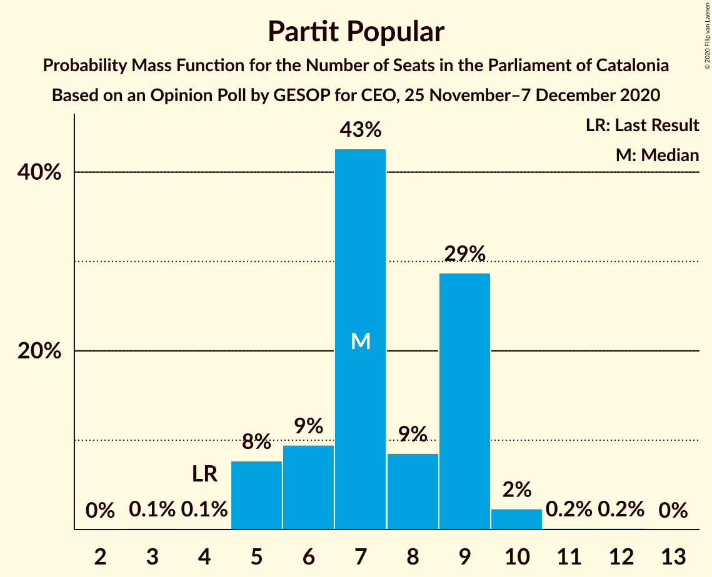

# Opinion Poll by GESOP for CEO, 25 November–7 December 2020

<a href="#voting-intentions">Voting Intentions</a> | <a href="#seats">Seats</a> | <a href="#coalitions">Coalitions</a> | <a href="#technical-information">Technical Information</a>

## Voting Intentions

### Confidence Intervals

| Party | Last Result | Poll Result | 80% Confidence Interval | 90% Confidence Interval | 95% Confidence Interval | 99% Confidence Interval |
|:-----:|:-----------:|:-----------:|:-----------------------:|:-----------------------:|:-----------------------:|:-----------------------:|
| Esquerra Republicana–Catalunya Sí | 21.4% | 23.0% | 21.4–24.8% |20.9–25.3% |20.5–25.7% |19.8–26.6% |
| Junts per Catalunya | 21.7% | 19.6% | 18.1–21.3% |17.6–21.7% |17.3–22.2% |16.6–23.0% |
| Partit dels Socialistes de Catalunya (PSC-PSOE) | 13.9% | 18.5% | 17.0–20.2% |16.6–20.6% |16.3–21.0% |15.6–21.8% |
| Ciutadans–Partido de la Ciudadanía | 25.4% | 11.6% | 10.4–13.0% |10.0–13.3% |9.7–13.7% |9.2–14.4% |
| Catalunya en Comú–Podem | 7.5% | 6.9% | 5.9–8.0% |5.7–8.3% |5.5–8.6% |5.0–9.2% |
| Candidatura d’Unitat Popular | 4.5% | 6.4% | 5.5–7.5% |5.2–7.8% |5.0–8.0% |4.6–8.6% |
| Partit Popular | 4.2% | 6.0% | 5.1–7.0% |4.9–7.3% |4.7–7.6% |4.3–8.2% |
| Vox | 0.0% | 4.6% | 3.9–5.6% |3.7–5.8% |3.5–6.1% |3.2–6.6% |
| Partit Demòcrata Europeu Català | 0.0% | 1.9% | 1.4–2.5% |1.3–2.7% |1.2–2.9% |1.0–3.2% |

*Note:* The poll result column reflects the actual value used in the calculations. Published results may vary slightly, and in addition be rounded to fewer digits.

## Seats

### Confidence Intervals

| Party | Last Result | Median | 80% Confidence Interval | 90% Confidence Interval | 95% Confidence Interval | 99% Confidence Interval |
|:-----:|:-----------:|:------:|:-----------------------:|:-----------------------:|:-----------------------:|:-----------------------:|
| <a href="#esquerra-republicana–catalunya-sí">Esquerra Republicana–Catalunya Sí</a> | 32 | 35 | 32–37 |31–38 |30–39 |29–41 |
| <a href="#junts-per-catalunya">Junts per Catalunya</a> | 34 | 31 | 29–34 |28–35 |26–35 |26–37 |
| <a href="#partit-dels-socialistes-de-catalunya-(psc-psoe)">Partit dels Socialistes de Catalunya (PSC-PSOE)</a> | 17 | 25 | 23–27 |23–28 |22–29 |20–30 |
| <a href="#ciutadans–partido-de-la-ciudadanía">Ciutadans–Partido de la Ciudadanía</a> | 36 | 15 | 13–18 |13–18 |13–18 |13–19 |
| <a href="#catalunya-en-comú–podem">Catalunya en Comú–Podem</a> | 8 | 8 | 6–9 |5–10 |5–10 |5–11 |
| <a href="#candidatura-d’unitat-popular">Candidatura d’Unitat Popular</a> | 4 | 8 | 7–9 |7–10 |6–11 |5–11 |
| <a href="#partit-popular">Partit Popular</a> | 4 | 7 | 6–9 |5–9 |5–10 |5–10 |
| <a href="#vox">Vox</a> | 0 | 5 | 3–7 |3–7 |3–7 |2–8 |
| <a href="#partit-demòcrata-europeu-català">Partit Demòcrata Europeu Català</a> | 0 | 0 | 0 |0–1 |0–1 |0–1 |

### Esquerra Republicana–Catalunya Sí

*For a full overview of the results for this party, see the [Esquerra Republicana–Catalunya Sí](party-esquerrarepublicana–catalunyasí.html) page.*

| Number of Seats | Probability | Accumulated | Special Marks |
|:---------------:|:-----------:|:-----------:|:-------------:|
| 28 | 0.1% | 100% |  |
| 29 | 0.4% | 99.9% |  |
| 30 | 3% | 99.5% |  |
| 31 | 4% | 97% |  |
| 32 | 5% | 93% | Last Result |
| 33 | 8% | 87% |  |
| 34 | 19% | 79% |  |
| 35 | 27% | 60% | Median |
| 36 | 16% | 33% |  |
| 37 | 11% | 18% |  |
| 38 | 3% | 6% |  |
| 39 | 1.3% | 3% |  |
| 40 | 1.0% | 2% |  |
| 41 | 0.4% | 0.5% |  |
| 42 | 0.1% | 0.2% |  |
| 43 | 0% | 0% |  |

### Junts per Catalunya

*For a full overview of the results for this party, see the [Junts per Catalunya](party-juntspercatalunya.html) page.*

| Number of Seats | Probability | Accumulated | Special Marks |
|:---------------:|:-----------:|:-----------:|:-------------:|
| 25 | 0.3% | 100% |  |
| 26 | 2% | 99.7% |  |
| 27 | 1.1% | 97% |  |
| 28 | 4% | 96% |  |
| 29 | 7% | 92% |  |
| 30 | 14% | 85% |  |
| 31 | 32% | 71% | Median |
| 32 | 15% | 40% |  |
| 33 | 11% | 24% |  |
| 34 | 6% | 13% | Last Result |
| 35 | 5% | 7% |  |
| 36 | 1.4% | 2% |  |
| 37 | 0.5% | 0.8% |  |
| 38 | 0.3% | 0.3% |  |
| 39 | 0% | 0% |  |

### Partit dels Socialistes de Catalunya (PSC-PSOE)

*For a full overview of the results for this party, see the [Partit dels Socialistes de Catalunya (PSC-PSOE)](party-partitdelssocialistesdecatalunyapsc-psoe.html) page.*

| Number of Seats | Probability | Accumulated | Special Marks |
|:---------------:|:-----------:|:-----------:|:-------------:|
| 17 | 0% | 100% | Last Result |
| 18 | 0% | 100% |  |
| 19 | 0.1% | 100% |  |
| 20 | 0.7% | 99.9% |  |
| 21 | 0.5% | 99.2% |  |
| 22 | 3% | 98.7% |  |
| 23 | 6% | 95% |  |
| 24 | 23% | 89% |  |
| 25 | 32% | 66% | Median |
| 26 | 21% | 34% |  |
| 27 | 6% | 13% |  |
| 28 | 3% | 7% |  |
| 29 | 2% | 4% |  |
| 30 | 1.1% | 1.4% |  |
| 31 | 0.2% | 0.3% |  |
| 32 | 0% | 0% |  |

### Ciutadans–Partido de la Ciudadanía

*For a full overview of the results for this party, see the [Ciutadans–Partido de la Ciudadanía](party-ciutadans–partidodelaciudadanía.html) page.*

| Number of Seats | Probability | Accumulated | Special Marks |
|:---------------:|:-----------:|:-----------:|:-------------:|
| 12 | 0.4% | 100% |  |
| 13 | 23% | 99.6% |  |
| 14 | 26% | 77% |  |
| 15 | 4% | 51% | Median |
| 16 | 16% | 47% |  |
| 17 | 10% | 31% |  |
| 18 | 20% | 22% |  |
| 19 | 1.4% | 1.5% |  |
| 20 | 0.1% | 0.1% |  |
| 21 | 0% | 0% |  |
| 22 | 0% | 0% |  |
| 23 | 0% | 0% |  |
| 24 | 0% | 0% |  |
| 25 | 0% | 0% |  |
| 26 | 0% | 0% |  |
| 27 | 0% | 0% |  |
| 28 | 0% | 0% |  |
| 29 | 0% | 0% |  |
| 30 | 0% | 0% |  |
| 31 | 0% | 0% |  |
| 32 | 0% | 0% |  |
| 33 | 0% | 0% |  |
| 34 | 0% | 0% |  |
| 35 | 0% | 0% |  |
| 36 | 0% | 0% | Last Result |

### Catalunya en Comú–Podem

*For a full overview of the results for this party, see the [Catalunya en Comú–Podem](party-catalunyaencomú–podem.html) page.*

| Number of Seats | Probability | Accumulated | Special Marks |
|:---------------:|:-----------:|:-----------:|:-------------:|
| 4 | 0.1% | 100% |  |
| 5 | 7% | 99.9% |  |
| 6 | 9% | 93% |  |
| 7 | 21% | 84% |  |
| 8 | 46% | 64% | Last Result, Median |
| 9 | 11% | 17% |  |
| 10 | 5% | 7% |  |
| 11 | 1.3% | 1.4% |  |
| 12 | 0.1% | 0.1% |  |
| 13 | 0% | 0% |  |

### Candidatura d’Unitat Popular

*For a full overview of the results for this party, see the [Candidatura d’Unitat Popular](party-candidaturad’unitatpopular.html) page.*

| Number of Seats | Probability | Accumulated | Special Marks |
|:---------------:|:-----------:|:-----------:|:-------------:|
| 4 | 0.2% | 100% | Last Result |
| 5 | 0.5% | 99.8% |  |
| 6 | 2% | 99.3% |  |
| 7 | 9% | 97% |  |
| 8 | 47% | 88% | Median |
| 9 | 33% | 41% |  |
| 10 | 4% | 8% |  |
| 11 | 4% | 4% |  |
| 12 | 0.1% | 0.2% |  |
| 13 | 0% | 0% |  |

### Partit Popular

*For a full overview of the results for this party, see the [Partit Popular](party-partitpopular.html) page.*

| Number of Seats | Probability | Accumulated | Special Marks |
|:---------------:|:-----------:|:-----------:|:-------------:|
| 3 | 0.1% | 100% |  |
| 4 | 0.1% | 99.9% | Last Result |
| 5 | 8% | 99.7% |  |
| 6 | 9% | 92% |  |
| 7 | 43% | 83% | Median |
| 8 | 9% | 40% |  |
| 9 | 29% | 31% |  |
| 10 | 2% | 3% |  |
| 11 | 0.2% | 0.3% |  |
| 12 | 0.2% | 0.2% |  |
| 13 | 0% | 0% |  |

### Vox

*For a full overview of the results for this party, see the [Vox](party-vox.html) page.*

| Number of Seats | Probability | Accumulated | Special Marks |
|:---------------:|:-----------:|:-----------:|:-------------:|
| 0 | 0.1% | 100% | Last Result |
| 1 | 0% | 99.9% |  |
| 2 | 0.5% | 99.9% |  |
| 3 | 18% | 99.4% |  |
| 4 | 9% | 81% |  |
| 5 | 48% | 73% | Median |
| 6 | 8% | 24% |  |
| 7 | 15% | 16% |  |
| 8 | 0.7% | 1.1% |  |
| 9 | 0.4% | 0.4% |  |
| 10 | 0% | 0% |  |

### Partit Demòcrata Europeu Català

*For a full overview of the results for this party, see the [Partit Demòcrata Europeu Català](party-partitdemòcrataeuropeucatalà.html) page.*

| Number of Seats | Probability | Accumulated | Special Marks |
|:---------------:|:-----------:|:-----------:|:-------------:|
| 0 | 92% | 100% | Last Result, Median |
| 1 | 8% | 8% |  |
| 2 | 0% | 0.2% |  |
| 3 | 0.1% | 0.2% |  |
| 4 | 0.1% | 0.1% |  |
| 5 | 0% | 0% |  |

## Coalitions

### Confidence Intervals

| Coalition | Last Result | Median | Majority? | 80% Confidence Interval | 90% Confidence Interval | 95% Confidence Interval | 99% Confidence Interval |
|:---------:|:-----------:|:------:|:---------:|:-----------------------:|:-----------------------:|:-----------------------:|:-----------------------:|
| Esquerra Republicana–Catalunya Sí – Junts per Catalunya – Candidatura d’Unitat Popular | 70 | 75 | 99.8% | 71–78 | 70–78 | 69–79 | 68–80 |
| Esquerra Republicana–Catalunya Sí – Junts per Catalunya – Candidatura d’Unitat Popular – Partit Demòcrata Europeu Català | 70 | 75 | 99.8% | 71–78 | 70–78 | 69–79 | 68–80 |
| Esquerra Republicana–Catalunya Sí – Junts per Catalunya – Catalunya en Comú–Podem | 74 | 74 | 99.2% | 71–77 | 70–77 | 68–78 | 67–80 |
| Esquerra Republicana–Catalunya Sí – Partit dels Socialistes de Catalunya (PSC-PSOE) – Catalunya en Comú–Podem | 57 | 68 | 54% | 64–70 | 63–71 | 62–72 | 61–74 |
| Esquerra Republicana–Catalunya Sí – Junts per Catalunya – Partit Demòcrata Europeu Català | 66 | 66 | 28% | 63–69 | 62–70 | 61–71 | 60–72 |
| Esquerra Republicana–Catalunya Sí – Junts per Catalunya | 66 | 66 | 27% | 63–69 | 62–70 | 61–70 | 60–72 |
| Partit dels Socialistes de Catalunya (PSC-PSOE) – Ciutadans–Partido de la Ciudadanía – Catalunya en Comú–Podem – Partit Popular | 65 | 55 | 0% | 53–59 | 52–60 | 51–60 | 49–61 |
| Partit dels Socialistes de Catalunya (PSC-PSOE) – Ciutadans–Partido de la Ciudadanía – Partit Popular – Vox | 57 | 53 | 0% | 49–56 | 49–57 | 48–59 | 47–59 |
| Partit dels Socialistes de Catalunya (PSC-PSOE) – Ciutadans–Partido de la Ciudadanía – Partit Popular | 57 | 48 | 0% | 45–51 | 44–52 | 43–52 | 42–53 |
| Esquerra Republicana–Catalunya Sí – Catalunya en Comú–Podem | 40 | 42 | 0% | 40–45 | 38–46 | 37–47 | 37–48 |

### Esquerra Republicana–Catalunya Sí – Junts per Catalunya – Candidatura d’Unitat Popular

| Number of Seats | Probability | Accumulated | Special Marks |
|:---------------:|:-----------:|:-----------:|:-------------:|
| 67 | 0.1% | 100% |  |
| 68 | 0.5% | 99.8% | Majority |
| 69 | 3% | 99.3% |  |
| 70 | 3% | 97% | Last Result |
| 71 | 5% | 94% |  |
| 72 | 7% | 89% |  |
| 73 | 20% | 82% |  |
| 74 | 11% | 62% | Median |
| 75 | 20% | 51% |  |
| 76 | 11% | 31% |  |
| 77 | 5% | 20% |  |
| 78 | 11% | 15% |  |
| 79 | 2% | 4% |  |
| 80 | 0.8% | 1.3% |  |
| 81 | 0.3% | 0.5% |  |
| 82 | 0.1% | 0.2% |  |
| 83 | 0% | 0% |  |

### Esquerra Republicana–Catalunya Sí – Junts per Catalunya – Candidatura d’Unitat Popular – Partit Demòcrata Europeu Català

| Number of Seats | Probability | Accumulated | Special Marks |
|:---------------:|:-----------:|:-----------:|:-------------:|
| 67 | 0.1% | 100% |  |
| 68 | 0.5% | 99.8% | Majority |
| 69 | 2% | 99.3% |  |
| 70 | 3% | 97% | Last Result |
| 71 | 5% | 94% |  |
| 72 | 7% | 90% |  |
| 73 | 18% | 83% |  |
| 74 | 13% | 64% | Median |
| 75 | 18% | 51% |  |
| 76 | 13% | 33% |  |
| 77 | 5% | 21% |  |
| 78 | 11% | 15% |  |
| 79 | 3% | 4% |  |
| 80 | 0.9% | 1.4% |  |
| 81 | 0.3% | 0.5% |  |
| 82 | 0.1% | 0.2% |  |
| 83 | 0% | 0% |  |

### Esquerra Republicana–Catalunya Sí – Junts per Catalunya – Catalunya en Comú–Podem

| Number of Seats | Probability | Accumulated | Special Marks |
|:---------------:|:-----------:|:-----------:|:-------------:|
| 65 | 0% | 100% |  |
| 66 | 0.1% | 99.9% |  |
| 67 | 0.7% | 99.8% |  |
| 68 | 2% | 99.2% | Majority |
| 69 | 2% | 97% |  |
| 70 | 5% | 95% |  |
| 71 | 8% | 90% |  |
| 72 | 8% | 83% |  |
| 73 | 23% | 75% |  |
| 74 | 13% | 52% | Last Result, Median |
| 75 | 14% | 39% |  |
| 76 | 12% | 24% |  |
| 77 | 8% | 12% |  |
| 78 | 2% | 4% |  |
| 79 | 1.5% | 2% |  |
| 80 | 0.8% | 1.0% |  |
| 81 | 0.1% | 0.2% |  |
| 82 | 0% | 0.1% |  |
| 83 | 0% | 0% |  |

### Esquerra Republicana–Catalunya Sí – Partit dels Socialistes de Catalunya (PSC-PSOE) – Catalunya en Comú–Podem

| Number of Seats | Probability | Accumulated | Special Marks |
|:---------------:|:-----------:|:-----------:|:-------------:|
| 57 | 0% | 100% | Last Result |
| 58 | 0% | 100% |  |
| 59 | 0% | 100% |  |
| 60 | 0.2% | 99.9% |  |
| 61 | 0.4% | 99.7% |  |
| 62 | 3% | 99.3% |  |
| 63 | 3% | 96% |  |
| 64 | 5% | 94% |  |
| 65 | 6% | 89% |  |
| 66 | 14% | 83% |  |
| 67 | 15% | 69% |  |
| 68 | 20% | 54% | Median, Majority |
| 69 | 18% | 34% |  |
| 70 | 7% | 16% |  |
| 71 | 4% | 9% |  |
| 72 | 3% | 5% |  |
| 73 | 1.0% | 2% |  |
| 74 | 0.8% | 1.0% |  |
| 75 | 0.2% | 0.3% |  |
| 76 | 0% | 0.1% |  |
| 77 | 0% | 0% |  |

### Esquerra Republicana–Catalunya Sí – Junts per Catalunya – Partit Demòcrata Europeu Català

| Number of Seats | Probability | Accumulated | Special Marks |
|:---------------:|:-----------:|:-----------:|:-------------:|
| 58 | 0.1% | 100% |  |
| 59 | 0.1% | 99.9% |  |
| 60 | 0.9% | 99.8% |  |
| 61 | 3% | 98.9% |  |
| 62 | 3% | 96% |  |
| 63 | 7% | 93% |  |
| 64 | 7% | 86% |  |
| 65 | 20% | 80% |  |
| 66 | 14% | 60% | Last Result, Median |
| 67 | 18% | 45% |  |
| 68 | 11% | 28% | Majority |
| 69 | 10% | 17% |  |
| 70 | 5% | 7% |  |
| 71 | 1.2% | 3% |  |
| 72 | 1.0% | 1.3% |  |
| 73 | 0.2% | 0.3% |  |
| 74 | 0.1% | 0.1% |  |
| 75 | 0% | 0% |  |

### Esquerra Republicana–Catalunya Sí – Junts per Catalunya

| Number of Seats | Probability | Accumulated | Special Marks |
|:---------------:|:-----------:|:-----------:|:-------------:|
| 58 | 0.1% | 100% |  |
| 59 | 0.2% | 99.9% |  |
| 60 | 0.9% | 99.7% |  |
| 61 | 3% | 98.8% |  |
| 62 | 3% | 96% |  |
| 63 | 8% | 93% |  |
| 64 | 6% | 85% |  |
| 65 | 21% | 79% |  |
| 66 | 15% | 58% | Last Result, Median |
| 67 | 16% | 43% |  |
| 68 | 11% | 27% | Majority |
| 69 | 10% | 17% |  |
| 70 | 4% | 6% |  |
| 71 | 1.1% | 2% |  |
| 72 | 1.0% | 1.3% |  |
| 73 | 0.2% | 0.3% |  |
| 74 | 0.1% | 0.1% |  |
| 75 | 0% | 0% |  |

### Partit dels Socialistes de Catalunya (PSC-PSOE) – Ciutadans–Partido de la Ciudadanía – Catalunya en Comú–Podem – Partit Popular

| Number of Seats | Probability | Accumulated | Special Marks |
|:---------------:|:-----------:|:-----------:|:-------------:|
| 48 | 0.1% | 100% |  |
| 49 | 0.7% | 99.8% |  |
| 50 | 0.9% | 99.1% |  |
| 51 | 3% | 98% |  |
| 52 | 5% | 96% |  |
| 53 | 10% | 91% |  |
| 54 | 14% | 81% |  |
| 55 | 19% | 67% | Median |
| 56 | 13% | 49% |  |
| 57 | 17% | 36% |  |
| 58 | 8% | 18% |  |
| 59 | 5% | 10% |  |
| 60 | 4% | 5% |  |
| 61 | 1.0% | 1.3% |  |
| 62 | 0.2% | 0.3% |  |
| 63 | 0.1% | 0.1% |  |
| 64 | 0% | 0% |  |
| 65 | 0% | 0% | Last Result |

### Partit dels Socialistes de Catalunya (PSC-PSOE) – Ciutadans–Partido de la Ciudadanía – Partit Popular – Vox

| Number of Seats | Probability | Accumulated | Special Marks |
|:---------------:|:-----------:|:-----------:|:-------------:|
| 45 | 0.1% | 100% |  |
| 46 | 0.2% | 99.9% |  |
| 47 | 0.8% | 99.8% |  |
| 48 | 2% | 98.9% |  |
| 49 | 7% | 97% |  |
| 50 | 7% | 89% |  |
| 51 | 11% | 82% |  |
| 52 | 16% | 72% | Median |
| 53 | 18% | 56% |  |
| 54 | 16% | 38% |  |
| 55 | 9% | 22% |  |
| 56 | 6% | 13% |  |
| 57 | 3% | 7% | Last Result |
| 58 | 1.0% | 4% |  |
| 59 | 2% | 3% |  |
| 60 | 0.1% | 0.2% |  |
| 61 | 0.1% | 0.1% |  |
| 62 | 0% | 0% |  |

### Partit dels Socialistes de Catalunya (PSC-PSOE) – Ciutadans–Partido de la Ciudadanía – Partit Popular

| Number of Seats | Probability | Accumulated | Special Marks |
|:---------------:|:-----------:|:-----------:|:-------------:|
| 40 | 0.1% | 100% |  |
| 41 | 0.1% | 99.9% |  |
| 42 | 1.2% | 99.8% |  |
| 43 | 1.3% | 98.6% |  |
| 44 | 4% | 97% |  |
| 45 | 10% | 93% |  |
| 46 | 14% | 84% |  |
| 47 | 15% | 70% | Median |
| 48 | 16% | 56% |  |
| 49 | 17% | 40% |  |
| 50 | 10% | 23% |  |
| 51 | 6% | 14% |  |
| 52 | 6% | 8% |  |
| 53 | 1.4% | 2% |  |
| 54 | 0.3% | 0.4% |  |
| 55 | 0.1% | 0.1% |  |
| 56 | 0% | 0.1% |  |
| 57 | 0% | 0% | Last Result |

### Esquerra Republicana–Catalunya Sí – Catalunya en Comú–Podem

| Number of Seats | Probability | Accumulated | Special Marks |
|:---------------:|:-----------:|:-----------:|:-------------:|
| 35 | 0.1% | 100% |  |
| 36 | 0.4% | 99.9% |  |
| 37 | 2% | 99.5% |  |
| 38 | 3% | 97% |  |
| 39 | 4% | 94% |  |
| 40 | 7% | 90% | Last Result |
| 41 | 7% | 83% |  |
| 42 | 27% | 76% |  |
| 43 | 19% | 49% | Median |
| 44 | 16% | 30% |  |
| 45 | 8% | 14% |  |
| 46 | 2% | 5% |  |
| 47 | 2% | 4% |  |
| 48 | 1.1% | 1.5% |  |
| 49 | 0.2% | 0.4% |  |
| 50 | 0.1% | 0.1% |  |
| 51 | 0% | 0% |  |

## Technical Information

### Opinion Poll

+ **Polling firm:** GESOP
+ **Commissioner(s):** CEO
+ **Fieldwork period:** 25 November–7 December 2020

### Calculations

+ **Sample size:** 1020
+ **Simulations done:** 1,048,576
+ **Error estimate:** 2.45%

