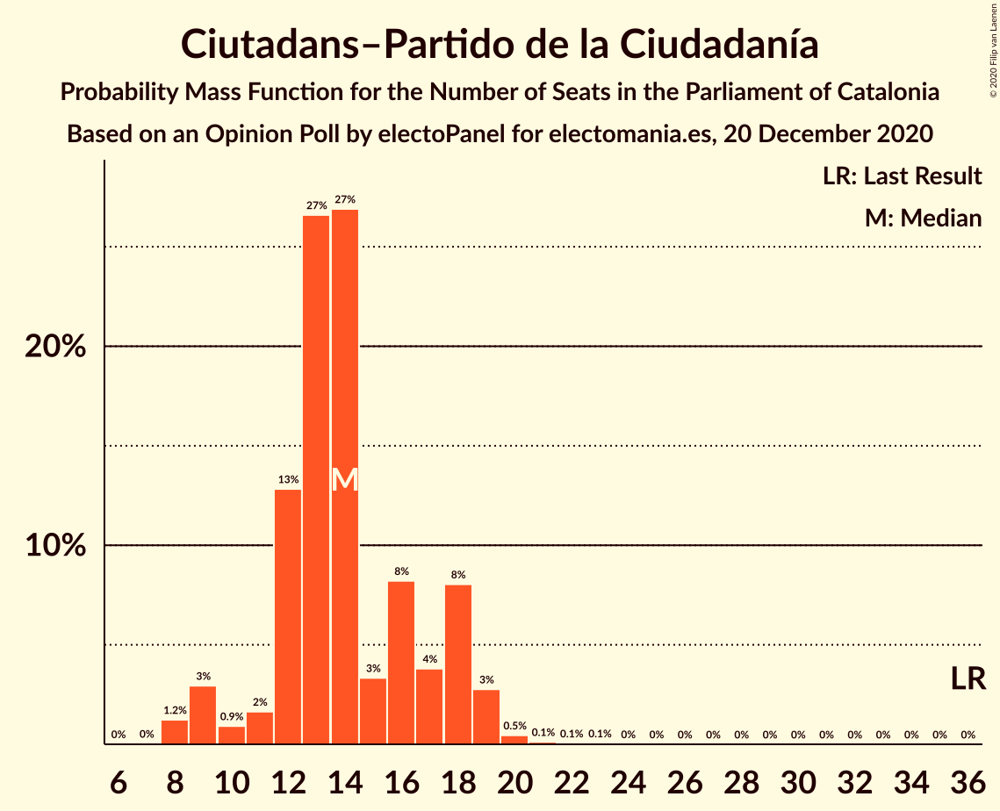
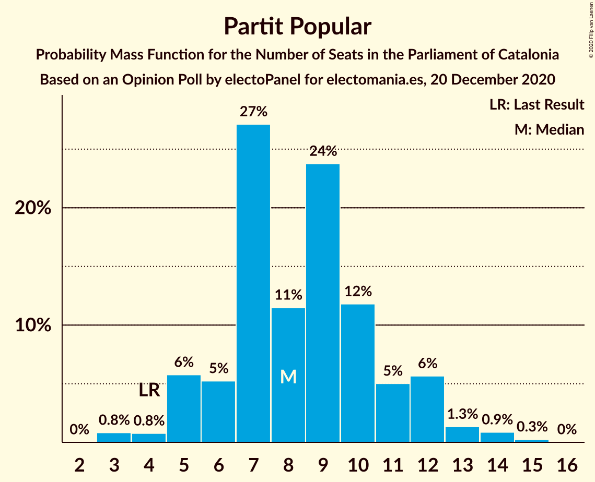

# Opinion Poll by electoPanel for electomania.es, 20 December 2020

<a href="#voting-intentions">Voting Intentions</a> | <a href="#seats">Seats</a> | <a href="#coalitions">Coalitions</a> | <a href="#technical-information">Technical Information</a>

## Voting Intentions

### Confidence Intervals

| Party | Last Result | Poll Result | 80% Confidence Interval | 90% Confidence Interval | 95% Confidence Interval | 99% Confidence Interval |
|:-----:|:-----------:|:-----------:|:-----------------------:|:-----------------------:|:-----------------------:|:-----------------------:|
| Esquerra Republicana–Catalunya Sí | 21.4% | 22.8% | 20.2–25.6% |19.5–26.4% |18.9–27.1% |17.8–28.5% |
| Junts per Catalunya | 21.7% | 19.8% | 17.4–22.5% |16.7–23.3% |16.1–23.9% |15.1–25.3% |
| Partit dels Socialistes de Catalunya (PSC-PSOE) | 13.9% | 18.2% | 16.0–20.9% |15.3–21.7% |14.8–22.3% |13.7–23.7% |
| Ciutadans–Partido de la Ciudadanía | 25.4% | 10.5% | 8.8–12.7% |8.3–13.3% |7.9–13.9% |7.1–15.0% |
| Catalunya en Comú–Podem | 7.5% | 7.5% | 6.1–9.5% |5.6–10.0% |5.3–10.5% |4.7–11.5% |
| Partit Popular | 4.2% | 6.5% | 5.2–8.4% |4.8–8.9% |4.5–9.4% |3.9–10.3% |
| Candidatura d’Unitat Popular | 4.5% | 5.2% | 4.1–7.0% |3.7–7.5% |3.5–7.9% |3.0–8.8% |
| Vox | 0.0% | 5.0% | 3.9–6.7% |3.5–7.2% |3.3–7.6% |2.8–8.5% |
| Partit Demòcrata Europeu Català | 0.0% | 1.8% | 1.2–2.9% |1.0–3.3% |0.9–3.6% |0.6–4.2% |

*Note:* The poll result column reflects the actual value used in the calculations. Published results may vary slightly, and in addition be rounded to fewer digits.

## Seats

### Confidence Intervals

| Party | Last Result | Median | 80% Confidence Interval | 90% Confidence Interval | 95% Confidence Interval | 99% Confidence Interval |
|:-----:|:-----------:|:------:|:-----------------------:|:-----------------------:|:-----------------------:|:-----------------------:|
| <a href="#esquerra-republicana–catalunya-sí">Esquerra Republicana–Catalunya Sí</a> | 32 | 34 | 30–39 |29–40 |28–41 |26–44 |
| <a href="#junts-per-catalunya">Junts per Catalunya</a> | 34 | 31 | 27–37 |26–37 |25–38 |23–40 |
| <a href="#partit-dels-socialistes-de-catalunya-(psc-psoe)">Partit dels Socialistes de Catalunya (PSC-PSOE)</a> | 17 | 25 | 21–28 |20–30 |19–31 |17–33 |
| <a href="#ciutadans–partido-de-la-ciudadanía">Ciutadans–Partido de la Ciudadanía</a> | 36 | 14 | 12–18 |10–18 |9–19 |8–20 |
| <a href="#catalunya-en-comú–podem">Catalunya en Comú–Podem</a> | 8 | 9 | 6–11 |5–12 |5–13 |4–15 |
| <a href="#partit-popular">Partit Popular</a> | 4 | 8 | 6–11 |5–12 |5–13 |3–14 |
| <a href="#candidatura-d’unitat-popular">Candidatura d’Unitat Popular</a> | 4 | 7 | 4–9 |3–10 |3–10 |0–11 |
| <a href="#vox">Vox</a> | 0 | 6 | 3–8 |3–9 |3–10 |0–12 |
| <a href="#partit-demòcrata-europeu-català">Partit Demòcrata Europeu Català</a> | 0 | 0 | 0–1 |0–1 |0–4 |0–5 |

### Esquerra Republicana–Catalunya Sí

*For a full overview of the results for this party, see the [Esquerra Republicana–Catalunya Sí](party-esquerrarepublicana–catalunyasí.html) page.*

| Number of Seats | Probability | Accumulated | Special Marks |
|:---------------:|:-----------:|:-----------:|:-------------:|
| 24 | 0.1% | 100% |  |
| 25 | 0.1% | 99.9% |  |
| 26 | 0.3% | 99.8% |  |
| 27 | 0.6% | 99.5% |  |
| 28 | 3% | 98.9% |  |
| 29 | 4% | 96% |  |
| 30 | 6% | 92% |  |
| 31 | 5% | 86% |  |
| 32 | 9% | 81% | Last Result |
| 33 | 13% | 72% |  |
| 34 | 13% | 58% | Median |
| 35 | 9% | 46% |  |
| 36 | 5% | 37% |  |
| 37 | 9% | 31% |  |
| 38 | 9% | 22% |  |
| 39 | 3% | 13% |  |
| 40 | 6% | 10% |  |
| 41 | 2% | 4% |  |
| 42 | 1.1% | 2% |  |
| 43 | 0.5% | 1.1% |  |
| 44 | 0.4% | 0.6% |  |
| 45 | 0.2% | 0.2% |  |
| 46 | 0% | 0.1% |  |
| 47 | 0% | 0% |  |

### Junts per Catalunya

*For a full overview of the results for this party, see the [Junts per Catalunya](party-juntspercatalunya.html) page.*

| Number of Seats | Probability | Accumulated | Special Marks |
|:---------------:|:-----------:|:-----------:|:-------------:|
| 22 | 0% | 100% |  |
| 23 | 0.4% | 99.9% |  |
| 24 | 0.7% | 99.5% |  |
| 25 | 2% | 98.8% |  |
| 26 | 5% | 97% |  |
| 27 | 4% | 92% |  |
| 28 | 5% | 88% |  |
| 29 | 6% | 83% |  |
| 30 | 7% | 77% |  |
| 31 | 21% | 70% | Median |
| 32 | 13% | 49% |  |
| 33 | 12% | 36% |  |
| 34 | 6% | 24% | Last Result |
| 35 | 4% | 18% |  |
| 36 | 4% | 14% |  |
| 37 | 6% | 10% |  |
| 38 | 2% | 4% |  |
| 39 | 0.9% | 2% |  |
| 40 | 0.7% | 1.0% |  |
| 41 | 0.1% | 0.4% |  |
| 42 | 0.1% | 0.3% |  |
| 43 | 0.1% | 0.2% |  |
| 44 | 0% | 0% |  |

### Partit dels Socialistes de Catalunya (PSC-PSOE)

*For a full overview of the results for this party, see the [Partit dels Socialistes de Catalunya (PSC-PSOE)](party-partitdelssocialistesdecatalunyapsc-psoe.html) page.*

| Number of Seats | Probability | Accumulated | Special Marks |
|:---------------:|:-----------:|:-----------:|:-------------:|
| 16 | 0.1% | 100% |  |
| 17 | 0.8% | 99.9% | Last Result |
| 18 | 1.1% | 99.1% |  |
| 19 | 2% | 98% |  |
| 20 | 4% | 96% |  |
| 21 | 4% | 93% |  |
| 22 | 5% | 89% |  |
| 23 | 8% | 84% |  |
| 24 | 20% | 76% |  |
| 25 | 19% | 56% | Median |
| 26 | 14% | 36% |  |
| 27 | 9% | 23% |  |
| 28 | 4% | 13% |  |
| 29 | 2% | 9% |  |
| 30 | 2% | 6% |  |
| 31 | 3% | 4% |  |
| 32 | 0.6% | 1.1% |  |
| 33 | 0.3% | 0.5% |  |
| 34 | 0.1% | 0.2% |  |
| 35 | 0.1% | 0.1% |  |
| 36 | 0% | 0% |  |

### Ciutadans–Partido de la Ciudadanía

*For a full overview of the results for this party, see the [Ciutadans–Partido de la Ciudadanía](party-ciutadans–partidodelaciudadanía.html) page.*

| Number of Seats | Probability | Accumulated | Special Marks |
|:---------------:|:-----------:|:-----------:|:-------------:|
| 7 | 0% | 100% |  |
| 8 | 1.2% | 99.9% |  |
| 9 | 3% | 98.7% |  |
| 10 | 0.9% | 96% |  |
| 11 | 2% | 95% |  |
| 12 | 13% | 93% |  |
| 13 | 27% | 80% |  |
| 14 | 27% | 54% | Median |
| 15 | 3% | 27% |  |
| 16 | 8% | 24% |  |
| 17 | 4% | 15% |  |
| 18 | 8% | 12% |  |
| 19 | 3% | 3% |  |
| 20 | 0.5% | 0.7% |  |
| 21 | 0.1% | 0.3% |  |
| 22 | 0.1% | 0.1% |  |
| 23 | 0.1% | 0.1% |  |
| 24 | 0% | 0% |  |
| 25 | 0% | 0% |  |
| 26 | 0% | 0% |  |
| 27 | 0% | 0% |  |
| 28 | 0% | 0% |  |
| 29 | 0% | 0% |  |
| 30 | 0% | 0% |  |
| 31 | 0% | 0% |  |
| 32 | 0% | 0% |  |
| 33 | 0% | 0% |  |
| 34 | 0% | 0% |  |
| 35 | 0% | 0% |  |
| 36 | 0% | 0% | Last Result |

### Catalunya en Comú–Podem

*For a full overview of the results for this party, see the [Catalunya en Comú–Podem](party-catalunyaencomú–podem.html) page.*

| Number of Seats | Probability | Accumulated | Special Marks |
|:---------------:|:-----------:|:-----------:|:-------------:|
| 4 | 0.6% | 100% |  |
| 5 | 7% | 99.4% |  |
| 6 | 4% | 92% |  |
| 7 | 10% | 88% |  |
| 8 | 27% | 78% | Last Result |
| 9 | 19% | 51% | Median |
| 10 | 9% | 31% |  |
| 11 | 14% | 22% |  |
| 12 | 3% | 8% |  |
| 13 | 3% | 5% |  |
| 14 | 1.1% | 2% |  |
| 15 | 0.2% | 0.5% |  |
| 16 | 0.2% | 0.3% |  |
| 17 | 0% | 0.1% |  |
| 18 | 0% | 0% |  |

### Partit Popular

*For a full overview of the results for this party, see the [Partit Popular](party-partitpopular.html) page.*

| Number of Seats | Probability | Accumulated | Special Marks |
|:---------------:|:-----------:|:-----------:|:-------------:|
| 3 | 0.8% | 100% |  |
| 4 | 0.8% | 99.1% | Last Result |
| 5 | 6% | 98% |  |
| 6 | 5% | 93% |  |
| 7 | 27% | 87% |  |
| 8 | 11% | 60% | Median |
| 9 | 24% | 49% |  |
| 10 | 12% | 25% |  |
| 11 | 5% | 13% |  |
| 12 | 6% | 8% |  |
| 13 | 1.3% | 3% |  |
| 14 | 0.9% | 1.2% |  |
| 15 | 0.3% | 0.3% |  |
| 16 | 0% | 0% |  |

### Candidatura d’Unitat Popular

*For a full overview of the results for this party, see the [Candidatura d’Unitat Popular](party-candidaturad’unitatpopular.html) page.*

| Number of Seats | Probability | Accumulated | Special Marks |
|:---------------:|:-----------:|:-----------:|:-------------:|
| 0 | 0.7% | 100% |  |
| 1 | 0% | 99.3% |  |
| 2 | 1.0% | 99.3% |  |
| 3 | 4% | 98% |  |
| 4 | 14% | 95% | Last Result |
| 5 | 8% | 80% |  |
| 6 | 7% | 73% |  |
| 7 | 24% | 66% | Median |
| 8 | 28% | 42% |  |
| 9 | 7% | 14% |  |
| 10 | 4% | 6% |  |
| 11 | 2% | 2% |  |
| 12 | 0.3% | 0.5% |  |
| 13 | 0.1% | 0.2% |  |
| 14 | 0% | 0.1% |  |
| 15 | 0% | 0% |  |

### Vox

*For a full overview of the results for this party, see the [Vox](party-vox.html) page.*

| Number of Seats | Probability | Accumulated | Special Marks |
|:---------------:|:-----------:|:-----------:|:-------------:|
| 0 | 0.9% | 100% | Last Result |
| 1 | 0% | 99.1% |  |
| 2 | 1.0% | 99.1% |  |
| 3 | 13% | 98% |  |
| 4 | 5% | 85% |  |
| 5 | 28% | 80% |  |
| 6 | 9% | 52% | Median |
| 7 | 29% | 43% |  |
| 8 | 4% | 14% |  |
| 9 | 6% | 9% |  |
| 10 | 2% | 4% |  |
| 11 | 0.6% | 1.1% |  |
| 12 | 0.5% | 0.5% |  |
| 13 | 0% | 0.1% |  |
| 14 | 0% | 0% |  |

### Partit Demòcrata Europeu Català

*For a full overview of the results for this party, see the [Partit Demòcrata Europeu Català](party-partitdemòcrataeuropeucatalà.html) page.*

| Number of Seats | Probability | Accumulated | Special Marks |
|:---------------:|:-----------:|:-----------:|:-------------:|
| 0 | 83% | 100% | Last Result, Median |
| 1 | 13% | 17% |  |
| 2 | 0.1% | 4% |  |
| 3 | 1.0% | 4% |  |
| 4 | 1.2% | 3% |  |
| 5 | 2% | 2% |  |
| 6 | 0.3% | 0.3% |  |
| 7 | 0% | 0% |  |

## Coalitions

### Confidence Intervals

| Coalition | Last Result | Median | Majority? | 80% Confidence Interval | 90% Confidence Interval | 95% Confidence Interval | 99% Confidence Interval |
|:---------:|:-----------:|:------:|:---------:|:-----------------------:|:-----------------------:|:-----------------------:|:-----------------------:|
| Esquerra Republicana–Catalunya Sí – Junts per Catalunya – Catalunya en Comú–Podem | 74 | 75 | 97% | 70–80 | 68–81 | 67–82 | 65–85 |
| Esquerra Republicana–Catalunya Sí – Junts per Catalunya – Candidatura d’Unitat Popular – Partit Demòcrata Europeu Català | 70 | 73 | 92% | 68–78 | 67–80 | 66–81 | 63–83 |
| Esquerra Republicana–Catalunya Sí – Junts per Catalunya – Candidatura d’Unitat Popular | 70 | 73 | 91% | 68–78 | 67–80 | 65–81 | 63–82 |
| Esquerra Republicana–Catalunya Sí – Partit dels Socialistes de Catalunya (PSC-PSOE) – Catalunya en Comú–Podem | 57 | 68 | 55% | 63–73 | 61–74 | 60–75 | 58–78 |
| Esquerra Republicana–Catalunya Sí – Junts per Catalunya | 66 | 66 | 36% | 61–72 | 60–72 | 59–74 | 56–76 |
| Esquerra Republicana–Catalunya Sí – Junts per Catalunya – Partit Demòcrata Europeu Català | 66 | 66 | 38% | 61–72 | 60–73 | 59–74 | 57–77 |
| Partit dels Socialistes de Catalunya (PSC-PSOE) – Ciutadans–Partido de la Ciudadanía – Catalunya en Comú–Podem – Partit Popular | 65 | 56 | 0.1% | 51–61 | 49–62 | 48–63 | 46–66 |
| Partit dels Socialistes de Catalunya (PSC-PSOE) – Ciutadans–Partido de la Ciudadanía – Partit Popular – Vox | 57 | 53 | 0% | 48–58 | 47–59 | 45–60 | 43–63 |
| Partit dels Socialistes de Catalunya (PSC-PSOE) – Ciutadans–Partido de la Ciudadanía – Partit Popular | 57 | 47 | 0% | 42–52 | 41–53 | 40–54 | 38–57 |
| Esquerra Republicana–Catalunya Sí – Catalunya en Comú–Podem | 40 | 43 | 0% | 38–48 | 37–49 | 36–50 | 34–53 |

### Esquerra Republicana–Catalunya Sí – Junts per Catalunya – Catalunya en Comú–Podem

| Number of Seats | Probability | Accumulated | Special Marks |
|:---------------:|:-----------:|:-----------:|:-------------:|
| 62 | 0% | 100% |  |
| 63 | 0.1% | 99.9% |  |
| 64 | 0.2% | 99.8% |  |
| 65 | 0.5% | 99.6% |  |
| 66 | 0.8% | 99.2% |  |
| 67 | 1.1% | 98% |  |
| 68 | 2% | 97% | Majority |
| 69 | 3% | 95% |  |
| 70 | 4% | 92% |  |
| 71 | 9% | 87% |  |
| 72 | 6% | 78% |  |
| 73 | 9% | 73% |  |
| 74 | 11% | 63% | Last Result, Median |
| 75 | 9% | 52% |  |
| 76 | 8% | 43% |  |
| 77 | 8% | 35% |  |
| 78 | 7% | 27% |  |
| 79 | 6% | 20% |  |
| 80 | 4% | 14% |  |
| 81 | 5% | 10% |  |
| 82 | 2% | 5% |  |
| 83 | 1.3% | 2% |  |
| 84 | 0.4% | 1.1% |  |
| 85 | 0.3% | 0.7% |  |
| 86 | 0.1% | 0.4% |  |
| 87 | 0.2% | 0.3% |  |
| 88 | 0.1% | 0.1% |  |
| 89 | 0% | 0% |  |

### Esquerra Republicana–Catalunya Sí – Junts per Catalunya – Candidatura d’Unitat Popular – Partit Demòcrata Europeu Català

| Number of Seats | Probability | Accumulated | Special Marks |
|:---------------:|:-----------:|:-----------:|:-------------:|
| 60 | 0% | 100% |  |
| 61 | 0.1% | 99.9% |  |
| 62 | 0.1% | 99.8% |  |
| 63 | 0.3% | 99.7% |  |
| 64 | 0.7% | 99.4% |  |
| 65 | 0.9% | 98.7% |  |
| 66 | 2% | 98% |  |
| 67 | 5% | 96% |  |
| 68 | 5% | 92% | Majority |
| 69 | 5% | 87% |  |
| 70 | 6% | 82% | Last Result |
| 71 | 9% | 76% |  |
| 72 | 10% | 67% | Median |
| 73 | 9% | 57% |  |
| 74 | 12% | 48% |  |
| 75 | 8% | 36% |  |
| 76 | 7% | 28% |  |
| 77 | 7% | 21% |  |
| 78 | 4% | 14% |  |
| 79 | 4% | 9% |  |
| 80 | 2% | 6% |  |
| 81 | 1.3% | 3% |  |
| 82 | 2% | 2% |  |
| 83 | 0.2% | 0.6% |  |
| 84 | 0.2% | 0.4% |  |
| 85 | 0.1% | 0.2% |  |
| 86 | 0.1% | 0.1% |  |
| 87 | 0% | 0.1% |  |
| 88 | 0% | 0% |  |

### Esquerra Republicana–Catalunya Sí – Junts per Catalunya – Candidatura d’Unitat Popular

| Number of Seats | Probability | Accumulated | Special Marks |
|:---------------:|:-----------:|:-----------:|:-------------:|
| 60 | 0% | 100% |  |
| 61 | 0.1% | 99.9% |  |
| 62 | 0.2% | 99.8% |  |
| 63 | 0.4% | 99.6% |  |
| 64 | 0.7% | 99.2% |  |
| 65 | 1.2% | 98.6% |  |
| 66 | 2% | 97% |  |
| 67 | 5% | 95% |  |
| 68 | 5% | 91% | Majority |
| 69 | 6% | 86% |  |
| 70 | 7% | 80% | Last Result |
| 71 | 9% | 73% |  |
| 72 | 10% | 64% | Median |
| 73 | 12% | 54% |  |
| 74 | 9% | 42% |  |
| 75 | 7% | 33% |  |
| 76 | 8% | 26% |  |
| 77 | 5% | 18% |  |
| 78 | 5% | 13% |  |
| 79 | 2% | 8% |  |
| 80 | 2% | 5% |  |
| 81 | 1.2% | 3% |  |
| 82 | 1.4% | 2% |  |
| 83 | 0.1% | 0.5% |  |
| 84 | 0.2% | 0.3% |  |
| 85 | 0.1% | 0.2% |  |
| 86 | 0% | 0.1% |  |
| 87 | 0% | 0% |  |

### Esquerra Republicana–Catalunya Sí – Partit dels Socialistes de Catalunya (PSC-PSOE) – Catalunya en Comú–Podem

| Number of Seats | Probability | Accumulated | Special Marks |
|:---------------:|:-----------:|:-----------:|:-------------:|
| 55 | 0% | 100% |  |
| 56 | 0.1% | 99.9% |  |
| 57 | 0.1% | 99.8% | Last Result |
| 58 | 0.5% | 99.7% |  |
| 59 | 0.7% | 99.2% |  |
| 60 | 1.1% | 98.5% |  |
| 61 | 4% | 97% |  |
| 62 | 3% | 94% |  |
| 63 | 3% | 90% |  |
| 64 | 3% | 87% |  |
| 65 | 8% | 84% |  |
| 66 | 12% | 76% |  |
| 67 | 9% | 64% |  |
| 68 | 7% | 55% | Median, Majority |
| 69 | 9% | 47% |  |
| 70 | 11% | 39% |  |
| 71 | 8% | 28% |  |
| 72 | 6% | 20% |  |
| 73 | 6% | 14% |  |
| 74 | 4% | 8% |  |
| 75 | 2% | 4% |  |
| 76 | 0.8% | 2% |  |
| 77 | 0.4% | 1.4% |  |
| 78 | 0.6% | 0.9% |  |
| 79 | 0.1% | 0.3% |  |
| 80 | 0.1% | 0.2% |  |
| 81 | 0% | 0.1% |  |
| 82 | 0% | 0% |  |

### Esquerra Republicana–Catalunya Sí – Junts per Catalunya

| Number of Seats | Probability | Accumulated | Special Marks |
|:---------------:|:-----------:|:-----------:|:-------------:|
| 54 | 0.1% | 100% |  |
| 55 | 0.1% | 99.9% |  |
| 56 | 0.3% | 99.8% |  |
| 57 | 0.7% | 99.5% |  |
| 58 | 0.9% | 98.8% |  |
| 59 | 3% | 98% |  |
| 60 | 3% | 95% |  |
| 61 | 5% | 93% |  |
| 62 | 6% | 87% |  |
| 63 | 8% | 81% |  |
| 64 | 11% | 74% |  |
| 65 | 8% | 63% | Median |
| 66 | 12% | 55% | Last Result |
| 67 | 7% | 43% |  |
| 68 | 5% | 36% | Majority |
| 69 | 8% | 31% |  |
| 70 | 5% | 23% |  |
| 71 | 7% | 18% |  |
| 72 | 6% | 11% |  |
| 73 | 2% | 5% |  |
| 74 | 1.3% | 3% |  |
| 75 | 0.7% | 2% |  |
| 76 | 0.5% | 0.9% |  |
| 77 | 0.2% | 0.4% |  |
| 78 | 0.1% | 0.2% |  |
| 79 | 0.1% | 0.1% |  |
| 80 | 0% | 0% |  |

### Esquerra Republicana–Catalunya Sí – Junts per Catalunya – Partit Demòcrata Europeu Català

| Number of Seats | Probability | Accumulated | Special Marks |
|:---------------:|:-----------:|:-----------:|:-------------:|
| 54 | 0% | 100% |  |
| 55 | 0.1% | 99.9% |  |
| 56 | 0.3% | 99.9% |  |
| 57 | 0.5% | 99.6% |  |
| 58 | 0.8% | 99.0% |  |
| 59 | 2% | 98% |  |
| 60 | 3% | 96% |  |
| 61 | 5% | 93% |  |
| 62 | 5% | 88% |  |
| 63 | 7% | 83% |  |
| 64 | 11% | 76% |  |
| 65 | 8% | 65% | Median |
| 66 | 8% | 57% | Last Result |
| 67 | 10% | 49% |  |
| 68 | 5% | 38% | Majority |
| 69 | 7% | 33% |  |
| 70 | 7% | 26% |  |
| 71 | 7% | 19% |  |
| 72 | 7% | 12% |  |
| 73 | 2% | 5% |  |
| 74 | 2% | 3% |  |
| 75 | 0.8% | 2% |  |
| 76 | 0.5% | 1.0% |  |
| 77 | 0.2% | 0.5% |  |
| 78 | 0.1% | 0.3% |  |
| 79 | 0.1% | 0.1% |  |
| 80 | 0% | 0% |  |

### Partit dels Socialistes de Catalunya (PSC-PSOE) – Ciutadans–Partido de la Ciudadanía – Catalunya en Comú–Podem – Partit Popular

| Number of Seats | Probability | Accumulated | Special Marks |
|:---------------:|:-----------:|:-----------:|:-------------:|
| 43 | 0% | 100% |  |
| 44 | 0.1% | 99.9% |  |
| 45 | 0.1% | 99.8% |  |
| 46 | 0.3% | 99.7% |  |
| 47 | 1.0% | 99.4% |  |
| 48 | 2% | 98% |  |
| 49 | 2% | 97% |  |
| 50 | 4% | 95% |  |
| 51 | 4% | 91% |  |
| 52 | 3% | 87% |  |
| 53 | 11% | 84% |  |
| 54 | 6% | 73% |  |
| 55 | 9% | 66% |  |
| 56 | 16% | 57% | Median |
| 57 | 7% | 42% |  |
| 58 | 9% | 35% |  |
| 59 | 8% | 26% |  |
| 60 | 6% | 18% |  |
| 61 | 6% | 13% |  |
| 62 | 3% | 7% |  |
| 63 | 2% | 4% |  |
| 64 | 0.9% | 2% |  |
| 65 | 0.4% | 1.0% | Last Result |
| 66 | 0.2% | 0.5% |  |
| 67 | 0.2% | 0.3% |  |
| 68 | 0.1% | 0.1% | Majority |
| 69 | 0% | 0.1% |  |
| 70 | 0% | 0% |  |

### Partit dels Socialistes de Catalunya (PSC-PSOE) – Ciutadans–Partido de la Ciudadanía – Partit Popular – Vox

| Number of Seats | Probability | Accumulated | Special Marks |
|:---------------:|:-----------:|:-----------:|:-------------:|
| 40 | 0% | 100% |  |
| 41 | 0.1% | 99.9% |  |
| 42 | 0.1% | 99.9% |  |
| 43 | 0.4% | 99.8% |  |
| 44 | 0.9% | 99.4% |  |
| 45 | 1.2% | 98% |  |
| 46 | 2% | 97% |  |
| 47 | 3% | 96% |  |
| 48 | 3% | 93% |  |
| 49 | 8% | 90% |  |
| 50 | 7% | 81% |  |
| 51 | 8% | 75% |  |
| 52 | 8% | 66% |  |
| 53 | 16% | 59% | Median |
| 54 | 9% | 43% |  |
| 55 | 7% | 33% |  |
| 56 | 9% | 27% |  |
| 57 | 6% | 17% | Last Result |
| 58 | 4% | 11% |  |
| 59 | 3% | 8% |  |
| 60 | 2% | 5% |  |
| 61 | 1.2% | 2% |  |
| 62 | 0.5% | 1.3% |  |
| 63 | 0.4% | 0.8% |  |
| 64 | 0.3% | 0.4% |  |
| 65 | 0.1% | 0.1% |  |
| 66 | 0% | 0% |  |

### Partit dels Socialistes de Catalunya (PSC-PSOE) – Ciutadans–Partido de la Ciudadanía – Partit Popular

| Number of Seats | Probability | Accumulated | Special Marks |
|:---------------:|:-----------:|:-----------:|:-------------:|
| 35 | 0.1% | 100% |  |
| 36 | 0.1% | 99.9% |  |
| 37 | 0.1% | 99.8% |  |
| 38 | 0.6% | 99.6% |  |
| 39 | 1.1% | 99.0% |  |
| 40 | 1.3% | 98% |  |
| 41 | 3% | 97% |  |
| 42 | 4% | 93% |  |
| 43 | 4% | 89% |  |
| 44 | 8% | 85% |  |
| 45 | 10% | 77% |  |
| 46 | 8% | 67% |  |
| 47 | 12% | 59% | Median |
| 48 | 12% | 48% |  |
| 49 | 9% | 35% |  |
| 50 | 8% | 26% |  |
| 51 | 7% | 18% |  |
| 52 | 4% | 11% |  |
| 53 | 4% | 8% |  |
| 54 | 2% | 4% |  |
| 55 | 0.7% | 2% |  |
| 56 | 0.5% | 1.0% |  |
| 57 | 0.3% | 0.6% | Last Result |
| 58 | 0.1% | 0.3% |  |
| 59 | 0.1% | 0.1% |  |
| 60 | 0% | 0.1% |  |
| 61 | 0% | 0% |  |

### Esquerra Republicana–Catalunya Sí – Catalunya en Comú–Podem

| Number of Seats | Probability | Accumulated | Special Marks |
|:---------------:|:-----------:|:-----------:|:-------------:|
| 32 | 0.1% | 100% |  |
| 33 | 0.2% | 99.8% |  |
| 34 | 0.2% | 99.7% |  |
| 35 | 0.6% | 99.4% |  |
| 36 | 2% | 98.8% |  |
| 37 | 4% | 97% |  |
| 38 | 3% | 93% |  |
| 39 | 5% | 90% |  |
| 40 | 8% | 85% | Last Result |
| 41 | 12% | 77% |  |
| 42 | 10% | 65% |  |
| 43 | 11% | 56% | Median |
| 44 | 8% | 45% |  |
| 45 | 6% | 37% |  |
| 46 | 8% | 30% |  |
| 47 | 8% | 22% |  |
| 48 | 6% | 15% |  |
| 49 | 5% | 9% |  |
| 50 | 2% | 4% |  |
| 51 | 0.9% | 2% |  |
| 52 | 0.7% | 1.4% |  |
| 53 | 0.3% | 0.6% |  |
| 54 | 0.2% | 0.3% |  |
| 55 | 0.1% | 0.2% |  |
| 56 | 0% | 0.1% |  |
| 57 | 0% | 0% |  |

## Technical Information

### Opinion Poll

+ **Polling firm:** electoPanel
+ **Commissioner(s):** electomania.es
+ **Fieldwork period:** 20 December 2020

### Calculations

+ **Sample size:** 400
+ **Simulations done:** 1,048,576
+ **Error estimate:** 3.23%

