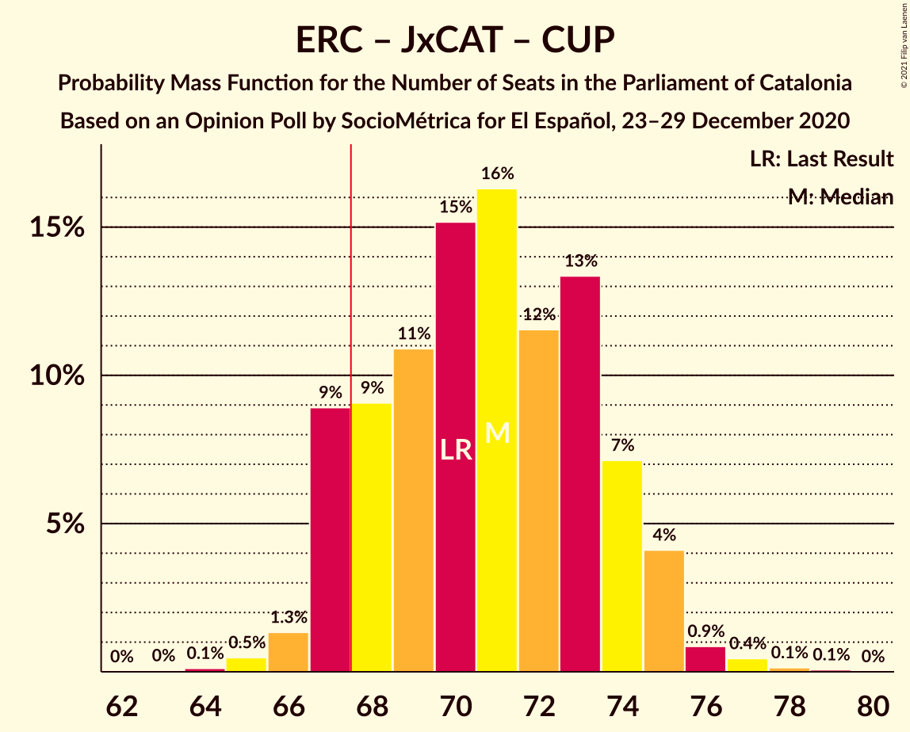

# Opinion Poll by SocioMétrica for El Español, 23–29 December 2020

<a href="#voting-intentions">Voting Intentions</a> | <a href="#seats">Seats</a> | <a href="#coalitions">Coalitions</a> | <a href="#technical-information">Technical Information</a>

## Voting Intentions

### Confidence Intervals

| Party | Last Result | Poll Result | 80% Confidence Interval | 90% Confidence Interval | 95% Confidence Interval | 99% Confidence Interval |
|:-----:|:-----------:|:-----------:|:-----------------------:|:-----------------------:|:-----------------------:|:-----------------------:|
| Esquerra Republicana–Catalunya Sí | 21.4% | 21.7% | 20.2–23.3% |19.8–23.7% |19.4–24.1% |18.7–24.9% |
| Junts per Catalunya | 21.7% | 20.3% | 18.9–21.9% |18.5–22.3% |18.2–22.7% |17.5–23.5% |
| Partit dels Socialistes de Catalunya (PSC-PSOE) | 13.9% | 16.7% | 15.3–18.1% |15.0–18.5% |14.7–18.9% |14.1–19.6% |
| Ciutadans–Partido de la Ciudadanía | 25.4% | 13.2% | 12.0–14.5% |11.6–14.9% |11.4–15.2% |10.8–15.9% |
| Catalunya en Comú–Podem | 7.5% | 7.7% | 6.8–8.7% |6.5–9.1% |6.3–9.3% |5.9–9.9% |
| Partit Popular | 4.2% | 6.3% | 5.5–7.3% |5.3–7.6% |5.1–7.9% |4.7–8.4% |
| Vox | 0.0% | 6.1% | 5.3–7.1% |5.0–7.3% |4.9–7.6% |4.5–8.1% |
| Candidatura d’Unitat Popular | 4.5% | 4.9% | 4.2–5.8% |4.0–6.1% |3.8–6.3% |3.5–6.8% |
| Partit Demòcrata Europeu Català | 0.0% | 1.6% | 1.2–2.2% |1.1–2.3% |1.0–2.5% |0.9–2.8% |

*Note:* The poll result column reflects the actual value used in the calculations. Published results may vary slightly, and in addition be rounded to fewer digits.

## Seats

### Confidence Intervals

| Party | Last Result | Median | 80% Confidence Interval | 90% Confidence Interval | 95% Confidence Interval | 99% Confidence Interval |
|:-----:|:-----------:|:------:|:-----------------------:|:-----------------------:|:-----------------------:|:-----------------------:|
| <a href="#esquerra-republicana–catalunya-sí">Esquerra Republicana–Catalunya Sí</a> | 32 | 33 | 30–35 |29–36 |29–37 |28–38 |
| <a href="#junts-per-catalunya">Junts per Catalunya</a> | 34 | 32 | 30–35 |29–36 |29–37 |26–37 |
| <a href="#partit-dels-socialistes-de-catalunya-(psc-psoe)">Partit dels Socialistes de Catalunya (PSC-PSOE)</a> | 17 | 23 | 20–25 |19–25 |18–25 |17–26 |
| <a href="#ciutadans–partido-de-la-ciudadanía">Ciutadans–Partido de la Ciudadanía</a> | 36 | 18 | 16–19 |15–20 |14–20 |14–22 |
| <a href="#catalunya-en-comú–podem">Catalunya en Comú–Podem</a> | 8 | 9 | 8–11 |7–11 |7–11 |6–12 |
| <a href="#partit-popular">Partit Popular</a> | 4 | 7 | 7–9 |6–10 |6–10 |5–11 |
| <a href="#vox">Vox</a> | 0 | 7 | 6–9 |6–9 |5–10 |5–10 |
| <a href="#candidatura-d’unitat-popular">Candidatura d’Unitat Popular</a> | 4 | 6 | 4–8 |4–8 |4–8 |3–9 |
| <a href="#partit-demòcrata-europeu-català">Partit Demòcrata Europeu Català</a> | 0 | 0 | 0 |0 |0 |0 |

### Esquerra Republicana–Catalunya Sí

*For a full overview of the results for this party, see the [Esquerra Republicana–Catalunya Sí](party-esquerrarepublicana–catalunyasí.html) page.*

| Number of Seats | Probability | Accumulated | Special Marks |
|:---------------:|:-----------:|:-----------:|:-------------:|
| 27 | 0.1% | 100% |  |
| 28 | 2% | 99.8% |  |
| 29 | 5% | 98% |  |
| 30 | 8% | 93% |  |
| 31 | 17% | 85% |  |
| 32 | 12% | 68% | Last Result |
| 33 | 25% | 56% | Median |
| 34 | 11% | 31% |  |
| 35 | 13% | 20% |  |
| 36 | 4% | 6% |  |
| 37 | 2% | 3% |  |
| 38 | 0.4% | 0.6% |  |
| 39 | 0.1% | 0.1% |  |
| 40 | 0% | 0% |  |

### Junts per Catalunya

*For a full overview of the results for this party, see the [Junts per Catalunya](party-juntspercatalunya.html) page.*

| Number of Seats | Probability | Accumulated | Special Marks |
|:---------------:|:-----------:|:-----------:|:-------------:|
| 26 | 0.5% | 100% |  |
| 27 | 0.3% | 99.4% |  |
| 28 | 0.9% | 99.1% |  |
| 29 | 5% | 98% |  |
| 30 | 5% | 93% |  |
| 31 | 32% | 88% |  |
| 32 | 28% | 57% | Median |
| 33 | 10% | 28% |  |
| 34 | 6% | 19% | Last Result |
| 35 | 6% | 12% |  |
| 36 | 4% | 6% |  |
| 37 | 2% | 3% |  |
| 38 | 0.3% | 0.4% |  |
| 39 | 0% | 0% |  |

### Partit dels Socialistes de Catalunya (PSC-PSOE)

*For a full overview of the results for this party, see the [Partit dels Socialistes de Catalunya (PSC-PSOE)](party-partitdelssocialistesdecatalunyapsc-psoe.html) page.*

| Number of Seats | Probability | Accumulated | Special Marks |
|:---------------:|:-----------:|:-----------:|:-------------:|
| 17 | 0.5% | 100% | Last Result |
| 18 | 2% | 99.5% |  |
| 19 | 3% | 97% |  |
| 20 | 17% | 94% |  |
| 21 | 8% | 77% |  |
| 22 | 15% | 70% |  |
| 23 | 21% | 54% | Median |
| 24 | 19% | 33% |  |
| 25 | 12% | 14% |  |
| 26 | 1.0% | 1.2% |  |
| 27 | 0.2% | 0.2% |  |
| 28 | 0% | 0% |  |

### Ciutadans–Partido de la Ciudadanía

*For a full overview of the results for this party, see the [Ciutadans–Partido de la Ciudadanía](party-ciutadans–partidodelaciudadanía.html) page.*

| Number of Seats | Probability | Accumulated | Special Marks |
|:---------------:|:-----------:|:-----------:|:-------------:|
| 13 | 0.1% | 100% |  |
| 14 | 4% | 99.9% |  |
| 15 | 2% | 96% |  |
| 16 | 9% | 94% |  |
| 17 | 7% | 85% |  |
| 18 | 40% | 77% | Median |
| 19 | 30% | 38% |  |
| 20 | 6% | 7% |  |
| 21 | 0.9% | 2% |  |
| 22 | 0.7% | 0.8% |  |
| 23 | 0.1% | 0.1% |  |
| 24 | 0% | 0% |  |
| 25 | 0% | 0% |  |
| 26 | 0% | 0% |  |
| 27 | 0% | 0% |  |
| 28 | 0% | 0% |  |
| 29 | 0% | 0% |  |
| 30 | 0% | 0% |  |
| 31 | 0% | 0% |  |
| 32 | 0% | 0% |  |
| 33 | 0% | 0% |  |
| 34 | 0% | 0% |  |
| 35 | 0% | 0% |  |
| 36 | 0% | 0% | Last Result |

### Catalunya en Comú–Podem

*For a full overview of the results for this party, see the [Catalunya en Comú–Podem](party-catalunyaencomú–podem.html) page.*

| Number of Seats | Probability | Accumulated | Special Marks |
|:---------------:|:-----------:|:-----------:|:-------------:|
| 5 | 0.3% | 100% |  |
| 6 | 2% | 99.7% |  |
| 7 | 7% | 98% |  |
| 8 | 41% | 92% | Last Result |
| 9 | 29% | 51% | Median |
| 10 | 11% | 22% |  |
| 11 | 9% | 10% |  |
| 12 | 0.8% | 1.0% |  |
| 13 | 0.2% | 0.3% |  |
| 14 | 0% | 0% |  |

### Partit Popular

*For a full overview of the results for this party, see the [Partit Popular](party-partitpopular.html) page.*

| Number of Seats | Probability | Accumulated | Special Marks |
|:---------------:|:-----------:|:-----------:|:-------------:|
| 4 | 0% | 100% | Last Result |
| 5 | 2% | 100% |  |
| 6 | 5% | 98% |  |
| 7 | 51% | 93% | Median |
| 8 | 12% | 42% |  |
| 9 | 24% | 30% |  |
| 10 | 5% | 6% |  |
| 11 | 0.7% | 1.0% |  |
| 12 | 0.3% | 0.3% |  |
| 13 | 0% | 0% |  |

### Vox

*For a full overview of the results for this party, see the [Vox](party-vox.html) page.*

| Number of Seats | Probability | Accumulated | Special Marks |
|:---------------:|:-----------:|:-----------:|:-------------:|
| 0 | 0% | 100% | Last Result |
| 1 | 0% | 100% |  |
| 2 | 0% | 100% |  |
| 3 | 0.1% | 100% |  |
| 4 | 0.1% | 99.9% |  |
| 5 | 4% | 99.8% |  |
| 6 | 9% | 96% |  |
| 7 | 49% | 87% | Median |
| 8 | 22% | 38% |  |
| 9 | 12% | 16% |  |
| 10 | 3% | 4% |  |
| 11 | 0.2% | 0.3% |  |
| 12 | 0.1% | 0.1% |  |
| 13 | 0% | 0% |  |

### Candidatura d’Unitat Popular

*For a full overview of the results for this party, see the [Candidatura d’Unitat Popular](party-candidaturad’unitatpopular.html) page.*

| Number of Seats | Probability | Accumulated | Special Marks |
|:---------------:|:-----------:|:-----------:|:-------------:|
| 2 | 0.2% | 100% |  |
| 3 | 2% | 99.8% |  |
| 4 | 22% | 98% | Last Result |
| 5 | 11% | 76% |  |
| 6 | 18% | 65% | Median |
| 7 | 21% | 47% |  |
| 8 | 25% | 25% |  |
| 9 | 0.5% | 0.6% |  |
| 10 | 0% | 0% |  |

### Partit Demòcrata Europeu Català

*For a full overview of the results for this party, see the [Partit Demòcrata Europeu Català](party-partitdemòcrataeuropeucatalà.html) page.*

| Number of Seats | Probability | Accumulated | Special Marks |
|:---------------:|:-----------:|:-----------:|:-------------:|
| 0 | 99.5% | 100% | Last Result, Median |
| 1 | 0.4% | 0.5% |  |
| 2 | 0% | 0% |  |

## Coalitions

### Confidence Intervals

| Coalition | Last Result | Median | Majority? | 80% Confidence Interval | 90% Confidence Interval | 95% Confidence Interval | 99% Confidence Interval |
|:---------:|:-----------:|:------:|:---------:|:-----------------------:|:-----------------------:|:-----------------------:|:-----------------------:|
| Esquerra Republicana–Catalunya Sí – Junts per Catalunya – Catalunya en Comú–Podem | 74 | 73 | 99.4% | 70–76 | 69–77 | 69–78 | 67–80 |
| Esquerra Republicana–Catalunya Sí – Junts per Catalunya – Candidatura d’Unitat Popular | 70 | 71 | 89% | 67–74 | 67–75 | 67–75 | 65–77 |
| Esquerra Republicana–Catalunya Sí – Junts per Catalunya – Candidatura d’Unitat Popular – Partit Demòcrata Europeu Català | 70 | 71 | 89% | 67–74 | 67–75 | 67–75 | 65–77 |
| Esquerra Republicana–Catalunya Sí – Junts per Catalunya | 66 | 65 | 12% | 61–68 | 61–69 | 60–69 | 59–71 |
| Esquerra Republicana–Catalunya Sí – Junts per Catalunya – Partit Demòcrata Europeu Català | 66 | 65 | 12% | 61–68 | 61–69 | 60–69 | 59–71 |
| Esquerra Republicana–Catalunya Sí – Partit dels Socialistes de Catalunya (PSC-PSOE) – Catalunya en Comú–Podem | 57 | 64 | 6% | 61–67 | 60–68 | 59–68 | 58–70 |
| Partit dels Socialistes de Catalunya (PSC-PSOE) – Ciutadans–Partido de la Ciudadanía – Catalunya en Comú–Podem – Partit Popular | 65 | 57 | 0% | 54–60 | 53–61 | 52–61 | 51–62 |
| Partit dels Socialistes de Catalunya (PSC-PSOE) – Ciutadans–Partido de la Ciudadanía – Partit Popular – Vox | 57 | 56 | 0% | 53–59 | 52–60 | 51–60 | 50–61 |
| Partit dels Socialistes de Catalunya (PSC-PSOE) – Ciutadans–Partido de la Ciudadanía – Partit Popular | 57 | 48 | 0% | 45–51 | 44–52 | 44–53 | 42–53 |
| Esquerra Republicana–Catalunya Sí – Catalunya en Comú–Podem | 40 | 41 | 0% | 39–44 | 38–45 | 37–45 | 36–47 |

### Esquerra Republicana–Catalunya Sí – Junts per Catalunya – Catalunya en Comú–Podem

| Number of Seats | Probability | Accumulated | Special Marks |
|:---------------:|:-----------:|:-----------:|:-------------:|
| 66 | 0.1% | 100% |  |
| 67 | 0.5% | 99.9% |  |
| 68 | 1.1% | 99.4% | Majority |
| 69 | 5% | 98% |  |
| 70 | 4% | 93% |  |
| 71 | 12% | 89% |  |
| 72 | 12% | 78% |  |
| 73 | 18% | 65% |  |
| 74 | 12% | 47% | Last Result, Median |
| 75 | 19% | 35% |  |
| 76 | 9% | 17% |  |
| 77 | 4% | 7% |  |
| 78 | 3% | 4% |  |
| 79 | 0.7% | 1.3% |  |
| 80 | 0.5% | 0.6% |  |
| 81 | 0.1% | 0.2% |  |
| 82 | 0.1% | 0.1% |  |
| 83 | 0% | 0% |  |

### Esquerra Republicana–Catalunya Sí – Junts per Catalunya – Candidatura d’Unitat Popular

| Number of Seats | Probability | Accumulated | Special Marks |
|:---------------:|:-----------:|:-----------:|:-------------:|
| 64 | 0.1% | 100% |  |
| 65 | 0.5% | 99.8% |  |
| 66 | 1.3% | 99.4% |  |
| 67 | 9% | 98% |  |
| 68 | 9% | 89% | Majority |
| 69 | 11% | 80% |  |
| 70 | 15% | 69% | Last Result |
| 71 | 16% | 54% | Median |
| 72 | 12% | 38% |  |
| 73 | 13% | 26% |  |
| 74 | 7% | 13% |  |
| 75 | 4% | 6% |  |
| 76 | 0.9% | 2% |  |
| 77 | 0.4% | 0.7% |  |
| 78 | 0.1% | 0.2% |  |
| 79 | 0.1% | 0.1% |  |
| 80 | 0% | 0% |  |

### Esquerra Republicana–Catalunya Sí – Junts per Catalunya – Candidatura d’Unitat Popular – Partit Demòcrata Europeu Català

| Number of Seats | Probability | Accumulated | Special Marks |
|:---------------:|:-----------:|:-----------:|:-------------:|
| 64 | 0.1% | 100% |  |
| 65 | 0.5% | 99.8% |  |
| 66 | 1.3% | 99.4% |  |
| 67 | 9% | 98% |  |
| 68 | 9% | 89% | Majority |
| 69 | 11% | 80% |  |
| 70 | 15% | 69% | Last Result |
| 71 | 16% | 54% | Median |
| 72 | 12% | 38% |  |
| 73 | 13% | 26% |  |
| 74 | 7% | 13% |  |
| 75 | 4% | 6% |  |
| 76 | 0.9% | 2% |  |
| 77 | 0.5% | 0.7% |  |
| 78 | 0.1% | 0.2% |  |
| 79 | 0.1% | 0.1% |  |
| 80 | 0% | 0% |  |

### Esquerra Republicana–Catalunya Sí – Junts per Catalunya

| Number of Seats | Probability | Accumulated | Special Marks |
|:---------------:|:-----------:|:-----------:|:-------------:|
| 58 | 0.3% | 100% |  |
| 59 | 0.9% | 99.6% |  |
| 60 | 2% | 98.7% |  |
| 61 | 12% | 97% |  |
| 62 | 5% | 85% |  |
| 63 | 10% | 81% |  |
| 64 | 17% | 70% |  |
| 65 | 15% | 53% | Median |
| 66 | 19% | 38% | Last Result |
| 67 | 7% | 19% |  |
| 68 | 7% | 12% | Majority |
| 69 | 3% | 5% |  |
| 70 | 1.4% | 2% |  |
| 71 | 0.4% | 0.7% |  |
| 72 | 0.2% | 0.3% |  |
| 73 | 0.1% | 0.1% |  |
| 74 | 0% | 0% |  |

### Esquerra Republicana–Catalunya Sí – Junts per Catalunya – Partit Demòcrata Europeu Català

| Number of Seats | Probability | Accumulated | Special Marks |
|:---------------:|:-----------:|:-----------:|:-------------:|
| 58 | 0.3% | 100% |  |
| 59 | 0.9% | 99.7% |  |
| 60 | 2% | 98.7% |  |
| 61 | 12% | 97% |  |
| 62 | 5% | 85% |  |
| 63 | 10% | 81% |  |
| 64 | 17% | 70% |  |
| 65 | 15% | 53% | Median |
| 66 | 19% | 38% | Last Result |
| 67 | 7% | 19% |  |
| 68 | 7% | 12% | Majority |
| 69 | 3% | 5% |  |
| 70 | 1.4% | 2% |  |
| 71 | 0.4% | 0.7% |  |
| 72 | 0.2% | 0.3% |  |
| 73 | 0.1% | 0.1% |  |
| 74 | 0% | 0% |  |

### Esquerra Republicana–Catalunya Sí – Partit dels Socialistes de Catalunya (PSC-PSOE) – Catalunya en Comú–Podem

| Number of Seats | Probability | Accumulated | Special Marks |
|:---------------:|:-----------:|:-----------:|:-------------:|
| 56 | 0.2% | 100% |  |
| 57 | 0.2% | 99.8% | Last Result |
| 58 | 0.9% | 99.6% |  |
| 59 | 3% | 98.7% |  |
| 60 | 4% | 95% |  |
| 61 | 10% | 91% |  |
| 62 | 12% | 82% |  |
| 63 | 18% | 70% |  |
| 64 | 9% | 52% |  |
| 65 | 21% | 43% | Median |
| 66 | 8% | 21% |  |
| 67 | 7% | 13% |  |
| 68 | 4% | 6% | Majority |
| 69 | 1.2% | 2% |  |
| 70 | 0.4% | 0.6% |  |
| 71 | 0.1% | 0.2% |  |
| 72 | 0.1% | 0.1% |  |
| 73 | 0% | 0% |  |

### Partit dels Socialistes de Catalunya (PSC-PSOE) – Ciutadans–Partido de la Ciudadanía – Catalunya en Comú–Podem – Partit Popular

| Number of Seats | Probability | Accumulated | Special Marks |
|:---------------:|:-----------:|:-----------:|:-------------:|
| 49 | 0.2% | 100% |  |
| 50 | 0.2% | 99.8% |  |
| 51 | 0.6% | 99.6% |  |
| 52 | 2% | 99.0% |  |
| 53 | 5% | 97% |  |
| 54 | 11% | 91% |  |
| 55 | 10% | 80% |  |
| 56 | 13% | 71% |  |
| 57 | 19% | 57% | Median |
| 58 | 10% | 38% |  |
| 59 | 12% | 28% |  |
| 60 | 10% | 16% |  |
| 61 | 5% | 6% |  |
| 62 | 0.8% | 1.1% |  |
| 63 | 0.2% | 0.3% |  |
| 64 | 0.1% | 0.1% |  |
| 65 | 0% | 0% | Last Result |

### Partit dels Socialistes de Catalunya (PSC-PSOE) – Ciutadans–Partido de la Ciudadanía – Partit Popular – Vox

| Number of Seats | Probability | Accumulated | Special Marks |
|:---------------:|:-----------:|:-----------:|:-------------:|
| 48 | 0.1% | 100% |  |
| 49 | 0.3% | 99.8% |  |
| 50 | 0.7% | 99.5% |  |
| 51 | 2% | 98.8% |  |
| 52 | 5% | 96% |  |
| 53 | 10% | 91% |  |
| 54 | 17% | 81% |  |
| 55 | 13% | 64% | Median |
| 56 | 21% | 51% |  |
| 57 | 10% | 30% | Last Result |
| 58 | 9% | 20% |  |
| 59 | 5% | 11% |  |
| 60 | 6% | 7% |  |
| 61 | 0.5% | 0.8% |  |
| 62 | 0.3% | 0.4% |  |
| 63 | 0.1% | 0.1% |  |
| 64 | 0% | 0% |  |

### Partit dels Socialistes de Catalunya (PSC-PSOE) – Ciutadans–Partido de la Ciudadanía – Partit Popular

| Number of Seats | Probability | Accumulated | Special Marks |
|:---------------:|:-----------:|:-----------:|:-------------:|
| 40 | 0% | 100% |  |
| 41 | 0.2% | 99.9% |  |
| 42 | 0.3% | 99.7% |  |
| 43 | 1.3% | 99.4% |  |
| 44 | 4% | 98% |  |
| 45 | 10% | 95% |  |
| 46 | 9% | 84% |  |
| 47 | 13% | 75% |  |
| 48 | 19% | 62% | Median |
| 49 | 15% | 42% |  |
| 50 | 11% | 27% |  |
| 51 | 7% | 16% |  |
| 52 | 6% | 9% |  |
| 53 | 3% | 3% |  |
| 54 | 0.3% | 0.4% |  |
| 55 | 0.1% | 0.1% |  |
| 56 | 0% | 0% |  |
| 57 | 0% | 0% | Last Result |

### Esquerra Republicana–Catalunya Sí – Catalunya en Comú–Podem

| Number of Seats | Probability | Accumulated | Special Marks |
|:---------------:|:-----------:|:-----------:|:-------------:|
| 35 | 0.1% | 100% |  |
| 36 | 1.3% | 99.8% |  |
| 37 | 3% | 98.5% |  |
| 38 | 4% | 96% |  |
| 39 | 12% | 91% |  |
| 40 | 14% | 80% | Last Result |
| 41 | 20% | 65% |  |
| 42 | 13% | 45% | Median |
| 43 | 15% | 32% |  |
| 44 | 11% | 17% |  |
| 45 | 4% | 6% |  |
| 46 | 2% | 2% |  |
| 47 | 0.2% | 0.5% |  |
| 48 | 0.2% | 0.3% |  |
| 49 | 0.1% | 0.1% |  |
| 50 | 0% | 0% |  |

## Technical Information

### Opinion Poll

+ **Polling firm:** SocioMétrica
+ **Commissioner(s):** El Español
+ **Fieldwork period:** 23–29 December 2020

### Calculations

+ **Sample size:** 1200
+ **Simulations done:** 1,048,576
+ **Error estimate:** 1.60%

