# Opinion Poll by GESOP for El Periódico, 4–7 January 2021

<a href="#voting-intentions">Voting Intentions</a> | <a href="#seats">Seats</a> | <a href="#coalitions">Coalitions</a> | <a href="#technical-information">Technical Information</a>

## Voting Intentions

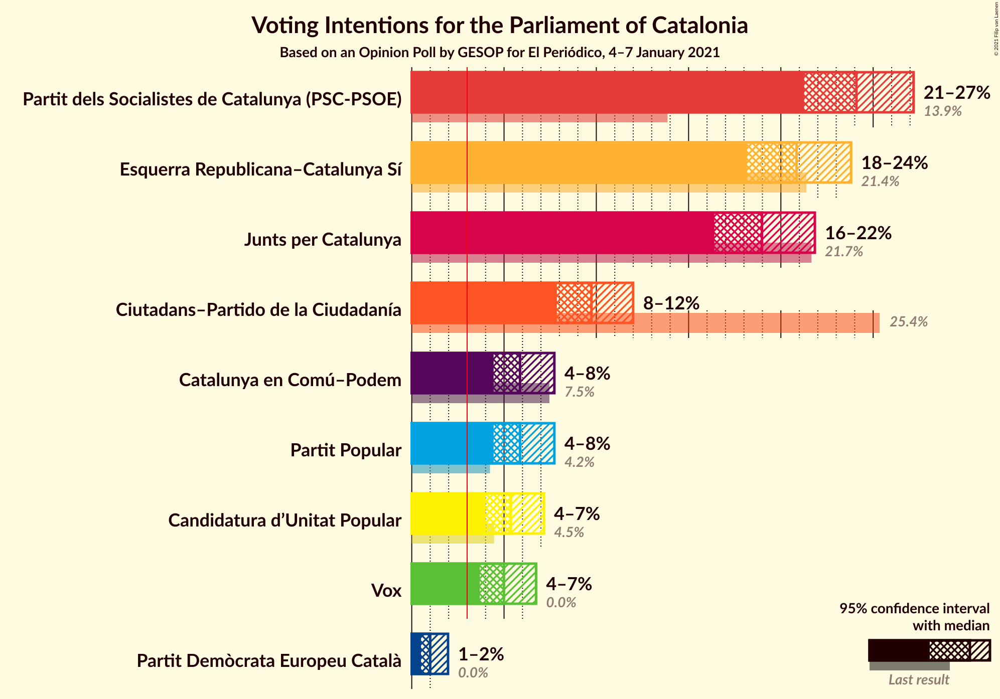

### Confidence Intervals

| Party | Last Result | Poll Result | 80% Confidence Interval | 90% Confidence Interval | 95% Confidence Interval | 99% Confidence Interval |
|:-----:|:-----------:|:-----------:|:-----------------------:|:-----------------------:|:-----------------------:|:-----------------------:|
| Partit dels Socialistes de Catalunya (PSC-PSOE) | 13.9% | 24.1% | 22.2–26.1% |21.7–26.7% |21.3–27.2% |20.4–28.2% |
| Esquerra Republicana–Catalunya Sí | 21.4% | 20.8% | 19.1–22.8% |18.6–23.3% |18.2–23.8% |17.4–24.8% |
| Junts per Catalunya | 21.7% | 19.0% | 17.3–20.9% |16.8–21.4% |16.4–21.8% |15.6–22.8% |
| Ciutadans–Partido de la Ciudadanía | 25.4% | 9.7% | 8.5–11.2% |8.2–11.6% |7.9–12.0% |7.3–12.7% |
| Catalunya en Comú–Podem | 7.5% | 5.9% | 4.9–7.1% |4.7–7.4% |4.4–7.7% |4.0–8.3% |
| Partit Popular | 4.2% | 5.9% | 4.9–7.1% |4.7–7.4% |4.4–7.7% |4.0–8.3% |
| Candidatura d’Unitat Popular | 4.5% | 5.4% | 4.5–6.5% |4.2–6.9% |4.0–7.2% |3.6–7.8% |
| Vox | 0.0% | 5.0% | 4.1–6.1% |3.9–6.4% |3.7–6.7% |3.3–7.3% |
| Partit Demòcrata Europeu Català | 0.0% | 1.0% | 0.7–1.6% |0.6–1.8% |0.5–2.0% |0.4–2.3% |

*Note:* The poll result column reflects the actual value used in the calculations. Published results may vary slightly, and in addition be rounded to fewer digits.

## Seats

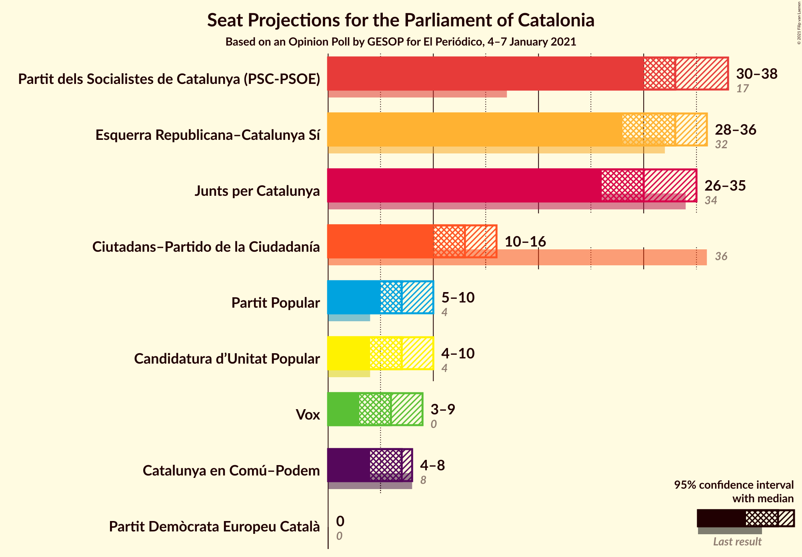

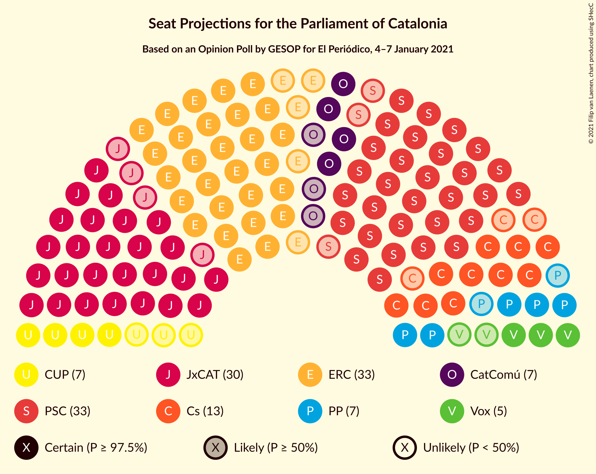

### Confidence Intervals

| Party | Last Result | Median | 80% Confidence Interval | 90% Confidence Interval | 95% Confidence Interval | 99% Confidence Interval |
|:-----:|:-----------:|:------:|:-----------------------:|:-----------------------:|:-----------------------:|:-----------------------:|
| <a href="#partit-dels-socialistes-de-catalunya-(psc-psoe)">Partit dels Socialistes de Catalunya (PSC-PSOE)</a> | 17 | 33 | 31–36 |30–37 |30–38 |27–40 |
| <a href="#esquerra-republicana–catalunya-sí">Esquerra Republicana–Catalunya Sí</a> | 32 | 33 | 29–35 |28–35 |28–36 |26–37 |
| <a href="#junts-per-catalunya">Junts per Catalunya</a> | 34 | 30 | 27–33 |26–34 |26–35 |25–37 |
| <a href="#ciutadans–partido-de-la-ciudadanía">Ciutadans–Partido de la Ciudadanía</a> | 36 | 13 | 12–15 |11–16 |10–16 |8–18 |
| <a href="#catalunya-en-comú–podem">Catalunya en Comú–Podem</a> | 8 | 7 | 5–8 |4–8 |4–8 |4–10 |
| <a href="#partit-popular">Partit Popular</a> | 4 | 7 | 5–9 |5–9 |5–10 |3–11 |
| <a href="#candidatura-d’unitat-popular">Candidatura d’Unitat Popular</a> | 4 | 7 | 5–8 |4–9 |4–10 |4–10 |
| <a href="#vox">Vox</a> | 0 | 6 | 4–7 |3–8 |3–9 |3–9 |
| <a href="#partit-demòcrata-europeu-català">Partit Demòcrata Europeu Català</a> | 0 | 0 | 0 |0 |0 |0 |

### Partit dels Socialistes de Catalunya (PSC-PSOE)

*For a full overview of the results for this party, see the [Partit dels Socialistes de Catalunya (PSC-PSOE)](party-partitdelssocialistesdecatalunyapsc-psoe.html) page.*

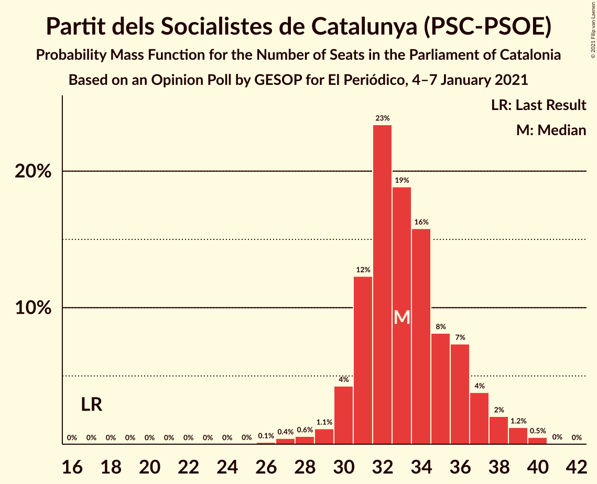

| Number of Seats | Probability | Accumulated | Special Marks |
|:---------------:|:-----------:|:-----------:|:-------------:|
| 17 | 0% | 100% | Last Result |
| 18 | 0% | 100% |  |
| 19 | 0% | 100% |  |
| 20 | 0% | 100% |  |
| 21 | 0% | 100% |  |
| 22 | 0% | 100% |  |
| 23 | 0% | 100% |  |
| 24 | 0% | 100% |  |
| 25 | 0% | 100% |  |
| 26 | 0.1% | 100% |  |
| 27 | 0.4% | 99.8% |  |
| 28 | 0.6% | 99.4% |  |
| 29 | 1.1% | 98.8% |  |
| 30 | 4% | 98% |  |
| 31 | 12% | 93% |  |
| 32 | 23% | 81% |  |
| 33 | 19% | 58% | Median |
| 34 | 16% | 39% |  |
| 35 | 8% | 23% |  |
| 36 | 7% | 15% |  |
| 37 | 4% | 8% |  |
| 38 | 2% | 4% |  |
| 39 | 1.2% | 2% |  |
| 40 | 0.5% | 0.6% |  |
| 41 | 0% | 0.1% |  |
| 42 | 0% | 0% |  |

### Esquerra Republicana–Catalunya Sí

*For a full overview of the results for this party, see the [Esquerra Republicana–Catalunya Sí](party-esquerrarepublicana–catalunyasí.html) page.*

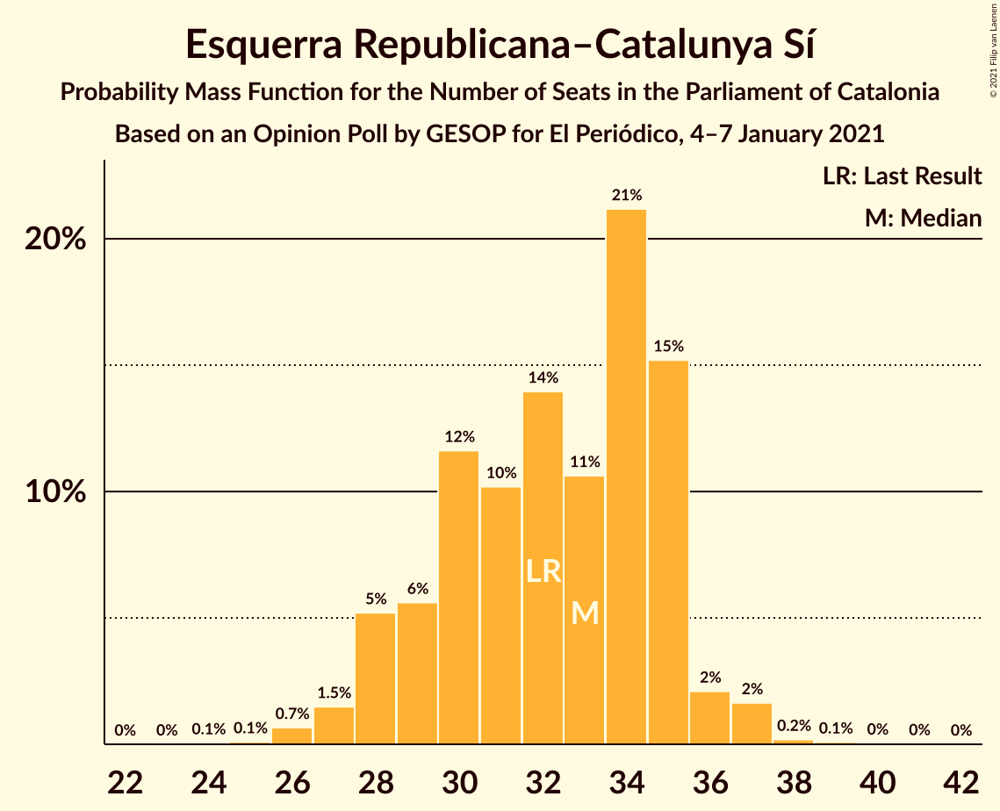

| Number of Seats | Probability | Accumulated | Special Marks |
|:---------------:|:-----------:|:-----------:|:-------------:|
| 24 | 0.1% | 100% |  |
| 25 | 0.1% | 99.9% |  |
| 26 | 0.7% | 99.8% |  |
| 27 | 1.5% | 99.2% |  |
| 28 | 5% | 98% |  |
| 29 | 6% | 92% |  |
| 30 | 12% | 87% |  |
| 31 | 10% | 75% |  |
| 32 | 14% | 65% | Last Result |
| 33 | 11% | 51% | Median |
| 34 | 21% | 40% |  |
| 35 | 15% | 19% |  |
| 36 | 2% | 4% |  |
| 37 | 2% | 2% |  |
| 38 | 0.2% | 0.3% |  |
| 39 | 0.1% | 0.2% |  |
| 40 | 0% | 0.1% |  |
| 41 | 0% | 0% |  |

### Junts per Catalunya

*For a full overview of the results for this party, see the [Junts per Catalunya](party-juntspercatalunya.html) page.*

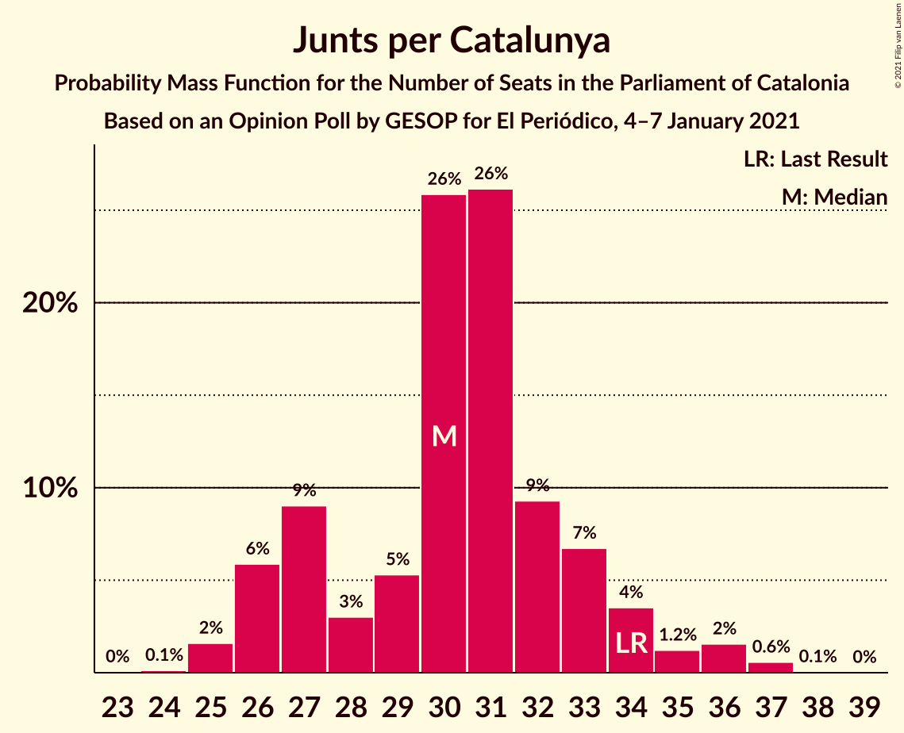

| Number of Seats | Probability | Accumulated | Special Marks |
|:---------------:|:-----------:|:-----------:|:-------------:|
| 23 | 0% | 100% |  |
| 24 | 0.1% | 99.9% |  |
| 25 | 2% | 99.8% |  |
| 26 | 6% | 98% |  |
| 27 | 9% | 92% |  |
| 28 | 3% | 83% |  |
| 29 | 5% | 80% |  |
| 30 | 26% | 75% | Median |
| 31 | 26% | 49% |  |
| 32 | 9% | 23% |  |
| 33 | 7% | 14% |  |
| 34 | 4% | 7% | Last Result |
| 35 | 1.2% | 3% |  |
| 36 | 2% | 2% |  |
| 37 | 0.6% | 0.7% |  |
| 38 | 0.1% | 0.1% |  |
| 39 | 0% | 0% |  |

### Ciutadans–Partido de la Ciudadanía

*For a full overview of the results for this party, see the [Ciutadans–Partido de la Ciudadanía](party-ciutadans–partidodelaciudadanía.html) page.*

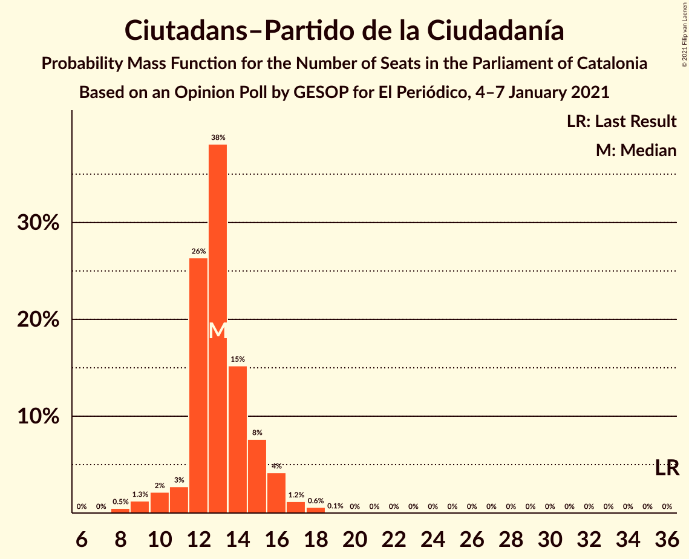

| Number of Seats | Probability | Accumulated | Special Marks |
|:---------------:|:-----------:|:-----------:|:-------------:|
| 8 | 0.5% | 100% |  |
| 9 | 1.3% | 99.5% |  |
| 10 | 2% | 98% |  |
| 11 | 3% | 96% |  |
| 12 | 26% | 93% |  |
| 13 | 38% | 67% | Median |
| 14 | 15% | 29% |  |
| 15 | 8% | 14% |  |
| 16 | 4% | 6% |  |
| 17 | 1.2% | 2% |  |
| 18 | 0.6% | 0.7% |  |
| 19 | 0.1% | 0.1% |  |
| 20 | 0% | 0% |  |
| 21 | 0% | 0% |  |
| 22 | 0% | 0% |  |
| 23 | 0% | 0% |  |
| 24 | 0% | 0% |  |
| 25 | 0% | 0% |  |
| 26 | 0% | 0% |  |
| 27 | 0% | 0% |  |
| 28 | 0% | 0% |  |
| 29 | 0% | 0% |  |
| 30 | 0% | 0% |  |
| 31 | 0% | 0% |  |
| 32 | 0% | 0% |  |
| 33 | 0% | 0% |  |
| 34 | 0% | 0% |  |
| 35 | 0% | 0% |  |
| 36 | 0% | 0% | Last Result |

### Catalunya en Comú–Podem

*For a full overview of the results for this party, see the [Catalunya en Comú–Podem](party-catalunyaencomú–podem.html) page.*

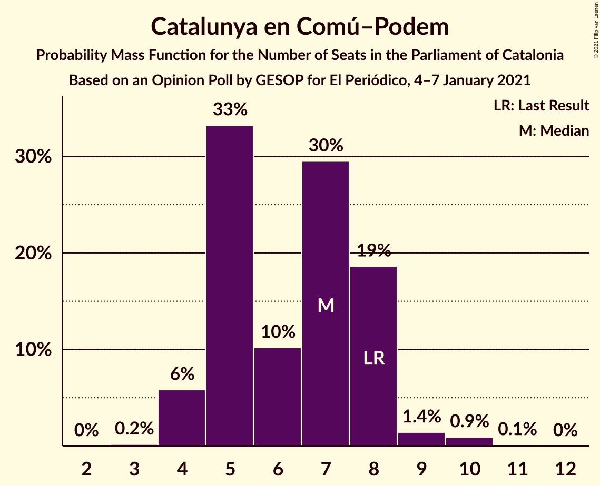

| Number of Seats | Probability | Accumulated | Special Marks |
|:---------------:|:-----------:|:-----------:|:-------------:|
| 3 | 0.2% | 100% |  |
| 4 | 6% | 99.8% |  |
| 5 | 33% | 94% |  |
| 6 | 10% | 61% |  |
| 7 | 30% | 51% | Median |
| 8 | 19% | 21% | Last Result |
| 9 | 1.4% | 2% |  |
| 10 | 0.9% | 1.0% |  |
| 11 | 0.1% | 0.1% |  |
| 12 | 0% | 0% |  |

### Partit Popular

*For a full overview of the results for this party, see the [Partit Popular](party-partitpopular.html) page.*

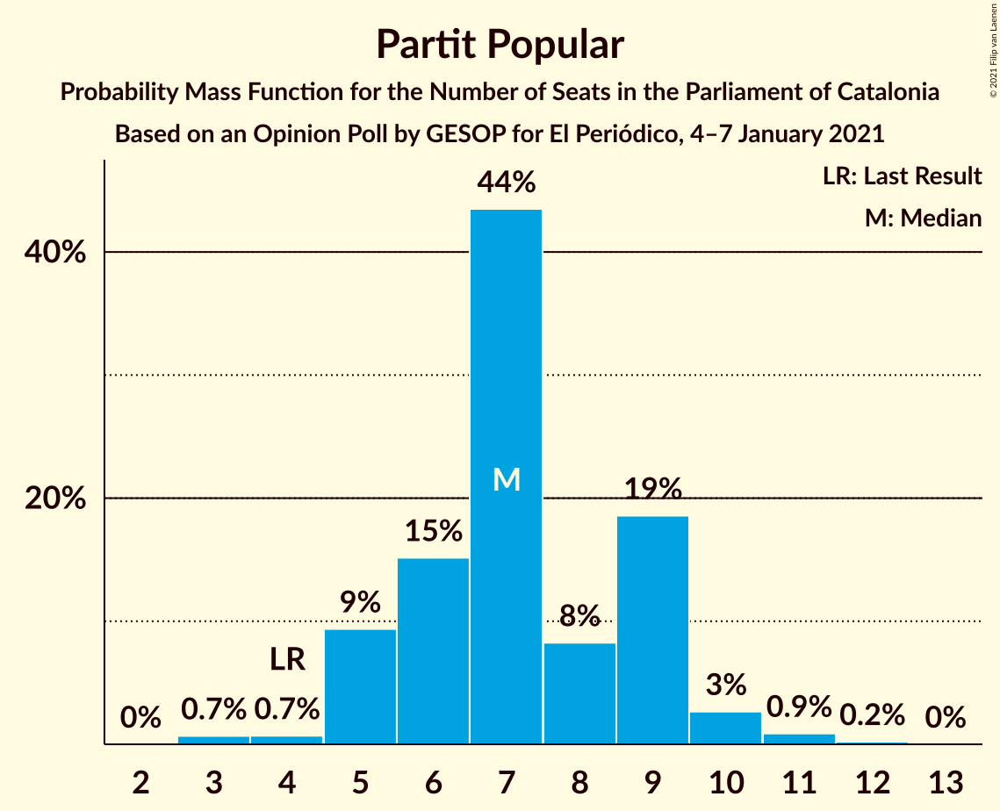

| Number of Seats | Probability | Accumulated | Special Marks |
|:---------------:|:-----------:|:-----------:|:-------------:|
| 3 | 0.7% | 100% |  |
| 4 | 0.7% | 99.3% | Last Result |
| 5 | 9% | 98.6% |  |
| 6 | 15% | 89% |  |
| 7 | 44% | 74% | Median |
| 8 | 8% | 31% |  |
| 9 | 19% | 22% |  |
| 10 | 3% | 4% |  |
| 11 | 0.9% | 1.1% |  |
| 12 | 0.2% | 0.2% |  |
| 13 | 0% | 0% |  |

### Candidatura d’Unitat Popular

*For a full overview of the results for this party, see the [Candidatura d’Unitat Popular](party-candidaturad’unitatpopular.html) page.*

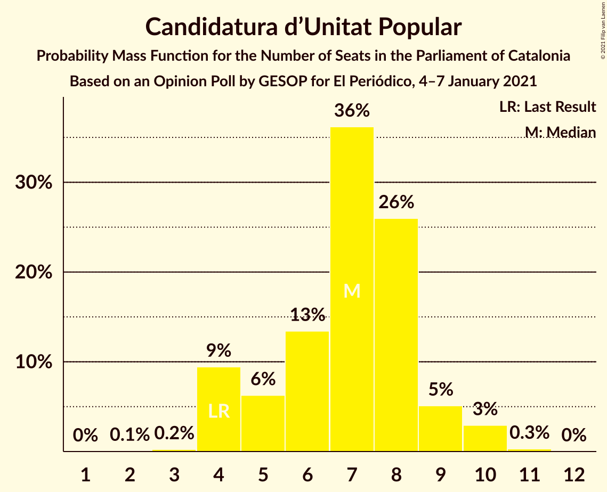

| Number of Seats | Probability | Accumulated | Special Marks |
|:---------------:|:-----------:|:-----------:|:-------------:|
| 2 | 0.1% | 100% |  |
| 3 | 0.2% | 99.9% |  |
| 4 | 9% | 99.7% | Last Result |
| 5 | 6% | 90% |  |
| 6 | 13% | 84% |  |
| 7 | 36% | 71% | Median |
| 8 | 26% | 34% |  |
| 9 | 5% | 8% |  |
| 10 | 3% | 3% |  |
| 11 | 0.3% | 0.3% |  |
| 12 | 0% | 0% |  |

### Vox

*For a full overview of the results for this party, see the [Vox](party-vox.html) page.*

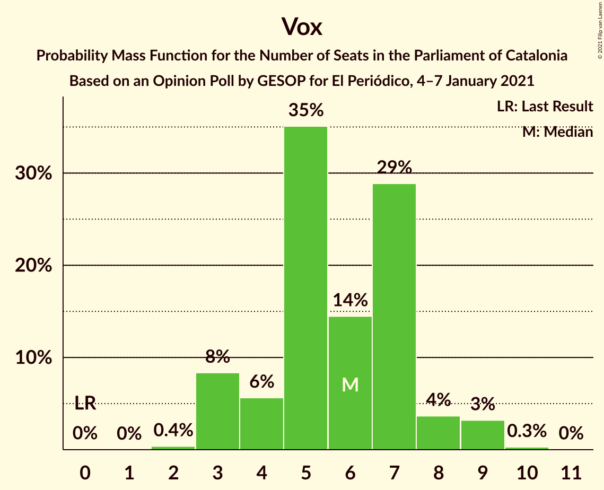

| Number of Seats | Probability | Accumulated | Special Marks |
|:---------------:|:-----------:|:-----------:|:-------------:|
| 0 | 0% | 100% | Last Result |
| 1 | 0% | 100% |  |
| 2 | 0.4% | 100% |  |
| 3 | 8% | 99.6% |  |
| 4 | 6% | 91% |  |
| 5 | 35% | 86% |  |
| 6 | 14% | 51% | Median |
| 7 | 29% | 36% |  |
| 8 | 4% | 7% |  |
| 9 | 3% | 4% |  |
| 10 | 0.3% | 0.3% |  |
| 11 | 0% | 0% |  |

### Partit Demòcrata Europeu Català

*For a full overview of the results for this party, see the [Partit Demòcrata Europeu Català](party-partitdemòcrataeuropeucatalà.html) page.*

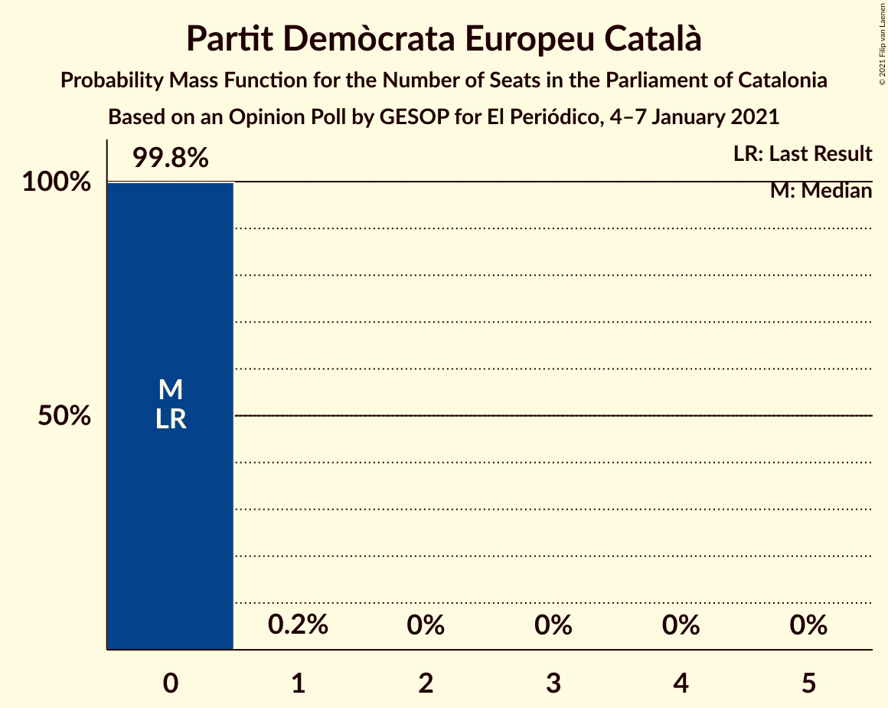

| Number of Seats | Probability | Accumulated | Special Marks |
|:---------------:|:-----------:|:-----------:|:-------------:|
| 0 | 99.8% | 100% | Last Result, Median |
| 1 | 0.2% | 0.2% |  |
| 2 | 0% | 0% |  |

## Coalitions

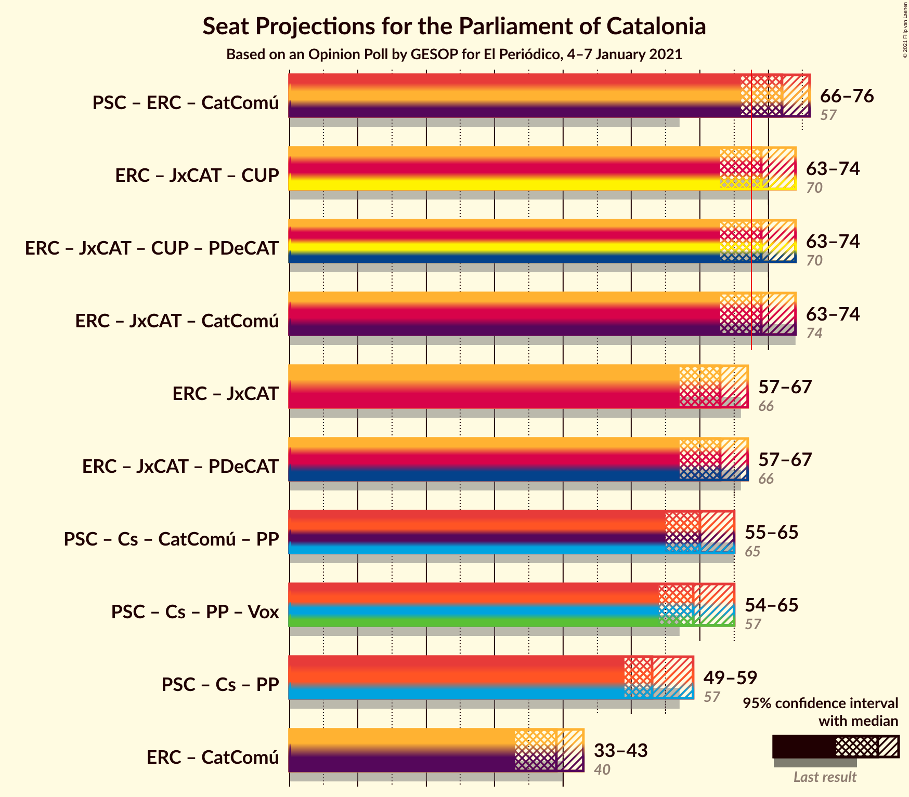

### Confidence Intervals

| Coalition | Last Result | Median | Majority? | 80% Confidence Interval | 90% Confidence Interval | 95% Confidence Interval | 99% Confidence Interval |
|:---------:|:-----------:|:------:|:---------:|:-----------------------:|:-----------------------:|:-----------------------:|:-----------------------:|
| Partit dels Socialistes de Catalunya (PSC-PSOE) – Esquerra Republicana–Catalunya Sí – Catalunya en Comú–Podem | 57 | 72 | 90% | 68–75 | 67–76 | 66–76 | 65–78 |
| Esquerra Republicana–Catalunya Sí – Junts per Catalunya – Candidatura d’Unitat Popular | 70 | 69 | 79% | 66–73 | 65–74 | 63–74 | 62–77 |
| Esquerra Republicana–Catalunya Sí – Junts per Catalunya – Candidatura d’Unitat Popular – Partit Demòcrata Europeu Català | 70 | 69 | 79% | 66–73 | 65–74 | 63–74 | 62–77 |
| Esquerra Republicana–Catalunya Sí – Junts per Catalunya – Catalunya en Comú–Podem | 74 | 69 | 71% | 65–72 | 64–73 | 63–74 | 61–76 |
| Esquerra Republicana–Catalunya Sí – Junts per Catalunya | 66 | 63 | 2% | 59–66 | 58–67 | 57–67 | 55–69 |
| Esquerra Republicana–Catalunya Sí – Junts per Catalunya – Partit Demòcrata Europeu Català | 66 | 63 | 2% | 59–66 | 58–67 | 57–67 | 55–69 |
| Partit dels Socialistes de Catalunya (PSC-PSOE) – Ciutadans–Partido de la Ciudadanía – Catalunya en Comú–Podem – Partit Popular | 65 | 60 | 0.3% | 57–63 | 56–64 | 55–65 | 53–67 |
| Partit dels Socialistes de Catalunya (PSC-PSOE) – Ciutadans–Partido de la Ciudadanía – Partit Popular – Vox | 57 | 59 | 0.2% | 56–62 | 55–64 | 54–65 | 53–67 |
| Partit dels Socialistes de Catalunya (PSC-PSOE) – Ciutadans–Partido de la Ciudadanía – Partit Popular | 57 | 53 | 0% | 50–57 | 49–58 | 49–59 | 47–61 |
| Esquerra Republicana–Catalunya Sí – Catalunya en Comú–Podem | 40 | 39 | 0% | 35–42 | 34–42 | 33–43 | 31–44 |

### Partit dels Socialistes de Catalunya (PSC-PSOE) – Esquerra Republicana–Catalunya Sí – Catalunya en Comú–Podem

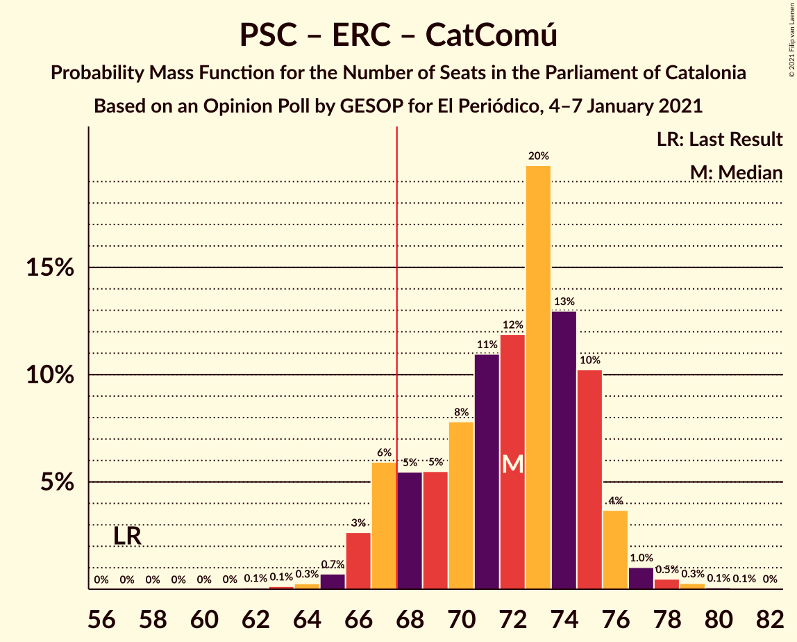

| Number of Seats | Probability | Accumulated | Special Marks |
|:---------------:|:-----------:|:-----------:|:-------------:|
| 57 | 0% | 100% | Last Result |
| 58 | 0% | 100% |  |
| 59 | 0% | 100% |  |
| 60 | 0% | 100% |  |
| 61 | 0% | 100% |  |
| 62 | 0.1% | 100% |  |
| 63 | 0.1% | 99.9% |  |
| 64 | 0.3% | 99.8% |  |
| 65 | 0.7% | 99.5% |  |
| 66 | 3% | 98.8% |  |
| 67 | 6% | 96% |  |
| 68 | 5% | 90% | Majority |
| 69 | 5% | 85% |  |
| 70 | 8% | 79% |  |
| 71 | 11% | 71% |  |
| 72 | 12% | 60% |  |
| 73 | 20% | 49% | Median |
| 74 | 13% | 29% |  |
| 75 | 10% | 16% |  |
| 76 | 4% | 6% |  |
| 77 | 1.0% | 2% |  |
| 78 | 0.5% | 0.9% |  |
| 79 | 0.3% | 0.4% |  |
| 80 | 0.1% | 0.2% |  |
| 81 | 0.1% | 0.1% |  |
| 82 | 0% | 0% |  |

### Esquerra Republicana–Catalunya Sí – Junts per Catalunya – Candidatura d’Unitat Popular

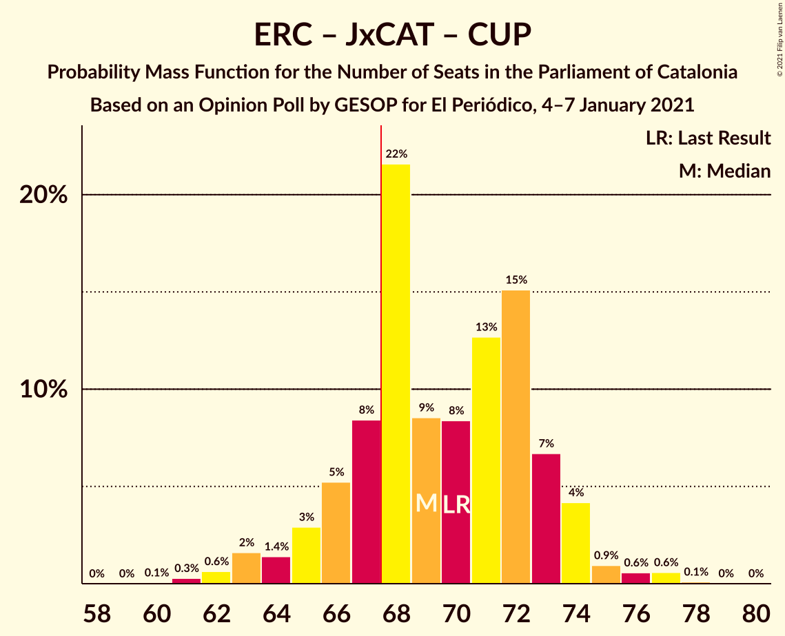

| Number of Seats | Probability | Accumulated | Special Marks |
|:---------------:|:-----------:|:-----------:|:-------------:|
| 60 | 0.1% | 100% |  |
| 61 | 0.3% | 99.9% |  |
| 62 | 0.6% | 99.6% |  |
| 63 | 2% | 99.0% |  |
| 64 | 1.4% | 97% |  |
| 65 | 3% | 96% |  |
| 66 | 5% | 93% |  |
| 67 | 8% | 88% |  |
| 68 | 22% | 79% | Majority |
| 69 | 9% | 58% |  |
| 70 | 8% | 49% | Last Result, Median |
| 71 | 13% | 41% |  |
| 72 | 15% | 28% |  |
| 73 | 7% | 13% |  |
| 74 | 4% | 6% |  |
| 75 | 0.9% | 2% |  |
| 76 | 0.6% | 1.3% |  |
| 77 | 0.6% | 0.7% |  |
| 78 | 0.1% | 0.1% |  |
| 79 | 0% | 0% |  |

### Esquerra Republicana–Catalunya Sí – Junts per Catalunya – Candidatura d’Unitat Popular – Partit Demòcrata Europeu Català

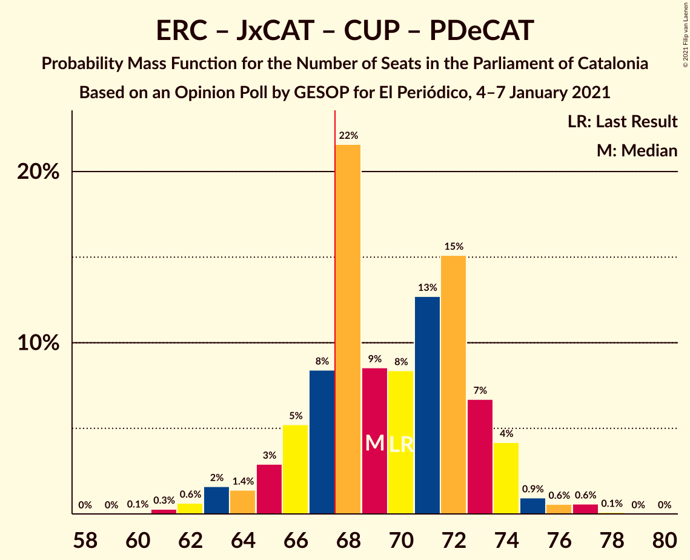

| Number of Seats | Probability | Accumulated | Special Marks |
|:---------------:|:-----------:|:-----------:|:-------------:|
| 60 | 0.1% | 100% |  |
| 61 | 0.3% | 99.9% |  |
| 62 | 0.6% | 99.6% |  |
| 63 | 2% | 99.0% |  |
| 64 | 1.4% | 97% |  |
| 65 | 3% | 96% |  |
| 66 | 5% | 93% |  |
| 67 | 8% | 88% |  |
| 68 | 22% | 79% | Majority |
| 69 | 9% | 58% |  |
| 70 | 8% | 49% | Last Result, Median |
| 71 | 13% | 41% |  |
| 72 | 15% | 28% |  |
| 73 | 7% | 13% |  |
| 74 | 4% | 6% |  |
| 75 | 0.9% | 2% |  |
| 76 | 0.6% | 1.3% |  |
| 77 | 0.6% | 0.7% |  |
| 78 | 0.1% | 0.1% |  |
| 79 | 0% | 0% |  |

### Esquerra Republicana–Catalunya Sí – Junts per Catalunya – Catalunya en Comú–Podem

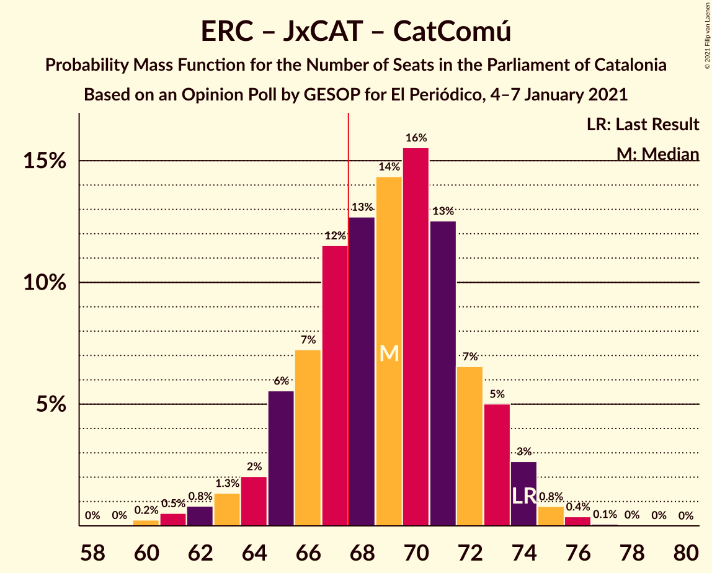

| Number of Seats | Probability | Accumulated | Special Marks |
|:---------------:|:-----------:|:-----------:|:-------------:|
| 59 | 0% | 100% |  |
| 60 | 0.2% | 99.9% |  |
| 61 | 0.5% | 99.7% |  |
| 62 | 0.8% | 99.2% |  |
| 63 | 1.3% | 98% |  |
| 64 | 2% | 97% |  |
| 65 | 6% | 95% |  |
| 66 | 7% | 89% |  |
| 67 | 12% | 82% |  |
| 68 | 13% | 71% | Majority |
| 69 | 14% | 58% |  |
| 70 | 16% | 44% | Median |
| 71 | 13% | 28% |  |
| 72 | 7% | 16% |  |
| 73 | 5% | 9% |  |
| 74 | 3% | 4% | Last Result |
| 75 | 0.8% | 1.3% |  |
| 76 | 0.4% | 0.5% |  |
| 77 | 0.1% | 0.2% |  |
| 78 | 0% | 0.1% |  |
| 79 | 0% | 0% |  |

### Esquerra Republicana–Catalunya Sí – Junts per Catalunya

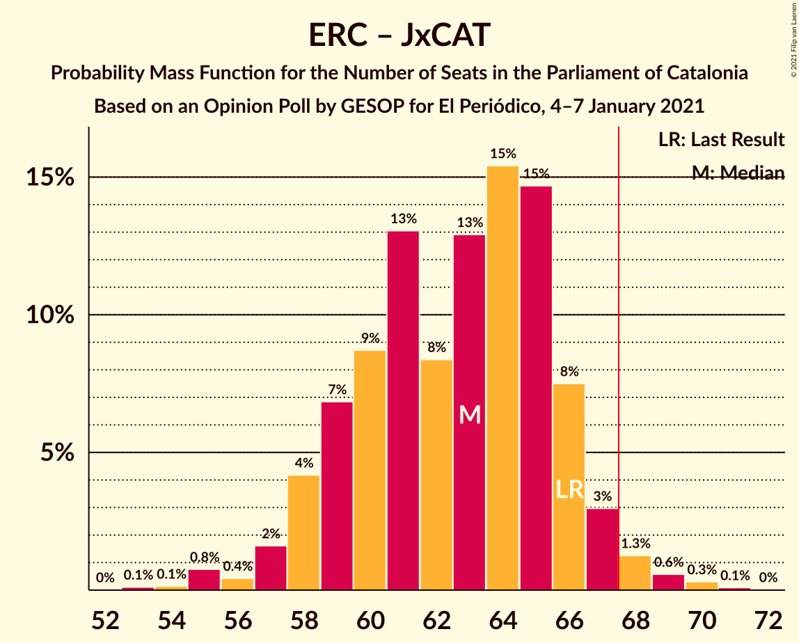

| Number of Seats | Probability | Accumulated | Special Marks |
|:---------------:|:-----------:|:-----------:|:-------------:|
| 53 | 0.1% | 100% |  |
| 54 | 0.1% | 99.9% |  |
| 55 | 0.8% | 99.7% |  |
| 56 | 0.4% | 99.0% |  |
| 57 | 2% | 98.5% |  |
| 58 | 4% | 97% |  |
| 59 | 7% | 93% |  |
| 60 | 9% | 86% |  |
| 61 | 13% | 77% |  |
| 62 | 8% | 64% |  |
| 63 | 13% | 56% | Median |
| 64 | 15% | 43% |  |
| 65 | 15% | 27% |  |
| 66 | 8% | 13% | Last Result |
| 67 | 3% | 5% |  |
| 68 | 1.3% | 2% | Majority |
| 69 | 0.6% | 1.0% |  |
| 70 | 0.3% | 0.4% |  |
| 71 | 0.1% | 0.1% |  |
| 72 | 0% | 0% |  |

### Esquerra Republicana–Catalunya Sí – Junts per Catalunya – Partit Demòcrata Europeu Català

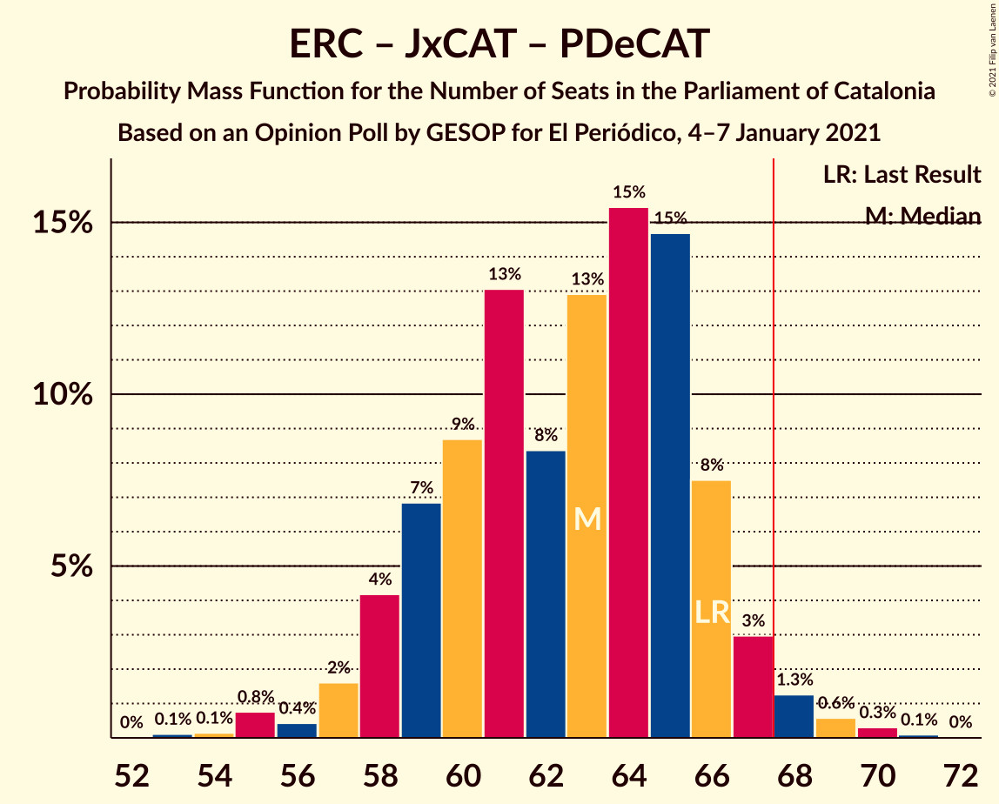

| Number of Seats | Probability | Accumulated | Special Marks |
|:---------------:|:-----------:|:-----------:|:-------------:|
| 53 | 0.1% | 100% |  |
| 54 | 0.1% | 99.9% |  |
| 55 | 0.8% | 99.7% |  |
| 56 | 0.4% | 99.0% |  |
| 57 | 2% | 98.5% |  |
| 58 | 4% | 97% |  |
| 59 | 7% | 93% |  |
| 60 | 9% | 86% |  |
| 61 | 13% | 77% |  |
| 62 | 8% | 64% |  |
| 63 | 13% | 56% | Median |
| 64 | 15% | 43% |  |
| 65 | 15% | 27% |  |
| 66 | 8% | 13% | Last Result |
| 67 | 3% | 5% |  |
| 68 | 1.3% | 2% | Majority |
| 69 | 0.6% | 1.0% |  |
| 70 | 0.3% | 0.4% |  |
| 71 | 0.1% | 0.1% |  |
| 72 | 0% | 0% |  |

### Partit dels Socialistes de Catalunya (PSC-PSOE) – Ciutadans–Partido de la Ciudadanía – Catalunya en Comú–Podem – Partit Popular

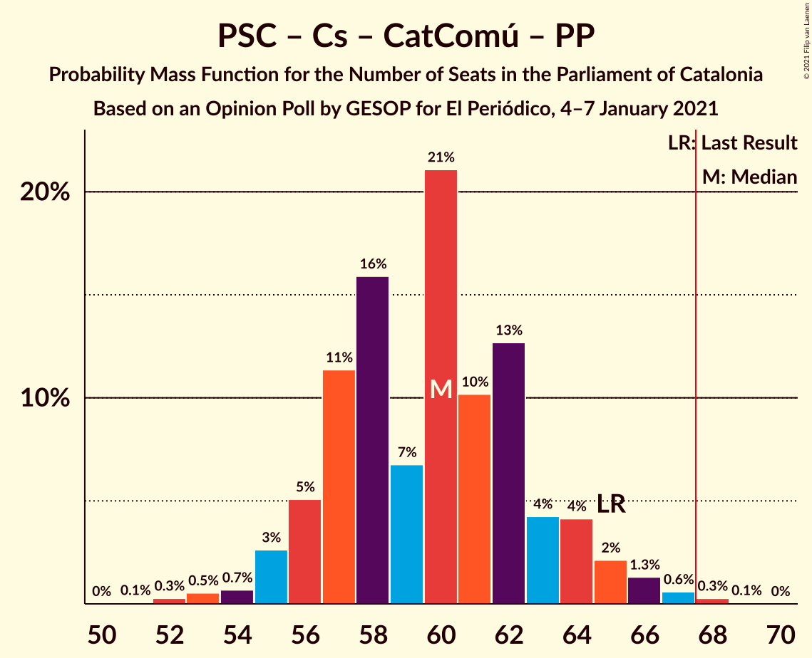

| Number of Seats | Probability | Accumulated | Special Marks |
|:---------------:|:-----------:|:-----------:|:-------------:|
| 51 | 0.1% | 100% |  |
| 52 | 0.3% | 99.9% |  |
| 53 | 0.5% | 99.6% |  |
| 54 | 0.7% | 99.1% |  |
| 55 | 3% | 98% |  |
| 56 | 5% | 96% |  |
| 57 | 11% | 91% |  |
| 58 | 16% | 79% |  |
| 59 | 7% | 63% |  |
| 60 | 21% | 57% | Median |
| 61 | 10% | 36% |  |
| 62 | 13% | 25% |  |
| 63 | 4% | 13% |  |
| 64 | 4% | 8% |  |
| 65 | 2% | 4% | Last Result |
| 66 | 1.3% | 2% |  |
| 67 | 0.6% | 0.9% |  |
| 68 | 0.3% | 0.3% | Majority |
| 69 | 0.1% | 0.1% |  |
| 70 | 0% | 0% |  |

### Partit dels Socialistes de Catalunya (PSC-PSOE) – Ciutadans–Partido de la Ciudadanía – Partit Popular – Vox

| Number of Seats | Probability | Accumulated | Special Marks |
|:---------------:|:-----------:|:-----------:|:-------------:|
| 50 | 0% | 100% |  |
| 51 | 0.1% | 99.9% |  |
| 52 | 0.3% | 99.8% |  |
| 53 | 1.0% | 99.6% |  |
| 54 | 3% | 98.6% |  |
| 55 | 4% | 96% |  |
| 56 | 5% | 92% |  |
| 57 | 11% | 87% | Last Result |
| 58 | 15% | 76% |  |
| 59 | 17% | 60% | Median |
| 60 | 16% | 43% |  |
| 61 | 11% | 27% |  |
| 62 | 7% | 16% |  |
| 63 | 3% | 9% |  |
| 64 | 2% | 7% |  |
| 65 | 3% | 4% |  |
| 66 | 0.7% | 1.3% |  |
| 67 | 0.4% | 0.6% |  |
| 68 | 0.1% | 0.2% | Majority |
| 69 | 0.1% | 0.1% |  |
| 70 | 0% | 0% |  |

### Partit dels Socialistes de Catalunya (PSC-PSOE) – Ciutadans–Partido de la Ciudadanía – Partit Popular

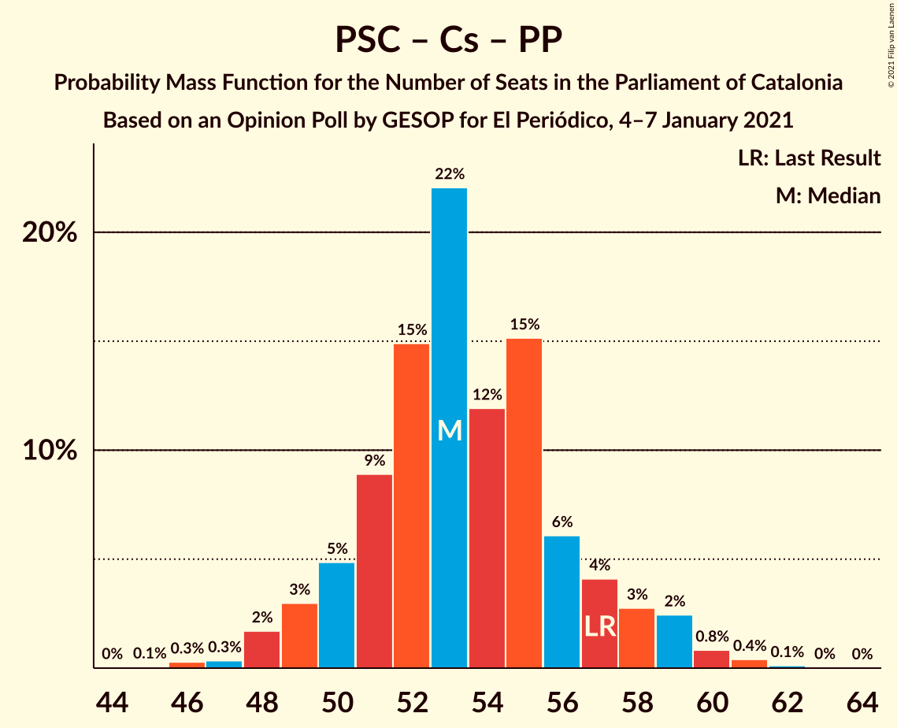

| Number of Seats | Probability | Accumulated | Special Marks |
|:---------------:|:-----------:|:-----------:|:-------------:|
| 45 | 0.1% | 100% |  |
| 46 | 0.3% | 99.9% |  |
| 47 | 0.3% | 99.6% |  |
| 48 | 2% | 99.3% |  |
| 49 | 3% | 98% |  |
| 50 | 5% | 95% |  |
| 51 | 9% | 90% |  |
| 52 | 15% | 81% |  |
| 53 | 22% | 66% | Median |
| 54 | 12% | 44% |  |
| 55 | 15% | 32% |  |
| 56 | 6% | 17% |  |
| 57 | 4% | 11% | Last Result |
| 58 | 3% | 7% |  |
| 59 | 2% | 4% |  |
| 60 | 0.8% | 1.4% |  |
| 61 | 0.4% | 0.6% |  |
| 62 | 0.1% | 0.2% |  |
| 63 | 0% | 0.1% |  |
| 64 | 0% | 0% |  |

### Esquerra Republicana–Catalunya Sí – Catalunya en Comú–Podem

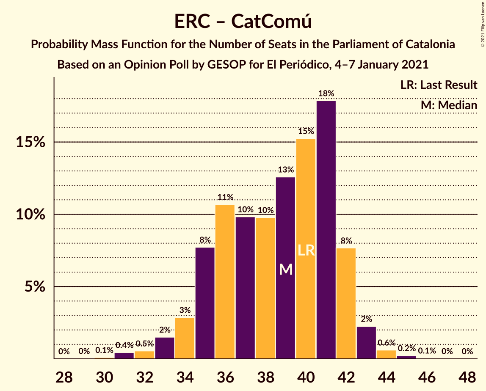

| Number of Seats | Probability | Accumulated | Special Marks |
|:---------------:|:-----------:|:-----------:|:-------------:|
| 30 | 0.1% | 100% |  |
| 31 | 0.4% | 99.9% |  |
| 32 | 0.5% | 99.4% |  |
| 33 | 2% | 98.9% |  |
| 34 | 3% | 97% |  |
| 35 | 8% | 95% |  |
| 36 | 11% | 87% |  |
| 37 | 10% | 76% |  |
| 38 | 10% | 66% |  |
| 39 | 13% | 57% |  |
| 40 | 15% | 44% | Last Result, Median |
| 41 | 18% | 29% |  |
| 42 | 8% | 11% |  |
| 43 | 2% | 3% |  |
| 44 | 0.6% | 0.9% |  |
| 45 | 0.2% | 0.3% |  |
| 46 | 0.1% | 0.1% |  |
| 47 | 0% | 0% |  |

## Technical Information

### Opinion Poll

+ **Polling firm:** GESOP
+ **Commissioner(s):** El Periódico
+ **Fieldwork period:** 4–7 January 2021

### Calculations

+ **Sample size:** 801
+ **Simulations done:** 1,048,576
+ **Error estimate:** 1.51%

