# Opinion Poll by GAD3 for La Vanguardia, 4–8 January 2021

<a href="#voting-intentions">Voting Intentions</a> | <a href="#seats">Seats</a> | <a href="#coalitions">Coalitions</a> | <a href="#technical-information">Technical Information</a>

## Voting Intentions

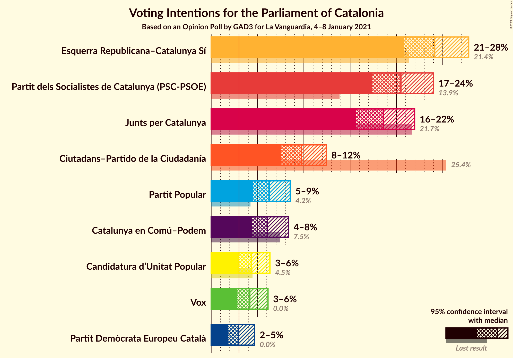

### Confidence Intervals

| Party | Last Result | Poll Result | 80% Confidence Interval | 90% Confidence Interval | 95% Confidence Interval | 99% Confidence Interval |
|:-----:|:-----------:|:-----------:|:-----------------------:|:-----------------------:|:-----------------------:|:-----------------------:|
| Esquerra Republicana–Catalunya Sí | 21.4% | 24.1% | 21.9–26.5% |21.3–27.2% |20.8–27.8% |19.8–29.0% |
| Partit dels Socialistes de Catalunya (PSC-PSOE) | 13.9% | 20.5% | 18.4–22.8% |17.9–23.4% |17.4–24.0% |16.4–25.1% |
| Junts per Catalunya | 21.7% | 18.6% | 16.6–20.8% |16.1–21.4% |15.6–22.0% |14.7–23.1% |
| Ciutadans–Partido de la Ciudadanía | 25.4% | 9.7% | 8.3–11.5% |7.9–12.0% |7.6–12.4% |6.9–13.3% |
| Partit Popular | 4.2% | 6.2% | 5.1–7.7% |4.8–8.2% |4.5–8.5% |4.1–9.3% |
| Catalunya en Comú–Podem | 7.5% | 6.1% | 5.0–7.5% |4.7–8.0% |4.4–8.3% |3.9–9.1% |
| Candidatura d’Unitat Popular | 4.5% | 4.3% | 3.4–5.6% |3.2–6.0% |3.0–6.3% |2.6–7.0% |
| Vox | 0.0% | 4.2% | 3.3–5.4% |3.0–5.8% |2.8–6.1% |2.4–6.8% |
| Partit Demòcrata Europeu Català | 0.0% | 3.0% | 2.2–4.1% |2.0–4.4% |1.8–4.7% |1.6–5.3% |

*Note:* The poll result column reflects the actual value used in the calculations. Published results may vary slightly, and in addition be rounded to fewer digits.

## Seats

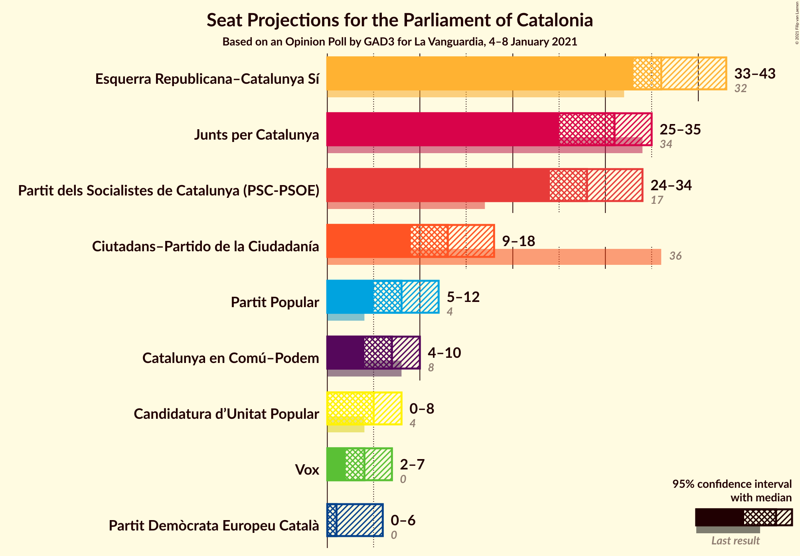

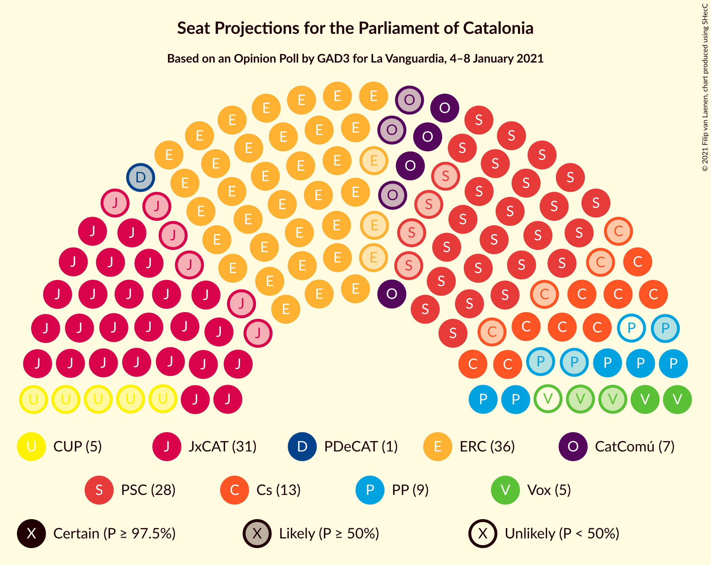

### Confidence Intervals

| Party | Last Result | Median | 80% Confidence Interval | 90% Confidence Interval | 95% Confidence Interval | 99% Confidence Interval |
|:-----:|:-----------:|:------:|:-----------------------:|:-----------------------:|:-----------------------:|:-----------------------:|
| <a href="#esquerra-republicana–catalunya-sí">Esquerra Republicana–Catalunya Sí</a> | 32 | 36 | 34–42 |33–43 |33–43 |30–44 |
| <a href="#partit-dels-socialistes-de-catalunya-(psc-psoe)">Partit dels Socialistes de Catalunya (PSC-PSOE)</a> | 17 | 28 | 25–32 |25–33 |24–34 |23–36 |
| <a href="#junts-per-catalunya">Junts per Catalunya</a> | 34 | 31 | 26–33 |25–35 |25–35 |23–37 |
| <a href="#ciutadans–partido-de-la-ciudadanía">Ciutadans–Partido de la Ciudadanía</a> | 36 | 13 | 12–15 |10–17 |9–18 |8–19 |
| <a href="#partit-popular">Partit Popular</a> | 4 | 8 | 6–10 |5–11 |5–12 |4–12 |
| <a href="#catalunya-en-comú–podem">Catalunya en Comú–Podem</a> | 8 | 7 | 5–9 |4–9 |4–10 |4–11 |
| <a href="#candidatura-d’unitat-popular">Candidatura d’Unitat Popular</a> | 4 | 5 | 3–8 |2–8 |0–8 |0–9 |
| <a href="#vox">Vox</a> | 0 | 4 | 3–7 |3–7 |2–7 |0–9 |
| <a href="#partit-demòcrata-europeu-català">Partit Demòcrata Europeu Català</a> | 0 | 1 | 0–5 |0–6 |0–6 |0–7 |

### Esquerra Republicana–Catalunya Sí

*For a full overview of the results for this party, see the [Esquerra Republicana–Catalunya Sí](party-esquerrarepublicana–catalunyasí.html) page.*

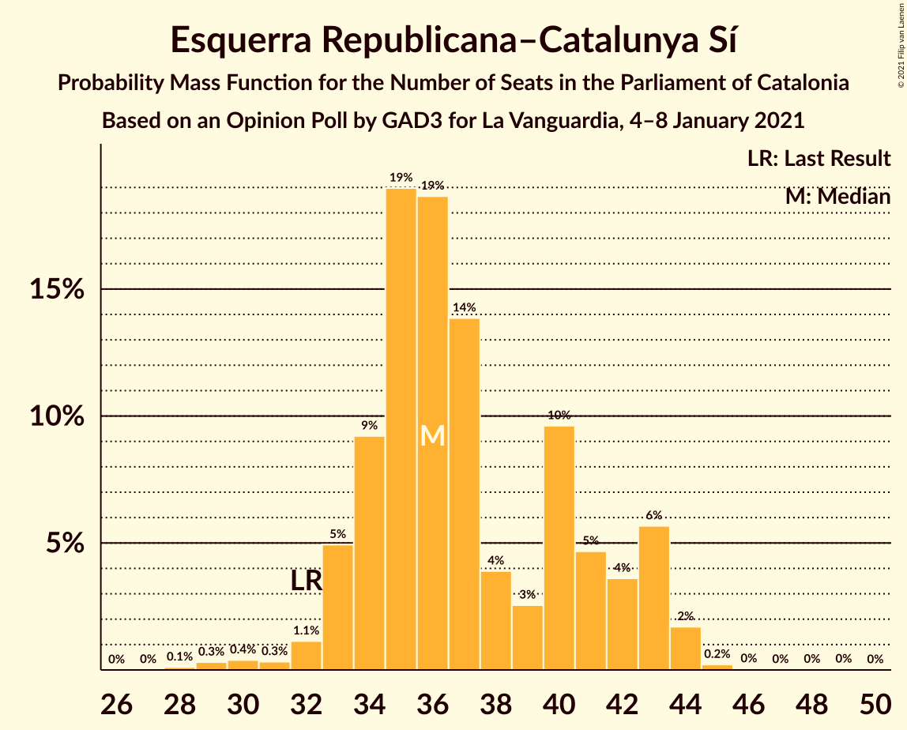

| Number of Seats | Probability | Accumulated | Special Marks |
|:---------------:|:-----------:|:-----------:|:-------------:|
| 28 | 0.1% | 100% |  |
| 29 | 0.3% | 99.9% |  |
| 30 | 0.4% | 99.6% |  |
| 31 | 0.3% | 99.2% |  |
| 32 | 1.1% | 98.8% | Last Result |
| 33 | 5% | 98% |  |
| 34 | 9% | 93% |  |
| 35 | 19% | 84% |  |
| 36 | 19% | 65% | Median |
| 37 | 14% | 46% |  |
| 38 | 4% | 32% |  |
| 39 | 3% | 28% |  |
| 40 | 10% | 26% |  |
| 41 | 5% | 16% |  |
| 42 | 4% | 11% |  |
| 43 | 6% | 8% |  |
| 44 | 2% | 2% |  |
| 45 | 0.2% | 0.3% |  |
| 46 | 0% | 0.1% |  |
| 47 | 0% | 0.1% |  |
| 48 | 0% | 0.1% |  |
| 49 | 0% | 0% |  |

### Partit dels Socialistes de Catalunya (PSC-PSOE)

*For a full overview of the results for this party, see the [Partit dels Socialistes de Catalunya (PSC-PSOE)](party-partitdelssocialistesdecatalunyapsc-psoe.html) page.*

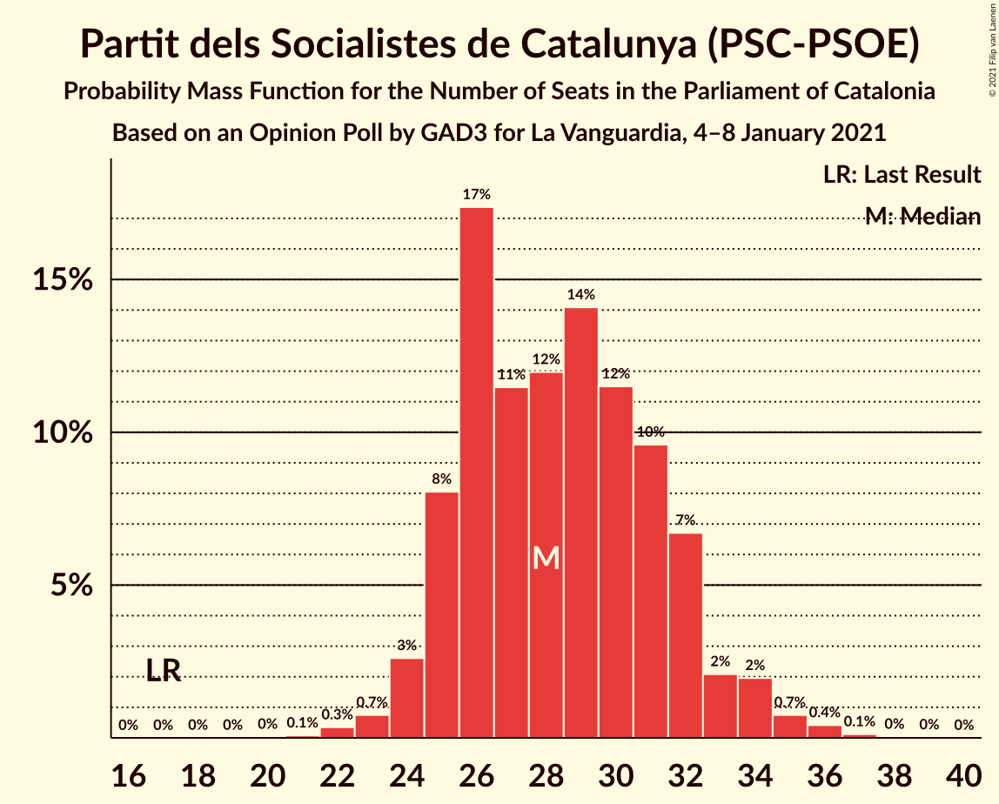

| Number of Seats | Probability | Accumulated | Special Marks |
|:---------------:|:-----------:|:-----------:|:-------------:|
| 17 | 0% | 100% | Last Result |
| 18 | 0% | 100% |  |
| 19 | 0% | 100% |  |
| 20 | 0% | 100% |  |
| 21 | 0.1% | 99.9% |  |
| 22 | 0.3% | 99.9% |  |
| 23 | 0.7% | 99.5% |  |
| 24 | 3% | 98.8% |  |
| 25 | 8% | 96% |  |
| 26 | 17% | 88% |  |
| 27 | 11% | 71% |  |
| 28 | 12% | 59% | Median |
| 29 | 14% | 47% |  |
| 30 | 12% | 33% |  |
| 31 | 10% | 22% |  |
| 32 | 7% | 12% |  |
| 33 | 2% | 5% |  |
| 34 | 2% | 3% |  |
| 35 | 0.7% | 1.3% |  |
| 36 | 0.4% | 0.6% |  |
| 37 | 0.1% | 0.2% |  |
| 38 | 0% | 0.1% |  |
| 39 | 0% | 0% |  |

### Junts per Catalunya

*For a full overview of the results for this party, see the [Junts per Catalunya](party-juntspercatalunya.html) page.*

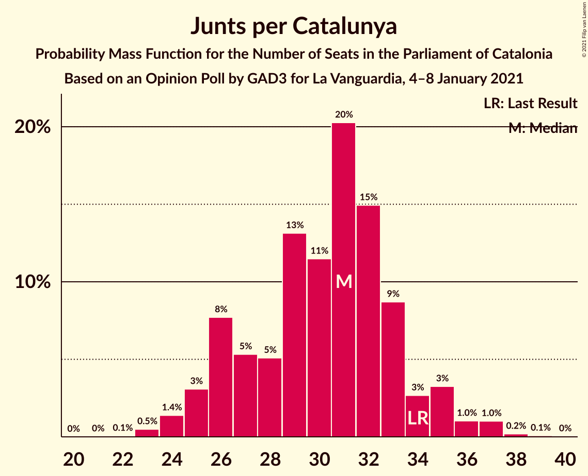

| Number of Seats | Probability | Accumulated | Special Marks |
|:---------------:|:-----------:|:-----------:|:-------------:|
| 22 | 0.1% | 100% |  |
| 23 | 0.5% | 99.9% |  |
| 24 | 1.4% | 99.4% |  |
| 25 | 3% | 98% |  |
| 26 | 8% | 95% |  |
| 27 | 5% | 87% |  |
| 28 | 5% | 82% |  |
| 29 | 13% | 77% |  |
| 30 | 11% | 64% |  |
| 31 | 20% | 52% | Median |
| 32 | 15% | 32% |  |
| 33 | 9% | 17% |  |
| 34 | 3% | 8% | Last Result |
| 35 | 3% | 6% |  |
| 36 | 1.0% | 2% |  |
| 37 | 1.0% | 1.3% |  |
| 38 | 0.2% | 0.3% |  |
| 39 | 0.1% | 0.1% |  |
| 40 | 0% | 0% |  |

### Ciutadans–Partido de la Ciudadanía

*For a full overview of the results for this party, see the [Ciutadans–Partido de la Ciudadanía](party-ciutadans–partidodelaciudadanía.html) page.*

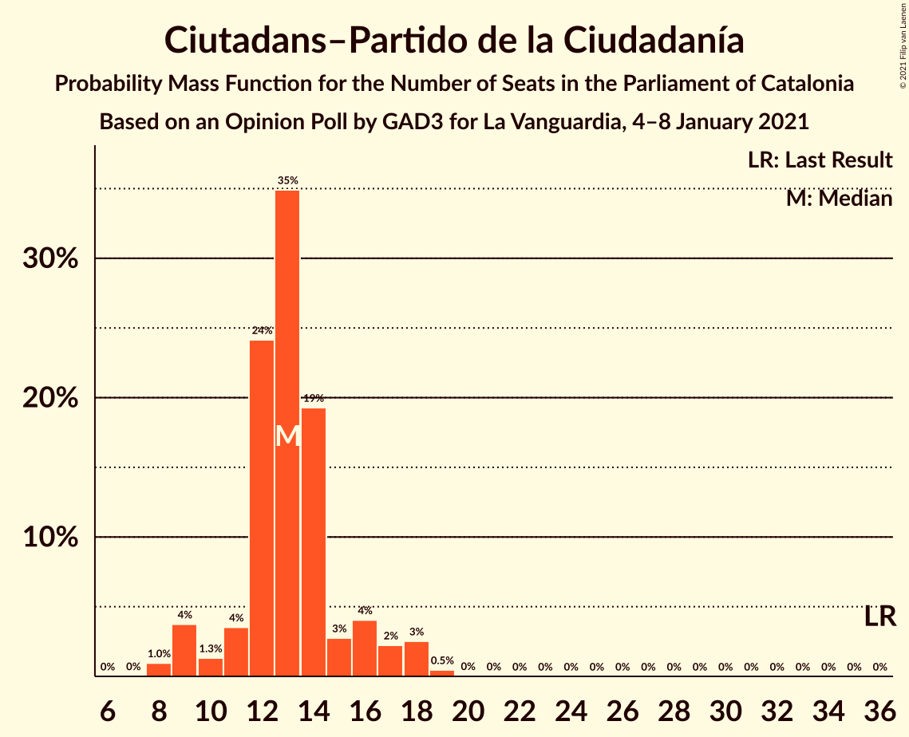

| Number of Seats | Probability | Accumulated | Special Marks |
|:---------------:|:-----------:|:-----------:|:-------------:|
| 8 | 1.0% | 100% |  |
| 9 | 4% | 99.0% |  |
| 10 | 1.3% | 95% |  |
| 11 | 4% | 94% |  |
| 12 | 24% | 90% |  |
| 13 | 35% | 66% | Median |
| 14 | 19% | 31% |  |
| 15 | 3% | 12% |  |
| 16 | 4% | 9% |  |
| 17 | 2% | 5% |  |
| 18 | 3% | 3% |  |
| 19 | 0.5% | 0.5% |  |
| 20 | 0% | 0.1% |  |
| 21 | 0% | 0% |  |
| 22 | 0% | 0% |  |
| 23 | 0% | 0% |  |
| 24 | 0% | 0% |  |
| 25 | 0% | 0% |  |
| 26 | 0% | 0% |  |
| 27 | 0% | 0% |  |
| 28 | 0% | 0% |  |
| 29 | 0% | 0% |  |
| 30 | 0% | 0% |  |
| 31 | 0% | 0% |  |
| 32 | 0% | 0% |  |
| 33 | 0% | 0% |  |
| 34 | 0% | 0% |  |
| 35 | 0% | 0% |  |
| 36 | 0% | 0% | Last Result |

### Partit Popular

*For a full overview of the results for this party, see the [Partit Popular](party-partitpopular.html) page.*

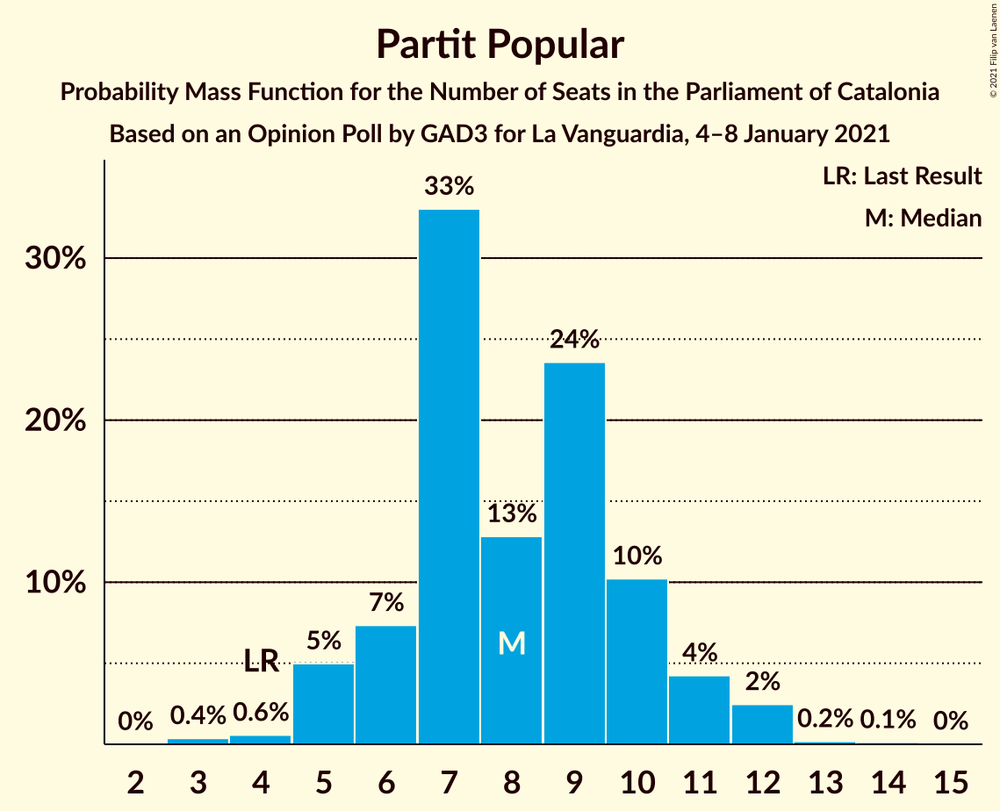

| Number of Seats | Probability | Accumulated | Special Marks |
|:---------------:|:-----------:|:-----------:|:-------------:|
| 3 | 0.4% | 100% |  |
| 4 | 0.6% | 99.6% | Last Result |
| 5 | 5% | 99.1% |  |
| 6 | 7% | 94% |  |
| 7 | 33% | 87% |  |
| 8 | 13% | 54% | Median |
| 9 | 24% | 41% |  |
| 10 | 10% | 17% |  |
| 11 | 4% | 7% |  |
| 12 | 2% | 3% |  |
| 13 | 0.2% | 0.3% |  |
| 14 | 0.1% | 0.2% |  |
| 15 | 0% | 0% |  |

### Catalunya en Comú–Podem

*For a full overview of the results for this party, see the [Catalunya en Comú–Podem](party-catalunyaencomú–podem.html) page.*

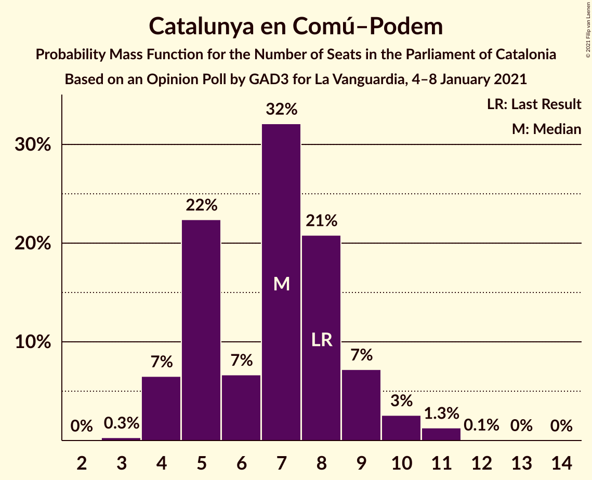

| Number of Seats | Probability | Accumulated | Special Marks |
|:---------------:|:-----------:|:-----------:|:-------------:|
| 3 | 0.3% | 100% |  |
| 4 | 7% | 99.7% |  |
| 5 | 22% | 93% |  |
| 6 | 7% | 71% |  |
| 7 | 32% | 64% | Median |
| 8 | 21% | 32% | Last Result |
| 9 | 7% | 11% |  |
| 10 | 3% | 4% |  |
| 11 | 1.3% | 1.5% |  |
| 12 | 0.1% | 0.2% |  |
| 13 | 0% | 0.1% |  |
| 14 | 0% | 0% |  |

### Candidatura d’Unitat Popular

*For a full overview of the results for this party, see the [Candidatura d’Unitat Popular](party-candidaturad’unitatpopular.html) page.*

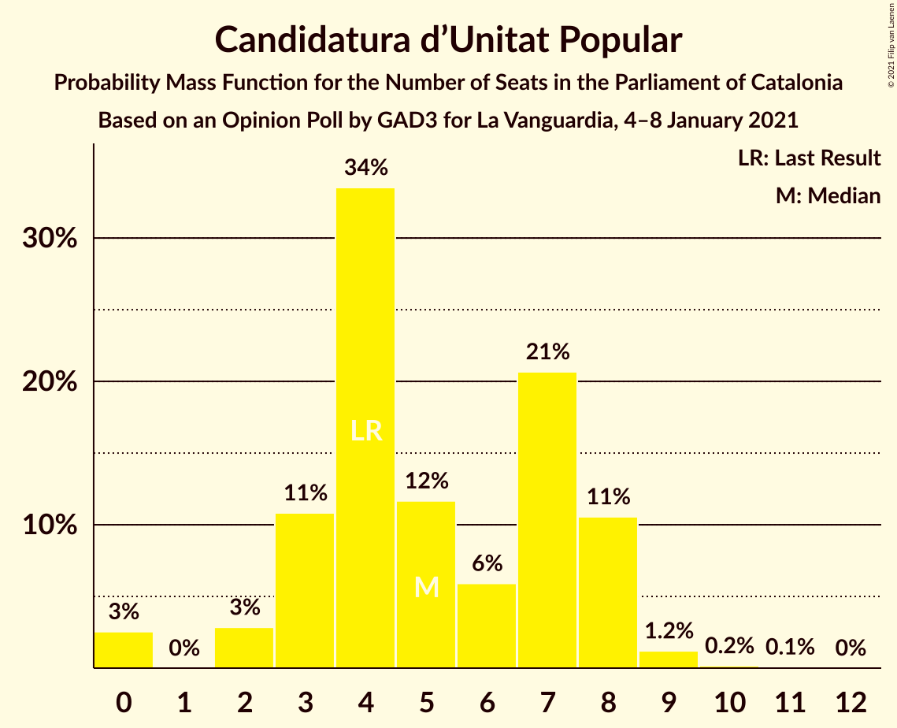

| Number of Seats | Probability | Accumulated | Special Marks |
|:---------------:|:-----------:|:-----------:|:-------------:|
| 0 | 3% | 100% |  |
| 1 | 0% | 97% |  |
| 2 | 3% | 97% |  |
| 3 | 11% | 95% |  |
| 4 | 34% | 84% | Last Result |
| 5 | 12% | 50% | Median |
| 6 | 6% | 39% |  |
| 7 | 21% | 33% |  |
| 8 | 11% | 12% |  |
| 9 | 1.2% | 1.5% |  |
| 10 | 0.2% | 0.3% |  |
| 11 | 0.1% | 0.1% |  |
| 12 | 0% | 0% |  |

### Vox

*For a full overview of the results for this party, see the [Vox](party-vox.html) page.*

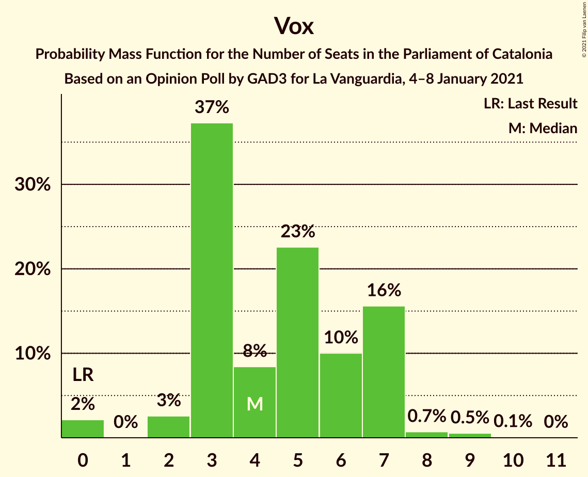

| Number of Seats | Probability | Accumulated | Special Marks |
|:---------------:|:-----------:|:-----------:|:-------------:|
| 0 | 2% | 100% | Last Result |
| 1 | 0% | 98% |  |
| 2 | 3% | 98% |  |
| 3 | 37% | 95% |  |
| 4 | 8% | 58% | Median |
| 5 | 23% | 50% |  |
| 6 | 10% | 27% |  |
| 7 | 16% | 17% |  |
| 8 | 0.7% | 1.4% |  |
| 9 | 0.5% | 0.7% |  |
| 10 | 0.1% | 0.1% |  |
| 11 | 0% | 0% |  |

### Partit Demòcrata Europeu Català

*For a full overview of the results for this party, see the [Partit Demòcrata Europeu Català](party-partitdemòcrataeuropeucatalà.html) page.*

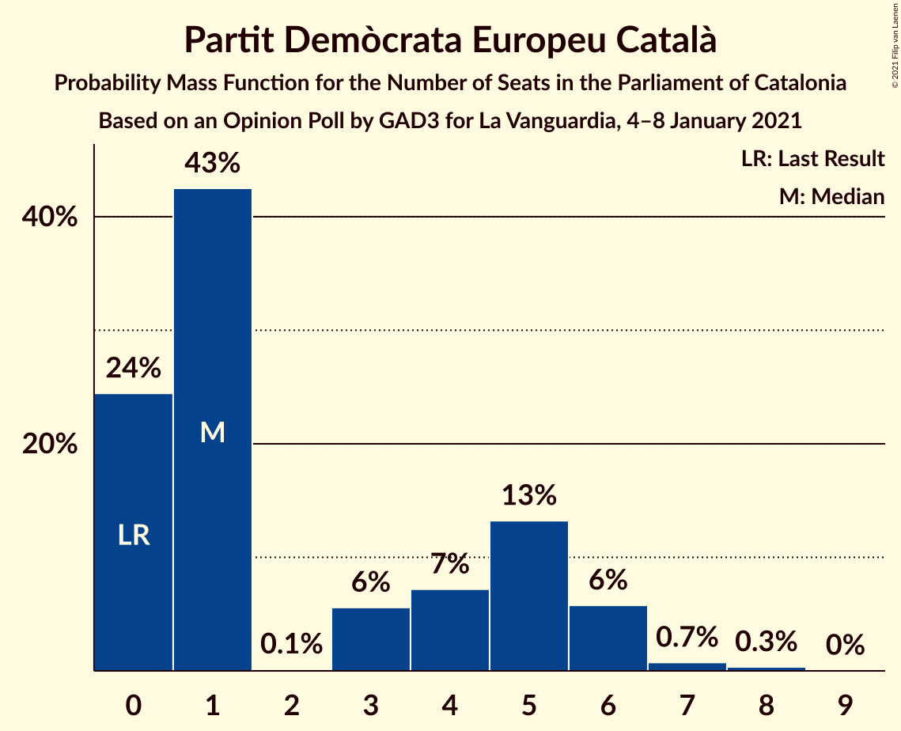

| Number of Seats | Probability | Accumulated | Special Marks |
|:---------------:|:-----------:|:-----------:|:-------------:|
| 0 | 24% | 100% | Last Result |
| 1 | 43% | 76% | Median |
| 2 | 0.1% | 33% |  |
| 3 | 6% | 33% |  |
| 4 | 7% | 27% |  |
| 5 | 13% | 20% |  |
| 6 | 6% | 7% |  |
| 7 | 0.7% | 1.1% |  |
| 8 | 0.3% | 0.4% |  |
| 9 | 0% | 0% |  |

## Coalitions

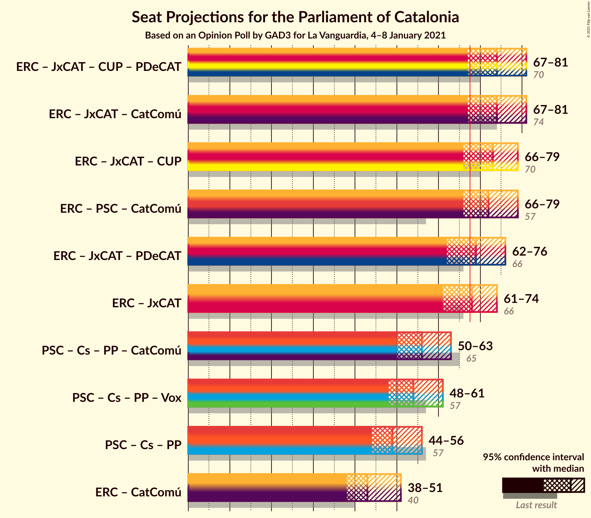

### Confidence Intervals

| Coalition | Last Result | Median | Majority? | 80% Confidence Interval | 90% Confidence Interval | 95% Confidence Interval | 99% Confidence Interval |
|:---------:|:-----------:|:------:|:---------:|:-----------------------:|:-----------------------:|:-----------------------:|:-----------------------:|
| Esquerra Republicana–Catalunya Sí – Junts per Catalunya – Candidatura d’Unitat Popular – Partit Demòcrata Europeu Català | 70 | 74 | 97% | 70–79 | 68–80 | 67–81 | 66–83 |
| Esquerra Republicana–Catalunya Sí – Junts per Catalunya – Catalunya en Comú–Podem | 74 | 74 | 97% | 69–78 | 68–80 | 67–81 | 65–84 |
| Esquerra Republicana–Catalunya Sí – Junts per Catalunya – Candidatura d’Unitat Popular | 70 | 73 | 90% | 68–77 | 66–78 | 66–79 | 64–83 |
| Esquerra Republicana–Catalunya Sí – Partit dels Socialistes de Catalunya (PSC-PSOE) – Catalunya en Comú–Podem | 57 | 72 | 92% | 68–77 | 66–78 | 66–79 | 64–81 |
| Esquerra Republicana–Catalunya Sí – Junts per Catalunya – Partit Demòcrata Europeu Català | 66 | 69 | 67% | 65–74 | 63–75 | 62–76 | 61–78 |
| Esquerra Republicana–Catalunya Sí – Junts per Catalunya | 66 | 68 | 50% | 63–72 | 61–73 | 61–74 | 58–76 |
| Partit dels Socialistes de Catalunya (PSC-PSOE) – Ciutadans–Partido de la Ciudadanía – Partit Popular – Catalunya en Comú–Podem | 65 | 56 | 0.1% | 52–61 | 51–62 | 50–63 | 48–64 |
| Partit dels Socialistes de Catalunya (PSC-PSOE) – Ciutadans–Partido de la Ciudadanía – Partit Popular – Vox | 57 | 54 | 0% | 50–58 | 49–60 | 48–61 | 44–63 |
| Partit dels Socialistes de Catalunya (PSC-PSOE) – Ciutadans–Partido de la Ciudadanía – Partit Popular | 57 | 49 | 0% | 45–53 | 45–55 | 44–56 | 41–58 |
| Esquerra Republicana–Catalunya Sí – Catalunya en Comú–Podem | 40 | 43 | 0% | 40–49 | 39–50 | 38–51 | 36–52 |

### Esquerra Republicana–Catalunya Sí – Junts per Catalunya – Candidatura d’Unitat Popular – Partit Demòcrata Europeu Català

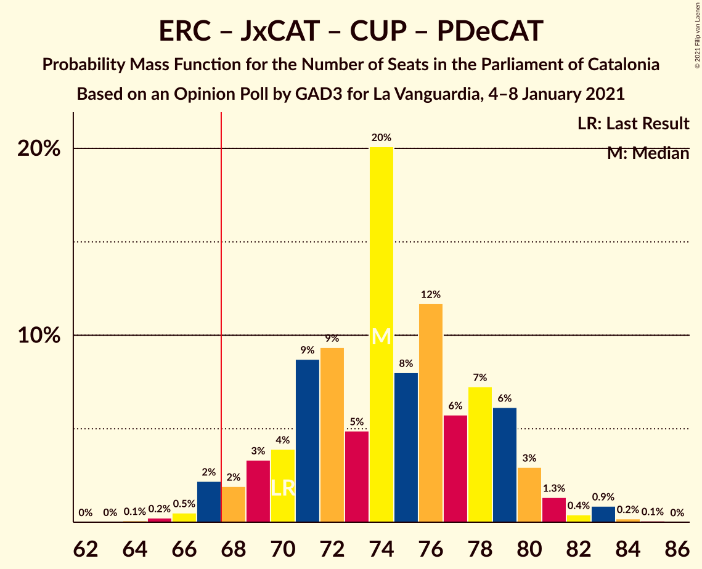

| Number of Seats | Probability | Accumulated | Special Marks |
|:---------------:|:-----------:|:-----------:|:-------------:|
| 63 | 0% | 100% |  |
| 64 | 0.1% | 99.9% |  |
| 65 | 0.2% | 99.8% |  |
| 66 | 0.5% | 99.6% |  |
| 67 | 2% | 99.1% |  |
| 68 | 2% | 97% | Majority |
| 69 | 3% | 95% |  |
| 70 | 4% | 92% | Last Result |
| 71 | 9% | 88% |  |
| 72 | 9% | 79% |  |
| 73 | 5% | 70% | Median |
| 74 | 20% | 65% |  |
| 75 | 8% | 45% |  |
| 76 | 12% | 37% |  |
| 77 | 6% | 25% |  |
| 78 | 7% | 19% |  |
| 79 | 6% | 12% |  |
| 80 | 3% | 6% |  |
| 81 | 1.3% | 3% |  |
| 82 | 0.4% | 2% |  |
| 83 | 0.9% | 1.2% |  |
| 84 | 0.2% | 0.3% |  |
| 85 | 0.1% | 0.1% |  |
| 86 | 0% | 0% |  |

### Esquerra Republicana–Catalunya Sí – Junts per Catalunya – Catalunya en Comú–Podem

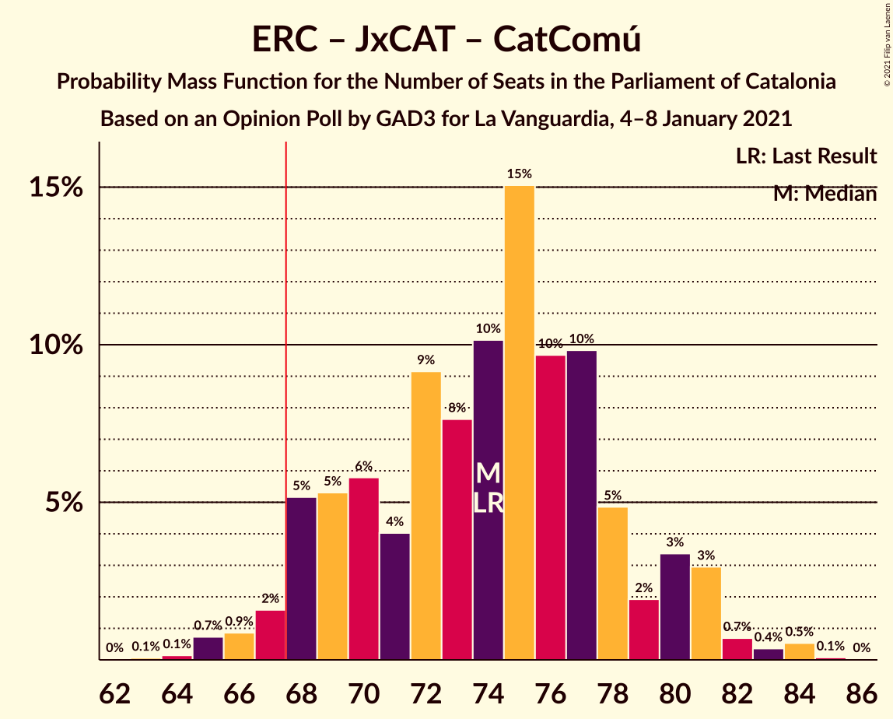

| Number of Seats | Probability | Accumulated | Special Marks |
|:---------------:|:-----------:|:-----------:|:-------------:|
| 63 | 0.1% | 100% |  |
| 64 | 0.1% | 99.9% |  |
| 65 | 0.7% | 99.8% |  |
| 66 | 0.9% | 99.0% |  |
| 67 | 2% | 98% |  |
| 68 | 5% | 97% | Majority |
| 69 | 5% | 91% |  |
| 70 | 6% | 86% |  |
| 71 | 4% | 80% |  |
| 72 | 9% | 76% |  |
| 73 | 8% | 67% |  |
| 74 | 10% | 60% | Last Result, Median |
| 75 | 15% | 49% |  |
| 76 | 10% | 34% |  |
| 77 | 10% | 25% |  |
| 78 | 5% | 15% |  |
| 79 | 2% | 10% |  |
| 80 | 3% | 8% |  |
| 81 | 3% | 5% |  |
| 82 | 0.7% | 2% |  |
| 83 | 0.4% | 1.0% |  |
| 84 | 0.5% | 0.6% |  |
| 85 | 0.1% | 0.1% |  |
| 86 | 0% | 0% |  |

### Esquerra Republicana–Catalunya Sí – Junts per Catalunya – Candidatura d’Unitat Popular

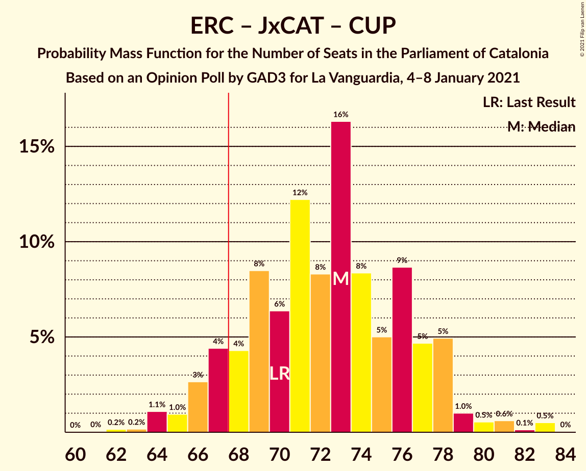

| Number of Seats | Probability | Accumulated | Special Marks |
|:---------------:|:-----------:|:-----------:|:-------------:|
| 61 | 0% | 100% |  |
| 62 | 0.2% | 99.9% |  |
| 63 | 0.2% | 99.8% |  |
| 64 | 1.1% | 99.6% |  |
| 65 | 1.0% | 98.5% |  |
| 66 | 3% | 98% |  |
| 67 | 4% | 95% |  |
| 68 | 4% | 90% | Majority |
| 69 | 8% | 86% |  |
| 70 | 6% | 78% | Last Result |
| 71 | 12% | 71% |  |
| 72 | 8% | 59% | Median |
| 73 | 16% | 51% |  |
| 74 | 8% | 35% |  |
| 75 | 5% | 26% |  |
| 76 | 9% | 21% |  |
| 77 | 5% | 12% |  |
| 78 | 5% | 8% |  |
| 79 | 1.0% | 3% |  |
| 80 | 0.5% | 2% |  |
| 81 | 0.6% | 1.3% |  |
| 82 | 0.1% | 0.7% |  |
| 83 | 0.5% | 0.6% |  |
| 84 | 0% | 0% |  |

### Esquerra Republicana–Catalunya Sí – Partit dels Socialistes de Catalunya (PSC-PSOE) – Catalunya en Comú–Podem

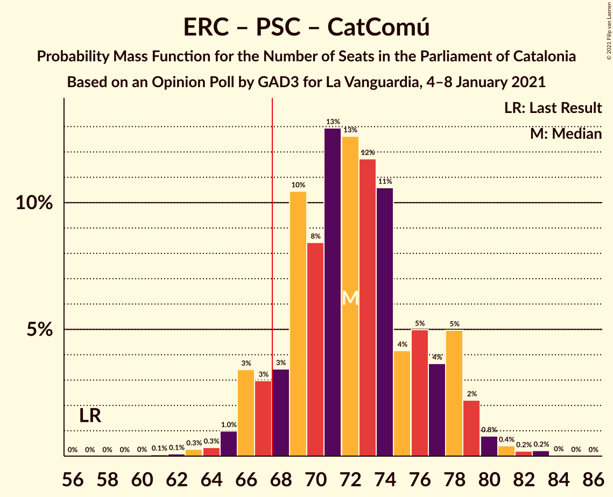

| Number of Seats | Probability | Accumulated | Special Marks |
|:---------------:|:-----------:|:-----------:|:-------------:|
| 57 | 0% | 100% | Last Result |
| 58 | 0% | 100% |  |
| 59 | 0% | 100% |  |
| 60 | 0% | 100% |  |
| 61 | 0.1% | 100% |  |
| 62 | 0.1% | 99.9% |  |
| 63 | 0.3% | 99.8% |  |
| 64 | 0.3% | 99.6% |  |
| 65 | 1.0% | 99.2% |  |
| 66 | 3% | 98% |  |
| 67 | 3% | 95% |  |
| 68 | 3% | 92% | Majority |
| 69 | 10% | 88% |  |
| 70 | 8% | 78% |  |
| 71 | 13% | 70% | Median |
| 72 | 13% | 57% |  |
| 73 | 12% | 44% |  |
| 74 | 11% | 32% |  |
| 75 | 4% | 22% |  |
| 76 | 5% | 17% |  |
| 77 | 4% | 13% |  |
| 78 | 5% | 9% |  |
| 79 | 2% | 4% |  |
| 80 | 0.8% | 2% |  |
| 81 | 0.4% | 0.9% |  |
| 82 | 0.2% | 0.5% |  |
| 83 | 0.2% | 0.3% |  |
| 84 | 0% | 0.1% |  |
| 85 | 0% | 0% |  |

### Esquerra Republicana–Catalunya Sí – Junts per Catalunya – Partit Demòcrata Europeu Català

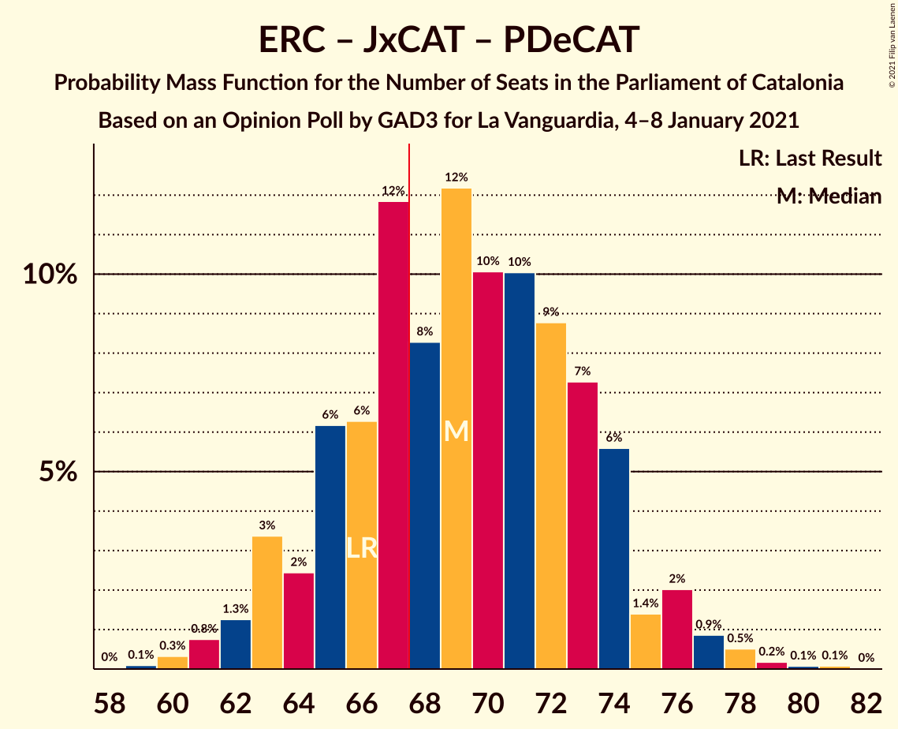

| Number of Seats | Probability | Accumulated | Special Marks |
|:---------------:|:-----------:|:-----------:|:-------------:|
| 58 | 0% | 100% |  |
| 59 | 0.1% | 99.9% |  |
| 60 | 0.3% | 99.8% |  |
| 61 | 0.8% | 99.5% |  |
| 62 | 1.3% | 98.8% |  |
| 63 | 3% | 97% |  |
| 64 | 2% | 94% |  |
| 65 | 6% | 92% |  |
| 66 | 6% | 86% | Last Result |
| 67 | 12% | 79% |  |
| 68 | 8% | 67% | Median, Majority |
| 69 | 12% | 59% |  |
| 70 | 10% | 47% |  |
| 71 | 10% | 37% |  |
| 72 | 9% | 27% |  |
| 73 | 7% | 18% |  |
| 74 | 6% | 11% |  |
| 75 | 1.4% | 5% |  |
| 76 | 2% | 4% |  |
| 77 | 0.9% | 2% |  |
| 78 | 0.5% | 0.9% |  |
| 79 | 0.2% | 0.4% |  |
| 80 | 0.1% | 0.2% |  |
| 81 | 0.1% | 0.1% |  |
| 82 | 0% | 0% |  |

### Esquerra Republicana–Catalunya Sí – Junts per Catalunya

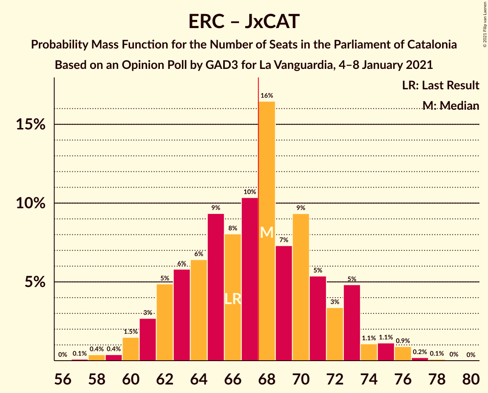

| Number of Seats | Probability | Accumulated | Special Marks |
|:---------------:|:-----------:|:-----------:|:-------------:|
| 57 | 0.1% | 100% |  |
| 58 | 0.4% | 99.9% |  |
| 59 | 0.4% | 99.5% |  |
| 60 | 1.5% | 99.1% |  |
| 61 | 3% | 98% |  |
| 62 | 5% | 95% |  |
| 63 | 6% | 90% |  |
| 64 | 6% | 84% |  |
| 65 | 9% | 78% |  |
| 66 | 8% | 68% | Last Result |
| 67 | 10% | 60% | Median |
| 68 | 16% | 50% | Majority |
| 69 | 7% | 34% |  |
| 70 | 9% | 26% |  |
| 71 | 5% | 17% |  |
| 72 | 3% | 12% |  |
| 73 | 5% | 8% |  |
| 74 | 1.1% | 3% |  |
| 75 | 1.1% | 2% |  |
| 76 | 0.9% | 1.2% |  |
| 77 | 0.2% | 0.3% |  |
| 78 | 0.1% | 0.1% |  |
| 79 | 0% | 0.1% |  |
| 80 | 0% | 0% |  |

### Partit dels Socialistes de Catalunya (PSC-PSOE) – Ciutadans–Partido de la Ciudadanía – Partit Popular – Catalunya en Comú–Podem

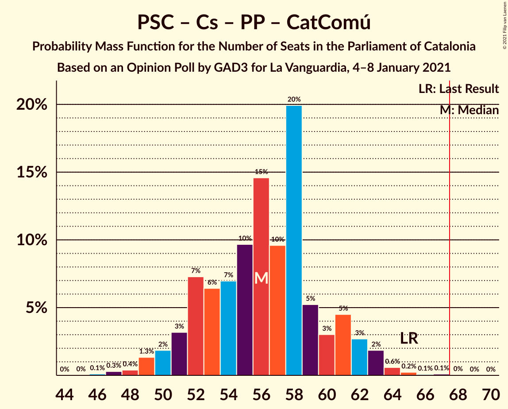

| Number of Seats | Probability | Accumulated | Special Marks |
|:---------------:|:-----------:|:-----------:|:-------------:|
| 46 | 0.1% | 100% |  |
| 47 | 0.3% | 99.9% |  |
| 48 | 0.4% | 99.6% |  |
| 49 | 1.3% | 99.2% |  |
| 50 | 2% | 98% |  |
| 51 | 3% | 96% |  |
| 52 | 7% | 93% |  |
| 53 | 6% | 86% |  |
| 54 | 7% | 79% |  |
| 55 | 10% | 72% |  |
| 56 | 15% | 62% | Median |
| 57 | 10% | 48% |  |
| 58 | 20% | 38% |  |
| 59 | 5% | 18% |  |
| 60 | 3% | 13% |  |
| 61 | 5% | 10% |  |
| 62 | 3% | 6% |  |
| 63 | 2% | 3% |  |
| 64 | 0.6% | 1.1% |  |
| 65 | 0.2% | 0.5% | Last Result |
| 66 | 0.1% | 0.2% |  |
| 67 | 0.1% | 0.2% |  |
| 68 | 0% | 0.1% | Majority |
| 69 | 0% | 0% |  |

### Partit dels Socialistes de Catalunya (PSC-PSOE) – Ciutadans–Partido de la Ciudadanía – Partit Popular – Vox

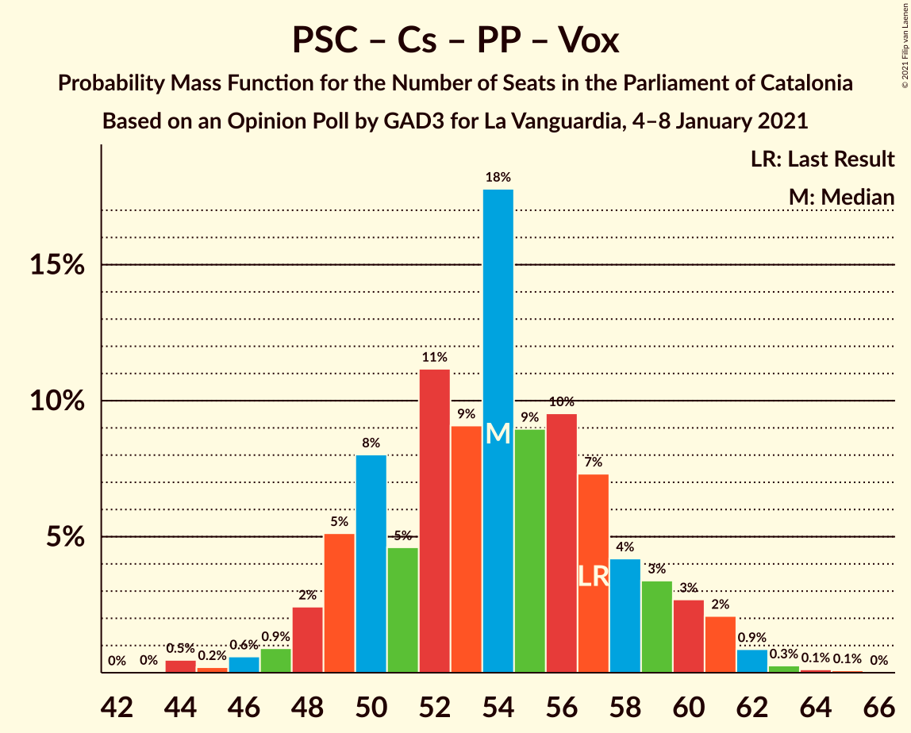

| Number of Seats | Probability | Accumulated | Special Marks |
|:---------------:|:-----------:|:-----------:|:-------------:|
| 43 | 0% | 100% |  |
| 44 | 0.5% | 99.9% |  |
| 45 | 0.2% | 99.5% |  |
| 46 | 0.6% | 99.3% |  |
| 47 | 0.9% | 98.7% |  |
| 48 | 2% | 98% |  |
| 49 | 5% | 95% |  |
| 50 | 8% | 90% |  |
| 51 | 5% | 82% |  |
| 52 | 11% | 78% |  |
| 53 | 9% | 66% | Median |
| 54 | 18% | 57% |  |
| 55 | 9% | 40% |  |
| 56 | 10% | 31% |  |
| 57 | 7% | 21% | Last Result |
| 58 | 4% | 14% |  |
| 59 | 3% | 10% |  |
| 60 | 3% | 6% |  |
| 61 | 2% | 3% |  |
| 62 | 0.9% | 1.4% |  |
| 63 | 0.3% | 0.5% |  |
| 64 | 0.1% | 0.2% |  |
| 65 | 0.1% | 0.1% |  |
| 66 | 0% | 0% |  |

### Partit dels Socialistes de Catalunya (PSC-PSOE) – Ciutadans–Partido de la Ciudadanía – Partit Popular

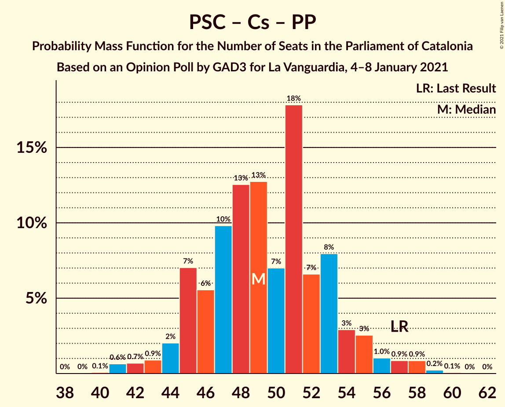

| Number of Seats | Probability | Accumulated | Special Marks |
|:---------------:|:-----------:|:-----------:|:-------------:|
| 40 | 0.1% | 100% |  |
| 41 | 0.6% | 99.9% |  |
| 42 | 0.7% | 99.2% |  |
| 43 | 0.9% | 98.5% |  |
| 44 | 2% | 98% |  |
| 45 | 7% | 96% |  |
| 46 | 6% | 89% |  |
| 47 | 10% | 83% |  |
| 48 | 13% | 73% |  |
| 49 | 13% | 61% | Median |
| 50 | 7% | 48% |  |
| 51 | 18% | 41% |  |
| 52 | 7% | 23% |  |
| 53 | 8% | 16% |  |
| 54 | 3% | 9% |  |
| 55 | 3% | 6% |  |
| 56 | 1.0% | 3% |  |
| 57 | 0.9% | 2% | Last Result |
| 58 | 0.9% | 1.2% |  |
| 59 | 0.2% | 0.3% |  |
| 60 | 0.1% | 0.1% |  |
| 61 | 0% | 0% |  |

### Esquerra Republicana–Catalunya Sí – Catalunya en Comú–Podem

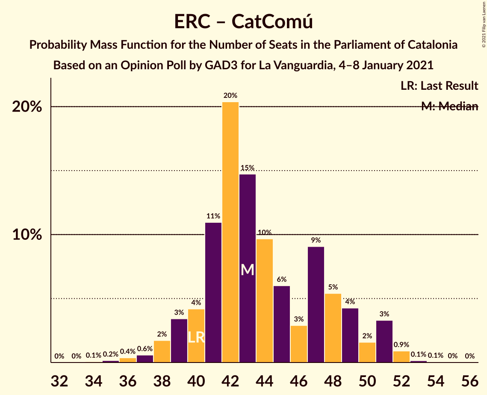

| Number of Seats | Probability | Accumulated | Special Marks |
|:---------------:|:-----------:|:-----------:|:-------------:|
| 34 | 0.1% | 100% |  |
| 35 | 0.2% | 99.9% |  |
| 36 | 0.4% | 99.7% |  |
| 37 | 0.6% | 99.4% |  |
| 38 | 2% | 98.8% |  |
| 39 | 3% | 97% |  |
| 40 | 4% | 94% | Last Result |
| 41 | 11% | 89% |  |
| 42 | 20% | 78% |  |
| 43 | 15% | 58% | Median |
| 44 | 10% | 43% |  |
| 45 | 6% | 34% |  |
| 46 | 3% | 28% |  |
| 47 | 9% | 25% |  |
| 48 | 5% | 16% |  |
| 49 | 4% | 10% |  |
| 50 | 2% | 6% |  |
| 51 | 3% | 4% |  |
| 52 | 0.9% | 1.2% |  |
| 53 | 0.1% | 0.3% |  |
| 54 | 0.1% | 0.1% |  |
| 55 | 0% | 0% |  |

## Technical Information

### Opinion Poll

+ **Polling firm:** GAD3
+ **Commissioner(s):** La Vanguardia
+ **Fieldwork period:** 4–8 January 2021

### Calculations

+ **Sample size:** 576
+ **Simulations done:** 1,048,576
+ **Error estimate:** 0.78%

