# Opinion Poll by electoPanel for electomania.es, 8 January 2021

<a href="#voting-intentions">Voting Intentions</a> | <a href="#seats">Seats</a> | <a href="#coalitions">Coalitions</a> | <a href="#technical-information">Technical Information</a>

## Voting Intentions

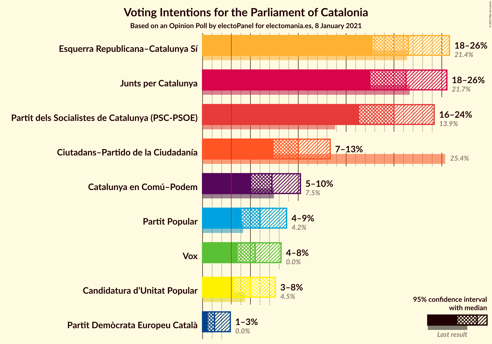

### Confidence Intervals

| Party | Last Result | Poll Result | 80% Confidence Interval | 90% Confidence Interval | 95% Confidence Interval | 99% Confidence Interval |
|:-----:|:-----------:|:-----------:|:-----------------------:|:-----------------------:|:-----------------------:|:-----------------------:|
| Esquerra Republicana–Catalunya Sí | 21.4% | 21.5% | 19.0–24.3% |18.3–25.1% |17.8–25.8% |16.6–27.2% |
| Junts per Catalunya | 21.7% | 21.2% | 18.8–24.1% |18.1–24.8% |17.5–25.5% |16.4–26.9% |
| Partit dels Socialistes de Catalunya (PSC-PSOE) | 13.9% | 20.0% | 17.6–22.8% |16.9–23.5% |16.4–24.2% |15.3–25.6% |
| Ciutadans–Partido de la Ciudadanía | 25.4% | 10.0% | 8.3–12.2% |7.8–12.8% |7.4–13.3% |6.7–14.4% |
| Catalunya en Comú–Podem | 7.5% | 7.2% | 5.8–9.2% |5.4–9.7% |5.1–10.2% |4.5–11.2% |
| Partit Popular | 4.2% | 6.0% | 4.7–7.8% |4.4–8.3% |4.1–8.8% |3.5–9.7% |
| Vox | 0.0% | 5.5% | 4.3–7.3% |3.9–7.7% |3.7–8.2% |3.2–9.1% |
| Candidatura d’Unitat Popular | 4.5% | 5.0% | 3.9–6.7% |3.5–7.2% |3.3–7.6% |2.8–8.5% |
| Partit Demòcrata Europeu Català | 0.0% | 1.2% | 0.8–2.3% |0.6–2.6% |0.5–2.9% |0.4–3.5% |

*Note:* The poll result column reflects the actual value used in the calculations. Published results may vary slightly, and in addition be rounded to fewer digits.

## Seats

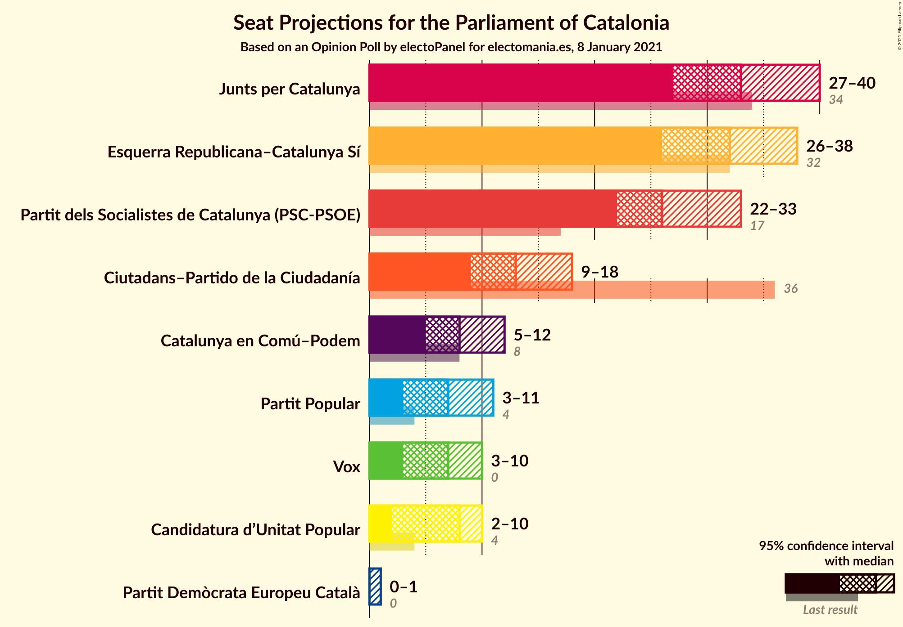

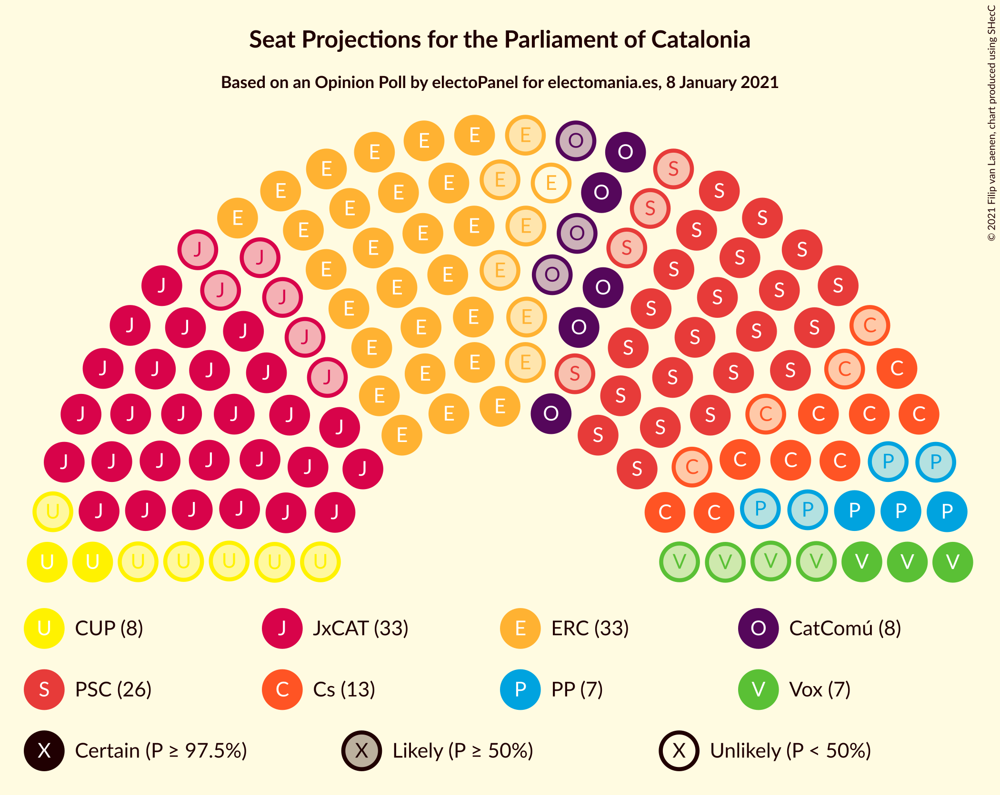

### Confidence Intervals

| Party | Last Result | Median | 80% Confidence Interval | 90% Confidence Interval | 95% Confidence Interval | 99% Confidence Interval |
|:-----:|:-----------:|:------:|:-----------------------:|:-----------------------:|:-----------------------:|:-----------------------:|
| <a href="#esquerra-republicana–catalunya-sí">Esquerra Republicana–Catalunya Sí</a> | 32 | 32 | 28–36 |27–37 |26–38 |24–41 |
| <a href="#junts-per-catalunya">Junts per Catalunya</a> | 34 | 33 | 30–38 |29–39 |27–40 |25–43 |
| <a href="#partit-dels-socialistes-de-catalunya-(psc-psoe)">Partit dels Socialistes de Catalunya (PSC-PSOE)</a> | 17 | 26 | 24–31 |22–32 |22–33 |20–35 |
| <a href="#ciutadans–partido-de-la-ciudadanía">Ciutadans–Partido de la Ciudadanía</a> | 36 | 13 | 10–16 |9–17 |9–18 |8–19 |
| <a href="#catalunya-en-comú–podem">Catalunya en Comú–Podem</a> | 8 | 8 | 6–11 |5–11 |5–12 |4–14 |
| <a href="#partit-popular">Partit Popular</a> | 4 | 7 | 5–9 |3–10 |3–11 |3–13 |
| <a href="#vox">Vox</a> | 0 | 7 | 4–9 |3–10 |3–10 |2–12 |
| <a href="#candidatura-d’unitat-popular">Candidatura d’Unitat Popular</a> | 4 | 8 | 7–9 |5–10 |2–10 |0–11 |
| <a href="#partit-demòcrata-europeu-català">Partit Demòcrata Europeu Català</a> | 0 | 0 | 0 |0–1 |0–1 |0–4 |

### Esquerra Republicana–Catalunya Sí

*For a full overview of the results for this party, see the [Esquerra Republicana–Catalunya Sí](party-esquerrarepublicana–catalunyasí.html) page.*

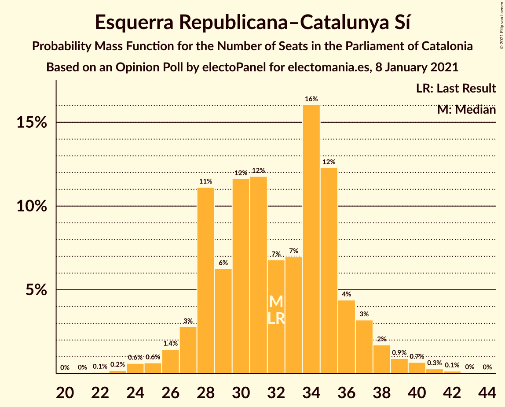

| Number of Seats | Probability | Accumulated | Special Marks |
|:---------------:|:-----------:|:-----------:|:-------------:|
| 22 | 0.1% | 100% |  |
| 23 | 0.2% | 99.9% |  |
| 24 | 0.6% | 99.7% |  |
| 25 | 0.6% | 99.1% |  |
| 26 | 1.4% | 98% |  |
| 27 | 3% | 97% |  |
| 28 | 11% | 94% |  |
| 29 | 6% | 83% |  |
| 30 | 12% | 77% |  |
| 31 | 12% | 65% |  |
| 32 | 7% | 53% | Last Result, Median |
| 33 | 7% | 47% |  |
| 34 | 16% | 40% |  |
| 35 | 12% | 24% |  |
| 36 | 4% | 11% |  |
| 37 | 3% | 7% |  |
| 38 | 2% | 4% |  |
| 39 | 0.9% | 2% |  |
| 40 | 0.7% | 1.2% |  |
| 41 | 0.3% | 0.5% |  |
| 42 | 0.1% | 0.2% |  |
| 43 | 0% | 0.1% |  |
| 44 | 0% | 0% |  |

### Junts per Catalunya

*For a full overview of the results for this party, see the [Junts per Catalunya](party-juntspercatalunya.html) page.*

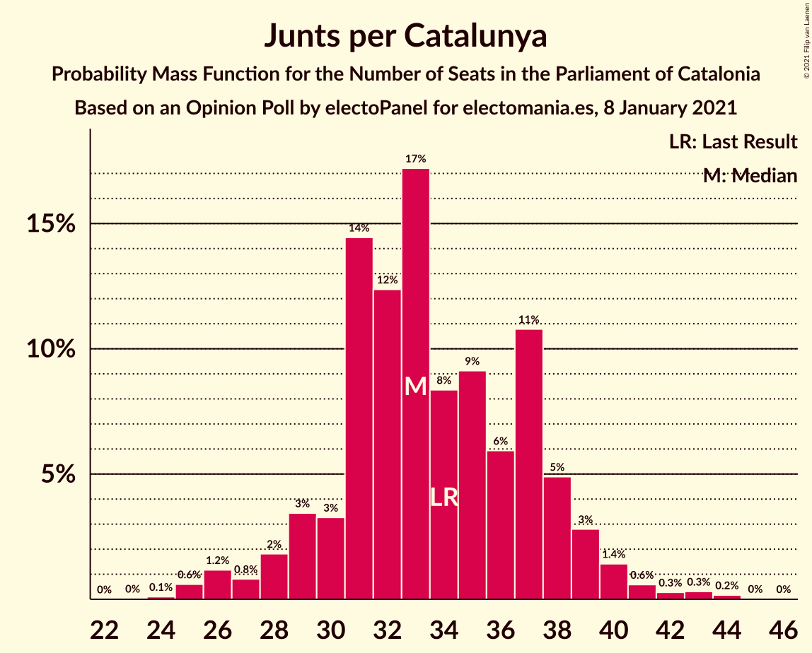

| Number of Seats | Probability | Accumulated | Special Marks |
|:---------------:|:-----------:|:-----------:|:-------------:|
| 24 | 0.1% | 100% |  |
| 25 | 0.6% | 99.9% |  |
| 26 | 1.2% | 99.3% |  |
| 27 | 0.8% | 98% |  |
| 28 | 2% | 97% |  |
| 29 | 3% | 95% |  |
| 30 | 3% | 92% |  |
| 31 | 14% | 89% |  |
| 32 | 12% | 74% |  |
| 33 | 17% | 62% | Median |
| 34 | 8% | 45% | Last Result |
| 35 | 9% | 36% |  |
| 36 | 6% | 27% |  |
| 37 | 11% | 21% |  |
| 38 | 5% | 11% |  |
| 39 | 3% | 6% |  |
| 40 | 1.4% | 3% |  |
| 41 | 0.6% | 1.4% |  |
| 42 | 0.3% | 0.8% |  |
| 43 | 0.3% | 0.5% |  |
| 44 | 0.2% | 0.2% |  |
| 45 | 0% | 0% |  |

### Partit dels Socialistes de Catalunya (PSC-PSOE)

*For a full overview of the results for this party, see the [Partit dels Socialistes de Catalunya (PSC-PSOE)](party-partitdelssocialistesdecatalunyapsc-psoe.html) page.*

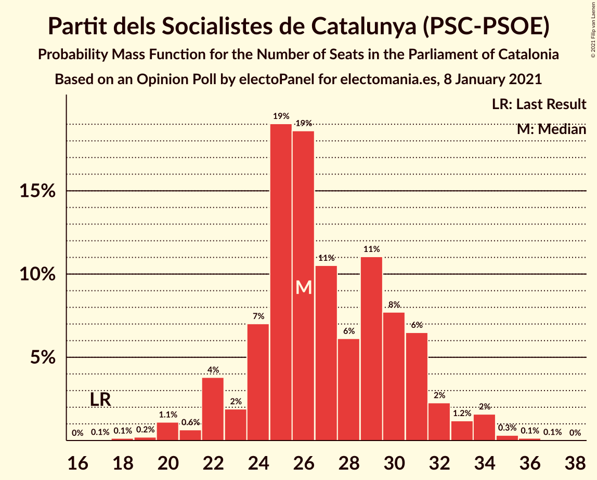

| Number of Seats | Probability | Accumulated | Special Marks |
|:---------------:|:-----------:|:-----------:|:-------------:|
| 17 | 0.1% | 100% | Last Result |
| 18 | 0.1% | 99.9% |  |
| 19 | 0.2% | 99.8% |  |
| 20 | 1.1% | 99.6% |  |
| 21 | 0.6% | 98% |  |
| 22 | 4% | 98% |  |
| 23 | 2% | 94% |  |
| 24 | 7% | 92% |  |
| 25 | 19% | 85% |  |
| 26 | 19% | 66% | Median |
| 27 | 11% | 47% |  |
| 28 | 6% | 37% |  |
| 29 | 11% | 31% |  |
| 30 | 8% | 20% |  |
| 31 | 6% | 12% |  |
| 32 | 2% | 6% |  |
| 33 | 1.2% | 3% |  |
| 34 | 2% | 2% |  |
| 35 | 0.3% | 0.5% |  |
| 36 | 0.1% | 0.2% |  |
| 37 | 0.1% | 0.1% |  |
| 38 | 0% | 0% |  |

### Ciutadans–Partido de la Ciudadanía

*For a full overview of the results for this party, see the [Ciutadans–Partido de la Ciudadanía](party-ciutadans–partidodelaciudadanía.html) page.*

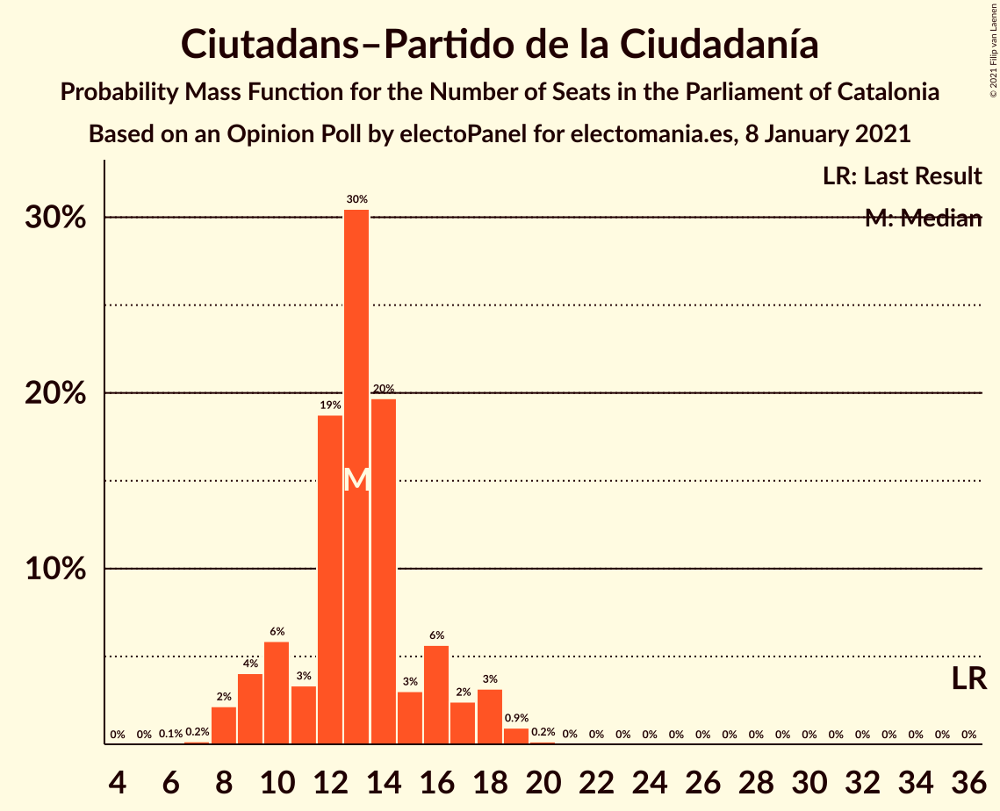

| Number of Seats | Probability | Accumulated | Special Marks |
|:---------------:|:-----------:|:-----------:|:-------------:|
| 6 | 0.1% | 100% |  |
| 7 | 0.2% | 99.9% |  |
| 8 | 2% | 99.8% |  |
| 9 | 4% | 98% |  |
| 10 | 6% | 94% |  |
| 11 | 3% | 88% |  |
| 12 | 19% | 84% |  |
| 13 | 30% | 66% | Median |
| 14 | 20% | 35% |  |
| 15 | 3% | 15% |  |
| 16 | 6% | 12% |  |
| 17 | 2% | 7% |  |
| 18 | 3% | 4% |  |
| 19 | 0.9% | 1.2% |  |
| 20 | 0.2% | 0.2% |  |
| 21 | 0% | 0.1% |  |
| 22 | 0% | 0% |  |
| 23 | 0% | 0% |  |
| 24 | 0% | 0% |  |
| 25 | 0% | 0% |  |
| 26 | 0% | 0% |  |
| 27 | 0% | 0% |  |
| 28 | 0% | 0% |  |
| 29 | 0% | 0% |  |
| 30 | 0% | 0% |  |
| 31 | 0% | 0% |  |
| 32 | 0% | 0% |  |
| 33 | 0% | 0% |  |
| 34 | 0% | 0% |  |
| 35 | 0% | 0% |  |
| 36 | 0% | 0% | Last Result |

### Catalunya en Comú–Podem

*For a full overview of the results for this party, see the [Catalunya en Comú–Podem](party-catalunyaencomú–podem.html) page.*

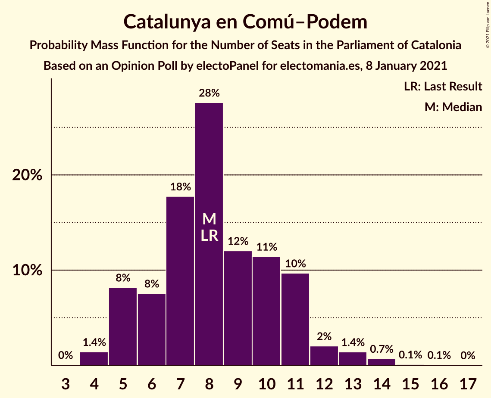

| Number of Seats | Probability | Accumulated | Special Marks |
|:---------------:|:-----------:|:-----------:|:-------------:|
| 4 | 1.4% | 100% |  |
| 5 | 8% | 98.5% |  |
| 6 | 8% | 90% |  |
| 7 | 18% | 83% |  |
| 8 | 28% | 65% | Last Result, Median |
| 9 | 12% | 37% |  |
| 10 | 11% | 25% |  |
| 11 | 10% | 14% |  |
| 12 | 2% | 4% |  |
| 13 | 1.4% | 2% |  |
| 14 | 0.7% | 0.9% |  |
| 15 | 0.1% | 0.2% |  |
| 16 | 0.1% | 0.1% |  |
| 17 | 0% | 0% |  |

### Partit Popular

*For a full overview of the results for this party, see the [Partit Popular](party-partitpopular.html) page.*

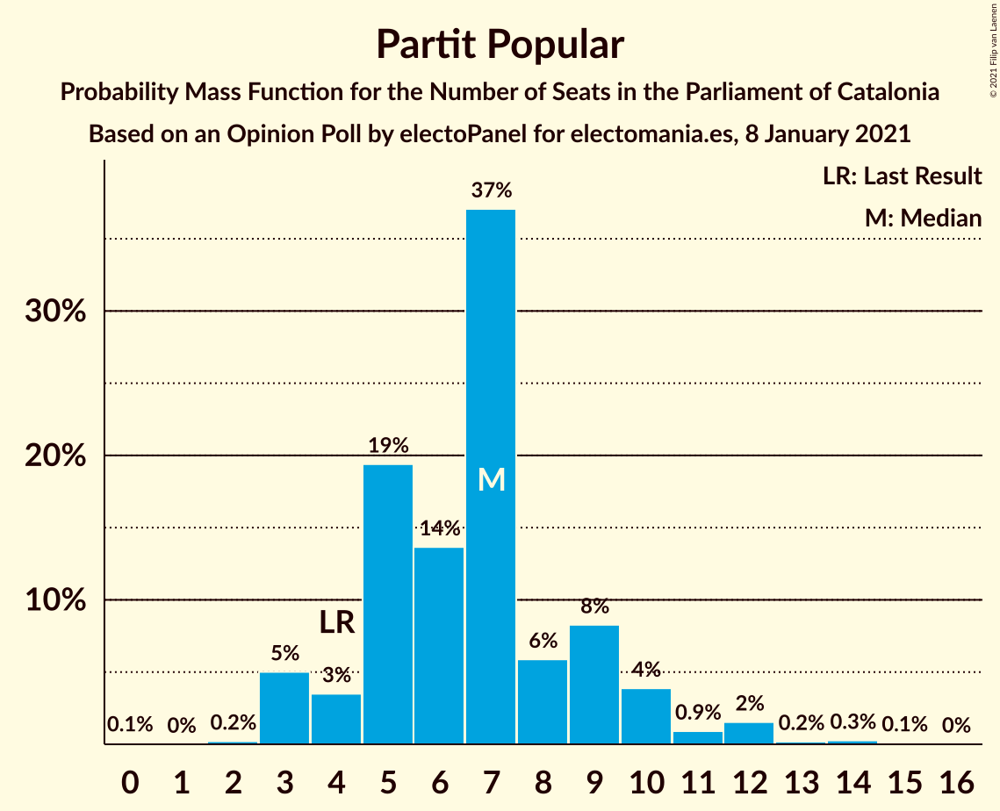

| Number of Seats | Probability | Accumulated | Special Marks |
|:---------------:|:-----------:|:-----------:|:-------------:|
| 0 | 0.1% | 100% |  |
| 1 | 0% | 99.9% |  |
| 2 | 0.2% | 99.9% |  |
| 3 | 5% | 99.7% |  |
| 4 | 3% | 95% | Last Result |
| 5 | 19% | 91% |  |
| 6 | 14% | 72% |  |
| 7 | 37% | 58% | Median |
| 8 | 6% | 21% |  |
| 9 | 8% | 15% |  |
| 10 | 4% | 7% |  |
| 11 | 0.9% | 3% |  |
| 12 | 2% | 2% |  |
| 13 | 0.2% | 0.6% |  |
| 14 | 0.3% | 0.4% |  |
| 15 | 0.1% | 0.1% |  |
| 16 | 0% | 0% |  |

### Vox

*For a full overview of the results for this party, see the [Vox](party-vox.html) page.*

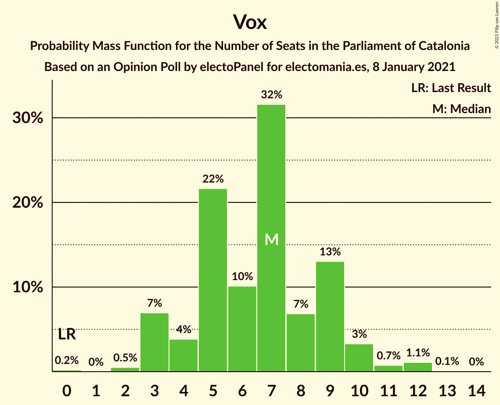

| Number of Seats | Probability | Accumulated | Special Marks |
|:---------------:|:-----------:|:-----------:|:-------------:|
| 0 | 0.2% | 100% | Last Result |
| 1 | 0% | 99.8% |  |
| 2 | 0.5% | 99.8% |  |
| 3 | 7% | 99.3% |  |
| 4 | 4% | 92% |  |
| 5 | 22% | 88% |  |
| 6 | 10% | 67% |  |
| 7 | 32% | 57% | Median |
| 8 | 7% | 25% |  |
| 9 | 13% | 18% |  |
| 10 | 3% | 5% |  |
| 11 | 0.7% | 2% |  |
| 12 | 1.1% | 1.2% |  |
| 13 | 0.1% | 0.1% |  |
| 14 | 0% | 0% |  |

### Candidatura d’Unitat Popular

*For a full overview of the results for this party, see the [Candidatura d’Unitat Popular](party-candidaturad’unitatpopular.html) page.*

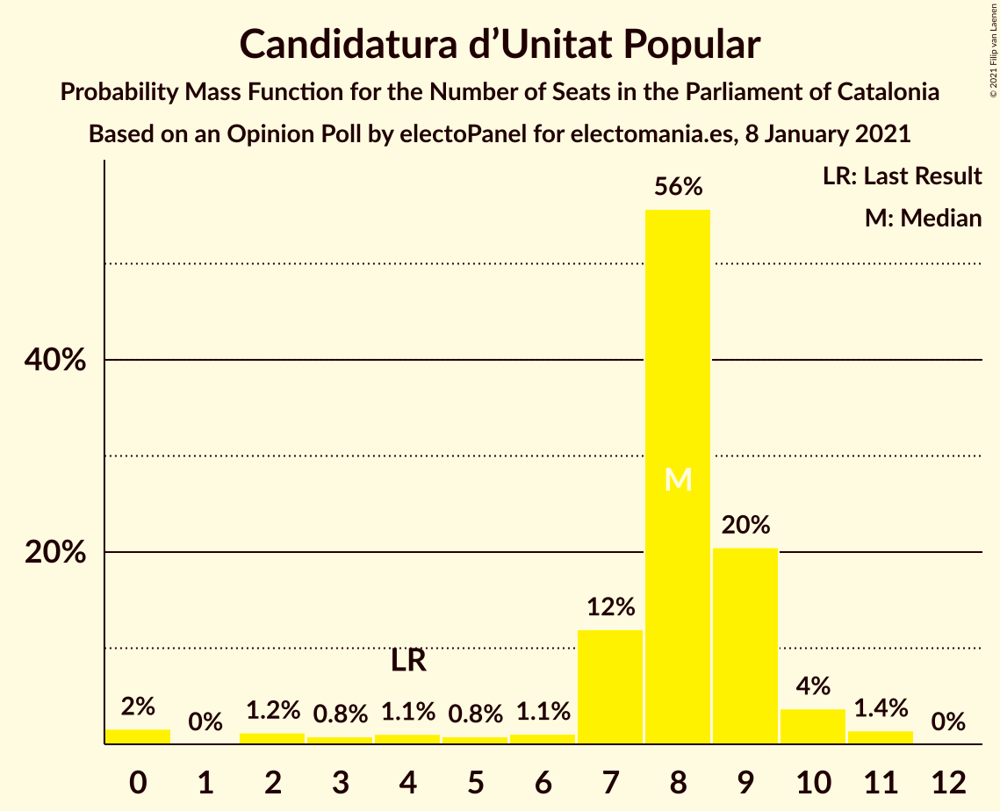

| Number of Seats | Probability | Accumulated | Special Marks |
|:---------------:|:-----------:|:-----------:|:-------------:|
| 0 | 2% | 100% |  |
| 1 | 0% | 98% |  |
| 2 | 1.2% | 98% |  |
| 3 | 0.8% | 97% |  |
| 4 | 1.1% | 96% | Last Result |
| 5 | 0.8% | 95% |  |
| 6 | 1.1% | 94% |  |
| 7 | 12% | 93% |  |
| 8 | 56% | 81% | Median |
| 9 | 20% | 26% |  |
| 10 | 4% | 5% |  |
| 11 | 1.4% | 1.5% |  |
| 12 | 0% | 0% |  |

### Partit Demòcrata Europeu Català

*For a full overview of the results for this party, see the [Partit Demòcrata Europeu Català](party-partitdemòcrataeuropeucatalà.html) page.*

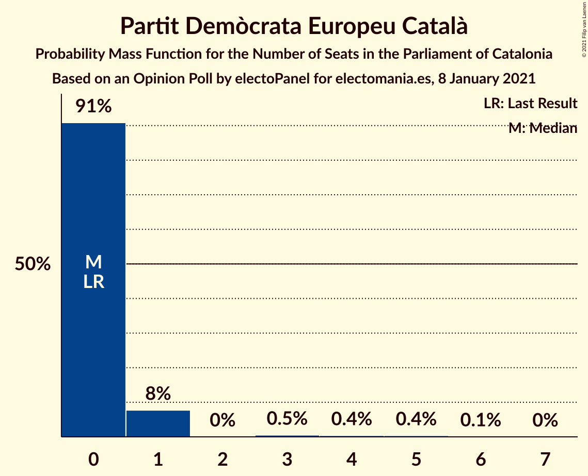

| Number of Seats | Probability | Accumulated | Special Marks |
|:---------------:|:-----------:|:-----------:|:-------------:|
| 0 | 91% | 100% | Last Result, Median |
| 1 | 8% | 9% |  |
| 2 | 0% | 1.4% |  |
| 3 | 0.5% | 1.4% |  |
| 4 | 0.4% | 0.9% |  |
| 5 | 0.4% | 0.5% |  |
| 6 | 0.1% | 0.1% |  |
| 7 | 0% | 0% |  |

## Coalitions

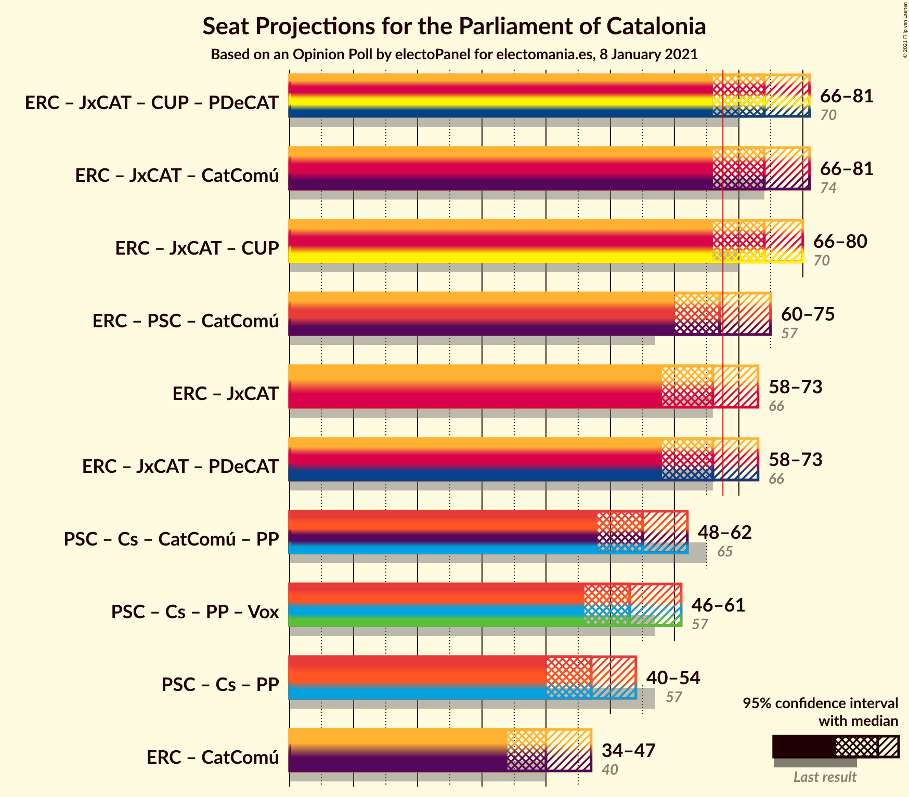

### Confidence Intervals

| Coalition | Last Result | Median | Majority? | 80% Confidence Interval | 90% Confidence Interval | 95% Confidence Interval | 99% Confidence Interval |
|:---------:|:-----------:|:------:|:---------:|:-----------------------:|:-----------------------:|:-----------------------:|:-----------------------:|
| Esquerra Republicana–Catalunya Sí – Junts per Catalunya – Candidatura d’Unitat Popular – Partit Demòcrata Europeu Català | 70 | 74 | 95% | 68–78 | 67–80 | 66–81 | 63–83 |
| Esquerra Republicana–Catalunya Sí – Junts per Catalunya – Catalunya en Comú–Podem | 74 | 74 | 95% | 69–78 | 68–79 | 66–81 | 64–83 |
| Esquerra Republicana–Catalunya Sí – Junts per Catalunya – Candidatura d’Unitat Popular | 70 | 74 | 94% | 68–78 | 67–80 | 66–80 | 63–83 |
| Esquerra Republicana–Catalunya Sí – Partit dels Socialistes de Catalunya (PSC-PSOE) – Catalunya en Comú–Podem | 57 | 67 | 48% | 62–72 | 61–73 | 60–75 | 58–77 |
| Esquerra Republicana–Catalunya Sí – Junts per Catalunya | 66 | 66 | 25% | 60–70 | 59–71 | 58–73 | 56–75 |
| Esquerra Republicana–Catalunya Sí – Junts per Catalunya – Partit Demòcrata Europeu Català | 66 | 66 | 26% | 60–70 | 59–72 | 58–73 | 56–75 |
| Partit dels Socialistes de Catalunya (PSC-PSOE) – Ciutadans–Partido de la Ciudadanía – Catalunya en Comú–Podem – Partit Popular | 65 | 55 | 0.1% | 50–61 | 49–61 | 48–62 | 46–65 |
| Partit dels Socialistes de Catalunya (PSC-PSOE) – Ciutadans–Partido de la Ciudadanía – Partit Popular – Vox | 57 | 53 | 0% | 49–58 | 48–59 | 46–61 | 44–63 |
| Partit dels Socialistes de Catalunya (PSC-PSOE) – Ciutadans–Partido de la Ciudadanía – Partit Popular | 57 | 47 | 0% | 42–51 | 41–53 | 40–54 | 38–57 |
| Esquerra Republicana–Catalunya Sí – Catalunya en Comú–Podem | 40 | 40 | 0% | 36–45 | 35–46 | 34–47 | 31–50 |

### Esquerra Republicana–Catalunya Sí – Junts per Catalunya – Candidatura d’Unitat Popular – Partit Demòcrata Europeu Català

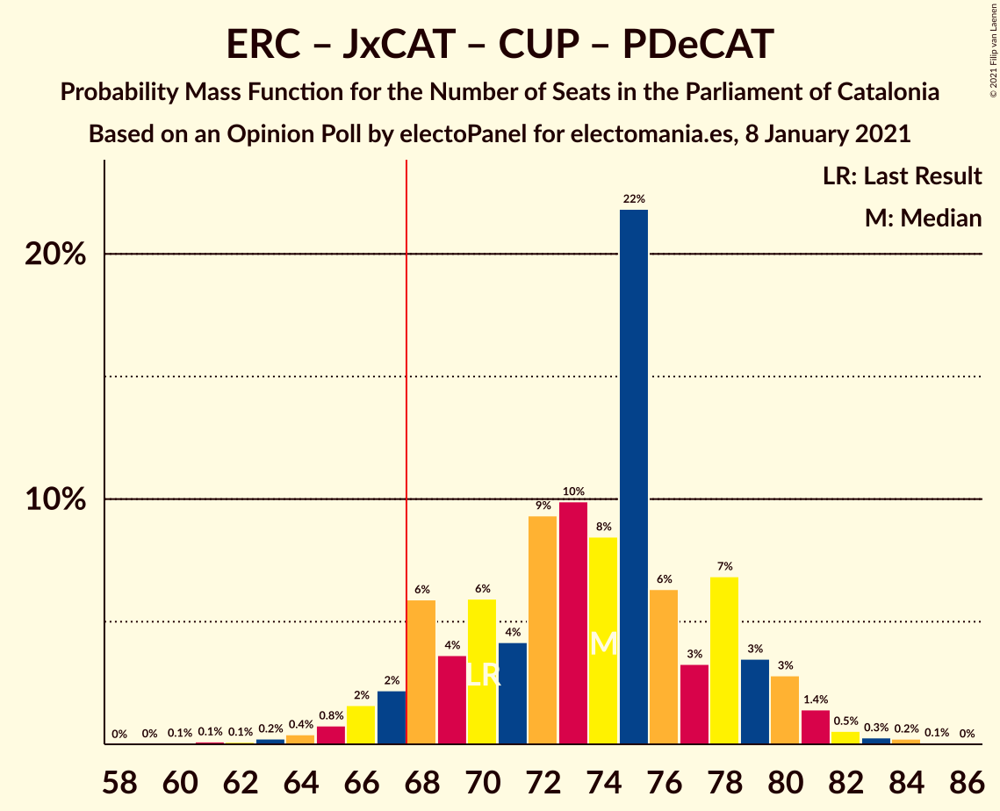

| Number of Seats | Probability | Accumulated | Special Marks |
|:---------------:|:-----------:|:-----------:|:-------------:|
| 60 | 0.1% | 100% |  |
| 61 | 0.1% | 99.9% |  |
| 62 | 0.1% | 99.8% |  |
| 63 | 0.2% | 99.7% |  |
| 64 | 0.4% | 99.5% |  |
| 65 | 0.8% | 99.1% |  |
| 66 | 2% | 98% |  |
| 67 | 2% | 97% |  |
| 68 | 6% | 95% | Majority |
| 69 | 4% | 89% |  |
| 70 | 6% | 85% | Last Result |
| 71 | 4% | 79% |  |
| 72 | 9% | 75% |  |
| 73 | 10% | 66% | Median |
| 74 | 8% | 56% |  |
| 75 | 22% | 47% |  |
| 76 | 6% | 25% |  |
| 77 | 3% | 19% |  |
| 78 | 7% | 16% |  |
| 79 | 3% | 9% |  |
| 80 | 3% | 5% |  |
| 81 | 1.4% | 3% |  |
| 82 | 0.5% | 1.2% |  |
| 83 | 0.3% | 0.6% |  |
| 84 | 0.2% | 0.3% |  |
| 85 | 0.1% | 0.1% |  |
| 86 | 0% | 0% |  |

### Esquerra Republicana–Catalunya Sí – Junts per Catalunya – Catalunya en Comú–Podem

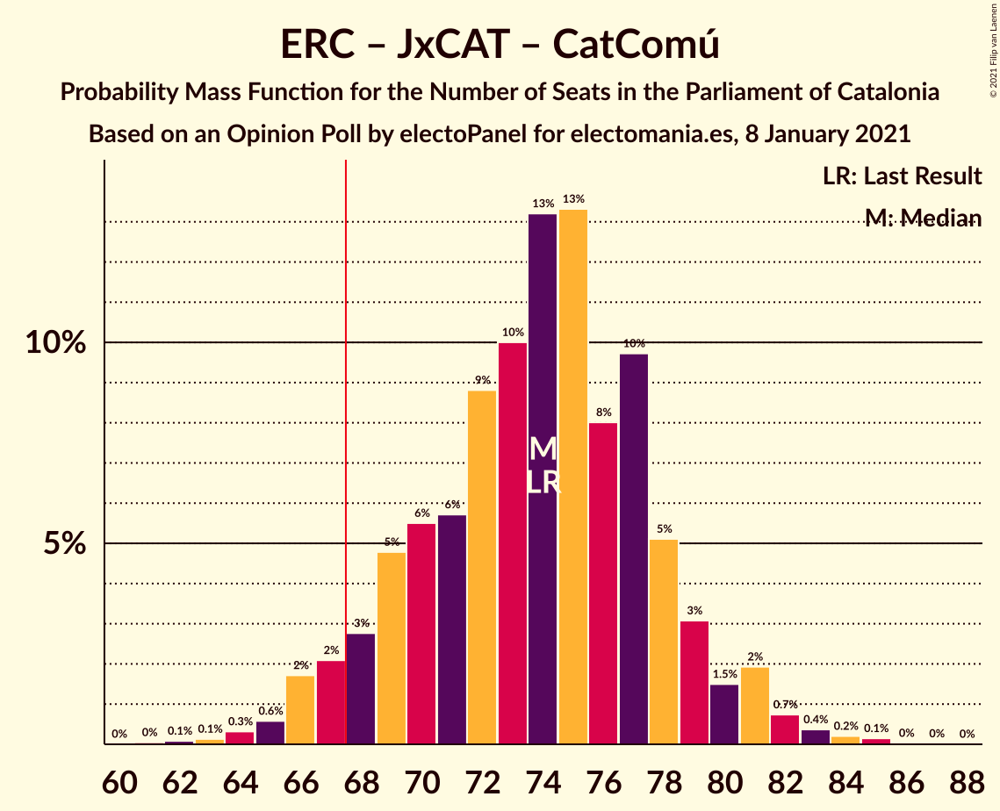

| Number of Seats | Probability | Accumulated | Special Marks |
|:---------------:|:-----------:|:-----------:|:-------------:|
| 61 | 0% | 100% |  |
| 62 | 0.1% | 99.9% |  |
| 63 | 0.1% | 99.8% |  |
| 64 | 0.3% | 99.7% |  |
| 65 | 0.6% | 99.4% |  |
| 66 | 2% | 98.8% |  |
| 67 | 2% | 97% |  |
| 68 | 3% | 95% | Majority |
| 69 | 5% | 92% |  |
| 70 | 6% | 87% |  |
| 71 | 6% | 82% |  |
| 72 | 9% | 76% |  |
| 73 | 10% | 67% | Median |
| 74 | 13% | 57% | Last Result |
| 75 | 13% | 44% |  |
| 76 | 8% | 31% |  |
| 77 | 10% | 23% |  |
| 78 | 5% | 13% |  |
| 79 | 3% | 8% |  |
| 80 | 1.5% | 5% |  |
| 81 | 2% | 3% |  |
| 82 | 0.7% | 2% |  |
| 83 | 0.4% | 0.8% |  |
| 84 | 0.2% | 0.4% |  |
| 85 | 0.1% | 0.2% |  |
| 86 | 0% | 0.1% |  |
| 87 | 0% | 0% |  |

### Esquerra Republicana–Catalunya Sí – Junts per Catalunya – Candidatura d’Unitat Popular

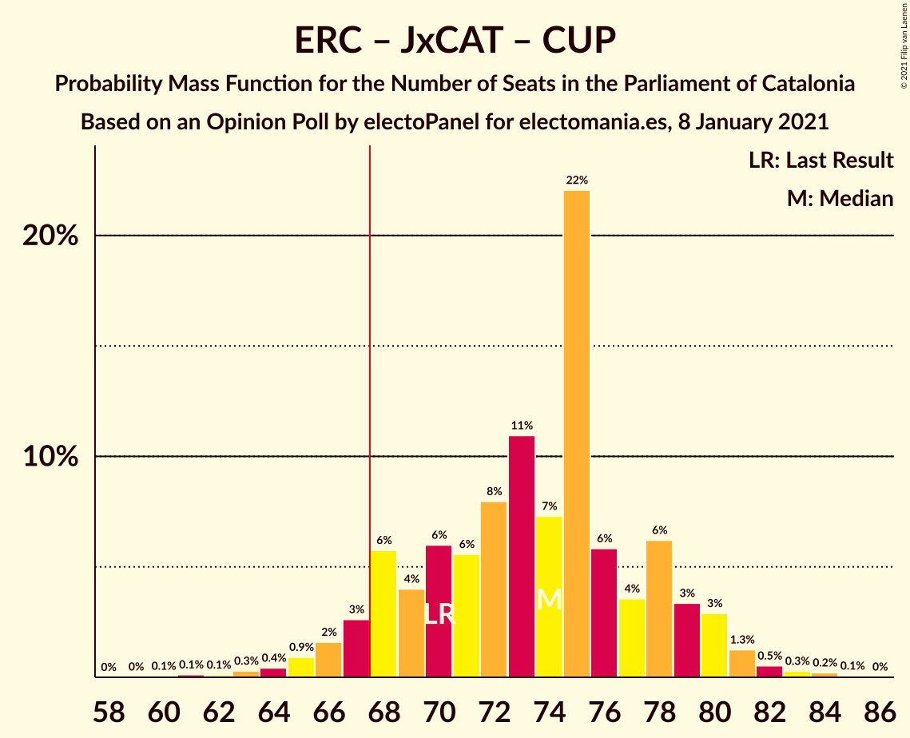

| Number of Seats | Probability | Accumulated | Special Marks |
|:---------------:|:-----------:|:-----------:|:-------------:|
| 60 | 0.1% | 100% |  |
| 61 | 0.1% | 99.9% |  |
| 62 | 0.1% | 99.8% |  |
| 63 | 0.3% | 99.7% |  |
| 64 | 0.4% | 99.4% |  |
| 65 | 0.9% | 98.9% |  |
| 66 | 2% | 98% |  |
| 67 | 3% | 96% |  |
| 68 | 6% | 94% | Majority |
| 69 | 4% | 88% |  |
| 70 | 6% | 84% | Last Result |
| 71 | 6% | 78% |  |
| 72 | 8% | 72% |  |
| 73 | 11% | 65% | Median |
| 74 | 7% | 54% |  |
| 75 | 22% | 46% |  |
| 76 | 6% | 24% |  |
| 77 | 4% | 18% |  |
| 78 | 6% | 15% |  |
| 79 | 3% | 9% |  |
| 80 | 3% | 5% |  |
| 81 | 1.3% | 2% |  |
| 82 | 0.5% | 1.1% |  |
| 83 | 0.3% | 0.6% |  |
| 84 | 0.2% | 0.3% |  |
| 85 | 0.1% | 0.1% |  |
| 86 | 0% | 0% |  |

### Esquerra Republicana–Catalunya Sí – Partit dels Socialistes de Catalunya (PSC-PSOE) – Catalunya en Comú–Podem

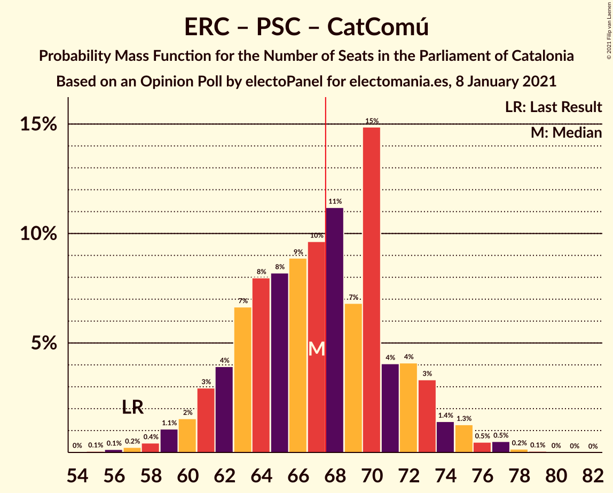

| Number of Seats | Probability | Accumulated | Special Marks |
|:---------------:|:-----------:|:-----------:|:-------------:|
| 55 | 0.1% | 100% |  |
| 56 | 0.1% | 99.9% |  |
| 57 | 0.2% | 99.8% | Last Result |
| 58 | 0.4% | 99.5% |  |
| 59 | 1.1% | 99.1% |  |
| 60 | 2% | 98% |  |
| 61 | 3% | 96% |  |
| 62 | 4% | 94% |  |
| 63 | 7% | 90% |  |
| 64 | 8% | 83% |  |
| 65 | 8% | 75% |  |
| 66 | 9% | 67% | Median |
| 67 | 10% | 58% |  |
| 68 | 11% | 48% | Majority |
| 69 | 7% | 37% |  |
| 70 | 15% | 30% |  |
| 71 | 4% | 15% |  |
| 72 | 4% | 11% |  |
| 73 | 3% | 7% |  |
| 74 | 1.4% | 4% |  |
| 75 | 1.3% | 3% |  |
| 76 | 0.5% | 1.2% |  |
| 77 | 0.5% | 0.8% |  |
| 78 | 0.2% | 0.3% |  |
| 79 | 0.1% | 0.1% |  |
| 80 | 0% | 0.1% |  |
| 81 | 0% | 0% |  |

### Esquerra Republicana–Catalunya Sí – Junts per Catalunya

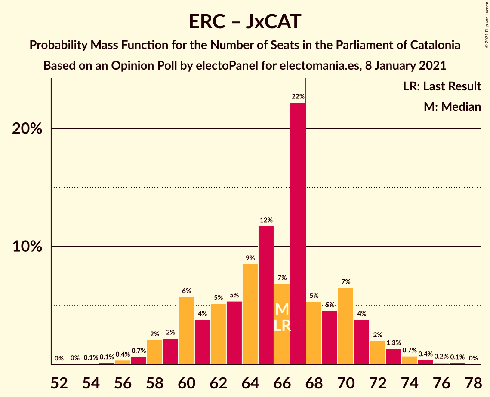

| Number of Seats | Probability | Accumulated | Special Marks |
|:---------------:|:-----------:|:-----------:|:-------------:|
| 53 | 0% | 100% |  |
| 54 | 0.1% | 99.9% |  |
| 55 | 0.1% | 99.9% |  |
| 56 | 0.4% | 99.7% |  |
| 57 | 0.7% | 99.4% |  |
| 58 | 2% | 98.7% |  |
| 59 | 2% | 97% |  |
| 60 | 6% | 94% |  |
| 61 | 4% | 89% |  |
| 62 | 5% | 85% |  |
| 63 | 5% | 80% |  |
| 64 | 9% | 74% |  |
| 65 | 12% | 66% | Median |
| 66 | 7% | 54% | Last Result |
| 67 | 22% | 47% |  |
| 68 | 5% | 25% | Majority |
| 69 | 5% | 20% |  |
| 70 | 7% | 15% |  |
| 71 | 4% | 9% |  |
| 72 | 2% | 5% |  |
| 73 | 1.3% | 3% |  |
| 74 | 0.7% | 1.4% |  |
| 75 | 0.4% | 0.7% |  |
| 76 | 0.2% | 0.3% |  |
| 77 | 0.1% | 0.2% |  |
| 78 | 0% | 0% |  |

### Esquerra Republicana–Catalunya Sí – Junts per Catalunya – Partit Demòcrata Europeu Català

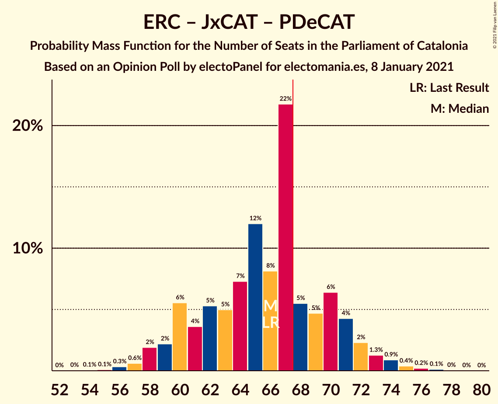

| Number of Seats | Probability | Accumulated | Special Marks |
|:---------------:|:-----------:|:-----------:|:-------------:|
| 53 | 0% | 100% |  |
| 54 | 0.1% | 99.9% |  |
| 55 | 0.1% | 99.9% |  |
| 56 | 0.3% | 99.8% |  |
| 57 | 0.6% | 99.4% |  |
| 58 | 2% | 98.8% |  |
| 59 | 2% | 97% |  |
| 60 | 6% | 95% |  |
| 61 | 4% | 89% |  |
| 62 | 5% | 86% |  |
| 63 | 5% | 80% |  |
| 64 | 7% | 75% |  |
| 65 | 12% | 68% | Median |
| 66 | 8% | 56% | Last Result |
| 67 | 22% | 48% |  |
| 68 | 5% | 26% | Majority |
| 69 | 5% | 21% |  |
| 70 | 6% | 16% |  |
| 71 | 4% | 10% |  |
| 72 | 2% | 5% |  |
| 73 | 1.3% | 3% |  |
| 74 | 0.9% | 2% |  |
| 75 | 0.4% | 0.8% |  |
| 76 | 0.2% | 0.4% |  |
| 77 | 0.1% | 0.2% |  |
| 78 | 0% | 0.1% |  |
| 79 | 0% | 0% |  |

### Partit dels Socialistes de Catalunya (PSC-PSOE) – Ciutadans–Partido de la Ciudadanía – Catalunya en Comú–Podem – Partit Popular

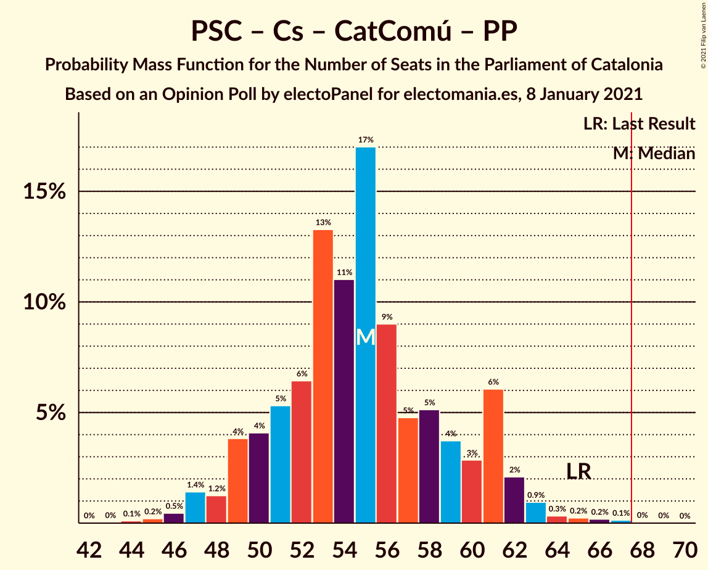

| Number of Seats | Probability | Accumulated | Special Marks |
|:---------------:|:-----------:|:-----------:|:-------------:|
| 43 | 0% | 100% |  |
| 44 | 0.1% | 99.9% |  |
| 45 | 0.2% | 99.8% |  |
| 46 | 0.5% | 99.6% |  |
| 47 | 1.4% | 99.2% |  |
| 48 | 1.2% | 98% |  |
| 49 | 4% | 97% |  |
| 50 | 4% | 93% |  |
| 51 | 5% | 89% |  |
| 52 | 6% | 83% |  |
| 53 | 13% | 77% |  |
| 54 | 11% | 64% | Median |
| 55 | 17% | 53% |  |
| 56 | 9% | 36% |  |
| 57 | 5% | 27% |  |
| 58 | 5% | 22% |  |
| 59 | 4% | 17% |  |
| 60 | 3% | 13% |  |
| 61 | 6% | 10% |  |
| 62 | 2% | 4% |  |
| 63 | 0.9% | 2% |  |
| 64 | 0.3% | 1.0% |  |
| 65 | 0.2% | 0.6% | Last Result |
| 66 | 0.2% | 0.4% |  |
| 67 | 0.1% | 0.2% |  |
| 68 | 0% | 0.1% | Majority |
| 69 | 0% | 0% |  |

### Partit dels Socialistes de Catalunya (PSC-PSOE) – Ciutadans–Partido de la Ciudadanía – Partit Popular – Vox

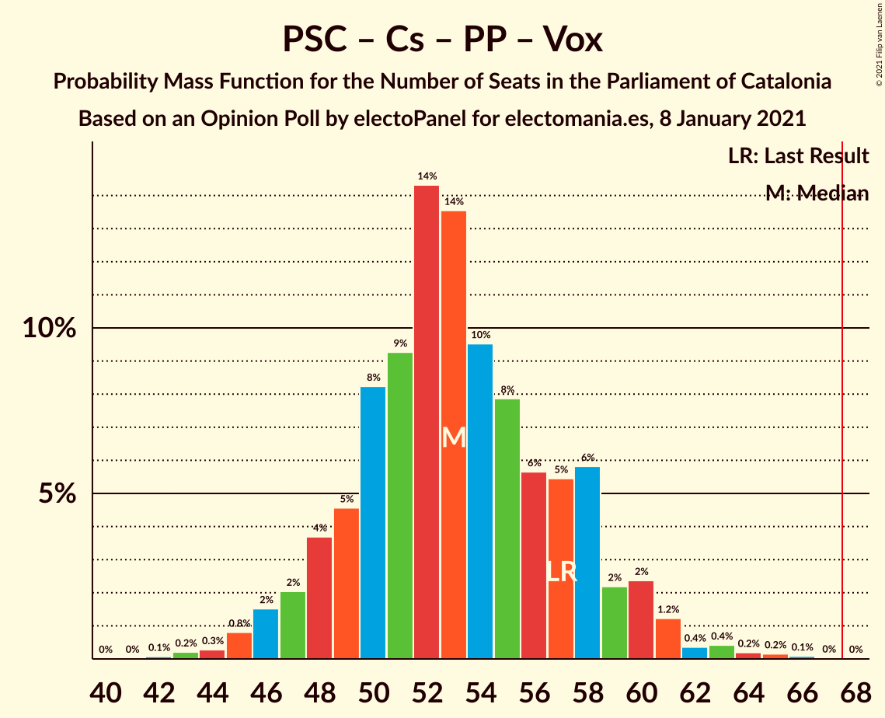

| Number of Seats | Probability | Accumulated | Special Marks |
|:---------------:|:-----------:|:-----------:|:-------------:|
| 42 | 0.1% | 100% |  |
| 43 | 0.2% | 99.9% |  |
| 44 | 0.3% | 99.7% |  |
| 45 | 0.8% | 99.4% |  |
| 46 | 2% | 98.6% |  |
| 47 | 2% | 97% |  |
| 48 | 4% | 95% |  |
| 49 | 5% | 91% |  |
| 50 | 8% | 87% |  |
| 51 | 9% | 79% |  |
| 52 | 14% | 69% |  |
| 53 | 14% | 55% | Median |
| 54 | 10% | 41% |  |
| 55 | 8% | 32% |  |
| 56 | 6% | 24% |  |
| 57 | 5% | 18% | Last Result |
| 58 | 6% | 13% |  |
| 59 | 2% | 7% |  |
| 60 | 2% | 5% |  |
| 61 | 1.2% | 3% |  |
| 62 | 0.4% | 1.3% |  |
| 63 | 0.4% | 0.9% |  |
| 64 | 0.2% | 0.5% |  |
| 65 | 0.2% | 0.3% |  |
| 66 | 0.1% | 0.1% |  |
| 67 | 0% | 0.1% |  |
| 68 | 0% | 0% | Majority |

### Partit dels Socialistes de Catalunya (PSC-PSOE) – Ciutadans–Partido de la Ciudadanía – Partit Popular

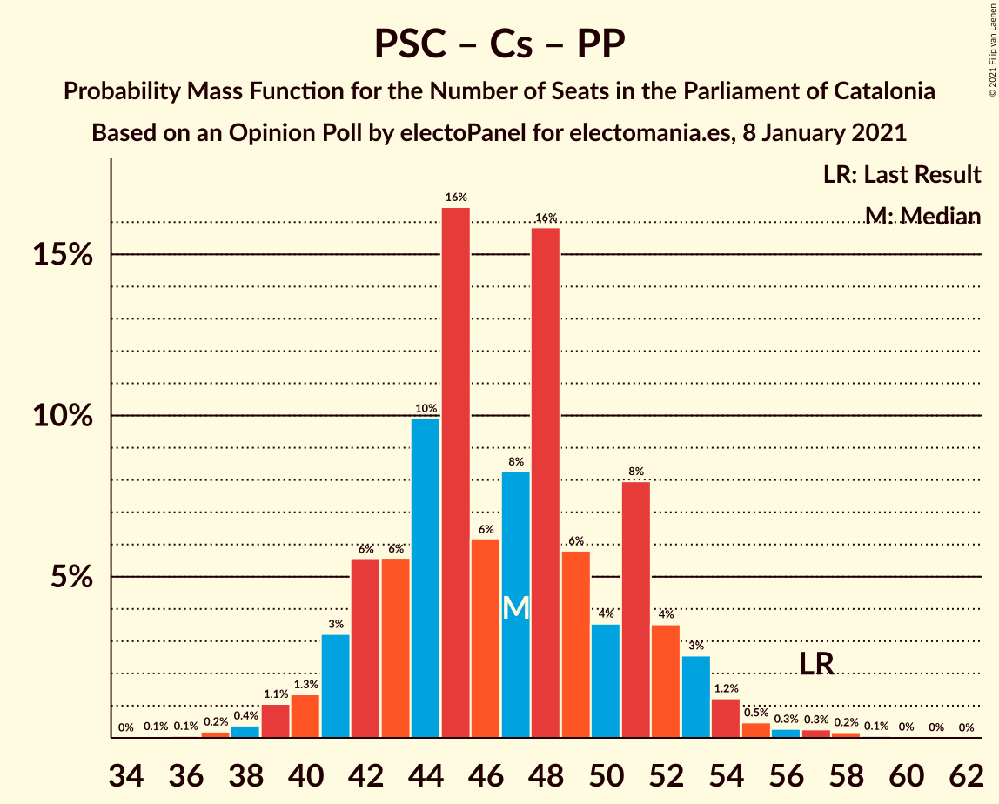

| Number of Seats | Probability | Accumulated | Special Marks |
|:---------------:|:-----------:|:-----------:|:-------------:|
| 35 | 0.1% | 100% |  |
| 36 | 0.1% | 99.9% |  |
| 37 | 0.2% | 99.9% |  |
| 38 | 0.4% | 99.7% |  |
| 39 | 1.1% | 99.3% |  |
| 40 | 1.3% | 98% |  |
| 41 | 3% | 97% |  |
| 42 | 6% | 94% |  |
| 43 | 6% | 88% |  |
| 44 | 10% | 83% |  |
| 45 | 16% | 73% |  |
| 46 | 6% | 56% | Median |
| 47 | 8% | 50% |  |
| 48 | 16% | 42% |  |
| 49 | 6% | 26% |  |
| 50 | 4% | 20% |  |
| 51 | 8% | 17% |  |
| 52 | 4% | 9% |  |
| 53 | 3% | 5% |  |
| 54 | 1.2% | 3% |  |
| 55 | 0.5% | 1.3% |  |
| 56 | 0.3% | 0.8% |  |
| 57 | 0.3% | 0.6% | Last Result |
| 58 | 0.2% | 0.3% |  |
| 59 | 0.1% | 0.1% |  |
| 60 | 0% | 0.1% |  |
| 61 | 0% | 0% |  |

### Esquerra Republicana–Catalunya Sí – Catalunya en Comú–Podem

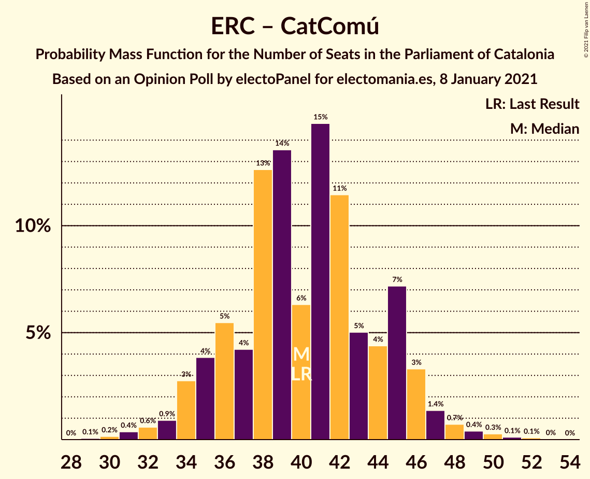

| Number of Seats | Probability | Accumulated | Special Marks |
|:---------------:|:-----------:|:-----------:|:-------------:|
| 29 | 0.1% | 100% |  |
| 30 | 0.2% | 99.9% |  |
| 31 | 0.4% | 99.8% |  |
| 32 | 0.6% | 99.4% |  |
| 33 | 0.9% | 98.8% |  |
| 34 | 3% | 98% |  |
| 35 | 4% | 95% |  |
| 36 | 5% | 91% |  |
| 37 | 4% | 86% |  |
| 38 | 13% | 82% |  |
| 39 | 14% | 69% |  |
| 40 | 6% | 55% | Last Result, Median |
| 41 | 15% | 49% |  |
| 42 | 11% | 34% |  |
| 43 | 5% | 23% |  |
| 44 | 4% | 18% |  |
| 45 | 7% | 13% |  |
| 46 | 3% | 6% |  |
| 47 | 1.4% | 3% |  |
| 48 | 0.7% | 2% |  |
| 49 | 0.4% | 0.9% |  |
| 50 | 0.3% | 0.5% |  |
| 51 | 0.1% | 0.2% |  |
| 52 | 0.1% | 0.1% |  |
| 53 | 0% | 0% |  |

## Technical Information

### Opinion Poll

+ **Polling firm:** electoPanel
+ **Commissioner(s):** electomania.es
+ **Fieldwork period:** 8 January 2021

### Calculations

+ **Sample size:** 400
+ **Simulations done:** 1,048,576
+ **Error estimate:** 2.03%

