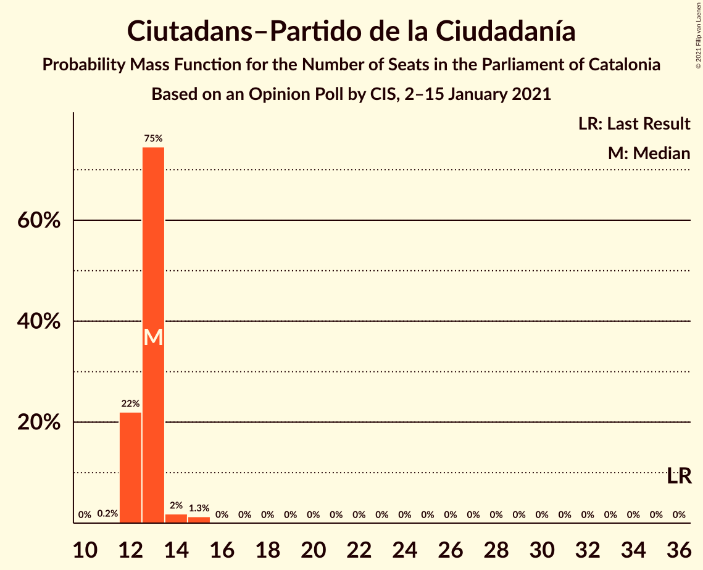
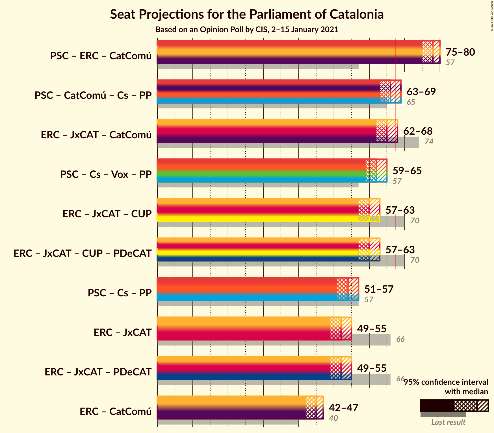
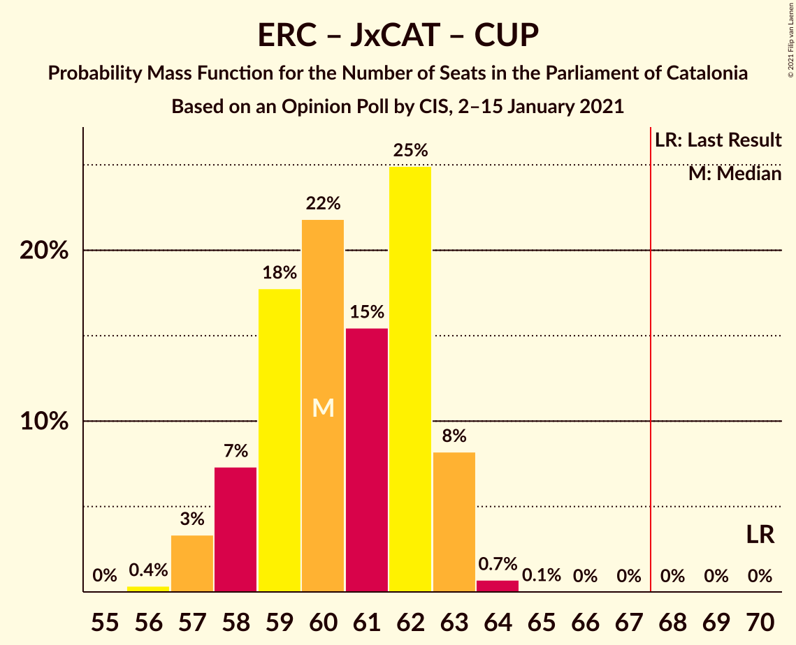
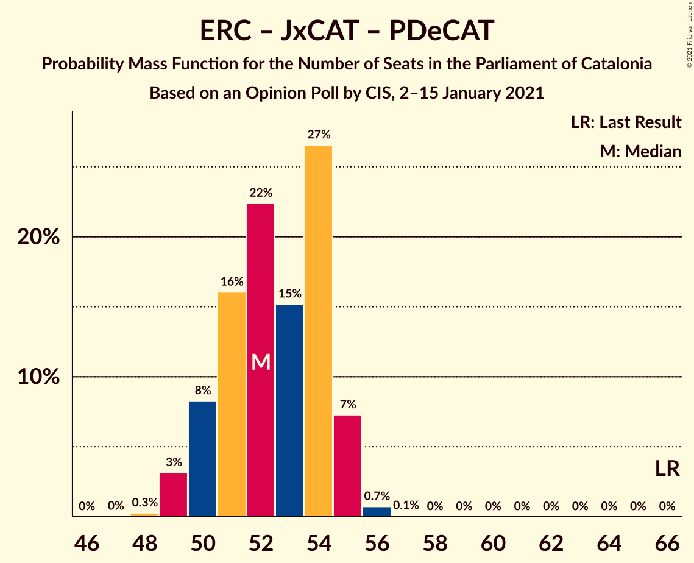

# Opinion Poll by CIS, 2–15 January 2021

<a href="#voting-intentions">Voting Intentions</a> | <a href="#seats">Seats</a> | <a href="#coalitions">Coalitions</a> | <a href="#technical-information">Technical Information</a>

## Voting Intentions

### Confidence Intervals

| Party | Last Result | Poll Result | 80% Confidence Interval | 90% Confidence Interval | 95% Confidence Interval | 99% Confidence Interval |
|:-----:|:-----------:|:-----------:|:-----------------------:|:-----------------------:|:-----------------------:|:-----------------------:|
| Partit dels Socialistes de Catalunya (PSC-PSOE) | 13.9% | 23.9% | 23.0–24.8% |22.8–25.0% |22.6–25.2% |22.2–25.7% |
| Esquerra Republicana–Catalunya Sí | 21.4% | 20.6% | 19.8–21.4% |19.6–21.7% |19.4–21.9% |19.0–22.3% |
| Junts per Catalunya | 21.7% | 12.5% | 11.8–13.2% |11.7–13.4% |11.5–13.5% |11.2–13.9% |
| Catalunya en Comú–Podem | 7.5% | 9.7% | 9.1–10.3% |9.0–10.5% |8.8–10.6% |8.6–10.9% |
| Ciutadans–Partido de la Ciudadanía | 25.4% | 9.6% | 9.0–10.2% |8.9–10.4% |8.7–10.5% |8.5–10.8% |
| Vox | 0.0% | 6.6% | 6.1–7.1% |6.0–7.3% |5.9–7.4% |5.7–7.7% |
| Candidatura d’Unitat Popular | 4.5% | 6.0% | 5.5–6.5% |5.4–6.6% |5.3–6.8% |5.1–7.0% |
| Partit Popular | 4.2% | 5.8% | 5.3–6.3% |5.2–6.4% |5.1–6.6% |4.9–6.8% |
| Partit Demòcrata Europeu Català | 0.0% | 0.7% | 0.6–0.9% |0.5–1.0% |0.5–1.0% |0.4–1.1% |

*Note:* The poll result column reflects the actual value used in the calculations. Published results may vary slightly, and in addition be rounded to fewer digits.

## Seats

### Confidence Intervals

| Party | Last Result | Median | 80% Confidence Interval | 90% Confidence Interval | 95% Confidence Interval | 99% Confidence Interval |
|:-----:|:-----------:|:------:|:-----------------------:|:-----------------------:|:-----------------------:|:-----------------------:|
| <a href="#partit-dels-socialistes-de-catalunya-(psc-psoe)">Partit dels Socialistes de Catalunya (PSC-PSOE)</a> | 17 | 34 | 32–35 |32–36 |31–36 |31–37 |
| <a href="#esquerra-republicana–catalunya-sí">Esquerra Republicana–Catalunya Sí</a> | 32 | 33 | 31–34 |30–34 |30–34 |29–35 |
| <a href="#junts-per-catalunya">Junts per Catalunya</a> | 34 | 21 | 19–21 |18–22 |18–23 |18–23 |
| <a href="#catalunya-en-comú–podem">Catalunya en Comú–Podem</a> | 8 | 12 | 11–13 |11–14 |11–14 |10–14 |
| <a href="#ciutadans–partido-de-la-ciudadanía">Ciutadans–Partido de la Ciudadanía</a> | 36 | 13 | 12–13 |12–13 |12–14 |12–15 |
| <a href="#vox">Vox</a> | 0 | 9 | 8–9 |8–9 |7–10 |7–11 |
| <a href="#candidatura-d’unitat-popular">Candidatura d’Unitat Popular</a> | 4 | 8 | 8 |7–9 |7–9 |7–10 |
| <a href="#partit-popular">Partit Popular</a> | 4 | 7 | 7–8 |6–9 |6–9 |6–9 |
| <a href="#partit-demòcrata-europeu-català">Partit Demòcrata Europeu Català</a> | 0 | 0 | 0 |0 |0 |0 |

### Partit dels Socialistes de Catalunya (PSC-PSOE)

*For a full overview of the results for this party, see the [Partit dels Socialistes de Catalunya (PSC-PSOE)](party-partitdelssocialistesdecatalunyapsc-psoe.html) page.*

| Number of Seats | Probability | Accumulated | Special Marks |
|:---------------:|:-----------:|:-----------:|:-------------:|
| 17 | 0% | 100% | Last Result |
| 18 | 0% | 100% |  |
| 19 | 0% | 100% |  |
| 20 | 0% | 100% |  |
| 21 | 0% | 100% |  |
| 22 | 0% | 100% |  |
| 23 | 0% | 100% |  |
| 24 | 0% | 100% |  |
| 25 | 0% | 100% |  |
| 26 | 0% | 100% |  |
| 27 | 0% | 100% |  |
| 28 | 0% | 100% |  |
| 29 | 0% | 100% |  |
| 30 | 0.1% | 100% |  |
| 31 | 5% | 99.9% |  |
| 32 | 17% | 95% |  |
| 33 | 24% | 79% |  |
| 34 | 30% | 55% | Median |
| 35 | 19% | 24% |  |
| 36 | 5% | 6% |  |
| 37 | 0.6% | 0.7% |  |
| 38 | 0.2% | 0.2% |  |
| 39 | 0% | 0% |  |

### Esquerra Republicana–Catalunya Sí

*For a full overview of the results for this party, see the [Esquerra Republicana–Catalunya Sí](party-esquerrarepublicana–catalunyasí.html) page.*

| Number of Seats | Probability | Accumulated | Special Marks |
|:---------------:|:-----------:|:-----------:|:-------------:|
| 28 | 0.1% | 100% |  |
| 29 | 0.9% | 99.9% |  |
| 30 | 6% | 99.0% |  |
| 31 | 18% | 93% |  |
| 32 | 20% | 75% | Last Result |
| 33 | 43% | 55% | Median |
| 34 | 10% | 12% |  |
| 35 | 1.0% | 1.1% |  |
| 36 | 0.1% | 0.1% |  |
| 37 | 0% | 0% |  |

### Junts per Catalunya

*For a full overview of the results for this party, see the [Junts per Catalunya](party-juntspercatalunya.html) page.*

| Number of Seats | Probability | Accumulated | Special Marks |
|:---------------:|:-----------:|:-----------:|:-------------:|
| 17 | 0.5% | 100% |  |
| 18 | 8% | 99.5% |  |
| 19 | 29% | 91% |  |
| 20 | 9% | 62% |  |
| 21 | 47% | 53% | Median |
| 22 | 3% | 6% |  |
| 23 | 3% | 3% |  |
| 24 | 0.1% | 0.1% |  |
| 25 | 0% | 0% |  |
| 26 | 0% | 0% |  |
| 27 | 0% | 0% |  |
| 28 | 0% | 0% |  |
| 29 | 0% | 0% |  |
| 30 | 0% | 0% |  |
| 31 | 0% | 0% |  |
| 32 | 0% | 0% |  |
| 33 | 0% | 0% |  |
| 34 | 0% | 0% | Last Result |

### Catalunya en Comú–Podem

*For a full overview of the results for this party, see the [Catalunya en Comú–Podem](party-catalunyaencomú–podem.html) page.*

| Number of Seats | Probability | Accumulated | Special Marks |
|:---------------:|:-----------:|:-----------:|:-------------:|
| 8 | 0% | 100% | Last Result |
| 9 | 0% | 100% |  |
| 10 | 1.0% | 100% |  |
| 11 | 34% | 99.0% |  |
| 12 | 16% | 65% | Median |
| 13 | 43% | 49% |  |
| 14 | 6% | 6% |  |
| 15 | 0.1% | 0.1% |  |
| 16 | 0% | 0% |  |

### Ciutadans–Partido de la Ciudadanía

*For a full overview of the results for this party, see the [Ciutadans–Partido de la Ciudadanía](party-ciutadans–partidodelaciudadanía.html) page.*

| Number of Seats | Probability | Accumulated | Special Marks |
|:---------------:|:-----------:|:-----------:|:-------------:|
| 11 | 0.2% | 100% |  |
| 12 | 22% | 99.7% |  |
| 13 | 75% | 78% | Median |
| 14 | 2% | 3% |  |
| 15 | 1.3% | 1.3% |  |
| 16 | 0% | 0% |  |
| 17 | 0% | 0% |  |
| 18 | 0% | 0% |  |
| 19 | 0% | 0% |  |
| 20 | 0% | 0% |  |
| 21 | 0% | 0% |  |
| 22 | 0% | 0% |  |
| 23 | 0% | 0% |  |
| 24 | 0% | 0% |  |
| 25 | 0% | 0% |  |
| 26 | 0% | 0% |  |
| 27 | 0% | 0% |  |
| 28 | 0% | 0% |  |
| 29 | 0% | 0% |  |
| 30 | 0% | 0% |  |
| 31 | 0% | 0% |  |
| 32 | 0% | 0% |  |
| 33 | 0% | 0% |  |
| 34 | 0% | 0% |  |
| 35 | 0% | 0% |  |
| 36 | 0% | 0% | Last Result |

### Vox

*For a full overview of the results for this party, see the [Vox](party-vox.html) page.*

| Number of Seats | Probability | Accumulated | Special Marks |
|:---------------:|:-----------:|:-----------:|:-------------:|
| 0 | 0% | 100% | Last Result |
| 1 | 0% | 100% |  |
| 2 | 0% | 100% |  |
| 3 | 0% | 100% |  |
| 4 | 0% | 100% |  |
| 5 | 0% | 100% |  |
| 6 | 0% | 100% |  |
| 7 | 4% | 100% |  |
| 8 | 30% | 96% |  |
| 9 | 63% | 66% | Median |
| 10 | 2% | 3% |  |
| 11 | 0.6% | 0.6% |  |
| 12 | 0% | 0% |  |

### Candidatura d’Unitat Popular

*For a full overview of the results for this party, see the [Candidatura d’Unitat Popular](party-candidaturad’unitatpopular.html) page.*

| Number of Seats | Probability | Accumulated | Special Marks |
|:---------------:|:-----------:|:-----------:|:-------------:|
| 4 | 0% | 100% | Last Result |
| 5 | 0% | 100% |  |
| 6 | 0% | 100% |  |
| 7 | 8% | 100% |  |
| 8 | 86% | 92% | Median |
| 9 | 5% | 6% |  |
| 10 | 1.3% | 1.3% |  |
| 11 | 0% | 0% |  |

### Partit Popular

*For a full overview of the results for this party, see the [Partit Popular](party-partitpopular.html) page.*

| Number of Seats | Probability | Accumulated | Special Marks |
|:---------------:|:-----------:|:-----------:|:-------------:|
| 4 | 0% | 100% | Last Result |
| 5 | 0.2% | 100% |  |
| 6 | 7% | 99.8% |  |
| 7 | 67% | 93% | Median |
| 8 | 16% | 25% |  |
| 9 | 9% | 9% |  |
| 10 | 0% | 0% |  |

### Partit Demòcrata Europeu Català

*For a full overview of the results for this party, see the [Partit Demòcrata Europeu Català](party-partitdemòcrataeuropeucatalà.html) page.*

| Number of Seats | Probability | Accumulated | Special Marks |
|:---------------:|:-----------:|:-----------:|:-------------:|
| 0 | 100% | 100% | Last Result, Median |

## Coalitions

### Confidence Intervals

| Coalition | Last Result | Median | Majority? | 80% Confidence Interval | 90% Confidence Interval | 95% Confidence Interval | 99% Confidence Interval |
|:---------:|:-----------:|:------:|:---------:|:-----------------------:|:-----------------------:|:-----------------------:|:-----------------------:|
| Partit dels Socialistes de Catalunya (PSC-PSOE) – Esquerra Republicana–Catalunya Sí – Catalunya en Comú–Podem | 57 | 78 | 100% | 76–80 | 76–80 | 75–80 | 74–81 |
| Partit dels Socialistes de Catalunya (PSC-PSOE) – Catalunya en Comú–Podem – Ciutadans–Partido de la Ciudadanía – Partit Popular | 65 | 66 | 16% | 64–68 | 64–69 | 63–69 | 62–70 |
| Esquerra Republicana–Catalunya Sí – Junts per Catalunya – Catalunya en Comú–Podem | 74 | 65 | 3% | 63–67 | 62–67 | 62–68 | 61–68 |
| Partit dels Socialistes de Catalunya (PSC-PSOE) – Ciutadans–Partido de la Ciudadanía – Vox – Partit Popular | 57 | 62 | 0% | 61–64 | 60–65 | 59–65 | 59–66 |
| Esquerra Republicana–Catalunya Sí – Junts per Catalunya – Candidatura d’Unitat Popular | 70 | 60 | 0% | 58–62 | 58–63 | 57–63 | 57–64 |
| Esquerra Republicana–Catalunya Sí – Junts per Catalunya – Candidatura d’Unitat Popular – Partit Demòcrata Europeu Català | 70 | 60 | 0% | 58–62 | 58–63 | 57–63 | 57–64 |
| Partit dels Socialistes de Catalunya (PSC-PSOE) – Ciutadans–Partido de la Ciudadanía – Partit Popular | 57 | 54 | 0% | 52–55 | 51–56 | 51–57 | 50–57 |
| Esquerra Republicana–Catalunya Sí – Junts per Catalunya | 66 | 52 | 0% | 50–54 | 50–55 | 49–55 | 49–56 |
| Esquerra Republicana–Catalunya Sí – Junts per Catalunya – Partit Demòcrata Europeu Català | 66 | 52 | 0% | 50–54 | 50–55 | 49–55 | 49–56 |
| Esquerra Republicana–Catalunya Sí – Catalunya en Comú–Podem | 40 | 45 | 0% | 43–46 | 42–46 | 42–47 | 41–48 |

### Partit dels Socialistes de Catalunya (PSC-PSOE) – Esquerra Republicana–Catalunya Sí – Catalunya en Comú–Podem

| Number of Seats | Probability | Accumulated | Special Marks |
|:---------------:|:-----------:|:-----------:|:-------------:|
| 57 | 0% | 100% | Last Result |
| 58 | 0% | 100% |  |
| 59 | 0% | 100% |  |
| 60 | 0% | 100% |  |
| 61 | 0% | 100% |  |
| 62 | 0% | 100% |  |
| 63 | 0% | 100% |  |
| 64 | 0% | 100% |  |
| 65 | 0% | 100% |  |
| 66 | 0% | 100% |  |
| 67 | 0% | 100% |  |
| 68 | 0% | 100% | Majority |
| 69 | 0% | 100% |  |
| 70 | 0% | 100% |  |
| 71 | 0% | 100% |  |
| 72 | 0% | 100% |  |
| 73 | 0.1% | 100% |  |
| 74 | 0.8% | 99.9% |  |
| 75 | 3% | 99.1% |  |
| 76 | 9% | 96% |  |
| 77 | 20% | 87% |  |
| 78 | 27% | 68% |  |
| 79 | 22% | 40% | Median |
| 80 | 16% | 18% |  |
| 81 | 2% | 2% |  |
| 82 | 0.3% | 0.3% |  |
| 83 | 0% | 0% |  |

### Partit dels Socialistes de Catalunya (PSC-PSOE) – Catalunya en Comú–Podem – Ciutadans–Partido de la Ciudadanía – Partit Popular

| Number of Seats | Probability | Accumulated | Special Marks |
|:---------------:|:-----------:|:-----------:|:-------------:|
| 62 | 0.5% | 100% |  |
| 63 | 4% | 99.5% |  |
| 64 | 17% | 95% |  |
| 65 | 26% | 79% | Last Result |
| 66 | 19% | 53% | Median |
| 67 | 19% | 35% |  |
| 68 | 8% | 16% | Majority |
| 69 | 7% | 8% |  |
| 70 | 0.7% | 0.8% |  |
| 71 | 0.1% | 0.1% |  |
| 72 | 0% | 0% |  |

### Esquerra Republicana–Catalunya Sí – Junts per Catalunya – Catalunya en Comú–Podem

| Number of Seats | Probability | Accumulated | Special Marks |
|:---------------:|:-----------:|:-----------:|:-------------:|
| 60 | 0.1% | 100% |  |
| 61 | 2% | 99.9% |  |
| 62 | 4% | 98% |  |
| 63 | 13% | 94% |  |
| 64 | 25% | 81% |  |
| 65 | 29% | 56% |  |
| 66 | 16% | 26% | Median |
| 67 | 8% | 11% |  |
| 68 | 3% | 3% | Majority |
| 69 | 0.1% | 0.1% |  |
| 70 | 0% | 0% |  |
| 71 | 0% | 0% |  |
| 72 | 0% | 0% |  |
| 73 | 0% | 0% |  |
| 74 | 0% | 0% | Last Result |

### Partit dels Socialistes de Catalunya (PSC-PSOE) – Ciutadans–Partido de la Ciudadanía – Vox – Partit Popular

| Number of Seats | Probability | Accumulated | Special Marks |
|:---------------:|:-----------:|:-----------:|:-------------:|
| 57 | 0% | 100% | Last Result |
| 58 | 0.1% | 100% |  |
| 59 | 3% | 99.9% |  |
| 60 | 7% | 97% |  |
| 61 | 17% | 90% |  |
| 62 | 28% | 73% |  |
| 63 | 27% | 45% | Median |
| 64 | 12% | 18% |  |
| 65 | 5% | 7% |  |
| 66 | 1.5% | 2% |  |
| 67 | 0.1% | 0.1% |  |
| 68 | 0% | 0% | Majority |

### Esquerra Republicana–Catalunya Sí – Junts per Catalunya – Candidatura d’Unitat Popular

| Number of Seats | Probability | Accumulated | Special Marks |
|:---------------:|:-----------:|:-----------:|:-------------:|
| 56 | 0.4% | 100% |  |
| 57 | 3% | 99.6% |  |
| 58 | 7% | 96% |  |
| 59 | 18% | 89% |  |
| 60 | 22% | 71% |  |
| 61 | 15% | 49% |  |
| 62 | 25% | 34% | Median |
| 63 | 8% | 9% |  |
| 64 | 0.7% | 0.8% |  |
| 65 | 0.1% | 0.1% |  |
| 66 | 0% | 0% |  |
| 67 | 0% | 0% |  |
| 68 | 0% | 0% | Majority |
| 69 | 0% | 0% |  |
| 70 | 0% | 0% | Last Result |

### Esquerra Republicana–Catalunya Sí – Junts per Catalunya – Candidatura d’Unitat Popular – Partit Demòcrata Europeu Català

| Number of Seats | Probability | Accumulated | Special Marks |
|:---------------:|:-----------:|:-----------:|:-------------:|
| 56 | 0.4% | 100% |  |
| 57 | 3% | 99.6% |  |
| 58 | 7% | 96% |  |
| 59 | 18% | 89% |  |
| 60 | 22% | 71% |  |
| 61 | 15% | 49% |  |
| 62 | 25% | 34% | Median |
| 63 | 8% | 9% |  |
| 64 | 0.7% | 0.8% |  |
| 65 | 0.1% | 0.1% |  |
| 66 | 0% | 0% |  |
| 67 | 0% | 0% |  |
| 68 | 0% | 0% | Majority |
| 69 | 0% | 0% |  |
| 70 | 0% | 0% | Last Result |

### Partit dels Socialistes de Catalunya (PSC-PSOE) – Ciutadans–Partido de la Ciudadanía – Partit Popular

| Number of Seats | Probability | Accumulated | Special Marks |
|:---------------:|:-----------:|:-----------:|:-------------:|
| 50 | 0.7% | 100% |  |
| 51 | 6% | 99.3% |  |
| 52 | 16% | 94% |  |
| 53 | 20% | 78% |  |
| 54 | 30% | 58% | Median |
| 55 | 18% | 27% |  |
| 56 | 6% | 9% |  |
| 57 | 2% | 3% | Last Result |
| 58 | 0.2% | 0.2% |  |
| 59 | 0% | 0% |  |

### Esquerra Republicana–Catalunya Sí – Junts per Catalunya

| Number of Seats | Probability | Accumulated | Special Marks |
|:---------------:|:-----------:|:-----------:|:-------------:|
| 48 | 0.3% | 100% |  |
| 49 | 3% | 99.7% |  |
| 50 | 8% | 97% |  |
| 51 | 16% | 88% |  |
| 52 | 22% | 72% |  |
| 53 | 15% | 50% |  |
| 54 | 27% | 35% | Median |
| 55 | 7% | 8% |  |
| 56 | 0.7% | 0.8% |  |
| 57 | 0.1% | 0.1% |  |
| 58 | 0% | 0% |  |
| 59 | 0% | 0% |  |
| 60 | 0% | 0% |  |
| 61 | 0% | 0% |  |
| 62 | 0% | 0% |  |
| 63 | 0% | 0% |  |
| 64 | 0% | 0% |  |
| 65 | 0% | 0% |  |
| 66 | 0% | 0% | Last Result |

### Esquerra Republicana–Catalunya Sí – Junts per Catalunya – Partit Demòcrata Europeu Català

| Number of Seats | Probability | Accumulated | Special Marks |
|:---------------:|:-----------:|:-----------:|:-------------:|
| 48 | 0.3% | 100% |  |
| 49 | 3% | 99.7% |  |
| 50 | 8% | 97% |  |
| 51 | 16% | 88% |  |
| 52 | 22% | 72% |  |
| 53 | 15% | 50% |  |
| 54 | 27% | 35% | Median |
| 55 | 7% | 8% |  |
| 56 | 0.7% | 0.8% |  |
| 57 | 0.1% | 0.1% |  |
| 58 | 0% | 0% |  |
| 59 | 0% | 0% |  |
| 60 | 0% | 0% |  |
| 61 | 0% | 0% |  |
| 62 | 0% | 0% |  |
| 63 | 0% | 0% |  |
| 64 | 0% | 0% |  |
| 65 | 0% | 0% |  |
| 66 | 0% | 0% | Last Result |

### Esquerra Republicana–Catalunya Sí – Catalunya en Comú–Podem

| Number of Seats | Probability | Accumulated | Special Marks |
|:---------------:|:-----------:|:-----------:|:-------------:|
| 40 | 0.1% | 100% | Last Result |
| 41 | 1.1% | 99.8% |  |
| 42 | 5% | 98.7% |  |
| 43 | 9% | 94% |  |
| 44 | 32% | 85% |  |
| 45 | 36% | 53% | Median |
| 46 | 12% | 17% |  |
| 47 | 4% | 4% |  |
| 48 | 0.6% | 0.7% |  |
| 49 | 0.1% | 0.1% |  |
| 50 | 0% | 0% |  |

## Technical Information

### Opinion Poll

+ **Polling firm:** CIS
+ **Commissioner(s):** —
+ **Fieldwork period:** 2–15 January 2021

### Calculations

+ **Sample size:** 4106
+ **Simulations done:** 1,048,576
+ **Error estimate:** 0.82%

