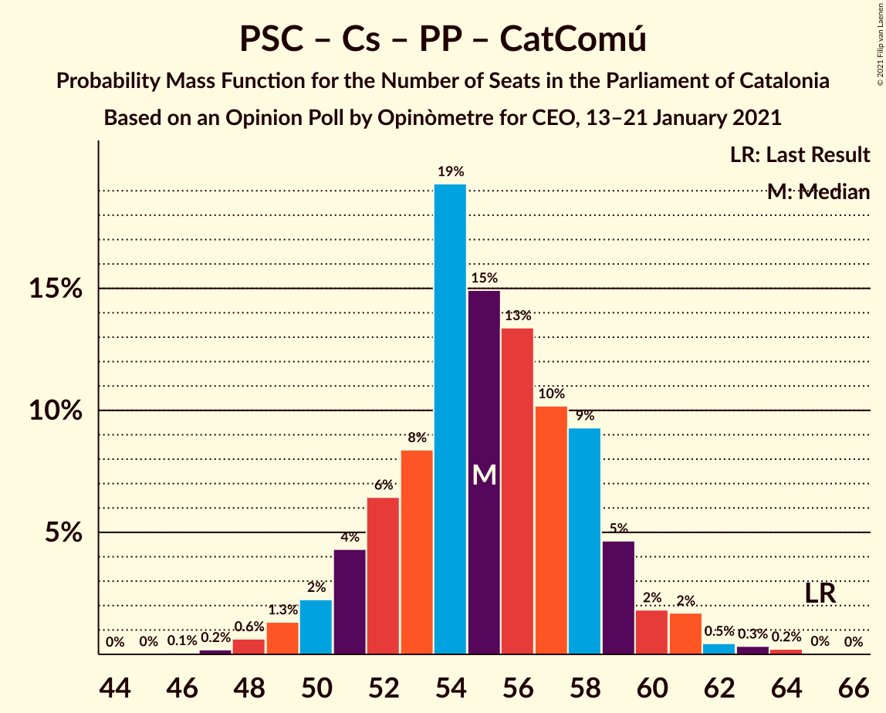

# Opinion Poll by Opinòmetre for CEO, 13–21 January 2021

<a href="#voting-intentions">Voting Intentions</a> | <a href="#seats">Seats</a> | <a href="#coalitions">Coalitions</a> | <a href="#technical-information">Technical Information</a>

## Voting Intentions

### Confidence Intervals

| Party | Last Result | Poll Result | 80% Confidence Interval | 90% Confidence Interval | 95% Confidence Interval | 99% Confidence Interval |
|:-----:|:-----------:|:-----------:|:-----------------------:|:-----------------------:|:-----------------------:|:-----------------------:|
| Esquerra Republicana–Catalunya Sí | 21.4% | 22.0% | 20.1–24.1% |19.5–24.7% |19.0–25.3% |18.2–26.3% |
| Junts per Catalunya | 21.7% | 20.7% | 18.8–22.8% |18.3–23.4% |17.8–23.9% |16.9–24.9% |
| Partit dels Socialistes de Catalunya (PSC-PSOE) | 13.9% | 19.6% | 17.8–21.7% |17.3–22.3% |16.8–22.8% |16.0–23.8% |
| Ciutadans–Partido de la Ciudadanía | 25.4% | 9.5% | 8.2–11.1% |7.8–11.6% |7.5–12.0% |7.0–12.8% |
| Partit Popular | 4.2% | 7.0% | 5.9–8.5% |5.6–8.9% |5.3–9.2% |4.9–9.9% |
| Catalunya en Comú–Podem | 7.5% | 6.5% | 5.4–7.8% |5.1–8.2% |4.8–8.6% |4.4–9.3% |
| Candidatura d’Unitat Popular | 4.5% | 6.2% | 5.1–7.5% |4.8–7.9% |4.6–8.2% |4.1–8.9% |
| Vox | 0.0% | 4.8% | 3.9–6.1% |3.7–6.4% |3.5–6.7% |3.1–7.4% |
| Partit Demòcrata Europeu Català | 0.0% | 2.3% | 1.8–3.3% |1.6–3.6% |1.4–3.8% |1.2–4.3% |

*Note:* The poll result column reflects the actual value used in the calculations. Published results may vary slightly, and in addition be rounded to fewer digits.

## Seats

### Confidence Intervals

| Party | Last Result | Median | 80% Confidence Interval | 90% Confidence Interval | 95% Confidence Interval | 99% Confidence Interval |
|:-----:|:-----------:|:------:|:-----------------------:|:-----------------------:|:-----------------------:|:-----------------------:|
| <a href="#esquerra-republicana–catalunya-sí">Esquerra Republicana–Catalunya Sí</a> | 32 | 33 | 30–37 |29–37 |28–38 |27–39 |
| <a href="#junts-per-catalunya">Junts per Catalunya</a> | 34 | 32 | 30–37 |29–37 |28–38 |26–39 |
| <a href="#partit-dels-socialistes-de-catalunya-(psc-psoe)">Partit dels Socialistes de Catalunya (PSC-PSOE)</a> | 17 | 27 | 24–30 |24–31 |22–31 |21–33 |
| <a href="#ciutadans–partido-de-la-ciudadanía">Ciutadans–Partido de la Ciudadanía</a> | 36 | 13 | 10–14 |9–15 |9–16 |8–18 |
| <a href="#partit-popular">Partit Popular</a> | 4 | 9 | 7–12 |7–12 |6–12 |5–13 |
| <a href="#catalunya-en-comú–podem">Catalunya en Comú–Podem</a> | 8 | 7 | 5–9 |5–10 |4–10 |4–11 |
| <a href="#candidatura-d’unitat-popular">Candidatura d’Unitat Popular</a> | 4 | 8 | 7–9 |6–10 |5–11 |4–12 |
| <a href="#vox">Vox</a> | 0 | 5 | 3–7 |3–7 |3–8 |2–9 |
| <a href="#partit-demòcrata-europeu-català">Partit Demòcrata Europeu Català</a> | 0 | 0 | 0–1 |0–4 |0–4 |0–5 |

### Esquerra Republicana–Catalunya Sí

*For a full overview of the results for this party, see the [Esquerra Republicana–Catalunya Sí](party-esquerrarepublicana–catalunyasí.html) page.*

| Number of Seats | Probability | Accumulated | Special Marks |
|:---------------:|:-----------:|:-----------:|:-------------:|
| 25 | 0.1% | 100% |  |
| 26 | 0.2% | 99.9% |  |
| 27 | 0.4% | 99.7% |  |
| 28 | 2% | 99.3% |  |
| 29 | 4% | 97% |  |
| 30 | 9% | 93% |  |
| 31 | 17% | 84% |  |
| 32 | 14% | 67% | Last Result |
| 33 | 13% | 53% | Median |
| 34 | 11% | 40% |  |
| 35 | 11% | 30% |  |
| 36 | 6% | 19% |  |
| 37 | 9% | 13% |  |
| 38 | 3% | 4% |  |
| 39 | 0.8% | 1.2% |  |
| 40 | 0.3% | 0.5% |  |
| 41 | 0.1% | 0.2% |  |
| 42 | 0.1% | 0.1% |  |
| 43 | 0% | 0% |  |

### Junts per Catalunya

*For a full overview of the results for this party, see the [Junts per Catalunya](party-juntspercatalunya.html) page.*

| Number of Seats | Probability | Accumulated | Special Marks |
|:---------------:|:-----------:|:-----------:|:-------------:|
| 25 | 0.1% | 100% |  |
| 26 | 1.0% | 99.9% |  |
| 27 | 0.6% | 98.9% |  |
| 28 | 2% | 98% |  |
| 29 | 3% | 97% |  |
| 30 | 4% | 94% |  |
| 31 | 21% | 89% |  |
| 32 | 23% | 68% | Median |
| 33 | 12% | 45% |  |
| 34 | 11% | 33% | Last Result |
| 35 | 5% | 22% |  |
| 36 | 5% | 18% |  |
| 37 | 9% | 13% |  |
| 38 | 3% | 4% |  |
| 39 | 0.6% | 1.0% |  |
| 40 | 0.3% | 0.4% |  |
| 41 | 0% | 0.1% |  |
| 42 | 0% | 0% |  |

### Partit dels Socialistes de Catalunya (PSC-PSOE)

*For a full overview of the results for this party, see the [Partit dels Socialistes de Catalunya (PSC-PSOE)](party-partitdelssocialistesdecatalunyapsc-psoe.html) page.*

| Number of Seats | Probability | Accumulated | Special Marks |
|:---------------:|:-----------:|:-----------:|:-------------:|
| 17 | 0% | 100% | Last Result |
| 18 | 0% | 100% |  |
| 19 | 0% | 100% |  |
| 20 | 0.2% | 99.9% |  |
| 21 | 0.4% | 99.7% |  |
| 22 | 3% | 99.4% |  |
| 23 | 1.3% | 97% |  |
| 24 | 8% | 96% |  |
| 25 | 20% | 87% |  |
| 26 | 17% | 67% |  |
| 27 | 23% | 50% | Median |
| 28 | 10% | 27% |  |
| 29 | 7% | 17% |  |
| 30 | 3% | 10% |  |
| 31 | 6% | 7% |  |
| 32 | 1.1% | 2% |  |
| 33 | 0.4% | 0.6% |  |
| 34 | 0.2% | 0.2% |  |
| 35 | 0% | 0% |  |

### Ciutadans–Partido de la Ciudadanía

*For a full overview of the results for this party, see the [Ciutadans–Partido de la Ciudadanía](party-ciutadans–partidodelaciudadanía.html) page.*

| Number of Seats | Probability | Accumulated | Special Marks |
|:---------------:|:-----------:|:-----------:|:-------------:|
| 7 | 0% | 100% |  |
| 8 | 2% | 99.9% |  |
| 9 | 5% | 98% |  |
| 10 | 4% | 93% |  |
| 11 | 4% | 90% |  |
| 12 | 35% | 85% |  |
| 13 | 31% | 51% | Median |
| 14 | 14% | 20% |  |
| 15 | 3% | 6% |  |
| 16 | 1.5% | 3% |  |
| 17 | 0.7% | 1.3% |  |
| 18 | 0.6% | 0.7% |  |
| 19 | 0.1% | 0.1% |  |
| 20 | 0% | 0% |  |
| 21 | 0% | 0% |  |
| 22 | 0% | 0% |  |
| 23 | 0% | 0% |  |
| 24 | 0% | 0% |  |
| 25 | 0% | 0% |  |
| 26 | 0% | 0% |  |
| 27 | 0% | 0% |  |
| 28 | 0% | 0% |  |
| 29 | 0% | 0% |  |
| 30 | 0% | 0% |  |
| 31 | 0% | 0% |  |
| 32 | 0% | 0% |  |
| 33 | 0% | 0% |  |
| 34 | 0% | 0% |  |
| 35 | 0% | 0% |  |
| 36 | 0% | 0% | Last Result |

### Partit Popular

*For a full overview of the results for this party, see the [Partit Popular](party-partitpopular.html) page.*

| Number of Seats | Probability | Accumulated | Special Marks |
|:---------------:|:-----------:|:-----------:|:-------------:|
| 4 | 0% | 100% | Last Result |
| 5 | 1.0% | 100% |  |
| 6 | 2% | 99.0% |  |
| 7 | 20% | 97% |  |
| 8 | 10% | 76% |  |
| 9 | 28% | 67% | Median |
| 10 | 22% | 39% |  |
| 11 | 6% | 17% |  |
| 12 | 10% | 11% |  |
| 13 | 0.3% | 0.7% |  |
| 14 | 0.3% | 0.4% |  |
| 15 | 0.1% | 0.1% |  |
| 16 | 0% | 0% |  |

### Catalunya en Comú–Podem

*For a full overview of the results for this party, see the [Catalunya en Comú–Podem](party-catalunyaencomú–podem.html) page.*

| Number of Seats | Probability | Accumulated | Special Marks |
|:---------------:|:-----------:|:-----------:|:-------------:|
| 3 | 0.1% | 100% |  |
| 4 | 3% | 99.9% |  |
| 5 | 19% | 97% |  |
| 6 | 15% | 79% |  |
| 7 | 25% | 63% | Median |
| 8 | 27% | 38% | Last Result |
| 9 | 4% | 11% |  |
| 10 | 6% | 7% |  |
| 11 | 1.1% | 1.2% |  |
| 12 | 0.1% | 0.1% |  |
| 13 | 0% | 0% |  |

### Candidatura d’Unitat Popular

*For a full overview of the results for this party, see the [Candidatura d’Unitat Popular](party-candidaturad’unitatpopular.html) page.*

| Number of Seats | Probability | Accumulated | Special Marks |
|:---------------:|:-----------:|:-----------:|:-------------:|
| 3 | 0.1% | 100% |  |
| 4 | 2% | 99.9% | Last Result |
| 5 | 2% | 98% |  |
| 6 | 3% | 96% |  |
| 7 | 18% | 93% |  |
| 8 | 48% | 75% | Median |
| 9 | 18% | 27% |  |
| 10 | 4% | 9% |  |
| 11 | 4% | 5% |  |
| 12 | 0.4% | 0.6% |  |
| 13 | 0.2% | 0.2% |  |
| 14 | 0% | 0% |  |

### Vox

*For a full overview of the results for this party, see the [Vox](party-vox.html) page.*

| Number of Seats | Probability | Accumulated | Special Marks |
|:---------------:|:-----------:|:-----------:|:-------------:|
| 0 | 0.2% | 100% | Last Result |
| 1 | 0% | 99.8% |  |
| 2 | 0.5% | 99.8% |  |
| 3 | 13% | 99.4% |  |
| 4 | 8% | 87% |  |
| 5 | 35% | 79% | Median |
| 6 | 11% | 44% |  |
| 7 | 29% | 33% |  |
| 8 | 2% | 4% |  |
| 9 | 2% | 2% |  |
| 10 | 0.4% | 0.4% |  |
| 11 | 0% | 0% |  |

### Partit Demòcrata Europeu Català

*For a full overview of the results for this party, see the [Partit Demòcrata Europeu Català](party-partitdemòcrataeuropeucatalà.html) page.*

| Number of Seats | Probability | Accumulated | Special Marks |
|:---------------:|:-----------:|:-----------:|:-------------:|
| 0 | 68% | 100% | Last Result, Median |
| 1 | 24% | 32% |  |
| 2 | 0% | 8% |  |
| 3 | 2% | 8% |  |
| 4 | 4% | 5% |  |
| 5 | 1.1% | 2% |  |
| 6 | 0.4% | 0.4% |  |
| 7 | 0% | 0% |  |

## Coalitions

### Confidence Intervals

| Coalition | Last Result | Median | Majority? | 80% Confidence Interval | 90% Confidence Interval | 95% Confidence Interval | 99% Confidence Interval |
|:---------:|:-----------:|:------:|:---------:|:-----------------------:|:-----------------------:|:-----------------------:|:-----------------------:|
| Esquerra Republicana–Catalunya Sí – Junts per Catalunya – Candidatura d’Unitat Popular – Partit Demòcrata Europeu Català | 70 | 74 | 99.2% | 71–78 | 70–79 | 69–80 | 67–82 |
| Esquerra Republicana–Catalunya Sí – Junts per Catalunya – Candidatura d’Unitat Popular | 70 | 74 | 98% | 70–78 | 69–79 | 68–79 | 66–82 |
| Esquerra Republicana–Catalunya Sí – Junts per Catalunya – Catalunya en Comú–Podem | 74 | 73 | 95% | 69–76 | 68–78 | 67–79 | 65–81 |
| Esquerra Republicana–Catalunya Sí – Partit dels Socialistes de Catalunya (PSC-PSOE) – Catalunya en Comú–Podem | 57 | 67 | 41% | 63–70 | 62–72 | 61–73 | 59–74 |
| Esquerra Republicana–Catalunya Sí – Junts per Catalunya – Partit Demòcrata Europeu Català | 66 | 66 | 38% | 63–70 | 62–71 | 61–72 | 59–74 |
| Esquerra Republicana–Catalunya Sí – Junts per Catalunya | 66 | 66 | 32% | 62–69 | 61–71 | 60–72 | 58–74 |
| Partit dels Socialistes de Catalunya (PSC-PSOE) – Ciutadans–Partido de la Ciudadanía – Partit Popular – Catalunya en Comú–Podem | 65 | 55 | 0% | 52–58 | 51–59 | 50–61 | 48–63 |
| Partit dels Socialistes de Catalunya (PSC-PSOE) – Ciutadans–Partido de la Ciudadanía – Partit Popular – Vox | 57 | 53 | 0% | 50–57 | 49–59 | 48–59 | 46–61 |
| Partit dels Socialistes de Catalunya (PSC-PSOE) – Ciutadans–Partido de la Ciudadanía – Partit Popular | 57 | 48 | 0% | 45–52 | 44–53 | 43–53 | 41–56 |
| Esquerra Republicana–Catalunya Sí – Catalunya en Comú–Podem | 40 | 40 | 0% | 36–43 | 36–45 | 35–46 | 33–47 |

### Esquerra Republicana–Catalunya Sí – Junts per Catalunya – Candidatura d’Unitat Popular – Partit Demòcrata Europeu Català

| Number of Seats | Probability | Accumulated | Special Marks |
|:---------------:|:-----------:|:-----------:|:-------------:|
| 65 | 0.2% | 100% |  |
| 66 | 0.2% | 99.8% |  |
| 67 | 0.4% | 99.6% |  |
| 68 | 0.9% | 99.2% | Majority |
| 69 | 3% | 98% |  |
| 70 | 4% | 96% | Last Result |
| 71 | 7% | 92% |  |
| 72 | 8% | 84% |  |
| 73 | 12% | 76% | Median |
| 74 | 16% | 64% |  |
| 75 | 9% | 48% |  |
| 76 | 18% | 39% |  |
| 77 | 7% | 21% |  |
| 78 | 6% | 13% |  |
| 79 | 4% | 8% |  |
| 80 | 3% | 4% |  |
| 81 | 0.7% | 1.4% |  |
| 82 | 0.3% | 0.7% |  |
| 83 | 0.4% | 0.5% |  |
| 84 | 0.1% | 0.1% |  |
| 85 | 0% | 0% |  |

### Esquerra Republicana–Catalunya Sí – Junts per Catalunya – Candidatura d’Unitat Popular

| Number of Seats | Probability | Accumulated | Special Marks |
|:---------------:|:-----------:|:-----------:|:-------------:|
| 64 | 0.1% | 100% |  |
| 65 | 0.3% | 99.9% |  |
| 66 | 0.3% | 99.6% |  |
| 67 | 0.9% | 99.3% |  |
| 68 | 2% | 98% | Majority |
| 69 | 3% | 97% |  |
| 70 | 4% | 94% | Last Result |
| 71 | 13% | 90% |  |
| 72 | 8% | 77% |  |
| 73 | 13% | 69% | Median |
| 74 | 15% | 56% |  |
| 75 | 9% | 41% |  |
| 76 | 17% | 32% |  |
| 77 | 5% | 15% |  |
| 78 | 5% | 10% |  |
| 79 | 3% | 6% |  |
| 80 | 1.3% | 2% |  |
| 81 | 0.6% | 1.1% |  |
| 82 | 0.1% | 0.5% |  |
| 83 | 0.3% | 0.4% |  |
| 84 | 0% | 0% |  |

### Esquerra Republicana–Catalunya Sí – Junts per Catalunya – Catalunya en Comú–Podem

| Number of Seats | Probability | Accumulated | Special Marks |
|:---------------:|:-----------:|:-----------:|:-------------:|
| 63 | 0.2% | 100% |  |
| 64 | 0.1% | 99.8% |  |
| 65 | 0.4% | 99.7% |  |
| 66 | 2% | 99.3% |  |
| 67 | 2% | 98% |  |
| 68 | 5% | 95% | Majority |
| 69 | 4% | 91% |  |
| 70 | 9% | 87% |  |
| 71 | 13% | 78% |  |
| 72 | 9% | 64% | Median |
| 73 | 10% | 56% |  |
| 74 | 18% | 46% | Last Result |
| 75 | 12% | 28% |  |
| 76 | 7% | 16% |  |
| 77 | 2% | 9% |  |
| 78 | 3% | 7% |  |
| 79 | 1.4% | 4% |  |
| 80 | 2% | 2% |  |
| 81 | 0.3% | 0.7% |  |
| 82 | 0.3% | 0.4% |  |
| 83 | 0% | 0% |  |

### Esquerra Republicana–Catalunya Sí – Partit dels Socialistes de Catalunya (PSC-PSOE) – Catalunya en Comú–Podem

| Number of Seats | Probability | Accumulated | Special Marks |
|:---------------:|:-----------:|:-----------:|:-------------:|
| 57 | 0.1% | 100% | Last Result |
| 58 | 0.2% | 99.9% |  |
| 59 | 0.4% | 99.7% |  |
| 60 | 0.8% | 99.4% |  |
| 61 | 2% | 98.5% |  |
| 62 | 5% | 96% |  |
| 63 | 8% | 91% |  |
| 64 | 13% | 83% |  |
| 65 | 11% | 70% |  |
| 66 | 8% | 59% |  |
| 67 | 10% | 51% | Median |
| 68 | 13% | 41% | Majority |
| 69 | 7% | 28% |  |
| 70 | 12% | 21% |  |
| 71 | 4% | 9% |  |
| 72 | 1.4% | 5% |  |
| 73 | 3% | 4% |  |
| 74 | 0.9% | 1.3% |  |
| 75 | 0.3% | 0.4% |  |
| 76 | 0.1% | 0.1% |  |
| 77 | 0.1% | 0.1% |  |
| 78 | 0% | 0% |  |

### Esquerra Republicana–Catalunya Sí – Junts per Catalunya – Partit Demòcrata Europeu Català

| Number of Seats | Probability | Accumulated | Special Marks |
|:---------------:|:-----------:|:-----------:|:-------------:|
| 56 | 0.1% | 100% |  |
| 57 | 0.1% | 99.9% |  |
| 58 | 0.1% | 99.8% |  |
| 59 | 0.6% | 99.7% |  |
| 60 | 1.2% | 99.1% |  |
| 61 | 3% | 98% |  |
| 62 | 4% | 95% |  |
| 63 | 8% | 92% |  |
| 64 | 10% | 84% |  |
| 65 | 12% | 74% | Median |
| 66 | 16% | 62% | Last Result |
| 67 | 8% | 46% |  |
| 68 | 14% | 38% | Majority |
| 69 | 11% | 24% |  |
| 70 | 5% | 13% |  |
| 71 | 3% | 7% |  |
| 72 | 2% | 4% |  |
| 73 | 1.4% | 2% |  |
| 74 | 0.6% | 1.0% |  |
| 75 | 0.3% | 0.4% |  |
| 76 | 0.1% | 0.1% |  |
| 77 | 0% | 0% |  |

### Esquerra Republicana–Catalunya Sí – Junts per Catalunya

| Number of Seats | Probability | Accumulated | Special Marks |
|:---------------:|:-----------:|:-----------:|:-------------:|
| 56 | 0.2% | 100% |  |
| 57 | 0.1% | 99.8% |  |
| 58 | 0.3% | 99.7% |  |
| 59 | 1.2% | 99.3% |  |
| 60 | 1.4% | 98% |  |
| 61 | 3% | 97% |  |
| 62 | 5% | 93% |  |
| 63 | 12% | 89% |  |
| 64 | 12% | 77% |  |
| 65 | 10% | 65% | Median |
| 66 | 15% | 55% | Last Result |
| 67 | 7% | 39% |  |
| 68 | 14% | 32% | Majority |
| 69 | 10% | 19% |  |
| 70 | 3% | 9% |  |
| 71 | 2% | 6% |  |
| 72 | 2% | 3% |  |
| 73 | 0.4% | 1.2% |  |
| 74 | 0.4% | 0.7% |  |
| 75 | 0.2% | 0.3% |  |
| 76 | 0% | 0.1% |  |
| 77 | 0% | 0% |  |

### Partit dels Socialistes de Catalunya (PSC-PSOE) – Ciutadans–Partido de la Ciudadanía – Partit Popular – Catalunya en Comú–Podem

| Number of Seats | Probability | Accumulated | Special Marks |
|:---------------:|:-----------:|:-----------:|:-------------:|
| 46 | 0.1% | 100% |  |
| 47 | 0.2% | 99.9% |  |
| 48 | 0.6% | 99.7% |  |
| 49 | 1.3% | 99.1% |  |
| 50 | 2% | 98% |  |
| 51 | 4% | 95% |  |
| 52 | 6% | 91% |  |
| 53 | 8% | 85% |  |
| 54 | 19% | 76% |  |
| 55 | 15% | 57% |  |
| 56 | 13% | 42% | Median |
| 57 | 10% | 29% |  |
| 58 | 9% | 19% |  |
| 59 | 5% | 9% |  |
| 60 | 2% | 5% |  |
| 61 | 2% | 3% |  |
| 62 | 0.5% | 1.1% |  |
| 63 | 0.3% | 0.6% |  |
| 64 | 0.2% | 0.3% |  |
| 65 | 0% | 0.1% | Last Result |
| 66 | 0% | 0% |  |

### Partit dels Socialistes de Catalunya (PSC-PSOE) – Ciutadans–Partido de la Ciudadanía – Partit Popular – Vox

| Number of Seats | Probability | Accumulated | Special Marks |
|:---------------:|:-----------:|:-----------:|:-------------:|
| 44 | 0.2% | 100% |  |
| 45 | 0.1% | 99.8% |  |
| 46 | 0.4% | 99.6% |  |
| 47 | 1.2% | 99.3% |  |
| 48 | 3% | 98% |  |
| 49 | 3% | 95% |  |
| 50 | 4% | 92% |  |
| 51 | 9% | 88% |  |
| 52 | 10% | 79% |  |
| 53 | 25% | 70% |  |
| 54 | 8% | 45% | Median |
| 55 | 13% | 37% |  |
| 56 | 8% | 23% |  |
| 57 | 6% | 15% | Last Result |
| 58 | 2% | 9% |  |
| 59 | 5% | 7% |  |
| 60 | 1.3% | 2% |  |
| 61 | 0.3% | 0.7% |  |
| 62 | 0.2% | 0.4% |  |
| 63 | 0.2% | 0.2% |  |
| 64 | 0% | 0% |  |

### Partit dels Socialistes de Catalunya (PSC-PSOE) – Ciutadans–Partido de la Ciudadanía – Partit Popular

| Number of Seats | Probability | Accumulated | Special Marks |
|:---------------:|:-----------:|:-----------:|:-------------:|
| 39 | 0% | 100% |  |
| 40 | 0.1% | 99.9% |  |
| 41 | 0.8% | 99.8% |  |
| 42 | 1.0% | 99.0% |  |
| 43 | 2% | 98% |  |
| 44 | 4% | 96% |  |
| 45 | 6% | 92% |  |
| 46 | 15% | 86% |  |
| 47 | 8% | 72% |  |
| 48 | 26% | 64% |  |
| 49 | 11% | 37% | Median |
| 50 | 9% | 27% |  |
| 51 | 5% | 18% |  |
| 52 | 4% | 12% |  |
| 53 | 6% | 8% |  |
| 54 | 1.1% | 2% |  |
| 55 | 0.5% | 1.1% |  |
| 56 | 0.2% | 0.6% |  |
| 57 | 0.3% | 0.3% | Last Result |
| 58 | 0% | 0% |  |

### Esquerra Republicana–Catalunya Sí – Catalunya en Comú–Podem

| Number of Seats | Probability | Accumulated | Special Marks |
|:---------------:|:-----------:|:-----------:|:-------------:|
| 31 | 0% | 100% |  |
| 32 | 0.2% | 99.9% |  |
| 33 | 0.3% | 99.7% |  |
| 34 | 0.9% | 99.4% |  |
| 35 | 3% | 98.5% |  |
| 36 | 8% | 96% |  |
| 37 | 7% | 88% |  |
| 38 | 18% | 81% |  |
| 39 | 10% | 63% |  |
| 40 | 8% | 53% | Last Result, Median |
| 41 | 14% | 45% |  |
| 42 | 8% | 31% |  |
| 43 | 14% | 24% |  |
| 44 | 4% | 10% |  |
| 45 | 2% | 6% |  |
| 46 | 2% | 3% |  |
| 47 | 1.1% | 1.4% |  |
| 48 | 0.2% | 0.3% |  |
| 49 | 0.1% | 0.1% |  |
| 50 | 0% | 0% |  |

## Technical Information

### Opinion Poll

+ **Polling firm:** Opinòmetre
+ **Commissioner(s):** CEO
+ **Fieldwork period:** 13–21 January 2021

### Calculations

+ **Sample size:** 682
+ **Simulations done:** 1,048,576
+ **Error estimate:** 3.80%

