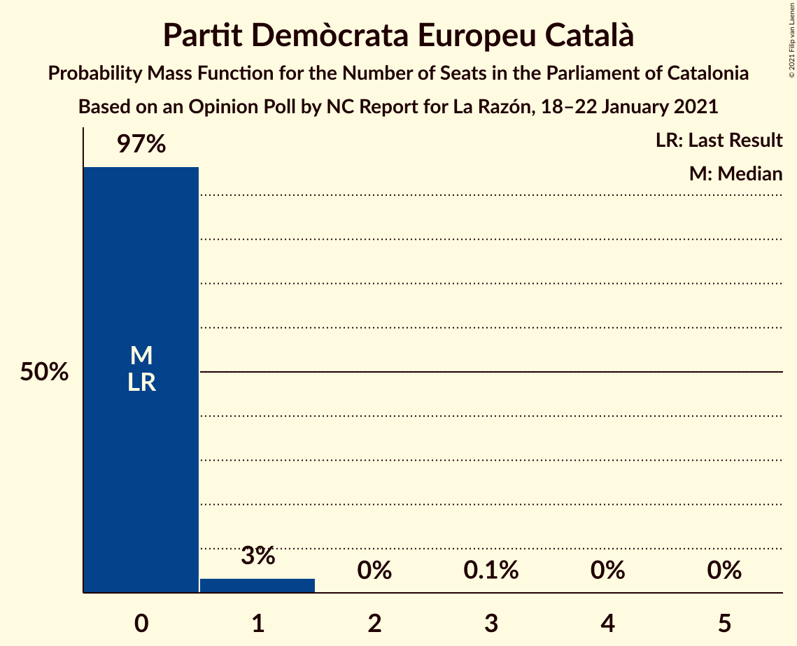

# Opinion Poll by NC Report for La Razón, 18–22 January 2021

<a href="#voting-intentions">Voting Intentions</a> | <a href="#seats">Seats</a> | <a href="#coalitions">Coalitions</a> | <a href="#technical-information">Technical Information</a>

## Voting Intentions

### Confidence Intervals

| Party | Last Result | Poll Result | 80% Confidence Interval | 90% Confidence Interval | 95% Confidence Interval | 99% Confidence Interval |
|:-----:|:-----------:|:-----------:|:-----------------------:|:-----------------------:|:-----------------------:|:-----------------------:|
| Esquerra Republicana–Catalunya Sí | 21.4% | 20.5% | 18.7–22.6% |18.2–23.2% |17.7–23.7% |16.9–24.7% |
| Junts per Catalunya | 21.7% | 19.3% | 17.5–21.3% |16.9–21.9% |16.5–22.3% |15.7–23.4% |
| Partit dels Socialistes de Catalunya (PSC-PSOE) | 13.9% | 18.7% | 16.9–20.7% |16.4–21.3% |16.0–21.7% |15.2–22.7% |
| Ciutadans–Partido de la Ciudadanía | 25.4% | 11.1% | 9.7–12.8% |9.3–13.3% |9.0–13.7% |8.4–14.5% |
| Catalunya en Comú–Podem | 7.5% | 7.3% | 6.2–8.7% |5.8–9.1% |5.6–9.4% |5.1–10.2% |
| Partit Popular | 4.2% | 6.7% | 5.6–8.1% |5.3–8.5% |5.1–8.8% |4.6–9.5% |
| Candidatura d’Unitat Popular | 4.5% | 6.1% | 5.1–7.5% |4.8–7.8% |4.6–8.2% |4.1–8.8% |
| Vox | 0.0% | 6.0% | 5.0–7.3% |4.7–7.7% |4.5–8.0% |4.0–8.7% |
| Partit Demòcrata Europeu Català | 0.0% | 1.6% | 1.1–2.4% |1.0–2.6% |0.9–2.8% |0.7–3.2% |

*Note:* The poll result column reflects the actual value used in the calculations. Published results may vary slightly, and in addition be rounded to fewer digits.

## Seats

### Confidence Intervals

| Party | Last Result | Median | 80% Confidence Interval | 90% Confidence Interval | 95% Confidence Interval | 99% Confidence Interval |
|:-----:|:-----------:|:------:|:-----------------------:|:-----------------------:|:-----------------------:|:-----------------------:|
| <a href="#esquerra-republicana–catalunya-sí">Esquerra Republicana–Catalunya Sí</a> | 32 | 31 | 28–34 |28–35 |27–35 |25–37 |
| <a href="#junts-per-catalunya">Junts per Catalunya</a> | 34 | 31 | 28–33 |26–35 |26–36 |25–37 |
| <a href="#partit-dels-socialistes-de-catalunya-(psc-psoe)">Partit dels Socialistes de Catalunya (PSC-PSOE)</a> | 17 | 25 | 24–28 |23–29 |22–30 |20–31 |
| <a href="#ciutadans–partido-de-la-ciudadanía">Ciutadans–Partido de la Ciudadanía</a> | 36 | 14 | 13–18 |12–18 |12–18 |12–19 |
| <a href="#catalunya-en-comú–podem">Catalunya en Comú–Podem</a> | 8 | 8 | 7–10 |6–11 |5–11 |5–12 |
| <a href="#partit-popular">Partit Popular</a> | 4 | 9 | 7–10 |7–11 |6–12 |5–12 |
| <a href="#candidatura-d’unitat-popular">Candidatura d’Unitat Popular</a> | 4 | 8 | 7–10 |6–10 |5–11 |4–11 |
| <a href="#vox">Vox</a> | 0 | 7 | 6–9 |5–10 |5–11 |3–12 |
| <a href="#partit-demòcrata-europeu-català">Partit Demòcrata Europeu Català</a> | 0 | 0 | 0 |0 |0–1 |0–1 |

### Esquerra Republicana–Catalunya Sí

*For a full overview of the results for this party, see the [Esquerra Republicana–Catalunya Sí](party-esquerrarepublicana–catalunyasí.html) page.*

| Number of Seats | Probability | Accumulated | Special Marks |
|:---------------:|:-----------:|:-----------:|:-------------:|
| 24 | 0.2% | 100% |  |
| 25 | 0.3% | 99.8% |  |
| 26 | 1.0% | 99.4% |  |
| 27 | 2% | 98% |  |
| 28 | 12% | 96% |  |
| 29 | 11% | 84% |  |
| 30 | 19% | 74% |  |
| 31 | 20% | 55% | Median |
| 32 | 13% | 35% | Last Result |
| 33 | 7% | 21% |  |
| 34 | 8% | 14% |  |
| 35 | 4% | 6% |  |
| 36 | 1.1% | 2% |  |
| 37 | 0.6% | 0.9% |  |
| 38 | 0.1% | 0.2% |  |
| 39 | 0.1% | 0.1% |  |
| 40 | 0% | 0.1% |  |
| 41 | 0% | 0% |  |

### Junts per Catalunya

*For a full overview of the results for this party, see the [Junts per Catalunya](party-juntspercatalunya.html) page.*

| Number of Seats | Probability | Accumulated | Special Marks |
|:---------------:|:-----------:|:-----------:|:-------------:|
| 23 | 0.1% | 100% |  |
| 24 | 0.3% | 99.9% |  |
| 25 | 1.2% | 99.6% |  |
| 26 | 3% | 98% |  |
| 27 | 3% | 95% |  |
| 28 | 7% | 92% |  |
| 29 | 6% | 84% |  |
| 30 | 15% | 78% |  |
| 31 | 27% | 63% | Median |
| 32 | 19% | 36% |  |
| 33 | 7% | 16% |  |
| 34 | 4% | 9% | Last Result |
| 35 | 3% | 6% |  |
| 36 | 1.5% | 3% |  |
| 37 | 1.0% | 1.4% |  |
| 38 | 0.2% | 0.3% |  |
| 39 | 0.1% | 0.1% |  |
| 40 | 0% | 0% |  |

### Partit dels Socialistes de Catalunya (PSC-PSOE)

*For a full overview of the results for this party, see the [Partit dels Socialistes de Catalunya (PSC-PSOE)](party-partitdelssocialistesdecatalunyapsc-psoe.html) page.*

| Number of Seats | Probability | Accumulated | Special Marks |
|:---------------:|:-----------:|:-----------:|:-------------:|
| 17 | 0% | 100% | Last Result |
| 18 | 0.1% | 100% |  |
| 19 | 0.2% | 99.9% |  |
| 20 | 0.5% | 99.7% |  |
| 21 | 0.5% | 99.3% |  |
| 22 | 2% | 98.7% |  |
| 23 | 4% | 97% |  |
| 24 | 13% | 93% |  |
| 25 | 30% | 80% | Median |
| 26 | 26% | 49% |  |
| 27 | 12% | 24% |  |
| 28 | 6% | 12% |  |
| 29 | 3% | 6% |  |
| 30 | 2% | 3% |  |
| 31 | 0.9% | 1.1% |  |
| 32 | 0.1% | 0.2% |  |
| 33 | 0.1% | 0.1% |  |
| 34 | 0% | 0% |  |

### Ciutadans–Partido de la Ciudadanía

*For a full overview of the results for this party, see the [Ciutadans–Partido de la Ciudadanía](party-ciutadans–partidodelaciudadanía.html) page.*

| Number of Seats | Probability | Accumulated | Special Marks |
|:---------------:|:-----------:|:-----------:|:-------------:|
| 9 | 0.1% | 100% |  |
| 10 | 0.2% | 99.9% |  |
| 11 | 0.2% | 99.7% |  |
| 12 | 6% | 99.5% |  |
| 13 | 16% | 93% |  |
| 14 | 31% | 78% | Median |
| 15 | 12% | 46% |  |
| 16 | 16% | 35% |  |
| 17 | 6% | 19% |  |
| 18 | 10% | 13% |  |
| 19 | 2% | 2% |  |
| 20 | 0.2% | 0.3% |  |
| 21 | 0% | 0.1% |  |
| 22 | 0% | 0% |  |
| 23 | 0% | 0% |  |
| 24 | 0% | 0% |  |
| 25 | 0% | 0% |  |
| 26 | 0% | 0% |  |
| 27 | 0% | 0% |  |
| 28 | 0% | 0% |  |
| 29 | 0% | 0% |  |
| 30 | 0% | 0% |  |
| 31 | 0% | 0% |  |
| 32 | 0% | 0% |  |
| 33 | 0% | 0% |  |
| 34 | 0% | 0% |  |
| 35 | 0% | 0% |  |
| 36 | 0% | 0% | Last Result |

### Catalunya en Comú–Podem

*For a full overview of the results for this party, see the [Catalunya en Comú–Podem](party-catalunyaencomú–podem.html) page.*

| Number of Seats | Probability | Accumulated | Special Marks |
|:---------------:|:-----------:|:-----------:|:-------------:|
| 4 | 0.1% | 100% |  |
| 5 | 4% | 99.9% |  |
| 6 | 4% | 96% |  |
| 7 | 24% | 92% |  |
| 8 | 33% | 69% | Last Result, Median |
| 9 | 10% | 35% |  |
| 10 | 18% | 25% |  |
| 11 | 6% | 8% |  |
| 12 | 1.3% | 2% |  |
| 13 | 0.3% | 0.4% |  |
| 14 | 0.1% | 0.1% |  |
| 15 | 0% | 0% |  |

### Partit Popular

*For a full overview of the results for this party, see the [Partit Popular](party-partitpopular.html) page.*

| Number of Seats | Probability | Accumulated | Special Marks |
|:---------------:|:-----------:|:-----------:|:-------------:|
| 4 | 0% | 100% | Last Result |
| 5 | 2% | 99.9% |  |
| 6 | 2% | 98% |  |
| 7 | 25% | 96% |  |
| 8 | 8% | 71% |  |
| 9 | 33% | 63% | Median |
| 10 | 22% | 30% |  |
| 11 | 5% | 8% |  |
| 12 | 3% | 4% |  |
| 13 | 0.2% | 0.3% |  |
| 14 | 0.1% | 0.1% |  |
| 15 | 0% | 0% |  |

### Candidatura d’Unitat Popular

*For a full overview of the results for this party, see the [Candidatura d’Unitat Popular](party-candidaturad’unitatpopular.html) page.*

| Number of Seats | Probability | Accumulated | Special Marks |
|:---------------:|:-----------:|:-----------:|:-------------:|
| 3 | 0.1% | 100% |  |
| 4 | 2% | 99.9% | Last Result |
| 5 | 2% | 98% |  |
| 6 | 2% | 97% |  |
| 7 | 16% | 95% |  |
| 8 | 47% | 79% | Median |
| 9 | 18% | 32% |  |
| 10 | 9% | 14% |  |
| 11 | 4% | 5% |  |
| 12 | 0.3% | 0.4% |  |
| 13 | 0.1% | 0.1% |  |
| 14 | 0% | 0% |  |

### Vox

*For a full overview of the results for this party, see the [Vox](party-vox.html) page.*

| Number of Seats | Probability | Accumulated | Special Marks |
|:---------------:|:-----------:|:-----------:|:-------------:|
| 0 | 0% | 100% | Last Result |
| 1 | 0% | 100% |  |
| 2 | 0% | 100% |  |
| 3 | 0.5% | 100% |  |
| 4 | 0.4% | 99.5% |  |
| 5 | 9% | 99.1% |  |
| 6 | 7% | 90% |  |
| 7 | 40% | 83% | Median |
| 8 | 9% | 44% |  |
| 9 | 28% | 35% |  |
| 10 | 5% | 7% |  |
| 11 | 2% | 3% |  |
| 12 | 0.6% | 0.7% |  |
| 13 | 0% | 0% |  |

### Partit Demòcrata Europeu Català

*For a full overview of the results for this party, see the [Partit Demòcrata Europeu Català](party-partitdemòcrataeuropeucatalà.html) page.*

| Number of Seats | Probability | Accumulated | Special Marks |
|:---------------:|:-----------:|:-----------:|:-------------:|
| 0 | 97% | 100% | Last Result, Median |
| 1 | 3% | 3% |  |
| 2 | 0% | 0.2% |  |
| 3 | 0.1% | 0.1% |  |
| 4 | 0% | 0.1% |  |
| 5 | 0% | 0% |  |

## Coalitions

### Confidence Intervals

| Coalition | Last Result | Median | Majority? | 80% Confidence Interval | 90% Confidence Interval | 95% Confidence Interval | 99% Confidence Interval |
|:---------:|:-----------:|:------:|:---------:|:-----------------------:|:-----------------------:|:-----------------------:|:-----------------------:|
| Esquerra Republicana–Catalunya Sí – Junts per Catalunya – Candidatura d’Unitat Popular | 70 | 70 | 83% | 67–73 | 66–74 | 65–75 | 63–77 |
| Esquerra Republicana–Catalunya Sí – Junts per Catalunya – Candidatura d’Unitat Popular – Partit Demòcrata Europeu Català | 70 | 70 | 83% | 67–73 | 66–74 | 65–75 | 63–77 |
| Esquerra Republicana–Catalunya Sí – Junts per Catalunya – Catalunya en Comú–Podem | 74 | 70 | 84% | 67–73 | 66–74 | 65–75 | 63–77 |
| Esquerra Republicana–Catalunya Sí – Partit dels Socialistes de Catalunya (PSC-PSOE) – Catalunya en Comú–Podem | 57 | 65 | 15% | 61–68 | 60–70 | 59–70 | 58–72 |
| Esquerra Republicana–Catalunya Sí – Junts per Catalunya | 66 | 62 | 2% | 58–65 | 58–66 | 57–67 | 55–69 |
| Esquerra Republicana–Catalunya Sí – Junts per Catalunya – Partit Demòcrata Europeu Català | 66 | 62 | 2% | 59–65 | 58–66 | 57–67 | 55–69 |
| Partit dels Socialistes de Catalunya (PSC-PSOE) – Ciutadans–Partido de la Ciudadanía – Catalunya en Comú–Podem – Partit Popular | 65 | 58 | 0% | 53–61 | 53–62 | 52–62 | 50–64 |
| Partit dels Socialistes de Catalunya (PSC-PSOE) – Ciutadans–Partido de la Ciudadanía – Partit Popular – Vox | 57 | 57 | 0% | 54–60 | 52–61 | 52–62 | 49–63 |
| Partit dels Socialistes de Catalunya (PSC-PSOE) – Ciutadans–Partido de la Ciudadanía – Partit Popular | 57 | 49 | 0% | 46–52 | 45–53 | 44–54 | 42–56 |
| Esquerra Republicana–Catalunya Sí – Catalunya en Comú–Podem | 40 | 39 | 0% | 36–42 | 35–43 | 35–44 | 33–46 |

### Esquerra Republicana–Catalunya Sí – Junts per Catalunya – Candidatura d’Unitat Popular

| Number of Seats | Probability | Accumulated | Special Marks |
|:---------------:|:-----------:|:-----------:|:-------------:|
| 61 | 0% | 100% |  |
| 62 | 0.2% | 99.9% |  |
| 63 | 0.3% | 99.8% |  |
| 64 | 0.8% | 99.4% |  |
| 65 | 2% | 98.6% |  |
| 66 | 5% | 97% |  |
| 67 | 9% | 92% |  |
| 68 | 13% | 83% | Majority |
| 69 | 16% | 70% |  |
| 70 | 17% | 54% | Last Result, Median |
| 71 | 9% | 37% |  |
| 72 | 12% | 28% |  |
| 73 | 11% | 16% |  |
| 74 | 2% | 6% |  |
| 75 | 2% | 4% |  |
| 76 | 0.4% | 2% |  |
| 77 | 0.7% | 1.1% |  |
| 78 | 0.2% | 0.4% |  |
| 79 | 0.1% | 0.2% |  |
| 80 | 0.1% | 0.1% |  |
| 81 | 0% | 0% |  |

### Esquerra Republicana–Catalunya Sí – Junts per Catalunya – Candidatura d’Unitat Popular – Partit Demòcrata Europeu Català

| Number of Seats | Probability | Accumulated | Special Marks |
|:---------------:|:-----------:|:-----------:|:-------------:|
| 61 | 0% | 100% |  |
| 62 | 0.2% | 99.9% |  |
| 63 | 0.3% | 99.8% |  |
| 64 | 0.8% | 99.5% |  |
| 65 | 2% | 98.7% |  |
| 66 | 5% | 97% |  |
| 67 | 9% | 92% |  |
| 68 | 13% | 83% | Majority |
| 69 | 15% | 71% |  |
| 70 | 17% | 55% | Last Result, Median |
| 71 | 9% | 38% |  |
| 72 | 12% | 29% |  |
| 73 | 11% | 17% |  |
| 74 | 2% | 6% |  |
| 75 | 3% | 4% |  |
| 76 | 0.5% | 2% |  |
| 77 | 0.7% | 1.1% |  |
| 78 | 0.2% | 0.4% |  |
| 79 | 0.1% | 0.2% |  |
| 80 | 0.1% | 0.1% |  |
| 81 | 0% | 0% |  |

### Esquerra Republicana–Catalunya Sí – Junts per Catalunya – Catalunya en Comú–Podem

| Number of Seats | Probability | Accumulated | Special Marks |
|:---------------:|:-----------:|:-----------:|:-------------:|
| 61 | 0% | 100% |  |
| 62 | 0.1% | 99.9% |  |
| 63 | 0.4% | 99.8% |  |
| 64 | 0.8% | 99.4% |  |
| 65 | 2% | 98.6% |  |
| 66 | 5% | 97% |  |
| 67 | 8% | 91% |  |
| 68 | 9% | 84% | Majority |
| 69 | 17% | 75% |  |
| 70 | 17% | 58% | Median |
| 71 | 17% | 40% |  |
| 72 | 9% | 23% |  |
| 73 | 5% | 14% |  |
| 74 | 4% | 9% | Last Result |
| 75 | 3% | 5% |  |
| 76 | 1.0% | 2% |  |
| 77 | 0.6% | 1.0% |  |
| 78 | 0.2% | 0.4% |  |
| 79 | 0.1% | 0.2% |  |
| 80 | 0.1% | 0.1% |  |
| 81 | 0% | 0% |  |

### Esquerra Republicana–Catalunya Sí – Partit dels Socialistes de Catalunya (PSC-PSOE) – Catalunya en Comú–Podem

| Number of Seats | Probability | Accumulated | Special Marks |
|:---------------:|:-----------:|:-----------:|:-------------:|
| 55 | 0% | 100% |  |
| 56 | 0.1% | 99.9% |  |
| 57 | 0.2% | 99.9% | Last Result |
| 58 | 0.5% | 99.6% |  |
| 59 | 2% | 99.2% |  |
| 60 | 2% | 97% |  |
| 61 | 6% | 95% |  |
| 62 | 9% | 89% |  |
| 63 | 13% | 80% |  |
| 64 | 12% | 66% | Median |
| 65 | 12% | 54% |  |
| 66 | 20% | 42% |  |
| 67 | 7% | 22% |  |
| 68 | 5% | 15% | Majority |
| 69 | 4% | 10% |  |
| 70 | 4% | 6% |  |
| 71 | 1.0% | 2% |  |
| 72 | 0.9% | 1.2% |  |
| 73 | 0.1% | 0.3% |  |
| 74 | 0.1% | 0.1% |  |
| 75 | 0% | 0.1% |  |
| 76 | 0% | 0% |  |

### Esquerra Republicana–Catalunya Sí – Junts per Catalunya

| Number of Seats | Probability | Accumulated | Special Marks |
|:---------------:|:-----------:|:-----------:|:-------------:|
| 53 | 0% | 100% |  |
| 54 | 0.2% | 99.9% |  |
| 55 | 0.4% | 99.8% |  |
| 56 | 0.9% | 99.3% |  |
| 57 | 2% | 98% |  |
| 58 | 6% | 96% |  |
| 59 | 8% | 90% |  |
| 60 | 13% | 82% |  |
| 61 | 16% | 69% |  |
| 62 | 17% | 53% | Median |
| 63 | 15% | 36% |  |
| 64 | 10% | 21% |  |
| 65 | 5% | 11% |  |
| 66 | 1.5% | 6% | Last Result |
| 67 | 3% | 5% |  |
| 68 | 0.8% | 2% | Majority |
| 69 | 0.4% | 0.8% |  |
| 70 | 0.1% | 0.3% |  |
| 71 | 0.1% | 0.2% |  |
| 72 | 0% | 0.1% |  |
| 73 | 0% | 0% |  |

### Esquerra Republicana–Catalunya Sí – Junts per Catalunya – Partit Demòcrata Europeu Català

| Number of Seats | Probability | Accumulated | Special Marks |
|:---------------:|:-----------:|:-----------:|:-------------:|
| 53 | 0% | 100% |  |
| 54 | 0.2% | 99.9% |  |
| 55 | 0.4% | 99.8% |  |
| 56 | 0.8% | 99.4% |  |
| 57 | 2% | 98.6% |  |
| 58 | 6% | 96% |  |
| 59 | 8% | 90% |  |
| 60 | 13% | 82% |  |
| 61 | 15% | 69% |  |
| 62 | 17% | 54% | Median |
| 63 | 15% | 37% |  |
| 64 | 10% | 21% |  |
| 65 | 5% | 12% |  |
| 66 | 1.5% | 6% | Last Result |
| 67 | 3% | 5% |  |
| 68 | 0.8% | 2% | Majority |
| 69 | 0.5% | 0.8% |  |
| 70 | 0.1% | 0.4% |  |
| 71 | 0.1% | 0.2% |  |
| 72 | 0% | 0.1% |  |
| 73 | 0% | 0% |  |

### Partit dels Socialistes de Catalunya (PSC-PSOE) – Ciutadans–Partido de la Ciudadanía – Catalunya en Comú–Podem – Partit Popular

| Number of Seats | Probability | Accumulated | Special Marks |
|:---------------:|:-----------:|:-----------:|:-------------:|
| 48 | 0.1% | 100% |  |
| 49 | 0.1% | 99.9% |  |
| 50 | 0.3% | 99.8% |  |
| 51 | 0.8% | 99.5% |  |
| 52 | 1.2% | 98.7% |  |
| 53 | 8% | 97% |  |
| 54 | 3% | 90% |  |
| 55 | 8% | 87% |  |
| 56 | 18% | 79% | Median |
| 57 | 10% | 61% |  |
| 58 | 12% | 52% |  |
| 59 | 19% | 39% |  |
| 60 | 8% | 21% |  |
| 61 | 7% | 13% |  |
| 62 | 3% | 6% |  |
| 63 | 1.1% | 2% |  |
| 64 | 0.6% | 1.0% |  |
| 65 | 0.2% | 0.4% | Last Result |
| 66 | 0.1% | 0.2% |  |
| 67 | 0% | 0% |  |

### Partit dels Socialistes de Catalunya (PSC-PSOE) – Ciutadans–Partido de la Ciudadanía – Partit Popular – Vox

| Number of Seats | Probability | Accumulated | Special Marks |
|:---------------:|:-----------:|:-----------:|:-------------:|
| 47 | 0.1% | 100% |  |
| 48 | 0.1% | 99.9% |  |
| 49 | 0.5% | 99.8% |  |
| 50 | 0.6% | 99.3% |  |
| 51 | 0.8% | 98.8% |  |
| 52 | 3% | 98% |  |
| 53 | 3% | 95% |  |
| 54 | 7% | 92% |  |
| 55 | 16% | 85% | Median |
| 56 | 17% | 69% |  |
| 57 | 9% | 52% | Last Result |
| 58 | 16% | 43% |  |
| 59 | 14% | 27% |  |
| 60 | 6% | 12% |  |
| 61 | 3% | 6% |  |
| 62 | 2% | 3% |  |
| 63 | 0.5% | 0.9% |  |
| 64 | 0.2% | 0.4% |  |
| 65 | 0.1% | 0.1% |  |
| 66 | 0% | 0% |  |

### Partit dels Socialistes de Catalunya (PSC-PSOE) – Ciutadans–Partido de la Ciudadanía – Partit Popular

| Number of Seats | Probability | Accumulated | Special Marks |
|:---------------:|:-----------:|:-----------:|:-------------:|
| 40 | 0.1% | 100% |  |
| 41 | 0.1% | 99.9% |  |
| 42 | 0.6% | 99.8% |  |
| 43 | 0.6% | 99.2% |  |
| 44 | 1.2% | 98.6% |  |
| 45 | 3% | 97% |  |
| 46 | 11% | 94% |  |
| 47 | 10% | 83% |  |
| 48 | 8% | 72% | Median |
| 49 | 18% | 64% |  |
| 50 | 13% | 46% |  |
| 51 | 18% | 33% |  |
| 52 | 7% | 16% |  |
| 53 | 5% | 9% |  |
| 54 | 2% | 4% |  |
| 55 | 1.0% | 2% |  |
| 56 | 0.5% | 0.6% |  |
| 57 | 0.1% | 0.1% | Last Result |
| 58 | 0% | 0.1% |  |
| 59 | 0% | 0% |  |

### Esquerra Republicana–Catalunya Sí – Catalunya en Comú–Podem

| Number of Seats | Probability | Accumulated | Special Marks |
|:---------------:|:-----------:|:-----------:|:-------------:|
| 31 | 0.1% | 100% |  |
| 32 | 0.2% | 99.9% |  |
| 33 | 0.4% | 99.7% |  |
| 34 | 1.2% | 99.4% |  |
| 35 | 4% | 98% |  |
| 36 | 8% | 94% |  |
| 37 | 9% | 86% |  |
| 38 | 19% | 77% |  |
| 39 | 15% | 57% | Median |
| 40 | 13% | 42% | Last Result |
| 41 | 14% | 29% |  |
| 42 | 6% | 15% |  |
| 43 | 5% | 10% |  |
| 44 | 3% | 4% |  |
| 45 | 0.9% | 2% |  |
| 46 | 0.5% | 0.9% |  |
| 47 | 0.3% | 0.4% |  |
| 48 | 0.1% | 0.1% |  |
| 49 | 0% | 0% |  |

## Technical Information

### Opinion Poll

+ **Polling firm:** NC Report
+ **Commissioner(s):** La Razón
+ **Fieldwork period:** 18–22 January 2021

### Calculations

+ **Sample size:** 701
+ **Simulations done:** 1,048,576
+ **Error estimate:** 2.15%

