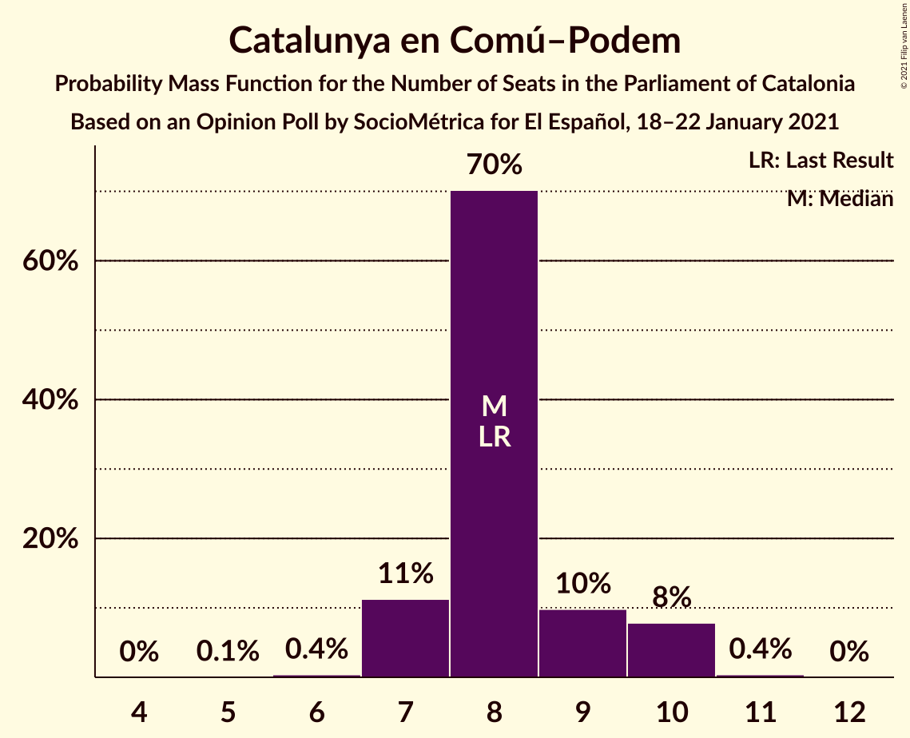
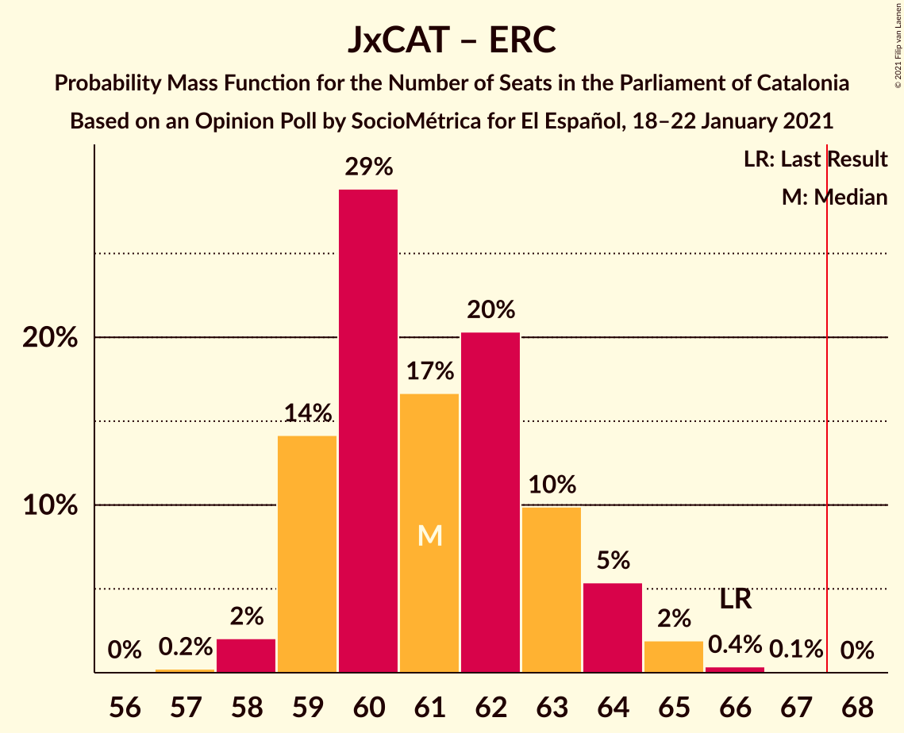

# Opinion Poll by SocioMétrica for El Español, 18–22 January 2021

<a href="#voting-intentions">Voting Intentions</a> | <a href="#seats">Seats</a> | <a href="#coalitions">Coalitions</a> | <a href="#technical-information">Technical Information</a>

## Voting Intentions

### Confidence Intervals

| Party | Last Result | Poll Result | 80% Confidence Interval | 90% Confidence Interval | 95% Confidence Interval | 99% Confidence Interval |
|:-----:|:-----------:|:-----------:|:-----------------------:|:-----------------------:|:-----------------------:|:-----------------------:|
| Partit dels Socialistes de Catalunya (PSC-PSOE) | 13.9% | 21.5% | 20.5–22.5% |20.2–22.8% |20.0–23.1% |19.5–23.6% |
| Junts per Catalunya | 21.7% | 19.7% | 18.7–20.7% |18.5–21.0% |18.2–21.3% |17.8–21.7% |
| Esquerra Republicana–Catalunya Sí | 21.4% | 19.3% | 18.3–20.3% |18.1–20.6% |17.8–20.8% |17.4–21.3% |
| Ciutadans–Partido de la Ciudadanía | 25.4% | 11.2% | 10.4–12.0% |10.2–12.2% |10.0–12.4% |9.7–12.8% |
| Catalunya en Comú–Podem | 7.5% | 7.2% | 6.6–7.9% |6.4–8.1% |6.3–8.3% |6.0–8.6% |
| Partit Popular | 4.2% | 5.8% | 5.3–6.4% |5.1–6.6% |5.0–6.8% |4.7–7.1% |
| Vox | 0.0% | 5.8% | 5.3–6.4% |5.1–6.6% |5.0–6.8% |4.7–7.1% |
| Candidatura d’Unitat Popular | 4.5% | 4.9% | 4.4–5.5% |4.3–5.7% |4.1–5.8% |3.9–6.1% |

*Note:* The poll result column reflects the actual value used in the calculations. Published results may vary slightly, and in addition be rounded to fewer digits.

## Seats

### Confidence Intervals

| Party | Last Result | Median | 80% Confidence Interval | 90% Confidence Interval | 95% Confidence Interval | 99% Confidence Interval |
|:-----:|:-----------:|:------:|:-----------------------:|:-----------------------:|:-----------------------:|:-----------------------:|
| <a href="#partit-dels-socialistes-de-catalunya-(psc-psoe)">Partit dels Socialistes de Catalunya (PSC-PSOE)</a> | 17 | 30 | 28–31 |27–32 |27–32 |26–33 |
| <a href="#junts-per-catalunya">Junts per Catalunya</a> | 34 | 31 | 31–34 |31–34 |30–35 |29–36 |
| <a href="#esquerra-republicana–catalunya-sí">Esquerra Republicana–Catalunya Sí</a> | 32 | 29 | 28–31 |28–31 |27–32 |27–33 |
| <a href="#ciutadans–partido-de-la-ciudadanía">Ciutadans–Partido de la Ciudadanía</a> | 36 | 15 | 14–16 |13–17 |13–17 |13–18 |
| <a href="#catalunya-en-comú–podem">Catalunya en Comú–Podem</a> | 8 | 8 | 7–9 |7–10 |7–10 |7–10 |
| <a href="#partit-popular">Partit Popular</a> | 4 | 7 | 6–9 |6–9 |6–9 |5–9 |
| <a href="#vox">Vox</a> | 0 | 7 | 7–8 |6–9 |6–9 |5–9 |
| <a href="#candidatura-d’unitat-popular">Candidatura d’Unitat Popular</a> | 4 | 7 | 5–7 |4–8 |4–8 |4–8 |

### Partit dels Socialistes de Catalunya (PSC-PSOE)

*For a full overview of the results for this party, see the [Partit dels Socialistes de Catalunya (PSC-PSOE)](party-partitdelssocialistesdecatalunyapsc-psoe.html) page.*

| Number of Seats | Probability | Accumulated | Special Marks |
|:---------------:|:-----------:|:-----------:|:-------------:|
| 17 | 0% | 100% | Last Result |
| 18 | 0% | 100% |  |
| 19 | 0% | 100% |  |
| 20 | 0% | 100% |  |
| 21 | 0% | 100% |  |
| 22 | 0% | 100% |  |
| 23 | 0% | 100% |  |
| 24 | 0% | 100% |  |
| 25 | 0% | 100% |  |
| 26 | 0.9% | 100% |  |
| 27 | 4% | 99.0% |  |
| 28 | 9% | 95% |  |
| 29 | 8% | 86% |  |
| 30 | 38% | 78% | Median |
| 31 | 33% | 40% |  |
| 32 | 5% | 6% |  |
| 33 | 1.0% | 1.1% |  |
| 34 | 0.1% | 0.1% |  |
| 35 | 0% | 0% |  |

### Junts per Catalunya

*For a full overview of the results for this party, see the [Junts per Catalunya](party-juntspercatalunya.html) page.*

| Number of Seats | Probability | Accumulated | Special Marks |
|:---------------:|:-----------:|:-----------:|:-------------:|
| 28 | 0.1% | 100% |  |
| 29 | 0.7% | 99.8% |  |
| 30 | 3% | 99.1% |  |
| 31 | 54% | 96% | Median |
| 32 | 13% | 42% |  |
| 33 | 18% | 29% |  |
| 34 | 8% | 11% | Last Result |
| 35 | 2% | 3% |  |
| 36 | 1.1% | 1.1% |  |
| 37 | 0.1% | 0.1% |  |
| 38 | 0% | 0% |  |

### Esquerra Republicana–Catalunya Sí

*For a full overview of the results for this party, see the [Esquerra Republicana–Catalunya Sí](party-esquerrarepublicana–catalunyasí.html) page.*

| Number of Seats | Probability | Accumulated | Special Marks |
|:---------------:|:-----------:|:-----------:|:-------------:|
| 26 | 0.3% | 100% |  |
| 27 | 3% | 99.7% |  |
| 28 | 25% | 97% |  |
| 29 | 39% | 71% | Median |
| 30 | 18% | 33% |  |
| 31 | 9% | 14% |  |
| 32 | 3% | 5% | Last Result |
| 33 | 1.0% | 1.3% |  |
| 34 | 0.3% | 0.3% |  |
| 35 | 0% | 0% |  |

### Ciutadans–Partido de la Ciudadanía

*For a full overview of the results for this party, see the [Ciutadans–Partido de la Ciudadanía](party-ciutadans–partidodelaciudadanía.html) page.*

| Number of Seats | Probability | Accumulated | Special Marks |
|:---------------:|:-----------:|:-----------:|:-------------:|
| 13 | 8% | 100% |  |
| 14 | 32% | 92% |  |
| 15 | 21% | 60% | Median |
| 16 | 29% | 39% |  |
| 17 | 8% | 10% |  |
| 18 | 2% | 2% |  |
| 19 | 0% | 0% |  |
| 20 | 0% | 0% |  |
| 21 | 0% | 0% |  |
| 22 | 0% | 0% |  |
| 23 | 0% | 0% |  |
| 24 | 0% | 0% |  |
| 25 | 0% | 0% |  |
| 26 | 0% | 0% |  |
| 27 | 0% | 0% |  |
| 28 | 0% | 0% |  |
| 29 | 0% | 0% |  |
| 30 | 0% | 0% |  |
| 31 | 0% | 0% |  |
| 32 | 0% | 0% |  |
| 33 | 0% | 0% |  |
| 34 | 0% | 0% |  |
| 35 | 0% | 0% |  |
| 36 | 0% | 0% | Last Result |

### Catalunya en Comú–Podem

*For a full overview of the results for this party, see the [Catalunya en Comú–Podem](party-catalunyaencomú–podem.html) page.*

| Number of Seats | Probability | Accumulated | Special Marks |
|:---------------:|:-----------:|:-----------:|:-------------:|
| 5 | 0.1% | 100% |  |
| 6 | 0.4% | 99.9% |  |
| 7 | 11% | 99.5% |  |
| 8 | 70% | 88% | Last Result, Median |
| 9 | 10% | 18% |  |
| 10 | 8% | 8% |  |
| 11 | 0.4% | 0.4% |  |
| 12 | 0% | 0% |  |

### Partit Popular

*For a full overview of the results for this party, see the [Partit Popular](party-partitpopular.html) page.*

| Number of Seats | Probability | Accumulated | Special Marks |
|:---------------:|:-----------:|:-----------:|:-------------:|
| 4 | 0% | 100% | Last Result |
| 5 | 0.9% | 100% |  |
| 6 | 11% | 99.1% |  |
| 7 | 72% | 88% | Median |
| 8 | 4% | 16% |  |
| 9 | 12% | 12% |  |
| 10 | 0.1% | 0.1% |  |
| 11 | 0% | 0% |  |

### Vox

*For a full overview of the results for this party, see the [Vox](party-vox.html) page.*

| Number of Seats | Probability | Accumulated | Special Marks |
|:---------------:|:-----------:|:-----------:|:-------------:|
| 0 | 0% | 100% | Last Result |
| 1 | 0% | 100% |  |
| 2 | 0% | 100% |  |
| 3 | 0% | 100% |  |
| 4 | 0% | 100% |  |
| 5 | 0.8% | 100% |  |
| 6 | 5% | 99.2% |  |
| 7 | 84% | 94% | Median |
| 8 | 5% | 11% |  |
| 9 | 6% | 6% |  |
| 10 | 0.1% | 0.1% |  |
| 11 | 0% | 0% |  |

### Candidatura d’Unitat Popular

*For a full overview of the results for this party, see the [Candidatura d’Unitat Popular](party-candidaturad’unitatpopular.html) page.*

| Number of Seats | Probability | Accumulated | Special Marks |
|:---------------:|:-----------:|:-----------:|:-------------:|
| 4 | 8% | 100% | Last Result |
| 5 | 6% | 92% |  |
| 6 | 21% | 86% |  |
| 7 | 58% | 65% | Median |
| 8 | 8% | 8% |  |
| 9 | 0% | 0% |  |

## Coalitions

### Confidence Intervals

| Coalition | Last Result | Median | Majority? | 80% Confidence Interval | 90% Confidence Interval | 95% Confidence Interval | 99% Confidence Interval |
|:---------:|:-----------:|:------:|:---------:|:-----------------------:|:-----------------------:|:-----------------------:|:-----------------------:|
| Junts per Catalunya – Esquerra Republicana–Catalunya Sí – Catalunya en Comú–Podem | 74 | 69 | 85% | 67–71 | 67–72 | 67–73 | 66–74 |
| Junts per Catalunya – Esquerra Republicana–Catalunya Sí – Candidatura d’Unitat Popular | 70 | 67 | 43% | 66–69 | 65–70 | 65–71 | 63–72 |
| Partit dels Socialistes de Catalunya (PSC-PSOE) – Esquerra Republicana–Catalunya Sí – Catalunya en Comú–Podem | 57 | 67 | 45% | 65–69 | 65–70 | 64–71 | 63–72 |
| Junts per Catalunya – Esquerra Republicana–Catalunya Sí | 66 | 61 | 0% | 59–63 | 59–64 | 59–64 | 58–65 |
| Partit dels Socialistes de Catalunya (PSC-PSOE) – Ciutadans–Partido de la Ciudadanía – Catalunya en Comú–Podem – Partit Popular | 65 | 61 | 0% | 58–62 | 58–63 | 57–63 | 56–64 |
| Partit dels Socialistes de Catalunya (PSC-PSOE) – Ciutadans–Partido de la Ciudadanía – Partit Popular – Vox | 57 | 60 | 0% | 57–61 | 57–62 | 56–62 | 55–63 |
| Partit dels Socialistes de Catalunya (PSC-PSOE) – Ciutadans–Partido de la Ciudadanía – Partit Popular | 57 | 52 | 0% | 50–54 | 50–55 | 49–55 | 48–56 |
| Esquerra Republicana–Catalunya Sí – Catalunya en Comú–Podem | 40 | 37 | 0% | 36–39 | 36–40 | 35–40 | 34–42 |

### Junts per Catalunya – Esquerra Republicana–Catalunya Sí – Catalunya en Comú–Podem

| Number of Seats | Probability | Accumulated | Special Marks |
|:---------------:|:-----------:|:-----------:|:-------------:|
| 65 | 0.3% | 100% |  |
| 66 | 2% | 99.7% |  |
| 67 | 13% | 98% |  |
| 68 | 28% | 85% | Median, Majority |
| 69 | 15% | 57% |  |
| 70 | 20% | 42% |  |
| 71 | 13% | 22% |  |
| 72 | 6% | 9% |  |
| 73 | 3% | 3% |  |
| 74 | 0.7% | 0.8% | Last Result |
| 75 | 0.1% | 0.2% |  |
| 76 | 0% | 0% |  |

### Junts per Catalunya – Esquerra Republicana–Catalunya Sí – Candidatura d’Unitat Popular

| Number of Seats | Probability | Accumulated | Special Marks |
|:---------------:|:-----------:|:-----------:|:-------------:|
| 62 | 0% | 100% |  |
| 63 | 0.5% | 99.9% |  |
| 64 | 1.0% | 99.5% |  |
| 65 | 6% | 98% |  |
| 66 | 14% | 93% |  |
| 67 | 36% | 79% | Median |
| 68 | 17% | 43% | Majority |
| 69 | 17% | 26% |  |
| 70 | 7% | 9% | Last Result |
| 71 | 2% | 3% |  |
| 72 | 0.5% | 0.7% |  |
| 73 | 0.1% | 0.1% |  |
| 74 | 0% | 0% |  |

### Partit dels Socialistes de Catalunya (PSC-PSOE) – Esquerra Republicana–Catalunya Sí – Catalunya en Comú–Podem

| Number of Seats | Probability | Accumulated | Special Marks |
|:---------------:|:-----------:|:-----------:|:-------------:|
| 57 | 0% | 100% | Last Result |
| 58 | 0% | 100% |  |
| 59 | 0% | 100% |  |
| 60 | 0% | 100% |  |
| 61 | 0% | 100% |  |
| 62 | 0.1% | 100% |  |
| 63 | 0.6% | 99.9% |  |
| 64 | 3% | 99.3% |  |
| 65 | 7% | 97% |  |
| 66 | 13% | 89% |  |
| 67 | 31% | 76% | Median |
| 68 | 26% | 45% | Majority |
| 69 | 10% | 20% |  |
| 70 | 6% | 9% |  |
| 71 | 2% | 3% |  |
| 72 | 0.8% | 0.9% |  |
| 73 | 0.1% | 0.1% |  |
| 74 | 0% | 0% |  |

### Junts per Catalunya – Esquerra Republicana–Catalunya Sí

| Number of Seats | Probability | Accumulated | Special Marks |
|:---------------:|:-----------:|:-----------:|:-------------:|
| 57 | 0.2% | 100% |  |
| 58 | 2% | 99.7% |  |
| 59 | 14% | 98% |  |
| 60 | 29% | 84% | Median |
| 61 | 17% | 55% |  |
| 62 | 20% | 38% |  |
| 63 | 10% | 18% |  |
| 64 | 5% | 8% |  |
| 65 | 2% | 2% |  |
| 66 | 0.4% | 0.5% | Last Result |
| 67 | 0.1% | 0.1% |  |
| 68 | 0% | 0% | Majority |

### Partit dels Socialistes de Catalunya (PSC-PSOE) – Ciutadans–Partido de la Ciudadanía – Catalunya en Comú–Podem – Partit Popular

| Number of Seats | Probability | Accumulated | Special Marks |
|:---------------:|:-----------:|:-----------:|:-------------:|
| 55 | 0.3% | 100% |  |
| 56 | 0.5% | 99.7% |  |
| 57 | 2% | 99.2% |  |
| 58 | 8% | 97% |  |
| 59 | 20% | 90% |  |
| 60 | 15% | 70% | Median |
| 61 | 35% | 54% |  |
| 62 | 12% | 19% |  |
| 63 | 6% | 7% |  |
| 64 | 0.9% | 1.2% |  |
| 65 | 0.3% | 0.4% | Last Result |
| 66 | 0% | 0.1% |  |
| 67 | 0% | 0% |  |

### Partit dels Socialistes de Catalunya (PSC-PSOE) – Ciutadans–Partido de la Ciudadanía – Partit Popular – Vox

| Number of Seats | Probability | Accumulated | Special Marks |
|:---------------:|:-----------:|:-----------:|:-------------:|
| 54 | 0.3% | 100% |  |
| 55 | 0.6% | 99.7% |  |
| 56 | 3% | 99.0% |  |
| 57 | 8% | 96% | Last Result |
| 58 | 19% | 89% |  |
| 59 | 17% | 69% | Median |
| 60 | 33% | 53% |  |
| 61 | 13% | 20% |  |
| 62 | 5% | 6% |  |
| 63 | 0.8% | 1.3% |  |
| 64 | 0.4% | 0.5% |  |
| 65 | 0% | 0.1% |  |
| 66 | 0% | 0% |  |

### Partit dels Socialistes de Catalunya (PSC-PSOE) – Ciutadans–Partido de la Ciudadanía – Partit Popular

| Number of Seats | Probability | Accumulated | Special Marks |
|:---------------:|:-----------:|:-----------:|:-------------:|
| 47 | 0.4% | 100% |  |
| 48 | 0.7% | 99.5% |  |
| 49 | 3% | 98.8% |  |
| 50 | 8% | 96% |  |
| 51 | 22% | 88% |  |
| 52 | 16% | 66% | Median |
| 53 | 32% | 50% |  |
| 54 | 12% | 18% |  |
| 55 | 5% | 6% |  |
| 56 | 0.8% | 1.1% |  |
| 57 | 0.3% | 0.3% | Last Result |
| 58 | 0% | 0% |  |

### Esquerra Republicana–Catalunya Sí – Catalunya en Comú–Podem

| Number of Seats | Probability | Accumulated | Special Marks |
|:---------------:|:-----------:|:-----------:|:-------------:|
| 33 | 0.1% | 100% |  |
| 34 | 0.4% | 99.9% |  |
| 35 | 3% | 99.5% |  |
| 36 | 24% | 97% |  |
| 37 | 36% | 72% | Median |
| 38 | 17% | 36% |  |
| 39 | 10% | 19% |  |
| 40 | 7% | 9% | Last Result |
| 41 | 2% | 2% |  |
| 42 | 0.6% | 0.6% |  |
| 43 | 0% | 0.1% |  |
| 44 | 0% | 0% |  |

## Technical Information

### Opinion Poll

+ **Polling firm:** SocioMétrica
+ **Commissioner(s):** El Español
+ **Fieldwork period:** 18–22 January 2021

### Calculations

+ **Sample size:** 2690
+ **Simulations done:** 1,048,576
+ **Error estimate:** 1.54%

