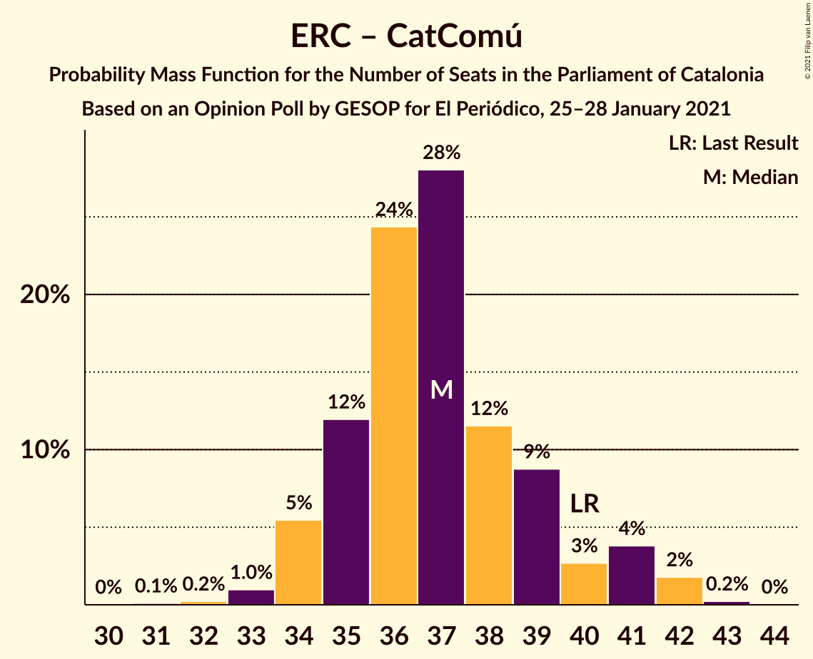

# Opinion Poll by GESOP for El Periódico, 25–28 January 2021

<a href="#voting-intentions">Voting Intentions</a> | <a href="#seats">Seats</a> | <a href="#coalitions">Coalitions</a> | <a href="#technical-information">Technical Information</a>

## Voting Intentions

### Confidence Intervals

| Party | Last Result | Poll Result | 80% Confidence Interval | 90% Confidence Interval | 95% Confidence Interval | 99% Confidence Interval |
|:-----:|:-----------:|:-----------:|:-----------------------:|:-----------------------:|:-----------------------:|:-----------------------:|
| Partit dels Socialistes de Catalunya (PSC-PSOE) | 13.9% | 24.0% | 22.6–25.5% |22.2–25.9% |21.9–26.3% |21.2–27.0% |
| Esquerra Republicana–Catalunya Sí | 21.4% | 19.8% | 18.5–21.2% |18.1–21.6% |17.8–21.9% |17.2–22.6% |
| Junts per Catalunya | 21.7% | 19.1% | 17.8–20.5% |17.5–20.9% |17.1–21.2% |16.6–21.9% |
| Ciutadans–Partido de la Ciudadanía | 25.4% | 9.0% | 8.1–10.0% |7.8–10.3% |7.6–10.6% |7.2–11.1% |
| Catalunya en Comú–Podem | 7.5% | 6.3% | 5.5–7.2% |5.3–7.5% |5.2–7.7% |4.8–8.1% |
| Partit Popular | 4.2% | 6.3% | 5.5–7.2% |5.3–7.5% |5.2–7.7% |4.8–8.1% |
| Candidatura d’Unitat Popular | 4.5% | 5.3% | 4.6–6.2% |4.5–6.4% |4.3–6.6% |4.0–7.0% |
| Vox | 0.0% | 5.2% | 4.5–6.0% |4.3–6.3% |4.2–6.5% |3.9–6.9% |
| Partit Demòcrata Europeu Català | 0.0% | 1.2% | 0.9–1.6% |0.8–1.8% |0.7–1.9% |0.6–2.1% |

*Note:* The poll result column reflects the actual value used in the calculations. Published results may vary slightly, and in addition be rounded to fewer digits.

## Seats

### Confidence Intervals

| Party | Last Result | Median | 80% Confidence Interval | 90% Confidence Interval | 95% Confidence Interval | 99% Confidence Interval |
|:-----:|:-----------:|:------:|:-----------------------:|:-----------------------:|:-----------------------:|:-----------------------:|
| <a href="#partit-dels-socialistes-de-catalunya-(psc-psoe)">Partit dels Socialistes de Catalunya (PSC-PSOE)</a> | 17 | 33 | 31–36 |31–36 |31–37 |30–38 |
| <a href="#esquerra-republicana–catalunya-sí">Esquerra Republicana–Catalunya Sí</a> | 32 | 30 | 28–33 |28–34 |27–34 |26–35 |
| <a href="#junts-per-catalunya">Junts per Catalunya</a> | 34 | 31 | 29–33 |28–34 |27–34 |26–36 |
| <a href="#ciutadans–partido-de-la-ciudadanía">Ciutadans–Partido de la Ciudadanía</a> | 36 | 12 | 11–13 |10–13 |9–14 |9–15 |
| <a href="#catalunya-en-comú–podem">Catalunya en Comú–Podem</a> | 8 | 7 | 5–8 |5–8 |5–8 |5–10 |
| <a href="#partit-popular">Partit Popular</a> | 4 | 8 | 7–9 |7–10 |6–10 |5–11 |
| <a href="#candidatura-d’unitat-popular">Candidatura d’Unitat Popular</a> | 4 | 7 | 5–8 |5–8 |4–8 |4–9 |
| <a href="#vox">Vox</a> | 0 | 6 | 5–7 |5–7 |4–9 |3–9 |
| <a href="#partit-demòcrata-europeu-català">Partit Demòcrata Europeu Català</a> | 0 | 0 | 0 |0 |0 |0 |

### Partit dels Socialistes de Catalunya (PSC-PSOE)

*For a full overview of the results for this party, see the [Partit dels Socialistes de Catalunya (PSC-PSOE)](party-partitdelssocialistesdecatalunyapsc-psoe.html) page.*

| Number of Seats | Probability | Accumulated | Special Marks |
|:---------------:|:-----------:|:-----------:|:-------------:|
| 17 | 0% | 100% | Last Result |
| 18 | 0% | 100% |  |
| 19 | 0% | 100% |  |
| 20 | 0% | 100% |  |
| 21 | 0% | 100% |  |
| 22 | 0% | 100% |  |
| 23 | 0% | 100% |  |
| 24 | 0% | 100% |  |
| 25 | 0% | 100% |  |
| 26 | 0% | 100% |  |
| 27 | 0% | 100% |  |
| 28 | 0.1% | 100% |  |
| 29 | 0.4% | 99.9% |  |
| 30 | 2% | 99.5% |  |
| 31 | 9% | 98% |  |
| 32 | 27% | 89% |  |
| 33 | 18% | 62% | Median |
| 34 | 23% | 45% |  |
| 35 | 10% | 22% |  |
| 36 | 8% | 12% |  |
| 37 | 3% | 4% |  |
| 38 | 2% | 2% |  |
| 39 | 0.2% | 0.3% |  |
| 40 | 0.1% | 0.1% |  |
| 41 | 0% | 0% |  |

### Esquerra Republicana–Catalunya Sí

*For a full overview of the results for this party, see the [Esquerra Republicana–Catalunya Sí](party-esquerrarepublicana–catalunyasí.html) page.*

| Number of Seats | Probability | Accumulated | Special Marks |
|:---------------:|:-----------:|:-----------:|:-------------:|
| 25 | 0.1% | 100% |  |
| 26 | 0.4% | 99.9% |  |
| 27 | 2% | 99.5% |  |
| 28 | 14% | 97% |  |
| 29 | 31% | 84% |  |
| 30 | 18% | 53% | Median |
| 31 | 18% | 34% |  |
| 32 | 6% | 16% | Last Result |
| 33 | 5% | 10% |  |
| 34 | 5% | 5% |  |
| 35 | 0.6% | 0.8% |  |
| 36 | 0.1% | 0.1% |  |
| 37 | 0% | 0% |  |

### Junts per Catalunya

*For a full overview of the results for this party, see the [Junts per Catalunya](party-juntspercatalunya.html) page.*

| Number of Seats | Probability | Accumulated | Special Marks |
|:---------------:|:-----------:|:-----------:|:-------------:|
| 25 | 0.1% | 100% |  |
| 26 | 1.0% | 99.9% |  |
| 27 | 3% | 99.0% |  |
| 28 | 2% | 96% |  |
| 29 | 4% | 94% |  |
| 30 | 12% | 89% |  |
| 31 | 42% | 78% | Median |
| 32 | 18% | 35% |  |
| 33 | 11% | 17% |  |
| 34 | 4% | 5% | Last Result |
| 35 | 1.1% | 2% |  |
| 36 | 0.3% | 0.6% |  |
| 37 | 0.2% | 0.2% |  |
| 38 | 0% | 0% |  |

### Ciutadans–Partido de la Ciudadanía

*For a full overview of the results for this party, see the [Ciutadans–Partido de la Ciudadanía](party-ciutadans–partidodelaciudadanía.html) page.*

| Number of Seats | Probability | Accumulated | Special Marks |
|:---------------:|:-----------:|:-----------:|:-------------:|
| 8 | 0.4% | 100% |  |
| 9 | 3% | 99.6% |  |
| 10 | 3% | 97% |  |
| 11 | 11% | 94% |  |
| 12 | 47% | 82% | Median |
| 13 | 32% | 36% |  |
| 14 | 2% | 4% |  |
| 15 | 1.0% | 1.2% |  |
| 16 | 0.1% | 0.2% |  |
| 17 | 0% | 0% |  |
| 18 | 0% | 0% |  |
| 19 | 0% | 0% |  |
| 20 | 0% | 0% |  |
| 21 | 0% | 0% |  |
| 22 | 0% | 0% |  |
| 23 | 0% | 0% |  |
| 24 | 0% | 0% |  |
| 25 | 0% | 0% |  |
| 26 | 0% | 0% |  |
| 27 | 0% | 0% |  |
| 28 | 0% | 0% |  |
| 29 | 0% | 0% |  |
| 30 | 0% | 0% |  |
| 31 | 0% | 0% |  |
| 32 | 0% | 0% |  |
| 33 | 0% | 0% |  |
| 34 | 0% | 0% |  |
| 35 | 0% | 0% |  |
| 36 | 0% | 0% | Last Result |

### Catalunya en Comú–Podem

*For a full overview of the results for this party, see the [Catalunya en Comú–Podem](party-catalunyaencomú–podem.html) page.*

| Number of Seats | Probability | Accumulated | Special Marks |
|:---------------:|:-----------:|:-----------:|:-------------:|
| 4 | 0.4% | 100% |  |
| 5 | 13% | 99.6% |  |
| 6 | 17% | 87% |  |
| 7 | 38% | 70% | Median |
| 8 | 30% | 32% | Last Result |
| 9 | 1.0% | 2% |  |
| 10 | 1.3% | 1.4% |  |
| 11 | 0.1% | 0.1% |  |
| 12 | 0% | 0% |  |

### Partit Popular

*For a full overview of the results for this party, see the [Partit Popular](party-partitpopular.html) page.*

| Number of Seats | Probability | Accumulated | Special Marks |
|:---------------:|:-----------:|:-----------:|:-------------:|
| 4 | 0% | 100% | Last Result |
| 5 | 0.7% | 100% |  |
| 6 | 3% | 99.3% |  |
| 7 | 35% | 97% |  |
| 8 | 19% | 62% | Median |
| 9 | 36% | 43% |  |
| 10 | 6% | 7% |  |
| 11 | 0.4% | 0.6% |  |
| 12 | 0.1% | 0.1% |  |
| 13 | 0% | 0% |  |

### Candidatura d’Unitat Popular

*For a full overview of the results for this party, see the [Candidatura d’Unitat Popular](party-candidaturad’unitatpopular.html) page.*

| Number of Seats | Probability | Accumulated | Special Marks |
|:---------------:|:-----------:|:-----------:|:-------------:|
| 3 | 0.1% | 100% |  |
| 4 | 4% | 99.9% | Last Result |
| 5 | 7% | 96% |  |
| 6 | 10% | 90% |  |
| 7 | 32% | 80% | Median |
| 8 | 46% | 48% |  |
| 9 | 2% | 2% |  |
| 10 | 0.4% | 0.4% |  |
| 11 | 0% | 0% |  |

### Vox

*For a full overview of the results for this party, see the [Vox](party-vox.html) page.*

| Number of Seats | Probability | Accumulated | Special Marks |
|:---------------:|:-----------:|:-----------:|:-------------:|
| 0 | 0% | 100% | Last Result |
| 1 | 0% | 100% |  |
| 2 | 0% | 100% |  |
| 3 | 1.2% | 100% |  |
| 4 | 2% | 98.8% |  |
| 5 | 29% | 97% |  |
| 6 | 19% | 68% | Median |
| 7 | 45% | 49% |  |
| 8 | 2% | 5% |  |
| 9 | 3% | 3% |  |
| 10 | 0.1% | 0.1% |  |
| 11 | 0% | 0% |  |

### Partit Demòcrata Europeu Català

*For a full overview of the results for this party, see the [Partit Demòcrata Europeu Català](party-partitdemòcrataeuropeucatalà.html) page.*

| Number of Seats | Probability | Accumulated | Special Marks |
|:---------------:|:-----------:|:-----------:|:-------------:|
| 0 | 100% | 100% | Last Result, Median |

## Coalitions

### Confidence Intervals

| Coalition | Last Result | Median | Majority? | 80% Confidence Interval | 90% Confidence Interval | 95% Confidence Interval | 99% Confidence Interval |
|:---------:|:-----------:|:------:|:---------:|:-----------------------:|:-----------------------:|:-----------------------:|:-----------------------:|
| Partit dels Socialistes de Catalunya (PSC-PSOE) – Esquerra Republicana–Catalunya Sí – Catalunya en Comú–Podem | 57 | 70 | 92% | 68–73 | 67–74 | 67–75 | 66–76 |
| Esquerra Republicana–Catalunya Sí – Junts per Catalunya – Candidatura d’Unitat Popular | 70 | 68 | 65% | 66–71 | 65–72 | 64–72 | 62–73 |
| Esquerra Republicana–Catalunya Sí – Junts per Catalunya – Candidatura d’Unitat Popular – Partit Demòcrata Europeu Català | 70 | 68 | 65% | 66–71 | 65–72 | 64–72 | 62–73 |
| Esquerra Republicana–Catalunya Sí – Junts per Catalunya – Catalunya en Comú–Podem | 74 | 68 | 66% | 66–71 | 65–72 | 64–72 | 62–74 |
| Esquerra Republicana–Catalunya Sí – Junts per Catalunya | 66 | 61 | 0.1% | 59–64 | 58–65 | 57–65 | 56–66 |
| Esquerra Republicana–Catalunya Sí – Junts per Catalunya – Partit Demòcrata Europeu Català | 66 | 61 | 0.1% | 59–64 | 58–65 | 57–65 | 56–66 |
| Partit dels Socialistes de Catalunya (PSC-PSOE) – Ciutadans–Partido de la Ciudadanía – Catalunya en Comú–Podem – Partit Popular | 65 | 61 | 0% | 58–63 | 57–64 | 57–64 | 55–66 |
| Partit dels Socialistes de Catalunya (PSC-PSOE) – Ciutadans–Partido de la Ciudadanía – Partit Popular – Vox | 57 | 60 | 0% | 57–62 | 57–63 | 55–64 | 55–66 |
| Partit dels Socialistes de Catalunya (PSC-PSOE) – Ciutadans–Partido de la Ciudadanía – Partit Popular | 57 | 54 | 0% | 51–56 | 50–57 | 50–58 | 48–59 |
| Esquerra Republicana–Catalunya Sí – Catalunya en Comú–Podem | 40 | 37 | 0% | 35–39 | 34–41 | 34–41 | 33–42 |

### Partit dels Socialistes de Catalunya (PSC-PSOE) – Esquerra Republicana–Catalunya Sí – Catalunya en Comú–Podem

| Number of Seats | Probability | Accumulated | Special Marks |
|:---------------:|:-----------:|:-----------:|:-------------:|
| 57 | 0% | 100% | Last Result |
| 58 | 0% | 100% |  |
| 59 | 0% | 100% |  |
| 60 | 0% | 100% |  |
| 61 | 0% | 100% |  |
| 62 | 0% | 100% |  |
| 63 | 0% | 100% |  |
| 64 | 0.1% | 100% |  |
| 65 | 0.3% | 99.9% |  |
| 66 | 1.0% | 99.6% |  |
| 67 | 6% | 98.6% |  |
| 68 | 17% | 92% | Majority |
| 69 | 15% | 75% |  |
| 70 | 14% | 60% | Median |
| 71 | 19% | 46% |  |
| 72 | 13% | 27% |  |
| 73 | 7% | 14% |  |
| 74 | 4% | 8% |  |
| 75 | 2% | 4% |  |
| 76 | 1.2% | 2% |  |
| 77 | 0.4% | 0.4% |  |
| 78 | 0% | 0.1% |  |
| 79 | 0% | 0% |  |

### Esquerra Republicana–Catalunya Sí – Junts per Catalunya – Candidatura d’Unitat Popular

| Number of Seats | Probability | Accumulated | Special Marks |
|:---------------:|:-----------:|:-----------:|:-------------:|
| 61 | 0.1% | 100% |  |
| 62 | 0.4% | 99.9% |  |
| 63 | 0.6% | 99.5% |  |
| 64 | 2% | 98.9% |  |
| 65 | 6% | 97% |  |
| 66 | 6% | 91% |  |
| 67 | 21% | 85% |  |
| 68 | 19% | 65% | Median, Majority |
| 69 | 19% | 46% |  |
| 70 | 13% | 27% | Last Result |
| 71 | 7% | 14% |  |
| 72 | 5% | 7% |  |
| 73 | 1.1% | 2% |  |
| 74 | 0.4% | 0.5% |  |
| 75 | 0.1% | 0.1% |  |
| 76 | 0% | 0% |  |

### Esquerra Republicana–Catalunya Sí – Junts per Catalunya – Candidatura d’Unitat Popular – Partit Demòcrata Europeu Català

| Number of Seats | Probability | Accumulated | Special Marks |
|:---------------:|:-----------:|:-----------:|:-------------:|
| 61 | 0.1% | 100% |  |
| 62 | 0.4% | 99.9% |  |
| 63 | 0.6% | 99.5% |  |
| 64 | 2% | 98.9% |  |
| 65 | 6% | 97% |  |
| 66 | 6% | 91% |  |
| 67 | 20% | 85% |  |
| 68 | 19% | 65% | Median, Majority |
| 69 | 19% | 46% |  |
| 70 | 13% | 27% | Last Result |
| 71 | 7% | 14% |  |
| 72 | 5% | 7% |  |
| 73 | 1.1% | 2% |  |
| 74 | 0.4% | 0.5% |  |
| 75 | 0.1% | 0.1% |  |
| 76 | 0% | 0% |  |

### Esquerra Republicana–Catalunya Sí – Junts per Catalunya – Catalunya en Comú–Podem

| Number of Seats | Probability | Accumulated | Special Marks |
|:---------------:|:-----------:|:-----------:|:-------------:|
| 61 | 0.1% | 100% |  |
| 62 | 0.7% | 99.9% |  |
| 63 | 0.7% | 99.2% |  |
| 64 | 2% | 98.5% |  |
| 65 | 4% | 97% |  |
| 66 | 12% | 92% |  |
| 67 | 14% | 80% |  |
| 68 | 33% | 66% | Median, Majority |
| 69 | 15% | 34% |  |
| 70 | 7% | 19% |  |
| 71 | 5% | 12% |  |
| 72 | 5% | 7% |  |
| 73 | 0.9% | 2% |  |
| 74 | 1.0% | 1.1% | Last Result |
| 75 | 0.1% | 0.1% |  |
| 76 | 0% | 0% |  |

### Esquerra Republicana–Catalunya Sí – Junts per Catalunya

| Number of Seats | Probability | Accumulated | Special Marks |
|:---------------:|:-----------:|:-----------:|:-------------:|
| 54 | 0% | 100% |  |
| 55 | 0.2% | 99.9% |  |
| 56 | 0.8% | 99.8% |  |
| 57 | 2% | 99.0% |  |
| 58 | 7% | 97% |  |
| 59 | 9% | 91% |  |
| 60 | 22% | 81% |  |
| 61 | 17% | 59% | Median |
| 62 | 18% | 42% |  |
| 63 | 11% | 24% |  |
| 64 | 7% | 13% |  |
| 65 | 4% | 6% |  |
| 66 | 2% | 2% | Last Result |
| 67 | 0.3% | 0.4% |  |
| 68 | 0.1% | 0.1% | Majority |
| 69 | 0% | 0% |  |

### Esquerra Republicana–Catalunya Sí – Junts per Catalunya – Partit Demòcrata Europeu Català

| Number of Seats | Probability | Accumulated | Special Marks |
|:---------------:|:-----------:|:-----------:|:-------------:|
| 54 | 0% | 100% |  |
| 55 | 0.1% | 99.9% |  |
| 56 | 0.8% | 99.8% |  |
| 57 | 2% | 99.0% |  |
| 58 | 7% | 97% |  |
| 59 | 9% | 91% |  |
| 60 | 22% | 81% |  |
| 61 | 17% | 59% | Median |
| 62 | 18% | 42% |  |
| 63 | 11% | 24% |  |
| 64 | 7% | 13% |  |
| 65 | 4% | 6% |  |
| 66 | 2% | 2% | Last Result |
| 67 | 0.3% | 0.4% |  |
| 68 | 0.1% | 0.1% | Majority |
| 69 | 0% | 0% |  |

### Partit dels Socialistes de Catalunya (PSC-PSOE) – Ciutadans–Partido de la Ciudadanía – Catalunya en Comú–Podem – Partit Popular

| Number of Seats | Probability | Accumulated | Special Marks |
|:---------------:|:-----------:|:-----------:|:-------------:|
| 54 | 0.1% | 100% |  |
| 55 | 0.5% | 99.9% |  |
| 56 | 1.5% | 99.3% |  |
| 57 | 6% | 98% |  |
| 58 | 7% | 92% |  |
| 59 | 22% | 84% |  |
| 60 | 12% | 62% | Median |
| 61 | 16% | 50% |  |
| 62 | 17% | 34% |  |
| 63 | 9% | 17% |  |
| 64 | 6% | 8% |  |
| 65 | 1.4% | 2% | Last Result |
| 66 | 0.7% | 1.0% |  |
| 67 | 0.2% | 0.2% |  |
| 68 | 0% | 0% | Majority |

### Partit dels Socialistes de Catalunya (PSC-PSOE) – Ciutadans–Partido de la Ciudadanía – Partit Popular – Vox

| Number of Seats | Probability | Accumulated | Special Marks |
|:---------------:|:-----------:|:-----------:|:-------------:|
| 53 | 0.1% | 100% |  |
| 54 | 0.3% | 99.9% |  |
| 55 | 3% | 99.6% |  |
| 56 | 2% | 97% |  |
| 57 | 6% | 95% | Last Result |
| 58 | 11% | 89% |  |
| 59 | 27% | 78% | Median |
| 60 | 15% | 51% |  |
| 61 | 21% | 36% |  |
| 62 | 8% | 15% |  |
| 63 | 4% | 8% |  |
| 64 | 2% | 4% |  |
| 65 | 1.3% | 2% |  |
| 66 | 0.4% | 0.5% |  |
| 67 | 0.1% | 0.1% |  |
| 68 | 0% | 0% | Majority |

### Partit dels Socialistes de Catalunya (PSC-PSOE) – Ciutadans–Partido de la Ciudadanía – Partit Popular

| Number of Seats | Probability | Accumulated | Special Marks |
|:---------------:|:-----------:|:-----------:|:-------------:|
| 47 | 0.1% | 100% |  |
| 48 | 0.4% | 99.9% |  |
| 49 | 2% | 99.5% |  |
| 50 | 3% | 98% |  |
| 51 | 9% | 94% |  |
| 52 | 15% | 85% |  |
| 53 | 17% | 70% | Median |
| 54 | 26% | 53% |  |
| 55 | 10% | 27% |  |
| 56 | 8% | 16% |  |
| 57 | 5% | 8% | Last Result |
| 58 | 1.3% | 3% |  |
| 59 | 1.4% | 2% |  |
| 60 | 0.1% | 0.1% |  |
| 61 | 0% | 0% |  |

### Esquerra Republicana–Catalunya Sí – Catalunya en Comú–Podem

| Number of Seats | Probability | Accumulated | Special Marks |
|:---------------:|:-----------:|:-----------:|:-------------:|
| 31 | 0.1% | 100% |  |
| 32 | 0.2% | 99.9% |  |
| 33 | 1.0% | 99.6% |  |
| 34 | 5% | 98.7% |  |
| 35 | 12% | 93% |  |
| 36 | 24% | 81% |  |
| 37 | 28% | 57% | Median |
| 38 | 12% | 29% |  |
| 39 | 9% | 17% |  |
| 40 | 3% | 9% | Last Result |
| 41 | 4% | 6% |  |
| 42 | 2% | 2% |  |
| 43 | 0.2% | 0.3% |  |
| 44 | 0% | 0% |  |

## Technical Information

### Opinion Poll

+ **Polling firm:** GESOP
+ **Commissioner(s):** El Periódico
+ **Fieldwork period:** 25–28 January 2021

### Calculations

+ **Sample size:** 1445
+ **Simulations done:** 1,048,576
+ **Error estimate:** 0.72%

