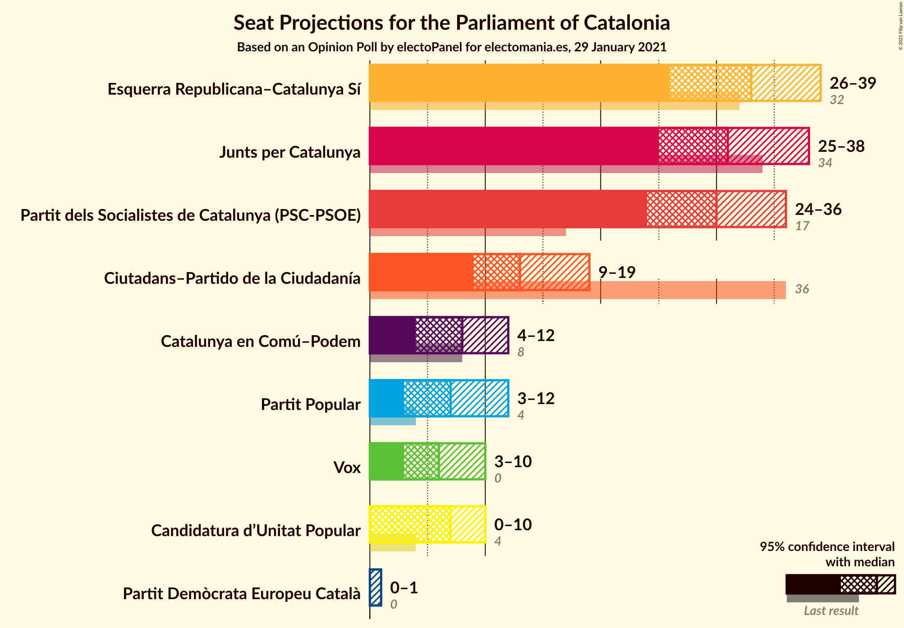
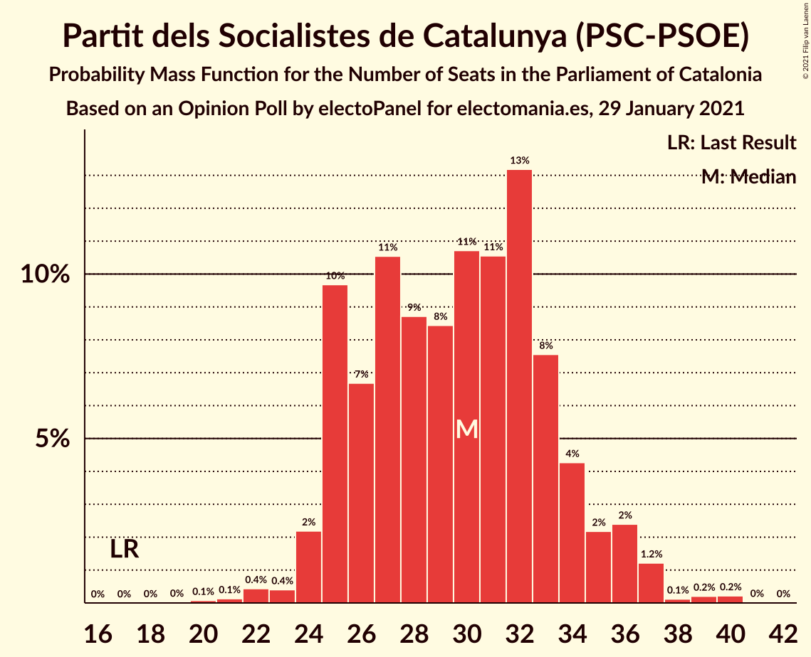

# Opinion Poll by electoPanel for electomania.es, 29 January 2021

<a href="#voting-intentions">Voting Intentions</a> | <a href="#seats">Seats</a> | <a href="#coalitions">Coalitions</a> | <a href="#technical-information">Technical Information</a>

## Voting Intentions

### Confidence Intervals

| Party | Last Result | Poll Result | 80% Confidence Interval | 90% Confidence Interval | 95% Confidence Interval | 99% Confidence Interval |
|:-----:|:-----------:|:-----------:|:-----------------------:|:-----------------------:|:-----------------------:|:-----------------------:|
| Esquerra Republicana–Catalunya Sí | 21.4% | 21.5% | 19.0–24.3% |18.3–25.1% |17.8–25.8% |16.6–27.2% |
| Partit dels Socialistes de Catalunya (PSC-PSOE) | 13.9% | 21.5% | 19.0–24.3% |18.3–25.1% |17.8–25.8% |16.6–27.2% |
| Junts per Catalunya | 21.7% | 19.5% | 17.1–22.2% |16.5–23.0% |15.9–23.7% |14.8–25.0% |
| Ciutadans–Partido de la Ciudadanía | 25.4% | 10.5% | 8.8–12.7% |8.3–13.3% |7.9–13.9% |7.1–15.0% |
| Catalunya en Comú–Podem | 7.5% | 6.8% | 5.4–8.6% |5.0–9.2% |4.7–9.6% |4.1–10.6% |
| Partit Popular | 4.2% | 6.0% | 4.7–7.8% |4.4–8.3% |4.1–8.8% |3.5–9.7% |
| Vox | 0.0% | 5.2% | 4.1–7.0% |3.7–7.5% |3.5–7.9% |3.0–8.8% |
| Candidatura d’Unitat Popular | 4.5% | 4.8% | 3.6–6.4% |3.3–6.9% |3.1–7.3% |2.6–8.2% |
| Partit Demòcrata Europeu Català | 0.0% | 1.2% | 0.8–2.3% |0.6–2.6% |0.5–2.9% |0.4–3.5% |

*Note:* The poll result column reflects the actual value used in the calculations. Published results may vary slightly, and in addition be rounded to fewer digits.

## Seats

### Confidence Intervals

| Party | Last Result | Median | 80% Confidence Interval | 90% Confidence Interval | 95% Confidence Interval | 99% Confidence Interval |
|:-----:|:-----------:|:------:|:-----------------------:|:-----------------------:|:-----------------------:|:-----------------------:|
| <a href="#esquerra-republicana–catalunya-sí">Esquerra Republicana–Catalunya Sí</a> | 32 | 33 | 28–37 |27–38 |26–39 |25–42 |
| <a href="#partit-dels-socialistes-de-catalunya-(psc-psoe)">Partit dels Socialistes de Catalunya (PSC-PSOE)</a> | 17 | 30 | 25–34 |25–35 |24–36 |22–38 |
| <a href="#junts-per-catalunya">Junts per Catalunya</a> | 34 | 31 | 26–36 |26–37 |25–38 |23–40 |
| <a href="#ciutadans–partido-de-la-ciudadanía">Ciutadans–Partido de la Ciudadanía</a> | 36 | 13 | 12–17 |11–18 |9–19 |8–20 |
| <a href="#catalunya-en-comú–podem">Catalunya en Comú–Podem</a> | 8 | 8 | 5–10 |5–11 |4–12 |4–13 |
| <a href="#partit-popular">Partit Popular</a> | 4 | 7 | 5–10 |5–11 |3–12 |3–14 |
| <a href="#vox">Vox</a> | 0 | 6 | 3–9 |3–9 |3–10 |2–12 |
| <a href="#candidatura-d’unitat-popular">Candidatura d’Unitat Popular</a> | 4 | 7 | 3–8 |2–9 |0–10 |0–11 |
| <a href="#partit-demòcrata-europeu-català">Partit Demòcrata Europeu Català</a> | 0 | 0 | 0 |0 |0–1 |0–4 |

### Esquerra Republicana–Catalunya Sí

*For a full overview of the results for this party, see the [Esquerra Republicana–Catalunya Sí](party-esquerrarepublicana–catalunyasí.html) page.*

| Number of Seats | Probability | Accumulated | Special Marks |
|:---------------:|:-----------:|:-----------:|:-------------:|
| 22 | 0.1% | 100% |  |
| 23 | 0.1% | 99.9% |  |
| 24 | 0.3% | 99.8% |  |
| 25 | 0.5% | 99.5% |  |
| 26 | 2% | 99.0% |  |
| 27 | 3% | 97% |  |
| 28 | 8% | 95% |  |
| 29 | 9% | 87% |  |
| 30 | 7% | 78% |  |
| 31 | 8% | 71% |  |
| 32 | 13% | 63% | Last Result |
| 33 | 10% | 50% | Median |
| 34 | 11% | 41% |  |
| 35 | 11% | 30% |  |
| 36 | 7% | 19% |  |
| 37 | 4% | 12% |  |
| 38 | 4% | 7% |  |
| 39 | 1.1% | 4% |  |
| 40 | 0.9% | 2% |  |
| 41 | 0.7% | 2% |  |
| 42 | 0.5% | 0.9% |  |
| 43 | 0.2% | 0.4% |  |
| 44 | 0.1% | 0.1% |  |
| 45 | 0% | 0% |  |

### Partit dels Socialistes de Catalunya (PSC-PSOE)

*For a full overview of the results for this party, see the [Partit dels Socialistes de Catalunya (PSC-PSOE)](party-partitdelssocialistesdecatalunyapsc-psoe.html) page.*

| Number of Seats | Probability | Accumulated | Special Marks |
|:---------------:|:-----------:|:-----------:|:-------------:|
| 17 | 0% | 100% | Last Result |
| 18 | 0% | 100% |  |
| 19 | 0% | 100% |  |
| 20 | 0.1% | 100% |  |
| 21 | 0.1% | 99.9% |  |
| 22 | 0.4% | 99.8% |  |
| 23 | 0.4% | 99.3% |  |
| 24 | 2% | 98.9% |  |
| 25 | 10% | 97% |  |
| 26 | 7% | 87% |  |
| 27 | 11% | 80% |  |
| 28 | 9% | 70% |  |
| 29 | 8% | 61% |  |
| 30 | 11% | 53% | Median |
| 31 | 11% | 42% |  |
| 32 | 13% | 31% |  |
| 33 | 8% | 18% |  |
| 34 | 4% | 11% |  |
| 35 | 2% | 6% |  |
| 36 | 2% | 4% |  |
| 37 | 1.2% | 2% |  |
| 38 | 0.1% | 0.6% |  |
| 39 | 0.2% | 0.5% |  |
| 40 | 0.2% | 0.3% |  |
| 41 | 0% | 0% |  |

### Junts per Catalunya

*For a full overview of the results for this party, see the [Junts per Catalunya](party-juntspercatalunya.html) page.*

| Number of Seats | Probability | Accumulated | Special Marks |
|:---------------:|:-----------:|:-----------:|:-------------:|
| 21 | 0% | 100% |  |
| 22 | 0.1% | 99.9% |  |
| 23 | 0.5% | 99.9% |  |
| 24 | 0.6% | 99.4% |  |
| 25 | 3% | 98.8% |  |
| 26 | 6% | 96% |  |
| 27 | 5% | 90% |  |
| 28 | 3% | 85% |  |
| 29 | 10% | 82% |  |
| 30 | 9% | 72% |  |
| 31 | 22% | 63% | Median |
| 32 | 11% | 41% |  |
| 33 | 6% | 29% |  |
| 34 | 7% | 24% | Last Result |
| 35 | 5% | 17% |  |
| 36 | 4% | 12% |  |
| 37 | 5% | 8% |  |
| 38 | 2% | 4% |  |
| 39 | 1.1% | 2% |  |
| 40 | 0.4% | 0.7% |  |
| 41 | 0.2% | 0.4% |  |
| 42 | 0.1% | 0.2% |  |
| 43 | 0% | 0.1% |  |
| 44 | 0% | 0% |  |

### Ciutadans–Partido de la Ciudadanía

*For a full overview of the results for this party, see the [Ciutadans–Partido de la Ciudadanía](party-ciutadans–partidodelaciudadanía.html) page.*

| Number of Seats | Probability | Accumulated | Special Marks |
|:---------------:|:-----------:|:-----------:|:-------------:|
| 7 | 0% | 100% |  |
| 8 | 1.1% | 99.9% |  |
| 9 | 2% | 98.8% |  |
| 10 | 2% | 97% |  |
| 11 | 3% | 95% |  |
| 12 | 17% | 92% |  |
| 13 | 26% | 75% | Median |
| 14 | 16% | 49% |  |
| 15 | 5% | 33% |  |
| 16 | 9% | 28% |  |
| 17 | 9% | 19% |  |
| 18 | 7% | 10% |  |
| 19 | 2% | 3% |  |
| 20 | 0.7% | 1.2% |  |
| 21 | 0.3% | 0.5% |  |
| 22 | 0.1% | 0.1% |  |
| 23 | 0% | 0.1% |  |
| 24 | 0% | 0% |  |
| 25 | 0% | 0% |  |
| 26 | 0% | 0% |  |
| 27 | 0% | 0% |  |
| 28 | 0% | 0% |  |
| 29 | 0% | 0% |  |
| 30 | 0% | 0% |  |
| 31 | 0% | 0% |  |
| 32 | 0% | 0% |  |
| 33 | 0% | 0% |  |
| 34 | 0% | 0% |  |
| 35 | 0% | 0% |  |
| 36 | 0% | 0% | Last Result |

### Catalunya en Comú–Podem

*For a full overview of the results for this party, see the [Catalunya en Comú–Podem](party-catalunyaencomú–podem.html) page.*

| Number of Seats | Probability | Accumulated | Special Marks |
|:---------------:|:-----------:|:-----------:|:-------------:|
| 3 | 0.3% | 100% |  |
| 4 | 3% | 99.7% |  |
| 5 | 17% | 96% |  |
| 6 | 9% | 80% |  |
| 7 | 18% | 71% |  |
| 8 | 29% | 53% | Last Result, Median |
| 9 | 6% | 24% |  |
| 10 | 10% | 19% |  |
| 11 | 6% | 9% |  |
| 12 | 1.2% | 3% |  |
| 13 | 1.3% | 2% |  |
| 14 | 0.3% | 0.4% |  |
| 15 | 0.1% | 0.1% |  |
| 16 | 0% | 0% |  |

### Partit Popular

*For a full overview of the results for this party, see the [Partit Popular](party-partitpopular.html) page.*

| Number of Seats | Probability | Accumulated | Special Marks |
|:---------------:|:-----------:|:-----------:|:-------------:|
| 2 | 0.1% | 100% |  |
| 3 | 3% | 99.9% |  |
| 4 | 2% | 97% | Last Result |
| 5 | 10% | 95% |  |
| 6 | 9% | 85% |  |
| 7 | 33% | 76% | Median |
| 8 | 6% | 43% |  |
| 9 | 22% | 37% |  |
| 10 | 8% | 15% |  |
| 11 | 3% | 8% |  |
| 12 | 4% | 4% |  |
| 13 | 0.3% | 0.9% |  |
| 14 | 0.4% | 0.5% |  |
| 15 | 0.1% | 0.1% |  |
| 16 | 0% | 0% |  |

### Vox

*For a full overview of the results for this party, see the [Vox](party-vox.html) page.*

| Number of Seats | Probability | Accumulated | Special Marks |
|:---------------:|:-----------:|:-----------:|:-------------:|
| 0 | 0.4% | 100% | Last Result |
| 1 | 0% | 99.6% |  |
| 2 | 1.0% | 99.6% |  |
| 3 | 11% | 98.5% |  |
| 4 | 4% | 87% |  |
| 5 | 20% | 83% |  |
| 6 | 16% | 64% | Median |
| 7 | 27% | 47% |  |
| 8 | 5% | 20% |  |
| 9 | 10% | 15% |  |
| 10 | 3% | 5% |  |
| 11 | 1.2% | 2% |  |
| 12 | 0.7% | 0.9% |  |
| 13 | 0.1% | 0.2% |  |
| 14 | 0.1% | 0.1% |  |
| 15 | 0% | 0% |  |

### Candidatura d’Unitat Popular

*For a full overview of the results for this party, see the [Candidatura d’Unitat Popular](party-candidaturad’unitatpopular.html) page.*

| Number of Seats | Probability | Accumulated | Special Marks |
|:---------------:|:-----------:|:-----------:|:-------------:|
| 0 | 3% | 100% |  |
| 1 | 0% | 97% |  |
| 2 | 4% | 97% |  |
| 3 | 6% | 93% |  |
| 4 | 19% | 88% | Last Result |
| 5 | 5% | 69% |  |
| 6 | 11% | 63% |  |
| 7 | 20% | 52% | Median |
| 8 | 25% | 32% |  |
| 9 | 4% | 7% |  |
| 10 | 2% | 3% |  |
| 11 | 1.1% | 1.2% |  |
| 12 | 0.1% | 0.2% |  |
| 13 | 0% | 0.1% |  |
| 14 | 0% | 0% |  |

### Partit Demòcrata Europeu Català

*For a full overview of the results for this party, see the [Partit Demòcrata Europeu Català](party-partitdemòcrataeuropeucatalà.html) page.*

| Number of Seats | Probability | Accumulated | Special Marks |
|:---------------:|:-----------:|:-----------:|:-------------:|
| 0 | 96% | 100% | Last Result, Median |
| 1 | 3% | 4% |  |
| 2 | 0% | 0.8% |  |
| 3 | 0.2% | 0.8% |  |
| 4 | 0.3% | 0.5% |  |
| 5 | 0.2% | 0.3% |  |
| 6 | 0% | 0% |  |

## Coalitions

### Confidence Intervals

| Coalition | Last Result | Median | Majority? | 80% Confidence Interval | 90% Confidence Interval | 95% Confidence Interval | 99% Confidence Interval |
|:---------:|:-----------:|:------:|:---------:|:-----------------------:|:-----------------------:|:-----------------------:|:-----------------------:|
| Esquerra Republicana–Catalunya Sí – Junts per Catalunya – Catalunya en Comú–Podem | 74 | 71 | 81% | 66–77 | 65–78 | 64–80 | 61–82 |
| Esquerra Republicana–Catalunya Sí – Junts per Catalunya – Candidatura d’Unitat Popular | 70 | 70 | 70% | 65–75 | 63–76 | 62–78 | 59–80 |
| Esquerra Republicana–Catalunya Sí – Junts per Catalunya – Candidatura d’Unitat Popular – Partit Demòcrata Europeu Català | 70 | 70 | 70% | 65–75 | 63–76 | 62–78 | 59–80 |
| Esquerra Republicana–Catalunya Sí – Partit dels Socialistes de Catalunya (PSC-PSOE) – Catalunya en Comú–Podem | 57 | 70 | 71% | 64–75 | 63–76 | 62–77 | 60–80 |
| Esquerra Republicana–Catalunya Sí – Junts per Catalunya | 66 | 63 | 18% | 59–69 | 57–71 | 56–72 | 54–74 |
| Esquerra Republicana–Catalunya Sí – Junts per Catalunya – Partit Demòcrata Europeu Català | 66 | 64 | 18% | 59–69 | 57–71 | 56–72 | 54–74 |
| Partit dels Socialistes de Catalunya (PSC-PSOE) – Ciutadans–Partido de la Ciudadanía – Catalunya en Comú–Podem – Partit Popular | 65 | 59 | 2% | 54–64 | 52–65 | 51–67 | 49–69 |
| Partit dels Socialistes de Catalunya (PSC-PSOE) – Ciutadans–Partido de la Ciudadanía – Partit Popular – Vox | 57 | 58 | 0.8% | 52–63 | 51–64 | 50–66 | 47–68 |
| Partit dels Socialistes de Catalunya (PSC-PSOE) – Ciutadans–Partido de la Ciudadanía – Partit Popular | 57 | 51 | 0% | 46–57 | 45–58 | 44–59 | 42–61 |
| Esquerra Republicana–Catalunya Sí – Catalunya en Comú–Podem | 40 | 40 | 0% | 36–45 | 34–46 | 33–48 | 31–50 |

### Esquerra Republicana–Catalunya Sí – Junts per Catalunya – Catalunya en Comú–Podem

| Number of Seats | Probability | Accumulated | Special Marks |
|:---------------:|:-----------:|:-----------:|:-------------:|
| 59 | 0.1% | 100% |  |
| 60 | 0.3% | 99.9% |  |
| 61 | 0.3% | 99.6% |  |
| 62 | 0.6% | 99.3% |  |
| 63 | 1.2% | 98.8% |  |
| 64 | 2% | 98% |  |
| 65 | 3% | 95% |  |
| 66 | 5% | 93% |  |
| 67 | 7% | 88% |  |
| 68 | 8% | 81% | Majority |
| 69 | 7% | 73% |  |
| 70 | 10% | 67% |  |
| 71 | 7% | 57% |  |
| 72 | 7% | 50% | Median |
| 73 | 13% | 42% |  |
| 74 | 7% | 30% | Last Result |
| 75 | 6% | 23% |  |
| 76 | 6% | 16% |  |
| 77 | 4% | 10% |  |
| 78 | 2% | 7% |  |
| 79 | 2% | 5% |  |
| 80 | 1.4% | 3% |  |
| 81 | 0.3% | 1.2% |  |
| 82 | 0.5% | 0.9% |  |
| 83 | 0.3% | 0.4% |  |
| 84 | 0.1% | 0.1% |  |
| 85 | 0% | 0.1% |  |
| 86 | 0% | 0% |  |

### Esquerra Republicana–Catalunya Sí – Junts per Catalunya – Candidatura d’Unitat Popular

| Number of Seats | Probability | Accumulated | Special Marks |
|:---------------:|:-----------:|:-----------:|:-------------:|
| 57 | 0% | 100% |  |
| 58 | 0.1% | 99.9% |  |
| 59 | 0.4% | 99.8% |  |
| 60 | 0.5% | 99.4% |  |
| 61 | 1.3% | 98.8% |  |
| 62 | 1.4% | 98% |  |
| 63 | 2% | 96% |  |
| 64 | 3% | 94% |  |
| 65 | 4% | 91% |  |
| 66 | 6% | 87% |  |
| 67 | 11% | 81% |  |
| 68 | 9% | 70% | Majority |
| 69 | 9% | 61% |  |
| 70 | 7% | 52% | Last Result |
| 71 | 11% | 45% | Median |
| 72 | 6% | 34% |  |
| 73 | 7% | 27% |  |
| 74 | 6% | 20% |  |
| 75 | 6% | 15% |  |
| 76 | 4% | 9% |  |
| 77 | 1.5% | 5% |  |
| 78 | 0.9% | 3% |  |
| 79 | 1.4% | 2% |  |
| 80 | 0.5% | 0.8% |  |
| 81 | 0.2% | 0.3% |  |
| 82 | 0.1% | 0.1% |  |
| 83 | 0% | 0% |  |

### Esquerra Republicana–Catalunya Sí – Junts per Catalunya – Candidatura d’Unitat Popular – Partit Demòcrata Europeu Català

| Number of Seats | Probability | Accumulated | Special Marks |
|:---------------:|:-----------:|:-----------:|:-------------:|
| 57 | 0% | 100% |  |
| 58 | 0.1% | 99.9% |  |
| 59 | 0.4% | 99.8% |  |
| 60 | 0.6% | 99.4% |  |
| 61 | 1.2% | 98.9% |  |
| 62 | 1.4% | 98% |  |
| 63 | 2% | 96% |  |
| 64 | 3% | 94% |  |
| 65 | 4% | 91% |  |
| 66 | 6% | 87% |  |
| 67 | 11% | 81% |  |
| 68 | 9% | 70% | Majority |
| 69 | 9% | 61% |  |
| 70 | 6% | 52% | Last Result |
| 71 | 11% | 46% | Median |
| 72 | 6% | 34% |  |
| 73 | 7% | 28% |  |
| 74 | 6% | 21% |  |
| 75 | 6% | 15% |  |
| 76 | 4% | 9% |  |
| 77 | 2% | 5% |  |
| 78 | 0.9% | 3% |  |
| 79 | 1.5% | 2% |  |
| 80 | 0.5% | 0.8% |  |
| 81 | 0.2% | 0.3% |  |
| 82 | 0.1% | 0.1% |  |
| 83 | 0% | 0% |  |

### Esquerra Republicana–Catalunya Sí – Partit dels Socialistes de Catalunya (PSC-PSOE) – Catalunya en Comú–Podem

| Number of Seats | Probability | Accumulated | Special Marks |
|:---------------:|:-----------:|:-----------:|:-------------:|
| 57 | 0% | 100% | Last Result |
| 58 | 0.1% | 99.9% |  |
| 59 | 0.2% | 99.8% |  |
| 60 | 0.6% | 99.7% |  |
| 61 | 0.9% | 99.1% |  |
| 62 | 2% | 98% |  |
| 63 | 3% | 96% |  |
| 64 | 5% | 93% |  |
| 65 | 4% | 88% |  |
| 66 | 5% | 84% |  |
| 67 | 8% | 79% |  |
| 68 | 10% | 71% | Majority |
| 69 | 7% | 62% |  |
| 70 | 12% | 55% |  |
| 71 | 10% | 42% | Median |
| 72 | 6% | 33% |  |
| 73 | 6% | 26% |  |
| 74 | 8% | 20% |  |
| 75 | 4% | 12% |  |
| 76 | 4% | 8% |  |
| 77 | 1.3% | 4% |  |
| 78 | 1.1% | 2% |  |
| 79 | 0.6% | 1.4% |  |
| 80 | 0.3% | 0.8% |  |
| 81 | 0.3% | 0.4% |  |
| 82 | 0.1% | 0.2% |  |
| 83 | 0% | 0.1% |  |
| 84 | 0% | 0% |  |

### Esquerra Republicana–Catalunya Sí – Junts per Catalunya

| Number of Seats | Probability | Accumulated | Special Marks |
|:---------------:|:-----------:|:-----------:|:-------------:|
| 51 | 0.1% | 100% |  |
| 52 | 0.1% | 99.9% |  |
| 53 | 0.3% | 99.8% |  |
| 54 | 0.4% | 99.5% |  |
| 55 | 0.6% | 99.1% |  |
| 56 | 1.1% | 98% |  |
| 57 | 3% | 97% |  |
| 58 | 3% | 95% |  |
| 59 | 4% | 91% |  |
| 60 | 7% | 87% |  |
| 61 | 9% | 80% |  |
| 62 | 10% | 71% |  |
| 63 | 11% | 61% |  |
| 64 | 8% | 50% | Median |
| 65 | 8% | 42% |  |
| 66 | 10% | 34% | Last Result |
| 67 | 6% | 24% |  |
| 68 | 5% | 18% | Majority |
| 69 | 3% | 13% |  |
| 70 | 4% | 9% |  |
| 71 | 2% | 5% |  |
| 72 | 2% | 4% |  |
| 73 | 0.7% | 2% |  |
| 74 | 0.8% | 1.2% |  |
| 75 | 0.2% | 0.4% |  |
| 76 | 0.1% | 0.2% |  |
| 77 | 0.1% | 0.1% |  |
| 78 | 0% | 0% |  |

### Esquerra Republicana–Catalunya Sí – Junts per Catalunya – Partit Demòcrata Europeu Català

| Number of Seats | Probability | Accumulated | Special Marks |
|:---------------:|:-----------:|:-----------:|:-------------:|
| 51 | 0.1% | 100% |  |
| 52 | 0.1% | 99.9% |  |
| 53 | 0.3% | 99.8% |  |
| 54 | 0.4% | 99.5% |  |
| 55 | 0.6% | 99.1% |  |
| 56 | 1.1% | 98.6% |  |
| 57 | 3% | 97% |  |
| 58 | 3% | 95% |  |
| 59 | 4% | 91% |  |
| 60 | 7% | 88% |  |
| 61 | 9% | 81% |  |
| 62 | 11% | 72% |  |
| 63 | 11% | 61% |  |
| 64 | 8% | 50% | Median |
| 65 | 8% | 42% |  |
| 66 | 10% | 34% | Last Result |
| 67 | 6% | 25% |  |
| 68 | 5% | 18% | Majority |
| 69 | 3% | 13% |  |
| 70 | 4% | 10% |  |
| 71 | 2% | 6% |  |
| 72 | 2% | 4% |  |
| 73 | 0.7% | 2% |  |
| 74 | 0.8% | 1.2% |  |
| 75 | 0.2% | 0.4% |  |
| 76 | 0.1% | 0.2% |  |
| 77 | 0.1% | 0.1% |  |
| 78 | 0% | 0% |  |

### Partit dels Socialistes de Catalunya (PSC-PSOE) – Ciutadans–Partido de la Ciudadanía – Catalunya en Comú–Podem – Partit Popular

| Number of Seats | Probability | Accumulated | Special Marks |
|:---------------:|:-----------:|:-----------:|:-------------:|
| 47 | 0.1% | 100% |  |
| 48 | 0.1% | 99.8% |  |
| 49 | 0.7% | 99.7% |  |
| 50 | 1.3% | 99.0% |  |
| 51 | 2% | 98% |  |
| 52 | 2% | 96% |  |
| 53 | 3% | 94% |  |
| 54 | 5% | 91% |  |
| 55 | 6% | 85% |  |
| 56 | 9% | 80% |  |
| 57 | 7% | 71% |  |
| 58 | 11% | 64% | Median |
| 59 | 7% | 53% |  |
| 60 | 11% | 46% |  |
| 61 | 11% | 36% |  |
| 62 | 5% | 25% |  |
| 63 | 9% | 20% |  |
| 64 | 3% | 11% |  |
| 65 | 4% | 8% | Last Result |
| 66 | 1.4% | 4% |  |
| 67 | 1.1% | 3% |  |
| 68 | 0.5% | 2% | Majority |
| 69 | 0.6% | 1.0% |  |
| 70 | 0.3% | 0.4% |  |
| 71 | 0% | 0.1% |  |
| 72 | 0% | 0.1% |  |
| 73 | 0% | 0% |  |

### Partit dels Socialistes de Catalunya (PSC-PSOE) – Ciutadans–Partido de la Ciudadanía – Partit Popular – Vox

| Number of Seats | Probability | Accumulated | Special Marks |
|:---------------:|:-----------:|:-----------:|:-------------:|
| 45 | 0.1% | 100% |  |
| 46 | 0.2% | 99.9% |  |
| 47 | 0.3% | 99.8% |  |
| 48 | 0.6% | 99.5% |  |
| 49 | 0.9% | 98.8% |  |
| 50 | 2% | 98% |  |
| 51 | 3% | 96% |  |
| 52 | 5% | 93% |  |
| 53 | 5% | 89% |  |
| 54 | 9% | 84% |  |
| 55 | 8% | 74% |  |
| 56 | 9% | 67% | Median |
| 57 | 6% | 57% | Last Result |
| 58 | 10% | 52% |  |
| 59 | 9% | 41% |  |
| 60 | 8% | 32% |  |
| 61 | 9% | 24% |  |
| 62 | 3% | 15% |  |
| 63 | 3% | 12% |  |
| 64 | 4% | 8% |  |
| 65 | 2% | 5% |  |
| 66 | 2% | 3% |  |
| 67 | 0.6% | 1.5% |  |
| 68 | 0.6% | 0.8% | Majority |
| 69 | 0.1% | 0.2% |  |
| 70 | 0.1% | 0.1% |  |
| 71 | 0% | 0% |  |

### Partit dels Socialistes de Catalunya (PSC-PSOE) – Ciutadans–Partido de la Ciudadanía – Partit Popular

| Number of Seats | Probability | Accumulated | Special Marks |
|:---------------:|:-----------:|:-----------:|:-------------:|
| 39 | 0.1% | 100% |  |
| 40 | 0.1% | 99.9% |  |
| 41 | 0.3% | 99.8% |  |
| 42 | 0.8% | 99.5% |  |
| 43 | 1.2% | 98.8% |  |
| 44 | 2% | 98% |  |
| 45 | 4% | 96% |  |
| 46 | 5% | 92% |  |
| 47 | 4% | 87% |  |
| 48 | 8% | 83% |  |
| 49 | 7% | 75% |  |
| 50 | 10% | 68% | Median |
| 51 | 11% | 58% |  |
| 52 | 9% | 47% |  |
| 53 | 11% | 38% |  |
| 54 | 6% | 27% |  |
| 55 | 6% | 21% |  |
| 56 | 5% | 15% |  |
| 57 | 3% | 10% | Last Result |
| 58 | 4% | 7% |  |
| 59 | 1.3% | 3% |  |
| 60 | 0.9% | 2% |  |
| 61 | 0.5% | 1.0% |  |
| 62 | 0.3% | 0.5% |  |
| 63 | 0.1% | 0.2% |  |
| 64 | 0% | 0.1% |  |
| 65 | 0% | 0% |  |

### Esquerra Republicana–Catalunya Sí – Catalunya en Comú–Podem

| Number of Seats | Probability | Accumulated | Special Marks |
|:---------------:|:-----------:|:-----------:|:-------------:|
| 28 | 0% | 100% |  |
| 29 | 0.1% | 99.9% |  |
| 30 | 0.1% | 99.9% |  |
| 31 | 0.9% | 99.8% |  |
| 32 | 0.4% | 98.9% |  |
| 33 | 2% | 98% |  |
| 34 | 3% | 97% |  |
| 35 | 4% | 94% |  |
| 36 | 10% | 90% |  |
| 37 | 8% | 81% |  |
| 38 | 8% | 73% |  |
| 39 | 6% | 65% |  |
| 40 | 11% | 59% | Last Result |
| 41 | 9% | 48% | Median |
| 42 | 12% | 39% |  |
| 43 | 10% | 27% |  |
| 44 | 5% | 17% |  |
| 45 | 5% | 11% |  |
| 46 | 2% | 6% |  |
| 47 | 1.4% | 4% |  |
| 48 | 1.0% | 3% |  |
| 49 | 1.0% | 2% |  |
| 50 | 0.3% | 0.7% |  |
| 51 | 0.1% | 0.4% |  |
| 52 | 0.2% | 0.2% |  |
| 53 | 0% | 0.1% |  |
| 54 | 0% | 0% |  |

## Technical Information

### Opinion Poll

+ **Polling firm:** electoPanel
+ **Commissioner(s):** electomania.es
+ **Fieldwork period:** 29 January 2021

### Calculations

+ **Sample size:** 400
+ **Simulations done:** 1,048,576
+ **Error estimate:** 2.53%

