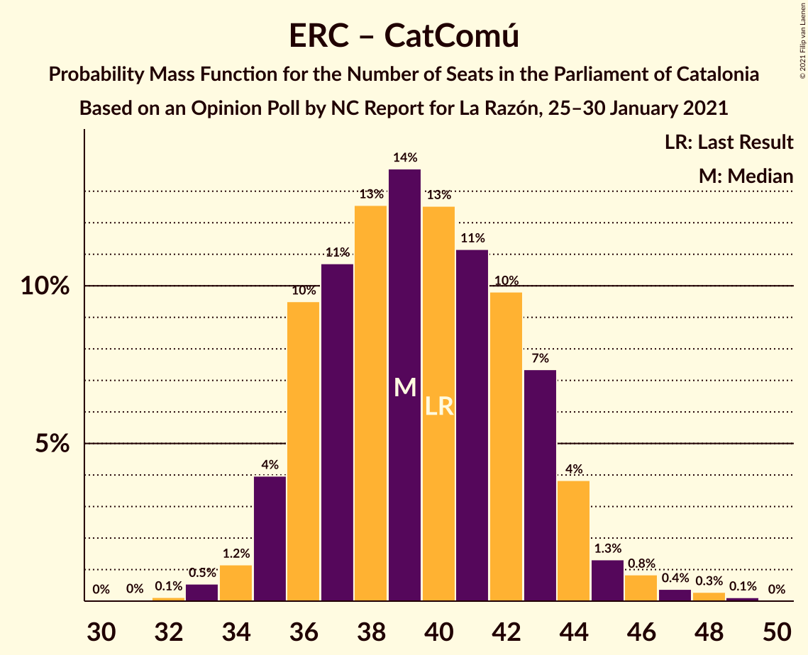

# Opinion Poll by NC Report for La Razón, 25–30 January 2021

<a href="#voting-intentions">Voting Intentions</a> | <a href="#seats">Seats</a> | <a href="#coalitions">Coalitions</a> | <a href="#technical-information">Technical Information</a>

## Voting Intentions

### Confidence Intervals

| Party | Last Result | Poll Result | 80% Confidence Interval | 90% Confidence Interval | 95% Confidence Interval | 99% Confidence Interval |
|:-----:|:-----------:|:-----------:|:-----------------------:|:-----------------------:|:-----------------------:|:-----------------------:|
| Esquerra Republicana–Catalunya Sí | 21.4% | 21.3% | 19.3–23.4% |18.8–24.0% |18.4–24.5% |17.5–25.5% |
| Partit dels Socialistes de Catalunya (PSC-PSOE) | 13.9% | 19.7% | 17.8–21.7% |17.3–22.3% |16.8–22.8% |16.0–23.8% |
| Junts per Catalunya | 21.7% | 19.7% | 17.8–21.7% |17.3–22.3% |16.8–22.8% |16.0–23.8% |
| Ciutadans–Partido de la Ciudadanía | 25.4% | 10.8% | 9.4–12.4% |9.0–12.9% |8.7–13.3% |8.0–14.2% |
| Catalunya en Comú–Podem | 7.5% | 6.8% | 5.7–8.2% |5.4–8.6% |5.2–9.0% |4.7–9.7% |
| Partit Popular | 4.2% | 6.7% | 5.6–8.1% |5.3–8.5% |5.1–8.8% |4.6–9.5% |
| Candidatura d’Unitat Popular | 4.5% | 5.8% | 4.8–7.1% |4.5–7.5% |4.3–7.8% |3.9–8.5% |
| Vox | 0.0% | 5.5% | 4.6–6.8% |4.3–7.2% |4.1–7.5% |3.6–8.2% |

*Note:* The poll result column reflects the actual value used in the calculations. Published results may vary slightly, and in addition be rounded to fewer digits.

## Seats

### Confidence Intervals

| Party | Last Result | Median | 80% Confidence Interval | 90% Confidence Interval | 95% Confidence Interval | 99% Confidence Interval |
|:-----:|:-----------:|:------:|:-----------------------:|:-----------------------:|:-----------------------:|:-----------------------:|
| <a href="#esquerra-republicana–catalunya-sí">Esquerra Republicana–Catalunya Sí</a> | 32 | 31 | 29–35 |28–36 |28–37 |26–39 |
| <a href="#partit-dels-socialistes-de-catalunya-(psc-psoe)">Partit dels Socialistes de Catalunya (PSC-PSOE)</a> | 17 | 26 | 24–30 |24–31 |23–31 |22–32 |
| <a href="#junts-per-catalunya">Junts per Catalunya</a> | 34 | 31 | 29–35 |27–36 |26–37 |25–39 |
| <a href="#ciutadans–partido-de-la-ciudadanía">Ciutadans–Partido de la Ciudadanía</a> | 36 | 14 | 12–17 |12–18 |12–18 |10–19 |
| <a href="#catalunya-en-comú–podem">Catalunya en Comú–Podem</a> | 8 | 8 | 5–10 |5–10 |5–11 |4–12 |
| <a href="#partit-popular">Partit Popular</a> | 4 | 9 | 7–10 |6–11 |6–12 |5–12 |
| <a href="#candidatura-d’unitat-popular">Candidatura d’Unitat Popular</a> | 4 | 8 | 6–9 |5–10 |4–10 |4–11 |
| <a href="#vox">Vox</a> | 0 | 7 | 5–9 |5–9 |3–9 |3–10 |

### Esquerra Republicana–Catalunya Sí

*For a full overview of the results for this party, see the [Esquerra Republicana–Catalunya Sí](party-esquerrarepublicana–catalunyasí.html) page.*

| Number of Seats | Probability | Accumulated | Special Marks |
|:---------------:|:-----------:|:-----------:|:-------------:|
| 24 | 0% | 100% |  |
| 25 | 0.1% | 99.9% |  |
| 26 | 0.4% | 99.8% |  |
| 27 | 1.0% | 99.4% |  |
| 28 | 6% | 98% |  |
| 29 | 8% | 92% |  |
| 30 | 13% | 84% |  |
| 31 | 22% | 71% | Median |
| 32 | 10% | 49% | Last Result |
| 33 | 13% | 40% |  |
| 34 | 10% | 26% |  |
| 35 | 9% | 17% |  |
| 36 | 4% | 7% |  |
| 37 | 2% | 4% |  |
| 38 | 0.9% | 2% |  |
| 39 | 0.4% | 0.6% |  |
| 40 | 0.1% | 0.2% |  |
| 41 | 0.1% | 0.1% |  |
| 42 | 0% | 0% |  |

### Partit dels Socialistes de Catalunya (PSC-PSOE)

*For a full overview of the results for this party, see the [Partit dels Socialistes de Catalunya (PSC-PSOE)](party-partitdelssocialistesdecatalunyapsc-psoe.html) page.*

| Number of Seats | Probability | Accumulated | Special Marks |
|:---------------:|:-----------:|:-----------:|:-------------:|
| 17 | 0% | 100% | Last Result |
| 18 | 0% | 100% |  |
| 19 | 0% | 100% |  |
| 20 | 0.2% | 100% |  |
| 21 | 0.2% | 99.8% |  |
| 22 | 0.9% | 99.6% |  |
| 23 | 2% | 98.7% |  |
| 24 | 8% | 97% |  |
| 25 | 20% | 89% |  |
| 26 | 30% | 69% | Median |
| 27 | 11% | 39% |  |
| 28 | 9% | 28% |  |
| 29 | 5% | 19% |  |
| 30 | 8% | 14% |  |
| 31 | 4% | 6% |  |
| 32 | 1.0% | 2% |  |
| 33 | 0.3% | 0.5% |  |
| 34 | 0.2% | 0.2% |  |
| 35 | 0% | 0% |  |

### Junts per Catalunya

*For a full overview of the results for this party, see the [Junts per Catalunya](party-juntspercatalunya.html) page.*

| Number of Seats | Probability | Accumulated | Special Marks |
|:---------------:|:-----------:|:-----------:|:-------------:|
| 24 | 0.1% | 100% |  |
| 25 | 0.8% | 99.9% |  |
| 26 | 3% | 99.0% |  |
| 27 | 2% | 96% |  |
| 28 | 3% | 94% |  |
| 29 | 9% | 91% |  |
| 30 | 7% | 82% |  |
| 31 | 29% | 75% | Median |
| 32 | 18% | 46% |  |
| 33 | 8% | 28% |  |
| 34 | 8% | 19% | Last Result |
| 35 | 5% | 12% |  |
| 36 | 3% | 7% |  |
| 37 | 2% | 3% |  |
| 38 | 0.3% | 1.0% |  |
| 39 | 0.6% | 0.7% |  |
| 40 | 0.1% | 0.1% |  |
| 41 | 0% | 0% |  |

### Ciutadans–Partido de la Ciudadanía

*For a full overview of the results for this party, see the [Ciutadans–Partido de la Ciudadanía](party-ciutadans–partidodelaciudadanía.html) page.*

| Number of Seats | Probability | Accumulated | Special Marks |
|:---------------:|:-----------:|:-----------:|:-------------:|
| 9 | 0.4% | 100% |  |
| 10 | 0.4% | 99.5% |  |
| 11 | 0.6% | 99.1% |  |
| 12 | 10% | 98.5% |  |
| 13 | 23% | 89% |  |
| 14 | 32% | 66% | Median |
| 15 | 5% | 34% |  |
| 16 | 16% | 29% |  |
| 17 | 6% | 14% |  |
| 18 | 6% | 7% |  |
| 19 | 1.1% | 1.3% |  |
| 20 | 0.1% | 0.1% |  |
| 21 | 0% | 0% |  |
| 22 | 0% | 0% |  |
| 23 | 0% | 0% |  |
| 24 | 0% | 0% |  |
| 25 | 0% | 0% |  |
| 26 | 0% | 0% |  |
| 27 | 0% | 0% |  |
| 28 | 0% | 0% |  |
| 29 | 0% | 0% |  |
| 30 | 0% | 0% |  |
| 31 | 0% | 0% |  |
| 32 | 0% | 0% |  |
| 33 | 0% | 0% |  |
| 34 | 0% | 0% |  |
| 35 | 0% | 0% |  |
| 36 | 0% | 0% | Last Result |

### Catalunya en Comú–Podem

*For a full overview of the results for this party, see the [Catalunya en Comú–Podem](party-catalunyaencomú–podem.html) page.*

| Number of Seats | Probability | Accumulated | Special Marks |
|:---------------:|:-----------:|:-----------:|:-------------:|
| 4 | 0.7% | 100% |  |
| 5 | 10% | 99.3% |  |
| 6 | 11% | 90% |  |
| 7 | 25% | 79% |  |
| 8 | 34% | 53% | Last Result, Median |
| 9 | 8% | 19% |  |
| 10 | 7% | 11% |  |
| 11 | 3% | 4% |  |
| 12 | 0.4% | 0.6% |  |
| 13 | 0.2% | 0.2% |  |
| 14 | 0% | 0% |  |

### Partit Popular

*For a full overview of the results for this party, see the [Partit Popular](party-partitpopular.html) page.*

| Number of Seats | Probability | Accumulated | Special Marks |
|:---------------:|:-----------:|:-----------:|:-------------:|
| 3 | 0.1% | 100% |  |
| 4 | 0.1% | 99.9% | Last Result |
| 5 | 2% | 99.9% |  |
| 6 | 3% | 98% |  |
| 7 | 25% | 95% |  |
| 8 | 6% | 70% |  |
| 9 | 37% | 63% | Median |
| 10 | 17% | 27% |  |
| 11 | 6% | 10% |  |
| 12 | 4% | 4% |  |
| 13 | 0.3% | 0.4% |  |
| 14 | 0.1% | 0.1% |  |
| 15 | 0% | 0% |  |

### Candidatura d’Unitat Popular

*For a full overview of the results for this party, see the [Candidatura d’Unitat Popular](party-candidaturad’unitatpopular.html) page.*

| Number of Seats | Probability | Accumulated | Special Marks |
|:---------------:|:-----------:|:-----------:|:-------------:|
| 3 | 0.2% | 100% |  |
| 4 | 3% | 99.8% | Last Result |
| 5 | 4% | 97% |  |
| 6 | 5% | 93% |  |
| 7 | 22% | 88% |  |
| 8 | 45% | 66% | Median |
| 9 | 14% | 21% |  |
| 10 | 4% | 7% |  |
| 11 | 2% | 2% |  |
| 12 | 0.1% | 0.2% |  |
| 13 | 0% | 0% |  |

### Vox

*For a full overview of the results for this party, see the [Vox](party-vox.html) page.*

| Number of Seats | Probability | Accumulated | Special Marks |
|:---------------:|:-----------:|:-----------:|:-------------:|
| 0 | 0% | 100% | Last Result |
| 1 | 0% | 100% |  |
| 2 | 0% | 100% |  |
| 3 | 3% | 100% |  |
| 4 | 2% | 97% |  |
| 5 | 18% | 95% |  |
| 6 | 19% | 78% |  |
| 7 | 40% | 59% | Median |
| 8 | 4% | 19% |  |
| 9 | 13% | 15% |  |
| 10 | 2% | 2% |  |
| 11 | 0.3% | 0.5% |  |
| 12 | 0.1% | 0.1% |  |
| 13 | 0% | 0% |  |

## Coalitions

### Confidence Intervals

| Coalition | Last Result | Median | Majority? | 80% Confidence Interval | 90% Confidence Interval | 95% Confidence Interval | 99% Confidence Interval |
|:---------:|:-----------:|:------:|:---------:|:-----------------------:|:-----------------------:|:-----------------------:|:-----------------------:|
| Esquerra Republicana–Catalunya Sí – Junts per Catalunya – Candidatura d’Unitat Popular | 70 | 71 | 90% | 67–75 | 66–76 | 66–77 | 64–79 |
| Esquerra Republicana–Catalunya Sí – Junts per Catalunya – Catalunya en Comú–Podem | 74 | 71 | 89% | 67–75 | 66–76 | 65–77 | 64–79 |
| Esquerra Republicana–Catalunya Sí – Partit dels Socialistes de Catalunya (PSC-PSOE) – Catalunya en Comú–Podem | 57 | 66 | 31% | 62–70 | 62–71 | 61–72 | 59–74 |
| Esquerra Republicana–Catalunya Sí – Junts per Catalunya | 66 | 63 | 8% | 60–67 | 59–68 | 58–69 | 56–71 |
| Partit dels Socialistes de Catalunya (PSC-PSOE) – Ciutadans–Partido de la Ciudadanía – Catalunya en Comú–Podem – Partit Popular | 65 | 57 | 0% | 54–61 | 53–62 | 52–63 | 50–65 |
| Partit dels Socialistes de Catalunya (PSC-PSOE) – Ciutadans–Partido de la Ciudadanía – Partit Popular – Vox | 57 | 56 | 0% | 53–60 | 52–61 | 51–62 | 49–64 |
| Partit dels Socialistes de Catalunya (PSC-PSOE) – Ciutadans–Partido de la Ciudadanía – Partit Popular | 57 | 50 | 0% | 46–53 | 45–54 | 44–55 | 42–57 |
| Esquerra Republicana–Catalunya Sí – Catalunya en Comú–Podem | 40 | 39 | 0% | 36–43 | 35–44 | 35–45 | 33–47 |

### Esquerra Republicana–Catalunya Sí – Junts per Catalunya – Candidatura d’Unitat Popular

| Number of Seats | Probability | Accumulated | Special Marks |
|:---------------:|:-----------:|:-----------:|:-------------:|
| 62 | 0.1% | 100% |  |
| 63 | 0.3% | 99.9% |  |
| 64 | 0.6% | 99.6% |  |
| 65 | 1.3% | 99.1% |  |
| 66 | 3% | 98% |  |
| 67 | 5% | 95% |  |
| 68 | 7% | 90% | Majority |
| 69 | 10% | 82% |  |
| 70 | 15% | 73% | Last Result, Median |
| 71 | 13% | 58% |  |
| 72 | 11% | 44% |  |
| 73 | 13% | 34% |  |
| 74 | 9% | 21% |  |
| 75 | 6% | 12% |  |
| 76 | 3% | 6% |  |
| 77 | 1.3% | 3% |  |
| 78 | 0.7% | 1.2% |  |
| 79 | 0.3% | 0.5% |  |
| 80 | 0.1% | 0.2% |  |
| 81 | 0.1% | 0.1% |  |
| 82 | 0% | 0% |  |

### Esquerra Republicana–Catalunya Sí – Junts per Catalunya – Catalunya en Comú–Podem

| Number of Seats | Probability | Accumulated | Special Marks |
|:---------------:|:-----------:|:-----------:|:-------------:|
| 62 | 0.1% | 100% |  |
| 63 | 0.3% | 99.8% |  |
| 64 | 0.6% | 99.5% |  |
| 65 | 2% | 98.9% |  |
| 66 | 3% | 97% |  |
| 67 | 5% | 94% |  |
| 68 | 10% | 89% | Majority |
| 69 | 10% | 79% |  |
| 70 | 16% | 69% | Median |
| 71 | 10% | 53% |  |
| 72 | 12% | 43% |  |
| 73 | 11% | 31% |  |
| 74 | 8% | 20% | Last Result |
| 75 | 6% | 12% |  |
| 76 | 3% | 6% |  |
| 77 | 2% | 3% |  |
| 78 | 0.6% | 1.3% |  |
| 79 | 0.5% | 0.7% |  |
| 80 | 0.1% | 0.2% |  |
| 81 | 0.1% | 0.1% |  |
| 82 | 0% | 0% |  |

### Esquerra Republicana–Catalunya Sí – Partit dels Socialistes de Catalunya (PSC-PSOE) – Catalunya en Comú–Podem

| Number of Seats | Probability | Accumulated | Special Marks |
|:---------------:|:-----------:|:-----------:|:-------------:|
| 57 | 0.1% | 100% | Last Result |
| 58 | 0.2% | 99.9% |  |
| 59 | 0.3% | 99.7% |  |
| 60 | 1.2% | 99.4% |  |
| 61 | 3% | 98% |  |
| 62 | 6% | 95% |  |
| 63 | 9% | 89% |  |
| 64 | 12% | 80% |  |
| 65 | 11% | 68% | Median |
| 66 | 13% | 57% |  |
| 67 | 13% | 44% |  |
| 68 | 11% | 31% | Majority |
| 69 | 8% | 20% |  |
| 70 | 5% | 11% |  |
| 71 | 3% | 7% |  |
| 72 | 2% | 4% |  |
| 73 | 1.4% | 2% |  |
| 74 | 0.7% | 0.9% |  |
| 75 | 0.1% | 0.2% |  |
| 76 | 0.1% | 0.1% |  |
| 77 | 0% | 0% |  |

### Esquerra Republicana–Catalunya Sí – Junts per Catalunya

| Number of Seats | Probability | Accumulated | Special Marks |
|:---------------:|:-----------:|:-----------:|:-------------:|
| 54 | 0% | 100% |  |
| 55 | 0.2% | 99.9% |  |
| 56 | 0.5% | 99.7% |  |
| 57 | 0.9% | 99.3% |  |
| 58 | 2% | 98% |  |
| 59 | 4% | 96% |  |
| 60 | 8% | 92% |  |
| 61 | 9% | 84% |  |
| 62 | 12% | 75% | Median |
| 63 | 14% | 62% |  |
| 64 | 15% | 49% |  |
| 65 | 11% | 34% |  |
| 66 | 9% | 23% | Last Result |
| 67 | 7% | 14% |  |
| 68 | 4% | 8% | Majority |
| 69 | 2% | 4% |  |
| 70 | 1.0% | 2% |  |
| 71 | 0.4% | 0.7% |  |
| 72 | 0.1% | 0.2% |  |
| 73 | 0.1% | 0.1% |  |
| 74 | 0% | 0% |  |

### Partit dels Socialistes de Catalunya (PSC-PSOE) – Ciutadans–Partido de la Ciudadanía – Catalunya en Comú–Podem – Partit Popular

| Number of Seats | Probability | Accumulated | Special Marks |
|:---------------:|:-----------:|:-----------:|:-------------:|
| 48 | 0.1% | 100% |  |
| 49 | 0.3% | 99.9% |  |
| 50 | 0.7% | 99.5% |  |
| 51 | 1.0% | 98.8% |  |
| 52 | 2% | 98% |  |
| 53 | 3% | 96% |  |
| 54 | 6% | 93% |  |
| 55 | 9% | 87% |  |
| 56 | 21% | 79% |  |
| 57 | 15% | 58% | Median |
| 58 | 14% | 43% |  |
| 59 | 11% | 28% |  |
| 60 | 7% | 18% |  |
| 61 | 4% | 11% |  |
| 62 | 3% | 6% |  |
| 63 | 2% | 3% |  |
| 64 | 0.5% | 1.0% |  |
| 65 | 0.4% | 0.5% | Last Result |
| 66 | 0.1% | 0.1% |  |
| 67 | 0% | 0% |  |

### Partit dels Socialistes de Catalunya (PSC-PSOE) – Ciutadans–Partido de la Ciudadanía – Partit Popular – Vox

| Number of Seats | Probability | Accumulated | Special Marks |
|:---------------:|:-----------:|:-----------:|:-------------:|
| 47 | 0.1% | 100% |  |
| 48 | 0.2% | 99.9% |  |
| 49 | 0.4% | 99.7% |  |
| 50 | 1.3% | 99.3% |  |
| 51 | 3% | 98% |  |
| 52 | 4% | 95% |  |
| 53 | 8% | 91% |  |
| 54 | 12% | 82% |  |
| 55 | 11% | 71% |  |
| 56 | 10% | 59% | Median |
| 57 | 13% | 50% | Last Result |
| 58 | 14% | 37% |  |
| 59 | 10% | 23% |  |
| 60 | 5% | 13% |  |
| 61 | 4% | 7% |  |
| 62 | 2% | 3% |  |
| 63 | 0.8% | 1.4% |  |
| 64 | 0.3% | 0.6% |  |
| 65 | 0.2% | 0.3% |  |
| 66 | 0.1% | 0.1% |  |
| 67 | 0% | 0% |  |

### Partit dels Socialistes de Catalunya (PSC-PSOE) – Ciutadans–Partido de la Ciudadanía – Partit Popular

| Number of Seats | Probability | Accumulated | Special Marks |
|:---------------:|:-----------:|:-----------:|:-------------:|
| 40 | 0% | 100% |  |
| 41 | 0.1% | 99.9% |  |
| 42 | 0.4% | 99.9% |  |
| 43 | 0.6% | 99.5% |  |
| 44 | 2% | 98.9% |  |
| 45 | 3% | 97% |  |
| 46 | 5% | 93% |  |
| 47 | 9% | 89% |  |
| 48 | 13% | 80% |  |
| 49 | 16% | 67% | Median |
| 50 | 11% | 51% |  |
| 51 | 15% | 40% |  |
| 52 | 11% | 25% |  |
| 53 | 7% | 13% |  |
| 54 | 3% | 7% |  |
| 55 | 2% | 4% |  |
| 56 | 0.5% | 1.2% |  |
| 57 | 0.4% | 0.6% | Last Result |
| 58 | 0.2% | 0.2% |  |
| 59 | 0% | 0.1% |  |
| 60 | 0% | 0% |  |

### Esquerra Republicana–Catalunya Sí – Catalunya en Comú–Podem

| Number of Seats | Probability | Accumulated | Special Marks |
|:---------------:|:-----------:|:-----------:|:-------------:|
| 31 | 0% | 100% |  |
| 32 | 0.1% | 99.9% |  |
| 33 | 0.5% | 99.8% |  |
| 34 | 1.2% | 99.3% |  |
| 35 | 4% | 98% |  |
| 36 | 10% | 94% |  |
| 37 | 11% | 85% |  |
| 38 | 13% | 74% |  |
| 39 | 14% | 61% | Median |
| 40 | 13% | 48% | Last Result |
| 41 | 11% | 35% |  |
| 42 | 10% | 24% |  |
| 43 | 7% | 14% |  |
| 44 | 4% | 7% |  |
| 45 | 1.3% | 3% |  |
| 46 | 0.8% | 2% |  |
| 47 | 0.4% | 0.8% |  |
| 48 | 0.3% | 0.4% |  |
| 49 | 0.1% | 0.1% |  |
| 50 | 0% | 0% |  |

## Technical Information

### Opinion Poll

+ **Polling firm:** NC Report
+ **Commissioner(s):** La Razón
+ **Fieldwork period:** 25–30 January 2021

### Calculations

+ **Sample size:** 687
+ **Simulations done:** 1,048,576
+ **Error estimate:** 1.49%

