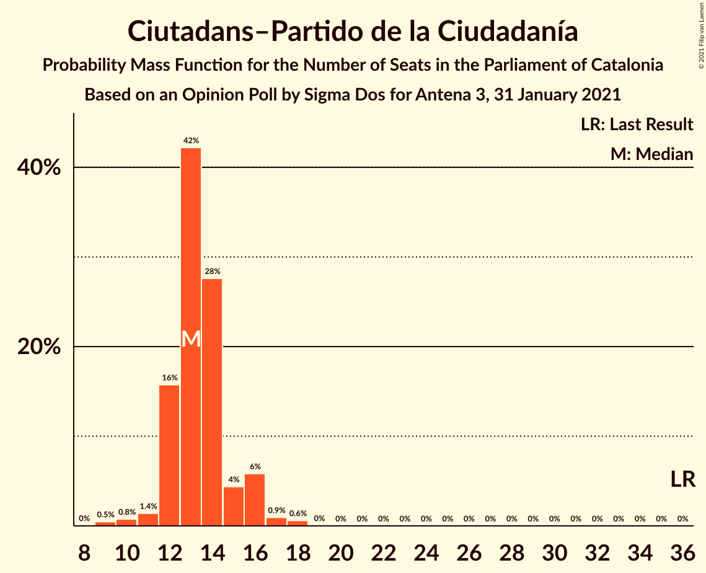

# Opinion Poll by Sigma Dos for Antena 3, 31 January 2021

<a href="#voting-intentions">Voting Intentions</a> | <a href="#seats">Seats</a> | <a href="#coalitions">Coalitions</a> | <a href="#technical-information">Technical Information</a>

## Voting Intentions

### Confidence Intervals

| Party | Last Result | Poll Result | 80% Confidence Interval | 90% Confidence Interval | 95% Confidence Interval | 99% Confidence Interval |
|:-----:|:-----------:|:-----------:|:-----------------------:|:-----------------------:|:-----------------------:|:-----------------------:|
| Partit dels Socialistes de Catalunya (PSC-PSOE) | 13.9% | 22.5% | 20.9–24.3% |20.4–24.8% |20.0–25.2% |19.3–26.1% |
| Esquerra Republicana–Catalunya Sí | 21.4% | 21.2% | 19.6–22.9% |19.2–23.4% |18.8–23.9% |18.0–24.7% |
| Junts per Catalunya | 21.7% | 20.7% | 19.1–22.4% |18.7–22.9% |18.3–23.3% |17.6–24.2% |
| Ciutadans–Partido de la Ciudadanía | 25.4% | 10.3% | 9.2–11.6% |8.8–12.0% |8.6–12.3% |8.0–13.0% |
| Catalunya en Comú–Podem | 7.5% | 7.3% | 6.3–8.5% |6.1–8.8% |5.8–9.1% |5.4–9.7% |
| Partit Popular | 4.2% | 5.6% | 4.8–6.6% |4.5–7.0% |4.3–7.2% |4.0–7.7% |
| Candidatura d’Unitat Popular | 4.5% | 5.3% | 4.5–6.3% |4.3–6.6% |4.1–6.9% |3.7–7.4% |
| Vox | 0.0% | 5.1% | 4.3–6.1% |4.1–6.4% |3.9–6.6% |3.6–7.2% |

*Note:* The poll result column reflects the actual value used in the calculations. Published results may vary slightly, and in addition be rounded to fewer digits.

## Seats

### Confidence Intervals

| Party | Last Result | Median | 80% Confidence Interval | 90% Confidence Interval | 95% Confidence Interval | 99% Confidence Interval |
|:-----:|:-----------:|:------:|:-----------------------:|:-----------------------:|:-----------------------:|:-----------------------:|
| <a href="#partit-dels-socialistes-de-catalunya-(psc-psoe)">Partit dels Socialistes de Catalunya (PSC-PSOE)</a> | 17 | 31 | 27–33 |27–34 |26–34 |26–35 |
| <a href="#esquerra-republicana–catalunya-sí">Esquerra Republicana–Catalunya Sí</a> | 32 | 31 | 29–34 |28–35 |28–35 |27–37 |
| <a href="#junts-per-catalunya">Junts per Catalunya</a> | 34 | 32 | 30–35 |30–36 |29–37 |27–39 |
| <a href="#ciutadans–partido-de-la-ciudadanía">Ciutadans–Partido de la Ciudadanía</a> | 36 | 13 | 12–15 |12–16 |11–16 |9–18 |
| <a href="#catalunya-en-comú–podem">Catalunya en Comú–Podem</a> | 8 | 8 | 7–10 |6–10 |5–11 |5–11 |
| <a href="#partit-popular">Partit Popular</a> | 4 | 7 | 5–8 |5–9 |5–9 |3–10 |
| <a href="#candidatura-d’unitat-popular">Candidatura d’Unitat Popular</a> | 4 | 7 | 4–8 |4–8 |4–9 |4–9 |
| <a href="#vox">Vox</a> | 0 | 6 | 4–7 |3–7 |3–9 |3–9 |

### Partit dels Socialistes de Catalunya (PSC-PSOE)

*For a full overview of the results for this party, see the [Partit dels Socialistes de Catalunya (PSC-PSOE)](party-partitdelssocialistesdecatalunyapsc-psoe.html) page.*

| Number of Seats | Probability | Accumulated | Special Marks |
|:---------------:|:-----------:|:-----------:|:-------------:|
| 17 | 0% | 100% | Last Result |
| 18 | 0% | 100% |  |
| 19 | 0% | 100% |  |
| 20 | 0% | 100% |  |
| 21 | 0% | 100% |  |
| 22 | 0% | 100% |  |
| 23 | 0% | 100% |  |
| 24 | 0% | 100% |  |
| 25 | 0.4% | 100% |  |
| 26 | 4% | 99.5% |  |
| 27 | 7% | 96% |  |
| 28 | 6% | 89% |  |
| 29 | 12% | 82% |  |
| 30 | 18% | 70% |  |
| 31 | 28% | 52% | Median |
| 32 | 13% | 24% |  |
| 33 | 6% | 11% |  |
| 34 | 4% | 5% |  |
| 35 | 0.7% | 1.0% |  |
| 36 | 0.3% | 0.3% |  |
| 37 | 0.1% | 0.1% |  |
| 38 | 0% | 0% |  |

### Esquerra Republicana–Catalunya Sí

*For a full overview of the results for this party, see the [Esquerra Republicana–Catalunya Sí](party-esquerrarepublicana–catalunyasí.html) page.*

| Number of Seats | Probability | Accumulated | Special Marks |
|:---------------:|:-----------:|:-----------:|:-------------:|
| 25 | 0% | 100% |  |
| 26 | 0.2% | 99.9% |  |
| 27 | 1.1% | 99.7% |  |
| 28 | 8% | 98.6% |  |
| 29 | 17% | 91% |  |
| 30 | 12% | 74% |  |
| 31 | 13% | 61% | Median |
| 32 | 17% | 48% | Last Result |
| 33 | 6% | 32% |  |
| 34 | 16% | 25% |  |
| 35 | 7% | 9% |  |
| 36 | 2% | 2% |  |
| 37 | 0.4% | 0.5% |  |
| 38 | 0.1% | 0.1% |  |
| 39 | 0% | 0% |  |

### Junts per Catalunya

*For a full overview of the results for this party, see the [Junts per Catalunya](party-juntspercatalunya.html) page.*

| Number of Seats | Probability | Accumulated | Special Marks |
|:---------------:|:-----------:|:-----------:|:-------------:|
| 26 | 0.3% | 100% |  |
| 27 | 0.4% | 99.6% |  |
| 28 | 0.9% | 99.3% |  |
| 29 | 2% | 98% |  |
| 30 | 6% | 96% |  |
| 31 | 25% | 90% |  |
| 32 | 19% | 65% | Median |
| 33 | 14% | 46% |  |
| 34 | 13% | 32% | Last Result |
| 35 | 9% | 19% |  |
| 36 | 6% | 10% |  |
| 37 | 3% | 4% |  |
| 38 | 0.8% | 1.4% |  |
| 39 | 0.4% | 0.6% |  |
| 40 | 0.1% | 0.2% |  |
| 41 | 0% | 0% |  |

### Ciutadans–Partido de la Ciudadanía

*For a full overview of the results for this party, see the [Ciutadans–Partido de la Ciudadanía](party-ciutadans–partidodelaciudadanía.html) page.*

| Number of Seats | Probability | Accumulated | Special Marks |
|:---------------:|:-----------:|:-----------:|:-------------:|
| 9 | 0.5% | 100% |  |
| 10 | 0.8% | 99.5% |  |
| 11 | 1.4% | 98.7% |  |
| 12 | 16% | 97% |  |
| 13 | 42% | 82% | Median |
| 14 | 28% | 39% |  |
| 15 | 4% | 12% |  |
| 16 | 6% | 7% |  |
| 17 | 0.9% | 2% |  |
| 18 | 0.6% | 0.6% |  |
| 19 | 0% | 0% |  |
| 20 | 0% | 0% |  |
| 21 | 0% | 0% |  |
| 22 | 0% | 0% |  |
| 23 | 0% | 0% |  |
| 24 | 0% | 0% |  |
| 25 | 0% | 0% |  |
| 26 | 0% | 0% |  |
| 27 | 0% | 0% |  |
| 28 | 0% | 0% |  |
| 29 | 0% | 0% |  |
| 30 | 0% | 0% |  |
| 31 | 0% | 0% |  |
| 32 | 0% | 0% |  |
| 33 | 0% | 0% |  |
| 34 | 0% | 0% |  |
| 35 | 0% | 0% |  |
| 36 | 0% | 0% | Last Result |

### Catalunya en Comú–Podem

*For a full overview of the results for this party, see the [Catalunya en Comú–Podem](party-catalunyaencomú–podem.html) page.*

| Number of Seats | Probability | Accumulated | Special Marks |
|:---------------:|:-----------:|:-----------:|:-------------:|
| 5 | 3% | 100% |  |
| 6 | 6% | 97% |  |
| 7 | 20% | 91% |  |
| 8 | 43% | 71% | Last Result, Median |
| 9 | 11% | 28% |  |
| 10 | 13% | 16% |  |
| 11 | 4% | 4% |  |
| 12 | 0.2% | 0.3% |  |
| 13 | 0.1% | 0.1% |  |
| 14 | 0% | 0% |  |

### Partit Popular

*For a full overview of the results for this party, see the [Partit Popular](party-partitpopular.html) page.*

| Number of Seats | Probability | Accumulated | Special Marks |
|:---------------:|:-----------:|:-----------:|:-------------:|
| 3 | 0.9% | 100% |  |
| 4 | 1.1% | 99.1% | Last Result |
| 5 | 13% | 98% |  |
| 6 | 22% | 85% |  |
| 7 | 51% | 63% | Median |
| 8 | 4% | 12% |  |
| 9 | 8% | 9% |  |
| 10 | 0.5% | 0.6% |  |
| 11 | 0.1% | 0.1% |  |
| 12 | 0% | 0% |  |

### Candidatura d’Unitat Popular

*For a full overview of the results for this party, see the [Candidatura d’Unitat Popular](party-candidaturad’unitatpopular.html) page.*

| Number of Seats | Probability | Accumulated | Special Marks |
|:---------------:|:-----------:|:-----------:|:-------------:|
| 2 | 0.1% | 100% |  |
| 3 | 0.4% | 99.9% |  |
| 4 | 11% | 99.5% | Last Result |
| 5 | 8% | 89% |  |
| 6 | 14% | 81% |  |
| 7 | 32% | 67% | Median |
| 8 | 32% | 34% |  |
| 9 | 2% | 3% |  |
| 10 | 0.3% | 0.4% |  |
| 11 | 0.1% | 0.1% |  |
| 12 | 0% | 0% |  |

### Vox

*For a full overview of the results for this party, see the [Vox](party-vox.html) page.*

| Number of Seats | Probability | Accumulated | Special Marks |
|:---------------:|:-----------:|:-----------:|:-------------:|
| 0 | 0% | 100% | Last Result |
| 1 | 0% | 100% |  |
| 2 | 0.1% | 100% |  |
| 3 | 8% | 99.9% |  |
| 4 | 3% | 92% |  |
| 5 | 31% | 89% |  |
| 6 | 23% | 58% | Median |
| 7 | 31% | 35% |  |
| 8 | 1.2% | 4% |  |
| 9 | 3% | 3% |  |
| 10 | 0.1% | 0.1% |  |
| 11 | 0% | 0% |  |

## Coalitions

### Confidence Intervals

| Coalition | Last Result | Median | Majority? | 80% Confidence Interval | 90% Confidence Interval | 95% Confidence Interval | 99% Confidence Interval |
|:---------:|:-----------:|:------:|:---------:|:-----------------------:|:-----------------------:|:-----------------------:|:-----------------------:|
| Esquerra Republicana–Catalunya Sí – Junts per Catalunya – Catalunya en Comú–Podem | 74 | 72 | 97% | 69–75 | 68–76 | 67–77 | 66–79 |
| Esquerra Republicana–Catalunya Sí – Junts per Catalunya – Candidatura d’Unitat Popular | 70 | 71 | 91% | 68–74 | 67–75 | 66–76 | 64–78 |
| Partit dels Socialistes de Catalunya (PSC-PSOE) – Esquerra Republicana–Catalunya Sí – Catalunya en Comú–Podem | 57 | 70 | 82% | 67–73 | 66–74 | 65–75 | 63–76 |
| Esquerra Republicana–Catalunya Sí – Junts per Catalunya | 66 | 64 | 7% | 61–67 | 60–68 | 59–69 | 58–71 |
| Partit dels Socialistes de Catalunya (PSC-PSOE) – Ciutadans–Partido de la Ciudadanía – Catalunya en Comú–Podem – Partit Popular | 65 | 59 | 0% | 55–61 | 54–62 | 53–63 | 52–65 |
| Partit dels Socialistes de Catalunya (PSC-PSOE) – Ciutadans–Partido de la Ciudadanía – Partit Popular – Vox | 57 | 56 | 0% | 53–59 | 52–60 | 51–61 | 50–62 |
| Partit dels Socialistes de Catalunya (PSC-PSOE) – Ciutadans–Partido de la Ciudadanía – Partit Popular | 57 | 51 | 0% | 47–53 | 46–54 | 46–55 | 44–56 |
| Esquerra Republicana–Catalunya Sí – Catalunya en Comú–Podem | 40 | 40 | 0% | 36–43 | 36–43 | 35–44 | 34–45 |

### Esquerra Republicana–Catalunya Sí – Junts per Catalunya – Catalunya en Comú–Podem

| Number of Seats | Probability | Accumulated | Special Marks |
|:---------------:|:-----------:|:-----------:|:-------------:|
| 64 | 0% | 100% |  |
| 65 | 0.2% | 99.9% |  |
| 66 | 0.6% | 99.7% |  |
| 67 | 3% | 99.2% |  |
| 68 | 3% | 97% | Majority |
| 69 | 10% | 94% |  |
| 70 | 13% | 84% |  |
| 71 | 13% | 71% | Median |
| 72 | 12% | 58% |  |
| 73 | 16% | 45% |  |
| 74 | 13% | 30% | Last Result |
| 75 | 9% | 17% |  |
| 76 | 4% | 9% |  |
| 77 | 3% | 4% |  |
| 78 | 1.2% | 2% |  |
| 79 | 0.5% | 0.7% |  |
| 80 | 0.2% | 0.2% |  |
| 81 | 0% | 0.1% |  |
| 82 | 0% | 0% |  |

### Esquerra Republicana–Catalunya Sí – Junts per Catalunya – Candidatura d’Unitat Popular

| Number of Seats | Probability | Accumulated | Special Marks |
|:---------------:|:-----------:|:-----------:|:-------------:|
| 63 | 0.1% | 100% |  |
| 64 | 0.4% | 99.8% |  |
| 65 | 0.9% | 99.5% |  |
| 66 | 2% | 98.6% |  |
| 67 | 6% | 97% |  |
| 68 | 12% | 91% | Majority |
| 69 | 12% | 79% |  |
| 70 | 16% | 68% | Last Result, Median |
| 71 | 12% | 52% |  |
| 72 | 13% | 39% |  |
| 73 | 12% | 27% |  |
| 74 | 9% | 15% |  |
| 75 | 3% | 6% |  |
| 76 | 2% | 3% |  |
| 77 | 0.8% | 1.3% |  |
| 78 | 0.4% | 0.5% |  |
| 79 | 0.1% | 0.1% |  |
| 80 | 0% | 0% |  |

### Partit dels Socialistes de Catalunya (PSC-PSOE) – Esquerra Republicana–Catalunya Sí – Catalunya en Comú–Podem

| Number of Seats | Probability | Accumulated | Special Marks |
|:---------------:|:-----------:|:-----------:|:-------------:|
| 57 | 0% | 100% | Last Result |
| 58 | 0% | 100% |  |
| 59 | 0% | 100% |  |
| 60 | 0% | 100% |  |
| 61 | 0% | 100% |  |
| 62 | 0.1% | 100% |  |
| 63 | 0.6% | 99.8% |  |
| 64 | 1.0% | 99.2% |  |
| 65 | 2% | 98% |  |
| 66 | 4% | 97% |  |
| 67 | 10% | 93% |  |
| 68 | 15% | 82% | Majority |
| 69 | 13% | 67% |  |
| 70 | 18% | 54% | Median |
| 71 | 10% | 36% |  |
| 72 | 12% | 27% |  |
| 73 | 9% | 15% |  |
| 74 | 3% | 6% |  |
| 75 | 1.2% | 3% |  |
| 76 | 1.2% | 1.4% |  |
| 77 | 0.1% | 0.2% |  |
| 78 | 0.1% | 0.1% |  |
| 79 | 0% | 0% |  |

### Esquerra Republicana–Catalunya Sí – Junts per Catalunya

| Number of Seats | Probability | Accumulated | Special Marks |
|:---------------:|:-----------:|:-----------:|:-------------:|
| 56 | 0.1% | 100% |  |
| 57 | 0.2% | 99.9% |  |
| 58 | 0.6% | 99.7% |  |
| 59 | 3% | 99.2% |  |
| 60 | 4% | 96% |  |
| 61 | 9% | 92% |  |
| 62 | 12% | 83% |  |
| 63 | 13% | 71% | Median |
| 64 | 14% | 58% |  |
| 65 | 14% | 44% |  |
| 66 | 16% | 31% | Last Result |
| 67 | 7% | 14% |  |
| 68 | 3% | 7% | Majority |
| 69 | 2% | 4% |  |
| 70 | 0.5% | 2% |  |
| 71 | 0.9% | 1.1% |  |
| 72 | 0.2% | 0.2% |  |
| 73 | 0.1% | 0.1% |  |
| 74 | 0% | 0% |  |

### Partit dels Socialistes de Catalunya (PSC-PSOE) – Ciutadans–Partido de la Ciudadanía – Catalunya en Comú–Podem – Partit Popular

| Number of Seats | Probability | Accumulated | Special Marks |
|:---------------:|:-----------:|:-----------:|:-------------:|
| 50 | 0.1% | 100% |  |
| 51 | 0.2% | 99.9% |  |
| 52 | 1.1% | 99.7% |  |
| 53 | 1.2% | 98.6% |  |
| 54 | 3% | 97% |  |
| 55 | 4% | 94% |  |
| 56 | 12% | 90% |  |
| 57 | 13% | 78% |  |
| 58 | 12% | 65% |  |
| 59 | 20% | 52% | Median |
| 60 | 13% | 33% |  |
| 61 | 12% | 20% |  |
| 62 | 4% | 8% |  |
| 63 | 2% | 4% |  |
| 64 | 1.2% | 2% |  |
| 65 | 0.4% | 0.6% | Last Result |
| 66 | 0.2% | 0.2% |  |
| 67 | 0% | 0% |  |

### Partit dels Socialistes de Catalunya (PSC-PSOE) – Ciutadans–Partido de la Ciudadanía – Partit Popular – Vox

| Number of Seats | Probability | Accumulated | Special Marks |
|:---------------:|:-----------:|:-----------:|:-------------:|
| 48 | 0.1% | 100% |  |
| 49 | 0.3% | 99.9% |  |
| 50 | 0.6% | 99.5% |  |
| 51 | 2% | 98.9% |  |
| 52 | 4% | 97% |  |
| 53 | 7% | 92% |  |
| 54 | 12% | 85% |  |
| 55 | 11% | 73% |  |
| 56 | 12% | 62% |  |
| 57 | 21% | 50% | Last Result, Median |
| 58 | 13% | 29% |  |
| 59 | 9% | 17% |  |
| 60 | 4% | 7% |  |
| 61 | 2% | 3% |  |
| 62 | 0.7% | 1.2% |  |
| 63 | 0.3% | 0.5% |  |
| 64 | 0.1% | 0.1% |  |
| 65 | 0% | 0% |  |

### Partit dels Socialistes de Catalunya (PSC-PSOE) – Ciutadans–Partido de la Ciudadanía – Partit Popular

| Number of Seats | Probability | Accumulated | Special Marks |
|:---------------:|:-----------:|:-----------:|:-------------:|
| 43 | 0.2% | 100% |  |
| 44 | 1.0% | 99.7% |  |
| 45 | 1.0% | 98.7% |  |
| 46 | 4% | 98% |  |
| 47 | 6% | 94% |  |
| 48 | 8% | 88% |  |
| 49 | 15% | 80% |  |
| 50 | 15% | 66% |  |
| 51 | 20% | 51% | Median |
| 52 | 14% | 31% |  |
| 53 | 10% | 17% |  |
| 54 | 4% | 7% |  |
| 55 | 2% | 3% |  |
| 56 | 1.1% | 2% |  |
| 57 | 0.3% | 0.5% | Last Result |
| 58 | 0.2% | 0.2% |  |
| 59 | 0% | 0% |  |

### Esquerra Republicana–Catalunya Sí – Catalunya en Comú–Podem

| Number of Seats | Probability | Accumulated | Special Marks |
|:---------------:|:-----------:|:-----------:|:-------------:|
| 33 | 0.2% | 100% |  |
| 34 | 0.6% | 99.8% |  |
| 35 | 2% | 99.2% |  |
| 36 | 9% | 97% |  |
| 37 | 14% | 88% |  |
| 38 | 10% | 74% |  |
| 39 | 13% | 63% | Median |
| 40 | 13% | 50% | Last Result |
| 41 | 15% | 37% |  |
| 42 | 12% | 22% |  |
| 43 | 5% | 10% |  |
| 44 | 3% | 5% |  |
| 45 | 1.2% | 2% |  |
| 46 | 0.2% | 0.4% |  |
| 47 | 0.1% | 0.1% |  |
| 48 | 0% | 0% |  |

## Technical Information

### Opinion Poll

+ **Polling firm:** Sigma Dos
+ **Commissioner(s):** Antena 3
+ **Fieldwork period:** 31 January 2021

### Calculations

+ **Sample size:** 1000
+ **Simulations done:** 1,048,576
+ **Error estimate:** 1.68%

