# Opinion Poll by SocioMétrica for El Español, 18–31 January 2021

<a href="#voting-intentions">Voting Intentions</a> | <a href="#seats">Seats</a> | <a href="#coalitions">Coalitions</a> | <a href="#technical-information">Technical Information</a>

## Voting Intentions

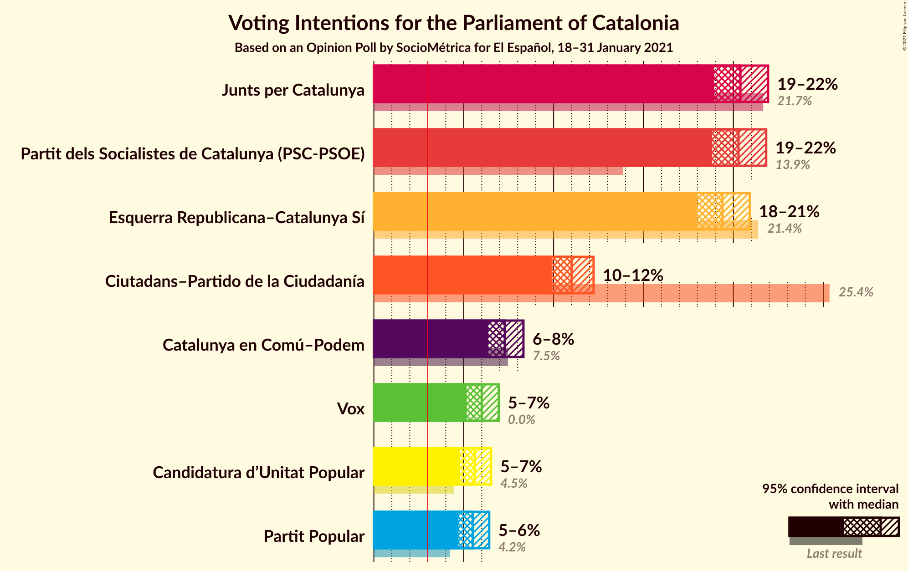

### Confidence Intervals

| Party | Last Result | Poll Result | 80% Confidence Interval | 90% Confidence Interval | 95% Confidence Interval | 99% Confidence Interval |
|:-----:|:-----------:|:-----------:|:-----------------------:|:-----------------------:|:-----------------------:|:-----------------------:|
| Junts per Catalunya | 21.7% | 20.4% | 19.4–21.4% |19.2–21.7% |18.9–21.9% |18.5–22.4% |
| Partit dels Socialistes de Catalunya (PSC-PSOE) | 13.9% | 20.3% | 19.3–21.3% |19.1–21.6% |18.8–21.8% |18.4–22.3% |
| Esquerra Republicana–Catalunya Sí | 21.4% | 19.4% | 18.5–20.4% |18.2–20.7% |18.0–20.9% |17.5–21.4% |
| Ciutadans–Partido de la Ciudadanía | 25.4% | 11.0% | 10.3–11.8% |10.1–12.0% |9.9–12.2% |9.6–12.6% |
| Catalunya en Comú–Podem | 7.5% | 7.3% | 6.7–8.0% |6.5–8.2% |6.4–8.3% |6.1–8.6% |
| Vox | 0.0% | 6.0% | 5.5–6.6% |5.3–6.8% |5.2–7.0% |4.9–7.3% |
| Candidatura d’Unitat Popular | 4.5% | 5.6% | 5.1–6.2% |4.9–6.4% |4.8–6.5% |4.6–6.8% |
| Partit Popular | 4.2% | 5.5% | 5.0–6.1% |4.8–6.3% |4.7–6.4% |4.5–6.7% |

*Note:* The poll result column reflects the actual value used in the calculations. Published results may vary slightly, and in addition be rounded to fewer digits.

## Seats

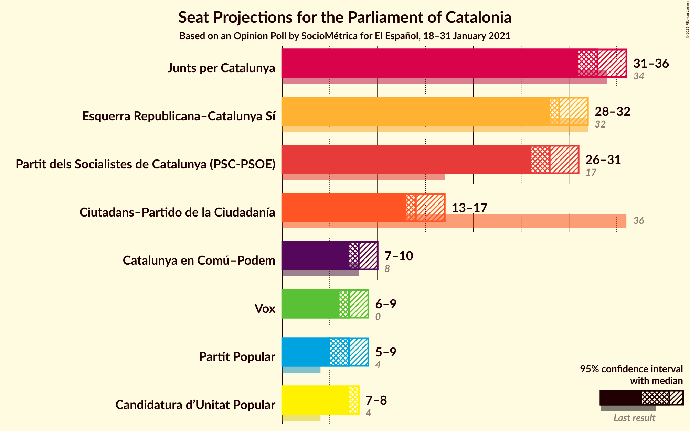

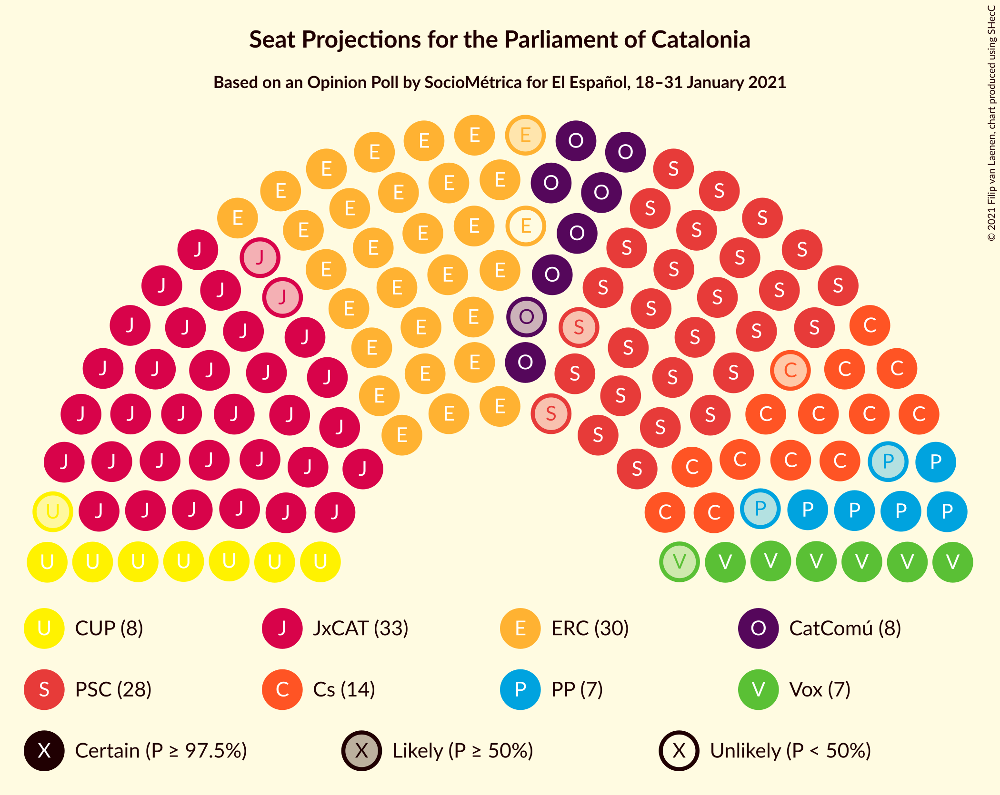

### Confidence Intervals

| Party | Last Result | Median | 80% Confidence Interval | 90% Confidence Interval | 95% Confidence Interval | 99% Confidence Interval |
|:-----:|:-----------:|:------:|:-----------------------:|:-----------------------:|:-----------------------:|:-----------------------:|
| <a href="#junts-per-catalunya">Junts per Catalunya</a> | 34 | 33 | 31–35 |31–35 |31–36 |30–37 |
| <a href="#partit-dels-socialistes-de-catalunya-(psc-psoe)">Partit dels Socialistes de Catalunya (PSC-PSOE)</a> | 17 | 28 | 26–30 |26–30 |26–31 |25–31 |
| <a href="#esquerra-republicana–catalunya-sí">Esquerra Republicana–Catalunya Sí</a> | 32 | 29 | 28–31 |28–32 |28–32 |27–33 |
| <a href="#ciutadans–partido-de-la-ciudadanía">Ciutadans–Partido de la Ciudadanía</a> | 36 | 14 | 13–16 |13–16 |13–17 |13–18 |
| <a href="#catalunya-en-comú–podem">Catalunya en Comú–Podem</a> | 8 | 8 | 7–10 |7–10 |7–10 |7–11 |
| <a href="#vox">Vox</a> | 0 | 7 | 7–9 |7–9 |6–9 |6–9 |
| <a href="#candidatura-d’unitat-popular">Candidatura d’Unitat Popular</a> | 4 | 8 | 7–8 |7–8 |7–8 |5–9 |
| <a href="#partit-popular">Partit Popular</a> | 4 | 7 | 6–7 |5–7 |5–9 |5–9 |

### Junts per Catalunya

*For a full overview of the results for this party, see the [Junts per Catalunya](party-juntspercatalunya.html) page.*

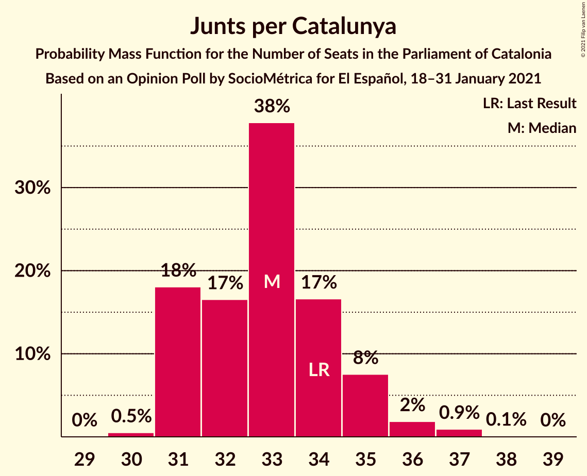

| Number of Seats | Probability | Accumulated | Special Marks |
|:---------------:|:-----------:|:-----------:|:-------------:|
| 30 | 0.5% | 100% |  |
| 31 | 18% | 99.5% |  |
| 32 | 17% | 81% |  |
| 33 | 38% | 65% | Median |
| 34 | 17% | 27% | Last Result |
| 35 | 8% | 10% |  |
| 36 | 2% | 3% |  |
| 37 | 0.9% | 1.1% |  |
| 38 | 0.1% | 0.1% |  |
| 39 | 0% | 0% |  |

### Partit dels Socialistes de Catalunya (PSC-PSOE)

*For a full overview of the results for this party, see the [Partit dels Socialistes de Catalunya (PSC-PSOE)](party-partitdelssocialistesdecatalunyapsc-psoe.html) page.*

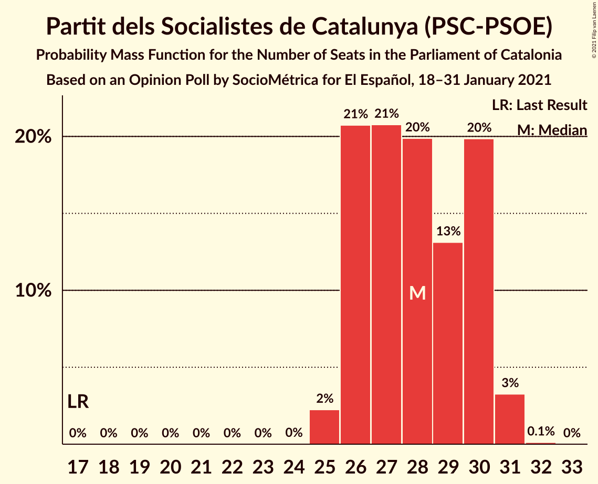

| Number of Seats | Probability | Accumulated | Special Marks |
|:---------------:|:-----------:|:-----------:|:-------------:|
| 17 | 0% | 100% | Last Result |
| 18 | 0% | 100% |  |
| 19 | 0% | 100% |  |
| 20 | 0% | 100% |  |
| 21 | 0% | 100% |  |
| 22 | 0% | 100% |  |
| 23 | 0% | 100% |  |
| 24 | 0% | 100% |  |
| 25 | 2% | 100% |  |
| 26 | 21% | 98% |  |
| 27 | 21% | 77% |  |
| 28 | 20% | 56% | Median |
| 29 | 13% | 36% |  |
| 30 | 20% | 23% |  |
| 31 | 3% | 3% |  |
| 32 | 0.1% | 0.1% |  |
| 33 | 0% | 0% |  |

### Esquerra Republicana–Catalunya Sí

*For a full overview of the results for this party, see the [Esquerra Republicana–Catalunya Sí](party-esquerrarepublicana–catalunyasí.html) page.*

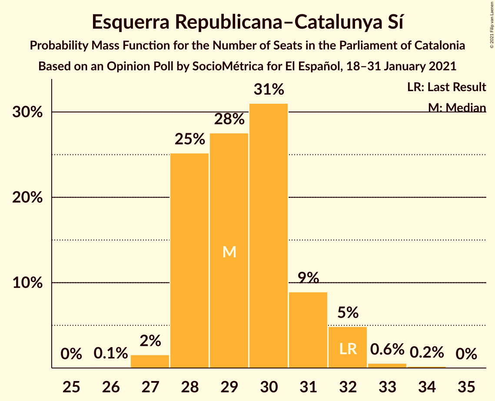

| Number of Seats | Probability | Accumulated | Special Marks |
|:---------------:|:-----------:|:-----------:|:-------------:|
| 26 | 0.1% | 100% |  |
| 27 | 2% | 99.9% |  |
| 28 | 25% | 98% |  |
| 29 | 28% | 73% | Median |
| 30 | 31% | 46% |  |
| 31 | 9% | 15% |  |
| 32 | 5% | 6% | Last Result |
| 33 | 0.6% | 0.8% |  |
| 34 | 0.2% | 0.2% |  |
| 35 | 0% | 0% |  |

### Ciutadans–Partido de la Ciudadanía

*For a full overview of the results for this party, see the [Ciutadans–Partido de la Ciudadanía](party-ciutadans–partidodelaciudadanía.html) page.*

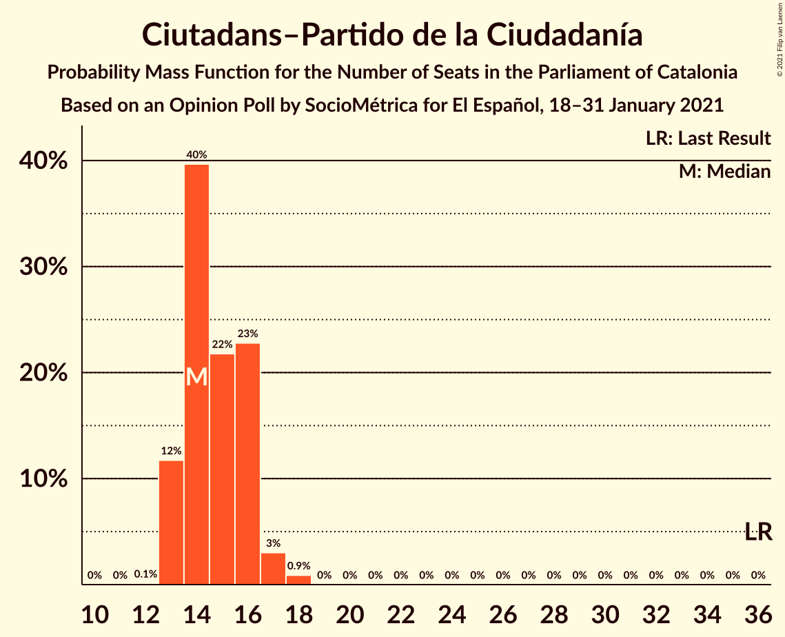

| Number of Seats | Probability | Accumulated | Special Marks |
|:---------------:|:-----------:|:-----------:|:-------------:|
| 12 | 0.1% | 100% |  |
| 13 | 12% | 99.9% |  |
| 14 | 40% | 88% | Median |
| 15 | 22% | 48% |  |
| 16 | 23% | 27% |  |
| 17 | 3% | 4% |  |
| 18 | 0.9% | 0.9% |  |
| 19 | 0% | 0% |  |
| 20 | 0% | 0% |  |
| 21 | 0% | 0% |  |
| 22 | 0% | 0% |  |
| 23 | 0% | 0% |  |
| 24 | 0% | 0% |  |
| 25 | 0% | 0% |  |
| 26 | 0% | 0% |  |
| 27 | 0% | 0% |  |
| 28 | 0% | 0% |  |
| 29 | 0% | 0% |  |
| 30 | 0% | 0% |  |
| 31 | 0% | 0% |  |
| 32 | 0% | 0% |  |
| 33 | 0% | 0% |  |
| 34 | 0% | 0% |  |
| 35 | 0% | 0% |  |
| 36 | 0% | 0% | Last Result |

### Catalunya en Comú–Podem

*For a full overview of the results for this party, see the [Catalunya en Comú–Podem](party-catalunyaencomú–podem.html) page.*

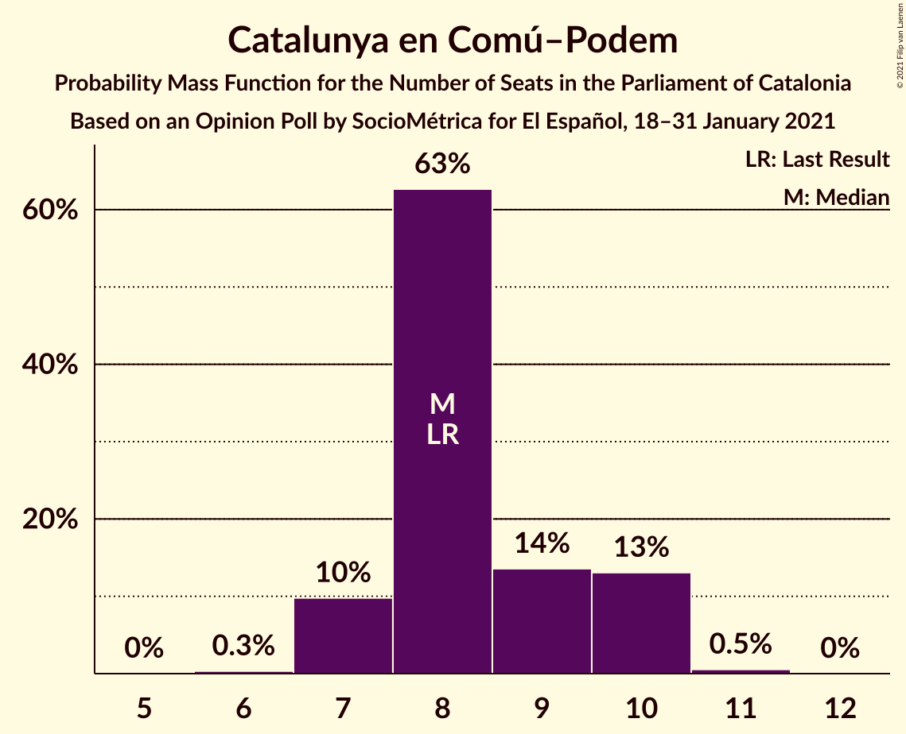

| Number of Seats | Probability | Accumulated | Special Marks |
|:---------------:|:-----------:|:-----------:|:-------------:|
| 6 | 0.3% | 100% |  |
| 7 | 10% | 99.6% |  |
| 8 | 63% | 90% | Last Result, Median |
| 9 | 14% | 27% |  |
| 10 | 13% | 14% |  |
| 11 | 0.5% | 0.5% |  |
| 12 | 0% | 0% |  |

### Vox

*For a full overview of the results for this party, see the [Vox](party-vox.html) page.*

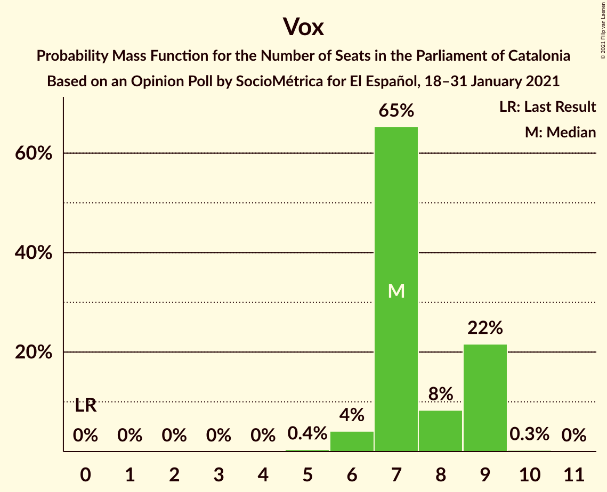

| Number of Seats | Probability | Accumulated | Special Marks |
|:---------------:|:-----------:|:-----------:|:-------------:|
| 0 | 0% | 100% | Last Result |
| 1 | 0% | 100% |  |
| 2 | 0% | 100% |  |
| 3 | 0% | 100% |  |
| 4 | 0% | 100% |  |
| 5 | 0.4% | 100% |  |
| 6 | 4% | 99.6% |  |
| 7 | 65% | 96% | Median |
| 8 | 8% | 30% |  |
| 9 | 22% | 22% |  |
| 10 | 0.3% | 0.3% |  |
| 11 | 0% | 0% |  |

### Candidatura d’Unitat Popular

*For a full overview of the results for this party, see the [Candidatura d’Unitat Popular](party-candidaturad’unitatpopular.html) page.*

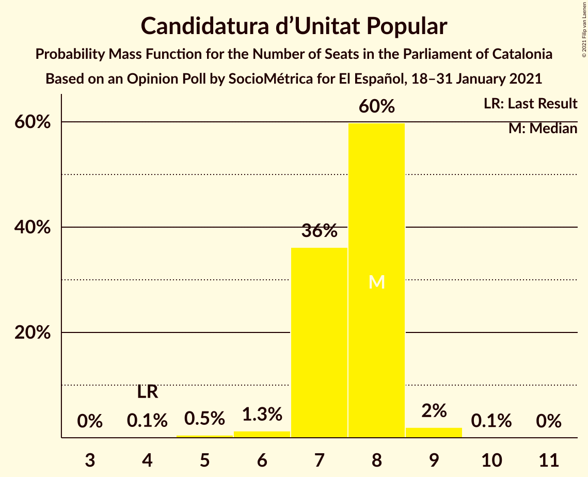

| Number of Seats | Probability | Accumulated | Special Marks |
|:---------------:|:-----------:|:-----------:|:-------------:|
| 4 | 0.1% | 100% | Last Result |
| 5 | 0.5% | 99.9% |  |
| 6 | 1.3% | 99.4% |  |
| 7 | 36% | 98% |  |
| 8 | 60% | 62% | Median |
| 9 | 2% | 2% |  |
| 10 | 0.1% | 0.1% |  |
| 11 | 0% | 0% |  |

### Partit Popular

*For a full overview of the results for this party, see the [Partit Popular](party-partitpopular.html) page.*

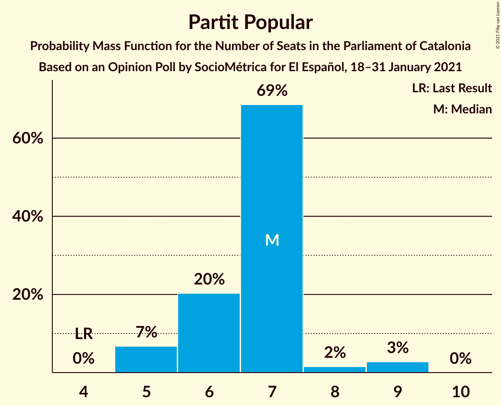

| Number of Seats | Probability | Accumulated | Special Marks |
|:---------------:|:-----------:|:-----------:|:-------------:|
| 4 | 0% | 100% | Last Result |
| 5 | 7% | 100% |  |
| 6 | 20% | 93% |  |
| 7 | 69% | 73% | Median |
| 8 | 2% | 4% |  |
| 9 | 3% | 3% |  |
| 10 | 0% | 0% |  |

## Coalitions

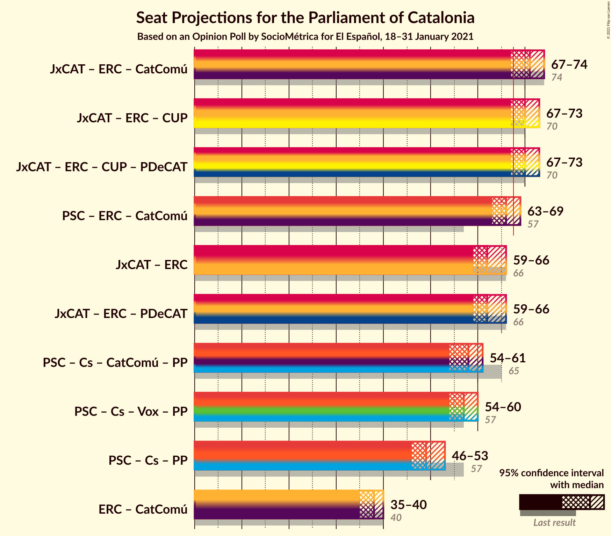

### Confidence Intervals

| Coalition | Last Result | Median | Majority? | 80% Confidence Interval | 90% Confidence Interval | 95% Confidence Interval | 99% Confidence Interval |
|:---------:|:-----------:|:------:|:---------:|:-----------------------:|:-----------------------:|:-----------------------:|:-----------------------:|
| Junts per Catalunya – Esquerra Republicana–Catalunya Sí – Catalunya en Comú–Podem | 74 | 71 | 96% | 68–73 | 68–73 | 67–74 | 67–75 |
| Junts per Catalunya – Esquerra Republicana–Catalunya Sí – Candidatura d’Unitat Popular | 70 | 70 | 91% | 68–72 | 67–73 | 67–73 | 66–74 |
| Partit dels Socialistes de Catalunya (PSC-PSOE) – Esquerra Republicana–Catalunya Sí – Catalunya en Comú–Podem | 57 | 66 | 7% | 64–67 | 63–68 | 63–69 | 62–69 |
| Junts per Catalunya – Esquerra Republicana–Catalunya Sí | 66 | 62 | 0.1% | 60–64 | 60–65 | 59–66 | 59–66 |
| Partit dels Socialistes de Catalunya (PSC-PSOE) – Ciutadans–Partido de la Ciudadanía – Catalunya en Comú–Podem – Partit Popular | 65 | 58 | 0% | 55–60 | 55–60 | 54–61 | 53–62 |
| Partit dels Socialistes de Catalunya (PSC-PSOE) – Ciutadans–Partido de la Ciudadanía – Vox – Partit Popular | 57 | 57 | 0% | 54–59 | 54–60 | 54–60 | 53–61 |
| Partit dels Socialistes de Catalunya (PSC-PSOE) – Ciutadans–Partido de la Ciudadanía – Partit Popular | 57 | 49 | 0% | 47–52 | 47–52 | 46–53 | 45–53 |
| Esquerra Republicana–Catalunya Sí – Catalunya en Comú–Podem | 40 | 38 | 0% | 36–40 | 36–40 | 35–40 | 35–41 |

### Junts per Catalunya – Esquerra Republicana–Catalunya Sí – Catalunya en Comú–Podem

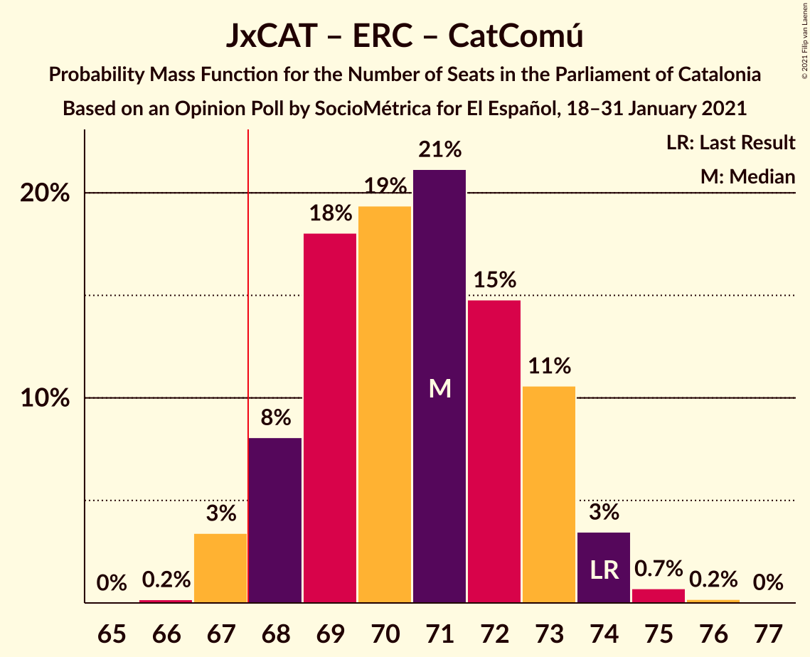

| Number of Seats | Probability | Accumulated | Special Marks |
|:---------------:|:-----------:|:-----------:|:-------------:|
| 66 | 0.2% | 100% |  |
| 67 | 3% | 99.8% |  |
| 68 | 8% | 96% | Majority |
| 69 | 18% | 88% |  |
| 70 | 19% | 70% | Median |
| 71 | 21% | 51% |  |
| 72 | 15% | 30% |  |
| 73 | 11% | 15% |  |
| 74 | 3% | 4% | Last Result |
| 75 | 0.7% | 0.9% |  |
| 76 | 0.2% | 0.2% |  |
| 77 | 0% | 0% |  |

### Junts per Catalunya – Esquerra Republicana–Catalunya Sí – Candidatura d’Unitat Popular

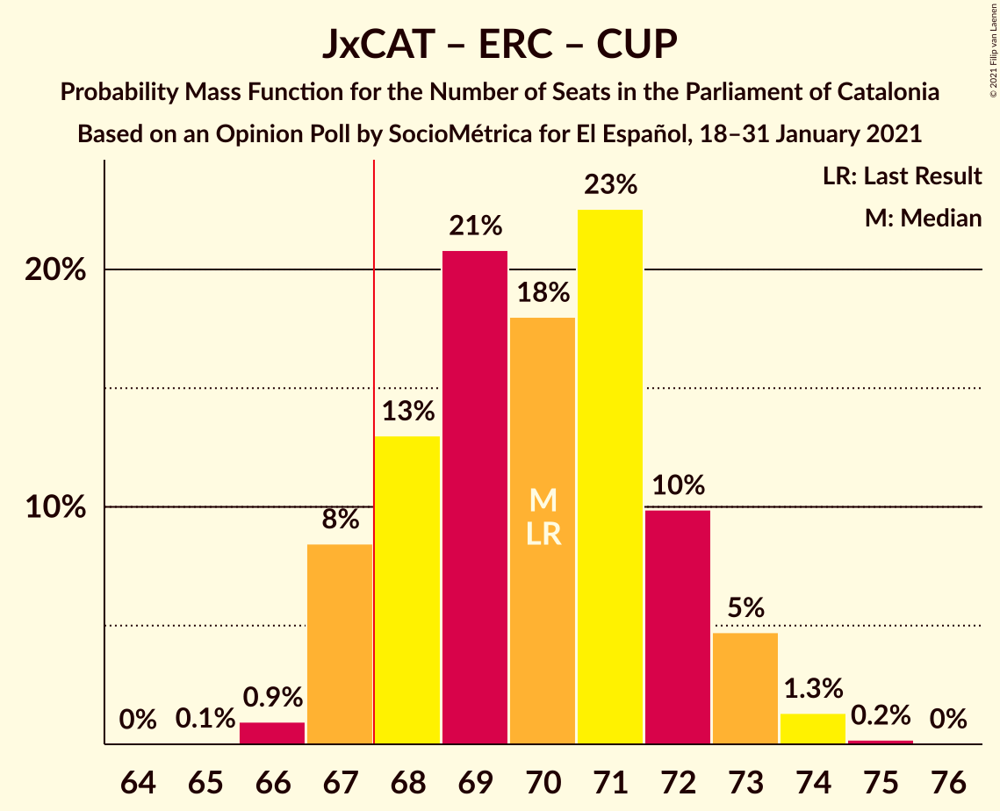

| Number of Seats | Probability | Accumulated | Special Marks |
|:---------------:|:-----------:|:-----------:|:-------------:|
| 65 | 0.1% | 100% |  |
| 66 | 0.9% | 99.9% |  |
| 67 | 8% | 99.0% |  |
| 68 | 13% | 91% | Majority |
| 69 | 21% | 78% |  |
| 70 | 18% | 57% | Last Result, Median |
| 71 | 23% | 39% |  |
| 72 | 10% | 16% |  |
| 73 | 5% | 6% |  |
| 74 | 1.3% | 2% |  |
| 75 | 0.2% | 0.2% |  |
| 76 | 0% | 0% |  |

### Partit dels Socialistes de Catalunya (PSC-PSOE) – Esquerra Republicana–Catalunya Sí – Catalunya en Comú–Podem

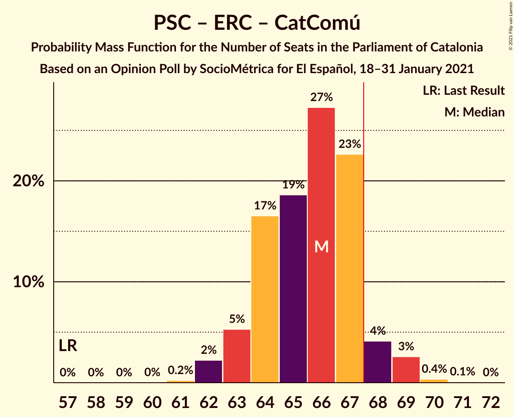

| Number of Seats | Probability | Accumulated | Special Marks |
|:---------------:|:-----------:|:-----------:|:-------------:|
| 57 | 0% | 100% | Last Result |
| 58 | 0% | 100% |  |
| 59 | 0% | 100% |  |
| 60 | 0% | 100% |  |
| 61 | 0.2% | 100% |  |
| 62 | 2% | 99.7% |  |
| 63 | 5% | 98% |  |
| 64 | 17% | 92% |  |
| 65 | 19% | 76% | Median |
| 66 | 27% | 57% |  |
| 67 | 23% | 30% |  |
| 68 | 4% | 7% | Majority |
| 69 | 3% | 3% |  |
| 70 | 0.4% | 0.5% |  |
| 71 | 0.1% | 0.1% |  |
| 72 | 0% | 0% |  |

### Junts per Catalunya – Esquerra Republicana–Catalunya Sí

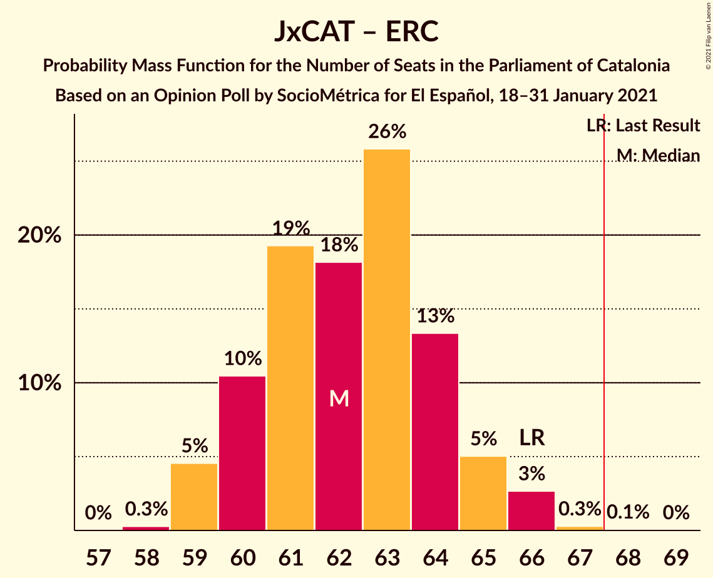

| Number of Seats | Probability | Accumulated | Special Marks |
|:---------------:|:-----------:|:-----------:|:-------------:|
| 58 | 0.3% | 100% |  |
| 59 | 5% | 99.7% |  |
| 60 | 10% | 95% |  |
| 61 | 19% | 85% |  |
| 62 | 18% | 65% | Median |
| 63 | 26% | 47% |  |
| 64 | 13% | 21% |  |
| 65 | 5% | 8% |  |
| 66 | 3% | 3% | Last Result |
| 67 | 0.3% | 0.4% |  |
| 68 | 0.1% | 0.1% | Majority |
| 69 | 0% | 0% |  |

### Partit dels Socialistes de Catalunya (PSC-PSOE) – Ciutadans–Partido de la Ciudadanía – Catalunya en Comú–Podem – Partit Popular

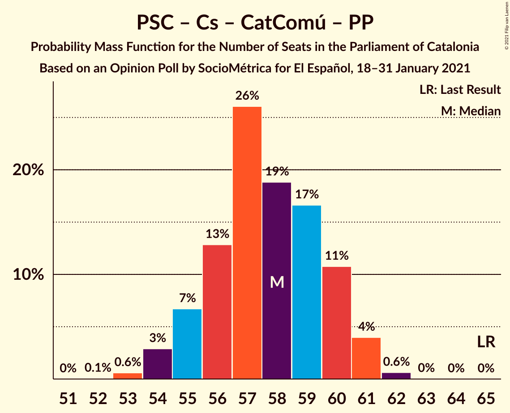

| Number of Seats | Probability | Accumulated | Special Marks |
|:---------------:|:-----------:|:-----------:|:-------------:|
| 52 | 0.1% | 100% |  |
| 53 | 0.6% | 99.9% |  |
| 54 | 3% | 99.3% |  |
| 55 | 7% | 96% |  |
| 56 | 13% | 90% |  |
| 57 | 26% | 77% | Median |
| 58 | 19% | 51% |  |
| 59 | 17% | 32% |  |
| 60 | 11% | 15% |  |
| 61 | 4% | 5% |  |
| 62 | 0.6% | 0.7% |  |
| 63 | 0% | 0% |  |
| 64 | 0% | 0% |  |
| 65 | 0% | 0% | Last Result |

### Partit dels Socialistes de Catalunya (PSC-PSOE) – Ciutadans–Partido de la Ciudadanía – Vox – Partit Popular

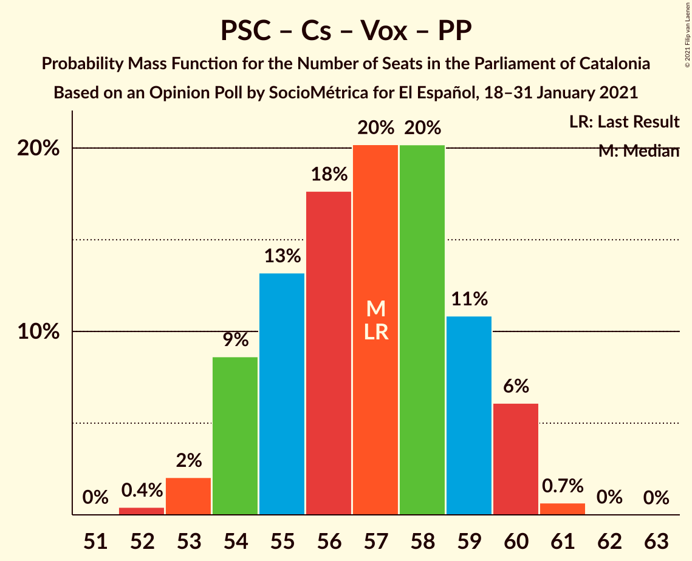

| Number of Seats | Probability | Accumulated | Special Marks |
|:---------------:|:-----------:|:-----------:|:-------------:|
| 52 | 0.4% | 100% |  |
| 53 | 2% | 99.5% |  |
| 54 | 9% | 98% |  |
| 55 | 13% | 89% |  |
| 56 | 18% | 76% | Median |
| 57 | 20% | 58% | Last Result |
| 58 | 20% | 38% |  |
| 59 | 11% | 18% |  |
| 60 | 6% | 7% |  |
| 61 | 0.7% | 0.7% |  |
| 62 | 0% | 0.1% |  |
| 63 | 0% | 0% |  |

### Partit dels Socialistes de Catalunya (PSC-PSOE) – Ciutadans–Partido de la Ciudadanía – Partit Popular

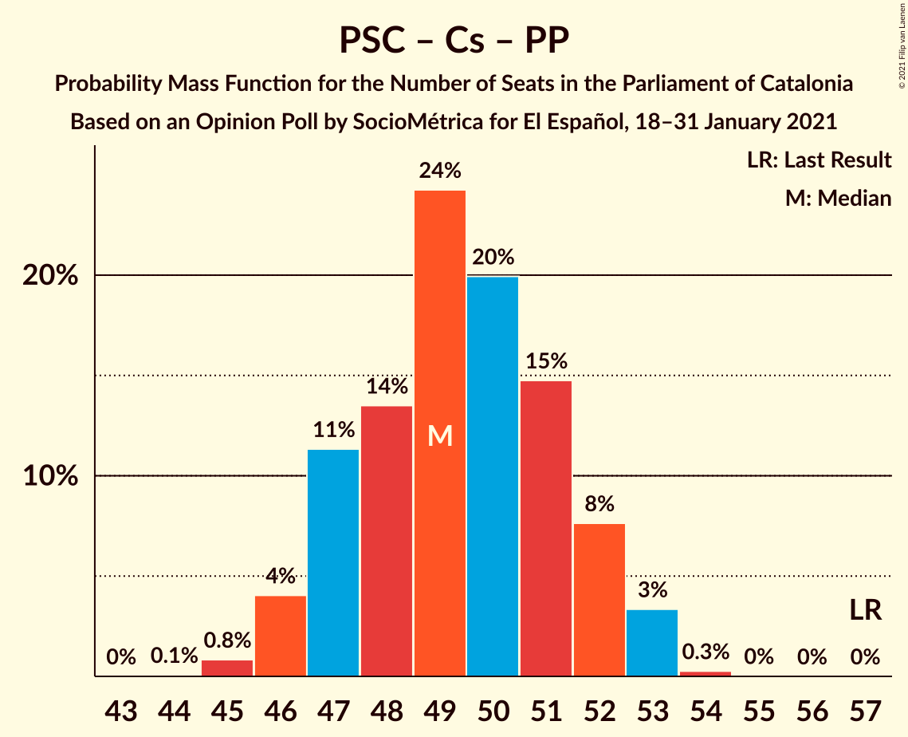

| Number of Seats | Probability | Accumulated | Special Marks |
|:---------------:|:-----------:|:-----------:|:-------------:|
| 44 | 0.1% | 100% |  |
| 45 | 0.8% | 99.9% |  |
| 46 | 4% | 99.1% |  |
| 47 | 11% | 95% |  |
| 48 | 14% | 84% |  |
| 49 | 24% | 70% | Median |
| 50 | 20% | 46% |  |
| 51 | 15% | 26% |  |
| 52 | 8% | 11% |  |
| 53 | 3% | 4% |  |
| 54 | 0.3% | 0.3% |  |
| 55 | 0% | 0% |  |
| 56 | 0% | 0% |  |
| 57 | 0% | 0% | Last Result |

### Esquerra Republicana–Catalunya Sí – Catalunya en Comú–Podem

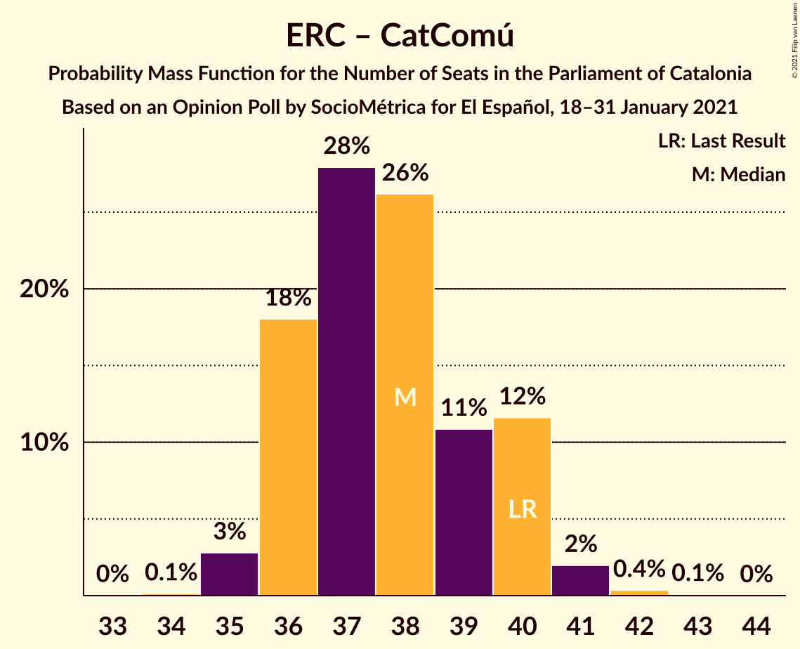

| Number of Seats | Probability | Accumulated | Special Marks |
|:---------------:|:-----------:|:-----------:|:-------------:|
| 34 | 0.1% | 100% |  |
| 35 | 3% | 99.8% |  |
| 36 | 18% | 97% |  |
| 37 | 28% | 79% | Median |
| 38 | 26% | 51% |  |
| 39 | 11% | 25% |  |
| 40 | 12% | 14% | Last Result |
| 41 | 2% | 2% |  |
| 42 | 0.4% | 0.4% |  |
| 43 | 0.1% | 0.1% |  |
| 44 | 0% | 0% |  |

## Technical Information

### Opinion Poll

+ **Polling firm:** SocioMétrica
+ **Commissioner(s):** El Español
+ **Fieldwork period:** 18–31 January 2021

### Calculations

+ **Sample size:** 2800
+ **Simulations done:** 1,048,576
+ **Error estimate:** 0.62%

