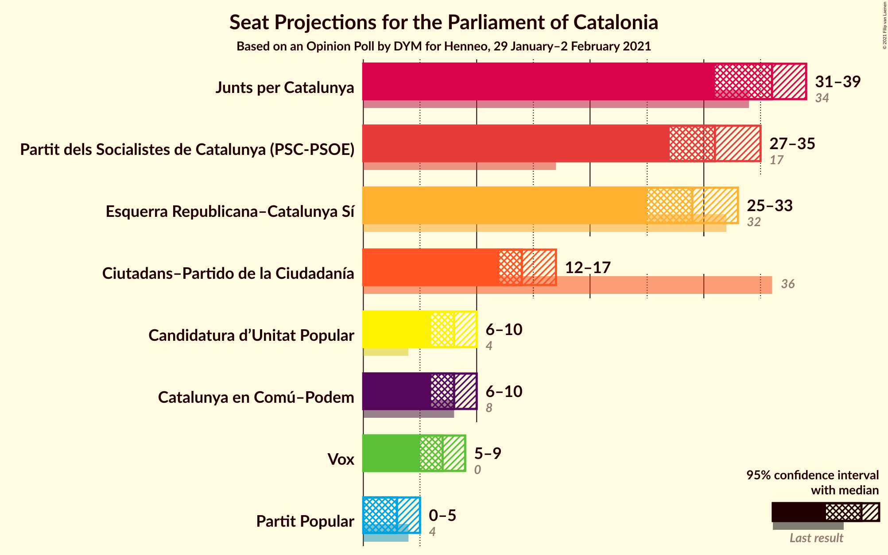
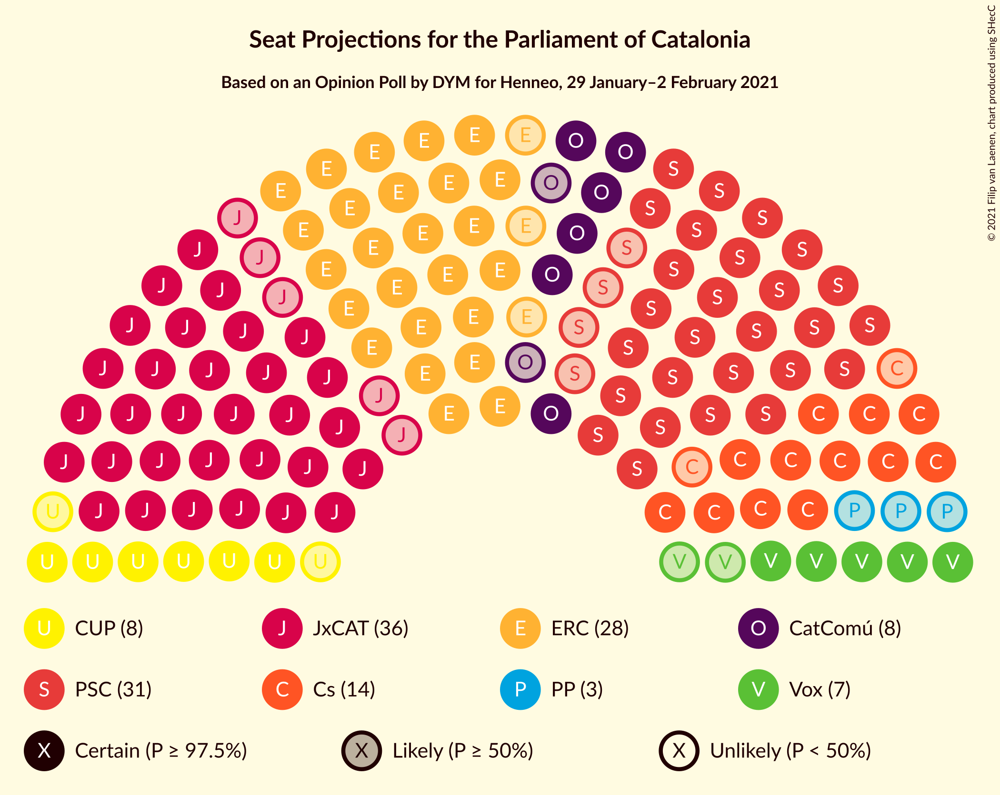
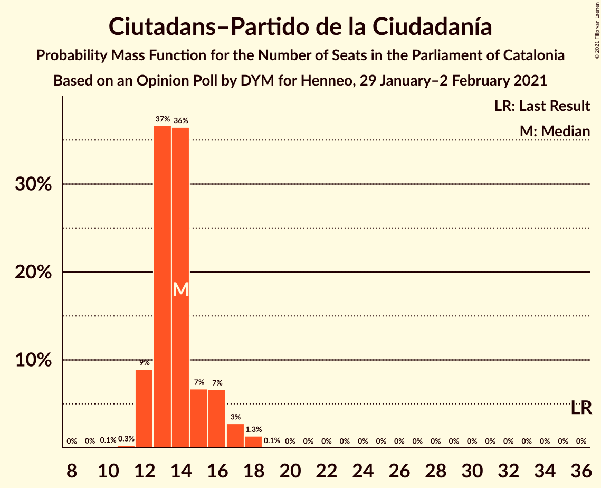
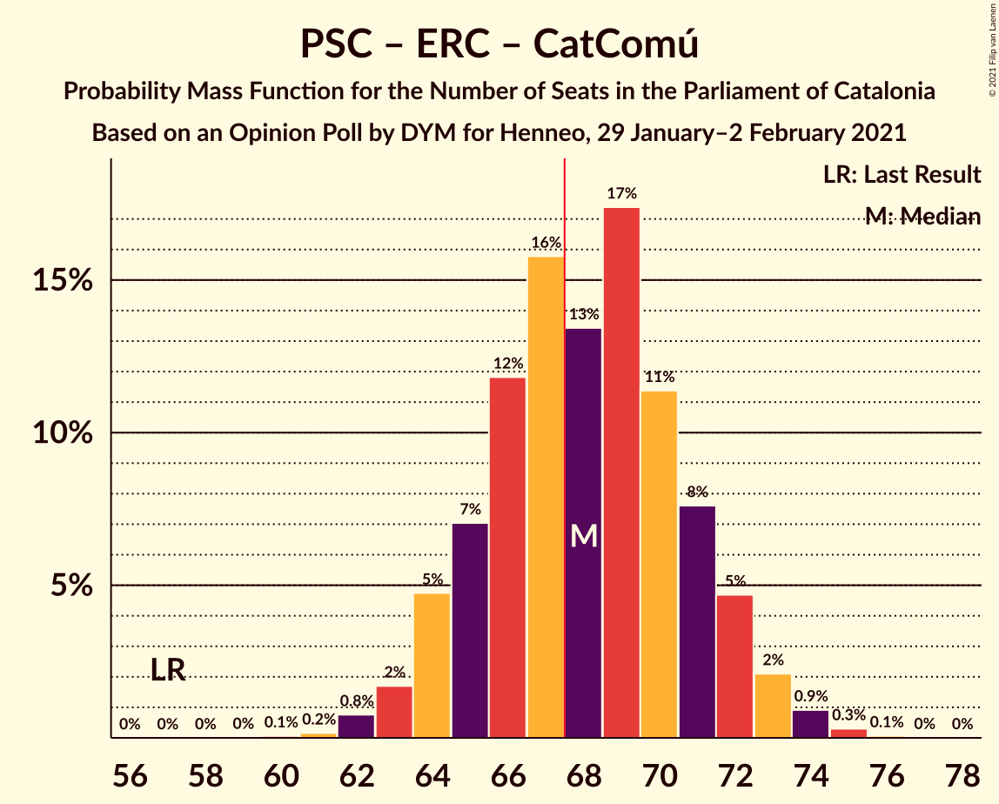
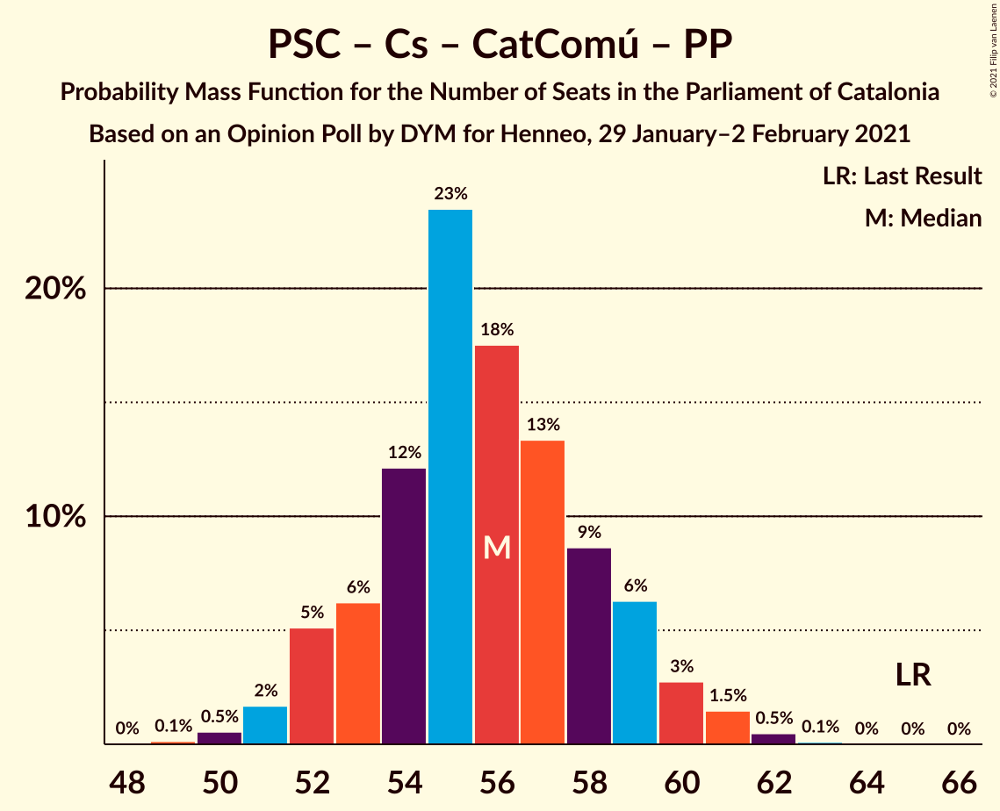

# Opinion Poll by DYM for Henneo, 29 January–2 February 2021

<a href="#voting-intentions">Voting Intentions</a> | <a href="#seats">Seats</a> | <a href="#coalitions">Coalitions</a> | <a href="#technical-information">Technical Information</a>

## Voting Intentions

### Confidence Intervals

| Party | Last Result | Poll Result | 80% Confidence Interval | 90% Confidence Interval | 95% Confidence Interval | 99% Confidence Interval |
|:-----:|:-----------:|:-----------:|:-----------------------:|:-----------------------:|:-----------------------:|:-----------------------:|
| Partit dels Socialistes de Catalunya (PSC-PSOE) | 13.9% | 22.7% | 21.2–24.3% |20.8–24.7% |20.5–25.1% |19.8–25.9% |
| Junts per Catalunya | 21.7% | 22.1% | 20.6–23.6% |20.2–24.1% |19.9–24.5% |19.2–25.2% |
| Esquerra Republicana–Catalunya Sí | 21.4% | 19.2% | 17.8–20.7% |17.5–21.1% |17.1–21.5% |16.5–22.2% |
| Ciutadans–Partido de la Ciudadanía | 25.4% | 10.6% | 9.5–11.8% |9.2–12.1% |9.0–12.4% |8.5–13.0% |
| Catalunya en Comú–Podem | 7.5% | 7.2% | 6.4–8.3% |6.1–8.6% |5.9–8.8% |5.5–9.3% |
| Candidatura d’Unitat Popular | 4.5% | 6.0% | 5.3–7.0% |5.0–7.3% |4.8–7.5% |4.5–8.0% |
| Vox | 0.0% | 5.8% | 5.0–6.7% |4.8–7.0% |4.6–7.2% |4.3–7.7% |
| Partit Popular | 4.2% | 3.5% | 2.9–4.3% |2.7–4.5% |2.6–4.7% |2.4–5.1% |

*Note:* The poll result column reflects the actual value used in the calculations. Published results may vary slightly, and in addition be rounded to fewer digits.

## Seats

### Confidence Intervals

| Party | Last Result | Median | 80% Confidence Interval | 90% Confidence Interval | 95% Confidence Interval | 99% Confidence Interval |
|:-----:|:-----------:|:------:|:-----------------------:|:-----------------------:|:-----------------------:|:-----------------------:|
| <a href="#partit-dels-socialistes-de-catalunya-(psc-psoe)">Partit dels Socialistes de Catalunya (PSC-PSOE)</a> | 17 | 31 | 28–32 |28–33 |27–34 |26–36 |
| <a href="#junts-per-catalunya">Junts per Catalunya</a> | 34 | 36 | 33–38 |33–39 |32–39 |31–41 |
| <a href="#esquerra-republicana–catalunya-sí">Esquerra Republicana–Catalunya Sí</a> | 32 | 28 | 27–30 |26–31 |26–31 |24–33 |
| <a href="#ciutadans–partido-de-la-ciudadanía">Ciutadans–Partido de la Ciudadanía</a> | 36 | 14 | 13–15 |12–16 |12–17 |12–18 |
| <a href="#catalunya-en-comú–podem">Catalunya en Comú–Podem</a> | 8 | 8 | 7–10 |7–10 |7–11 |5–11 |
| <a href="#candidatura-d’unitat-popular">Candidatura d’Unitat Popular</a> | 4 | 8 | 7–8 |6–9 |6–9 |4–10 |
| <a href="#vox">Vox</a> | 0 | 7 | 6–9 |6–9 |6–9 |5–10 |
| <a href="#partit-popular">Partit Popular</a> | 4 | 3 | 2–5 |2–5 |0–5 |0–6 |

### Partit dels Socialistes de Catalunya (PSC-PSOE)

*For a full overview of the results for this party, see the [Partit dels Socialistes de Catalunya (PSC-PSOE)](party-partitdelssocialistesdecatalunyapsc-psoe.html) page.*

| Number of Seats | Probability | Accumulated | Special Marks |
|:---------------:|:-----------:|:-----------:|:-------------:|
| 17 | 0% | 100% | Last Result |
| 18 | 0% | 100% |  |
| 19 | 0% | 100% |  |
| 20 | 0% | 100% |  |
| 21 | 0% | 100% |  |
| 22 | 0% | 100% |  |
| 23 | 0% | 100% |  |
| 24 | 0% | 100% |  |
| 25 | 0.2% | 100% |  |
| 26 | 0.7% | 99.8% |  |
| 27 | 2% | 99.1% |  |
| 28 | 13% | 97% |  |
| 29 | 6% | 84% |  |
| 30 | 19% | 78% |  |
| 31 | 31% | 60% | Median |
| 32 | 20% | 29% |  |
| 33 | 4% | 9% |  |
| 34 | 3% | 4% |  |
| 35 | 1.0% | 2% |  |
| 36 | 0.6% | 0.7% |  |
| 37 | 0.1% | 0.1% |  |
| 38 | 0% | 0% |  |

### Junts per Catalunya

*For a full overview of the results for this party, see the [Junts per Catalunya](party-juntspercatalunya.html) page.*

| Number of Seats | Probability | Accumulated | Special Marks |
|:---------------:|:-----------:|:-----------:|:-------------:|
| 30 | 0.1% | 100% |  |
| 31 | 1.3% | 99.9% |  |
| 32 | 3% | 98.6% |  |
| 33 | 7% | 96% |  |
| 34 | 10% | 89% | Last Result |
| 35 | 10% | 79% |  |
| 36 | 23% | 69% | Median |
| 37 | 25% | 46% |  |
| 38 | 14% | 21% |  |
| 39 | 5% | 6% |  |
| 40 | 0.6% | 1.2% |  |
| 41 | 0.4% | 0.5% |  |
| 42 | 0.1% | 0.2% |  |
| 43 | 0% | 0% |  |

### Esquerra Republicana–Catalunya Sí

*For a full overview of the results for this party, see the [Esquerra Republicana–Catalunya Sí](party-esquerrarepublicana–catalunyasí.html) page.*

| Number of Seats | Probability | Accumulated | Special Marks |
|:---------------:|:-----------:|:-----------:|:-------------:|
| 22 | 0.1% | 100% |  |
| 23 | 0.2% | 99.9% |  |
| 24 | 1.0% | 99.8% |  |
| 25 | 1.3% | 98.8% |  |
| 26 | 6% | 98% |  |
| 27 | 14% | 92% |  |
| 28 | 48% | 78% | Median |
| 29 | 17% | 30% |  |
| 30 | 7% | 13% |  |
| 31 | 4% | 6% |  |
| 32 | 0.9% | 2% | Last Result |
| 33 | 0.6% | 1.0% |  |
| 34 | 0.3% | 0.4% |  |
| 35 | 0.1% | 0.1% |  |
| 36 | 0% | 0% |  |

### Ciutadans–Partido de la Ciudadanía

*For a full overview of the results for this party, see the [Ciutadans–Partido de la Ciudadanía](party-ciutadans–partidodelaciudadanía.html) page.*

| Number of Seats | Probability | Accumulated | Special Marks |
|:---------------:|:-----------:|:-----------:|:-------------:|
| 9 | 0.1% | 100% |  |
| 10 | 0.1% | 99.9% |  |
| 11 | 0.1% | 99.8% |  |
| 12 | 9% | 99.7% |  |
| 13 | 38% | 91% |  |
| 14 | 37% | 52% | Median |
| 15 | 5% | 15% |  |
| 16 | 7% | 10% |  |
| 17 | 2% | 3% |  |
| 18 | 0.9% | 1.0% |  |
| 19 | 0% | 0% |  |
| 20 | 0% | 0% |  |
| 21 | 0% | 0% |  |
| 22 | 0% | 0% |  |
| 23 | 0% | 0% |  |
| 24 | 0% | 0% |  |
| 25 | 0% | 0% |  |
| 26 | 0% | 0% |  |
| 27 | 0% | 0% |  |
| 28 | 0% | 0% |  |
| 29 | 0% | 0% |  |
| 30 | 0% | 0% |  |
| 31 | 0% | 0% |  |
| 32 | 0% | 0% |  |
| 33 | 0% | 0% |  |
| 34 | 0% | 0% |  |
| 35 | 0% | 0% |  |
| 36 | 0% | 0% | Last Result |

### Catalunya en Comú–Podem

*For a full overview of the results for this party, see the [Catalunya en Comú–Podem](party-catalunyaencomú–podem.html) page.*

| Number of Seats | Probability | Accumulated | Special Marks |
|:---------------:|:-----------:|:-----------:|:-------------:|
| 5 | 0.9% | 100% |  |
| 6 | 2% | 99.1% |  |
| 7 | 24% | 98% |  |
| 8 | 30% | 74% | Last Result, Median |
| 9 | 31% | 44% |  |
| 10 | 10% | 13% |  |
| 11 | 3% | 3% |  |
| 12 | 0.1% | 0.1% |  |
| 13 | 0% | 0% |  |

### Candidatura d’Unitat Popular

*For a full overview of the results for this party, see the [Candidatura d’Unitat Popular](party-candidaturad’unitatpopular.html) page.*

| Number of Seats | Probability | Accumulated | Special Marks |
|:---------------:|:-----------:|:-----------:|:-------------:|
| 4 | 0.6% | 100% | Last Result |
| 5 | 0.7% | 99.4% |  |
| 6 | 5% | 98.7% |  |
| 7 | 32% | 94% |  |
| 8 | 56% | 63% | Median |
| 9 | 5% | 6% |  |
| 10 | 0.4% | 0.8% |  |
| 11 | 0.4% | 0.4% |  |
| 12 | 0% | 0% |  |

### Vox

*For a full overview of the results for this party, see the [Vox](party-vox.html) page.*

| Number of Seats | Probability | Accumulated | Special Marks |
|:---------------:|:-----------:|:-----------:|:-------------:|
| 0 | 0% | 100% | Last Result |
| 1 | 0% | 100% |  |
| 2 | 0% | 100% |  |
| 3 | 0.1% | 100% |  |
| 4 | 0.1% | 99.9% |  |
| 5 | 1.2% | 99.8% |  |
| 6 | 12% | 98.6% |  |
| 7 | 49% | 87% | Median |
| 8 | 22% | 38% |  |
| 9 | 15% | 16% |  |
| 10 | 0.8% | 1.0% |  |
| 11 | 0.2% | 0.2% |  |
| 12 | 0% | 0% |  |

### Partit Popular

*For a full overview of the results for this party, see the [Partit Popular](party-partitpopular.html) page.*

| Number of Seats | Probability | Accumulated | Special Marks |
|:---------------:|:-----------:|:-----------:|:-------------:|
| 0 | 5% | 100% |  |
| 1 | 0% | 95% |  |
| 2 | 19% | 95% |  |
| 3 | 52% | 76% | Median |
| 4 | 8% | 25% | Last Result |
| 5 | 14% | 16% |  |
| 6 | 2% | 2% |  |
| 7 | 0.2% | 0.2% |  |
| 8 | 0% | 0% |  |

## Coalitions

### Confidence Intervals

| Coalition | Last Result | Median | Majority? | 80% Confidence Interval | 90% Confidence Interval | 95% Confidence Interval | 99% Confidence Interval |
|:---------:|:-----------:|:------:|:---------:|:-----------------------:|:-----------------------:|:-----------------------:|:-----------------------:|
| Junts per Catalunya – Esquerra Republicana–Catalunya Sí – Catalunya en Comú–Podem | 74 | 73 | 98% | 69–75 | 69–76 | 68–76 | 66–78 |
| Junts per Catalunya – Esquerra Republicana–Catalunya Sí – Candidatura d’Unitat Popular | 70 | 72 | 97% | 69–74 | 68–75 | 67–76 | 66–77 |
| Partit dels Socialistes de Catalunya (PSC-PSOE) – Esquerra Republicana–Catalunya Sí – Catalunya en Comú–Podem | 57 | 67 | 39% | 64–69 | 64–70 | 63–71 | 62–74 |
| Junts per Catalunya – Esquerra Republicana–Catalunya Sí | 66 | 65 | 4% | 61–67 | 61–67 | 60–68 | 58–70 |
| Partit dels Socialistes de Catalunya (PSC-PSOE) – Ciutadans–Partido de la Ciudadanía – Catalunya en Comú–Podem – Partit Popular | 65 | 55 | 0% | 53–59 | 52–59 | 52–60 | 50–62 |
| Partit dels Socialistes de Catalunya (PSC-PSOE) – Ciutadans–Partido de la Ciudadanía – Vox – Partit Popular | 57 | 54 | 0% | 52–58 | 52–59 | 51–60 | 49–61 |
| Partit dels Socialistes de Catalunya (PSC-PSOE) – Ciutadans–Partido de la Ciudadanía – Partit Popular | 57 | 48 | 0% | 45–51 | 44–52 | 44–52 | 42–54 |
| Esquerra Republicana–Catalunya Sí – Catalunya en Comú–Podem | 40 | 36 | 0% | 35–38 | 34–39 | 33–40 | 31–42 |

### Junts per Catalunya – Esquerra Republicana–Catalunya Sí – Catalunya en Comú–Podem

| Number of Seats | Probability | Accumulated | Special Marks |
|:---------------:|:-----------:|:-----------:|:-------------:|
| 65 | 0.1% | 100% |  |
| 66 | 0.5% | 99.9% |  |
| 67 | 2% | 99.4% |  |
| 68 | 3% | 98% | Majority |
| 69 | 7% | 95% |  |
| 70 | 10% | 88% |  |
| 71 | 10% | 78% |  |
| 72 | 16% | 68% | Median |
| 73 | 13% | 52% |  |
| 74 | 13% | 39% | Last Result |
| 75 | 21% | 26% |  |
| 76 | 3% | 6% |  |
| 77 | 1.2% | 2% |  |
| 78 | 0.7% | 1.0% |  |
| 79 | 0.2% | 0.3% |  |
| 80 | 0% | 0.1% |  |
| 81 | 0% | 0% |  |

### Junts per Catalunya – Esquerra Republicana–Catalunya Sí – Candidatura d’Unitat Popular

| Number of Seats | Probability | Accumulated | Special Marks |
|:---------------:|:-----------:|:-----------:|:-------------:|
| 64 | 0.1% | 100% |  |
| 65 | 0.4% | 99.9% |  |
| 66 | 0.8% | 99.5% |  |
| 67 | 1.4% | 98.7% |  |
| 68 | 3% | 97% | Majority |
| 69 | 10% | 94% |  |
| 70 | 4% | 84% | Last Result |
| 71 | 21% | 80% |  |
| 72 | 16% | 59% | Median |
| 73 | 27% | 43% |  |
| 74 | 8% | 16% |  |
| 75 | 6% | 8% |  |
| 76 | 1.1% | 3% |  |
| 77 | 1.5% | 2% |  |
| 78 | 0.3% | 0.4% |  |
| 79 | 0.1% | 0.1% |  |
| 80 | 0% | 0% |  |

### Partit dels Socialistes de Catalunya (PSC-PSOE) – Esquerra Republicana–Catalunya Sí – Catalunya en Comú–Podem

| Number of Seats | Probability | Accumulated | Special Marks |
|:---------------:|:-----------:|:-----------:|:-------------:|
| 57 | 0% | 100% | Last Result |
| 58 | 0% | 100% |  |
| 59 | 0% | 100% |  |
| 60 | 0.1% | 100% |  |
| 61 | 0.2% | 99.9% |  |
| 62 | 0.5% | 99.7% |  |
| 63 | 2% | 99.2% |  |
| 64 | 7% | 97% |  |
| 65 | 4% | 90% |  |
| 66 | 19% | 86% |  |
| 67 | 28% | 67% | Median |
| 68 | 22% | 39% | Majority |
| 69 | 10% | 17% |  |
| 70 | 3% | 7% |  |
| 71 | 2% | 4% |  |
| 72 | 1.2% | 2% |  |
| 73 | 0.5% | 1.1% |  |
| 74 | 0.5% | 0.6% |  |
| 75 | 0.1% | 0.1% |  |
| 76 | 0% | 0% |  |

### Junts per Catalunya – Esquerra Republicana–Catalunya Sí

| Number of Seats | Probability | Accumulated | Special Marks |
|:---------------:|:-----------:|:-----------:|:-------------:|
| 57 | 0.1% | 100% |  |
| 58 | 0.7% | 99.9% |  |
| 59 | 0.9% | 99.2% |  |
| 60 | 3% | 98% |  |
| 61 | 8% | 95% |  |
| 62 | 5% | 87% |  |
| 63 | 18% | 82% |  |
| 64 | 12% | 63% | Median |
| 65 | 23% | 51% |  |
| 66 | 15% | 28% | Last Result |
| 67 | 9% | 13% |  |
| 68 | 2% | 4% | Majority |
| 69 | 1.5% | 2% |  |
| 70 | 0.5% | 0.6% |  |
| 71 | 0.1% | 0.2% |  |
| 72 | 0% | 0% |  |

### Partit dels Socialistes de Catalunya (PSC-PSOE) – Ciutadans–Partido de la Ciudadanía – Catalunya en Comú–Podem – Partit Popular

| Number of Seats | Probability | Accumulated | Special Marks |
|:---------------:|:-----------:|:-----------:|:-------------:|
| 49 | 0.2% | 100% |  |
| 50 | 0.7% | 99.7% |  |
| 51 | 1.0% | 99.1% |  |
| 52 | 4% | 98% |  |
| 53 | 7% | 94% |  |
| 54 | 10% | 87% |  |
| 55 | 31% | 77% |  |
| 56 | 10% | 46% | Median |
| 57 | 20% | 36% |  |
| 58 | 3% | 17% |  |
| 59 | 9% | 14% |  |
| 60 | 3% | 4% |  |
| 61 | 0.7% | 1.5% |  |
| 62 | 0.6% | 0.7% |  |
| 63 | 0.1% | 0.2% |  |
| 64 | 0% | 0% |  |
| 65 | 0% | 0% | Last Result |

### Partit dels Socialistes de Catalunya (PSC-PSOE) – Ciutadans–Partido de la Ciudadanía – Vox – Partit Popular

| Number of Seats | Probability | Accumulated | Special Marks |
|:---------------:|:-----------:|:-----------:|:-------------:|
| 48 | 0.1% | 100% |  |
| 49 | 0.6% | 99.9% |  |
| 50 | 1.2% | 99.2% |  |
| 51 | 2% | 98% |  |
| 52 | 8% | 96% |  |
| 53 | 18% | 88% |  |
| 54 | 20% | 69% |  |
| 55 | 12% | 49% | Median |
| 56 | 14% | 37% |  |
| 57 | 12% | 24% | Last Result |
| 58 | 5% | 12% |  |
| 59 | 4% | 7% |  |
| 60 | 0.8% | 3% |  |
| 61 | 1.3% | 2% |  |
| 62 | 0.4% | 0.5% |  |
| 63 | 0.1% | 0.1% |  |
| 64 | 0% | 0% |  |

### Partit dels Socialistes de Catalunya (PSC-PSOE) – Ciutadans–Partido de la Ciudadanía – Partit Popular

| Number of Seats | Probability | Accumulated | Special Marks |
|:---------------:|:-----------:|:-----------:|:-------------:|
| 41 | 0.2% | 100% |  |
| 42 | 0.5% | 99.8% |  |
| 43 | 1.4% | 99.2% |  |
| 44 | 5% | 98% |  |
| 45 | 9% | 93% |  |
| 46 | 24% | 84% |  |
| 47 | 9% | 60% |  |
| 48 | 27% | 51% | Median |
| 49 | 8% | 24% |  |
| 50 | 5% | 16% |  |
| 51 | 5% | 11% |  |
| 52 | 4% | 6% |  |
| 53 | 0.9% | 1.5% |  |
| 54 | 0.5% | 0.6% |  |
| 55 | 0% | 0.1% |  |
| 56 | 0% | 0% |  |
| 57 | 0% | 0% | Last Result |

### Esquerra Republicana–Catalunya Sí – Catalunya en Comú–Podem

| Number of Seats | Probability | Accumulated | Special Marks |
|:---------------:|:-----------:|:-----------:|:-------------:|
| 30 | 0.1% | 100% |  |
| 31 | 0.4% | 99.8% |  |
| 32 | 0.9% | 99.4% |  |
| 33 | 3% | 98.5% |  |
| 34 | 2% | 96% |  |
| 35 | 15% | 94% |  |
| 36 | 35% | 79% | Median |
| 37 | 23% | 44% |  |
| 38 | 12% | 21% |  |
| 39 | 5% | 9% |  |
| 40 | 1.4% | 4% | Last Result |
| 41 | 1.0% | 2% |  |
| 42 | 1.0% | 1.3% |  |
| 43 | 0.3% | 0.3% |  |
| 44 | 0% | 0% |  |

## Technical Information

### Opinion Poll

+ **Polling firm:** DYM
+ **Commissioner(s):** Henneo
+ **Fieldwork period:** 29 January–2 February 2021

### Calculations

+ **Sample size:** 1259
+ **Simulations done:** 131,072
+ **Error estimate:** 1.75%

