# Opinion Poll by CIS, 1–3 February 2021

<a href="#voting-intentions">Voting Intentions</a> | <a href="#seats">Seats</a> | <a href="#coalitions">Coalitions</a> | <a href="#technical-information">Technical Information</a>

## Voting Intentions

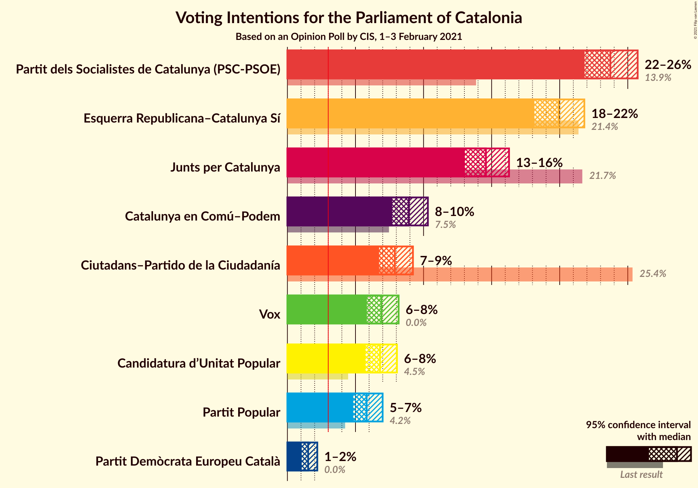

### Confidence Intervals

| Party | Last Result | Poll Result | 80% Confidence Interval | 90% Confidence Interval | 95% Confidence Interval | 99% Confidence Interval |
|:-----:|:-----------:|:-----------:|:-----------------------:|:-----------------------:|:-----------------------:|:-----------------------:|
| Partit dels Socialistes de Catalunya (PSC-PSOE) | 13.9% | 23.7% | 22.5–25.0% |22.1–25.4% |21.8–25.7% |21.2–26.4% |
| Esquerra Republicana–Catalunya Sí | 21.4% | 19.9% | 18.7–21.2% |18.4–21.5% |18.1–21.8% |17.6–22.4% |
| Junts per Catalunya | 21.7% | 14.6% | 13.6–15.7% |13.3–16.0% |13.0–16.3% |12.6–16.8% |
| Catalunya en Comú–Podem | 7.5% | 8.9% | 8.1–9.8% |7.9–10.1% |7.7–10.3% |7.3–10.8% |
| Ciutadans–Partido de la Ciudadanía | 25.4% | 7.9% | 7.1–8.8% |6.9–9.0% |6.7–9.2% |6.4–9.6% |
| Vox | 0.0% | 6.9% | 6.2–7.7% |6.0–8.0% |5.8–8.2% |5.5–8.6% |
| Candidatura d’Unitat Popular | 4.5% | 6.8% | 6.1–7.6% |5.9–7.8% |5.7–8.0% |5.4–8.5% |
| Partit Popular | 4.2% | 5.8% | 5.2–6.6% |5.0–6.8% |4.8–7.0% |4.5–7.4% |
| Partit Demòcrata Europeu Català | 0.0% | 1.5% | 1.2–2.0% |1.1–2.1% |1.1–2.2% |0.9–2.4% |

*Note:* The poll result column reflects the actual value used in the calculations. Published results may vary slightly, and in addition be rounded to fewer digits.

## Seats

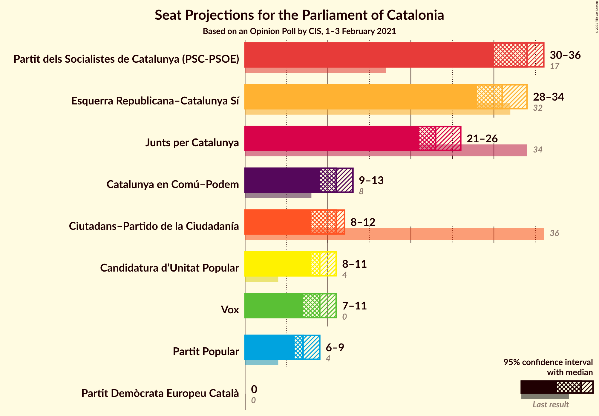

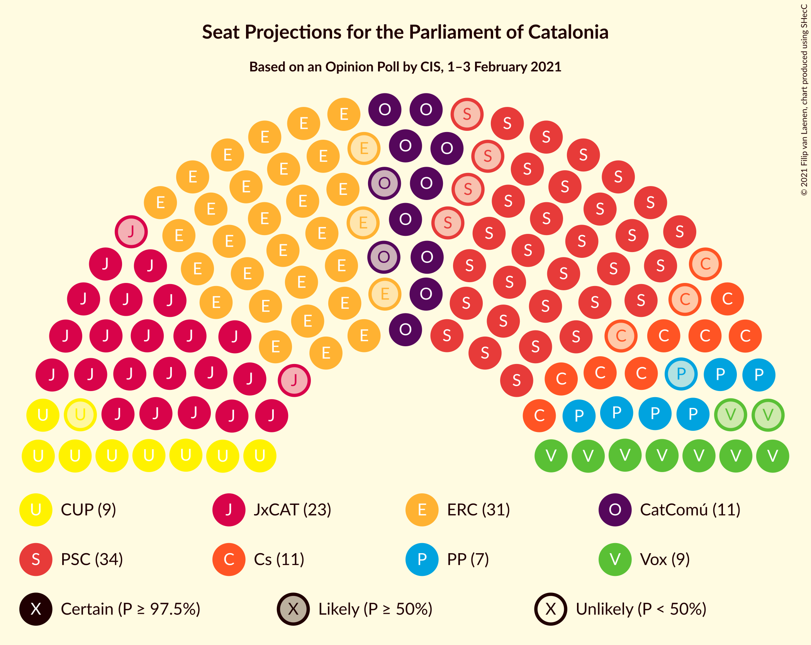

### Confidence Intervals

| Party | Last Result | Median | 80% Confidence Interval | 90% Confidence Interval | 95% Confidence Interval | 99% Confidence Interval |
|:-----:|:-----------:|:------:|:-----------------------:|:-----------------------:|:-----------------------:|:-----------------------:|
| <a href="#partit-dels-socialistes-de-catalunya-(psc-psoe)">Partit dels Socialistes de Catalunya (PSC-PSOE)</a> | 17 | 34 | 31–35 |31–36 |30–36 |30–37 |
| <a href="#esquerra-republicana–catalunya-sí">Esquerra Republicana–Catalunya Sí</a> | 32 | 31 | 29–33 |28–33 |28–34 |27–35 |
| <a href="#junts-per-catalunya">Junts per Catalunya</a> | 34 | 23 | 22–25 |22–26 |21–26 |20–28 |
| <a href="#catalunya-en-comú–podem">Catalunya en Comú–Podem</a> | 8 | 11 | 10–13 |10–13 |9–13 |8–14 |
| <a href="#ciutadans–partido-de-la-ciudadanía">Ciutadans–Partido de la Ciudadanía</a> | 36 | 11 | 8–12 |8–12 |8–12 |8–13 |
| <a href="#vox">Vox</a> | 0 | 9 | 8–10 |7–11 |7–11 |7–12 |
| <a href="#candidatura-d’unitat-popular">Candidatura d’Unitat Popular</a> | 4 | 9 | 8–10 |8–11 |8–11 |7–11 |
| <a href="#partit-popular">Partit Popular</a> | 4 | 7 | 6–9 |6–9 |6–9 |5–9 |
| <a href="#partit-demòcrata-europeu-català">Partit Demòcrata Europeu Català</a> | 0 | 0 | 0 |0 |0 |0 |

### Partit dels Socialistes de Catalunya (PSC-PSOE)

*For a full overview of the results for this party, see the [Partit dels Socialistes de Catalunya (PSC-PSOE)](party-partitdelssocialistesdecatalunyapsc-psoe.html) page.*

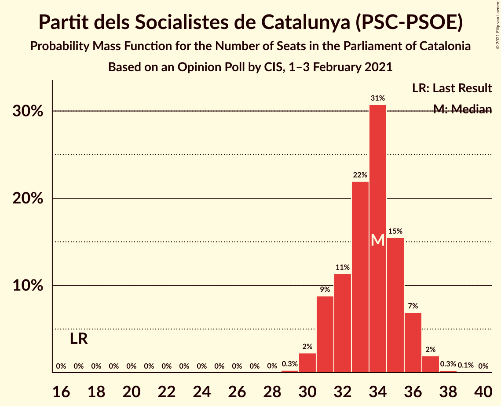

| Number of Seats | Probability | Accumulated | Special Marks |
|:---------------:|:-----------:|:-----------:|:-------------:|
| 17 | 0% | 100% | Last Result |
| 18 | 0% | 100% |  |
| 19 | 0% | 100% |  |
| 20 | 0% | 100% |  |
| 21 | 0% | 100% |  |
| 22 | 0% | 100% |  |
| 23 | 0% | 100% |  |
| 24 | 0% | 100% |  |
| 25 | 0% | 100% |  |
| 26 | 0% | 100% |  |
| 27 | 0% | 100% |  |
| 28 | 0% | 100% |  |
| 29 | 0.3% | 100% |  |
| 30 | 2% | 99.7% |  |
| 31 | 9% | 97% |  |
| 32 | 11% | 89% |  |
| 33 | 22% | 77% |  |
| 34 | 31% | 55% | Median |
| 35 | 15% | 25% |  |
| 36 | 7% | 9% |  |
| 37 | 2% | 2% |  |
| 38 | 0.3% | 0.4% |  |
| 39 | 0.1% | 0.1% |  |
| 40 | 0% | 0% |  |

### Esquerra Republicana–Catalunya Sí

*For a full overview of the results for this party, see the [Esquerra Republicana–Catalunya Sí](party-esquerrarepublicana–catalunyasí.html) page.*

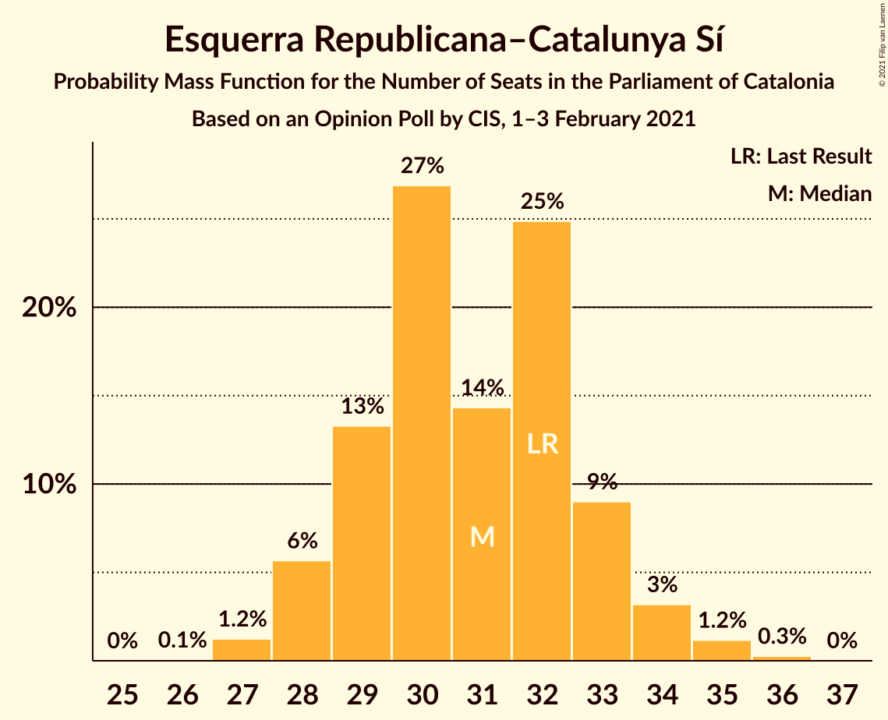

| Number of Seats | Probability | Accumulated | Special Marks |
|:---------------:|:-----------:|:-----------:|:-------------:|
| 26 | 0.1% | 100% |  |
| 27 | 1.2% | 99.9% |  |
| 28 | 6% | 98.7% |  |
| 29 | 13% | 93% |  |
| 30 | 27% | 80% |  |
| 31 | 14% | 53% | Median |
| 32 | 25% | 39% | Last Result |
| 33 | 9% | 14% |  |
| 34 | 3% | 5% |  |
| 35 | 1.2% | 1.5% |  |
| 36 | 0.3% | 0.3% |  |
| 37 | 0% | 0% |  |

### Junts per Catalunya

*For a full overview of the results for this party, see the [Junts per Catalunya](party-juntspercatalunya.html) page.*

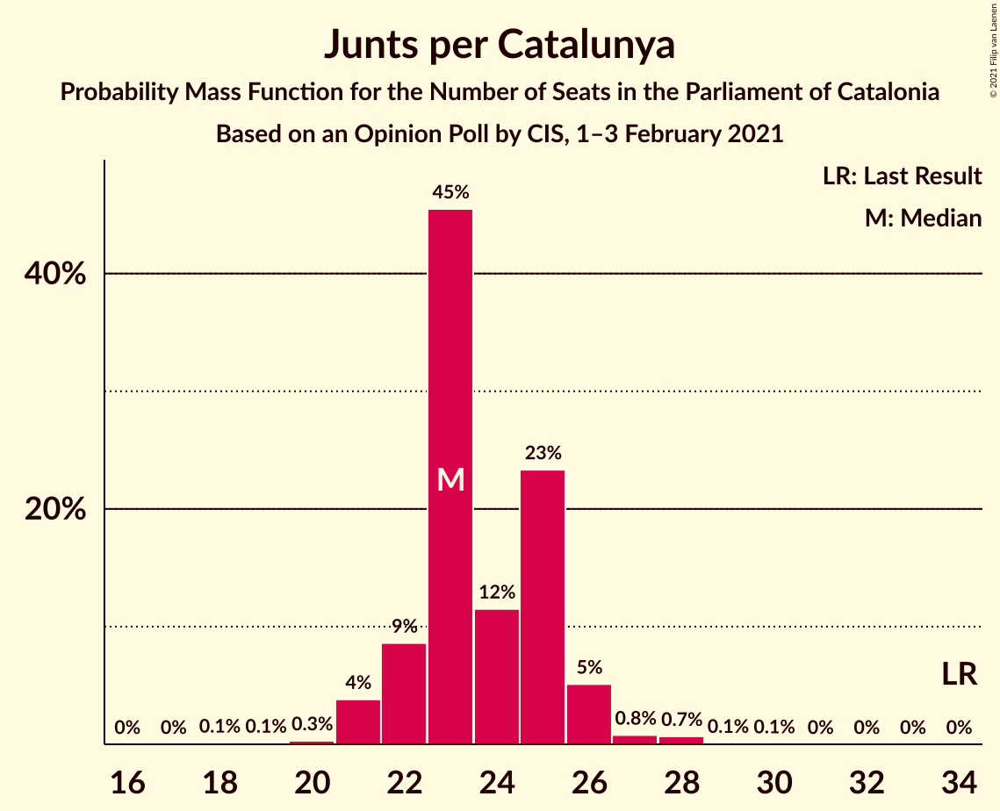

| Number of Seats | Probability | Accumulated | Special Marks |
|:---------------:|:-----------:|:-----------:|:-------------:|
| 18 | 0.1% | 100% |  |
| 19 | 0.1% | 99.9% |  |
| 20 | 0.3% | 99.8% |  |
| 21 | 4% | 99.5% |  |
| 22 | 9% | 96% |  |
| 23 | 45% | 87% | Median |
| 24 | 12% | 42% |  |
| 25 | 23% | 30% |  |
| 26 | 5% | 7% |  |
| 27 | 0.8% | 2% |  |
| 28 | 0.7% | 0.8% |  |
| 29 | 0.1% | 0.1% |  |
| 30 | 0.1% | 0.1% |  |
| 31 | 0% | 0% |  |
| 32 | 0% | 0% |  |
| 33 | 0% | 0% |  |
| 34 | 0% | 0% | Last Result |

### Catalunya en Comú–Podem

*For a full overview of the results for this party, see the [Catalunya en Comú–Podem](party-catalunyaencomú–podem.html) page.*

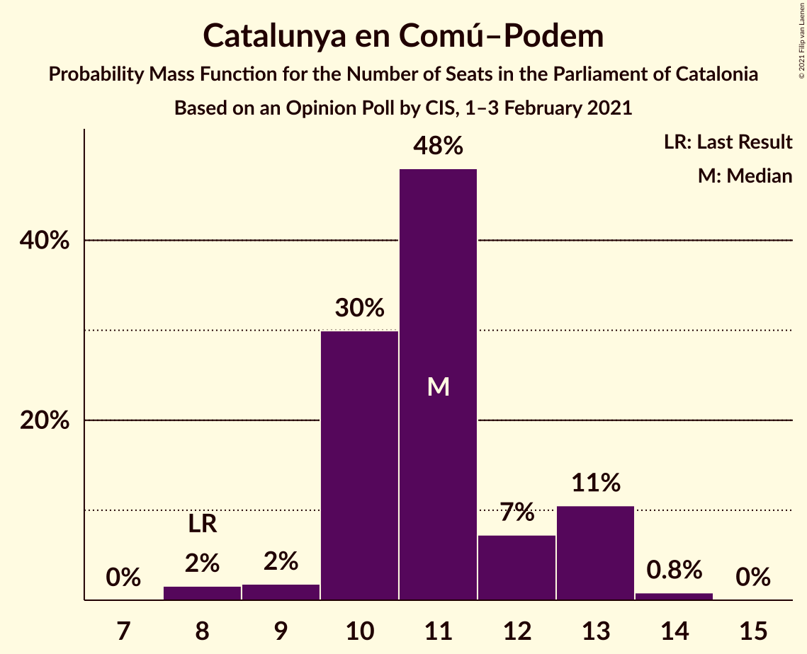

| Number of Seats | Probability | Accumulated | Special Marks |
|:---------------:|:-----------:|:-----------:|:-------------:|
| 8 | 2% | 100% | Last Result |
| 9 | 2% | 98% |  |
| 10 | 30% | 97% |  |
| 11 | 48% | 67% | Median |
| 12 | 7% | 19% |  |
| 13 | 11% | 11% |  |
| 14 | 0.8% | 0.9% |  |
| 15 | 0% | 0% |  |

### Ciutadans–Partido de la Ciudadanía

*For a full overview of the results for this party, see the [Ciutadans–Partido de la Ciudadanía](party-ciutadans–partidodelaciudadanía.html) page.*

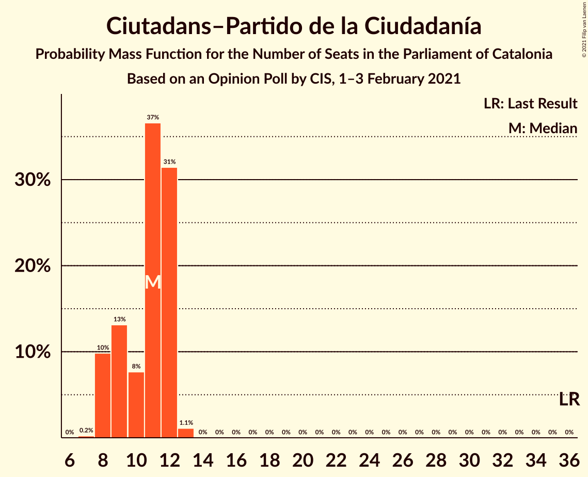

| Number of Seats | Probability | Accumulated | Special Marks |
|:---------------:|:-----------:|:-----------:|:-------------:|
| 7 | 0.2% | 100% |  |
| 8 | 10% | 99.8% |  |
| 9 | 13% | 90% |  |
| 10 | 8% | 77% |  |
| 11 | 37% | 69% | Median |
| 12 | 31% | 33% |  |
| 13 | 1.1% | 1.1% |  |
| 14 | 0% | 0% |  |
| 15 | 0% | 0% |  |
| 16 | 0% | 0% |  |
| 17 | 0% | 0% |  |
| 18 | 0% | 0% |  |
| 19 | 0% | 0% |  |
| 20 | 0% | 0% |  |
| 21 | 0% | 0% |  |
| 22 | 0% | 0% |  |
| 23 | 0% | 0% |  |
| 24 | 0% | 0% |  |
| 25 | 0% | 0% |  |
| 26 | 0% | 0% |  |
| 27 | 0% | 0% |  |
| 28 | 0% | 0% |  |
| 29 | 0% | 0% |  |
| 30 | 0% | 0% |  |
| 31 | 0% | 0% |  |
| 32 | 0% | 0% |  |
| 33 | 0% | 0% |  |
| 34 | 0% | 0% |  |
| 35 | 0% | 0% |  |
| 36 | 0% | 0% | Last Result |

### Vox

*For a full overview of the results for this party, see the [Vox](party-vox.html) page.*

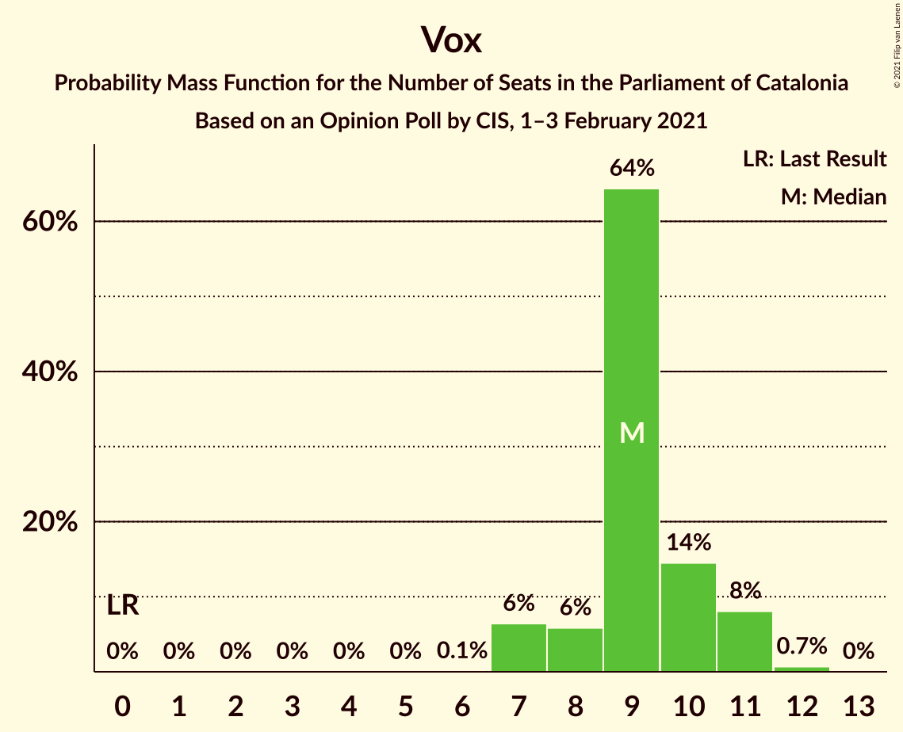

| Number of Seats | Probability | Accumulated | Special Marks |
|:---------------:|:-----------:|:-----------:|:-------------:|
| 0 | 0% | 100% | Last Result |
| 1 | 0% | 100% |  |
| 2 | 0% | 100% |  |
| 3 | 0% | 100% |  |
| 4 | 0% | 100% |  |
| 5 | 0% | 100% |  |
| 6 | 0.1% | 100% |  |
| 7 | 6% | 99.9% |  |
| 8 | 6% | 93% |  |
| 9 | 64% | 88% | Median |
| 10 | 14% | 23% |  |
| 11 | 8% | 9% |  |
| 12 | 0.7% | 0.7% |  |
| 13 | 0% | 0% |  |

### Candidatura d’Unitat Popular

*For a full overview of the results for this party, see the [Candidatura d’Unitat Popular](party-candidaturad’unitatpopular.html) page.*

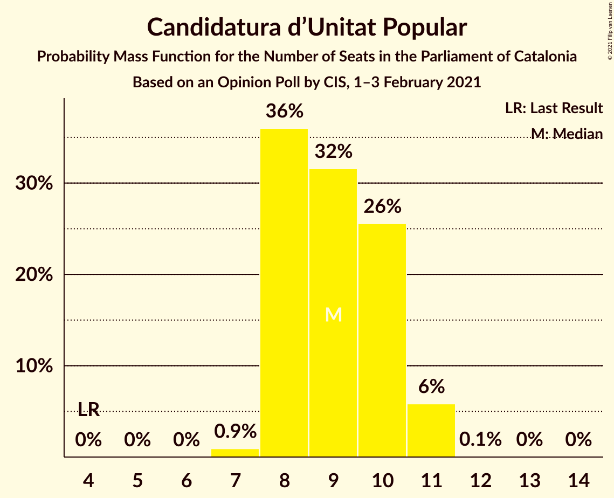

| Number of Seats | Probability | Accumulated | Special Marks |
|:---------------:|:-----------:|:-----------:|:-------------:|
| 4 | 0% | 100% | Last Result |
| 5 | 0% | 100% |  |
| 6 | 0% | 100% |  |
| 7 | 0.9% | 100% |  |
| 8 | 36% | 99.1% |  |
| 9 | 32% | 63% | Median |
| 10 | 26% | 31% |  |
| 11 | 6% | 6% |  |
| 12 | 0.1% | 0.1% |  |
| 13 | 0% | 0.1% |  |
| 14 | 0% | 0% |  |

### Partit Popular

*For a full overview of the results for this party, see the [Partit Popular](party-partitpopular.html) page.*

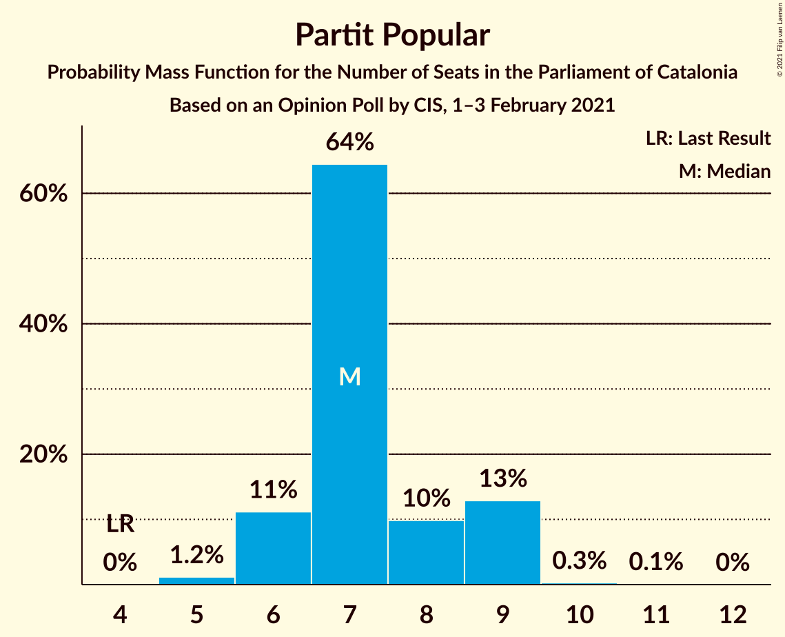

| Number of Seats | Probability | Accumulated | Special Marks |
|:---------------:|:-----------:|:-----------:|:-------------:|
| 4 | 0% | 100% | Last Result |
| 5 | 1.2% | 100% |  |
| 6 | 11% | 98.8% |  |
| 7 | 64% | 88% | Median |
| 8 | 10% | 23% |  |
| 9 | 13% | 13% |  |
| 10 | 0.3% | 0.4% |  |
| 11 | 0.1% | 0.1% |  |
| 12 | 0% | 0% |  |

### Partit Demòcrata Europeu Català

*For a full overview of the results for this party, see the [Partit Demòcrata Europeu Català](party-partitdemòcrataeuropeucatalà.html) page.*

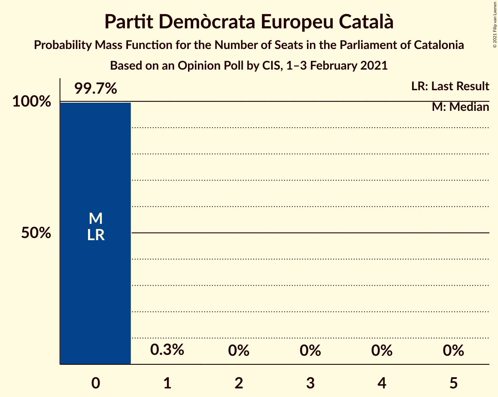

| Number of Seats | Probability | Accumulated | Special Marks |
|:---------------:|:-----------:|:-----------:|:-------------:|
| 0 | 99.7% | 100% | Last Result, Median |
| 1 | 0.3% | 0.3% |  |
| 2 | 0% | 0% |  |

## Coalitions

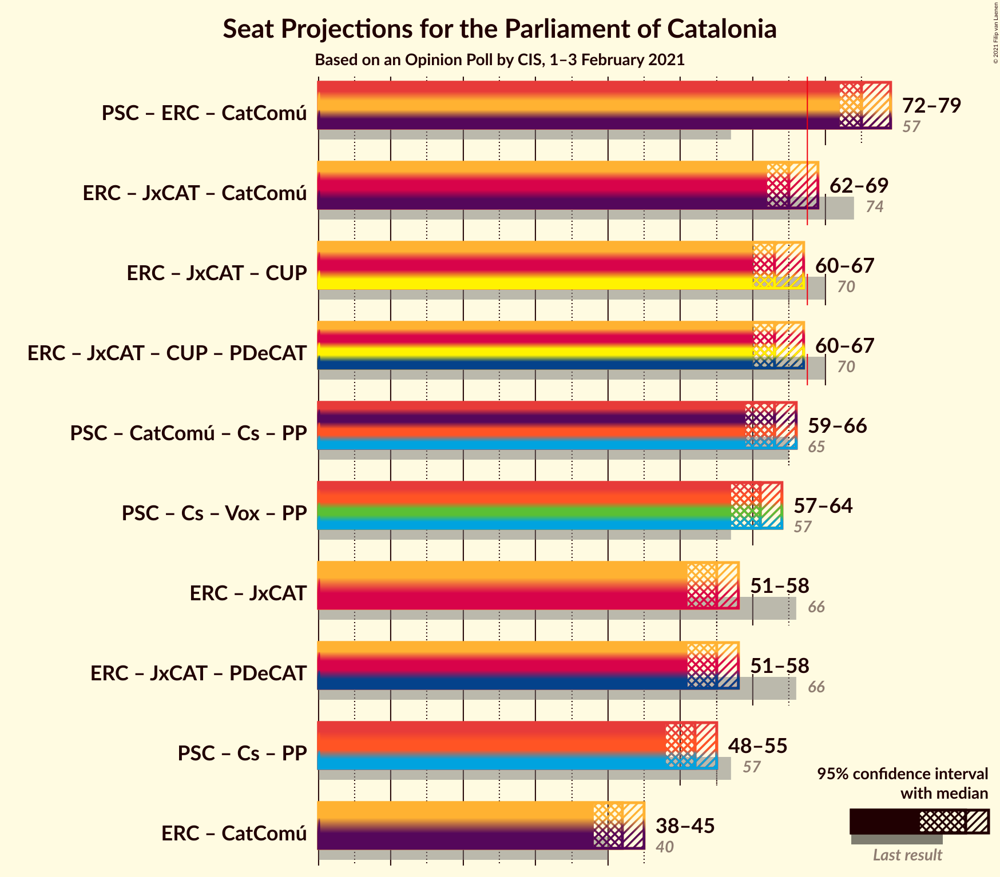

### Confidence Intervals

| Coalition | Last Result | Median | Majority? | 80% Confidence Interval | 90% Confidence Interval | 95% Confidence Interval | 99% Confidence Interval |
|:---------:|:-----------:|:------:|:---------:|:-----------------------:|:-----------------------:|:-----------------------:|:-----------------------:|
| Partit dels Socialistes de Catalunya (PSC-PSOE) – Esquerra Republicana–Catalunya Sí – Catalunya en Comú–Podem | 57 | 75 | 100% | 73–78 | 72–79 | 72–79 | 71–80 |
| Esquerra Republicana–Catalunya Sí – Junts per Catalunya – Catalunya en Comú–Podem | 74 | 65 | 12% | 63–68 | 63–68 | 62–69 | 61–71 |
| Esquerra Republicana–Catalunya Sí – Junts per Catalunya – Candidatura d’Unitat Popular | 70 | 63 | 1.3% | 62–65 | 61–66 | 60–67 | 59–68 |
| Esquerra Republicana–Catalunya Sí – Junts per Catalunya – Candidatura d’Unitat Popular – Partit Demòcrata Europeu Català | 70 | 63 | 1.3% | 62–65 | 61–66 | 60–67 | 59–69 |
| Partit dels Socialistes de Catalunya (PSC-PSOE) – Catalunya en Comú–Podem – Ciutadans–Partido de la Ciudadanía – Partit Popular | 65 | 63 | 0.2% | 60–64 | 59–65 | 59–66 | 58–67 |
| Partit dels Socialistes de Catalunya (PSC-PSOE) – Ciutadans–Partido de la Ciudadanía – Vox – Partit Popular | 57 | 61 | 0% | 59–63 | 57–63 | 57–64 | 55–65 |
| Esquerra Republicana–Catalunya Sí – Junts per Catalunya | 66 | 55 | 0% | 52–57 | 52–57 | 51–58 | 50–59 |
| Esquerra Republicana–Catalunya Sí – Junts per Catalunya – Partit Demòcrata Europeu Català | 66 | 55 | 0% | 52–57 | 52–57 | 51–58 | 50–59 |
| Partit dels Socialistes de Catalunya (PSC-PSOE) – Ciutadans–Partido de la Ciudadanía – Partit Popular | 57 | 52 | 0% | 49–54 | 48–54 | 48–55 | 46–56 |
| Esquerra Republicana–Catalunya Sí – Catalunya en Comú–Podem | 40 | 42 | 0% | 40–44 | 39–45 | 38–45 | 38–47 |

### Partit dels Socialistes de Catalunya (PSC-PSOE) – Esquerra Republicana–Catalunya Sí – Catalunya en Comú–Podem

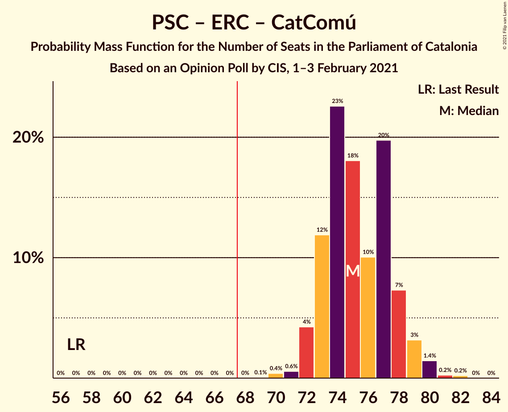

| Number of Seats | Probability | Accumulated | Special Marks |
|:---------------:|:-----------:|:-----------:|:-------------:|
| 57 | 0% | 100% | Last Result |
| 58 | 0% | 100% |  |
| 59 | 0% | 100% |  |
| 60 | 0% | 100% |  |
| 61 | 0% | 100% |  |
| 62 | 0% | 100% |  |
| 63 | 0% | 100% |  |
| 64 | 0% | 100% |  |
| 65 | 0% | 100% |  |
| 66 | 0% | 100% |  |
| 67 | 0% | 100% |  |
| 68 | 0% | 100% | Majority |
| 69 | 0.1% | 100% |  |
| 70 | 0.4% | 99.9% |  |
| 71 | 0.6% | 99.5% |  |
| 72 | 4% | 99.0% |  |
| 73 | 12% | 95% |  |
| 74 | 23% | 83% |  |
| 75 | 18% | 60% |  |
| 76 | 10% | 42% | Median |
| 77 | 20% | 32% |  |
| 78 | 7% | 12% |  |
| 79 | 3% | 5% |  |
| 80 | 1.4% | 2% |  |
| 81 | 0.2% | 0.5% |  |
| 82 | 0.2% | 0.2% |  |
| 83 | 0% | 0% |  |

### Esquerra Republicana–Catalunya Sí – Junts per Catalunya – Catalunya en Comú–Podem

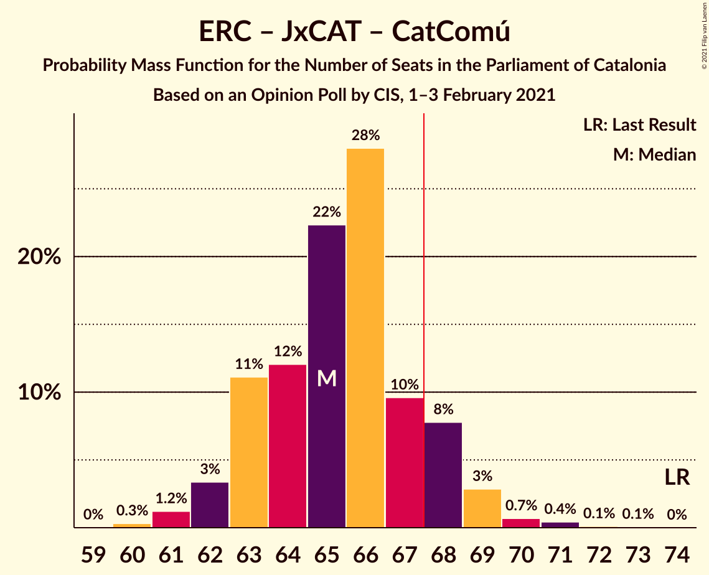

| Number of Seats | Probability | Accumulated | Special Marks |
|:---------------:|:-----------:|:-----------:|:-------------:|
| 60 | 0.3% | 100% |  |
| 61 | 1.2% | 99.7% |  |
| 62 | 3% | 98% |  |
| 63 | 11% | 95% |  |
| 64 | 12% | 84% |  |
| 65 | 22% | 72% | Median |
| 66 | 28% | 50% |  |
| 67 | 10% | 22% |  |
| 68 | 8% | 12% | Majority |
| 69 | 3% | 4% |  |
| 70 | 0.7% | 1.3% |  |
| 71 | 0.4% | 0.6% |  |
| 72 | 0.1% | 0.2% |  |
| 73 | 0.1% | 0.1% |  |
| 74 | 0% | 0% | Last Result |

### Esquerra Republicana–Catalunya Sí – Junts per Catalunya – Candidatura d’Unitat Popular

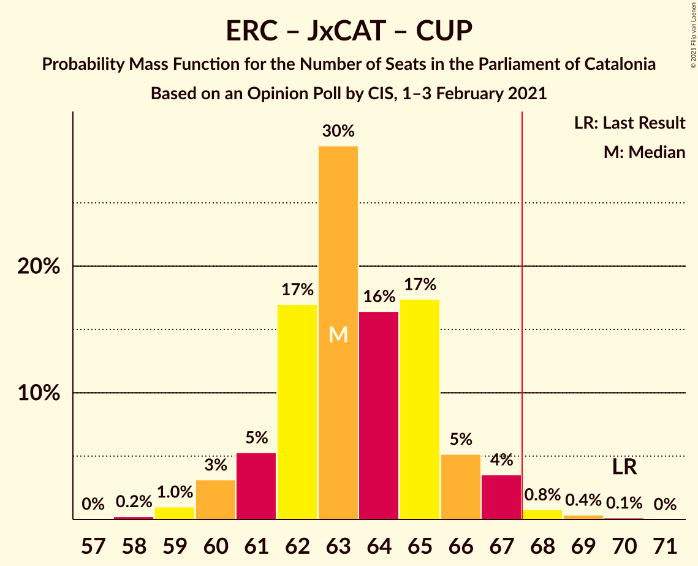

| Number of Seats | Probability | Accumulated | Special Marks |
|:---------------:|:-----------:|:-----------:|:-------------:|
| 57 | 0% | 100% |  |
| 58 | 0.2% | 99.9% |  |
| 59 | 1.0% | 99.7% |  |
| 60 | 3% | 98.7% |  |
| 61 | 5% | 96% |  |
| 62 | 17% | 90% |  |
| 63 | 30% | 73% | Median |
| 64 | 16% | 44% |  |
| 65 | 17% | 27% |  |
| 66 | 5% | 10% |  |
| 67 | 4% | 5% |  |
| 68 | 0.8% | 1.3% | Majority |
| 69 | 0.4% | 0.5% |  |
| 70 | 0.1% | 0.1% | Last Result |
| 71 | 0% | 0% |  |

### Esquerra Republicana–Catalunya Sí – Junts per Catalunya – Candidatura d’Unitat Popular – Partit Demòcrata Europeu Català

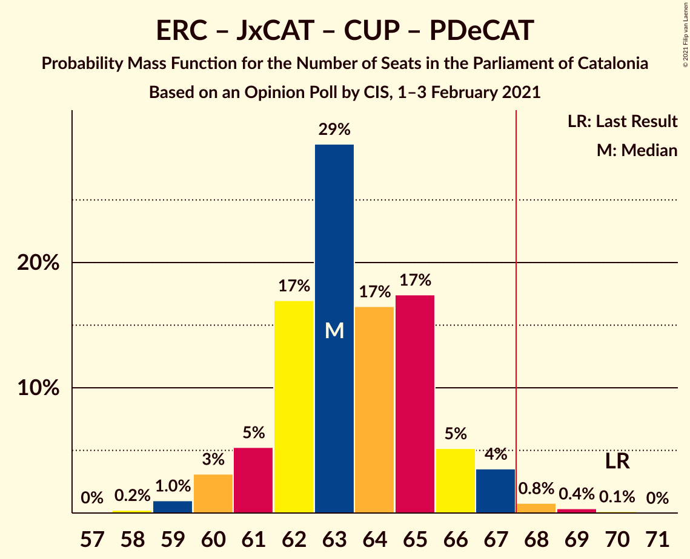

| Number of Seats | Probability | Accumulated | Special Marks |
|:---------------:|:-----------:|:-----------:|:-------------:|
| 57 | 0% | 100% |  |
| 58 | 0.2% | 99.9% |  |
| 59 | 1.0% | 99.7% |  |
| 60 | 3% | 98.7% |  |
| 61 | 5% | 96% |  |
| 62 | 17% | 90% |  |
| 63 | 29% | 73% | Median |
| 64 | 17% | 44% |  |
| 65 | 17% | 27% |  |
| 66 | 5% | 10% |  |
| 67 | 4% | 5% |  |
| 68 | 0.8% | 1.3% | Majority |
| 69 | 0.4% | 0.5% |  |
| 70 | 0.1% | 0.1% | Last Result |
| 71 | 0% | 0% |  |

### Partit dels Socialistes de Catalunya (PSC-PSOE) – Catalunya en Comú–Podem – Ciutadans–Partido de la Ciudadanía – Partit Popular

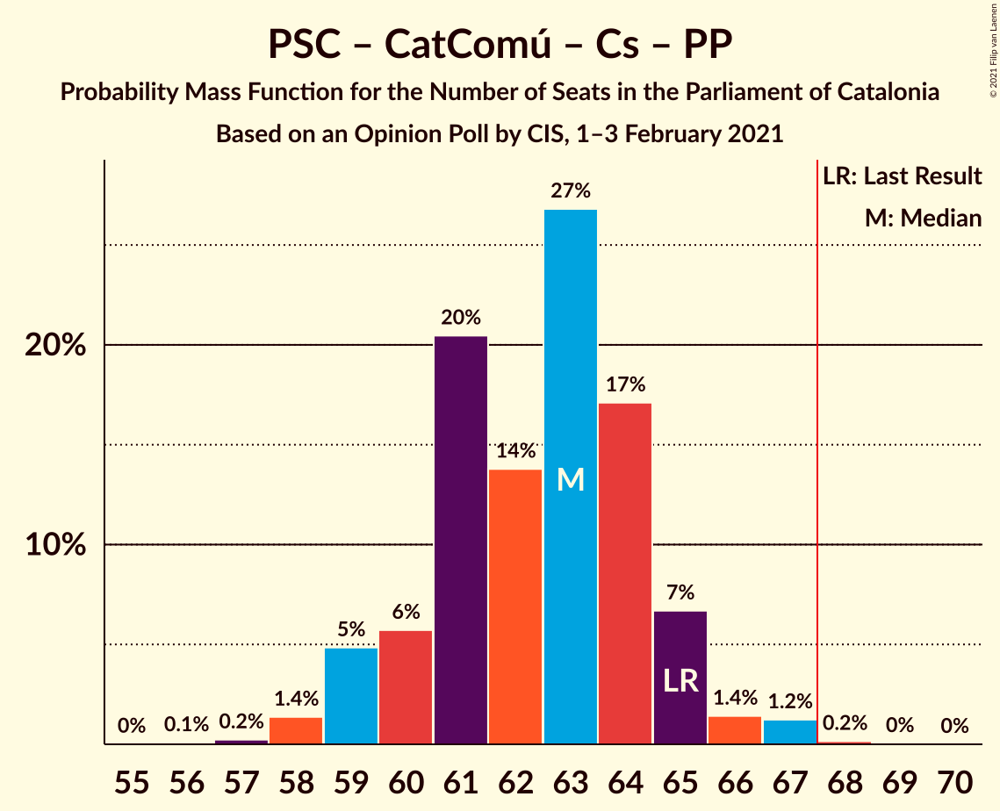

| Number of Seats | Probability | Accumulated | Special Marks |
|:---------------:|:-----------:|:-----------:|:-------------:|
| 56 | 0.1% | 100% |  |
| 57 | 0.2% | 99.9% |  |
| 58 | 1.4% | 99.7% |  |
| 59 | 5% | 98% |  |
| 60 | 6% | 93% |  |
| 61 | 20% | 88% |  |
| 62 | 14% | 67% |  |
| 63 | 27% | 53% | Median |
| 64 | 17% | 27% |  |
| 65 | 7% | 10% | Last Result |
| 66 | 1.4% | 3% |  |
| 67 | 1.2% | 1.4% |  |
| 68 | 0.2% | 0.2% | Majority |
| 69 | 0% | 0.1% |  |
| 70 | 0% | 0% |  |

### Partit dels Socialistes de Catalunya (PSC-PSOE) – Ciutadans–Partido de la Ciudadanía – Vox – Partit Popular

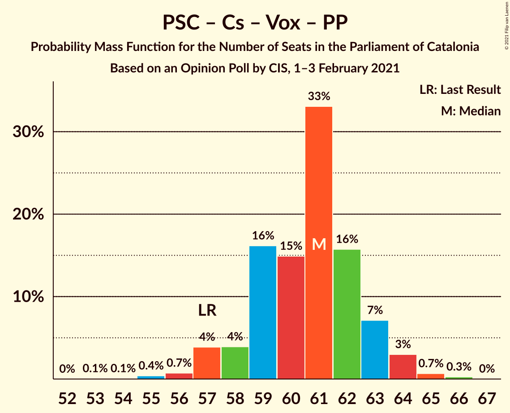

| Number of Seats | Probability | Accumulated | Special Marks |
|:---------------:|:-----------:|:-----------:|:-------------:|
| 53 | 0.1% | 100% |  |
| 54 | 0.1% | 99.9% |  |
| 55 | 0.4% | 99.9% |  |
| 56 | 0.7% | 99.5% |  |
| 57 | 4% | 98.7% | Last Result |
| 58 | 4% | 95% |  |
| 59 | 16% | 91% |  |
| 60 | 15% | 75% |  |
| 61 | 33% | 60% | Median |
| 62 | 16% | 27% |  |
| 63 | 7% | 11% |  |
| 64 | 3% | 4% |  |
| 65 | 0.7% | 1.0% |  |
| 66 | 0.3% | 0.3% |  |
| 67 | 0% | 0% |  |

### Esquerra Republicana–Catalunya Sí – Junts per Catalunya

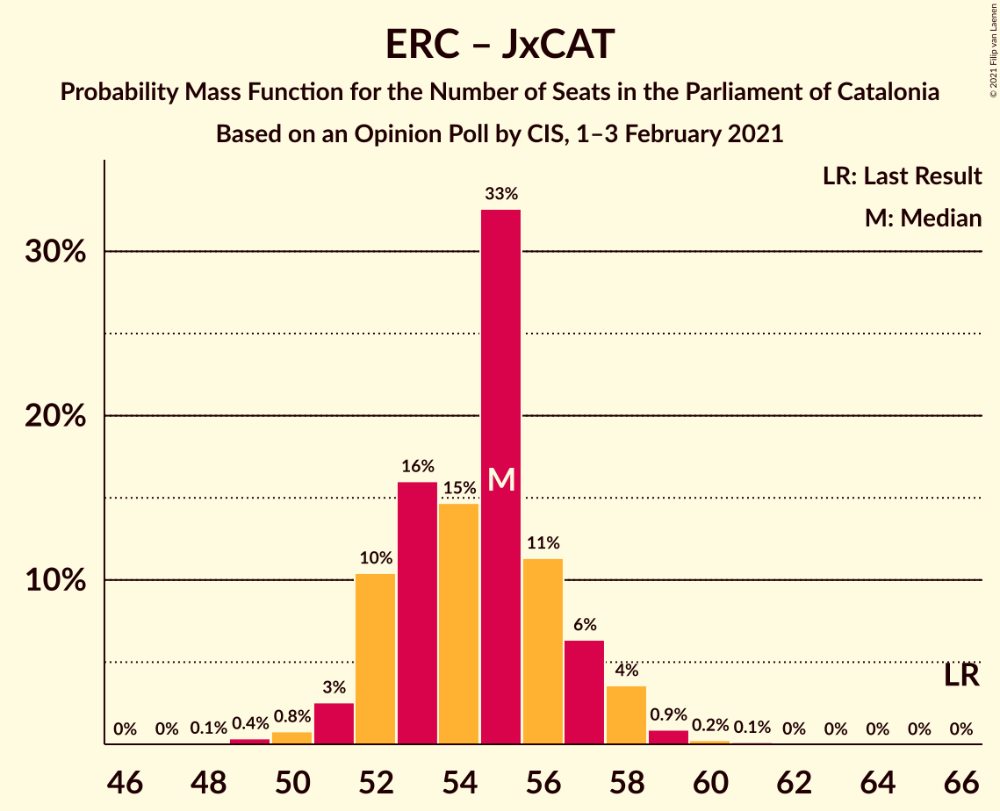

| Number of Seats | Probability | Accumulated | Special Marks |
|:---------------:|:-----------:|:-----------:|:-------------:|
| 48 | 0.1% | 100% |  |
| 49 | 0.4% | 99.9% |  |
| 50 | 0.8% | 99.6% |  |
| 51 | 3% | 98.8% |  |
| 52 | 10% | 96% |  |
| 53 | 16% | 86% |  |
| 54 | 15% | 70% | Median |
| 55 | 33% | 55% |  |
| 56 | 11% | 23% |  |
| 57 | 6% | 11% |  |
| 58 | 4% | 5% |  |
| 59 | 0.9% | 1.3% |  |
| 60 | 0.2% | 0.4% |  |
| 61 | 0.1% | 0.1% |  |
| 62 | 0% | 0% |  |
| 63 | 0% | 0% |  |
| 64 | 0% | 0% |  |
| 65 | 0% | 0% |  |
| 66 | 0% | 0% | Last Result |

### Esquerra Republicana–Catalunya Sí – Junts per Catalunya – Partit Demòcrata Europeu Català

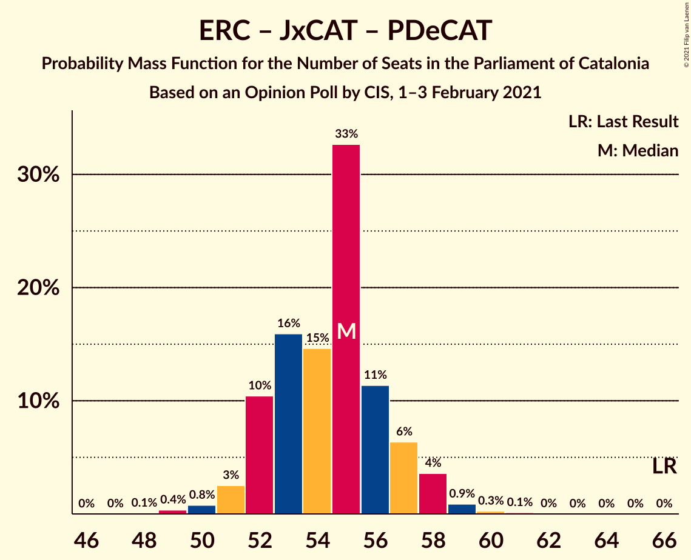

| Number of Seats | Probability | Accumulated | Special Marks |
|:---------------:|:-----------:|:-----------:|:-------------:|
| 48 | 0.1% | 100% |  |
| 49 | 0.4% | 99.9% |  |
| 50 | 0.8% | 99.6% |  |
| 51 | 3% | 98.8% |  |
| 52 | 10% | 96% |  |
| 53 | 16% | 86% |  |
| 54 | 15% | 70% | Median |
| 55 | 33% | 55% |  |
| 56 | 11% | 23% |  |
| 57 | 6% | 11% |  |
| 58 | 4% | 5% |  |
| 59 | 0.9% | 1.3% |  |
| 60 | 0.3% | 0.4% |  |
| 61 | 0.1% | 0.1% |  |
| 62 | 0% | 0% |  |
| 63 | 0% | 0% |  |
| 64 | 0% | 0% |  |
| 65 | 0% | 0% |  |
| 66 | 0% | 0% | Last Result |

### Partit dels Socialistes de Catalunya (PSC-PSOE) – Ciutadans–Partido de la Ciudadanía – Partit Popular

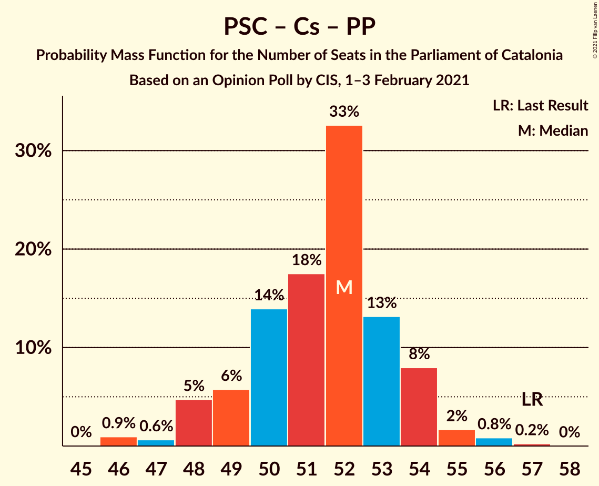

| Number of Seats | Probability | Accumulated | Special Marks |
|:---------------:|:-----------:|:-----------:|:-------------:|
| 45 | 0% | 100% |  |
| 46 | 0.9% | 99.9% |  |
| 47 | 0.6% | 99.0% |  |
| 48 | 5% | 98% |  |
| 49 | 6% | 94% |  |
| 50 | 14% | 88% |  |
| 51 | 18% | 74% |  |
| 52 | 33% | 56% | Median |
| 53 | 13% | 24% |  |
| 54 | 8% | 11% |  |
| 55 | 2% | 3% |  |
| 56 | 0.8% | 1.1% |  |
| 57 | 0.2% | 0.3% | Last Result |
| 58 | 0% | 0% |  |

### Esquerra Republicana–Catalunya Sí – Catalunya en Comú–Podem

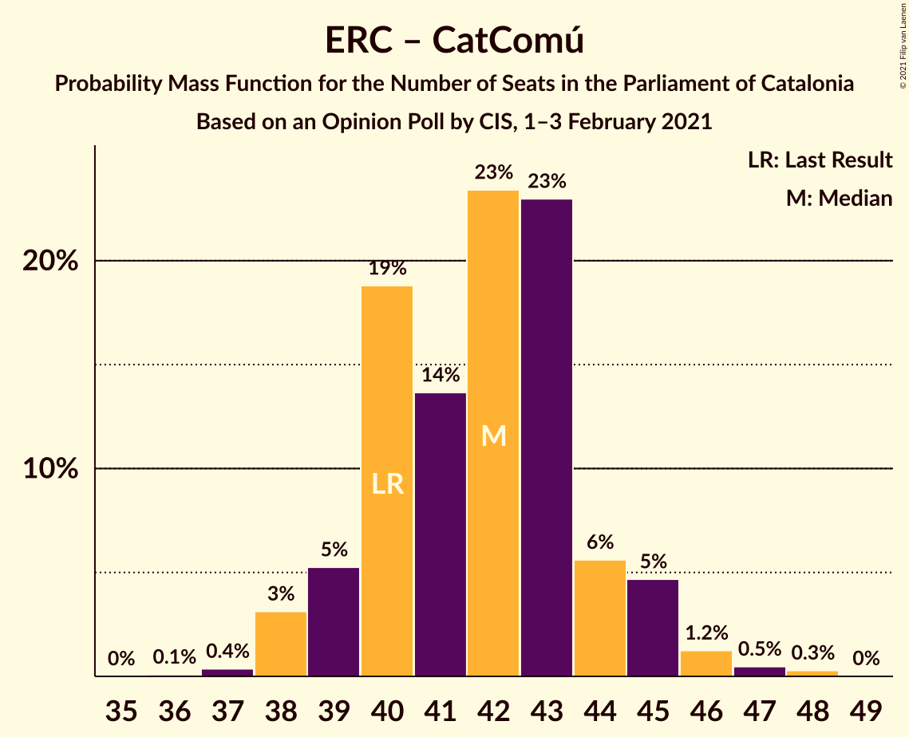

| Number of Seats | Probability | Accumulated | Special Marks |
|:---------------:|:-----------:|:-----------:|:-------------:|
| 36 | 0.1% | 100% |  |
| 37 | 0.4% | 99.9% |  |
| 38 | 3% | 99.5% |  |
| 39 | 5% | 96% |  |
| 40 | 19% | 91% | Last Result |
| 41 | 14% | 72% |  |
| 42 | 23% | 59% | Median |
| 43 | 23% | 35% |  |
| 44 | 6% | 12% |  |
| 45 | 5% | 7% |  |
| 46 | 1.2% | 2% |  |
| 47 | 0.5% | 0.8% |  |
| 48 | 0.3% | 0.3% |  |
| 49 | 0% | 0% |  |

## Technical Information

### Opinion Poll

+ **Polling firm:** CIS
+ **Commissioner(s):** —
+ **Fieldwork period:** 1–3 February 2021

### Calculations

+ **Sample size:** 1838
+ **Simulations done:** 1,048,576
+ **Error estimate:** 0.88%

