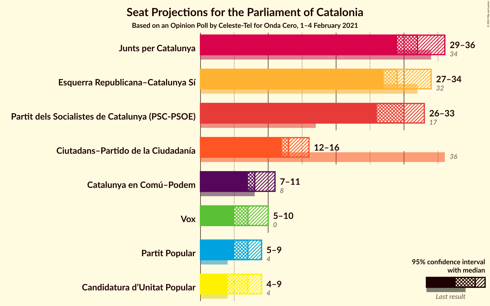

# Opinion Poll by Celeste-Tel for Onda Cero, 1–4 February 2021

<a href="#voting-intentions">Voting Intentions</a> | <a href="#seats">Seats</a> | <a href="#coalitions">Coalitions</a> | <a href="#technical-information">Technical Information</a>

## Voting Intentions

### Confidence Intervals

| Party | Last Result | Poll Result | 80% Confidence Interval | 90% Confidence Interval | 95% Confidence Interval | 99% Confidence Interval |
|:-----:|:-----------:|:-----------:|:-----------------------:|:-----------------------:|:-----------------------:|:-----------------------:|
| Partit dels Socialistes de Catalunya (PSC-PSOE) | 13.9% | 21.8% | 20.4–23.4% |20.0–23.8% |19.6–24.2% |19.0–25.0% |
| Junts per Catalunya | 21.7% | 20.0% | 18.6–21.5% |18.2–21.9% |17.9–22.3% |17.2–23.1% |
| Esquerra Republicana–Catalunya Sí | 21.4% | 19.7% | 18.3–21.2% |17.9–21.6% |17.6–22.0% |16.9–22.7% |
| Ciutadans–Partido de la Ciudadanía | 25.4% | 10.2% | 9.2–11.4% |8.9–11.8% |8.7–12.1% |8.2–12.6% |
| Catalunya en Comú–Podem | 7.5% | 7.5% | 6.6–8.6% |6.4–8.9% |6.2–9.1% |5.8–9.6% |
| Vox | 0.0% | 6.0% | 5.2–7.0% |5.0–7.2% |4.8–7.5% |4.5–7.9% |
| Partit Popular | 4.2% | 5.6% | 4.8–6.5% |4.6–6.8% |4.5–7.0% |4.1–7.5% |
| Candidatura d’Unitat Popular | 4.5% | 5.3% | 4.5–6.2% |4.3–6.4% |4.2–6.7% |3.8–7.1% |

*Note:* The poll result column reflects the actual value used in the calculations. Published results may vary slightly, and in addition be rounded to fewer digits.

## Seats

### Confidence Intervals

| Party | Last Result | Median | 80% Confidence Interval | 90% Confidence Interval | 95% Confidence Interval | 99% Confidence Interval |
|:-----:|:-----------:|:------:|:-----------------------:|:-----------------------:|:-----------------------:|:-----------------------:|
| <a href="#partit-dels-socialistes-de-catalunya-(psc-psoe)">Partit dels Socialistes de Catalunya (PSC-PSOE)</a> | 17 | 30 | 27–32 |26–33 |26–33 |26–35 |
| <a href="#junts-per-catalunya">Junts per Catalunya</a> | 34 | 32 | 30–35 |30–35 |29–36 |27–37 |
| <a href="#esquerra-republicana–catalunya-sí">Esquerra Republicana–Catalunya Sí</a> | 32 | 29 | 28–32 |27–33 |27–34 |25–35 |
| <a href="#ciutadans–partido-de-la-ciudadanía">Ciutadans–Partido de la Ciudadanía</a> | 36 | 13 | 12–15 |12–16 |12–16 |11–18 |
| <a href="#catalunya-en-comú–podem">Catalunya en Comú–Podem</a> | 8 | 8 | 7–10 |7–11 |7–11 |5–12 |
| <a href="#vox">Vox</a> | 0 | 7 | 6–9 |6–9 |5–10 |5–10 |
| <a href="#partit-popular">Partit Popular</a> | 4 | 7 | 5–9 |5–9 |5–9 |3–10 |
| <a href="#candidatura-d’unitat-popular">Candidatura d’Unitat Popular</a> | 4 | 7 | 5–8 |4–8 |4–9 |4–9 |

### Partit dels Socialistes de Catalunya (PSC-PSOE)

*For a full overview of the results for this party, see the [Partit dels Socialistes de Catalunya (PSC-PSOE)](party-partitdelssocialistesdecatalunyapsc-psoe.html) page.*

| Number of Seats | Probability | Accumulated | Special Marks |
|:---------------:|:-----------:|:-----------:|:-------------:|
| 17 | 0% | 100% | Last Result |
| 18 | 0% | 100% |  |
| 19 | 0% | 100% |  |
| 20 | 0% | 100% |  |
| 21 | 0% | 100% |  |
| 22 | 0% | 100% |  |
| 23 | 0% | 100% |  |
| 24 | 0% | 100% |  |
| 25 | 0.5% | 100% |  |
| 26 | 6% | 99.5% |  |
| 27 | 9% | 94% |  |
| 28 | 10% | 84% |  |
| 29 | 10% | 74% |  |
| 30 | 25% | 65% | Median |
| 31 | 24% | 40% |  |
| 32 | 10% | 16% |  |
| 33 | 4% | 5% |  |
| 34 | 1.1% | 2% |  |
| 35 | 0.4% | 0.5% |  |
| 36 | 0.1% | 0.2% |  |
| 37 | 0% | 0% |  |

### Junts per Catalunya

*For a full overview of the results for this party, see the [Junts per Catalunya](party-juntspercatalunya.html) page.*

| Number of Seats | Probability | Accumulated | Special Marks |
|:---------------:|:-----------:|:-----------:|:-------------:|
| 26 | 0.4% | 100% |  |
| 27 | 0.8% | 99.6% |  |
| 28 | 0.8% | 98.8% |  |
| 29 | 3% | 98% |  |
| 30 | 7% | 95% |  |
| 31 | 31% | 88% |  |
| 32 | 16% | 57% | Median |
| 33 | 22% | 41% |  |
| 34 | 7% | 19% | Last Result |
| 35 | 7% | 11% |  |
| 36 | 2% | 4% |  |
| 37 | 1.3% | 2% |  |
| 38 | 0.2% | 0.3% |  |
| 39 | 0.1% | 0.1% |  |
| 40 | 0% | 0% |  |

### Esquerra Republicana–Catalunya Sí

*For a full overview of the results for this party, see the [Esquerra Republicana–Catalunya Sí](party-esquerrarepublicana–catalunyasí.html) page.*

| Number of Seats | Probability | Accumulated | Special Marks |
|:---------------:|:-----------:|:-----------:|:-------------:|
| 24 | 0.2% | 100% |  |
| 25 | 0.5% | 99.7% |  |
| 26 | 1.4% | 99.2% |  |
| 27 | 6% | 98% |  |
| 28 | 24% | 92% |  |
| 29 | 23% | 68% | Median |
| 30 | 16% | 45% |  |
| 31 | 13% | 29% |  |
| 32 | 7% | 15% | Last Result |
| 33 | 5% | 8% |  |
| 34 | 2% | 3% |  |
| 35 | 0.6% | 0.7% |  |
| 36 | 0.1% | 0.1% |  |
| 37 | 0% | 0% |  |

### Ciutadans–Partido de la Ciudadanía

*For a full overview of the results for this party, see the [Ciutadans–Partido de la Ciudadanía](party-ciutadans–partidodelaciudadanía.html) page.*

| Number of Seats | Probability | Accumulated | Special Marks |
|:---------------:|:-----------:|:-----------:|:-------------:|
| 9 | 0.2% | 100% |  |
| 10 | 0.3% | 99.8% |  |
| 11 | 0.5% | 99.5% |  |
| 12 | 14% | 99.0% |  |
| 13 | 42% | 85% | Median |
| 14 | 28% | 43% |  |
| 15 | 6% | 15% |  |
| 16 | 7% | 9% |  |
| 17 | 1.2% | 2% |  |
| 18 | 0.5% | 0.5% |  |
| 19 | 0% | 0% |  |
| 20 | 0% | 0% |  |
| 21 | 0% | 0% |  |
| 22 | 0% | 0% |  |
| 23 | 0% | 0% |  |
| 24 | 0% | 0% |  |
| 25 | 0% | 0% |  |
| 26 | 0% | 0% |  |
| 27 | 0% | 0% |  |
| 28 | 0% | 0% |  |
| 29 | 0% | 0% |  |
| 30 | 0% | 0% |  |
| 31 | 0% | 0% |  |
| 32 | 0% | 0% |  |
| 33 | 0% | 0% |  |
| 34 | 0% | 0% |  |
| 35 | 0% | 0% |  |
| 36 | 0% | 0% | Last Result |

### Catalunya en Comú–Podem

*For a full overview of the results for this party, see the [Catalunya en Comú–Podem](party-catalunyaencomú–podem.html) page.*

| Number of Seats | Probability | Accumulated | Special Marks |
|:---------------:|:-----------:|:-----------:|:-------------:|
| 5 | 0.5% | 100% |  |
| 6 | 2% | 99.5% |  |
| 7 | 10% | 98% |  |
| 8 | 41% | 88% | Last Result, Median |
| 9 | 17% | 46% |  |
| 10 | 21% | 29% |  |
| 11 | 8% | 9% |  |
| 12 | 0.4% | 0.6% |  |
| 13 | 0.1% | 0.2% |  |
| 14 | 0% | 0% |  |

### Vox

*For a full overview of the results for this party, see the [Vox](party-vox.html) page.*

| Number of Seats | Probability | Accumulated | Special Marks |
|:---------------:|:-----------:|:-----------:|:-------------:|
| 0 | 0% | 100% | Last Result |
| 1 | 0% | 100% |  |
| 2 | 0% | 100% |  |
| 3 | 0.1% | 100% |  |
| 4 | 0.1% | 99.9% |  |
| 5 | 4% | 99.8% |  |
| 6 | 9% | 96% |  |
| 7 | 52% | 87% | Median |
| 8 | 7% | 35% |  |
| 9 | 26% | 29% |  |
| 10 | 3% | 3% |  |
| 11 | 0.2% | 0.3% |  |
| 12 | 0% | 0.1% |  |
| 13 | 0% | 0% |  |

### Partit Popular

*For a full overview of the results for this party, see the [Partit Popular](party-partitpopular.html) page.*

| Number of Seats | Probability | Accumulated | Special Marks |
|:---------------:|:-----------:|:-----------:|:-------------:|
| 3 | 0.6% | 100% |  |
| 4 | 0.8% | 99.4% | Last Result |
| 5 | 11% | 98.6% |  |
| 6 | 20% | 88% |  |
| 7 | 53% | 68% | Median |
| 8 | 3% | 15% |  |
| 9 | 11% | 12% |  |
| 10 | 0.6% | 0.7% |  |
| 11 | 0% | 0% |  |

### Candidatura d’Unitat Popular

*For a full overview of the results for this party, see the [Candidatura d’Unitat Popular](party-candidaturad’unitatpopular.html) page.*

| Number of Seats | Probability | Accumulated | Special Marks |
|:---------------:|:-----------:|:-----------:|:-------------:|
| 3 | 0.2% | 100% |  |
| 4 | 7% | 99.8% | Last Result |
| 5 | 5% | 93% |  |
| 6 | 12% | 87% |  |
| 7 | 40% | 76% | Median |
| 8 | 33% | 36% |  |
| 9 | 3% | 3% |  |
| 10 | 0.4% | 0.4% |  |
| 11 | 0% | 0% |  |

## Coalitions

### Confidence Intervals

| Coalition | Last Result | Median | Majority? | 80% Confidence Interval | 90% Confidence Interval | 95% Confidence Interval | 99% Confidence Interval |
|:---------:|:-----------:|:------:|:---------:|:-----------------------:|:-----------------------:|:-----------------------:|:-----------------------:|
| Junts per Catalunya – Esquerra Republicana–Catalunya Sí – Catalunya en Comú–Podem | 74 | 71 | 85% | 67–74 | 67–74 | 66–74 | 65–76 |
| Junts per Catalunya – Esquerra Republicana–Catalunya Sí – Candidatura d’Unitat Popular | 70 | 69 | 66% | 66–71 | 65–73 | 65–73 | 63–75 |
| Partit dels Socialistes de Catalunya (PSC-PSOE) – Esquerra Republicana–Catalunya Sí – Catalunya en Comú–Podem | 57 | 68 | 54% | 65–71 | 65–72 | 64–73 | 62–74 |
| Junts per Catalunya – Esquerra Republicana–Catalunya Sí | 66 | 62 | 0.5% | 59–65 | 58–66 | 58–66 | 56–67 |
| Partit dels Socialistes de Catalunya (PSC-PSOE) – Ciutadans–Partido de la Ciudadanía – Catalunya en Comú–Podem – Partit Popular | 65 | 59 | 0% | 56–61 | 55–62 | 54–63 | 53–64 |
| Partit dels Socialistes de Catalunya (PSC-PSOE) – Ciutadans–Partido de la Ciudadanía – Vox – Partit Popular | 57 | 58 | 0% | 54–61 | 54–61 | 53–62 | 52–63 |
| Partit dels Socialistes de Catalunya (PSC-PSOE) – Ciutadans–Partido de la Ciudadanía – Partit Popular | 57 | 50 | 0% | 47–53 | 46–54 | 46–54 | 45–56 |
| Esquerra Republicana–Catalunya Sí – Catalunya en Comú–Podem | 40 | 38 | 0% | 36–41 | 35–42 | 35–43 | 33–44 |

### Junts per Catalunya – Esquerra Republicana–Catalunya Sí – Catalunya en Comú–Podem

| Number of Seats | Probability | Accumulated | Special Marks |
|:---------------:|:-----------:|:-----------:|:-------------:|
| 63 | 0% | 100% |  |
| 64 | 0.3% | 99.9% |  |
| 65 | 0.7% | 99.6% |  |
| 66 | 2% | 98.9% |  |
| 67 | 12% | 97% |  |
| 68 | 16% | 85% | Majority |
| 69 | 11% | 69% | Median |
| 70 | 7% | 58% |  |
| 71 | 9% | 51% |  |
| 72 | 17% | 43% |  |
| 73 | 16% | 26% |  |
| 74 | 8% | 10% | Last Result |
| 75 | 2% | 2% |  |
| 76 | 0.4% | 0.6% |  |
| 77 | 0.1% | 0.2% |  |
| 78 | 0.1% | 0.1% |  |
| 79 | 0% | 0.1% |  |
| 80 | 0% | 0% |  |

### Junts per Catalunya – Esquerra Republicana–Catalunya Sí – Candidatura d’Unitat Popular

| Number of Seats | Probability | Accumulated | Special Marks |
|:---------------:|:-----------:|:-----------:|:-------------:|
| 61 | 0% | 100% |  |
| 62 | 0.2% | 99.9% |  |
| 63 | 0.4% | 99.8% |  |
| 64 | 1.4% | 99.3% |  |
| 65 | 3% | 98% |  |
| 66 | 10% | 95% |  |
| 67 | 19% | 85% |  |
| 68 | 15% | 66% | Median, Majority |
| 69 | 17% | 51% |  |
| 70 | 13% | 34% | Last Result |
| 71 | 11% | 21% |  |
| 72 | 4% | 10% |  |
| 73 | 3% | 6% |  |
| 74 | 2% | 2% |  |
| 75 | 0.6% | 0.7% |  |
| 76 | 0.1% | 0.1% |  |
| 77 | 0% | 0% |  |

### Partit dels Socialistes de Catalunya (PSC-PSOE) – Esquerra Republicana–Catalunya Sí – Catalunya en Comú–Podem

| Number of Seats | Probability | Accumulated | Special Marks |
|:---------------:|:-----------:|:-----------:|:-------------:|
| 57 | 0% | 100% | Last Result |
| 58 | 0% | 100% |  |
| 59 | 0% | 100% |  |
| 60 | 0% | 100% |  |
| 61 | 0.1% | 100% |  |
| 62 | 0.4% | 99.8% |  |
| 63 | 1.4% | 99.4% |  |
| 64 | 2% | 98% |  |
| 65 | 6% | 96% |  |
| 66 | 10% | 90% |  |
| 67 | 26% | 80% | Median |
| 68 | 16% | 54% | Majority |
| 69 | 11% | 38% |  |
| 70 | 12% | 27% |  |
| 71 | 8% | 15% |  |
| 72 | 3% | 6% |  |
| 73 | 2% | 4% |  |
| 74 | 1.0% | 1.2% |  |
| 75 | 0.2% | 0.3% |  |
| 76 | 0.1% | 0.1% |  |
| 77 | 0% | 0% |  |

### Junts per Catalunya – Esquerra Republicana–Catalunya Sí

| Number of Seats | Probability | Accumulated | Special Marks |
|:---------------:|:-----------:|:-----------:|:-------------:|
| 55 | 0.1% | 100% |  |
| 56 | 0.4% | 99.8% |  |
| 57 | 2% | 99.4% |  |
| 58 | 3% | 98% |  |
| 59 | 14% | 94% |  |
| 60 | 17% | 80% |  |
| 61 | 11% | 63% | Median |
| 62 | 13% | 52% |  |
| 63 | 13% | 39% |  |
| 64 | 13% | 26% |  |
| 65 | 7% | 12% |  |
| 66 | 4% | 6% | Last Result |
| 67 | 1.0% | 2% |  |
| 68 | 0.4% | 0.5% | Majority |
| 69 | 0.1% | 0.1% |  |
| 70 | 0% | 0% |  |

### Partit dels Socialistes de Catalunya (PSC-PSOE) – Ciutadans–Partido de la Ciudadanía – Catalunya en Comú–Podem – Partit Popular

| Number of Seats | Probability | Accumulated | Special Marks |
|:---------------:|:-----------:|:-----------:|:-------------:|
| 52 | 0.3% | 100% |  |
| 53 | 0.8% | 99.7% |  |
| 54 | 2% | 98.9% |  |
| 55 | 5% | 97% |  |
| 56 | 6% | 92% |  |
| 57 | 12% | 86% |  |
| 58 | 15% | 74% | Median |
| 59 | 22% | 59% |  |
| 60 | 13% | 37% |  |
| 61 | 15% | 24% |  |
| 62 | 6% | 9% |  |
| 63 | 2% | 4% |  |
| 64 | 1.1% | 1.4% |  |
| 65 | 0.3% | 0.4% | Last Result |
| 66 | 0.1% | 0.1% |  |
| 67 | 0% | 0% |  |

### Partit dels Socialistes de Catalunya (PSC-PSOE) – Ciutadans–Partido de la Ciudadanía – Vox – Partit Popular

| Number of Seats | Probability | Accumulated | Special Marks |
|:---------------:|:-----------:|:-----------:|:-------------:|
| 51 | 0.2% | 100% |  |
| 52 | 0.9% | 99.8% |  |
| 53 | 4% | 98.9% |  |
| 54 | 6% | 95% |  |
| 55 | 7% | 90% |  |
| 56 | 15% | 82% |  |
| 57 | 15% | 67% | Last Result, Median |
| 58 | 15% | 52% |  |
| 59 | 11% | 37% |  |
| 60 | 16% | 26% |  |
| 61 | 7% | 10% |  |
| 62 | 1.5% | 3% |  |
| 63 | 1.2% | 2% |  |
| 64 | 0.2% | 0.3% |  |
| 65 | 0.1% | 0.1% |  |
| 66 | 0% | 0% |  |

### Partit dels Socialistes de Catalunya (PSC-PSOE) – Ciutadans–Partido de la Ciudadanía – Partit Popular

| Number of Seats | Probability | Accumulated | Special Marks |
|:---------------:|:-----------:|:-----------:|:-------------:|
| 43 | 0% | 100% |  |
| 44 | 0.3% | 99.9% |  |
| 45 | 1.5% | 99.6% |  |
| 46 | 5% | 98% |  |
| 47 | 7% | 93% |  |
| 48 | 7% | 86% |  |
| 49 | 17% | 79% |  |
| 50 | 16% | 62% | Median |
| 51 | 20% | 46% |  |
| 52 | 11% | 26% |  |
| 53 | 8% | 14% |  |
| 54 | 4% | 6% |  |
| 55 | 1.1% | 2% |  |
| 56 | 0.6% | 0.7% |  |
| 57 | 0.1% | 0.2% | Last Result |
| 58 | 0% | 0.1% |  |
| 59 | 0% | 0% |  |

### Esquerra Republicana–Catalunya Sí – Catalunya en Comú–Podem

| Number of Seats | Probability | Accumulated | Special Marks |
|:---------------:|:-----------:|:-----------:|:-------------:|
| 32 | 0.2% | 100% |  |
| 33 | 0.4% | 99.8% |  |
| 34 | 2% | 99.3% |  |
| 35 | 6% | 98% |  |
| 36 | 14% | 92% |  |
| 37 | 23% | 78% | Median |
| 38 | 11% | 55% |  |
| 39 | 13% | 44% |  |
| 40 | 14% | 31% | Last Result |
| 41 | 9% | 17% |  |
| 42 | 5% | 8% |  |
| 43 | 3% | 3% |  |
| 44 | 0.6% | 0.7% |  |
| 45 | 0.1% | 0.2% |  |
| 46 | 0% | 0% |  |

## Technical Information

### Opinion Poll

+ **Polling firm:** Celeste-Tel
+ **Commissioner(s):** Onda Cero
+ **Fieldwork period:** 1–4 February 2021

### Calculations

+ **Sample size:** 1250
+ **Simulations done:** 1,048,576
+ **Error estimate:** 2.27%

