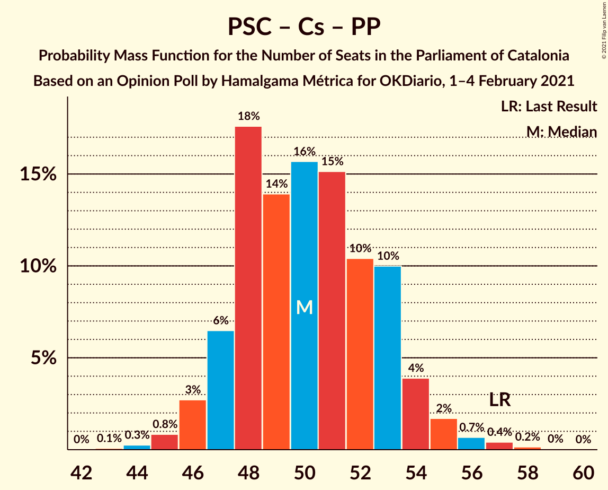

# Opinion Poll by Hamalgama Métrica for OKDiario, 1–4 February 2021

<a href="#voting-intentions">Voting Intentions</a> | <a href="#seats">Seats</a> | <a href="#coalitions">Coalitions</a> | <a href="#technical-information">Technical Information</a>

## Voting Intentions

### Confidence Intervals

| Party | Last Result | Poll Result | 80% Confidence Interval | 90% Confidence Interval | 95% Confidence Interval | 99% Confidence Interval |
|:-----:|:-----------:|:-----------:|:-----------------------:|:-----------------------:|:-----------------------:|:-----------------------:|
| Junts per Catalunya | 21.7% | 20.3% | 18.7–22.0% |18.3–22.5% |17.9–22.9% |17.2–23.7% |
| Partit dels Socialistes de Catalunya (PSC-PSOE) | 13.9% | 20.2% | 18.6–21.9% |18.2–22.4% |17.8–22.8% |17.1–23.6% |
| Esquerra Republicana–Catalunya Sí | 21.4% | 20.0% | 18.4–21.7% |18.0–22.2% |17.6–22.6% |16.9–23.4% |
| Ciutadans–Partido de la Ciudadanía | 25.4% | 11.8% | 10.6–13.2% |10.2–13.6% |9.9–14.0% |9.4–14.7% |
| Catalunya en Comú–Podem | 7.5% | 7.2% | 6.2–8.4% |6.0–8.7% |5.7–9.0% |5.3–9.6% |
| Partit Popular | 4.2% | 5.8% | 5.0–6.9% |4.7–7.2% |4.5–7.4% |4.1–8.0% |
| Vox | 0.0% | 5.5% | 4.7–6.5% |4.4–6.8% |4.3–7.1% |3.9–7.6% |
| Candidatura d’Unitat Popular | 4.5% | 5.4% | 4.6–6.4% |4.3–6.7% |4.2–7.0% |3.8–7.5% |

*Note:* The poll result column reflects the actual value used in the calculations. Published results may vary slightly, and in addition be rounded to fewer digits.

## Seats

### Confidence Intervals

| Party | Last Result | Median | 80% Confidence Interval | 90% Confidence Interval | 95% Confidence Interval | 99% Confidence Interval |
|:-----:|:-----------:|:------:|:-----------------------:|:-----------------------:|:-----------------------:|:-----------------------:|
| <a href="#junts-per-catalunya">Junts per Catalunya</a> | 34 | 32 | 30–35 |30–36 |29–37 |27–39 |
| <a href="#partit-dels-socialistes-de-catalunya-(psc-psoe)">Partit dels Socialistes de Catalunya (PSC-PSOE)</a> | 17 | 27 | 25–30 |25–31 |24–31 |24–33 |
| <a href="#esquerra-republicana–catalunya-sí">Esquerra Republicana–Catalunya Sí</a> | 32 | 30 | 28–33 |27–34 |27–35 |25–35 |
| <a href="#ciutadans–partido-de-la-ciudadanía">Ciutadans–Partido de la Ciudadanía</a> | 36 | 16 | 14–18 |13–18 |13–19 |13–19 |
| <a href="#catalunya-en-comú–podem">Catalunya en Comú–Podem</a> | 8 | 8 | 7–10 |6–10 |6–11 |5–11 |
| <a href="#partit-popular">Partit Popular</a> | 4 | 7 | 6–9 |5–9 |5–9 |3–10 |
| <a href="#vox">Vox</a> | 0 | 7 | 5–8 |5–9 |5–9 |3–10 |
| <a href="#candidatura-d’unitat-popular">Candidatura d’Unitat Popular</a> | 4 | 7 | 6–8 |4–8 |4–9 |4–10 |

### Junts per Catalunya

*For a full overview of the results for this party, see the [Junts per Catalunya](party-juntspercatalunya.html) page.*

| Number of Seats | Probability | Accumulated | Special Marks |
|:---------------:|:-----------:|:-----------:|:-------------:|
| 26 | 0.3% | 100% |  |
| 27 | 0.6% | 99.7% |  |
| 28 | 0.9% | 99.0% |  |
| 29 | 2% | 98% |  |
| 30 | 7% | 96% |  |
| 31 | 24% | 89% |  |
| 32 | 21% | 65% | Median |
| 33 | 16% | 44% |  |
| 34 | 11% | 28% | Last Result |
| 35 | 7% | 16% |  |
| 36 | 4% | 9% |  |
| 37 | 3% | 5% |  |
| 38 | 1.1% | 2% |  |
| 39 | 0.5% | 0.6% |  |
| 40 | 0.1% | 0.1% |  |
| 41 | 0% | 0% |  |

### Partit dels Socialistes de Catalunya (PSC-PSOE)

*For a full overview of the results for this party, see the [Partit dels Socialistes de Catalunya (PSC-PSOE)](party-partitdelssocialistesdecatalunyapsc-psoe.html) page.*

| Number of Seats | Probability | Accumulated | Special Marks |
|:---------------:|:-----------:|:-----------:|:-------------:|
| 17 | 0% | 100% | Last Result |
| 18 | 0% | 100% |  |
| 19 | 0% | 100% |  |
| 20 | 0% | 100% |  |
| 21 | 0% | 100% |  |
| 22 | 0.1% | 100% |  |
| 23 | 0.3% | 99.9% |  |
| 24 | 3% | 99.6% |  |
| 25 | 12% | 97% |  |
| 26 | 26% | 84% |  |
| 27 | 17% | 58% | Median |
| 28 | 9% | 41% |  |
| 29 | 12% | 31% |  |
| 30 | 11% | 20% |  |
| 31 | 7% | 9% |  |
| 32 | 2% | 2% |  |
| 33 | 0.4% | 0.5% |  |
| 34 | 0.1% | 0.1% |  |
| 35 | 0% | 0% |  |

### Esquerra Republicana–Catalunya Sí

*For a full overview of the results for this party, see the [Esquerra Republicana–Catalunya Sí](party-esquerrarepublicana–catalunyasí.html) page.*

| Number of Seats | Probability | Accumulated | Special Marks |
|:---------------:|:-----------:|:-----------:|:-------------:|
| 24 | 0.2% | 100% |  |
| 25 | 0.3% | 99.8% |  |
| 26 | 0.8% | 99.4% |  |
| 27 | 4% | 98.6% |  |
| 28 | 16% | 95% |  |
| 29 | 16% | 79% |  |
| 30 | 19% | 63% | Median |
| 31 | 21% | 44% |  |
| 32 | 8% | 23% | Last Result |
| 33 | 8% | 15% |  |
| 34 | 4% | 7% |  |
| 35 | 2% | 3% |  |
| 36 | 0.3% | 0.4% |  |
| 37 | 0.1% | 0.1% |  |
| 38 | 0% | 0% |  |

### Ciutadans–Partido de la Ciudadanía

*For a full overview of the results for this party, see the [Ciutadans–Partido de la Ciudadanía](party-ciutadans–partidodelaciudadanía.html) page.*

| Number of Seats | Probability | Accumulated | Special Marks |
|:---------------:|:-----------:|:-----------:|:-------------:|
| 12 | 0.4% | 100% |  |
| 13 | 7% | 99.6% |  |
| 14 | 23% | 93% |  |
| 15 | 16% | 69% |  |
| 16 | 27% | 54% | Median |
| 17 | 11% | 27% |  |
| 18 | 12% | 16% |  |
| 19 | 3% | 4% |  |
| 20 | 0.3% | 0.4% |  |
| 21 | 0.1% | 0.1% |  |
| 22 | 0% | 0% |  |
| 23 | 0% | 0% |  |
| 24 | 0% | 0% |  |
| 25 | 0% | 0% |  |
| 26 | 0% | 0% |  |
| 27 | 0% | 0% |  |
| 28 | 0% | 0% |  |
| 29 | 0% | 0% |  |
| 30 | 0% | 0% |  |
| 31 | 0% | 0% |  |
| 32 | 0% | 0% |  |
| 33 | 0% | 0% |  |
| 34 | 0% | 0% |  |
| 35 | 0% | 0% |  |
| 36 | 0% | 0% | Last Result |

### Catalunya en Comú–Podem

*For a full overview of the results for this party, see the [Catalunya en Comú–Podem](party-catalunyaencomú–podem.html) page.*

| Number of Seats | Probability | Accumulated | Special Marks |
|:---------------:|:-----------:|:-----------:|:-------------:|
| 5 | 2% | 100% |  |
| 6 | 4% | 98% |  |
| 7 | 19% | 94% |  |
| 8 | 48% | 75% | Last Result, Median |
| 9 | 10% | 27% |  |
| 10 | 13% | 18% |  |
| 11 | 4% | 5% |  |
| 12 | 0.3% | 0.4% |  |
| 13 | 0.2% | 0.2% |  |
| 14 | 0% | 0% |  |

### Partit Popular

*For a full overview of the results for this party, see the [Partit Popular](party-partitpopular.html) page.*

| Number of Seats | Probability | Accumulated | Special Marks |
|:---------------:|:-----------:|:-----------:|:-------------:|
| 3 | 0.5% | 100% |  |
| 4 | 0.4% | 99.5% | Last Result |
| 5 | 8% | 99.1% |  |
| 6 | 18% | 91% |  |
| 7 | 49% | 74% | Median |
| 8 | 7% | 25% |  |
| 9 | 16% | 18% |  |
| 10 | 2% | 2% |  |
| 11 | 0.2% | 0.3% |  |
| 12 | 0.1% | 0.1% |  |
| 13 | 0% | 0% |  |

### Vox

*For a full overview of the results for this party, see the [Vox](party-vox.html) page.*

| Number of Seats | Probability | Accumulated | Special Marks |
|:---------------:|:-----------:|:-----------:|:-------------:|
| 0 | 0% | 100% | Last Result |
| 1 | 0% | 100% |  |
| 2 | 0% | 100% |  |
| 3 | 1.2% | 100% |  |
| 4 | 0.8% | 98.8% |  |
| 5 | 10% | 98% |  |
| 6 | 15% | 88% |  |
| 7 | 57% | 73% | Median |
| 8 | 7% | 16% |  |
| 9 | 8% | 9% |  |
| 10 | 0.5% | 0.6% |  |
| 11 | 0.1% | 0.1% |  |
| 12 | 0% | 0% |  |

### Candidatura d’Unitat Popular

*For a full overview of the results for this party, see the [Candidatura d’Unitat Popular](party-candidaturad’unitatpopular.html) page.*

| Number of Seats | Probability | Accumulated | Special Marks |
|:---------------:|:-----------:|:-----------:|:-------------:|
| 3 | 0.2% | 100% |  |
| 4 | 7% | 99.8% | Last Result |
| 5 | 3% | 93% |  |
| 6 | 14% | 90% |  |
| 7 | 33% | 76% | Median |
| 8 | 38% | 43% |  |
| 9 | 4% | 5% |  |
| 10 | 0.6% | 0.8% |  |
| 11 | 0.2% | 0.2% |  |
| 12 | 0% | 0% |  |

## Coalitions

### Confidence Intervals

| Coalition | Last Result | Median | Majority? | 80% Confidence Interval | 90% Confidence Interval | 95% Confidence Interval | 99% Confidence Interval |
|:---------:|:-----------:|:------:|:---------:|:-----------------------:|:-----------------------:|:-----------------------:|:-----------------------:|
| Junts per Catalunya – Esquerra Republicana–Catalunya Sí – Catalunya en Comú–Podem | 74 | 71 | 93% | 68–74 | 67–75 | 66–76 | 65–77 |
| Junts per Catalunya – Esquerra Republicana–Catalunya Sí – Candidatura d’Unitat Popular | 70 | 70 | 82% | 67–73 | 66–74 | 65–75 | 64–77 |
| Partit dels Socialistes de Catalunya (PSC-PSOE) – Esquerra Republicana–Catalunya Sí – Catalunya en Comú–Podem | 57 | 66 | 21% | 63–69 | 62–70 | 61–71 | 60–73 |
| Junts per Catalunya – Esquerra Republicana–Catalunya Sí | 66 | 63 | 2% | 60–66 | 59–67 | 58–67 | 57–70 |
| Partit dels Socialistes de Catalunya (PSC-PSOE) – Ciutadans–Partido de la Ciudadanía – Catalunya en Comú–Podem – Partit Popular | 65 | 58 | 0% | 55–61 | 55–62 | 54–63 | 52–65 |
| Partit dels Socialistes de Catalunya (PSC-PSOE) – Ciutadans–Partido de la Ciudadanía – Partit Popular – Vox | 57 | 57 | 0% | 54–60 | 53–61 | 52–62 | 51–63 |
| Partit dels Socialistes de Catalunya (PSC-PSOE) – Ciutadans–Partido de la Ciudadanía – Partit Popular | 57 | 50 | 0% | 47–53 | 47–54 | 46–55 | 45–57 |
| Esquerra Republicana–Catalunya Sí – Catalunya en Comú–Podem | 40 | 38 | 0% | 36–41 | 35–42 | 34–43 | 33–44 |

### Junts per Catalunya – Esquerra Republicana–Catalunya Sí – Catalunya en Comú–Podem

| Number of Seats | Probability | Accumulated | Special Marks |
|:---------------:|:-----------:|:-----------:|:-------------:|
| 63 | 0.1% | 100% |  |
| 64 | 0.3% | 99.9% |  |
| 65 | 0.8% | 99.6% |  |
| 66 | 2% | 98.7% |  |
| 67 | 4% | 97% |  |
| 68 | 8% | 93% | Majority |
| 69 | 14% | 85% |  |
| 70 | 11% | 71% | Median |
| 71 | 18% | 60% |  |
| 72 | 15% | 42% |  |
| 73 | 15% | 27% |  |
| 74 | 4% | 12% | Last Result |
| 75 | 4% | 7% |  |
| 76 | 1.4% | 3% |  |
| 77 | 1.2% | 2% |  |
| 78 | 0.2% | 0.4% |  |
| 79 | 0.1% | 0.1% |  |
| 80 | 0% | 0% |  |

### Junts per Catalunya – Esquerra Republicana–Catalunya Sí – Candidatura d’Unitat Popular

| Number of Seats | Probability | Accumulated | Special Marks |
|:---------------:|:-----------:|:-----------:|:-------------:|
| 62 | 0.1% | 100% |  |
| 63 | 0.3% | 99.9% |  |
| 64 | 0.8% | 99.6% |  |
| 65 | 2% | 98.7% |  |
| 66 | 5% | 97% |  |
| 67 | 10% | 92% |  |
| 68 | 14% | 82% | Majority |
| 69 | 16% | 68% | Median |
| 70 | 13% | 53% | Last Result |
| 71 | 8% | 40% |  |
| 72 | 17% | 31% |  |
| 73 | 8% | 14% |  |
| 74 | 3% | 6% |  |
| 75 | 1.2% | 3% |  |
| 76 | 0.8% | 1.4% |  |
| 77 | 0.4% | 0.7% |  |
| 78 | 0.2% | 0.2% |  |
| 79 | 0% | 0% |  |

### Partit dels Socialistes de Catalunya (PSC-PSOE) – Esquerra Republicana–Catalunya Sí – Catalunya en Comú–Podem

| Number of Seats | Probability | Accumulated | Special Marks |
|:---------------:|:-----------:|:-----------:|:-------------:|
| 57 | 0% | 100% | Last Result |
| 58 | 0.1% | 100% |  |
| 59 | 0.3% | 99.9% |  |
| 60 | 0.6% | 99.6% |  |
| 61 | 2% | 99.0% |  |
| 62 | 5% | 97% |  |
| 63 | 6% | 92% |  |
| 64 | 13% | 85% |  |
| 65 | 14% | 72% | Median |
| 66 | 17% | 57% |  |
| 67 | 20% | 41% |  |
| 68 | 8% | 21% | Majority |
| 69 | 6% | 12% |  |
| 70 | 3% | 6% |  |
| 71 | 2% | 3% |  |
| 72 | 1.0% | 2% |  |
| 73 | 0.6% | 0.7% |  |
| 74 | 0.1% | 0.1% |  |
| 75 | 0% | 0% |  |

### Junts per Catalunya – Esquerra Republicana–Catalunya Sí

| Number of Seats | Probability | Accumulated | Special Marks |
|:---------------:|:-----------:|:-----------:|:-------------:|
| 55 | 0.1% | 100% |  |
| 56 | 0.2% | 99.9% |  |
| 57 | 0.9% | 99.7% |  |
| 58 | 2% | 98.9% |  |
| 59 | 5% | 97% |  |
| 60 | 8% | 92% |  |
| 61 | 19% | 84% |  |
| 62 | 13% | 65% | Median |
| 63 | 12% | 53% |  |
| 64 | 14% | 41% |  |
| 65 | 16% | 27% |  |
| 66 | 5% | 11% | Last Result |
| 67 | 3% | 6% |  |
| 68 | 1.1% | 2% | Majority |
| 69 | 0.6% | 1.4% |  |
| 70 | 0.5% | 0.7% |  |
| 71 | 0.2% | 0.2% |  |
| 72 | 0% | 0% |  |

### Partit dels Socialistes de Catalunya (PSC-PSOE) – Ciutadans–Partido de la Ciudadanía – Catalunya en Comú–Podem – Partit Popular

| Number of Seats | Probability | Accumulated | Special Marks |
|:---------------:|:-----------:|:-----------:|:-------------:|
| 51 | 0.1% | 100% |  |
| 52 | 0.4% | 99.8% |  |
| 53 | 0.8% | 99.4% |  |
| 54 | 3% | 98.7% |  |
| 55 | 7% | 96% |  |
| 56 | 18% | 89% |  |
| 57 | 11% | 72% |  |
| 58 | 13% | 60% | Median |
| 59 | 14% | 48% |  |
| 60 | 14% | 33% |  |
| 61 | 11% | 19% |  |
| 62 | 5% | 8% |  |
| 63 | 2% | 4% |  |
| 64 | 1.0% | 2% |  |
| 65 | 0.3% | 0.6% | Last Result |
| 66 | 0.2% | 0.2% |  |
| 67 | 0% | 0.1% |  |
| 68 | 0% | 0% | Majority |

### Partit dels Socialistes de Catalunya (PSC-PSOE) – Ciutadans–Partido de la Ciudadanía – Partit Popular – Vox

| Number of Seats | Probability | Accumulated | Special Marks |
|:---------------:|:-----------:|:-----------:|:-------------:|
| 49 | 0% | 100% |  |
| 50 | 0.4% | 99.9% |  |
| 51 | 1.0% | 99.6% |  |
| 52 | 2% | 98.6% |  |
| 53 | 4% | 96% |  |
| 54 | 6% | 93% |  |
| 55 | 16% | 87% |  |
| 56 | 17% | 71% |  |
| 57 | 13% | 54% | Last Result, Median |
| 58 | 11% | 41% |  |
| 59 | 13% | 30% |  |
| 60 | 9% | 16% |  |
| 61 | 4% | 7% |  |
| 62 | 2% | 3% |  |
| 63 | 0.5% | 0.9% |  |
| 64 | 0.3% | 0.4% |  |
| 65 | 0.1% | 0.1% |  |
| 66 | 0% | 0% |  |

### Partit dels Socialistes de Catalunya (PSC-PSOE) – Ciutadans–Partido de la Ciudadanía – Partit Popular

| Number of Seats | Probability | Accumulated | Special Marks |
|:---------------:|:-----------:|:-----------:|:-------------:|
| 43 | 0.1% | 100% |  |
| 44 | 0.3% | 99.9% |  |
| 45 | 0.8% | 99.7% |  |
| 46 | 3% | 98.8% |  |
| 47 | 6% | 96% |  |
| 48 | 18% | 90% |  |
| 49 | 14% | 72% |  |
| 50 | 16% | 58% | Median |
| 51 | 15% | 42% |  |
| 52 | 10% | 27% |  |
| 53 | 10% | 17% |  |
| 54 | 4% | 7% |  |
| 55 | 2% | 3% |  |
| 56 | 0.7% | 1.3% |  |
| 57 | 0.4% | 0.6% | Last Result |
| 58 | 0.2% | 0.2% |  |
| 59 | 0% | 0.1% |  |
| 60 | 0% | 0% |  |

### Esquerra Republicana–Catalunya Sí – Catalunya en Comú–Podem

| Number of Seats | Probability | Accumulated | Special Marks |
|:---------------:|:-----------:|:-----------:|:-------------:|
| 31 | 0.1% | 100% |  |
| 32 | 0.2% | 99.9% |  |
| 33 | 0.6% | 99.7% |  |
| 34 | 2% | 99.1% |  |
| 35 | 4% | 97% |  |
| 36 | 12% | 93% |  |
| 37 | 15% | 82% |  |
| 38 | 20% | 67% | Median |
| 39 | 17% | 46% |  |
| 40 | 13% | 30% | Last Result |
| 41 | 9% | 17% |  |
| 42 | 4% | 8% |  |
| 43 | 2% | 4% |  |
| 44 | 1.4% | 2% |  |
| 45 | 0.2% | 0.3% |  |
| 46 | 0.1% | 0.1% |  |
| 47 | 0% | 0% |  |

## Technical Information

### Opinion Poll

+ **Polling firm:** Hamalgama Métrica
+ **Commissioner(s):** OKDiario
+ **Fieldwork period:** 1–4 February 2021

### Calculations

+ **Sample size:** 1000
+ **Simulations done:** 1,048,576
+ **Error estimate:** 1.31%

