# Opinion Poll by Opinòmetre for Ara, 1–4 February 2021

<a href="#voting-intentions">Voting Intentions</a> | <a href="#seats">Seats</a> | <a href="#coalitions">Coalitions</a> | <a href="#technical-information">Technical Information</a>

## Voting Intentions

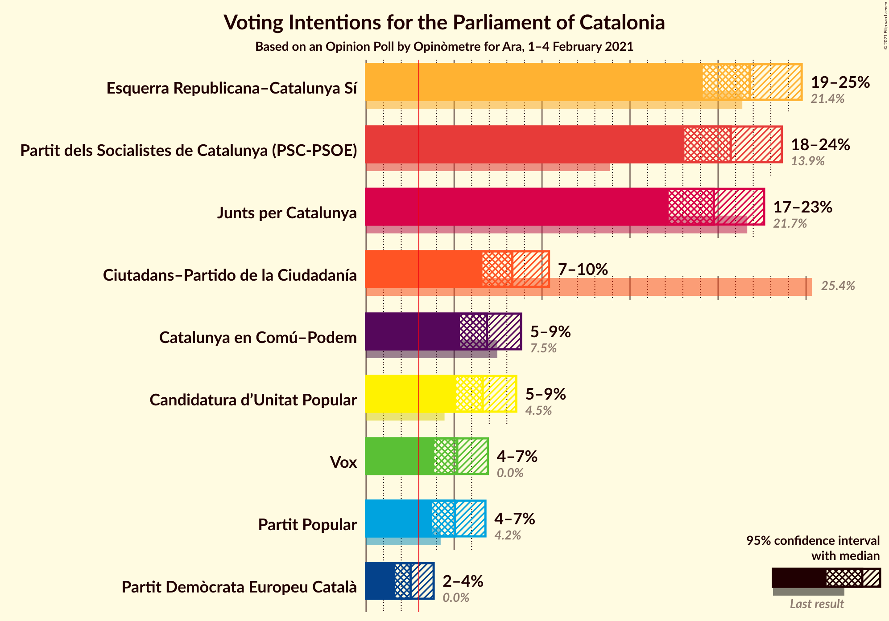

### Confidence Intervals

| Party | Last Result | Poll Result | 80% Confidence Interval | 90% Confidence Interval | 95% Confidence Interval | 99% Confidence Interval |
|:-----:|:-----------:|:-----------:|:-----------------------:|:-----------------------:|:-----------------------:|:-----------------------:|
| Esquerra Republicana–Catalunya Sí | 21.4% | 21.8% | 20.0–23.7% |19.6–24.3% |19.1–24.8% |18.3–25.7% |
| Partit dels Socialistes de Catalunya (PSC-PSOE) | 13.9% | 20.7% | 19.0–22.6% |18.5–23.2% |18.1–23.6% |17.3–24.6% |
| Junts per Catalunya | 21.7% | 19.8% | 18.1–21.6% |17.6–22.1% |17.2–22.6% |16.4–23.5% |
| Ciutadans–Partido de la Ciudadanía | 25.4% | 8.3% | 7.2–9.7% |6.9–10.1% |6.6–10.4% |6.1–11.1% |
| Catalunya en Comú–Podem | 7.5% | 6.9% | 5.9–8.1% |5.6–8.5% |5.3–8.8% |4.9–9.4% |
| Candidatura d’Unitat Popular | 4.5% | 6.6% | 5.6–7.9% |5.3–8.2% |5.1–8.5% |4.7–9.2% |
| Vox | 0.0% | 5.2% | 4.3–6.3% |4.1–6.6% |3.9–6.9% |3.5–7.5% |
| Partit Popular | 4.2% | 5.1% | 4.2–6.2% |4.0–6.5% |3.8–6.8% |3.4–7.3% |
| Partit Demòcrata Europeu Català | 0.0% | 2.5% | 2.0–3.4% |1.8–3.6% |1.7–3.8% |1.4–4.3% |

*Note:* The poll result column reflects the actual value used in the calculations. Published results may vary slightly, and in addition be rounded to fewer digits.

## Seats

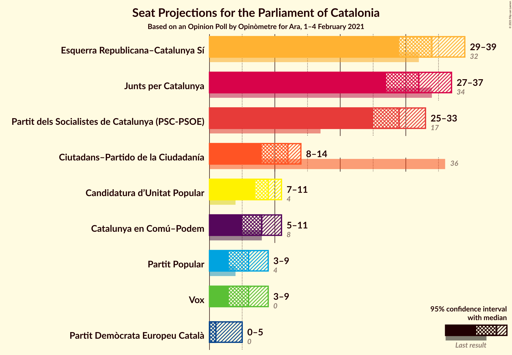

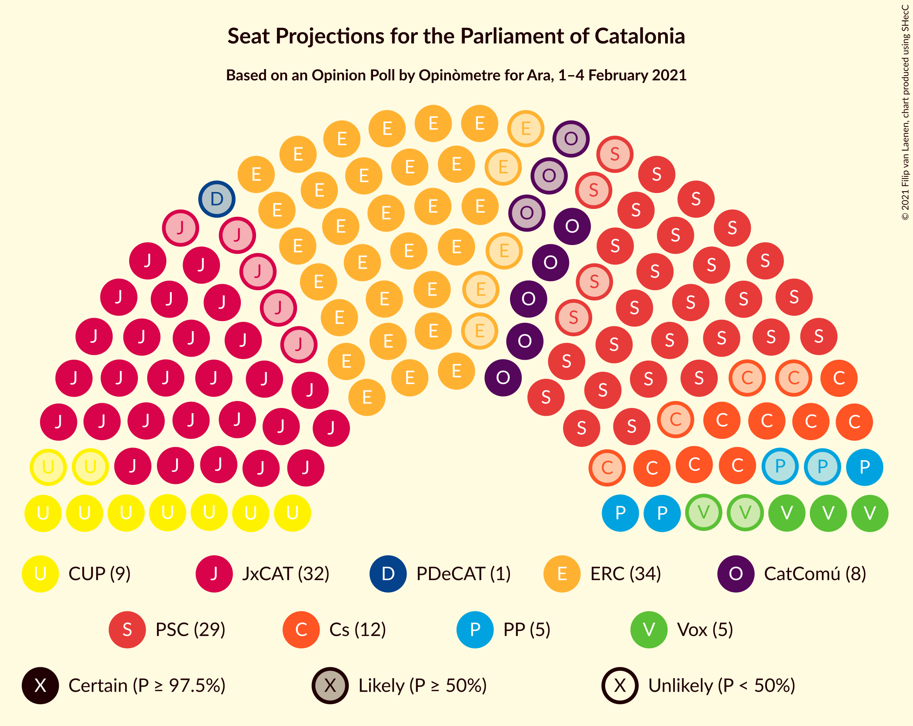

### Confidence Intervals

| Party | Last Result | Median | 80% Confidence Interval | 90% Confidence Interval | 95% Confidence Interval | 99% Confidence Interval |
|:-----:|:-----------:|:------:|:-----------------------:|:-----------------------:|:-----------------------:|:-----------------------:|
| <a href="#esquerra-republicana–catalunya-sí">Esquerra Republicana–Catalunya Sí</a> | 32 | 34 | 31–36 |30–37 |29–39 |28–40 |
| <a href="#partit-dels-socialistes-de-catalunya-(psc-psoe)">Partit dels Socialistes de Catalunya (PSC-PSOE)</a> | 17 | 29 | 26–31 |25–32 |25–33 |24–35 |
| <a href="#junts-per-catalunya">Junts per Catalunya</a> | 34 | 32 | 29–35 |29–36 |27–37 |26–38 |
| <a href="#ciutadans–partido-de-la-ciudadanía">Ciutadans–Partido de la Ciudadanía</a> | 36 | 12 | 9–13 |8–13 |8–14 |8–14 |
| <a href="#catalunya-en-comú–podem">Catalunya en Comú–Podem</a> | 8 | 8 | 6–10 |5–10 |5–11 |5–11 |
| <a href="#candidatura-d’unitat-popular">Candidatura d’Unitat Popular</a> | 4 | 9 | 8–11 |7–11 |7–11 |6–13 |
| <a href="#vox">Vox</a> | 0 | 6 | 5–8 |4–9 |3–9 |3–10 |
| <a href="#partit-popular">Partit Popular</a> | 4 | 6 | 5–8 |4–8 |3–9 |3–10 |
| <a href="#partit-demòcrata-europeu-català">Partit Demòcrata Europeu Català</a> | 0 | 1 | 0–1 |0–4 |0–5 |0–5 |

### Esquerra Republicana–Catalunya Sí

*For a full overview of the results for this party, see the [Esquerra Republicana–Catalunya Sí](party-esquerrarepublicana–catalunyasí.html) page.*

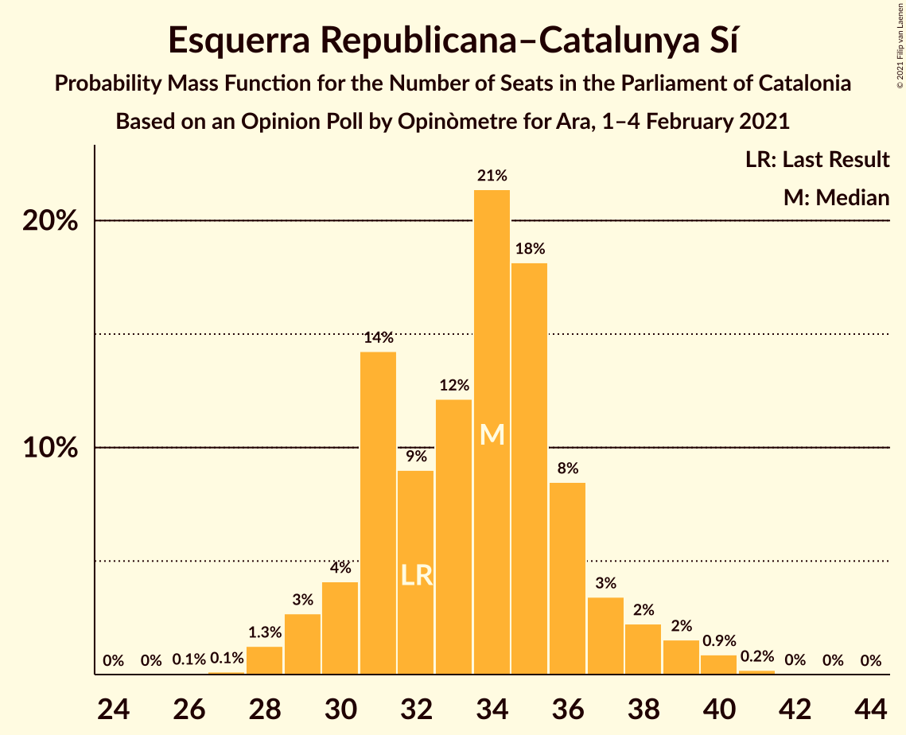

| Number of Seats | Probability | Accumulated | Special Marks |
|:---------------:|:-----------:|:-----------:|:-------------:|
| 26 | 0.1% | 100% |  |
| 27 | 0.1% | 99.9% |  |
| 28 | 1.3% | 99.8% |  |
| 29 | 3% | 98.5% |  |
| 30 | 4% | 96% |  |
| 31 | 14% | 92% |  |
| 32 | 9% | 78% | Last Result |
| 33 | 12% | 68% |  |
| 34 | 21% | 56% | Median |
| 35 | 18% | 35% |  |
| 36 | 8% | 17% |  |
| 37 | 3% | 8% |  |
| 38 | 2% | 5% |  |
| 39 | 2% | 3% |  |
| 40 | 0.9% | 1.1% |  |
| 41 | 0.2% | 0.3% |  |
| 42 | 0% | 0.1% |  |
| 43 | 0% | 0% |  |

### Partit dels Socialistes de Catalunya (PSC-PSOE)

*For a full overview of the results for this party, see the [Partit dels Socialistes de Catalunya (PSC-PSOE)](party-partitdelssocialistesdecatalunyapsc-psoe.html) page.*

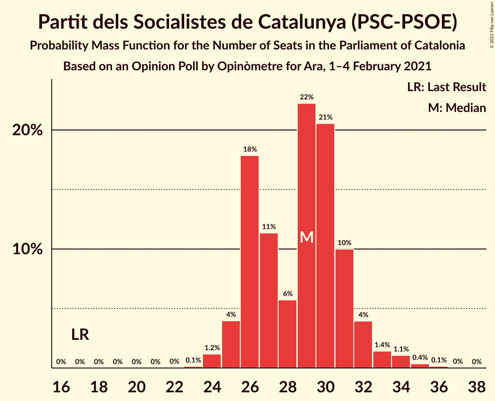

| Number of Seats | Probability | Accumulated | Special Marks |
|:---------------:|:-----------:|:-----------:|:-------------:|
| 17 | 0% | 100% | Last Result |
| 18 | 0% | 100% |  |
| 19 | 0% | 100% |  |
| 20 | 0% | 100% |  |
| 21 | 0% | 100% |  |
| 22 | 0% | 100% |  |
| 23 | 0.1% | 100% |  |
| 24 | 1.2% | 99.8% |  |
| 25 | 4% | 98.7% |  |
| 26 | 18% | 95% |  |
| 27 | 11% | 77% |  |
| 28 | 6% | 65% |  |
| 29 | 22% | 60% | Median |
| 30 | 21% | 38% |  |
| 31 | 10% | 17% |  |
| 32 | 4% | 7% |  |
| 33 | 1.4% | 3% |  |
| 34 | 1.1% | 2% |  |
| 35 | 0.4% | 0.5% |  |
| 36 | 0.1% | 0.2% |  |
| 37 | 0% | 0% |  |

### Junts per Catalunya

*For a full overview of the results for this party, see the [Junts per Catalunya](party-juntspercatalunya.html) page.*

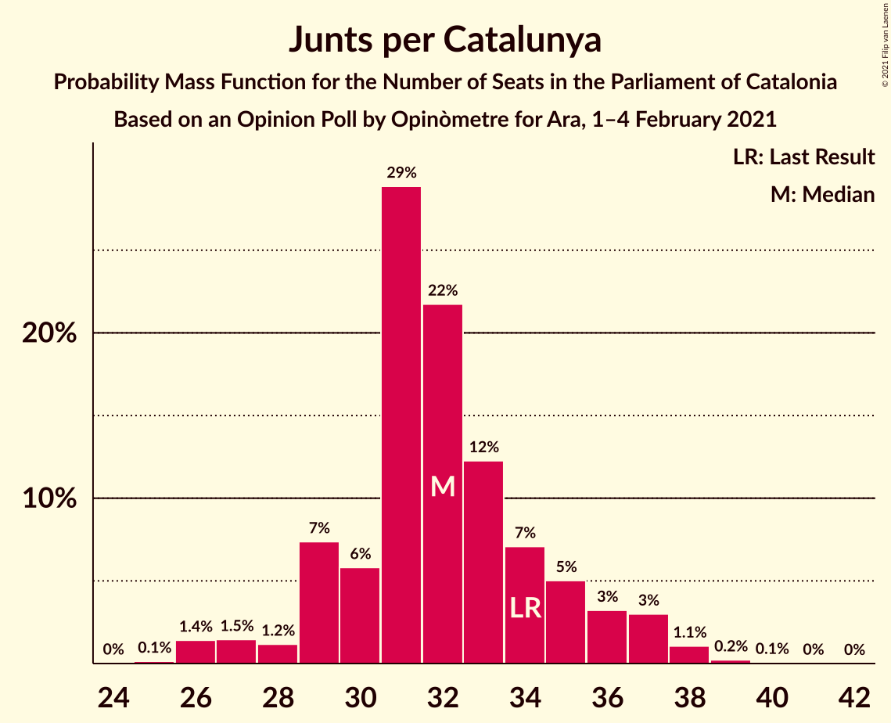

| Number of Seats | Probability | Accumulated | Special Marks |
|:---------------:|:-----------:|:-----------:|:-------------:|
| 25 | 0.1% | 100% |  |
| 26 | 1.4% | 99.8% |  |
| 27 | 1.5% | 98% |  |
| 28 | 1.2% | 97% |  |
| 29 | 7% | 96% |  |
| 30 | 6% | 88% |  |
| 31 | 29% | 83% |  |
| 32 | 22% | 54% | Median |
| 33 | 12% | 32% |  |
| 34 | 7% | 20% | Last Result |
| 35 | 5% | 13% |  |
| 36 | 3% | 8% |  |
| 37 | 3% | 4% |  |
| 38 | 1.1% | 1.4% |  |
| 39 | 0.2% | 0.3% |  |
| 40 | 0.1% | 0.1% |  |
| 41 | 0% | 0% |  |

### Ciutadans–Partido de la Ciudadanía

*For a full overview of the results for this party, see the [Ciutadans–Partido de la Ciudadanía](party-ciutadans–partidodelaciudadanía.html) page.*

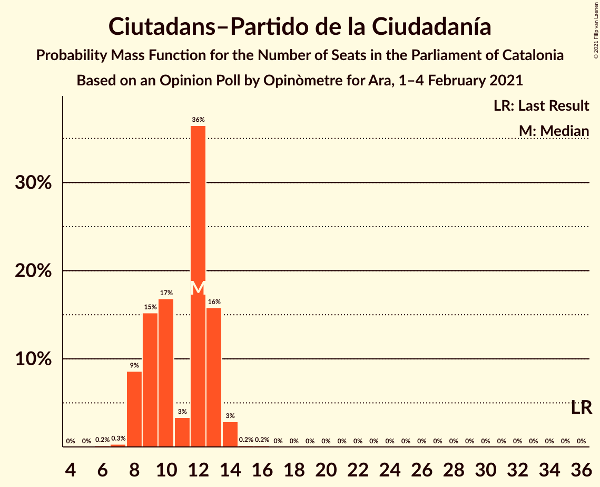

| Number of Seats | Probability | Accumulated | Special Marks |
|:---------------:|:-----------:|:-----------:|:-------------:|
| 6 | 0.2% | 100% |  |
| 7 | 0.3% | 99.8% |  |
| 8 | 9% | 99.5% |  |
| 9 | 15% | 91% |  |
| 10 | 17% | 76% |  |
| 11 | 3% | 59% |  |
| 12 | 36% | 56% | Median |
| 13 | 16% | 19% |  |
| 14 | 3% | 3% |  |
| 15 | 0.2% | 0.4% |  |
| 16 | 0.2% | 0.2% |  |
| 17 | 0% | 0% |  |
| 18 | 0% | 0% |  |
| 19 | 0% | 0% |  |
| 20 | 0% | 0% |  |
| 21 | 0% | 0% |  |
| 22 | 0% | 0% |  |
| 23 | 0% | 0% |  |
| 24 | 0% | 0% |  |
| 25 | 0% | 0% |  |
| 26 | 0% | 0% |  |
| 27 | 0% | 0% |  |
| 28 | 0% | 0% |  |
| 29 | 0% | 0% |  |
| 30 | 0% | 0% |  |
| 31 | 0% | 0% |  |
| 32 | 0% | 0% |  |
| 33 | 0% | 0% |  |
| 34 | 0% | 0% |  |
| 35 | 0% | 0% |  |
| 36 | 0% | 0% | Last Result |

### Catalunya en Comú–Podem

*For a full overview of the results for this party, see the [Catalunya en Comú–Podem](party-catalunyaencomú–podem.html) page.*

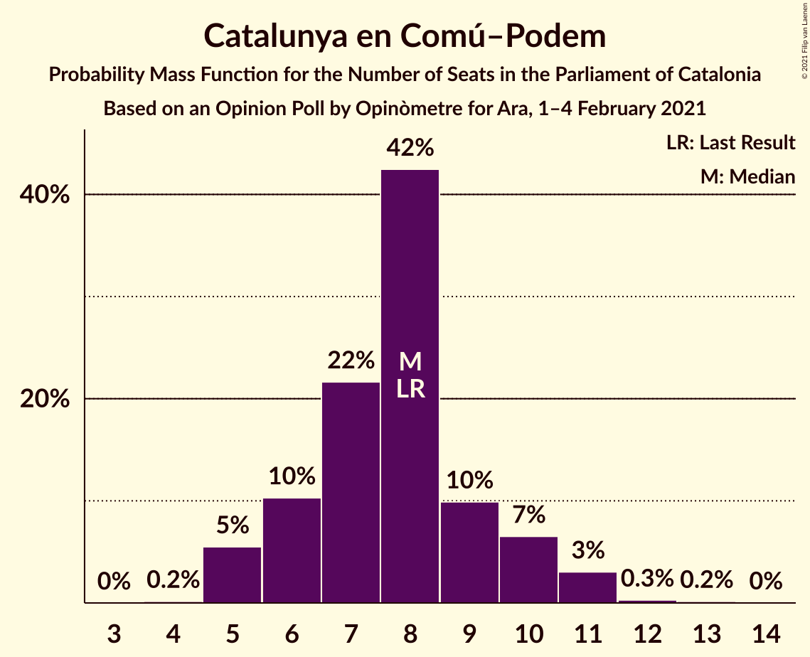

| Number of Seats | Probability | Accumulated | Special Marks |
|:---------------:|:-----------:|:-----------:|:-------------:|
| 4 | 0.2% | 100% |  |
| 5 | 5% | 99.8% |  |
| 6 | 10% | 94% |  |
| 7 | 22% | 84% |  |
| 8 | 42% | 62% | Last Result, Median |
| 9 | 10% | 20% |  |
| 10 | 7% | 10% |  |
| 11 | 3% | 4% |  |
| 12 | 0.3% | 0.5% |  |
| 13 | 0.2% | 0.2% |  |
| 14 | 0% | 0% |  |

### Candidatura d’Unitat Popular

*For a full overview of the results for this party, see the [Candidatura d’Unitat Popular](party-candidaturad’unitatpopular.html) page.*

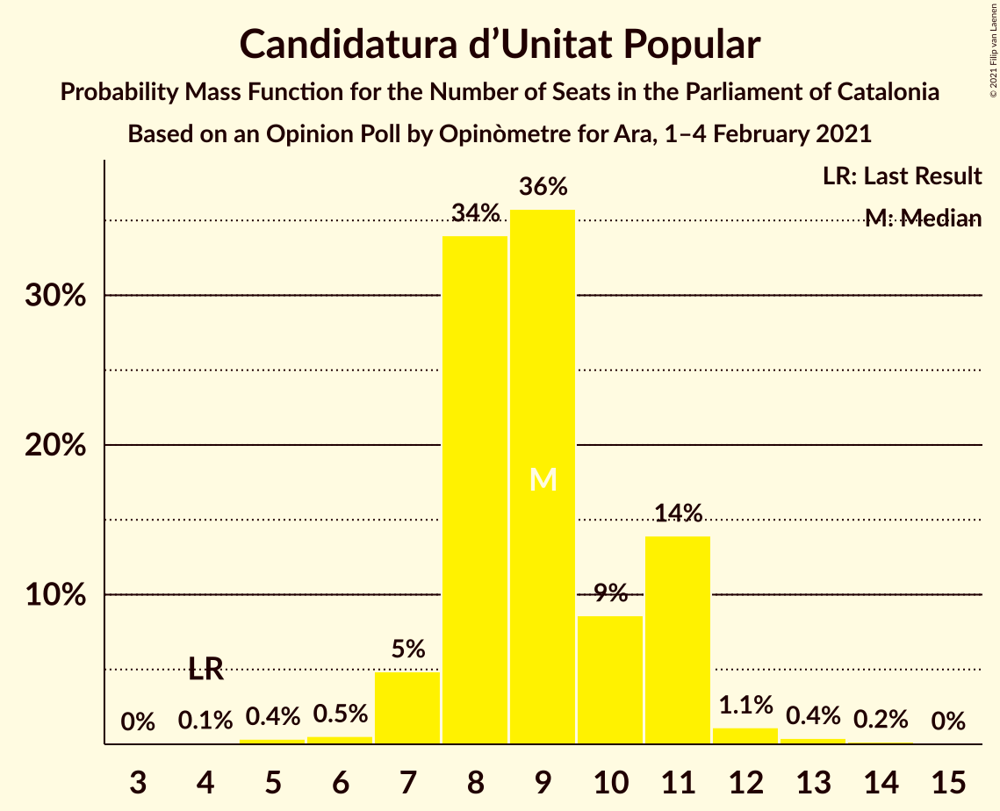

| Number of Seats | Probability | Accumulated | Special Marks |
|:---------------:|:-----------:|:-----------:|:-------------:|
| 4 | 0.1% | 100% | Last Result |
| 5 | 0.4% | 99.9% |  |
| 6 | 0.5% | 99.5% |  |
| 7 | 5% | 99.0% |  |
| 8 | 34% | 94% |  |
| 9 | 36% | 60% | Median |
| 10 | 9% | 24% |  |
| 11 | 14% | 16% |  |
| 12 | 1.1% | 2% |  |
| 13 | 0.4% | 0.6% |  |
| 14 | 0.2% | 0.2% |  |
| 15 | 0% | 0% |  |

### Vox

*For a full overview of the results for this party, see the [Vox](party-vox.html) page.*

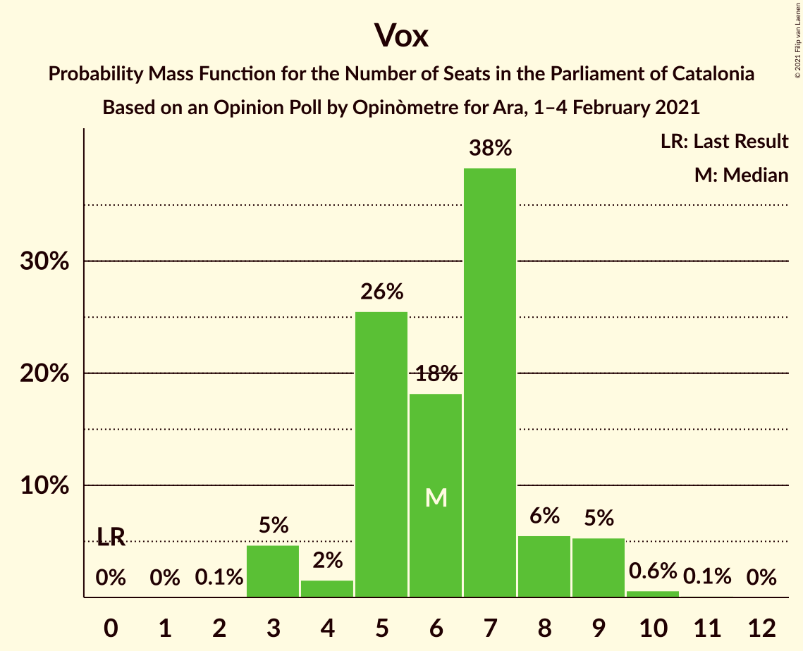

| Number of Seats | Probability | Accumulated | Special Marks |
|:---------------:|:-----------:|:-----------:|:-------------:|
| 0 | 0% | 100% | Last Result |
| 1 | 0% | 100% |  |
| 2 | 0.1% | 100% |  |
| 3 | 5% | 99.9% |  |
| 4 | 2% | 95% |  |
| 5 | 26% | 94% |  |
| 6 | 18% | 68% | Median |
| 7 | 38% | 50% |  |
| 8 | 6% | 12% |  |
| 9 | 5% | 6% |  |
| 10 | 0.6% | 0.8% |  |
| 11 | 0.1% | 0.2% |  |
| 12 | 0% | 0% |  |

### Partit Popular

*For a full overview of the results for this party, see the [Partit Popular](party-partitpopular.html) page.*

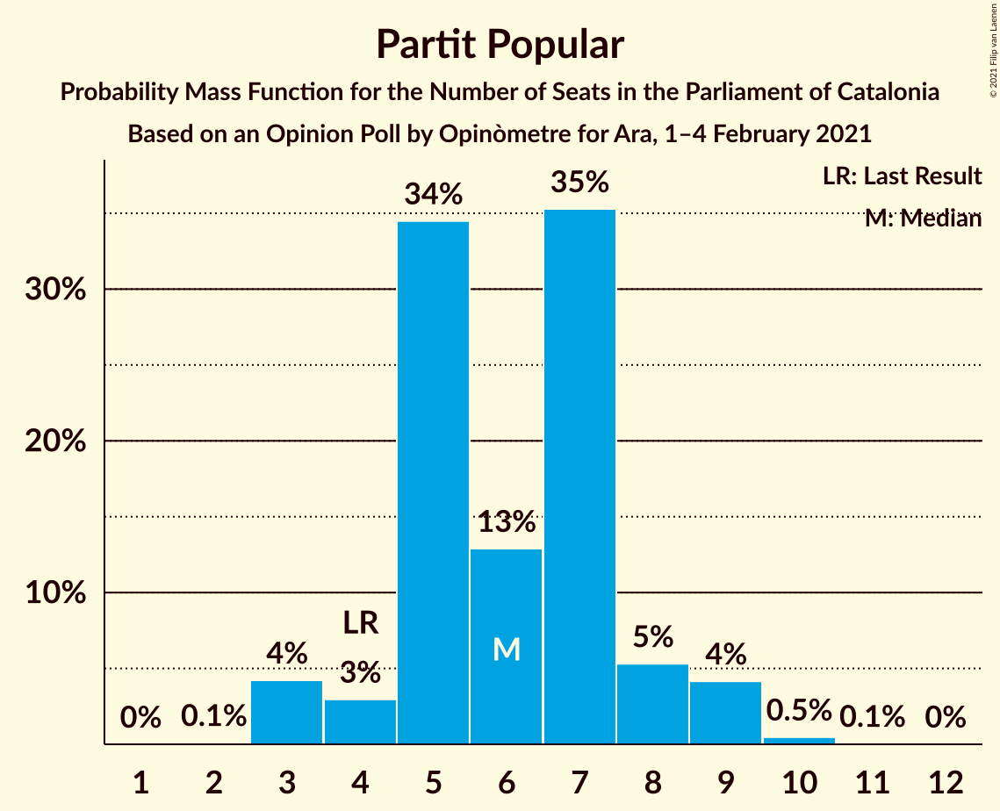

| Number of Seats | Probability | Accumulated | Special Marks |
|:---------------:|:-----------:|:-----------:|:-------------:|
| 2 | 0.1% | 100% |  |
| 3 | 4% | 99.9% |  |
| 4 | 3% | 96% | Last Result |
| 5 | 34% | 93% |  |
| 6 | 13% | 58% | Median |
| 7 | 35% | 45% |  |
| 8 | 5% | 10% |  |
| 9 | 4% | 5% |  |
| 10 | 0.5% | 0.5% |  |
| 11 | 0.1% | 0.1% |  |
| 12 | 0% | 0% |  |

### Partit Demòcrata Europeu Català

*For a full overview of the results for this party, see the [Partit Demòcrata Europeu Català](party-partitdemòcrataeuropeucatalà.html) page.*

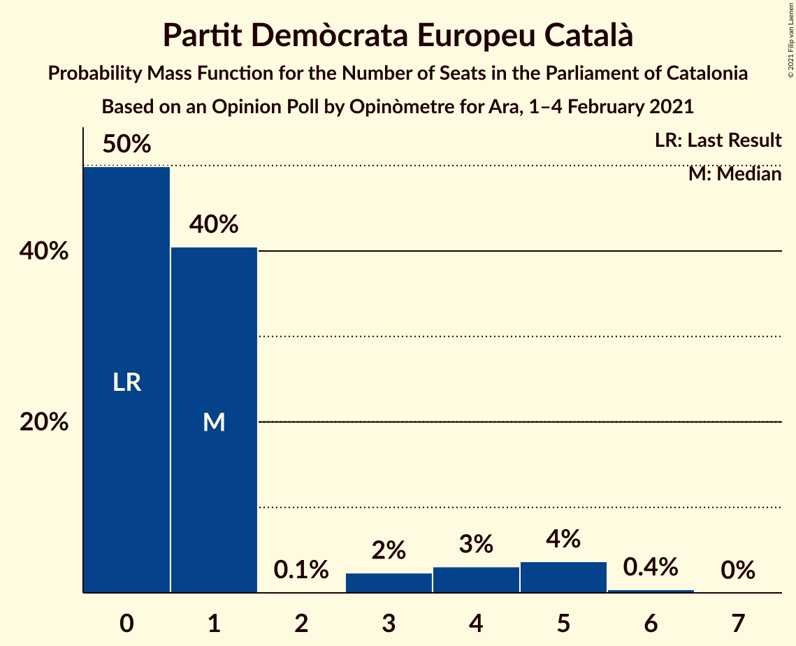

| Number of Seats | Probability | Accumulated | Special Marks |
|:---------------:|:-----------:|:-----------:|:-------------:|
| 0 | 50% | 100% | Last Result |
| 1 | 40% | 50% | Median |
| 2 | 0.1% | 10% |  |
| 3 | 2% | 10% |  |
| 4 | 3% | 7% |  |
| 5 | 4% | 4% |  |
| 6 | 0.4% | 0.4% |  |
| 7 | 0% | 0% |  |

## Coalitions

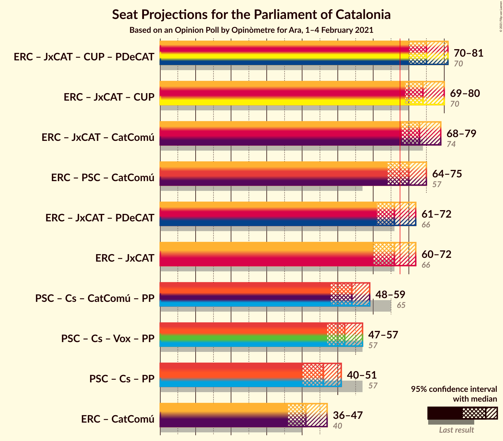

### Confidence Intervals

| Coalition | Last Result | Median | Majority? | 80% Confidence Interval | 90% Confidence Interval | 95% Confidence Interval | 99% Confidence Interval |
|:---------:|:-----------:|:------:|:---------:|:-----------------------:|:-----------------------:|:-----------------------:|:-----------------------:|
| Esquerra Republicana–Catalunya Sí – Junts per Catalunya – Candidatura d’Unitat Popular – Partit Demòcrata Europeu Català | 70 | 75 | 99.7% | 72–79 | 71–80 | 70–81 | 68–82 |
| Esquerra Republicana–Catalunya Sí – Junts per Catalunya – Candidatura d’Unitat Popular | 70 | 74 | 99.2% | 71–78 | 70–79 | 69–80 | 67–81 |
| Esquerra Republicana–Catalunya Sí – Junts per Catalunya – Catalunya en Comú–Podem | 74 | 73 | 98% | 70–77 | 69–78 | 68–79 | 66–81 |
| Esquerra Republicana–Catalunya Sí – Partit dels Socialistes de Catalunya (PSC-PSOE) – Catalunya en Comú–Podem | 57 | 70 | 79% | 66–73 | 65–74 | 64–75 | 63–77 |
| Esquerra Republicana–Catalunya Sí – Junts per Catalunya – Partit Demòcrata Europeu Català | 66 | 66 | 33% | 63–70 | 62–72 | 61–72 | 59–74 |
| Esquerra Republicana–Catalunya Sí – Junts per Catalunya | 66 | 66 | 21% | 62–69 | 61–71 | 60–72 | 58–73 |
| Partit dels Socialistes de Catalunya (PSC-PSOE) – Ciutadans–Partido de la Ciudadanía – Catalunya en Comú–Podem – Partit Popular | 65 | 54 | 0% | 50–57 | 49–58 | 48–59 | 47–61 |
| Partit dels Socialistes de Catalunya (PSC-PSOE) – Ciutadans–Partido de la Ciudadanía – Vox – Partit Popular | 57 | 52 | 0% | 48–56 | 47–56 | 47–57 | 45–59 |
| Partit dels Socialistes de Catalunya (PSC-PSOE) – Ciutadans–Partido de la Ciudadanía – Partit Popular | 57 | 46 | 0% | 42–49 | 41–50 | 40–51 | 39–53 |
| Esquerra Republicana–Catalunya Sí – Catalunya en Comú–Podem | 40 | 41 | 0% | 38–44 | 37–46 | 36–47 | 35–48 |

### Esquerra Republicana–Catalunya Sí – Junts per Catalunya – Candidatura d’Unitat Popular – Partit Demòcrata Europeu Català

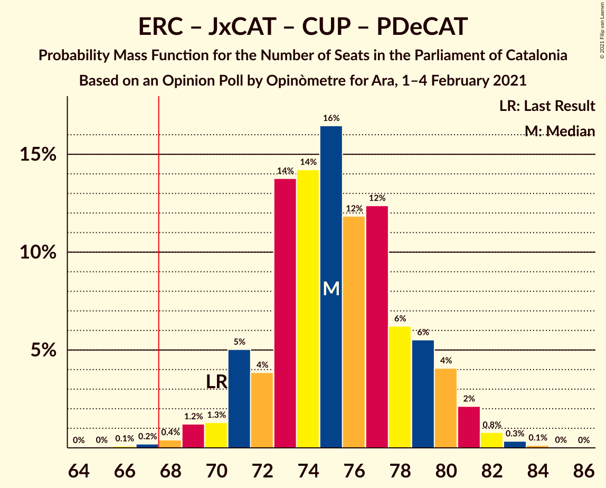

| Number of Seats | Probability | Accumulated | Special Marks |
|:---------------:|:-----------:|:-----------:|:-------------:|
| 66 | 0.1% | 100% |  |
| 67 | 0.2% | 99.9% |  |
| 68 | 0.4% | 99.7% | Majority |
| 69 | 1.2% | 99.3% |  |
| 70 | 1.3% | 98% | Last Result |
| 71 | 5% | 97% |  |
| 72 | 4% | 92% |  |
| 73 | 14% | 88% |  |
| 74 | 14% | 74% |  |
| 75 | 16% | 60% |  |
| 76 | 12% | 43% | Median |
| 77 | 12% | 32% |  |
| 78 | 6% | 19% |  |
| 79 | 6% | 13% |  |
| 80 | 4% | 7% |  |
| 81 | 2% | 3% |  |
| 82 | 0.8% | 1.3% |  |
| 83 | 0.3% | 0.5% |  |
| 84 | 0.1% | 0.2% |  |
| 85 | 0% | 0% |  |

### Esquerra Republicana–Catalunya Sí – Junts per Catalunya – Candidatura d’Unitat Popular

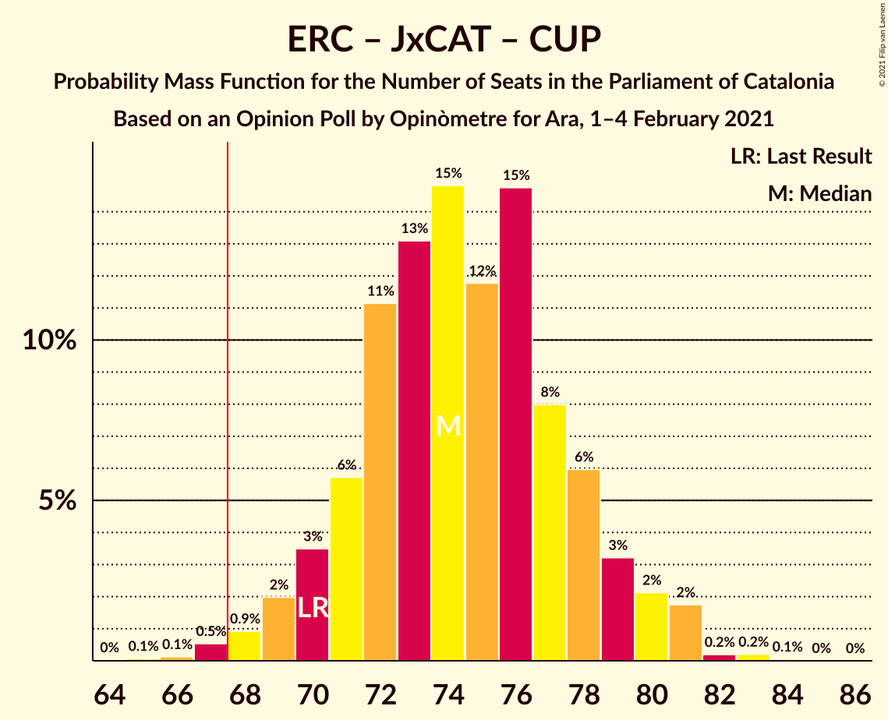

| Number of Seats | Probability | Accumulated | Special Marks |
|:---------------:|:-----------:|:-----------:|:-------------:|
| 65 | 0.1% | 100% |  |
| 66 | 0.1% | 99.9% |  |
| 67 | 0.5% | 99.8% |  |
| 68 | 0.9% | 99.2% | Majority |
| 69 | 2% | 98% |  |
| 70 | 3% | 96% | Last Result |
| 71 | 6% | 93% |  |
| 72 | 11% | 87% |  |
| 73 | 13% | 76% |  |
| 74 | 15% | 63% |  |
| 75 | 12% | 48% | Median |
| 76 | 15% | 36% |  |
| 77 | 8% | 22% |  |
| 78 | 6% | 14% |  |
| 79 | 3% | 8% |  |
| 80 | 2% | 4% |  |
| 81 | 2% | 2% |  |
| 82 | 0.2% | 0.5% |  |
| 83 | 0.2% | 0.3% |  |
| 84 | 0.1% | 0.1% |  |
| 85 | 0% | 0% |  |

### Esquerra Republicana–Catalunya Sí – Junts per Catalunya – Catalunya en Comú–Podem

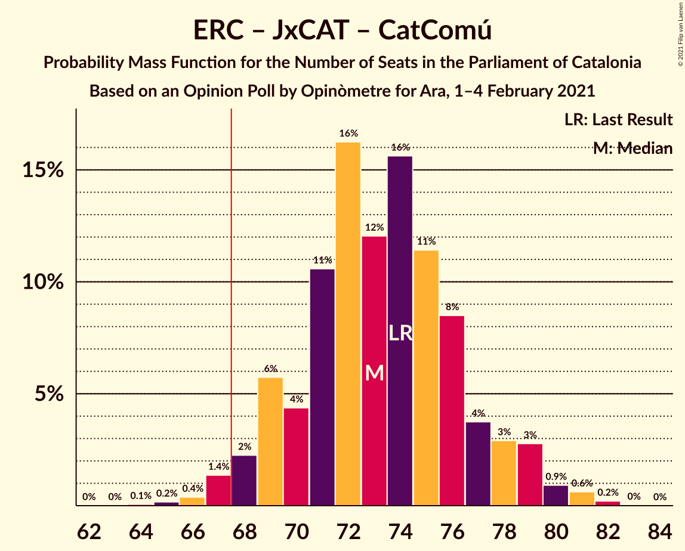

| Number of Seats | Probability | Accumulated | Special Marks |
|:---------------:|:-----------:|:-----------:|:-------------:|
| 64 | 0.1% | 100% |  |
| 65 | 0.2% | 99.9% |  |
| 66 | 0.4% | 99.7% |  |
| 67 | 1.4% | 99.4% |  |
| 68 | 2% | 98% | Majority |
| 69 | 6% | 96% |  |
| 70 | 4% | 90% |  |
| 71 | 11% | 86% |  |
| 72 | 16% | 75% |  |
| 73 | 12% | 59% |  |
| 74 | 16% | 47% | Last Result, Median |
| 75 | 11% | 31% |  |
| 76 | 8% | 20% |  |
| 77 | 4% | 11% |  |
| 78 | 3% | 7% |  |
| 79 | 3% | 5% |  |
| 80 | 0.9% | 2% |  |
| 81 | 0.6% | 0.9% |  |
| 82 | 0.2% | 0.2% |  |
| 83 | 0% | 0% |  |

### Esquerra Republicana–Catalunya Sí – Partit dels Socialistes de Catalunya (PSC-PSOE) – Catalunya en Comú–Podem

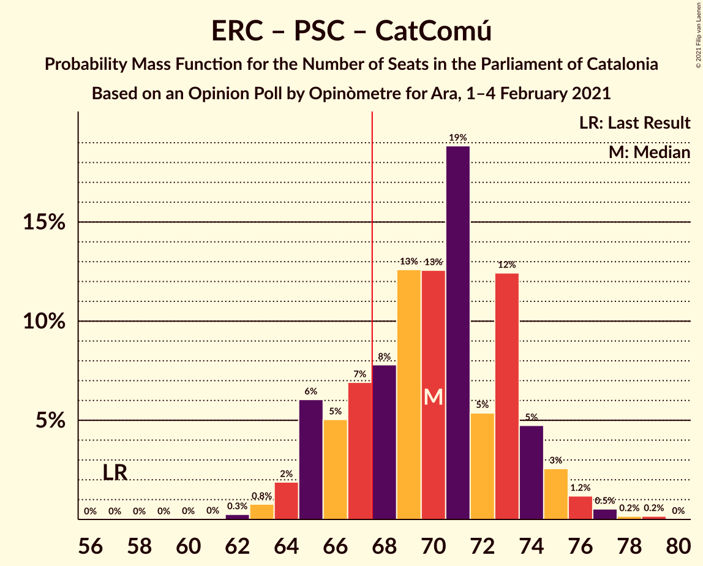

| Number of Seats | Probability | Accumulated | Special Marks |
|:---------------:|:-----------:|:-----------:|:-------------:|
| 57 | 0% | 100% | Last Result |
| 58 | 0% | 100% |  |
| 59 | 0% | 100% |  |
| 60 | 0% | 100% |  |
| 61 | 0% | 100% |  |
| 62 | 0.3% | 99.9% |  |
| 63 | 0.8% | 99.7% |  |
| 64 | 2% | 98.9% |  |
| 65 | 6% | 97% |  |
| 66 | 5% | 91% |  |
| 67 | 7% | 86% |  |
| 68 | 8% | 79% | Majority |
| 69 | 13% | 71% |  |
| 70 | 13% | 59% |  |
| 71 | 19% | 46% | Median |
| 72 | 5% | 27% |  |
| 73 | 12% | 22% |  |
| 74 | 5% | 9% |  |
| 75 | 3% | 5% |  |
| 76 | 1.2% | 2% |  |
| 77 | 0.5% | 0.9% |  |
| 78 | 0.2% | 0.4% |  |
| 79 | 0.2% | 0.2% |  |
| 80 | 0% | 0% |  |

### Esquerra Republicana–Catalunya Sí – Junts per Catalunya – Partit Demòcrata Europeu Català

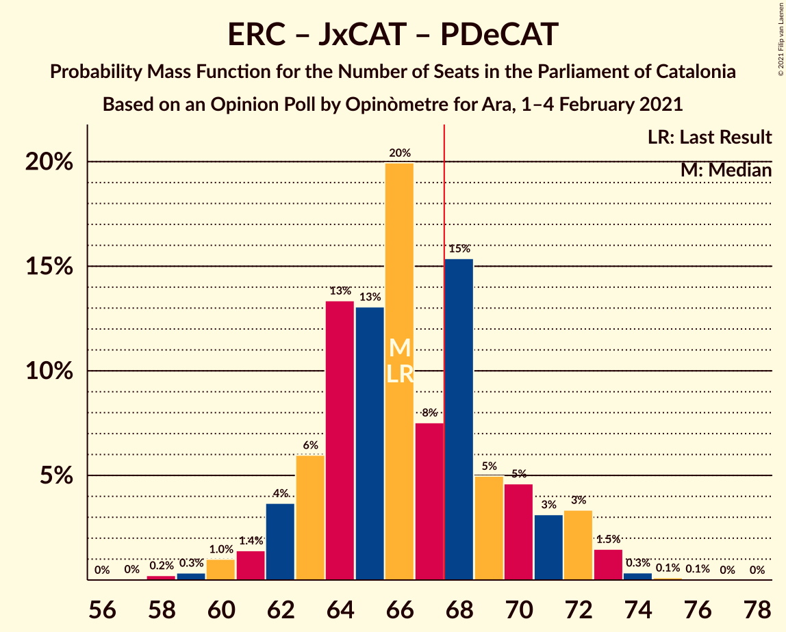

| Number of Seats | Probability | Accumulated | Special Marks |
|:---------------:|:-----------:|:-----------:|:-------------:|
| 58 | 0.2% | 100% |  |
| 59 | 0.3% | 99.7% |  |
| 60 | 1.0% | 99.4% |  |
| 61 | 1.4% | 98% |  |
| 62 | 4% | 97% |  |
| 63 | 6% | 93% |  |
| 64 | 13% | 87% |  |
| 65 | 13% | 74% |  |
| 66 | 20% | 61% | Last Result |
| 67 | 8% | 41% | Median |
| 68 | 15% | 33% | Majority |
| 69 | 5% | 18% |  |
| 70 | 5% | 13% |  |
| 71 | 3% | 8% |  |
| 72 | 3% | 5% |  |
| 73 | 1.5% | 2% |  |
| 74 | 0.3% | 0.5% |  |
| 75 | 0.1% | 0.2% |  |
| 76 | 0.1% | 0.1% |  |
| 77 | 0% | 0% |  |

### Esquerra Republicana–Catalunya Sí – Junts per Catalunya

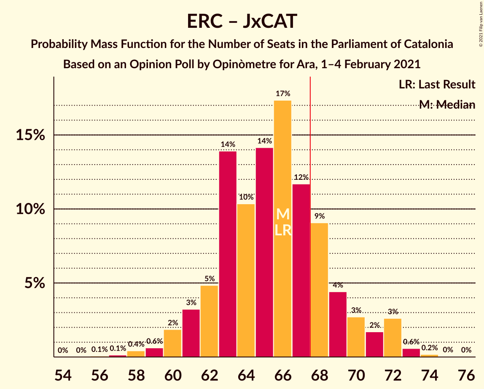

| Number of Seats | Probability | Accumulated | Special Marks |
|:---------------:|:-----------:|:-----------:|:-------------:|
| 56 | 0.1% | 100% |  |
| 57 | 0.1% | 99.9% |  |
| 58 | 0.4% | 99.8% |  |
| 59 | 0.6% | 99.4% |  |
| 60 | 2% | 98.7% |  |
| 61 | 3% | 97% |  |
| 62 | 5% | 94% |  |
| 63 | 14% | 89% |  |
| 64 | 10% | 75% |  |
| 65 | 14% | 65% |  |
| 66 | 17% | 50% | Last Result, Median |
| 67 | 12% | 33% |  |
| 68 | 9% | 21% | Majority |
| 69 | 4% | 12% |  |
| 70 | 3% | 8% |  |
| 71 | 2% | 5% |  |
| 72 | 3% | 3% |  |
| 73 | 0.6% | 0.8% |  |
| 74 | 0.2% | 0.2% |  |
| 75 | 0% | 0.1% |  |
| 76 | 0% | 0% |  |

### Partit dels Socialistes de Catalunya (PSC-PSOE) – Ciutadans–Partido de la Ciudadanía – Catalunya en Comú–Podem – Partit Popular

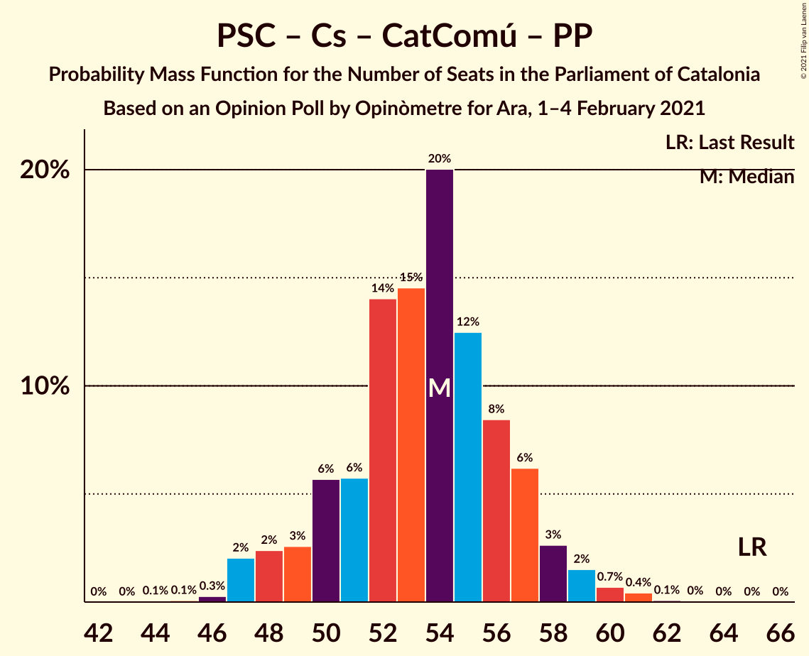

| Number of Seats | Probability | Accumulated | Special Marks |
|:---------------:|:-----------:|:-----------:|:-------------:|
| 44 | 0.1% | 100% |  |
| 45 | 0.1% | 99.9% |  |
| 46 | 0.3% | 99.9% |  |
| 47 | 2% | 99.6% |  |
| 48 | 2% | 98% |  |
| 49 | 3% | 95% |  |
| 50 | 6% | 93% |  |
| 51 | 6% | 87% |  |
| 52 | 14% | 81% |  |
| 53 | 15% | 67% |  |
| 54 | 20% | 53% |  |
| 55 | 12% | 33% | Median |
| 56 | 8% | 20% |  |
| 57 | 6% | 12% |  |
| 58 | 3% | 5% |  |
| 59 | 2% | 3% |  |
| 60 | 0.7% | 1.3% |  |
| 61 | 0.4% | 0.6% |  |
| 62 | 0.1% | 0.1% |  |
| 63 | 0% | 0.1% |  |
| 64 | 0% | 0% |  |
| 65 | 0% | 0% | Last Result |

### Partit dels Socialistes de Catalunya (PSC-PSOE) – Ciutadans–Partido de la Ciudadanía – Vox – Partit Popular

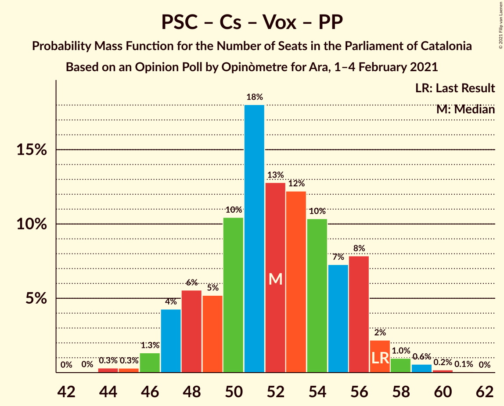

| Number of Seats | Probability | Accumulated | Special Marks |
|:---------------:|:-----------:|:-----------:|:-------------:|
| 43 | 0% | 100% |  |
| 44 | 0.3% | 99.9% |  |
| 45 | 0.3% | 99.6% |  |
| 46 | 1.3% | 99.3% |  |
| 47 | 4% | 98% |  |
| 48 | 6% | 94% |  |
| 49 | 5% | 88% |  |
| 50 | 10% | 83% |  |
| 51 | 18% | 73% |  |
| 52 | 13% | 54% |  |
| 53 | 12% | 42% | Median |
| 54 | 10% | 29% |  |
| 55 | 7% | 19% |  |
| 56 | 8% | 12% |  |
| 57 | 2% | 4% | Last Result |
| 58 | 1.0% | 2% |  |
| 59 | 0.6% | 0.8% |  |
| 60 | 0.2% | 0.3% |  |
| 61 | 0.1% | 0.1% |  |
| 62 | 0% | 0% |  |

### Partit dels Socialistes de Catalunya (PSC-PSOE) – Ciutadans–Partido de la Ciudadanía – Partit Popular

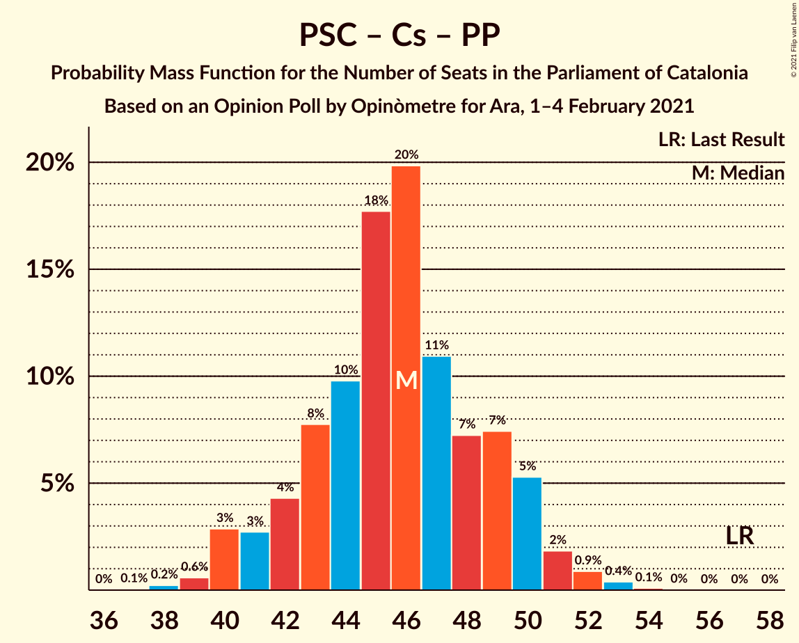

| Number of Seats | Probability | Accumulated | Special Marks |
|:---------------:|:-----------:|:-----------:|:-------------:|
| 37 | 0.1% | 100% |  |
| 38 | 0.2% | 99.9% |  |
| 39 | 0.6% | 99.7% |  |
| 40 | 3% | 99.1% |  |
| 41 | 3% | 96% |  |
| 42 | 4% | 94% |  |
| 43 | 8% | 89% |  |
| 44 | 10% | 81% |  |
| 45 | 18% | 72% |  |
| 46 | 20% | 54% |  |
| 47 | 11% | 34% | Median |
| 48 | 7% | 23% |  |
| 49 | 7% | 16% |  |
| 50 | 5% | 9% |  |
| 51 | 2% | 3% |  |
| 52 | 0.9% | 1.4% |  |
| 53 | 0.4% | 0.5% |  |
| 54 | 0.1% | 0.1% |  |
| 55 | 0% | 0% |  |
| 56 | 0% | 0% |  |
| 57 | 0% | 0% | Last Result |

### Esquerra Republicana–Catalunya Sí – Catalunya en Comú–Podem

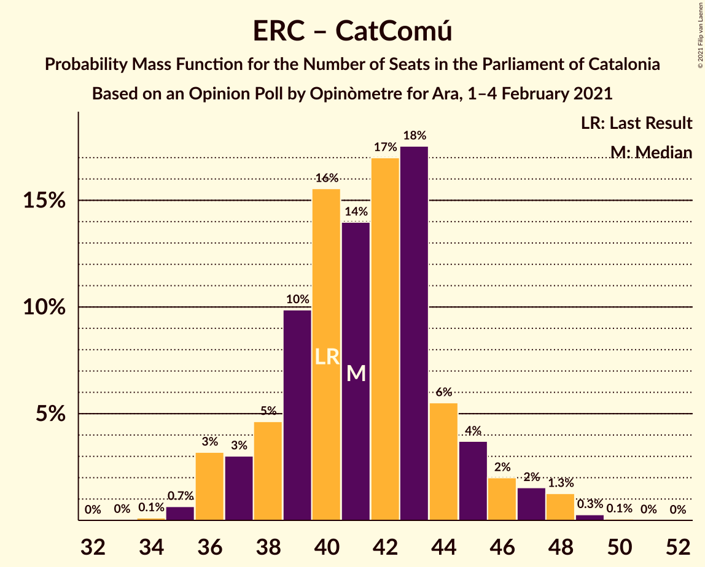

| Number of Seats | Probability | Accumulated | Special Marks |
|:---------------:|:-----------:|:-----------:|:-------------:|
| 33 | 0% | 100% |  |
| 34 | 0.1% | 99.9% |  |
| 35 | 0.7% | 99.8% |  |
| 36 | 3% | 99.2% |  |
| 37 | 3% | 96% |  |
| 38 | 5% | 93% |  |
| 39 | 10% | 88% |  |
| 40 | 16% | 78% | Last Result |
| 41 | 14% | 63% |  |
| 42 | 17% | 49% | Median |
| 43 | 18% | 32% |  |
| 44 | 6% | 14% |  |
| 45 | 4% | 9% |  |
| 46 | 2% | 5% |  |
| 47 | 2% | 3% |  |
| 48 | 1.3% | 2% |  |
| 49 | 0.3% | 0.4% |  |
| 50 | 0.1% | 0.1% |  |
| 51 | 0% | 0% |  |

## Technical Information

### Opinion Poll

+ **Polling firm:** Opinòmetre
+ **Commissioner(s):** Ara
+ **Fieldwork period:** 1–4 February 2021

### Calculations

+ **Sample size:** 830
+ **Simulations done:** 1,048,576
+ **Error estimate:** 1.87%

