# Opinion Poll by Feedback for El Nacional, 1–5 February 2021

<a href="#voting-intentions">Voting Intentions</a> | <a href="#seats">Seats</a> | <a href="#coalitions">Coalitions</a> | <a href="#technical-information">Technical Information</a>

## Voting Intentions

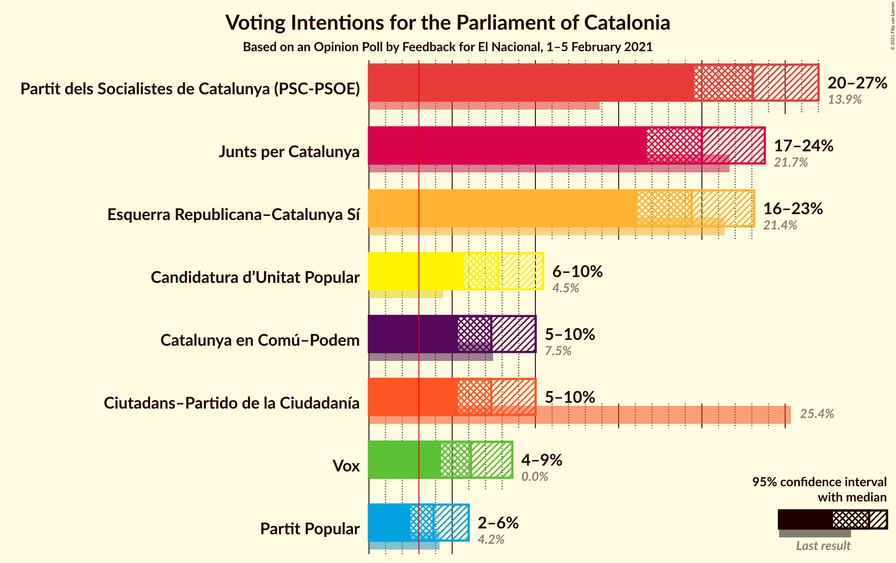

### Confidence Intervals

| Party | Last Result | Poll Result | 80% Confidence Interval | 90% Confidence Interval | 95% Confidence Interval | 99% Confidence Interval |
|:-----:|:-----------:|:-----------:|:-----------------------:|:-----------------------:|:-----------------------:|:-----------------------:|
| Partit dels Socialistes de Catalunya (PSC-PSOE) | 13.9% | 23.1% | 20.7–25.6% |20.1–26.4% |19.5–27.0% |18.5–28.3% |
| Junts per Catalunya | 21.7% | 20.0% | 17.8–22.5% |17.2–23.2% |16.7–23.8% |15.7–25.0% |
| Esquerra Republicana–Catalunya Sí | 21.4% | 19.4% | 17.2–21.8% |16.6–22.5% |16.1–23.1% |15.2–24.3% |
| Candidatura d’Unitat Popular | 4.5% | 7.8% | 6.4–9.5% |6.0–10.0% |5.7–10.5% |5.1–11.4% |
| Ciutadans–Partido de la Ciudadanía | 25.4% | 7.3% | 6.0–9.1% |5.7–9.6% |5.3–10.0% |4.8–10.9% |
| Catalunya en Comú–Podem | 7.5% | 7.3% | 6.0–9.1% |5.7–9.6% |5.3–10.0% |4.8–10.9% |
| Vox | 0.0% | 6.1% | 4.9–7.7% |4.6–8.2% |4.3–8.6% |3.8–9.4% |
| Partit Popular | 4.2% | 3.9% | 3.0–5.2% |2.7–5.6% |2.5–6.0% |2.1–6.7% |

*Note:* The poll result column reflects the actual value used in the calculations. Published results may vary slightly, and in addition be rounded to fewer digits.

## Seats

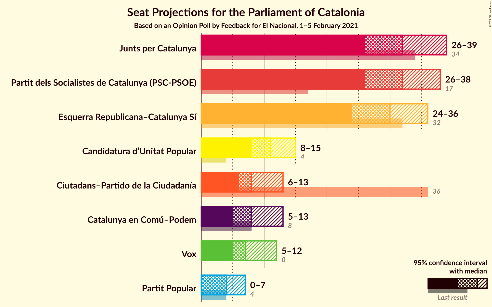

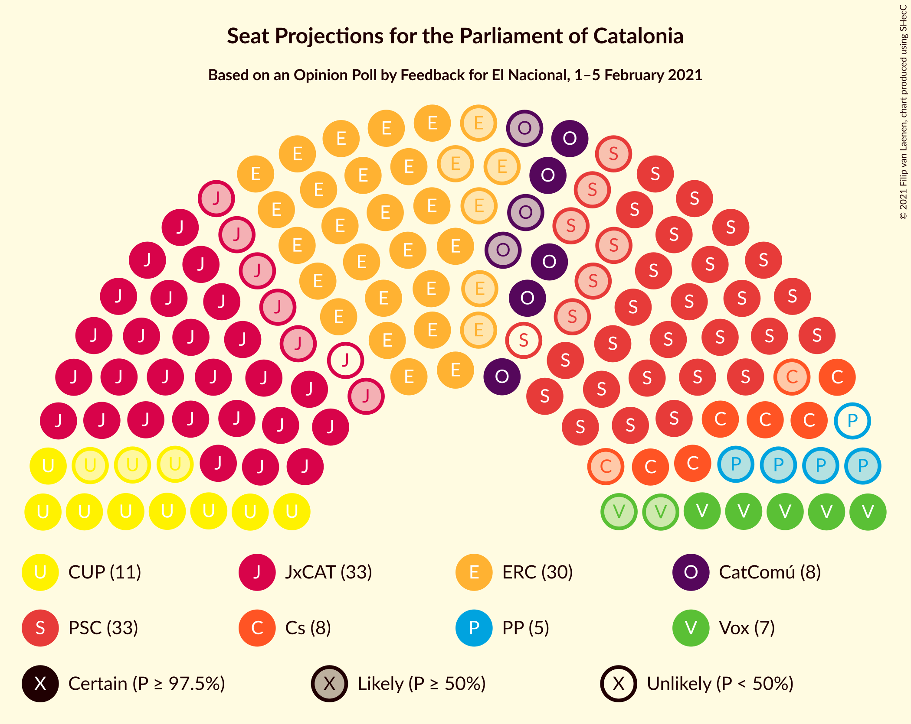

### Confidence Intervals

| Party | Last Result | Median | 80% Confidence Interval | 90% Confidence Interval | 95% Confidence Interval | 99% Confidence Interval |
|:-----:|:-----------:|:------:|:-----------------------:|:-----------------------:|:-----------------------:|:-----------------------:|
| <a href="#partit-dels-socialistes-de-catalunya-(psc-psoe)">Partit dels Socialistes de Catalunya (PSC-PSOE)</a> | 17 | 32 | 28–36 |27–37 |26–38 |25–40 |
| <a href="#junts-per-catalunya">Junts per Catalunya</a> | 34 | 32 | 29–37 |28–37 |26–39 |25–41 |
| <a href="#esquerra-republicana–catalunya-sí">Esquerra Republicana–Catalunya Sí</a> | 32 | 30 | 26–34 |25–35 |24–36 |22–38 |
| <a href="#candidatura-d’unitat-popular">Candidatura d’Unitat Popular</a> | 4 | 11 | 8–14 |8–15 |8–15 |7–17 |
| <a href="#ciutadans–partido-de-la-ciudadanía">Ciutadans–Partido de la Ciudadanía</a> | 36 | 8 | 6–13 |6–13 |6–13 |5–14 |
| <a href="#catalunya-en-comú–podem">Catalunya en Comú–Podem</a> | 8 | 8 | 7–11 |5–13 |5–13 |4–14 |
| <a href="#vox">Vox</a> | 0 | 7 | 6–10 |5–11 |5–12 |3–13 |
| <a href="#partit-popular">Partit Popular</a> | 4 | 4 | 2–6 |0–7 |0–7 |0–9 |

### Partit dels Socialistes de Catalunya (PSC-PSOE)

*For a full overview of the results for this party, see the [Partit dels Socialistes de Catalunya (PSC-PSOE)](party-partitdelssocialistesdecatalunyapsc-psoe.html) page.*

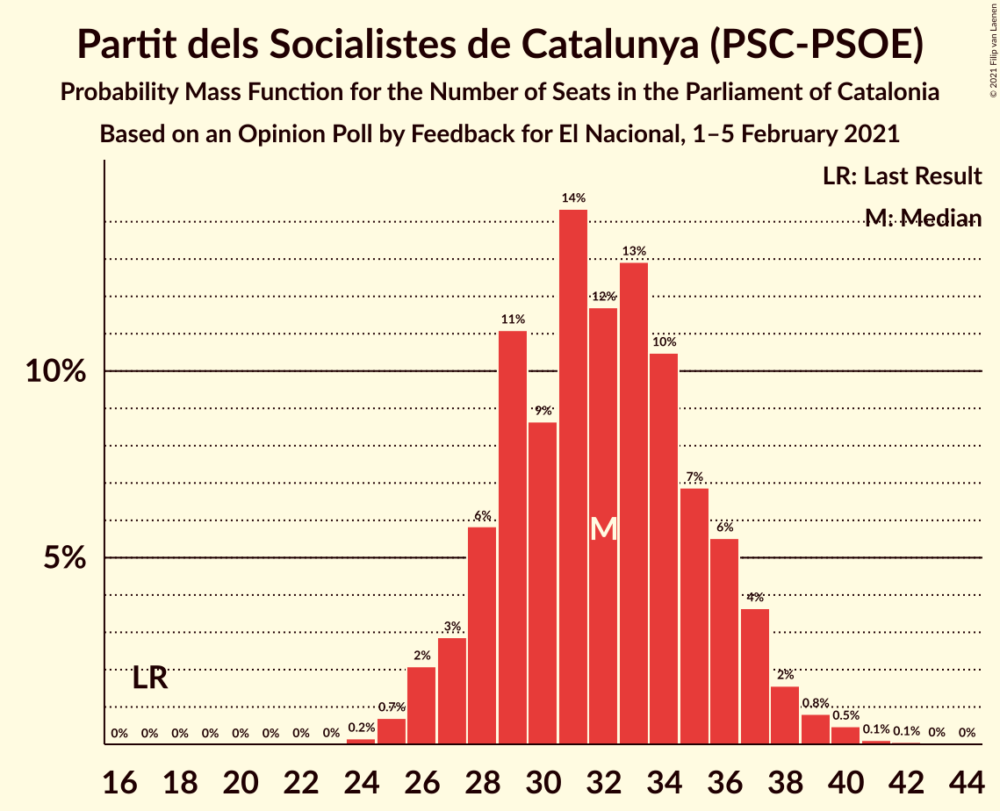

| Number of Seats | Probability | Accumulated | Special Marks |
|:---------------:|:-----------:|:-----------:|:-------------:|
| 17 | 0% | 100% | Last Result |
| 18 | 0% | 100% |  |
| 19 | 0% | 100% |  |
| 20 | 0% | 100% |  |
| 21 | 0% | 100% |  |
| 22 | 0% | 100% |  |
| 23 | 0% | 100% |  |
| 24 | 0.2% | 100% |  |
| 25 | 0.7% | 99.8% |  |
| 26 | 2% | 99.1% |  |
| 27 | 3% | 97% |  |
| 28 | 6% | 94% |  |
| 29 | 11% | 88% |  |
| 30 | 9% | 77% |  |
| 31 | 14% | 69% |  |
| 32 | 12% | 54% | Median |
| 33 | 13% | 43% |  |
| 34 | 10% | 30% |  |
| 35 | 7% | 19% |  |
| 36 | 6% | 12% |  |
| 37 | 4% | 7% |  |
| 38 | 2% | 3% |  |
| 39 | 0.8% | 2% |  |
| 40 | 0.5% | 0.7% |  |
| 41 | 0.1% | 0.2% |  |
| 42 | 0.1% | 0.1% |  |
| 43 | 0% | 0.1% |  |
| 44 | 0% | 0% |  |

### Junts per Catalunya

*For a full overview of the results for this party, see the [Junts per Catalunya](party-juntspercatalunya.html) page.*

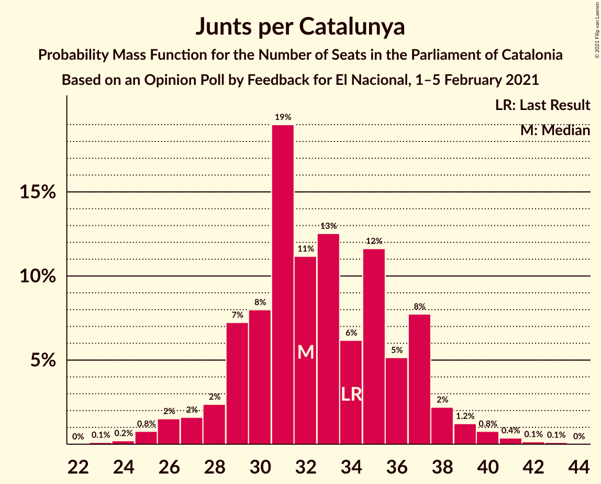

| Number of Seats | Probability | Accumulated | Special Marks |
|:---------------:|:-----------:|:-----------:|:-------------:|
| 23 | 0.1% | 100% |  |
| 24 | 0.2% | 99.9% |  |
| 25 | 0.8% | 99.7% |  |
| 26 | 2% | 98.9% |  |
| 27 | 2% | 97% |  |
| 28 | 2% | 96% |  |
| 29 | 7% | 93% |  |
| 30 | 8% | 86% |  |
| 31 | 19% | 78% |  |
| 32 | 11% | 59% | Median |
| 33 | 13% | 48% |  |
| 34 | 6% | 36% | Last Result |
| 35 | 12% | 29% |  |
| 36 | 5% | 18% |  |
| 37 | 8% | 13% |  |
| 38 | 2% | 5% |  |
| 39 | 1.2% | 3% |  |
| 40 | 0.8% | 1.4% |  |
| 41 | 0.4% | 0.6% |  |
| 42 | 0.1% | 0.3% |  |
| 43 | 0.1% | 0.1% |  |
| 44 | 0% | 0% |  |

### Esquerra Republicana–Catalunya Sí

*For a full overview of the results for this party, see the [Esquerra Republicana–Catalunya Sí](party-esquerrarepublicana–catalunyasí.html) page.*

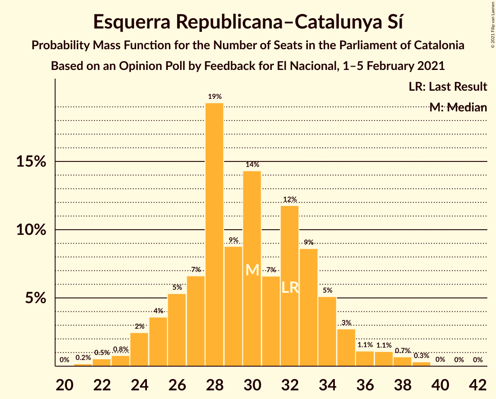

| Number of Seats | Probability | Accumulated | Special Marks |
|:---------------:|:-----------:|:-----------:|:-------------:|
| 21 | 0.2% | 100% |  |
| 22 | 0.5% | 99.8% |  |
| 23 | 0.8% | 99.3% |  |
| 24 | 2% | 98% |  |
| 25 | 4% | 96% |  |
| 26 | 5% | 92% |  |
| 27 | 7% | 87% |  |
| 28 | 19% | 80% |  |
| 29 | 9% | 61% |  |
| 30 | 14% | 52% | Median |
| 31 | 7% | 38% |  |
| 32 | 12% | 31% | Last Result |
| 33 | 9% | 20% |  |
| 34 | 5% | 11% |  |
| 35 | 3% | 6% |  |
| 36 | 1.1% | 3% |  |
| 37 | 1.1% | 2% |  |
| 38 | 0.7% | 1.1% |  |
| 39 | 0.3% | 0.4% |  |
| 40 | 0% | 0.1% |  |
| 41 | 0% | 0% |  |

### Candidatura d’Unitat Popular

*For a full overview of the results for this party, see the [Candidatura d’Unitat Popular](party-candidaturad’unitatpopular.html) page.*

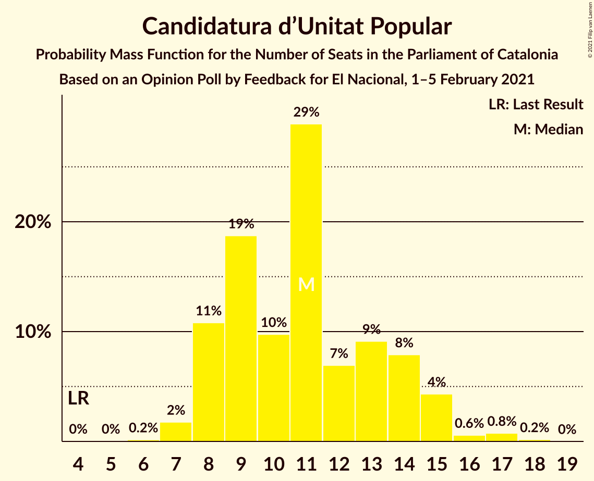

| Number of Seats | Probability | Accumulated | Special Marks |
|:---------------:|:-----------:|:-----------:|:-------------:|
| 4 | 0% | 100% | Last Result |
| 5 | 0% | 100% |  |
| 6 | 0.2% | 99.9% |  |
| 7 | 2% | 99.8% |  |
| 8 | 11% | 98% |  |
| 9 | 19% | 87% |  |
| 10 | 10% | 68% |  |
| 11 | 29% | 59% | Median |
| 12 | 7% | 30% |  |
| 13 | 9% | 23% |  |
| 14 | 8% | 14% |  |
| 15 | 4% | 6% |  |
| 16 | 0.6% | 2% |  |
| 17 | 0.8% | 0.9% |  |
| 18 | 0.2% | 0.2% |  |
| 19 | 0% | 0% |  |

### Ciutadans–Partido de la Ciudadanía

*For a full overview of the results for this party, see the [Ciutadans–Partido de la Ciudadanía](party-ciutadans–partidodelaciudadanía.html) page.*

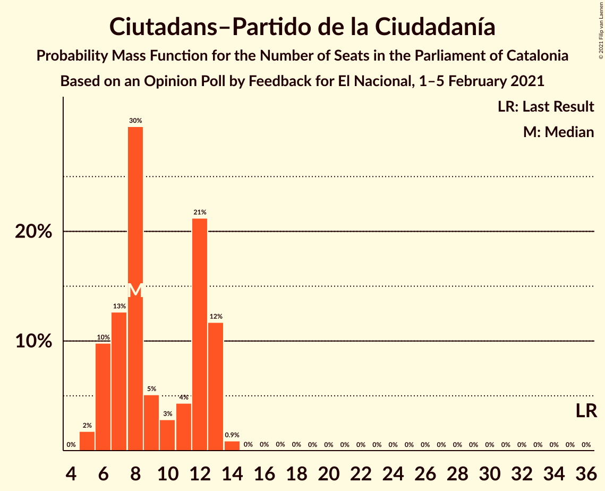

| Number of Seats | Probability | Accumulated | Special Marks |
|:---------------:|:-----------:|:-----------:|:-------------:|
| 5 | 2% | 100% |  |
| 6 | 10% | 98% |  |
| 7 | 13% | 88% |  |
| 8 | 30% | 76% | Median |
| 9 | 5% | 46% |  |
| 10 | 3% | 41% |  |
| 11 | 4% | 38% |  |
| 12 | 21% | 34% |  |
| 13 | 12% | 13% |  |
| 14 | 0.9% | 1.0% |  |
| 15 | 0% | 0.1% |  |
| 16 | 0% | 0.1% |  |
| 17 | 0% | 0.1% |  |
| 18 | 0% | 0% |  |
| 19 | 0% | 0% |  |
| 20 | 0% | 0% |  |
| 21 | 0% | 0% |  |
| 22 | 0% | 0% |  |
| 23 | 0% | 0% |  |
| 24 | 0% | 0% |  |
| 25 | 0% | 0% |  |
| 26 | 0% | 0% |  |
| 27 | 0% | 0% |  |
| 28 | 0% | 0% |  |
| 29 | 0% | 0% |  |
| 30 | 0% | 0% |  |
| 31 | 0% | 0% |  |
| 32 | 0% | 0% |  |
| 33 | 0% | 0% |  |
| 34 | 0% | 0% |  |
| 35 | 0% | 0% |  |
| 36 | 0% | 0% | Last Result |

### Catalunya en Comú–Podem

*For a full overview of the results for this party, see the [Catalunya en Comú–Podem](party-catalunyaencomú–podem.html) page.*

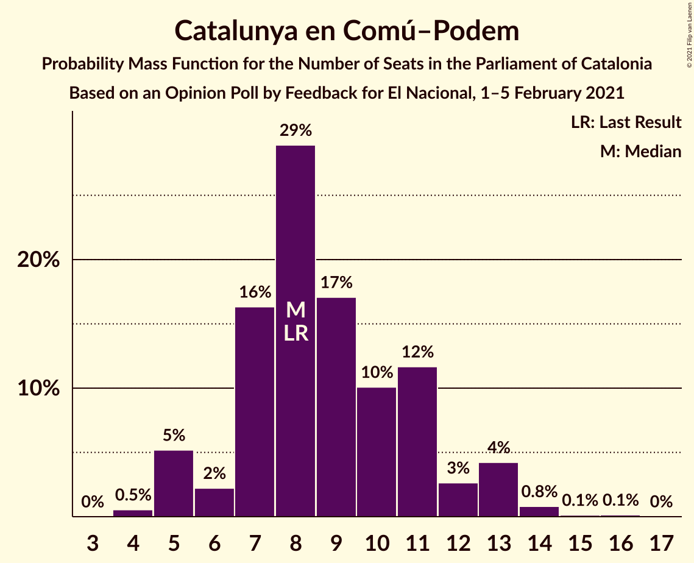

| Number of Seats | Probability | Accumulated | Special Marks |
|:---------------:|:-----------:|:-----------:|:-------------:|
| 4 | 0.5% | 100% |  |
| 5 | 5% | 99.4% |  |
| 6 | 2% | 94% |  |
| 7 | 16% | 92% |  |
| 8 | 29% | 76% | Last Result, Median |
| 9 | 17% | 47% |  |
| 10 | 10% | 30% |  |
| 11 | 12% | 20% |  |
| 12 | 3% | 8% |  |
| 13 | 4% | 5% |  |
| 14 | 0.8% | 1.1% |  |
| 15 | 0.1% | 0.3% |  |
| 16 | 0.1% | 0.2% |  |
| 17 | 0% | 0% |  |

### Vox

*For a full overview of the results for this party, see the [Vox](party-vox.html) page.*

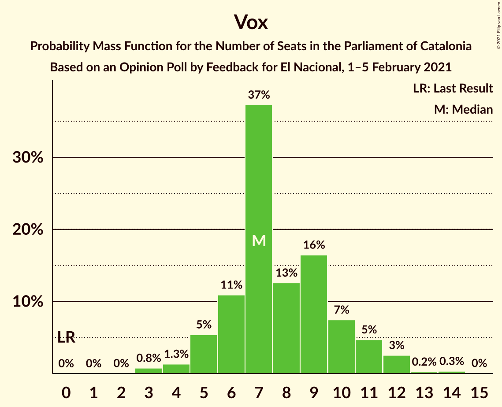

| Number of Seats | Probability | Accumulated | Special Marks |
|:---------------:|:-----------:|:-----------:|:-------------:|
| 0 | 0% | 100% | Last Result |
| 1 | 0% | 100% |  |
| 2 | 0% | 100% |  |
| 3 | 0.8% | 100% |  |
| 4 | 1.3% | 99.2% |  |
| 5 | 5% | 98% |  |
| 6 | 11% | 93% |  |
| 7 | 37% | 82% | Median |
| 8 | 13% | 44% |  |
| 9 | 16% | 32% |  |
| 10 | 7% | 15% |  |
| 11 | 5% | 8% |  |
| 12 | 3% | 3% |  |
| 13 | 0.2% | 0.6% |  |
| 14 | 0.3% | 0.4% |  |
| 15 | 0% | 0% |  |

### Partit Popular

*For a full overview of the results for this party, see the [Partit Popular](party-partitpopular.html) page.*

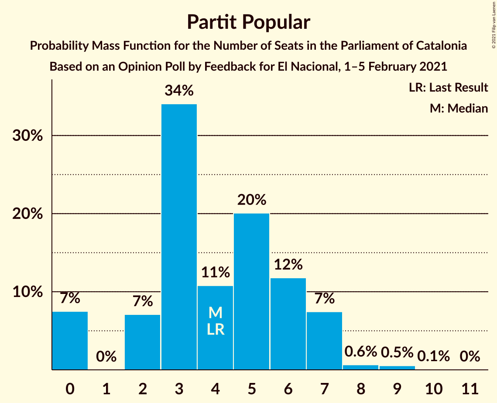

| Number of Seats | Probability | Accumulated | Special Marks |
|:---------------:|:-----------:|:-----------:|:-------------:|
| 0 | 7% | 100% |  |
| 1 | 0% | 93% |  |
| 2 | 7% | 93% |  |
| 3 | 34% | 85% |  |
| 4 | 11% | 51% | Last Result, Median |
| 5 | 20% | 41% |  |
| 6 | 12% | 20% |  |
| 7 | 7% | 9% |  |
| 8 | 0.6% | 1.3% |  |
| 9 | 0.5% | 0.6% |  |
| 10 | 0.1% | 0.1% |  |
| 11 | 0% | 0% |  |

## Coalitions

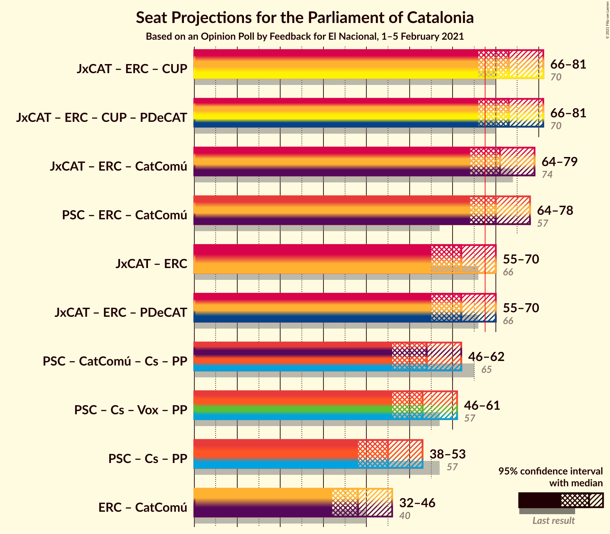

### Confidence Intervals

| Coalition | Last Result | Median | Majority? | 80% Confidence Interval | 90% Confidence Interval | 95% Confidence Interval | 99% Confidence Interval |
|:---------:|:-----------:|:------:|:---------:|:-----------------------:|:-----------------------:|:-----------------------:|:-----------------------:|
| Junts per Catalunya – Esquerra Republicana–Catalunya Sí – Candidatura d’Unitat Popular | 70 | 73 | 93% | 68–79 | 67–80 | 66–81 | 63–83 |
| Junts per Catalunya – Esquerra Republicana–Catalunya Sí – Catalunya en Comú–Podem | 74 | 71 | 80% | 66–77 | 65–78 | 64–79 | 61–81 |
| Partit dels Socialistes de Catalunya (PSC-PSOE) – Esquerra Republicana–Catalunya Sí – Catalunya en Comú–Podem | 57 | 70 | 79% | 66–76 | 65–77 | 64–78 | 61–80 |
| Junts per Catalunya – Esquerra Republicana–Catalunya Sí | 66 | 62 | 10% | 58–67 | 56–69 | 55–70 | 53–72 |
| Partit dels Socialistes de Catalunya (PSC-PSOE) – Catalunya en Comú–Podem – Ciutadans–Partido de la Ciudadanía – Partit Popular | 65 | 54 | 0% | 49–59 | 47–60 | 46–62 | 45–64 |
| Partit dels Socialistes de Catalunya (PSC-PSOE) – Ciutadans–Partido de la Ciudadanía – Vox – Partit Popular | 57 | 53 | 0% | 48–58 | 47–60 | 46–61 | 44–63 |
| Partit dels Socialistes de Catalunya (PSC-PSOE) – Ciutadans–Partido de la Ciudadanía – Partit Popular | 57 | 45 | 0% | 40–51 | 39–52 | 38–53 | 37–55 |
| Esquerra Republicana–Catalunya Sí – Catalunya en Comú–Podem | 40 | 38 | 0% | 34–43 | 33–44 | 32–46 | 30–48 |

### Junts per Catalunya – Esquerra Republicana–Catalunya Sí – Candidatura d’Unitat Popular

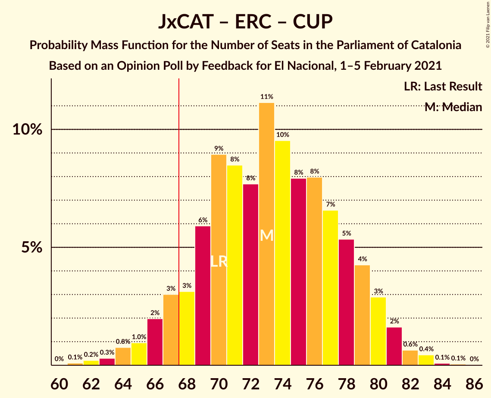

| Number of Seats | Probability | Accumulated | Special Marks |
|:---------------:|:-----------:|:-----------:|:-------------:|
| 61 | 0.1% | 100% |  |
| 62 | 0.2% | 99.9% |  |
| 63 | 0.3% | 99.7% |  |
| 64 | 0.8% | 99.4% |  |
| 65 | 1.0% | 98.6% |  |
| 66 | 2% | 98% |  |
| 67 | 3% | 96% |  |
| 68 | 3% | 93% | Majority |
| 69 | 6% | 90% |  |
| 70 | 9% | 84% | Last Result |
| 71 | 8% | 75% |  |
| 72 | 8% | 66% |  |
| 73 | 11% | 59% | Median |
| 74 | 10% | 47% |  |
| 75 | 8% | 38% |  |
| 76 | 8% | 30% |  |
| 77 | 7% | 22% |  |
| 78 | 5% | 15% |  |
| 79 | 4% | 10% |  |
| 80 | 3% | 6% |  |
| 81 | 2% | 3% |  |
| 82 | 0.6% | 1.2% |  |
| 83 | 0.4% | 0.6% |  |
| 84 | 0.1% | 0.2% |  |
| 85 | 0.1% | 0.1% |  |
| 86 | 0% | 0% |  |

### Junts per Catalunya – Esquerra Republicana–Catalunya Sí – Catalunya en Comú–Podem

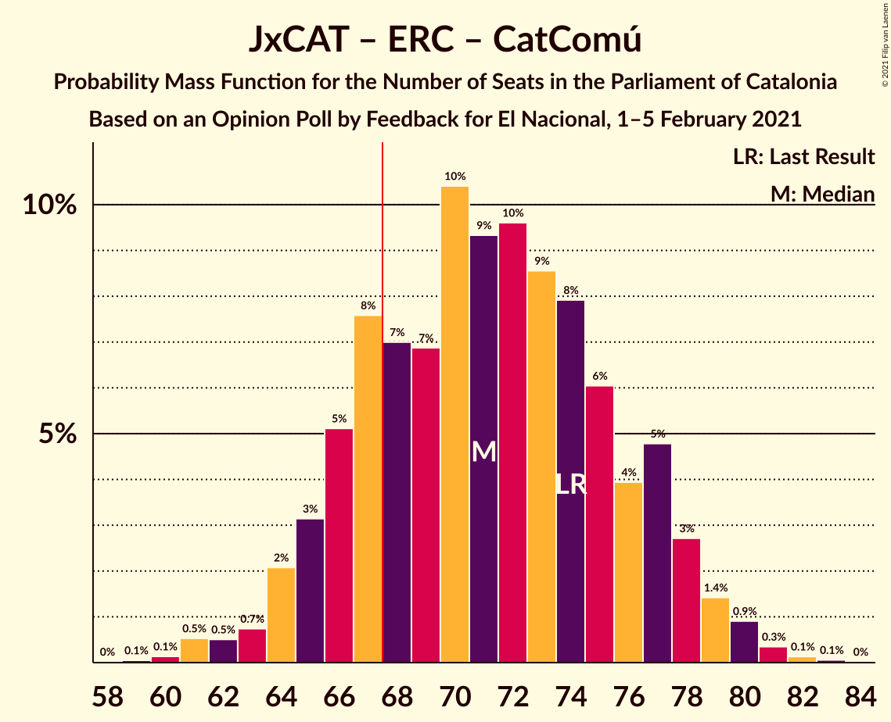

| Number of Seats | Probability | Accumulated | Special Marks |
|:---------------:|:-----------:|:-----------:|:-------------:|
| 59 | 0.1% | 100% |  |
| 60 | 0.1% | 99.9% |  |
| 61 | 0.5% | 99.8% |  |
| 62 | 0.5% | 99.2% |  |
| 63 | 0.7% | 98.7% |  |
| 64 | 2% | 98% |  |
| 65 | 3% | 96% |  |
| 66 | 5% | 93% |  |
| 67 | 8% | 88% |  |
| 68 | 7% | 80% | Majority |
| 69 | 7% | 73% |  |
| 70 | 10% | 66% | Median |
| 71 | 9% | 56% |  |
| 72 | 10% | 46% |  |
| 73 | 9% | 37% |  |
| 74 | 8% | 28% | Last Result |
| 75 | 6% | 20% |  |
| 76 | 4% | 14% |  |
| 77 | 5% | 10% |  |
| 78 | 3% | 6% |  |
| 79 | 1.4% | 3% |  |
| 80 | 0.9% | 1.5% |  |
| 81 | 0.3% | 0.6% |  |
| 82 | 0.1% | 0.2% |  |
| 83 | 0.1% | 0.1% |  |
| 84 | 0% | 0% |  |

### Partit dels Socialistes de Catalunya (PSC-PSOE) – Esquerra Republicana–Catalunya Sí – Catalunya en Comú–Podem

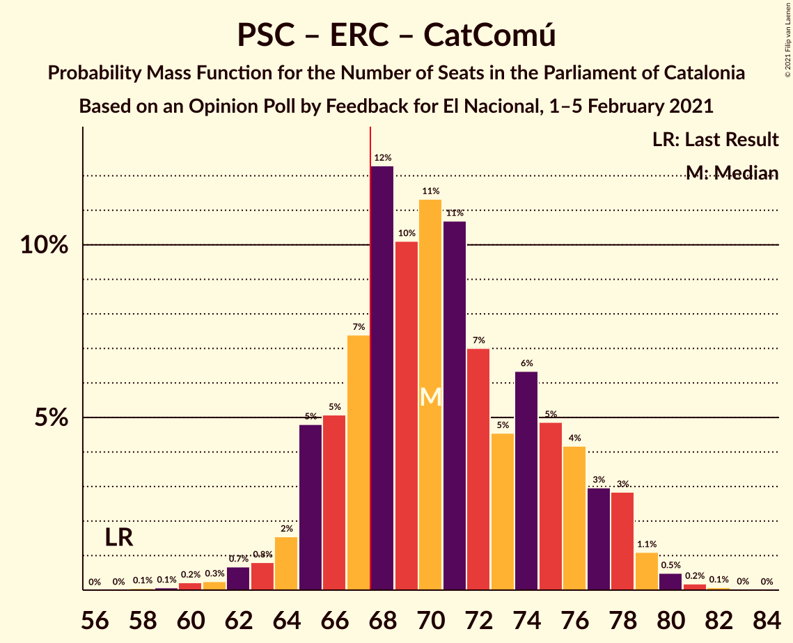

| Number of Seats | Probability | Accumulated | Special Marks |
|:---------------:|:-----------:|:-----------:|:-------------:|
| 57 | 0% | 100% | Last Result |
| 58 | 0.1% | 100% |  |
| 59 | 0.1% | 99.9% |  |
| 60 | 0.2% | 99.9% |  |
| 61 | 0.3% | 99.6% |  |
| 62 | 0.7% | 99.4% |  |
| 63 | 0.8% | 98.7% |  |
| 64 | 2% | 98% |  |
| 65 | 5% | 96% |  |
| 66 | 5% | 92% |  |
| 67 | 7% | 86% |  |
| 68 | 12% | 79% | Majority |
| 69 | 10% | 67% |  |
| 70 | 11% | 57% | Median |
| 71 | 11% | 45% |  |
| 72 | 7% | 35% |  |
| 73 | 5% | 28% |  |
| 74 | 6% | 23% |  |
| 75 | 5% | 17% |  |
| 76 | 4% | 12% |  |
| 77 | 3% | 8% |  |
| 78 | 3% | 5% |  |
| 79 | 1.1% | 2% |  |
| 80 | 0.5% | 0.8% |  |
| 81 | 0.2% | 0.3% |  |
| 82 | 0.1% | 0.1% |  |
| 83 | 0% | 0% |  |

### Junts per Catalunya – Esquerra Republicana–Catalunya Sí

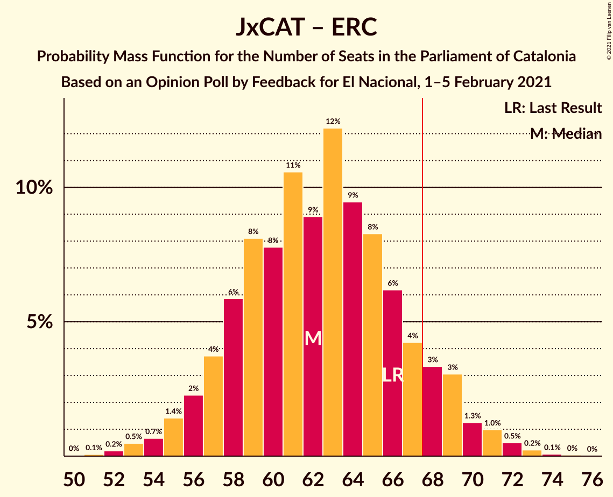

| Number of Seats | Probability | Accumulated | Special Marks |
|:---------------:|:-----------:|:-----------:|:-------------:|
| 50 | 0% | 100% |  |
| 51 | 0.1% | 99.9% |  |
| 52 | 0.2% | 99.9% |  |
| 53 | 0.5% | 99.7% |  |
| 54 | 0.7% | 99.2% |  |
| 55 | 1.4% | 98.5% |  |
| 56 | 2% | 97% |  |
| 57 | 4% | 95% |  |
| 58 | 6% | 91% |  |
| 59 | 8% | 85% |  |
| 60 | 8% | 77% |  |
| 61 | 11% | 69% |  |
| 62 | 9% | 59% | Median |
| 63 | 12% | 50% |  |
| 64 | 9% | 38% |  |
| 65 | 8% | 28% |  |
| 66 | 6% | 20% | Last Result |
| 67 | 4% | 14% |  |
| 68 | 3% | 10% | Majority |
| 69 | 3% | 6% |  |
| 70 | 1.3% | 3% |  |
| 71 | 1.0% | 2% |  |
| 72 | 0.5% | 0.9% |  |
| 73 | 0.2% | 0.4% |  |
| 74 | 0.1% | 0.1% |  |
| 75 | 0% | 0.1% |  |
| 76 | 0% | 0% |  |

### Partit dels Socialistes de Catalunya (PSC-PSOE) – Catalunya en Comú–Podem – Ciutadans–Partido de la Ciudadanía – Partit Popular

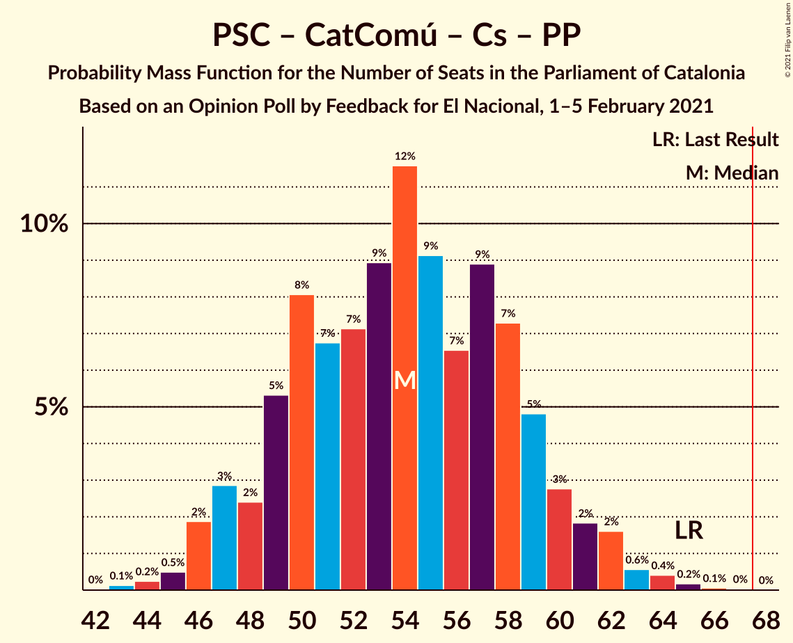

| Number of Seats | Probability | Accumulated | Special Marks |
|:---------------:|:-----------:|:-----------:|:-------------:|
| 43 | 0.1% | 100% |  |
| 44 | 0.2% | 99.8% |  |
| 45 | 0.5% | 99.6% |  |
| 46 | 2% | 99.1% |  |
| 47 | 3% | 97% |  |
| 48 | 2% | 94% |  |
| 49 | 5% | 92% |  |
| 50 | 8% | 87% |  |
| 51 | 7% | 79% |  |
| 52 | 7% | 72% | Median |
| 53 | 9% | 65% |  |
| 54 | 12% | 56% |  |
| 55 | 9% | 44% |  |
| 56 | 7% | 35% |  |
| 57 | 9% | 28% |  |
| 58 | 7% | 20% |  |
| 59 | 5% | 12% |  |
| 60 | 3% | 7% |  |
| 61 | 2% | 5% |  |
| 62 | 2% | 3% |  |
| 63 | 0.6% | 1.3% |  |
| 64 | 0.4% | 0.7% |  |
| 65 | 0.2% | 0.3% | Last Result |
| 66 | 0.1% | 0.1% |  |
| 67 | 0% | 0% |  |

### Partit dels Socialistes de Catalunya (PSC-PSOE) – Ciutadans–Partido de la Ciudadanía – Vox – Partit Popular

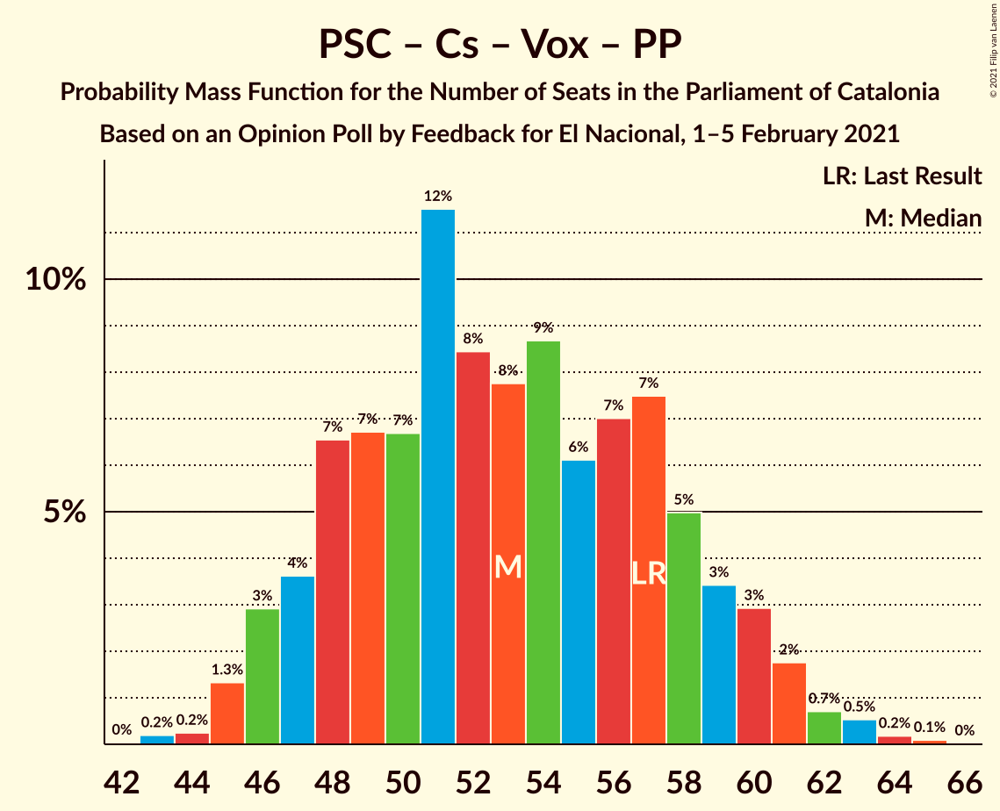

| Number of Seats | Probability | Accumulated | Special Marks |
|:---------------:|:-----------:|:-----------:|:-------------:|
| 42 | 0% | 100% |  |
| 43 | 0.2% | 99.9% |  |
| 44 | 0.2% | 99.7% |  |
| 45 | 1.3% | 99.5% |  |
| 46 | 3% | 98% |  |
| 47 | 4% | 95% |  |
| 48 | 7% | 92% |  |
| 49 | 7% | 85% |  |
| 50 | 7% | 78% |  |
| 51 | 12% | 72% | Median |
| 52 | 8% | 60% |  |
| 53 | 8% | 52% |  |
| 54 | 9% | 44% |  |
| 55 | 6% | 35% |  |
| 56 | 7% | 29% |  |
| 57 | 7% | 22% | Last Result |
| 58 | 5% | 15% |  |
| 59 | 3% | 10% |  |
| 60 | 3% | 6% |  |
| 61 | 2% | 3% |  |
| 62 | 0.7% | 2% |  |
| 63 | 0.5% | 0.8% |  |
| 64 | 0.2% | 0.3% |  |
| 65 | 0.1% | 0.1% |  |
| 66 | 0% | 0% |  |

### Partit dels Socialistes de Catalunya (PSC-PSOE) – Ciutadans–Partido de la Ciudadanía – Partit Popular

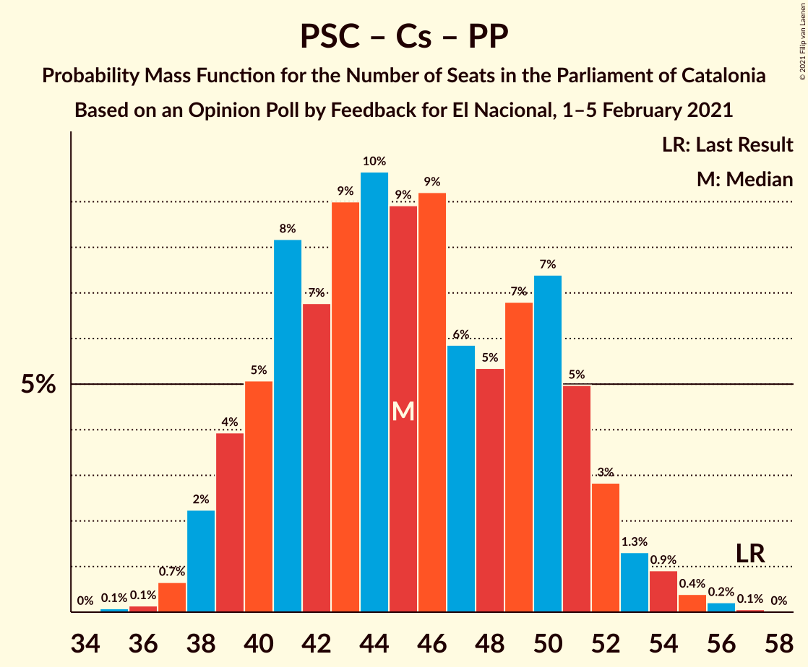

| Number of Seats | Probability | Accumulated | Special Marks |
|:---------------:|:-----------:|:-----------:|:-------------:|
| 35 | 0.1% | 100% |  |
| 36 | 0.1% | 99.9% |  |
| 37 | 0.7% | 99.8% |  |
| 38 | 2% | 99.1% |  |
| 39 | 4% | 97% |  |
| 40 | 5% | 93% |  |
| 41 | 8% | 88% |  |
| 42 | 7% | 80% |  |
| 43 | 9% | 73% |  |
| 44 | 10% | 64% | Median |
| 45 | 9% | 54% |  |
| 46 | 9% | 45% |  |
| 47 | 6% | 36% |  |
| 48 | 5% | 30% |  |
| 49 | 7% | 25% |  |
| 50 | 7% | 18% |  |
| 51 | 5% | 11% |  |
| 52 | 3% | 6% |  |
| 53 | 1.3% | 3% |  |
| 54 | 0.9% | 2% |  |
| 55 | 0.4% | 0.7% |  |
| 56 | 0.2% | 0.3% |  |
| 57 | 0.1% | 0.1% | Last Result |
| 58 | 0% | 0% |  |

### Esquerra Republicana–Catalunya Sí – Catalunya en Comú–Podem

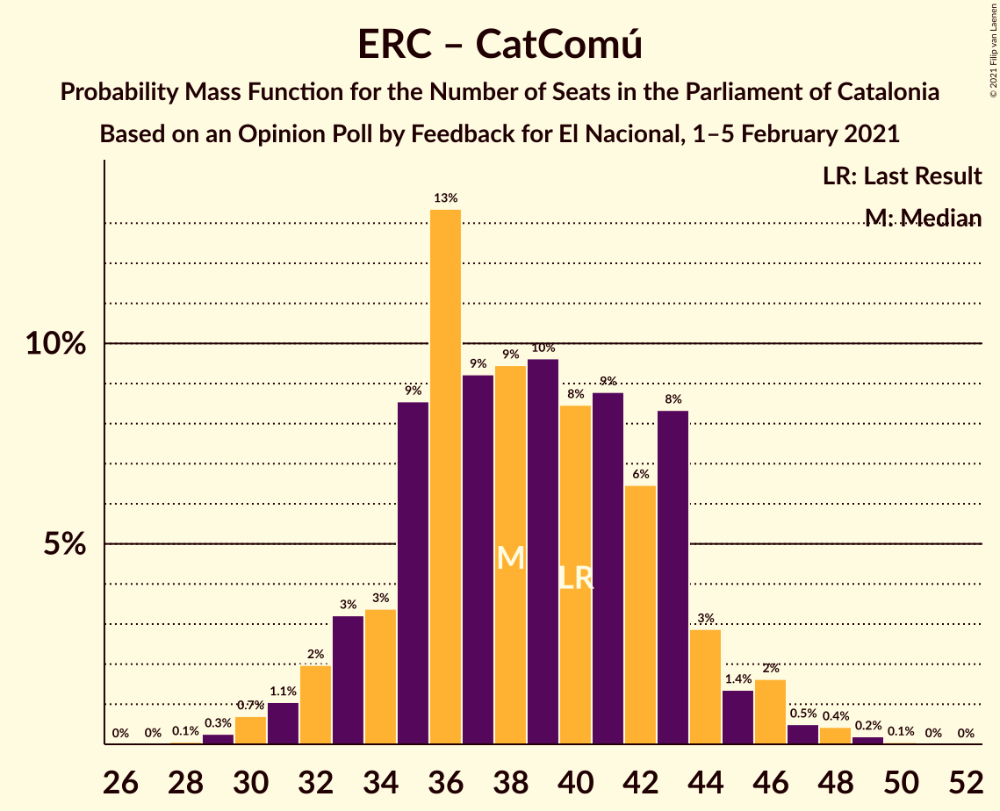

| Number of Seats | Probability | Accumulated | Special Marks |
|:---------------:|:-----------:|:-----------:|:-------------:|
| 28 | 0.1% | 100% |  |
| 29 | 0.3% | 99.9% |  |
| 30 | 0.7% | 99.7% |  |
| 31 | 1.1% | 99.0% |  |
| 32 | 2% | 98% |  |
| 33 | 3% | 96% |  |
| 34 | 3% | 93% |  |
| 35 | 9% | 89% |  |
| 36 | 13% | 81% |  |
| 37 | 9% | 67% |  |
| 38 | 9% | 58% | Median |
| 39 | 10% | 49% |  |
| 40 | 8% | 39% | Last Result |
| 41 | 9% | 31% |  |
| 42 | 6% | 22% |  |
| 43 | 8% | 15% |  |
| 44 | 3% | 7% |  |
| 45 | 1.4% | 4% |  |
| 46 | 2% | 3% |  |
| 47 | 0.5% | 1.2% |  |
| 48 | 0.4% | 0.7% |  |
| 49 | 0.2% | 0.3% |  |
| 50 | 0.1% | 0.1% |  |
| 51 | 0% | 0% |  |

## Technical Information

### Opinion Poll

+ **Polling firm:** Feedback
+ **Commissioner(s):** El Nacional
+ **Fieldwork period:** 1–5 February 2021

### Calculations

+ **Sample size:** 490
+ **Simulations done:** 1,048,576
+ **Error estimate:** 2.94%

