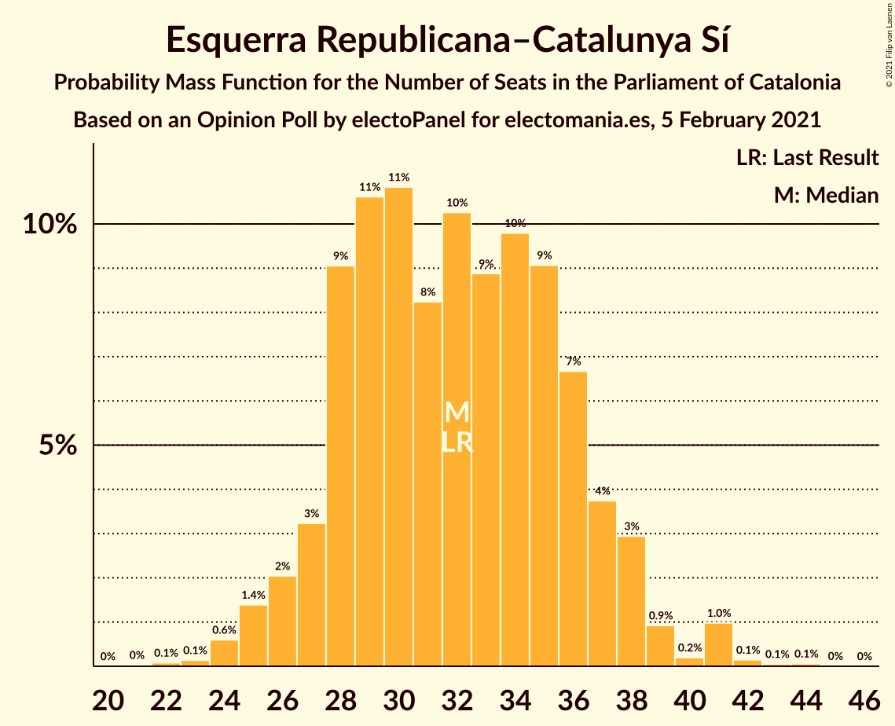
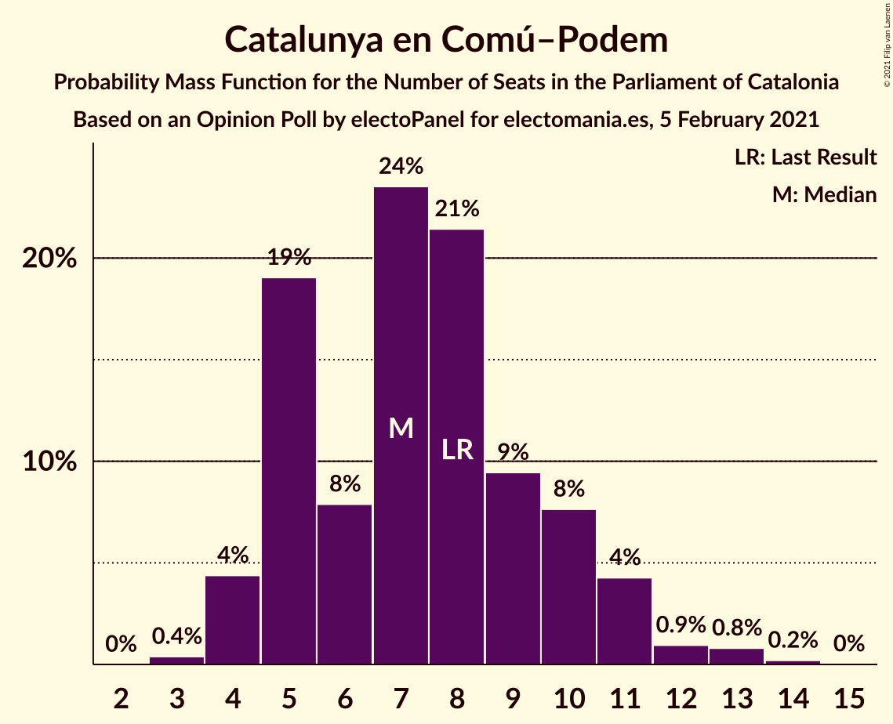
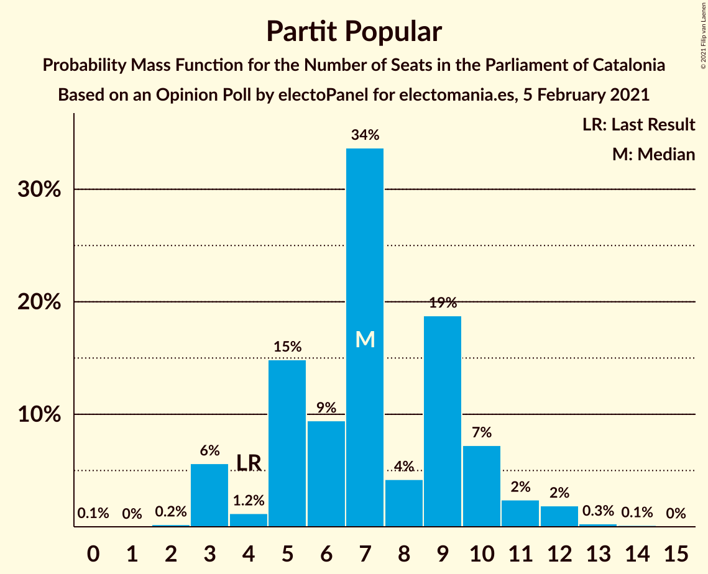
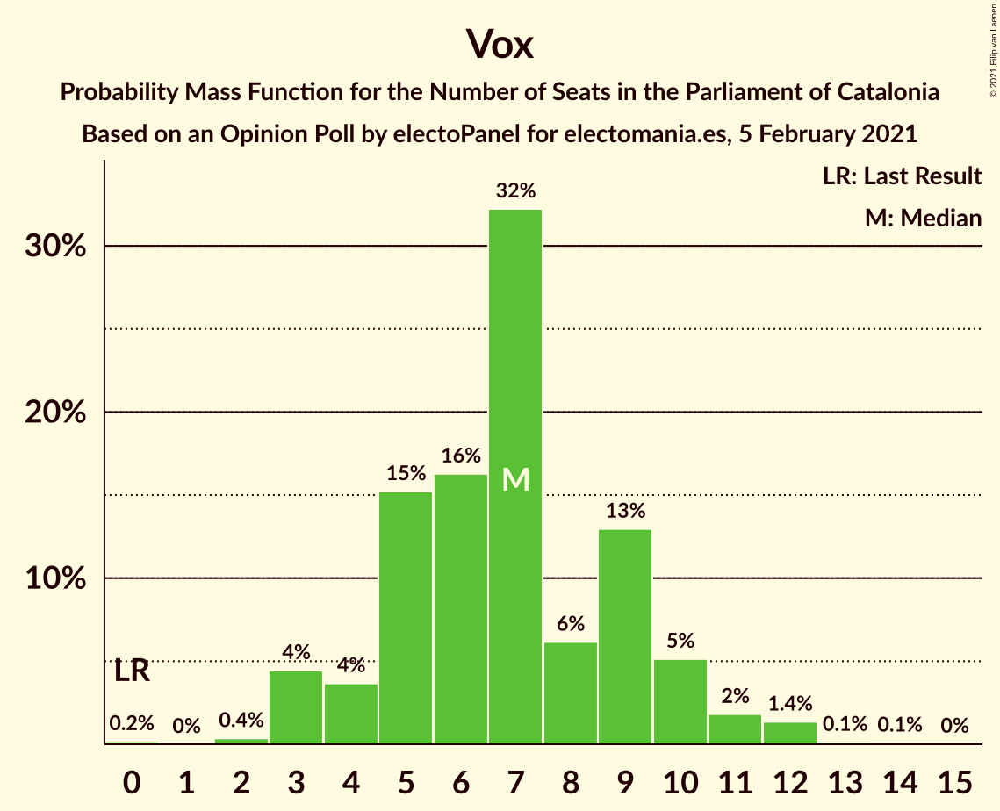
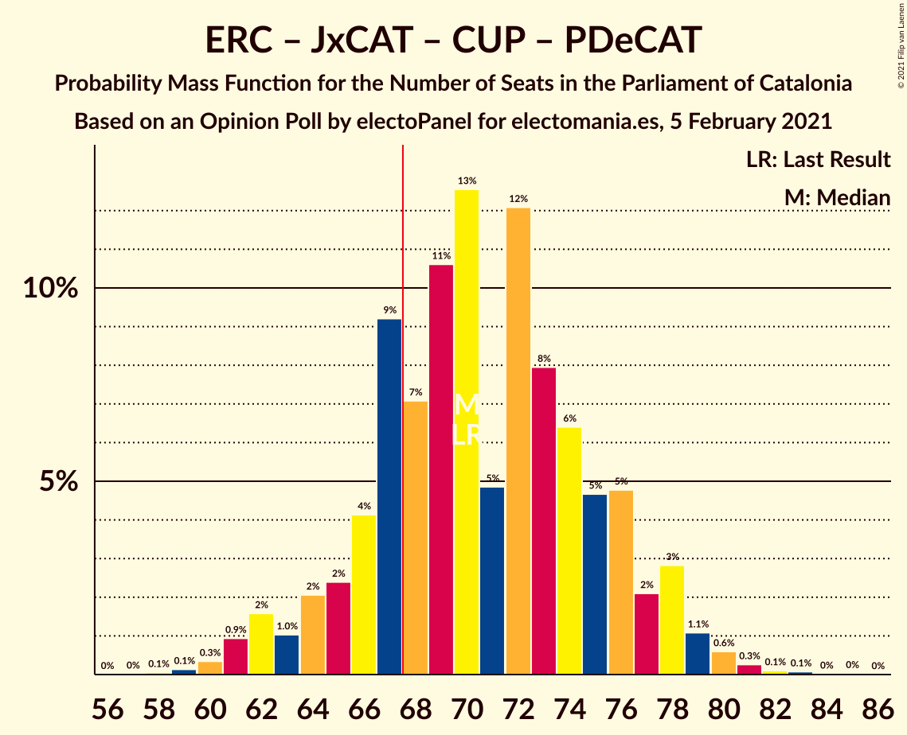
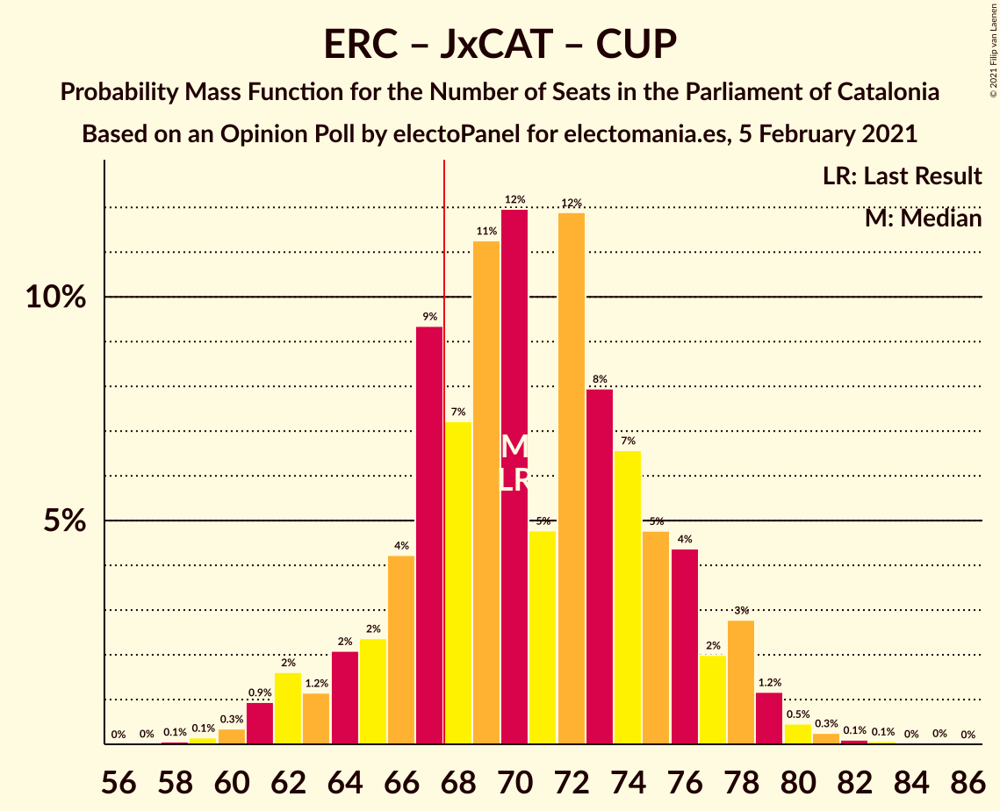

# Opinion Poll by electoPanel for electomania.es, 5 February 2021

<a href="#voting-intentions">Voting Intentions</a> | <a href="#seats">Seats</a> | <a href="#coalitions">Coalitions</a> | <a href="#technical-information">Technical Information</a>

## Voting Intentions

### Confidence Intervals

| Party | Last Result | Poll Result | 80% Confidence Interval | 90% Confidence Interval | 95% Confidence Interval | 99% Confidence Interval |
|:-----:|:-----------:|:-----------:|:-----------------------:|:-----------------------:|:-----------------------:|:-----------------------:|
| Partit dels Socialistes de Catalunya (PSC-PSOE) | 13.9% | 21.8% | 19.3–24.6% |18.6–25.4% |18.0–26.1% |16.9–27.5% |
| Esquerra Republicana–Catalunya Sí | 21.4% | 21.0% | 18.6–23.8% |17.9–24.6% |17.3–25.3% |16.2–26.6% |
| Junts per Catalunya | 21.7% | 20.0% | 17.6–22.8% |16.9–23.5% |16.4–24.2% |15.3–25.6% |
| Ciutadans–Partido de la Ciudadanía | 25.4% | 9.8% | 8.1–11.9% |7.6–12.5% |7.2–13.1% |6.5–14.2% |
| Catalunya en Comú–Podem | 7.5% | 6.5% | 5.2–8.4% |4.8–8.9% |4.5–9.4% |3.9–10.3% |
| Partit Popular | 4.2% | 5.8% | 4.5–7.5% |4.1–8.0% |3.9–8.5% |3.3–9.4% |
| Vox | 0.0% | 5.5% | 4.3–7.3% |3.9–7.7% |3.7–8.2% |3.2–9.1% |
| Candidatura d’Unitat Popular | 4.5% | 5.0% | 3.9–6.7% |3.5–7.2% |3.3–7.6% |2.8–8.5% |
| Partit Demòcrata Europeu Català | 0.0% | 1.2% | 0.8–2.3% |0.6–2.6% |0.5–2.9% |0.4–3.5% |

*Note:* The poll result column reflects the actual value used in the calculations. Published results may vary slightly, and in addition be rounded to fewer digits.

## Seats

### Confidence Intervals

| Party | Last Result | Median | 80% Confidence Interval | 90% Confidence Interval | 95% Confidence Interval | 99% Confidence Interval |
|:-----:|:-----------:|:------:|:-----------------------:|:-----------------------:|:-----------------------:|:-----------------------:|
| <a href="#partit-dels-socialistes-de-catalunya-(psc-psoe)">Partit dels Socialistes de Catalunya (PSC-PSOE)</a> | 17 | 31 | 27–33 |25–34 |24–35 |22–38 |
| <a href="#esquerra-republicana–catalunya-sí">Esquerra Republicana–Catalunya Sí</a> | 32 | 32 | 28–37 |27–37 |25–38 |24–41 |
| <a href="#junts-per-catalunya">Junts per Catalunya</a> | 34 | 31 | 28–36 |25–37 |25–37 |24–40 |
| <a href="#ciutadans–partido-de-la-ciudadanía">Ciutadans–Partido de la Ciudadanía</a> | 36 | 13 | 11–15 |10–17 |9–18 |8–19 |
| <a href="#catalunya-en-comú–podem">Catalunya en Comú–Podem</a> | 8 | 8 | 5–10 |5–11 |5–12 |4–13 |
| <a href="#partit-popular">Partit Popular</a> | 4 | 7 | 6–10 |6–10 |3–11 |3–13 |
| <a href="#vox">Vox</a> | 0 | 6 | 5–9 |5–10 |3–10 |3–12 |
| <a href="#candidatura-d’unitat-popular">Candidatura d’Unitat Popular</a> | 4 | 7 | 4–8 |3–9 |2–10 |0–11 |
| <a href="#partit-demòcrata-europeu-català">Partit Demòcrata Europeu Català</a> | 0 | 0 | 0 |0–1 |0–1 |0–1 |

### Partit dels Socialistes de Catalunya (PSC-PSOE)

*For a full overview of the results for this party, see the [Partit dels Socialistes de Catalunya (PSC-PSOE)](party-partitdelssocialistesdecatalunyapsc-psoe.html) page.*

| Number of Seats | Probability | Accumulated | Special Marks |
|:---------------:|:-----------:|:-----------:|:-------------:|
| 17 | 0% | 100% | Last Result |
| 18 | 0% | 100% |  |
| 19 | 0% | 100% |  |
| 20 | 0% | 100% |  |
| 21 | 0% | 100% |  |
| 22 | 0.5% | 99.9% |  |
| 23 | 0.2% | 99.4% |  |
| 24 | 3% | 99.3% |  |
| 25 | 2% | 96% |  |
| 26 | 5% | 95% |  |
| 27 | 3% | 90% |  |
| 28 | 4% | 88% |  |
| 29 | 2% | 84% |  |
| 30 | 5% | 82% |  |
| 31 | 48% | 77% | Median |
| 32 | 18% | 30% |  |
| 33 | 5% | 12% |  |
| 34 | 4% | 7% |  |
| 35 | 2% | 4% |  |
| 36 | 0.2% | 2% |  |
| 37 | 1.0% | 2% |  |
| 38 | 0.4% | 0.6% |  |
| 39 | 0.1% | 0.2% |  |
| 40 | 0.1% | 0.1% |  |
| 41 | 0% | 0.1% |  |
| 42 | 0% | 0% |  |

### Esquerra Republicana–Catalunya Sí

*For a full overview of the results for this party, see the [Esquerra Republicana–Catalunya Sí](party-esquerrarepublicana–catalunyasí.html) page.*

| Number of Seats | Probability | Accumulated | Special Marks |
|:---------------:|:-----------:|:-----------:|:-------------:|
| 22 | 0.1% | 100% |  |
| 23 | 0.2% | 99.9% |  |
| 24 | 0.3% | 99.7% |  |
| 25 | 3% | 99.5% |  |
| 26 | 0.7% | 97% |  |
| 27 | 2% | 96% |  |
| 28 | 9% | 94% |  |
| 29 | 8% | 85% |  |
| 30 | 19% | 77% |  |
| 31 | 4% | 58% |  |
| 32 | 5% | 53% | Last Result, Median |
| 33 | 2% | 48% |  |
| 34 | 23% | 47% |  |
| 35 | 6% | 23% |  |
| 36 | 7% | 18% |  |
| 37 | 7% | 11% |  |
| 38 | 3% | 4% |  |
| 39 | 0.4% | 1.2% |  |
| 40 | 0.1% | 0.8% |  |
| 41 | 0.5% | 0.8% |  |
| 42 | 0.1% | 0.2% |  |
| 43 | 0.1% | 0.1% |  |
| 44 | 0% | 0% |  |

### Junts per Catalunya

*For a full overview of the results for this party, see the [Junts per Catalunya](party-juntspercatalunya.html) page.*

| Number of Seats | Probability | Accumulated | Special Marks |
|:---------------:|:-----------:|:-----------:|:-------------:|
| 22 | 0% | 100% |  |
| 23 | 0.2% | 99.9% |  |
| 24 | 0.5% | 99.7% |  |
| 25 | 5% | 99.3% |  |
| 26 | 2% | 94% |  |
| 27 | 2% | 93% |  |
| 28 | 4% | 90% |  |
| 29 | 11% | 86% |  |
| 30 | 7% | 75% |  |
| 31 | 25% | 68% | Median |
| 32 | 18% | 43% |  |
| 33 | 1.1% | 24% |  |
| 34 | 2% | 23% | Last Result |
| 35 | 1.2% | 21% |  |
| 36 | 12% | 20% |  |
| 37 | 6% | 8% |  |
| 38 | 0.4% | 2% |  |
| 39 | 0.9% | 2% |  |
| 40 | 0.3% | 0.7% |  |
| 41 | 0.1% | 0.4% |  |
| 42 | 0.1% | 0.3% |  |
| 43 | 0.1% | 0.1% |  |
| 44 | 0% | 0% |  |

### Ciutadans–Partido de la Ciudadanía

*For a full overview of the results for this party, see the [Ciutadans–Partido de la Ciudadanía](party-ciutadans–partidodelaciudadanía.html) page.*

| Number of Seats | Probability | Accumulated | Special Marks |
|:---------------:|:-----------:|:-----------:|:-------------:|
| 6 | 0.1% | 100% |  |
| 7 | 0.4% | 99.9% |  |
| 8 | 2% | 99.6% |  |
| 9 | 2% | 98% |  |
| 10 | 1.1% | 95% |  |
| 11 | 20% | 94% |  |
| 12 | 10% | 74% |  |
| 13 | 25% | 64% | Median |
| 14 | 20% | 39% |  |
| 15 | 10% | 19% |  |
| 16 | 3% | 9% |  |
| 17 | 3% | 6% |  |
| 18 | 2% | 3% |  |
| 19 | 0.3% | 0.5% |  |
| 20 | 0.2% | 0.2% |  |
| 21 | 0.1% | 0.1% |  |
| 22 | 0% | 0% |  |
| 23 | 0% | 0% |  |
| 24 | 0% | 0% |  |
| 25 | 0% | 0% |  |
| 26 | 0% | 0% |  |
| 27 | 0% | 0% |  |
| 28 | 0% | 0% |  |
| 29 | 0% | 0% |  |
| 30 | 0% | 0% |  |
| 31 | 0% | 0% |  |
| 32 | 0% | 0% |  |
| 33 | 0% | 0% |  |
| 34 | 0% | 0% |  |
| 35 | 0% | 0% |  |
| 36 | 0% | 0% | Last Result |

### Catalunya en Comú–Podem

*For a full overview of the results for this party, see the [Catalunya en Comú–Podem](party-catalunyaencomú–podem.html) page.*

| Number of Seats | Probability | Accumulated | Special Marks |
|:---------------:|:-----------:|:-----------:|:-------------:|
| 3 | 0.3% | 100% |  |
| 4 | 2% | 99.7% |  |
| 5 | 23% | 98% |  |
| 6 | 11% | 75% |  |
| 7 | 13% | 64% |  |
| 8 | 24% | 51% | Last Result, Median |
| 9 | 15% | 27% |  |
| 10 | 7% | 12% |  |
| 11 | 1.5% | 6% |  |
| 12 | 4% | 4% |  |
| 13 | 0.6% | 0.7% |  |
| 14 | 0.1% | 0.1% |  |
| 15 | 0% | 0% |  |

### Partit Popular

*For a full overview of the results for this party, see the [Partit Popular](party-partitpopular.html) page.*

| Number of Seats | Probability | Accumulated | Special Marks |
|:---------------:|:-----------:|:-----------:|:-------------:|
| 2 | 0.2% | 100% |  |
| 3 | 2% | 99.8% |  |
| 4 | 0.2% | 97% | Last Result |
| 5 | 1.5% | 97% |  |
| 6 | 20% | 96% |  |
| 7 | 49% | 76% | Median |
| 8 | 0.3% | 27% |  |
| 9 | 12% | 27% |  |
| 10 | 12% | 15% |  |
| 11 | 1.3% | 3% |  |
| 12 | 0.5% | 1.3% |  |
| 13 | 0.7% | 0.8% |  |
| 14 | 0.1% | 0.1% |  |
| 15 | 0% | 0% |  |

### Vox

*For a full overview of the results for this party, see the [Vox](party-vox.html) page.*

| Number of Seats | Probability | Accumulated | Special Marks |
|:---------------:|:-----------:|:-----------:|:-------------:|
| 0 | 0.1% | 100% | Last Result |
| 1 | 0% | 99.9% |  |
| 2 | 0.4% | 99.9% |  |
| 3 | 3% | 99.5% |  |
| 4 | 1.4% | 97% |  |
| 5 | 25% | 96% |  |
| 6 | 24% | 71% | Median |
| 7 | 18% | 47% |  |
| 8 | 15% | 29% |  |
| 9 | 5% | 14% |  |
| 10 | 7% | 9% |  |
| 11 | 1.0% | 2% |  |
| 12 | 0.7% | 0.9% |  |
| 13 | 0.1% | 0.2% |  |
| 14 | 0% | 0.1% |  |
| 15 | 0% | 0% |  |

### Candidatura d’Unitat Popular

*For a full overview of the results for this party, see the [Candidatura d’Unitat Popular](party-candidaturad’unitatpopular.html) page.*

| Number of Seats | Probability | Accumulated | Special Marks |
|:---------------:|:-----------:|:-----------:|:-------------:|
| 0 | 0.7% | 100% |  |
| 1 | 0% | 99.3% |  |
| 2 | 4% | 99.3% |  |
| 3 | 2% | 95% |  |
| 4 | 27% | 93% | Last Result |
| 5 | 6% | 66% |  |
| 6 | 4% | 60% |  |
| 7 | 18% | 56% | Median |
| 8 | 31% | 38% |  |
| 9 | 3% | 6% |  |
| 10 | 3% | 4% |  |
| 11 | 0.6% | 0.8% |  |
| 12 | 0.1% | 0.2% |  |
| 13 | 0% | 0.1% |  |
| 14 | 0% | 0.1% |  |
| 15 | 0% | 0% |  |

### Partit Demòcrata Europeu Català

*For a full overview of the results for this party, see the [Partit Demòcrata Europeu Català](party-partitdemòcrataeuropeucatalà.html) page.*

| Number of Seats | Probability | Accumulated | Special Marks |
|:---------------:|:-----------:|:-----------:|:-------------:|
| 0 | 95% | 100% | Last Result, Median |
| 1 | 5% | 5% |  |
| 2 | 0% | 0.4% |  |
| 3 | 0.1% | 0.4% |  |
| 4 | 0.1% | 0.3% |  |
| 5 | 0.1% | 0.2% |  |
| 6 | 0% | 0% |  |

## Coalitions

### Confidence Intervals

| Coalition | Last Result | Median | Majority? | 80% Confidence Interval | 90% Confidence Interval | 95% Confidence Interval | 99% Confidence Interval |
|:---------:|:-----------:|:------:|:---------:|:-----------------------:|:-----------------------:|:-----------------------:|:-----------------------:|
| Esquerra Republicana–Catalunya Sí – Junts per Catalunya – Catalunya en Comú–Podem | 74 | 72 | 77% | 66–75 | 66–77 | 64–77 | 61–82 |
| Partit dels Socialistes de Catalunya (PSC-PSOE) – Esquerra Republicana–Catalunya Sí – Catalunya en Comú–Podem | 57 | 70 | 64% | 65–74 | 64–76 | 63–77 | 60–78 |
| Esquerra Republicana–Catalunya Sí – Junts per Catalunya – Candidatura d’Unitat Popular – Partit Demòcrata Europeu Català | 70 | 70 | 69% | 67–74 | 64–76 | 62–77 | 60–79 |
| Esquerra Republicana–Catalunya Sí – Junts per Catalunya – Candidatura d’Unitat Popular | 70 | 70 | 69% | 67–74 | 64–76 | 62–76 | 60–79 |
| Esquerra Republicana–Catalunya Sí – Junts per Catalunya | 66 | 64 | 12% | 59–68 | 58–69 | 56–70 | 53–73 |
| Esquerra Republicana–Catalunya Sí – Junts per Catalunya – Partit Demòcrata Europeu Català | 66 | 64 | 14% | 59–68 | 58–69 | 56–70 | 53–74 |
| Partit dels Socialistes de Catalunya (PSC-PSOE) – Ciutadans–Partido de la Ciudadanía – Catalunya en Comú–Podem – Partit Popular | 65 | 58 | 0.4% | 54–63 | 52–63 | 51–66 | 49–67 |
| Partit dels Socialistes de Catalunya (PSC-PSOE) – Ciutadans–Partido de la Ciudadanía – Partit Popular – Vox | 57 | 58 | 0.3% | 53–61 | 51–63 | 51–65 | 47–67 |
| Partit dels Socialistes de Catalunya (PSC-PSOE) – Ciutadans–Partido de la Ciudadanía – Partit Popular | 57 | 51 | 0% | 46–55 | 45–56 | 44–58 | 42–60 |
| Esquerra Republicana–Catalunya Sí – Catalunya en Comú–Podem | 40 | 41 | 0% | 35–43 | 34–44 | 34–45 | 32–48 |

### Esquerra Republicana–Catalunya Sí – Junts per Catalunya – Catalunya en Comú–Podem

| Number of Seats | Probability | Accumulated | Special Marks |
|:---------------:|:-----------:|:-----------:|:-------------:|
| 59 | 0% | 100% |  |
| 60 | 0.1% | 99.9% |  |
| 61 | 1.4% | 99.8% |  |
| 62 | 0.2% | 98% |  |
| 63 | 0.5% | 98% |  |
| 64 | 2% | 98% |  |
| 65 | 0.9% | 96% |  |
| 66 | 6% | 95% |  |
| 67 | 13% | 89% |  |
| 68 | 2% | 77% | Majority |
| 69 | 8% | 74% |  |
| 70 | 2% | 66% |  |
| 71 | 5% | 64% | Median |
| 72 | 25% | 59% |  |
| 73 | 14% | 34% |  |
| 74 | 6% | 20% | Last Result |
| 75 | 7% | 14% |  |
| 76 | 1.1% | 7% |  |
| 77 | 3% | 5% |  |
| 78 | 0.6% | 2% |  |
| 79 | 0.4% | 2% |  |
| 80 | 0.2% | 1.1% |  |
| 81 | 0.3% | 0.9% |  |
| 82 | 0.4% | 0.6% |  |
| 83 | 0.1% | 0.2% |  |
| 84 | 0% | 0.1% |  |
| 85 | 0% | 0% |  |

### Partit dels Socialistes de Catalunya (PSC-PSOE) – Esquerra Republicana–Catalunya Sí – Catalunya en Comú–Podem

| Number of Seats | Probability | Accumulated | Special Marks |
|:---------------:|:-----------:|:-----------:|:-------------:|
| 57 | 0% | 100% | Last Result |
| 58 | 0.1% | 99.9% |  |
| 59 | 0.1% | 99.9% |  |
| 60 | 0.4% | 99.8% |  |
| 61 | 0.6% | 99.4% |  |
| 62 | 0.4% | 98.8% |  |
| 63 | 2% | 98% |  |
| 64 | 2% | 96% |  |
| 65 | 5% | 94% |  |
| 66 | 2% | 90% |  |
| 67 | 24% | 88% |  |
| 68 | 4% | 64% | Majority |
| 69 | 5% | 61% |  |
| 70 | 8% | 55% |  |
| 71 | 3% | 47% | Median |
| 72 | 2% | 44% |  |
| 73 | 23% | 42% |  |
| 74 | 10% | 19% |  |
| 75 | 4% | 9% |  |
| 76 | 1.0% | 6% |  |
| 77 | 3% | 5% |  |
| 78 | 1.2% | 2% |  |
| 79 | 0.3% | 0.5% |  |
| 80 | 0% | 0.2% |  |
| 81 | 0.1% | 0.2% |  |
| 82 | 0% | 0.1% |  |
| 83 | 0% | 0.1% |  |
| 84 | 0% | 0% |  |

### Esquerra Republicana–Catalunya Sí – Junts per Catalunya – Candidatura d’Unitat Popular – Partit Demòcrata Europeu Català

| Number of Seats | Probability | Accumulated | Special Marks |
|:---------------:|:-----------:|:-----------:|:-------------:|
| 58 | 0.1% | 100% |  |
| 59 | 0.2% | 99.9% |  |
| 60 | 2% | 99.7% |  |
| 61 | 0.6% | 98% |  |
| 62 | 0.6% | 98% |  |
| 63 | 1.0% | 97% |  |
| 64 | 1.1% | 96% |  |
| 65 | 3% | 95% |  |
| 66 | 1.5% | 92% |  |
| 67 | 21% | 91% |  |
| 68 | 6% | 69% | Majority |
| 69 | 12% | 63% |  |
| 70 | 12% | 51% | Last Result, Median |
| 71 | 6% | 38% |  |
| 72 | 3% | 32% |  |
| 73 | 13% | 29% |  |
| 74 | 8% | 16% |  |
| 75 | 0.9% | 8% |  |
| 76 | 5% | 7% |  |
| 77 | 0.9% | 3% |  |
| 78 | 0.6% | 2% |  |
| 79 | 0.6% | 1.0% |  |
| 80 | 0.2% | 0.4% |  |
| 81 | 0% | 0.2% |  |
| 82 | 0.1% | 0.1% |  |
| 83 | 0% | 0.1% |  |
| 84 | 0% | 0% |  |

### Esquerra Republicana–Catalunya Sí – Junts per Catalunya – Candidatura d’Unitat Popular

| Number of Seats | Probability | Accumulated | Special Marks |
|:---------------:|:-----------:|:-----------:|:-------------:|
| 58 | 0.1% | 100% |  |
| 59 | 0.2% | 99.9% |  |
| 60 | 2% | 99.7% |  |
| 61 | 0.6% | 98% |  |
| 62 | 0.6% | 98% |  |
| 63 | 1.2% | 97% |  |
| 64 | 1.0% | 96% |  |
| 65 | 3% | 95% |  |
| 66 | 2% | 92% |  |
| 67 | 21% | 90% |  |
| 68 | 7% | 69% | Majority |
| 69 | 12% | 62% |  |
| 70 | 13% | 50% | Last Result, Median |
| 71 | 5% | 37% |  |
| 72 | 3% | 32% |  |
| 73 | 13% | 29% |  |
| 74 | 8% | 16% |  |
| 75 | 3% | 8% |  |
| 76 | 3% | 5% |  |
| 77 | 0.9% | 2% |  |
| 78 | 0.5% | 2% |  |
| 79 | 0.6% | 1.0% |  |
| 80 | 0.2% | 0.4% |  |
| 81 | 0% | 0.2% |  |
| 82 | 0.1% | 0.1% |  |
| 83 | 0% | 0.1% |  |
| 84 | 0% | 0% |  |

### Esquerra Republicana–Catalunya Sí – Junts per Catalunya

| Number of Seats | Probability | Accumulated | Special Marks |
|:---------------:|:-----------:|:-----------:|:-------------:|
| 52 | 0.1% | 100% |  |
| 53 | 1.4% | 99.9% |  |
| 54 | 0.2% | 98% |  |
| 55 | 0.8% | 98% |  |
| 56 | 0.3% | 98% |  |
| 57 | 2% | 97% |  |
| 58 | 2% | 95% |  |
| 59 | 10% | 93% |  |
| 60 | 6% | 83% |  |
| 61 | 3% | 77% |  |
| 62 | 13% | 74% |  |
| 63 | 11% | 62% | Median |
| 64 | 2% | 50% |  |
| 65 | 14% | 49% |  |
| 66 | 13% | 34% | Last Result |
| 67 | 9% | 22% |  |
| 68 | 3% | 12% | Majority |
| 69 | 6% | 9% |  |
| 70 | 1.1% | 3% |  |
| 71 | 0.9% | 2% |  |
| 72 | 0.5% | 1.3% |  |
| 73 | 0.3% | 0.8% |  |
| 74 | 0.4% | 0.5% |  |
| 75 | 0.1% | 0.1% |  |
| 76 | 0% | 0.1% |  |
| 77 | 0% | 0% |  |

### Esquerra Republicana–Catalunya Sí – Junts per Catalunya – Partit Demòcrata Europeu Català

| Number of Seats | Probability | Accumulated | Special Marks |
|:---------------:|:-----------:|:-----------:|:-------------:|
| 52 | 0.1% | 100% |  |
| 53 | 1.4% | 99.9% |  |
| 54 | 0.2% | 98.5% |  |
| 55 | 0.6% | 98% |  |
| 56 | 0.4% | 98% |  |
| 57 | 2% | 97% |  |
| 58 | 2% | 95% |  |
| 59 | 10% | 94% |  |
| 60 | 6% | 84% |  |
| 61 | 3% | 78% |  |
| 62 | 13% | 75% |  |
| 63 | 10% | 62% | Median |
| 64 | 3% | 52% |  |
| 65 | 14% | 49% |  |
| 66 | 13% | 35% | Last Result |
| 67 | 8% | 22% |  |
| 68 | 5% | 14% | Majority |
| 69 | 6% | 9% |  |
| 70 | 1.1% | 3% |  |
| 71 | 0.9% | 2% |  |
| 72 | 0.4% | 1.3% |  |
| 73 | 0.4% | 0.9% |  |
| 74 | 0.3% | 0.5% |  |
| 75 | 0.1% | 0.2% |  |
| 76 | 0% | 0.1% |  |
| 77 | 0% | 0% |  |

### Partit dels Socialistes de Catalunya (PSC-PSOE) – Ciutadans–Partido de la Ciudadanía – Catalunya en Comú–Podem – Partit Popular

| Number of Seats | Probability | Accumulated | Special Marks |
|:---------------:|:-----------:|:-----------:|:-------------:|
| 46 | 0% | 100% |  |
| 47 | 0.1% | 99.9% |  |
| 48 | 0.2% | 99.8% |  |
| 49 | 0.3% | 99.7% |  |
| 50 | 0.8% | 99.4% |  |
| 51 | 1.1% | 98.5% |  |
| 52 | 2% | 97% |  |
| 53 | 1.3% | 95% |  |
| 54 | 9% | 94% |  |
| 55 | 3% | 84% |  |
| 56 | 2% | 81% |  |
| 57 | 24% | 79% |  |
| 58 | 6% | 55% |  |
| 59 | 4% | 48% | Median |
| 60 | 18% | 44% |  |
| 61 | 4% | 26% |  |
| 62 | 10% | 22% |  |
| 63 | 7% | 12% |  |
| 64 | 1.1% | 5% |  |
| 65 | 0.6% | 4% | Last Result |
| 66 | 0.9% | 3% |  |
| 67 | 2% | 2% |  |
| 68 | 0.1% | 0.4% | Majority |
| 69 | 0.1% | 0.2% |  |
| 70 | 0.1% | 0.1% |  |
| 71 | 0% | 0% |  |

### Partit dels Socialistes de Catalunya (PSC-PSOE) – Ciutadans–Partido de la Ciudadanía – Partit Popular – Vox

| Number of Seats | Probability | Accumulated | Special Marks |
|:---------------:|:-----------:|:-----------:|:-------------:|
| 45 | 0.1% | 100% |  |
| 46 | 0.1% | 99.9% |  |
| 47 | 0.4% | 99.7% |  |
| 48 | 0.2% | 99.3% |  |
| 49 | 0.2% | 99.2% |  |
| 50 | 0.5% | 98.9% |  |
| 51 | 4% | 98% |  |
| 52 | 2% | 94% |  |
| 53 | 3% | 93% |  |
| 54 | 14% | 90% |  |
| 55 | 4% | 76% |  |
| 56 | 10% | 72% |  |
| 57 | 2% | 62% | Last Result, Median |
| 58 | 10% | 60% |  |
| 59 | 21% | 49% |  |
| 60 | 2% | 28% |  |
| 61 | 18% | 27% |  |
| 62 | 4% | 9% |  |
| 63 | 1.0% | 5% |  |
| 64 | 0.8% | 4% |  |
| 65 | 1.1% | 4% |  |
| 66 | 0.1% | 2% |  |
| 67 | 2% | 2% |  |
| 68 | 0.2% | 0.3% | Majority |
| 69 | 0% | 0.1% |  |
| 70 | 0.1% | 0.1% |  |
| 71 | 0% | 0% |  |

### Partit dels Socialistes de Catalunya (PSC-PSOE) – Ciutadans–Partido de la Ciudadanía – Partit Popular

| Number of Seats | Probability | Accumulated | Special Marks |
|:---------------:|:-----------:|:-----------:|:-------------:|
| 39 | 0.1% | 100% |  |
| 40 | 0.2% | 99.9% |  |
| 41 | 0.1% | 99.7% |  |
| 42 | 0.3% | 99.5% |  |
| 43 | 2% | 99.2% |  |
| 44 | 2% | 98% |  |
| 45 | 2% | 96% |  |
| 46 | 5% | 94% |  |
| 47 | 2% | 89% |  |
| 48 | 1.3% | 87% |  |
| 49 | 20% | 86% |  |
| 50 | 4% | 66% |  |
| 51 | 22% | 62% | Median |
| 52 | 2% | 41% |  |
| 53 | 19% | 39% |  |
| 54 | 2% | 20% |  |
| 55 | 13% | 18% |  |
| 56 | 1.1% | 5% |  |
| 57 | 1.0% | 4% | Last Result |
| 58 | 1.0% | 3% |  |
| 59 | 2% | 2% |  |
| 60 | 0.5% | 0.7% |  |
| 61 | 0.1% | 0.2% |  |
| 62 | 0% | 0.1% |  |
| 63 | 0% | 0.1% |  |
| 64 | 0% | 0% |  |

### Esquerra Republicana–Catalunya Sí – Catalunya en Comú–Podem

| Number of Seats | Probability | Accumulated | Special Marks |
|:---------------:|:-----------:|:-----------:|:-------------:|
| 29 | 0.1% | 100% |  |
| 30 | 0.2% | 99.9% |  |
| 31 | 0.2% | 99.7% |  |
| 32 | 1.1% | 99.6% |  |
| 33 | 0.7% | 98% |  |
| 34 | 4% | 98% |  |
| 35 | 7% | 94% |  |
| 36 | 19% | 87% |  |
| 37 | 3% | 67% |  |
| 38 | 7% | 65% |  |
| 39 | 4% | 58% |  |
| 40 | 3% | 54% | Last Result, Median |
| 41 | 8% | 51% |  |
| 42 | 20% | 43% |  |
| 43 | 16% | 23% |  |
| 44 | 4% | 7% |  |
| 45 | 0.8% | 3% |  |
| 46 | 1.1% | 2% |  |
| 47 | 0.6% | 1.2% |  |
| 48 | 0.2% | 0.6% |  |
| 49 | 0.2% | 0.4% |  |
| 50 | 0.1% | 0.2% |  |
| 51 | 0.1% | 0.1% |  |
| 52 | 0% | 0% |  |

## Technical Information

### Opinion Poll

+ **Polling firm:** electoPanel
+ **Commissioner(s):** electomania.es
+ **Fieldwork period:** 5 February 2021

### Calculations

+ **Sample size:** 400
+ **Simulations done:** 131,072
+ **Error estimate:** 3.32%

