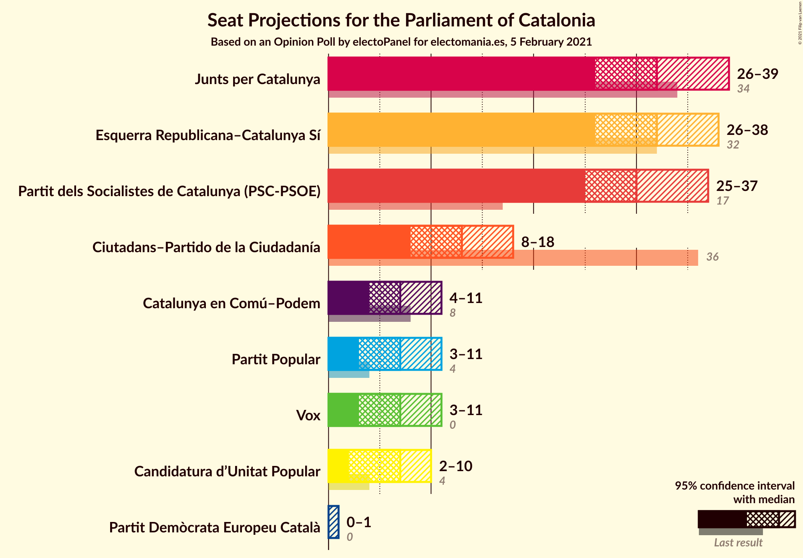
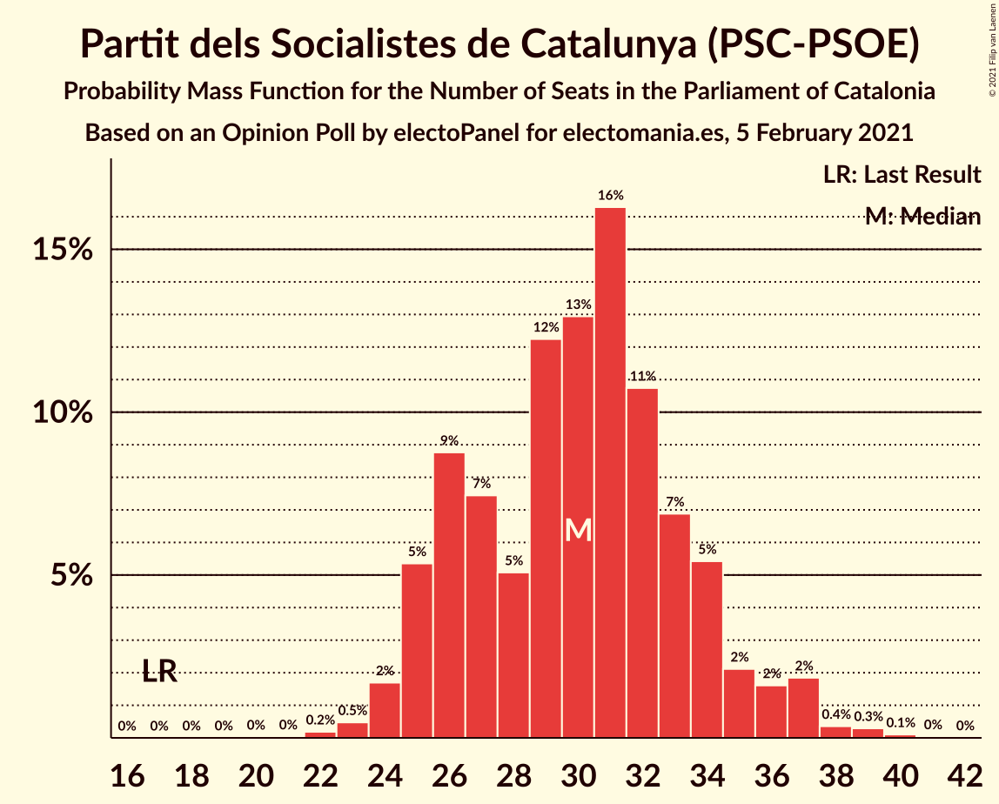
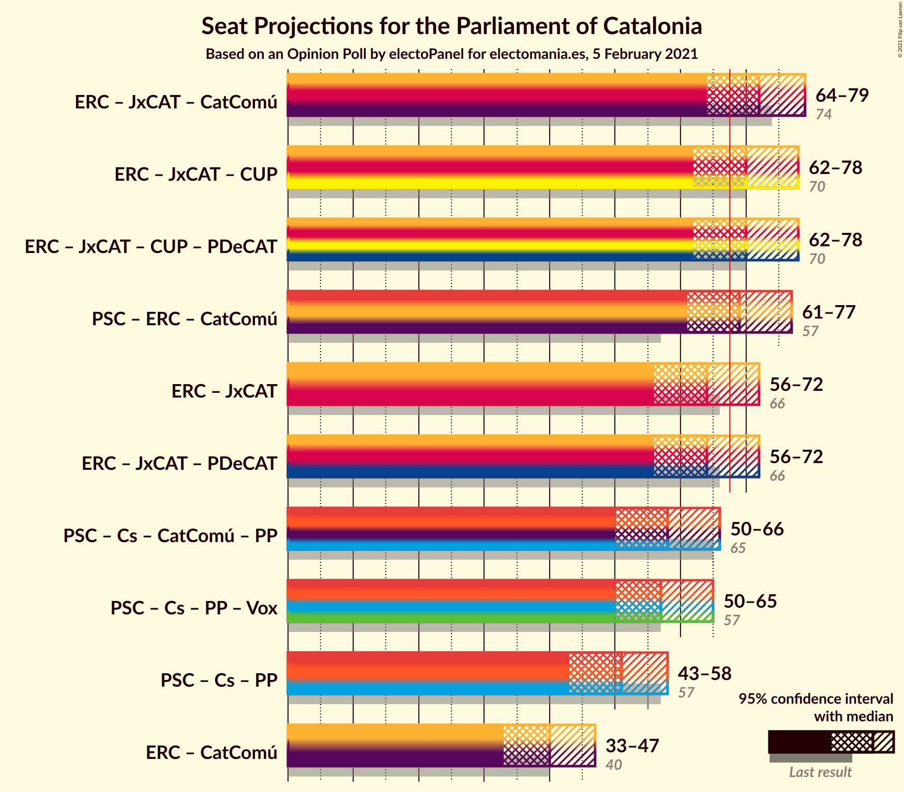

# Opinion Poll by electoPanel for electomania.es, 5 February 2021

<a href="#voting-intentions">Voting Intentions</a> | <a href="#seats">Seats</a> | <a href="#coalitions">Coalitions</a> | <a href="#technical-information">Technical Information</a>

## Voting Intentions

### Confidence Intervals

| Party | Last Result | Poll Result | 80% Confidence Interval | 90% Confidence Interval | 95% Confidence Interval | 99% Confidence Interval |
|:-----:|:-----------:|:-----------:|:-----------------------:|:-----------------------:|:-----------------------:|:-----------------------:|
| Partit dels Socialistes de Catalunya (PSC-PSOE) | 13.9% | 21.8% | 19.3–24.6% |18.6–25.4% |18.0–26.1% |16.9–27.5% |
| Esquerra Republicana–Catalunya Sí | 21.4% | 21.0% | 18.6–23.8% |17.9–24.6% |17.3–25.3% |16.2–26.6% |
| Junts per Catalunya | 21.7% | 20.0% | 17.6–22.8% |16.9–23.5% |16.4–24.2% |15.3–25.6% |
| Ciutadans–Partido de la Ciudadanía | 25.4% | 9.8% | 8.1–11.9% |7.6–12.5% |7.2–13.1% |6.5–14.2% |
| Catalunya en Comú–Podem | 7.5% | 6.5% | 5.2–8.4% |4.8–8.9% |4.5–9.4% |3.9–10.3% |
| Partit Popular | 4.2% | 5.8% | 4.5–7.5% |4.1–8.0% |3.9–8.5% |3.3–9.4% |
| Vox | 0.0% | 5.5% | 4.3–7.3% |3.9–7.7% |3.7–8.2% |3.2–9.1% |
| Candidatura d’Unitat Popular | 4.5% | 5.0% | 3.9–6.7% |3.5–7.2% |3.3–7.6% |2.8–8.5% |
| Partit Demòcrata Europeu Català | 0.0% | 1.2% | 0.8–2.3% |0.6–2.6% |0.5–2.9% |0.4–3.5% |

*Note:* The poll result column reflects the actual value used in the calculations. Published results may vary slightly, and in addition be rounded to fewer digits.

## Seats

### Confidence Intervals

| Party | Last Result | Median | 80% Confidence Interval | 90% Confidence Interval | 95% Confidence Interval | 99% Confidence Interval |
|:-----:|:-----------:|:------:|:-----------------------:|:-----------------------:|:-----------------------:|:-----------------------:|
| <a href="#partit-dels-socialistes-de-catalunya-(psc-psoe)">Partit dels Socialistes de Catalunya (PSC-PSOE)</a> | 17 | 30 | 26–34 |25–35 |25–37 |23–38 |
| <a href="#esquerra-republicana–catalunya-sí">Esquerra Republicana–Catalunya Sí</a> | 32 | 32 | 28–36 |27–38 |26–38 |24–41 |
| <a href="#junts-per-catalunya">Junts per Catalunya</a> | 34 | 32 | 28–37 |26–38 |26–39 |24–41 |
| <a href="#ciutadans–partido-de-la-ciudadanía">Ciutadans–Partido de la Ciudadanía</a> | 36 | 13 | 10–16 |9–17 |8–18 |8–19 |
| <a href="#catalunya-en-comú–podem">Catalunya en Comú–Podem</a> | 8 | 7 | 5–10 |5–11 |4–11 |4–13 |
| <a href="#partit-popular">Partit Popular</a> | 4 | 7 | 5–10 |3–10 |3–11 |3–12 |
| <a href="#vox">Vox</a> | 0 | 7 | 5–9 |4–10 |3–11 |2–12 |
| <a href="#candidatura-d’unitat-popular">Candidatura d’Unitat Popular</a> | 4 | 7 | 4–8 |3–9 |2–10 |0–11 |
| <a href="#partit-demòcrata-europeu-català">Partit Demòcrata Europeu Català</a> | 0 | 0 | 0 |0–1 |0–1 |0–3 |

### Partit dels Socialistes de Catalunya (PSC-PSOE)

*For a full overview of the results for this party, see the [Partit dels Socialistes de Catalunya (PSC-PSOE)](party-partitdelssocialistesdecatalunyapsc-psoe.html) page.*

| Number of Seats | Probability | Accumulated | Special Marks |
|:---------------:|:-----------:|:-----------:|:-------------:|
| 17 | 0% | 100% | Last Result |
| 18 | 0% | 100% |  |
| 19 | 0% | 100% |  |
| 20 | 0% | 100% |  |
| 21 | 0% | 100% |  |
| 22 | 0.2% | 99.9% |  |
| 23 | 0.5% | 99.7% |  |
| 24 | 2% | 99.3% |  |
| 25 | 5% | 98% |  |
| 26 | 9% | 92% |  |
| 27 | 7% | 83% |  |
| 28 | 5% | 76% |  |
| 29 | 12% | 71% |  |
| 30 | 13% | 59% | Median |
| 31 | 16% | 46% |  |
| 32 | 11% | 29% |  |
| 33 | 7% | 19% |  |
| 34 | 5% | 12% |  |
| 35 | 2% | 6% |  |
| 36 | 2% | 4% |  |
| 37 | 2% | 3% |  |
| 38 | 0.4% | 0.8% |  |
| 39 | 0.3% | 0.5% |  |
| 40 | 0.1% | 0.2% |  |
| 41 | 0% | 0.1% |  |
| 42 | 0% | 0% |  |

### Esquerra Republicana–Catalunya Sí

*For a full overview of the results for this party, see the [Esquerra Republicana–Catalunya Sí](party-esquerrarepublicana–catalunyasí.html) page.*

| Number of Seats | Probability | Accumulated | Special Marks |
|:---------------:|:-----------:|:-----------:|:-------------:|
| 22 | 0.1% | 100% |  |
| 23 | 0.1% | 99.9% |  |
| 24 | 0.6% | 99.7% |  |
| 25 | 1.4% | 99.1% |  |
| 26 | 2% | 98% |  |
| 27 | 3% | 96% |  |
| 28 | 9% | 92% |  |
| 29 | 11% | 83% |  |
| 30 | 11% | 73% |  |
| 31 | 8% | 62% |  |
| 32 | 10% | 54% | Last Result, Median |
| 33 | 9% | 43% |  |
| 34 | 10% | 35% |  |
| 35 | 9% | 25% |  |
| 36 | 7% | 16% |  |
| 37 | 4% | 9% |  |
| 38 | 3% | 5% |  |
| 39 | 0.9% | 2% |  |
| 40 | 0.2% | 1.5% |  |
| 41 | 1.0% | 1.3% |  |
| 42 | 0.1% | 0.3% |  |
| 43 | 0.1% | 0.1% |  |
| 44 | 0.1% | 0.1% |  |
| 45 | 0% | 0% |  |

### Junts per Catalunya

*For a full overview of the results for this party, see the [Junts per Catalunya](party-juntspercatalunya.html) page.*

| Number of Seats | Probability | Accumulated | Special Marks |
|:---------------:|:-----------:|:-----------:|:-------------:|
| 23 | 0.2% | 100% |  |
| 24 | 0.4% | 99.8% |  |
| 25 | 2% | 99.4% |  |
| 26 | 3% | 98% |  |
| 27 | 3% | 94% |  |
| 28 | 3% | 91% |  |
| 29 | 7% | 88% |  |
| 30 | 6% | 82% |  |
| 31 | 19% | 75% |  |
| 32 | 17% | 56% | Median |
| 33 | 7% | 39% |  |
| 34 | 5% | 33% | Last Result |
| 35 | 5% | 28% |  |
| 36 | 12% | 23% |  |
| 37 | 5% | 10% |  |
| 38 | 2% | 5% |  |
| 39 | 2% | 3% |  |
| 40 | 0.5% | 1.4% |  |
| 41 | 0.6% | 0.9% |  |
| 42 | 0.2% | 0.3% |  |
| 43 | 0.1% | 0.2% |  |
| 44 | 0% | 0.1% |  |
| 45 | 0% | 0% |  |

### Ciutadans–Partido de la Ciudadanía

*For a full overview of the results for this party, see the [Ciutadans–Partido de la Ciudadanía](party-ciutadans–partidodelaciudadanía.html) page.*

| Number of Seats | Probability | Accumulated | Special Marks |
|:---------------:|:-----------:|:-----------:|:-------------:|
| 6 | 0.1% | 100% |  |
| 7 | 0.2% | 99.9% |  |
| 8 | 3% | 99.7% |  |
| 9 | 5% | 97% |  |
| 10 | 4% | 92% |  |
| 11 | 7% | 89% |  |
| 12 | 19% | 82% |  |
| 13 | 23% | 63% | Median |
| 14 | 22% | 40% |  |
| 15 | 6% | 19% |  |
| 16 | 6% | 13% |  |
| 17 | 3% | 6% |  |
| 18 | 2% | 4% |  |
| 19 | 1.2% | 1.4% |  |
| 20 | 0.1% | 0.2% |  |
| 21 | 0.1% | 0.1% |  |
| 22 | 0% | 0% |  |
| 23 | 0% | 0% |  |
| 24 | 0% | 0% |  |
| 25 | 0% | 0% |  |
| 26 | 0% | 0% |  |
| 27 | 0% | 0% |  |
| 28 | 0% | 0% |  |
| 29 | 0% | 0% |  |
| 30 | 0% | 0% |  |
| 31 | 0% | 0% |  |
| 32 | 0% | 0% |  |
| 33 | 0% | 0% |  |
| 34 | 0% | 0% |  |
| 35 | 0% | 0% |  |
| 36 | 0% | 0% | Last Result |

### Catalunya en Comú–Podem

*For a full overview of the results for this party, see the [Catalunya en Comú–Podem](party-catalunyaencomú–podem.html) page.*

| Number of Seats | Probability | Accumulated | Special Marks |
|:---------------:|:-----------:|:-----------:|:-------------:|
| 3 | 0.4% | 100% |  |
| 4 | 4% | 99.6% |  |
| 5 | 19% | 95% |  |
| 6 | 8% | 76% |  |
| 7 | 24% | 68% | Median |
| 8 | 21% | 45% | Last Result |
| 9 | 9% | 23% |  |
| 10 | 8% | 14% |  |
| 11 | 4% | 6% |  |
| 12 | 0.9% | 2% |  |
| 13 | 0.8% | 1.0% |  |
| 14 | 0.2% | 0.2% |  |
| 15 | 0% | 0% |  |

### Partit Popular

*For a full overview of the results for this party, see the [Partit Popular](party-partitpopular.html) page.*

| Number of Seats | Probability | Accumulated | Special Marks |
|:---------------:|:-----------:|:-----------:|:-------------:|
| 0 | 0.1% | 100% |  |
| 1 | 0% | 99.9% |  |
| 2 | 0.2% | 99.9% |  |
| 3 | 6% | 99.7% |  |
| 4 | 1.2% | 94% | Last Result |
| 5 | 15% | 93% |  |
| 6 | 9% | 78% |  |
| 7 | 34% | 69% | Median |
| 8 | 4% | 35% |  |
| 9 | 19% | 31% |  |
| 10 | 7% | 12% |  |
| 11 | 2% | 5% |  |
| 12 | 2% | 2% |  |
| 13 | 0.3% | 0.4% |  |
| 14 | 0.1% | 0.2% |  |
| 15 | 0% | 0% |  |

### Vox

*For a full overview of the results for this party, see the [Vox](party-vox.html) page.*

| Number of Seats | Probability | Accumulated | Special Marks |
|:---------------:|:-----------:|:-----------:|:-------------:|
| 0 | 0.2% | 100% | Last Result |
| 1 | 0% | 99.8% |  |
| 2 | 0.4% | 99.8% |  |
| 3 | 4% | 99.5% |  |
| 4 | 4% | 95% |  |
| 5 | 15% | 91% |  |
| 6 | 16% | 76% |  |
| 7 | 32% | 60% | Median |
| 8 | 6% | 28% |  |
| 9 | 13% | 21% |  |
| 10 | 5% | 9% |  |
| 11 | 2% | 3% |  |
| 12 | 1.4% | 2% |  |
| 13 | 0.1% | 0.2% |  |
| 14 | 0.1% | 0.1% |  |
| 15 | 0% | 0% |  |

### Candidatura d’Unitat Popular

*For a full overview of the results for this party, see the [Candidatura d’Unitat Popular](party-candidaturad’unitatpopular.html) page.*

| Number of Seats | Probability | Accumulated | Special Marks |
|:---------------:|:-----------:|:-----------:|:-------------:|
| 0 | 1.2% | 100% |  |
| 1 | 0% | 98.8% |  |
| 2 | 2% | 98.8% |  |
| 3 | 3% | 97% |  |
| 4 | 21% | 94% | Last Result |
| 5 | 6% | 72% |  |
| 6 | 8% | 66% |  |
| 7 | 24% | 58% | Median |
| 8 | 25% | 34% |  |
| 9 | 5% | 9% |  |
| 10 | 2% | 4% |  |
| 11 | 2% | 2% |  |
| 12 | 0.1% | 0.2% |  |
| 13 | 0.1% | 0.1% |  |
| 14 | 0% | 0% |  |

### Partit Demòcrata Europeu Català

*For a full overview of the results for this party, see the [Partit Demòcrata Europeu Català](party-partitdemòcrataeuropeucatalà.html) page.*

| Number of Seats | Probability | Accumulated | Special Marks |
|:---------------:|:-----------:|:-----------:|:-------------:|
| 0 | 95% | 100% | Last Result, Median |
| 1 | 4% | 5% |  |
| 2 | 0% | 0.6% |  |
| 3 | 0.1% | 0.5% |  |
| 4 | 0.1% | 0.4% |  |
| 5 | 0.2% | 0.3% |  |
| 6 | 0% | 0% |  |

## Coalitions

### Confidence Intervals

| Coalition | Last Result | Median | Majority? | 80% Confidence Interval | 90% Confidence Interval | 95% Confidence Interval | 99% Confidence Interval |
|:---------:|:-----------:|:------:|:---------:|:-----------------------:|:-----------------------:|:-----------------------:|:-----------------------:|
| Esquerra Republicana–Catalunya Sí – Junts per Catalunya – Catalunya en Comú–Podem | 74 | 72 | 82% | 66–77 | 65–78 | 64–79 | 61–81 |
| Esquerra Republicana–Catalunya Sí – Junts per Catalunya – Candidatura d’Unitat Popular | 70 | 70 | 78% | 66–76 | 64–77 | 62–78 | 60–80 |
| Esquerra Republicana–Catalunya Sí – Junts per Catalunya – Candidatura d’Unitat Popular – Partit Demòcrata Europeu Català | 70 | 70 | 78% | 66–76 | 64–77 | 62–78 | 60–80 |
| Partit dels Socialistes de Catalunya (PSC-PSOE) – Esquerra Republicana–Catalunya Sí – Catalunya en Comú–Podem | 57 | 69 | 65% | 64–75 | 63–76 | 61–77 | 60–79 |
| Esquerra Republicana–Catalunya Sí – Junts per Catalunya | 66 | 64 | 22% | 59–69 | 57–71 | 56–72 | 54–74 |
| Esquerra Republicana–Catalunya Sí – Junts per Catalunya – Partit Demòcrata Europeu Català | 66 | 64 | 23% | 59–70 | 57–71 | 56–72 | 54–74 |
| Partit dels Socialistes de Catalunya (PSC-PSOE) – Ciutadans–Partido de la Ciudadanía – Catalunya en Comú–Podem – Partit Popular | 65 | 58 | 0.4% | 53–62 | 51–64 | 50–66 | 48–67 |
| Partit dels Socialistes de Catalunya (PSC-PSOE) – Ciutadans–Partido de la Ciudadanía – Partit Popular – Vox | 57 | 57 | 0.5% | 52–62 | 50–64 | 50–65 | 47–68 |
| Partit dels Socialistes de Catalunya (PSC-PSOE) – Ciutadans–Partido de la Ciudadanía – Partit Popular | 57 | 51 | 0% | 45–55 | 44–57 | 43–58 | 41–60 |
| Esquerra Republicana–Catalunya Sí – Catalunya en Comú–Podem | 40 | 40 | 0% | 34–44 | 34–45 | 33–47 | 31–49 |

### Esquerra Republicana–Catalunya Sí – Junts per Catalunya – Catalunya en Comú–Podem

| Number of Seats | Probability | Accumulated | Special Marks |
|:---------------:|:-----------:|:-----------:|:-------------:|
| 59 | 0.1% | 100% |  |
| 60 | 0.1% | 99.8% |  |
| 61 | 0.4% | 99.7% |  |
| 62 | 0.6% | 99.3% |  |
| 63 | 0.7% | 98.7% |  |
| 64 | 2% | 98% |  |
| 65 | 2% | 96% |  |
| 66 | 4% | 94% |  |
| 67 | 8% | 90% |  |
| 68 | 5% | 82% | Majority |
| 69 | 9% | 78% |  |
| 70 | 9% | 69% |  |
| 71 | 6% | 60% | Median |
| 72 | 13% | 53% |  |
| 73 | 10% | 40% |  |
| 74 | 7% | 31% | Last Result |
| 75 | 7% | 24% |  |
| 76 | 6% | 17% |  |
| 77 | 4% | 11% |  |
| 78 | 3% | 7% |  |
| 79 | 2% | 4% |  |
| 80 | 0.8% | 2% |  |
| 81 | 0.7% | 1.1% |  |
| 82 | 0.2% | 0.4% |  |
| 83 | 0.1% | 0.2% |  |
| 84 | 0% | 0.1% |  |
| 85 | 0% | 0.1% |  |
| 86 | 0% | 0% |  |

### Esquerra Republicana–Catalunya Sí – Junts per Catalunya – Candidatura d’Unitat Popular

| Number of Seats | Probability | Accumulated | Special Marks |
|:---------------:|:-----------:|:-----------:|:-------------:|
| 58 | 0.1% | 100% |  |
| 59 | 0.1% | 99.9% |  |
| 60 | 0.3% | 99.8% |  |
| 61 | 0.9% | 99.4% |  |
| 62 | 2% | 98% |  |
| 63 | 1.2% | 97% |  |
| 64 | 2% | 96% |  |
| 65 | 2% | 94% |  |
| 66 | 4% | 91% |  |
| 67 | 9% | 87% |  |
| 68 | 7% | 78% | Majority |
| 69 | 11% | 70% |  |
| 70 | 12% | 59% | Last Result |
| 71 | 5% | 47% | Median |
| 72 | 12% | 42% |  |
| 73 | 8% | 31% |  |
| 74 | 7% | 23% |  |
| 75 | 5% | 16% |  |
| 76 | 4% | 11% |  |
| 77 | 2% | 7% |  |
| 78 | 3% | 5% |  |
| 79 | 1.2% | 2% |  |
| 80 | 0.5% | 0.9% |  |
| 81 | 0.3% | 0.5% |  |
| 82 | 0.1% | 0.2% |  |
| 83 | 0.1% | 0.1% |  |
| 84 | 0% | 0.1% |  |
| 85 | 0% | 0% |  |

### Esquerra Republicana–Catalunya Sí – Junts per Catalunya – Candidatura d’Unitat Popular – Partit Demòcrata Europeu Català

| Number of Seats | Probability | Accumulated | Special Marks |
|:---------------:|:-----------:|:-----------:|:-------------:|
| 58 | 0.1% | 100% |  |
| 59 | 0.1% | 99.9% |  |
| 60 | 0.3% | 99.8% |  |
| 61 | 0.9% | 99.4% |  |
| 62 | 2% | 98% |  |
| 63 | 1.0% | 97% |  |
| 64 | 2% | 96% |  |
| 65 | 2% | 94% |  |
| 66 | 4% | 91% |  |
| 67 | 9% | 87% |  |
| 68 | 7% | 78% | Majority |
| 69 | 11% | 71% |  |
| 70 | 13% | 60% | Last Result |
| 71 | 5% | 48% | Median |
| 72 | 12% | 43% |  |
| 73 | 8% | 31% |  |
| 74 | 6% | 23% |  |
| 75 | 5% | 17% |  |
| 76 | 5% | 12% |  |
| 77 | 2% | 7% |  |
| 78 | 3% | 5% |  |
| 79 | 1.1% | 2% |  |
| 80 | 0.6% | 1.1% |  |
| 81 | 0.3% | 0.5% |  |
| 82 | 0.1% | 0.2% |  |
| 83 | 0.1% | 0.1% |  |
| 84 | 0% | 0.1% |  |
| 85 | 0% | 0% |  |

### Partit dels Socialistes de Catalunya (PSC-PSOE) – Esquerra Republicana–Catalunya Sí – Catalunya en Comú–Podem

| Number of Seats | Probability | Accumulated | Special Marks |
|:---------------:|:-----------:|:-----------:|:-------------:|
| 57 | 0.1% | 100% | Last Result |
| 58 | 0.2% | 99.9% |  |
| 59 | 0.2% | 99.7% |  |
| 60 | 0.8% | 99.5% |  |
| 61 | 2% | 98.7% |  |
| 62 | 1.4% | 97% |  |
| 63 | 3% | 96% |  |
| 64 | 4% | 93% |  |
| 65 | 6% | 89% |  |
| 66 | 7% | 83% |  |
| 67 | 11% | 76% |  |
| 68 | 6% | 65% | Majority |
| 69 | 11% | 58% | Median |
| 70 | 11% | 47% |  |
| 71 | 8% | 36% |  |
| 72 | 6% | 28% |  |
| 73 | 8% | 22% |  |
| 74 | 4% | 14% |  |
| 75 | 5% | 11% |  |
| 76 | 2% | 6% |  |
| 77 | 2% | 4% |  |
| 78 | 0.7% | 2% |  |
| 79 | 0.7% | 1.1% |  |
| 80 | 0.2% | 0.4% |  |
| 81 | 0.1% | 0.2% |  |
| 82 | 0% | 0.1% |  |
| 83 | 0% | 0.1% |  |
| 84 | 0% | 0% |  |

### Esquerra Republicana–Catalunya Sí – Junts per Catalunya

| Number of Seats | Probability | Accumulated | Special Marks |
|:---------------:|:-----------:|:-----------:|:-------------:|
| 52 | 0.1% | 100% |  |
| 53 | 0.3% | 99.9% |  |
| 54 | 0.4% | 99.6% |  |
| 55 | 0.4% | 99.2% |  |
| 56 | 2% | 98.8% |  |
| 57 | 2% | 97% |  |
| 58 | 2% | 95% |  |
| 59 | 5% | 93% |  |
| 60 | 6% | 88% |  |
| 61 | 4% | 82% |  |
| 62 | 14% | 78% |  |
| 63 | 6% | 64% |  |
| 64 | 10% | 58% | Median |
| 65 | 13% | 48% |  |
| 66 | 7% | 36% | Last Result |
| 67 | 7% | 28% |  |
| 68 | 8% | 22% | Majority |
| 69 | 3% | 13% |  |
| 70 | 3% | 10% |  |
| 71 | 3% | 6% |  |
| 72 | 2% | 3% |  |
| 73 | 0.7% | 1.4% |  |
| 74 | 0.4% | 0.7% |  |
| 75 | 0.1% | 0.3% |  |
| 76 | 0.1% | 0.2% |  |
| 77 | 0.1% | 0.1% |  |
| 78 | 0% | 0.1% |  |
| 79 | 0% | 0% |  |

### Esquerra Republicana–Catalunya Sí – Junts per Catalunya – Partit Demòcrata Europeu Català

| Number of Seats | Probability | Accumulated | Special Marks |
|:---------------:|:-----------:|:-----------:|:-------------:|
| 52 | 0% | 100% |  |
| 53 | 0.3% | 99.9% |  |
| 54 | 0.4% | 99.6% |  |
| 55 | 0.4% | 99.2% |  |
| 56 | 2% | 98.8% |  |
| 57 | 2% | 97% |  |
| 58 | 2% | 95% |  |
| 59 | 5% | 93% |  |
| 60 | 6% | 88% |  |
| 61 | 4% | 82% |  |
| 62 | 14% | 79% |  |
| 63 | 6% | 65% |  |
| 64 | 10% | 59% | Median |
| 65 | 13% | 49% |  |
| 66 | 7% | 36% | Last Result |
| 67 | 6% | 29% |  |
| 68 | 9% | 23% | Majority |
| 69 | 3% | 13% |  |
| 70 | 4% | 10% |  |
| 71 | 3% | 7% |  |
| 72 | 2% | 3% |  |
| 73 | 0.7% | 1.5% |  |
| 74 | 0.4% | 0.8% |  |
| 75 | 0.1% | 0.4% |  |
| 76 | 0.1% | 0.2% |  |
| 77 | 0.1% | 0.1% |  |
| 78 | 0% | 0.1% |  |
| 79 | 0% | 0% |  |

### Partit dels Socialistes de Catalunya (PSC-PSOE) – Ciutadans–Partido de la Ciudadanía – Catalunya en Comú–Podem – Partit Popular

| Number of Seats | Probability | Accumulated | Special Marks |
|:---------------:|:-----------:|:-----------:|:-------------:|
| 45 | 0.1% | 100% |  |
| 46 | 0.1% | 99.9% |  |
| 47 | 0.2% | 99.9% |  |
| 48 | 0.4% | 99.7% |  |
| 49 | 1.4% | 99.4% |  |
| 50 | 2% | 98% |  |
| 51 | 2% | 96% |  |
| 52 | 3% | 94% |  |
| 53 | 6% | 91% |  |
| 54 | 9% | 85% |  |
| 55 | 7% | 76% |  |
| 56 | 5% | 69% |  |
| 57 | 14% | 64% | Median |
| 58 | 12% | 51% |  |
| 59 | 8% | 39% |  |
| 60 | 10% | 30% |  |
| 61 | 5% | 20% |  |
| 62 | 5% | 15% |  |
| 63 | 3% | 10% |  |
| 64 | 2% | 7% |  |
| 65 | 1.3% | 4% | Last Result |
| 66 | 2% | 3% |  |
| 67 | 0.7% | 1.1% |  |
| 68 | 0.2% | 0.4% | Majority |
| 69 | 0.1% | 0.2% |  |
| 70 | 0% | 0.1% |  |
| 71 | 0% | 0% |  |

### Partit dels Socialistes de Catalunya (PSC-PSOE) – Ciutadans–Partido de la Ciudadanía – Partit Popular – Vox

| Number of Seats | Probability | Accumulated | Special Marks |
|:---------------:|:-----------:|:-----------:|:-------------:|
| 44 | 0% | 100% |  |
| 45 | 0.1% | 99.9% |  |
| 46 | 0.1% | 99.8% |  |
| 47 | 0.4% | 99.7% |  |
| 48 | 0.4% | 99.4% |  |
| 49 | 0.9% | 99.0% |  |
| 50 | 3% | 98% |  |
| 51 | 3% | 95% |  |
| 52 | 6% | 92% |  |
| 53 | 7% | 86% |  |
| 54 | 5% | 79% |  |
| 55 | 7% | 73% |  |
| 56 | 7% | 67% |  |
| 57 | 11% | 59% | Last Result, Median |
| 58 | 12% | 49% |  |
| 59 | 12% | 37% |  |
| 60 | 6% | 24% |  |
| 61 | 7% | 19% |  |
| 62 | 3% | 12% |  |
| 63 | 3% | 8% |  |
| 64 | 2% | 5% |  |
| 65 | 1.3% | 4% |  |
| 66 | 1.2% | 2% |  |
| 67 | 0.7% | 1.2% |  |
| 68 | 0.3% | 0.5% | Majority |
| 69 | 0.1% | 0.2% |  |
| 70 | 0% | 0.1% |  |
| 71 | 0% | 0% |  |

### Partit dels Socialistes de Catalunya (PSC-PSOE) – Ciutadans–Partido de la Ciudadanía – Partit Popular

| Number of Seats | Probability | Accumulated | Special Marks |
|:---------------:|:-----------:|:-----------:|:-------------:|
| 39 | 0.1% | 100% |  |
| 40 | 0.2% | 99.9% |  |
| 41 | 0.2% | 99.6% |  |
| 42 | 1.4% | 99.4% |  |
| 43 | 2% | 98% |  |
| 44 | 2% | 96% |  |
| 45 | 4% | 93% |  |
| 46 | 9% | 89% |  |
| 47 | 5% | 80% |  |
| 48 | 5% | 75% |  |
| 49 | 9% | 70% |  |
| 50 | 10% | 61% | Median |
| 51 | 16% | 51% |  |
| 52 | 9% | 35% |  |
| 53 | 9% | 26% |  |
| 54 | 5% | 17% |  |
| 55 | 4% | 12% |  |
| 56 | 3% | 8% |  |
| 57 | 2% | 5% | Last Result |
| 58 | 1.4% | 4% |  |
| 59 | 2% | 2% |  |
| 60 | 0.4% | 0.6% |  |
| 61 | 0.2% | 0.3% |  |
| 62 | 0.1% | 0.1% |  |
| 63 | 0% | 0.1% |  |
| 64 | 0% | 0% |  |

### Esquerra Republicana–Catalunya Sí – Catalunya en Comú–Podem

| Number of Seats | Probability | Accumulated | Special Marks |
|:---------------:|:-----------:|:-----------:|:-------------:|
| 28 | 0% | 100% |  |
| 29 | 0.2% | 99.9% |  |
| 30 | 0.2% | 99.7% |  |
| 31 | 0.4% | 99.6% |  |
| 32 | 1.1% | 99.1% |  |
| 33 | 3% | 98% |  |
| 34 | 6% | 95% |  |
| 35 | 7% | 90% |  |
| 36 | 12% | 83% |  |
| 37 | 5% | 71% |  |
| 38 | 8% | 66% |  |
| 39 | 6% | 58% | Median |
| 40 | 12% | 52% | Last Result |
| 41 | 9% | 39% |  |
| 42 | 12% | 30% |  |
| 43 | 8% | 19% |  |
| 44 | 4% | 11% |  |
| 45 | 3% | 7% |  |
| 46 | 2% | 4% |  |
| 47 | 1.4% | 3% |  |
| 48 | 0.3% | 1.2% |  |
| 49 | 0.6% | 0.9% |  |
| 50 | 0.2% | 0.3% |  |
| 51 | 0.1% | 0.1% |  |
| 52 | 0% | 0% |  |

## Technical Information

### Opinion Poll

+ **Polling firm:** electoPanel
+ **Commissioner(s):** electomania.es
+ **Fieldwork period:** 5 February 2021

### Calculations

+ **Sample size:** 400
+ **Simulations done:** 1,048,576
+ **Error estimate:** 0.66%

