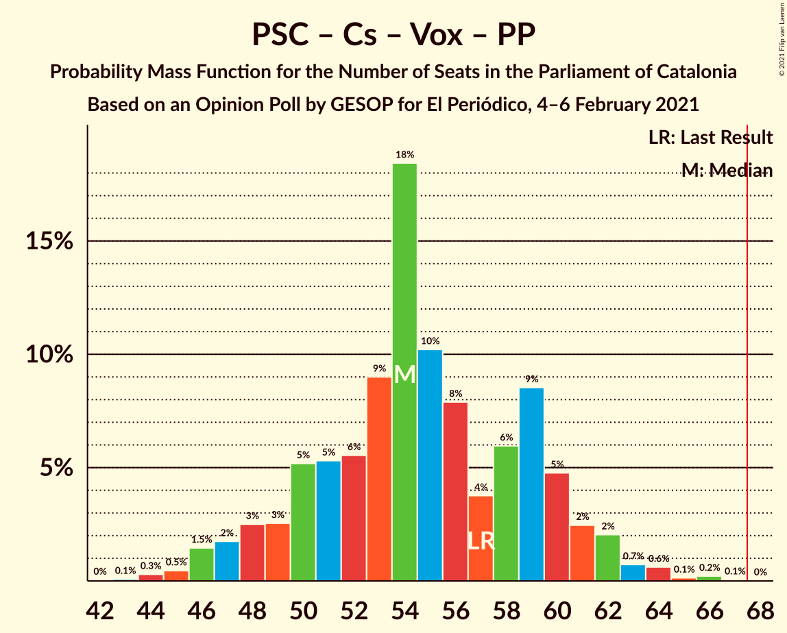

# Opinion Poll by GESOP for El Periódico, 4–6 February 2021

<a href="#voting-intentions">Voting Intentions</a> | <a href="#seats">Seats</a> | <a href="#coalitions">Coalitions</a> | <a href="#technical-information">Technical Information</a>

## Voting Intentions

### Confidence Intervals

| Party | Last Result | Poll Result | 80% Confidence Interval | 90% Confidence Interval | 95% Confidence Interval | 99% Confidence Interval |
|:-----:|:-----------:|:-----------:|:-----------------------:|:-----------------------:|:-----------------------:|:-----------------------:|
| Partit dels Socialistes de Catalunya (PSC-PSOE) | 13.9% | 23.0% | 20.6–25.8% |19.9–26.6% |19.3–27.3% |18.1–28.7% |
| Esquerra Republicana–Catalunya Sí | 21.4% | 20.9% | 18.5–23.6% |17.9–24.4% |17.3–25.1% |16.2–26.4% |
| Junts per Catalunya | 21.7% | 18.8% | 16.5–21.4% |15.9–22.1% |15.3–22.8% |14.3–24.1% |
| Ciutadans–Partido de la Ciudadanía | 25.4% | 7.6% | 6.2–9.5% |5.8–10.1% |5.4–10.5% |4.8–11.5% |
| Catalunya en Comú–Podem | 7.5% | 7.6% | 6.2–9.5% |5.8–10.1% |5.4–10.5% |4.8–11.5% |
| Vox | 0.0% | 6.9% | 5.5–8.7% |5.2–9.3% |4.8–9.7% |4.3–10.7% |
| Candidatura d’Unitat Popular | 4.5% | 6.4% | 5.1–8.2% |4.8–8.7% |4.5–9.2% |3.9–10.1% |
| Partit Popular | 4.2% | 3.8% | 2.9–5.3% |2.6–5.7% |2.4–6.1% |2.0–6.9% |
| Partit Demòcrata Europeu Català | 0.0% | 1.9% | 1.3–3.1% |1.1–3.4% |1.0–3.7% |0.7–4.4% |

*Note:* The poll result column reflects the actual value used in the calculations. Published results may vary slightly, and in addition be rounded to fewer digits.

## Seats

### Confidence Intervals

| Party | Last Result | Median | 80% Confidence Interval | 90% Confidence Interval | 95% Confidence Interval | 99% Confidence Interval |
|:-----:|:-----------:|:------:|:-----------------------:|:-----------------------:|:-----------------------:|:-----------------------:|
| <a href="#partit-dels-socialistes-de-catalunya-(psc-psoe)">Partit dels Socialistes de Catalunya (PSC-PSOE)</a> | 17 | 32 | 28–36 |27–37 |26–38 |25–40 |
| <a href="#esquerra-republicana–catalunya-sí">Esquerra Republicana–Catalunya Sí</a> | 32 | 32 | 28–36 |27–38 |26–39 |24–41 |
| <a href="#junts-per-catalunya">Junts per Catalunya</a> | 34 | 31 | 26–35 |25–36 |24–37 |23–39 |
| <a href="#ciutadans–partido-de-la-ciudadanía">Ciutadans–Partido de la Ciudadanía</a> | 36 | 10 | 7–12 |6–13 |6–14 |5–15 |
| <a href="#catalunya-en-comú–podem">Catalunya en Comú–Podem</a> | 8 | 8 | 7–11 |6–13 |5–14 |4–15 |
| <a href="#vox">Vox</a> | 0 | 9 | 7–12 |6–12 |6–13 |4–15 |
| <a href="#candidatura-d’unitat-popular">Candidatura d’Unitat Popular</a> | 4 | 8 | 7–11 |7–11 |5–13 |4–15 |
| <a href="#partit-popular">Partit Popular</a> | 4 | 3 | 0–6 |0–7 |0–7 |0–9 |
| <a href="#partit-demòcrata-europeu-català">Partit Demòcrata Europeu Català</a> | 0 | 0 | 0–1 |0–3 |0–4 |0–6 |

### Partit dels Socialistes de Catalunya (PSC-PSOE)

*For a full overview of the results for this party, see the [Partit dels Socialistes de Catalunya (PSC-PSOE)](party-partitdelssocialistesdecatalunyapsc-psoe.html) page.*

| Number of Seats | Probability | Accumulated | Special Marks |
|:---------------:|:-----------:|:-----------:|:-------------:|
| 17 | 0% | 100% | Last Result |
| 18 | 0% | 100% |  |
| 19 | 0% | 100% |  |
| 20 | 0% | 100% |  |
| 21 | 0% | 100% |  |
| 22 | 0% | 100% |  |
| 23 | 0% | 100% |  |
| 24 | 0.2% | 99.9% |  |
| 25 | 1.1% | 99.7% |  |
| 26 | 3% | 98.6% |  |
| 27 | 3% | 96% |  |
| 28 | 5% | 92% |  |
| 29 | 9% | 87% |  |
| 30 | 6% | 78% |  |
| 31 | 17% | 72% |  |
| 32 | 12% | 55% | Median |
| 33 | 8% | 43% |  |
| 34 | 8% | 34% |  |
| 35 | 9% | 26% |  |
| 36 | 9% | 17% |  |
| 37 | 4% | 8% |  |
| 38 | 2% | 4% |  |
| 39 | 1.1% | 2% |  |
| 40 | 0.4% | 0.6% |  |
| 41 | 0.2% | 0.3% |  |
| 42 | 0% | 0.1% |  |
| 43 | 0% | 0.1% |  |
| 44 | 0% | 0% |  |

### Esquerra Republicana–Catalunya Sí

*For a full overview of the results for this party, see the [Esquerra Republicana–Catalunya Sí](party-esquerrarepublicana–catalunyasí.html) page.*

| Number of Seats | Probability | Accumulated | Special Marks |
|:---------------:|:-----------:|:-----------:|:-------------:|
| 22 | 0.1% | 100% |  |
| 23 | 0.2% | 99.9% |  |
| 24 | 0.3% | 99.8% |  |
| 25 | 1.2% | 99.4% |  |
| 26 | 2% | 98% |  |
| 27 | 4% | 96% |  |
| 28 | 8% | 92% |  |
| 29 | 5% | 84% |  |
| 30 | 8% | 79% |  |
| 31 | 9% | 71% |  |
| 32 | 15% | 62% | Last Result, Median |
| 33 | 7% | 47% |  |
| 34 | 21% | 40% |  |
| 35 | 7% | 19% |  |
| 36 | 3% | 12% |  |
| 37 | 3% | 8% |  |
| 38 | 2% | 6% |  |
| 39 | 2% | 3% |  |
| 40 | 0.6% | 2% |  |
| 41 | 0.8% | 1.1% |  |
| 42 | 0.1% | 0.2% |  |
| 43 | 0.1% | 0.1% |  |
| 44 | 0% | 0% |  |

### Junts per Catalunya

*For a full overview of the results for this party, see the [Junts per Catalunya](party-juntspercatalunya.html) page.*

| Number of Seats | Probability | Accumulated | Special Marks |
|:---------------:|:-----------:|:-----------:|:-------------:|
| 21 | 0.1% | 100% |  |
| 22 | 0.2% | 99.9% |  |
| 23 | 1.0% | 99.8% |  |
| 24 | 2% | 98.8% |  |
| 25 | 5% | 96% |  |
| 26 | 4% | 92% |  |
| 27 | 7% | 88% |  |
| 28 | 5% | 80% |  |
| 29 | 14% | 75% |  |
| 30 | 11% | 62% |  |
| 31 | 19% | 50% | Median |
| 32 | 12% | 31% |  |
| 33 | 4% | 19% |  |
| 34 | 3% | 14% | Last Result |
| 35 | 3% | 11% |  |
| 36 | 3% | 8% |  |
| 37 | 4% | 5% |  |
| 38 | 0.8% | 1.3% |  |
| 39 | 0.4% | 0.6% |  |
| 40 | 0.1% | 0.2% |  |
| 41 | 0.1% | 0.1% |  |
| 42 | 0% | 0.1% |  |
| 43 | 0% | 0% |  |

### Ciutadans–Partido de la Ciudadanía

*For a full overview of the results for this party, see the [Ciutadans–Partido de la Ciudadanía](party-ciutadans–partidodelaciudadanía.html) page.*

| Number of Seats | Probability | Accumulated | Special Marks |
|:---------------:|:-----------:|:-----------:|:-------------:|
| 5 | 1.1% | 100% |  |
| 6 | 5% | 98.8% |  |
| 7 | 6% | 94% |  |
| 8 | 20% | 88% |  |
| 9 | 14% | 67% |  |
| 10 | 10% | 53% | Median |
| 11 | 8% | 43% |  |
| 12 | 26% | 35% |  |
| 13 | 7% | 10% |  |
| 14 | 2% | 3% |  |
| 15 | 0.2% | 0.5% |  |
| 16 | 0.2% | 0.4% |  |
| 17 | 0.1% | 0.2% |  |
| 18 | 0.1% | 0.1% |  |
| 19 | 0% | 0% |  |
| 20 | 0% | 0% |  |
| 21 | 0% | 0% |  |
| 22 | 0% | 0% |  |
| 23 | 0% | 0% |  |
| 24 | 0% | 0% |  |
| 25 | 0% | 0% |  |
| 26 | 0% | 0% |  |
| 27 | 0% | 0% |  |
| 28 | 0% | 0% |  |
| 29 | 0% | 0% |  |
| 30 | 0% | 0% |  |
| 31 | 0% | 0% |  |
| 32 | 0% | 0% |  |
| 33 | 0% | 0% |  |
| 34 | 0% | 0% |  |
| 35 | 0% | 0% |  |
| 36 | 0% | 0% | Last Result |

### Catalunya en Comú–Podem

*For a full overview of the results for this party, see the [Catalunya en Comú–Podem](party-catalunyaencomú–podem.html) page.*

| Number of Seats | Probability | Accumulated | Special Marks |
|:---------------:|:-----------:|:-----------:|:-------------:|
| 4 | 0.5% | 100% |  |
| 5 | 3% | 99.4% |  |
| 6 | 3% | 96% |  |
| 7 | 20% | 94% |  |
| 8 | 27% | 74% | Last Result, Median |
| 9 | 16% | 47% |  |
| 10 | 8% | 31% |  |
| 11 | 15% | 22% |  |
| 12 | 2% | 8% |  |
| 13 | 3% | 5% |  |
| 14 | 2% | 3% |  |
| 15 | 0.3% | 0.6% |  |
| 16 | 0.2% | 0.2% |  |
| 17 | 0.1% | 0.1% |  |
| 18 | 0% | 0% |  |

### Vox

*For a full overview of the results for this party, see the [Vox](party-vox.html) page.*

| Number of Seats | Probability | Accumulated | Special Marks |
|:---------------:|:-----------:|:-----------:|:-------------:|
| 0 | 0% | 100% | Last Result |
| 1 | 0% | 100% |  |
| 2 | 0% | 100% |  |
| 3 | 0.2% | 100% |  |
| 4 | 0.3% | 99.7% |  |
| 5 | 2% | 99.5% |  |
| 6 | 4% | 98% |  |
| 7 | 19% | 94% |  |
| 8 | 17% | 74% |  |
| 9 | 21% | 57% | Median |
| 10 | 15% | 36% |  |
| 11 | 8% | 21% |  |
| 12 | 9% | 13% |  |
| 13 | 2% | 4% |  |
| 14 | 2% | 2% |  |
| 15 | 0.5% | 0.6% |  |
| 16 | 0% | 0.1% |  |
| 17 | 0% | 0% |  |

### Candidatura d’Unitat Popular

*For a full overview of the results for this party, see the [Candidatura d’Unitat Popular](party-candidaturad’unitatpopular.html) page.*

| Number of Seats | Probability | Accumulated | Special Marks |
|:---------------:|:-----------:|:-----------:|:-------------:|
| 2 | 0.1% | 100% |  |
| 3 | 0.3% | 99.9% |  |
| 4 | 2% | 99.6% | Last Result |
| 5 | 0.9% | 98% |  |
| 6 | 2% | 97% |  |
| 7 | 13% | 95% |  |
| 8 | 35% | 82% | Median |
| 9 | 26% | 47% |  |
| 10 | 5% | 21% |  |
| 11 | 11% | 16% |  |
| 12 | 1.5% | 5% |  |
| 13 | 2% | 3% |  |
| 14 | 0.5% | 1.2% |  |
| 15 | 0.5% | 0.6% |  |
| 16 | 0.1% | 0.1% |  |
| 17 | 0% | 0% |  |

### Partit Popular

*For a full overview of the results for this party, see the [Partit Popular](party-partitpopular.html) page.*

| Number of Seats | Probability | Accumulated | Special Marks |
|:---------------:|:-----------:|:-----------:|:-------------:|
| 0 | 13% | 100% |  |
| 1 | 0% | 87% |  |
| 2 | 11% | 87% |  |
| 3 | 31% | 76% | Median |
| 4 | 12% | 46% | Last Result |
| 5 | 16% | 34% |  |
| 6 | 9% | 18% |  |
| 7 | 8% | 9% |  |
| 8 | 1.0% | 2% |  |
| 9 | 0.8% | 0.9% |  |
| 10 | 0.1% | 0.1% |  |
| 11 | 0% | 0% |  |

### Partit Demòcrata Europeu Català

*For a full overview of the results for this party, see the [Partit Demòcrata Europeu Català](party-partitdemòcrataeuropeucatalà.html) page.*

| Number of Seats | Probability | Accumulated | Special Marks |
|:---------------:|:-----------:|:-----------:|:-------------:|
| 0 | 80% | 100% | Last Result, Median |
| 1 | 14% | 20% |  |
| 2 | 0.2% | 6% |  |
| 3 | 1.5% | 6% |  |
| 4 | 3% | 4% |  |
| 5 | 1.1% | 2% |  |
| 6 | 0.6% | 0.7% |  |
| 7 | 0% | 0.1% |  |
| 8 | 0% | 0% |  |

## Coalitions

### Confidence Intervals

| Coalition | Last Result | Median | Majority? | 80% Confidence Interval | 90% Confidence Interval | 95% Confidence Interval | 99% Confidence Interval |
|:---------:|:-----------:|:------:|:---------:|:-----------------------:|:-----------------------:|:-----------------------:|:-----------------------:|
| Partit dels Socialistes de Catalunya (PSC-PSOE) – Esquerra Republicana–Catalunya Sí – Catalunya en Comú–Podem | 57 | 73 | 91% | 68–78 | 67–80 | 65–80 | 63–83 |
| Esquerra Republicana–Catalunya Sí – Junts per Catalunya – Catalunya en Comú–Podem | 74 | 72 | 81% | 66–77 | 65–79 | 63–80 | 61–81 |
| Esquerra Republicana–Catalunya Sí – Junts per Catalunya – Candidatura d’Unitat Popular – Partit Demòcrata Europeu Català | 70 | 72 | 85% | 67–76 | 65–78 | 64–79 | 61–82 |
| Esquerra Republicana–Catalunya Sí – Junts per Catalunya – Candidatura d’Unitat Popular | 70 | 71 | 83% | 66–76 | 64–78 | 63–79 | 61–82 |
| Esquerra Republicana–Catalunya Sí – Junts per Catalunya | 66 | 63 | 11% | 57–68 | 56–69 | 55–71 | 53–72 |
| Esquerra Republicana–Catalunya Sí – Junts per Catalunya – Partit Demòcrata Europeu Català | 66 | 63 | 12% | 58–68 | 56–69 | 55–71 | 53–73 |
| Partit dels Socialistes de Catalunya (PSC-PSOE) – Catalunya en Comú–Podem – Ciutadans–Partido de la Ciudadanía – Partit Popular | 65 | 54 | 0% | 49–59 | 48–60 | 47–62 | 45–64 |
| Partit dels Socialistes de Catalunya (PSC-PSOE) – Ciutadans–Partido de la Ciudadanía – Vox – Partit Popular | 57 | 54 | 0% | 50–60 | 48–61 | 47–62 | 45–64 |
| Partit dels Socialistes de Catalunya (PSC-PSOE) – Ciutadans–Partido de la Ciudadanía – Partit Popular | 57 | 46 | 0% | 40–50 | 40–52 | 38–53 | 36–55 |
| Esquerra Republicana–Catalunya Sí – Catalunya en Comú–Podem | 40 | 41 | 0% | 36–45 | 35–48 | 34–49 | 32–50 |

### Partit dels Socialistes de Catalunya (PSC-PSOE) – Esquerra Republicana–Catalunya Sí – Catalunya en Comú–Podem

| Number of Seats | Probability | Accumulated | Special Marks |
|:---------------:|:-----------:|:-----------:|:-------------:|
| 57 | 0% | 100% | Last Result |
| 58 | 0% | 100% |  |
| 59 | 0% | 100% |  |
| 60 | 0% | 100% |  |
| 61 | 0.1% | 99.9% |  |
| 62 | 0.2% | 99.8% |  |
| 63 | 0.4% | 99.6% |  |
| 64 | 0.6% | 99.2% |  |
| 65 | 1.4% | 98.6% |  |
| 66 | 2% | 97% |  |
| 67 | 4% | 95% |  |
| 68 | 3% | 91% | Majority |
| 69 | 6% | 88% |  |
| 70 | 7% | 83% |  |
| 71 | 8% | 76% |  |
| 72 | 12% | 68% | Median |
| 73 | 12% | 55% |  |
| 74 | 9% | 43% |  |
| 75 | 6% | 34% |  |
| 76 | 5% | 27% |  |
| 77 | 8% | 23% |  |
| 78 | 7% | 15% |  |
| 79 | 2% | 9% |  |
| 80 | 4% | 6% |  |
| 81 | 0.8% | 2% |  |
| 82 | 0.8% | 1.4% |  |
| 83 | 0.3% | 0.6% |  |
| 84 | 0.1% | 0.3% |  |
| 85 | 0.1% | 0.2% |  |
| 86 | 0.1% | 0.1% |  |
| 87 | 0% | 0% |  |

### Esquerra Republicana–Catalunya Sí – Junts per Catalunya – Catalunya en Comú–Podem

| Number of Seats | Probability | Accumulated | Special Marks |
|:---------------:|:-----------:|:-----------:|:-------------:|
| 59 | 0.1% | 100% |  |
| 60 | 0.1% | 99.8% |  |
| 61 | 0.4% | 99.7% |  |
| 62 | 0.7% | 99.4% |  |
| 63 | 1.3% | 98.7% |  |
| 64 | 1.3% | 97% |  |
| 65 | 3% | 96% |  |
| 66 | 4% | 93% |  |
| 67 | 8% | 89% |  |
| 68 | 6% | 81% | Majority |
| 69 | 8% | 75% |  |
| 70 | 8% | 67% |  |
| 71 | 7% | 60% | Median |
| 72 | 16% | 52% |  |
| 73 | 13% | 36% |  |
| 74 | 3% | 23% | Last Result |
| 75 | 5% | 20% |  |
| 76 | 4% | 15% |  |
| 77 | 4% | 10% |  |
| 78 | 2% | 7% |  |
| 79 | 2% | 5% |  |
| 80 | 2% | 3% |  |
| 81 | 0.4% | 0.7% |  |
| 82 | 0.1% | 0.3% |  |
| 83 | 0.1% | 0.2% |  |
| 84 | 0.1% | 0.1% |  |
| 85 | 0% | 0% |  |

### Esquerra Republicana–Catalunya Sí – Junts per Catalunya – Candidatura d’Unitat Popular – Partit Demòcrata Europeu Català

| Number of Seats | Probability | Accumulated | Special Marks |
|:---------------:|:-----------:|:-----------:|:-------------:|
| 59 | 0% | 100% |  |
| 60 | 0.1% | 99.9% |  |
| 61 | 0.3% | 99.8% |  |
| 62 | 0.4% | 99.5% |  |
| 63 | 1.4% | 99.1% |  |
| 64 | 2% | 98% |  |
| 65 | 1.5% | 96% |  |
| 66 | 4% | 94% |  |
| 67 | 5% | 91% |  |
| 68 | 9% | 85% | Majority |
| 69 | 10% | 77% |  |
| 70 | 6% | 67% | Last Result |
| 71 | 11% | 61% | Median |
| 72 | 9% | 51% |  |
| 73 | 7% | 42% |  |
| 74 | 16% | 35% |  |
| 75 | 4% | 19% |  |
| 76 | 6% | 15% |  |
| 77 | 3% | 10% |  |
| 78 | 4% | 7% |  |
| 79 | 1.4% | 3% |  |
| 80 | 0.9% | 2% |  |
| 81 | 0.5% | 1.1% |  |
| 82 | 0.4% | 0.6% |  |
| 83 | 0.1% | 0.2% |  |
| 84 | 0.1% | 0.1% |  |
| 85 | 0% | 0% |  |

### Esquerra Republicana–Catalunya Sí – Junts per Catalunya – Candidatura d’Unitat Popular

| Number of Seats | Probability | Accumulated | Special Marks |
|:---------------:|:-----------:|:-----------:|:-------------:|
| 58 | 0.1% | 100% |  |
| 59 | 0.1% | 99.9% |  |
| 60 | 0.2% | 99.9% |  |
| 61 | 0.4% | 99.7% |  |
| 62 | 0.7% | 99.3% |  |
| 63 | 2% | 98.6% |  |
| 64 | 2% | 97% |  |
| 65 | 3% | 95% |  |
| 66 | 4% | 92% |  |
| 67 | 5% | 88% |  |
| 68 | 8% | 83% | Majority |
| 69 | 10% | 74% |  |
| 70 | 6% | 64% | Last Result |
| 71 | 11% | 58% | Median |
| 72 | 8% | 47% |  |
| 73 | 8% | 39% |  |
| 74 | 13% | 31% |  |
| 75 | 4% | 17% |  |
| 76 | 5% | 13% |  |
| 77 | 3% | 9% |  |
| 78 | 3% | 6% |  |
| 79 | 1.2% | 3% |  |
| 80 | 0.4% | 1.4% |  |
| 81 | 0.4% | 0.9% |  |
| 82 | 0.4% | 0.5% |  |
| 83 | 0% | 0.2% |  |
| 84 | 0.1% | 0.1% |  |
| 85 | 0% | 0% |  |

### Esquerra Republicana–Catalunya Sí – Junts per Catalunya

| Number of Seats | Probability | Accumulated | Special Marks |
|:---------------:|:-----------:|:-----------:|:-------------:|
| 50 | 0.1% | 100% |  |
| 51 | 0.1% | 99.9% |  |
| 52 | 0.3% | 99.8% |  |
| 53 | 0.5% | 99.5% |  |
| 54 | 0.8% | 99.0% |  |
| 55 | 2% | 98% |  |
| 56 | 3% | 96% |  |
| 57 | 4% | 93% |  |
| 58 | 4% | 89% |  |
| 59 | 9% | 85% |  |
| 60 | 7% | 76% |  |
| 61 | 9% | 69% |  |
| 62 | 9% | 60% |  |
| 63 | 10% | 51% | Median |
| 64 | 9% | 41% |  |
| 65 | 10% | 32% |  |
| 66 | 8% | 22% | Last Result |
| 67 | 2% | 14% |  |
| 68 | 4% | 11% | Majority |
| 69 | 3% | 7% |  |
| 70 | 1.2% | 4% |  |
| 71 | 2% | 3% |  |
| 72 | 0.4% | 0.8% |  |
| 73 | 0.2% | 0.4% |  |
| 74 | 0.1% | 0.2% |  |
| 75 | 0.1% | 0.1% |  |
| 76 | 0% | 0% |  |

### Esquerra Republicana–Catalunya Sí – Junts per Catalunya – Partit Demòcrata Europeu Català

| Number of Seats | Probability | Accumulated | Special Marks |
|:---------------:|:-----------:|:-----------:|:-------------:|
| 50 | 0.1% | 100% |  |
| 51 | 0.1% | 99.9% |  |
| 52 | 0.2% | 99.9% |  |
| 53 | 0.4% | 99.7% |  |
| 54 | 0.7% | 99.3% |  |
| 55 | 1.4% | 98.5% |  |
| 56 | 3% | 97% |  |
| 57 | 3% | 94% |  |
| 58 | 3% | 91% |  |
| 59 | 8% | 88% |  |
| 60 | 7% | 79% |  |
| 61 | 9% | 72% |  |
| 62 | 9% | 63% |  |
| 63 | 11% | 55% | Median |
| 64 | 7% | 44% |  |
| 65 | 12% | 37% |  |
| 66 | 8% | 24% | Last Result |
| 67 | 3% | 16% |  |
| 68 | 4% | 12% | Majority |
| 69 | 4% | 8% |  |
| 70 | 1.2% | 5% |  |
| 71 | 2% | 4% |  |
| 72 | 0.6% | 1.3% |  |
| 73 | 0.4% | 0.7% |  |
| 74 | 0.1% | 0.2% |  |
| 75 | 0.1% | 0.1% |  |
| 76 | 0% | 0.1% |  |
| 77 | 0% | 0% |  |

### Partit dels Socialistes de Catalunya (PSC-PSOE) – Catalunya en Comú–Podem – Ciutadans–Partido de la Ciudadanía – Partit Popular

| Number of Seats | Probability | Accumulated | Special Marks |
|:---------------:|:-----------:|:-----------:|:-------------:|
| 43 | 0.1% | 100% |  |
| 44 | 0.3% | 99.9% |  |
| 45 | 0.4% | 99.6% |  |
| 46 | 0.7% | 99.2% |  |
| 47 | 1.0% | 98% |  |
| 48 | 3% | 97% |  |
| 49 | 7% | 95% |  |
| 50 | 3% | 88% |  |
| 51 | 5% | 84% |  |
| 52 | 7% | 79% |  |
| 53 | 15% | 72% | Median |
| 54 | 8% | 57% |  |
| 55 | 7% | 49% |  |
| 56 | 10% | 42% |  |
| 57 | 11% | 32% |  |
| 58 | 6% | 21% |  |
| 59 | 6% | 15% |  |
| 60 | 4% | 9% |  |
| 61 | 2% | 5% |  |
| 62 | 1.4% | 3% |  |
| 63 | 1.0% | 2% |  |
| 64 | 0.4% | 0.8% |  |
| 65 | 0.2% | 0.4% | Last Result |
| 66 | 0.1% | 0.2% |  |
| 67 | 0% | 0.1% |  |
| 68 | 0% | 0% | Majority |

### Partit dels Socialistes de Catalunya (PSC-PSOE) – Ciutadans–Partido de la Ciudadanía – Vox – Partit Popular

| Number of Seats | Probability | Accumulated | Special Marks |
|:---------------:|:-----------:|:-----------:|:-------------:|
| 42 | 0% | 100% |  |
| 43 | 0.1% | 99.9% |  |
| 44 | 0.3% | 99.9% |  |
| 45 | 0.5% | 99.6% |  |
| 46 | 1.5% | 99.1% |  |
| 47 | 2% | 98% |  |
| 48 | 3% | 96% |  |
| 49 | 3% | 93% |  |
| 50 | 5% | 91% |  |
| 51 | 5% | 86% |  |
| 52 | 6% | 80% |  |
| 53 | 9% | 75% |  |
| 54 | 18% | 66% | Median |
| 55 | 10% | 47% |  |
| 56 | 8% | 37% |  |
| 57 | 4% | 29% | Last Result |
| 58 | 6% | 26% |  |
| 59 | 9% | 20% |  |
| 60 | 5% | 11% |  |
| 61 | 2% | 6% |  |
| 62 | 2% | 4% |  |
| 63 | 0.7% | 2% |  |
| 64 | 0.6% | 1.0% |  |
| 65 | 0.1% | 0.4% |  |
| 66 | 0.2% | 0.3% |  |
| 67 | 0.1% | 0.1% |  |
| 68 | 0% | 0% | Majority |

### Partit dels Socialistes de Catalunya (PSC-PSOE) – Ciutadans–Partido de la Ciudadanía – Partit Popular

| Number of Seats | Probability | Accumulated | Special Marks |
|:---------------:|:-----------:|:-----------:|:-------------:|
| 34 | 0.1% | 100% |  |
| 35 | 0.2% | 99.9% |  |
| 36 | 0.2% | 99.7% |  |
| 37 | 0.8% | 99.5% |  |
| 38 | 2% | 98.7% |  |
| 39 | 2% | 97% |  |
| 40 | 6% | 95% |  |
| 41 | 3% | 89% |  |
| 42 | 6% | 85% |  |
| 43 | 8% | 80% |  |
| 44 | 7% | 72% |  |
| 45 | 9% | 65% | Median |
| 46 | 15% | 56% |  |
| 47 | 10% | 41% |  |
| 48 | 7% | 31% |  |
| 49 | 8% | 24% |  |
| 50 | 7% | 16% |  |
| 51 | 4% | 9% |  |
| 52 | 3% | 5% |  |
| 53 | 2% | 3% |  |
| 54 | 0.3% | 1.1% |  |
| 55 | 0.5% | 0.8% |  |
| 56 | 0.1% | 0.3% |  |
| 57 | 0.1% | 0.2% | Last Result |
| 58 | 0% | 0.1% |  |
| 59 | 0% | 0% |  |

### Esquerra Republicana–Catalunya Sí – Catalunya en Comú–Podem

| Number of Seats | Probability | Accumulated | Special Marks |
|:---------------:|:-----------:|:-----------:|:-------------:|
| 30 | 0% | 100% |  |
| 31 | 0.2% | 99.9% |  |
| 32 | 0.3% | 99.8% |  |
| 33 | 1.0% | 99.4% |  |
| 34 | 2% | 98% |  |
| 35 | 3% | 97% |  |
| 36 | 5% | 93% |  |
| 37 | 6% | 88% |  |
| 38 | 6% | 82% |  |
| 39 | 5% | 75% |  |
| 40 | 8% | 70% | Last Result, Median |
| 41 | 17% | 62% |  |
| 42 | 16% | 45% |  |
| 43 | 10% | 29% |  |
| 44 | 5% | 18% |  |
| 45 | 4% | 13% |  |
| 46 | 2% | 10% |  |
| 47 | 2% | 7% |  |
| 48 | 1.5% | 5% |  |
| 49 | 3% | 4% |  |
| 50 | 0.5% | 0.9% |  |
| 51 | 0.3% | 0.4% |  |
| 52 | 0.1% | 0.2% |  |
| 53 | 0% | 0.1% |  |
| 54 | 0% | 0% |  |

## Technical Information

### Opinion Poll

+ **Polling firm:** GESOP
+ **Commissioner(s):** El Periódico
+ **Fieldwork period:** 4–6 February 2021

### Calculations

+ **Sample size:** 421
+ **Simulations done:** 1,048,576
+ **Error estimate:** 3.98%

