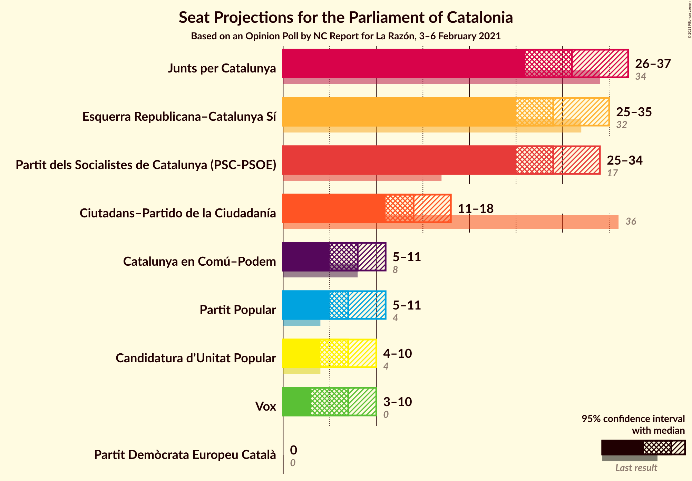
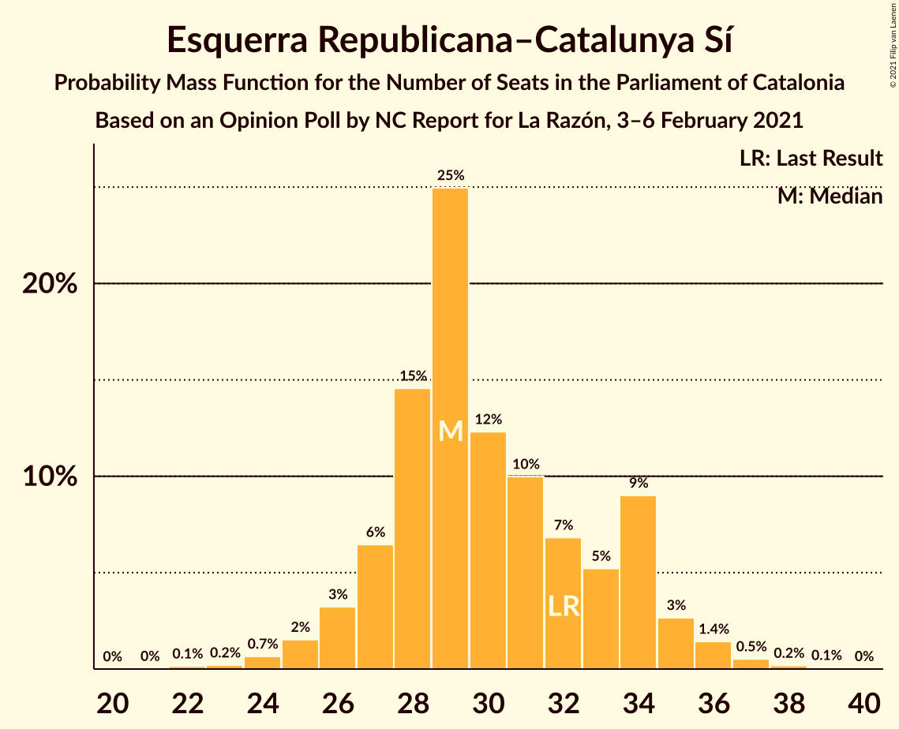
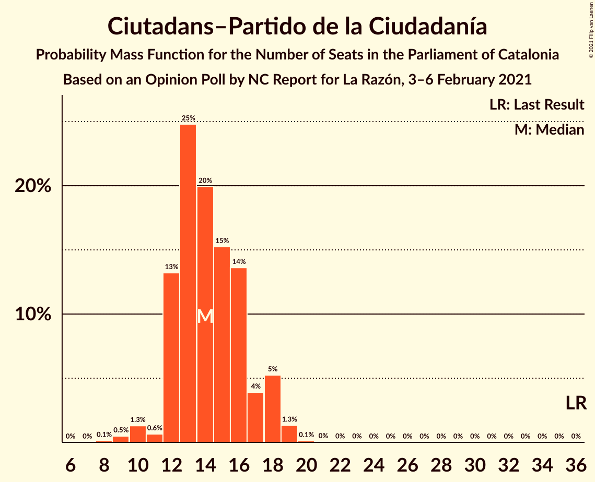
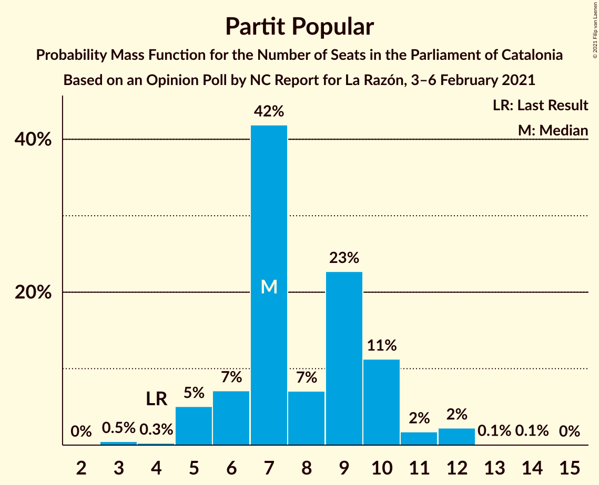
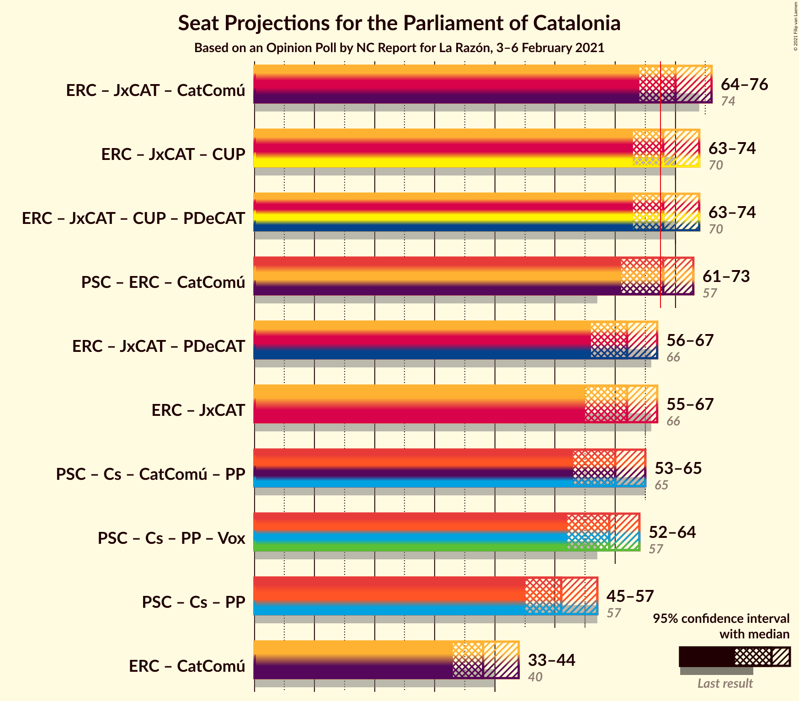
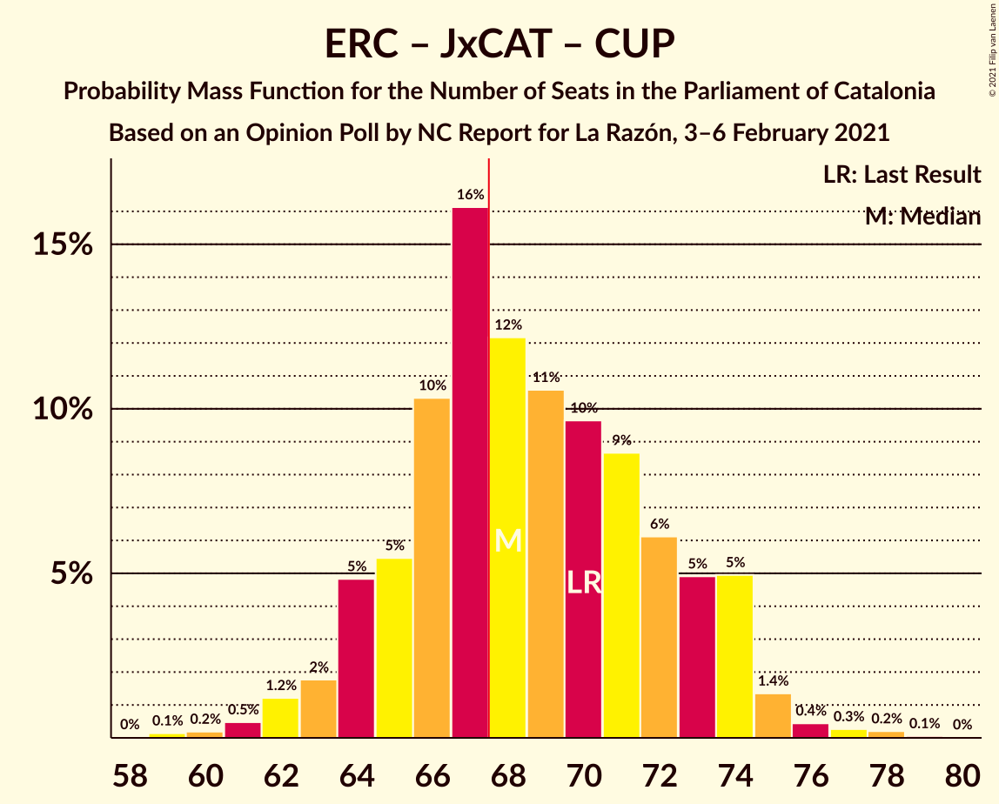
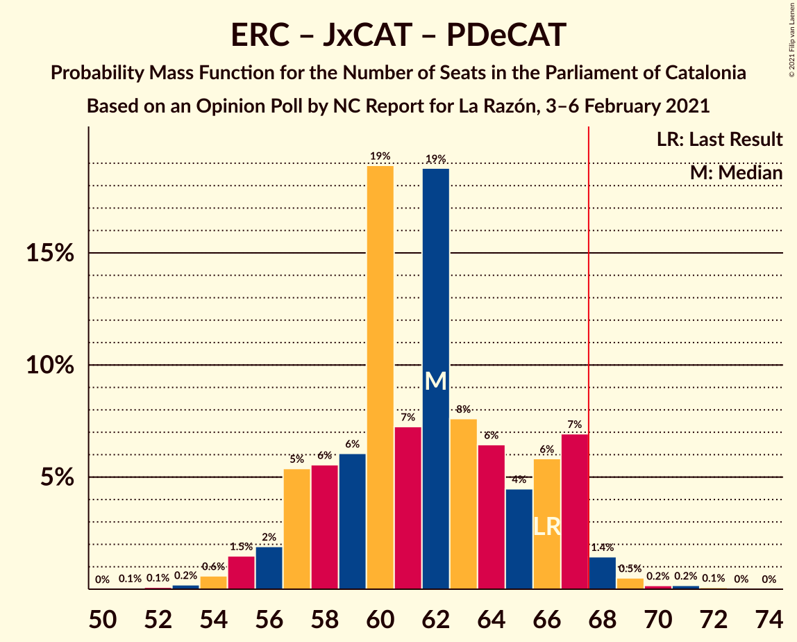

# Opinion Poll by NC Report for La Razón, 3–6 February 2021

<a href="#voting-intentions">Voting Intentions</a> | <a href="#seats">Seats</a> | <a href="#coalitions">Coalitions</a> | <a href="#technical-information">Technical Information</a>

## Voting Intentions

### Confidence Intervals

| Party | Last Result | Poll Result | 80% Confidence Interval | 90% Confidence Interval | 95% Confidence Interval | 99% Confidence Interval |
|:-----:|:-----------:|:-----------:|:-----------------------:|:-----------------------:|:-----------------------:|:-----------------------:|
| Partit dels Socialistes de Catalunya (PSC-PSOE) | 13.9% | 21.5% | 19.4–23.8% |18.8–24.4% |18.3–25.0% |17.4–26.1% |
| Esquerra Republicana–Catalunya Sí | 21.4% | 20.3% | 18.3–22.5% |17.7–23.2% |17.2–23.7% |16.3–24.9% |
| Junts per Catalunya | 21.7% | 19.9% | 17.9–22.2% |17.4–22.8% |16.9–23.4% |16.0–24.5% |
| Ciutadans–Partido de la Ciudadanía | 25.4% | 10.8% | 9.3–12.7% |8.9–13.2% |8.6–13.6% |7.9–14.5% |
| Catalunya en Comú–Podem | 7.5% | 7.2% | 6.0–8.8% |5.7–9.2% |5.4–9.6% |4.8–10.4% |
| Partit Popular | 4.2% | 6.4% | 5.2–7.8% |4.9–8.3% |4.6–8.6% |4.2–9.4% |
| Vox | 0.0% | 5.8% | 4.8–7.3% |4.5–7.7% |4.2–8.1% |3.7–8.8% |
| Candidatura d’Unitat Popular | 4.5% | 5.5% | 4.5–6.9% |4.2–7.3% |3.9–7.7% |3.5–8.4% |
| Partit Demòcrata Europeu Català | 0.0% | 1.4% | 0.9–2.2% |0.8–2.5% |0.7–2.7% |0.5–3.2% |

*Note:* The poll result column reflects the actual value used in the calculations. Published results may vary slightly, and in addition be rounded to fewer digits.

## Seats

### Confidence Intervals

| Party | Last Result | Median | 80% Confidence Interval | 90% Confidence Interval | 95% Confidence Interval | 99% Confidence Interval |
|:-----:|:-----------:|:------:|:-----------------------:|:-----------------------:|:-----------------------:|:-----------------------:|
| <a href="#partit-dels-socialistes-de-catalunya-(psc-psoe)">Partit dels Socialistes de Catalunya (PSC-PSOE)</a> | 17 | 29 | 26–32 |25–33 |25–34 |24–35 |
| <a href="#esquerra-republicana–catalunya-sí">Esquerra Republicana–Catalunya Sí</a> | 32 | 29 | 27–34 |26–34 |25–35 |24–37 |
| <a href="#junts-per-catalunya">Junts per Catalunya</a> | 34 | 31 | 29–35 |27–36 |26–37 |25–38 |
| <a href="#ciutadans–partido-de-la-ciudadanía">Ciutadans–Partido de la Ciudadanía</a> | 36 | 14 | 12–17 |12–18 |11–18 |9–19 |
| <a href="#catalunya-en-comú–podem">Catalunya en Comú–Podem</a> | 8 | 8 | 6–10 |5–11 |5–11 |4–13 |
| <a href="#partit-popular">Partit Popular</a> | 4 | 7 | 6–10 |5–10 |5–11 |4–12 |
| <a href="#vox">Vox</a> | 0 | 7 | 5–9 |5–10 |3–10 |3–11 |
| <a href="#candidatura-d’unitat-popular">Candidatura d’Unitat Popular</a> | 4 | 7 | 4–8 |4–9 |4–10 |3–11 |
| <a href="#partit-demòcrata-europeu-català">Partit Demòcrata Europeu Català</a> | 0 | 0 | 0 |0 |0 |0–1 |

### Partit dels Socialistes de Catalunya (PSC-PSOE)

*For a full overview of the results for this party, see the [Partit dels Socialistes de Catalunya (PSC-PSOE)](party-partitdelssocialistesdecatalunyapsc-psoe.html) page.*

| Number of Seats | Probability | Accumulated | Special Marks |
|:---------------:|:-----------:|:-----------:|:-------------:|
| 17 | 0% | 100% | Last Result |
| 18 | 0% | 100% |  |
| 19 | 0% | 100% |  |
| 20 | 0% | 100% |  |
| 21 | 0% | 100% |  |
| 22 | 0.2% | 100% |  |
| 23 | 0.2% | 99.8% |  |
| 24 | 1.2% | 99.6% |  |
| 25 | 5% | 98% |  |
| 26 | 13% | 93% |  |
| 27 | 11% | 80% |  |
| 28 | 6% | 69% |  |
| 29 | 14% | 63% | Median |
| 30 | 13% | 49% |  |
| 31 | 23% | 36% |  |
| 32 | 8% | 14% |  |
| 33 | 2% | 5% |  |
| 34 | 2% | 3% |  |
| 35 | 0.9% | 1.4% |  |
| 36 | 0.3% | 0.5% |  |
| 37 | 0.1% | 0.2% |  |
| 38 | 0% | 0.1% |  |
| 39 | 0% | 0% |  |

### Esquerra Republicana–Catalunya Sí

*For a full overview of the results for this party, see the [Esquerra Republicana–Catalunya Sí](party-esquerrarepublicana–catalunyasí.html) page.*

| Number of Seats | Probability | Accumulated | Special Marks |
|:---------------:|:-----------:|:-----------:|:-------------:|
| 22 | 0.1% | 100% |  |
| 23 | 0.2% | 99.8% |  |
| 24 | 0.7% | 99.6% |  |
| 25 | 2% | 99.0% |  |
| 26 | 3% | 97% |  |
| 27 | 6% | 94% |  |
| 28 | 15% | 88% |  |
| 29 | 25% | 73% | Median |
| 30 | 12% | 48% |  |
| 31 | 10% | 36% |  |
| 32 | 7% | 26% | Last Result |
| 33 | 5% | 19% |  |
| 34 | 9% | 14% |  |
| 35 | 3% | 5% |  |
| 36 | 1.4% | 2% |  |
| 37 | 0.5% | 0.8% |  |
| 38 | 0.2% | 0.3% |  |
| 39 | 0.1% | 0.1% |  |
| 40 | 0% | 0% |  |

### Junts per Catalunya

*For a full overview of the results for this party, see the [Junts per Catalunya](party-juntspercatalunya.html) page.*

| Number of Seats | Probability | Accumulated | Special Marks |
|:---------------:|:-----------:|:-----------:|:-------------:|
| 23 | 0.1% | 100% |  |
| 24 | 0.2% | 99.9% |  |
| 25 | 1.1% | 99.7% |  |
| 26 | 2% | 98.7% |  |
| 27 | 2% | 97% |  |
| 28 | 2% | 94% |  |
| 29 | 7% | 92% |  |
| 30 | 9% | 85% |  |
| 31 | 31% | 76% | Median |
| 32 | 17% | 44% |  |
| 33 | 9% | 28% |  |
| 34 | 5% | 19% | Last Result |
| 35 | 6% | 14% |  |
| 36 | 4% | 8% |  |
| 37 | 3% | 4% |  |
| 38 | 0.4% | 0.8% |  |
| 39 | 0.3% | 0.4% |  |
| 40 | 0.1% | 0.1% |  |
| 41 | 0% | 0% |  |

### Ciutadans–Partido de la Ciudadanía

*For a full overview of the results for this party, see the [Ciutadans–Partido de la Ciudadanía](party-ciutadans–partidodelaciudadanía.html) page.*

| Number of Seats | Probability | Accumulated | Special Marks |
|:---------------:|:-----------:|:-----------:|:-------------:|
| 8 | 0.1% | 100% |  |
| 9 | 0.5% | 99.9% |  |
| 10 | 1.3% | 99.4% |  |
| 11 | 0.6% | 98% |  |
| 12 | 13% | 97% |  |
| 13 | 25% | 84% |  |
| 14 | 20% | 59% | Median |
| 15 | 15% | 39% |  |
| 16 | 14% | 24% |  |
| 17 | 4% | 11% |  |
| 18 | 5% | 7% |  |
| 19 | 1.3% | 2% |  |
| 20 | 0.1% | 0.2% |  |
| 21 | 0% | 0.1% |  |
| 22 | 0% | 0% |  |
| 23 | 0% | 0% |  |
| 24 | 0% | 0% |  |
| 25 | 0% | 0% |  |
| 26 | 0% | 0% |  |
| 27 | 0% | 0% |  |
| 28 | 0% | 0% |  |
| 29 | 0% | 0% |  |
| 30 | 0% | 0% |  |
| 31 | 0% | 0% |  |
| 32 | 0% | 0% |  |
| 33 | 0% | 0% |  |
| 34 | 0% | 0% |  |
| 35 | 0% | 0% |  |
| 36 | 0% | 0% | Last Result |

### Catalunya en Comú–Podem

*For a full overview of the results for this party, see the [Catalunya en Comú–Podem](party-catalunyaencomú–podem.html) page.*

| Number of Seats | Probability | Accumulated | Special Marks |
|:---------------:|:-----------:|:-----------:|:-------------:|
| 4 | 0.5% | 100% |  |
| 5 | 6% | 99.5% |  |
| 6 | 9% | 93% |  |
| 7 | 15% | 84% |  |
| 8 | 41% | 70% | Last Result, Median |
| 9 | 9% | 29% |  |
| 10 | 10% | 20% |  |
| 11 | 8% | 10% |  |
| 12 | 1.4% | 2% |  |
| 13 | 0.4% | 0.6% |  |
| 14 | 0.2% | 0.2% |  |
| 15 | 0% | 0% |  |

### Partit Popular

*For a full overview of the results for this party, see the [Partit Popular](party-partitpopular.html) page.*

| Number of Seats | Probability | Accumulated | Special Marks |
|:---------------:|:-----------:|:-----------:|:-------------:|
| 3 | 0.5% | 100% |  |
| 4 | 0.3% | 99.5% | Last Result |
| 5 | 5% | 99.3% |  |
| 6 | 7% | 94% |  |
| 7 | 42% | 87% | Median |
| 8 | 7% | 45% |  |
| 9 | 23% | 38% |  |
| 10 | 11% | 15% |  |
| 11 | 2% | 4% |  |
| 12 | 2% | 2% |  |
| 13 | 0.1% | 0.2% |  |
| 14 | 0.1% | 0.1% |  |
| 15 | 0% | 0% |  |

### Vox

*For a full overview of the results for this party, see the [Vox](party-vox.html) page.*

| Number of Seats | Probability | Accumulated | Special Marks |
|:---------------:|:-----------:|:-----------:|:-------------:|
| 0 | 0% | 100% | Last Result |
| 1 | 0% | 100% |  |
| 2 | 0% | 100% |  |
| 3 | 3% | 100% |  |
| 4 | 1.2% | 97% |  |
| 5 | 11% | 96% |  |
| 6 | 9% | 85% |  |
| 7 | 48% | 76% | Median |
| 8 | 5% | 27% |  |
| 9 | 15% | 22% |  |
| 10 | 5% | 6% |  |
| 11 | 1.1% | 2% |  |
| 12 | 0.4% | 0.5% |  |
| 13 | 0% | 0% |  |

### Candidatura d’Unitat Popular

*For a full overview of the results for this party, see the [Candidatura d’Unitat Popular](party-candidaturad’unitatpopular.html) page.*

| Number of Seats | Probability | Accumulated | Special Marks |
|:---------------:|:-----------:|:-----------:|:-------------:|
| 0 | 0.1% | 100% |  |
| 1 | 0% | 99.9% |  |
| 2 | 0.2% | 99.9% |  |
| 3 | 0.6% | 99.7% |  |
| 4 | 10% | 99.1% | Last Result |
| 5 | 5% | 89% |  |
| 6 | 9% | 84% |  |
| 7 | 45% | 76% | Median |
| 8 | 22% | 31% |  |
| 9 | 5% | 9% |  |
| 10 | 2% | 4% |  |
| 11 | 2% | 2% |  |
| 12 | 0% | 0.1% |  |
| 13 | 0% | 0% |  |

### Partit Demòcrata Europeu Català

*For a full overview of the results for this party, see the [Partit Demòcrata Europeu Català](party-partitdemòcrataeuropeucatalà.html) page.*

| Number of Seats | Probability | Accumulated | Special Marks |
|:---------------:|:-----------:|:-----------:|:-------------:|
| 0 | 98% | 100% | Last Result, Median |
| 1 | 2% | 2% |  |
| 2 | 0% | 0.1% |  |
| 3 | 0.1% | 0.1% |  |
| 4 | 0.1% | 0.1% |  |
| 5 | 0% | 0% |  |

## Coalitions

### Confidence Intervals

| Coalition | Last Result | Median | Majority? | 80% Confidence Interval | 90% Confidence Interval | 95% Confidence Interval | 99% Confidence Interval |
|:---------:|:-----------:|:------:|:---------:|:-----------------------:|:-----------------------:|:-----------------------:|:-----------------------:|
| Esquerra Republicana–Catalunya Sí – Junts per Catalunya – Catalunya en Comú–Podem | 74 | 70 | 80% | 66–74 | 65–75 | 64–76 | 62–78 |
| Esquerra Republicana–Catalunya Sí – Junts per Catalunya – Candidatura d’Unitat Popular | 70 | 68 | 59% | 65–73 | 64–74 | 63–74 | 61–77 |
| Esquerra Republicana–Catalunya Sí – Junts per Catalunya – Candidatura d’Unitat Popular – Partit Demòcrata Europeu Català | 70 | 68 | 60% | 65–73 | 64–74 | 63–74 | 61–77 |
| Partit dels Socialistes de Catalunya (PSC-PSOE) – Esquerra Republicana–Catalunya Sí – Catalunya en Comú–Podem | 57 | 68 | 52% | 63–71 | 62–72 | 61–73 | 59–75 |
| Esquerra Republicana–Catalunya Sí – Junts per Catalunya – Partit Demòcrata Europeu Català | 66 | 62 | 2% | 58–66 | 57–67 | 56–67 | 54–69 |
| Esquerra Republicana–Catalunya Sí – Junts per Catalunya | 66 | 62 | 2% | 58–66 | 57–67 | 55–67 | 54–69 |
| Partit dels Socialistes de Catalunya (PSC-PSOE) – Ciutadans–Partido de la Ciudadanía – Catalunya en Comú–Podem – Partit Popular | 65 | 60 | 0.3% | 55–63 | 54–64 | 53–65 | 51–67 |
| Partit dels Socialistes de Catalunya (PSC-PSOE) – Ciutadans–Partido de la Ciudadanía – Partit Popular – Vox | 57 | 59 | 0.2% | 54–62 | 53–63 | 52–64 | 50–66 |
| Partit dels Socialistes de Catalunya (PSC-PSOE) – Ciutadans–Partido de la Ciudadanía – Partit Popular | 57 | 51 | 0% | 47–55 | 46–56 | 45–57 | 43–60 |
| Esquerra Republicana–Catalunya Sí – Catalunya en Comú–Podem | 40 | 38 | 0% | 35–42 | 34–43 | 33–44 | 31–46 |

### Esquerra Republicana–Catalunya Sí – Junts per Catalunya – Catalunya en Comú–Podem

| Number of Seats | Probability | Accumulated | Special Marks |
|:---------------:|:-----------:|:-----------:|:-------------:|
| 59 | 0.1% | 100% |  |
| 60 | 0.1% | 99.9% |  |
| 61 | 0.2% | 99.8% |  |
| 62 | 1.0% | 99.6% |  |
| 63 | 1.1% | 98.6% |  |
| 64 | 2% | 98% |  |
| 65 | 4% | 95% |  |
| 66 | 6% | 92% |  |
| 67 | 6% | 86% |  |
| 68 | 20% | 80% | Median, Majority |
| 69 | 8% | 59% |  |
| 70 | 15% | 51% |  |
| 71 | 9% | 36% |  |
| 72 | 8% | 27% |  |
| 73 | 6% | 20% |  |
| 74 | 5% | 14% | Last Result |
| 75 | 5% | 9% |  |
| 76 | 3% | 4% |  |
| 77 | 0.7% | 1.3% |  |
| 78 | 0.2% | 0.6% |  |
| 79 | 0.3% | 0.4% |  |
| 80 | 0% | 0.1% |  |
| 81 | 0.1% | 0.1% |  |
| 82 | 0% | 0% |  |

### Esquerra Republicana–Catalunya Sí – Junts per Catalunya – Candidatura d’Unitat Popular

| Number of Seats | Probability | Accumulated | Special Marks |
|:---------------:|:-----------:|:-----------:|:-------------:|
| 59 | 0.1% | 100% |  |
| 60 | 0.2% | 99.8% |  |
| 61 | 0.5% | 99.6% |  |
| 62 | 1.2% | 99.1% |  |
| 63 | 2% | 98% |  |
| 64 | 5% | 96% |  |
| 65 | 5% | 91% |  |
| 66 | 10% | 86% |  |
| 67 | 16% | 76% | Median |
| 68 | 12% | 59% | Majority |
| 69 | 11% | 47% |  |
| 70 | 10% | 37% | Last Result |
| 71 | 9% | 27% |  |
| 72 | 6% | 18% |  |
| 73 | 5% | 12% |  |
| 74 | 5% | 7% |  |
| 75 | 1.4% | 2% |  |
| 76 | 0.4% | 1.0% |  |
| 77 | 0.3% | 0.6% |  |
| 78 | 0.2% | 0.3% |  |
| 79 | 0.1% | 0.1% |  |
| 80 | 0% | 0% |  |

### Esquerra Republicana–Catalunya Sí – Junts per Catalunya – Candidatura d’Unitat Popular – Partit Demòcrata Europeu Català

| Number of Seats | Probability | Accumulated | Special Marks |
|:---------------:|:-----------:|:-----------:|:-------------:|
| 59 | 0.1% | 100% |  |
| 60 | 0.2% | 99.8% |  |
| 61 | 0.5% | 99.6% |  |
| 62 | 1.1% | 99.2% |  |
| 63 | 2% | 98% |  |
| 64 | 5% | 96% |  |
| 65 | 5% | 91% |  |
| 66 | 10% | 86% |  |
| 67 | 16% | 76% | Median |
| 68 | 12% | 60% | Majority |
| 69 | 11% | 48% |  |
| 70 | 10% | 37% | Last Result |
| 71 | 9% | 27% |  |
| 72 | 6% | 19% |  |
| 73 | 5% | 12% |  |
| 74 | 5% | 8% |  |
| 75 | 1.4% | 2% |  |
| 76 | 0.5% | 1.1% |  |
| 77 | 0.3% | 0.6% |  |
| 78 | 0.2% | 0.3% |  |
| 79 | 0.1% | 0.1% |  |
| 80 | 0% | 0% |  |

### Partit dels Socialistes de Catalunya (PSC-PSOE) – Esquerra Republicana–Catalunya Sí – Catalunya en Comú–Podem

| Number of Seats | Probability | Accumulated | Special Marks |
|:---------------:|:-----------:|:-----------:|:-------------:|
| 57 | 0.1% | 100% | Last Result |
| 58 | 0.2% | 99.9% |  |
| 59 | 0.3% | 99.7% |  |
| 60 | 0.8% | 99.4% |  |
| 61 | 1.5% | 98.6% |  |
| 62 | 4% | 97% |  |
| 63 | 5% | 94% |  |
| 64 | 7% | 89% |  |
| 65 | 9% | 82% |  |
| 66 | 6% | 73% | Median |
| 67 | 15% | 67% |  |
| 68 | 24% | 52% | Majority |
| 69 | 7% | 27% |  |
| 70 | 7% | 20% |  |
| 71 | 7% | 13% |  |
| 72 | 4% | 7% |  |
| 73 | 1.2% | 3% |  |
| 74 | 0.9% | 2% |  |
| 75 | 0.5% | 0.9% |  |
| 76 | 0.3% | 0.4% |  |
| 77 | 0.1% | 0.1% |  |
| 78 | 0% | 0.1% |  |
| 79 | 0% | 0% |  |

### Esquerra Republicana–Catalunya Sí – Junts per Catalunya – Partit Demòcrata Europeu Català

| Number of Seats | Probability | Accumulated | Special Marks |
|:---------------:|:-----------:|:-----------:|:-------------:|
| 51 | 0.1% | 100% |  |
| 52 | 0.1% | 99.9% |  |
| 53 | 0.2% | 99.8% |  |
| 54 | 0.6% | 99.6% |  |
| 55 | 1.5% | 99.0% |  |
| 56 | 2% | 98% |  |
| 57 | 5% | 96% |  |
| 58 | 6% | 90% |  |
| 59 | 6% | 85% |  |
| 60 | 19% | 79% | Median |
| 61 | 7% | 60% |  |
| 62 | 19% | 53% |  |
| 63 | 8% | 34% |  |
| 64 | 6% | 26% |  |
| 65 | 4% | 20% |  |
| 66 | 6% | 15% | Last Result |
| 67 | 7% | 9% |  |
| 68 | 1.4% | 2% | Majority |
| 69 | 0.5% | 1.0% |  |
| 70 | 0.2% | 0.5% |  |
| 71 | 0.2% | 0.3% |  |
| 72 | 0.1% | 0.1% |  |
| 73 | 0% | 0.1% |  |
| 74 | 0% | 0% |  |

### Esquerra Republicana–Catalunya Sí – Junts per Catalunya

| Number of Seats | Probability | Accumulated | Special Marks |
|:---------------:|:-----------:|:-----------:|:-------------:|
| 51 | 0.1% | 100% |  |
| 52 | 0.1% | 99.9% |  |
| 53 | 0.2% | 99.8% |  |
| 54 | 0.6% | 99.6% |  |
| 55 | 2% | 99.0% |  |
| 56 | 2% | 97% |  |
| 57 | 6% | 96% |  |
| 58 | 6% | 90% |  |
| 59 | 6% | 85% |  |
| 60 | 19% | 78% | Median |
| 61 | 7% | 59% |  |
| 62 | 19% | 52% |  |
| 63 | 8% | 33% |  |
| 64 | 6% | 26% |  |
| 65 | 5% | 19% |  |
| 66 | 6% | 15% | Last Result |
| 67 | 7% | 9% |  |
| 68 | 1.5% | 2% | Majority |
| 69 | 0.5% | 0.9% |  |
| 70 | 0.1% | 0.4% |  |
| 71 | 0.2% | 0.3% |  |
| 72 | 0.1% | 0.1% |  |
| 73 | 0% | 0.1% |  |
| 74 | 0% | 0% |  |

### Partit dels Socialistes de Catalunya (PSC-PSOE) – Ciutadans–Partido de la Ciudadanía – Catalunya en Comú–Podem – Partit Popular

| Number of Seats | Probability | Accumulated | Special Marks |
|:---------------:|:-----------:|:-----------:|:-------------:|
| 49 | 0.1% | 100% |  |
| 50 | 0.2% | 99.9% |  |
| 51 | 0.4% | 99.7% |  |
| 52 | 0.7% | 99.3% |  |
| 53 | 1.3% | 98.5% |  |
| 54 | 4% | 97% |  |
| 55 | 5% | 93% |  |
| 56 | 7% | 89% |  |
| 57 | 11% | 81% |  |
| 58 | 9% | 70% | Median |
| 59 | 11% | 61% |  |
| 60 | 11% | 50% |  |
| 61 | 17% | 39% |  |
| 62 | 9% | 22% |  |
| 63 | 4% | 13% |  |
| 64 | 5% | 8% |  |
| 65 | 1.1% | 3% | Last Result |
| 66 | 1.1% | 2% |  |
| 67 | 0.7% | 1.0% |  |
| 68 | 0.2% | 0.3% | Majority |
| 69 | 0.1% | 0.1% |  |
| 70 | 0% | 0% |  |

### Partit dels Socialistes de Catalunya (PSC-PSOE) – Ciutadans–Partido de la Ciudadanía – Partit Popular – Vox

| Number of Seats | Probability | Accumulated | Special Marks |
|:---------------:|:-----------:|:-----------:|:-------------:|
| 48 | 0% | 100% |  |
| 49 | 0.2% | 99.9% |  |
| 50 | 0.3% | 99.8% |  |
| 51 | 1.0% | 99.5% |  |
| 52 | 2% | 98% |  |
| 53 | 3% | 96% |  |
| 54 | 4% | 93% |  |
| 55 | 8% | 89% |  |
| 56 | 9% | 80% |  |
| 57 | 10% | 71% | Last Result, Median |
| 58 | 9% | 61% |  |
| 59 | 10% | 52% |  |
| 60 | 22% | 42% |  |
| 61 | 7% | 21% |  |
| 62 | 7% | 14% |  |
| 63 | 3% | 6% |  |
| 64 | 1.5% | 4% |  |
| 65 | 1.0% | 2% |  |
| 66 | 0.7% | 1.1% |  |
| 67 | 0.3% | 0.4% |  |
| 68 | 0.1% | 0.2% | Majority |
| 69 | 0% | 0% |  |

### Partit dels Socialistes de Catalunya (PSC-PSOE) – Ciutadans–Partido de la Ciudadanía – Partit Popular

| Number of Seats | Probability | Accumulated | Special Marks |
|:---------------:|:-----------:|:-----------:|:-------------:|
| 42 | 0.2% | 100% |  |
| 43 | 0.3% | 99.8% |  |
| 44 | 0.9% | 99.5% |  |
| 45 | 2% | 98.6% |  |
| 46 | 3% | 97% |  |
| 47 | 7% | 94% |  |
| 48 | 7% | 87% |  |
| 49 | 9% | 80% |  |
| 50 | 10% | 71% | Median |
| 51 | 13% | 62% |  |
| 52 | 10% | 49% |  |
| 53 | 19% | 39% |  |
| 54 | 8% | 20% |  |
| 55 | 7% | 12% |  |
| 56 | 2% | 5% |  |
| 57 | 1.3% | 3% | Last Result |
| 58 | 1.1% | 2% |  |
| 59 | 0.3% | 0.9% |  |
| 60 | 0.4% | 0.5% |  |
| 61 | 0.1% | 0.1% |  |
| 62 | 0% | 0.1% |  |
| 63 | 0% | 0% |  |

### Esquerra Republicana–Catalunya Sí – Catalunya en Comú–Podem

| Number of Seats | Probability | Accumulated | Special Marks |
|:---------------:|:-----------:|:-----------:|:-------------:|
| 29 | 0.2% | 100% |  |
| 30 | 0.1% | 99.8% |  |
| 31 | 0.5% | 99.6% |  |
| 32 | 0.5% | 99.1% |  |
| 33 | 2% | 98.6% |  |
| 34 | 4% | 96% |  |
| 35 | 5% | 93% |  |
| 36 | 18% | 88% |  |
| 37 | 20% | 70% | Median |
| 38 | 13% | 50% |  |
| 39 | 9% | 37% |  |
| 40 | 7% | 29% | Last Result |
| 41 | 7% | 21% |  |
| 42 | 6% | 14% |  |
| 43 | 4% | 8% |  |
| 44 | 3% | 4% |  |
| 45 | 0.7% | 2% |  |
| 46 | 0.6% | 0.9% |  |
| 47 | 0.2% | 0.3% |  |
| 48 | 0.1% | 0.1% |  |
| 49 | 0% | 0% |  |

## Technical Information

### Opinion Poll

+ **Polling firm:** NC Report
+ **Commissioner(s):** La Razón
+ **Fieldwork period:** 3–6 February 2021

### Calculations

+ **Sample size:** 582
+ **Simulations done:** 1,048,576
+ **Error estimate:** 2.15%

