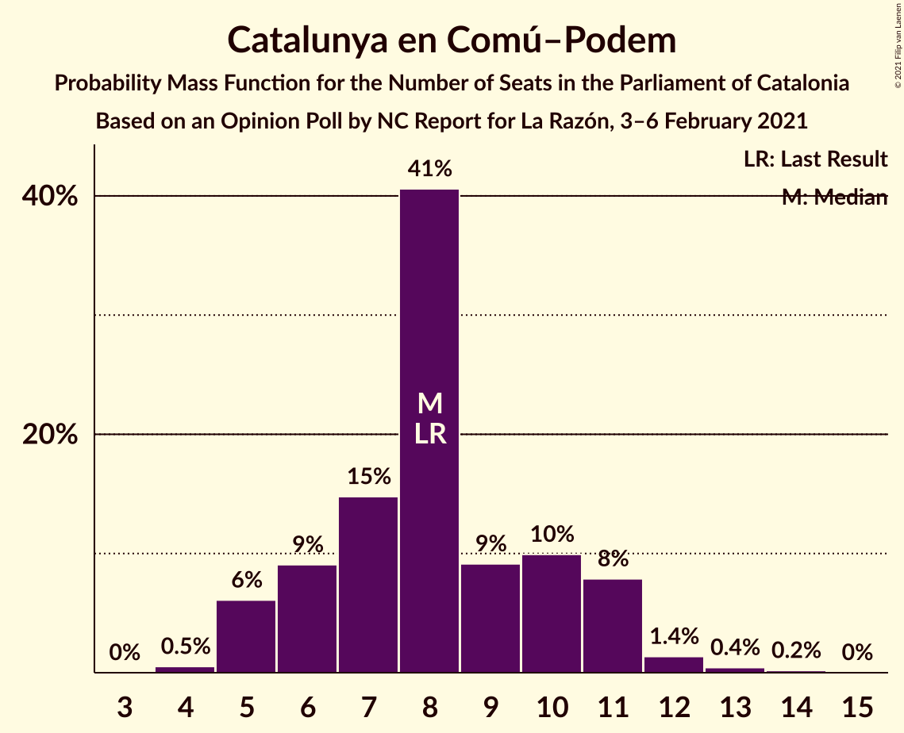
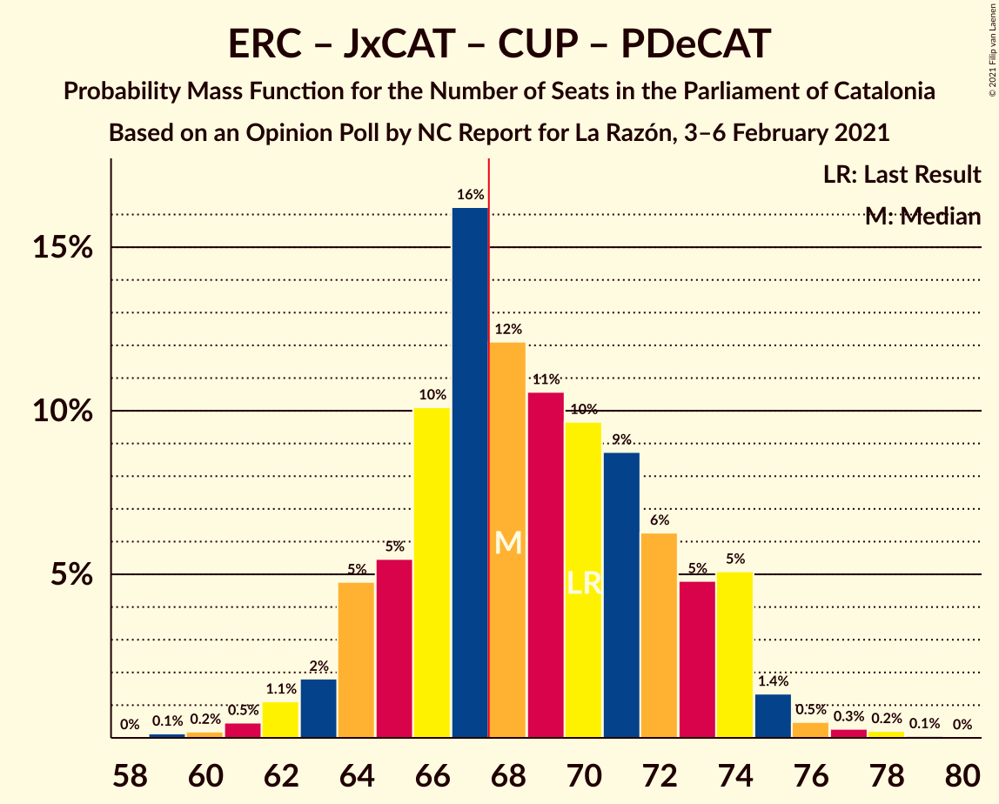
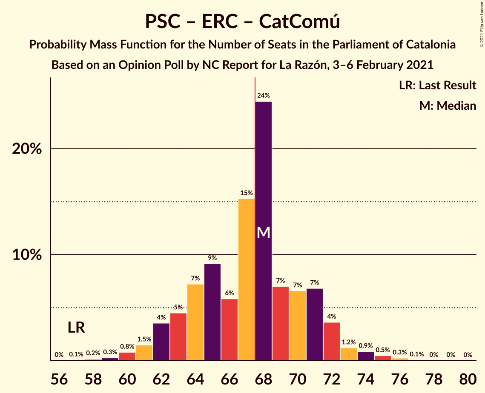
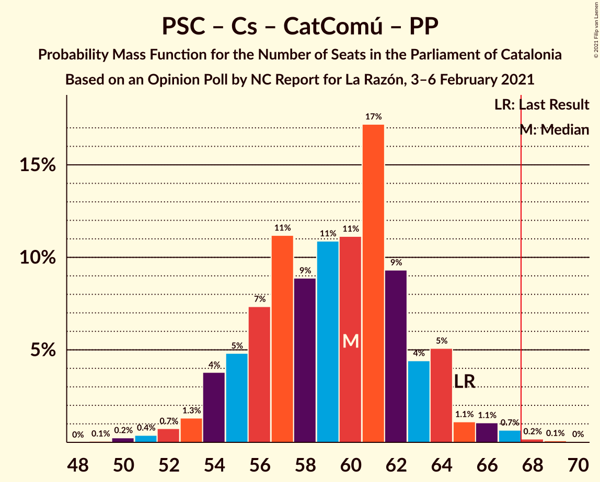

# Opinion Poll by NC Report for La Razón, 3–6 February 2021

<a href="#voting-intentions">Voting Intentions</a> | <a href="#seats">Seats</a> | <a href="#coalitions">Coalitions</a> | <a href="#technical-information">Technical Information</a>

## Voting Intentions

### Confidence Intervals

| Party | Last Result | Poll Result | 80% Confidence Interval | 90% Confidence Interval | 95% Confidence Interval | 99% Confidence Interval |
|:-----:|:-----------:|:-----------:|:-----------------------:|:-----------------------:|:-----------------------:|:-----------------------:|
| Partit dels Socialistes de Catalunya (PSC-PSOE) | 13.9% | 21.5% | 19.4–23.8% |18.8–24.4% |18.3–25.0% |17.4–26.1% |
| Esquerra Republicana–Catalunya Sí | 21.4% | 20.3% | 18.3–22.5% |17.7–23.2% |17.2–23.7% |16.3–24.9% |
| Junts per Catalunya | 21.7% | 19.9% | 17.9–22.2% |17.4–22.8% |16.9–23.4% |16.0–24.5% |
| Ciutadans–Partido de la Ciudadanía | 25.4% | 10.8% | 9.3–12.7% |8.9–13.2% |8.6–13.6% |7.9–14.5% |
| Catalunya en Comú–Podem | 7.5% | 7.2% | 6.0–8.8% |5.7–9.2% |5.4–9.6% |4.8–10.4% |
| Partit Popular | 4.2% | 6.4% | 5.2–7.8% |4.9–8.3% |4.6–8.6% |4.2–9.4% |
| Vox | 0.0% | 5.8% | 4.8–7.3% |4.5–7.7% |4.2–8.1% |3.7–8.8% |
| Candidatura d’Unitat Popular | 4.5% | 5.5% | 4.5–6.9% |4.2–7.3% |3.9–7.7% |3.5–8.4% |
| Partit Demòcrata Europeu Català | 0.0% | 1.4% | 0.9–2.2% |0.8–2.5% |0.7–2.7% |0.5–3.2% |

*Note:* The poll result column reflects the actual value used in the calculations. Published results may vary slightly, and in addition be rounded to fewer digits.

## Seats

### Confidence Intervals

| Party | Last Result | Median | 80% Confidence Interval | 90% Confidence Interval | 95% Confidence Interval | 99% Confidence Interval |
|:-----:|:-----------:|:------:|:-----------------------:|:-----------------------:|:-----------------------:|:-----------------------:|
| <a href="#partit-dels-socialistes-de-catalunya-(psc-psoe)">Partit dels Socialistes de Catalunya (PSC-PSOE)</a> | 17 | 30 | 26–31 |25–32 |25–34 |24–35 |
| <a href="#esquerra-republicana–catalunya-sí">Esquerra Republicana–Catalunya Sí</a> | 32 | 29 | 27–34 |26–34 |26–35 |24–37 |
| <a href="#junts-per-catalunya">Junts per Catalunya</a> | 34 | 31 | 29–35 |28–36 |27–37 |25–38 |
| <a href="#ciutadans–partido-de-la-ciudadanía">Ciutadans–Partido de la Ciudadanía</a> | 36 | 15 | 13–16 |12–17 |11–18 |9–19 |
| <a href="#catalunya-en-comú–podem">Catalunya en Comú–Podem</a> | 8 | 8 | 6–10 |5–11 |5–11 |4–13 |
| <a href="#partit-popular">Partit Popular</a> | 4 | 7 | 6–9 |6–10 |5–12 |3–12 |
| <a href="#vox">Vox</a> | 0 | 7 | 5–9 |4–10 |3–10 |3–11 |
| <a href="#candidatura-d’unitat-popular">Candidatura d’Unitat Popular</a> | 4 | 7 | 6–8 |4–9 |4–10 |3–11 |
| <a href="#partit-demòcrata-europeu-català">Partit Demòcrata Europeu Català</a> | 0 | 0 | 0 |0 |0 |0–1 |

### Partit dels Socialistes de Catalunya (PSC-PSOE)

*For a full overview of the results for this party, see the [Partit dels Socialistes de Catalunya (PSC-PSOE)](party-partitdelssocialistesdecatalunyapsc-psoe.html) page.*

| Number of Seats | Probability | Accumulated | Special Marks |
|:---------------:|:-----------:|:-----------:|:-------------:|
| 17 | 0% | 100% | Last Result |
| 18 | 0% | 100% |  |
| 19 | 0% | 100% |  |
| 20 | 0% | 100% |  |
| 21 | 0% | 100% |  |
| 22 | 0.2% | 100% |  |
| 23 | 0.2% | 99.8% |  |
| 24 | 1.4% | 99.6% |  |
| 25 | 5% | 98% |  |
| 26 | 10% | 93% |  |
| 27 | 13% | 83% |  |
| 28 | 4% | 71% |  |
| 29 | 16% | 67% |  |
| 30 | 9% | 51% | Median |
| 31 | 34% | 42% |  |
| 32 | 4% | 9% |  |
| 33 | 2% | 4% |  |
| 34 | 2% | 3% |  |
| 35 | 0.7% | 1.1% |  |
| 36 | 0.2% | 0.3% |  |
| 37 | 0.1% | 0.1% |  |
| 38 | 0% | 0% |  |

### Esquerra Republicana–Catalunya Sí

*For a full overview of the results for this party, see the [Esquerra Republicana–Catalunya Sí](party-esquerrarepublicana–catalunyasí.html) page.*

| Number of Seats | Probability | Accumulated | Special Marks |
|:---------------:|:-----------:|:-----------:|:-------------:|
| 22 | 0.2% | 100% |  |
| 23 | 0.2% | 99.8% |  |
| 24 | 0.8% | 99.6% |  |
| 25 | 1.2% | 98.9% |  |
| 26 | 4% | 98% |  |
| 27 | 8% | 94% |  |
| 28 | 13% | 86% |  |
| 29 | 30% | 73% | Median |
| 30 | 10% | 43% |  |
| 31 | 8% | 33% |  |
| 32 | 6% | 25% | Last Result |
| 33 | 5% | 19% |  |
| 34 | 9% | 13% |  |
| 35 | 3% | 5% |  |
| 36 | 2% | 2% |  |
| 37 | 0.3% | 0.5% |  |
| 38 | 0.2% | 0.3% |  |
| 39 | 0.1% | 0.1% |  |
| 40 | 0% | 0% |  |

### Junts per Catalunya

*For a full overview of the results for this party, see the [Junts per Catalunya](party-juntspercatalunya.html) page.*

| Number of Seats | Probability | Accumulated | Special Marks |
|:---------------:|:-----------:|:-----------:|:-------------:|
| 23 | 0.1% | 100% |  |
| 24 | 0.2% | 99.9% |  |
| 25 | 0.9% | 99.8% |  |
| 26 | 1.4% | 98.9% |  |
| 27 | 2% | 98% |  |
| 28 | 2% | 95% |  |
| 29 | 6% | 93% |  |
| 30 | 11% | 87% |  |
| 31 | 34% | 76% | Median |
| 32 | 17% | 42% |  |
| 33 | 5% | 26% |  |
| 34 | 6% | 20% | Last Result |
| 35 | 7% | 14% |  |
| 36 | 4% | 7% |  |
| 37 | 2% | 3% |  |
| 38 | 0.3% | 0.7% |  |
| 39 | 0.3% | 0.4% |  |
| 40 | 0.1% | 0.1% |  |
| 41 | 0% | 0% |  |

### Ciutadans–Partido de la Ciudadanía

*For a full overview of the results for this party, see the [Ciutadans–Partido de la Ciudadanía](party-ciutadans–partidodelaciudadanía.html) page.*

| Number of Seats | Probability | Accumulated | Special Marks |
|:---------------:|:-----------:|:-----------:|:-------------:|
| 8 | 0.1% | 100% |  |
| 9 | 0.5% | 99.9% |  |
| 10 | 2% | 99.4% |  |
| 11 | 0.4% | 98% |  |
| 12 | 6% | 97% |  |
| 13 | 33% | 92% |  |
| 14 | 8% | 58% |  |
| 15 | 22% | 50% | Median |
| 16 | 21% | 28% |  |
| 17 | 4% | 7% |  |
| 18 | 2% | 4% |  |
| 19 | 2% | 2% |  |
| 20 | 0.1% | 0.1% |  |
| 21 | 0% | 0% |  |
| 22 | 0% | 0% |  |
| 23 | 0% | 0% |  |
| 24 | 0% | 0% |  |
| 25 | 0% | 0% |  |
| 26 | 0% | 0% |  |
| 27 | 0% | 0% |  |
| 28 | 0% | 0% |  |
| 29 | 0% | 0% |  |
| 30 | 0% | 0% |  |
| 31 | 0% | 0% |  |
| 32 | 0% | 0% |  |
| 33 | 0% | 0% |  |
| 34 | 0% | 0% |  |
| 35 | 0% | 0% |  |
| 36 | 0% | 0% | Last Result |

### Catalunya en Comú–Podem

*For a full overview of the results for this party, see the [Catalunya en Comú–Podem](party-catalunyaencomú–podem.html) page.*

| Number of Seats | Probability | Accumulated | Special Marks |
|:---------------:|:-----------:|:-----------:|:-------------:|
| 4 | 0.6% | 100% |  |
| 5 | 7% | 99.4% |  |
| 6 | 4% | 93% |  |
| 7 | 14% | 89% |  |
| 8 | 47% | 75% | Last Result, Median |
| 9 | 12% | 28% |  |
| 10 | 8% | 17% |  |
| 11 | 7% | 9% |  |
| 12 | 1.3% | 2% |  |
| 13 | 0.5% | 0.7% |  |
| 14 | 0.2% | 0.2% |  |
| 15 | 0% | 0% |  |

### Partit Popular

*For a full overview of the results for this party, see the [Partit Popular](party-partitpopular.html) page.*

| Number of Seats | Probability | Accumulated | Special Marks |
|:---------------:|:-----------:|:-----------:|:-------------:|
| 3 | 0.5% | 100% |  |
| 4 | 0.2% | 99.5% | Last Result |
| 5 | 4% | 99.3% |  |
| 6 | 8% | 95% |  |
| 7 | 52% | 88% | Median |
| 8 | 9% | 36% |  |
| 9 | 17% | 27% |  |
| 10 | 5% | 10% |  |
| 11 | 2% | 5% |  |
| 12 | 3% | 3% |  |
| 13 | 0.1% | 0.2% |  |
| 14 | 0.1% | 0.1% |  |
| 15 | 0% | 0% |  |

### Vox

*For a full overview of the results for this party, see the [Vox](party-vox.html) page.*

| Number of Seats | Probability | Accumulated | Special Marks |
|:---------------:|:-----------:|:-----------:|:-------------:|
| 0 | 0% | 100% | Last Result |
| 1 | 0% | 100% |  |
| 2 | 0% | 100% |  |
| 3 | 4% | 100% |  |
| 4 | 0.9% | 96% |  |
| 5 | 11% | 95% |  |
| 6 | 6% | 84% |  |
| 7 | 52% | 78% | Median |
| 8 | 6% | 25% |  |
| 9 | 13% | 19% |  |
| 10 | 4% | 6% |  |
| 11 | 0.9% | 1.3% |  |
| 12 | 0.3% | 0.3% |  |
| 13 | 0% | 0% |  |

### Candidatura d’Unitat Popular

*For a full overview of the results for this party, see the [Candidatura d’Unitat Popular](party-candidaturad’unitatpopular.html) page.*

| Number of Seats | Probability | Accumulated | Special Marks |
|:---------------:|:-----------:|:-----------:|:-------------:|
| 0 | 0.2% | 100% |  |
| 1 | 0% | 99.8% |  |
| 2 | 0.3% | 99.8% |  |
| 3 | 0.6% | 99.6% |  |
| 4 | 4% | 99.0% | Last Result |
| 5 | 3% | 95% |  |
| 6 | 10% | 92% |  |
| 7 | 53% | 82% | Median |
| 8 | 21% | 28% |  |
| 9 | 4% | 8% |  |
| 10 | 2% | 4% |  |
| 11 | 2% | 2% |  |
| 12 | 0% | 0.1% |  |
| 13 | 0% | 0% |  |

### Partit Demòcrata Europeu Català

*For a full overview of the results for this party, see the [Partit Demòcrata Europeu Català](party-partitdemòcrataeuropeucatalà.html) page.*

| Number of Seats | Probability | Accumulated | Special Marks |
|:---------------:|:-----------:|:-----------:|:-------------:|
| 0 | 98% | 100% | Last Result, Median |
| 1 | 2% | 2% |  |
| 2 | 0% | 0.1% |  |
| 3 | 0% | 0.1% |  |
| 4 | 0.1% | 0.1% |  |
| 5 | 0% | 0% |  |

## Coalitions

### Confidence Intervals

| Coalition | Last Result | Median | Majority? | 80% Confidence Interval | 90% Confidence Interval | 95% Confidence Interval | 99% Confidence Interval |
|:---------:|:-----------:|:------:|:---------:|:-----------------------:|:-----------------------:|:-----------------------:|:-----------------------:|
| Esquerra Republicana–Catalunya Sí – Junts per Catalunya – Catalunya en Comú–Podem | 74 | 70 | 79% | 66–73 | 65–75 | 64–76 | 62–77 |
| Esquerra Republicana–Catalunya Sí – Junts per Catalunya – Candidatura d’Unitat Popular – Partit Demòcrata Europeu Català | 70 | 68 | 57% | 64–73 | 64–74 | 64–74 | 61–76 |
| Esquerra Republicana–Catalunya Sí – Junts per Catalunya – Candidatura d’Unitat Popular | 70 | 68 | 57% | 64–73 | 64–74 | 63–74 | 61–76 |
| Partit dels Socialistes de Catalunya (PSC-PSOE) – Esquerra Republicana–Catalunya Sí – Catalunya en Comú–Podem | 57 | 68 | 54% | 63–71 | 63–71 | 61–73 | 59–75 |
| Esquerra Republicana–Catalunya Sí – Junts per Catalunya | 66 | 61 | 2% | 57–66 | 57–67 | 56–67 | 54–69 |
| Esquerra Republicana–Catalunya Sí – Junts per Catalunya – Partit Demòcrata Europeu Català | 66 | 61 | 2% | 57–66 | 57–67 | 56–67 | 54–69 |
| Partit dels Socialistes de Catalunya (PSC-PSOE) – Ciutadans–Partido de la Ciudadanía – Catalunya en Comú–Podem – Partit Popular | 65 | 60 | 0.2% | 55–63 | 54–64 | 53–65 | 51–67 |
| Partit dels Socialistes de Catalunya (PSC-PSOE) – Ciutadans–Partido de la Ciudadanía – Partit Popular – Vox | 57 | 59 | 0.2% | 54–62 | 53–63 | 52–64 | 51–66 |
| Partit dels Socialistes de Catalunya (PSC-PSOE) – Ciutadans–Partido de la Ciudadanía – Partit Popular | 57 | 52 | 0% | 47–55 | 46–55 | 45–57 | 43–59 |
| Esquerra Republicana–Catalunya Sí – Catalunya en Comú–Podem | 40 | 37 | 0% | 35–42 | 34–43 | 33–44 | 31–46 |

### Esquerra Republicana–Catalunya Sí – Junts per Catalunya – Catalunya en Comú–Podem

| Number of Seats | Probability | Accumulated | Special Marks |
|:---------------:|:-----------:|:-----------:|:-------------:|
| 59 | 0.1% | 100% |  |
| 60 | 0.1% | 99.9% |  |
| 61 | 0.1% | 99.8% |  |
| 62 | 0.8% | 99.7% |  |
| 63 | 0.9% | 98.8% |  |
| 64 | 2% | 98% |  |
| 65 | 3% | 96% |  |
| 66 | 9% | 92% |  |
| 67 | 5% | 84% |  |
| 68 | 22% | 79% | Median, Majority |
| 69 | 3% | 57% |  |
| 70 | 14% | 53% |  |
| 71 | 13% | 39% |  |
| 72 | 9% | 27% |  |
| 73 | 8% | 18% |  |
| 74 | 3% | 10% | Last Result |
| 75 | 2% | 7% |  |
| 76 | 4% | 5% |  |
| 77 | 0.5% | 0.9% |  |
| 78 | 0.2% | 0.4% |  |
| 79 | 0.1% | 0.2% |  |
| 80 | 0% | 0.1% |  |
| 81 | 0.1% | 0.1% |  |
| 82 | 0% | 0% |  |

### Esquerra Republicana–Catalunya Sí – Junts per Catalunya – Candidatura d’Unitat Popular – Partit Demòcrata Europeu Català

| Number of Seats | Probability | Accumulated | Special Marks |
|:---------------:|:-----------:|:-----------:|:-------------:|
| 59 | 0.2% | 100% |  |
| 60 | 0.2% | 99.8% |  |
| 61 | 0.2% | 99.6% |  |
| 62 | 0.9% | 99.3% |  |
| 63 | 0.9% | 98% |  |
| 64 | 8% | 98% |  |
| 65 | 5% | 90% |  |
| 66 | 4% | 85% |  |
| 67 | 23% | 81% | Median |
| 68 | 15% | 57% | Majority |
| 69 | 5% | 42% |  |
| 70 | 10% | 37% | Last Result |
| 71 | 8% | 27% |  |
| 72 | 3% | 19% |  |
| 73 | 8% | 17% |  |
| 74 | 7% | 9% |  |
| 75 | 2% | 2% |  |
| 76 | 0.2% | 0.7% |  |
| 77 | 0.2% | 0.4% |  |
| 78 | 0.2% | 0.3% |  |
| 79 | 0.1% | 0.1% |  |
| 80 | 0% | 0% |  |

### Esquerra Republicana–Catalunya Sí – Junts per Catalunya – Candidatura d’Unitat Popular

| Number of Seats | Probability | Accumulated | Special Marks |
|:---------------:|:-----------:|:-----------:|:-------------:|
| 59 | 0.2% | 100% |  |
| 60 | 0.2% | 99.7% |  |
| 61 | 0.2% | 99.5% |  |
| 62 | 0.9% | 99.3% |  |
| 63 | 1.0% | 98% |  |
| 64 | 8% | 97% |  |
| 65 | 5% | 90% |  |
| 66 | 5% | 85% |  |
| 67 | 23% | 80% | Median |
| 68 | 15% | 57% | Majority |
| 69 | 5% | 42% |  |
| 70 | 10% | 37% | Last Result |
| 71 | 8% | 27% |  |
| 72 | 3% | 19% |  |
| 73 | 8% | 17% |  |
| 74 | 7% | 9% |  |
| 75 | 2% | 2% |  |
| 76 | 0.2% | 0.7% |  |
| 77 | 0.2% | 0.4% |  |
| 78 | 0.2% | 0.3% |  |
| 79 | 0.1% | 0.1% |  |
| 80 | 0% | 0% |  |

### Partit dels Socialistes de Catalunya (PSC-PSOE) – Esquerra Republicana–Catalunya Sí – Catalunya en Comú–Podem

| Number of Seats | Probability | Accumulated | Special Marks |
|:---------------:|:-----------:|:-----------:|:-------------:|
| 57 | 0% | 100% | Last Result |
| 58 | 0.2% | 99.9% |  |
| 59 | 0.2% | 99.7% |  |
| 60 | 1.1% | 99.5% |  |
| 61 | 1.4% | 98% |  |
| 62 | 1.2% | 97% |  |
| 63 | 7% | 96% |  |
| 64 | 4% | 89% |  |
| 65 | 11% | 85% |  |
| 66 | 5% | 74% |  |
| 67 | 15% | 69% | Median |
| 68 | 29% | 54% | Majority |
| 69 | 9% | 25% |  |
| 70 | 5% | 16% |  |
| 71 | 6% | 11% |  |
| 72 | 2% | 5% |  |
| 73 | 1.3% | 3% |  |
| 74 | 1.1% | 2% |  |
| 75 | 0.6% | 0.8% |  |
| 76 | 0.1% | 0.2% |  |
| 77 | 0% | 0.1% |  |
| 78 | 0% | 0.1% |  |
| 79 | 0% | 0.1% |  |
| 80 | 0% | 0% |  |

### Esquerra Republicana–Catalunya Sí – Junts per Catalunya

| Number of Seats | Probability | Accumulated | Special Marks |
|:---------------:|:-----------:|:-----------:|:-------------:|
| 51 | 0.1% | 100% |  |
| 52 | 0.1% | 99.9% |  |
| 53 | 0.1% | 99.8% |  |
| 54 | 0.6% | 99.6% |  |
| 55 | 0.9% | 99.0% |  |
| 56 | 2% | 98% |  |
| 57 | 7% | 96% |  |
| 58 | 6% | 89% |  |
| 59 | 3% | 83% |  |
| 60 | 26% | 80% | Median |
| 61 | 7% | 53% |  |
| 62 | 12% | 47% |  |
| 63 | 8% | 34% |  |
| 64 | 8% | 26% |  |
| 65 | 2% | 18% |  |
| 66 | 7% | 16% | Last Result |
| 67 | 6% | 8% |  |
| 68 | 2% | 2% | Majority |
| 69 | 0.5% | 0.8% |  |
| 70 | 0.1% | 0.3% |  |
| 71 | 0.1% | 0.2% |  |
| 72 | 0.1% | 0.1% |  |
| 73 | 0% | 0.1% |  |
| 74 | 0% | 0% |  |

### Esquerra Republicana–Catalunya Sí – Junts per Catalunya – Partit Demòcrata Europeu Català

| Number of Seats | Probability | Accumulated | Special Marks |
|:---------------:|:-----------:|:-----------:|:-------------:|
| 51 | 0.1% | 100% |  |
| 52 | 0.1% | 99.9% |  |
| 53 | 0.1% | 99.8% |  |
| 54 | 0.6% | 99.6% |  |
| 55 | 0.9% | 99.1% |  |
| 56 | 2% | 98% |  |
| 57 | 7% | 96% |  |
| 58 | 6% | 89% |  |
| 59 | 3% | 83% |  |
| 60 | 26% | 80% | Median |
| 61 | 6% | 53% |  |
| 62 | 12% | 47% |  |
| 63 | 8% | 35% |  |
| 64 | 8% | 27% |  |
| 65 | 2% | 19% |  |
| 66 | 7% | 16% | Last Result |
| 67 | 6% | 9% |  |
| 68 | 1.4% | 2% | Majority |
| 69 | 0.5% | 0.9% |  |
| 70 | 0.2% | 0.4% |  |
| 71 | 0.1% | 0.2% |  |
| 72 | 0.1% | 0.1% |  |
| 73 | 0% | 0.1% |  |
| 74 | 0% | 0% |  |

### Partit dels Socialistes de Catalunya (PSC-PSOE) – Ciutadans–Partido de la Ciudadanía – Catalunya en Comú–Podem – Partit Popular

| Number of Seats | Probability | Accumulated | Special Marks |
|:---------------:|:-----------:|:-----------:|:-------------:|
| 49 | 0.1% | 100% |  |
| 50 | 0.1% | 99.9% |  |
| 51 | 0.4% | 99.8% |  |
| 52 | 1.0% | 99.3% |  |
| 53 | 2% | 98% |  |
| 54 | 3% | 97% |  |
| 55 | 6% | 93% |  |
| 56 | 6% | 87% |  |
| 57 | 12% | 81% |  |
| 58 | 6% | 69% |  |
| 59 | 7% | 63% |  |
| 60 | 12% | 57% | Median |
| 61 | 25% | 44% |  |
| 62 | 8% | 19% |  |
| 63 | 2% | 11% |  |
| 64 | 7% | 9% |  |
| 65 | 1.3% | 3% | Last Result |
| 66 | 1.0% | 2% |  |
| 67 | 0.4% | 0.6% |  |
| 68 | 0.1% | 0.2% | Majority |
| 69 | 0.1% | 0.1% |  |
| 70 | 0% | 0% |  |

### Partit dels Socialistes de Catalunya (PSC-PSOE) – Ciutadans–Partido de la Ciudadanía – Partit Popular – Vox

| Number of Seats | Probability | Accumulated | Special Marks |
|:---------------:|:-----------:|:-----------:|:-------------:|
| 49 | 0.2% | 100% |  |
| 50 | 0.2% | 99.8% |  |
| 51 | 0.9% | 99.5% |  |
| 52 | 3% | 98.7% |  |
| 53 | 3% | 95% |  |
| 54 | 4% | 93% |  |
| 55 | 7% | 89% |  |
| 56 | 12% | 82% |  |
| 57 | 12% | 70% | Last Result |
| 58 | 7% | 59% |  |
| 59 | 9% | 52% | Median |
| 60 | 25% | 43% |  |
| 61 | 3% | 18% |  |
| 62 | 10% | 16% |  |
| 63 | 2% | 5% |  |
| 64 | 0.8% | 3% |  |
| 65 | 1.1% | 2% |  |
| 66 | 0.5% | 0.8% |  |
| 67 | 0.1% | 0.3% |  |
| 68 | 0.2% | 0.2% | Majority |
| 69 | 0% | 0% |  |

### Partit dels Socialistes de Catalunya (PSC-PSOE) – Ciutadans–Partido de la Ciudadanía – Partit Popular

| Number of Seats | Probability | Accumulated | Special Marks |
|:---------------:|:-----------:|:-----------:|:-------------:|
| 42 | 0.1% | 100% |  |
| 43 | 0.4% | 99.9% |  |
| 44 | 0.6% | 99.4% |  |
| 45 | 3% | 98.8% |  |
| 46 | 3% | 96% |  |
| 47 | 8% | 94% |  |
| 48 | 3% | 85% |  |
| 49 | 11% | 82% |  |
| 50 | 9% | 71% |  |
| 51 | 11% | 62% |  |
| 52 | 9% | 51% | Median |
| 53 | 24% | 42% |  |
| 54 | 5% | 17% |  |
| 55 | 8% | 12% |  |
| 56 | 1.5% | 4% |  |
| 57 | 1.0% | 3% | Last Result |
| 58 | 1.0% | 2% |  |
| 59 | 0.4% | 0.6% |  |
| 60 | 0.1% | 0.2% |  |
| 61 | 0.1% | 0.1% |  |
| 62 | 0% | 0% |  |

### Esquerra Republicana–Catalunya Sí – Catalunya en Comú–Podem

| Number of Seats | Probability | Accumulated | Special Marks |
|:---------------:|:-----------:|:-----------:|:-------------:|
| 29 | 0.3% | 100% |  |
| 30 | 0.2% | 99.7% |  |
| 31 | 0.6% | 99.5% |  |
| 32 | 0.6% | 98.9% |  |
| 33 | 2% | 98% |  |
| 34 | 4% | 97% |  |
| 35 | 3% | 92% |  |
| 36 | 18% | 90% |  |
| 37 | 23% | 72% | Median |
| 38 | 13% | 49% |  |
| 39 | 8% | 36% |  |
| 40 | 8% | 28% | Last Result |
| 41 | 9% | 20% |  |
| 42 | 5% | 11% |  |
| 43 | 3% | 6% |  |
| 44 | 2% | 3% |  |
| 45 | 0.7% | 1.3% |  |
| 46 | 0.4% | 0.6% |  |
| 47 | 0.1% | 0.2% |  |
| 48 | 0.1% | 0.1% |  |
| 49 | 0% | 0% |  |

## Technical Information

### Opinion Poll

+ **Polling firm:** NC Report
+ **Commissioner(s):** La Razón
+ **Fieldwork period:** 3–6 February 2021

### Calculations

+ **Sample size:** 582
+ **Simulations done:** 524,288
+ **Error estimate:** 2.12%

