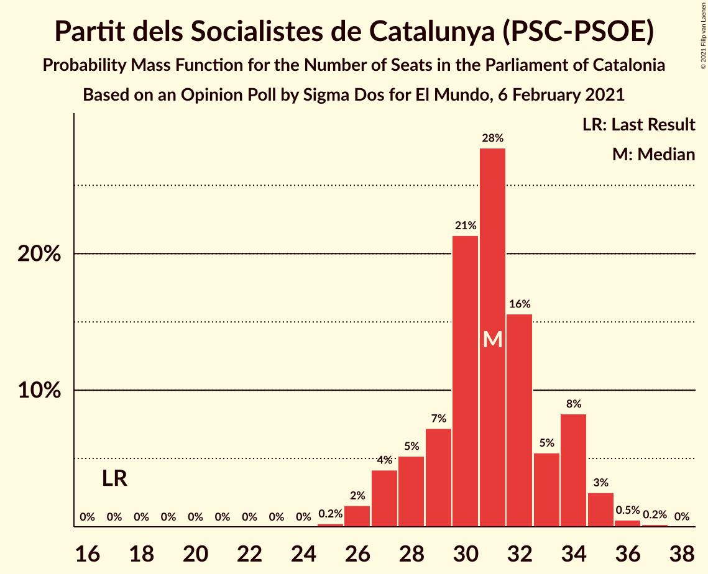

# Opinion Poll by Sigma Dos for El Mundo, 6 February 2021

<a href="#voting-intentions">Voting Intentions</a> | <a href="#seats">Seats</a> | <a href="#coalitions">Coalitions</a> | <a href="#technical-information">Technical Information</a>

## Voting Intentions

### Confidence Intervals

| Party | Last Result | Poll Result | 80% Confidence Interval | 90% Confidence Interval | 95% Confidence Interval | 99% Confidence Interval |
|:-----:|:-----------:|:-----------:|:-----------------------:|:-----------------------:|:-----------------------:|:-----------------------:|
| Partit dels Socialistes de Catalunya (PSC-PSOE) | 13.9% | 22.9% | 21.3–24.7% |20.8–25.2% |20.4–25.6% |19.6–26.5% |
| Junts per Catalunya | 21.7% | 21.4% | 19.8–23.1% |19.4–23.6% |19.0–24.1% |18.2–24.9% |
| Esquerra Republicana–Catalunya Sí | 21.4% | 20.8% | 19.2–22.5% |18.8–23.0% |18.4–23.4% |17.7–24.3% |
| Ciutadans–Partido de la Ciudadanía | 25.4% | 9.2% | 8.1–10.5% |7.8–10.8% |7.6–11.2% |7.1–11.8% |
| Catalunya en Comú–Podem | 7.5% | 7.0% | 6.1–8.2% |5.8–8.5% |5.6–8.8% |5.2–9.3% |
| Candidatura d’Unitat Popular | 4.5% | 5.7% | 4.9–6.8% |4.6–7.1% |4.4–7.3% |4.1–7.9% |
| Partit Popular | 4.2% | 5.6% | 4.8–6.6% |4.5–7.0% |4.3–7.2% |4.0–7.7% |
| Vox | 0.0% | 5.4% | 4.6–6.4% |4.3–6.7% |4.2–7.0% |3.8–7.5% |

*Note:* The poll result column reflects the actual value used in the calculations. Published results may vary slightly, and in addition be rounded to fewer digits.

## Seats

### Confidence Intervals

| Party | Last Result | Median | 80% Confidence Interval | 90% Confidence Interval | 95% Confidence Interval | 99% Confidence Interval |
|:-----:|:-----------:|:------:|:-----------------------:|:-----------------------:|:-----------------------:|:-----------------------:|
| <a href="#partit-dels-socialistes-de-catalunya-(psc-psoe)">Partit dels Socialistes de Catalunya (PSC-PSOE)</a> | 17 | 31 | 28–34 |27–34 |27–35 |26–36 |
| <a href="#junts-per-catalunya">Junts per Catalunya</a> | 34 | 34 | 31–37 |31–37 |30–38 |28–39 |
| <a href="#esquerra-republicana–catalunya-sí">Esquerra Republicana–Catalunya Sí</a> | 32 | 30 | 28–34 |28–34 |27–35 |26–36 |
| <a href="#ciutadans–partido-de-la-ciudadanía">Ciutadans–Partido de la Ciudadanía</a> | 36 | 12 | 10–13 |9–14 |9–14 |8–16 |
| <a href="#catalunya-en-comú–podem">Catalunya en Comú–Podem</a> | 8 | 8 | 6–9 |5–10 |5–10 |5–11 |
| <a href="#candidatura-d’unitat-popular">Candidatura d’Unitat Popular</a> | 4 | 8 | 6–8 |5–9 |4–9 |4–10 |
| <a href="#partit-popular">Partit Popular</a> | 4 | 7 | 5–8 |5–9 |4–9 |3–10 |
| <a href="#vox">Vox</a> | 0 | 7 | 5–7 |5–9 |3–9 |3–9 |

### Partit dels Socialistes de Catalunya (PSC-PSOE)

*For a full overview of the results for this party, see the [Partit dels Socialistes de Catalunya (PSC-PSOE)](party-partitdelssocialistesdecatalunyapsc-psoe.html) page.*

| Number of Seats | Probability | Accumulated | Special Marks |
|:---------------:|:-----------:|:-----------:|:-------------:|
| 17 | 0% | 100% | Last Result |
| 18 | 0% | 100% |  |
| 19 | 0% | 100% |  |
| 20 | 0% | 100% |  |
| 21 | 0% | 100% |  |
| 22 | 0% | 100% |  |
| 23 | 0% | 100% |  |
| 24 | 0% | 100% |  |
| 25 | 0.2% | 100% |  |
| 26 | 2% | 99.8% |  |
| 27 | 4% | 98% |  |
| 28 | 5% | 94% |  |
| 29 | 7% | 89% |  |
| 30 | 21% | 82% |  |
| 31 | 28% | 60% | Median |
| 32 | 16% | 33% |  |
| 33 | 5% | 17% |  |
| 34 | 8% | 12% |  |
| 35 | 3% | 3% |  |
| 36 | 0.5% | 0.7% |  |
| 37 | 0.2% | 0.2% |  |
| 38 | 0% | 0% |  |

### Junts per Catalunya

*For a full overview of the results for this party, see the [Junts per Catalunya](party-juntspercatalunya.html) page.*

| Number of Seats | Probability | Accumulated | Special Marks |
|:---------------:|:-----------:|:-----------:|:-------------:|
| 26 | 0.1% | 100% |  |
| 27 | 0.1% | 99.9% |  |
| 28 | 0.4% | 99.8% |  |
| 29 | 0.8% | 99.4% |  |
| 30 | 2% | 98.6% |  |
| 31 | 12% | 96% |  |
| 32 | 14% | 84% |  |
| 33 | 14% | 70% |  |
| 34 | 21% | 56% | Last Result, Median |
| 35 | 17% | 34% |  |
| 36 | 5% | 17% |  |
| 37 | 8% | 12% |  |
| 38 | 2% | 4% |  |
| 39 | 1.0% | 1.3% |  |
| 40 | 0.3% | 0.3% |  |
| 41 | 0.1% | 0.1% |  |
| 42 | 0% | 0% |  |

### Esquerra Republicana–Catalunya Sí

*For a full overview of the results for this party, see the [Esquerra Republicana–Catalunya Sí](party-esquerrarepublicana–catalunyasí.html) page.*

| Number of Seats | Probability | Accumulated | Special Marks |
|:---------------:|:-----------:|:-----------:|:-------------:|
| 24 | 0.1% | 100% |  |
| 25 | 0.1% | 99.9% |  |
| 26 | 0.9% | 99.8% |  |
| 27 | 3% | 98.9% |  |
| 28 | 9% | 96% |  |
| 29 | 30% | 88% |  |
| 30 | 12% | 58% | Median |
| 31 | 14% | 46% |  |
| 32 | 8% | 32% | Last Result |
| 33 | 12% | 24% |  |
| 34 | 8% | 12% |  |
| 35 | 2% | 3% |  |
| 36 | 0.8% | 1.1% |  |
| 37 | 0.3% | 0.3% |  |
| 38 | 0% | 0% |  |

### Ciutadans–Partido de la Ciudadanía

*For a full overview of the results for this party, see the [Ciutadans–Partido de la Ciudadanía](party-ciutadans–partidodelaciudadanía.html) page.*

| Number of Seats | Probability | Accumulated | Special Marks |
|:---------------:|:-----------:|:-----------:|:-------------:|
| 8 | 2% | 100% |  |
| 9 | 8% | 98% |  |
| 10 | 7% | 90% |  |
| 11 | 7% | 83% |  |
| 12 | 40% | 76% | Median |
| 13 | 30% | 36% |  |
| 14 | 5% | 6% |  |
| 15 | 0.6% | 1.1% |  |
| 16 | 0.5% | 0.5% |  |
| 17 | 0% | 0.1% |  |
| 18 | 0% | 0% |  |
| 19 | 0% | 0% |  |
| 20 | 0% | 0% |  |
| 21 | 0% | 0% |  |
| 22 | 0% | 0% |  |
| 23 | 0% | 0% |  |
| 24 | 0% | 0% |  |
| 25 | 0% | 0% |  |
| 26 | 0% | 0% |  |
| 27 | 0% | 0% |  |
| 28 | 0% | 0% |  |
| 29 | 0% | 0% |  |
| 30 | 0% | 0% |  |
| 31 | 0% | 0% |  |
| 32 | 0% | 0% |  |
| 33 | 0% | 0% |  |
| 34 | 0% | 0% |  |
| 35 | 0% | 0% |  |
| 36 | 0% | 0% | Last Result |

### Catalunya en Comú–Podem

*For a full overview of the results for this party, see the [Catalunya en Comú–Podem](party-catalunyaencomú–podem.html) page.*

| Number of Seats | Probability | Accumulated | Special Marks |
|:---------------:|:-----------:|:-----------:|:-------------:|
| 4 | 0.1% | 100% |  |
| 5 | 6% | 99.9% |  |
| 6 | 11% | 94% |  |
| 7 | 26% | 83% |  |
| 8 | 41% | 57% | Last Result, Median |
| 9 | 8% | 16% |  |
| 10 | 6% | 8% |  |
| 11 | 2% | 2% |  |
| 12 | 0.1% | 0.1% |  |
| 13 | 0% | 0% |  |

### Candidatura d’Unitat Popular

*For a full overview of the results for this party, see the [Candidatura d’Unitat Popular](party-candidaturad’unitatpopular.html) page.*

| Number of Seats | Probability | Accumulated | Special Marks |
|:---------------:|:-----------:|:-----------:|:-------------:|
| 3 | 0.1% | 100% |  |
| 4 | 4% | 99.9% | Last Result |
| 5 | 4% | 96% |  |
| 6 | 6% | 92% |  |
| 7 | 29% | 85% |  |
| 8 | 48% | 56% | Median |
| 9 | 7% | 8% |  |
| 10 | 1.1% | 1.5% |  |
| 11 | 0.3% | 0.4% |  |
| 12 | 0% | 0% |  |

### Partit Popular

*For a full overview of the results for this party, see the [Partit Popular](party-partitpopular.html) page.*

| Number of Seats | Probability | Accumulated | Special Marks |
|:---------------:|:-----------:|:-----------:|:-------------:|
| 3 | 1.2% | 100% |  |
| 4 | 1.3% | 98.7% | Last Result |
| 5 | 18% | 97% |  |
| 6 | 17% | 80% |  |
| 7 | 48% | 63% | Median |
| 8 | 6% | 15% |  |
| 9 | 8% | 9% |  |
| 10 | 0.8% | 0.9% |  |
| 11 | 0.1% | 0.1% |  |
| 12 | 0% | 0% |  |

### Vox

*For a full overview of the results for this party, see the [Vox](party-vox.html) page.*

| Number of Seats | Probability | Accumulated | Special Marks |
|:---------------:|:-----------:|:-----------:|:-------------:|
| 0 | 0% | 100% | Last Result |
| 1 | 0% | 100% |  |
| 2 | 0% | 100% |  |
| 3 | 3% | 100% |  |
| 4 | 2% | 97% |  |
| 5 | 27% | 96% |  |
| 6 | 18% | 69% |  |
| 7 | 42% | 51% | Median |
| 8 | 3% | 9% |  |
| 9 | 6% | 6% |  |
| 10 | 0.4% | 0.4% |  |
| 11 | 0% | 0% |  |

## Coalitions

### Confidence Intervals

| Coalition | Last Result | Median | Majority? | 80% Confidence Interval | 90% Confidence Interval | 95% Confidence Interval | 99% Confidence Interval |
|:---------:|:-----------:|:------:|:---------:|:-----------------------:|:-----------------------:|:-----------------------:|:-----------------------:|
| Junts per Catalunya – Esquerra Republicana–Catalunya Sí – Candidatura d’Unitat Popular | 70 | 71 | 96% | 68–75 | 68–76 | 67–77 | 66–78 |
| Junts per Catalunya – Esquerra Republicana–Catalunya Sí – Catalunya en Comú–Podem | 74 | 72 | 96% | 69–75 | 68–76 | 67–77 | 66–79 |
| Partit dels Socialistes de Catalunya (PSC-PSOE) – Esquerra Republicana–Catalunya Sí – Catalunya en Comú–Podem | 57 | 69 | 70% | 66–73 | 65–73 | 64–74 | 63–76 |
| Junts per Catalunya – Esquerra Republicana–Catalunya Sí | 66 | 64 | 10% | 61–67 | 60–68 | 60–69 | 59–71 |
| Partit dels Socialistes de Catalunya (PSC-PSOE) – Ciutadans–Partido de la Ciudadanía – Catalunya en Comú–Podem – Partit Popular | 65 | 57 | 0% | 54–60 | 53–61 | 52–61 | 50–63 |
| Partit dels Socialistes de Catalunya (PSC-PSOE) – Ciutadans–Partido de la Ciudadanía – Partit Popular – Vox | 57 | 56 | 0% | 53–59 | 51–60 | 51–60 | 49–62 |
| Partit dels Socialistes de Catalunya (PSC-PSOE) – Ciutadans–Partido de la Ciudadanía – Partit Popular | 57 | 50 | 0% | 46–52 | 45–53 | 44–54 | 43–55 |
| Esquerra Republicana–Catalunya Sí – Catalunya en Comú–Podem | 40 | 38 | 0% | 36–41 | 35–42 | 35–43 | 33–44 |

### Junts per Catalunya – Esquerra Republicana–Catalunya Sí – Candidatura d’Unitat Popular

| Number of Seats | Probability | Accumulated | Special Marks |
|:---------------:|:-----------:|:-----------:|:-------------:|
| 64 | 0.1% | 100% |  |
| 65 | 0.3% | 99.9% |  |
| 66 | 0.9% | 99.6% |  |
| 67 | 3% | 98.7% |  |
| 68 | 7% | 96% | Majority |
| 69 | 7% | 89% |  |
| 70 | 11% | 81% | Last Result |
| 71 | 20% | 70% |  |
| 72 | 13% | 49% | Median |
| 73 | 12% | 37% |  |
| 74 | 11% | 25% |  |
| 75 | 8% | 14% |  |
| 76 | 3% | 6% |  |
| 77 | 2% | 3% |  |
| 78 | 0.7% | 1.1% |  |
| 79 | 0.3% | 0.4% |  |
| 80 | 0.1% | 0.1% |  |
| 81 | 0% | 0% |  |

### Junts per Catalunya – Esquerra Republicana–Catalunya Sí – Catalunya en Comú–Podem

| Number of Seats | Probability | Accumulated | Special Marks |
|:---------------:|:-----------:|:-----------:|:-------------:|
| 64 | 0% | 100% |  |
| 65 | 0.1% | 99.9% |  |
| 66 | 0.8% | 99.8% |  |
| 67 | 3% | 99.0% |  |
| 68 | 5% | 96% | Majority |
| 69 | 9% | 91% |  |
| 70 | 10% | 82% |  |
| 71 | 15% | 72% |  |
| 72 | 18% | 57% | Median |
| 73 | 13% | 39% |  |
| 74 | 12% | 26% | Last Result |
| 75 | 6% | 14% |  |
| 76 | 4% | 8% |  |
| 77 | 2% | 4% |  |
| 78 | 0.9% | 2% |  |
| 79 | 0.4% | 0.7% |  |
| 80 | 0.3% | 0.3% |  |
| 81 | 0% | 0.1% |  |
| 82 | 0% | 0% |  |

### Partit dels Socialistes de Catalunya (PSC-PSOE) – Esquerra Republicana–Catalunya Sí – Catalunya en Comú–Podem

| Number of Seats | Probability | Accumulated | Special Marks |
|:---------------:|:-----------:|:-----------:|:-------------:|
| 57 | 0% | 100% | Last Result |
| 58 | 0% | 100% |  |
| 59 | 0% | 100% |  |
| 60 | 0% | 100% |  |
| 61 | 0.1% | 100% |  |
| 62 | 0.2% | 99.9% |  |
| 63 | 0.7% | 99.7% |  |
| 64 | 2% | 99.0% |  |
| 65 | 3% | 97% |  |
| 66 | 5% | 94% |  |
| 67 | 19% | 89% |  |
| 68 | 15% | 70% | Majority |
| 69 | 15% | 55% | Median |
| 70 | 14% | 40% |  |
| 71 | 10% | 26% |  |
| 72 | 7% | 17% |  |
| 73 | 5% | 10% |  |
| 74 | 3% | 5% |  |
| 75 | 1.4% | 2% |  |
| 76 | 0.4% | 0.6% |  |
| 77 | 0.1% | 0.2% |  |
| 78 | 0% | 0% |  |

### Junts per Catalunya – Esquerra Republicana–Catalunya Sí

| Number of Seats | Probability | Accumulated | Special Marks |
|:---------------:|:-----------:|:-----------:|:-------------:|
| 57 | 0.1% | 100% |  |
| 58 | 0.3% | 99.9% |  |
| 59 | 2% | 99.6% |  |
| 60 | 3% | 98% |  |
| 61 | 9% | 94% |  |
| 62 | 9% | 85% |  |
| 63 | 15% | 76% |  |
| 64 | 17% | 61% | Median |
| 65 | 9% | 44% |  |
| 66 | 16% | 35% | Last Result |
| 67 | 9% | 19% |  |
| 68 | 5% | 10% | Majority |
| 69 | 3% | 5% |  |
| 70 | 1.2% | 2% |  |
| 71 | 0.5% | 0.9% |  |
| 72 | 0.3% | 0.4% |  |
| 73 | 0.1% | 0.1% |  |
| 74 | 0% | 0% |  |

### Partit dels Socialistes de Catalunya (PSC-PSOE) – Ciutadans–Partido de la Ciudadanía – Catalunya en Comú–Podem – Partit Popular

| Number of Seats | Probability | Accumulated | Special Marks |
|:---------------:|:-----------:|:-----------:|:-------------:|
| 49 | 0.2% | 100% |  |
| 50 | 0.3% | 99.8% |  |
| 51 | 0.9% | 99.5% |  |
| 52 | 2% | 98.6% |  |
| 53 | 4% | 96% |  |
| 54 | 8% | 93% |  |
| 55 | 12% | 85% |  |
| 56 | 10% | 72% |  |
| 57 | 16% | 63% |  |
| 58 | 21% | 46% | Median |
| 59 | 11% | 25% |  |
| 60 | 7% | 15% |  |
| 61 | 5% | 7% |  |
| 62 | 1.4% | 2% |  |
| 63 | 0.4% | 0.9% |  |
| 64 | 0.4% | 0.5% |  |
| 65 | 0.1% | 0.1% | Last Result |
| 66 | 0% | 0% |  |

### Partit dels Socialistes de Catalunya (PSC-PSOE) – Ciutadans–Partido de la Ciudadanía – Partit Popular – Vox

| Number of Seats | Probability | Accumulated | Special Marks |
|:---------------:|:-----------:|:-----------:|:-------------:|
| 47 | 0.1% | 100% |  |
| 48 | 0.2% | 99.9% |  |
| 49 | 0.6% | 99.8% |  |
| 50 | 1.5% | 99.2% |  |
| 51 | 3% | 98% |  |
| 52 | 4% | 94% |  |
| 53 | 8% | 91% |  |
| 54 | 13% | 83% |  |
| 55 | 15% | 69% |  |
| 56 | 20% | 55% |  |
| 57 | 12% | 35% | Last Result, Median |
| 58 | 9% | 23% |  |
| 59 | 6% | 14% |  |
| 60 | 5% | 7% |  |
| 61 | 2% | 2% |  |
| 62 | 0.4% | 0.6% |  |
| 63 | 0.1% | 0.2% |  |
| 64 | 0.1% | 0.1% |  |
| 65 | 0% | 0% |  |

### Partit dels Socialistes de Catalunya (PSC-PSOE) – Ciutadans–Partido de la Ciudadanía – Partit Popular

| Number of Seats | Probability | Accumulated | Special Marks |
|:---------------:|:-----------:|:-----------:|:-------------:|
| 41 | 0.1% | 100% |  |
| 42 | 0.2% | 99.9% |  |
| 43 | 0.8% | 99.7% |  |
| 44 | 2% | 98.9% |  |
| 45 | 3% | 97% |  |
| 46 | 6% | 94% |  |
| 47 | 9% | 88% |  |
| 48 | 11% | 80% |  |
| 49 | 16% | 69% |  |
| 50 | 19% | 52% | Median |
| 51 | 16% | 33% |  |
| 52 | 7% | 17% |  |
| 53 | 6% | 10% |  |
| 54 | 3% | 4% |  |
| 55 | 0.6% | 1.1% |  |
| 56 | 0.3% | 0.4% |  |
| 57 | 0.1% | 0.1% | Last Result |
| 58 | 0% | 0.1% |  |
| 59 | 0% | 0% |  |

### Esquerra Republicana–Catalunya Sí – Catalunya en Comú–Podem

| Number of Seats | Probability | Accumulated | Special Marks |
|:---------------:|:-----------:|:-----------:|:-------------:|
| 31 | 0.1% | 100% |  |
| 32 | 0.2% | 99.8% |  |
| 33 | 0.5% | 99.6% |  |
| 34 | 2% | 99.1% |  |
| 35 | 5% | 98% |  |
| 36 | 18% | 92% |  |
| 37 | 22% | 75% |  |
| 38 | 11% | 53% | Median |
| 39 | 14% | 42% |  |
| 40 | 10% | 28% | Last Result |
| 41 | 8% | 17% |  |
| 42 | 5% | 9% |  |
| 43 | 3% | 4% |  |
| 44 | 1.1% | 1.5% |  |
| 45 | 0.3% | 0.4% |  |
| 46 | 0.1% | 0.1% |  |
| 47 | 0% | 0% |  |

## Technical Information

### Opinion Poll

+ **Polling firm:** Sigma Dos
+ **Commissioner(s):** El Mundo
+ **Fieldwork period:** 6 February 2021

### Calculations

+ **Sample size:** 1000
+ **Simulations done:** 1,048,576
+ **Error estimate:** 0.84%

