# Opinion Poll by Demoscopia y Servicios, 5–7 February 2021

<a href="#voting-intentions">Voting Intentions</a> | <a href="#seats">Seats</a> | <a href="#coalitions">Coalitions</a> | <a href="#technical-information">Technical Information</a>

## Voting Intentions

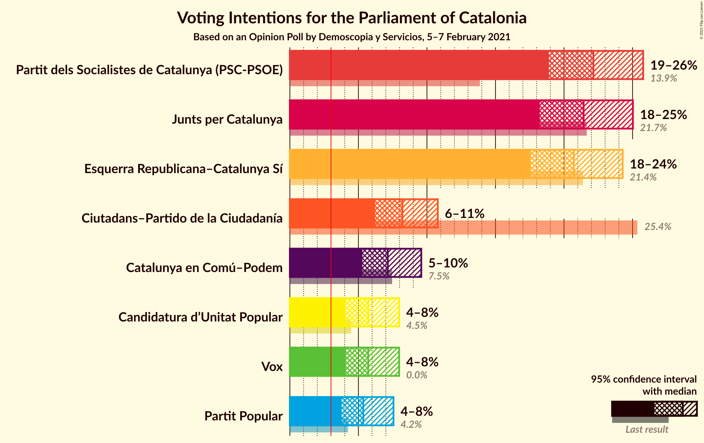

### Confidence Intervals

| Party | Last Result | Poll Result | 80% Confidence Interval | 90% Confidence Interval | 95% Confidence Interval | 99% Confidence Interval |
|:-----:|:-----------:|:-----------:|:-----------------------:|:-----------------------:|:-----------------------:|:-----------------------:|
| Partit dels Socialistes de Catalunya (PSC-PSOE) | 13.9% | 22.1% | 20.0–24.5% |19.4–25.2% |18.9–25.8% |17.9–26.9% |
| Junts per Catalunya | 21.7% | 21.4% | 19.3–23.8% |18.7–24.4% |18.2–25.0% |17.3–26.2% |
| Esquerra Republicana–Catalunya Sí | 21.4% | 20.7% | 18.6–23.0% |18.1–23.7% |17.6–24.3% |16.6–25.4% |
| Ciutadans–Partido de la Ciudadanía | 25.4% | 8.2% | 6.9–9.9% |6.5–10.4% |6.2–10.8% |5.6–11.6% |
| Catalunya en Comú–Podem | 7.5% | 7.1% | 5.9–8.7% |5.6–9.2% |5.3–9.6% |4.8–10.4% |
| Candidatura d’Unitat Popular | 4.5% | 5.7% | 4.6–7.2% |4.3–7.6% |4.1–8.0% |3.6–8.7% |
| Vox | 0.0% | 5.7% | 4.6–7.2% |4.3–7.6% |4.1–8.0% |3.6–8.7% |
| Partit Popular | 4.2% | 5.4% | 4.3–6.8% |4.0–7.2% |3.8–7.6% |3.3–8.3% |

*Note:* The poll result column reflects the actual value used in the calculations. Published results may vary slightly, and in addition be rounded to fewer digits.

## Seats

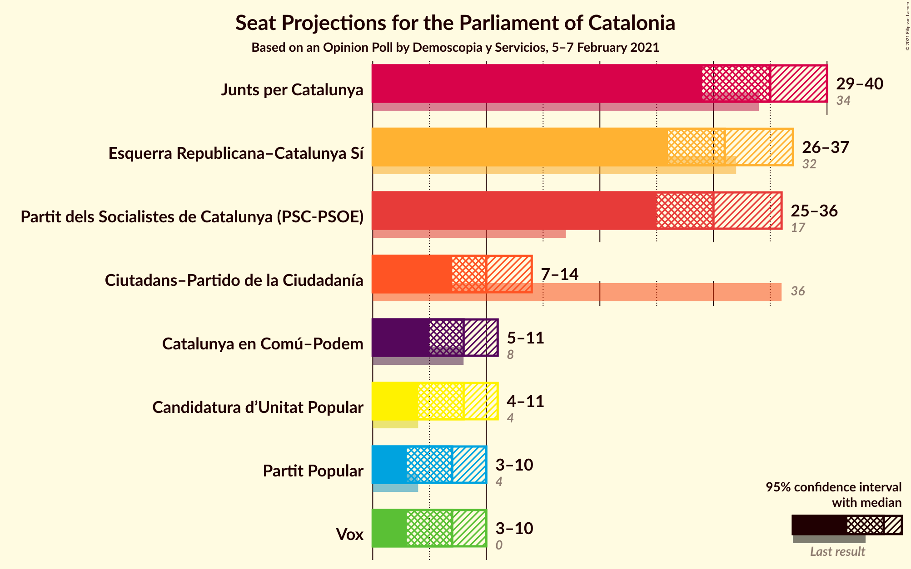

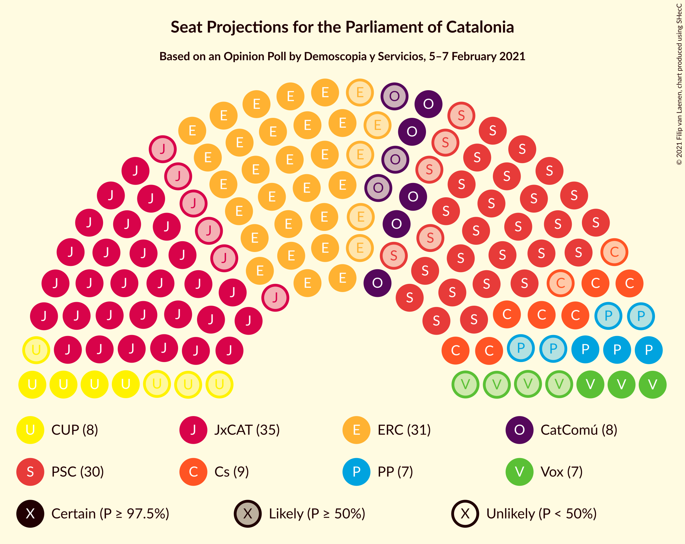

### Confidence Intervals

| Party | Last Result | Median | 80% Confidence Interval | 90% Confidence Interval | 95% Confidence Interval | 99% Confidence Interval |
|:-----:|:-----------:|:------:|:-----------------------:|:-----------------------:|:-----------------------:|:-----------------------:|
| <a href="#partit-dels-socialistes-de-catalunya-(psc-psoe)">Partit dels Socialistes de Catalunya (PSC-PSOE)</a> | 17 | 30 | 27–34 |26–35 |25–36 |24–37 |
| <a href="#junts-per-catalunya">Junts per Catalunya</a> | 34 | 35 | 31–38 |30–39 |29–40 |27–42 |
| <a href="#esquerra-republicana–catalunya-sí">Esquerra Republicana–Catalunya Sí</a> | 32 | 31 | 28–35 |27–36 |26–37 |24–39 |
| <a href="#ciutadans–partido-de-la-ciudadanía">Ciutadans–Partido de la Ciudadanía</a> | 36 | 10 | 8–13 |8–13 |7–14 |6–16 |
| <a href="#catalunya-en-comú–podem">Catalunya en Comú–Podem</a> | 8 | 8 | 6–10 |5–11 |5–11 |4–13 |
| <a href="#candidatura-d’unitat-popular">Candidatura d’Unitat Popular</a> | 4 | 8 | 5–9 |4–10 |4–11 |3–11 |
| <a href="#vox">Vox</a> | 0 | 7 | 5–9 |5–10 |3–10 |3–12 |
| <a href="#partit-popular">Partit Popular</a> | 4 | 7 | 5–9 |3–9 |3–10 |3–11 |

### Partit dels Socialistes de Catalunya (PSC-PSOE)

*For a full overview of the results for this party, see the [Partit dels Socialistes de Catalunya (PSC-PSOE)](party-partitdelssocialistesdecatalunyapsc-psoe.html) page.*

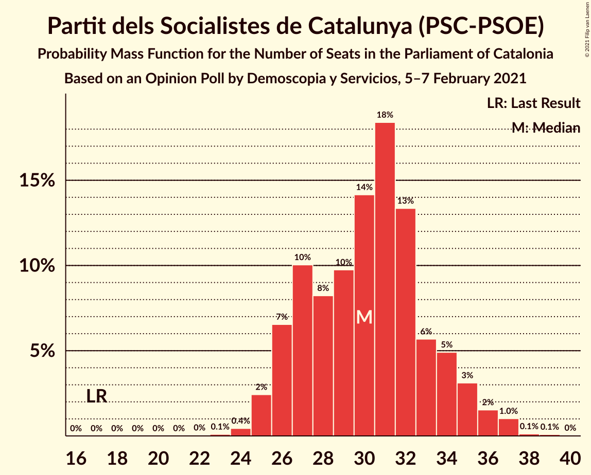

| Number of Seats | Probability | Accumulated | Special Marks |
|:---------------:|:-----------:|:-----------:|:-------------:|
| 17 | 0% | 100% | Last Result |
| 18 | 0% | 100% |  |
| 19 | 0% | 100% |  |
| 20 | 0% | 100% |  |
| 21 | 0% | 100% |  |
| 22 | 0% | 100% |  |
| 23 | 0.1% | 99.9% |  |
| 24 | 0.4% | 99.8% |  |
| 25 | 2% | 99.4% |  |
| 26 | 7% | 97% |  |
| 27 | 10% | 90% |  |
| 28 | 8% | 80% |  |
| 29 | 10% | 72% |  |
| 30 | 14% | 62% | Median |
| 31 | 18% | 48% |  |
| 32 | 13% | 30% |  |
| 33 | 6% | 17% |  |
| 34 | 5% | 11% |  |
| 35 | 3% | 6% |  |
| 36 | 2% | 3% |  |
| 37 | 1.0% | 1.3% |  |
| 38 | 0.1% | 0.2% |  |
| 39 | 0.1% | 0.1% |  |
| 40 | 0% | 0% |  |

### Junts per Catalunya

*For a full overview of the results for this party, see the [Junts per Catalunya](party-juntspercatalunya.html) page.*

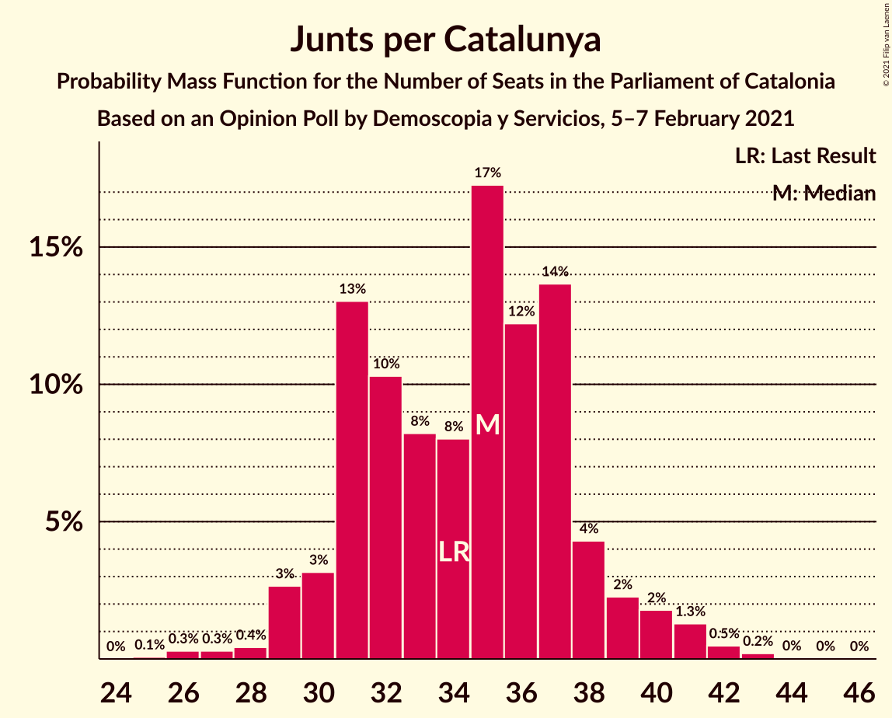

| Number of Seats | Probability | Accumulated | Special Marks |
|:---------------:|:-----------:|:-----------:|:-------------:|
| 25 | 0.1% | 100% |  |
| 26 | 0.3% | 99.9% |  |
| 27 | 0.3% | 99.6% |  |
| 28 | 0.4% | 99.3% |  |
| 29 | 3% | 98.9% |  |
| 30 | 3% | 96% |  |
| 31 | 13% | 93% |  |
| 32 | 10% | 80% |  |
| 33 | 8% | 70% |  |
| 34 | 8% | 62% | Last Result |
| 35 | 17% | 54% | Median |
| 36 | 12% | 36% |  |
| 37 | 14% | 24% |  |
| 38 | 4% | 10% |  |
| 39 | 2% | 6% |  |
| 40 | 2% | 4% |  |
| 41 | 1.3% | 2% |  |
| 42 | 0.5% | 0.8% |  |
| 43 | 0.2% | 0.3% |  |
| 44 | 0% | 0.1% |  |
| 45 | 0% | 0% |  |

### Esquerra Republicana–Catalunya Sí

*For a full overview of the results for this party, see the [Esquerra Republicana–Catalunya Sí](party-esquerrarepublicana–catalunyasí.html) page.*

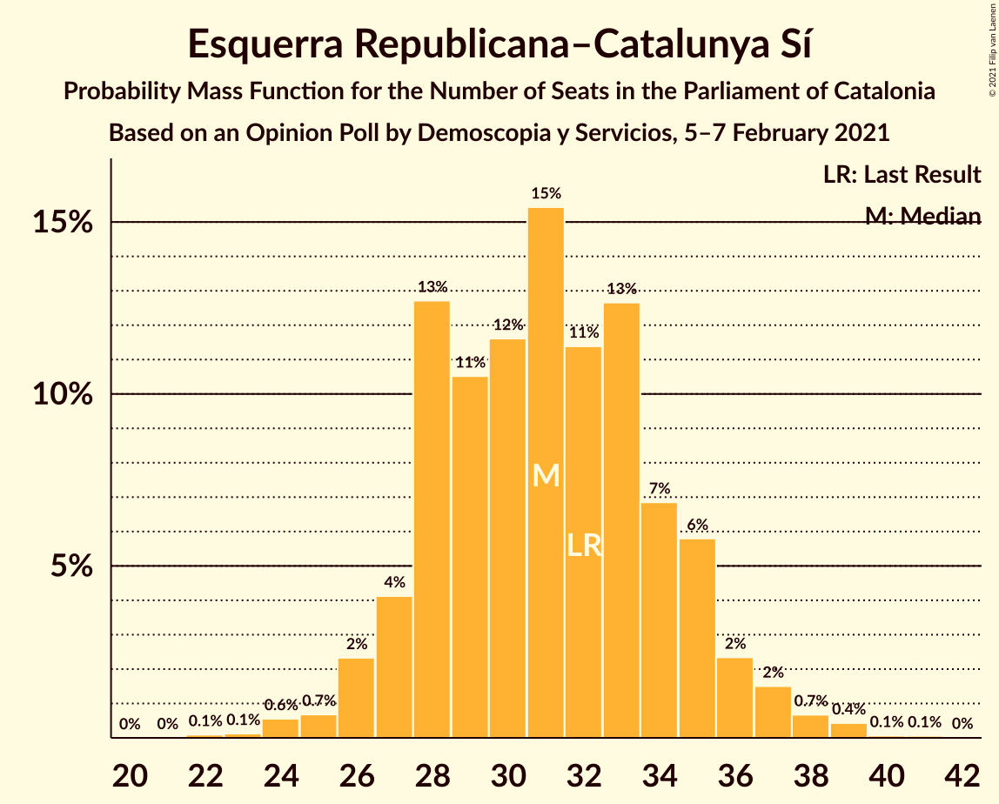

| Number of Seats | Probability | Accumulated | Special Marks |
|:---------------:|:-----------:|:-----------:|:-------------:|
| 22 | 0.1% | 100% |  |
| 23 | 0.1% | 99.9% |  |
| 24 | 0.6% | 99.8% |  |
| 25 | 0.7% | 99.2% |  |
| 26 | 2% | 98.5% |  |
| 27 | 4% | 96% |  |
| 28 | 13% | 92% |  |
| 29 | 11% | 79% |  |
| 30 | 12% | 69% |  |
| 31 | 15% | 57% | Median |
| 32 | 11% | 42% | Last Result |
| 33 | 13% | 30% |  |
| 34 | 7% | 18% |  |
| 35 | 6% | 11% |  |
| 36 | 2% | 5% |  |
| 37 | 2% | 3% |  |
| 38 | 0.7% | 1.3% |  |
| 39 | 0.4% | 0.6% |  |
| 40 | 0.1% | 0.1% |  |
| 41 | 0.1% | 0.1% |  |
| 42 | 0% | 0% |  |

### Ciutadans–Partido de la Ciudadanía

*For a full overview of the results for this party, see the [Ciutadans–Partido de la Ciudadanía](party-ciutadans–partidodelaciudadanía.html) page.*

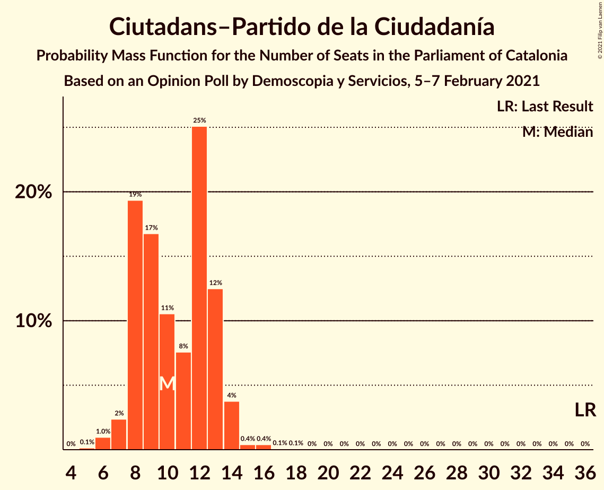

| Number of Seats | Probability | Accumulated | Special Marks |
|:---------------:|:-----------:|:-----------:|:-------------:|
| 5 | 0.1% | 100% |  |
| 6 | 1.0% | 99.9% |  |
| 7 | 2% | 98.9% |  |
| 8 | 19% | 97% |  |
| 9 | 17% | 77% |  |
| 10 | 11% | 60% | Median |
| 11 | 8% | 50% |  |
| 12 | 25% | 42% |  |
| 13 | 12% | 17% |  |
| 14 | 4% | 5% |  |
| 15 | 0.4% | 0.9% |  |
| 16 | 0.4% | 0.5% |  |
| 17 | 0.1% | 0.1% |  |
| 18 | 0.1% | 0.1% |  |
| 19 | 0% | 0% |  |
| 20 | 0% | 0% |  |
| 21 | 0% | 0% |  |
| 22 | 0% | 0% |  |
| 23 | 0% | 0% |  |
| 24 | 0% | 0% |  |
| 25 | 0% | 0% |  |
| 26 | 0% | 0% |  |
| 27 | 0% | 0% |  |
| 28 | 0% | 0% |  |
| 29 | 0% | 0% |  |
| 30 | 0% | 0% |  |
| 31 | 0% | 0% |  |
| 32 | 0% | 0% |  |
| 33 | 0% | 0% |  |
| 34 | 0% | 0% |  |
| 35 | 0% | 0% |  |
| 36 | 0% | 0% | Last Result |

### Catalunya en Comú–Podem

*For a full overview of the results for this party, see the [Catalunya en Comú–Podem](party-catalunyaencomú–podem.html) page.*

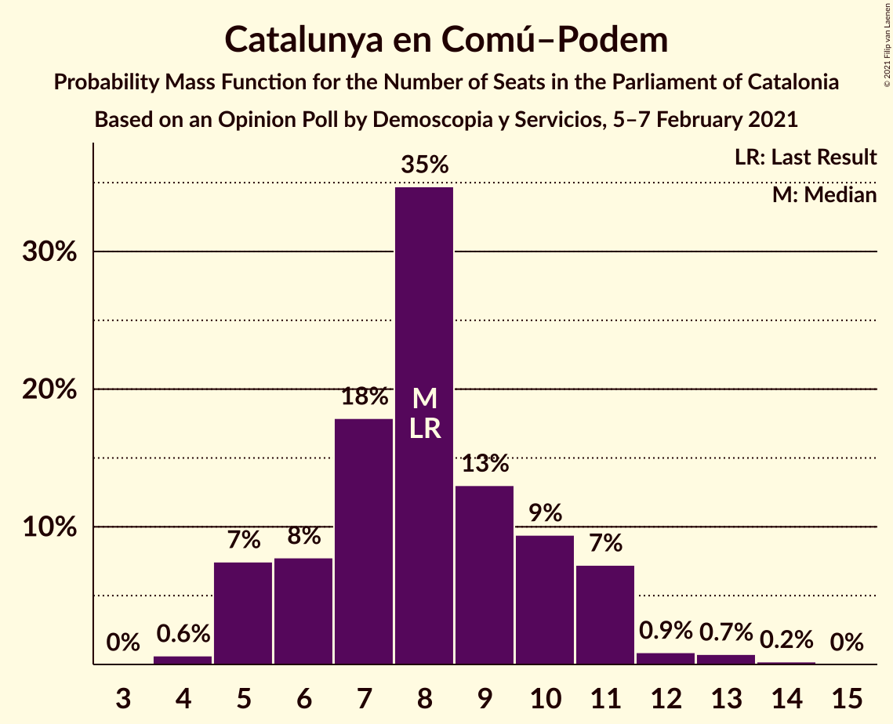

| Number of Seats | Probability | Accumulated | Special Marks |
|:---------------:|:-----------:|:-----------:|:-------------:|
| 4 | 0.6% | 100% |  |
| 5 | 7% | 99.3% |  |
| 6 | 8% | 92% |  |
| 7 | 18% | 84% |  |
| 8 | 35% | 66% | Last Result, Median |
| 9 | 13% | 32% |  |
| 10 | 9% | 18% |  |
| 11 | 7% | 9% |  |
| 12 | 0.9% | 2% |  |
| 13 | 0.7% | 1.0% |  |
| 14 | 0.2% | 0.2% |  |
| 15 | 0% | 0% |  |

### Candidatura d’Unitat Popular

*For a full overview of the results for this party, see the [Candidatura d’Unitat Popular](party-candidaturad’unitatpopular.html) page.*

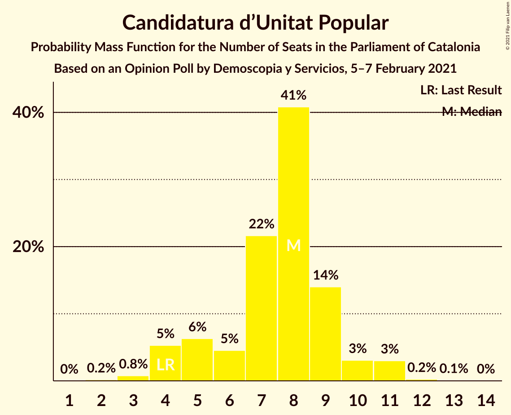

| Number of Seats | Probability | Accumulated | Special Marks |
|:---------------:|:-----------:|:-----------:|:-------------:|
| 2 | 0.2% | 100% |  |
| 3 | 0.8% | 99.8% |  |
| 4 | 5% | 99.0% | Last Result |
| 5 | 6% | 94% |  |
| 6 | 5% | 87% |  |
| 7 | 22% | 83% |  |
| 8 | 41% | 61% | Median |
| 9 | 14% | 20% |  |
| 10 | 3% | 6% |  |
| 11 | 3% | 3% |  |
| 12 | 0.2% | 0.4% |  |
| 13 | 0.1% | 0.1% |  |
| 14 | 0% | 0% |  |

### Vox

*For a full overview of the results for this party, see the [Vox](party-vox.html) page.*

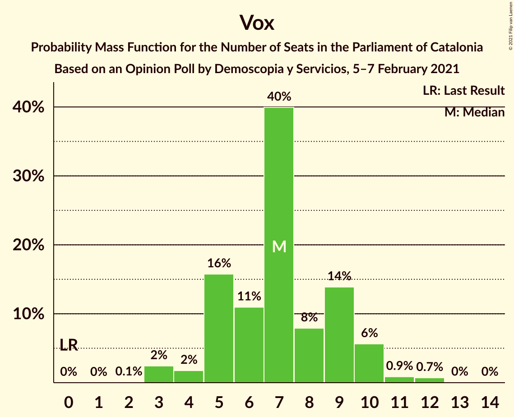

| Number of Seats | Probability | Accumulated | Special Marks |
|:---------------:|:-----------:|:-----------:|:-------------:|
| 0 | 0% | 100% | Last Result |
| 1 | 0% | 100% |  |
| 2 | 0.1% | 100% |  |
| 3 | 2% | 99.9% |  |
| 4 | 2% | 97% |  |
| 5 | 16% | 96% |  |
| 6 | 11% | 80% |  |
| 7 | 40% | 69% | Median |
| 8 | 8% | 29% |  |
| 9 | 14% | 21% |  |
| 10 | 6% | 7% |  |
| 11 | 0.9% | 2% |  |
| 12 | 0.7% | 0.8% |  |
| 13 | 0% | 0.1% |  |
| 14 | 0% | 0% |  |

### Partit Popular

*For a full overview of the results for this party, see the [Partit Popular](party-partitpopular.html) page.*

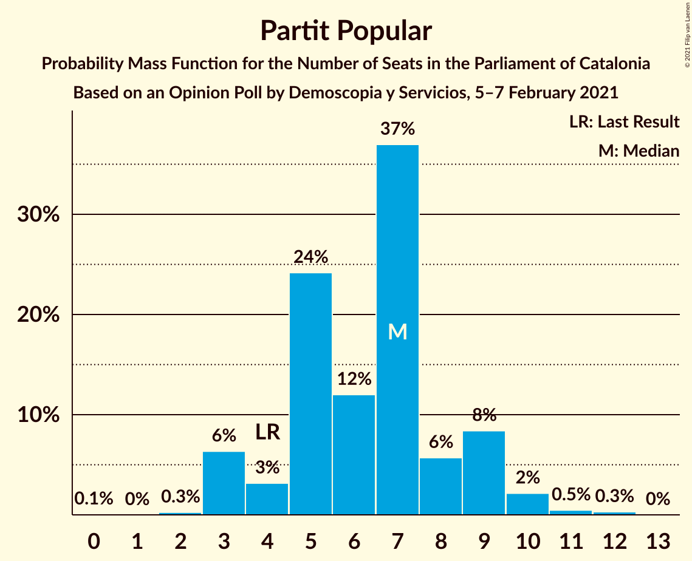

| Number of Seats | Probability | Accumulated | Special Marks |
|:---------------:|:-----------:|:-----------:|:-------------:|
| 0 | 0.1% | 100% |  |
| 1 | 0% | 99.9% |  |
| 2 | 0.3% | 99.9% |  |
| 3 | 6% | 99.7% |  |
| 4 | 3% | 93% | Last Result |
| 5 | 24% | 90% |  |
| 6 | 12% | 66% |  |
| 7 | 37% | 54% | Median |
| 8 | 6% | 17% |  |
| 9 | 8% | 11% |  |
| 10 | 2% | 3% |  |
| 11 | 0.5% | 0.8% |  |
| 12 | 0.3% | 0.3% |  |
| 13 | 0% | 0% |  |

## Coalitions

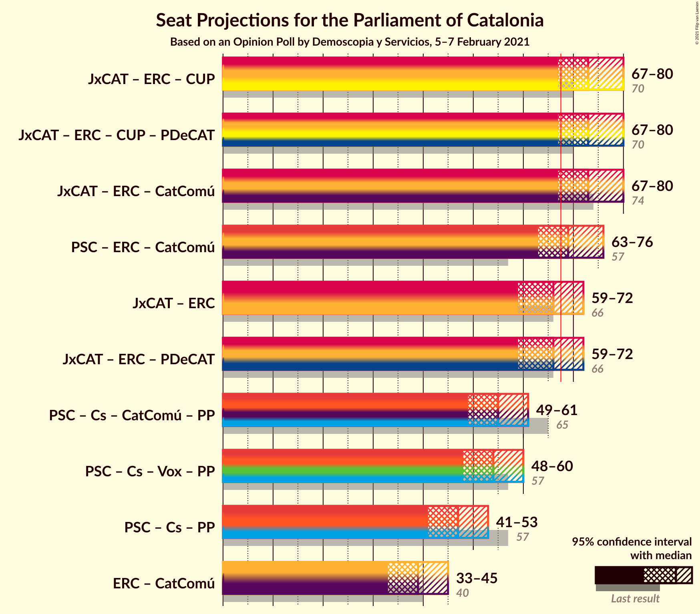

### Confidence Intervals

| Coalition | Last Result | Median | Majority? | 80% Confidence Interval | 90% Confidence Interval | 95% Confidence Interval | 99% Confidence Interval |
|:---------:|:-----------:|:------:|:---------:|:-----------------------:|:-----------------------:|:-----------------------:|:-----------------------:|
| Junts per Catalunya – Esquerra Republicana–Catalunya Sí – Candidatura d’Unitat Popular | 70 | 73 | 96% | 69–77 | 68–78 | 67–80 | 64–82 |
| Junts per Catalunya – Esquerra Republicana–Catalunya Sí – Catalunya en Comú–Podem | 74 | 73 | 96% | 69–78 | 68–79 | 67–80 | 65–82 |
| Partit dels Socialistes de Catalunya (PSC-PSOE) – Esquerra Republicana–Catalunya Sí – Catalunya en Comú–Podem | 57 | 69 | 67% | 65–74 | 64–75 | 63–76 | 61–78 |
| Junts per Catalunya – Esquerra Republicana–Catalunya Sí | 66 | 66 | 28% | 61–69 | 60–71 | 59–72 | 57–74 |
| Partit dels Socialistes de Catalunya (PSC-PSOE) – Ciutadans–Partido de la Ciudadanía – Catalunya en Comú–Podem – Partit Popular | 65 | 55 | 0% | 51–59 | 50–61 | 49–61 | 47–64 |
| Partit dels Socialistes de Catalunya (PSC-PSOE) – Ciutadans–Partido de la Ciudadanía – Vox – Partit Popular | 57 | 54 | 0% | 50–58 | 49–59 | 48–60 | 45–62 |
| Partit dels Socialistes de Catalunya (PSC-PSOE) – Ciutadans–Partido de la Ciudadanía – Partit Popular | 57 | 47 | 0% | 43–51 | 42–52 | 41–53 | 39–55 |
| Esquerra Republicana–Catalunya Sí – Catalunya en Comú–Podem | 40 | 39 | 0% | 35–43 | 35–44 | 33–45 | 31–47 |

### Junts per Catalunya – Esquerra Republicana–Catalunya Sí – Candidatura d’Unitat Popular

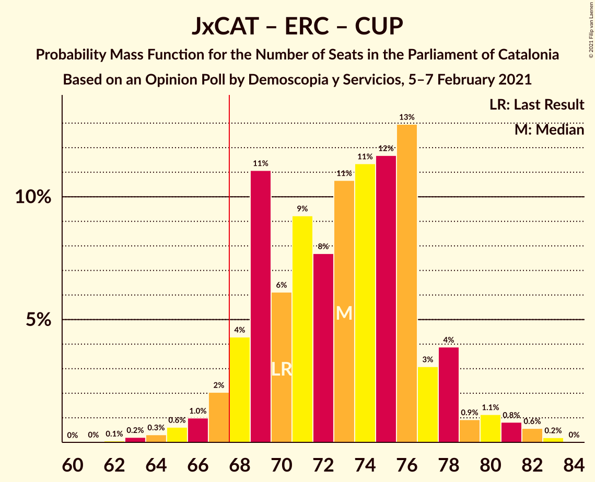

| Number of Seats | Probability | Accumulated | Special Marks |
|:---------------:|:-----------:|:-----------:|:-------------:|
| 62 | 0.1% | 100% |  |
| 63 | 0.2% | 99.9% |  |
| 64 | 0.3% | 99.7% |  |
| 65 | 0.6% | 99.4% |  |
| 66 | 1.0% | 98.8% |  |
| 67 | 2% | 98% |  |
| 68 | 4% | 96% | Majority |
| 69 | 11% | 91% |  |
| 70 | 6% | 80% | Last Result |
| 71 | 9% | 74% |  |
| 72 | 8% | 65% |  |
| 73 | 11% | 57% |  |
| 74 | 11% | 47% | Median |
| 75 | 12% | 35% |  |
| 76 | 13% | 24% |  |
| 77 | 3% | 11% |  |
| 78 | 4% | 8% |  |
| 79 | 0.9% | 4% |  |
| 80 | 1.1% | 3% |  |
| 81 | 0.8% | 2% |  |
| 82 | 0.6% | 0.8% |  |
| 83 | 0.2% | 0.2% |  |
| 84 | 0% | 0% |  |

### Junts per Catalunya – Esquerra Republicana–Catalunya Sí – Catalunya en Comú–Podem

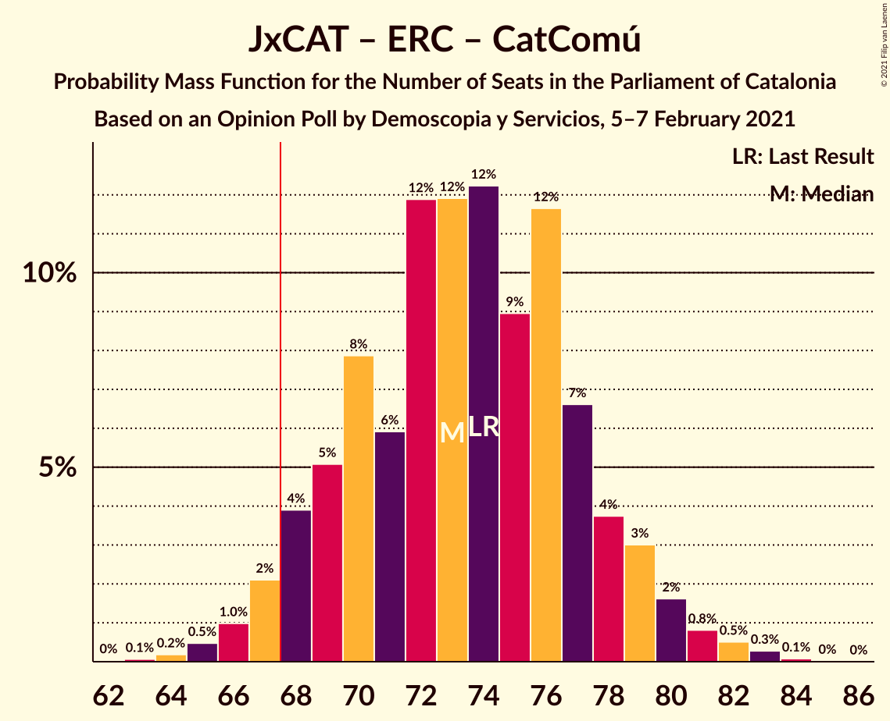

| Number of Seats | Probability | Accumulated | Special Marks |
|:---------------:|:-----------:|:-----------:|:-------------:|
| 63 | 0.1% | 100% |  |
| 64 | 0.2% | 99.9% |  |
| 65 | 0.5% | 99.7% |  |
| 66 | 1.0% | 99.2% |  |
| 67 | 2% | 98% |  |
| 68 | 4% | 96% | Majority |
| 69 | 5% | 92% |  |
| 70 | 8% | 87% |  |
| 71 | 6% | 79% |  |
| 72 | 12% | 73% |  |
| 73 | 12% | 61% |  |
| 74 | 12% | 50% | Last Result, Median |
| 75 | 9% | 37% |  |
| 76 | 12% | 28% |  |
| 77 | 7% | 17% |  |
| 78 | 4% | 10% |  |
| 79 | 3% | 6% |  |
| 80 | 2% | 3% |  |
| 81 | 0.8% | 2% |  |
| 82 | 0.5% | 0.9% |  |
| 83 | 0.3% | 0.4% |  |
| 84 | 0.1% | 0.1% |  |
| 85 | 0% | 0% |  |

### Partit dels Socialistes de Catalunya (PSC-PSOE) – Esquerra Republicana–Catalunya Sí – Catalunya en Comú–Podem

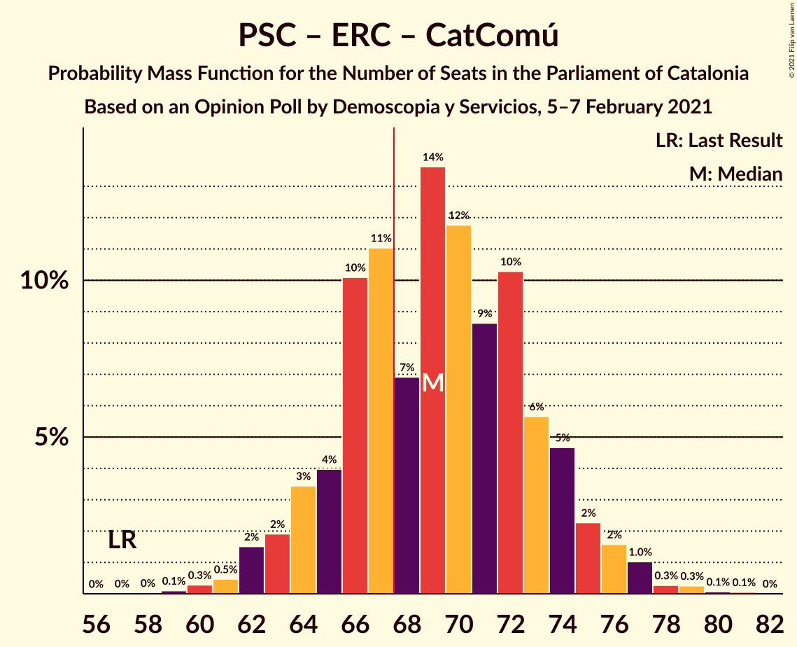

| Number of Seats | Probability | Accumulated | Special Marks |
|:---------------:|:-----------:|:-----------:|:-------------:|
| 57 | 0% | 100% | Last Result |
| 58 | 0% | 100% |  |
| 59 | 0.1% | 100% |  |
| 60 | 0.3% | 99.8% |  |
| 61 | 0.5% | 99.6% |  |
| 62 | 2% | 99.1% |  |
| 63 | 2% | 98% |  |
| 64 | 3% | 96% |  |
| 65 | 4% | 92% |  |
| 66 | 10% | 88% |  |
| 67 | 11% | 78% |  |
| 68 | 7% | 67% | Majority |
| 69 | 14% | 60% | Median |
| 70 | 12% | 47% |  |
| 71 | 9% | 35% |  |
| 72 | 10% | 26% |  |
| 73 | 6% | 16% |  |
| 74 | 5% | 10% |  |
| 75 | 2% | 6% |  |
| 76 | 2% | 3% |  |
| 77 | 1.0% | 2% |  |
| 78 | 0.3% | 0.7% |  |
| 79 | 0.3% | 0.4% |  |
| 80 | 0.1% | 0.1% |  |
| 81 | 0.1% | 0.1% |  |
| 82 | 0% | 0% |  |

### Junts per Catalunya – Esquerra Republicana–Catalunya Sí

| Number of Seats | Probability | Accumulated | Special Marks |
|:---------------:|:-----------:|:-----------:|:-------------:|
| 55 | 0.1% | 100% |  |
| 56 | 0.2% | 99.9% |  |
| 57 | 0.4% | 99.7% |  |
| 58 | 1.0% | 99.2% |  |
| 59 | 2% | 98% |  |
| 60 | 5% | 97% |  |
| 61 | 6% | 92% |  |
| 62 | 7% | 86% |  |
| 63 | 7% | 79% |  |
| 64 | 11% | 72% |  |
| 65 | 11% | 61% |  |
| 66 | 9% | 50% | Last Result, Median |
| 67 | 13% | 41% |  |
| 68 | 14% | 28% | Majority |
| 69 | 5% | 14% |  |
| 70 | 3% | 9% |  |
| 71 | 2% | 6% |  |
| 72 | 1.3% | 3% |  |
| 73 | 1.0% | 2% |  |
| 74 | 0.5% | 0.9% |  |
| 75 | 0.3% | 0.4% |  |
| 76 | 0.1% | 0.1% |  |
| 77 | 0% | 0% |  |

### Partit dels Socialistes de Catalunya (PSC-PSOE) – Ciutadans–Partido de la Ciudadanía – Catalunya en Comú–Podem – Partit Popular

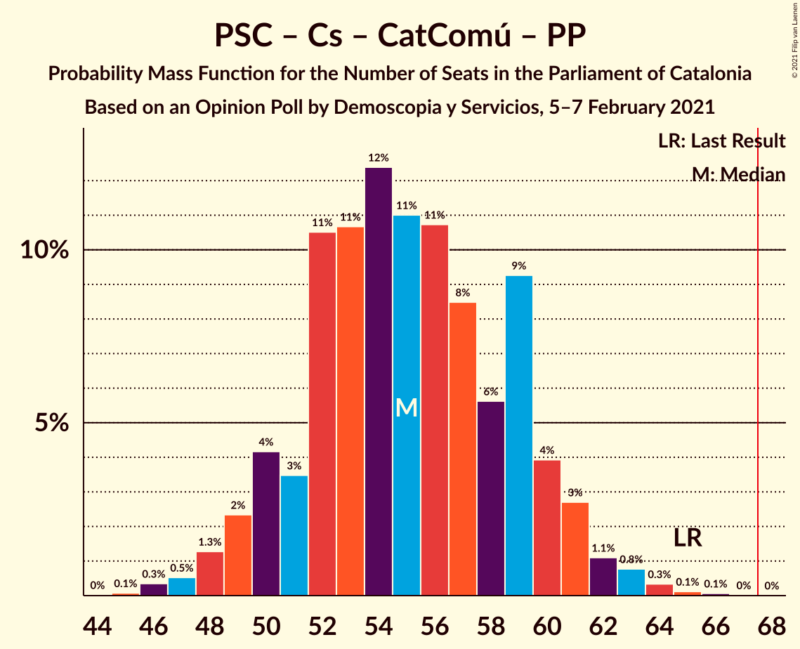

| Number of Seats | Probability | Accumulated | Special Marks |
|:---------------:|:-----------:|:-----------:|:-------------:|
| 45 | 0.1% | 100% |  |
| 46 | 0.3% | 99.9% |  |
| 47 | 0.5% | 99.5% |  |
| 48 | 1.3% | 99.0% |  |
| 49 | 2% | 98% |  |
| 50 | 4% | 95% |  |
| 51 | 3% | 91% |  |
| 52 | 11% | 88% |  |
| 53 | 11% | 77% |  |
| 54 | 12% | 67% |  |
| 55 | 11% | 54% | Median |
| 56 | 11% | 43% |  |
| 57 | 8% | 32% |  |
| 58 | 6% | 24% |  |
| 59 | 9% | 18% |  |
| 60 | 4% | 9% |  |
| 61 | 3% | 5% |  |
| 62 | 1.1% | 2% |  |
| 63 | 0.8% | 1.3% |  |
| 64 | 0.3% | 0.6% |  |
| 65 | 0.1% | 0.2% | Last Result |
| 66 | 0.1% | 0.1% |  |
| 67 | 0% | 0% |  |

### Partit dels Socialistes de Catalunya (PSC-PSOE) – Ciutadans–Partido de la Ciudadanía – Vox – Partit Popular

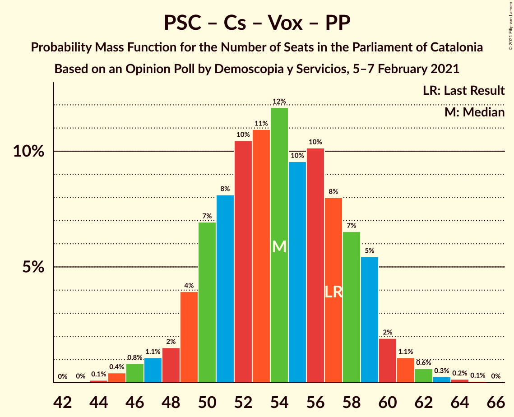

| Number of Seats | Probability | Accumulated | Special Marks |
|:---------------:|:-----------:|:-----------:|:-------------:|
| 44 | 0.1% | 100% |  |
| 45 | 0.4% | 99.9% |  |
| 46 | 0.8% | 99.4% |  |
| 47 | 1.1% | 98.6% |  |
| 48 | 2% | 98% |  |
| 49 | 4% | 96% |  |
| 50 | 7% | 92% |  |
| 51 | 8% | 85% |  |
| 52 | 10% | 77% |  |
| 53 | 11% | 67% |  |
| 54 | 12% | 56% | Median |
| 55 | 10% | 44% |  |
| 56 | 10% | 34% |  |
| 57 | 8% | 24% | Last Result |
| 58 | 7% | 16% |  |
| 59 | 5% | 10% |  |
| 60 | 2% | 4% |  |
| 61 | 1.1% | 2% |  |
| 62 | 0.6% | 1.1% |  |
| 63 | 0.3% | 0.5% |  |
| 64 | 0.2% | 0.2% |  |
| 65 | 0.1% | 0.1% |  |
| 66 | 0% | 0% |  |

### Partit dels Socialistes de Catalunya (PSC-PSOE) – Ciutadans–Partido de la Ciudadanía – Partit Popular

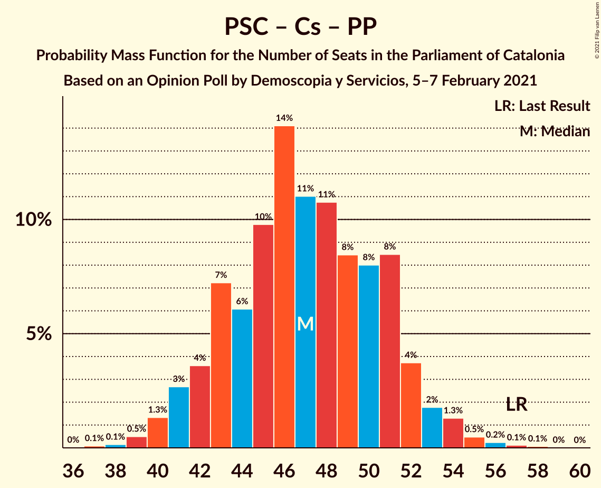

| Number of Seats | Probability | Accumulated | Special Marks |
|:---------------:|:-----------:|:-----------:|:-------------:|
| 37 | 0.1% | 100% |  |
| 38 | 0.1% | 99.9% |  |
| 39 | 0.5% | 99.7% |  |
| 40 | 1.3% | 99.2% |  |
| 41 | 3% | 98% |  |
| 42 | 4% | 95% |  |
| 43 | 7% | 92% |  |
| 44 | 6% | 84% |  |
| 45 | 10% | 78% |  |
| 46 | 14% | 69% |  |
| 47 | 11% | 54% | Median |
| 48 | 11% | 43% |  |
| 49 | 8% | 33% |  |
| 50 | 8% | 24% |  |
| 51 | 8% | 16% |  |
| 52 | 4% | 8% |  |
| 53 | 2% | 4% |  |
| 54 | 1.3% | 2% |  |
| 55 | 0.5% | 0.9% |  |
| 56 | 0.2% | 0.4% |  |
| 57 | 0.1% | 0.2% | Last Result |
| 58 | 0.1% | 0.1% |  |
| 59 | 0% | 0% |  |

### Esquerra Republicana–Catalunya Sí – Catalunya en Comú–Podem

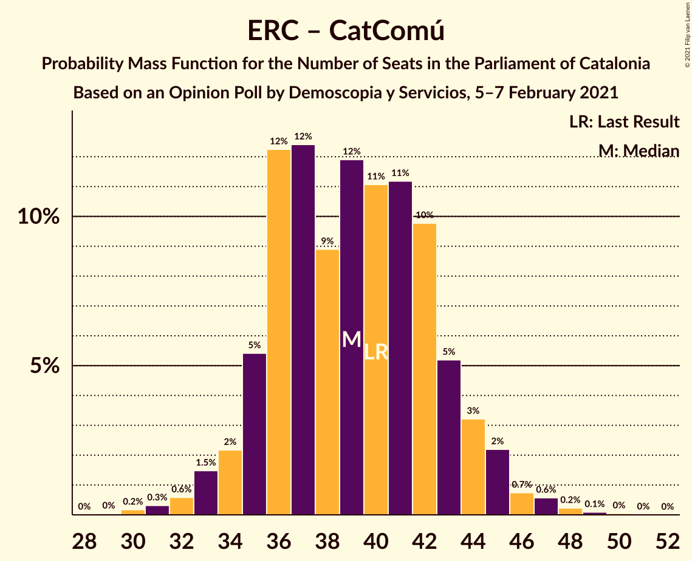

| Number of Seats | Probability | Accumulated | Special Marks |
|:---------------:|:-----------:|:-----------:|:-------------:|
| 29 | 0% | 100% |  |
| 30 | 0.2% | 99.9% |  |
| 31 | 0.3% | 99.8% |  |
| 32 | 0.6% | 99.5% |  |
| 33 | 1.5% | 98.9% |  |
| 34 | 2% | 97% |  |
| 35 | 5% | 95% |  |
| 36 | 12% | 90% |  |
| 37 | 12% | 78% |  |
| 38 | 9% | 65% |  |
| 39 | 12% | 56% | Median |
| 40 | 11% | 44% | Last Result |
| 41 | 11% | 33% |  |
| 42 | 10% | 22% |  |
| 43 | 5% | 12% |  |
| 44 | 3% | 7% |  |
| 45 | 2% | 4% |  |
| 46 | 0.7% | 2% |  |
| 47 | 0.6% | 1.0% |  |
| 48 | 0.2% | 0.4% |  |
| 49 | 0.1% | 0.2% |  |
| 50 | 0% | 0.1% |  |
| 51 | 0% | 0% |  |

## Technical Information

### Opinion Poll

+ **Polling firm:** Demoscopia y Servicios
+ **Commissioner(s):** —
+ **Fieldwork period:** 5–7 February 2021

### Calculations

+ **Sample size:** 560
+ **Simulations done:** 1,048,576
+ **Error estimate:** 3.19%

