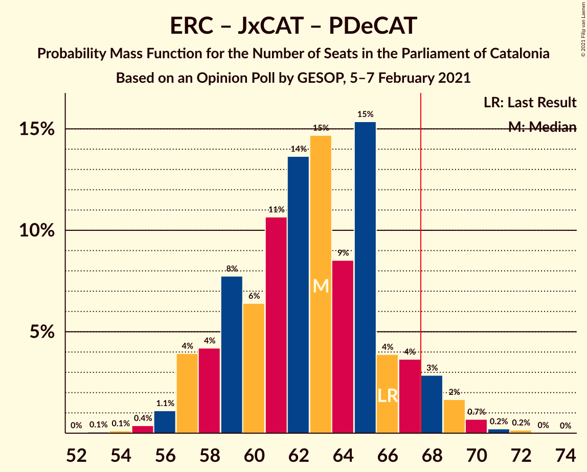

# Opinion Poll by GESOP, 5–7 February 2021

<a href="#voting-intentions">Voting Intentions</a> | <a href="#seats">Seats</a> | <a href="#coalitions">Coalitions</a> | <a href="#technical-information">Technical Information</a>

## Voting Intentions

### Confidence Intervals

| Party | Last Result | Poll Result | 80% Confidence Interval | 90% Confidence Interval | 95% Confidence Interval | 99% Confidence Interval |
|:-----:|:-----------:|:-----------:|:-----------------------:|:-----------------------:|:-----------------------:|:-----------------------:|
| Partit dels Socialistes de Catalunya (PSC-PSOE) | 13.9% | 22.6% | 20.7–24.7% |20.2–25.3% |19.7–25.8% |18.9–26.8% |
| Esquerra Republicana–Catalunya Sí | 21.4% | 20.2% | 18.4–22.2% |17.8–22.7% |17.4–23.2% |16.6–24.2% |
| Junts per Catalunya | 21.7% | 19.4% | 17.6–21.3% |17.1–21.9% |16.7–22.4% |15.9–23.3% |
| Vox | 0.0% | 7.3% | 6.2–8.7% |5.9–9.1% |5.6–9.4% |5.2–10.1% |
| Ciutadans–Partido de la Ciudadanía | 25.4% | 7.2% | 6.1–8.5% |5.8–8.9% |5.5–9.3% |5.0–10.0% |
| Catalunya en Comú–Podem | 7.5% | 7.2% | 6.1–8.5% |5.8–8.9% |5.5–9.3% |5.0–10.0% |
| Candidatura d’Unitat Popular | 4.5% | 6.8% | 5.7–8.1% |5.4–8.5% |5.2–8.8% |4.7–9.5% |
| Partit Popular | 4.2% | 4.3% | 3.5–5.5% |3.3–5.8% |3.1–6.1% |2.7–6.6% |
| Partit Demòcrata Europeu Català | 0.0% | 1.8% | 1.3–2.6% |1.1–2.8% |1.0–3.0% |0.8–3.4% |

*Note:* The poll result column reflects the actual value used in the calculations. Published results may vary slightly, and in addition be rounded to fewer digits.

## Seats

### Confidence Intervals

| Party | Last Result | Median | 80% Confidence Interval | 90% Confidence Interval | 95% Confidence Interval | 99% Confidence Interval |
|:-----:|:-----------:|:------:|:-----------------------:|:-----------------------:|:-----------------------:|:-----------------------:|
| <a href="#partit-dels-socialistes-de-catalunya-(psc-psoe)">Partit dels Socialistes de Catalunya (PSC-PSOE)</a> | 17 | 32 | 28–35 |27–36 |27–37 |26–38 |
| <a href="#esquerra-republicana–catalunya-sí">Esquerra Republicana–Catalunya Sí</a> | 32 | 31 | 28–34 |27–35 |26–36 |25–38 |
| <a href="#junts-per-catalunya">Junts per Catalunya</a> | 34 | 31 | 29–35 |27–36 |26–37 |25–38 |
| <a href="#vox">Vox</a> | 0 | 10 | 8–12 |7–12 |7–13 |6–14 |
| <a href="#ciutadans–partido-de-la-ciudadanía">Ciutadans–Partido de la Ciudadanía</a> | 36 | 9 | 7–12 |7–12 |6–12 |5–13 |
| <a href="#catalunya-en-comú–podem">Catalunya en Comú–Podem</a> | 8 | 8 | 7–10 |5–11 |5–11 |5–13 |
| <a href="#candidatura-d’unitat-popular">Candidatura d’Unitat Popular</a> | 4 | 9 | 8–11 |7–11 |7–11 |6–14 |
| <a href="#partit-popular">Partit Popular</a> | 4 | 5 | 3–7 |3–7 |2–7 |0–9 |
| <a href="#partit-demòcrata-europeu-català">Partit Demòcrata Europeu Català</a> | 0 | 0 | 0 |0–1 |0–1 |0–4 |

### Partit dels Socialistes de Catalunya (PSC-PSOE)

*For a full overview of the results for this party, see the [Partit dels Socialistes de Catalunya (PSC-PSOE)](party-partitdelssocialistesdecatalunyapsc-psoe.html) page.*

| Number of Seats | Probability | Accumulated | Special Marks |
|:---------------:|:-----------:|:-----------:|:-------------:|
| 17 | 0% | 100% | Last Result |
| 18 | 0% | 100% |  |
| 19 | 0% | 100% |  |
| 20 | 0% | 100% |  |
| 21 | 0% | 100% |  |
| 22 | 0% | 100% |  |
| 23 | 0% | 100% |  |
| 24 | 0% | 100% |  |
| 25 | 0.3% | 100% |  |
| 26 | 2% | 99.7% |  |
| 27 | 6% | 98% |  |
| 28 | 3% | 92% |  |
| 29 | 10% | 89% |  |
| 30 | 6% | 78% |  |
| 31 | 22% | 72% |  |
| 32 | 16% | 51% | Median |
| 33 | 12% | 35% |  |
| 34 | 9% | 23% |  |
| 35 | 9% | 14% |  |
| 36 | 3% | 5% |  |
| 37 | 2% | 3% |  |
| 38 | 0.4% | 0.6% |  |
| 39 | 0.2% | 0.2% |  |
| 40 | 0% | 0% |  |

### Esquerra Republicana–Catalunya Sí

*For a full overview of the results for this party, see the [Esquerra Republicana–Catalunya Sí](party-esquerrarepublicana–catalunyasí.html) page.*

| Number of Seats | Probability | Accumulated | Special Marks |
|:---------------:|:-----------:|:-----------:|:-------------:|
| 23 | 0% | 100% |  |
| 24 | 0.2% | 99.9% |  |
| 25 | 0.5% | 99.7% |  |
| 26 | 2% | 99.3% |  |
| 27 | 4% | 97% |  |
| 28 | 14% | 93% |  |
| 29 | 13% | 79% |  |
| 30 | 12% | 66% |  |
| 31 | 8% | 54% | Median |
| 32 | 19% | 46% | Last Result |
| 33 | 9% | 26% |  |
| 34 | 8% | 17% |  |
| 35 | 4% | 9% |  |
| 36 | 4% | 5% |  |
| 37 | 0.5% | 1.1% |  |
| 38 | 0.4% | 0.6% |  |
| 39 | 0.1% | 0.2% |  |
| 40 | 0% | 0% |  |

### Junts per Catalunya

*For a full overview of the results for this party, see the [Junts per Catalunya](party-juntspercatalunya.html) page.*

| Number of Seats | Probability | Accumulated | Special Marks |
|:---------------:|:-----------:|:-----------:|:-------------:|
| 24 | 0.2% | 100% |  |
| 25 | 0.6% | 99.8% |  |
| 26 | 2% | 99.1% |  |
| 27 | 4% | 97% |  |
| 28 | 2% | 93% |  |
| 29 | 13% | 91% |  |
| 30 | 8% | 78% |  |
| 31 | 20% | 70% | Median |
| 32 | 14% | 50% |  |
| 33 | 18% | 36% |  |
| 34 | 5% | 18% | Last Result |
| 35 | 6% | 13% |  |
| 36 | 5% | 8% |  |
| 37 | 2% | 3% |  |
| 38 | 0.5% | 0.8% |  |
| 39 | 0.2% | 0.2% |  |
| 40 | 0% | 0.1% |  |
| 41 | 0% | 0% |  |

### Vox

*For a full overview of the results for this party, see the [Vox](party-vox.html) page.*

| Number of Seats | Probability | Accumulated | Special Marks |
|:---------------:|:-----------:|:-----------:|:-------------:|
| 0 | 0% | 100% | Last Result |
| 1 | 0% | 100% |  |
| 2 | 0% | 100% |  |
| 3 | 0% | 100% |  |
| 4 | 0% | 100% |  |
| 5 | 0.1% | 100% |  |
| 6 | 0.7% | 99.9% |  |
| 7 | 9% | 99.3% |  |
| 8 | 13% | 90% |  |
| 9 | 22% | 77% |  |
| 10 | 30% | 55% | Median |
| 11 | 9% | 26% |  |
| 12 | 13% | 16% |  |
| 13 | 1.2% | 3% |  |
| 14 | 2% | 2% |  |
| 15 | 0.2% | 0.2% |  |
| 16 | 0% | 0% |  |

### Ciutadans–Partido de la Ciudadanía

*For a full overview of the results for this party, see the [Ciutadans–Partido de la Ciudadanía](party-ciutadans–partidodelaciudadanía.html) page.*

| Number of Seats | Probability | Accumulated | Special Marks |
|:---------------:|:-----------:|:-----------:|:-------------:|
| 5 | 1.1% | 100% |  |
| 6 | 4% | 98.9% |  |
| 7 | 10% | 95% |  |
| 8 | 32% | 86% |  |
| 9 | 12% | 53% | Median |
| 10 | 15% | 41% |  |
| 11 | 12% | 26% |  |
| 12 | 13% | 15% |  |
| 13 | 2% | 2% |  |
| 14 | 0.2% | 0.2% |  |
| 15 | 0% | 0% |  |
| 16 | 0% | 0% |  |
| 17 | 0% | 0% |  |
| 18 | 0% | 0% |  |
| 19 | 0% | 0% |  |
| 20 | 0% | 0% |  |
| 21 | 0% | 0% |  |
| 22 | 0% | 0% |  |
| 23 | 0% | 0% |  |
| 24 | 0% | 0% |  |
| 25 | 0% | 0% |  |
| 26 | 0% | 0% |  |
| 27 | 0% | 0% |  |
| 28 | 0% | 0% |  |
| 29 | 0% | 0% |  |
| 30 | 0% | 0% |  |
| 31 | 0% | 0% |  |
| 32 | 0% | 0% |  |
| 33 | 0% | 0% |  |
| 34 | 0% | 0% |  |
| 35 | 0% | 0% |  |
| 36 | 0% | 0% | Last Result |

### Catalunya en Comú–Podem

*For a full overview of the results for this party, see the [Catalunya en Comú–Podem](party-catalunyaencomú–podem.html) page.*

| Number of Seats | Probability | Accumulated | Special Marks |
|:---------------:|:-----------:|:-----------:|:-------------:|
| 4 | 0.2% | 100% |  |
| 5 | 5% | 99.8% |  |
| 6 | 3% | 95% |  |
| 7 | 17% | 92% |  |
| 8 | 38% | 75% | Last Result, Median |
| 9 | 22% | 37% |  |
| 10 | 9% | 16% |  |
| 11 | 5% | 7% |  |
| 12 | 0.7% | 2% |  |
| 13 | 1.3% | 1.5% |  |
| 14 | 0.1% | 0.2% |  |
| 15 | 0% | 0% |  |

### Candidatura d’Unitat Popular

*For a full overview of the results for this party, see the [Candidatura d’Unitat Popular](party-candidaturad’unitatpopular.html) page.*

| Number of Seats | Probability | Accumulated | Special Marks |
|:---------------:|:-----------:|:-----------:|:-------------:|
| 4 | 0.1% | 100% | Last Result |
| 5 | 0.1% | 99.9% |  |
| 6 | 0.4% | 99.8% |  |
| 7 | 6% | 99.4% |  |
| 8 | 30% | 94% |  |
| 9 | 40% | 64% | Median |
| 10 | 6% | 24% |  |
| 11 | 15% | 17% |  |
| 12 | 0.7% | 2% |  |
| 13 | 1.1% | 2% |  |
| 14 | 0.3% | 0.5% |  |
| 15 | 0.2% | 0.2% |  |
| 16 | 0% | 0% |  |

### Partit Popular

*For a full overview of the results for this party, see the [Partit Popular](party-partitpopular.html) page.*

| Number of Seats | Probability | Accumulated | Special Marks |
|:---------------:|:-----------:|:-----------:|:-------------:|
| 0 | 1.0% | 100% |  |
| 1 | 0% | 99.0% |  |
| 2 | 3% | 99.0% |  |
| 3 | 21% | 96% |  |
| 4 | 21% | 75% | Last Result |
| 5 | 24% | 54% | Median |
| 6 | 17% | 31% |  |
| 7 | 13% | 14% |  |
| 8 | 0.5% | 1.0% |  |
| 9 | 0.5% | 0.5% |  |
| 10 | 0% | 0% |  |

### Partit Demòcrata Europeu Català

*For a full overview of the results for this party, see the [Partit Demòcrata Europeu Català](party-partitdemòcrataeuropeucatalà.html) page.*

| Number of Seats | Probability | Accumulated | Special Marks |
|:---------------:|:-----------:|:-----------:|:-------------:|
| 0 | 93% | 100% | Last Result, Median |
| 1 | 6% | 7% |  |
| 2 | 0% | 0.6% |  |
| 3 | 0.1% | 0.6% |  |
| 4 | 0.4% | 0.5% |  |
| 5 | 0.1% | 0.2% |  |
| 6 | 0% | 0% |  |

## Coalitions

### Confidence Intervals

| Coalition | Last Result | Median | Majority? | 80% Confidence Interval | 90% Confidence Interval | 95% Confidence Interval | 99% Confidence Interval |
|:---------:|:-----------:|:------:|:---------:|:-----------------------:|:-----------------------:|:-----------------------:|:-----------------------:|
| Esquerra Republicana–Catalunya Sí – Junts per Catalunya – Candidatura d’Unitat Popular | 70 | 71 | 89% | 67–75 | 67–77 | 66–78 | 64–79 |
| Esquerra Republicana–Catalunya Sí – Junts per Catalunya – Candidatura d’Unitat Popular – Partit Demòcrata Europeu Català | 70 | 71 | 90% | 67–75 | 67–77 | 66–78 | 64–79 |
| Esquerra Republicana–Catalunya Sí – Junts per Catalunya – Catalunya en Comú–Podem | 74 | 71 | 84% | 67–74 | 66–76 | 65–77 | 63–78 |
| Partit dels Socialistes de Catalunya (PSC-PSOE) – Esquerra Republicana–Catalunya Sí – Catalunya en Comú–Podem | 57 | 71 | 86% | 67–75 | 66–76 | 65–77 | 63–79 |
| Esquerra Republicana–Catalunya Sí – Junts per Catalunya | 66 | 63 | 5% | 58–66 | 57–68 | 57–69 | 55–70 |
| Esquerra Republicana–Catalunya Sí – Junts per Catalunya – Partit Demòcrata Europeu Català | 66 | 63 | 6% | 59–66 | 57–68 | 57–69 | 55–70 |
| Partit dels Socialistes de Catalunya (PSC-PSOE) – Vox – Ciutadans–Partido de la Ciudadanía – Partit Popular | 57 | 55 | 0% | 51–59 | 50–60 | 49–61 | 47–63 |
| Partit dels Socialistes de Catalunya (PSC-PSOE) – Catalunya en Comú–Podem – Ciutadans–Partido de la Ciudadanía – Partit Popular | 65 | 54 | 0% | 49–57 | 49–59 | 48–60 | 46–61 |
| Partit dels Socialistes de Catalunya (PSC-PSOE) – Ciutadans–Partido de la Ciudadanía – Partit Popular | 57 | 46 | 0% | 41–49 | 40–50 | 40–51 | 38–53 |
| Esquerra Republicana–Catalunya Sí – Catalunya en Comú–Podem | 40 | 39 | 0% | 36–43 | 35–43 | 34–44 | 33–46 |

### Esquerra Republicana–Catalunya Sí – Junts per Catalunya – Candidatura d’Unitat Popular

| Number of Seats | Probability | Accumulated | Special Marks |
|:---------------:|:-----------:|:-----------:|:-------------:|
| 62 | 0.1% | 100% |  |
| 63 | 0.1% | 99.9% |  |
| 64 | 0.6% | 99.8% |  |
| 65 | 0.9% | 99.2% |  |
| 66 | 3% | 98% |  |
| 67 | 6% | 95% |  |
| 68 | 5% | 89% | Majority |
| 69 | 10% | 84% |  |
| 70 | 10% | 74% | Last Result |
| 71 | 17% | 64% | Median |
| 72 | 10% | 47% |  |
| 73 | 10% | 37% |  |
| 74 | 12% | 27% |  |
| 75 | 7% | 15% |  |
| 76 | 2% | 8% |  |
| 77 | 3% | 6% |  |
| 78 | 2% | 3% |  |
| 79 | 0.4% | 0.7% |  |
| 80 | 0.1% | 0.4% |  |
| 81 | 0.2% | 0.2% |  |
| 82 | 0% | 0% |  |

### Esquerra Republicana–Catalunya Sí – Junts per Catalunya – Candidatura d’Unitat Popular – Partit Demòcrata Europeu Català

| Number of Seats | Probability | Accumulated | Special Marks |
|:---------------:|:-----------:|:-----------:|:-------------:|
| 62 | 0% | 100% |  |
| 63 | 0.1% | 99.9% |  |
| 64 | 0.5% | 99.8% |  |
| 65 | 0.9% | 99.3% |  |
| 66 | 3% | 98% |  |
| 67 | 6% | 96% |  |
| 68 | 5% | 90% | Majority |
| 69 | 9% | 85% |  |
| 70 | 10% | 75% | Last Result |
| 71 | 18% | 66% | Median |
| 72 | 10% | 48% |  |
| 73 | 10% | 38% |  |
| 74 | 12% | 28% |  |
| 75 | 7% | 16% |  |
| 76 | 3% | 9% |  |
| 77 | 3% | 6% |  |
| 78 | 2% | 3% |  |
| 79 | 0.4% | 0.8% |  |
| 80 | 0.2% | 0.4% |  |
| 81 | 0.2% | 0.2% |  |
| 82 | 0% | 0% |  |

### Esquerra Republicana–Catalunya Sí – Junts per Catalunya – Catalunya en Comú–Podem

| Number of Seats | Probability | Accumulated | Special Marks |
|:---------------:|:-----------:|:-----------:|:-------------:|
| 61 | 0.1% | 100% |  |
| 62 | 0.1% | 99.9% |  |
| 63 | 0.3% | 99.8% |  |
| 64 | 0.9% | 99.5% |  |
| 65 | 3% | 98.5% |  |
| 66 | 3% | 95% |  |
| 67 | 8% | 92% |  |
| 68 | 5% | 84% | Majority |
| 69 | 12% | 79% |  |
| 70 | 15% | 67% | Median |
| 71 | 12% | 52% |  |
| 72 | 9% | 39% |  |
| 73 | 14% | 30% |  |
| 74 | 8% | 16% | Last Result |
| 75 | 2% | 8% |  |
| 76 | 2% | 6% |  |
| 77 | 3% | 4% |  |
| 78 | 0.7% | 1.2% |  |
| 79 | 0.3% | 0.5% |  |
| 80 | 0.1% | 0.2% |  |
| 81 | 0.1% | 0.1% |  |
| 82 | 0% | 0% |  |

### Partit dels Socialistes de Catalunya (PSC-PSOE) – Esquerra Republicana–Catalunya Sí – Catalunya en Comú–Podem

| Number of Seats | Probability | Accumulated | Special Marks |
|:---------------:|:-----------:|:-----------:|:-------------:|
| 57 | 0% | 100% | Last Result |
| 58 | 0% | 100% |  |
| 59 | 0% | 100% |  |
| 60 | 0% | 100% |  |
| 61 | 0% | 100% |  |
| 62 | 0.3% | 99.9% |  |
| 63 | 0.5% | 99.6% |  |
| 64 | 1.1% | 99.1% |  |
| 65 | 2% | 98% |  |
| 66 | 6% | 96% |  |
| 67 | 4% | 90% |  |
| 68 | 14% | 86% | Majority |
| 69 | 8% | 72% |  |
| 70 | 12% | 64% |  |
| 71 | 8% | 52% | Median |
| 72 | 15% | 44% |  |
| 73 | 8% | 29% |  |
| 74 | 7% | 20% |  |
| 75 | 5% | 13% |  |
| 76 | 3% | 8% |  |
| 77 | 3% | 5% |  |
| 78 | 0.6% | 1.2% |  |
| 79 | 0.5% | 0.6% |  |
| 80 | 0.1% | 0.1% |  |
| 81 | 0% | 0% |  |

### Esquerra Republicana–Catalunya Sí – Junts per Catalunya

| Number of Seats | Probability | Accumulated | Special Marks |
|:---------------:|:-----------:|:-----------:|:-------------:|
| 53 | 0.1% | 100% |  |
| 54 | 0.1% | 99.9% |  |
| 55 | 0.4% | 99.8% |  |
| 56 | 1.2% | 99.3% |  |
| 57 | 4% | 98% |  |
| 58 | 5% | 94% |  |
| 59 | 8% | 90% |  |
| 60 | 7% | 82% |  |
| 61 | 10% | 75% |  |
| 62 | 14% | 65% | Median |
| 63 | 14% | 50% |  |
| 64 | 9% | 36% |  |
| 65 | 15% | 28% |  |
| 66 | 4% | 13% | Last Result |
| 67 | 3% | 8% |  |
| 68 | 3% | 5% | Majority |
| 69 | 2% | 3% |  |
| 70 | 0.7% | 1.0% |  |
| 71 | 0.2% | 0.4% |  |
| 72 | 0.1% | 0.2% |  |
| 73 | 0% | 0% |  |

### Esquerra Republicana–Catalunya Sí – Junts per Catalunya – Partit Demòcrata Europeu Català

| Number of Seats | Probability | Accumulated | Special Marks |
|:---------------:|:-----------:|:-----------:|:-------------:|
| 53 | 0.1% | 100% |  |
| 54 | 0.1% | 99.9% |  |
| 55 | 0.4% | 99.8% |  |
| 56 | 1.1% | 99.4% |  |
| 57 | 4% | 98% |  |
| 58 | 4% | 94% |  |
| 59 | 8% | 90% |  |
| 60 | 6% | 82% |  |
| 61 | 11% | 76% |  |
| 62 | 14% | 65% | Median |
| 63 | 15% | 52% |  |
| 64 | 9% | 37% |  |
| 65 | 15% | 29% |  |
| 66 | 4% | 13% | Last Result |
| 67 | 4% | 9% |  |
| 68 | 3% | 6% | Majority |
| 69 | 2% | 3% |  |
| 70 | 0.7% | 1.1% |  |
| 71 | 0.2% | 0.4% |  |
| 72 | 0.2% | 0.2% |  |
| 73 | 0% | 0% |  |

### Partit dels Socialistes de Catalunya (PSC-PSOE) – Vox – Ciutadans–Partido de la Ciudadanía – Partit Popular

| Number of Seats | Probability | Accumulated | Special Marks |
|:---------------:|:-----------:|:-----------:|:-------------:|
| 46 | 0.2% | 100% |  |
| 47 | 0.4% | 99.7% |  |
| 48 | 0.4% | 99.4% |  |
| 49 | 3% | 99.0% |  |
| 50 | 3% | 96% |  |
| 51 | 4% | 94% |  |
| 52 | 5% | 89% |  |
| 53 | 13% | 84% |  |
| 54 | 11% | 71% |  |
| 55 | 10% | 60% |  |
| 56 | 18% | 49% | Median |
| 57 | 11% | 32% | Last Result |
| 58 | 8% | 21% |  |
| 59 | 5% | 12% |  |
| 60 | 5% | 7% |  |
| 61 | 1.4% | 3% |  |
| 62 | 0.6% | 1.2% |  |
| 63 | 0.4% | 0.6% |  |
| 64 | 0.2% | 0.2% |  |
| 65 | 0% | 0% |  |

### Partit dels Socialistes de Catalunya (PSC-PSOE) – Catalunya en Comú–Podem – Ciutadans–Partido de la Ciudadanía – Partit Popular

| Number of Seats | Probability | Accumulated | Special Marks |
|:---------------:|:-----------:|:-----------:|:-------------:|
| 44 | 0.1% | 100% |  |
| 45 | 0.1% | 99.9% |  |
| 46 | 0.4% | 99.8% |  |
| 47 | 1.2% | 99.4% |  |
| 48 | 3% | 98% |  |
| 49 | 6% | 96% |  |
| 50 | 4% | 90% |  |
| 51 | 7% | 86% |  |
| 52 | 11% | 79% |  |
| 53 | 13% | 68% |  |
| 54 | 17% | 54% | Median |
| 55 | 9% | 38% |  |
| 56 | 14% | 29% |  |
| 57 | 6% | 15% |  |
| 58 | 3% | 9% |  |
| 59 | 3% | 6% |  |
| 60 | 3% | 4% |  |
| 61 | 0.4% | 0.8% |  |
| 62 | 0.3% | 0.4% |  |
| 63 | 0.1% | 0.1% |  |
| 64 | 0% | 0% |  |
| 65 | 0% | 0% | Last Result |

### Partit dels Socialistes de Catalunya (PSC-PSOE) – Ciutadans–Partido de la Ciudadanía – Partit Popular

| Number of Seats | Probability | Accumulated | Special Marks |
|:---------------:|:-----------:|:-----------:|:-------------:|
| 36 | 0.1% | 100% |  |
| 37 | 0.1% | 99.9% |  |
| 38 | 0.4% | 99.8% |  |
| 39 | 0.9% | 99.4% |  |
| 40 | 4% | 98.5% |  |
| 41 | 5% | 94% |  |
| 42 | 5% | 89% |  |
| 43 | 8% | 84% |  |
| 44 | 12% | 77% |  |
| 45 | 10% | 65% |  |
| 46 | 22% | 55% | Median |
| 47 | 10% | 33% |  |
| 48 | 9% | 23% |  |
| 49 | 7% | 15% |  |
| 50 | 5% | 8% |  |
| 51 | 2% | 3% |  |
| 52 | 0.7% | 1.2% |  |
| 53 | 0.3% | 0.6% |  |
| 54 | 0.3% | 0.3% |  |
| 55 | 0% | 0% |  |
| 56 | 0% | 0% |  |
| 57 | 0% | 0% | Last Result |

### Esquerra Republicana–Catalunya Sí – Catalunya en Comú–Podem

| Number of Seats | Probability | Accumulated | Special Marks |
|:---------------:|:-----------:|:-----------:|:-------------:|
| 31 | 0.1% | 100% |  |
| 32 | 0.2% | 99.8% |  |
| 33 | 0.9% | 99.6% |  |
| 34 | 3% | 98.7% |  |
| 35 | 5% | 96% |  |
| 36 | 7% | 91% |  |
| 37 | 18% | 84% |  |
| 38 | 10% | 67% |  |
| 39 | 10% | 56% | Median |
| 40 | 11% | 46% | Last Result |
| 41 | 14% | 36% |  |
| 42 | 9% | 21% |  |
| 43 | 8% | 12% |  |
| 44 | 2% | 4% |  |
| 45 | 0.9% | 2% |  |
| 46 | 0.9% | 1.3% |  |
| 47 | 0.2% | 0.4% |  |
| 48 | 0.1% | 0.2% |  |
| 49 | 0% | 0.1% |  |
| 50 | 0% | 0% |  |

## Technical Information

### Opinion Poll

+ **Polling firm:** GESOP
+ **Commissioner(s):** —
+ **Fieldwork period:** 5–7 February 2021

### Calculations

+ **Sample size:** 739
+ **Simulations done:** 1,048,576
+ **Error estimate:** 2.18%

