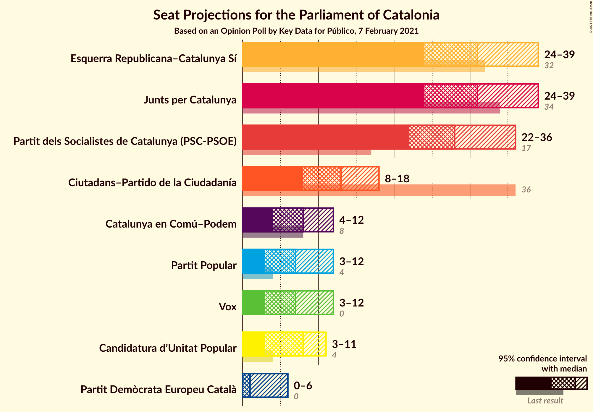
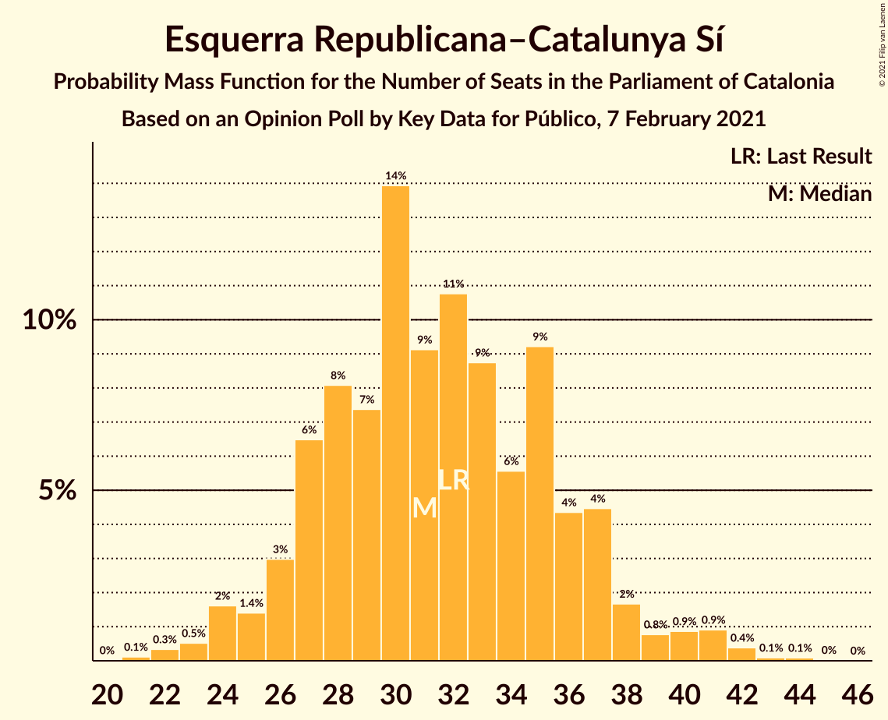
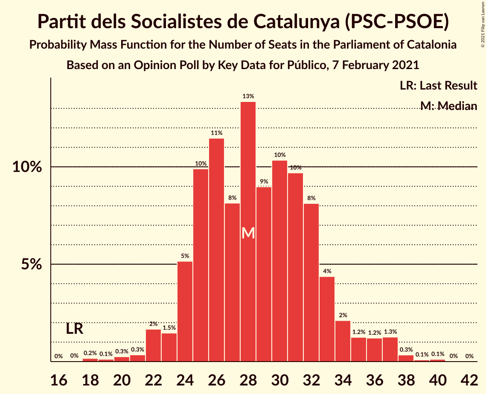
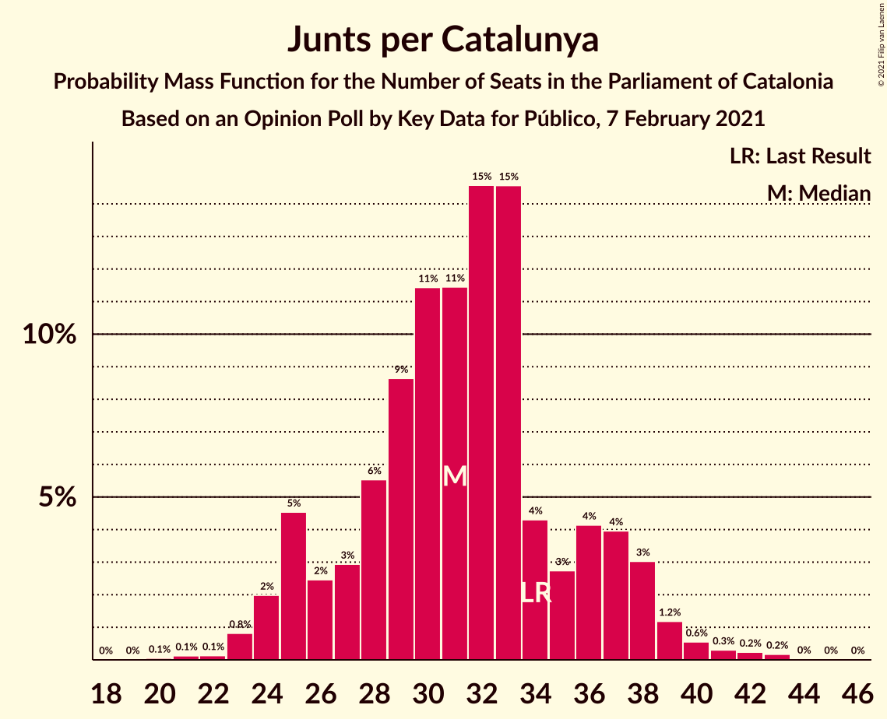
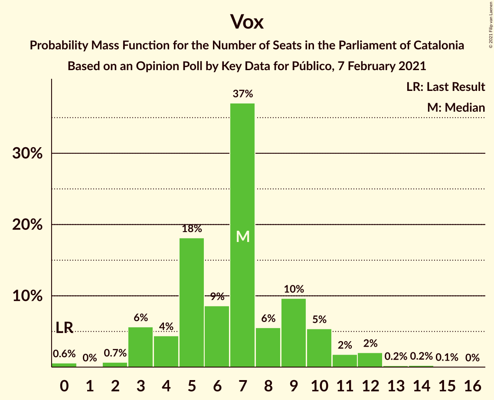
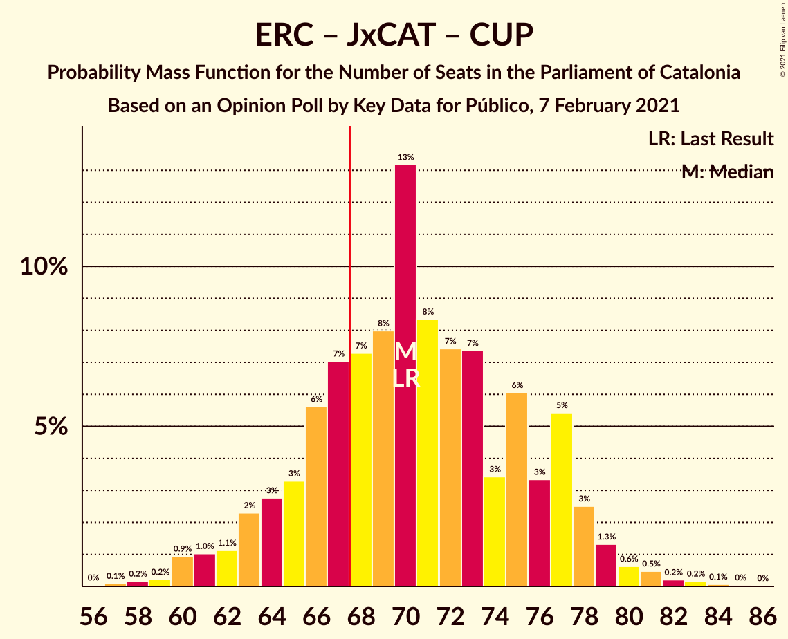
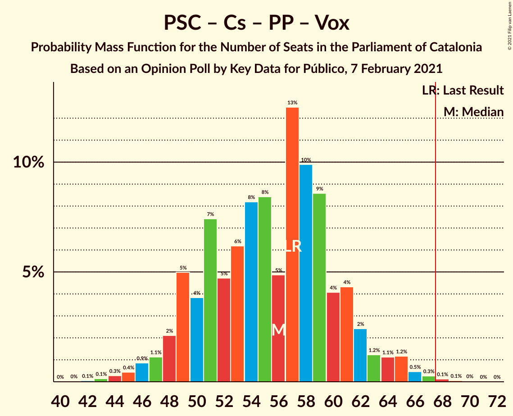

# Opinion Poll by Key Data for Público, 7 February 2021

<a href="#voting-intentions">Voting Intentions</a> | <a href="#seats">Seats</a> | <a href="#coalitions">Coalitions</a> | <a href="#technical-information">Technical Information</a>

## Voting Intentions

### Confidence Intervals

| Party | Last Result | Poll Result | 80% Confidence Interval | 90% Confidence Interval | 95% Confidence Interval | 99% Confidence Interval |
|:-----:|:-----------:|:-----------:|:-----------------------:|:-----------------------:|:-----------------------:|:-----------------------:|
| Esquerra Republicana–Catalunya Sí | 21.4% | 21.0% | 18.2–24.2% |17.5–25.1% |16.8–25.8% |15.6–27.4% |
| Partit dels Socialistes de Catalunya (PSC-PSOE) | 13.9% | 21.0% | 18.2–24.2% |17.5–25.1% |16.8–25.8% |15.6–27.4% |
| Junts per Catalunya | 21.7% | 19.7% | 17.0–22.8% |16.3–23.7% |15.6–24.5% |14.4–26.0% |
| Ciutadans–Partido de la Ciudadanía | 25.4% | 10.0% | 8.1–12.5% |7.6–13.2% |7.1–13.9% |6.3–15.2% |
| Catalunya en Comú–Podem | 7.5% | 6.8% | 5.3–9.0% |4.8–9.6% |4.5–10.2% |3.8–11.3% |
| Candidatura d’Unitat Popular | 4.5% | 5.8% | 4.4–7.9% |4.0–8.5% |3.7–9.0% |3.1–10.1% |
| Partit Popular | 4.2% | 5.5% | 4.1–7.5% |3.8–8.1% |3.5–8.6% |2.9–9.7% |
| Vox | 0.0% | 5.5% | 4.1–7.5% |3.8–8.1% |3.5–8.6% |2.9–9.7% |
| Partit Demòcrata Europeu Català | 0.0% | 2.6% | 1.8–4.1% |1.5–4.6% |1.3–5.0% |1.0–5.9% |

*Note:* The poll result column reflects the actual value used in the calculations. Published results may vary slightly, and in addition be rounded to fewer digits.

## Seats

### Confidence Intervals

| Party | Last Result | Median | 80% Confidence Interval | 90% Confidence Interval | 95% Confidence Interval | 99% Confidence Interval |
|:-----:|:-----------:|:------:|:-----------------------:|:-----------------------:|:-----------------------:|:-----------------------:|
| <a href="#esquerra-republicana–catalunya-sí">Esquerra Republicana–Catalunya Sí</a> | 32 | 31 | 27–36 |26–37 |24–38 |23–42 |
| <a href="#partit-dels-socialistes-de-catalunya-(psc-psoe)">Partit dels Socialistes de Catalunya (PSC-PSOE)</a> | 17 | 28 | 24–33 |24–34 |23–36 |20–38 |
| <a href="#junts-per-catalunya">Junts per Catalunya</a> | 34 | 32 | 27–37 |25–38 |24–38 |23–42 |
| <a href="#ciutadans–partido-de-la-ciudadanía">Ciutadans–Partido de la Ciudadanía</a> | 36 | 13 | 10–16 |9–18 |8–18 |7–20 |
| <a href="#catalunya-en-comú–podem">Catalunya en Comú–Podem</a> | 8 | 7 | 5–11 |4–11 |4–12 |3–14 |
| <a href="#candidatura-d’unitat-popular">Candidatura d’Unitat Popular</a> | 4 | 8 | 5–10 |4–11 |3–11 |0–15 |
| <a href="#partit-popular">Partit Popular</a> | 4 | 7 | 4–10 |3–10 |3–11 |0–12 |
| <a href="#vox">Vox</a> | 0 | 7 | 4–9 |3–10 |3–11 |0–13 |
| <a href="#partit-demòcrata-europeu-català">Partit Demòcrata Europeu Català</a> | 0 | 1 | 0–5 |0–6 |0–6 |0–8 |

### Esquerra Republicana–Catalunya Sí

*For a full overview of the results for this party, see the [Esquerra Republicana–Catalunya Sí](party-esquerrarepublicana–catalunyasí.html) page.*

| Number of Seats | Probability | Accumulated | Special Marks |
|:---------------:|:-----------:|:-----------:|:-------------:|
| 21 | 0.1% | 100% |  |
| 22 | 0.3% | 99.8% |  |
| 23 | 0.7% | 99.5% |  |
| 24 | 2% | 98.9% |  |
| 25 | 1.4% | 97% |  |
| 26 | 3% | 95% |  |
| 27 | 8% | 93% |  |
| 28 | 8% | 85% |  |
| 29 | 10% | 76% |  |
| 30 | 16% | 67% |  |
| 31 | 10% | 50% | Median |
| 32 | 6% | 41% | Last Result |
| 33 | 5% | 35% |  |
| 34 | 7% | 30% |  |
| 35 | 12% | 23% |  |
| 36 | 2% | 10% |  |
| 37 | 3% | 8% |  |
| 38 | 2% | 5% |  |
| 39 | 0.7% | 2% |  |
| 40 | 0.5% | 2% |  |
| 41 | 0.5% | 1.1% |  |
| 42 | 0.4% | 0.6% |  |
| 43 | 0.1% | 0.2% |  |
| 44 | 0.1% | 0.1% |  |
| 45 | 0% | 0% |  |

### Partit dels Socialistes de Catalunya (PSC-PSOE)

*For a full overview of the results for this party, see the [Partit dels Socialistes de Catalunya (PSC-PSOE)](party-partitdelssocialistesdecatalunyapsc-psoe.html) page.*

| Number of Seats | Probability | Accumulated | Special Marks |
|:---------------:|:-----------:|:-----------:|:-------------:|
| 17 | 0% | 100% | Last Result |
| 18 | 0.2% | 100% |  |
| 19 | 0.1% | 99.8% |  |
| 20 | 0.2% | 99.6% |  |
| 21 | 0.4% | 99.5% |  |
| 22 | 1.0% | 99.1% |  |
| 23 | 2% | 98% |  |
| 24 | 7% | 96% |  |
| 25 | 8% | 90% |  |
| 26 | 9% | 82% |  |
| 27 | 10% | 73% |  |
| 28 | 18% | 63% | Median |
| 29 | 7% | 46% |  |
| 30 | 8% | 39% |  |
| 31 | 10% | 31% |  |
| 32 | 9% | 21% |  |
| 33 | 6% | 12% |  |
| 34 | 1.4% | 6% |  |
| 35 | 0.9% | 5% |  |
| 36 | 1.5% | 4% |  |
| 37 | 2% | 2% |  |
| 38 | 0.4% | 0.6% |  |
| 39 | 0.1% | 0.2% |  |
| 40 | 0.1% | 0.1% |  |
| 41 | 0% | 0% |  |

### Junts per Catalunya

*For a full overview of the results for this party, see the [Junts per Catalunya](party-juntspercatalunya.html) page.*

| Number of Seats | Probability | Accumulated | Special Marks |
|:---------------:|:-----------:|:-----------:|:-------------:|
| 20 | 0.1% | 100% |  |
| 21 | 0.1% | 99.9% |  |
| 22 | 0.1% | 99.8% |  |
| 23 | 0.8% | 99.7% |  |
| 24 | 2% | 98.9% |  |
| 25 | 3% | 97% |  |
| 26 | 2% | 94% |  |
| 27 | 3% | 92% |  |
| 28 | 6% | 89% |  |
| 29 | 10% | 83% |  |
| 30 | 11% | 73% |  |
| 31 | 9% | 63% |  |
| 32 | 20% | 54% | Median |
| 33 | 11% | 34% |  |
| 34 | 4% | 23% | Last Result |
| 35 | 4% | 19% |  |
| 36 | 5% | 15% |  |
| 37 | 4% | 10% |  |
| 38 | 4% | 6% |  |
| 39 | 0.5% | 2% |  |
| 40 | 0.8% | 2% |  |
| 41 | 0.1% | 0.8% |  |
| 42 | 0.3% | 0.6% |  |
| 43 | 0.2% | 0.3% |  |
| 44 | 0% | 0.1% |  |
| 45 | 0% | 0% |  |

### Ciutadans–Partido de la Ciudadanía

*For a full overview of the results for this party, see the [Ciutadans–Partido de la Ciudadanía](party-ciutadans–partidodelaciudadanía.html) page.*

| Number of Seats | Probability | Accumulated | Special Marks |
|:---------------:|:-----------:|:-----------:|:-------------:|
| 6 | 0.3% | 100% |  |
| 7 | 0.3% | 99.7% |  |
| 8 | 3% | 99.4% |  |
| 9 | 5% | 96% |  |
| 10 | 1.5% | 91% |  |
| 11 | 5% | 90% |  |
| 12 | 21% | 85% |  |
| 13 | 21% | 64% | Median |
| 14 | 15% | 43% |  |
| 15 | 12% | 28% |  |
| 16 | 7% | 16% |  |
| 17 | 2% | 9% |  |
| 18 | 5% | 7% |  |
| 19 | 1.5% | 2% |  |
| 20 | 0.5% | 0.8% |  |
| 21 | 0.1% | 0.3% |  |
| 22 | 0.1% | 0.2% |  |
| 23 | 0% | 0.1% |  |
| 24 | 0% | 0% |  |
| 25 | 0% | 0% |  |
| 26 | 0% | 0% |  |
| 27 | 0% | 0% |  |
| 28 | 0% | 0% |  |
| 29 | 0% | 0% |  |
| 30 | 0% | 0% |  |
| 31 | 0% | 0% |  |
| 32 | 0% | 0% |  |
| 33 | 0% | 0% |  |
| 34 | 0% | 0% |  |
| 35 | 0% | 0% |  |
| 36 | 0% | 0% | Last Result |

### Catalunya en Comú–Podem

*For a full overview of the results for this party, see the [Catalunya en Comú–Podem](party-catalunyaencomú–podem.html) page.*

| Number of Seats | Probability | Accumulated | Special Marks |
|:---------------:|:-----------:|:-----------:|:-------------:|
| 3 | 0.5% | 100% |  |
| 4 | 6% | 99.5% |  |
| 5 | 22% | 93% |  |
| 6 | 7% | 71% |  |
| 7 | 16% | 64% | Median |
| 8 | 26% | 47% | Last Result |
| 9 | 5% | 21% |  |
| 10 | 6% | 16% |  |
| 11 | 7% | 10% |  |
| 12 | 2% | 4% |  |
| 13 | 0.9% | 2% |  |
| 14 | 0.6% | 0.9% |  |
| 15 | 0.1% | 0.3% |  |
| 16 | 0.1% | 0.2% |  |
| 17 | 0% | 0% |  |

### Candidatura d’Unitat Popular

*For a full overview of the results for this party, see the [Candidatura d’Unitat Popular](party-candidaturad’unitatpopular.html) page.*

| Number of Seats | Probability | Accumulated | Special Marks |
|:---------------:|:-----------:|:-----------:|:-------------:|
| 0 | 0.6% | 100% |  |
| 1 | 0% | 99.4% |  |
| 2 | 0.8% | 99.4% |  |
| 3 | 2% | 98.6% |  |
| 4 | 6% | 96% | Last Result |
| 5 | 3% | 91% |  |
| 6 | 3% | 88% |  |
| 7 | 7% | 85% |  |
| 8 | 39% | 79% | Median |
| 9 | 25% | 39% |  |
| 10 | 5% | 14% |  |
| 11 | 7% | 9% |  |
| 12 | 0.5% | 2% |  |
| 13 | 0.3% | 1.2% |  |
| 14 | 0.3% | 1.0% |  |
| 15 | 0.5% | 0.6% |  |
| 16 | 0.1% | 0.1% |  |
| 17 | 0% | 0.1% |  |
| 18 | 0% | 0% |  |

### Partit Popular

*For a full overview of the results for this party, see the [Partit Popular](party-partitpopular.html) page.*

| Number of Seats | Probability | Accumulated | Special Marks |
|:---------------:|:-----------:|:-----------:|:-------------:|
| 0 | 0.7% | 100% |  |
| 1 | 0% | 99.3% |  |
| 2 | 0.6% | 99.3% |  |
| 3 | 6% | 98.8% |  |
| 4 | 4% | 92% | Last Result |
| 5 | 15% | 88% |  |
| 6 | 16% | 74% |  |
| 7 | 31% | 58% | Median |
| 8 | 8% | 27% |  |
| 9 | 8% | 18% |  |
| 10 | 6% | 10% |  |
| 11 | 2% | 4% |  |
| 12 | 2% | 2% |  |
| 13 | 0.2% | 0.5% |  |
| 14 | 0.2% | 0.3% |  |
| 15 | 0.1% | 0.1% |  |
| 16 | 0% | 0% |  |

### Vox

*For a full overview of the results for this party, see the [Vox](party-vox.html) page.*

| Number of Seats | Probability | Accumulated | Special Marks |
|:---------------:|:-----------:|:-----------:|:-------------:|
| 0 | 0.6% | 100% | Last Result |
| 1 | 0% | 99.4% |  |
| 2 | 0.7% | 99.4% |  |
| 3 | 7% | 98.7% |  |
| 4 | 5% | 92% |  |
| 5 | 18% | 86% |  |
| 6 | 8% | 68% |  |
| 7 | 35% | 61% | Median |
| 8 | 7% | 25% |  |
| 9 | 9% | 18% |  |
| 10 | 4% | 9% |  |
| 11 | 2% | 4% |  |
| 12 | 1.3% | 2% |  |
| 13 | 0.3% | 0.7% |  |
| 14 | 0.3% | 0.4% |  |
| 15 | 0.1% | 0.1% |  |
| 16 | 0% | 0% |  |

### Partit Demòcrata Europeu Català

*For a full overview of the results for this party, see the [Partit Demòcrata Europeu Català](party-partitdemòcrataeuropeucatalà.html) page.*

| Number of Seats | Probability | Accumulated | Special Marks |
|:---------------:|:-----------:|:-----------:|:-------------:|
| 0 | 47% | 100% | Last Result |
| 1 | 23% | 53% | Median |
| 2 | 0.3% | 30% |  |
| 3 | 10% | 30% |  |
| 4 | 6% | 19% |  |
| 5 | 7% | 13% |  |
| 6 | 4% | 6% |  |
| 7 | 1.3% | 2% |  |
| 8 | 0.9% | 1.1% |  |
| 9 | 0.1% | 0.2% |  |
| 10 | 0% | 0% |  |

## Coalitions

### Confidence Intervals

| Coalition | Last Result | Median | Majority? | 80% Confidence Interval | 90% Confidence Interval | 95% Confidence Interval | 99% Confidence Interval |
|:---------:|:-----------:|:------:|:---------:|:-----------------------:|:-----------------------:|:-----------------------:|:-----------------------:|
| Esquerra Republicana–Catalunya Sí – Junts per Catalunya – Candidatura d’Unitat Popular – Partit Demòcrata Europeu Català | 70 | 73 | 88% | 67–78 | 65–80 | 64–81 | 60–84 |
| Esquerra Republicana–Catalunya Sí – Junts per Catalunya – Candidatura d’Unitat Popular | 70 | 70 | 76% | 65–77 | 64–78 | 62–79 | 59–82 |
| Esquerra Republicana–Catalunya Sí – Junts per Catalunya – Catalunya en Comú–Podem | 74 | 69 | 67% | 65–76 | 63–77 | 62–78 | 59–82 |
| Esquerra Republicana–Catalunya Sí – Partit dels Socialistes de Catalunya (PSC-PSOE) – Catalunya en Comú–Podem | 57 | 68 | 52% | 62–73 | 60–74 | 59–76 | 56–79 |
| Esquerra Republicana–Catalunya Sí – Junts per Catalunya – Partit Demòcrata Europeu Català | 66 | 65 | 24% | 59–70 | 58–72 | 56–73 | 53–75 |
| Esquerra Republicana–Catalunya Sí – Junts per Catalunya | 66 | 62 | 16% | 58–68 | 56–70 | 54–71 | 52–74 |
| Partit dels Socialistes de Catalunya (PSC-PSOE) – Ciutadans–Partido de la Ciudadanía – Catalunya en Comú–Podem – Partit Popular | 65 | 56 | 0.5% | 51–62 | 49–63 | 48–64 | 45–67 |
| Partit dels Socialistes de Catalunya (PSC-PSOE) – Ciutadans–Partido de la Ciudadanía – Partit Popular – Vox | 57 | 56 | 0.3% | 50–61 | 48–62 | 47–64 | 44–67 |
| Partit dels Socialistes de Catalunya (PSC-PSOE) – Ciutadans–Partido de la Ciudadanía – Partit Popular | 57 | 49 | 0% | 44–54 | 42–56 | 41–57 | 38–59 |
| Esquerra Republicana–Catalunya Sí – Catalunya en Comú–Podem | 40 | 38 | 0% | 34–44 | 33–45 | 32–47 | 29–50 |

### Esquerra Republicana–Catalunya Sí – Junts per Catalunya – Candidatura d’Unitat Popular – Partit Demòcrata Europeu Català

| Number of Seats | Probability | Accumulated | Special Marks |
|:---------------:|:-----------:|:-----------:|:-------------:|
| 57 | 0.1% | 100% |  |
| 58 | 0.1% | 99.9% |  |
| 59 | 0.1% | 99.8% |  |
| 60 | 0.2% | 99.7% |  |
| 61 | 0.4% | 99.5% |  |
| 62 | 0.6% | 99.1% |  |
| 63 | 0.8% | 98.5% |  |
| 64 | 1.5% | 98% |  |
| 65 | 1.5% | 96% |  |
| 66 | 3% | 95% |  |
| 67 | 4% | 91% |  |
| 68 | 12% | 88% | Majority |
| 69 | 5% | 76% |  |
| 70 | 4% | 71% | Last Result |
| 71 | 6% | 67% |  |
| 72 | 9% | 62% | Median |
| 73 | 16% | 52% |  |
| 74 | 5% | 36% |  |
| 75 | 6% | 31% |  |
| 76 | 8% | 25% |  |
| 77 | 7% | 17% |  |
| 78 | 2% | 10% |  |
| 79 | 3% | 9% |  |
| 80 | 1.4% | 5% |  |
| 81 | 2% | 4% |  |
| 82 | 0.4% | 1.3% |  |
| 83 | 0.3% | 0.8% |  |
| 84 | 0.3% | 0.5% |  |
| 85 | 0.1% | 0.2% |  |
| 86 | 0.1% | 0.1% |  |
| 87 | 0% | 0% |  |

### Esquerra Republicana–Catalunya Sí – Junts per Catalunya – Candidatura d’Unitat Popular

| Number of Seats | Probability | Accumulated | Special Marks |
|:---------------:|:-----------:|:-----------:|:-------------:|
| 56 | 0.1% | 100% |  |
| 57 | 0.1% | 99.9% |  |
| 58 | 0.1% | 99.8% |  |
| 59 | 0.3% | 99.6% |  |
| 60 | 0.6% | 99.4% |  |
| 61 | 0.9% | 98.8% |  |
| 62 | 1.2% | 98% |  |
| 63 | 1.2% | 97% |  |
| 64 | 3% | 95% |  |
| 65 | 3% | 93% |  |
| 66 | 3% | 89% |  |
| 67 | 10% | 86% |  |
| 68 | 9% | 76% | Majority |
| 69 | 4% | 67% |  |
| 70 | 13% | 63% | Last Result |
| 71 | 7% | 50% | Median |
| 72 | 8% | 42% |  |
| 73 | 7% | 34% |  |
| 74 | 3% | 27% |  |
| 75 | 8% | 23% |  |
| 76 | 5% | 16% |  |
| 77 | 6% | 11% |  |
| 78 | 3% | 6% |  |
| 79 | 0.6% | 3% |  |
| 80 | 0.6% | 2% |  |
| 81 | 0.7% | 1.4% |  |
| 82 | 0.4% | 0.7% |  |
| 83 | 0.2% | 0.4% |  |
| 84 | 0.1% | 0.2% |  |
| 85 | 0% | 0.1% |  |
| 86 | 0% | 0% |  |

### Esquerra Republicana–Catalunya Sí – Junts per Catalunya – Catalunya en Comú–Podem

| Number of Seats | Probability | Accumulated | Special Marks |
|:---------------:|:-----------:|:-----------:|:-------------:|
| 56 | 0% | 100% |  |
| 57 | 0.1% | 99.9% |  |
| 58 | 0.2% | 99.9% |  |
| 59 | 0.7% | 99.7% |  |
| 60 | 0.4% | 99.0% |  |
| 61 | 0.9% | 98.6% |  |
| 62 | 0.9% | 98% |  |
| 63 | 2% | 97% |  |
| 64 | 2% | 95% |  |
| 65 | 3% | 92% |  |
| 66 | 10% | 89% |  |
| 67 | 13% | 79% |  |
| 68 | 13% | 67% | Majority |
| 69 | 4% | 54% |  |
| 70 | 6% | 49% | Median |
| 71 | 6% | 44% |  |
| 72 | 4% | 37% |  |
| 73 | 7% | 33% |  |
| 74 | 7% | 26% | Last Result |
| 75 | 8% | 19% |  |
| 76 | 3% | 11% |  |
| 77 | 3% | 7% |  |
| 78 | 2% | 5% |  |
| 79 | 0.8% | 2% |  |
| 80 | 0.5% | 2% |  |
| 81 | 0.6% | 1.2% |  |
| 82 | 0.3% | 0.6% |  |
| 83 | 0.3% | 0.4% |  |
| 84 | 0.1% | 0.1% |  |
| 85 | 0.1% | 0.1% |  |
| 86 | 0% | 0% |  |

### Esquerra Republicana–Catalunya Sí – Partit dels Socialistes de Catalunya (PSC-PSOE) – Catalunya en Comú–Podem

| Number of Seats | Probability | Accumulated | Special Marks |
|:---------------:|:-----------:|:-----------:|:-------------:|
| 53 | 0% | 100% |  |
| 54 | 0.1% | 99.9% |  |
| 55 | 0.3% | 99.9% |  |
| 56 | 0.3% | 99.6% |  |
| 57 | 0.2% | 99.3% | Last Result |
| 58 | 0.9% | 99.1% |  |
| 59 | 1.2% | 98% |  |
| 60 | 3% | 97% |  |
| 61 | 3% | 94% |  |
| 62 | 4% | 91% |  |
| 63 | 14% | 87% |  |
| 64 | 4% | 73% |  |
| 65 | 6% | 70% |  |
| 66 | 7% | 64% | Median |
| 67 | 5% | 57% |  |
| 68 | 13% | 52% | Majority |
| 69 | 12% | 39% |  |
| 70 | 4% | 27% |  |
| 71 | 8% | 22% |  |
| 72 | 3% | 14% |  |
| 73 | 4% | 11% |  |
| 74 | 3% | 7% |  |
| 75 | 1.0% | 4% |  |
| 76 | 1.0% | 3% |  |
| 77 | 0.9% | 2% |  |
| 78 | 0.8% | 2% |  |
| 79 | 0.4% | 0.8% |  |
| 80 | 0.2% | 0.4% |  |
| 81 | 0.1% | 0.2% |  |
| 82 | 0% | 0.1% |  |
| 83 | 0% | 0% |  |

### Esquerra Republicana–Catalunya Sí – Junts per Catalunya – Partit Demòcrata Europeu Català

| Number of Seats | Probability | Accumulated | Special Marks |
|:---------------:|:-----------:|:-----------:|:-------------:|
| 51 | 0.1% | 100% |  |
| 52 | 0.2% | 99.9% |  |
| 53 | 0.5% | 99.7% |  |
| 54 | 0.6% | 99.2% |  |
| 55 | 0.6% | 98.6% |  |
| 56 | 0.8% | 98% |  |
| 57 | 0.9% | 97% |  |
| 58 | 3% | 96% |  |
| 59 | 9% | 93% |  |
| 60 | 8% | 84% |  |
| 61 | 3% | 76% |  |
| 62 | 9% | 72% |  |
| 63 | 5% | 63% |  |
| 64 | 5% | 58% | Median |
| 65 | 15% | 54% |  |
| 66 | 6% | 38% | Last Result |
| 67 | 8% | 32% |  |
| 68 | 10% | 24% | Majority |
| 69 | 3% | 14% |  |
| 70 | 3% | 11% |  |
| 71 | 2% | 8% |  |
| 72 | 1.3% | 5% |  |
| 73 | 3% | 4% |  |
| 74 | 0.7% | 2% |  |
| 75 | 0.4% | 0.9% |  |
| 76 | 0.2% | 0.4% |  |
| 77 | 0.1% | 0.2% |  |
| 78 | 0.1% | 0.2% |  |
| 79 | 0.1% | 0.1% |  |
| 80 | 0% | 0% |  |

### Esquerra Republicana–Catalunya Sí – Junts per Catalunya

| Number of Seats | Probability | Accumulated | Special Marks |
|:---------------:|:-----------:|:-----------:|:-------------:|
| 48 | 0% | 100% |  |
| 49 | 0% | 99.9% |  |
| 50 | 0.1% | 99.9% |  |
| 51 | 0.2% | 99.8% |  |
| 52 | 0.4% | 99.6% |  |
| 53 | 0.8% | 99.3% |  |
| 54 | 1.1% | 98% |  |
| 55 | 1.4% | 97% |  |
| 56 | 2% | 96% |  |
| 57 | 3% | 94% |  |
| 58 | 8% | 91% |  |
| 59 | 8% | 84% |  |
| 60 | 8% | 76% |  |
| 61 | 3% | 68% |  |
| 62 | 18% | 65% |  |
| 63 | 7% | 47% | Median |
| 64 | 6% | 40% |  |
| 65 | 8% | 34% |  |
| 66 | 4% | 26% | Last Result |
| 67 | 7% | 22% |  |
| 68 | 8% | 16% | Majority |
| 69 | 2% | 8% |  |
| 70 | 2% | 6% |  |
| 71 | 2% | 4% |  |
| 72 | 0.2% | 2% |  |
| 73 | 0.8% | 2% |  |
| 74 | 0.4% | 0.8% |  |
| 75 | 0.1% | 0.4% |  |
| 76 | 0.1% | 0.2% |  |
| 77 | 0% | 0.1% |  |
| 78 | 0% | 0.1% |  |
| 79 | 0% | 0% |  |

### Partit dels Socialistes de Catalunya (PSC-PSOE) – Ciutadans–Partido de la Ciudadanía – Catalunya en Comú–Podem – Partit Popular

| Number of Seats | Probability | Accumulated | Special Marks |
|:---------------:|:-----------:|:-----------:|:-------------:|
| 42 | 0% | 100% |  |
| 43 | 0.1% | 99.9% |  |
| 44 | 0.2% | 99.9% |  |
| 45 | 0.3% | 99.6% |  |
| 46 | 0.3% | 99.3% |  |
| 47 | 1.2% | 99.1% |  |
| 48 | 1.4% | 98% |  |
| 49 | 2% | 96% |  |
| 50 | 3% | 94% |  |
| 51 | 7% | 91% |  |
| 52 | 5% | 84% |  |
| 53 | 6% | 79% |  |
| 54 | 6% | 73% |  |
| 55 | 16% | 67% | Median |
| 56 | 9% | 51% |  |
| 57 | 6% | 42% |  |
| 58 | 6% | 36% |  |
| 59 | 7% | 30% |  |
| 60 | 9% | 23% |  |
| 61 | 2% | 14% |  |
| 62 | 5% | 12% |  |
| 63 | 4% | 7% |  |
| 64 | 1.1% | 3% |  |
| 65 | 0.8% | 2% | Last Result |
| 66 | 0.8% | 2% |  |
| 67 | 0.2% | 0.7% |  |
| 68 | 0.2% | 0.5% | Majority |
| 69 | 0.1% | 0.2% |  |
| 70 | 0% | 0.1% |  |
| 71 | 0.1% | 0.1% |  |
| 72 | 0% | 0% |  |

### Partit dels Socialistes de Catalunya (PSC-PSOE) – Ciutadans–Partido de la Ciudadanía – Partit Popular – Vox

| Number of Seats | Probability | Accumulated | Special Marks |
|:---------------:|:-----------:|:-----------:|:-------------:|
| 41 | 0% | 100% |  |
| 42 | 0.1% | 99.9% |  |
| 43 | 0.1% | 99.9% |  |
| 44 | 0.4% | 99.7% |  |
| 45 | 0.4% | 99.3% |  |
| 46 | 1.3% | 98.9% |  |
| 47 | 1.0% | 98% |  |
| 48 | 3% | 97% |  |
| 49 | 3% | 94% |  |
| 50 | 4% | 91% |  |
| 51 | 9% | 87% |  |
| 52 | 6% | 78% |  |
| 53 | 6% | 72% |  |
| 54 | 8% | 67% |  |
| 55 | 8% | 59% | Median |
| 56 | 4% | 51% |  |
| 57 | 13% | 47% | Last Result |
| 58 | 8% | 34% |  |
| 59 | 12% | 26% |  |
| 60 | 2% | 13% |  |
| 61 | 5% | 11% |  |
| 62 | 2% | 6% |  |
| 63 | 1.0% | 4% |  |
| 64 | 1.1% | 3% |  |
| 65 | 0.9% | 2% |  |
| 66 | 0.4% | 0.9% |  |
| 67 | 0.2% | 0.5% |  |
| 68 | 0.1% | 0.3% | Majority |
| 69 | 0.1% | 0.1% |  |
| 70 | 0.1% | 0.1% |  |
| 71 | 0% | 0% |  |

### Partit dels Socialistes de Catalunya (PSC-PSOE) – Ciutadans–Partido de la Ciudadanía – Partit Popular

| Number of Seats | Probability | Accumulated | Special Marks |
|:---------------:|:-----------:|:-----------:|:-------------:|
| 35 | 0% | 100% |  |
| 36 | 0.1% | 99.9% |  |
| 37 | 0.2% | 99.9% |  |
| 38 | 0.4% | 99.7% |  |
| 39 | 0.4% | 99.2% |  |
| 40 | 0.9% | 98.8% |  |
| 41 | 2% | 98% |  |
| 42 | 4% | 96% |  |
| 43 | 2% | 93% |  |
| 44 | 9% | 91% |  |
| 45 | 7% | 81% |  |
| 46 | 6% | 75% |  |
| 47 | 5% | 69% |  |
| 48 | 7% | 64% | Median |
| 49 | 9% | 57% |  |
| 50 | 17% | 48% |  |
| 51 | 5% | 31% |  |
| 52 | 9% | 26% |  |
| 53 | 5% | 17% |  |
| 54 | 4% | 12% |  |
| 55 | 2% | 8% |  |
| 56 | 3% | 6% |  |
| 57 | 1.3% | 3% | Last Result |
| 58 | 0.7% | 2% |  |
| 59 | 0.5% | 0.9% |  |
| 60 | 0.2% | 0.4% |  |
| 61 | 0.1% | 0.2% |  |
| 62 | 0% | 0.1% |  |
| 63 | 0.1% | 0.1% |  |
| 64 | 0% | 0% |  |

### Esquerra Republicana–Catalunya Sí – Catalunya en Comú–Podem

| Number of Seats | Probability | Accumulated | Special Marks |
|:---------------:|:-----------:|:-----------:|:-------------:|
| 27 | 0% | 100% |  |
| 28 | 0.3% | 99.9% |  |
| 29 | 0.3% | 99.6% |  |
| 30 | 0.8% | 99.3% |  |
| 31 | 0.9% | 98.6% |  |
| 32 | 3% | 98% |  |
| 33 | 3% | 95% |  |
| 34 | 2% | 92% |  |
| 35 | 19% | 90% |  |
| 36 | 7% | 70% |  |
| 37 | 9% | 63% |  |
| 38 | 8% | 54% | Median |
| 39 | 10% | 46% |  |
| 40 | 3% | 36% | Last Result |
| 41 | 5% | 33% |  |
| 42 | 12% | 28% |  |
| 43 | 6% | 16% |  |
| 44 | 2% | 10% |  |
| 45 | 4% | 8% |  |
| 46 | 2% | 4% |  |
| 47 | 0.5% | 3% |  |
| 48 | 1.3% | 2% |  |
| 49 | 0.4% | 1.1% |  |
| 50 | 0.2% | 0.7% |  |
| 51 | 0.3% | 0.5% |  |
| 52 | 0.1% | 0.2% |  |
| 53 | 0% | 0.1% |  |
| 54 | 0% | 0% |  |

## Technical Information

### Opinion Poll

+ **Polling firm:** Key Data
+ **Commissioner(s):** Público
+ **Fieldwork period:** 7 February 2021

### Calculations

+ **Sample size:** 310
+ **Simulations done:** 524,288
+ **Error estimate:** 2.33%

