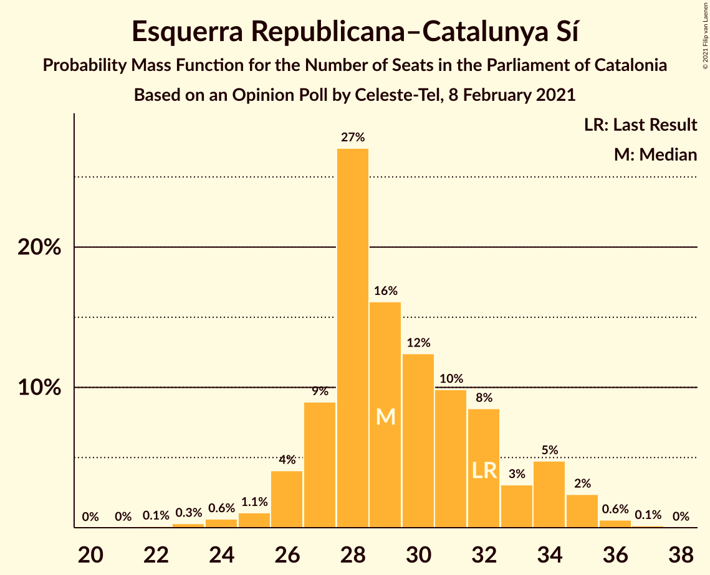
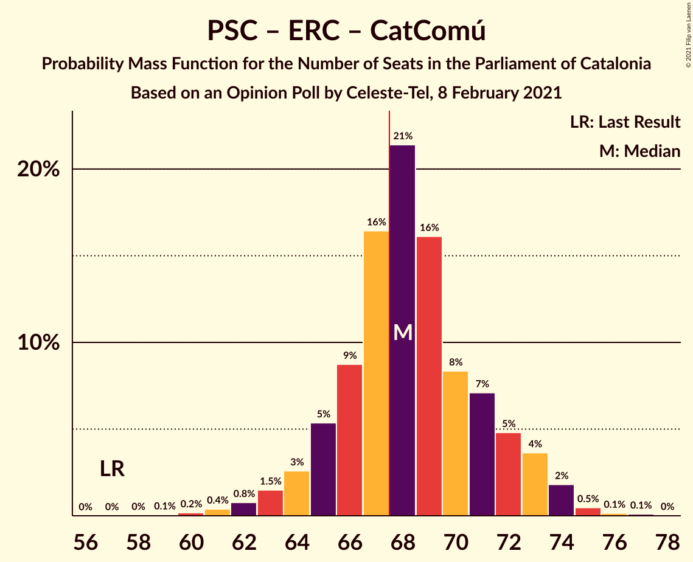

# Opinion Poll by Celeste-Tel, 8 February 2021

<a href="#voting-intentions">Voting Intentions</a> | <a href="#seats">Seats</a> | <a href="#coalitions">Coalitions</a> | <a href="#technical-information">Technical Information</a>

## Voting Intentions

### Confidence Intervals

| Party | Last Result | Poll Result | 80% Confidence Interval | 90% Confidence Interval | 95% Confidence Interval | 99% Confidence Interval |
|:-----:|:-----------:|:-----------:|:-----------------------:|:-----------------------:|:-----------------------:|:-----------------------:|
| Partit dels Socialistes de Catalunya (PSC-PSOE) | 13.9% | 21.9% | 20.0–23.9% |19.5–24.5% |19.1–25.0% |18.2–26.0% |
| Junts per Catalunya | 21.7% | 20.0% | 18.2–22.0% |17.7–22.5% |17.3–23.0% |16.5–24.0% |
| Esquerra Republicana–Catalunya Sí | 21.4% | 19.7% | 18.0–21.7% |17.5–22.3% |17.0–22.7% |16.2–23.7% |
| Ciutadans–Partido de la Ciudadanía | 25.4% | 10.1% | 8.8–11.7% |8.5–12.1% |8.2–12.5% |7.6–13.3% |
| Catalunya en Comú–Podem | 7.5% | 7.5% | 6.4–8.8% |6.1–9.2% |5.8–9.6% |5.3–10.3% |
| Vox | 0.0% | 6.0% | 5.0–7.3% |4.7–7.6% |4.5–7.9% |4.1–8.6% |
| Partit Popular | 4.2% | 5.6% | 4.6–6.8% |4.4–7.2% |4.2–7.5% |3.7–8.1% |
| Candidatura d’Unitat Popular | 4.5% | 5.3% | 4.4–6.5% |4.2–6.9% |3.9–7.2% |3.5–7.8% |
| Partit Demòcrata Europeu Català | 0.0% | 1.5% | 1.0–2.2% |0.9–2.4% |0.8–2.6% |0.7–3.0% |

*Note:* The poll result column reflects the actual value used in the calculations. Published results may vary slightly, and in addition be rounded to fewer digits.

## Seats

### Confidence Intervals

| Party | Last Result | Median | 80% Confidence Interval | 90% Confidence Interval | 95% Confidence Interval | 99% Confidence Interval |
|:-----:|:-----------:|:------:|:-----------------------:|:-----------------------:|:-----------------------:|:-----------------------:|
| <a href="#partit-dels-socialistes-de-catalunya-(psc-psoe)">Partit dels Socialistes de Catalunya (PSC-PSOE)</a> | 17 | 31 | 27–32 |26–34 |26–34 |25–36 |
| <a href="#junts-per-catalunya">Junts per Catalunya</a> | 34 | 32 | 30–34 |27–35 |27–37 |26–39 |
| <a href="#esquerra-republicana–catalunya-sí">Esquerra Republicana–Catalunya Sí</a> | 32 | 29 | 27–33 |26–34 |26–35 |24–36 |
| <a href="#ciutadans–partido-de-la-ciudadanía">Ciutadans–Partido de la Ciudadanía</a> | 36 | 13 | 12–15 |12–16 |10–17 |9–18 |
| <a href="#catalunya-en-comú–podem">Catalunya en Comú–Podem</a> | 8 | 8 | 7–11 |6–11 |5–11 |5–13 |
| <a href="#vox">Vox</a> | 0 | 7 | 5–9 |5–10 |5–10 |4–11 |
| <a href="#partit-popular">Partit Popular</a> | 4 | 7 | 6–9 |5–9 |4–9 |3–11 |
| <a href="#candidatura-d’unitat-popular">Candidatura d’Unitat Popular</a> | 4 | 7 | 5–8 |4–8 |4–9 |3–10 |
| <a href="#partit-demòcrata-europeu-català">Partit Demòcrata Europeu Català</a> | 0 | 0 | 0 |0 |0 |0–1 |

### Partit dels Socialistes de Catalunya (PSC-PSOE)

*For a full overview of the results for this party, see the [Partit dels Socialistes de Catalunya (PSC-PSOE)](party-partitdelssocialistesdecatalunyapsc-psoe.html) page.*

| Number of Seats | Probability | Accumulated | Special Marks |
|:---------------:|:-----------:|:-----------:|:-------------:|
| 17 | 0% | 100% | Last Result |
| 18 | 0% | 100% |  |
| 19 | 0% | 100% |  |
| 20 | 0% | 100% |  |
| 21 | 0% | 100% |  |
| 22 | 0% | 100% |  |
| 23 | 0% | 100% |  |
| 24 | 0.1% | 100% |  |
| 25 | 1.1% | 99.8% |  |
| 26 | 4% | 98.7% |  |
| 27 | 9% | 94% |  |
| 28 | 8% | 86% |  |
| 29 | 12% | 78% |  |
| 30 | 13% | 66% |  |
| 31 | 20% | 53% | Median |
| 32 | 24% | 32% |  |
| 33 | 3% | 8% |  |
| 34 | 3% | 5% |  |
| 35 | 2% | 2% |  |
| 36 | 0.4% | 0.6% |  |
| 37 | 0.1% | 0.2% |  |
| 38 | 0.1% | 0.1% |  |
| 39 | 0% | 0% |  |

### Junts per Catalunya

*For a full overview of the results for this party, see the [Junts per Catalunya](party-juntspercatalunya.html) page.*

| Number of Seats | Probability | Accumulated | Special Marks |
|:---------------:|:-----------:|:-----------:|:-------------:|
| 25 | 0.3% | 100% |  |
| 26 | 1.0% | 99.6% |  |
| 27 | 4% | 98.6% |  |
| 28 | 1.1% | 95% |  |
| 29 | 4% | 94% |  |
| 30 | 7% | 90% |  |
| 31 | 22% | 83% |  |
| 32 | 15% | 61% | Median |
| 33 | 20% | 46% |  |
| 34 | 18% | 26% | Last Result |
| 35 | 3% | 8% |  |
| 36 | 2% | 5% |  |
| 37 | 2% | 3% |  |
| 38 | 0.3% | 0.9% |  |
| 39 | 0.4% | 0.5% |  |
| 40 | 0.1% | 0.1% |  |
| 41 | 0% | 0% |  |

### Esquerra Republicana–Catalunya Sí

*For a full overview of the results for this party, see the [Esquerra Republicana–Catalunya Sí](party-esquerrarepublicana–catalunyasí.html) page.*

| Number of Seats | Probability | Accumulated | Special Marks |
|:---------------:|:-----------:|:-----------:|:-------------:|
| 22 | 0.1% | 100% |  |
| 23 | 0.3% | 99.9% |  |
| 24 | 0.6% | 99.6% |  |
| 25 | 1.1% | 99.0% |  |
| 26 | 4% | 98% |  |
| 27 | 9% | 94% |  |
| 28 | 27% | 85% |  |
| 29 | 16% | 58% | Median |
| 30 | 12% | 42% |  |
| 31 | 10% | 29% |  |
| 32 | 8% | 19% | Last Result |
| 33 | 3% | 11% |  |
| 34 | 5% | 8% |  |
| 35 | 2% | 3% |  |
| 36 | 0.6% | 0.7% |  |
| 37 | 0.1% | 0.2% |  |
| 38 | 0% | 0% |  |

### Ciutadans–Partido de la Ciudadanía

*For a full overview of the results for this party, see the [Ciutadans–Partido de la Ciudadanía](party-ciutadans–partidodelaciudadanía.html) page.*

| Number of Seats | Probability | Accumulated | Special Marks |
|:---------------:|:-----------:|:-----------:|:-------------:|
| 8 | 0.3% | 100% |  |
| 9 | 1.1% | 99.7% |  |
| 10 | 1.5% | 98.6% |  |
| 11 | 2% | 97% |  |
| 12 | 17% | 95% |  |
| 13 | 47% | 79% | Median |
| 14 | 19% | 32% |  |
| 15 | 4% | 13% |  |
| 16 | 5% | 9% |  |
| 17 | 2% | 4% |  |
| 18 | 1.3% | 1.5% |  |
| 19 | 0.2% | 0.2% |  |
| 20 | 0% | 0% |  |
| 21 | 0% | 0% |  |
| 22 | 0% | 0% |  |
| 23 | 0% | 0% |  |
| 24 | 0% | 0% |  |
| 25 | 0% | 0% |  |
| 26 | 0% | 0% |  |
| 27 | 0% | 0% |  |
| 28 | 0% | 0% |  |
| 29 | 0% | 0% |  |
| 30 | 0% | 0% |  |
| 31 | 0% | 0% |  |
| 32 | 0% | 0% |  |
| 33 | 0% | 0% |  |
| 34 | 0% | 0% |  |
| 35 | 0% | 0% |  |
| 36 | 0% | 0% | Last Result |

### Catalunya en Comú–Podem

*For a full overview of the results for this party, see the [Catalunya en Comú–Podem](party-catalunyaencomú–podem.html) page.*

| Number of Seats | Probability | Accumulated | Special Marks |
|:---------------:|:-----------:|:-----------:|:-------------:|
| 5 | 3% | 100% |  |
| 6 | 3% | 97% |  |
| 7 | 12% | 93% |  |
| 8 | 37% | 81% | Last Result, Median |
| 9 | 13% | 44% |  |
| 10 | 18% | 30% |  |
| 11 | 10% | 12% |  |
| 12 | 2% | 2% |  |
| 13 | 0.5% | 0.7% |  |
| 14 | 0.1% | 0.1% |  |
| 15 | 0% | 0% |  |

### Vox

*For a full overview of the results for this party, see the [Vox](party-vox.html) page.*

| Number of Seats | Probability | Accumulated | Special Marks |
|:---------------:|:-----------:|:-----------:|:-------------:|
| 0 | 0% | 100% | Last Result |
| 1 | 0% | 100% |  |
| 2 | 0% | 100% |  |
| 3 | 0.4% | 100% |  |
| 4 | 0.4% | 99.6% |  |
| 5 | 10% | 99.2% |  |
| 6 | 10% | 89% |  |
| 7 | 43% | 79% | Median |
| 8 | 8% | 36% |  |
| 9 | 21% | 29% |  |
| 10 | 5% | 7% |  |
| 11 | 1.2% | 2% |  |
| 12 | 0.5% | 0.5% |  |
| 13 | 0% | 0% |  |

### Partit Popular

*For a full overview of the results for this party, see the [Partit Popular](party-partitpopular.html) page.*

| Number of Seats | Probability | Accumulated | Special Marks |
|:---------------:|:-----------:|:-----------:|:-------------:|
| 3 | 2% | 100% |  |
| 4 | 1.5% | 98% | Last Result |
| 5 | 6% | 96% |  |
| 6 | 15% | 90% |  |
| 7 | 51% | 75% | Median |
| 8 | 3% | 24% |  |
| 9 | 20% | 22% |  |
| 10 | 1.0% | 2% |  |
| 11 | 0.4% | 0.7% |  |
| 12 | 0.2% | 0.2% |  |
| 13 | 0% | 0% |  |

### Candidatura d’Unitat Popular

*For a full overview of the results for this party, see the [Candidatura d’Unitat Popular](party-candidaturad’unitatpopular.html) page.*

| Number of Seats | Probability | Accumulated | Special Marks |
|:---------------:|:-----------:|:-----------:|:-------------:|
| 2 | 0.1% | 100% |  |
| 3 | 0.9% | 99.9% |  |
| 4 | 8% | 99.0% | Last Result |
| 5 | 10% | 91% |  |
| 6 | 9% | 82% |  |
| 7 | 44% | 73% | Median |
| 8 | 25% | 29% |  |
| 9 | 3% | 4% |  |
| 10 | 0.9% | 1.4% |  |
| 11 | 0.4% | 0.5% |  |
| 12 | 0% | 0% |  |

### Partit Demòcrata Europeu Català

*For a full overview of the results for this party, see the [Partit Demòcrata Europeu Català](party-partitdemòcrataeuropeucatalà.html) page.*

| Number of Seats | Probability | Accumulated | Special Marks |
|:---------------:|:-----------:|:-----------:|:-------------:|
| 0 | 98% | 100% | Last Result, Median |
| 1 | 2% | 2% |  |
| 2 | 0% | 0.1% |  |
| 3 | 0% | 0.1% |  |
| 4 | 0% | 0% |  |

## Coalitions

### Confidence Intervals

| Coalition | Last Result | Median | Majority? | 80% Confidence Interval | 90% Confidence Interval | 95% Confidence Interval | 99% Confidence Interval |
|:---------:|:-----------:|:------:|:---------:|:-----------------------:|:-----------------------:|:-----------------------:|:-----------------------:|
| Junts per Catalunya – Esquerra Republicana–Catalunya Sí – Catalunya en Comú–Podem | 74 | 71 | 82% | 66–74 | 66–75 | 65–76 | 63–78 |
| Partit dels Socialistes de Catalunya (PSC-PSOE) – Esquerra Republicana–Catalunya Sí – Catalunya en Comú–Podem | 57 | 68 | 64% | 65–72 | 64–73 | 63–74 | 61–75 |
| Junts per Catalunya – Esquerra Republicana–Catalunya Sí – Candidatura d’Unitat Popular – Partit Demòcrata Europeu Català | 70 | 68 | 70% | 65–72 | 64–73 | 64–73 | 62–76 |
| Junts per Catalunya – Esquerra Republicana–Catalunya Sí – Candidatura d’Unitat Popular | 70 | 68 | 70% | 65–72 | 64–73 | 63–73 | 62–75 |
| Junts per Catalunya – Esquerra Republicana–Catalunya Sí | 66 | 62 | 2% | 58–65 | 57–66 | 56–67 | 54–69 |
| Junts per Catalunya – Esquerra Republicana–Catalunya Sí – Partit Demòcrata Europeu Català | 66 | 62 | 2% | 58–65 | 57–66 | 56–67 | 54–69 |
| Partit dels Socialistes de Catalunya (PSC-PSOE) – Ciutadans–Partido de la Ciudadanía – Catalunya en Comú–Podem – Partit Popular | 65 | 59 | 0.1% | 56–63 | 55–64 | 54–64 | 52–66 |
| Partit dels Socialistes de Catalunya (PSC-PSOE) – Ciutadans–Partido de la Ciudadanía – Vox – Partit Popular | 57 | 58 | 0% | 55–61 | 54–62 | 52–63 | 51–65 |
| Partit dels Socialistes de Catalunya (PSC-PSOE) – Ciutadans–Partido de la Ciudadanía – Partit Popular | 57 | 51 | 0% | 47–54 | 46–55 | 45–56 | 44–58 |
| Esquerra Republicana–Catalunya Sí – Catalunya en Comú–Podem | 40 | 38 | 0% | 35–42 | 35–43 | 34–43 | 32–45 |

### Junts per Catalunya – Esquerra Republicana–Catalunya Sí – Catalunya en Comú–Podem

| Number of Seats | Probability | Accumulated | Special Marks |
|:---------------:|:-----------:|:-----------:|:-------------:|
| 61 | 0.1% | 100% |  |
| 62 | 0.3% | 99.9% |  |
| 63 | 0.3% | 99.5% |  |
| 64 | 1.4% | 99.2% |  |
| 65 | 2% | 98% |  |
| 66 | 6% | 96% |  |
| 67 | 8% | 90% |  |
| 68 | 10% | 82% | Majority |
| 69 | 15% | 71% | Median |
| 70 | 6% | 57% |  |
| 71 | 17% | 51% |  |
| 72 | 17% | 34% |  |
| 73 | 6% | 17% |  |
| 74 | 5% | 11% | Last Result |
| 75 | 3% | 6% |  |
| 76 | 1.3% | 3% |  |
| 77 | 1.0% | 2% |  |
| 78 | 0.2% | 0.7% |  |
| 79 | 0.4% | 0.4% |  |
| 80 | 0% | 0.1% |  |
| 81 | 0% | 0% |  |

### Partit dels Socialistes de Catalunya (PSC-PSOE) – Esquerra Republicana–Catalunya Sí – Catalunya en Comú–Podem

| Number of Seats | Probability | Accumulated | Special Marks |
|:---------------:|:-----------:|:-----------:|:-------------:|
| 57 | 0% | 100% | Last Result |
| 58 | 0% | 100% |  |
| 59 | 0.1% | 100% |  |
| 60 | 0.2% | 99.9% |  |
| 61 | 0.4% | 99.7% |  |
| 62 | 0.8% | 99.3% |  |
| 63 | 1.5% | 98.6% |  |
| 64 | 3% | 97% |  |
| 65 | 5% | 95% |  |
| 66 | 9% | 89% |  |
| 67 | 16% | 80% |  |
| 68 | 21% | 64% | Median, Majority |
| 69 | 16% | 43% |  |
| 70 | 8% | 26% |  |
| 71 | 7% | 18% |  |
| 72 | 5% | 11% |  |
| 73 | 4% | 6% |  |
| 74 | 2% | 3% |  |
| 75 | 0.5% | 0.7% |  |
| 76 | 0.1% | 0.3% |  |
| 77 | 0.1% | 0.1% |  |
| 78 | 0% | 0% |  |

### Junts per Catalunya – Esquerra Republicana–Catalunya Sí – Candidatura d’Unitat Popular – Partit Demòcrata Europeu Català

| Number of Seats | Probability | Accumulated | Special Marks |
|:---------------:|:-----------:|:-----------:|:-------------:|
| 59 | 0% | 100% |  |
| 60 | 0.1% | 99.9% |  |
| 61 | 0.3% | 99.8% |  |
| 62 | 0.5% | 99.5% |  |
| 63 | 1.4% | 99.0% |  |
| 64 | 4% | 98% |  |
| 65 | 8% | 94% |  |
| 66 | 9% | 85% |  |
| 67 | 6% | 76% |  |
| 68 | 27% | 70% | Median, Majority |
| 69 | 15% | 44% |  |
| 70 | 9% | 29% | Last Result |
| 71 | 8% | 20% |  |
| 72 | 6% | 12% |  |
| 73 | 4% | 6% |  |
| 74 | 1.2% | 2% |  |
| 75 | 0.7% | 1.2% |  |
| 76 | 0.3% | 0.5% |  |
| 77 | 0.1% | 0.2% |  |
| 78 | 0.1% | 0.1% |  |
| 79 | 0% | 0% |  |

### Junts per Catalunya – Esquerra Republicana–Catalunya Sí – Candidatura d’Unitat Popular

| Number of Seats | Probability | Accumulated | Special Marks |
|:---------------:|:-----------:|:-----------:|:-------------:|
| 59 | 0% | 100% |  |
| 60 | 0.1% | 99.9% |  |
| 61 | 0.3% | 99.8% |  |
| 62 | 0.5% | 99.5% |  |
| 63 | 2% | 99.0% |  |
| 64 | 4% | 97% |  |
| 65 | 8% | 94% |  |
| 66 | 9% | 85% |  |
| 67 | 6% | 76% |  |
| 68 | 26% | 70% | Median, Majority |
| 69 | 15% | 44% |  |
| 70 | 9% | 29% | Last Result |
| 71 | 8% | 20% |  |
| 72 | 6% | 12% |  |
| 73 | 4% | 6% |  |
| 74 | 1.2% | 2% |  |
| 75 | 0.6% | 1.1% |  |
| 76 | 0.3% | 0.5% |  |
| 77 | 0.1% | 0.2% |  |
| 78 | 0.1% | 0.1% |  |
| 79 | 0% | 0% |  |

### Junts per Catalunya – Esquerra Republicana–Catalunya Sí

| Number of Seats | Probability | Accumulated | Special Marks |
|:---------------:|:-----------:|:-----------:|:-------------:|
| 52 | 0.1% | 100% |  |
| 53 | 0.1% | 99.9% |  |
| 54 | 0.4% | 99.9% |  |
| 55 | 0.9% | 99.5% |  |
| 56 | 2% | 98.6% |  |
| 57 | 4% | 97% |  |
| 58 | 7% | 92% |  |
| 59 | 7% | 85% |  |
| 60 | 10% | 78% |  |
| 61 | 15% | 68% | Median |
| 62 | 16% | 53% |  |
| 63 | 17% | 37% |  |
| 64 | 8% | 20% |  |
| 65 | 4% | 12% |  |
| 66 | 4% | 8% | Last Result |
| 67 | 2% | 4% |  |
| 68 | 1.0% | 2% | Majority |
| 69 | 0.5% | 0.8% |  |
| 70 | 0.1% | 0.3% |  |
| 71 | 0.1% | 0.1% |  |
| 72 | 0% | 0.1% |  |
| 73 | 0% | 0% |  |

### Junts per Catalunya – Esquerra Republicana–Catalunya Sí – Partit Demòcrata Europeu Català

| Number of Seats | Probability | Accumulated | Special Marks |
|:---------------:|:-----------:|:-----------:|:-------------:|
| 52 | 0.1% | 100% |  |
| 53 | 0.1% | 99.9% |  |
| 54 | 0.4% | 99.9% |  |
| 55 | 0.8% | 99.5% |  |
| 56 | 2% | 98.6% |  |
| 57 | 5% | 97% |  |
| 58 | 7% | 93% |  |
| 59 | 7% | 85% |  |
| 60 | 9% | 78% |  |
| 61 | 15% | 68% | Median |
| 62 | 16% | 53% |  |
| 63 | 17% | 37% |  |
| 64 | 7% | 20% |  |
| 65 | 5% | 13% |  |
| 66 | 4% | 8% | Last Result |
| 67 | 2% | 4% |  |
| 68 | 1.0% | 2% | Majority |
| 69 | 0.5% | 0.8% |  |
| 70 | 0.2% | 0.3% |  |
| 71 | 0.1% | 0.1% |  |
| 72 | 0% | 0.1% |  |
| 73 | 0% | 0% |  |

### Partit dels Socialistes de Catalunya (PSC-PSOE) – Ciutadans–Partido de la Ciudadanía – Catalunya en Comú–Podem – Partit Popular

| Number of Seats | Probability | Accumulated | Special Marks |
|:---------------:|:-----------:|:-----------:|:-------------:|
| 50 | 0.1% | 100% |  |
| 51 | 0.1% | 99.9% |  |
| 52 | 0.6% | 99.8% |  |
| 53 | 0.9% | 99.2% |  |
| 54 | 2% | 98% |  |
| 55 | 6% | 96% |  |
| 56 | 6% | 90% |  |
| 57 | 8% | 84% |  |
| 58 | 11% | 77% |  |
| 59 | 19% | 66% | Median |
| 60 | 19% | 46% |  |
| 61 | 10% | 27% |  |
| 62 | 6% | 17% |  |
| 63 | 6% | 11% |  |
| 64 | 3% | 5% |  |
| 65 | 0.7% | 2% | Last Result |
| 66 | 0.8% | 1.1% |  |
| 67 | 0.2% | 0.3% |  |
| 68 | 0% | 0.1% | Majority |
| 69 | 0% | 0% |  |

### Partit dels Socialistes de Catalunya (PSC-PSOE) – Ciutadans–Partido de la Ciudadanía – Vox – Partit Popular

| Number of Seats | Probability | Accumulated | Special Marks |
|:---------------:|:-----------:|:-----------:|:-------------:|
| 49 | 0.1% | 100% |  |
| 50 | 0.2% | 99.9% |  |
| 51 | 1.1% | 99.7% |  |
| 52 | 1.3% | 98.6% |  |
| 53 | 2% | 97% |  |
| 54 | 4% | 96% |  |
| 55 | 8% | 92% |  |
| 56 | 12% | 84% |  |
| 57 | 15% | 72% | Last Result |
| 58 | 12% | 57% | Median |
| 59 | 18% | 45% |  |
| 60 | 10% | 27% |  |
| 61 | 7% | 16% |  |
| 62 | 5% | 10% |  |
| 63 | 3% | 5% |  |
| 64 | 1.0% | 2% |  |
| 65 | 0.5% | 0.9% |  |
| 66 | 0.3% | 0.4% |  |
| 67 | 0.1% | 0.1% |  |
| 68 | 0% | 0% | Majority |

### Partit dels Socialistes de Catalunya (PSC-PSOE) – Ciutadans–Partido de la Ciudadanía – Partit Popular

| Number of Seats | Probability | Accumulated | Special Marks |
|:---------------:|:-----------:|:-----------:|:-------------:|
| 42 | 0.1% | 100% |  |
| 43 | 0.3% | 99.9% |  |
| 44 | 1.1% | 99.6% |  |
| 45 | 2% | 98% |  |
| 46 | 3% | 97% |  |
| 47 | 6% | 93% |  |
| 48 | 9% | 87% |  |
| 49 | 8% | 78% |  |
| 50 | 20% | 71% |  |
| 51 | 10% | 50% | Median |
| 52 | 19% | 41% |  |
| 53 | 9% | 21% |  |
| 54 | 7% | 13% |  |
| 55 | 2% | 6% |  |
| 56 | 2% | 4% |  |
| 57 | 0.9% | 1.4% | Last Result |
| 58 | 0.3% | 0.5% |  |
| 59 | 0.2% | 0.2% |  |
| 60 | 0% | 0.1% |  |
| 61 | 0% | 0% |  |

### Esquerra Republicana–Catalunya Sí – Catalunya en Comú–Podem

| Number of Seats | Probability | Accumulated | Special Marks |
|:---------------:|:-----------:|:-----------:|:-------------:|
| 30 | 0.1% | 100% |  |
| 31 | 0.2% | 99.9% |  |
| 32 | 0.4% | 99.7% |  |
| 33 | 1.3% | 99.3% |  |
| 34 | 3% | 98% |  |
| 35 | 11% | 95% |  |
| 36 | 16% | 84% |  |
| 37 | 10% | 68% | Median |
| 38 | 19% | 58% |  |
| 39 | 11% | 39% |  |
| 40 | 11% | 28% | Last Result |
| 41 | 6% | 17% |  |
| 42 | 6% | 11% |  |
| 43 | 3% | 5% |  |
| 44 | 1.1% | 2% |  |
| 45 | 0.6% | 1.0% |  |
| 46 | 0.2% | 0.4% |  |
| 47 | 0.1% | 0.1% |  |
| 48 | 0% | 0% |  |

## Technical Information

### Opinion Poll

+ **Polling firm:** Celeste-Tel
+ **Commissioner(s):** —
+ **Fieldwork period:** 8 February 2021

### Calculations

+ **Sample size:** 750
+ **Simulations done:** 1,048,576
+ **Error estimate:** 1.60%

