# Opinion Poll by Feedback for El Nacional, 1–8 February 2021

<a href="#voting-intentions">Voting Intentions</a> | <a href="#seats">Seats</a> | <a href="#coalitions">Coalitions</a> | <a href="#technical-information">Technical Information</a>

## Voting Intentions

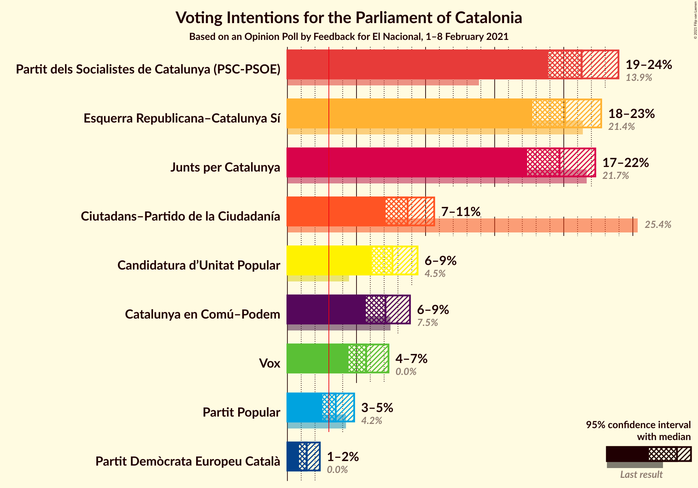

### Confidence Intervals

| Party | Last Result | Poll Result | 80% Confidence Interval | 90% Confidence Interval | 95% Confidence Interval | 99% Confidence Interval |
|:-----:|:-----------:|:-----------:|:-----------------------:|:-----------------------:|:-----------------------:|:-----------------------:|
| Partit dels Socialistes de Catalunya (PSC-PSOE) | 13.9% | 21.3% | 19.7–23.0% |19.3–23.5% |18.9–24.0% |18.1–24.8% |
| Esquerra Republicana–Catalunya Sí | 21.4% | 20.1% | 18.5–21.8% |18.1–22.3% |17.7–22.7% |17.0–23.5% |
| Junts per Catalunya | 21.7% | 19.7% | 18.2–21.4% |17.7–21.9% |17.3–22.3% |16.6–23.1% |
| Ciutadans–Partido de la Ciudadanía | 25.4% | 8.7% | 7.7–10.0% |7.3–10.3% |7.1–10.6% |6.6–11.2% |
| Candidatura d’Unitat Popular | 4.5% | 7.6% | 6.6–8.8% |6.3–9.1% |6.1–9.4% |5.7–10.0% |
| Catalunya en Comú–Podem | 7.5% | 7.1% | 6.2–8.3% |5.9–8.6% |5.7–8.9% |5.2–9.4% |
| Vox | 0.0% | 5.7% | 4.9–6.8% |4.6–7.1% |4.4–7.3% |4.1–7.9% |
| Partit Popular | 4.2% | 3.5% | 2.9–4.4% |2.7–4.6% |2.5–4.8% |2.2–5.3% |
| Partit Demòcrata Europeu Català | 0.0% | 1.4% | 1.0–2.0% |0.9–2.2% |0.8–2.3% |0.7–2.7% |

*Note:* The poll result column reflects the actual value used in the calculations. Published results may vary slightly, and in addition be rounded to fewer digits.

## Seats

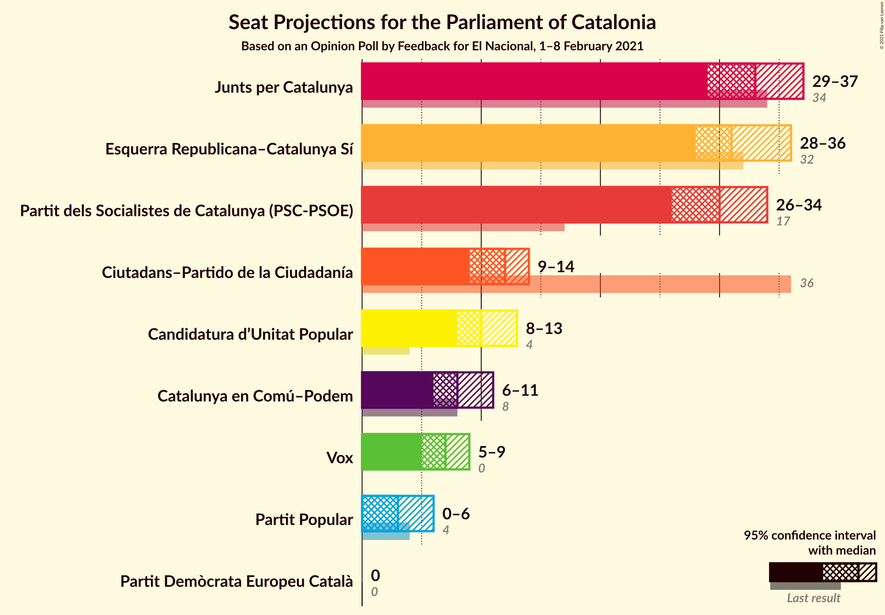

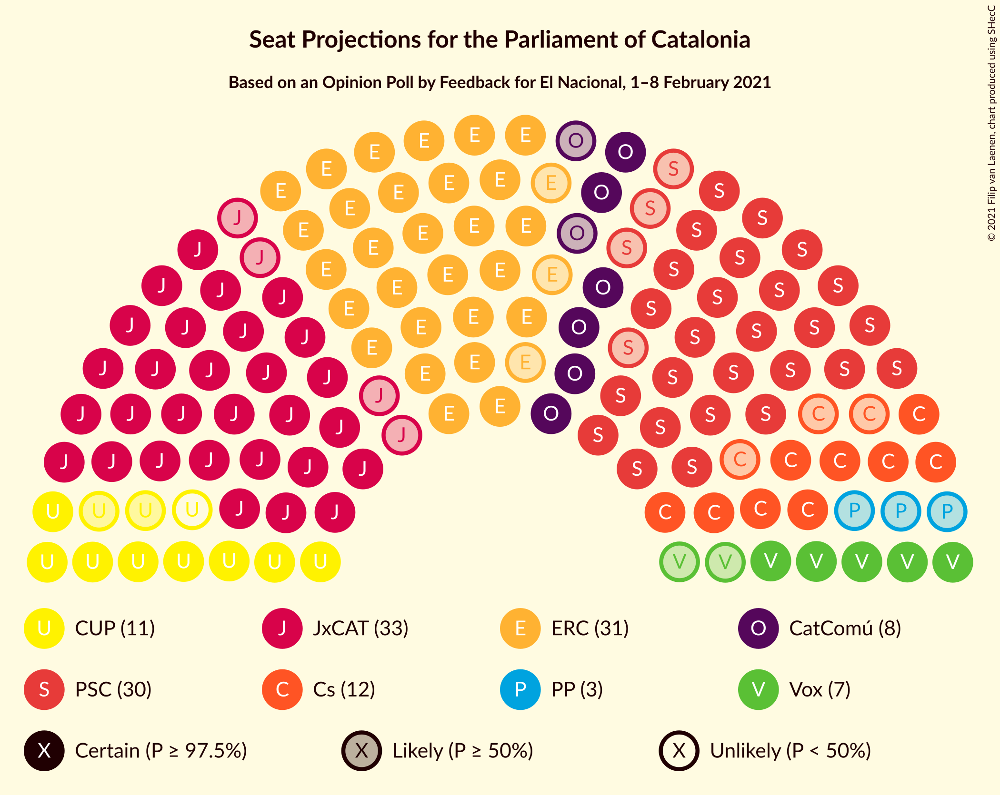

### Confidence Intervals

| Party | Last Result | Median | 80% Confidence Interval | 90% Confidence Interval | 95% Confidence Interval | 99% Confidence Interval |
|:-----:|:-----------:|:------:|:-----------------------:|:-----------------------:|:-----------------------:|:-----------------------:|
| <a href="#partit-dels-socialistes-de-catalunya-(psc-psoe)">Partit dels Socialistes de Catalunya (PSC-PSOE)</a> | 17 | 30 | 27–32 |26–33 |26–34 |25–35 |
| <a href="#esquerra-republicana–catalunya-sí">Esquerra Republicana–Catalunya Sí</a> | 32 | 31 | 29–34 |28–35 |28–36 |26–37 |
| <a href="#junts-per-catalunya">Junts per Catalunya</a> | 34 | 33 | 30–36 |29–37 |29–37 |27–38 |
| <a href="#ciutadans–partido-de-la-ciudadanía">Ciutadans–Partido de la Ciudadanía</a> | 36 | 12 | 11–13 |9–13 |9–14 |8–15 |
| <a href="#candidatura-d’unitat-popular">Candidatura d’Unitat Popular</a> | 4 | 10 | 9–11 |8–12 |8–13 |8–15 |
| <a href="#catalunya-en-comú–podem">Catalunya en Comú–Podem</a> | 8 | 8 | 7–10 |7–11 |6–11 |5–12 |
| <a href="#vox">Vox</a> | 0 | 7 | 6–9 |5–9 |5–9 |4–11 |
| <a href="#partit-popular">Partit Popular</a> | 4 | 3 | 2–5 |0–5 |0–6 |0–6 |
| <a href="#partit-demòcrata-europeu-català">Partit Demòcrata Europeu Català</a> | 0 | 0 | 0 |0 |0 |0–1 |

### Partit dels Socialistes de Catalunya (PSC-PSOE)

*For a full overview of the results for this party, see the [Partit dels Socialistes de Catalunya (PSC-PSOE)](party-partitdelssocialistesdecatalunyapsc-psoe.html) page.*

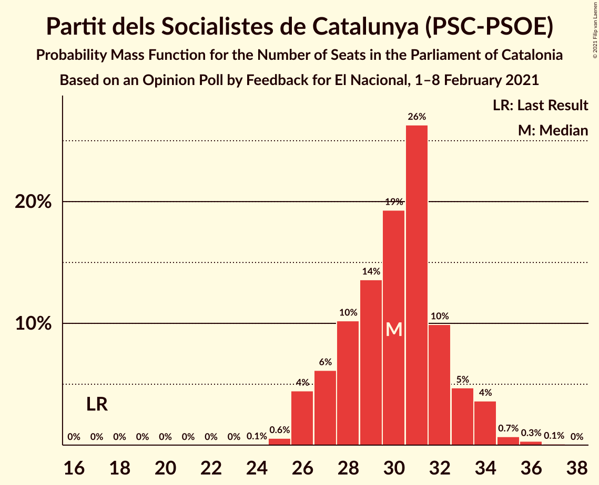

| Number of Seats | Probability | Accumulated | Special Marks |
|:---------------:|:-----------:|:-----------:|:-------------:|
| 17 | 0% | 100% | Last Result |
| 18 | 0% | 100% |  |
| 19 | 0% | 100% |  |
| 20 | 0% | 100% |  |
| 21 | 0% | 100% |  |
| 22 | 0% | 100% |  |
| 23 | 0% | 100% |  |
| 24 | 0.1% | 100% |  |
| 25 | 0.6% | 99.9% |  |
| 26 | 4% | 99.4% |  |
| 27 | 6% | 95% |  |
| 28 | 10% | 89% |  |
| 29 | 14% | 79% |  |
| 30 | 19% | 65% | Median |
| 31 | 26% | 46% |  |
| 32 | 10% | 19% |  |
| 33 | 5% | 9% |  |
| 34 | 4% | 5% |  |
| 35 | 0.7% | 1.1% |  |
| 36 | 0.3% | 0.4% |  |
| 37 | 0.1% | 0.1% |  |
| 38 | 0% | 0% |  |

### Esquerra Republicana–Catalunya Sí

*For a full overview of the results for this party, see the [Esquerra Republicana–Catalunya Sí](party-esquerrarepublicana–catalunyasí.html) page.*

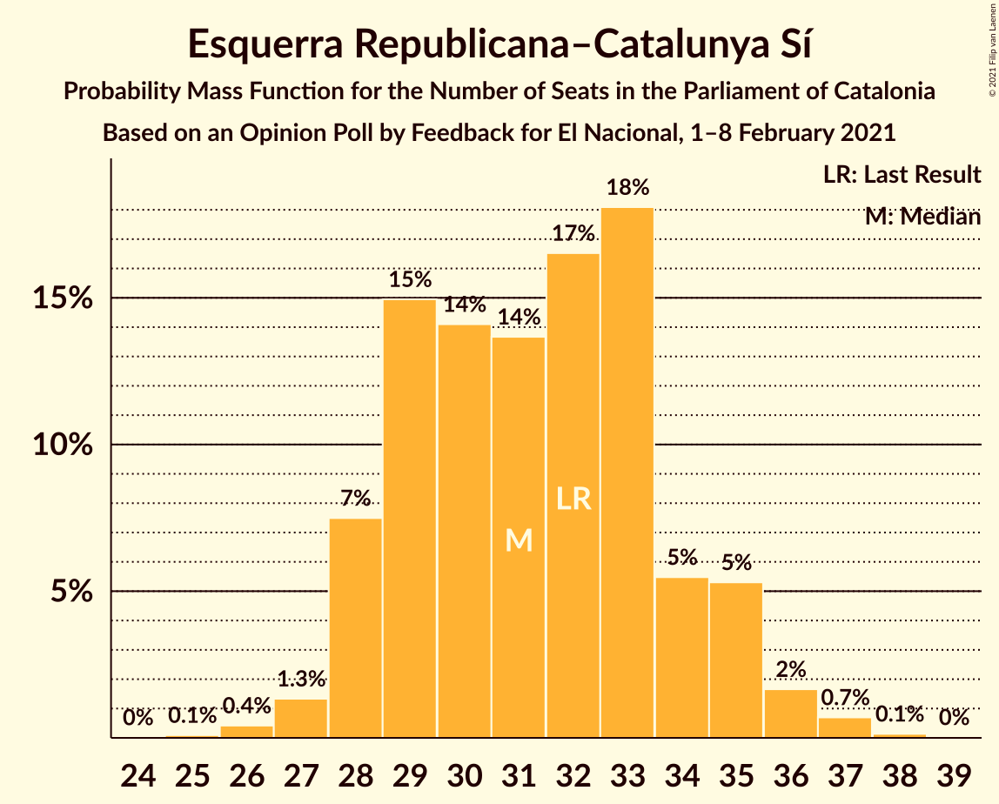

| Number of Seats | Probability | Accumulated | Special Marks |
|:---------------:|:-----------:|:-----------:|:-------------:|
| 25 | 0.1% | 100% |  |
| 26 | 0.4% | 99.9% |  |
| 27 | 1.3% | 99.5% |  |
| 28 | 7% | 98% |  |
| 29 | 15% | 91% |  |
| 30 | 14% | 76% |  |
| 31 | 14% | 62% | Median |
| 32 | 17% | 48% | Last Result |
| 33 | 18% | 31% |  |
| 34 | 5% | 13% |  |
| 35 | 5% | 8% |  |
| 36 | 2% | 3% |  |
| 37 | 0.7% | 0.9% |  |
| 38 | 0.1% | 0.2% |  |
| 39 | 0% | 0% |  |

### Junts per Catalunya

*For a full overview of the results for this party, see the [Junts per Catalunya](party-juntspercatalunya.html) page.*

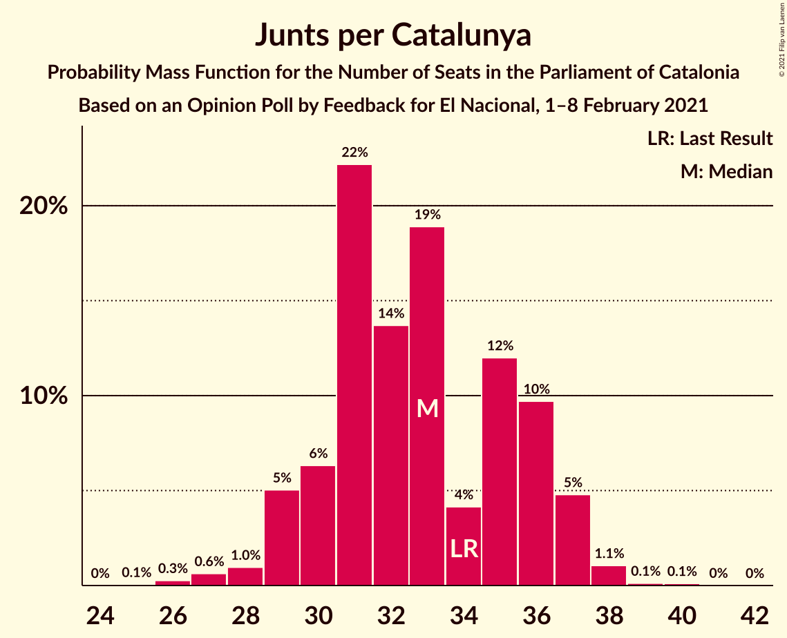

| Number of Seats | Probability | Accumulated | Special Marks |
|:---------------:|:-----------:|:-----------:|:-------------:|
| 25 | 0.1% | 100% |  |
| 26 | 0.3% | 99.9% |  |
| 27 | 0.6% | 99.7% |  |
| 28 | 1.0% | 99.0% |  |
| 29 | 5% | 98% |  |
| 30 | 6% | 93% |  |
| 31 | 22% | 87% |  |
| 32 | 14% | 65% |  |
| 33 | 19% | 51% | Median |
| 34 | 4% | 32% | Last Result |
| 35 | 12% | 28% |  |
| 36 | 10% | 16% |  |
| 37 | 5% | 6% |  |
| 38 | 1.1% | 1.3% |  |
| 39 | 0.1% | 0.3% |  |
| 40 | 0.1% | 0.1% |  |
| 41 | 0% | 0% |  |

### Ciutadans–Partido de la Ciudadanía

*For a full overview of the results for this party, see the [Ciutadans–Partido de la Ciudadanía](party-ciutadans–partidodelaciudadanía.html) page.*

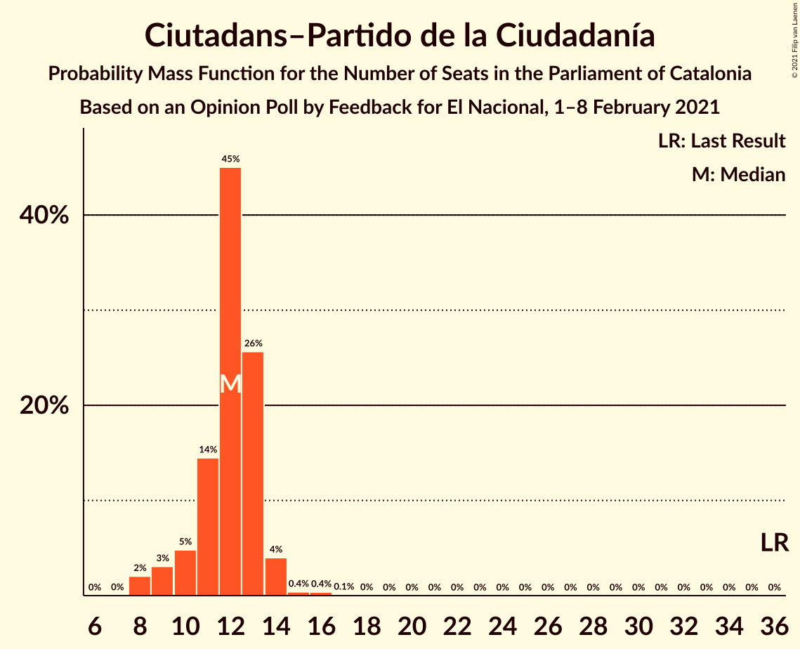

| Number of Seats | Probability | Accumulated | Special Marks |
|:---------------:|:-----------:|:-----------:|:-------------:|
| 8 | 2% | 100% |  |
| 9 | 3% | 98% |  |
| 10 | 5% | 95% |  |
| 11 | 14% | 90% |  |
| 12 | 45% | 76% | Median |
| 13 | 26% | 31% |  |
| 14 | 4% | 5% |  |
| 15 | 0.4% | 0.9% |  |
| 16 | 0.4% | 0.5% |  |
| 17 | 0.1% | 0.1% |  |
| 18 | 0% | 0% |  |
| 19 | 0% | 0% |  |
| 20 | 0% | 0% |  |
| 21 | 0% | 0% |  |
| 22 | 0% | 0% |  |
| 23 | 0% | 0% |  |
| 24 | 0% | 0% |  |
| 25 | 0% | 0% |  |
| 26 | 0% | 0% |  |
| 27 | 0% | 0% |  |
| 28 | 0% | 0% |  |
| 29 | 0% | 0% |  |
| 30 | 0% | 0% |  |
| 31 | 0% | 0% |  |
| 32 | 0% | 0% |  |
| 33 | 0% | 0% |  |
| 34 | 0% | 0% |  |
| 35 | 0% | 0% |  |
| 36 | 0% | 0% | Last Result |

### Candidatura d’Unitat Popular

*For a full overview of the results for this party, see the [Candidatura d’Unitat Popular](party-candidaturad’unitatpopular.html) page.*

| Number of Seats | Probability | Accumulated | Special Marks |
|:---------------:|:-----------:|:-----------:|:-------------:|
| 4 | 0% | 100% | Last Result |
| 5 | 0% | 100% |  |
| 6 | 0% | 100% |  |
| 7 | 0.1% | 100% |  |
| 8 | 7% | 99.9% |  |
| 9 | 28% | 93% |  |
| 10 | 19% | 65% | Median |
| 11 | 36% | 46% |  |
| 12 | 5% | 9% |  |
| 13 | 3% | 5% |  |
| 14 | 1.1% | 2% |  |
| 15 | 0.6% | 0.6% |  |
| 16 | 0% | 0% |  |

### Catalunya en Comú–Podem

*For a full overview of the results for this party, see the [Catalunya en Comú–Podem](party-catalunyaencomú–podem.html) page.*

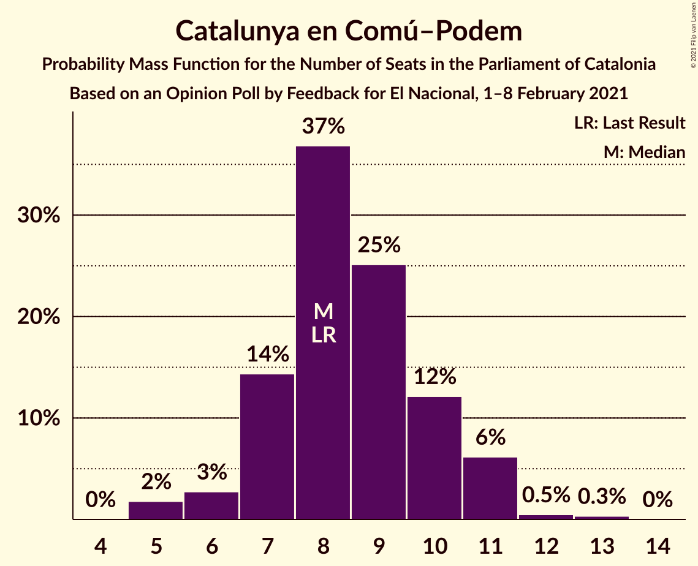

| Number of Seats | Probability | Accumulated | Special Marks |
|:---------------:|:-----------:|:-----------:|:-------------:|
| 5 | 2% | 100% |  |
| 6 | 3% | 98% |  |
| 7 | 14% | 95% |  |
| 8 | 37% | 81% | Last Result, Median |
| 9 | 25% | 44% |  |
| 10 | 12% | 19% |  |
| 11 | 6% | 7% |  |
| 12 | 0.5% | 0.8% |  |
| 13 | 0.3% | 0.3% |  |
| 14 | 0% | 0% |  |

### Vox

*For a full overview of the results for this party, see the [Vox](party-vox.html) page.*

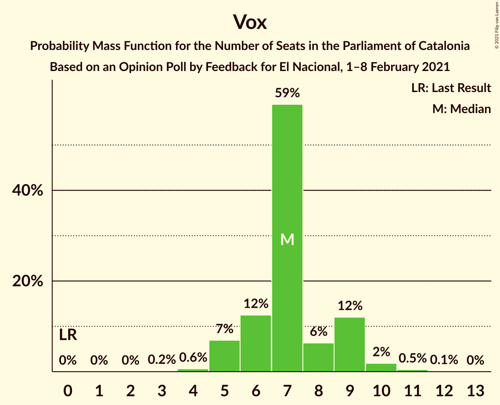

| Number of Seats | Probability | Accumulated | Special Marks |
|:---------------:|:-----------:|:-----------:|:-------------:|
| 0 | 0% | 100% | Last Result |
| 1 | 0% | 100% |  |
| 2 | 0% | 100% |  |
| 3 | 0.2% | 100% |  |
| 4 | 0.6% | 99.8% |  |
| 5 | 7% | 99.2% |  |
| 6 | 12% | 92% |  |
| 7 | 59% | 80% | Median |
| 8 | 6% | 21% |  |
| 9 | 12% | 14% |  |
| 10 | 2% | 2% |  |
| 11 | 0.5% | 0.6% |  |
| 12 | 0.1% | 0.1% |  |
| 13 | 0% | 0% |  |

### Partit Popular

*For a full overview of the results for this party, see the [Partit Popular](party-partitpopular.html) page.*

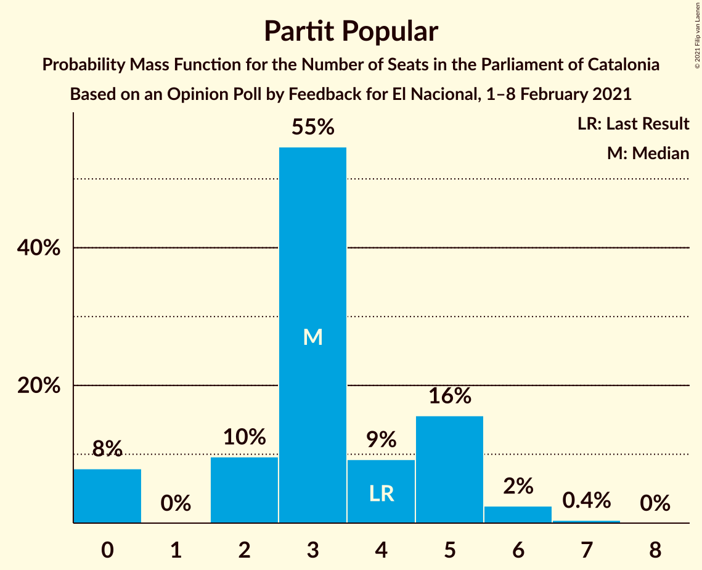

| Number of Seats | Probability | Accumulated | Special Marks |
|:---------------:|:-----------:|:-----------:|:-------------:|
| 0 | 8% | 100% |  |
| 1 | 0% | 92% |  |
| 2 | 10% | 92% |  |
| 3 | 55% | 82% | Median |
| 4 | 9% | 28% | Last Result |
| 5 | 16% | 19% |  |
| 6 | 2% | 3% |  |
| 7 | 0.4% | 0.4% |  |
| 8 | 0% | 0% |  |

### Partit Demòcrata Europeu Català

*For a full overview of the results for this party, see the [Partit Demòcrata Europeu Català](party-partitdemòcrataeuropeucatalà.html) page.*

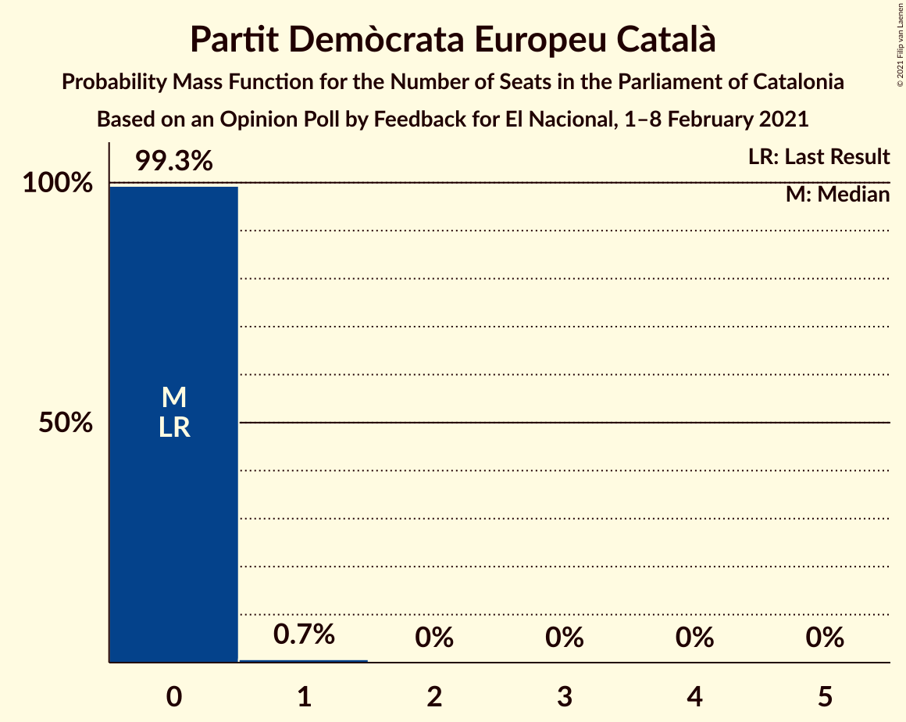

| Number of Seats | Probability | Accumulated | Special Marks |
|:---------------:|:-----------:|:-----------:|:-------------:|
| 0 | 99.3% | 100% | Last Result, Median |
| 1 | 0.7% | 0.7% |  |
| 2 | 0% | 0% |  |

## Coalitions

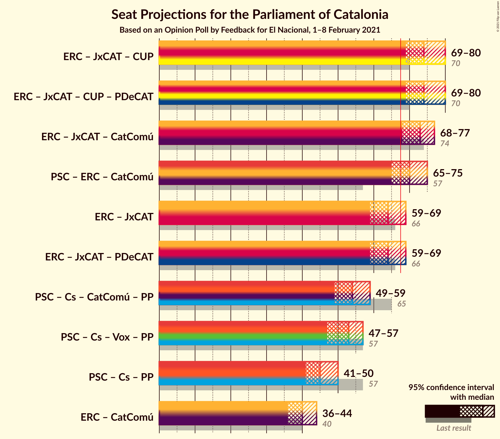

### Confidence Intervals

| Coalition | Last Result | Median | Majority? | 80% Confidence Interval | 90% Confidence Interval | 95% Confidence Interval | 99% Confidence Interval |
|:---------:|:-----------:|:------:|:---------:|:-----------------------:|:-----------------------:|:-----------------------:|:-----------------------:|
| Esquerra Republicana–Catalunya Sí – Junts per Catalunya – Candidatura d’Unitat Popular | 70 | 74 | 99.7% | 71–77 | 70–79 | 69–80 | 68–81 |
| Esquerra Republicana–Catalunya Sí – Junts per Catalunya – Candidatura d’Unitat Popular – Partit Demòcrata Europeu Català | 70 | 74 | 99.7% | 71–77 | 70–79 | 69–80 | 68–81 |
| Esquerra Republicana–Catalunya Sí – Junts per Catalunya – Catalunya en Comú–Podem | 74 | 73 | 98% | 69–75 | 68–76 | 68–77 | 66–79 |
| Partit dels Socialistes de Catalunya (PSC-PSOE) – Esquerra Republicana–Catalunya Sí – Catalunya en Comú–Podem | 57 | 70 | 81% | 66–73 | 66–74 | 65–75 | 63–77 |
| Esquerra Republicana–Catalunya Sí – Junts per Catalunya | 66 | 64 | 8% | 61–67 | 60–68 | 59–69 | 58–71 |
| Esquerra Republicana–Catalunya Sí – Junts per Catalunya – Partit Demòcrata Europeu Català | 66 | 64 | 8% | 61–67 | 60–68 | 59–69 | 58–71 |
| Partit dels Socialistes de Catalunya (PSC-PSOE) – Ciutadans–Partido de la Ciudadanía – Catalunya en Comú–Podem – Partit Popular | 65 | 54 | 0% | 50–57 | 49–58 | 49–59 | 47–60 |
| Partit dels Socialistes de Catalunya (PSC-PSOE) – Ciutadans–Partido de la Ciudadanía – Vox – Partit Popular | 57 | 53 | 0% | 49–55 | 48–56 | 47–57 | 46–59 |
| Partit dels Socialistes de Catalunya (PSC-PSOE) – Ciutadans–Partido de la Ciudadanía – Partit Popular | 57 | 45 | 0% | 42–49 | 41–49 | 41–50 | 39–51 |
| Esquerra Republicana–Catalunya Sí – Catalunya en Comú–Podem | 40 | 40 | 0% | 37–43 | 36–43 | 36–44 | 35–45 |

### Esquerra Republicana–Catalunya Sí – Junts per Catalunya – Candidatura d’Unitat Popular

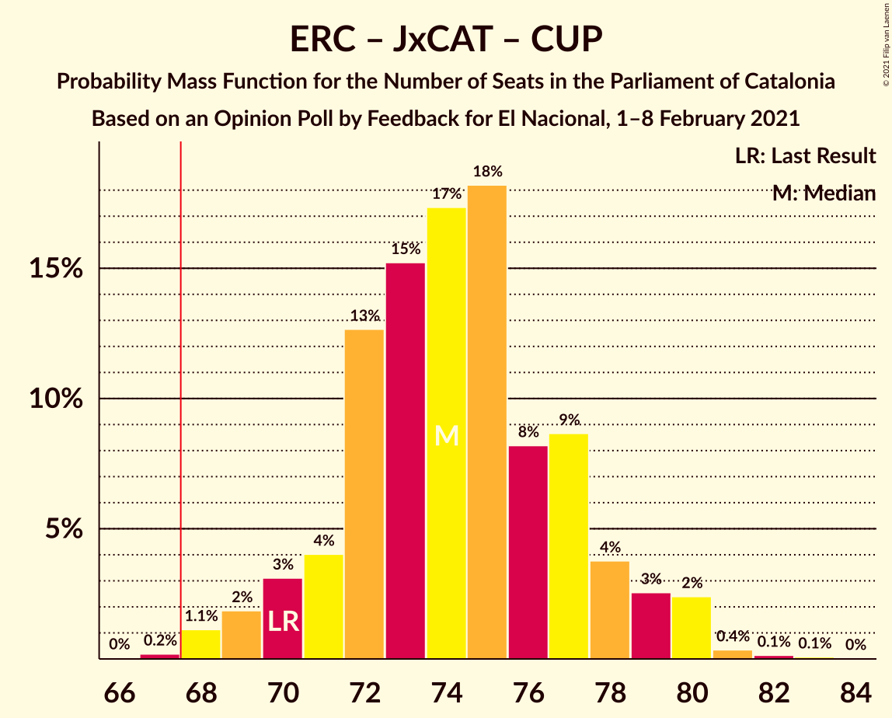

| Number of Seats | Probability | Accumulated | Special Marks |
|:---------------:|:-----------:|:-----------:|:-------------:|
| 66 | 0% | 100% |  |
| 67 | 0.2% | 99.9% |  |
| 68 | 1.1% | 99.7% | Majority |
| 69 | 2% | 98.6% |  |
| 70 | 3% | 97% | Last Result |
| 71 | 4% | 94% |  |
| 72 | 13% | 90% |  |
| 73 | 15% | 77% |  |
| 74 | 17% | 62% | Median |
| 75 | 18% | 44% |  |
| 76 | 8% | 26% |  |
| 77 | 9% | 18% |  |
| 78 | 4% | 9% |  |
| 79 | 3% | 6% |  |
| 80 | 2% | 3% |  |
| 81 | 0.4% | 0.6% |  |
| 82 | 0.1% | 0.3% |  |
| 83 | 0.1% | 0.1% |  |
| 84 | 0% | 0% |  |

### Esquerra Republicana–Catalunya Sí – Junts per Catalunya – Candidatura d’Unitat Popular – Partit Demòcrata Europeu Català

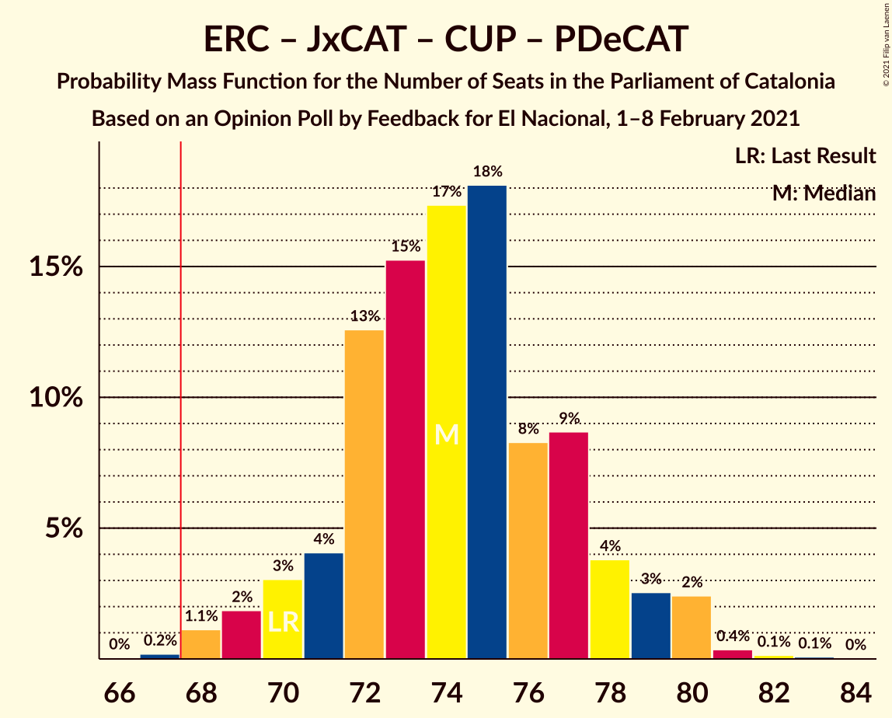

| Number of Seats | Probability | Accumulated | Special Marks |
|:---------------:|:-----------:|:-----------:|:-------------:|
| 66 | 0% | 100% |  |
| 67 | 0.2% | 99.9% |  |
| 68 | 1.1% | 99.7% | Majority |
| 69 | 2% | 98.6% |  |
| 70 | 3% | 97% | Last Result |
| 71 | 4% | 94% |  |
| 72 | 13% | 90% |  |
| 73 | 15% | 77% |  |
| 74 | 17% | 62% | Median |
| 75 | 18% | 44% |  |
| 76 | 8% | 26% |  |
| 77 | 9% | 18% |  |
| 78 | 4% | 9% |  |
| 79 | 3% | 6% |  |
| 80 | 2% | 3% |  |
| 81 | 0.4% | 0.6% |  |
| 82 | 0.1% | 0.3% |  |
| 83 | 0.1% | 0.1% |  |
| 84 | 0% | 0% |  |

### Esquerra Republicana–Catalunya Sí – Junts per Catalunya – Catalunya en Comú–Podem

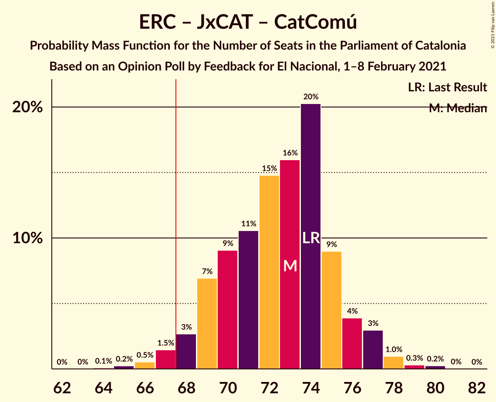

| Number of Seats | Probability | Accumulated | Special Marks |
|:---------------:|:-----------:|:-----------:|:-------------:|
| 64 | 0.1% | 100% |  |
| 65 | 0.2% | 99.9% |  |
| 66 | 0.5% | 99.7% |  |
| 67 | 1.5% | 99.1% |  |
| 68 | 3% | 98% | Majority |
| 69 | 7% | 95% |  |
| 70 | 9% | 88% |  |
| 71 | 11% | 79% |  |
| 72 | 15% | 68% | Median |
| 73 | 16% | 54% |  |
| 74 | 20% | 38% | Last Result |
| 75 | 9% | 17% |  |
| 76 | 4% | 8% |  |
| 77 | 3% | 5% |  |
| 78 | 1.0% | 2% |  |
| 79 | 0.3% | 0.6% |  |
| 80 | 0.2% | 0.3% |  |
| 81 | 0% | 0% |  |

### Partit dels Socialistes de Catalunya (PSC-PSOE) – Esquerra Republicana–Catalunya Sí – Catalunya en Comú–Podem

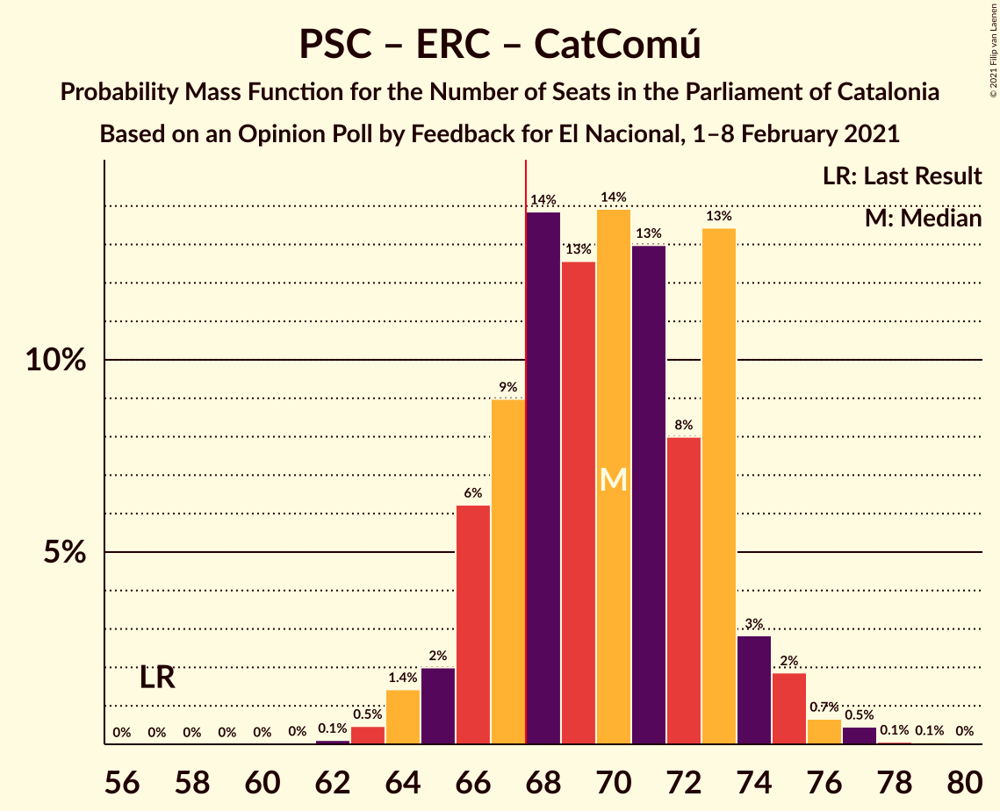

| Number of Seats | Probability | Accumulated | Special Marks |
|:---------------:|:-----------:|:-----------:|:-------------:|
| 57 | 0% | 100% | Last Result |
| 58 | 0% | 100% |  |
| 59 | 0% | 100% |  |
| 60 | 0% | 100% |  |
| 61 | 0% | 100% |  |
| 62 | 0.1% | 100% |  |
| 63 | 0.5% | 99.9% |  |
| 64 | 1.4% | 99.4% |  |
| 65 | 2% | 98% |  |
| 66 | 6% | 96% |  |
| 67 | 9% | 90% |  |
| 68 | 14% | 81% | Majority |
| 69 | 13% | 67% | Median |
| 70 | 14% | 54% |  |
| 71 | 13% | 40% |  |
| 72 | 8% | 27% |  |
| 73 | 13% | 19% |  |
| 74 | 3% | 6% |  |
| 75 | 2% | 3% |  |
| 76 | 0.7% | 1.3% |  |
| 77 | 0.5% | 0.6% |  |
| 78 | 0.1% | 0.2% |  |
| 79 | 0.1% | 0.1% |  |
| 80 | 0% | 0% |  |

### Esquerra Republicana–Catalunya Sí – Junts per Catalunya

| Number of Seats | Probability | Accumulated | Special Marks |
|:---------------:|:-----------:|:-----------:|:-------------:|
| 56 | 0.1% | 100% |  |
| 57 | 0.3% | 99.9% |  |
| 58 | 0.8% | 99.6% |  |
| 59 | 3% | 98.7% |  |
| 60 | 4% | 96% |  |
| 61 | 7% | 92% |  |
| 62 | 10% | 86% |  |
| 63 | 17% | 76% |  |
| 64 | 15% | 59% | Median |
| 65 | 17% | 44% |  |
| 66 | 13% | 27% | Last Result |
| 67 | 5% | 13% |  |
| 68 | 4% | 8% | Majority |
| 69 | 3% | 4% |  |
| 70 | 0.5% | 1.0% |  |
| 71 | 0.4% | 0.5% |  |
| 72 | 0.1% | 0.2% |  |
| 73 | 0% | 0% |  |

### Esquerra Republicana–Catalunya Sí – Junts per Catalunya – Partit Demòcrata Europeu Català

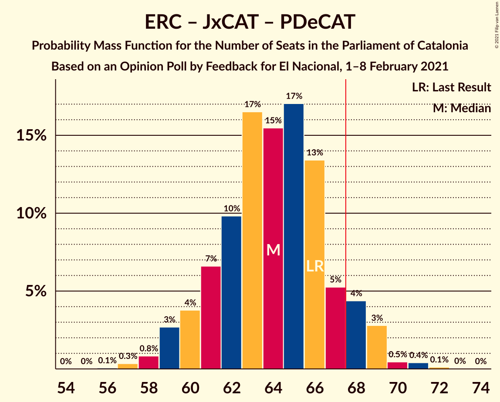

| Number of Seats | Probability | Accumulated | Special Marks |
|:---------------:|:-----------:|:-----------:|:-------------:|
| 56 | 0.1% | 100% |  |
| 57 | 0.3% | 99.9% |  |
| 58 | 0.8% | 99.6% |  |
| 59 | 3% | 98.7% |  |
| 60 | 4% | 96% |  |
| 61 | 7% | 92% |  |
| 62 | 10% | 86% |  |
| 63 | 17% | 76% |  |
| 64 | 15% | 59% | Median |
| 65 | 17% | 44% |  |
| 66 | 13% | 27% | Last Result |
| 67 | 5% | 13% |  |
| 68 | 4% | 8% | Majority |
| 69 | 3% | 4% |  |
| 70 | 0.5% | 1.0% |  |
| 71 | 0.4% | 0.6% |  |
| 72 | 0.1% | 0.2% |  |
| 73 | 0% | 0% |  |

### Partit dels Socialistes de Catalunya (PSC-PSOE) – Ciutadans–Partido de la Ciudadanía – Catalunya en Comú–Podem – Partit Popular

| Number of Seats | Probability | Accumulated | Special Marks |
|:---------------:|:-----------:|:-----------:|:-------------:|
| 45 | 0.1% | 100% |  |
| 46 | 0.1% | 99.9% |  |
| 47 | 0.4% | 99.8% |  |
| 48 | 1.2% | 99.4% |  |
| 49 | 4% | 98% |  |
| 50 | 5% | 94% |  |
| 51 | 7% | 89% |  |
| 52 | 11% | 82% |  |
| 53 | 18% | 71% | Median |
| 54 | 19% | 53% |  |
| 55 | 11% | 34% |  |
| 56 | 12% | 23% |  |
| 57 | 5% | 11% |  |
| 58 | 4% | 6% |  |
| 59 | 1.5% | 3% |  |
| 60 | 0.9% | 1.2% |  |
| 61 | 0.2% | 0.3% |  |
| 62 | 0% | 0.1% |  |
| 63 | 0% | 0% |  |
| 64 | 0% | 0% |  |
| 65 | 0% | 0% | Last Result |

### Partit dels Socialistes de Catalunya (PSC-PSOE) – Ciutadans–Partido de la Ciudadanía – Vox – Partit Popular

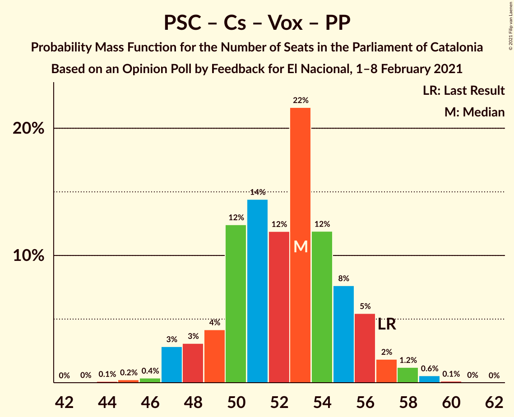

| Number of Seats | Probability | Accumulated | Special Marks |
|:---------------:|:-----------:|:-----------:|:-------------:|
| 44 | 0.1% | 100% |  |
| 45 | 0.2% | 99.9% |  |
| 46 | 0.4% | 99.6% |  |
| 47 | 3% | 99.2% |  |
| 48 | 3% | 96% |  |
| 49 | 4% | 93% |  |
| 50 | 12% | 89% |  |
| 51 | 14% | 77% |  |
| 52 | 12% | 62% | Median |
| 53 | 22% | 50% |  |
| 54 | 12% | 29% |  |
| 55 | 8% | 17% |  |
| 56 | 5% | 9% |  |
| 57 | 2% | 4% | Last Result |
| 58 | 1.2% | 2% |  |
| 59 | 0.6% | 0.7% |  |
| 60 | 0.1% | 0.2% |  |
| 61 | 0% | 0% |  |

### Partit dels Socialistes de Catalunya (PSC-PSOE) – Ciutadans–Partido de la Ciudadanía – Partit Popular

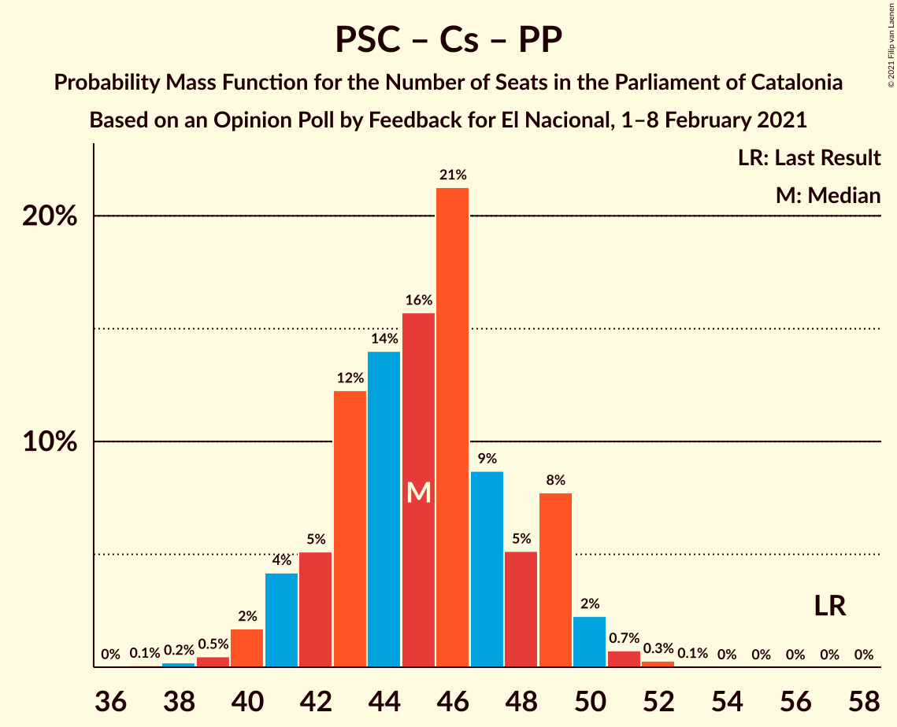

| Number of Seats | Probability | Accumulated | Special Marks |
|:---------------:|:-----------:|:-----------:|:-------------:|
| 37 | 0.1% | 100% |  |
| 38 | 0.2% | 99.9% |  |
| 39 | 0.5% | 99.7% |  |
| 40 | 2% | 99.2% |  |
| 41 | 4% | 98% |  |
| 42 | 5% | 93% |  |
| 43 | 12% | 88% |  |
| 44 | 14% | 76% |  |
| 45 | 16% | 62% | Median |
| 46 | 21% | 46% |  |
| 47 | 9% | 25% |  |
| 48 | 5% | 16% |  |
| 49 | 8% | 11% |  |
| 50 | 2% | 3% |  |
| 51 | 0.7% | 1.1% |  |
| 52 | 0.3% | 0.4% |  |
| 53 | 0.1% | 0.1% |  |
| 54 | 0% | 0% |  |
| 55 | 0% | 0% |  |
| 56 | 0% | 0% |  |
| 57 | 0% | 0% | Last Result |

### Esquerra Republicana–Catalunya Sí – Catalunya en Comú–Podem

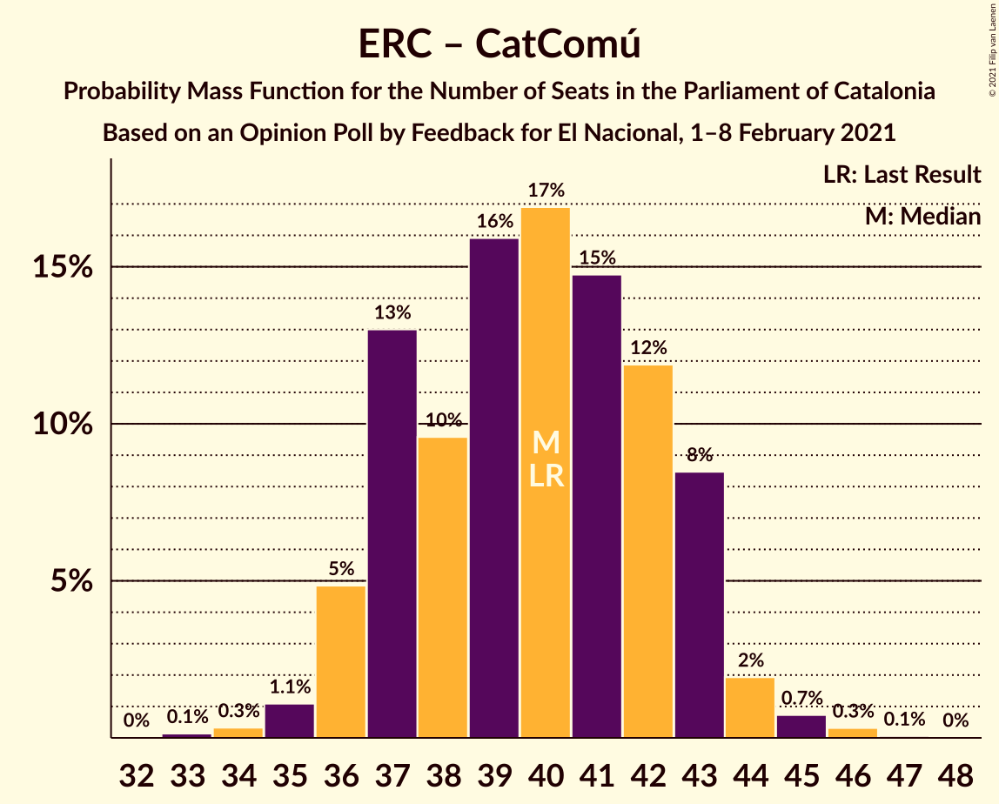

| Number of Seats | Probability | Accumulated | Special Marks |
|:---------------:|:-----------:|:-----------:|:-------------:|
| 33 | 0.1% | 100% |  |
| 34 | 0.3% | 99.8% |  |
| 35 | 1.1% | 99.5% |  |
| 36 | 5% | 98% |  |
| 37 | 13% | 94% |  |
| 38 | 10% | 81% |  |
| 39 | 16% | 71% | Median |
| 40 | 17% | 55% | Last Result |
| 41 | 15% | 38% |  |
| 42 | 12% | 23% |  |
| 43 | 8% | 12% |  |
| 44 | 2% | 3% |  |
| 45 | 0.7% | 1.1% |  |
| 46 | 0.3% | 0.4% |  |
| 47 | 0.1% | 0.1% |  |
| 48 | 0% | 0% |  |

## Technical Information

### Opinion Poll

+ **Polling firm:** Feedback
+ **Commissioner(s):** El Nacional
+ **Fieldwork period:** 1–8 February 2021

### Calculations

+ **Sample size:** 1000
+ **Simulations done:** 1,048,576
+ **Error estimate:** 1.75%

