# Opinion Poll by GESOP for El Periòdic, 6–8 February 2021

<a href="#voting-intentions">Voting Intentions</a> | <a href="#seats">Seats</a> | <a href="#coalitions">Coalitions</a> | <a href="#technical-information">Technical Information</a>

## Voting Intentions

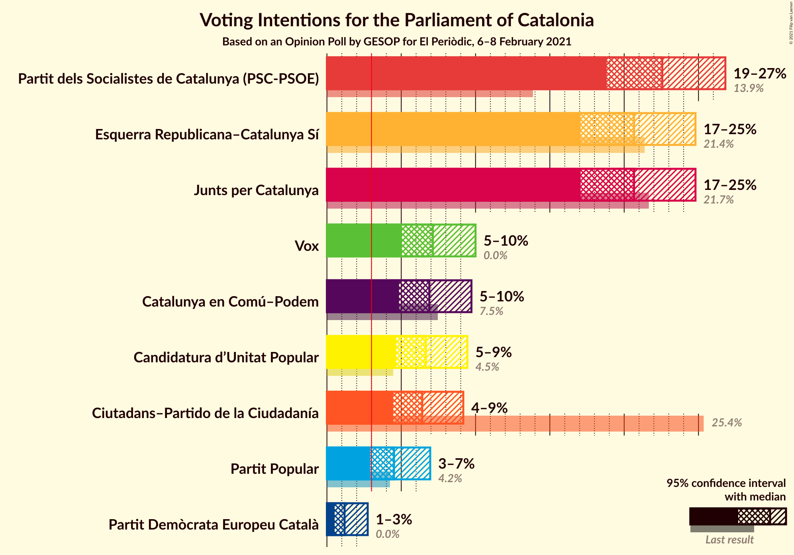

### Confidence Intervals

| Party | Last Result | Poll Result | 80% Confidence Interval | 90% Confidence Interval | 95% Confidence Interval | 99% Confidence Interval |
|:-----:|:-----------:|:-----------:|:-----------------------:|:-----------------------:|:-----------------------:|:-----------------------:|
| Partit dels Socialistes de Catalunya (PSC-PSOE) | 13.9% | 22.6% | 20.1–25.3% |19.4–26.1% |18.8–26.8% |17.7–28.2% |
| Esquerra Republicana–Catalunya Sí | 21.4% | 20.7% | 18.3–23.4% |17.6–24.1% |17.1–24.8% |16.0–26.1% |
| Junts per Catalunya | 21.7% | 20.7% | 18.3–23.4% |17.6–24.1% |17.1–24.8% |16.0–26.1% |
| Vox | 0.0% | 7.1% | 5.7–9.0% |5.4–9.5% |5.0–10.0% |4.5–11.0% |
| Catalunya en Comú–Podem | 7.5% | 6.9% | 5.5–8.7% |5.2–9.3% |4.8–9.7% |4.3–10.7% |
| Candidatura d’Unitat Popular | 4.5% | 6.7% | 5.3–8.5% |5.0–9.0% |4.6–9.4% |4.1–10.4% |
| Ciutadans–Partido de la Ciudadanía | 25.4% | 6.4% | 5.1–8.2% |4.8–8.7% |4.5–9.2% |3.9–10.1% |
| Partit Popular | 4.2% | 4.5% | 3.5–6.1% |3.2–6.5% |2.9–7.0% |2.5–7.8% |
| Partit Demòcrata Europeu Català | 0.0% | 1.2% | 0.7–2.2% |0.6–2.5% |0.5–2.7% |0.4–3.3% |

*Note:* The poll result column reflects the actual value used in the calculations. Published results may vary slightly, and in addition be rounded to fewer digits.

## Seats

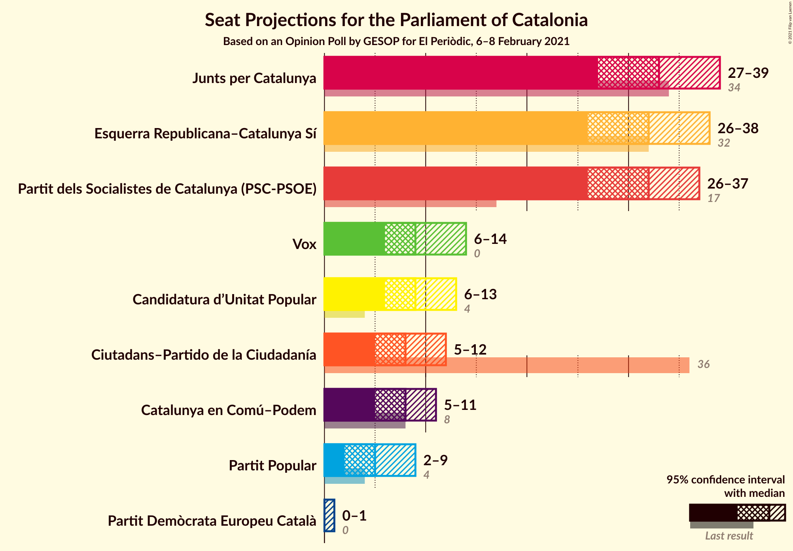

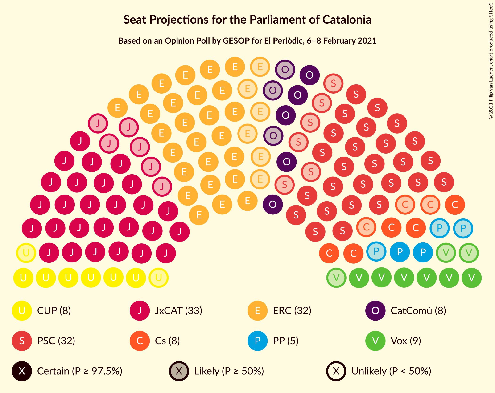

### Confidence Intervals

| Party | Last Result | Median | 80% Confidence Interval | 90% Confidence Interval | 95% Confidence Interval | 99% Confidence Interval |
|:-----:|:-----------:|:------:|:-----------------------:|:-----------------------:|:-----------------------:|:-----------------------:|
| <a href="#partit-dels-socialistes-de-catalunya-(psc-psoe)">Partit dels Socialistes de Catalunya (PSC-PSOE)</a> | 17 | 32 | 27–35 |26–36 |26–37 |24–39 |
| <a href="#esquerra-republicana–catalunya-sí">Esquerra Republicana–Catalunya Sí</a> | 32 | 32 | 28–36 |26–38 |26–38 |23–40 |
| <a href="#junts-per-catalunya">Junts per Catalunya</a> | 34 | 33 | 29–37 |28–38 |27–39 |26–41 |
| <a href="#vox">Vox</a> | 0 | 9 | 7–12 |7–13 |6–14 |5–15 |
| <a href="#catalunya-en-comú–podem">Catalunya en Comú–Podem</a> | 8 | 8 | 5–11 |5–11 |5–11 |4–13 |
| <a href="#candidatura-d’unitat-popular">Candidatura d’Unitat Popular</a> | 4 | 9 | 7–11 |7–12 |6–13 |4–15 |
| <a href="#ciutadans–partido-de-la-ciudadanía">Ciutadans–Partido de la Ciudadanía</a> | 36 | 8 | 5–11 |5–12 |5–12 |4–13 |
| <a href="#partit-popular">Partit Popular</a> | 4 | 5 | 3–7 |2–8 |2–9 |0–10 |
| <a href="#partit-demòcrata-europeu-català">Partit Demòcrata Europeu Català</a> | 0 | 0 | 0 |0 |0–1 |0–1 |

### Partit dels Socialistes de Catalunya (PSC-PSOE)

*For a full overview of the results for this party, see the [Partit dels Socialistes de Catalunya (PSC-PSOE)](party-partitdelssocialistesdecatalunyapsc-psoe.html) page.*

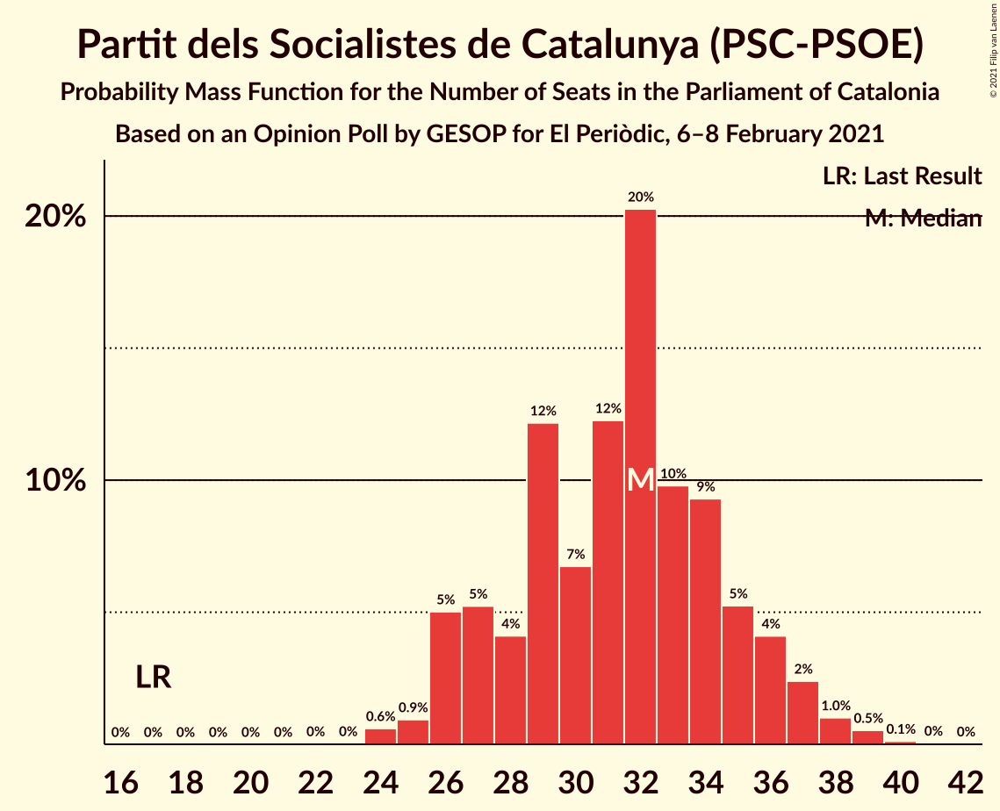

| Number of Seats | Probability | Accumulated | Special Marks |
|:---------------:|:-----------:|:-----------:|:-------------:|
| 17 | 0% | 100% | Last Result |
| 18 | 0% | 100% |  |
| 19 | 0% | 100% |  |
| 20 | 0% | 100% |  |
| 21 | 0% | 100% |  |
| 22 | 0% | 100% |  |
| 23 | 0% | 100% |  |
| 24 | 0.6% | 99.9% |  |
| 25 | 0.9% | 99.3% |  |
| 26 | 5% | 98% |  |
| 27 | 5% | 93% |  |
| 28 | 4% | 88% |  |
| 29 | 12% | 84% |  |
| 30 | 7% | 72% |  |
| 31 | 12% | 65% |  |
| 32 | 20% | 53% | Median |
| 33 | 10% | 33% |  |
| 34 | 9% | 23% |  |
| 35 | 5% | 13% |  |
| 36 | 4% | 8% |  |
| 37 | 2% | 4% |  |
| 38 | 1.0% | 2% |  |
| 39 | 0.5% | 0.7% |  |
| 40 | 0.1% | 0.2% |  |
| 41 | 0% | 0.1% |  |
| 42 | 0% | 0% |  |

### Esquerra Republicana–Catalunya Sí

*For a full overview of the results for this party, see the [Esquerra Republicana–Catalunya Sí](party-esquerrarepublicana–catalunyasí.html) page.*

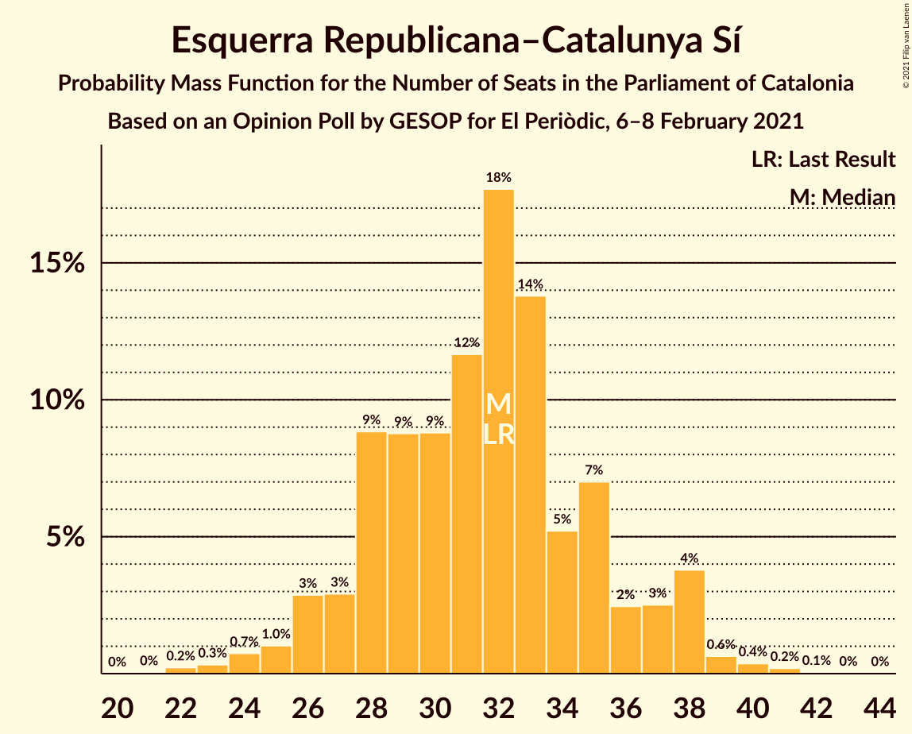

| Number of Seats | Probability | Accumulated | Special Marks |
|:---------------:|:-----------:|:-----------:|:-------------:|
| 22 | 0.2% | 100% |  |
| 23 | 0.3% | 99.7% |  |
| 24 | 0.7% | 99.4% |  |
| 25 | 1.0% | 98.7% |  |
| 26 | 3% | 98% |  |
| 27 | 3% | 95% |  |
| 28 | 9% | 92% |  |
| 29 | 9% | 83% |  |
| 30 | 9% | 74% |  |
| 31 | 12% | 65% |  |
| 32 | 18% | 54% | Last Result, Median |
| 33 | 14% | 36% |  |
| 34 | 5% | 22% |  |
| 35 | 7% | 17% |  |
| 36 | 2% | 10% |  |
| 37 | 3% | 8% |  |
| 38 | 4% | 5% |  |
| 39 | 0.6% | 1.3% |  |
| 40 | 0.4% | 0.7% |  |
| 41 | 0.2% | 0.3% |  |
| 42 | 0.1% | 0.1% |  |
| 43 | 0% | 0% |  |

### Junts per Catalunya

*For a full overview of the results for this party, see the [Junts per Catalunya](party-juntspercatalunya.html) page.*

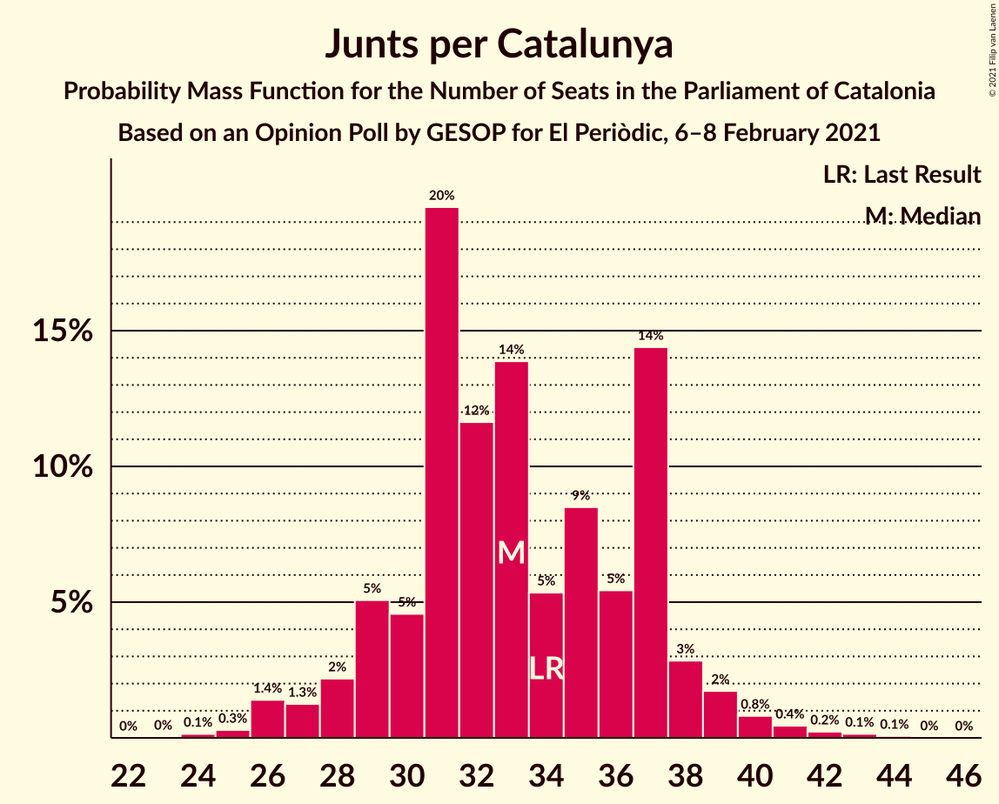

| Number of Seats | Probability | Accumulated | Special Marks |
|:---------------:|:-----------:|:-----------:|:-------------:|
| 24 | 0.1% | 100% |  |
| 25 | 0.3% | 99.8% |  |
| 26 | 1.4% | 99.5% |  |
| 27 | 1.3% | 98% |  |
| 28 | 2% | 97% |  |
| 29 | 5% | 95% |  |
| 30 | 5% | 90% |  |
| 31 | 20% | 85% |  |
| 32 | 12% | 65% |  |
| 33 | 14% | 54% | Median |
| 34 | 5% | 40% | Last Result |
| 35 | 9% | 35% |  |
| 36 | 5% | 26% |  |
| 37 | 14% | 21% |  |
| 38 | 3% | 6% |  |
| 39 | 2% | 3% |  |
| 40 | 0.8% | 2% |  |
| 41 | 0.4% | 0.9% |  |
| 42 | 0.2% | 0.5% |  |
| 43 | 0.1% | 0.2% |  |
| 44 | 0.1% | 0.1% |  |
| 45 | 0% | 0% |  |

### Vox

*For a full overview of the results for this party, see the [Vox](party-vox.html) page.*

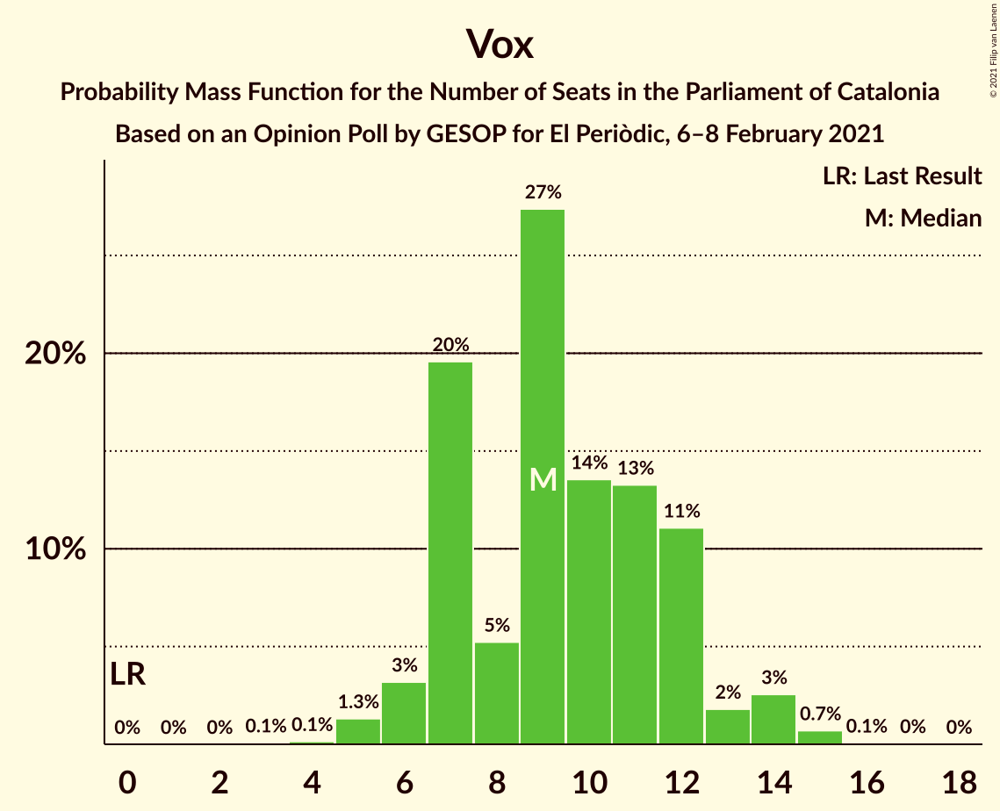

| Number of Seats | Probability | Accumulated | Special Marks |
|:---------------:|:-----------:|:-----------:|:-------------:|
| 0 | 0% | 100% | Last Result |
| 1 | 0% | 100% |  |
| 2 | 0% | 100% |  |
| 3 | 0.1% | 100% |  |
| 4 | 0.1% | 99.9% |  |
| 5 | 1.3% | 99.8% |  |
| 6 | 3% | 98% |  |
| 7 | 20% | 95% |  |
| 8 | 5% | 76% |  |
| 9 | 27% | 70% | Median |
| 10 | 14% | 43% |  |
| 11 | 13% | 30% |  |
| 12 | 11% | 16% |  |
| 13 | 2% | 5% |  |
| 14 | 3% | 3% |  |
| 15 | 0.7% | 0.8% |  |
| 16 | 0.1% | 0.1% |  |
| 17 | 0% | 0.1% |  |
| 18 | 0% | 0% |  |

### Catalunya en Comú–Podem

*For a full overview of the results for this party, see the [Catalunya en Comú–Podem](party-catalunyaencomú–podem.html) page.*

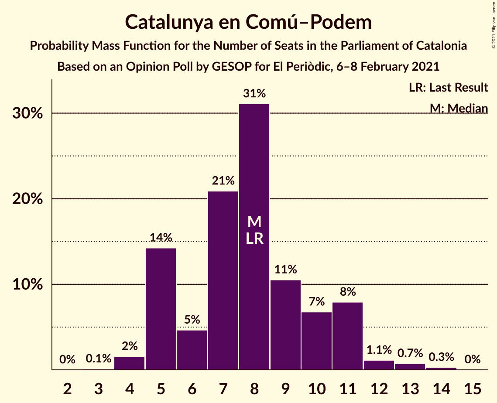

| Number of Seats | Probability | Accumulated | Special Marks |
|:---------------:|:-----------:|:-----------:|:-------------:|
| 3 | 0.1% | 100% |  |
| 4 | 2% | 99.9% |  |
| 5 | 14% | 98% |  |
| 6 | 5% | 84% |  |
| 7 | 21% | 79% |  |
| 8 | 31% | 59% | Last Result, Median |
| 9 | 11% | 27% |  |
| 10 | 7% | 17% |  |
| 11 | 8% | 10% |  |
| 12 | 1.1% | 2% |  |
| 13 | 0.7% | 1.1% |  |
| 14 | 0.3% | 0.3% |  |
| 15 | 0% | 0% |  |

### Candidatura d’Unitat Popular

*For a full overview of the results for this party, see the [Candidatura d’Unitat Popular](party-candidaturad’unitatpopular.html) page.*

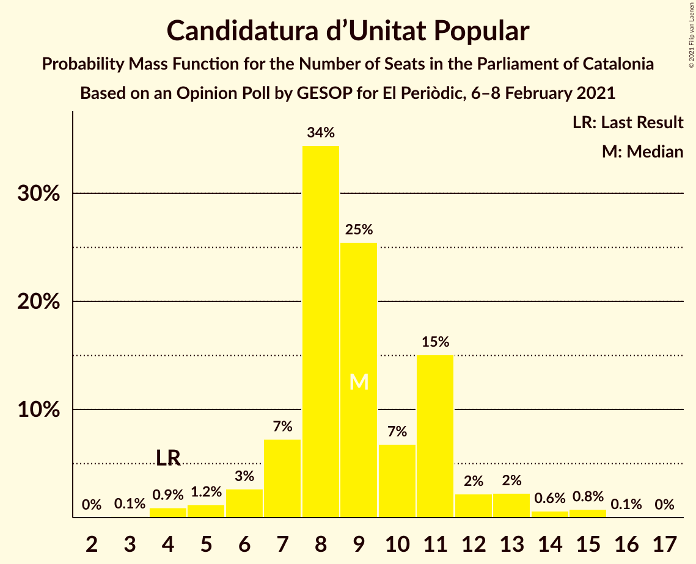

| Number of Seats | Probability | Accumulated | Special Marks |
|:---------------:|:-----------:|:-----------:|:-------------:|
| 3 | 0.1% | 100% |  |
| 4 | 0.9% | 99.9% | Last Result |
| 5 | 1.2% | 98.9% |  |
| 6 | 3% | 98% |  |
| 7 | 7% | 95% |  |
| 8 | 34% | 88% |  |
| 9 | 25% | 53% | Median |
| 10 | 7% | 28% |  |
| 11 | 15% | 21% |  |
| 12 | 2% | 6% |  |
| 13 | 2% | 4% |  |
| 14 | 0.6% | 1.5% |  |
| 15 | 0.8% | 0.9% |  |
| 16 | 0.1% | 0.1% |  |
| 17 | 0% | 0% |  |

### Ciutadans–Partido de la Ciudadanía

*For a full overview of the results for this party, see the [Ciutadans–Partido de la Ciudadanía](party-ciutadans–partidodelaciudadanía.html) page.*

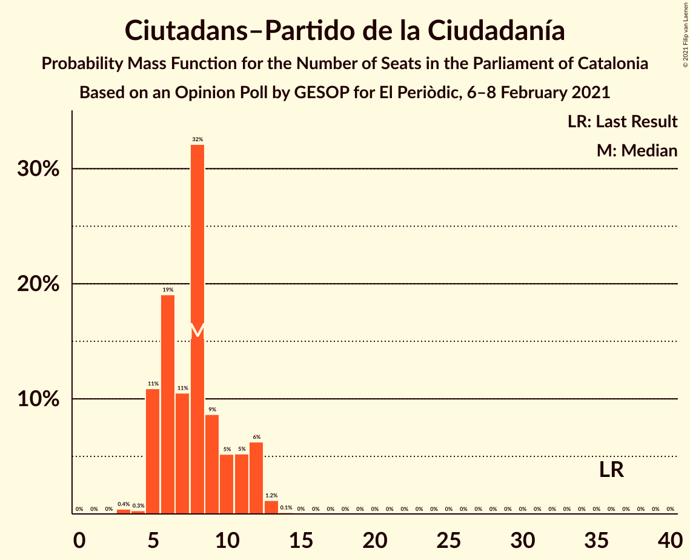

| Number of Seats | Probability | Accumulated | Special Marks |
|:---------------:|:-----------:|:-----------:|:-------------:|
| 3 | 0.4% | 100% |  |
| 4 | 0.3% | 99.6% |  |
| 5 | 11% | 99.3% |  |
| 6 | 19% | 88% |  |
| 7 | 11% | 69% |  |
| 8 | 32% | 59% | Median |
| 9 | 9% | 27% |  |
| 10 | 5% | 18% |  |
| 11 | 5% | 13% |  |
| 12 | 6% | 8% |  |
| 13 | 1.2% | 1.3% |  |
| 14 | 0.1% | 0.2% |  |
| 15 | 0% | 0% |  |
| 16 | 0% | 0% |  |
| 17 | 0% | 0% |  |
| 18 | 0% | 0% |  |
| 19 | 0% | 0% |  |
| 20 | 0% | 0% |  |
| 21 | 0% | 0% |  |
| 22 | 0% | 0% |  |
| 23 | 0% | 0% |  |
| 24 | 0% | 0% |  |
| 25 | 0% | 0% |  |
| 26 | 0% | 0% |  |
| 27 | 0% | 0% |  |
| 28 | 0% | 0% |  |
| 29 | 0% | 0% |  |
| 30 | 0% | 0% |  |
| 31 | 0% | 0% |  |
| 32 | 0% | 0% |  |
| 33 | 0% | 0% |  |
| 34 | 0% | 0% |  |
| 35 | 0% | 0% |  |
| 36 | 0% | 0% | Last Result |

### Partit Popular

*For a full overview of the results for this party, see the [Partit Popular](party-partitpopular.html) page.*

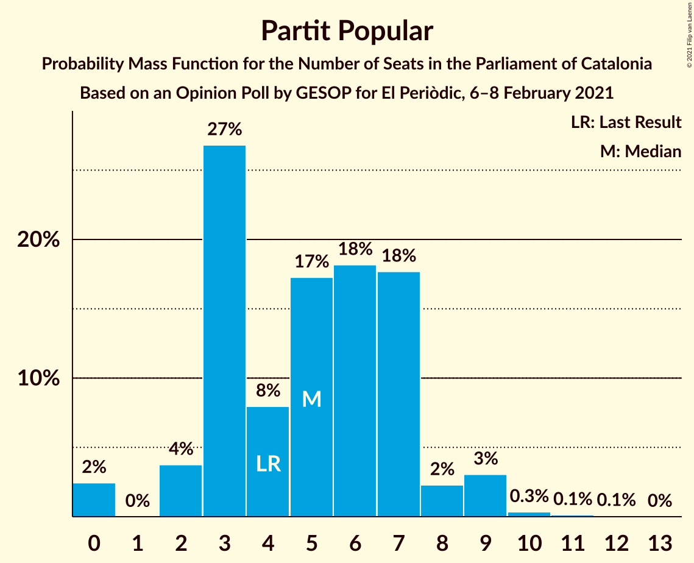

| Number of Seats | Probability | Accumulated | Special Marks |
|:---------------:|:-----------:|:-----------:|:-------------:|
| 0 | 2% | 100% |  |
| 1 | 0% | 98% |  |
| 2 | 4% | 98% |  |
| 3 | 27% | 94% |  |
| 4 | 8% | 67% | Last Result |
| 5 | 17% | 59% | Median |
| 6 | 18% | 42% |  |
| 7 | 18% | 24% |  |
| 8 | 2% | 6% |  |
| 9 | 3% | 4% |  |
| 10 | 0.3% | 0.6% |  |
| 11 | 0.1% | 0.2% |  |
| 12 | 0.1% | 0.1% |  |
| 13 | 0% | 0% |  |

### Partit Demòcrata Europeu Català

*For a full overview of the results for this party, see the [Partit Demòcrata Europeu Català](party-partitdemòcrataeuropeucatalà.html) page.*

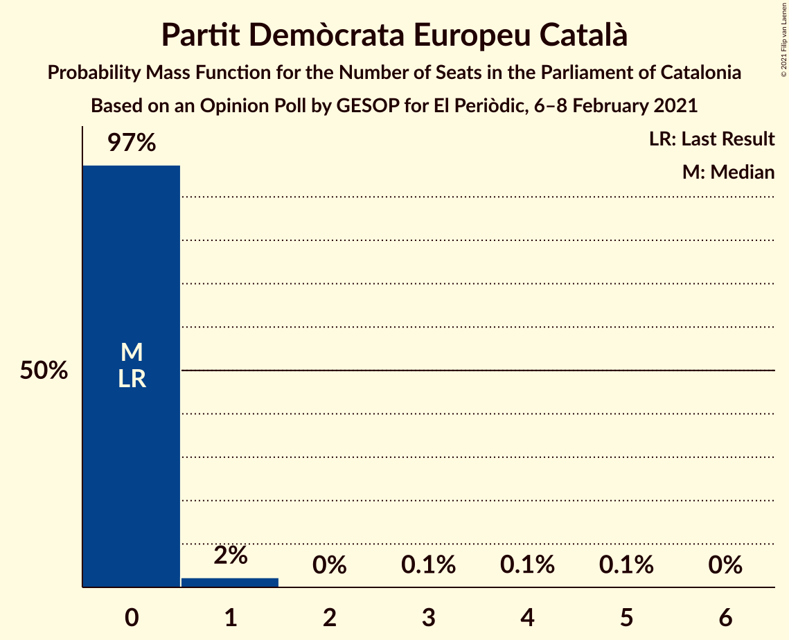

| Number of Seats | Probability | Accumulated | Special Marks |
|:---------------:|:-----------:|:-----------:|:-------------:|
| 0 | 97% | 100% | Last Result, Median |
| 1 | 2% | 3% |  |
| 2 | 0% | 0.3% |  |
| 3 | 0.1% | 0.3% |  |
| 4 | 0.1% | 0.2% |  |
| 5 | 0.1% | 0.1% |  |
| 6 | 0% | 0% |  |

## Coalitions

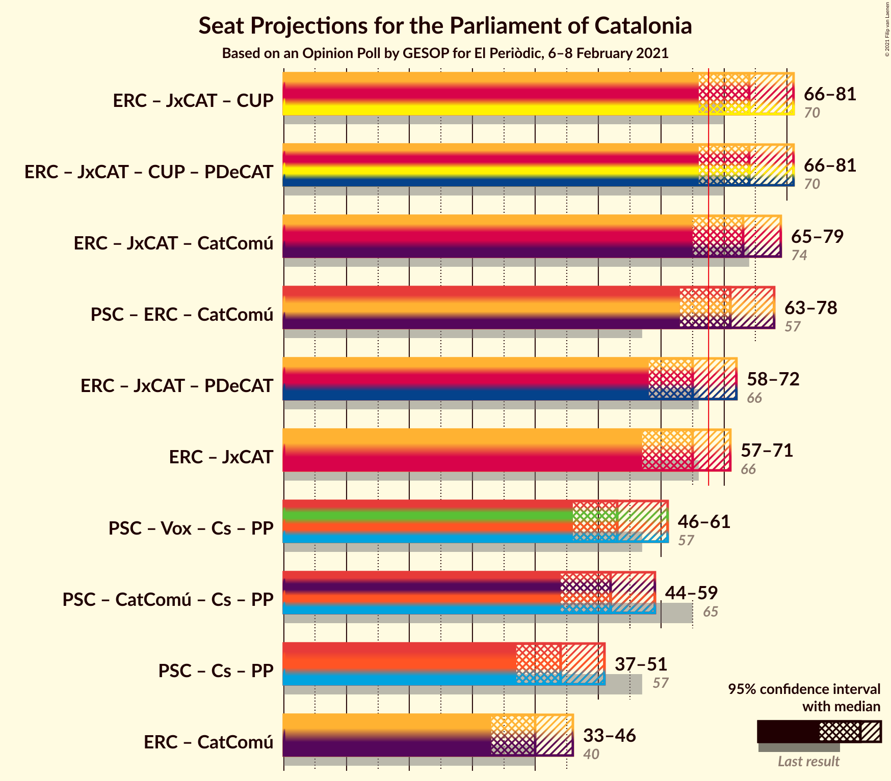

### Confidence Intervals

| Coalition | Last Result | Median | Majority? | 80% Confidence Interval | 90% Confidence Interval | 95% Confidence Interval | 99% Confidence Interval |
|:---------:|:-----------:|:------:|:---------:|:-----------------------:|:-----------------------:|:-----------------------:|:-----------------------:|
| Esquerra Republicana–Catalunya Sí – Junts per Catalunya – Candidatura d’Unitat Popular | 70 | 74 | 94% | 68–79 | 67–80 | 66–81 | 64–83 |
| Esquerra Republicana–Catalunya Sí – Junts per Catalunya – Candidatura d’Unitat Popular – Partit Demòcrata Europeu Català | 70 | 74 | 94% | 68–79 | 67–80 | 66–81 | 64–83 |
| Esquerra Republicana–Catalunya Sí – Junts per Catalunya – Catalunya en Comú–Podem | 74 | 73 | 89% | 67–77 | 67–78 | 65–79 | 63–81 |
| Partit dels Socialistes de Catalunya (PSC-PSOE) – Esquerra Republicana–Catalunya Sí – Catalunya en Comú–Podem | 57 | 71 | 79% | 65–76 | 64–77 | 63–78 | 61–80 |
| Esquerra Republicana–Catalunya Sí – Junts per Catalunya – Partit Demòcrata Europeu Català | 66 | 65 | 24% | 59–69 | 58–71 | 58–72 | 56–74 |
| Esquerra Republicana–Catalunya Sí – Junts per Catalunya | 66 | 65 | 24% | 59–69 | 58–71 | 57–71 | 56–74 |
| Partit dels Socialistes de Catalunya (PSC-PSOE) – Vox – Ciutadans–Partido de la Ciudadanía – Partit Popular | 57 | 53 | 0% | 49–59 | 48–60 | 46–61 | 44–63 |
| Partit dels Socialistes de Catalunya (PSC-PSOE) – Catalunya en Comú–Podem – Ciutadans–Partido de la Ciudadanía – Partit Popular | 65 | 52 | 0% | 47–57 | 45–58 | 44–59 | 43–62 |
| Partit dels Socialistes de Catalunya (PSC-PSOE) – Ciutadans–Partido de la Ciudadanía – Partit Popular | 57 | 44 | 0% | 40–49 | 38–50 | 37–51 | 35–53 |
| Esquerra Republicana–Catalunya Sí – Catalunya en Comú–Podem | 40 | 40 | 0% | 35–44 | 34–45 | 33–46 | 30–49 |

### Esquerra Republicana–Catalunya Sí – Junts per Catalunya – Candidatura d’Unitat Popular

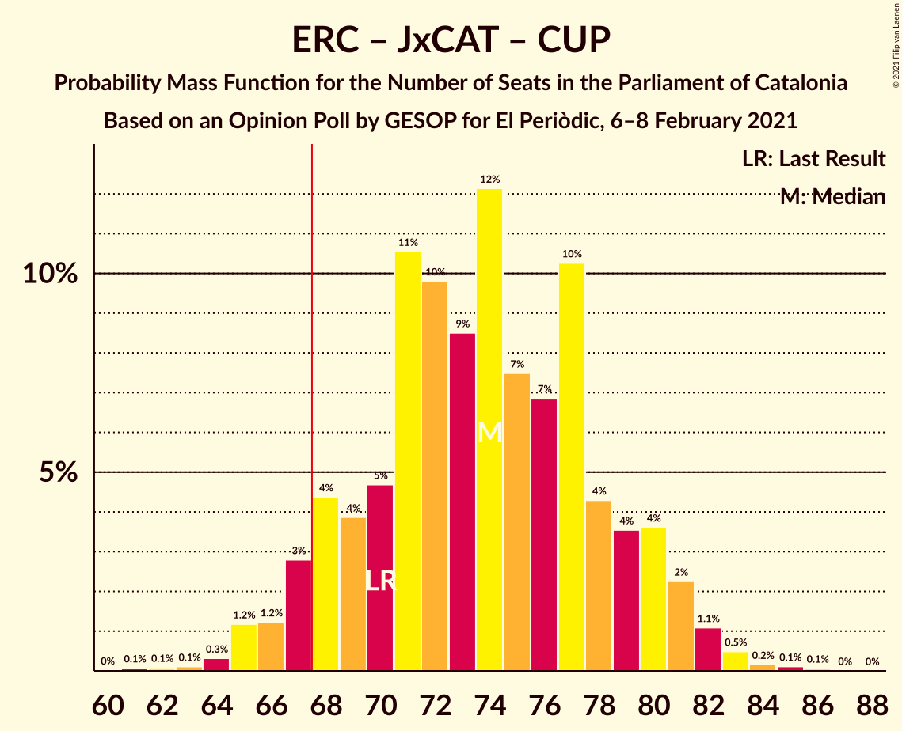

| Number of Seats | Probability | Accumulated | Special Marks |
|:---------------:|:-----------:|:-----------:|:-------------:|
| 61 | 0.1% | 100% |  |
| 62 | 0.1% | 99.9% |  |
| 63 | 0.1% | 99.8% |  |
| 64 | 0.3% | 99.7% |  |
| 65 | 1.2% | 99.4% |  |
| 66 | 1.2% | 98% |  |
| 67 | 3% | 97% |  |
| 68 | 4% | 94% | Majority |
| 69 | 4% | 90% |  |
| 70 | 5% | 86% | Last Result |
| 71 | 11% | 81% |  |
| 72 | 10% | 71% |  |
| 73 | 9% | 61% |  |
| 74 | 12% | 52% | Median |
| 75 | 7% | 40% |  |
| 76 | 7% | 33% |  |
| 77 | 10% | 26% |  |
| 78 | 4% | 16% |  |
| 79 | 4% | 11% |  |
| 80 | 4% | 8% |  |
| 81 | 2% | 4% |  |
| 82 | 1.1% | 2% |  |
| 83 | 0.5% | 0.8% |  |
| 84 | 0.2% | 0.4% |  |
| 85 | 0.1% | 0.2% |  |
| 86 | 0.1% | 0.1% |  |
| 87 | 0% | 0% |  |

### Esquerra Republicana–Catalunya Sí – Junts per Catalunya – Candidatura d’Unitat Popular – Partit Demòcrata Europeu Català

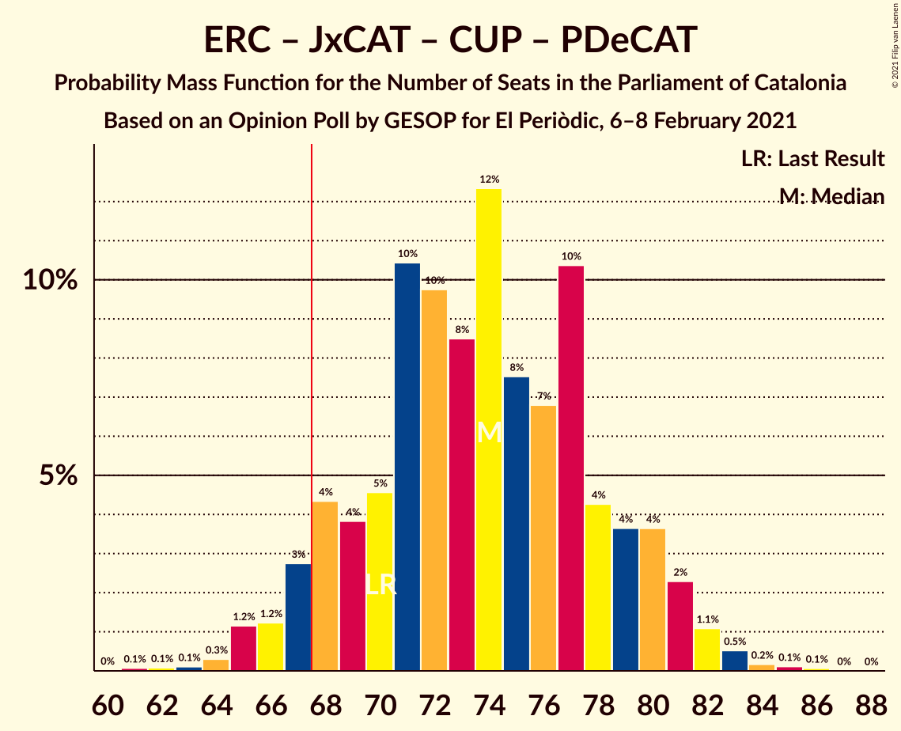

| Number of Seats | Probability | Accumulated | Special Marks |
|:---------------:|:-----------:|:-----------:|:-------------:|
| 61 | 0.1% | 100% |  |
| 62 | 0.1% | 99.9% |  |
| 63 | 0.1% | 99.8% |  |
| 64 | 0.3% | 99.7% |  |
| 65 | 1.2% | 99.4% |  |
| 66 | 1.2% | 98% |  |
| 67 | 3% | 97% |  |
| 68 | 4% | 94% | Majority |
| 69 | 4% | 90% |  |
| 70 | 5% | 86% | Last Result |
| 71 | 10% | 82% |  |
| 72 | 10% | 71% |  |
| 73 | 8% | 61% |  |
| 74 | 12% | 53% | Median |
| 75 | 8% | 41% |  |
| 76 | 7% | 33% |  |
| 77 | 10% | 26% |  |
| 78 | 4% | 16% |  |
| 79 | 4% | 12% |  |
| 80 | 4% | 8% |  |
| 81 | 2% | 4% |  |
| 82 | 1.1% | 2% |  |
| 83 | 0.5% | 0.9% |  |
| 84 | 0.2% | 0.4% |  |
| 85 | 0.1% | 0.2% |  |
| 86 | 0.1% | 0.1% |  |
| 87 | 0% | 0% |  |

### Esquerra Republicana–Catalunya Sí – Junts per Catalunya – Catalunya en Comú–Podem

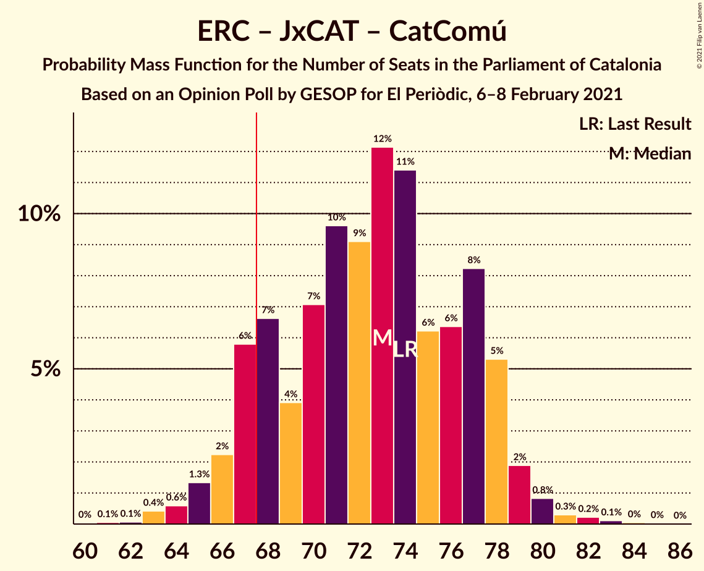

| Number of Seats | Probability | Accumulated | Special Marks |
|:---------------:|:-----------:|:-----------:|:-------------:|
| 60 | 0% | 100% |  |
| 61 | 0.1% | 99.9% |  |
| 62 | 0.1% | 99.9% |  |
| 63 | 0.4% | 99.8% |  |
| 64 | 0.6% | 99.4% |  |
| 65 | 1.3% | 98.8% |  |
| 66 | 2% | 97% |  |
| 67 | 6% | 95% |  |
| 68 | 7% | 89% | Majority |
| 69 | 4% | 83% |  |
| 70 | 7% | 79% |  |
| 71 | 10% | 72% |  |
| 72 | 9% | 62% |  |
| 73 | 12% | 53% | Median |
| 74 | 11% | 41% | Last Result |
| 75 | 6% | 30% |  |
| 76 | 6% | 23% |  |
| 77 | 8% | 17% |  |
| 78 | 5% | 9% |  |
| 79 | 2% | 3% |  |
| 80 | 0.8% | 2% |  |
| 81 | 0.3% | 0.7% |  |
| 82 | 0.2% | 0.4% |  |
| 83 | 0.1% | 0.2% |  |
| 84 | 0% | 0.1% |  |
| 85 | 0% | 0% |  |

### Partit dels Socialistes de Catalunya (PSC-PSOE) – Esquerra Republicana–Catalunya Sí – Catalunya en Comú–Podem

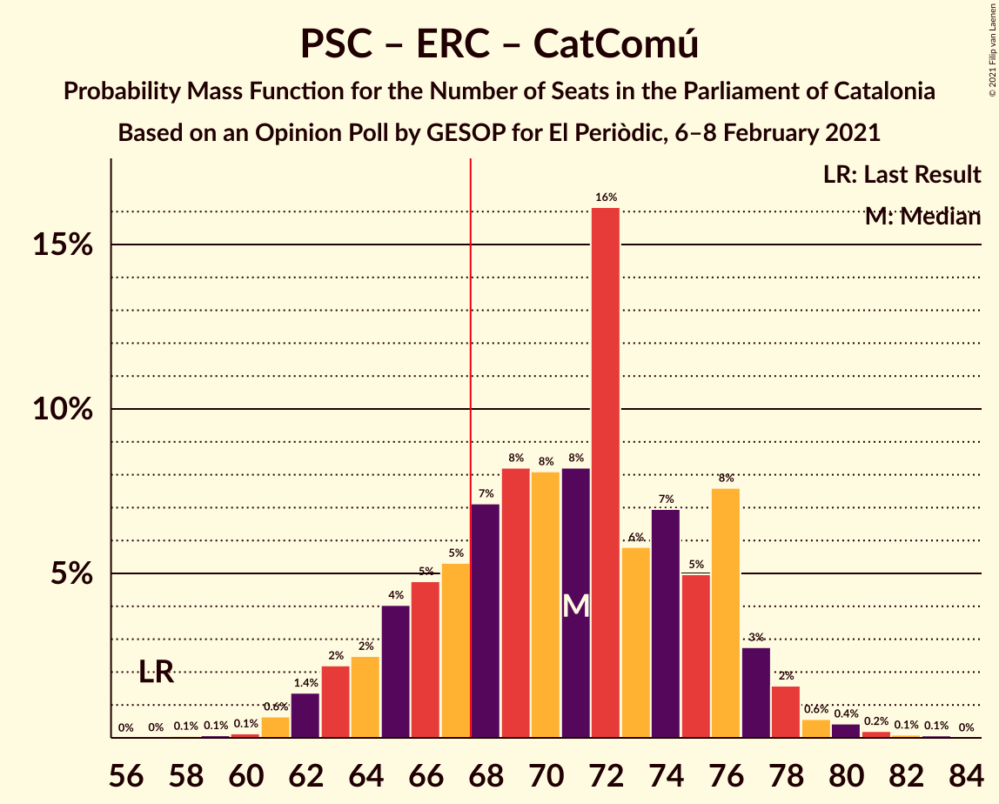

| Number of Seats | Probability | Accumulated | Special Marks |
|:---------------:|:-----------:|:-----------:|:-------------:|
| 57 | 0% | 100% | Last Result |
| 58 | 0.1% | 100% |  |
| 59 | 0.1% | 99.9% |  |
| 60 | 0.1% | 99.8% |  |
| 61 | 0.6% | 99.7% |  |
| 62 | 1.4% | 99.1% |  |
| 63 | 2% | 98% |  |
| 64 | 2% | 95% |  |
| 65 | 4% | 93% |  |
| 66 | 5% | 89% |  |
| 67 | 5% | 84% |  |
| 68 | 7% | 79% | Majority |
| 69 | 8% | 72% |  |
| 70 | 8% | 64% |  |
| 71 | 8% | 55% |  |
| 72 | 16% | 47% | Median |
| 73 | 6% | 31% |  |
| 74 | 7% | 25% |  |
| 75 | 5% | 18% |  |
| 76 | 8% | 13% |  |
| 77 | 3% | 6% |  |
| 78 | 2% | 3% |  |
| 79 | 0.6% | 1.4% |  |
| 80 | 0.4% | 0.8% |  |
| 81 | 0.2% | 0.4% |  |
| 82 | 0.1% | 0.2% |  |
| 83 | 0.1% | 0.1% |  |
| 84 | 0% | 0% |  |

### Esquerra Republicana–Catalunya Sí – Junts per Catalunya – Partit Demòcrata Europeu Català

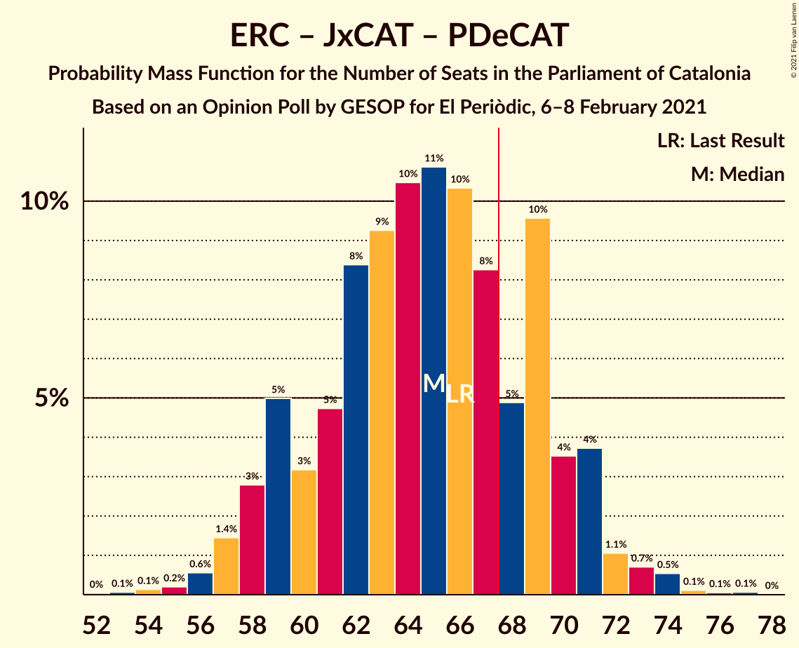

| Number of Seats | Probability | Accumulated | Special Marks |
|:---------------:|:-----------:|:-----------:|:-------------:|
| 52 | 0% | 100% |  |
| 53 | 0.1% | 99.9% |  |
| 54 | 0.1% | 99.9% |  |
| 55 | 0.2% | 99.7% |  |
| 56 | 0.6% | 99.5% |  |
| 57 | 1.4% | 99.0% |  |
| 58 | 3% | 98% |  |
| 59 | 5% | 95% |  |
| 60 | 3% | 90% |  |
| 61 | 5% | 87% |  |
| 62 | 8% | 82% |  |
| 63 | 9% | 73% |  |
| 64 | 10% | 64% |  |
| 65 | 11% | 54% | Median |
| 66 | 10% | 43% | Last Result |
| 67 | 8% | 33% |  |
| 68 | 5% | 24% | Majority |
| 69 | 10% | 19% |  |
| 70 | 4% | 10% |  |
| 71 | 4% | 6% |  |
| 72 | 1.1% | 3% |  |
| 73 | 0.7% | 1.5% |  |
| 74 | 0.5% | 0.8% |  |
| 75 | 0.1% | 0.3% |  |
| 76 | 0.1% | 0.1% |  |
| 77 | 0.1% | 0.1% |  |
| 78 | 0% | 0% |  |

### Esquerra Republicana–Catalunya Sí – Junts per Catalunya

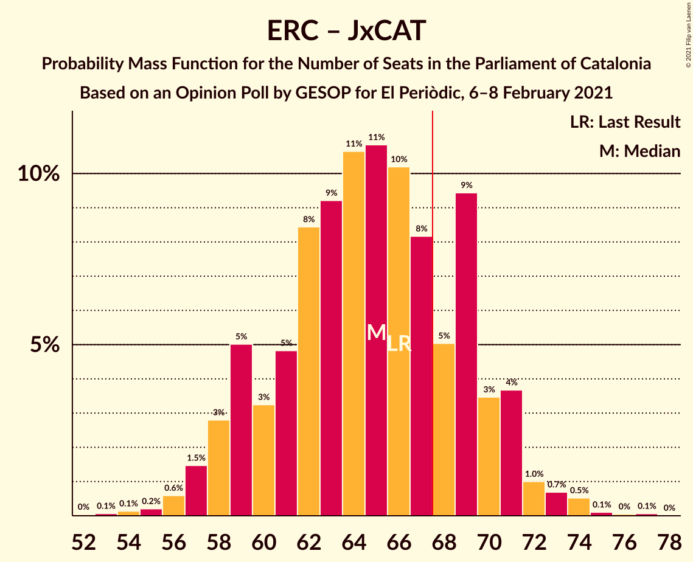

| Number of Seats | Probability | Accumulated | Special Marks |
|:---------------:|:-----------:|:-----------:|:-------------:|
| 52 | 0% | 100% |  |
| 53 | 0.1% | 99.9% |  |
| 54 | 0.1% | 99.9% |  |
| 55 | 0.2% | 99.7% |  |
| 56 | 0.6% | 99.5% |  |
| 57 | 1.5% | 98.9% |  |
| 58 | 3% | 97% |  |
| 59 | 5% | 95% |  |
| 60 | 3% | 90% |  |
| 61 | 5% | 86% |  |
| 62 | 8% | 82% |  |
| 63 | 9% | 73% |  |
| 64 | 11% | 64% |  |
| 65 | 11% | 53% | Median |
| 66 | 10% | 42% | Last Result |
| 67 | 8% | 32% |  |
| 68 | 5% | 24% | Majority |
| 69 | 9% | 19% |  |
| 70 | 3% | 10% |  |
| 71 | 4% | 6% |  |
| 72 | 1.0% | 2% |  |
| 73 | 0.7% | 1.4% |  |
| 74 | 0.5% | 0.8% |  |
| 75 | 0.1% | 0.2% |  |
| 76 | 0% | 0.1% |  |
| 77 | 0.1% | 0.1% |  |
| 78 | 0% | 0% |  |

### Partit dels Socialistes de Catalunya (PSC-PSOE) – Vox – Ciutadans–Partido de la Ciudadanía – Partit Popular

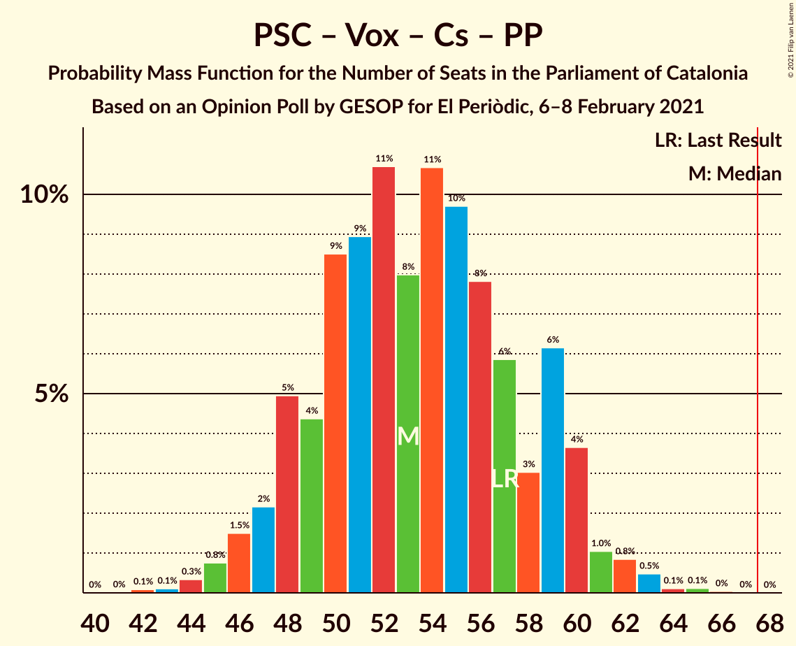

| Number of Seats | Probability | Accumulated | Special Marks |
|:---------------:|:-----------:|:-----------:|:-------------:|
| 42 | 0.1% | 100% |  |
| 43 | 0.1% | 99.9% |  |
| 44 | 0.3% | 99.8% |  |
| 45 | 0.8% | 99.4% |  |
| 46 | 1.5% | 98.7% |  |
| 47 | 2% | 97% |  |
| 48 | 5% | 95% |  |
| 49 | 4% | 90% |  |
| 50 | 9% | 86% |  |
| 51 | 9% | 77% |  |
| 52 | 11% | 68% |  |
| 53 | 8% | 58% |  |
| 54 | 11% | 50% | Median |
| 55 | 10% | 39% |  |
| 56 | 8% | 29% |  |
| 57 | 6% | 21% | Last Result |
| 58 | 3% | 15% |  |
| 59 | 6% | 12% |  |
| 60 | 4% | 6% |  |
| 61 | 1.0% | 3% |  |
| 62 | 0.8% | 2% |  |
| 63 | 0.5% | 0.8% |  |
| 64 | 0.1% | 0.3% |  |
| 65 | 0.1% | 0.2% |  |
| 66 | 0% | 0.1% |  |
| 67 | 0% | 0% |  |

### Partit dels Socialistes de Catalunya (PSC-PSOE) – Catalunya en Comú–Podem – Ciutadans–Partido de la Ciudadanía – Partit Popular

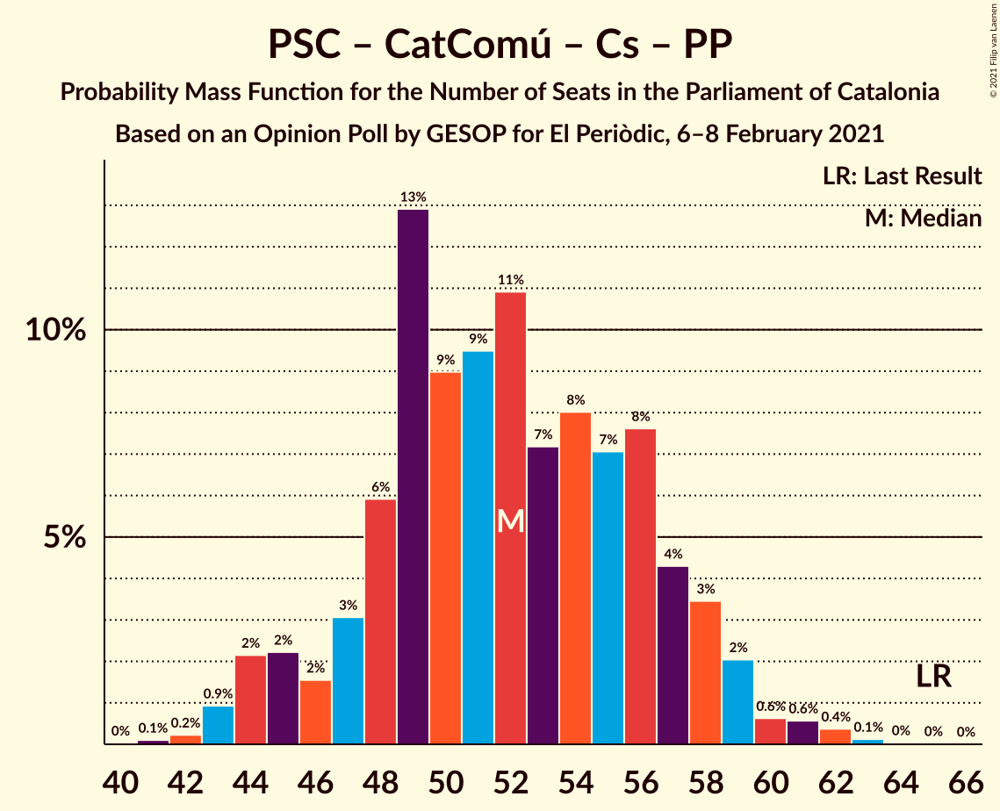

| Number of Seats | Probability | Accumulated | Special Marks |
|:---------------:|:-----------:|:-----------:|:-------------:|
| 40 | 0% | 100% |  |
| 41 | 0.1% | 99.9% |  |
| 42 | 0.2% | 99.8% |  |
| 43 | 0.9% | 99.6% |  |
| 44 | 2% | 98.7% |  |
| 45 | 2% | 97% |  |
| 46 | 2% | 94% |  |
| 47 | 3% | 93% |  |
| 48 | 6% | 90% |  |
| 49 | 13% | 84% |  |
| 50 | 9% | 71% |  |
| 51 | 9% | 62% |  |
| 52 | 11% | 52% |  |
| 53 | 7% | 41% | Median |
| 54 | 8% | 34% |  |
| 55 | 7% | 26% |  |
| 56 | 8% | 19% |  |
| 57 | 4% | 12% |  |
| 58 | 3% | 7% |  |
| 59 | 2% | 4% |  |
| 60 | 0.6% | 2% |  |
| 61 | 0.6% | 1.1% |  |
| 62 | 0.4% | 0.6% |  |
| 63 | 0.1% | 0.2% |  |
| 64 | 0% | 0.1% |  |
| 65 | 0% | 0% | Last Result |

### Partit dels Socialistes de Catalunya (PSC-PSOE) – Ciutadans–Partido de la Ciudadanía – Partit Popular

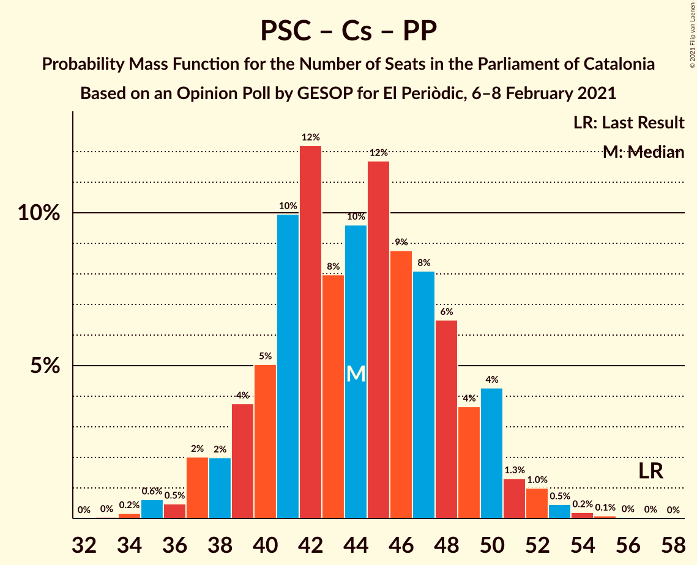

| Number of Seats | Probability | Accumulated | Special Marks |
|:---------------:|:-----------:|:-----------:|:-------------:|
| 33 | 0% | 100% |  |
| 34 | 0.2% | 99.9% |  |
| 35 | 0.6% | 99.8% |  |
| 36 | 0.5% | 99.1% |  |
| 37 | 2% | 98.7% |  |
| 38 | 2% | 97% |  |
| 39 | 4% | 95% |  |
| 40 | 5% | 91% |  |
| 41 | 10% | 86% |  |
| 42 | 12% | 76% |  |
| 43 | 8% | 64% |  |
| 44 | 10% | 56% |  |
| 45 | 12% | 46% | Median |
| 46 | 9% | 34% |  |
| 47 | 8% | 26% |  |
| 48 | 6% | 18% |  |
| 49 | 4% | 11% |  |
| 50 | 4% | 7% |  |
| 51 | 1.3% | 3% |  |
| 52 | 1.0% | 2% |  |
| 53 | 0.5% | 0.8% |  |
| 54 | 0.2% | 0.4% |  |
| 55 | 0.1% | 0.2% |  |
| 56 | 0% | 0.1% |  |
| 57 | 0% | 0% | Last Result |

### Esquerra Republicana–Catalunya Sí – Catalunya en Comú–Podem

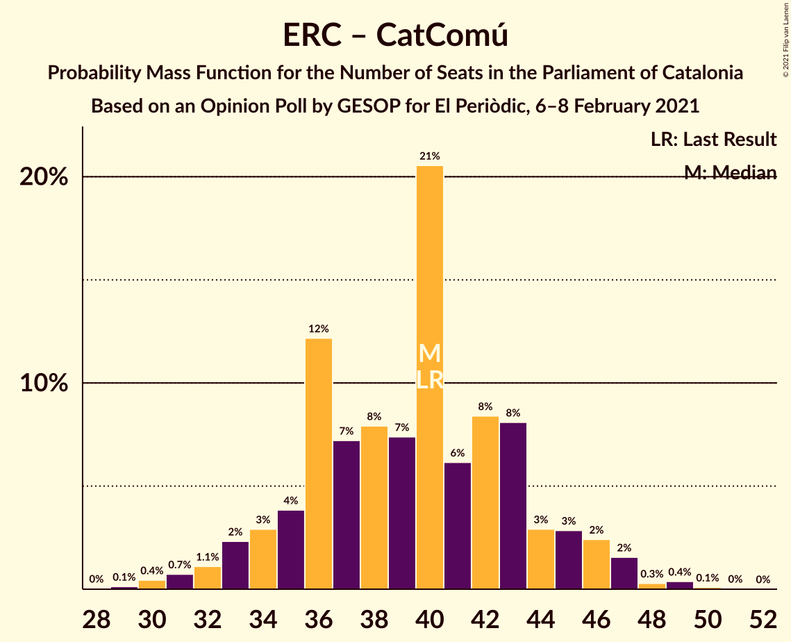

| Number of Seats | Probability | Accumulated | Special Marks |
|:---------------:|:-----------:|:-----------:|:-------------:|
| 29 | 0.1% | 100% |  |
| 30 | 0.4% | 99.8% |  |
| 31 | 0.7% | 99.4% |  |
| 32 | 1.1% | 98.6% |  |
| 33 | 2% | 98% |  |
| 34 | 3% | 95% |  |
| 35 | 4% | 92% |  |
| 36 | 12% | 88% |  |
| 37 | 7% | 76% |  |
| 38 | 8% | 69% |  |
| 39 | 7% | 61% |  |
| 40 | 21% | 54% | Last Result, Median |
| 41 | 6% | 33% |  |
| 42 | 8% | 27% |  |
| 43 | 8% | 19% |  |
| 44 | 3% | 11% |  |
| 45 | 3% | 8% |  |
| 46 | 2% | 5% |  |
| 47 | 2% | 2% |  |
| 48 | 0.3% | 0.8% |  |
| 49 | 0.4% | 0.5% |  |
| 50 | 0.1% | 0.2% |  |
| 51 | 0% | 0.1% |  |
| 52 | 0% | 0% |  |

## Technical Information

### Opinion Poll

+ **Polling firm:** GESOP
+ **Commissioner(s):** El Periòdic
+ **Fieldwork period:** 6–8 February 2021

### Calculations

+ **Sample size:** 421
+ **Simulations done:** 1,048,576
+ **Error estimate:** 3.12%

