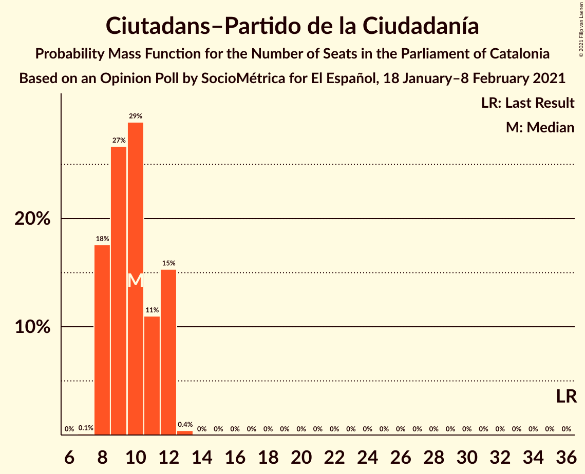

# Opinion Poll by SocioMétrica for El Español, 18 January–8 February 2021

<a href="#voting-intentions">Voting Intentions</a> | <a href="#seats">Seats</a> | <a href="#coalitions">Coalitions</a> | <a href="#technical-information">Technical Information</a>

## Voting Intentions

### Confidence Intervals

| Party | Last Result | Poll Result | 80% Confidence Interval | 90% Confidence Interval | 95% Confidence Interval | 99% Confidence Interval |
|:-----:|:-----------:|:-----------:|:-----------------------:|:-----------------------:|:-----------------------:|:-----------------------:|
| Partit dels Socialistes de Catalunya (PSC-PSOE) | 13.9% | 21.0% | 20.0–22.1% |19.7–22.4% |19.4–22.7% |18.9–23.2% |
| Junts per Catalunya | 21.7% | 20.4% | 19.4–21.5% |19.1–21.8% |18.8–22.1% |18.4–22.6% |
| Esquerra Republicana–Catalunya Sí | 21.4% | 19.1% | 18.1–20.2% |17.8–20.5% |17.6–20.7% |17.1–21.3% |
| Ciutadans–Partido de la Ciudadanía | 25.4% | 7.7% | 7.0–8.5% |6.8–8.7% |6.7–8.9% |6.4–9.2% |
| Vox | 0.0% | 7.7% | 7.0–8.5% |6.8–8.7% |6.7–8.9% |6.4–9.2% |
| Catalunya en Comú–Podem | 7.5% | 7.4% | 6.8–8.2% |6.6–8.4% |6.4–8.5% |6.1–8.9% |
| Candidatura d’Unitat Popular | 4.5% | 6.6% | 6.0–7.3% |5.8–7.5% |5.7–7.7% |5.4–8.0% |
| Partit Popular | 4.2% | 5.0% | 4.5–5.6% |4.3–5.8% |4.2–6.0% |3.9–6.3% |

*Note:* The poll result column reflects the actual value used in the calculations. Published results may vary slightly, and in addition be rounded to fewer digits.

## Seats

### Confidence Intervals

| Party | Last Result | Median | 80% Confidence Interval | 90% Confidence Interval | 95% Confidence Interval | 99% Confidence Interval |
|:-----:|:-----------:|:------:|:-----------------------:|:-----------------------:|:-----------------------:|:-----------------------:|
| <a href="#partit-dels-socialistes-de-catalunya-(psc-psoe)">Partit dels Socialistes de Catalunya (PSC-PSOE)</a> | 17 | 29 | 27–31 |27–32 |26–32 |26–33 |
| <a href="#junts-per-catalunya">Junts per Catalunya</a> | 34 | 33 | 31–36 |31–36 |31–37 |30–37 |
| <a href="#esquerra-republicana–catalunya-sí">Esquerra Republicana–Catalunya Sí</a> | 32 | 29 | 28–31 |27–32 |27–32 |26–33 |
| <a href="#ciutadans–partido-de-la-ciudadanía">Ciutadans–Partido de la Ciudadanía</a> | 36 | 10 | 8–12 |8–12 |8–12 |8–12 |
| <a href="#vox">Vox</a> | 0 | 10 | 9–12 |9–12 |9–12 |8–12 |
| <a href="#catalunya-en-comú–podem">Catalunya en Comú–Podem</a> | 8 | 8 | 8–10 |7–10 |7–10 |7–11 |
| <a href="#candidatura-d’unitat-popular">Candidatura d’Unitat Popular</a> | 4 | 9 | 8–10 |8–10 |8–11 |7–11 |
| <a href="#partit-popular">Partit Popular</a> | 4 | 6 | 5–7 |5–7 |5–7 |3–7 |

### Partit dels Socialistes de Catalunya (PSC-PSOE)

*For a full overview of the results for this party, see the [Partit dels Socialistes de Catalunya (PSC-PSOE)](party-partitdelssocialistesdecatalunyapsc-psoe.html) page.*

| Number of Seats | Probability | Accumulated | Special Marks |
|:---------------:|:-----------:|:-----------:|:-------------:|
| 17 | 0% | 100% | Last Result |
| 18 | 0% | 100% |  |
| 19 | 0% | 100% |  |
| 20 | 0% | 100% |  |
| 21 | 0% | 100% |  |
| 22 | 0% | 100% |  |
| 23 | 0% | 100% |  |
| 24 | 0% | 100% |  |
| 25 | 0.1% | 100% |  |
| 26 | 4% | 99.9% |  |
| 27 | 10% | 96% |  |
| 28 | 18% | 87% |  |
| 29 | 22% | 68% | Median |
| 30 | 21% | 46% |  |
| 31 | 19% | 25% |  |
| 32 | 4% | 5% |  |
| 33 | 0.9% | 1.0% |  |
| 34 | 0.1% | 0.1% |  |
| 35 | 0% | 0% |  |

### Junts per Catalunya

*For a full overview of the results for this party, see the [Junts per Catalunya](party-juntspercatalunya.html) page.*

| Number of Seats | Probability | Accumulated | Special Marks |
|:---------------:|:-----------:|:-----------:|:-------------:|
| 29 | 0.1% | 100% |  |
| 30 | 0.6% | 99.9% |  |
| 31 | 18% | 99.2% |  |
| 32 | 16% | 81% |  |
| 33 | 30% | 65% | Median |
| 34 | 13% | 35% | Last Result |
| 35 | 11% | 22% |  |
| 36 | 8% | 11% |  |
| 37 | 3% | 3% |  |
| 38 | 0.1% | 0.1% |  |
| 39 | 0% | 0% |  |

### Esquerra Republicana–Catalunya Sí

*For a full overview of the results for this party, see the [Esquerra Republicana–Catalunya Sí](party-esquerrarepublicana–catalunyasí.html) page.*

| Number of Seats | Probability | Accumulated | Special Marks |
|:---------------:|:-----------:|:-----------:|:-------------:|
| 25 | 0.1% | 100% |  |
| 26 | 2% | 99.9% |  |
| 27 | 5% | 98% |  |
| 28 | 24% | 94% |  |
| 29 | 26% | 70% | Median |
| 30 | 23% | 44% |  |
| 31 | 14% | 21% |  |
| 32 | 6% | 7% | Last Result |
| 33 | 0.5% | 0.8% |  |
| 34 | 0.2% | 0.2% |  |
| 35 | 0% | 0% |  |

### Ciutadans–Partido de la Ciudadanía

*For a full overview of the results for this party, see the [Ciutadans–Partido de la Ciudadanía](party-ciutadans–partidodelaciudadanía.html) page.*

| Number of Seats | Probability | Accumulated | Special Marks |
|:---------------:|:-----------:|:-----------:|:-------------:|
| 7 | 0.1% | 100% |  |
| 8 | 18% | 99.9% |  |
| 9 | 27% | 82% |  |
| 10 | 29% | 56% | Median |
| 11 | 11% | 27% |  |
| 12 | 15% | 16% |  |
| 13 | 0.4% | 0.4% |  |
| 14 | 0% | 0% |  |
| 15 | 0% | 0% |  |
| 16 | 0% | 0% |  |
| 17 | 0% | 0% |  |
| 18 | 0% | 0% |  |
| 19 | 0% | 0% |  |
| 20 | 0% | 0% |  |
| 21 | 0% | 0% |  |
| 22 | 0% | 0% |  |
| 23 | 0% | 0% |  |
| 24 | 0% | 0% |  |
| 25 | 0% | 0% |  |
| 26 | 0% | 0% |  |
| 27 | 0% | 0% |  |
| 28 | 0% | 0% |  |
| 29 | 0% | 0% |  |
| 30 | 0% | 0% |  |
| 31 | 0% | 0% |  |
| 32 | 0% | 0% |  |
| 33 | 0% | 0% |  |
| 34 | 0% | 0% |  |
| 35 | 0% | 0% |  |
| 36 | 0% | 0% | Last Result |

### Vox

*For a full overview of the results for this party, see the [Vox](party-vox.html) page.*

| Number of Seats | Probability | Accumulated | Special Marks |
|:---------------:|:-----------:|:-----------:|:-------------:|
| 0 | 0% | 100% | Last Result |
| 1 | 0% | 100% |  |
| 2 | 0% | 100% |  |
| 3 | 0% | 100% |  |
| 4 | 0% | 100% |  |
| 5 | 0% | 100% |  |
| 6 | 0% | 100% |  |
| 7 | 0.3% | 100% |  |
| 8 | 0.7% | 99.7% |  |
| 9 | 24% | 99.0% |  |
| 10 | 43% | 75% | Median |
| 11 | 18% | 32% |  |
| 12 | 14% | 14% |  |
| 13 | 0.2% | 0.3% |  |
| 14 | 0.1% | 0.1% |  |
| 15 | 0% | 0% |  |

### Catalunya en Comú–Podem

*For a full overview of the results for this party, see the [Catalunya en Comú–Podem](party-catalunyaencomú–podem.html) page.*

| Number of Seats | Probability | Accumulated | Special Marks |
|:---------------:|:-----------:|:-----------:|:-------------:|
| 6 | 0.2% | 100% |  |
| 7 | 5% | 99.7% |  |
| 8 | 56% | 95% | Last Result, Median |
| 9 | 25% | 38% |  |
| 10 | 11% | 13% |  |
| 11 | 2% | 2% |  |
| 12 | 0% | 0% |  |

### Candidatura d’Unitat Popular

*For a full overview of the results for this party, see the [Candidatura d’Unitat Popular](party-candidaturad’unitatpopular.html) page.*

| Number of Seats | Probability | Accumulated | Special Marks |
|:---------------:|:-----------:|:-----------:|:-------------:|
| 4 | 0% | 100% | Last Result |
| 5 | 0% | 100% |  |
| 6 | 0% | 100% |  |
| 7 | 0.8% | 100% |  |
| 8 | 44% | 99.2% |  |
| 9 | 45% | 55% | Median |
| 10 | 7% | 10% |  |
| 11 | 3% | 3% |  |
| 12 | 0% | 0% |  |

### Partit Popular

*For a full overview of the results for this party, see the [Partit Popular](party-partitpopular.html) page.*

| Number of Seats | Probability | Accumulated | Special Marks |
|:---------------:|:-----------:|:-----------:|:-------------:|
| 3 | 0.6% | 100% |  |
| 4 | 2% | 99.4% | Last Result |
| 5 | 24% | 98% |  |
| 6 | 40% | 74% | Median |
| 7 | 33% | 33% |  |
| 8 | 0.3% | 0.5% |  |
| 9 | 0.1% | 0.1% |  |
| 10 | 0% | 0% |  |

## Coalitions

### Confidence Intervals

| Coalition | Last Result | Median | Majority? | 80% Confidence Interval | 90% Confidence Interval | 95% Confidence Interval | 99% Confidence Interval |
|:---------:|:-----------:|:------:|:---------:|:-----------------------:|:-----------------------:|:-----------------------:|:-----------------------:|
| Junts per Catalunya – Esquerra Republicana–Catalunya Sí – Catalunya en Comú–Podem | 74 | 71 | 98% | 68–74 | 68–74 | 68–75 | 67–76 |
| Junts per Catalunya – Esquerra Republicana–Catalunya Sí – Candidatura d’Unitat Popular | 70 | 71 | 97% | 69–74 | 68–74 | 67–75 | 67–76 |
| Partit dels Socialistes de Catalunya (PSC-PSOE) – Esquerra Republicana–Catalunya Sí – Catalunya en Comú–Podem | 57 | 67 | 43% | 65–69 | 64–70 | 63–70 | 62–72 |
| Junts per Catalunya – Esquerra Republicana–Catalunya Sí | 66 | 63 | 0.5% | 60–65 | 59–65 | 59–66 | 58–68 |
| Partit dels Socialistes de Catalunya (PSC-PSOE) – Ciutadans–Partido de la Ciudadanía – Vox – Partit Popular | 57 | 55 | 0% | 53–58 | 52–59 | 52–59 | 51–60 |
| Partit dels Socialistes de Catalunya (PSC-PSOE) – Ciutadans–Partido de la Ciudadanía – Catalunya en Comú–Podem – Partit Popular | 65 | 54 | 0% | 51–56 | 50–57 | 50–57 | 48–58 |
| Partit dels Socialistes de Catalunya (PSC-PSOE) – Ciutadans–Partido de la Ciudadanía – Partit Popular | 57 | 45 | 0% | 43–48 | 42–48 | 42–49 | 40–50 |
| Esquerra Republicana–Catalunya Sí – Catalunya en Comú–Podem | 40 | 37 | 0% | 36–40 | 36–41 | 35–42 | 34–42 |

### Junts per Catalunya – Esquerra Republicana–Catalunya Sí – Catalunya en Comú–Podem

| Number of Seats | Probability | Accumulated | Special Marks |
|:---------------:|:-----------:|:-----------:|:-------------:|
| 66 | 0.4% | 100% |  |
| 67 | 2% | 99.6% |  |
| 68 | 9% | 98% | Majority |
| 69 | 14% | 89% |  |
| 70 | 18% | 75% | Median |
| 71 | 16% | 57% |  |
| 72 | 17% | 41% |  |
| 73 | 12% | 24% |  |
| 74 | 9% | 12% | Last Result |
| 75 | 2% | 3% |  |
| 76 | 0.5% | 0.7% |  |
| 77 | 0.1% | 0.1% |  |
| 78 | 0% | 0% |  |

### Junts per Catalunya – Esquerra Republicana–Catalunya Sí – Candidatura d’Unitat Popular

| Number of Seats | Probability | Accumulated | Special Marks |
|:---------------:|:-----------:|:-----------:|:-------------:|
| 66 | 0.1% | 100% |  |
| 67 | 2% | 99.9% |  |
| 68 | 6% | 97% | Majority |
| 69 | 9% | 91% |  |
| 70 | 18% | 82% | Last Result |
| 71 | 20% | 64% | Median |
| 72 | 18% | 43% |  |
| 73 | 12% | 25% |  |
| 74 | 9% | 13% |  |
| 75 | 2% | 3% |  |
| 76 | 0.6% | 0.9% |  |
| 77 | 0.3% | 0.3% |  |
| 78 | 0% | 0% |  |

### Partit dels Socialistes de Catalunya (PSC-PSOE) – Esquerra Republicana–Catalunya Sí – Catalunya en Comú–Podem

| Number of Seats | Probability | Accumulated | Special Marks |
|:---------------:|:-----------:|:-----------:|:-------------:|
| 57 | 0% | 100% | Last Result |
| 58 | 0% | 100% |  |
| 59 | 0% | 100% |  |
| 60 | 0% | 100% |  |
| 61 | 0.1% | 100% |  |
| 62 | 0.7% | 99.9% |  |
| 63 | 2% | 99.2% |  |
| 64 | 5% | 97% |  |
| 65 | 15% | 92% |  |
| 66 | 12% | 78% | Median |
| 67 | 22% | 66% |  |
| 68 | 21% | 43% | Majority |
| 69 | 13% | 22% |  |
| 70 | 7% | 9% |  |
| 71 | 2% | 2% |  |
| 72 | 0.6% | 0.6% |  |
| 73 | 0.1% | 0.1% |  |
| 74 | 0% | 0% |  |

### Junts per Catalunya – Esquerra Republicana–Catalunya Sí

| Number of Seats | Probability | Accumulated | Special Marks |
|:---------------:|:-----------:|:-----------:|:-------------:|
| 57 | 0.1% | 100% |  |
| 58 | 0.5% | 99.9% |  |
| 59 | 5% | 99.3% |  |
| 60 | 10% | 94% |  |
| 61 | 15% | 84% |  |
| 62 | 19% | 69% | Median |
| 63 | 20% | 50% |  |
| 64 | 16% | 31% |  |
| 65 | 10% | 15% |  |
| 66 | 3% | 5% | Last Result |
| 67 | 1.1% | 2% |  |
| 68 | 0.5% | 0.5% | Majority |
| 69 | 0% | 0% |  |

### Partit dels Socialistes de Catalunya (PSC-PSOE) – Ciutadans–Partido de la Ciudadanía – Vox – Partit Popular

| Number of Seats | Probability | Accumulated | Special Marks |
|:---------------:|:-----------:|:-----------:|:-------------:|
| 50 | 0.4% | 100% |  |
| 51 | 1.3% | 99.6% |  |
| 52 | 6% | 98% |  |
| 53 | 13% | 92% |  |
| 54 | 14% | 79% |  |
| 55 | 18% | 65% | Median |
| 56 | 17% | 47% |  |
| 57 | 16% | 31% | Last Result |
| 58 | 8% | 14% |  |
| 59 | 5% | 6% |  |
| 60 | 0.7% | 0.7% |  |
| 61 | 0% | 0% |  |

### Partit dels Socialistes de Catalunya (PSC-PSOE) – Ciutadans–Partido de la Ciudadanía – Catalunya en Comú–Podem – Partit Popular

| Number of Seats | Probability | Accumulated | Special Marks |
|:---------------:|:-----------:|:-----------:|:-------------:|
| 48 | 0.5% | 100% |  |
| 49 | 1.1% | 99.5% |  |
| 50 | 4% | 98% |  |
| 51 | 6% | 95% |  |
| 52 | 14% | 89% |  |
| 53 | 24% | 75% | Median |
| 54 | 21% | 50% |  |
| 55 | 13% | 29% |  |
| 56 | 8% | 16% |  |
| 57 | 6% | 8% |  |
| 58 | 2% | 2% |  |
| 59 | 0.1% | 0.2% |  |
| 60 | 0% | 0% |  |
| 61 | 0% | 0% |  |
| 62 | 0% | 0% |  |
| 63 | 0% | 0% |  |
| 64 | 0% | 0% |  |
| 65 | 0% | 0% | Last Result |

### Partit dels Socialistes de Catalunya (PSC-PSOE) – Ciutadans–Partido de la Ciudadanía – Partit Popular

| Number of Seats | Probability | Accumulated | Special Marks |
|:---------------:|:-----------:|:-----------:|:-------------:|
| 39 | 0% | 100% |  |
| 40 | 0.9% | 99.9% |  |
| 41 | 2% | 99.1% |  |
| 42 | 4% | 98% |  |
| 43 | 15% | 94% |  |
| 44 | 16% | 78% |  |
| 45 | 20% | 62% | Median |
| 46 | 18% | 42% |  |
| 47 | 12% | 24% |  |
| 48 | 7% | 12% |  |
| 49 | 4% | 5% |  |
| 50 | 0.8% | 0.9% |  |
| 51 | 0% | 0% |  |
| 52 | 0% | 0% |  |
| 53 | 0% | 0% |  |
| 54 | 0% | 0% |  |
| 55 | 0% | 0% |  |
| 56 | 0% | 0% |  |
| 57 | 0% | 0% | Last Result |

### Esquerra Republicana–Catalunya Sí – Catalunya en Comú–Podem

| Number of Seats | Probability | Accumulated | Special Marks |
|:---------------:|:-----------:|:-----------:|:-------------:|
| 33 | 0.1% | 100% |  |
| 34 | 0.9% | 99.9% |  |
| 35 | 3% | 99.0% |  |
| 36 | 16% | 96% |  |
| 37 | 31% | 80% | Median |
| 38 | 18% | 49% |  |
| 39 | 12% | 31% |  |
| 40 | 12% | 19% | Last Result |
| 41 | 4% | 6% |  |
| 42 | 2% | 3% |  |
| 43 | 0.2% | 0.2% |  |
| 44 | 0% | 0% |  |

## Technical Information

### Opinion Poll

+ **Polling firm:** SocioMétrica
+ **Commissioner(s):** El Español
+ **Fieldwork period:** 18 January–8 February 2021

### Calculations

+ **Sample size:** 2376
+ **Simulations done:** 1,048,576
+ **Error estimate:** 1.59%

