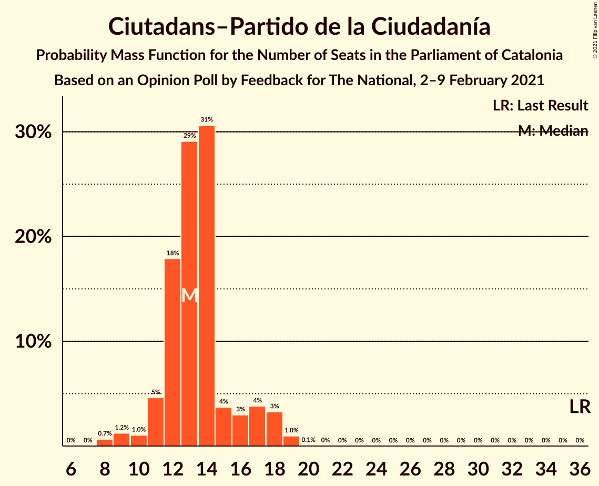
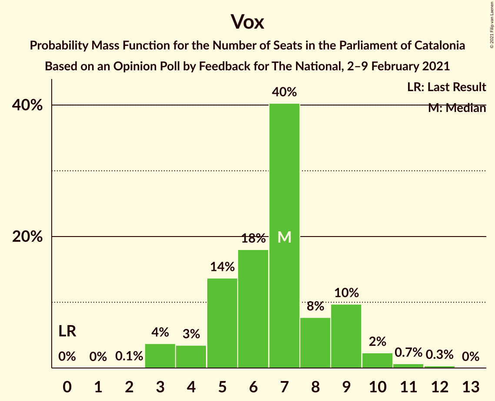
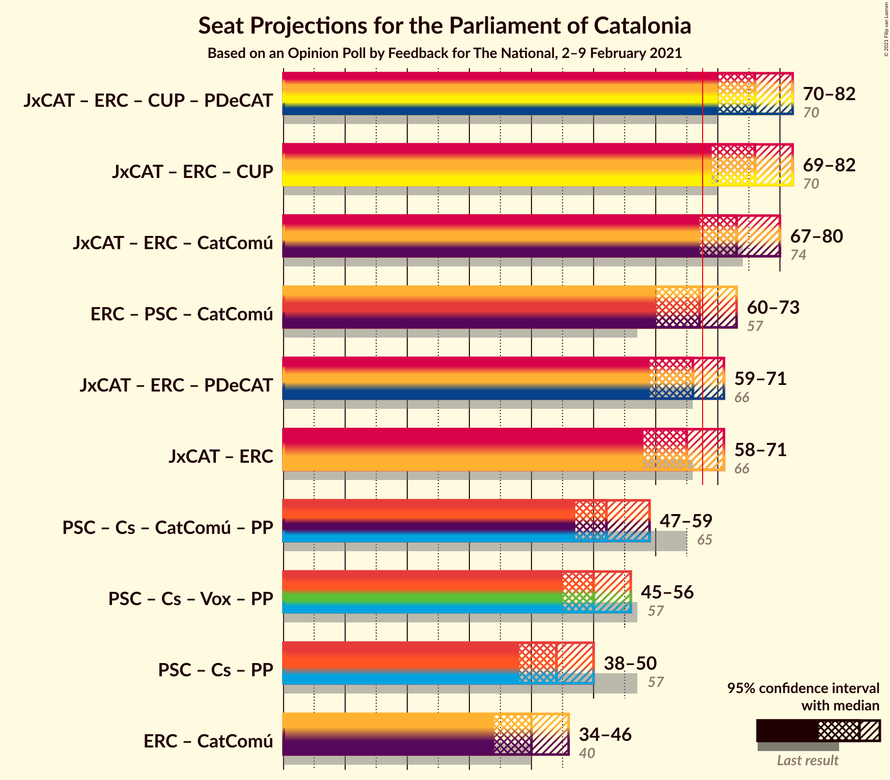
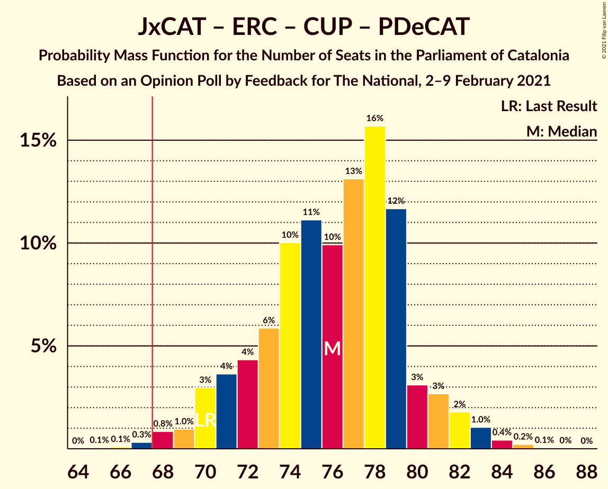
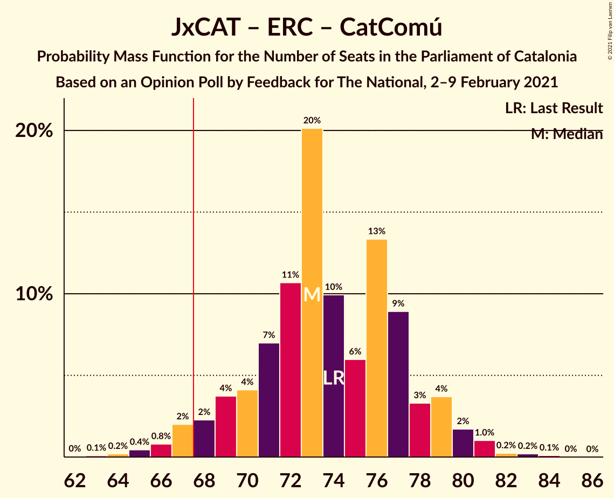

# Opinion Poll by Feedback for The National, 2–9 February 2021

<a href="#voting-intentions">Voting Intentions</a> | <a href="#seats">Seats</a> | <a href="#coalitions">Coalitions</a> | <a href="#technical-information">Technical Information</a>

## Voting Intentions

### Confidence Intervals

| Party | Last Result | Poll Result | 80% Confidence Interval | 90% Confidence Interval | 95% Confidence Interval | 99% Confidence Interval |
|:-----:|:-----------:|:-----------:|:-----------------------:|:-----------------------:|:-----------------------:|:-----------------------:|
| Junts per Catalunya | 21.7% | 20.5% | 18.5–22.7% |17.9–23.4% |17.4–23.9% |16.5–25.0% |
| Esquerra Republicana–Catalunya Sí | 21.4% | 19.8% | 17.8–22.0% |17.3–22.7% |16.8–23.2% |15.9–24.3% |
| Partit dels Socialistes de Catalunya (PSC-PSOE) | 13.9% | 19.3% | 17.3–21.5% |16.8–22.1% |16.3–22.7% |15.4–23.8% |
| Ciutadans–Partido de la Ciudadanía | 25.4% | 9.8% | 8.4–11.6% |8.0–12.1% |7.7–12.5% |7.0–13.4% |
| Candidatura d’Unitat Popular | 4.5% | 7.8% | 6.5–9.4% |6.2–9.8% |5.9–10.2% |5.3–11.1% |
| Catalunya en Comú–Podem | 7.5% | 7.3% | 6.1–8.8% |5.7–9.3% |5.4–9.7% |4.9–10.5% |
| Vox | 0.0% | 5.2% | 4.2–6.6% |3.9–7.0% |3.7–7.4% |3.3–8.1% |
| Partit Popular | 4.2% | 3.6% | 2.7–4.7% |2.5–5.1% |2.3–5.4% |2.0–6.0% |
| Partit Demòcrata Europeu Català | 0.0% | 1.9% | 1.3–2.8% |1.2–3.1% |1.1–3.3% |0.8–3.8% |

*Note:* The poll result column reflects the actual value used in the calculations. Published results may vary slightly, and in addition be rounded to fewer digits.

## Seats

### Confidence Intervals

| Party | Last Result | Median | 80% Confidence Interval | 90% Confidence Interval | 95% Confidence Interval | 99% Confidence Interval |
|:-----:|:-----------:|:------:|:-----------------------:|:-----------------------:|:-----------------------:|:-----------------------:|
| <a href="#junts-per-catalunya">Junts per Catalunya</a> | 34 | 34 | 31–37 |30–38 |29–39 |27–41 |
| <a href="#esquerra-republicana–catalunya-sí">Esquerra Republicana–Catalunya Sí</a> | 32 | 31 | 28–34 |27–35 |26–37 |24–38 |
| <a href="#partit-dels-socialistes-de-catalunya-(psc-psoe)">Partit dels Socialistes de Catalunya (PSC-PSOE)</a> | 17 | 26 | 24–30 |24–31 |24–32 |21–35 |
| <a href="#ciutadans–partido-de-la-ciudadanía">Ciutadans–Partido de la Ciudadanía</a> | 36 | 13 | 12–16 |11–17 |10–18 |8–19 |
| <a href="#candidatura-d’unitat-popular">Candidatura d’Unitat Popular</a> | 4 | 11 | 9–14 |8–15 |8–15 |8–16 |
| <a href="#catalunya-en-comú–podem">Catalunya en Comú–Podem</a> | 8 | 8 | 7–11 |6–11 |5–12 |5–14 |
| <a href="#vox">Vox</a> | 0 | 7 | 5–9 |4–9 |3–10 |3–11 |
| <a href="#partit-popular">Partit Popular</a> | 4 | 3 | 0–5 |0–6 |0–7 |0–7 |
| <a href="#partit-demòcrata-europeu-català">Partit Demòcrata Europeu Català</a> | 0 | 0 | 0–1 |0–1 |0–1 |0–5 |

### Junts per Catalunya

*For a full overview of the results for this party, see the [Junts per Catalunya](party-juntspercatalunya.html) page.*

| Number of Seats | Probability | Accumulated | Special Marks |
|:---------------:|:-----------:|:-----------:|:-------------:|
| 25 | 0.1% | 100% |  |
| 26 | 0.4% | 99.9% |  |
| 27 | 0.5% | 99.5% |  |
| 28 | 0.6% | 99.0% |  |
| 29 | 2% | 98% |  |
| 30 | 5% | 96% |  |
| 31 | 9% | 91% |  |
| 32 | 13% | 82% |  |
| 33 | 14% | 69% |  |
| 34 | 10% | 55% | Last Result, Median |
| 35 | 14% | 45% |  |
| 36 | 8% | 31% |  |
| 37 | 16% | 23% |  |
| 38 | 3% | 8% |  |
| 39 | 2% | 4% |  |
| 40 | 1.2% | 2% |  |
| 41 | 0.7% | 0.9% |  |
| 42 | 0.1% | 0.3% |  |
| 43 | 0.1% | 0.2% |  |
| 44 | 0% | 0.1% |  |
| 45 | 0% | 0% |  |

### Esquerra Republicana–Catalunya Sí

*For a full overview of the results for this party, see the [Esquerra Republicana–Catalunya Sí](party-esquerrarepublicana–catalunyasí.html) page.*

| Number of Seats | Probability | Accumulated | Special Marks |
|:---------------:|:-----------:|:-----------:|:-------------:|
| 22 | 0.1% | 100% |  |
| 23 | 0.1% | 99.9% |  |
| 24 | 0.6% | 99.9% |  |
| 25 | 1.4% | 99.2% |  |
| 26 | 3% | 98% |  |
| 27 | 4% | 95% |  |
| 28 | 7% | 92% |  |
| 29 | 16% | 84% |  |
| 30 | 11% | 69% |  |
| 31 | 12% | 57% | Median |
| 32 | 18% | 45% | Last Result |
| 33 | 13% | 27% |  |
| 34 | 4% | 13% |  |
| 35 | 5% | 10% |  |
| 36 | 2% | 5% |  |
| 37 | 1.5% | 3% |  |
| 38 | 1.2% | 2% |  |
| 39 | 0.2% | 0.3% |  |
| 40 | 0.1% | 0.1% |  |
| 41 | 0% | 0% |  |

### Partit dels Socialistes de Catalunya (PSC-PSOE)

*For a full overview of the results for this party, see the [Partit dels Socialistes de Catalunya (PSC-PSOE)](party-partitdelssocialistesdecatalunyapsc-psoe.html) page.*

| Number of Seats | Probability | Accumulated | Special Marks |
|:---------------:|:-----------:|:-----------:|:-------------:|
| 17 | 0% | 100% | Last Result |
| 18 | 0% | 100% |  |
| 19 | 0.1% | 100% |  |
| 20 | 0.3% | 99.9% |  |
| 21 | 0.4% | 99.6% |  |
| 22 | 0.5% | 99.2% |  |
| 23 | 0.8% | 98.7% |  |
| 24 | 9% | 98% |  |
| 25 | 9% | 89% |  |
| 26 | 33% | 80% | Median |
| 27 | 11% | 47% |  |
| 28 | 13% | 35% |  |
| 29 | 9% | 22% |  |
| 30 | 6% | 13% |  |
| 31 | 3% | 7% |  |
| 32 | 2% | 4% |  |
| 33 | 1.4% | 2% |  |
| 34 | 0.5% | 1.0% |  |
| 35 | 0.4% | 0.5% |  |
| 36 | 0.1% | 0.1% |  |
| 37 | 0% | 0% |  |

### Ciutadans–Partido de la Ciudadanía

*For a full overview of the results for this party, see the [Ciutadans–Partido de la Ciudadanía](party-ciutadans–partidodelaciudadanía.html) page.*

| Number of Seats | Probability | Accumulated | Special Marks |
|:---------------:|:-----------:|:-----------:|:-------------:|
| 8 | 0.7% | 100% |  |
| 9 | 1.2% | 99.3% |  |
| 10 | 1.0% | 98% |  |
| 11 | 5% | 97% |  |
| 12 | 18% | 92% |  |
| 13 | 29% | 75% | Median |
| 14 | 31% | 45% |  |
| 15 | 4% | 15% |  |
| 16 | 3% | 11% |  |
| 17 | 4% | 8% |  |
| 18 | 3% | 4% |  |
| 19 | 1.0% | 1.1% |  |
| 20 | 0.1% | 0.1% |  |
| 21 | 0% | 0% |  |
| 22 | 0% | 0% |  |
| 23 | 0% | 0% |  |
| 24 | 0% | 0% |  |
| 25 | 0% | 0% |  |
| 26 | 0% | 0% |  |
| 27 | 0% | 0% |  |
| 28 | 0% | 0% |  |
| 29 | 0% | 0% |  |
| 30 | 0% | 0% |  |
| 31 | 0% | 0% |  |
| 32 | 0% | 0% |  |
| 33 | 0% | 0% |  |
| 34 | 0% | 0% |  |
| 35 | 0% | 0% |  |
| 36 | 0% | 0% | Last Result |

### Candidatura d’Unitat Popular

*For a full overview of the results for this party, see the [Candidatura d’Unitat Popular](party-candidaturad’unitatpopular.html) page.*

| Number of Seats | Probability | Accumulated | Special Marks |
|:---------------:|:-----------:|:-----------:|:-------------:|
| 4 | 0% | 100% | Last Result |
| 5 | 0% | 100% |  |
| 6 | 0% | 100% |  |
| 7 | 0.4% | 99.9% |  |
| 8 | 7% | 99.5% |  |
| 9 | 23% | 92% |  |
| 10 | 7% | 70% |  |
| 11 | 34% | 62% | Median |
| 12 | 13% | 28% |  |
| 13 | 5% | 15% |  |
| 14 | 5% | 10% |  |
| 15 | 5% | 6% |  |
| 16 | 0.6% | 1.0% |  |
| 17 | 0.3% | 0.4% |  |
| 18 | 0.1% | 0.1% |  |
| 19 | 0% | 0% |  |

### Catalunya en Comú–Podem

*For a full overview of the results for this party, see the [Catalunya en Comú–Podem](party-catalunyaencomú–podem.html) page.*

| Number of Seats | Probability | Accumulated | Special Marks |
|:---------------:|:-----------:|:-----------:|:-------------:|
| 4 | 0.2% | 100% |  |
| 5 | 3% | 99.8% |  |
| 6 | 4% | 97% |  |
| 7 | 16% | 93% |  |
| 8 | 29% | 77% | Last Result, Median |
| 9 | 17% | 48% |  |
| 10 | 12% | 31% |  |
| 11 | 15% | 19% |  |
| 12 | 2% | 4% |  |
| 13 | 1.1% | 2% |  |
| 14 | 0.5% | 0.6% |  |
| 15 | 0.1% | 0.1% |  |
| 16 | 0.1% | 0.1% |  |
| 17 | 0% | 0% |  |

### Vox

*For a full overview of the results for this party, see the [Vox](party-vox.html) page.*

| Number of Seats | Probability | Accumulated | Special Marks |
|:---------------:|:-----------:|:-----------:|:-------------:|
| 0 | 0% | 100% | Last Result |
| 1 | 0% | 100% |  |
| 2 | 0.1% | 100% |  |
| 3 | 4% | 99.9% |  |
| 4 | 3% | 96% |  |
| 5 | 14% | 93% |  |
| 6 | 18% | 79% |  |
| 7 | 40% | 61% | Median |
| 8 | 8% | 21% |  |
| 9 | 10% | 13% |  |
| 10 | 2% | 3% |  |
| 11 | 0.7% | 1.0% |  |
| 12 | 0.3% | 0.3% |  |
| 13 | 0% | 0% |  |

### Partit Popular

*For a full overview of the results for this party, see the [Partit Popular](party-partitpopular.html) page.*

| Number of Seats | Probability | Accumulated | Special Marks |
|:---------------:|:-----------:|:-----------:|:-------------:|
| 0 | 17% | 100% |  |
| 1 | 0% | 83% |  |
| 2 | 10% | 83% |  |
| 3 | 43% | 72% | Median |
| 4 | 5% | 30% | Last Result |
| 5 | 15% | 25% |  |
| 6 | 5% | 10% |  |
| 7 | 4% | 4% |  |
| 8 | 0.1% | 0.2% |  |
| 9 | 0.1% | 0.1% |  |
| 10 | 0% | 0% |  |

### Partit Demòcrata Europeu Català

*For a full overview of the results for this party, see the [Partit Demòcrata Europeu Català](party-partitdemòcrataeuropeucatalà.html) page.*

| Number of Seats | Probability | Accumulated | Special Marks |
|:---------------:|:-----------:|:-----------:|:-------------:|
| 0 | 83% | 100% | Last Result, Median |
| 1 | 15% | 17% |  |
| 2 | 0.1% | 2% |  |
| 3 | 0.7% | 2% |  |
| 4 | 0.5% | 1.3% |  |
| 5 | 0.6% | 0.8% |  |
| 6 | 0.2% | 0.2% |  |
| 7 | 0% | 0% |  |

## Coalitions

### Confidence Intervals

| Coalition | Last Result | Median | Majority? | 80% Confidence Interval | 90% Confidence Interval | 95% Confidence Interval | 99% Confidence Interval |
|:---------:|:-----------:|:------:|:---------:|:-----------------------:|:-----------------------:|:-----------------------:|:-----------------------:|
| Junts per Catalunya – Esquerra Republicana–Catalunya Sí – Candidatura d’Unitat Popular – Partit Demòcrata Europeu Català | 70 | 76 | 99.5% | 72–79 | 70–81 | 70–82 | 68–84 |
| Junts per Catalunya – Esquerra Republicana–Catalunya Sí – Candidatura d’Unitat Popular | 70 | 76 | 99.4% | 71–79 | 70–81 | 69–82 | 67–84 |
| Junts per Catalunya – Esquerra Republicana–Catalunya Sí – Catalunya en Comú–Podem | 74 | 73 | 96% | 70–78 | 68–79 | 67–80 | 65–82 |
| Esquerra Republicana–Catalunya Sí – Partit dels Socialistes de Catalunya (PSC-PSOE) – Catalunya en Comú–Podem | 57 | 67 | 35% | 63–71 | 61–72 | 60–73 | 58–75 |
| Junts per Catalunya – Esquerra Republicana–Catalunya Sí – Partit Demòcrata Europeu Català | 66 | 66 | 21% | 61–69 | 60–70 | 59–71 | 57–73 |
| Junts per Catalunya – Esquerra Republicana–Catalunya Sí | 66 | 65 | 20% | 61–69 | 60–70 | 58–71 | 56–73 |
| Partit dels Socialistes de Catalunya (PSC-PSOE) – Ciutadans–Partido de la Ciudadanía – Catalunya en Comú–Podem – Partit Popular | 65 | 52 | 0% | 49–56 | 48–58 | 47–59 | 45–61 |
| Partit dels Socialistes de Catalunya (PSC-PSOE) – Ciutadans–Partido de la Ciudadanía – Vox – Partit Popular | 57 | 50 | 0% | 47–54 | 45–56 | 45–56 | 43–59 |
| Partit dels Socialistes de Catalunya (PSC-PSOE) – Ciutadans–Partido de la Ciudadanía – Partit Popular | 57 | 44 | 0% | 40–48 | 39–49 | 38–50 | 36–52 |
| Esquerra Republicana–Catalunya Sí – Catalunya en Comú–Podem | 40 | 40 | 0% | 36–44 | 35–45 | 34–46 | 32–48 |

### Junts per Catalunya – Esquerra Republicana–Catalunya Sí – Candidatura d’Unitat Popular – Partit Demòcrata Europeu Català

| Number of Seats | Probability | Accumulated | Special Marks |
|:---------------:|:-----------:|:-----------:|:-------------:|
| 65 | 0.1% | 100% |  |
| 66 | 0.1% | 99.9% |  |
| 67 | 0.3% | 99.8% |  |
| 68 | 0.8% | 99.5% | Majority |
| 69 | 1.0% | 98.7% |  |
| 70 | 3% | 98% | Last Result |
| 71 | 4% | 95% |  |
| 72 | 4% | 91% |  |
| 73 | 6% | 87% |  |
| 74 | 10% | 81% |  |
| 75 | 11% | 71% |  |
| 76 | 10% | 60% | Median |
| 77 | 13% | 50% |  |
| 78 | 16% | 37% |  |
| 79 | 12% | 21% |  |
| 80 | 3% | 9% |  |
| 81 | 3% | 6% |  |
| 82 | 2% | 4% |  |
| 83 | 1.0% | 2% |  |
| 84 | 0.4% | 0.7% |  |
| 85 | 0.2% | 0.3% |  |
| 86 | 0.1% | 0.1% |  |
| 87 | 0% | 0% |  |

### Junts per Catalunya – Esquerra Republicana–Catalunya Sí – Candidatura d’Unitat Popular

| Number of Seats | Probability | Accumulated | Special Marks |
|:---------------:|:-----------:|:-----------:|:-------------:|
| 65 | 0.1% | 100% |  |
| 66 | 0.1% | 99.9% |  |
| 67 | 0.3% | 99.8% |  |
| 68 | 0.9% | 99.4% | Majority |
| 69 | 1.4% | 98% |  |
| 70 | 3% | 97% | Last Result |
| 71 | 4% | 94% |  |
| 72 | 5% | 90% |  |
| 73 | 5% | 85% |  |
| 74 | 13% | 79% |  |
| 75 | 10% | 66% |  |
| 76 | 12% | 57% | Median |
| 77 | 10% | 45% |  |
| 78 | 15% | 35% |  |
| 79 | 11% | 20% |  |
| 80 | 3% | 9% |  |
| 81 | 2% | 6% |  |
| 82 | 2% | 3% |  |
| 83 | 1.0% | 2% |  |
| 84 | 0.4% | 0.7% |  |
| 85 | 0.2% | 0.3% |  |
| 86 | 0% | 0.1% |  |
| 87 | 0% | 0% |  |

### Junts per Catalunya – Esquerra Republicana–Catalunya Sí – Catalunya en Comú–Podem

| Number of Seats | Probability | Accumulated | Special Marks |
|:---------------:|:-----------:|:-----------:|:-------------:|
| 62 | 0% | 100% |  |
| 63 | 0.1% | 99.9% |  |
| 64 | 0.2% | 99.9% |  |
| 65 | 0.4% | 99.7% |  |
| 66 | 0.8% | 99.2% |  |
| 67 | 2% | 98% |  |
| 68 | 2% | 96% | Majority |
| 69 | 4% | 94% |  |
| 70 | 4% | 90% |  |
| 71 | 7% | 86% |  |
| 72 | 11% | 79% |  |
| 73 | 20% | 69% | Median |
| 74 | 10% | 48% | Last Result |
| 75 | 6% | 39% |  |
| 76 | 13% | 33% |  |
| 77 | 9% | 19% |  |
| 78 | 3% | 10% |  |
| 79 | 4% | 7% |  |
| 80 | 2% | 3% |  |
| 81 | 1.0% | 2% |  |
| 82 | 0.2% | 0.6% |  |
| 83 | 0.2% | 0.3% |  |
| 84 | 0.1% | 0.1% |  |
| 85 | 0% | 0% |  |

### Esquerra Republicana–Catalunya Sí – Partit dels Socialistes de Catalunya (PSC-PSOE) – Catalunya en Comú–Podem

| Number of Seats | Probability | Accumulated | Special Marks |
|:---------------:|:-----------:|:-----------:|:-------------:|
| 56 | 0% | 100% |  |
| 57 | 0.1% | 99.9% | Last Result |
| 58 | 0.4% | 99.8% |  |
| 59 | 0.5% | 99.4% |  |
| 60 | 2% | 98.9% |  |
| 61 | 2% | 97% |  |
| 62 | 3% | 95% |  |
| 63 | 6% | 92% |  |
| 64 | 12% | 86% |  |
| 65 | 11% | 74% | Median |
| 66 | 13% | 63% |  |
| 67 | 15% | 50% |  |
| 68 | 7% | 35% | Majority |
| 69 | 10% | 28% |  |
| 70 | 5% | 18% |  |
| 71 | 6% | 14% |  |
| 72 | 3% | 8% |  |
| 73 | 2% | 4% |  |
| 74 | 1.0% | 2% |  |
| 75 | 0.5% | 0.9% |  |
| 76 | 0.2% | 0.4% |  |
| 77 | 0.1% | 0.2% |  |
| 78 | 0.1% | 0.1% |  |
| 79 | 0% | 0% |  |

### Junts per Catalunya – Esquerra Republicana–Catalunya Sí – Partit Demòcrata Europeu Català

| Number of Seats | Probability | Accumulated | Special Marks |
|:---------------:|:-----------:|:-----------:|:-------------:|
| 54 | 0% | 100% |  |
| 55 | 0.1% | 99.9% |  |
| 56 | 0.3% | 99.9% |  |
| 57 | 0.7% | 99.6% |  |
| 58 | 1.0% | 98.9% |  |
| 59 | 2% | 98% |  |
| 60 | 3% | 96% |  |
| 61 | 5% | 93% |  |
| 62 | 9% | 88% |  |
| 63 | 9% | 80% |  |
| 64 | 8% | 71% |  |
| 65 | 11% | 63% | Median |
| 66 | 16% | 53% | Last Result |
| 67 | 15% | 37% |  |
| 68 | 9% | 21% | Majority |
| 69 | 4% | 12% |  |
| 70 | 4% | 8% |  |
| 71 | 1.2% | 4% |  |
| 72 | 2% | 2% |  |
| 73 | 0.4% | 0.9% |  |
| 74 | 0.3% | 0.4% |  |
| 75 | 0.1% | 0.2% |  |
| 76 | 0% | 0.1% |  |
| 77 | 0% | 0% |  |

### Junts per Catalunya – Esquerra Republicana–Catalunya Sí

| Number of Seats | Probability | Accumulated | Special Marks |
|:---------------:|:-----------:|:-----------:|:-------------:|
| 54 | 0% | 100% |  |
| 55 | 0.1% | 99.9% |  |
| 56 | 0.3% | 99.8% |  |
| 57 | 1.0% | 99.5% |  |
| 58 | 1.1% | 98.5% |  |
| 59 | 2% | 97% |  |
| 60 | 3% | 95% |  |
| 61 | 5% | 92% |  |
| 62 | 10% | 87% |  |
| 63 | 8% | 77% |  |
| 64 | 9% | 69% |  |
| 65 | 13% | 60% | Median |
| 66 | 14% | 48% | Last Result |
| 67 | 14% | 33% |  |
| 68 | 9% | 20% | Majority |
| 69 | 4% | 11% |  |
| 70 | 4% | 7% |  |
| 71 | 1.2% | 3% |  |
| 72 | 1.4% | 2% |  |
| 73 | 0.3% | 0.7% |  |
| 74 | 0.3% | 0.4% |  |
| 75 | 0.1% | 0.1% |  |
| 76 | 0% | 0% |  |

### Partit dels Socialistes de Catalunya (PSC-PSOE) – Ciutadans–Partido de la Ciudadanía – Catalunya en Comú–Podem – Partit Popular

| Number of Seats | Probability | Accumulated | Special Marks |
|:---------------:|:-----------:|:-----------:|:-------------:|
| 43 | 0.1% | 100% |  |
| 44 | 0.2% | 99.8% |  |
| 45 | 0.6% | 99.6% |  |
| 46 | 0.7% | 99.0% |  |
| 47 | 2% | 98% |  |
| 48 | 4% | 96% |  |
| 49 | 11% | 92% |  |
| 50 | 15% | 81% | Median |
| 51 | 12% | 66% |  |
| 52 | 11% | 54% |  |
| 53 | 10% | 43% |  |
| 54 | 9% | 32% |  |
| 55 | 8% | 23% |  |
| 56 | 7% | 16% |  |
| 57 | 3% | 9% |  |
| 58 | 3% | 6% |  |
| 59 | 2% | 4% |  |
| 60 | 1.2% | 2% |  |
| 61 | 0.6% | 0.8% |  |
| 62 | 0.2% | 0.3% |  |
| 63 | 0.1% | 0.1% |  |
| 64 | 0% | 0% |  |
| 65 | 0% | 0% | Last Result |

### Partit dels Socialistes de Catalunya (PSC-PSOE) – Ciutadans–Partido de la Ciudadanía – Vox – Partit Popular

| Number of Seats | Probability | Accumulated | Special Marks |
|:---------------:|:-----------:|:-----------:|:-------------:|
| 40 | 0% | 100% |  |
| 41 | 0.1% | 99.9% |  |
| 42 | 0.3% | 99.8% |  |
| 43 | 0.7% | 99.6% |  |
| 44 | 1.0% | 98.9% |  |
| 45 | 3% | 98% |  |
| 46 | 3% | 95% |  |
| 47 | 12% | 92% |  |
| 48 | 8% | 79% |  |
| 49 | 14% | 71% | Median |
| 50 | 12% | 57% |  |
| 51 | 13% | 45% |  |
| 52 | 11% | 31% |  |
| 53 | 6% | 20% |  |
| 54 | 5% | 14% |  |
| 55 | 3% | 9% |  |
| 56 | 3% | 5% |  |
| 57 | 1.2% | 2% | Last Result |
| 58 | 0.6% | 1.2% |  |
| 59 | 0.3% | 0.6% |  |
| 60 | 0.1% | 0.3% |  |
| 61 | 0.1% | 0.1% |  |
| 62 | 0% | 0% |  |

### Partit dels Socialistes de Catalunya (PSC-PSOE) – Ciutadans–Partido de la Ciudadanía – Partit Popular

| Number of Seats | Probability | Accumulated | Special Marks |
|:---------------:|:-----------:|:-----------:|:-------------:|
| 34 | 0.1% | 100% |  |
| 35 | 0.1% | 99.9% |  |
| 36 | 0.4% | 99.8% |  |
| 37 | 0.5% | 99.4% |  |
| 38 | 1.4% | 98.9% |  |
| 39 | 3% | 97% |  |
| 40 | 10% | 94% |  |
| 41 | 12% | 84% |  |
| 42 | 13% | 72% | Median |
| 43 | 8% | 59% |  |
| 44 | 18% | 51% |  |
| 45 | 8% | 33% |  |
| 46 | 10% | 25% |  |
| 47 | 5% | 15% |  |
| 48 | 3% | 10% |  |
| 49 | 4% | 7% |  |
| 50 | 2% | 3% |  |
| 51 | 0.9% | 2% |  |
| 52 | 0.3% | 0.6% |  |
| 53 | 0.2% | 0.4% |  |
| 54 | 0.1% | 0.1% |  |
| 55 | 0.1% | 0.1% |  |
| 56 | 0% | 0% |  |
| 57 | 0% | 0% | Last Result |

### Esquerra Republicana–Catalunya Sí – Catalunya en Comú–Podem

| Number of Seats | Probability | Accumulated | Special Marks |
|:---------------:|:-----------:|:-----------:|:-------------:|
| 30 | 0.1% | 100% |  |
| 31 | 0.2% | 99.9% |  |
| 32 | 0.6% | 99.7% |  |
| 33 | 0.8% | 99.1% |  |
| 34 | 2% | 98% |  |
| 35 | 4% | 97% |  |
| 36 | 10% | 93% |  |
| 37 | 8% | 83% |  |
| 38 | 9% | 75% |  |
| 39 | 10% | 65% | Median |
| 40 | 16% | 55% | Last Result |
| 41 | 13% | 39% |  |
| 42 | 8% | 27% |  |
| 43 | 9% | 19% |  |
| 44 | 4% | 10% |  |
| 45 | 3% | 6% |  |
| 46 | 1.2% | 3% |  |
| 47 | 0.9% | 1.4% |  |
| 48 | 0.3% | 0.5% |  |
| 49 | 0.1% | 0.2% |  |
| 50 | 0.1% | 0.1% |  |
| 51 | 0% | 0% |  |

## Technical Information

### Opinion Poll

+ **Polling firm:** Feedback
+ **Commissioner(s):** The National
+ **Fieldwork period:** 2–9 February 2021

### Calculations

+ **Sample size:** 591
+ **Simulations done:** 1,048,576
+ **Error estimate:** 1.77%

